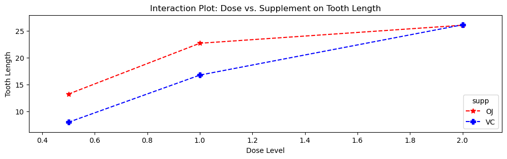

# 이원배치 분산분석: 교호작용 효과

## 1. 이원배치 분산분석의 수행 절차

[kor|](https://www.youtube.com/watch?v=i4NHIGvTB-g) [eng|](https://www.youtube.com/playlist?list=PLWtoq-EhUJe2TjJYfZUQtuq7a0dQCnOWp) [wiki|](https://en.wikipedia.org/wiki/Two-way_analysis_of_variance)

### 1단계: 가설 세우기

- **주효과 A**에 대해:
    - $H_0: \mu^A_1=\mu^A_2=\cdots=\mu^A_a$
    - $H_A$: 요인 A의 수준 사이에서 적어도 한 평균이 다르다.
- **주효과 B**에 대해:
    - $H_0: \mu^B_1=\mu^B_2=\cdots=\mu^B_b$
    - $H_A$: 요인 B의 수준 사이에서 적어도 한 평균이 다르다.
- **교호작용 효과 (A × B)**에 대해:
    - 모든 $i$, $j$에 대해 $H_0: (\mu_{ij} - \mu_{i\cdot} - \mu_{\cdot j} + \mu_{\cdot \cdot}) = 0$
    - $H_A$: 요인 A와 요인 B 사이에 교호작용이 있다.

여기서 $\mu_{ij}$는 요인 A의 수준 $i$와 요인 B의 수준 $j$에서의 평균, $\mu_{i\cdot}$는 수준 $i$에서 요인 A의 주변평균, $\mu_{\cdot j}$는 수준 $j$에서 요인 B의 주변평균, $\mu_{\cdot \cdot}$는 전체 평균이다.

### 2단계: 전체 평균과 집단 평균 계산

$$ \bar{y}_{\cdot\cdot\cdot} = \frac{1}{abc}\sum_{i=1}^{a}\sum_{j=1}^{b}\sum_{k=1}^{c} y_{ijk} $$

$$\begin{array}{lll}
\bar{y}_{i\cdot\cdot}&=&\displaystyle \frac{1}{bc}\sum_{j=1}^{b}\sum_{k=1}^{c} y_{ijk}\\
\bar{y}_{\cdot j\cdot}&=&\displaystyle \frac{1}{ac}\sum_{i=1}^{a}\sum_{k=1}^{c} y_{ijk}\\
\bar{y}_{i j\cdot}&=&\displaystyle \frac{1}{c}\sum_{k=1}^{c} y_{ijk}\\
\end{array}$$

### 3단계: 총제곱합 SST 계산

$$SST =\sum_{i=1}^{a}\sum_{j=1}^{b}\sum_{k=1}^{c} \left( y_{ijk} - \bar{y}_{\cdot\cdot\cdot} \right)^2$$

### 4단계: SSA와 SSB 계산

$$\begin{array}{lll}
SSA&=&\displaystyle \sum_{i=1}^{a} bc \left( \bar{y}_{i\cdot\cdot} - \bar{y}_{\cdot\cdot\cdot} \right)^2\\
SSB&=&\displaystyle \sum_{j=1}^{b} ac \left( \bar{y}_{\cdot j\cdot} - \bar{y}_{\cdot\cdot\cdot} \right)^2\\
\end{array}$$

### 5단계: 교호작용 변동 SSAB 계산

$$SSAB = \sum_{i=1}^{a} \sum_{j=1}^{b} c \left( \bar{y}_{ij\cdot} - \bar{y}_{i\cdot\cdot} - \bar{y}_{\cdot j\cdot} + \bar{y}_{\cdot\cdot\cdot} \right)^2$$

### 6단계: 잔차 변동 SSE 계산

$$SSE = \sum_{i=1}^{a} \sum_{j=1}^{b} \sum_{k=1}^{c} \left( y_{ijk} - \bar{y}_{ij\cdot} \right)^2$$

### 7단계: 분해 확인

$$SST = SSA + SSB + SSAB + SSE$$

### 8단계: F-통계량 계산

$$\begin{array}{cccccccccc}
\text{요인}&\text{df}&SS&MS&F&H_0&H_0\text{ 아래 표본분포}\\
\hline
\text{요인 A}&a-1&SSA&MSA=\frac{SSA}{a-1}&F_A=\frac{MSA}{MSE}&\text{모든 }\beta^{(1)}_{i}=0&F_A\sim F_{a-1,ab(c-1)}\\
\text{요인 B}&b-1&SSB&MSB=\frac{SSB}{b-1}&F_B=\frac{MSB}{MSE}&\text{모든 }\beta^{(2)}_{j}=0&F_B\sim F_{b-1,ab(c-1)}\\
\text{교호작용}&(a-1)(b-1)&SSAB&MSAB=\frac{SSAB}{(a-1)(b-1)}&F_{AB}=\frac{MSAB}{MSE}&\text{모든 }\beta_{ij}=0&F_{AB}\sim F_{(a-1)(b-1),ab(c-1)}\\
\text{오차}&ab(c-1)&SSE&MSE=\frac{SSE}{ab(c-1)}&\\
\hline
\text{전체}&abc-1&SST&&\\
\end{array}$$

### 9단계: 임계값 또는 p-값 구하기

F-통계량을 F-분포표의 임계값과 비교하거나 p-값을 쓴다.

### 10단계: 판정

주효과나 교호작용의 F-통계량이 임계값보다 크면(또는 p-값이 선택한 유의수준보다 작으면) 그 효과에 대한 귀무가설을 기각한다.

## 2. 이원배치 분산분석 패키지

### statsmodels: 교호작용 그림과 분산분석

```python
import matplotlib.pyplot as plt
import pandas as pd
from statsmodels.formula.api import ols
from statsmodels.stats.anova import anova_lm
from statsmodels.graphics.factorplots import interaction_plot

def load_data():
    url = 'https://raw.githubusercontent.com/vincentarelbundock/Rdatasets/master/csv/datasets/ToothGrowth.csv'
    df = pd.read_csv(url, usecols=[1, 2, 3])
    return df

def plot_interaction(df):
    fig, ax = plt.subplots(figsize=(12, 3))
    interaction_plot(df.dose, df.supp, df.len,
                     colors=['red', 'blue'],
                     markers=['*', 'P'],
                     markersize=7, ax=ax,
                     legendloc='lower right',
                     linestyles=["--", "--"])
    ax.set_title("Interaction Plot: Dose vs. Supplement on Tooth Length")
    ax.set_xlabel("Dose Level")
    ax.set_ylabel("Tooth Length")
    plt.show()

def perform_two_way_anova(df):
    model = ols('len ~ C(supp) + C(dose) + C(supp):C(dose)', data=df).fit()
    anova_results = anova_lm(model)
    print("\nTwo-Way ANOVA Results:")
    print(anova_results)

df = load_data()
plot_interaction(df)
perform_two_way_anova(df)
```

출력:

```

Two-Way ANOVA Results:
                   df       sum_sq      mean_sq          F        PR(>F)
C(supp)           1.0   205.350000   205.350000  15.571979  2.311828e-04
C(dose)           2.0  2426.434333  1213.217167  91.999965  4.046291e-18
C(supp):C(dose)   2.0   108.319000    54.159500   4.106991  2.186027e-02
Residual         54.0   712.106000    13.187148        NaN           NaN
```



### 출력 해석

**교호작용 그림**: 용량이 0.5에서 2.0으로 커질수록 두 보충제 모두에서 치아 길이가 대체로 늘어난다. 낮은 용량(0.5와 1.0)에서는 "OJ"가 "VC"보다 뚜렷하게 긴 치아 길이를 낳는다. 가장 높은 용량(2.0)에서는 그 차이가 훨씬 작다. 두 선이 평행하지 않다는 점이 **교호작용 효과**의 가능성을 시사한다.

**분산분석 결과표**:

| 항               | df  | sum_sq    | mean_sq   | F          | PR(>F)         |
|--------------------|-----|-----------|-----------|------------|----------------|
| **C(supp)**        | 1.0 | 205.350   | 205.350   | 15.572     | 2.31e-04       |
| **C(dose)**        | 2.0 | 2426.434  | 1213.217  | 91.999     | 4.05e-18       |
| **C(supp):C(dose)**| 2.0 | 108.319   | 54.160    | 4.107      | 2.19e-02       |
| **Residual**       | 54.0| 712.106   | 13.187    | NaN        | NaN            |

**보충제 종류**와 **용량 수준** 모두 치아 길이에 통계적으로 유의한 효과를 갖는다. 둘 사이의 교호작용도 유의하여, 각 보충제의 효과가 용량 수준에 따라 달라짐을 시사한다.

### Tukey의 HSD를 이용한 사후검정

```python
from statsmodels.stats.multicomp import pairwise_tukeyhsd

# Step 1: Two-Way ANOVA
url = 'https://raw.githubusercontent.com/vincentarelbundock/Rdatasets/master/csv/datasets/ToothGrowth.csv'
df = pd.read_csv(url, usecols=[1, 2, 3])
model = ols('len ~ C(supp) + C(dose) + C(supp):C(dose)', data=df).fit()
anova_results = anova_lm(model)
print(anova_results, end="\n\n")

# Step 2: Tukey's HSD for Main Effects
tukey_dose = pairwise_tukeyhsd(endog=df['len'], groups=df['dose'], alpha=0.05)
print(tukey_dose, end="\n\n")

tukey_supp = pairwise_tukeyhsd(endog=df['len'], groups=df['supp'], alpha=0.05)
print(tukey_supp, end="\n\n")

# Step 3: 교호작용에 대한 사후검정
# 두 요인을 붙여 하나의 요인으로 만든다. 수준이 2 x 3 = 6개가 되고
# 비교는 15쌍으로 늘어난다. 그만큼 Tukey의 보정도 커진다.
df['supp_dose'] = df['supp'].astype(str) + "_" + df['dose'].astype(str)
tukey_interaction = pairwise_tukeyhsd(endog=df['len'], groups=df['supp_dose'], alpha=0.05)
print(tukey_interaction, end="\n\n")
```

출력:

```
                   df       sum_sq      mean_sq          F        PR(>F)
C(supp)           1.0   205.350000   205.350000  15.571979  2.311828e-04
C(dose)           2.0  2426.434333  1213.217167  91.999965  4.046291e-18
C(supp):C(dose)   2.0   108.319000    54.159500   4.106991  2.186027e-02
Residual         54.0   712.106000    13.187148        NaN           NaN

Multiple Comparison of Means - Tukey HSD, FWER=0.05
===================================================
group1 group2 meandiff p-adj  lower   upper  reject
---------------------------------------------------
   0.5    1.0     9.13   0.0  5.9018 12.3582   True
   0.5    2.0   15.495   0.0 12.2668 18.7232   True
   1.0    2.0    6.365   0.0  3.1368  9.5932   True
---------------------------------------------------

Multiple Comparison of Means - Tukey HSD, FWER=0.05
=================================================
group1 group2 meandiff p-adj  lower  upper reject
-------------------------------------------------
    OJ     VC     -3.7 0.0604 -7.567 0.167  False
-------------------------------------------------

 Multiple Comparison of Means - Tukey HSD, FWER=0.05  
======================================================
group1 group2 meandiff p-adj   lower    upper   reject
------------------------------------------------------
OJ_0.5 OJ_1.0     9.47    0.0   4.6719  14.2681   True
OJ_0.5 OJ_2.0    12.83    0.0   8.0319  17.6281   True
OJ_0.5 VC_0.5    -5.25 0.0243 -10.0481  -0.4519   True
OJ_0.5 VC_1.0     3.54  0.264  -1.2581   8.3381  False
OJ_0.5 VC_2.0    12.91    0.0   8.1119  17.7081   True
OJ_1.0 OJ_2.0     3.36 0.3187  -1.4381   8.1581  False
OJ_1.0 VC_0.5   -14.72    0.0 -19.5181  -9.9219   True
OJ_1.0 VC_1.0    -5.93 0.0074 -10.7281  -1.1319   True
OJ_1.0 VC_2.0     3.44 0.2936  -1.3581   8.2381  False
OJ_2.0 VC_0.5   -18.08    0.0 -22.8781 -13.2819   True
OJ_2.0 VC_1.0    -9.29    0.0 -14.0881  -4.4919   True
OJ_2.0 VC_2.0     0.08    1.0  -4.7181   4.8781  False
VC_0.5 VC_1.0     8.79    0.0   3.9919  13.5881   True
VC_0.5 VC_2.0    18.16    0.0  13.3619  22.9581   True
VC_1.0 VC_2.0     9.37    0.0   4.5719  14.1681   True
------------------------------------------------------
```

세 표를 함께 읽어야 한다.

- **용량**의 주효과: 세 수준이 서로 모두 유의하게 다르다. 용량이 오를수록 치아가 길어진다.
- **보충제**의 주효과: OJ와 VC의 차이가 $p = 0.060$으로 유의하지 않다. 그런데 분산분석표의 `C(supp)`는 $p = 0.00023$으로 강하게 유의하다. 모순처럼 보이지만 그렇지 않다. 분산분석은 용량을 모형에 넣은 채 보충제의 효과를 보는 반면, 여기 Tukey는 용량을 무시하고 OJ와 VC를 통째로 비교한다. 용량이 만들어 내는 큰 변동이 잡음으로 남아 차이를 덮는다.
- **교호작용**: 마지막 표의 `OJ_2.0 VC_2.0` 행을 보라. 평균 차이가 0.08이고 $p = 1.0$이다. 용량 2.0에서는 두 보충제가 사실상 같다. 반면 용량 0.5에서는 차이가 $-5.25$($p = 0.024$)로 유의하다. **보충제의 효과가 용량에 따라 달라진다**는 것이 곧 교호작용이며, 분산분석표의 $p = 0.022$가 이를 뒷받침한다.

**교호작용 사후검정의 핵심 결과**: 낮은 용량에서는 OJ가 VC보다 유의하게 긴 치아 성장을 낳는 경향이 있다. 가장 높은 용량(2.0)에서는 두 보충제의 효과가 비슷하다(OJ_2.0 대 VC_2.0: 평균차 = 0.08, p = 1.0).

## 3. 예제: 교수법과 학습시간에 따른 시험 점수

### 문제

시험 점수에 영향을 주는 두 요인: 전통식과 온라인 수준을 갖는 **요인 A(교수법)**, 1시간과 2시간 수준을 갖는 **요인 B(학습시간)**.

| 교수법 | 학습시간 | 점수 1 | 점수 2 | 평균 |
|-----------------|------------|---------|---------|---------|
| 전통식     | 1시간     | 60      | 62      | 61      |
| 전통식     | 2시간    | 68      | 70      | 69      |
| 온라인          | 1시간     | 65      | 63      | 64      |
| 온라인          | 2시간    | 72      | 74      | 73      |

### 1단계: 전체 평균 계산

$$\bar{X} = \frac{534}{8} = 66.75$$

### 2단계: 요인별 평균과 칸 평균 계산

- 전통식: 65, 온라인: 68.5
- 1시간: 62.5, 2시간: 71
- 칸 평균: 전통식/1시간 = 61, 전통식/2시간 = 69, 온라인/1시간 = 64, 온라인/2시간 = 73

### 3단계: 제곱합 계산

- $SS_{\text{Total}} = 177.5$
- $SS_A = 4 \times ((65 - 66.75)^2 + (68.5 - 66.75)^2) = 24.5$
- $SS_B = 4 \times ((62.5 - 66.75)^2 + (71 - 66.75)^2) = 144.5$
- $SS_{AB} = 0.5$ (각 칸이 0.125씩 기여)
- $SS_E = 177.5 - 24.5 - 144.5 - 0.5 = 8$

### 4단계: 자유도, 평균제곱, F-통계량

| 원천         | SS     | df | MS      | F      | PR(>F)   |
|----------------|--------|----|---------|--------|----------|
| 요인 A       | 24.5   | 1  | 24.5    | 12.25  | 0.024896 |
| 요인 B       | 144.5  | 1  | 144.5   | 72.25  | 0.001051 |
| 교호작용 AB | 0.5    | 1  | 0.5     | 0.25   | 0.643330 |
| 오차          | 8.0    | 4  | 2.0     |        |          |
| 전체          | 177.5  | 7  |         |        |          |

### 해석

- **요인 A(교수법)**: $F_A = 12.25$, $p = 0.0249$로 0.05에서 유의하다. 교수법이 시험 점수에 유의한 효과를 갖는다.
- **요인 B(학습시간)**: $F_B = 72.25$, $p = 0.0011$로 0.01에서 유의하다. 학습시간이 시험 점수에 유의한 효과를 갖는다.
- **교호작용 (A × B)**: $F_{AB} = 0.25$, $p = 0.6433$으로 유의하지 않다. 교수법과 학습시간 사이에 유의한 교호작용이 없다.

### Python 구현

```python
import pandas as pd
from statsmodels.formula.api import ols
from statsmodels.stats.anova import anova_lm

data = {
    'Teaching_Method': ['Traditional', 'Traditional', 'Traditional', 'Traditional',
                        'Online', 'Online', 'Online', 'Online'],
    'Study_Time': ['1 Hour', '1 Hour', '2 Hours', '2 Hours',
                   '1 Hour', '1 Hour', '2 Hours', '2 Hours'],
    'Score': [60, 62, 68, 70, 65, 63, 72, 74]
}
df = pd.DataFrame(data)

model = ols('Score ~ C(Teaching_Method) + C(Study_Time) + C(Teaching_Method):C(Study_Time)', data=df).fit()
anova_results = anova_lm(model)
print("Two-Way ANOVA Results:")
print(anova_results)
```

출력:

```
Two-Way ANOVA Results:
                                   df  sum_sq  mean_sq      F    PR(>F)
C(Teaching_Method)                1.0    24.5     24.5  12.25  0.024896
C(Study_Time)                     1.0   144.5    144.5  72.25  0.001051
C(Teaching_Method):C(Study_Time)  1.0     0.5      0.5   0.25  0.643330
Residual                          4.0     8.0      2.0    NaN       NaN
```

손계산한 표와 정확히 일치한다. 잔차 자유도가 4밖에 안 된다는 점은 눈여겨볼 만하다. 관측값 8개로 모수 4개(전체평균, 두 주효과, 교호작용)를 추정했기 때문이다. 이렇게 자유도가 작으면 F-검정의 검정력이 매우 낮아, 교호작용의 $p = 0.64$를 "교호작용이 없다"는 증거로 읽으면 안 된다.

### R 코드

```r
# Load necessary libraries
library(dplyr)
library(stats)

data <- data.frame(
  Teaching_Method = factor(c('Traditional', 'Traditional', 'Traditional', 'Traditional',
                             'Online', 'Online', 'Online', 'Online')),
  Study_Time = factor(c('1 Hour', '1 Hour', '2 Hours', '2 Hours',
                        '1 Hour', '1 Hour', '2 Hours', '2 Hours')),
  Score = c(60, 62, 68, 70, 65, 63, 72, 74)
)

model <- aov(Score ~ Teaching_Method + Study_Time + Teaching_Method:Study_Time, data = data)
anova_results <- summary(model)
print("Two-Way ANOVA Results:")
print(anova_results)
```

### R 출력 해석

R 출력은 Df, Sum Sq, Mean Sq, F value, Pr(>F) 열을 가진 동일한 분산분석표를 준다. 유의성 표시(`*`는 p < 0.05, `**`는 p < 0.01)가 다음을 확인해 준다:

- `Teaching_Method`와 `Study_Time` 모두 `Score`에 통계적으로 유의한 주효과를 갖는다.
- `Teaching_Method`와 `Study_Time` 사이의 교호작용은 통계적으로 유의하지 않으므로, 교수법이 점수에 미치는 효과가 학습시간에 의존하지 않음을 시사한다.

## 연습문제

**연습문제 1.**
이원배치 분산분석 모형 $Y_{ijk} = \mu + \alpha_i + \beta_j + (\alpha\beta)_{ij} + \varepsilon_{ijk}$에서 교호작용 항 $(\alpha\beta)_{ij}$가 무엇을 나타내는지 말로 설명하라. 교육 맥락에서 유의한 교호작용이 예상되는 구체적인 예를 들어라.

??? success "풀이"
    교호작용 항 $(\alpha\beta)_{ij}$는 요인 A가 수준 $i$이고 요인 B가 수준 $j$일 때, 주효과 $\alpha_i$와 $\beta_j$만으로 예측되는 것을 넘어서 반응에 추가로 나타나는 효과를 담는다. 한 요인의 효과가 다른 요인의 수준에 얼마나 의존하는지를 잰다.

    **예:** 요인 A가 교수법(강의식 대 실습식)이고 요인 B가 학생 배경(STEM 대 인문학)이라고 하자. 실습식 교육의 주효과가 전체적으로는 양수일 수 있지만, 인문학 학생보다 STEM 학생에게 훨씬 더 이롭다면 교호작용 항이 유의해진다. 교호작용 그림에서 두 선이 평행하지 않은 것으로 이를 확인할 수 있다.

---

**연습문제 2.**
칸당 반복 $c = 4$인 $2 \times 3$ 요인실험에서 $\text{SSA} = 30$, $\text{SSB} = 80$, $\text{SSAB} = 24$, $\text{SSE} = 60$을 얻었다. 전체 분산분석표를 작성하고 $\alpha = 0.05$에서 세 효과를 모두 검정하라.

??? success "풀이"
    자유도: $a - 1 = 1$, $b - 1 = 2$, $(a-1)(b-1) = 2$, $ab(c-1) = 6 \times 3 = 18$.

    | 원천 | SS | df | MS | F |
    |--------|-----|-----|-------|-------|
    | 요인 A | 30 | 1 | 30.0 | 9.00 |
    | 요인 B | 80 | 2 | 40.0 | 12.00 |
    | 교호작용 | 24 | 2 | 12.0 | 3.60 |
    | 오차 | 60 | 18 | 3.333 | |
    | 전체 | 194 | 23 | | |

    $\alpha = 0.05$에서 임계값: $F_{0.05, 1, 18} \approx 4.41$, $F_{0.05, 2, 18} \approx 3.55$.

    - **요인 A:** $F = 9.00 > 4.41$이므로 $H_0$을 기각한다. 주효과가 유의하다.
    - **요인 B:** $F = 12.00 > 3.55$이므로 $H_0$을 기각한다. 주효과가 유의하다.
    - **교호작용:** $F = 3.60 > 3.55$이므로 $H_0$을 기각한다. 교호작용이 (아슬아슬하게) 유의하다.

---

**연습문제 3.**
치아 성장 자료(보충제 종류 OJ 대 VC, 용량 0.5, 1.0, 2.0)에서 교호작용 그림은 낮은 용량에서 OJ가 VC보다 긴 치아 길이를 낳지만 용량 2.0에서는 둘이 수렴함을 보여준다. 유의한 교호작용을 함께 고려하지 않고 보충제 종류의 주효과만 해석해서는 안 되는 이유를 설명하라.

??? success "풀이"
    유의한 교호작용이 있으면 한 요인의 효과가 다른 요인의 수준에 의존하므로 주효과가 오도한다. OJ가 평균적으로 더 큰 치아 성장을 낳는다고(주효과) 보고하면, 그 우위가 가장 높은 용량에서는 사라진다는 사실을 무시하는 것이다. 용량 2.0에서는 두 보충제의 효과가 같으므로 보충제 종류의 주효과는 전적으로 낮은 용량 수준에서 나온다. 올바른 해석에는 단순 효과, 즉 각 용량 수준에서 보충제의 효과를 따로 살피는 일이 필요하다.

---

**연습문제 4.**
반복 없는 이원배치 분산분석과 반복 있는 경우의 차이를 설명하라. 반복이 없을 때 교호작용 제곱합이 오차항과 교란되는 이유는 무엇인가?

??? success "풀이"
    **반복 있는** 이원배치 분산분석에서는 각 요인 수준 조합에 관측값이 여럿 있어 전체 변동을 $\text{SSA} + \text{SSB} + \text{SSAB} + \text{SSE}$로 분해할 수 있다. 칸 내 변동이 오차($\text{SSE}$)의 독립적인 추정값을 준다.

    **반복 없는** 이원배치 분산분석에서는 각 칸에 관측값이 하나뿐이다. 칸당 관측값이 하나면 $\text{SSE}$를 따로 추정할 칸 내 변동이 없다. 그래서 잔차인 $\text{SSAB}$가 오차항 역할을 하게 되고, 교호작용 효과를 독립적으로 검정할 수 없다. 참 교호작용이 있으면 오차에 흡수되어 교호작용을 가리는 동시에 오차분산을 부풀릴 수 있다.
