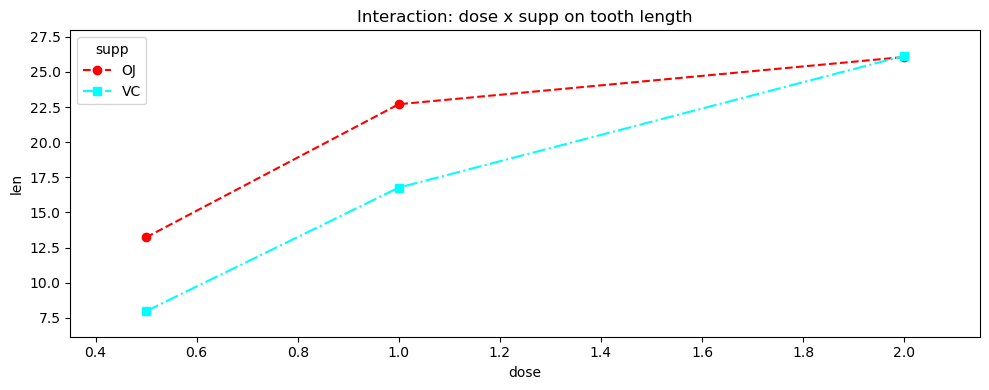

# 교호작용 효과 그림

## 개요

교호작용 그림은 요인 설계에서 한 요인의 효과가 다른 요인의 수준에 의존하는지 진단하는 대표적인 시각 도구이다. 그림의 선들이 평행하면 교호작용이 없고, 평행하지 않으면 교호작용이 있다. 이 페이지에서는 두 요인이 보충제 종류(OJ, VC)와 용량 수준(0.5, 1.0, 2.0)인 ToothGrowth 자료로 교호작용 그림을 그리고 해석하는 방법을 설명한다.

## 교호작용이란

이원배치 요인 모형

$$
y_{ijk} = \mu + \alpha_i + \beta_j + (\alpha\beta)_{ij} + \varepsilon_{ijk}
$$

에서 교호작용 항 $(\alpha\beta)_{ij}$는 요인 $A$와 $B$의 결합 효과가 각각의 개별 효과의 합과 얼마나 다른지를 담는다. 형식적으로 교호작용이 없다는 것은

$$
(\alpha\beta)_{ij} = 0 \quad \text{for all } i, j
$$

이고, 이는 칸 평균을 $\mu_{ij} = \mu + \alpha_i + \beta_j$(순수하게 가법적인 모형)로 쓸 수 있다는 말과 같다.

## 그림 그리기

교호작용 그림은 다음을 보여준다:

- **가로축:** 한 요인의 수준(예: 용량).
- **세로축:** 반응의 칸 평균(예: 평균 치아 길이).
- **별도의 선:** 두 번째 요인의 각 수준마다 하나씩(예: 보충제 종류).

<div class="codebox" markdown>

**예제 1.** 교호작용 그림 그리기

```python
import pandas as pd
import matplotlib.pyplot as plt
from statsmodels.graphics.factorplots import interaction_plot

url = ('https://raw.githubusercontent.com/vincentarelbundock/'
       'Rdatasets/master/csv/datasets/ToothGrowth.csv')
df = pd.read_csv(url, usecols=[1, 2, 3])

# 가로축이 한 요인, 선의 색이 다른 요인, 세로축이 반응의 평균이다.
# 두 선이 평행이면 교호작용이 없고, 벌어지거나 엇갈리면 있는 것이다.
fig, ax = plt.subplots(figsize=(10, 4))
interaction_plot(df['dose'], df['supp'], df['len'],
                 ax=ax, markers=['o', 's'], linestyles=['--', '-.'])
ax.set_title("Interaction: dose x supp on tooth length")
ax.set_xlabel("dose")
ax.set_ylabel("len")
plt.tight_layout()
plt.show()
```



</div>

두 선이 모두 오른쪽 위로 향하지만 기울기가 다르다. VC(점선)가 더 가파르게 올라 용량 2.0에서 OJ를 따라잡는다. 용량 0.5와 1.0에서는 OJ가 위에 있다가 2.0에서 두 점이 거의 겹친다.

선이 **교차하지는 않으므로** 순서형 교호작용이다. 어느 용량에서도 VC가 OJ보다 낫지는 않고, 다만 우위의 크기가 줄어들 뿐이다.

## 그림 읽기

| 패턴 | 해석 |
|---|---|
| 평행한 선 | 교호작용 없음. 용량의 효과가 두 보충제에서 같다 |
| 평행하지 않은 선(수렴/발산) | 순서형 교호작용. 효과의 방향은 같고 크기가 다르다 |
| 교차하는 선 | 비순서형(교차) 교호작용. 효과의 방향이 뒤집힌다 |

ToothGrowth 자료에서는 OJ와 VC의 선이 용량 2.0에서 수렴하여 **순서형 교호작용**을 나타낸다. 두 보충제 모두 용량과 함께 치아 길이를 늘리지만, VC에 대한 OJ의 우위가 가장 높은 용량에서 줄어든다.

## 교호작용의 수치화

각 요인의 특정 두 수준에 대한 교호작용 대비는

$$
\psi = (\mu_{11} - \mu_{12}) - (\mu_{21} - \mu_{22})
$$

이다. $\psi = 0$이면 $A$의 수준 사이 차이가 $B$의 두 수준에서 같다(선이 평행하다). 이원배치 분산분석의 형식적 교호작용 $F$-검정은 $H_0: \text{모든 } (\alpha\beta)_{ij} = 0$을 동시에 검정한다.

## 해석

- **평행한 선**은 두 요인이 독립적으로 작동함을 뜻한다. 주효과를 그 자체로 해석할 수 있다.
- **평행하지 않은 선**은 한 요인의 효과가 다른 요인의 수준에 따라 달라짐을 뜻한다. 질적으로 다른 효과들을 평균 내므로 주효과 평균이 오도할 수 있다.
- **교차하는 선**은 요인 수준의 순위가 뒤집히는 특히 강한 교호작용을 나타낸다. 이런 경우 주효과만 보고하면 적극적으로 오도하게 된다.
- 교호작용 그림은 시각적 안내이다. 언제나 이원배치 분산분석표의 형식적 교호작용 $F$-검정으로 확인하라.

## 연습문제

<div class="drillbox" markdown>

**연습문제 1.** <span class="diff easy" title="쉬움"></span>
다음은 $2 \times 3$ 요인 설계의 칸 평균이다. 교호작용 그림을 그려 보고 교호작용이 순서형인지 비순서형인지 판정하라.

| | $B_1$ | $B_2$ | $B_3$ |
|---|---|---|---|
| $A_1$ | 5 | 10 | 15 |
| $A_2$ | 8 | 10 | 12 |

</div>

??? success "풀이"
    가로축에 $B$의 수준(1, 2, 3), 세로축에 칸 평균을 둔다.

    - $A_1$의 선: 5, 10, 15($B$ 한 단위당 기울기 5).
    - $A_2$의 선: 8, 10, 12($B$ 한 단위당 기울기 2).

    두 선은 $B_2$에서 만난다($B_1$에서는 $A_1$이 아래에 있지만 $B_3$에서는 위로 올라선다). $B$의 수준에 따라 $A_1$과 $A_2$의 순위가 뒤집히므로 **비순서형(교차) 교호작용**이다.

<div class="drillbox" markdown>

**연습문제 2.** <span class="diff med" title="중간"></span>
$2 \times 2$ 요인 설계에서 교호작용의 자유도가 정확히 1임을 증명하라. 교호작용 제곱합을 네 칸 평균으로 표현하라.

</div>

??? success "풀이"
    $A$의 수준이 $a = 2$개, $B$의 수준이 $b = 2$개이므로 교호작용의 자유도는 $(a-1)(b-1) = 1 \times 1 = 1$이다.

    칸 $(i,j)$의 교호작용 효과는 $(\alpha\beta)_{ij} = \mu_{ij} - \mu_{i\cdot} - \mu_{\cdot j} + \mu_{\cdot\cdot}$이다. 칸당 관측값이 $n$개인 균형 설계에서 교호작용 제곱합은

    $$
    SS_{AB} = n \sum_{i=1}^{2}\sum_{j=1}^{2} (\bar{y}_{ij\cdot} - \bar{y}_{i\cdot\cdot} - \bar{y}_{\cdot j\cdot} + \bar{y}_{\cdot\cdot\cdot})^2
    $$

    이다. 네 항이 각각 $\pm \delta$이고 $\delta = (\bar{y}_{11} - \bar{y}_{12} - \bar{y}_{21} + \bar{y}_{22})/4$이므로

    $$
    SS_{AB} = \frac{n}{4}(\bar{y}_{11} - \bar{y}_{12} - \bar{y}_{21} + \bar{y}_{22})^2
    $$

    이 된다. 제곱된 대비 하나이므로 자유도가 1임이 확인된다. $\square$

<div class="drillbox" markdown>

**연습문제 3.** <span class="diff med" title="중간"></span>
유의한 비순서형 교호작용이 있을 때 주효과를 해석하는 것이 왜 오도할 수 있는지 설명하라. ToothGrowth 예로 예시하라.

</div>

??? success "풀이"
    어떤 요인의 주효과는 다른 요인의 모든 수준에 걸쳐 평균 낸 주변평균의 차이이다. 비순서형 교호작용이 있으면 한 요인의 효과 방향이 다른 요인의 수준에 따라 뒤집히므로, 각 수준에서 효과가 크더라도 평균은 0 근처가 될 수 있다.

    ToothGrowth 맥락에서 (가상으로) OJ가 낮은 용량에서는 VC보다 긴 치아를 낳고 높은 용량에서는 더 짧은 치아를 낳는다고 하자. OJ와 VC의 주변평균이 거의 같아져 보충제의 주효과가 유의하지 않게 나올 수 있다. 그러나 보충제는 분명히 중요하다. 그 효과가 용량에 의존할 뿐이다. "보충제에 유의한 효과가 없다"고 보고하면 오도하게 된다. 올바른 해석은 조건부이다. 낮은 용량에서는 OJ가 낫고 높은 용량에서는 VC가 나으며, 교호작용이 핵심 발견이다.

<div class="drillbox" markdown>

**연습문제 4.** <span class="diff med" title="중간"></span>
어떤 연구자가 교호작용 그림에서 평행하지 않은 선을 관측했지만 분산분석의 교호작용 $F$-검정은 $p = 0.23$을 준다. 어떻게 이런 일이 생기며 연구자는 무엇을 결론지어야 하는가?

</div>

??? success "풀이"
    교호작용 그림에서 평행하지 않은 선은 표집 변동의 영향을 받는 표본 칸 평균을 반영한다. 모집단 수준에서 교호작용이 없어도 무작위 요동 때문에 표본의 선들은 조금씩 평행하지 않게 된다. $F$-검정이 유의하지 않다는 것($p = 0.23$)은 관측된 비평행성이 우연만으로 기대되는 정도와 부합한다는 뜻이다.

    연구자는 선택한 유의수준에서 교호작용의 증거가 충분하지 않다고 결론지어야 한다. 그림의 비평행성은 가법성으로부터의 의미 있는 이탈을 나타내지 않는다. 가능한 이유는 (1) 실제로 교호작용이 없거나, (2) 실재하지만 약한 교호작용을 탐지하기에 표본크기가 작거나(검정력 부족), (3) 교호작용 효과가 존재하나 집단 내 변동에 비해 작기 때문이다. 연구자는 $p$-값에만 의존하지 말고 교호작용 대비의 효과크기와 신뢰구간을 함께 보고하는 편이 좋다.

<div class="drillbox" markdown>

**연습문제 5.** <span class="diff med" title="중간"></span>
$2 \times 2$ 교호작용 그림에서 선이 정확히 평행할 조건을 유도하라. 칸 평균 $\mu_{11}, \mu_{12}, \mu_{21}, \mu_{22}$에서 시작하여 대수적 조건을 보여라.

</div>

??? success "풀이"
    교호작용 그림의 가로축에 요인 $B$의 수준 $B_1$, $B_2$를 두고 $A_1$과 $A_2$에 대해 각각 선을 그린다.

    - $A_1$의 선: 점 $(B_1, \mu_{11})$과 $(B_2, \mu_{12})$를 지나며 기울기는 $\mu_{12} - \mu_{11}$.
    - $A_2$의 선: 점 $(B_1, \mu_{21})$과 $(B_2, \mu_{22})$를 지나며 기울기는 $\mu_{22} - \mu_{21}$.

    두 선이 평행할 필요충분조건은 기울기가 같은 것이다:

    $$
    \mu_{12} - \mu_{11} = \mu_{22} - \mu_{21}
    $$

    정리하면

    $$
    \mu_{11} - \mu_{12} - \mu_{21} + \mu_{22} = 0
    $$

    이다. 이것이 바로 $2 \times 2$의 경우 모든 $i, j$에 대한 $(\alpha\beta)_{ij} = 0$ 조건이다. 동등하게 교호작용 대비 $\psi = \mu_{11} - \mu_{12} - \mu_{21} + \mu_{22}$가 0이라는 뜻이며, 이것이 $2 \times 2$ 설계에서 자유도 1인 교호작용이다. $\square$

---

## 정리하며

교호작용 그림은 **선의 평행 여부**로 읽는다.

- **평행하면 교호작용이 없다.** 한 요인의 효과가 다른 요인의 수준과 무관하다는 뜻이며, 두 선의 간격이 일정하게 유지된다.
- **평행하지 않으면 교호작용이 있다.** 간격이 벌어지거나 좁아지면 **크기의 교호작용**, 선이 교차하면 **방향까지 뒤집히는 교호작용**이다. 후자가 해석상 더 중요하다.
- **눈으로 본 비평행은 표집변동일 수 있다.** 그림만으로 판단하지 말고 $F$ 검정과 함께 보아야 하며, 반대로 유의한 교호작용도 그림 없이는 **어떻게** 다른지 알 수 없다.
- **축을 바꿔 두 번 그려 보는 것이 좋다.** 어느 요인을 가로축에 두느냐에 따라 읽히는 이야기가 달라진다.
- **오차막대를 함께 그린다.** 선이 갈라져 보여도 불확실성이 크면 결론을 내기 어렵다.

다음 절부터 **사후비교**로 넘어간다. $F$ 검정이 기각한 뒤 어느 집단이 다른지 찾는 방법들이다.
