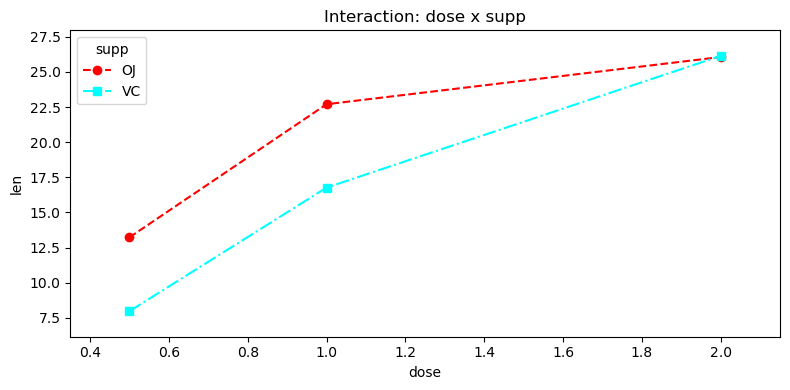

# 이원배치 분산분석 파이프라인

## 개요

이원배치 분산분석은 일원배치 설계를 확장하여 두 요인의 효과와 그 교호작용이 연속형 반응에 미치는 영향을 동시에 살핀다. 이 페이지는 ToothGrowth 자료로 완전한 파이프라인을 따라간다. 이원배치 분산분석(제II형) 적합, 각 주효과와 교호작용에 대한 Tukey HSD 사후검정, 교호작용 그림 작성. 두 요인은 보충제 종류(OJ 대 VC)와 용량 수준(0.5, 1.0, 2.0)이다.

## 이원배치 분산분석 모형

수준이 $a$개인 요인 $A$와 수준이 $b$개인 요인 $B$에 대한 칸 평균 모형은

$$
y_{ijk} = \mu + \alpha_i + \beta_j + (\alpha\beta)_{ij} + \varepsilon_{ijk}
$$

이며 $\alpha_i$는 요인 $A$의 주효과, $\beta_j$는 요인 $B$의 주효과, $(\alpha\beta)_{ij}$는 교호작용 효과, $\varepsilon_{ijk} \sim N(0, \sigma^2)$이다.

제II형 분산분석표는 세 가지 귀무가설을 검정한다:

| 원천 | $H_0$ | $df$ |
|---|---|---|
| 요인 $A$ | 모든 $\alpha_i = 0$ | $a - 1$ |
| 요인 $B$ | 모든 $\beta_j = 0$ | $b - 1$ |
| $A \times B$ | 모든 $(\alpha\beta)_{ij} = 0$ | $(a-1)(b-1)$ |
| 잔차 | | $N - ab$ |

## 1단계: 모형 적합

```python
import pandas as pd
from statsmodels.formula.api import ols
from statsmodels.stats.anova import anova_lm

url = ('https://raw.githubusercontent.com/vincentarelbundock/'
       'Rdatasets/master/csv/datasets/ToothGrowth.csv')
df = pd.read_csv(url, usecols=[1, 2, 3])

model = ols('len ~ C(supp) + C(dose) + C(supp):C(dose)', data=df).fit()
# typ=2를 명시한다. statsmodels의 기본값은 typ=1(순차적 제곱합)이라
# 모형에 넣는 항의 **순서에 따라 결과가 달라진다**. 균형 설계에서는
# 세 유형이 모두 같지만, 불균형이면 갈린다.
aov2 = anova_lm(model, typ=2)
print(aov2)
```

출력:

```
                      sum_sq    df          F        PR(>F)
C(supp)           205.350000   1.0  15.571979  2.311828e-04
C(dose)          2426.434333   2.0  91.999965  4.046291e-18
C(supp):C(dose)   108.319000   2.0   4.106991  2.186027e-02
Residual          712.106000  54.0        NaN           NaN
```

용량의 효과가 압도적이고($F = 92$), 보충제의 효과와 교호작용도 유의하다. 교호작용이 유의하다는 것은 주효과를 따로 해석하기 전에 조심해야 한다는 신호다. "OJ가 VC보다 낫다"는 말이 용량마다 다르게 성립하기 때문이다.

제II형 제곱합은 각 주효과를 다른 주효과로 조정하되 교호작용은 무시하고 검정한다. 설계가 균형이거나 거의 균형일 때 권장된다.

## 2단계: 주효과에 대한 Tukey HSD

사후검정은 한 요인의 어느 수준이 다른지 찾아낸다. 각 주효과에 대해 Tukey HSD를 따로 수행한다.

```python
from statsmodels.stats.multicomp import pairwise_tukeyhsd

print(pairwise_tukeyhsd(endog=df['len'], groups=df['dose'], alpha=0.05))
print(pairwise_tukeyhsd(endog=df['len'], groups=df['supp'], alpha=0.05))
```

출력:

```
Multiple Comparison of Means - Tukey HSD, FWER=0.05
===================================================
group1 group2 meandiff p-adj  lower   upper  reject
---------------------------------------------------
   0.5    1.0     9.13   0.0  5.9018 12.3582   True
   0.5    2.0   15.495   0.0 12.2668 18.7232   True
   1.0    2.0    6.365   0.0  3.1368  9.5932   True
---------------------------------------------------
Multiple Comparison of Means - Tukey HSD, FWER=0.05
=================================================
group1 group2 meandiff p-adj  lower  upper reject
-------------------------------------------------
    OJ     VC     -3.7 0.0604 -7.567 0.167  False
-------------------------------------------------
```

용량은 세 수준이 서로 모두 다르다. 반면 보충제는 $p = 0.060$으로 유의하지 않게 나오는데, 분산분석표의 $p = 0.00023$과 어긋나 보인다.

모순이 아니다. 분산분석은 용량을 모형에 넣은 채 보충제 효과를 보지만, 이 Tukey는 용량을 무시하고 OJ 30개와 VC 30개를 통째로 비교한다. 용량이 만드는 큰 변동이 잡음으로 남아 보충제의 차이를 덮는 것이다. **주효과의 사후검정은 다른 요인을 무시한다**는 점을 잊으면 이런 표를 잘못 읽게 된다.

## 3단계: 교호작용에 대한 Tukey HSD

$a \times b$개의 칸 평균을 모두 비교하려면 결합 집단 변수를 만들어 교호작용 칸에 Tukey HSD를 수행한다.

```python
df['supp_dose'] = df['supp'].astype(str) + "_" + df['dose'].astype(str)
print(pairwise_tukeyhsd(endog=df['len'], groups=df['supp_dose'], alpha=0.05))
```

출력:

```
 Multiple Comparison of Means - Tukey HSD, FWER=0.05  
======================================================
group1 group2 meandiff p-adj   lower    upper   reject
------------------------------------------------------
OJ_0.5 OJ_1.0     9.47    0.0   4.6719  14.2681   True
OJ_0.5 OJ_2.0    12.83    0.0   8.0319  17.6281   True
OJ_0.5 VC_0.5    -5.25 0.0243 -10.0481  -0.4519   True
OJ_0.5 VC_1.0     3.54  0.264  -1.2581   8.3381  False
OJ_0.5 VC_2.0    12.91    0.0   8.1119  17.7081   True
OJ_1.0 OJ_2.0     3.36 0.3187  -1.4381   8.1581  False
OJ_1.0 VC_0.5   -14.72    0.0 -19.5181  -9.9219   True
OJ_1.0 VC_1.0    -5.93 0.0074 -10.7281  -1.1319   True
OJ_1.0 VC_2.0     3.44 0.2936  -1.3581   8.2381  False
OJ_2.0 VC_0.5   -18.08    0.0 -22.8781 -13.2819   True
OJ_2.0 VC_1.0    -9.29    0.0 -14.0881  -4.4919   True
OJ_2.0 VC_2.0     0.08    1.0  -4.7181   4.8781  False
VC_0.5 VC_1.0     8.79    0.0   3.9919  13.5881   True
VC_0.5 VC_2.0    18.16    0.0  13.3619  22.9581   True
VC_1.0 VC_2.0     9.37    0.0   4.5719  14.1681   True
------------------------------------------------------
```

교호작용의 정체가 여기서 드러난다. 같은 용량끼리 비교한 세 줄을 뽑아 보면

| 용량 | OJ − VC | p-adj |
|---|---|---|
| 0.5 | +5.25 | 0.024 |
| 1.0 | +5.93 | 0.007 |
| 2.0 | −0.08 | 1.000 |

낮은 용량에서는 OJ가 5~6만큼 앞서지만 용량 2.0에서는 차이가 사실상 사라진다. 이것이 교호작용 항이 유의했던 이유다.

칸이 $a \times b = 2 \times 3 = 6$개이므로 쌍별 비교는 $\binom{6}{2} = 15$개이다. Tukey 절차는 이 15개 전체에 걸쳐 가족단위 오류율을 동시에 통제한다.

## 4단계: 교호작용 그림

교호작용 그림은 한 요인을 가로축에 두고 다른 요인의 각 수준을 별도의 선으로 그려 칸 평균을 보여준다. 선이 평행하지 않으면 교호작용을 시사한다.

```python
import matplotlib.pyplot as plt
from statsmodels.graphics.factorplots import interaction_plot

fig, ax = plt.subplots(figsize=(8, 4))
interaction_plot(df['dose'], df['supp'], df['len'], ax=ax,
                 markers=['o', 's'], linestyles=['--', '-.'])
ax.set_title("Interaction: dose x supp")
ax.set_xlabel("dose")
ax.set_ylabel("len")
plt.tight_layout()
plt.show()
```



앞의 표에서 읽은 것이 그림 하나에 담긴다. 두 선이 왼쪽에서는 벌어져 있다가 용량 2.0에서 만난다. 선이 교차하지 않으므로 순서형 교호작용이며, OJ가 VC보다 나쁜 구간은 없다.

## 해석

- **용량의 주효과:** 용량에 대한 분산분석 $p$-값이 작고 Tukey HSD가 유의한 쌍별 차이를 보이면 용량이 클수록 치아 성장이 크다는 뜻이다.
- **보충제의 주효과:** supp의 $p$-값이 유의하면 두 보충제 종류(OJ 대 VC)가 서로 다른 평균 치아 길이를 낳음을 나타낸다.
- **교호작용:** 교호작용이 유의하면 용량의 효과가 보충제 종류에 (또는 그 반대로) 의존한다는 뜻이다. ToothGrowth 자료에서는 용량 2.0에서 OJ와 VC의 결과가 비슷하지만 낮은 용량에서는 다르며, 교호작용 그림에서 선이 수렴하는 모습으로 나타난다.
- **제II형 대 제III형:** 교호작용이 있는 상태에서 주효과를 검정할 사전 이유가 없다면 제II형이 적절하다. 교호작용이 유의하고 설계가 불균형이면 (교호작용을 포함한 다른 모든 효과를 통제하고 각 효과를 검정하는) 제III형이 나을 수 있다.

## 연습문제

<div class="drillbox" markdown>

**연습문제 1.** <span class="diff easy" title="쉬움"></span>
칸당 관측값이 $n = 10$개인 $2 \times 3$ 요인 설계에서 분산분석표의 각 원천별 자유도와 전체 자유도를 진술하라.

</div>

??? success "풀이"
    요인 $A$의 수준이 $a = 2$개, 요인 $B$의 수준이 $b = 3$개, 칸당 $n = 10$이므로 $N = 2 \times 3 \times 10 = 60$이다.

    | 원천 | $df$ |
    |---|---|
    | 요인 $A$ | $a - 1 = 1$ |
    | 요인 $B$ | $b - 1 = 2$ |
    | $A \times B$ | $(a-1)(b-1) = 2$ |
    | 잔차 | $N - ab = 60 - 6 = 54$ |
    | 전체 | $N - 1 = 59$ |

<div class="drillbox" markdown>

**연습문제 2.** <span class="diff med" title="중간"></span>
제I형, 제II형, 제III형 제곱합의 차이를 설명하라. 어떤 조건에서 세 유형이 동일한 결과를 주는가?

</div>

??? success "풀이"

    - **제I형(순차):** 각 효과를 그보다 앞서 들어간 효과들로만 조정하여 검정한다. 결과가 모형의 항 순서에 의존한다.
    - **제II형:** 각 주효과를 다른 주효과로 조정하되 교호작용으로는 조정하지 않고 검정한다. 교호작용은 두 주효과로 조정한 뒤 검정한다.
    - **제III형:** 각 효과를 교호작용을 포함한 다른 모든 효과로 조정하여 검정한다.

    설계가 **균형**(칸 크기가 같음)이고 모형이 완전히 지정되면 세 유형이 동일한 결과를 준다. 균형 설계에서는 제곱합이 직교하므로 항의 입력 순서가 문제되지 않고 다른 항으로 조정해도 달라지지 않는다. 불균형 설계에서는 세 유형이 상당히 다를 수 있다.

<div class="drillbox" markdown>

**연습문제 3.** <span class="diff med" title="중간"></span>
교호작용 그림에서 OJ와 VC의 선이 용량 2.0에서 수렴한다. 이는 교호작용 항에 대해 무엇을 함의하는가? OJ와 VC의 차이가 용량 0.5와 2.0에서 같은지 검정하는 대비를 써라.

</div>

??? success "풀이"
    수렴한다는 것은 용량이 커질수록 보충제의 효과가 줄어든다는 뜻이며, 이는 교호작용의 한 형태이다. OJ–VC 차이가 용량 0.5와 2.0에서 같은지 검정하는 대비는

    $$
    \psi = (\mu_{\text{OJ},0.5} - \mu_{\text{VC},0.5}) - (\mu_{\text{OJ},2.0} - \mu_{\text{VC},2.0})
    $$

    이다. $H_0: \psi = 0$ 아래에서 보충제의 효과가 두 용량에서 같다. 결과가 유의하면 OJ–VC 차이의 크기가 용량 수준에 따라 달라진다는 뜻이며, 이것이 바로 분산분석 모형의 교호작용 항이 담아내는 것이다.

<div class="drillbox" markdown>

**연습문제 4.** <span class="diff med" title="중간"></span>
균형 설계의 이원배치 분산분석에서 총제곱합이

$$
SST = SS_A + SS_B + SS_{AB} + SSE
$$

로 분해됨을 보여라. 이 분해에 필요한 독립성 가정을 진술하라.

</div>

??? success "풀이"
    항등식

    $$
    y_{ijk} - \bar{y}_{\cdot\cdot\cdot} = (\bar{y}_{i\cdot\cdot} - \bar{y}_{\cdot\cdot\cdot}) + (\bar{y}_{\cdot j\cdot} - \bar{y}_{\cdot\cdot\cdot}) + (\bar{y}_{ij\cdot} - \bar{y}_{i\cdot\cdot} - \bar{y}_{\cdot j\cdot} + \bar{y}_{\cdot\cdot\cdot}) + (y_{ijk} - \bar{y}_{ij\cdot})
    $$

    에서 시작한다. 제곱하여 모든 $i, j, k$에 대해 합하면 (균형 설계에서 성립하는) 직교성 덕분에 모든 교차항이 사라져

    $$
    \sum_{i,j,k} (y_{ijk} - \bar{y}_{\cdot\cdot\cdot})^2 = bn\sum_i (\bar{y}_{i\cdot\cdot} - \bar{y}_{\cdot\cdot\cdot})^2 + an\sum_j (\bar{y}_{\cdot j\cdot} - \bar{y}_{\cdot\cdot\cdot})^2 + n\sum_{i,j}(\bar{y}_{ij\cdot} - \bar{y}_{i\cdot\cdot} - \bar{y}_{\cdot j\cdot} + \bar{y}_{\cdot\cdot\cdot})^2 + \sum_{i,j,k}(y_{ijk} - \bar{y}_{ij\cdot})^2
    $$

    가 된다. 즉 $SST = SS_A + SS_B + SS_{AB} + SSE$이다.

    이 분해에는 (1) 균형 설계(칸당 $n$이 같음)와 (2) 오차 $\varepsilon_{ijk}$가 독립이고 공통 분산 $\sigma^2$을 갖는다는 가정이 필요하다. 독립성은 $SSE / \sigma^2 \sim \chi^2_{N-ab}$이고 $SSE$가 $SS_A$, $SS_B$, $SS_{AB}$와 독립임을 보장하며, 이는 $F$-검정이 정확한 $F$-분포를 갖는 데 필요하다. $\square$

<div class="drillbox" markdown>

**연습문제 5.** <span class="diff med" title="중간"></span>
교호작용은 유의한데 한 주효과가 유의하지 않을 때, 여러 교과서가 그 주효과를 해석하지 말라고 경고한다. 구체적인 수치 예로 이유를 설명하라.

</div>

??? success "풀이"
    교호작용이 유의하다는 것은 한 요인의 효과가 다른 요인의 수준에 의존한다는 뜻이다. 이 상황에서 다른 요인의 수준에 걸쳐 평균을 낸 주효과는 어느 집단의 실제 경험도 대표하지 못할 수 있다.

    **예:** 칸 평균이 다음과 같은 $2 \times 2$ 설계를 생각하자:

    | | $B_1$ | $B_2$ |
    |---|---|---|
    | $A_1$ | 10 | 20 |
    | $A_2$ | 20 | 10 |

    $A$의 주변평균은 $\bar{y}_{1\cdot} = 15$, $\bar{y}_{2\cdot} = 15$이므로 $A$의 주효과는 0이다. 그러나 $A$에는 분명 큰 효과가 있다. $A_1$에서 $A_2$로 가면 $B_1$ 조건에서는 반응이 10만큼 커지고 $B_2$ 조건에서는 10만큼 작아진다. 이 반대 방향의 효과가 주변평균에서 상쇄되어 주효과 검정이 무의미해진다. 여기서 정보를 담고 있는 양은 교호작용이며, 올바른 해석은 $A$의 효과 방향이 $B$의 수준에 따라 뒤집힌다는 것이다.

---

## 정리하며

ToothGrowth 자료로 **이원배치 전 과정**을 밟았다.

$$
y_{ijk}=\mu+\alpha_i+\beta_j+(\alpha\beta)_{ij}+\varepsilon_{ijk}
$$

- **제곱합의 유형을 지정해야 한다.** `anova_lm(..., typ=2)` 처럼 명시하며, **불균형 자료에서는 유형에 따라 결과가 달라진다.** 교호작용이 있으면 유형 III 이 흔히 쓰인다.
- **`C()` 로 범주형임을 밝힌다.** 용량이 0.5·1.0·2.0 처럼 숫자면 특히 주의해야 하며, 감싸지 않으면 연속변수로 취급되어 전혀 다른 모형이 된다.
- **사후검정은 효과별로 한다.** 주효과 각각과 교호작용에 대해 따로 수행하며, 교호작용이 유의하면 칸 평균들 사이의 비교가 관심사가 된다.
- **그림을 반드시 함께 본다.** $F$ 통계량은 교호작용의 **존재**만 말하고 **모양**은 말하지 않는다.
- **용량이 순서형이라는 점**은 분산분석이 쓰지 않는 정보다. 추세를 보려면 대비나 회귀가 낫다.

다음 절 **교호작용 효과 그림**으로 넘어간다.
