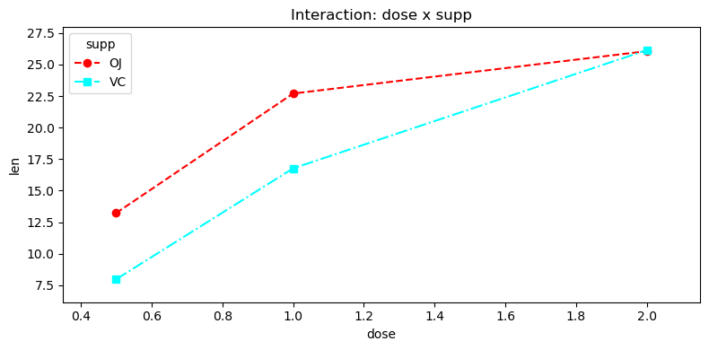

# 이원배치 분산분석 파이프라인

## 개요

이원배치 분산분석은 일원배치 설계를 확장하여 두 요인의 효과와 그 교호작용이 연속형 반응에 미치는 영향을 동시에 살핀다. 이 페이지는 ToothGrowth 자료로 완전한 파이프라인을 따라간다. 이원배치 분산분석(제II형) 적합, 각 주효과와 교호작용에 대한 Tukey HSD 사후검정, 교호작용 그림 작성. 두 요인은 보충제 종류(OJ 대 VC)와 용량 수준(0.5, 1.0, 2.0)이다.

## 이원배치 분산분석 모형

수준이 $a$개인 요인 $A$와 수준이 $b$개인 요인 $B$에 대한 칸 평균 모형은

$$
y_{ijk} = \mu + \alpha_i + \beta_j + (\alpha\beta)_{ij} + \varepsilon_{ijk}
$$

이며 $\alpha_i$는 요인 $A$의 주효과, $\beta_j$는 요인 $B$의 주효과, $(\alpha\beta)_{ij}$는 교호작용 효과, $\varepsilon_{ijk} \sim N(0, \sigma^2)$이다.

제II형 분산분석표는 세 가지 귀무가설을 검정한다:

| 원천 | $H_0$ | $df$ |
|---|---|---|
| 요인 $A$ | 모든 $\alpha_i = 0$ | $a - 1$ |
| 요인 $B$ | 모든 $\beta_j = 0$ | $b - 1$ |
| $A \times B$ | 모든 $(\alpha\beta)_{ij} = 0$ | $(a-1)(b-1)$ |
| 잔차 | | $N - ab$ |

## 1단계: 모형 적합

<div class="exbox" markdown>

**보기 1.** <span class="diff easy" title="쉬움"></span> 1단계 — 제곱합의 세 유형은 언제 같은가. 코드의 주석은 "균형 설계에서는 세 유형이 모두 같지만 불균형이면 갈린다"고 말한다. 확인해 보자.

**(1)** 설계가 **균형**이면(모든 칸의 관측 수가 같으면) 요인 $A$ 의 지시열과 요인 $B$ 의 지시열이 중심화한 뒤 **직교**함을 보이고, 이로부터 제I형 제곱합이 항의 순서에 의존하지 않음을 설명하시오. 또 제II형 제곱합은 불균형에서도 **"그 효과를 마지막에 넣은 제I형"** 과 같음을 지적하시오.

**(2)** ToothGrowth 에서 세 유형을 모두 계산해 (1)을 확인하고, 칸 여섯 개 중 둘을 줄여 **불균형으로 만들면** 무엇이 갈라지는지 보이시오.

</div>

??? success "풀이"

    **(1) 해석적으로.** 칸 $(i,j)$ 의 관측 수를 $n_{ij}$ 라 하자. 요인 $A$ 의 수준 $i$ 를 가리키는 지시벡터를 $u_i$, 요인 $B$ 의 수준 $j$ 를 가리키는 지시벡터를 $v_j$ 라 쓰면

    $$
    u_i^\top v_j = n_{ij},
    \qquad
    u_i^\top \mathbf 1 = n_{i\cdot},
    \qquad
    v_j^\top \mathbf 1 = n_{\cdot j}
    $$

    이다. 전체평균을 뺀 중심화 벡터 $\tilde u_i = u_i - \frac{n_{i\cdot}}{N}\mathbf 1$, $\tilde v_j = v_j - \frac{n_{\cdot j}}{N}\mathbf 1$ 의 내적은

    $$
    \tilde u_i^\top \tilde v_j = n_{ij} - \frac{n_{i\cdot} n_{\cdot j}}{N}
    $$

    다. **균형 설계이면 $n_{ij} = n$, $n_{i\cdot} = nb$, $n_{\cdot j} = na$, $N = nab$ 이므로**

    $$
    \tilde u_i^\top \tilde v_j = n - \frac{nb \cdot na}{nab} = n - n = 0
    $$

    으로 **정확히 직교한다.** 두 요인이 만드는 부분공간이 서로 직교하면, 한쪽을 먼저 넣든 나중에 넣든 사영의 크기가 변하지 않는다. 제I형은 "앞의 항들을 넣은 뒤 늘어나는 설명량"이므로 순서에 의존하지 않게 되고, 제II형·제III형도 같은 값이 된다. 이것이 균형 설계의 값어치다. **요인들이 서로 간섭하지 않는다.**

    불균형이면 $n_{ij} \ne \frac{n_{i\cdot}n_{\cdot j}}{N}$ 이라 직교가 깨지고, 두 요인이 **겹치는 설명량**이 생긴다. 먼저 들어온 쪽이 그 겹치는 몫을 가져가므로 제I형이 순서에 따라 달라진다. 제II형은 정의가 "다른 **주효과**를 모두 통제한 뒤의 증가분"이므로, 주효과가 둘뿐인 이 설계에서는 **그 효과를 주효과 중 마지막에 넣은 제I형과 같은 수**가 된다.

    한 가지 덧붙일 것이 있다. `anova_lm(..., typ=3)` 은 **코딩에 민감하다.** 제III형은 "다른 모든 항(교호작용 포함)을 통제한 효과"인데, 교호작용 열이 직교하도록 만들려면 수준 더미를 합이 $0$ 이 되게 코딩해야 한다. statsmodels 의 기본 처리코딩(`C()`)으로 `typ=3` 을 부르면 올바른 제III형이 아니라 **기준수준에서의 단순효과**를 재게 된다. 아래 출력이 그 함정을 보여 준다.

    **(2) 수치적으로.**

    ```python
    import pandas as pd
    from statsmodels.formula.api import ols
    from statsmodels.stats.anova import anova_lm

    url = ('https://raw.githubusercontent.com/vincentarelbundock/'
           'Rdatasets/1dcc2bf5f955cc1224a3e1307256e1fe86b68dae/csv/datasets/ToothGrowth.csv')
    df = pd.read_csv(url, usecols=[1, 2, 3])

    model = ols('len ~ C(supp) + C(dose) + C(supp):C(dose)', data=df).fit()
    # typ=2를 명시한다. statsmodels의 기본값은 typ=1(순차적 제곱합)이라
    # 모형에 넣는 항의 **순서에 따라 결과가 달라진다**. 균형 설계에서는
    # 세 유형이 모두 같지만, 불균형이면 갈린다.
    aov2 = anova_lm(model, typ=2)
    print(aov2)
    ```

    출력:

    ```
                          sum_sq    df          F        PR(>F)
    C(supp)           205.350000   1.0  15.571979  2.311828e-04
    C(dose)          2426.434333   2.0  91.999965  4.046291e-18
    C(supp):C(dose)   108.319000   2.0   4.106991  2.186027e-02
    Residual          712.106000  54.0        NaN           NaN
    ```

    용량의 효과가 압도적이고($F = 92$), 보충제의 효과와 교호작용도 유의하다. 교호작용이 유의하다는 것은 주효과를 따로 해석하기 전에 조심해야 한다는 신호다. "OJ가 VC보다 낫다"는 말이 용량마다 다르게 성립하기 때문이다.

    제II형 제곱합은 각 주효과를 다른 주효과로 조정하되 교호작용은 무시하고 검정한다. 설계가 균형이거나 거의 균형일 때 권장된다. 세 유형을 모두 계산해 본다.

    ```python
    # 균형 설계인가. 여섯 칸의 개수를 센다.
    print("칸별 관측 수")
    print(df.groupby(['supp', 'dose']).size().unstack())

    a1 = anova_lm(model, typ=1)['sum_sq']
    model_rev = ols('len ~ C(dose) + C(supp) + C(dose):C(supp)', data=df).fit()
    a1r = anova_lm(model_rev, typ=1)['sum_sq']
    a2 = anova_lm(model, typ=2)['sum_sq']
    a3_bad = anova_lm(model, typ=3)['sum_sq']
    # 제III형은 합이 0 이 되는 코딩(Sum)으로 적합해야 올바른 값이 나온다.
    model_sum = ols('len ~ C(supp, Sum) + C(dose, Sum) + C(supp, Sum):C(dose, Sum)',
                    data=df).fit()
    a3 = anova_lm(model_sum, typ=3)['sum_sq']

    print(f"\n{'방법':<22}{'supp':>12}{'dose':>14}{'supp:dose':>12}")
    print(f"{'제I형 (supp 먼저)':<22}{a1['C(supp)']:>12.4f}{a1['C(dose)']:>14.4f}"
          f"{a1['C(supp):C(dose)']:>12.4f}")
    print(f"{'제I형 (dose 먼저)':<22}{a1r['C(supp)']:>12.4f}{a1r['C(dose)']:>14.4f}"
          f"{a1r['C(dose):C(supp)']:>12.4f}")
    print(f"{'제II형':<22}{a2['C(supp)']:>12.4f}{a2['C(dose)']:>14.4f}"
          f"{a2['C(supp):C(dose)']:>12.4f}")
    print(f"{'제III형 (처리코딩)':<22}{a3_bad['C(supp)']:>12.4f}{a3_bad['C(dose)']:>14.4f}"
          f"{a3_bad['C(supp):C(dose)']:>12.4f}")
    print(f"{'제III형 (합코딩)':<22}{a3['C(supp, Sum)']:>12.4f}{a3['C(dose, Sum)']:>14.4f}"
          f"{a3['C(supp, Sum):C(dose, Sum)']:>12.4f}")

    print(f"\n네 제곱합의 합 = {a2.sum():.4f},  "
          f"SST = {((df['len'] - df['len'].mean()) ** 2).sum():.4f}")
    print(f"자유도 59 = 1 + 2 + 2 + 54")
    ```

    출력:

    ```
    칸별 관측 수
    dose  0.5  1.0  2.0
    supp               
    OJ     10   10   10
    VC     10   10   10

    방법                            supp          dose   supp:dose
    제I형 (supp 먼저)             205.3500     2426.4343    108.3190
    제I형 (dose 먼저)             205.3500     2426.4343    108.3190
    제II형                      205.3500     2426.4343    108.3190
    제III형 (처리코딩)              137.8125      885.2647    108.3190
    제III형 (합코딩)               205.3500     2426.4343    108.3190

    네 제곱합의 합 = 3452.2093,  SST = 3452.2093
    자유도 59 = 1 + 2 + 2 + 54
    ```

    **균형 설계라 네 줄이 같다.** 칸마다 정확히 $10$ 개씩이므로 (1)의 직교성이 성립하고, 제I형(어느 순서로 넣든)·제II형·제III형(합코딩)이 모두 $205.3500$ 과 $2426.4343$ 을 준다. 제곱합 분해도 $3452.2093$ 으로 정확히 맞고 자유도는 $59 = 1+2+2+54$ 로 갈린다.

    **처리코딩으로 부른 제III형만 다르다.** $137.8125$ 와 $885.2647$ 은 틀린 값이 아니라 **다른 질문에 대한 답**이다. 처리코딩에서 `C(supp)` 항은 "dose 가 기준수준($0.5$)일 때의 supp 효과", 곧 단순효과를 가리키므로 주효과와 같을 이유가 없다. `typ=3` 을 쓸 생각이면 반드시 `C(..., Sum)` 으로 적합해야 한다.

    이제 균형을 깨 보면 (1)의 나머지가 드러난다.

    ```python
    # OJ_0.5 에서 둘, VC_0.5 에서 넷을 지워 불균형을 만든다.
    drop = df.index[(df['supp'] == 'OJ') & (df['dose'] == 0.5)][:2].tolist()
    drop += df.index[(df['supp'] == 'VC') & (df['dose'] == 0.5)][:4].tolist()
    dfu = df.drop(index=drop).reset_index(drop=True)
    print("칸별 관측 수 (불균형)")
    print(dfu.groupby(['supp', 'dose']).size().unstack())

    mu = ols('len ~ C(supp) + C(dose) + C(supp):C(dose)', data=dfu).fit()
    mur = ols('len ~ C(dose) + C(supp) + C(dose):C(supp)', data=dfu).fit()
    u1, u1r = anova_lm(mu, typ=1)['sum_sq'], anova_lm(mur, typ=1)['sum_sq']
    u2 = anova_lm(mu, typ=2)['sum_sq']
    print(f"\n{'방법':<22}{'supp':>12}{'dose':>14}")
    print(f"{'제I형 (supp 먼저)':<22}{u1['C(supp)']:>12.4f}{u1['C(dose)']:>14.4f}")
    print(f"{'제I형 (dose 먼저)':<22}{u1r['C(supp)']:>12.4f}{u1r['C(dose)']:>14.4f}")
    print(f"{'제II형':<22}{u2['C(supp)']:>12.4f}{u2['C(dose)']:>14.4f}")
    print(f"\n제II형의 supp 가 '제I형에서 supp 를 나중에 넣은 값'과 같은가: "
          f"{abs(u2['C(supp)'] - u1r['C(supp)']) < 1e-9}")
    print(f"제II형의 dose 가 '제I형에서 dose 를 나중에 넣은 값'과 같은가: "
          f"{abs(u2['C(dose)'] - u1['C(dose)']) < 1e-9}")
    ```

    출력:

    ```
    칸별 관측 수 (불균형)
    dose  0.5  1.0  2.0
    supp               
    OJ      8   10   10
    VC      6   10   10

    방법                            supp          dose
    제I형 (supp 먼저)              75.2894     2061.9230
    제I형 (dose 먼저)             125.6611     2011.5513
    제II형                      125.6611     2061.9230

    제II형의 supp 가 '제I형에서 supp 를 나중에 넣은 값'과 같은가: True
    제II형의 dose 가 '제I형에서 dose 를 나중에 넣은 값'과 같은가: True
    ```

    **불균형이 되자 순서가 결과를 바꾼다.** `supp` 의 제곱합이 먼저 넣으면 $75.29$, 나중에 넣으면 $125.66$ 으로 **$1.7$ 배 차이가 난다.** $14$ 개를 지웠을 뿐인데 이렇다. 요인끼리 겹치는 설명량이 생겼고, 제I형은 그 몫을 **먼저 들어온 쪽에 통째로 준다.**

    **제II형이 (1)의 예측과 정확히 맞는다.** `supp` 의 제II형 $125.6611$ 이 "dose 를 먼저 넣은 제I형"의 `supp` 와 같고, `dose` 의 제II형 $2061.9230$ 이 "supp 를 먼저 넣은 제I형"의 `dose` 와 같다. 곧 **제II형은 각 주효과를 늘 마지막에 넣어 본 값**이고, 그래서 순서를 정할 필요가 없다. 코드가 `typ=2` 를 명시한 까닭이 이것이다.

## 2단계: 주효과에 대한 Tukey HSD

사후검정은 한 요인의 어느 수준이 다른지 찾아낸다. 각 주효과에 대해 Tukey HSD를 따로 수행한다.

<div class="exbox" markdown>

**보기 2.** <span class="diff easy" title="쉬움"></span> 2단계 — 분산분석은 $p = 0.00023$, Tukey 는 $p = 0.060$. 같은 `supp` 효과를 두고 두 수가 이렇게 벌어지는 까닭을 수로 밝힌다.

**(1)** 설계가 균형이므로 `supp` 의 **집단 간 제곱합은 두 분석에서 같은 수**($205.35$)임을 지적하고, `supp` 만 보는 일원배치의 오차제곱합이

$$
SSW_{\text{1way}} = SS_{\text{dose}} + SS_{\text{supp}\times\text{dose}} + SSE_{\text{2way}}
$$

이며 자유도가 $2 + 2 + 54 = 58$ 임을 보이시오. 두 $MSE$ 의 비를 계산하시오.

**(2)** 집단이 둘뿐이면 Tukey 의 `p-adj` 가 그 일원배치 $F$-검정의 $p$-값과 **같음**을 보이고, 수치로 확인하시오. 두 분석의 $F$ 값도 함께 적으시오.

</div>

??? success "풀이"

    **(1) 해석적으로.** 균형 설계에서는 보기 1의 직교성 덕분에 각 항의 제곱합이 다른 항과 무관하게 정해진다. 그러므로 `supp` 하나만 넣은 일원배치의 집단 간 제곱합은 이원배치표의 `C(supp)` 칸과 **같은 수** $205.35$ 다. 분자는 변하지 않는다.

    변하는 것은 분모다. 총제곱합은 어느 쪽에서나 같으므로

    $$
    SST = \underbrace{SS_{\text{supp}}}_{205.35} + SS_{\text{dose}} + SS_{\text{supp}\times\text{dose}} + SSE_{\text{2way}}
    $$

    인데, `supp` 만 넣은 모형은 가운데 두 항을 **설명하지 못하고 오차로 떠넘긴다.**

    $$
    SSW_{\text{1way}} = SST - SS_{\text{supp}} = SS_{\text{dose}} + SS_{\text{supp}\times\text{dose}} + SSE_{\text{2way}}
    $$

    자유도도 함께 옮겨 와 $2 + 2 + 54 = 58$ 이다. 수를 넣으면

    $$
    SSW_{\text{1way}} = 2426.434 + 108.319 + 712.106 = 3246.859,
    \qquad
    MSE_{\text{1way}} = \frac{3246.859}{58} = 55.98
    $$

    로, 이원배치의 $MSE = 712.106/54 = 13.19$ 보다 **$4.25$ 배 크다.** 같은 분자를 네 배 넘게 큰 분모로 나누니 $F$ 가 그만큼 작아지고 $p$ 가 커진다. **용량이 만드는 변동을 모형에 넣지 않으면 그것이 통째로 잡음이 된다.** 이원배치를 하는 이유가 바로 이 분모를 깎는 데 있다.

    **(2) $k = 2$ 이면 Tukey 와 $F$-검정이 같다.** 집단이 둘이면 비교가 하나뿐이라 보정할 것이 없다. 스튜던트화 범위의 두 집단짜리 분포는 $Q_{2,\nu} = \sqrt2\,|t_\nu|$ 라는 관계를 만족하므로

    $$
    p_{\text{adj}} = P(Q_{2,\nu} \ge q_{\text{obs}}) = P\!\left(|t_\nu| \ge \tfrac{q_{\text{obs}}}{\sqrt2}\right) = P(t_\nu^2 \ge t_{\text{obs}}^2) = P(F_{1,\nu} \ge F_{\text{obs}})
    $$

    이고 마지막이 바로 일원배치 $F$-검정의 $p$-값이다(11.1절의 $F = t^2$ 항등식이 여기서 되풀이된다).

    ```python
    from statsmodels.stats.multicomp import pairwise_tukeyhsd

    # 두 요인의 주효과를 각각 사후비교한다. 다른 요인은 잠시 무시하는 셈이다.
    print(pairwise_tukeyhsd(endog=df['len'], groups=df['dose'], alpha=0.05))
    print(pairwise_tukeyhsd(endog=df['len'], groups=df['supp'], alpha=0.05))
    ```

    출력:

    ```
    Multiple Comparison of Means - Tukey HSD, FWER=0.05
    ===================================================
    group1 group2 meandiff p-adj  lower   upper  reject
    ---------------------------------------------------
       0.5    1.0     9.13   0.0  5.9018 12.3582   True
       0.5    2.0   15.495   0.0 12.2668 18.7232   True
       1.0    2.0    6.365   0.0  3.1368  9.5932   True
    ---------------------------------------------------
    Multiple Comparison of Means - Tukey HSD, FWER=0.05
    =================================================
    group1 group2 meandiff p-adj  lower  upper reject
    -------------------------------------------------
        OJ     VC     -3.7 0.0604 -7.567 0.167  False
    -------------------------------------------------
    ```

    용량은 세 수준이 서로 모두 다르다. 반면 보충제는 $p = 0.060$으로 유의하지 않게 나오는데, 분산분석표의 $p = 0.00023$과 어긋나 보인다.

    모순이 아니다. 분산분석은 용량을 모형에 넣은 채 보충제 효과를 보지만, 이 Tukey는 용량을 무시하고 OJ 30개와 VC 30개를 통째로 비교한다. 용량이 만드는 큰 변동이 잡음으로 남아 보충제의 차이를 덮는 것이다. **주효과의 사후검정은 다른 요인을 무시한다**는 점을 잊으면 이런 표를 잘못 읽게 된다. 그 "덮임"의 크기를 (1)의 식으로 재 본다.

    ```python
    import numpy as np
    from scipy import stats

    SS_supp, SS_dose, SS_int, SSE2 = 205.350, 2426.434333, 108.319, 712.106

    # supp 만 보는 일원배치의 분모를 손으로 만든다.
    SSW1 = SS_dose + SS_int + SSE2
    MSE1, MSE2 = SSW1 / 58, SSE2 / 54
    print(f"SSW(1way) = {SS_dose:.3f} + {SS_int:.3f} + {SSE2:.3f} = {SSW1:.3f}  (df 58)")
    print(f"MSE(1way) = {MSE1:.4f}   MSE(2way) = {MSE2:.4f}   비 = {MSE1 / MSE2:.4f}")
    print(f"F(1way) = {SS_supp / MSE1:.4f}   F(2way) = {SS_supp / MSE2:.4f}")

    oj = df.loc[df['supp'] == 'OJ', 'len'].values
    vc = df.loc[df['supp'] == 'VC', 'len'].values
    F1, p1 = stats.f_oneway(oj, vc)
    print(f"\nf_oneway(OJ, VC):  F = {F1:.4f},  p = {p1:.6f}")

    d = vc.mean() - oj.mean()
    q_obs = abs(d) / np.sqrt(MSE1 / 30)
    p_tukey = stats.studentized_range.sf(q_obs, 2, 58)
    HSD = stats.studentized_range.ppf(0.95, 2, 58) * np.sqrt(MSE1 / 30)
    print(f"Tukey(supp):  meandiff = {d:.2f},  p-adj = {p_tukey:.6f}")
    print(f"              HSD = {HSD:.4f}  ->  CI = ({d - HSD:.3f}, {d + HSD:.3f})")

    # dose 주효과 쪽도 같은 방식으로 되살려 본다.
    SSW1d = SS_supp + SS_int + SSE2
    HSD_dose = stats.studentized_range.ppf(0.95, 3, 57) * np.sqrt((SSW1d / 57) / 20)
    print(f"\nTukey(dose):  MSE(1way) = {SSW1d / 57:.4f},  HSD = {HSD_dose:.4f}")
    ```

    출력:

    ```
    SSW(1way) = 2426.434 + 108.319 + 712.106 = 3246.859  (df 58)
    MSE(1way) = 55.9803   MSE(2way) = 13.1871   비 = 4.2451
    F(1way) = 3.6683   F(2way) = 15.5720

    f_oneway(OJ, VC):  F = 3.6683,  p = 0.060393
    Tukey(supp):  meandiff = -3.70,  p-adj = 0.060393
                  HSD = 3.8670  ->  CI = (-7.567, 0.167)

    Tukey(dose):  MSE(1way) = 17.9961,  HSD = 3.2282
    ```

    **(1)의 분해가 맞는다.** 손으로 더한 $SSW_{\text{1way}} = 3246.859$ 로 만든 $F = 3.6683$ 이 `f_oneway(OJ, VC)` 의 값과 소수 넷째 자리까지 같다. 두 $MSE$ 의 비가 $4.2451$ 이고, 그만큼 $F$ 가 $3.67$ 에서 $15.57$ 로 뛴다.

    **(2)도 맞는다.** Tukey 의 `p-adj` 가 $0.060393$ 으로 일원배치 $F$-검정의 $p$-값과 **여섯 자리까지 같다.** 신뢰구간 $(-7.567,\ 0.167)$ 도 출력표와 일치하고, 반폭 $\text{HSD} = 3.8670$ 이 평균차 $3.70$ 보다 커서 구간이 $0$ 을 품는다.

    용량 쪽도 같은 구조다. `dose` 주효과의 Tukey 는 $MSE = 17.9961$(= `supp` 와 교호작용을 오차로 떠넘긴 값)로 $\text{HSD} = 3.2282$ 를 쓰는데, 출력표의 세 구간 반폭 $(12.3582 - 9.13)$ 등이 모두 이 수다. 다만 용량의 효과가 $9.13$–$15.50$ 으로 워낙 커서 분모가 부풀려져도 세 쌍 모두 유의하다.

    **교훈.** $p = 0.060$ 과 $p = 0.00023$ 중 무엇을 보고해야 하는가. **이원배치 쪽이다.** 자료가 두 요인으로 설계되었음을 알면서 한 요인을 모형에서 빼는 것은 그 요인의 변동을 일부러 잡음으로 만드는 일이다. `pairwise_tukeyhsd` 는 주어진 집단 변수 하나만 보므로 이 사실을 알려 주지 않는다. 다른 요인을 통제한 사후비교를 하려면 다음 단계처럼 **칸 단위로** 비교해야 한다.

## 3단계: 교호작용에 대한 Tukey HSD

$a \times b$개의 칸 평균을 모두 비교하려면 결합 집단 변수를 만들어 교호작용 칸에 Tukey HSD를 수행한다.

<div class="exbox" markdown>

**보기 3.** <span class="diff easy" title="쉬움"></span> 3단계 — 여섯 칸을 한 집단으로 보면 분모가 제자리를 찾는다. 두 요인을 붙여 만든 `supp_dose` 로 Tukey 를 돌리면 $\binom62 = 15$ 개의 비교가 나온다.

**(1)** 여섯 칸짜리 **일원배치**의 집단 내 평균제곱이 **이원배치의 잔차 평균제곱과 같은 수**임을 보이시오. (힌트: 두 모형의 적합값이 모두 칸평균이다.) 이로부터 $15$ 개 비교의 공통 반폭

$$
\text{HSD} = q_{0.05,\,6,\,54}\sqrt{\frac{MSE}{10}}
$$

를 계산하시오.

**(2)** 같은 용량끼리 비교한 세 줄(단순효과)을 뽑고, 그 셋의 차이를 **교호작용 대비**

$$
L = (\bar y_{\text{OJ},0.5} - \bar y_{\text{VC},0.5}) - (\bar y_{\text{OJ},2.0} - \bar y_{\text{VC},2.0})
$$

하나로 요약하시오. $L$ 의 표준오차와 $t$ 값을 구하시오.

</div>

??? success "풀이"

    **(1) 해석적으로.** 포화 이원배치 모형

    $$
    y_{ijk} = \mu + \alpha_i + \beta_j + (\alpha\beta)_{ij} + \varepsilon_{ijk}
    $$

    는 모수 개수가 $ab$ 개로 **칸마다 자유로운 평균 하나씩**을 주는 것과 같다. 여섯 칸짜리 일원배치 모형 $y_{ijk} = \mu_{ij} + \varepsilon_{ijk}$ 도 똑같다. **두 모형의 적합값이 글자 그대로 같은 수**(칸평균)이므로 잔차도 같고, 따라서

    $$
    SSE_{\text{2way}} = SSW_{\text{6칸}} = \sum_{i,j}\sum_k (y_{ijk} - \bar y_{ij\cdot})^2,
    \qquad
    df = N - ab = 60 - 6 = 54
    $$

    로 **두 분석의 분모가 완전히 같다.** 보기 2에서 주효과 Tukey 가 분모를 $55.98$ 로 부풀렸던 것과 달리, 칸 단위 Tukey 는 이원배치가 쓰는 바로 그 $MSE = 13.19$ 를 쓴다. 칸으로 쪼개는 것이 두 요인을 모두 모형에 넣는 일이기 때문이다.

    균형 설계라 칸마다 $n = 10$ 으로 같으므로 반폭이 쌍에 의존하지 않고

    $$
    \text{HSD} = q_{0.05,\,6,\,54}\sqrt{\frac{MSE}{10}}
    $$

    하나로 정해진다.

    **(2) 교호작용 대비.** $L$ 은 네 칸평균의 선형결합이고 계수가 $(+1,-1,-1,+1)$ 이다. 네 칸이 독립이고 각 칸평균의 분산이 $\sigma^2/n$ 이므로

    $$
    \operatorname{Var}(L) = \frac{\sigma^2}{n}\sum c_i^2 = \frac{4\sigma^2}{n}
    \quad\Longrightarrow\quad
    \widehat{\operatorname{SE}}(L) = \sqrt{\frac{4\,MSE}{10}}
    $$

    이다. $L = 0$ 이 "용량 $0.5$ 와 $2.0$ 에서 OJ–VC 격차가 같다"는 뜻이므로, $L$ 이 $0$ 에서 멀수록 교호작용이 뚜렷하다.

    ```python
    # 교호작용이 유의하면 주효과만으로는 부족하다. 두 요인을 붙여 만든 여섯 칸을
    # 서로 견주어야 "어느 조합이 어느 조합과 다른가"를 말할 수 있다.
    df['supp_dose'] = df['supp'].astype(str) + "_" + df['dose'].astype(str)
    print(pairwise_tukeyhsd(endog=df['len'], groups=df['supp_dose'], alpha=0.05))
    ```

    출력:

    ```
     Multiple Comparison of Means - Tukey HSD, FWER=0.05  
    ======================================================
    group1 group2 meandiff p-adj   lower    upper   reject
    ------------------------------------------------------
    OJ_0.5 OJ_1.0     9.47    0.0   4.6719  14.2681   True
    OJ_0.5 OJ_2.0    12.83    0.0   8.0319  17.6281   True
    OJ_0.5 VC_0.5    -5.25 0.0243 -10.0481  -0.4519   True
    OJ_0.5 VC_1.0     3.54  0.264  -1.2581   8.3381  False
    OJ_0.5 VC_2.0    12.91    0.0   8.1119  17.7081   True
    OJ_1.0 OJ_2.0     3.36 0.3187  -1.4381   8.1581  False
    OJ_1.0 VC_0.5   -14.72    0.0 -19.5181  -9.9219   True
    OJ_1.0 VC_1.0    -5.93 0.0074 -10.7281  -1.1319   True
    OJ_1.0 VC_2.0     3.44 0.2936  -1.3581   8.2381  False
    OJ_2.0 VC_0.5   -18.08    0.0 -22.8781 -13.2819   True
    OJ_2.0 VC_1.0    -9.29    0.0 -14.0881  -4.4919   True
    OJ_2.0 VC_2.0     0.08    1.0  -4.7181   4.8781  False
    VC_0.5 VC_1.0     8.79    0.0   3.9919  13.5881   True
    VC_0.5 VC_2.0    18.16    0.0  13.3619  22.9581   True
    VC_1.0 VC_2.0     9.37    0.0   4.5719  14.1681   True
    ------------------------------------------------------
    ```

    교호작용의 정체가 여기서 드러난다. 같은 용량끼리 비교한 세 줄을 뽑아 보면

    | 용량 | OJ − VC | p-adj |
    |---|---|---|
    | 0.5 | +5.25 | 0.024 |
    | 1.0 | +5.93 | 0.007 |
    | 2.0 | −0.08 | 1.000 |

    낮은 용량에서는 OJ가 5~6만큼 앞서지만 용량 2.0에서는 차이가 사실상 사라진다. 이것이 교호작용 항이 유의했던 이유다.

    칸이 $a \times b = 2 \times 3 = 6$개이므로 쌍별 비교는 $\binom{6}{2} = 15$개이다. Tukey 절차는 이 15개 전체에 걸쳐 가족단위 오류율을 동시에 통제한다. (1)과 (2)를 확인한다.

    ```python
    # 여섯 칸 일원배치의 MSW 가 이원배치 잔차와 같은 수인가.
    cells = [v.values for _, v in df.groupby('supp_dose')['len']]
    SSW_cells = sum(((x - x.mean()) ** 2).sum() for x in cells)
    MSE = SSW_cells / 54
    print(f"6칸 일원배치 SSW = {SSW_cells:.3f} (df 54),  MSE = {MSE:.6f}")
    print(f"이원배치 잔차     = 712.106   (df 54),  MS  = {712.106 / 54:.6f}")

    q6 = stats.studentized_range.ppf(0.95, 6, 54)
    HSD = q6 * np.sqrt(MSE / 10)
    print(f"\nq(0.05, 6, 54) = {q6:.4f}   HSD = {HSD:.4f}  (15개 비교 공통)")

    cell = df.groupby(['supp', 'dose'])['len'].mean()
    print(f"\n{'dose':>6}{'OJ':>8}{'VC':>8}{'OJ-VC':>9}{'p-adj':>9}")
    for d in (0.5, 1.0, 2.0):
        diff = cell[('OJ', d)] - cell[('VC', d)]
        p = stats.studentized_range.sf(abs(diff) / np.sqrt(MSE / 10), 6, 54)
        print(f"{d:>6}{cell[('OJ', d)]:>8.2f}{cell[('VC', d)]:>8.2f}{diff:>9.2f}{p:>9.4f}")

    contrast = ((cell[('OJ', 0.5)] - cell[('VC', 0.5)])
                - (cell[('OJ', 2.0)] - cell[('VC', 2.0)]))
    print(f"\n교호작용 대비 (0.5 의 격차) - (2.0 의 격차) = {contrast:.2f}")
    print(f"이 대비의 표준오차 = {np.sqrt(4 * MSE / 10):.4f},  "
          f"t = {contrast / np.sqrt(4 * MSE / 10):.4f}")
    ```

    출력:

    ```
    6칸 일원배치 SSW = 712.106 (df 54),  MSE = 13.187148
    이원배치 잔차     = 712.106   (df 54),  MS  = 13.187148

    q(0.05, 6, 54) = 4.1783   HSD = 4.7981  (15개 비교 공통)

      dose      OJ      VC    OJ-VC    p-adj
       0.5   13.23    7.98     5.25   0.0243
       1.0   22.70   16.77     5.93   0.0074
       2.0   26.06   26.14    -0.08   1.0000

    교호작용 대비 (0.5 의 격차) - (2.0 의 격차) = 5.33
    이 대비의 표준오차 = 2.2967,  t = 2.3207
    ```

    **(1)이 정확히 맞는다.** 여섯 칸 일원배치의 $SSW$ 가 $712.106$ 으로 이원배치표의 `Residual` 칸과 **같은 수**이고 자유도도 $54$ 로 같다. 반폭 $\text{HSD} = 4.7981$ 도 출력표의 모든 구간에서 확인된다. 예컨대 첫 줄 `OJ_0.5 OJ_1.0` 의 구간 $(4.6719,\ 14.2681)$ 은 중심 $9.47$ 에 $\pm 4.7981$ 이다.

    주효과 Tukey 와 견주면 분모의 차이가 선명하다. 보기 2의 `supp` 비교는 $MSE = 55.98$ 을 썼고 여기서는 $13.19$ 를 쓴다. **비교 대상이 $1$ 개에서 $15$ 개로 늘어 $q$ 가 $2.83$ 에서 $4.18$ 로 커졌는데도**, 분모가 네 배 줄어든 덕에 용량 $0.5$ 와 $1.0$ 에서 OJ–VC 차이를 잡아낼 수 있었다.

    **(2) 교호작용이 한 수로 요약된다.** 격차가 $5.25 \to 5.93 \to -0.08$ 로 가다가 마지막에서 무너진다. 양 끝의 차 $L = 5.33$ 이고 표준오차가 $2.2967$ 이므로 $t = 2.32$ 다. 자유도 $54$ 에서 $|t| > 2.005$ 면 $5\%$ 에서 유의하므로 이 대비 하나만으로도 교호작용이 잡힌다. 분산분석표의 $F = 4.107$ ($p = 0.0219$)은 자유도 $2$ 짜리 교호작용 전체를 재는 것이고, 이 대비는 그 가운데 **"양 끝 용량의 격차 차이"라는 한 방향**만 떼어 본 것이다.

    주의할 점 하나. 이 $t = 2.32$ 는 **미리 정해 둔 대비 하나**에 대한 값이라 다중비교 보정이 들어 있지 않다. 표를 보고 나서 가장 눈에 띄는 대비를 고른 것이라면 그대로 쓸 수 없다. 그런 경우의 올바른 도구는 모든 대비에 대해 동시에 보정하는 Scheffé 절차다.

## 4단계: 교호작용 그림

교호작용 그림은 한 요인을 가로축에 두고 다른 요인의 각 수준을 별도의 선으로 그려 칸 평균을 보여준다. 선이 평행하지 않으면 교호작용을 시사한다.

<div class="exbox" markdown>

**보기 4.** <span class="diff easy" title="쉬움"></span> 4단계 — 교호작용 그림에서 읽히는 것과 읽히지 않는 것. 두 선이 그려진다.

**(1)** 그림에서 **읽히는 것**을 수치로 적으시오. 두 선이 얼마나 벌어졌다가 얼마나 좁혀지는가. 교차하는가.

**(2)** 그림이 **보여 주지 않는 것** 셋을 들고, 그것들을 모르면 어떤 오독이 생기는지 말하시오.

</div>

??? success "풀이"

    유도할 답이 있는 문제가 아니다. **그림이 어떤 수를 그리고 어떤 수를 숨기는지**를 짚는 것이 이 보기의 몫이다.

    ```python
    import matplotlib.pyplot as plt
    from statsmodels.graphics.factorplots import interaction_plot

    # 마지막으로 그림을 다시 본다. 사후비교로 갈린 쌍이 그림에서 어디인지
    # 짚어 보면 결과가 몸에 붙는다.
    fig, ax = plt.subplots(figsize=(8, 4))
    interaction_plot(df['dose'], df['supp'], df['len'], ax=ax,
                     markers=['o', 's'], linestyles=['--', '-.'])
    ax.set_title("Interaction: dose x supp")
    ax.set_xlabel("dose")
    ax.set_ylabel("len")
    plt.tight_layout()
    plt.show()
    ```

    

    앞의 표에서 읽은 것이 그림 하나에 담긴다. 그림이 그리는 수와 그리지 않는 수를 함께 찍어 둔다.

    ```python
    tab = df.groupby(['supp', 'dose'])['len'].agg(['mean', 'std', 'count'])
    print(tab.round(3))

    cell = df.groupby(['supp', 'dose'])['len'].mean()
    MSE = 13.187148
    print(f"\n칸평균의 표준오차 = sqrt(MSE/n) = {np.sqrt(MSE / 10):.4f}"
          f"  (그림에 그려지지 않는다)")
    print(f"{'dose':>6}{'OJ-VC':>9}{'+-1.96SE_diff':>16}")
    for d in (0.5, 1.0, 2.0):
        diff = cell[('OJ', d)] - cell[('VC', d)]
        sed = np.sqrt(2 * MSE / 10)
        print(f"{d:>6}{diff:>9.2f}   ({diff - 1.96 * sed:>6.2f}, {diff + 1.96 * sed:>6.2f})")

    # 가로축을 '칸 번호'로 바꾸면 선의 모양이 달라 보인다.
    print(f"\n선분의 기울기 (가로축이 실제 용량일 때)")
    for s in ('OJ', 'VC'):
        print(f"  {s}: 0.5->1.0 {(cell[(s, 1.0)] - cell[(s, 0.5)]) / 0.5:>7.2f}"
              f"   1.0->2.0 {(cell[(s, 2.0)] - cell[(s, 1.0)]) / 1.0:>7.2f}")
    print(f"선분이 올라간 양 (가로축이 순서 1,2,3 일 때)")
    for s in ('OJ', 'VC'):
        print(f"  {s}: 1->2 {cell[(s, 1.0)] - cell[(s, 0.5)]:>7.2f}"
              f"   2->3 {cell[(s, 2.0)] - cell[(s, 1.0)]:>7.2f}")
    ```

    출력:

    ```
                mean    std  count
    supp dose                     
    OJ   0.5   13.23  4.460     10
         1.0   22.70  3.911     10
         2.0   26.06  2.655     10
    VC   0.5    7.98  2.747     10
         1.0   16.77  2.515     10
         2.0   26.14  4.798     10

    칸평균의 표준오차 = sqrt(MSE/n) = 1.1484  (그림에 그려지지 않는다)
      dose    OJ-VC   +-1.96SE_diff
       0.5     5.25   (  2.07,   8.43)
       1.0     5.93   (  2.75,   9.11)
       2.0    -0.08   ( -3.26,   3.10)

    선분의 기울기 (가로축이 실제 용량일 때)
      OJ: 0.5->1.0   18.94   1.0->2.0    3.36
      VC: 0.5->1.0   17.58   1.0->2.0    9.37
    선분이 올라간 양 (가로축이 순서 1,2,3 일 때)
      OJ: 1->2    9.47   2->3    3.36
      VC: 1->2    8.79   2->3    9.37
    ```

    **(1) 읽히는 것.** 두 선의 세로 간격이 $5.25 \to 5.93 \to -0.08$ 로 가다가 오른쪽 끝에서 **거의 정확히 만난다.** 왼쪽 두 점에서는 간격의 $95\%$ 구간이 $(2.07,\ 8.43)$ 과 $(2.75,\ 9.11)$ 로 $0$ 을 품지 않고, 오른쪽에서는 $(-3.26,\ 3.10)$ 으로 $0$ 을 품는다. 선이 **교차하지는 않으므로**(간격 $-0.08$ 은 사실상 $0$ 이다) 순서형 교호작용이고, OJ 가 VC 보다 나쁜 구간은 없다. 두 선 모두 단조증가하므로 용량의 주효과는 방향이 분명하다.

    **(2) 보여 주지 않는 것 셋.**

    **첫째, 흩어짐이 없다.** 그림에 찍힌 것은 칸평균 여섯 개뿐이고 오차막대가 없다. 칸평균의 표준오차는 $\sqrt{MSE/10} = 1.1484$ 이므로 점 하나가 세로로 $\pm 2.3$ 쯤 흔들릴 수 있는데, 그림에서는 모든 점이 똑같이 확정적으로 보인다. 더구나 칸별 표준편차가 $2.52$ 에서 $4.80$ 까지 **$1.9$ 배 차이가 나는데** 그 사실이 전혀 나타나지 않는다(가장 흔들리는 칸은 표준편차 $4.80$ 인 VC_2.0 이고, 하필 두 선이 만나는 바로 그 점이다).

    **둘째, "평행한가"는 눈이 아니라 검정이 판정한다.** 두 선분의 기울기 차이를 보면 $0.5 \to 1.0$ 구간은 $18.94$ 대 $17.58$ 로 거의 평행하고, $1.0 \to 2.0$ 구간은 $3.36$ 대 $9.37$ 로 크게 다르다. 이 "크게 다름"이 유의한지는 교호작용 $F = 4.107$, $p = 0.0219$ 가 말해 준다. **$p = 0.022$ 는 압도적인 증거가 아니다.** 표본이 더 작았다면 똑같은 그림에서도 교호작용이 유의하지 않았을 것이다.

    **셋째, 가로축의 눈금이 선택의 문제다.** 용량 $0.5, 1.0, 2.0$ 은 등간격이 아니다. 실제 용량을 축으로 쓰면 기울기가 $18.94 \to 3.36$ 으로 **급격히 꺾이고**, 순서 $1,2,3$ 을 축으로 쓰면 $9.47 \to 3.36$ 으로 꺾임이 훨씬 완만해진다. 같은 자료인데 "평행해 보이는 정도"가 축을 어떻게 잡느냐에 따라 달라진다. **교호작용 검정 자체는 축과 무관**($dose$ 를 범주형으로 넣었으므로)하지만 그림에서 받는 인상은 그렇지 않다.

    요약하면 교호작용 그림은 **방향을 잡아 주는 도구**이지 판정 도구가 아니다. 판정은 보기 1의 $F$ 와 보기 3의 대비가 한다.

## 해석

- **용량의 주효과:** 용량에 대한 분산분석 $p$-값이 작고 Tukey HSD가 유의한 쌍별 차이를 보이면 용량이 클수록 치아 성장이 크다는 뜻이다.
- **보충제의 주효과:** supp의 $p$-값이 유의하면 두 보충제 종류(OJ 대 VC)가 서로 다른 평균 치아 길이를 낳음을 나타낸다.
- **교호작용:** 교호작용이 유의하면 용량의 효과가 보충제 종류에 (또는 그 반대로) 의존한다는 뜻이다. ToothGrowth 자료에서는 용량 2.0에서 OJ와 VC의 결과가 비슷하지만 낮은 용량에서는 다르며, 교호작용 그림에서 선이 수렴하는 모습으로 나타난다.
- **제II형 대 제III형:** 교호작용이 있는 상태에서 주효과를 검정할 사전 이유가 없다면 제II형이 적절하다. 교호작용이 유의하고 설계가 불균형이면 (교호작용을 포함한 다른 모든 효과를 통제하고 각 효과를 검정하는) 제III형이 나을 수 있다.

## 연습문제

<div class="drillbox" markdown>

**연습문제 1.** <span class="diff easy" title="쉬움"></span>
칸당 관측값이 $n = 10$개인 $2 \times 3$ 요인 설계에서 분산분석표의 각 원천별 자유도와 전체 자유도를 진술하라.

</div>

??? success "풀이"
    요인 $A$의 수준이 $a = 2$개, 요인 $B$의 수준이 $b = 3$개, 칸당 $n = 10$이므로 $N = 2 \times 3 \times 10 = 60$이다.

    | 원천 | $df$ |
    |---|---|
    | 요인 $A$ | $a - 1 = 1$ |
    | 요인 $B$ | $b - 1 = 2$ |
    | $A \times B$ | $(a-1)(b-1) = 2$ |
    | 잔차 | $N - ab = 60 - 6 = 54$ |
    | 전체 | $N - 1 = 59$ |

<div class="drillbox" markdown>

**연습문제 2.** <span class="diff med" title="중간"></span>
제I형, 제II형, 제III형 제곱합의 차이를 설명하라. 어떤 조건에서 세 유형이 동일한 결과를 주는가?

</div>

??? success "풀이"

    - **제I형(순차):** 각 효과를 그보다 앞서 들어간 효과들로만 조정하여 검정한다. 결과가 모형의 항 순서에 의존한다.
    - **제II형:** 각 주효과를 다른 주효과로 조정하되 교호작용으로는 조정하지 않고 검정한다. 교호작용은 두 주효과로 조정한 뒤 검정한다.
    - **제III형:** 각 효과를 교호작용을 포함한 다른 모든 효과로 조정하여 검정한다.

    설계가 **균형**(칸 크기가 같음)이고 모형이 완전히 지정되면 세 유형이 동일한 결과를 준다. 균형 설계에서는 제곱합이 직교하므로 항의 입력 순서가 문제되지 않고 다른 항으로 조정해도 달라지지 않는다. 불균형 설계에서는 세 유형이 상당히 다를 수 있다.

<div class="drillbox" markdown>

**연습문제 3.** <span class="diff med" title="중간"></span>
교호작용 그림에서 OJ와 VC의 선이 용량 2.0에서 수렴한다. 이는 교호작용 항에 대해 무엇을 함의하는가? OJ와 VC의 차이가 용량 0.5와 2.0에서 같은지 검정하는 대비를 써라.

</div>

??? success "풀이"
    수렴한다는 것은 용량이 커질수록 보충제의 효과가 줄어든다는 뜻이며, 이는 교호작용의 한 형태이다. OJ–VC 차이가 용량 0.5와 2.0에서 같은지 검정하는 대비는

    $$
    \psi = (\mu_{\text{OJ},0.5} - \mu_{\text{VC},0.5}) - (\mu_{\text{OJ},2.0} - \mu_{\text{VC},2.0})
    $$

    이다. $H_0: \psi = 0$ 아래에서 보충제의 효과가 두 용량에서 같다. 결과가 유의하면 OJ–VC 차이의 크기가 용량 수준에 따라 달라진다는 뜻이며, 이것이 바로 분산분석 모형의 교호작용 항이 담아내는 것이다.

<div class="drillbox" markdown>

**연습문제 4.** <span class="diff med" title="중간"></span>
균형 설계의 이원배치 분산분석에서 총제곱합이

$$
SST = SS_A + SS_B + SS_{AB} + SSE
$$

로 분해됨을 보여라. 이 분해에 필요한 독립성 가정을 진술하라.

</div>

??? success "풀이"
    항등식

    $$
    y_{ijk} - \bar{y}_{\cdot\cdot\cdot} = (\bar{y}_{i\cdot\cdot} - \bar{y}_{\cdot\cdot\cdot}) + (\bar{y}_{\cdot j\cdot} - \bar{y}_{\cdot\cdot\cdot}) + (\bar{y}_{ij\cdot} - \bar{y}_{i\cdot\cdot} - \bar{y}_{\cdot j\cdot} + \bar{y}_{\cdot\cdot\cdot}) + (y_{ijk} - \bar{y}_{ij\cdot})
    $$

    에서 시작한다. 제곱하여 모든 $i, j, k$에 대해 합하면 (균형 설계에서 성립하는) 직교성 덕분에 모든 교차항이 사라져

    $$
    \sum_{i,j,k} (y_{ijk} - \bar{y}_{\cdot\cdot\cdot})^2 = bn\sum_i (\bar{y}_{i\cdot\cdot} - \bar{y}_{\cdot\cdot\cdot})^2 + an\sum_j (\bar{y}_{\cdot j\cdot} - \bar{y}_{\cdot\cdot\cdot})^2 + n\sum_{i,j}(\bar{y}_{ij\cdot} - \bar{y}_{i\cdot\cdot} - \bar{y}_{\cdot j\cdot} + \bar{y}_{\cdot\cdot\cdot})^2 + \sum_{i,j,k}(y_{ijk} - \bar{y}_{ij\cdot})^2
    $$

    가 된다. 즉 $SST = SS_A + SS_B + SS_{AB} + SSE$이다.

    이 분해에는 (1) 균형 설계(칸당 $n$이 같음)와 (2) 오차 $\varepsilon_{ijk}$가 독립이고 공통 분산 $\sigma^2$을 갖는다는 가정이 필요하다. 독립성은 $SSE / \sigma^2 \sim \chi^2_{N-ab}$이고 $SSE$가 $SS_A$, $SS_B$, $SS_{AB}$와 독립임을 보장하며, 이는 $F$-검정이 정확한 $F$-분포를 갖는 데 필요하다. $\square$

<div class="drillbox" markdown>

**연습문제 5.** <span class="diff med" title="중간"></span>
교호작용은 유의한데 한 주효과가 유의하지 않을 때, 여러 교과서가 그 주효과를 해석하지 말라고 경고한다. 구체적인 수치 예로 이유를 설명하라.

</div>

??? success "풀이"
    교호작용이 유의하다는 것은 한 요인의 효과가 다른 요인의 수준에 의존한다는 뜻이다. 이 상황에서 다른 요인의 수준에 걸쳐 평균을 낸 주효과는 어느 집단의 실제 경험도 대표하지 못할 수 있다.

    **예:** 칸 평균이 다음과 같은 $2 \times 2$ 설계를 생각하자:

    | | $B_1$ | $B_2$ |
    |---|---|---|
    | $A_1$ | 10 | 20 |
    | $A_2$ | 20 | 10 |

    $A$의 주변평균은 $\bar{y}_{1\cdot} = 15$, $\bar{y}_{2\cdot} = 15$이므로 $A$의 주효과는 0이다. 그러나 $A$에는 분명 큰 효과가 있다. $A_1$에서 $A_2$로 가면 $B_1$ 조건에서는 반응이 10만큼 커지고 $B_2$ 조건에서는 10만큼 작아진다. 이 반대 방향의 효과가 주변평균에서 상쇄되어 주효과 검정이 무의미해진다. 여기서 정보를 담고 있는 양은 교호작용이며, 올바른 해석은 $A$의 효과 방향이 $B$의 수준에 따라 뒤집힌다는 것이다.

<div class="drillbox" markdown>

**연습문제 6.** <span class="diff med" title="중간"></span>
본문의 4단계를 **하나의 재사용 가능한 함수**로 묶어라. 가정 점검과 효과크기, 조건부 단순효과까지 포함시켜라.

</div>

??? success "풀이"
    ```python
    import numpy as np
    import pandas as pd
    from scipy import stats
    import statsmodels.api as sm
    from statsmodels.formula.api import ols

    def twoway_report(data, y, A, B, alpha=0.05):
        """이원배치 분산분석의 전 과정을 한 번에 수행한다."""
        print(f"=== {y} ~ {A} × {B} ===")

        cell = data.groupby([A, B])[y].agg(["size", "mean", "std"]).round(3)
        print("\n[1] 칸 요약")
        print(cell.to_string())
        print(f"  균형 설계: {cell['size'].nunique() == 1}")

        groups = [g[y].values for _, g in data.groupby([A, B])]
        lev = stats.levene(*groups, center="median")
        print(f"\n[2] 등분산(브라운-포사이드): "
              f"W = {lev.statistic:.4f}, p = {lev.pvalue:.4f}")

        fit = ols(f"{y} ~ C({A})*C({B})", data=data).fit()
        tab = sm.stats.anova_lm(fit, typ=2)
        SSE = tab.loc["Residual", "sum_sq"]
        MSE = SSE / tab.loc["Residual", "df"]
        tab["부분 eta2"] = tab["sum_sq"] / (tab["sum_sq"] + SSE)
        tab.loc["Residual", "부분 eta2"] = np.nan     # 잔차에는 의미가 없다
        print("\n[3] 분산분석표 (제II형)")
        print(tab.round(4).to_string())

        sw = stats.shapiro(fit.resid)
        print(f"\n[4] 잔차 정규성(샤피로): "
              f"W = {sw.statistic:.4f}, p = {sw.pvalue:.4f}")

        key = f"C({A}):C({B})"
        if tab.loc[key, "PR(>F)"] < alpha:
            print(f"\n[5] 교호작용 유의 → {A} 의 단순효과 ({B} 수준별, 본페로니)")
            lv = sorted(data[B].unique())
            m = data.groupby([A, B])[y].mean()
            a0, a1 = sorted(data[A].unique())[:2]
            n = cell["size"].min()
            dfe = int(tab.loc["Residual", "df"])
            se = np.sqrt(2 * MSE / n)
            for b in lv:
                d = m[(a1, b)] - m[(a0, b)]
                p = 2 * stats.t.sf(abs(d / se), dfe)
                print(f"  {B}={b}: {a1}-{a0} = {d:+7.3f},  "
                      f"p = {min(1, len(lv) * p):.4f}")
        else:
            print("\n[5] 교호작용 유의하지 않음 → 주효과를 해석한다")

    tooth = [4.2, 11.5, 7.3, 5.8, 6.4, 10, 11.2, 11.2, 5.2, 7,
             16.5, 16.5, 15.2, 17.3, 22.5, 17.3, 13.6, 14.5, 18.8, 15.5,
             23.6, 18.5, 33.9, 25.5, 26.4, 32.5, 26.7, 21.5, 23.3, 29.5,
             15.2, 21.5, 17.6, 9.7, 14.5, 10, 8.2, 9.4, 16.5, 9.7,
             19.7, 23.3, 23.6, 26.4, 20, 25.2, 25.8, 21.2, 14.5, 27.3,
             25.5, 26.4, 22.4, 24.5, 24.8, 30.9, 26.4, 27.3, 29.4, 23]
    df = pd.DataFrame({
        "len": tooth,
        "supp": ["VC"] * 30 + ["OJ"] * 30,
        "dose": ([0.5] * 10 + [1.0] * 10 + [2.0] * 10) * 2,
    })
    twoway_report(df, "len", "supp", "dose")
    ```

    ```text
    === len ~ supp × dose ===

    [1] 칸 요약
               size   mean    std
    supp dose                    
    OJ   0.5     10  13.23  4.460
         1.0     10  22.70  3.911
         2.0     10  26.06  2.655
    VC   0.5     10   7.98  2.747
         1.0     10  16.77  2.515
         2.0     10  26.14  4.798
      균형 설계: True

    [2] 등분산(브라운-포사이드): W = 1.7086, p = 0.1484

    [3] 분산분석표 (제II형)
                        sum_sq    df       F  PR(>F)  부분 eta2
    C(supp)           205.3500   1.0  15.572  0.0002   0.2238
    C(dose)          2426.4343   2.0  92.000  0.0000   0.7731
    C(supp):C(dose)   108.3190   2.0   4.107  0.0219   0.1320
    Residual          712.1060  54.0     NaN     NaN      NaN

    [4] 잔차 정규성(샤피로): W = 0.9850, p = 0.6694

    [5] 교호작용 유의 → supp 의 단순효과 (dose 수준별, 본페로니)
      dose=0.5: VC-OJ =  -5.250,  p = 0.0063
      dose=1.0: VC-OJ =  -5.930,  p = 0.0018
      dose=2.0: VC-OJ =  +0.080,  p = 1.0000
    ```

    **본문 파이프라인과 다른 점 넷.**

    | | 본문 4단계 | 이 함수 |
    |---|---|---|
    | 가정 점검 | 없음 | **레빈 + 샤피로** |
    | 효과크기 | 없음 | **부분 $\eta^2$** |
    | 사후검정 | 늘 Tukey 3종 | **교호작용 유의 시 단순효과만** |
    | 재사용 | 자료마다 복사·수정 | **인수만 바꾸면 됨** |

    **세 번째가 핵심이다.** 본문은 주효과 Tukey·칸 Tukey를 모두 돌리지만, **교호작용이 유의하면 주효과 Tukey는 해석할 것이 없고**(연습문제 5), 유의하지 않으면 **칸 Tukey가 불필요하게 보수적**이다. **분기해야 한다.**

    **읽는 순서가 곧 설계다.**

    ```text
    [1] 칸 요약 ──→ 균형인가? 칸이 빈 곳은 없는가?
         ↓
    [2] 등분산 ──→ 깨지면 웰치 이원배치나 로그 변환으로
         ↓
    [3] 분산분석 ──→ 교호작용의 p 와 효과크기
         ↓
    [4] 잔차 정규성 ──→ 깨지면 순열검정·변환
         ↓
    [5] 분기 ──→ 유의: 단순효과 / 비유의: 주효과
    ```

    **한계 셋.** 이 함수는 (1) $A$가 두 수준일 때만 단순효과를 계산하고, (2) 불균형이면 [5]의 `n`이 부정확하며, (3) 가정 위반 시 자동으로 대안을 쓰지 않는다. **자동화는 판단을 대신하지 못한다.**

<div class="drillbox" markdown>

**연습문제 7.** <span class="diff hard" title="어려움"></span>
3단계의 칸 Tukey는 **15개 비교 전부**에 대해 FWER를 통제한다. 그런데 연구 질문이 "같은 용량에서 OJ와 VC가 다른가"뿐이라면 비교가 **3개**다. 두 방식의 임계값을 비교하고 대가를 계산하라.

</div>

??? success "풀이"
    **문제.** 6칸 Tukey는 $\binom62=15$개를 동시에 통제한다. 그런데 15개 중 **OJ\_0.5 vs VC\_2.0** 같은 비교는 아무도 궁금해하지 않는다. **묻지 않은 질문의 값을 대신 치르고 있다.**

    ```python
    import numpy as np
    import pandas as pd
    from scipy import stats
    import statsmodels.api as sm
    from statsmodels.formula.api import ols
    from statsmodels.stats.libqsturng import qsturng

    tooth = [4.2, 11.5, 7.3, 5.8, 6.4, 10, 11.2, 11.2, 5.2, 7,
             16.5, 16.5, 15.2, 17.3, 22.5, 17.3, 13.6, 14.5, 18.8, 15.5,
             23.6, 18.5, 33.9, 25.5, 26.4, 32.5, 26.7, 21.5, 23.3, 29.5,
             15.2, 21.5, 17.6, 9.7, 14.5, 10, 8.2, 9.4, 16.5, 9.7,
             19.7, 23.3, 23.6, 26.4, 20, 25.2, 25.8, 21.2, 14.5, 27.3,
             25.5, 26.4, 22.4, 24.5, 24.8, 30.9, 26.4, 27.3, 29.4, 23]
    df = pd.DataFrame({
        "len": tooth,
        "supp": ["VC"] * 30 + ["OJ"] * 30,
        "dose": ([0.5] * 10 + [1.0] * 10 + [2.0] * 10) * 2,
    })

    tab = sm.stats.anova_lm(ols("len ~ C(supp)*C(dose)", data=df).fit(), typ=2)
    MSE = tab.loc["Residual", "sum_sq"] / tab.loc["Residual", "df"]
    dfe = int(tab.loc["Residual", "df"])
    se = np.sqrt(2 * MSE / 10)

    q = qsturng(0.95, 6, dfe)                                # 6칸 Tukey
    t_bon = stats.t.ppf(1 - 0.05 / (2 * 3), dfe)             # 관심 3개 본페로니
    t_sid = stats.t.ppf(1 - (1 - 0.95**(1 / 3)) / 2, dfe)    # 관심 3개 시닥
    t_raw = stats.t.ppf(0.975, dfe)                          # 보정 없음

    print(f"공통 SE(차이) = {se:.4f},  df = {dfe}")
    print(f"\n{'방법':>18s} {'배수':>8s} {'임계 차이':>10s}")
    print(f"{'6칸 Tukey (15개)':>18s} {q / np.sqrt(2):8.4f} "
          f"{q / np.sqrt(2) * se:10.4f}")
    print(f"{'본페로니 (3개)':>18s} {t_bon:8.4f} {t_bon * se:10.4f}")
    print(f"{'시닥 (3개)':>18s} {t_sid:8.4f} {t_sid * se:10.4f}")
    print(f"{'보정 없음':>18s} {t_raw:8.4f} {t_raw * se:10.4f}")

    print("\n같은 용량에서의 OJ-VC 차이")
    for d in [0.5, 1.0, 2.0]:
        diff = (df[(df.supp == "OJ") & (df.dose == d)].len.mean()
                - df[(df.supp == "VC") & (df.dose == d)].len.mean())
        print(f"  dose {d}: {diff:+7.3f}   "
              f"Tukey15 {'통과' if abs(diff) > q / np.sqrt(2) * se else ' - '}   "
              f"본페로니3 {'통과' if abs(diff) > t_bon * se else ' - '}")
    ```

    ```text
    공통 SE(차이) = 1.6240,  df = 54

                    방법       배수      임계 차이
        6칸 Tukey (15개)   2.9545     4.7981
             본페로니 (3개)   2.4708     4.0127
               시닥 (3개)   2.4641     4.0017
                 보정 없음   2.0049     3.2560

    같은 용량에서의 OJ-VC 차이
      dose 0.5:  +5.250   Tukey15 통과   본페로니3 통과
      dose 1.0:  +5.930   Tukey15 통과   본페로니3 통과
      dose 2.0:  -0.080   Tukey15  -    본페로니3  - 
    ```

    **임계 차이가 4.80에서 4.01로 17% 줄어든다.**

    | 방법 | 통제하는 비교 수 | 임계 차이 |
    |---|---|---|
    | 6칸 Tukey | 15 | 4.798 |
    | 본페로니 | **3** | 4.013 |
    | 시닥 | **3** | 4.002 |
    | 보정 없음 | 1 | 3.256 |

    **검정력으로 환산하면 어떻게 될까.** 임계 차이가 $\delta_c$일 때 필요한 표본은 $\delta_c^2$에 비례하므로

    $$
    \left(\frac{4.798}{4.013}\right)^2=1.43
    $$

    **묻지 않은 12개 비교 때문에 표본을 43% 더 써야 한다.**

    **이 자료에서는 결론이 같다.** 세 비교 모두 두 기준에서 판정이 일치한다. 차이 $+5.25$와 $+5.93$이 두 임계값을 모두 넘고, $-0.08$은 둘 다 못 넘는다. **그러나 차이가 4.0과 4.8 사이였다면 갈렸을 것이다.**

    **시닥이 본페로니보다 조금 낫다**(2.4641 대 2.4708). 비교가 독립이라는 가정을 쓰기 때문인데, 비교 수가 적으면 차이가 미미하다. **3개에서 0.3%**다.

    **원칙.** **가설을 세운 뒤에 비교 집합을 정하고, 그 집합에 대해서만 보정한다.**

    | 상황 | 권장 |
    |---|---|
    | 모든 칸 쌍이 궁금함(탐색적) | **Tukey (칸 전체)** |
    | 미리 정한 소수의 비교 | **본페로니 / 시닥** |
    | 대조군 대 여러 처리 | **더넷** |
    | 몇 개든 대비를 사후에 고름 | **셰페** |

    **위험한 실수.** 15개를 다 보고 나서 "관심 있던 것은 3개였다"고 말하는 것은 **보정 쇼핑**이다. 사전에 문서로 남겨야 정당하다.

<div class="drillbox" markdown>

**연습문제 8.** <span class="diff med" title="중간"></span>
2단계에서 보충제의 주효과 Tukey가 $p=0.060$인데 분산분석표는 $p=0.00023$이다. **이 간극을 수치로 분해**하라.

</div>

??? success "풀이"
    **두 검정이 보는 차이는 같다**($\bar y_{\text{OJ}}-\bar y_{\text{VC}}=3.70$). **다른 것은 분모뿐**이다.

    ```python
    import numpy as np
    import pandas as pd
    from scipy import stats
    import statsmodels.api as sm
    from statsmodels.formula.api import ols

    tooth = [4.2, 11.5, 7.3, 5.8, 6.4, 10, 11.2, 11.2, 5.2, 7,
             16.5, 16.5, 15.2, 17.3, 22.5, 17.3, 13.6, 14.5, 18.8, 15.5,
             23.6, 18.5, 33.9, 25.5, 26.4, 32.5, 26.7, 21.5, 23.3, 29.5,
             15.2, 21.5, 17.6, 9.7, 14.5, 10, 8.2, 9.4, 16.5, 9.7,
             19.7, 23.3, 23.6, 26.4, 20, 25.2, 25.8, 21.2, 14.5, 27.3,
             25.5, 26.4, 22.4, 24.5, 24.8, 30.9, 26.4, 27.3, 29.4, 23]
    df = pd.DataFrame({
        "len": tooth,
        "supp": ["VC"] * 30 + ["OJ"] * 30,
        "dose": ([0.5] * 10 + [1.0] * 10 + [2.0] * 10) * 2,
    })

    full = sm.stats.anova_lm(ols("len ~ C(supp)*C(dose)", data=df).fit(), typ=2)
    one = sm.stats.anova_lm(ols("len ~ C(supp)", data=df).fit(), typ=2)

    d = df[df.supp == "OJ"].len.mean() - df[df.supp == "VC"].len.mean()
    print(f"OJ - VC = {d:.4f}  (두 검정 모두 같다)")

    for lab, tab in [("supp 만 있는 모형(주변 Tukey)", one),
                     ("교호작용 포함 모형(분산분석)", full)]:
        ms = tab.loc["Residual", "sum_sq"] / tab.loc["Residual", "df"]
        dd = int(tab.loc["Residual", "df"])
        se = np.sqrt(2 * ms / 30)
        t = d / se
        print(f"  {lab}\n    MSE = {ms:8.4f}  df = {dd:3d}  "
              f"SE = {se:6.4f}  t = {t:7.4f}  p = {2 * stats.t.sf(abs(t), dd):.6f}")

    sd = full.loc["C(dose)", "sum_sq"]
    sr = one.loc["Residual", "sum_sq"]
    print(f"\n용량이 설명하는 제곱합 = {sd:.2f}")
    print(f"주변 모형의 잔차 제곱합 = {sr:.2f}  →  {100 * sd / sr:.1f}% 가 용량 탓")
    ```

    ```text
    OJ - VC = 3.7000  (두 검정 모두 같다)
      supp 만 있는 모형(주변 Tukey)
        MSE =  55.9803  df =  58  SE = 1.9318  t =  1.9153  p = 0.060393
      교호작용 포함 모형(분산분석)
        MSE =  13.1871  df =  54  SE = 0.9376  t =  3.9461  p = 0.000231

    용량이 설명하는 제곱합 = 2426.43
    주변 모형의 잔차 제곱합 = 3246.86  →  74.7% 가 용량 탓
    ```

    **분모의 MSE가 4.2배 다르다**(55.98 대 13.19). 표준오차가 2.06배이고 $t$가 그만큼 작아진다.

    $$
    1.9153\times\frac{1.9318}{0.9376}=3.9461
    $$

    **왜 4.2배인가.** 용량을 모형에 넣지 않으면 **용량이 만드는 변동 2426.43이 통째로 오차로 들어간다.** 주변 모형의 잔차 3246.86 중 **74.7%가 용량 탓**이다.

    | 모형 | $\text{SSE}$ | 그 안에 든 것 |
    |---|---|---|
    | `len ~ supp` | 3246.86 | **용량 2426.43** + 교호작용 108.32 + 순수 오차 712.11 |
    | `len ~ supp*dose` | 712.11 | 순수 오차만 |

    **교훈 — 요인을 모형에 넣는 것은 검정력을 사는 행위다.** 용량은 여기서 **차단 요인(blocking factor)** 역할을 한다. 관심 없는 변동원이라도 **모형에 넣어 오차에서 빼내면** 관심 있는 효과의 검정력이 올라간다.

    **이것이 확률화 블록 설계의 원리**이기도 하다.

    **그럼 2단계의 주효과 Tukey는 쓸모가 없는가.** 대체로 그렇다.

    | | `pairwise_tukeyhsd(len, supp)` | 모형 기반 대비 |
    |---|---|---|
    | 오차 | 다른 요인 포함 | **MSE** |
    | 자유도 | 58 | 54 |
    | 불균형 처리 | 주변 평균 | **최소제곱평균** |

    **권장.** 주효과의 사후검정은 `pairwise_tukeyhsd`를 자료에 직접 쓰지 말고, **적합된 모형의 MSE를 쓰는 대비**나 `statsmodels`의 `t_test` / 최소제곱평균 기반 도구를 쓴다. 본문의 2단계는 **편의상의 지름길이며, 그 대가가 $p=0.060$ 대 $p=0.00023$**이다.

<div class="drillbox" markdown>

**연습문제 9.** <span class="diff hard" title="어려움"></span>
ToothGrowth를 **불균형으로 만들어** 파이프라인을 다시 돌려라. 제I·II·III형 제곱합이 어떻게 갈리는지 보이고, 무엇을 보고해야 할지 정하라.

</div>

??? success "풀이"
    ```python
    import numpy as np
    import pandas as pd
    import statsmodels.api as sm
    from statsmodels.formula.api import ols
    from patsy.contrasts import Sum

    tooth = [4.2, 11.5, 7.3, 5.8, 6.4, 10, 11.2, 11.2, 5.2, 7,
             16.5, 16.5, 15.2, 17.3, 22.5, 17.3, 13.6, 14.5, 18.8, 15.5,
             23.6, 18.5, 33.9, 25.5, 26.4, 32.5, 26.7, 21.5, 23.3, 29.5,
             15.2, 21.5, 17.6, 9.7, 14.5, 10, 8.2, 9.4, 16.5, 9.7,
             19.7, 23.3, 23.6, 26.4, 20, 25.2, 25.8, 21.2, 14.5, 27.3,
             25.5, 26.4, 22.4, 24.5, 24.8, 30.9, 26.4, 27.3, 29.4, 23]
    df = pd.DataFrame({
        "len": tooth,
        "supp": ["VC"] * 30 + ["OJ"] * 30,
        "dose": ([0.5] * 10 + [1.0] * 10 + [2.0] * 10) * 2,
    })

    # 두 칸에서만 관측을 떨어뜨려 불균형을 만든다
    rng = np.random.default_rng(99)
    drop = []
    drop += list(rng.choice(df[(df.supp == "VC") & (df.dose == 0.5)].index,
                            5, replace=False))
    drop += list(rng.choice(df[(df.supp == "OJ") & (df.dose == 2.0)].index,
                            3, replace=False))
    un = df.drop(index=drop).reset_index(drop=True)
    print("칸별 n")
    print(un.groupby(["supp", "dose"]).size().unstack().to_string())

    print("\n제I형 (supp 를 먼저 넣음)")
    print(sm.stats.anova_lm(
        ols("len ~ C(supp)+C(dose)+C(supp):C(dose)", data=un).fit(),
        typ=1).round(4).to_string())

    print("\n제I형 (dose 를 먼저 넣음)")
    print(sm.stats.anova_lm(
        ols("len ~ C(dose)+C(supp)+C(dose):C(supp)", data=un).fit(),
        typ=1).round(4).to_string())

    print("\n제II형")
    print(sm.stats.anova_lm(ols("len ~ C(supp)*C(dose)", data=un).fit(),
                            typ=2).round(4).to_string())

    print("\n제III형 (합 대비를 반드시 쓴다)")
    print(sm.stats.anova_lm(
        ols("len ~ C(supp, Sum)*C(dose, Sum)", data=un).fit(),
        typ=3).round(4).to_string())
    ```

    ```text
    칸별 n
    dose  0.5  1.0  2.0
    supp               
    OJ     10   10    7
    VC      5   10   10

    제I형 (supp 를 먼저 넣음)
                       df     sum_sq   mean_sq        F  PR(>F)
    C(supp)           1.0    27.6193   27.6193   2.0119  0.1628
    C(dose)           2.0  1938.4311  969.2156  70.6013  0.0000
    C(supp):C(dose)   2.0   100.2390   50.1195   3.6509  0.0338
    Residual         46.0   631.4883   13.7280      NaN     NaN

    제I형 (dose 를 먼저 넣음)
                       df     sum_sq   mean_sq        F  PR(>F)
    C(dose)           2.0  1770.0452  885.0226  64.4684  0.0000
    C(supp)           1.0   196.0052  196.0052  14.2778  0.0005
    C(dose):C(supp)   2.0   100.2390   50.1195   3.6509  0.0338
    Residual         46.0   631.4883   13.7280      NaN     NaN

    제II형
                        sum_sq    df        F  PR(>F)
    C(supp)           196.0052   1.0  14.2778  0.0005
    C(dose)          1938.4311   2.0  70.6013  0.0000
    C(supp):C(dose)   100.2390   2.0   3.6509  0.0338
    Residual          631.4883  46.0      NaN     NaN

    제III형 (합 대비를 반드시 쓴다)
                                   sum_sq    df          F  PR(>F)
    Intercept                  16925.8079   1.0  1232.9400  0.0000
    C(supp, Sum)                 189.7146   1.0    13.8195  0.0005
    C(dose, Sum)                1864.7392   2.0    67.9173  0.0000
    C(supp, Sum):C(dose, Sum)    100.2390   2.0     3.6509  0.0338
    Residual                     631.4883  46.0        NaN     NaN
    ```

    **supp의 제곱합이 방법마다 전혀 다르다.**

    | 방법 | supp의 SS | $p$ | 판정 |
    |---|---|---|---|
    | 제I형 (supp 먼저) | **27.62** | **0.163** | **유의하지 않음** |
    | 제I형 (dose 먼저) | 196.01 | 0.0005 | 유의 |
    | 제II형 | 196.01 | 0.0005 | 유의 |
    | 제III형 | 189.71 | 0.0005 | 유의 |

    **제I형에서 순서만 바꿔도 결론이 뒤집힌다.** supp를 먼저 넣으면 $p=0.163$, 나중에 넣으면 $p=0.0005$다.

    **왜 이런 일이 생기나.** 불균형 때문에 supp와 dose가 **더 이상 직교하지 않는다.** VC의 낮은 용량 칸에서 5개가 빠졌으므로 VC 표본의 평균 용량이 OJ보다 높아졌다. 그 결과

    - supp를 **먼저** 넣으면, 용량이 만든 차이까지 supp가 가져간 뒤 dose에 넘겨준다 → 남는 것이 27.62뿐
    - supp를 **나중에** 넣으면, 용량을 통제한 순수한 supp 효과 196.01을 본다

    **교호작용의 SS는 셋 다 100.239로 같다.** **마지막에 들어가는 항은 어느 방법에서나 동일**하기 때문이다.

    **제II형과 제III형은 왜 조금 다른가**(196.01 대 189.71). 제II형은 supp를 **dose로만 조정**하고, 제III형은 **교호작용까지 조정**한다. 균형이면 둘이 같지만 불균형이면 갈린다.

    **무엇을 보고할까.**

    | 상황 | 선택 |
    |---|---|
    | 균형 설계 | **아무거나** (셋이 같다) |
    | 불균형 + 교호작용 없음 | **제II형** (검정력이 높다) |
    | 불균형 + 교호작용 있음 | **제III형** |
    | 계층적 모형·순서에 의미가 있음 | 제I형 (**순서를 명시**) |

    **여기서는 교호작용이 유의하므로**($p=0.034$) **제III형**을 보고한다.

    **함정 셋.**

    1. **`statsmodels`의 기본값은 `typ=1`**이다. 불균형 자료에서 `typ`을 지정하지 않으면 **순서가 결과를 정한다.**
    2. **제III형은 합 대비(`Sum`)가 필수**다. 기본 처리 대비로 `typ=3`을 부르면 조용히 틀린 값이 나온다.
    3. **제III형에는 `Intercept` 줄이 나온다.** 해석 대상이 아니다.

    **Tukey HSD도 영향을 받는다.** 표본 크기가 다르면 Tukey-Kramer 수정이 필요한데, `pairwise_tukeyhsd`는 이를 자동으로 적용한다. 다만 **등분산 가정은 여전히 필요**하고, 불균형이면 그 위반의 대가가 더 크다.

<div class="drillbox" markdown>

**연습문제 10.** <span class="diff easy" title="쉬움"></span>
이원배치 분산분석 파이프라인의 **점검표**를 만들어라.

</div>

??? success "풀이"
    **전체 흐름.**

    ```text
    0. 설계 확인 ── 칸별 n, 빈 칸, 균형 여부
       ↓
    1. 기술통계 ── 칸 평균·표준편차, 교호작용 그림(오차막대 포함)
       ↓
    2. 가정 점검 ── 등분산(레빈), 잔차 정규성, 독립성
       ↓
    3. 분산분석 ── 균형이면 아무 유형, 불균형이면 II/III 선택
       ↓
    4. 교호작용 판정
       ├─ 유의 ──→ 단순효과 (보정 필수)
       └─ 비유의 ──→ 주효과 사후검정 + 검정력 언급
       ↓
    5. 효과크기·구간 ── 부분 η², ω², 대비의 신뢰구간
       ↓
    6. 보고 ── 표 + 그림 + 코드
    ```

    **단계별 점검 항목.**

    | 단계 | 확인할 것 | 흔한 실수 |
    |---|---|---|
    | 0 | 칸별 $n$ | 빈 칸을 모르고 진행 |
    | 1 | 오차막대 | 막대 없는 그림 |
    | 2 | 등분산·정규성 | 점검 자체를 생략 |
    | 3 | **`typ` 명시** | 기본값 `typ=1`을 모름 |
    | 4 | 교호작용 먼저 | 주효과부터 해석 |
    | 5 | 효과크기 | $p$만 보고 |
    | 6 | 재현 가능성 | 난수 씨앗·버전 누락 |

    **가정이 깨졌을 때의 대안.**

    | 위반 | 대안 |
    |---|---|
    | 이분산 | **웰치형 이원배치**, 로그 변환, 이분산 강건 표준오차 |
    | 비정규 | **순열검정**, 정렬 순위 변환(ART), 변환 |
    | 이상값 | **절사평균 기반 방법**, 강건 M-추정 |
    | 비독립 | **혼합효과 모형** |
    | 불균형 | 제II/III형, 최소제곱평균 |

    **보고문에 반드시 들어갈 것 여섯.**

    - [ ] 설계와 **칸별 표본 크기**
    - [ ] 제곱합 **유형**과 그 이유
    - [ ] 교호작용의 $F(\text{df}_1,\text{df}_2)$, $p$, **효과크기**
    - [ ] 교호작용 **그림**
    - [ ] 사후검정의 **방법과 비교 집합**
    - [ ] 가정 점검 결과와 **위반 시 대처**

    **세 가지 판단은 자동화할 수 없다.**

    1. **어떤 비교가 관심사인가** — 보정의 범위를 정한다(연습문제 7)
    2. **어떤 척도가 옳은가** — 교호작용의 존재 여부를 좌우한다
    3. **어떤 차이가 실질적인가** — $p$가 아니라 분야의 지식이 답한다

    **한 문장.** 파이프라인은 **순서를 강제해 실수를 막는 장치**이지, **판단을 대신하는 장치가 아니다.**

---

## 정리하며

ToothGrowth 자료로 **이원배치 전 과정**을 밟았다.

$$
y_{ijk}=\mu+\alpha_i+\beta_j+(\alpha\beta)_{ij}+\varepsilon_{ijk}
$$

- **제곱합의 유형을 지정해야 한다.** `anova_lm(..., typ=2)` 처럼 명시하며, **불균형 자료에서는 유형에 따라 결과가 달라진다.** 교호작용이 있으면 유형 III 이 흔히 쓰인다.
- **`C()` 로 범주형임을 밝힌다.** 용량이 0.5·1.0·2.0 처럼 숫자면 특히 주의해야 하며, 감싸지 않으면 연속변수로 취급되어 전혀 다른 모형이 된다.
- **사후검정은 효과별로 한다.** 주효과 각각과 교호작용에 대해 따로 수행하며, 교호작용이 유의하면 칸 평균들 사이의 비교가 관심사가 된다.
- **그림을 반드시 함께 본다.** $F$ 통계량은 교호작용의 **존재**만 말하고 **모양**은 말하지 않는다.
- **용량이 순서형이라는 점**은 분산분석이 쓰지 않는 정보다. 추세를 보려면 대비나 회귀가 낫다.

다음 절 **교호작용 효과 그림**으로 넘어간다.
