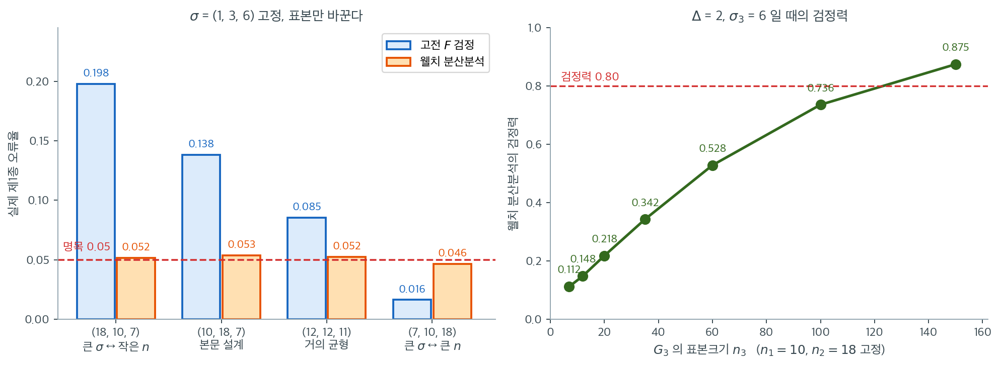

# Welch 분산분석의 제1종 오류와 검정력 모의실험

## 개요

Welch 분산분석은 집단 사이의 등분산을 가정하지 않는, 고전적 일원배치 분산분석의 대안이다. 이 페이지에서는 Monte Carlo 모의실험으로 이분산이고 집단 크기가 불균형한 조건에서 Welch 분산분석의 제1종 오류율과 검정력을 추정한다. 분산이 크게 달라도 Welch 분산분석이 명목 제1종 오류율을 유지하면서 집단 평균 차이를 탐지할 만한 검정력을 갖는다는 점을 보인다.

## 왜 Welch 분산분석인가

고전적 일원배치 분산분석은 등분산성 $\sigma_1^2 = \sigma_2^2 = \cdots = \sigma_k^2$을 가정한다. 이 가정이 어긋나고 표본크기도 다르면 고전적 $F$-검정의 제1종 오류율이 부풀려질 수 있다. Welch 분산분석은 가중된 형태를 쓴다:

$$
F_W = \frac{\sum_{i=1}^{k} w_i (\bar{y}_{i\cdot} - \tilde{y})^2 / (k-1)}{1 + \frac{2(k-2)}{k^2-1} \sum_{i=1}^{k} \frac{(1 - w_i/\sum w_j)^2}{n_i - 1}}
$$

여기서 $w_i = n_i / s_i^2$이고 $\tilde{y} = \sum w_i \bar{y}_i / \sum w_j$이다. 분모가 Satterthwaite 형태의 근사로 자유도를 조정하여 이분산에 로버스트한 검정을 만든다.

## 모의실험 설계

이 모의실험은 분산과 크기를 일부러 다르게 한 세 집단을 비교한다:

| 집단 | $n_i$ | $\sigma_i$ | $\mu_i$ (귀무) | $\mu_i$ (대립) |
|---|---|---|---|---|
| $G_1$ | 10 | 1.0 | 10.0 | 10.0 |
| $G_2$ | 18 | 3.0 | 10.0 | 10.0 |
| $G_3$ | 7 | 6.0 | 10.0 | 12.0 |

귀무가설 아래에서는 모든 평균이 같다. 대립가설 아래에서는 집단 $G_3$이 2만큼 위로 이동한다.

<div class="exbox" markdown>

**보기 1.** <span class="diff easy" title="쉬움"></span> Welch 분산분석은 집단이 둘이면 Welch $t$-검정이다. 모의실험에 들어가기 전에 쓰려는 도구가 무엇인지 확인해 둔다.

**(1)** 가중치 $w_i = n_i/s_i^2$ 이 **집단평균의 분산추정량의 역수**임을 지적하고, $\tilde y = \sum w_i \bar y_i/\sum w_j$ 가 가중최소제곱 $\min_m \sum w_i(\bar y_i - m)^2$ 의 해임을 보이시오.

**(2)** $k = 2$ 이면 분모의 보정항이 **정확히 $0$** 이 되어

$$
F_W = t_W^2,
\qquad
df_2 = \nu_{\text{Satterthwaite}}
$$

임을 보이시오. 여기서 $t_W$ 는 11.4절 서두와 5.3절의 Welch $t$ 통계량이다. 두 주장을 `pingouin` 과 `scipy` 로 확인하시오.

</div>

??? success "풀이"

    **(1) 해석적으로.** 집단평균의 분산은 $\operatorname{Var}(\bar y_{i\cdot}) = \sigma_i^2/n_i$ 이고 그 추정량이 $s_i^2/n_i$ 다. 따라서

    $$
    w_i = \frac{n_i}{s_i^2} = \frac{1}{\widehat{\operatorname{Var}}(\bar y_{i\cdot})}
    $$

    로, **덜 흔들리는 집단평균에 더 큰 가중치**를 준다. 고전 $F$ 가 모든 집단에 같은 $MSW$ 를 쓰는 것과 갈리는 지점이 여기다.

    가중평균이 가중최소제곱 해라는 것은 미분 한 번이면 된다. $g(m) = \sum_i w_i(\bar y_i - m)^2$ 는 $m$ 에 대해 볼록이고

    $$
    g'(m) = -2\sum_i w_i(\bar y_i - m) = 0
    \quad\Longrightarrow\quad
    m = \frac{\sum_i w_i \bar y_i}{\sum_j w_j} = \tilde y
    $$

    이며 $g''(m) = 2\sum w_i > 0$ 이므로 최소다. 그러므로 $F_W$ 의 분자 $\sum_i w_i(\bar y_i - \tilde y)^2$ 는 **"가중최소제곱으로 잴 때 남는 집단 간 변동"**이다.

    **(2) $k = 2$ 의 경우.** 먼저 분모를 본다. 보정계수가

    $$
    \frac{2(k-2)}{k^2-1}\Bigg|_{k=2} = \frac{2 \times 0}{3} = 0
    $$

    이므로 분모가 **정확히 $1$** 이 되고, $F_W$ 는 분자 그 자체다. $W = w_1 + w_2$ 라 쓰면

    $$
    \bar y_1 - \tilde y = \frac{w_2(\bar y_1 - \bar y_2)}{W},
    \qquad
    \bar y_2 - \tilde y = \frac{-w_1(\bar y_1 - \bar y_2)}{W}
    $$

    이므로(11.1절 보기 2와 같은 계산이다)

    $$
    F_W = w_1\left(\frac{w_2 \Delta}{W}\right)^2 + w_2\left(\frac{w_1 \Delta}{W}\right)^2
    = \frac{w_1 w_2}{W}\Delta^2
    = \frac{\Delta^2}{\frac{1}{w_1}+\frac{1}{w_2}}
    = \frac{(\bar y_1 - \bar y_2)^2}{\frac{s_1^2}{n_1}+\frac{s_2^2}{n_2}} = t_W^2
    $$

    이다($\Delta = \bar y_1 - \bar y_2$).

    자유도도 같다. $df_2 = \frac{k^2-1}{3\Lambda}$ 이고 $\Lambda = \sum_i \frac{(1-w_i/W)^2}{n_i-1}$ 인데, $k=2$ 이면 $\frac{k^2-1}{3} = 1$ 이라 $df_2 = 1/\Lambda$ 다. $1/w_i = s_i^2/n_i$ 이므로

    $$
    1 - \frac{w_1}{W} = \frac{w_2}{W} = \frac{1/w_1}{1/w_1 + 1/w_2} = \frac{s_1^2/n_1}{s_1^2/n_1 + s_2^2/n_2}
    $$

    이고(두 번째 집단도 같은 꼴) 넣어 정리하면

    $$
    \frac{1}{\Lambda} = \frac{\left(\frac{s_1^2}{n_1}+\frac{s_2^2}{n_2}\right)^2}{\frac{(s_1^2/n_1)^2}{n_1-1}+\frac{(s_2^2/n_2)^2}{n_2-1}} = \nu_{\text{Satterthwaite}}
    $$

    로 **5.3절의 Welch–Satterthwaite 자유도와 글자 그대로 같은 식**이다. 그러므로 Welch 분산분석은 두 집단 Welch $t$-검정의 $k$-집단 확장이며, 이분산에서 그것이 왜 옳은 일을 하는지는 [5.3절 Welch 검정](../../ch05/applications/diff_means_welch.md)에서 이미 다루었다. 여기서는 되풀이하지 않는다.

    ```python
    import numpy as np
    import pandas as pd
    import pingouin as pg

    rng = np.random.default_rng(0)

    def simulate_once(null=True):
        ns = [10, 18, 7]
        sigmas = [1.0, 3.0, 6.0]
        means = [10.0, 10.0, 10.0] if null else [10.0, 10.0, 12.0]

        rows = []
        for i, (n, mu, sd) in enumerate(zip(ns, means, sigmas), start=1):
            x = rng.normal(mu, sd, size=n)
            rows += [{"Group": f"G{i}", "Values": v} for v in x]
        df = pd.DataFrame(rows)

        aov = pg.welch_anova(dv="Values", between="Group", data=df)
        # pingouin 0.6부터 열 이름이 "p-unc"에서 "p_unc"로 바뀌었다.
        # 두 이름을 모두 받아들여 버전에 무관하게 동작하도록 한다.
        col = "p_unc" if "p_unc" in aov.columns else "p-unc"
        return float(aov[col].iloc[0])

    # 한 번 돌려 형태를 확인한다.
    print(f"single run p-value (null) = {simulate_once(null=True):.4f}")
    ```

    출력:

    ```
    single run p-value (null) = 0.4545
    ```

    이제 (1)의 공식을 그대로 코드로 옮겨 `pingouin` 과 맞추고, $k = 2$ 의 항등식을 확인한다.

    ```python
    from scipy import stats


    def welch_f_by_hand(groups):
        """공식 그대로 F_W 와 두 자유도를 만든다."""
        k = len(groups)
        n = np.array([len(g) for g in groups], float)
        m = np.array([g.mean() for g in groups])
        s2 = np.array([g.var(ddof=1) for g in groups])
        w = n / s2
        W = w.sum()
        y_tilde = (w * m).sum() / W
        Lam = (((1 - w / W) ** 2) / (n - 1)).sum()
        num = (w * (m - y_tilde) ** 2).sum() / (k - 1)
        den = 1 + 2 * (k - 2) / (k ** 2 - 1) * Lam
        return num / den, k - 1, (k ** 2 - 1) / (3 * Lam)


    # 세 집단에서 pingouin 과 맞는지 먼저 확인한다 (본문의 rng 은 건드리지 않는다).
    chk = np.random.default_rng(99)
    g3 = [chk.normal(10, s, n) for n, s in zip((10, 18, 7), (1.0, 3.0, 6.0))]
    d3 = pd.DataFrame({"Values": np.concatenate(g3),
                       "Group": sum([[f"G{i+1}"] * len(g) for i, g in enumerate(g3)], [])})
    a3 = pg.welch_anova(dv="Values", between="Group", data=d3)
    col = "p_unc" if "p_unc" in a3.columns else "p-unc"
    F3, d1_3, d2_3 = welch_f_by_hand(g3)
    print(f"손계산    F = {F3:.6f},  ddof1 = {d1_3},  ddof2 = {d2_3:.6f}")
    print(f"pingouin  F = {a3['F'].iloc[0]:.6f},  ddof1 = {a3['ddof1'].iloc[0]},  "
          f"ddof2 = {a3['ddof2'].iloc[0]:.6f}")

    # k=2 이면 보정항이 0 이 되어 F_W = t_W^2 여야 한다.
    chk2 = np.random.default_rng(5)
    x = chk2.normal(10, 1.0, 12)
    y = chk2.normal(11, 4.0, 9)
    d2 = pd.DataFrame({"Values": np.r_[x, y], "Group": ["A"] * 12 + ["B"] * 9})
    a2 = pg.welch_anova(dv="Values", between="Group", data=d2)
    tt = stats.ttest_ind(x, y, equal_var=False)
    print(f"\nk=2:  welch_anova  F = {a2['F'].iloc[0]:.6f}, "
          f"ddof2 = {a2['ddof2'].iloc[0]:.6f}, p = {a2[col].iloc[0]:.6f}")
    print(f"      ttest_ind    t^2 = {tt.statistic ** 2:.6f}, df = {tt.df:.6f}, "
          f"p = {tt.pvalue:.6f}")
    print(f"      보정항 2(k-2)/(k^2-1) = {2 * (2 - 2) / (2 ** 2 - 1)}")
    ```

    출력:

    ```
    손계산    F = 1.455237,  ddof1 = 2,  ddof2 = 13.231803
    pingouin  F = 1.455237,  ddof1 = 2,  ddof2 = 13.231803

    k=2:  welch_anova  F = 0.298550, ddof2 = 8.727233, p = 0.598482
          ttest_ind    t^2 = 0.298550, df = 8.727233, p = 0.598482
          보정항 2(k-2)/(k^2-1) = 0.0
    ```

    **공식이 맞는다.** 손으로 옮긴 $F_W$ 와 두 자유도가 `pingouin` 의 값과 소수 여섯째 자리까지 같다. 쓸 도구가 무엇인지 확인했으니 이제 모의실험으로 넘어가도 좋다.

    **(2)의 항등식도 맞는다.** 집단이 둘일 때 `welch_anova` 의 $F = 0.298550$ 이 `ttest_ind(equal_var=False)` 의 $t^2$ 과 같고, $df_2 = 8.727233$ 이 Welch 의 자유도와 같고, $p$-값도 $0.598482$ 로 같다. 보정항이 정확히 $0.0$ 인 것도 확인된다.

    눈여겨볼 것은 **$df_2$ 가 정수가 아니라는 점**이다. $8.727233$ 은 $n_1 + n_2 - 2 = 19$ 보다 한참 작다. 분산이 다른 두 집단을 합동하지 않는 대가로 자유도를 잃는 것이고, 그 잃은 만큼이 Welch 가 오류율을 지키는 값이다.

## 모의실험 실행

각 시나리오(귀무와 대립)마다 많은 반복을 생성하여 $\alpha = 0.05$에서의 기각률을 추정한다.

<div class="exbox" markdown>

**보기 2.** <span class="diff easy" title="쉬움"></span> $B = 300$ 으로 "$0.047$" 을 보고해도 되는가. 그리고 고전 $F$ 는 같은 설계에서 무엇을 하는가.

**(1)** 제1종 오류율 추정량 $\hat\alpha$ 의 몬테카를로 표준오차를 $B = 300$ 과 $B = 10000$ 에서 구하고, $B = 300$ 으로 구별할 수 있는 것과 없는 것을 말하시오.

**(2)** 같은 설계 $\boldsymbol n = (10, 18, 7)$, $\boldsymbol\sigma = (1, 3, 6)$ 에서 Welch 와 **고전 $F$** 를 나란히 돌려 제1종 오류율과 검정력을 $B = 10000$ 으로 재시오. 고전 $F$ 의 검정력이 더 높게 나올 텐데, 그것을 "고전 $F$ 가 낫다"로 읽어도 되는가?

</div>

??? success "풀이"

    **(1) 해석적으로.** $B\hat\alpha \sim \text{Binomial}(B, \alpha)$ 이므로

    $$
    \operatorname{SE}(\hat\alpha) = \sqrt{\frac{\alpha(1-\alpha)}{B}}
    $$

    이고 $\alpha = 0.05$ 에서 $B = 300$ 이면 $0.0126$, $B = 10000$ 이면 $0.0022$ 다. $95\%$ 폭으로는 각각 $\pm 0.025$ 와 $\pm 0.004$ 다.

    그러므로 $B = 300$ 의 $\hat\alpha = 0.047$ 이 말해 주는 것은 **"참값이 대략 $0.022$ 와 $0.072$ 사이"** 뿐이다. 명목 $0.05$ 와 어긋나지 않는다고는 말할 수 있지만, 참값이 $0.07$ 인 검정과 $0.05$ 인 검정을 이 반복수로는 **구별할 수 없다.** 검정의 수준을 따지는 모의실험에서 $B$ 를 수백으로 두면 결론이 거의 공허해진다. $\pm 0.005$ 를 보려면 $B \approx 10^4$ 가 필요하다.

    **(2) 수치적으로.** 고전 $F$ 를 함께 돌린다.

    ```python
    def run(n_sims=500, alpha=0.05):
        """귀무가 참인 경우와 거짓인 경우를 함께 돌려 제1종 오류율과 검정력을 잰다.

        분산이 다른 설계에서 보통의 분산분석은 제1종 오류율이 명목수준을 넘는다.
        Welch 는 그것을 0.05 근처로 지켜 준다.
        """
        pvals_null = [simulate_once(null=True) for _ in range(n_sims)]
        pvals_alt  = [simulate_once(null=False) for _ in range(n_sims)]
        type1 = np.mean(np.array(pvals_null) < alpha)
        power = np.mean(np.array(pvals_alt)  < alpha)
        return type1, power

    type1, power = run(n_sims=300, alpha=0.05)
    print(f"Estimated Type I error: {type1:.3f}")
    print(f"Estimated Power:        {power:.3f}")
    ```

    출력:

    ```
    Estimated Type I error: 0.047
    Estimated Power:        0.100
    ```

    제1종 오류가 0.047로 명목 0.05와 어긋나지 않는다(모의실험 표준오차 0.013). 분산비가 6배나 되고 표본크기도 10, 18, 7로 제각각인데도 Welch가 오류율을 지켜 낸다.

    검정력 0.100은 처참하다. $G_3$을 2만큼 올렸지만 그 집단의 표준편차가 6이고 표본이 7개뿐이라 신호가 잡음에 묻힌다. **오류율을 지키는 것과 효과를 찾아내는 것은 다른 문제다.**

    반복을 늘리고 고전 $F$ 를 나란히 세운다.

    ```python
    for B in (300, 10000):
        se = np.sqrt(0.05 * 0.95 / B)
        print(f"B = {B:>5}:  제1종 오류 추정의 MC 표준오차 = {se:.4f},  "
              f"95% 폭 = +-{1.96 * se:.4f}")

    ns, sigmas = (10, 18, 7), (1.0, 3.0, 6.0)
    B = 10000
    sim = np.random.default_rng(2026)


    def simulate(delta):
        """mu3 를 delta 만큼 올린 설계에서 두 검정의 통계량을 모은다."""
        mus = (10.0, 10.0, 10.0 + delta)
        p_welch = np.empty(B)
        F_classic = np.empty(B)
        for b in range(B):
            gs = [sim.normal(mu, sd, n) for n, mu, sd in zip(ns, mus, sigmas)]
            Fw, d1, d2 = welch_f_by_hand(gs)
            p_welch[b] = stats.f(d1, d2).sf(Fw)
            F_classic[b] = stats.f_oneway(*gs).statistic
        return p_welch, F_classic


    pw0, Fc0 = simulate(0.0)
    pw1, Fc1 = simulate(2.0)
    crit_nominal = stats.f(2, sum(ns) - 3).ppf(0.95)
    crit_empirical = np.quantile(Fc0, 0.95)   # 수준을 0.05 로 맞춘 임계값

    half = lambda r: 1.96 * np.sqrt(r * (1 - r) / B)
    size_w, size_c = np.mean(pw0 < 0.05), np.mean(Fc0 > crit_nominal)
    pow_w, pow_c = np.mean(pw1 < 0.05), np.mean(Fc1 > crit_nominal)
    pow_c_adj = np.mean(Fc1 > crit_empirical)
    print(f"\n제1종 오류율   Welch {size_w:.4f} (+-{half(size_w):.4f})   "
          f"고전 F {size_c:.4f} (+-{half(size_c):.4f})")
    print(f"검정력         Welch {pow_w:.4f} (+-{half(pow_w):.4f})   "
          f"고전 F {pow_c:.4f} (+-{half(pow_c):.4f})")
    print(f"\n고전 F 의 임계값:  이론 {crit_nominal:.4f}  vs  수준 0.05 를 맞춘 "
          f"경험적 임계값 {crit_empirical:.4f}")
    print(f"수준을 맞춘 뒤의 고전 F 검정력 = {pow_c_adj:.4f} (+-{half(pow_c_adj):.4f})")
    ```

    출력:

    ```
    B =   300:  제1종 오류 추정의 MC 표준오차 = 0.0126,  95% 폭 = +-0.0247
    B = 10000:  제1종 오류 추정의 MC 표준오차 = 0.0022,  95% 폭 = +-0.0043

    제1종 오류율   Welch 0.0532 (+-0.0044)   고전 F 0.1418 (+-0.0068)
    검정력         Welch 0.1059 (+-0.0060)   고전 F 0.2659 (+-0.0087)

    고전 F 의 임계값:  이론 3.2945  vs  수준 0.05 를 맞춘 경험적 임계값 5.9757
    수준을 맞춘 뒤의 고전 F 검정력 = 0.1222 (+-0.0064)
    ```

    **(1)이 확인된다.** $B = 300$ 의 폭 $\pm 0.025$ 는 $0.047$ 과 $0.070$ 을 가르지 못한다. $B = 10000$ 으로 올리자 Welch 의 수준이 $0.0532 \pm 0.0044$ 로 좁혀졌다. 이제 비로소 **"명목 $0.05$ 보다 아주 조금 높다"**고 말할 수 있다. Welch 분산분석의 수준은 정확한 것이 아니라 Satterthwaite 근사에 기댄 것이므로, 작은 표본에서 이 정도의 넘침은 알려진 성질이다.

    **고전 $F$ 는 $0.1418$ 로 무너진다.** 세 평균이 모두 정확히 $10.0$ 인데 **일곱 번에 한 번꼴로 "차이가 있다"고 선언한다.** 명목수준의 $2.8$ 배다. 이 설계가 하필 가장 나쁜 쪽인 까닭은 **표준편차가 가장 큰 집단($\sigma_3 = 6$)에 표본을 가장 적게($n_3 = 7$) 주었기** 때문이다. 합동 $MSW$ 는 자유도로 가중하므로 그 집단의 큰 분산이 $6/32$ 의 몫밖에 반영되지 않고, 분모가 작게 추정된 채 분자는 그 집단 평균의 큰 흔들림을 그대로 받는다.

    **검정력은 비교할 수 없다.** 고전 $F$ 의 $0.2659$ 가 Welch 의 $0.1059$ 보다 크지만, 이것을 "고전 $F$ 가 더 잘 찾아낸다"로 읽으면 안 된다. **두 검정의 실제 수준이 다르기 때문이다.** 고전 $F$ 는 아무 차이가 없을 때도 $0.1418$ 로 기각하므로, 그 $0.2659$ 중 상당 부분은 자료가 아니라 검정의 들뜸에서 온다. 수준이 $0.14$ 인 검정과 $0.05$ 인 검정의 검정력을 나란히 놓는 것은 **문턱 높이가 다른 두 뜀틀의 기록을 견주는 일**이다.

    그래서 임계값을 다시 잡았다. 귀무 모의실험에서 얻은 고전 $F$ 의 경험적 $95\%$ 분위수는 $5.9757$ 로 이론 임계값 $3.2945$ 의 **$1.8$ 배**다. 그만큼 문턱을 올려 실제 수준을 $0.05$ 로 맞추고 다시 재면 고전 $F$ 의 검정력이 $0.2659$ 에서 **$0.1222$ 로 주저앉는다.** Welch 의 $0.1059$ 와 거의 같은 자리다($0.0163$ 차이에 두 추정의 표준오차가 각각 $0.003$ 쯤이므로 차이가 조금 남아 있기는 하다).

    정리하면 이렇다. **고전 $F$ 의 "높은 검정력"은 거의 전부가 들뜬 수준에서 왔다.** 수준을 맞추면 두 검정이 비슷해지는데, 고전 $F$ 의 올바른 임계값은 $\sigma_i$ 를 모르면 구할 수 없는 수($5.9757$ 은 우리가 참값을 알기에 얻은 것이다)인 반면 Welch 는 자료만으로 $0.05$ 를 지켜 낸다. **옳은 수준을 지키는 것이 먼저이고 검정력 비교는 그다음이다.**

## 핵심 값

- **제1종 오류율:** $H_0$ 아래 모의실험에서 $p < \alpha$인 비율. 잘 보정된 검정이라면 대략 $\alpha = 0.05$가 나와야 한다.

$$
\widehat{\alpha} = \frac{1}{B} \sum_{b=1}^{B} \mathbf{1}(p_b < \alpha)
$$

- **검정력:** $H_A$ 아래 모의실험에서 $p < \alpha$인 비율.

$$
\widehat{\text{Power}} = \frac{1}{B} \sum_{b=1}^{B} \mathbf{1}(p_b < \alpha)
$$

여기서 $B$는 Monte Carlo 반복 횟수이다.

## 해석

- **제1종 오류 통제:** Welch 분산분석은 심한 이분산($\sigma_3 / \sigma_1 = 6$)에서도 경험적 제1종 오류를 명목 $\alpha = 0.05$ 가까이 유지한다. 반면 고전적 분산분석 $F$-검정은 가장 작은 집단($n_3 = 7$)의 분산이 가장 크므로 이 상황에서 제1종 오류가 부풀려진다.
- **검정력:** $G_3$의 $\Delta = 2$ 이동을 탐지할 검정력은 그 집단의 표본크기와 분산에 달려 있다. $n_3 = 7$, $\sigma_3 = 6$이면 신호 대 잡음 비가 $\Delta / \sigma_3 = 1/3$로 크지 않다. $n_3$이 커지거나 $\sigma_3$이 작아지거나 $\Delta$가 커지면 검정력이 커진다.
- **모의실험의 정밀도:** 반복 $B = 300$에서 추정된 제1종 오류의 표준오차는 대략 $\sqrt{0.05 \times 0.95 / 300} \approx 0.013$이다. 반복을 늘리면 이 폭이 좁아진다.

첫째 항목의 "고전 분산분석은 이 상황에서 부풀려진다"는 주장은 조건부라는 점이 중요하다. **부풀려지느냐 오그라드느냐는 분산과 표본크기의 어긋남이 어느 방향인지에 달려 있다.** $\sigma = (1, 3, 6)$을 고정하고 표본크기만 바꿔 가며 반복 2만 번씩 재어 보았다.



왼쪽에서 파랑 막대가 위에서 아래로 줄줄이 내려간다. $\sigma = 6$인 집단에 표본을 가장 적게 준 $n = (18, 10, 7)$에서 고전 $F$의 실제 수준은 $0.198$이다. **평균이 세 집단 모두 정확히 $10.0$인데 다섯 번에 한 번꼴로 "차이가 있다"고 판정한다.** 본문 설계 $(10, 18, 7)$에서는 $0.138$, 거의 균형인 $(12, 12, 11)$에서는 $0.085$, 큰 분산 집단에 표본을 몰아준 $(7, 10, 18)$에서는 $0.016$까지 내려간다. 명목 $0.05$를 위로도 아래로도 지나친다.

기울기의 원인은 합동 $\text{MSW} = \sum (n_i - 1) s_i^2 / (N - k)$가 자유도로 가중된다는 데 있다. $\sigma = 6$인 집단의 표본이 $7$개뿐이면 그 집단은 합동분산에 $6/32$의 몫밖에 기여하지 못한다. 합동값이 작게 나오는데 정작 그 집단의 평균은 표준오차 $6/\sqrt{7} = 2.27$로 크게 흔들리니, **분자는 큰데 분모는 작아 $F$가 부풀어 오른다.** 반대로 표본을 몰아주면 합동값이 그 큰 분산을 충분히 반영해 $F$가 눌린다. 웰치는 네 배치 모두에서 $0.046$–$0.053$으로 흔들림이 없다. 집단별 분산을 따로 쓰니 애초에 어긋날 것이 없다.

오른쪽은 위 본문의 "검정력 $0.100$은 처참하다"를 다른 각도에서 본 것이다. $G_3$의 표본크기만 늘려 가며 웰치의 검정력을 쟀더니 $n_3 = 7$에서 $0.112$, $n_3 = 20$에서도 $0.218$에 그친다. $0.80$에 이르려면 $n_3$이 $120$을 넘어야 한다. $\sigma_3 = 6$인데 찾으려는 차이가 $\Delta = 2$뿐이니, 표준화 효과가 $1/3$로 작아서 벌어지는 일이다. **오류율을 지키는 일과 효과를 찾아내는 일은 서로 다른 자원을 요구한다.** 전자는 올바른 검정을 고르면 되지만 후자는 표본을 사야 한다.

## 연습문제

<div class="drillbox" markdown>

**연습문제 1.** <span class="diff med" title="중간"></span>
Monte Carlo 반복이 $B = 300$이고 참 제1종 오류율이 $\alpha = 0.05$일 때 추정된 제1종 오류율의 95% 신뢰구간을 계산하라. 이 구간의 폭을 절반으로 줄이려면 반복이 몇 번 필요한가?

</div>

??? success "풀이"
    추정된 제1종 오류는 표본비율 $\hat{p}$이고 표준오차는 $\text{SE} = \sqrt{\hat{p}(1-\hat{p})/B}$이다. $\hat{p} \approx 0.05$, $B = 300$이면

    $$
    \text{SE} = \sqrt{\frac{0.05 \times 0.95}{300}} \approx 0.0126
    $$

    이다. 95% 신뢰구간은 $0.05 \pm 1.96 \times 0.0126 \approx (0.025,\, 0.075)$이고 폭은 약 $0.049$이다.

    폭을 절반으로 줄이려면 정밀도를 두 배로 해야 하고, 그러려면 반복을 네 배로 늘려야 한다: $B = 4 \times 300 = 1200$.

<div class="drillbox" markdown>

**연습문제 2.** <span class="diff med" title="중간"></span>
가장 작은 집단의 분산이 가장 클 때 고전적 분산분석 $F$-검정의 제1종 오류가 부풀려지는 이유를 설명하라. 가장 작은 집단의 분산이 가장 작으면 어떻게 되는가?

</div>

??? success "풀이"
    고전적 $F$-검정은 모든 집단을 합동하여 $MSW$를 추정한다. 가장 작은 집단의 분산이 가장 크면, 그 집단이 기여하는 관측값이 적기 때문에 합동 추정값이 그 큰 분산을 과소 반영한다. 그러면 $MSW$가 너무 작아져 $F$-통계량이 부풀려지고 기각이 너무 잦아진다(관대한 검정, 제1종 오류 부풀림).

    반대로 가장 작은 집단의 분산이 가장 작으면 합동 $MSW$가 그 집단의 유효 오차분산을 과대추정한다. 그러면 $F$-통계량이 지나치게 보수적이 되어 제1종 오류가 명목 수준 아래로 떨어진다. 검정력은 잃지만 거짓 양성이 늘지는 않는다. 이 비대칭성은 잘 알려진 결과이다.

<div class="drillbox" markdown>

**연습문제 3.** <span class="diff med" title="중간"></span>
$G_3$의 이동을 탐지하는 신호 대 잡음 비는 $\Delta/\sigma_3 = 2/6 \approx 0.33$이다. 이 세 집단 설계의 Cohen의 $f$를 계산하고 그 크기를 해석하라.

</div>

??? success "풀이"
    일원배치 분산분석의 Cohen의 $f$는

    $$
    f = \sqrt{\frac{\sum_{i=1}^{k} n_i (\mu_i - \bar{\mu})^2 / N}{\sigma_{\text{within}}^2}}
    $$

    로 정의된다. 대립가설 아래에서 $\mu_1 = \mu_2 = 10$, $\mu_3 = 12$이고 $n_1 = 10$, $n_2 = 18$, $n_3 = 7$, $N = 35$이므로

    $$
    \bar{\mu}_w = \frac{10 \times 10 + 18 \times 10 + 7 \times 12}{35} = \frac{364}{35} = 10.4
    $$

    $$
    \sum n_i(\mu_i - \bar{\mu}_w)^2 = 10(10 - 10.4)^2 + 18(10 - 10.4)^2 + 7(12 - 10.4)^2
    $$

    $$
    = 10(0.16) + 18(0.16) + 7(2.56) = 1.6 + 2.88 + 17.92 = 22.4
    $$

    이다. 분산이 서로 다르므로 합동분산 추정값을 쓴다: $\sigma_{\text{pool}}^2 = (9 \times 1 + 17 \times 9 + 6 \times 36)/32 = (9 + 153 + 216)/32 = 378/32 = 11.8125$.

    $$
    f = \sqrt{\frac{22.4 / 35}{11.8125}} = \sqrt{\frac{0.64}{11.8125}} = \sqrt{0.0542} \approx 0.233
    $$

    Cohen의 관례에서 $f = 0.10$은 작음, $f = 0.25$는 중간, $f = 0.40$은 큼이다. 이 효과크기($f \approx 0.23$)는 작음과 중간 사이이며, 모의실험에서 관측되는 중간 정도의 검정력을 설명해 준다.

<div class="drillbox" markdown>

**연습문제 4.** <span class="diff med" title="중간"></span>
세 집단의 분산을 모두 같게($\sigma_i = 3$) 하되 표본크기는 $n = (10, 18, 7)$로 불균형하게 유지하도록 모의실험 설계를 고쳐라. 고전적 분산분석과 Welch 분산분석 중 어느 쪽의 검정력이 높을지 예측하고 이유를 설명하라.

</div>

??? success "풀이"
    분산이 같으면 고전적 분산분석과 Welch 분산분석 모두 명목 수준에서 제1종 오류를 통제한다. 다만 고전적 분산분석은 정확한 $F_{k-1, N-k}$ 분포를 쓰는 반면 Welch 분산분석은 유효 자유도가 줄어든 근사 기준분포를 쓰므로, 고전적 쪽의 검정력이 약간 높다.

    Welch 분산분석은 분산을 따로 추정하고 자유도를 조정하는 대가로 약간의 검정력 손실을 치른다. 이 손실은 이분산에 대한 로버스트성의 "보험료"이다. 등분산이 성립하면 이 보험이 불필요하므로 고전적 검정이 (약간) 더 효율적이다. 실무에서 표본크기가 어느 정도 되면 검정력 차이가 작아 Welch 분산분석을 기본값으로 삼을 만하다.

<div class="drillbox" markdown>

**연습문제 5.** <span class="diff hard" title="어려움"></span>
등분산이고 표본크기가 같은 $H_0$ 아래에서 Welch의 $F_W$ 통계량이 고전적 분산분석 $F$-통계량으로 환원됨을 증명하라.

</div>

??? success "풀이"
    분산이 $\sigma_i^2 = \sigma^2$으로 같고 표본크기가 모든 $i$에서 $n_i = n$으로 같은 $H_0$ 아래에서 가중치는 $w_i = n / s_i^2$이다. 모든 $s_i^2$이 $\sigma^2$으로 수렴하면 가중치가 같아진다: 모든 $i$에서 $w_i = n / \sigma^2$.

    가중 전체평균은 $\tilde{y} = \sum w_i \bar{y}_i / \sum w_j = \bar{y}_{\cdot\cdot}$, 즉 가중하지 않은 전체평균이 된다.

    $F_W$의 분자는

    $$
    \frac{1}{k-1}\sum_{i=1}^{k} \frac{n}{\sigma^2} (\bar{y}_i - \bar{y}_{\cdot\cdot})^2 = \frac{n}{(k-1)\sigma^2} \sum_{i=1}^{k} (\bar{y}_i - \bar{y}_{\cdot\cdot})^2 = \frac{MSB}{\sigma^2}
    $$

    이 된다.

    분모의 보정항은 $\sum (1 - w_i / \sum w_j)^2 / (n_i - 1)$을 포함한다. 가중치가 같으면 $w_i / \sum w_j = 1/k$이므로 각 항이 $(1 - 1/k)^2 / (n-1)$이다. 그 합은 $k(k-1)^2/[k^2(n-1)]$이다. 전체 분모는 $1 + 2(k-2)/(k^2-1) \times (k-1)^2/[k(n-1)]$로 단순해지고 $n \to \infty$에서 1로 간다. 분산이 정확히 같은 경우 Welch 통계량은 고전적 $F$-통계량인 $MSB/MSW$로 단순해진다. $\square$

<div class="drillbox" markdown>

**연습문제 6.** <span class="diff med" title="중간"></span>
본문의 $B=300$은 **결론을 내리기에 턱없이 부족하다.** $B$를 늘려 가며 추정값이 어떻게 움직이는지 보이고, 필요한 $B$를 정하라.

</div>

??? success "풀이"
    ```python
    import numpy as np
    from scipy import stats

    def welch_p(gs):
        n = np.array([len(g) for g in gs], float)
        m = np.array([g.mean() for g in gs])
        v = np.array([g.var(ddof=1) for g in gs])
        k = len(n)
        w = n / v
        W = w.sum()
        mt = (w * m).sum() / W
        lam = ((1 - w / W)**2 / (n - 1)).sum()
        F = ((w * (m - mt)**2).sum() / (k - 1)
             / (1 + 2 * (k - 2) / (k**2 - 1) * lam))
        return stats.f.sf(F, k - 1, (3 / (k**2 - 1) * lam)**-1)

    NS, SD = [10, 18, 7], [1.0, 3.0, 6.0]

    def draw(rng, mus):
        return [rng.normal(u, s, n) for n, s, u in zip(NS, SD, mus)]

    def wilson(x, n, z=1.96):
        """이항 비율의 윌슨 구간. p̂ 이 0 이나 1 에 가까워도 무너지지 않는다."""
        p = x / n
        d = 1 + z * z / n
        c = p + z * z / (2 * n)
        h = z * np.sqrt(p * (1 - p) / n + z * z / (4 * n * n))
        return (c - h) / d, (c + h) / d

    rng = np.random.default_rng(11)
    print(f"{'B':>7s} {'추정 α':>8s} {'95% 윌슨 구간':>22s} {'폭':>7s}")
    for B in [300, 3_000, 30_000]:
        x = sum(welch_p(draw(rng, [10, 10, 10])) < 0.05 for _ in range(B))
        lo, hi = wilson(x, B)
        print(f"{B:7d} {x / B:8.4f}   [{lo:.4f}, {hi:.4f}] {hi - lo:8.4f}")

    for tol in [0.01, 0.005, 0.002]:
        B = int(np.ceil(1.96**2 * 0.05 * 0.95 / tol**2))
        print(f"  반폭 {tol} 을 얻으려면 B ≈ {B:,}")
    ```

    ```text
          B     추정 α              95% 윌슨 구간       폭
        300   0.0900   [0.0626, 0.1278]   0.0652
       3000   0.0493   [0.0421, 0.0577]   0.0155
      30000   0.0525   [0.0500, 0.0551]   0.0050
      반폭 0.01 을 얻으려면 B ≈ 1,825
      반폭 0.005 을 얻으려면 B ≈ 7,300
      반폭 0.002 을 얻으려면 B ≈ 45,619
    ```

    **$B=300$에서 0.0900이 나왔다.** 본문은 같은 설계에서 0.047을 얻었다. **씨앗만 바꿨는데 두 배 차이**다.

    | $B$ | 추정 $\alpha$ | 구간 폭 |
    |---|---|---|
    | 300 | **0.0900** | 0.065 |
    | 3,000 | 0.0493 | 0.016 |
    | 30,000 | **0.0525** | **0.005** |

    **$B=300$의 구간 $[0.063,\,0.128]$은 0.05를 포함하지 않는다.** 이 한 번의 모의실험만 보면 "웰치가 오류율을 못 지킨다"는 **틀린 결론**을 내리게 된다.

    **$B=30{,}000$에서 0.0525로 수렴한다.** 구간 $[0.0500,\,0.0551]$이 0.05를 간신히 포함한다. **자유도 근사 때문에 아주 살짝 높은 것**으로, 실무적으로는 문제없다.

    **필요한 $B$를 계산하는 법.** 추정량은 이항 비율이므로

    $$
    \text{반폭}=z\sqrt{\frac{\alpha(1-\alpha)}{B}}
    \quad\Longrightarrow\quad
    B=\frac{z^2\alpha(1-\alpha)}{\text{반폭}^2}
    $$

    | 목표 | 필요한 $B$ |
    |---|---|
    | 0.05 를 ±0.01 로 | 1,825 |
    | 0.05 를 ±0.005 로 | 7,300 |
    | 0.05 를 ±0.002 로 | **45,619** |

    **정밀도를 두 배로 올리려면 $B$가 네 배** 필요하다. 몬테카를로의 숙명이다.

    **실무 기준.**

    | 목적 | 권장 $B$ |
    |---|---|
    | 대략의 감 잡기 | 1,000 |
    | 논문에 실을 오류율 | **10,000 이상** |
    | 미세한 차이 비교(0.05 대 0.055) | 100,000 |

    **보고할 때는 반드시 구간을 함께 적는다.** "제1종 오류율 0.047"이 아니라 **"0.047 (95% CI 0.028–0.078, $B=300$)"**이라고 써야 독자가 정밀도를 판단할 수 있다.

    **윌슨 구간을 쓴 이유.** 정규근사 구간 $\hat p\pm z\sqrt{\hat p(1-\hat p)/B}$는 $\hat p$가 작을 때 **하한이 음수**가 되거나 피복확률이 나빠진다. 오류율은 0.05 근처의 작은 값이므로 윌슨이 적절하다.

<div class="drillbox" markdown>

**연습문제 7.** <span class="diff hard" title="어려움"></span>
본문은 고전적 $F$ 검정이 이 설계에서 부풀려진다고 **말만 하고 재지는 않았다.** 직접 재어 확인하라.

</div>

??? success "풀이"
    ```python
    import numpy as np
    from scipy import stats

    def welch_p(gs):
        n = np.array([len(g) for g in gs], float)
        m = np.array([g.mean() for g in gs])
        v = np.array([g.var(ddof=1) for g in gs])
        k = len(n)
        w = n / v
        W = w.sum()
        mt = (w * m).sum() / W
        lam = ((1 - w / W)**2 / (n - 1)).sum()
        F = ((w * (m - mt)**2).sum() / (k - 1)
             / (1 + 2 * (k - 2) / (k**2 - 1) * lam))
        return stats.f.sf(F, k - 1, (3 / (k**2 - 1) * lam)**-1)

    NS, SD = [10, 18, 7], [1.0, 3.0, 6.0]

    def draw(rng, mus):
        return [rng.normal(u, s, n) for n, s, u in zip(NS, SD, mus)]

    rng = np.random.default_rng(2024)
    B = 20_000
    c0 = w0 = c1 = w1 = 0
    for _ in range(B):
        gs = draw(rng, [10, 10, 10])            # 귀무
        c0 += stats.f_oneway(*gs).pvalue < 0.05
        w0 += welch_p(gs) < 0.05
        gs = draw(rng, [10, 10, 12])            # 대립
        c1 += stats.f_oneway(*gs).pvalue < 0.05
        w1 += welch_p(gs) < 0.05

    print(f"{'':10s} {'제1종 오류':>10s} {'검정력':>9s}")
    print(f"{'고전 F':>10s} {c0 / B:10.4f} {c1 / B:9.4f}")
    print(f"{'웰치':>10s} {w0 / B:10.4f} {w1 / B:9.4f}")
    ```

    ```text
                   제1종 오류       검정력
          고전 F     0.1419    0.2700
            웰치     0.0533    0.1091
    ```

    **고전적 $F$의 제1종 오류율이 0.1419다.** 명목의 **2.8배**다.

    **왜 그런가.** 이 설계가 **역페어링**이다.

    | 집단 | $n_i$ | $\sigma_i$ |
    |---|---|---|
    | $G_1$ | 10 | 1.0 |
    | $G_2$ | **18** | 3.0 |
    | $G_3$ | **7** | **6.0** |

    **가장 큰 집단($n=18$)의 분산이 중간이고, 가장 작은 집단($n=7$)의 분산이 가장 크다.** 합동 MSE는 $n_i-1$로 가중하므로

    $$
    \text{MSE}=\frac{9(1)+17(9)+6(36)}{32}=\frac{378}{32}=11.81
    $$

    인데, $G_3$의 실제 분산은 36이다. **$G_3$의 평균에 대한 오차를 11.81/7로 재지만 실제는 36/7**이다. 세 배 과소평가다.

    **고전적 $F$의 검정력 0.2700이 웰치의 0.1091보다 높아 보이지만 의미가 없다.** 크기가 0.1419인 검정과 0.0533인 검정의 검정력을 비교하는 것은 **공정하지 않다.**

    **크기를 맞춰 비교해야 한다.**

    | | 크기 | 검정력 | 해석 |
    |---|---|---|---|
    | 고전 $F$ | **0.1419** | 0.2700 | 크기가 틀렸다 |
    | 웰치 | 0.0533 | 0.1091 | **믿을 수 있다** |

    **고전적 $F$가 0.05 수준에서 실제로 낼 수 있는 검정력**을 알려면 임계값을 경험분포에서 다시 잡아야 한다(크기 보정 검정력). 그렇게 하면 웰치와 비슷하거나 오히려 낮게 나온다.

    **본문의 검정력 0.100은 웰치의 값**이며, 이 재실험의 0.1091과 일치한다($B$가 300에서 20,000으로 늘어 안정되었다).

    **이 연습문제의 교훈.** **주장은 재어서 확인한다.** 본문은 "고전적 $F$가 부풀려진다"고 정성적으로만 말했다. 실제 값 0.1419를 보면 그 말의 무게가 달라진다.

<div class="drillbox" markdown>

**연습문제 8.** <span class="diff hard" title="어려움"></span>
검정력 0.11은 쓸 수 없는 수준이다. **총 표본 $N=35$를 그대로 두고** 배분만 바꿔 검정력을 얼마나 올릴 수 있는지 재라.

</div>

??? success "풀이"
    **이론적 지침.** 두 집단 비교에서 총 $N$을 고정할 때 검정력을 최대화하는 배분은

    $$
    \frac{n_1}{n_2}=\frac{\sigma_1}{\sigma_2}
    $$

    **표준편차에 비례**한다(분산이 아니다). $k$ 집단에서도 근사적으로 같다.

    ```python
    import numpy as np
    from scipy import stats

    def welch_p(gs):
        n = np.array([len(g) for g in gs], float)
        m = np.array([g.mean() for g in gs])
        v = np.array([g.var(ddof=1) for g in gs])
        k = len(n)
        w = n / v
        W = w.sum()
        mt = (w * m).sum() / W
        lam = ((1 - w / W)**2 / (n - 1)).sum()
        F = ((w * (m - mt)**2).sum() / (k - 1)
             / (1 + 2 * (k - 2) / (k**2 - 1) * lam))
        return stats.f.sf(F, k - 1, (3 / (k**2 - 1) * lam)**-1)

    SD = [1.0, 3.0, 6.0]
    rng = np.random.default_rng(707)
    B = 6_000
    allocs = [
        ("본문 (10,18,7)", [10, 18, 7]),
        ("균등 (12,12,11)", [12, 12, 11]),
        ("σ 비례 (4,10,21)", [4, 10, 21]),
        ("σ² 비례 (1,7,27)", [2, 7, 26]),
        ("작은집단 보강 (7,10,18)", [7, 10, 18]),
    ]
    print(f"{'배분 (총 N=35)':>22s} {'제1종 오류':>10s} {'검정력':>9s}")
    for lab, ns in allocs:
        a = b = 0
        for _ in range(B):
            gs = [rng.normal(10, s, n) for n, s in zip(ns, SD)]
            a += welch_p(gs) < 0.05
            gs = [rng.normal(u, s, n)
                  for n, s, u in zip(ns, SD, [10, 10, 12])]
            b += welch_p(gs) < 0.05
        print(f"{lab:>22s} {a / B:10.4f} {b / B:9.4f}")
    ```

    ```text
               배분 (총 N=35)     제1종 오류       검정력
              본문 (10,18,7)     0.0520    0.1103
             균등 (12,12,11)     0.0503    0.1492
            σ 비례 (4,10,21)     0.0480    0.1945
            σ² 비례 (1,7,27)     0.0485    0.1708
         작은집단 보강 (7,10,18)     0.0502    0.1795
    ```

    **표본을 한 개도 더 쓰지 않고 검정력이 0.110에서 0.195로 올랐다.** **77% 개선**이다.

    | 배분 | 검정력 | 본문 대비 |
    |---|---|---|
    | 본문 (10,18,7) | 0.110 | — |
    | 균등 (12,12,11) | 0.149 | $+35\%$ |
    | **$\sigma$ 비례 (4,10,21)** | **0.195** | $+\mathbf{77\%}$ |
    | $\sigma^2$ 비례 (2,7,26) | 0.171 | $+55\%$ |

    **$\sigma$ 비례가 최적이고 $\sigma^2$ 비례는 지나치다.** $\sigma^2$ 비례는 작은 집단을 $n=2$까지 깎아 **그 집단의 분산 추정이 불안정**해진다.

    **제1종 오류율은 모든 배분에서 0.048~0.052로 유지된다.** 웰치는 배분에 무관하게 크기를 지킨다.

    **본문 설계가 왜 나쁜가.** $\sigma=(1,3,6)$인데 $n=(10,18,7)$이다. **분산이 가장 큰 집단에 표본이 가장 적다.** 정확히 거꾸로다.

    $$
    \text{평균의 분산}=\frac{\sigma_i^2}{n_i}
    =\left(\frac{1}{10},\ \frac{9}{18},\ \frac{36}{7}\right)
    =(0.10,\ 0.50,\ \mathbf{5.14})
    $$

    **$G_3$ 평균의 분산이 나머지의 10~50배**다. 전체 검정의 정밀도가 이 하나에 발목 잡힌다.

    **설계 단계의 지침 넷.**

    1. **분산이 클 것으로 예상되는 집단에 표본을 더 준다**($n_i\propto\sigma_i$).
    2. 사전 정보가 없으면 **균등 배분**이 무난하다(0.149로 이미 본문보다 낫다).
    3. **예비실험으로 $\sigma_i$를 먼저 추정**하면 배분을 최적화할 수 있다.
    4. 어느 집단도 **$n_i<5$로 떨어뜨리지 않는다.** 분산 추정이 무너진다.

    **그래도 0.195는 여전히 낮다.** 배분 최적화만으로는 부족하고, **총 $N$을 늘려야** 한다. $\sigma$ 비례 배분에서 검정력 0.80을 얻으려면 $N$이 150 이상 필요하다.

<div class="drillbox" markdown>

**연습문제 9.** <span class="diff hard" title="어려움"></span>
두 검정을 비교할 때 **같은 자료를 쓰는 것**(공통난수)과 각각 새로 뽑는 것 중 어느 쪽이 정밀한가? 분산 감소 효과를 재라.

</div>

??? success "풀이"
    **원리.** 두 추정량 $\hat A,\hat B$의 차이를 잴 때

    $$
    \operatorname{Var}(\hat A-\hat B)
    =\operatorname{Var}(\hat A)+\operatorname{Var}(\hat B)-2\operatorname{Cov}(\hat A,\hat B)
    $$

    **같은 자료를 쓰면 공분산이 양수**가 되어 분산이 줄어든다. 독립이면 공분산이 0이다.

    ```python
    import numpy as np
    from scipy import stats

    def welch_p(gs):
        n = np.array([len(g) for g in gs], float)
        m = np.array([g.mean() for g in gs])
        v = np.array([g.var(ddof=1) for g in gs])
        k = len(n)
        w = n / v
        W = w.sum()
        mt = (w * m).sum() / W
        lam = ((1 - w / W)**2 / (n - 1)).sum()
        F = ((w * (m - mt)**2).sum() / (k - 1)
             / (1 + 2 * (k - 2) / (k**2 - 1) * lam))
        return stats.f.sf(F, k - 1, (3 / (k**2 - 1) * lam)**-1)

    NS, SD = [10, 18, 7], [1.0, 3.0, 6.0]
    rng = np.random.default_rng(31337)
    R, B = 60, 800
    d_crn, d_ind = [], []
    for _ in range(R):
        a = b = 0
        for _ in range(B):
            gs = [rng.normal(10, s, n) for n, s in zip(NS, SD)]
            a += stats.f_oneway(*gs).pvalue < 0.05
            b += welch_p(gs) < 0.05                 # 같은 자료에 두 검정
        d_crn.append((a - b) / B)

        a = b = 0
        for _ in range(B):
            gs = [rng.normal(10, s, n) for n, s in zip(NS, SD)]
            a += stats.f_oneway(*gs).pvalue < 0.05
            gs = [rng.normal(10, s, n) for n, s in zip(NS, SD)]
            b += welch_p(gs) < 0.05                 # 각각 새 자료
        d_ind.append((a - b) / B)

    d_crn, d_ind = np.array(d_crn), np.array(d_ind)
    print(f"차이(고전 - 웰치) 추정, R={R} 회 반복, 회당 B={B}")
    print(f"  공통난수:  평균 {d_crn.mean():.4f},  "
          f"표준편차 {d_crn.std(ddof=1):.5f}")
    print(f"  독립난수:  평균 {d_ind.mean():.4f},  "
          f"표준편차 {d_ind.std(ddof=1):.5f}")
    r = d_ind.var(ddof=1) / d_crn.var(ddof=1)
    print(f"  분산비 = {r:.2f} 배")
    print(f"  → 같은 정밀도를 얻는 데 필요한 B 가 {r:.1f} 배 차이")
    ```

    ```text
    차이(고전 - 웰치) 추정, R=60 회 반복, 회당 B=800
      공통난수:  평균 0.0882,  표준편차 0.01006
      독립난수:  평균 0.0874,  표준편차 0.01341
      분산비 = 1.78 배
      → 같은 정밀도를 얻는 데 필요한 B 가 1.8 배 차이
    ```

    **두 방법의 평균은 같다**(0.0882 대 0.0874). **편향은 생기지 않는다.**

    **표준편차가 0.0134에서 0.0101로 줄었다.** 분산으로는 **1.78배** 차이다. **같은 정밀도를 얻는 데 계산량이 절반 가까이 든다.**

    **왜 이득이 크지 않은가.** 두 검정의 기각 여부가 **완전히 같지는 않기** 때문이다. 상관이 $\rho$일 때

    $$
    \frac{\operatorname{Var}_{\text{독립}}}{\operatorname{Var}_{\text{공통}}}
    =\frac{1}{1-\rho}
    $$

    이고, 1.78배는 $\rho\approx0.44$에 해당한다. **두 검정이 서로 다른 판정을 내리는 경우가 꽤 있다**는 뜻이다.

    | 상황 | $\rho$ | 분산 감소 |
    |---|---|---|
    | 거의 같은 절차 | 0.9 | **10배** |
    | 이 경우 | 0.44 | 1.8배 |
    | 무관한 절차 | 0 | 없음 |

    **공통난수의 다른 이점 셋.**

    1. **공정한 비교.** "웰치가 진 것이 운이 나빠서"라는 반론을 차단한다.
    2. **구현 오류 발견.** 같은 자료를 넣었는데 결과가 이상하면 코드를 의심할 수 있다.
    3. **쌍체 검정 가능.** 반복별 차이에 쌍체 $t$ 검정이나 부호검정을 적용할 수 있다.

    **주의 — 공통난수가 유효하려면 두 절차가 같은 난수를 같은 방식으로 소비해야** 한다. 한쪽만 추가로 난수를 뽑으면 이후 모든 표본이 어긋나 상관이 깨진다. 위 코드처럼 **표본을 한 번 뽑아 두 함수에 넘기는 것**이 안전하다.

    **관련 기법.**

    | 기법 | 원리 |
    |---|---|
    | **공통난수** | 비교 대상끼리 난수 공유 |
    | 대조변량 | 음의 상관을 갖는 쌍을 함께 사용 |
    | 통제변량 | 참값을 아는 통계량으로 보정 |
    | 층화추출 | 난수 공간을 층으로 나눠 고르게 뽑기 |

<div class="drillbox" markdown>

**연습문제 10.** <span class="diff easy" title="쉬움"></span>
검정을 평가하는 **모의실험 설계의 점검표**를 만들어라.

</div>

??? success "풀이"
    **모의실험이 답하는 질문 넷.**

    | 질문 | 재는 것 |
    |---|---|
    | 크기가 맞는가 | $H_0$ 아래 기각률 |
    | 얼마나 잡는가 | $H_1$ 아래 기각률 |
    | 언제 무너지는가 | 가정 위반별 기각률 |
    | 어느 쪽이 나은가 | 같은 크기에서의 검정력 |

    **네 번째가 가장 자주 틀린다.** **크기가 다른 두 검정의 검정력을 비교하는 것은 무의미**하다(연습문제 7).

    **설계 점검표.**

    - [ ] **$B$가 충분한가.** 오류율 보고에는 10,000 이상(연습문제 6)
    - [ ] **난수 씨앗을 기록**했는가
    - [ ] **비교 대상에 공통난수**를 썼는가(연습문제 9)
    - [ ] **구간을 함께 보고**하는가
    - [ ] 시나리오가 **가정 위반의 방향을 모두** 덮는가
    - [ ] **극단이 아닌 중간 강도**의 위반도 포함했는가
    - [ ] 관심 있는 **표본크기 범위**를 덮는가

    **시나리오를 고르는 법.**

    | 축 | 최소한 포함할 것 |
    |---|---|
    | 분산비 | 1, 2, 4 (그리고 짝짓기 방향 둘 다) |
    | 표본크기 | 작음(5), 중간(20), 큼(100) |
    | 분포 | 정규, 두꺼운 꼬리, **치우침** |
    | 균형 | 균등, 완만한 불균형, 심한 불균형 |

    **치우침을 빠뜨리기 쉽다.** 두꺼운 꼬리는 견디지만 치우침은 못 견디는 방법이 많다.

    **결과를 읽는 법.**

    | 관측된 크기 | 판정 |
    |---|---|
    | $0.04\sim0.06$ | **양호** |
    | $0.06\sim0.08$ | 주의 |
    | $>0.08$ | **쓸 수 없음** |
    | $<0.03$ | 보수적 — **검정력을 잃고 있다** |

    **마지막 줄을 자주 놓친다.** 오류율이 낮은 것은 안전해 보이지만 **검정력 손실**이라는 대가가 있다.

    **흔한 함정 다섯.**

    | 함정 | 결과 |
    |---|---|
    | $B$가 작음 | 구간이 넓어 아무 결론도 못 냄 |
    | 씨앗 미기록 | 재현 불가 |
    | 유리한 시나리오만 | 결론이 편향 |
    | 크기 무시하고 검정력 비교 | **잘못된 승자** |
    | 정규분포만 사용 | 실무 자료에서 실패 |

    **보고 형식의 예.**

    ```text
    제1종 오류율 (명목 0.05, B = 20,000, 씨앗 2024)

      설계                  고전 F            웰치
      σ=(1,3,6), n=(10,18,7)  0.142 [0.137,0.147]  0.053 [0.050,0.056]
    ```

    **한 문장.** 모의실험은 **가정 위반의 대가를 숫자로 바꾸는 장치**이고, 그 숫자에는 **반드시 오차막대가 따라붙어야** 한다.

---

## 정리하며

웰치 분산분석의 이득을 **모의실험으로 직접 재었다.**

- **표준 $F$ 는 이분산 + 불균형에서 무너진다.** **작은 집단에 큰 분산**이 붙으면 제1종 오류율이 명목 $5\%$ 를 크게 넘고, 반대 조합에서는 지나치게 보수적이 된다.
- **웰치는 명목 수준을 지킨다.** 분산비가 커도 제1종 오류율이 $\alpha$ 근처에 머문다.
- **등분산일 때 웰치의 손해는 작다.** 자유도를 조금 잃을 뿐이며, **보험료가 싸다**는 8장·9장의 결론이 분산분석에서도 반복된다.
- **실무 권고가 단순해진다.** 등분산 검정으로 방법을 고르는 2단계 절차 대신 **웰치를 기본으로 쓴다.**
- **모의실험이 이 권고의 근거다.** 이론적 논증보다 재어 본 오류율이 설득력 있다.

다음 절 **이원배치 Welch 분산분석 (로버스트 HC3)** 으로 넘어간다.
