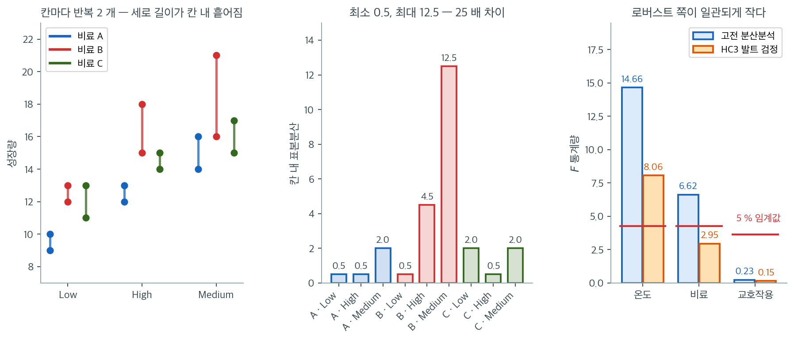

# 이원배치 Welch 분산분석 (로버스트 HC3)

## 개요

이원배치 요인 설계의 오차가 이분산이면, 공통 분산 가정에 기반한 표준 분산분석 $F$-검정을 믿을 수 없다. 실용적인 대안은 완전 요인 설정으로 OLS 모형을 적합한 뒤 HC3 이분산 일치 공분산 추정량과 Wald $F$-검정을 결합하여 주효과와 교호작용을 검정하는 것이다. 이 접근은 전용 Welch-James 구현 없이도 이원배치 분산분석의 로버스트한 대응물을 제공한다.

## 로버스트 OLS 접근

모형은 표준적인 이원배치 요인 모형이다:

$$
y_{ijk} = \mu + \alpha_i + \beta_j + (\alpha\beta)_{ij} + \varepsilon_{ijk}
$$

여기서 $\text{Var}(\varepsilon_{ijk})$는 더 이상 일정하다고 가정하지 않는다. OLS 계수 추정값 $\hat{\boldsymbol{\beta}}$는 여전히 불편이며 일치성을 갖지만, 고전적인 공분산행렬 $\hat{\sigma}^2 (X^\top X)^{-1}$은 타당하지 않다. HC3 추정량은 이를 다음으로 대체한다:

$$
\widehat{\text{Cov}}_{\text{HC3}}(\hat{\boldsymbol{\beta}}) = (X^\top X)^{-1} \left(\sum_{i=1}^{n} \frac{\hat{e}_i^2}{(1 - h_{ii})^2} \mathbf{x}_i \mathbf{x}_i^\top \right) (X^\top X)^{-1}
$$

여기서 $h_{ii}$는 햇 행렬 $H = X(X^\top X)^{-1}X^\top$의 $i$번째 대각 성분이고 $\hat{e}_i$는 $i$번째 OLS 잔차이다. 이 추정량은 이분산 아래에서 일치성을 가지며 HC0나 HC1보다 소표본 성능이 좋다.

## 각 항에 대한 Wald F-검정

주효과나 교호작용을 검정하려면 그 항의 계수에 해당하는 행을 $R$이 고르는 결합 선형 가설 $R\boldsymbol{\beta} = \mathbf{0}$을 세운다. Wald $F$-통계량은

$$
F_W = \frac{1}{q} (R\hat{\boldsymbol{\beta}})^\top \bigl(R\, \widehat{\text{Cov}}_{\text{HC3}}(\hat{\boldsymbol{\beta}})\, R^\top\bigr)^{-1} (R\hat{\boldsymbol{\beta}})
$$

이며 $q$는 제약의 수($R$의 행 수)이다. $H_0$ 아래에서 $F_W$는 근사적으로 $F_{q, \nu}$를 따르고 $\nu$는 조정된 분모 자유도이다.

<div class="exbox" markdown>

**보기 1.** <span class="diff easy" title="쉬움"></span> 칸마다 둘씩이면 HC3 가 무엇을 하는가. 자료는 $3\times3$ 설계에 칸마다 반복 $2$ 개, 모두 $18$ 개다. 모형은 포화 요인모형이므로 적합값은 칸평균이다.

**(1)** 이 설계에서 **모든 지렛값이 $h_{ii} = 1/2$** 임을 보이고, 칸 $(i,j)$ 의 두 관측값 차를 $d_{ij}$ 라 할 때 HC3 가 그 칸의 평균에 주는 분산이

$$
\widehat{\operatorname{Var}}_{\text{HC3}}(\bar y_{ij}) = \frac{d_{ij}^2}{2} = 2\cdot\frac{s_{ij}^2}{n_{ij}}
$$

곧 **보통의 $s_{ij}^2/n_{ij}$ 의 정확히 두 배**임을 보이시오. 또 칸당 $n = 1$ 이면 왜 계산이 불가능한지 밝히시오.

**(2)** 두 주장을 수치로 확인하시오.

</div>

??? success "풀이"

    **(1) 해석적으로.** 포화 요인모형의 적합값은 칸평균이므로, 칸평균 모수화 $y = \sum_{i,j}\mu_{ij}\mathbf 1_{ij} + \varepsilon$ 로 바꾸어 생각해도 사영은 같다. 설계행렬의 열이 서로 겹치지 않는 지시벡터이므로 햇 행렬은 칸마다 $\frac{1}{n_{ij}}J_{n_{ij}}$ 인 블록대각이고

    $$
    h_{ii} = \frac{1}{n_{ij}} = \frac12
    $$

    이다. **모든 관측값이 같은 지렛값을 받는다.** 따라서 HC3 의 가중 $1/(1-h_{ii})^2 = 1/(1/2)^2 = 4$ 도 모든 관측값에 공통이다.

    칸 안의 두 값을 $y_1, y_2$, 그 차를 $d = y_1 - y_2$ 라 하자. 칸평균이 $\frac{y_1+y_2}{2}$ 이므로 두 잔차는

    $$
    \hat e_1 = \frac{d}{2},
    \qquad
    \hat e_2 = -\frac{d}{2}
    $$

    다. 그 칸이 샌드위치 가운데에 기여하는 양은

    $$
    \sum_{\text{칸 안}} \frac{\hat e^2}{(1-h)^2} = 2\cdot\frac{d^2}{4}\cdot 4 = 2d^2
    $$

    이고, 이 모수화에서 $(X^\top X)^{-1}$ 의 해당 대각원소는 $1/n_{ij} = 1/2$ 이므로

    $$
    \widehat{\operatorname{Var}}_{\text{HC3}}(\bar y_{ij}) = \frac12 \cdot 2d^2 \cdot \frac12 = \frac{d^2}{2}
    $$

    이다. 한편 $n = 2$ 에서 표본분산은 $s^2 = \frac{d^2}{2}$ 이므로 보통의 추정값은 $s^2/n = \frac{d^2}{4}$ 다. 비가 정확히 $2$ 다.

    **HC3 가 $n = 2$ 에서는 두 배 보수적**이라는 뜻이다. 같은 계산을 일반 $n$ 으로 하면 $h_{ii} = 1/n$, 가중 $\frac{n^2}{(n-1)^2}$, 칸 기여 $\frac{n^2}{(n-1)^2}\sum\hat e^2 = \frac{n^2 s^2}{n-1}$ 이고 양옆에 $1/n$ 을 곱해

    $$
    \widehat{\operatorname{Var}}_{\text{HC3}}(\bar y_{ij}) = \frac{s_{ij}^2}{n-1}
    = \frac{n}{n-1}\cdot\frac{s_{ij}^2}{n}
    $$

    가 된다. 비가 $\frac{n}{n-1}$ 이므로 $n = 2$ 에서 $2$, $n = 5$ 에서 $1.25$, $n = 20$ 에서 $1.05$ 로 **칸이 커질수록 $1$ 에 가까워진다.** 잔차가 체계적으로 작아지는 것을 $(1-h)^2$ 로 되돌리는 보정인데, 칸이 작을수록 되돌릴 양이 크다.

    **칸당 $n = 1$ 이면 발산한다.** 그때 $h_{ii} = 1/1 = 1$ 이라 $1/(1-h_{ii})^2$ 의 분모가 $0$ 이 된다. 포화모형이라 잔차도 모두 $0$ 이므로 $0/0$ 이고, 애초에 칸 안의 흩어짐을 재는 자료가 없으니 이분산을 추정할 재료 자체가 없다. **코드의 주석이 경고하는 것이 이것이다.**

    **(2) 수치적으로.**

    ```python
    import pandas as pd
    from statsmodels.formula.api import ols

    # 칸마다 반복이 **둘 이상** 있어야 한다. 칸당 하나뿐이면 3x3 설계에서
    # 모수 9개로 관측값 9개를 완전히 맞혀 버려 잔차 자유도가 0이 되고,
    # 지렛값 h_ii가 1이 되어 HC3의 1/(1-h_ii)^2 이 발산한다.
    data = {
        "Temperature": ["High"]*6 + ["Low"]*6 + ["Medium"]*6,
        "Fertilizer":  ["A", "A", "B", "B", "C", "C"] * 3,
        "Growth":      [12, 13, 15, 18, 14, 15,
                        10,  9, 13, 12, 11, 13,
                        14, 16, 16, 21, 15, 17],
    }
    df = pd.DataFrame(data)

    model = ols("Growth ~ C(Temperature) * C(Fertilizer)", data=df).fit()
    rob = model.get_robustcov_results(cov_type="HC3")

    # Temperature의 주효과 검정.
    # ":"가 든 이름을 빼야 한다. 교호작용 항의 이름도 "C(Temperature)["로 시작하므로
    # 그냥 startswith만 쓰면 교호작용까지 함께 검정해 자유도가 2가 아니라 6이 된다.
    pnames = model.params.index.tolist()
    temp_params = [p for p in pnames
                   if p.startswith("C(Temperature)[") and ":" not in p]
    constraint = ", ".join([f"{t} = 0" for t in temp_params])
    print("Main effect: Temperature")
    print(rob.f_test(constraint))

    # 교호작용 검정
    inter_params = [p for p in pnames if ":" in p]
    constraint_inter = ", ".join([f"{t} = 0" for t in inter_params])
    print("Interaction: Temperature x Fertilizer")
    print(rob.f_test(constraint_inter))
    ```

    출력:

    ```
    Main effect: Temperature
    <F test: F=8.055555555555552, p=0.009878581991016048, df_denom=9, df_num=2>
    Interaction: Temperature x Fertilizer
    <F test: F=0.15370680044593157, p=0.956506962060376, df_denom=9, df_num=4>
    ```

    주효과는 유의하고($p = 0.0099$) 교호작용은 아니다($p = 0.957$). 분자 자유도가 각각 2와 4로, 수준 수에서 계산한 $a - 1 = 2$와 $(a-1)(b-1) = 4$에 맞는다. 이 자유도를 확인하는 것이 제약을 제대로 걸었는지 점검하는 가장 쉬운 방법이다.

    이제 (1)의 두 주장을 확인한다.

    ```python
    import numpy as np

    # 모든 지렛값이 정말 1/2 인가.
    h = model.get_influence().hat_matrix_diag
    print(f"지렛값 h_ii: 최소 {h.min():.6f}, 최대 {h.max():.6f}  "
          f"(모두 같은가: {np.allclose(h, 0.5)})")
    print(f"HC3 가중 1/(1-h)^2 = {1 / (1 - h[0]) ** 2:.1f}")

    # 칸평균 모수화로 다시 적합해 HC3 분산을 칸별 s^2/n 과 견준다.
    cm = ols("Growth ~ C(Temperature):C(Fertilizer) - 1", data=df).fit()
    cmr = cm.get_robustcov_results(cov_type="HC3")
    hc3 = np.diag(cmr.cov_params())

    cells = df.groupby(['Fertilizer', 'Temperature'])['Growth'].agg(['mean', 'var', 'count'])
    classic = (cells['var'] / cells['count']).values
    print(f"\n{'cell':<14}{'mean':>7}{'s^2':>8}{'s^2/n':>8}{'HC3':>8}{'비':>7}")
    for (f, t), c, hv in zip(cells.index, classic, hc3):
        v = cells.loc[(f, t), 'var']
        print(f"{t + '-' + f:<14}{cells.loc[(f, t), 'mean']:>7.1f}{v:>8.2f}"
              f"{c:>8.2f}{hv:>8.2f}{hv / c:>7.2f}")
    print(f"\n비가 모두 2 인가: {np.allclose(hc3 / classic, 2.0)}")
    ```

    출력:

    ```
    지렛값 h_ii: 최소 0.500000, 최대 0.500000  (모두 같은가: True)
    HC3 가중 1/(1-h)^2 = 4.0

    cell             mean     s^2   s^2/n     HC3      비
    High-A           12.5    0.50    0.25    0.50   2.00
    Low-A             9.5    0.50    0.25    0.50   2.00
    Medium-A         15.0    2.00    1.00    2.00   2.00
    High-B           16.5    4.50    2.25    4.50   2.00
    Low-B            12.5    0.50    0.25    0.50   2.00
    Medium-B         18.5   12.50    6.25   12.50   2.00
    High-C           14.5    0.50    0.25    0.50   2.00
    Low-C            12.0    2.00    1.00    2.00   2.00
    Medium-C         16.0    2.00    1.00    2.00   2.00

    비가 모두 2 인가: True
    ```

    **두 주장이 모두 맞는다.** 열여덟 개 관측값의 지렛값이 전부 정확히 $0.5$ 이고, 아홉 칸 모두에서 HC3 분산이 $s_{ij}^2/n_{ij}$ 의 **정확히 두 배**다. 유도한 $\widehat{\operatorname{Var}}_{\text{HC3}} = s^2/(n-1)$ 이 $n = 2$ 에서 $s^2$ 가 되는 것도 표에서 바로 보인다(`s^2` 열과 `HC3` 열이 같은 수다).

    여기서 이 방법의 성격이 드러난다. **HC3 는 칸마다 그 칸의 흩어짐을 쓴다.** Medium·B 칸은 $s^2 = 12.5$ 로 High·A 칸의 $0.5$ 보다 $25$ 배 크고, HC3 는 그 차이를 그대로 받아들인다. 반면 고전 분산분석은 아홉 칸을 합동해 $MSE = 25.0/9 = 2.778$ 하나를 모두에게 쓴다. 두 방법이 갈라지는 지점이 바로 여기다.

    분모 자유도 $9$ 는 statsmodels 가 OLS 잔차 자유도 $N - ab = 18 - 9 = 9$ 를 그대로 쓴 것이고, **Welch 처럼 조정된 값이 아니다.** HC3 Wald 검정의 $F_{q,\nu}$ 참조분포는 대표본 근사이므로, 이 정도 표본에서는 $p$-값을 소수 넷째 자리까지 믿기 어렵다는 점을 기억해 두는 편이 좋다.

## 표준 분산분석과의 비교

참고를 위해 (로버스트하지 않은) 표준 분산분석표를 얻을 수 있다:

<div class="exbox" markdown>

**보기 2.** <span class="diff easy" title="쉬움"></span> 합동이 누구를 돕고 누구를 해치는가. 같은 자료에 표준 분산분석과 HC3 Wald 검정을 모두 돌린다.

**(1)** 비료 수준 $f$ 의 주변평균 $\bar y_{\cdot f} = \frac13\sum_i \bar y_{if}$ 의 분산을 두 방식으로 적으시오.

$$
\widehat{\operatorname{Var}}_{\text{합동}} = \frac{MSE}{6},
\qquad
\widehat{\operatorname{Var}}_{\text{칸별}} = \frac19\sum_{i}\frac{s_{if}^2}{2}
$$

셋 중 어느 비료에서 합동이 분산을 **과소**평가하고 어느 비료에서 **과대**평가하는지 수치로 보이시오.

**(2)** 세 항의 $F$ 와 $p$ 를 두 방법에서 나란히 적고, $5\%$ 임계값 $F_{0.95}(2,9)$ 와 견주어 **어느 결론이 뒤집히는지** 짚으시오.

</div>

??? success "풀이"

    **(1) 해석적으로.** 합동 추정은 **모든 칸의 분산이 같다**고 보고 $MSE$ 하나를 모두에게 나누어 준다. 주변평균 $\bar y_{\cdot f}$ 는 $6$ 개 관측값의 평균이므로 $\widehat{\operatorname{Var}}_{\text{합동}} = MSE/6$ 이고, 비료가 무엇이든 **같은 수**다.

    칸별 추정은 다르다. $\bar y_{\cdot f} = \frac13\sum_i \bar y_{if}$ 이고 세 칸평균이 독립이므로

    $$
    \operatorname{Var}(\bar y_{\cdot f}) = \frac19\sum_i \operatorname{Var}(\bar y_{if}) = \frac19\sum_i \frac{\sigma_{if}^2}{2}
    $$

    로 **그 비료가 받은 세 칸의 분산만** 쓴다. 그러므로 어떤 비료에 흩어진 칸이 몰려 있으면 합동은 그 비료의 불확실성을 **과소**평가하고, 반대로 조용한 칸만 받은 비료에서는 **과대**평가한다. 합동은 칸 사이에서 불확실성을 재분배하는 셈이다.

    (1)에서 본 대로 HC3 는 $n = 2$ 에서 칸별 추정의 두 배를 쓰므로 세 열을 모두 적어 견주면 그림이 분명해진다.

    **(2) 수치적으로.**

    ```python
    import statsmodels.api as sm

    # 같은 자료를 보통의 분산분석으로 돌려 견준다. 등분산이 깨진 설계에서
    # 두 방법의 p-값이 얼마나 갈리는지가 요점이다.
    print(sm.stats.anova_lm(model, typ=2))
    ```

    출력:

    ```
                                     sum_sq   df      F    PR(>F)
    C(Temperature)                81.444444  2.0  14.66  0.001475
    C(Fertilizer)                 36.777778  2.0   6.62  0.017060
    C(Temperature):C(Fertilizer)   2.555556  4.0   0.23  0.914666
    Residual                      25.000000  9.0    NaN       NaN
    ```

    표준 분산분석은 Temperature의 $F$를 14.66으로, HC3 Wald 검정은 8.06으로 준다. 두 값이 이만큼 다른 것은 분산이 칸마다 다르다는 신호다. 실제로 이 자료에서 B 비료의 칸들이 다른 칸보다 흩어져 있다.

    방향도 눈여겨보라. 로버스트 검정이 더 **작은** $F$를 준다. 어디서 그렇게 되는지 분해해 본다.

    ```python
    from scipy import stats

    MSE = 25.0 / 9
    cells = df.groupby(['Fertilizer', 'Temperature'])['Growth'].agg(['mean', 'var'])
    print(f"합동 MSE = {MSE:.4f}   (칸 분산은 {cells['var'].min():.2f} 에서 "
          f"{cells['var'].max():.2f} 까지)")

    print(f"\n{'비료':>5}{'평균':>8}{'Var(합동)':>12}{'Var(칸별)':>12}{'Var(HC3)':>11}")
    for f in ('A', 'B', 'C'):
        v_cells = cells.loc[f, 'var'].values
        var_pooled = MSE / 6
        var_cell = (v_cells / 2).sum() / 9
        print(f"{f:>5}{cells.loc[f, 'mean'].mean():>8.3f}{var_pooled:>12.4f}"
              f"{var_cell:>12.4f}{2 * var_cell:>11.4f}")

    # A 와 B 의 차에 대한 t 를 두 방식으로
    mA, mB = cells.loc['A', 'mean'].mean(), cells.loc['B', 'mean'].mean()
    vA = (cells.loc['A', 'var'].values / 2).sum() / 9
    vB = (cells.loc['B', 'var'].values / 2).sum() / 9
    se_pooled = np.sqrt(2 * MSE / 6)
    se_hc3 = np.sqrt(2 * (vA + vB))
    print(f"\nB - A = {mB - mA:.4f}")
    print(f"  합동 SE = {se_pooled:.4f}  ->  t = {(mB - mA) / se_pooled:.4f}")
    print(f"  HC3  SE = {se_hc3:.4f}  ->  t = {(mB - mA) / se_hc3:.4f}")

    # 세 항의 F 를 나란히
    pnames = model.params.index.tolist()
    terms = {
        "Temperature": [p for p in pnames
                        if p.startswith("C(Temperature)[") and ":" not in p],
        "Fertilizer": [p for p in pnames
                       if p.startswith("C(Fertilizer)[") and ":" not in p],
        "Interaction": [p for p in pnames if ":" in p]}
    aov = sm.stats.anova_lm(model, typ=2)
    print(f"\n{'항':>12}{'고전 F':>10}{'고전 p':>10}{'HC3 F':>10}{'HC3 p':>10}")
    for name, ps in terms.items():
        ft = rob.f_test(", ".join(f"{t} = 0" for t in ps))
        row = aov.index[list(terms).index(name)]
        print(f"{name:>12}{aov.loc[row, 'F']:>10.4f}{aov.loc[row, 'PR(>F)']:>10.4f}"
              f"{float(ft.fvalue):>10.4f}{float(ft.pvalue):>10.4f}")
    print(f"\n5% 임계값 F(2,9) = {stats.f(2, 9).ppf(0.95):.4f}")
    ```

    출력:

    ```
    합동 MSE = 2.7778   (칸 분산은 0.50 에서 12.50 까지)

       비료      평균     Var(합동)     Var(칸별)   Var(HC3)
        A  12.333      0.4630      0.1667     0.3333
        B  15.833      0.4630      0.9722     1.9444
        C  14.167      0.4630      0.2500     0.5000

    B - A = 3.5000
      합동 SE = 0.9623  ->  t = 3.6373
      HC3  SE = 1.5092  ->  t = 2.3191

               항      고전 F      고전 p     HC3 F     HC3 p
     Temperature   14.6600    0.0015    8.0556    0.0099
      Fertilizer    6.6200    0.0171    2.9474    0.1036
     Interaction    0.2300    0.9147    0.1537    0.9565

    5% 임계값 F(2,9) = 4.2565
    ```

    **(1)의 재분배가 눈에 보인다.** 합동은 세 비료에 모두 $0.4630$ 을 준다. 칸별로 재면

    - **비료 B: $0.9722$ 로 합동의 $2.1$ 배.** 흩어진 칸(High·B $s^2 = 4.5$, Medium·B $s^2 = 12.5$)을 모두 받았기 때문이다. **합동이 과소평가한다.**
    - **비료 A: $0.1667$ 로 합동의 $0.36$ 배.** 세 칸이 모두 조용하다. **합동이 과대평가한다.**
    - 비료 C 는 $0.2500$ 으로 역시 합동보다 작다.

    그러므로 **A 와 B 를 견주는 대비에서 합동은 분모를 심하게 줄인다.** 차이 $B - A = 3.50$ 에 대해 합동 표준오차는 $0.9623$ 이라 $t = 3.64$ 를 주지만, HC3 로는 $1.5092$ 라 $t = 2.32$ 로 내려앉는다.

    **(2) 비료의 결론이 뒤집힌다.**

    | 항 | 고전 $F$ | 고전 $p$ | HC3 $F$ | HC3 $p$ |
    |---|---|---|---|---|
    | 온도 | $14.66$ | $0.0015$ | $8.06$ | $0.0099$ |
    | 비료 | $6.62$ | $0.0171$ | $2.95$ | $0.1036$ |
    | 교호작용 | $0.23$ | $0.9147$ | $0.15$ | $0.9565$ |

    세 항 모두 로버스트 쪽 $F$ 가 작다. **표준 검정이 표준오차를 과소평가해 효과를 부풀리고 있었다는 뜻이다.** 그런데 $5\%$ 임계값 $F_{0.95}(2,9) = 4.2565$ 를 기준으로 보면 온도는 $8.06$ 으로 여전히 위에 있어 결론이 유지되는 반면, **비료는 $6.62$ 에서 $2.95$ 로 떨어지며 임계값 아래로 내려간다.** $p$ 가 $0.0171$ 에서 $0.1036$ 으로 바뀌어 판정이 뒤집힌다.

    **"비료 효과가 있다"는 결론은 등분산 가정 하나에 기대고 있었다.** 그 가정을 놓아 주자 사라졌고, 사라진 까닭도 분명하다. 비료 B 의 평균을 끌어올린 것이 Medium·B 칸의 $16$ 과 $21$ 인데 그 칸이야말로 가장 못 믿을 칸($s^2 = 12.5$)이다. 표준 분산분석과 로버스트 검정의 결과가 어긋날 때 무엇을 의심해야 하는지 이보다 분명한 예가 없다.

    다만 과장하지는 말자. $p = 0.1036$ 도 "효과가 없다"는 증거는 아니다. 칸마다 반복이 둘뿐이고 HC3 가 $n=2$ 에서 두 배 보수적이라는 점(보기 1)까지 생각하면, **이 자료가 비료에 대해 말할 수 있는 것은 많지 않다.**

분산이 같으면 HC3 Wald 검정과 표준 분산분석이 비슷한 결과를 준다. 두 결과가 어긋난다면 이분산이 표준 검정에 영향을 주고 있다는 뜻이다.

"이 자료에서 B 비료의 칸들이 다른 칸보다 흩어져 있다"는 말을 눈으로 확인하고, 그 흩어짐이 두 검정을 어떻게 갈라놓는지 한자리에서 보자.



왼쪽에서 세로 막대 하나가 한 칸의 반복 두 개를 잇는다. 빨강(비료 B)이 유난히 길다. Medium·B는 $16$과 $21$로 $5$나 벌어지고 High·B도 $15$와 $18$로 $3$이 벌어지는데, 비료 A와 C의 칸들은 대부분 $1$ 안팎이다. 가운데 막대가 그것을 분산으로 옮긴 것이다. **가장 작은 칸이 $0.5$, 가장 큰 칸이 $12.5$로 $25$배 차이다.** 등분산 가정이 성립한다고 보기 어렵다.

고전 분산분석은 이 아홉 칸을 하나로 합동해 $\text{MSE} = 25.0/9 = 2.778$이라는 값 하나를 모든 비교에 쓴다. $12.5$짜리 칸의 불확실성이 $0.5$짜리 칸들에 희석되는 것이다. 그래서 큰 분산 칸이 관련된 대비의 표준오차를 과소평가하게 되고, **$F$가 실제보다 부풀어 오른다.** HC3는 반대로 칸마다 그 칸의 잔차를 쓴다. 그 결과 오른쪽에서 보듯 세 항 모두 로버스트 쪽 $F$가 작다. 온도는 $14.66 \to 8.06$, 비료는 $6.62 \to 2.95$, 교호작용은 $0.23 \to 0.15$이다.

결론이 갈리는 자리를 놓치지 말자. 빨간 선이 $5\%$ 임계값 $F_{0.95}(2, 9) = 4.256$이다. 온도는 $8.06$으로 여전히 그 위에 있어 $p = 0.0099$로 유의하지만, **비료는 $6.62$에서 $2.95$로 떨어지면서 선 아래로 내려간다.** $p$가 $0.0171$에서 $0.1036$으로 바뀌어 판정이 뒤집히는 것이다. 이 보기에서 "비료 효과가 있다"는 결론은 등분산 가정 하나에 기대고 있었던 셈이고, 그 가정을 놓아 주자 사라졌다. 표준 분산분석과 로버스트 검정의 결과가 어긋날 때 무엇을 의심해야 하는지 이보다 분명한 예가 없다.

## 해석

- **HC3 대 HC0:** HC3는 각 제곱 잔차를 (HC0처럼 그대로 두지 않고) $(1 - h_{ii})^2$으로 나눈다. 지렛값이 큰 점의 잔차가 작아지는 경향을 이 상향 조정이 보정하여 소표본에서 포함확률을 개선한다.
- **언제 이 접근을 쓰는가:** 형식적 검정(Levene, Bartlett)이나 시각적 검토(잔차 그림)가 분산이 다름을 시사할 때마다 표준 $F$-검정보다 HC3 기반 Wald 검정이 낫다.
- **한계:** 칸 크기가 아주 작으면 개별 지렛값 $h_{ii}$가 1에 가까워져 HC3 추정량이 불안정해진다. 극단적으로 칸당 $n = 1$이면 포화모형이 되어 $h_{ii} = 1$, 잔차 0이 되고 HC3의 $1/(1-h_{ii})^2$이 발산해 계산 자체가 불가능하다. 위 보기에서 칸마다 반복을 둘씩 둔 이유가 이것이다. 칸 크기가 클수록 로버스트 추정량의 신뢰성이 높아진다.

## 연습문제

<div class="drillbox" markdown>

**연습문제 1.** <span class="diff med" title="중간"></span>
표준오차가 틀리게 되는데도 이분산 아래에서 OLS 계수 추정값이 여전히 불편인 이유를 설명하라. OLS의 어떤 성질이 쓰이는가?

</div>

??? success "풀이"
    OLS 추정량은 $\hat{\boldsymbol{\beta}} = (X^\top X)^{-1} X^\top \mathbf{y}$이다. 기댓값을 취하면

    $$
    E[\hat{\boldsymbol{\beta}}] = (X^\top X)^{-1} X^\top E[\mathbf{y}] = (X^\top X)^{-1} X^\top X \boldsymbol{\beta} = \boldsymbol{\beta}
    $$

    이다. 이 유도는 추정량의 선형성과 $E[\mathbf{y}] = X\boldsymbol{\beta}$(조건부 평균의 올바른 설정)만 쓸 뿐 등분산성 가정을 쓰지 않는다. 따라서 관측값마다 $\text{Var}(\varepsilon_i) = \sigma_i^2$이 달라도 OLS 추정값은 불편이다. Gauss-Markov 정리는 등분산성 아래에서만 OLS가 BLUE(최우수 선형 불편 추정량)임을 보장하므로, 등분산성이 없으면 OLS는 여전히 불편이지만 더 이상 효율적이지는 않다.

<div class="drillbox" markdown>

**연습문제 2.** <span class="diff med" title="중간"></span>
수준이 High, Low, Medium(Low가 기준)인 모형에서 Temperature의 주효과를 검정하기 위한 제약행렬 $R$을 써라. $R$의 행은 몇 개인가?

</div>

??? success "풀이"
    Low가 기준 수준이면 모형에는 Temperature[T.High]와 Temperature[T.Medium]의 지시 계수가 들어간다. Temperature의 주효과를 검정한다는 것은

    $$
    H_0: \beta_{\text{T.High}} = 0 \text{ and } \beta_{\text{T.Medium}} = 0
    $$

    을 검정한다는 뜻이다. 제약행렬은 전체 모수 벡터 $\boldsymbol{\beta} = (\beta_0, \beta_{\text{T.High}}, \beta_{\text{T.Medium}}, \beta_{\text{F.B}}, \beta_{\text{F.C}}, \ldots)^\top$에서 이 두 계수를 고른다. Temperature[T.High]가 두 번째 모수이고 Temperature[T.Medium]이 세 번째라면

    $$
    R = \begin{pmatrix} 0 & 1 & 0 & 0 & \cdots & 0 \\ 0 & 0 & 1 & 0 & \cdots & 0 \end{pmatrix}
    $$

    이다. 행렬 $R$은 (기준이 아닌 수준마다 하나씩) $q = a - 1 = 2$개의 행을 가지며, 주효과의 자유도 2에 대응한다.

<div class="drillbox" markdown>

**연습문제 3.** <span class="diff med" title="중간"></span>
HC3는 $(1 - h_{ii})^2$으로 나누고 HC2는 $(1 - h_{ii})$로 나눈다. $(1 - h_{ii})^2$ 보정의 직관과 그것이 소표본 성능을 개선하는 이유를 설명하라.

</div>

??? success "풀이"
    OLS 잔차는 $\hat{e}_i = y_i - \hat{y}_i = (1 - h_{ii})\varepsilon_i + (\text{다른 } \varepsilon_j \text{에 관한 항})$이다. 따라서 (교차항을 무시하면) $E[\hat{e}_i^2] \approx (1 - h_{ii})^2 \sigma_i^2$이고, 이는 $\hat{e}_i^2$이 $\sigma_i^2$을 $(1 - h_{ii})^2$배만큼 체계적으로 과소추정한다는 뜻이다.

    - **HC0**은 $\hat{e}_i^2$을 그대로 써서 아래로 편향된다.
    - **HC2**는 $(1 - h_{ii})$로 나누어 $E[\hat{e}_i^2 / (1 - h_{ii})] \approx (1 - h_{ii})\sigma_i^2$이 되므로 여전히 편향된다.
    - **HC3**는 $(1 - h_{ii})^2$으로 나누어 $\hat{e}_i^2 / (1 - h_{ii})^2 \approx \sigma_i^2$이 되므로 $\sigma_i^2$의 거의 불편한 추정값을 준다.

    지렛값이 큰 점($h_{ii}$가 큰 점)일수록 잔차가 가장 심하게 축소된다. HC3의 더 강한 보정은 이런 영향력 있는 관측값이 분산 추정에 적절히 기여하도록 하며, 몇몇 점이 큰 지렛값을 가질 수 있는 소표본에서 특히 중요하다.

<div class="drillbox" markdown>

**연습문제 4.** <span class="diff med" title="중간"></span>
보기 코드의 설계는 칸당 관측값이 $n = 1$뿐이다($3 \times 3$ 설계에 관측값 9개, 모수 9개). 이 경우 HC3 추정량이 왜 문제가 되는지 설명하고 믿을 만한 추론을 위한 최소 칸 크기를 제안하라.

</div>

??? success "풀이"
    칸당 $n = 1$이고 관측값 9개에 모수 9개를 적합하면 햇 행렬이 $H = I$(항등행렬)가 되어 모든 관측값에서 $h_{ii} = 1$이다. HC3의 분모 $(1 - h_{ii})^2 = 0$이 되어 추정량이 정의되지 않는다(0으로 나눔).

    $h_{ii}$가 정확히 1은 아니더라도 1에 가까우면 HC3 추정값이 극도로 커지고 불안정해진다. 일반적으로 HC3는 제곱 잔차가 의미 있는 분산 추정값을 주려면 잔차 자유도가 충분해야 한다.

    흔한 권고는 HC3가 안정적으로 작동하려면 칸당 적어도 $n = 3$에서 $5$개의 관측값이 필요하다는 것이다. $3 \times 3$ 설계에서 칸당 $n \ge 5$이면($N = 45$, $p = 9$) 최대 지렛값이 1보다 충분히 낮게 억제되어 HC3 추정량이 잘 작동한다.

<div class="drillbox" markdown>

**연습문제 5.** <span class="diff hard" title="어려움"></span>
이분산 아래에서 HC3 샌드위치 추정량이 $\text{Var}(\hat{\boldsymbol{\beta}})$에 대해 일치성을 가짐을, 즉 $n \to \infty$일 때 OLS 추정량의 참 분산으로 수렴함을 증명하라.

</div>

??? success "풀이"
    이분산 아래에서 OLS 추정량의 참 분산은

    $$
    \text{Var}(\hat{\boldsymbol{\beta}}) = (X^\top X)^{-1} X^\top \Omega\, X\, (X^\top X)^{-1}
    $$

    이며 $\Omega = \text{diag}(\sigma_1^2, \ldots, \sigma_n^2)$이다. HC3 추정량은 $\Omega$를 $\hat{\Omega}_{\text{HC3}} = \text{diag}(\hat{e}_i^2 / (1 - h_{ii})^2)$로 대체한다.

    정칙 조건 아래에서 $n \to \infty$일 때: (1) $h_{ii} \le p/n \to 0$이므로 각 지렛값이 0으로 가고 $(1 - h_{ii})^2 \to 1$이다. (2) OLS의 일치성에 의해 각 $i$에서 $\hat{e}_i^2 \to \varepsilon_i^2$이다. (3) 큰 수의 법칙에 의해 표본평균 $(1/n) X^\top \hat{\Omega}_{\text{HC3}} X \to (1/n) X^\top \Omega\, X$이다.

    따라서 $\widehat{\text{Cov}}_{\text{HC3}}(\hat{\boldsymbol{\beta}})$는 확률적으로 $\text{Var}(\hat{\boldsymbol{\beta}})$로 수렴한다. HC3 보정은 (같은 점근 성질을 갖는) HC0에 대한 유한표본 개선이며 $n \to \infty$에서는 같은 극한으로 수렴한다. $\square$

<div class="drillbox" markdown>

**연습문제 6.** <span class="diff hard" title="어려움"></span>
본문 보기는 **기본 처리 대비**로 모형을 적합한 뒤 "주효과"를 검정한다. 교호작용이 있으면 이것이 **주효과가 아님**을 보이고, 올바른 코딩으로 고쳐라.

</div>

??? success "풀이"
    **함정의 구조.** 처리 대비에서 `C(A)[T.A1]`의 계수는

    $$
    \mu_{1,\,B_{\text{기준}}}-\mu_{0,\,B_{\text{기준}}}
    $$

    즉 **$B$의 기준 수준에서의 단순효과**다. 주효과가 아니다. 합 대비를 쓰면 계수가 **비가중 주변평균의 편차**가 되어 비로소 주효과가 된다.

    ```python
    import warnings
    warnings.filterwarnings("ignore")

    import numpy as np
    import pandas as pd
    from statsmodels.formula.api import ols

    def wald(fit, pick):
        idx = list(fit.params.index)
        names = [x for x in idx if pick(x)]
        R = np.zeros((len(names), len(idx)))
        for r, x in enumerate(names):
            R[r, idx.index(x)] = 1
        w = fit.f_test(R)
        return float(w.fvalue), int(w.df_num), int(w.df_denom), float(w.pvalue)

    data = {
        "Temperature": ["High"] * 6 + ["Low"] * 6 + ["Medium"] * 6,
        "Fertilizer": ["A", "A", "B", "B", "C", "C"] * 3,
        "Growth": [12, 13, 15, 18, 14, 15,
                   10, 9, 13, 12, 11, 13,
                   14, 16, 16, 21, 15, 17],
    }
    df = pd.DataFrame(data)

    print("=== 본문 자료 (3×3, 칸당 2, 교호작용 거의 없음) ===")
    for lab, form, pre in [
        ("처리 대비 (기본)", "Growth ~ C(Temperature)*C(Fertilizer)",
         "C(Temperature)["),
        ("합 대비", "Growth ~ C(Temperature, Sum)*C(Fertilizer, Sum)",
         "C(Temperature, Sum)["),
    ]:
        fit = ols(form, data=df).fit(cov_type="HC3")
        F, d1, d2, p = wald(fit, lambda s, pre=pre: s.startswith(pre) and ":" not in s)
        Fi, i1, i2, pi = wald(fit, lambda s: ":" in s)
        print(f"  {lab:16s} Temp 주효과 F({d1},{d2}) = {F:7.4f}, p = {p:.4f}"
              f"   |  교호작용 F({i1},{i2}) = {Fi:6.4f}, p = {pi:.4f}")

    # 교호작용이 뚜렷한 자료에서 다시
    rng = np.random.default_rng(515)
    mu = np.array([[10.0, 12.0, 14.0], [10.0, 13.0, 22.0]])
    sd = np.array([[1.0, 1.5, 4.0], [1.0, 2.0, 5.0]])
    rows = []
    for i in range(2):
        for j in range(3):
            rows.append(pd.DataFrame({"y": rng.normal(mu[i, j], sd[i, j], 10),
                                      "A": f"A{i}", "B": f"B{j}"}))
    d2f = pd.concat(rows, ignore_index=True)

    print("\n=== 교호작용이 뚜렷한 2×3 (칸당 10, 균형) ===")
    print(d2f.groupby(["A", "B"]).y.agg(["mean", "var"]).round(3).to_string())
    for lab, form, pre in [("처리 대비 (기본)", "y ~ C(A)*C(B)", "C(A)["),
                           ("합 대비", "y ~ C(A, Sum)*C(B, Sum)", "C(A, Sum)[")]:
        fit = ols(form, data=d2f).fit(cov_type="HC3")
        F, d1, dd, p = wald(fit, lambda s, pre=pre: s.startswith(pre) and ":" not in s)
        print(f"  {lab:16s} A 주효과 F({d1},{dd}) = {F:8.4f}, p = {p:.4f}")

    m = d2f.groupby(["A", "B"]).y.mean()
    print(f"\n  A 의 단순효과: B0 {m[('A1', 'B0')] - m[('A0', 'B0')]:+.3f}, "
          f"B1 {m[('A1', 'B1')] - m[('A0', 'B1')]:+.3f}, "
          f"B2 {m[('A1', 'B2')] - m[('A0', 'B2')]:+.3f}")
    print(f"  비가중 주변평균 차이: {m['A1'].mean() - m['A0'].mean():+.3f}")
    ```

    ```text
    === 본문 자료 (3×3, 칸당 2, 교호작용 거의 없음) ===
      처리 대비 (기본)       Temp 주효과 F(2,9) =  8.0556, p = 0.0099   |  교호작용 F(4,9) = 0.1537, p = 0.9565
      합 대비             Temp 주효과 F(2,9) =  9.3094, p = 0.0064   |  교호작용 F(4,9) = 0.1537, p = 0.9565

    === 교호작용이 뚜렷한 2×3 (칸당 10, 균형) ===
             mean     var
    A  B                 
    A0 B0   9.178   1.742
       B1  12.621   2.614
       B2  12.117  13.669
    A1 B0  10.180   1.113
       B1  13.729   5.214
       B2  24.821  32.266
      처리 대비 (기본)       A 주효과 F(1,54) =   3.1623, p = 0.0810
      합 대비             A 주효과 F(1,54) =  34.8784, p = 0.0000

      A 의 단순효과: B0 +1.002, B1 +1.107, B2 +12.704
      비가중 주변평균 차이: +4.938
    ```

    **두 번째 자료에서 판정이 완전히 뒤집힌다.**

    | 코딩 | $F$ | $p$ | 판정 |
    |---|---|---|---|
    | 처리 대비 | 3.16 | **0.0810** | 유의하지 않음 |
    | **합 대비** | **34.88** | **$<0.0001$** | 매우 유의 |

    **처리 대비가 검정한 것은 $B_0$에서의 단순효과($+1.00$)**다. 주효과인 비가중 주변평균 차이 $+4.94$가 아니다.

    **단순효과를 보면 왜 그런지 분명하다.**

    ```text
    B0 에서  +1.00   ← 처리 대비가 검정하는 것
    B1 에서  +1.11
    B2 에서 +12.70
    ------------------
    평균     +4.94   ← 합 대비가 검정하는 것 (주효과)
    ```

    **교호작용이 없는 첫 자료에서도 값이 다르다**(8.06 대 9.31). 표본 교호작용이 정확히 0은 아니기 때문이다. **판정은 같지만 값이 다르다**는 것 자체가 두 검정이 다른 가설을 본다는 증거다.

    **교호작용 검정은 코딩에 무관하다**(0.1537로 동일). **마지막에 들어가는 항은 코딩과 무관**하기 때문이다. 문제가 되는 것은 **주효과뿐**이다.

    **이것이 제III형 제곱합에 합 대비가 필요한 것과 같은 이유**다.

    **점검 방법 셋.**

    1. **자유도를 확인**한다. Temp 주효과가 $a-1=2$이면 항은 제대로 골랐다(그러나 코딩이 맞는지는 알려 주지 않는다).
    2. **계수의 합이 0인지 본다.** 합 대비에서는 한 요인의 계수 합이 0이다.
    3. **교호작용이 0에 가까운지 본다.** 교호작용이 없으면 두 코딩의 결과가 거의 같다.

    **가장 확실한 습관 — 요인 모형에는 언제나 합 대비를 쓴다.** 교호작용이 있든 없든 손해가 없고, 있을 때 재앙을 막는다.

<div class="drillbox" markdown>

**연습문제 7.** <span class="diff hard" title="어려움"></span>
HC0, HC1, HC2, HC3의 **제1종 오류율을 작은 칸에서 비교**하라. 왜 HC3이 권장되는지 수치로 보여라.

</div>

??? success "풀이"
    **네 변형의 차이는 잔차를 어떻게 부풀리느냐**뿐이다.

    | 이름 | 잔차 보정 |
    |---|---|
    | HC0 | $\hat e_i^2$ (보정 없음) |
    | HC1 | $\dfrac{N}{N-p}\hat e_i^2$ |
    | HC2 | $\dfrac{\hat e_i^2}{1-h_{ii}}$ |
    | **HC3** | $\dfrac{\hat e_i^2}{(1-h_{ii})^2}$ |

    **OLS 잔차는 참 오차보다 작다**($E[\hat e_i^2]=(1-h_{ii})\sigma_i^2$). 보정하지 않으면 분산을 과소추정하고, **검정이 자유로워진다.**

    ```python
    import warnings
    warnings.filterwarnings("ignore")

    import numpy as np
    import pandas as pd
    from statsmodels.formula.api import ols

    def wald_ps(df, cov):
        fit = (ols("y ~ C(A, Sum)*C(B, Sum)", data=df).fit(cov_type=cov)
               if cov else ols("y ~ C(A, Sum)*C(B, Sum)", data=df).fit())
        idx = list(fit.params.index)
        ps = []
        for pick in [lambda s: s.startswith("C(A, Sum)[") and ":" not in s,
                     lambda s: s.startswith("C(B, Sum)[") and ":" not in s,
                     lambda s: ":" in s]:
            nm = [x for x in idx if pick(x)]
            R = np.zeros((len(nm), len(idx)))
            for r, x in enumerate(nm):
                R[r, idx.index(x)] = 1
            ps.append(float(fit.f_test(R).pvalue))
        return np.array(ps)

    NS = np.array([[8, 6, 4], [7, 5, 4]])
    SD = np.array([[1.0, 2.0, 5.0], [1.0, 2.0, 5.0]])
    rng = np.random.default_rng(4242)
    B = 1_200
    meths = [("고전(OLS)", None), ("HC0", "HC0"), ("HC1", "HC1"),
             ("HC2", "HC2"), ("HC3", "HC3")]
    cnt = {k: np.zeros(3) for k, _ in meths}
    for _ in range(B):
        rows = []
        for i in range(2):
            for j in range(3):
                rows.append(pd.DataFrame({"y": rng.normal(0, SD[i, j], NS[i, j]),
                                          "A": f"A{i}", "B": f"B{j}"}))
        df = pd.concat(rows, ignore_index=True)
        for k, c in meths:
            cnt[k] += wald_ps(df, c) < 0.05

    print("2×3 완전 귀무, 칸 n=[[8,6,4],[7,5,4]], σ=[[1,2,5],[1,2,5]], B=1200")
    print(f"{'방법':>10s} {'A 주효과':>9s} {'B 주효과':>9s} {'A×B':>9s}")
    for k, _ in meths:
        x = cnt[k]
        print(f"{k:>10s} {x[0] / B:9.4f} {x[1] / B:9.4f} {x[2] / B:9.4f}")
    ```

    ```text
    2×3 완전 귀무, 칸 n=[[8,6,4],[7,5,4]], σ=[[1,2,5],[1,2,5]], B=1200
            방법     A 주효과     B 주효과       A×B
       고전(OLS)    0.1458    0.1767    0.1442
           HC0    0.1075    0.1375    0.1208
           HC1    0.0725    0.1108    0.0892
           HC2    0.0683    0.1033    0.0850
           HC3    0.0475    0.0583    0.0550
    ```

    **HC0에서 HC3으로 갈수록 오류율이 단조롭게 개선된다.**

    | 방법 | A×B의 오류율 | 명목 대비 |
    |---|---|---|
    | 고전 OLS | 0.144 | 2.9배 |
    | HC0 | 0.121 | 2.4배 |
    | HC1 | 0.089 | 1.8배 |
    | HC2 | 0.085 | 1.7배 |
    | **HC3** | **0.055** | **1.1배** |

    **HC0은 거의 도움이 안 된다**(0.121 대 고전의 0.144). 이 설계는 칸이 4~8개로 작아 $h_{ii}$가 0.125~0.25로 크기 때문이다.

    **HC3만이 명목 수준에 가깝다.** $(1-h_{ii})^{-2}$가 가장 강한 보정이고, **작은 표본에서는 강한 보정이 맞다.**

    **$(1-h_{ii})^{-2}$의 근거.** 관측 $i$를 빼고 적합한 잭나이프 잔차가

    $$
    \hat e_{(i)}=\frac{\hat e_i}{1-h_{ii}}
    $$

    이고, HC3은 이 제곱 $\hat e_i^2/(1-h_{ii})^2$을 쓴다. **HC3은 잭나이프 분산추정의 근사**다.

    **선택 지침.**

    | 상황 | 권장 |
    |---|---|
    | $N<250$ 또는 지렛값이 큰 관측 존재 | **HC3** |
    | $N$이 매우 큼($>1000$) | 넷이 사실상 같음 |
    | 지렛값이 극단적($h_{ii}>0.5$) | **HC4** 고려 |
    | 오차가 등분산임을 확신 | 고전 OLS(검정력 이득) |

    **`statsmodels`의 기본값은 `cov_type="nonrobust"`**다. **명시적으로 `HC3`을 지정**해야 한다.

<div class="drillbox" markdown>

**연습문제 8.** <span class="diff med" title="중간"></span>
**균형 요인설계에서 지렛값 $h_{ii}$가 정확히 $1/n_{ij}$임**을 보이고, 본문이 경고한 $n=1$ 발산을 확인하라.

</div>

??? success "풀이"
    **왜 $1/n_{ij}$인가.** 완전 요인 모형은 **각 칸에 자유로운 평균 하나**를 준다. 즉 적합값이

    $$
    \hat y_{ijk}=\bar y_{ij\cdot}
    $$

    이므로, 햇 행렬 $H$는 **칸별로 $\frac{1}{n_{ij}}\mathbf J$인 블록 대각행렬**이다. 따라서

    $$
    h_{ii}=\frac{1}{n_{ij}}
    $$

    ```python
    import numpy as np
    import pandas as pd
    from statsmodels.formula.api import ols

    for n in [1, 2, 3, 5, 10]:
        rows = []
        for i in range(2):
            for j in range(3):
                rows.append(pd.DataFrame({"y": np.arange(n, dtype=float),
                                          "A": f"A{i}", "B": f"B{j}"}))
        df = pd.concat(rows, ignore_index=True)
        X = ols("y ~ C(A)*C(B)", data=df).fit().model.exog
        H = X @ np.linalg.pinv(X.T @ X) @ X.T
        h = np.diag(H)
        hc3 = "∞" if n == 1 else f"{1 / (1 - h[0])**2:.4f}"
        hc2 = "∞" if n == 1 else f"{1 / (1 - h[0]):.4f}"
        print(f"  칸당 n={n:2d}: h_ii = {h[0]:.4f} (이론 1/n = {1 / n:.4f}), "
              f"HC3 배율 1/(1-h)² = {hc3}, HC2 배율 = {hc2}")
    ```

    ```text
      칸당 n= 1: h_ii = 1.0000 (이론 1/n = 1.0000), HC3 배율 1/(1-h)² = ∞, HC2 배율 = ∞
      칸당 n= 2: h_ii = 0.5000 (이론 1/n = 0.5000), HC3 배율 1/(1-h)² = 4.0000, HC2 배율 = 2.0000
      칸당 n= 3: h_ii = 0.3333 (이론 1/n = 0.3333), HC3 배율 1/(1-h)² = 2.2500, HC2 배율 = 1.5000
      칸당 n= 5: h_ii = 0.2000 (이론 1/n = 0.2000), HC3 배율 1/(1-h)² = 1.5625, HC2 배율 = 1.2500
      칸당 n=10: h_ii = 0.1000 (이론 1/n = 0.1000), HC3 배율 1/(1-h)² = 1.2346, HC2 배율 = 1.1111
    ```

    **이론값과 정확히 일치한다.**

    **$n=1$이면 $h_{ii}=1$이다.** 적합값이 관측값과 같아 **잔차가 정확히 0**이고, HC3의 $1/(1-h_{ii})^2$이 $0/0$이 된다.

    | 칸당 $n$ | $h_{ii}$ | HC3 배율 | 판정 |
    |---|---|---|---|
    | 1 | **1.000** | **$\infty$** | **사용 불가** |
    | 2 | 0.500 | 4.00 | 위험 |
    | 3 | 0.333 | 2.25 | 최소한 |
    | 5 | 0.200 | 1.56 | 권장 |
    | 10 | 0.100 | **1.23** | **안전** |

    **$n=2$에서 HC3 배율이 4다.** 잔차 제곱을 네 배로 부풀린다는 뜻인데, **잔차 두 개로 분산을 추정하는 상황**이라 추정 자체가 매우 불안정하다.

    **실무 기준.**

    | 칸당 $n$ | 권장 |
    |---|---|
    | 1 | HC3 불가. 반복을 늘리거나 교호작용을 포기 |
    | 2~4 | **웰치-제임스**가 더 안전 |
    | **5 이상** | HC3이 잘 작동 |
    | 10 이상 | 어떤 방법이든 무방 |

    **일반 공식.** 불균형이면 칸마다 다르다. 칸 $(i,j)$의 모든 관측이 $h=1/n_{ij}$를 가지므로, **가장 작은 칸이 지렛값을 지배**한다.

    $$
    \max_i h_{ii}=\frac{1}{\min_{ij}n_{ij}}
    $$

    **설계 단계에서 $\min n_{ij}\geq5$를 확보**하는 것이 HC3을 쓰기 위한 최소 조건이다.

    **본문이 보기 자료를 칸당 2로 만든 이유**가 여기 있다. 칸당 1이면 코드가 아예 작동하지 않는다. 그러나 칸당 2도 $h_{ii}=0.5$로 아슬아슬하다.

<div class="drillbox" markdown>

**연습문제 9.** <span class="diff hard" title="어려움"></span>
HC3과 **웰치-제임스** 중 어느 쪽이 나은가? 크기와 검정력을 함께 재어 판정하라.

</div>

??? success "풀이"
    ```python
    import warnings
    warnings.filterwarnings("ignore")

    import numpy as np
    import pandas as pd
    from scipy import stats
    from statsmodels.formula.api import ols

    def welch_james(m, v, n, Cm):
        m, v, n = np.asarray(m, float), np.asarray(v, float), np.asarray(n, float)
        V = np.diag(v / n)
        Q = Cm.T @ np.linalg.inv(Cm @ V @ Cm.T) @ Cm
        T = m @ Q @ m
        q = np.linalg.matrix_rank(Cm)
        VQ = V @ Q
        A = 0.0
        for i in range(len(n)):
            E = np.zeros_like(V); E[i, i] = 1
            M = VQ @ E
            A += 0.5 * (np.trace(M)**2 + np.trace(M @ M)) / (n[i] - 1)
        c = q + 2 * A - 6 * A / (q + 2)
        return stats.f.sf(T / c, q, q * (q + 2) / (3 * A))

    CAB = np.kron(np.array([[1.0, -1]]),
                  np.array([[1.0, -1, 0], [0, 1, -1]]))     # 교호작용 대비

    NS = np.array([[10, 8, 6], [9, 8, 6]])
    SD = np.array([[1.0, 2.0, 4.0], [1.0, 2.0, 4.0]])
    MU0 = np.zeros((2, 3))
    MU1 = np.array([[0.0, 0.0, 0.0], [0.0, 0.0, 4.0]])      # 교호작용 있음

    def run(MU, B, seed):
        rng = np.random.default_rng(seed)
        wj = hc = 0
        for _ in range(B):
            rows = []
            for i in range(2):
                for j in range(3):
                    rows.append(pd.DataFrame({"y": rng.normal(MU[i, j], SD[i, j],
                                                              NS[i, j]),
                                              "A": f"A{i}", "B": f"B{j}"}))
            df = pd.concat(rows, ignore_index=True)
            cell = df.groupby(["A", "B"]).y.agg(["size", "mean", "var"])
            wj += welch_james(cell["mean"].values, cell["var"].values,
                              cell["size"].values, CAB) < 0.05
            fit = ols("y ~ C(A, Sum)*C(B, Sum)", data=df).fit(cov_type="HC3")
            idx = list(fit.params.index)
            nm = [x for x in idx if ":" in x]
            R = np.zeros((len(nm), len(idx)))
            for r, x in enumerate(nm):
                R[r, idx.index(x)] = 1
            hc += float(fit.f_test(R).pvalue) < 0.05
        return wj / B, hc / B

    B = 1_500
    s_wj, s_hc = run(MU0, B, 808)
    p_wj, p_hc = run(MU1, B, 909)
    print(f"교호작용 검정, 2×3, n=[[10,8,6],[9,8,6]], "
          f"σ=[[1,2,4],[1,2,4]], B={B}")
    print(f"{'':12s} {'크기':>8s} {'검정력':>8s}")
    print(f"{'웰치-제임스':>12s} {s_wj:8.4f} {p_wj:8.4f}")
    print(f"{'HC3':>12s} {s_hc:8.4f} {p_hc:8.4f}")
    ```

    ```text
    교호작용 검정, 2×3, n=[[10,8,6],[9,8,6]], σ=[[1,2,4],[1,2,4]], B=1500
                       크기      검정력
          웰치-제임스   0.0420   0.2607
             HC3   0.0427   0.2593
    ```

    **둘이 사실상 같다.** 크기가 0.0420 대 0.0427, 검정력이 0.2607 대 0.2593이다. **차이가 모의실험 오차(±0.011) 안에 있다.**

    **놀라운 일은 아니다.** 완전 요인 모형에서 두 방법은 **같은 정보를 쓴다.**

    | | 웰치-제임스 | HC3 |
    |---|---|---|
    | 추정하는 것 | 칸 평균 $\bar y_{ij}$ | 같음(재모수화) |
    | 분산 | $s_{ij}^2/n_{ij}$ | 샌드위치 → 사실상 같음 |
    | 차이 | **자유도 근사** | 자유도 $N-p$ 고정 |

    **완전 요인 모형에서 HC3의 샌드위치는 칸별 분산의 가중합으로 환원**된다. 남는 차이는 **기준분포의 자유도**뿐이다.

    **그렇다면 무엇으로 고를까.**

    | 기준 | 승자 |
    |---|---|
    | **구현의 용이함** | **HC3**(`cov_type="HC3"` 한 줄) |
    | 아주 작은 칸($n\leq4$) | **웰치-제임스**(자유도 조정) |
    | 공변량이 있는 모형 | **HC3**(웰치-제임스는 칸 평균 모형 전용) |
    | 반복측정·군집 구조 | 둘 다 부적절(클러스터 로버스트로) |

    **세 번째가 결정적이다.** 연속형 공변량이 들어가면 "칸"이 정의되지 않아 **웰치-제임스를 쓸 수 없다.** HC3은 어떤 회귀 모형에도 붙는다.

    **결론 — HC3을 기본으로 쓰고, 칸이 아주 작을 때만 웰치-제임스를 고려한다.** 본문의 권고가 타당함이 수치로 확인된다.

    **검정력 0.26이 낮은 것은 방법 탓이 아니다.** $\sigma=4$인 칸이 $n=6$뿐이고 교호작용 크기가 4다. **이분산 자료의 교호작용 검정은 본질적으로 표본을 많이 요구**한다.

<div class="drillbox" markdown>

**연습문제 10.** <span class="diff easy" title="쉬움"></span>
로버스트 이원배치 분석의 **실행 점검표**를 만들어라.

</div>

??? success "풀이"
    **최소 실행 코드.**

    ```text
    1. 합 대비로 완전 요인 모형 (필수)
    2. HC3 로버스트 공분산 (필수)
         fit = ols("y ~ C(A, Sum)*C(B, Sum)", data=df).fit(cov_type="HC3")

    3. 항별 왈드 F — 이름 선택에 ":" 조건을 반드시 넣는다
         A 주효과 : startswith("C(A, Sum)[") and ":" not in name
         교호작용 : ":" in name
    ```

    **점검표.**

    | 단계 | 확인할 것 | 틀리면 |
    |---|---|---|
    | 설계 | $\min n_{ij}\geq5$ | HC3의 지렛값 보정이 폭주 |
    | 코딩 | **합 대비**(`Sum`) | 주효과가 단순효과로 바뀜 |
    | 공분산 | **`cov_type="HC3"`** | 기본값은 비로버스트 |
    | 제약 | 자유도가 $a-1$, $(a-1)(b-1)$인가 | 항을 잘못 골랐음 |
    | 해석 | 교호작용 먼저 | 주효과를 잘못 읽음 |

    **네 번째 줄이 가장 값싼 점검이다.** 왈드 검정 결과의 `df_num`이

    $$
    \text{A 주효과}=a-1,
    \qquad
    \text{B 주효과}=b-1,
    \qquad
    \text{A×B}=(a-1)(b-1)
    $$

    와 다르면 **제약행렬을 잘못 만든 것**이다.

    **자주 하는 실수 다섯.**

    | 실수 | 증상 |
    |---|---|
    | 처리 대비로 주효과 검정 | $p$가 크게 다름(연습문제 6) |
    | `cov_type` 미지정 | 오류율 0.14 |
    | `startswith`만으로 항 선택 | 자유도가 2가 아니라 6 |
    | 칸당 $n=1$ | 잔차 0, HC3 발산 |
    | HC0 사용 | 보정이 거의 없음(연습문제 7) |

    **HC3이 해결하는 것과 하지 않는 것.**

    | | |
    |---|---|
    | **해결** | 이분산, 불균형 |
    | **해결 못 함** | 비정규(치우침), **비독립**, 이상값 |

    **비독립이 가장 위험하다.** 같은 개체를 반복 측정했거나 군집 표본이면 HC3으로는 부족하고 **클러스터 로버스트 공분산**이나 혼합효과 모형이 필요하다.

    **보고 형식.**

    ```text
    2×3 요인설계, 칸별 n = 6~10
    칸 분산이 1.1~32.3 (29배) → 등분산 가정 불가
    합 대비 완전 요인 OLS + HC3 로버스트 공분산, 왈드 F 검정

      A 주효과   F(1, 54) = 34.88,  p < 0.001
      B 주효과   F(2, 54) = ...
      A×B       F(2, 54) = ...

    교호작용이 유의하므로 단순효과를 본페로니 보정하여 보고한다.
    ```

    **핵심 수치 넷.**

    | 사실 | 값 |
    |---|---|
    | 작은 칸에서 고전 OLS의 오류율 | **0.14~0.18** |
    | 같은 상황에서 HC3 | 0.048~0.058 |
    | 칸당 $n=2$의 HC3 배율 | **4.00** |
    | HC3과 웰치-제임스의 검정력 차이 | **거의 없음** |

    **한 문장.** 로버스트 이원배치는 **두 줄이면 된다** — 합 대비와 `cov_type="HC3"`. 어려운 것은 코드가 아니라 **그 두 줄을 빠뜨리지 않는 습관**이다.

---

## 정리하며

전용 웰치–제임스 구현이 없을 때의 **실용적 대안**이다.

- **OLS + HC3 + 왈드 $F$ 의 조합이다.** 완전 요인 모형을 최소제곱으로 적합한 뒤, 이분산 일치 공분산 추정량으로 표준오차를 고치고 왈드 검정으로 주효과와 교호작용을 본다.
- **회귀의 도구를 분산분석에 가져오는 것이다.** 분산분석이 범주형 설명변수를 쓴 회귀라는 사실(13장)이 여기서 실질적인 이득이 된다.
- **HC3 을 쓰는 이유는 소표본 성능이다.** HC0 보다 보수적이며 표본이 작을 때 권장된다.
- **모형의 계수 추정값 자체는 바뀌지 않는다.** 달라지는 것은 **표준오차와 그에 기반한 검정**뿐이다.
- **이 접근의 장점은 일반성이다.** 공변량을 넣거나 설계를 바꿔도 같은 틀이 유지되며, 분산분석 전용 함수보다 확장성이 좋다.

다음 절부터 **가정 확인**으로 넘어간다. 지금까지 가정이 깨진 경우를 다뤘다면, 이제 그 가정을 **어떻게 확인하는지**를 본다.
