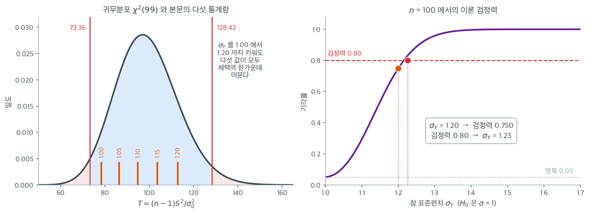

# 분산에 대한 카이제곱 검정

!!! note "이 주제를 다루는 다른 곳"
    여기서는 분산분석의 등분산성 가정을 확인하는 용도로 짧게 다룬다. 유도, 신뢰구간,
    비정규성 아래의 한계까지 갖춘 논의는 **15.2 분산에 대한 카이제곱 검정**에 있다.

## 개요

분산에 대한 카이제곱 검정은 정규 모집단의 분산이 미리 정한 값 $\sigma_0^2$과 같은지 평가하는 일표본 검정이다. 평균에 대한 일표본 $t$-검정의 분산 판이다. 이 페이지에서는 검정통계량을 유도하고 카이제곱 분포와의 연결을 보이며, Python으로 여러 분산비 시나리오에서 검정을 시연한다.

## 가설과 검정통계량

$N(\mu, \sigma^2)$에서 뽑은 확률표본 $X_1, \dots, X_n$이 주어졌을 때 양측검정은

$$
H_0: \sigma^2 = \sigma_0^2, \qquad H_1: \sigma^2 \neq \sigma_0^2
$$

이다. 검정통계량은

$$
T = \frac{(n - 1)\, S^2}{\sigma_0^2}
$$

이며 $S^2 = \frac{1}{n-1}\sum_{i=1}^{n}(X_i - \bar{X})^2$은 표본분산이다. $H_0$ 아래에서 이 통계량은 카이제곱 분포를 따른다:

$$
T \sim \chi^2(n - 1)
$$

유의수준 $\alpha$의 양측검정에서는

$$
T < \chi^2_{\alpha/2}(n-1) \quad \text{or} \quad T > \chi^2_{1-\alpha/2}(n-1)
$$

일 때 $H_0$을 기각한다. 양측 p-값은

$$
p = 2 \min\!\bigl(P(\chi^2_{n-1} \le T),\; P(\chi^2_{n-1} \ge T)\bigr)
$$

이다.

다음 함수는 이 검정을 처음부터 구현한다. 비대칭 분포의 양측 p-값을 어떻게 만들어야 하는지가 유일하게 까다로운 대목이다.

<div class="exbox" markdown>

**보기 1.** <span class="diff easy" title="쉬움"></span> 분산에 대한 카이제곱 검정 구현. 양측 p-값을 $p = 2\min\bigl(F(T),\, 1 - F(T)\bigr)$로 정의한다. 여기서 $F$는 $\chi^2(n-1)$의 분포함수다.

**(1)** 이 p-값이 결코 $1$을 넘지 않으며, $p < \alpha$라는 규칙이 임계값 두 개를 쓰는 기각규칙 $T < \chi^2_{\alpha/2}(n-1)$ 또는 $T > \chi^2_{1-\alpha/2}(n-1)$과 **정확히 같은 결정**을 줌을 보이시오.

**(2)** $H_0$이 참인 두 모집단, 정규와 $\text{Exp}(1)$에서 $n = 20, 100, 400$의 실제 1종오류율을 재시오. 5.3절의 극한 오류율 $2\bigl[1-\Phi\bigl(1.96\sqrt{2/(\beta_2-1)}\bigr)\bigr]$과 견주어 보시오.

</div>

??? success "풀이"

    **(1) 해석적으로.** 먼저 상한을 본다. 임의의 $u \in [0,1]$에 대해 $\min(u, 1-u) \le 1/2$이므로

    $$
    p = 2\min\bigl(F(T),\, 1-F(T)\bigr) \le 2 \cdot \tfrac12 = 1
    $$

    이고 등호는 $F(T) = 1/2$, 곧 $T$가 귀무분포의 **중앙값**일 때만 성립한다. 양측 p-값이 $1$에 가깝다는 것은 통계량이 중앙값 바로 위에 앉았다는 뜻이다.

    두 규칙이 같다는 것은 $F$가 연속이고 증가하므로 동치변형만으로 나온다. $0 < \alpha < 1$에서

    $$
    p < \alpha
    \iff \min\bigl(F(T), 1-F(T)\bigr) < \frac{\alpha}{2}
    \iff F(T) < \frac{\alpha}{2} \ \text{ 또는 }\ 1-F(T) < \frac{\alpha}{2}
    $$

    이다. 둘째 동치는 "최솟값이 $\alpha/2$보다 작다"와 "둘 중 적어도 하나가 $\alpha/2$보다 작다"가 같은 말이라는 것뿐이다. 이제 각 조건에 $F^{-1}$을 적용하면

    $$
    F(T) < \frac{\alpha}{2} \iff T < \chi^2_{\alpha/2}(n-1),
    \qquad
    F(T) > 1 - \frac{\alpha}{2} \iff T > \chi^2_{1-\alpha/2}(n-1)
    $$

    이다. **두 규칙은 같은 결정을 준다.** $\alpha < 1$이므로 $\alpha/2 < 1/2$이고 두 조건이 동시에 성립할 수 없어, 어느 꼬리에서 기각되었는지도 p-값만 보면 모호해지지 않는다. 다만 $\min$ 안의 어느 쪽이 골라졌는지는 p-값 자체에 남지 않으므로, 방향을 알려면 $T$를 중앙값과 비교해 보아야 한다.

    **(2) 수치적으로.** 두 규칙이 1000개 표본에서 한 번도 갈리지 않는지 확인하고, 이어서 실제 오류율을 센다.

    ```python
    import numpy as np
    import scipy.stats as stats

    def chi2_test_for_variance(data, sigma2_0=1.0):
        """모분산이 sigma2_0 인지 검정한다.

        카이제곱 분포는 좌우가 대칭이 아니다. 그래서 양측 p-값을 만들 때
        한쪽 꼬리 넓이의 두 배를 쓰되, 둘 중 작은 쪽을 골라 두 배 한다.
        """
        n = len(data)
        s2 = np.var(data, ddof=1)
        statistic = (n - 1) * s2 / sigma2_0
        p_value = 2 * min(
            stats.chi2(df=n - 1).cdf(statistic),
            stats.chi2(df=n - 1).sf(statistic)
        )
        return statistic, p_value

    # (1) 두 기각규칙이 같은 결정을 주는가. 1000 개 표본에서 맞춰 본다.
    rng = np.random.default_rng(0)
    n, alpha = 100, 0.05
    lo = stats.chi2(df=n - 1).ppf(alpha / 2)
    hi = stats.chi2(df=n - 1).ppf(1 - alpha / 2)
    same, pmax = True, 0.0
    for _ in range(1000):
        x = rng.normal(size=n)
        T, p = chi2_test_for_variance(x)
        pmax = max(pmax, p)
        if (p < alpha) != (T < lo or T > hi):
            same = False
    print(f"임계값 규칙 = p-값 규칙 ?  {same}")
    print(f"관측된 p-값의 최대      = {pmax:.4f}  (1 을 넘지 않는다)")

    # (2) 실제 1종오류율. H0: sigma^2 = 1 이 참인 두 모집단에서 센다.
    B = 20_000
    print(f"\n{'모집단':>10}{'beta2':>8}{'n=20':>9}{'n=100':>9}{'n=400':>9}{'극한(이론)':>12}")
    for name, draw, beta2 in [
        ("정규", lambda m: rng.normal(size=m), 3.0),
        ("지수", lambda m: rng.exponential(size=m), 9.0),
    ]:
        row = []
        for n in (20, 100, 400):
            T = (n - 1) * np.var(draw((B, n)), axis=1, ddof=1)
            c = stats.chi2(df=n - 1)
            row.append(np.mean((T < c.ppf(0.025)) | (T > c.ppf(0.975))))
        lim = 2 * stats.norm.sf(1.96 * np.sqrt(2 / (beta2 - 1)))
        print(f"{name:>10}{beta2:>8.1f}" + "".join(f"{v:>9.3f}" for v in row) + f"{lim:>12.3f}")
    ```

    출력:

    ```
    임계값 규칙 = p-값 규칙 ?  True
    관측된 p-값의 최대      = 0.9990  (1 을 넘지 않는다)

           모집단   beta2     n=20    n=100    n=400      극한(이론)
            정규     3.0    0.049    0.049    0.051       0.050
            지수     9.0    0.269    0.311    0.324       0.327
    ```

    **(1)의 두 결론이 그대로 확인된다.** 1000개 표본에서 두 규칙의 판정이 한 번도 갈리지 않았고, p-값의 최댓값은 $0.9990$으로 상한 $1$ 아래에 머물렀다.

    오류율 표는 더 중요한 것을 말한다. **정규 줄은 세 $n$에서 모두 $0.05$다.** 반복 2만 회의 몬테카를로 오차가 $\sqrt{0.05 \times 0.95/20000} = 0.0015$이므로 $0.049,\ 0.049,\ 0.051$은 모두 $0.05$와 구별되지 않는다. $T \sim \chi^2(n-1)$이 근사가 아니라 등식이므로 당연한 결과다.

    **지수 줄은 표본을 키울수록 나빠진다.** $0.269 \to 0.311 \to 0.324$로 올라가며 5.3절이 예측한 극한값 $0.327$에 다가간다. $\text{Exp}(1)$의 첨도가 $\beta_2 = 9$이므로

    $$
    2\left[1-\Phi\!\left(1.96\sqrt{\frac{2}{9-1}}\right)\right]
    = 2\bigl[1-\Phi(0.98)\bigr] = 0.327
    $$

    이고, $n = 400$에서 남은 거리는 $0.003$뿐이다. **유도한 극한값 $0.327$과 모의값 $0.324$가 맞는다.**

    공식이 왜 그대로 쓰이는지만 덧붙여 둔다. 5.3절은 $F = S_1^2/S_2^2$에 대해 이 식을 얻었지만, 분모가 알려진 상수 $\sigma_0^2$으로 바뀌어도 비는 변하지 않는다. 검정이 믿는 $\log$ 척도의 표준편차는 $\sqrt{2/n}$이고 참값은 $\sqrt{(\beta_2-1)/n}$이어서 둘의 비가 $\sqrt{2/(\beta_2-1)}$로 $n$과 무관하기 때문이다. **$\sqrt n$이 분자와 분모에서 함께 약분되므로 표본을 키워도 나아지지 않는다.** 유도는 5.3절에 있으니 여기서 되풀이하지 않는다.

    이 검정에 중심극한정리의 보호가 없다는 말이 바로 이 뜻이다. 평균에 대한 $t$-검정은 $n$이 커지면 비정규성이 씻겨 나가지만, 분산에 대한 검정은 **4차 적률에 노출되어 있어** 표본크기가 그 노출을 지워 주지 못한다.

보기는 $\sigma_Y \in \{1.00, 1.05, 1.10, 1.15, 1.20\}$에 대해 $N(1, \sigma_Y^2)$에서 표본을 생성하고 $H_0: \sigma^2 = 1$을 검정한다. 씨앗을 고정하므로 다섯 표본이 **같은 난수열의 배율판**이라는 점이 뒤에서 결정적으로 쓰인다.

<div class="exbox" markdown>

**보기 2.** <span class="diff easy" title="쉬움"></span> 검정 실행. 씨앗을 `seed = 1`로 고정하고 $\sigma_Y$만 $1.00$에서 $1.20$까지 바꾼다.

**(1)** 씨앗이 고정되어 있으므로 $\sigma_Y$의 표본분산이 $s^2(\sigma_Y) = \sigma_Y^2 s_1^2$ ($s_1^2$은 표준정규 쪽의 표본분산)로 정확히 적힌다는 것을 설명하고, 이때 p-값이 가장 커지는 $\sigma_Y$를 식으로 구하시오.

**(2)** 검정을 실행해 p-값이 $\sigma_Y$에 대해 단조롭지 않음을 확인하고, (1)이 지목한 자리와 맞는지 보시오.

</div>

??? success "풀이"

    **(1) 해석적으로.** `scipy` 의 `norm(loc, scale).rvs(..., random_state=seed)`는 같은 씨앗에서 같은 표준정규열 $z_1, \ldots, z_n$을 꺼내 $y_i = \text{loc} + \text{scale} \cdot z_i$로 변환한다. 표본분산은 위치이동에 영향받지 않고 배율의 제곱만큼 커지므로

    $$
    s^2(\sigma_Y) = \sigma_Y^2 \, s_1^2, \qquad
    s_1^2 = \frac{1}{n-1}\sum_i (z_i - \bar z)^2
    $$

    이고 통계량은

    $$
    T(\sigma_Y) = \frac{(n-1)\,\sigma_Y^2 s_1^2}{\sigma_0^2}
    $$

    이다. $\sigma_0^2 = 1$이므로 $T$는 $\sigma_Y^2$에 **정비례**하며 다섯 값에 걸쳐 단조증가한다.

    그런데 p-값은 $T$의 증가함수가 아니다. (1)에서 본 대로 $p = 2\min(F(T), 1-F(T))$는 $T$가 귀무분포의 **중앙값**에 있을 때 최대 $1$이 되고 양쪽으로 멀어질수록 줄어든다. 따라서 p-값이 최대가 되는 $\sigma_Y$는 $T(\sigma_Y)$가 중앙값과 같아지는 곳이다.

    $$
    (n-1)\,\sigma_Y^{*2} s_1^2 = m_{n-1}
    \quad\Longrightarrow\quad
    \sigma_Y^* = \sqrt{\frac{m_{n-1}}{(n-1)\,s_1^2}}
    $$

    여기서 $m_{n-1}$은 $\chi^2(n-1)$의 중앙값이다. $n = 100$에서 $m_{99} = 98.334$이고 $s_1^2 = 0.79142$이므로

    $$
    \sigma_Y^* = \sqrt{\frac{98.334}{99 \times 0.79142}} = \sqrt{1.2549} = 1.1203
    $$

    이다. **격자 $\{1.00, \ldots, 1.20\}$에서 이 값에 가장 가까운 점은 $1.10$**이다. 거리가 $|1.10 - 1.1203| = 0.0203$이고 $1.15$는 $0.0297$이므로 $1.10$에서 p-값이 가장 커야 한다. $\sigma_Y^*$가 격자 구간 $[1.00, 1.20]$ **안에** 있다는 것도 함께 확인해 둔다. 밖에 있었다면 최댓값이 격자의 끝점에서 잡혀 "봉우리"라는 말이 성립하지 않는다.

    **(2) 수치적으로.** 다섯 $\sigma_Y$에 대해 검정을 돌린다.

    ```python
    seed = 1
    x = stats.norm(loc=0, scale=1).rvs(100, random_state=seed)

    for scale in [1.00, 1.05, 1.10, 1.15, 1.20]:
        # random_state를 고정했으므로 scale만 바뀐 **같은** 난수열이 쓰인다.
        # 표본마다 새로 뽑았다면 표집 변동이 섞여 scale의 효과만 보기 어렵다.
        y = stats.norm(loc=1, scale=scale).rvs(100, random_state=seed)
        stat, pval = chi2_test_for_variance(y, sigma2_0=1.0)
        print(f"sigma={scale:.2f}: s2={np.var(y, ddof=1):.3f} T={stat:.2f} p={pval:.3f}")
    ```

    출력:

    ```
    sigma=1.00: s2=0.791 T=78.35 p=0.125
    sigma=1.05: s2=0.873 T=86.38 p=0.373
    sigma=1.10: s2=0.958 T=94.80 p=0.799
    sigma=1.15: s2=1.047 T=103.62 p=0.711
    sigma=1.20: s2=1.140 T=112.82 p=0.324
    ```

    **p-값의 봉우리가 $\sigma_Y = 1.10$에 있다.** (1)이 지목한 자리와 같다.

    $s^2 = \sigma_Y^2 s_1^2$도 자리마다 맞는다. $s_1^2 = 0.79142$에 $1.05^2$을 곱하면 $0.8725$, $1.20^2$을 곱하면 $1.1396$이고 출력의 $0.873$과 $1.140$과 일치한다. 배율 관계가 근사가 아니라 **등식**임을 보여 준다.

    그래서 p-값이 단조롭지 않은 까닭은 이것이다. $H_0$이 $\sigma^2 = 1$이므로 p-값을 정하는 것은 $s^2$의 크기가 아니라 $s^2$이 $1$에서 **얼마나 멀리 떨어져 있는가**다. 기준 표본이 우연히 $s_1^2 = 0.791$로 작게 나왔으므로 $\sigma_Y$를 키우는 것이 처음 한동안은 $s^2$을 $1$ 쪽으로 **끌어당기는** 일이 된다. $\sigma_Y = 1.1203$에서 가장 가까워지고 그 뒤로 다시 멀어진다.

    이 표는 그래서 검정력에 대한 표가 아니라 **표본 하나의 변덕에 대한 표**다. 검정력을 재려면 각 $\sigma_Y$마다 표본을 여러 번 뽑아 기각률을 세어야 하며, 아래에서 그 계산을 따로 한다.

`seed = 1`일 때의 값을 표로 정리하면 다음과 같다:

| $\sigma_Y$ | $S^2$ | $T$ | p-값 |
|---|---|---|---|
| 1.00 | 0.791 | 78.35 | 0.125 |
| 1.05 | 0.873 | 86.38 | 0.373 |
| 1.10 | 0.958 | 94.80 | 0.799 |
| 1.15 | 1.047 | 103.62 | 0.711 |
| 1.20 | 1.140 | 112.82 | 0.324 |

## 해석

- 이 씨앗에서 뽑힌 표본은 $\sigma_Y = 1.00$일 때 표본분산이 $S^2 = 0.79$로 1보다 꽤 작다. 그래서 $T$가 아래쪽 꼬리 쪽에 있고 p-값이 0.125이다.
- $\sigma_Y$가 커질수록 $T$가 커진다. 다만 여기서는 출발점이 1보다 작으므로 p-값이 단조 감소하지 않는다. $\sigma_Y = 1.10$ 부근에서 $S^2$이 1에 가장 가까워 p-값이 최대가 되고, 그 뒤 다시 작아진다.
- $n = 100$에서도 표준편차가 20% 큰 경우($S^2 = 1.14$)의 p-값이 0.324로 $\alpha = 0.05$에 한참 못 미친다. 다만 이것은 **이 한 표본의 사정**이다. 같은 조건에서 검정력이 실제로 얼마인지는 아래에서 따로 계산한다.

다섯 통계량이 귀무분포의 어디에 놓이는지 그려 보면 표가 왜 그런 모양이었는지 단번에 보인다.



왼쪽 곡선이 $H_0: \sigma^2 = 1$ 아래의 귀무분포 $\chi^2(99)$이고, 빨간 두 선이 $2.5\%$ 임계값 $73.36$과 $97.5\%$ 임계값 $128.42$이다. 주황 막대 다섯이 본문 표의 $T$ 값 $78.35,\ 86.38,\ 94.80,\ 103.62,\ 112.82$이다. **다섯 모두 채택역 안에 있을 뿐 아니라 오른쪽 임계값까지 한참 남았다.** $\sigma_Y$를 $1.00$에서 $1.20$까지 올려도 $T$가 $112.82$에서 멈춘 것은, 그 기준 표본이 애초에 $S^2 = 0.791$로 작게 나왔기 때문이다. $1.2^2 \times 0.791 = 1.139$이니 $T = 99 \times 1.139 = 112.8$이 되고, 기대값 $99 \times 1.44 = 142.6$에 한참 못 미친다.

오른쪽이 그래서 꼭 필요한 계산이다. 검정력은 표본 하나가 아니라 모든 가능한 표본에 걸친 기각 확률이므로 $\sigma_Y$마다 따로 구해야 한다. $n = 100$에서 $\sigma_Y = 1.20$일 때 이 검정의 검정력은 **$0.750$**이다. 네 번에 세 번은 잡아낸다는 뜻이고, 본문 표의 표본은 잡아내지 못한 네 번 중 한 번에 해당한다. 검정력 $0.80$에 이르는 지점은 $\sigma_Y = 1.23$으로, 생각보다 가깝다.

여기서 일표본 검정과 이표본 검정의 차이가 드러난다. 같은 $n = 100$, 같은 $\sigma$ 비 $1.2$에서 [등분산 F-검정](f_test_equality_of_variances.md)과 [Bartlett 검정](bartlett_test.md)의 검정력은 $0.438$에 그친다. **비교 대상이 알려진 상수 $\sigma_0^2$이면 분모의 표집오차가 없지만, 다른 표본이면 양쪽이 함께 흔들리기 때문이다.** 분산 검정이 둔하다는 통설은 대체로 옳지만, 어느 쪽 검정인지에 따라 정도가 꽤 다르다.

중요한 한계는 이 검정이 바탕 모집단이 정규일 때에만 타당하다는 점이다. 비정규 자료에서는 $S^2$의 표본분포가 카이제곱 형태에서 벗어나 제1종 오류율이 명목 수준으로 통제되지 않는다.

## 연습문제

<div class="drillbox" markdown>

**연습문제 1.** <span class="diff easy" title="쉬움"></span>
$n = 25$개의 측정에서 $S^2 = 12.5$를 얻었다. $\alpha = 0.05$에서 $H_0: \sigma^2 = 10$을 검정하라. 검정통계량을 계산하고 결론을 진술하라.

</div>

??? success "풀이"
    검정통계량은

    $$
    T = \frac{(n-1) S^2}{\sigma_0^2} = \frac{24 \times 12.5}{10} = 30.0
    $$

    이다. $H_0$ 아래에서 $T \sim \chi^2(24)$이다. $\alpha = 0.05$(양측)의 임계값은 $\chi^2_{0.025}(24) = 12.40$과 $\chi^2_{0.975}(24) = 39.36$이다. $12.40 < 30.0 < 39.36$이므로 검정통계량이 채택역 안에 있다. 5% 수준에서 $H_0$을 기각하지 못한다.

<div class="drillbox" markdown>

**연습문제 2.** <span class="diff med" title="중간"></span>
추축량 $T = (n-1)S^2 / \sigma^2$을 써서 $\sigma^2$에 대한 $(1 - \alpha)$ 신뢰구간을 유도하라.

</div>

??? success "풀이"
    정규성 아래에서 $(n-1)S^2 / \sigma^2 \sim \chi^2(n-1)$이므로

    $$
    P\!\left(\chi^2_{\alpha/2}(n-1) \le \frac{(n-1)S^2}{\sigma^2} \le \chi^2_{1-\alpha/2}(n-1)\right) = 1 - \alpha
    $$

    이다. 부등식을 뒤집으면

    $$
    \frac{(n-1)S^2}{\chi^2_{1-\alpha/2}(n-1)} \le \sigma^2 \le \frac{(n-1)S^2}{\chi^2_{\alpha/2}(n-1)}
    $$

    이며, 이것이 $\sigma^2$에 대한 $(1-\alpha)$ 신뢰구간이다. 큰 쪽 카이제곱 분위수가 하한의 분모에 오는 것이 올바른 방향임에 유의하라. $\square$

<div class="drillbox" markdown>

**연습문제 3.** <span class="diff med" title="중간"></span>
양측 p-값이 단순히 $2 \cdot P(\chi^2_{n-1} \ge T)$가 아니라 $2\min(\cdot, \cdot)$을 쓰는 이유를 설명하라.

</div>

??? success "풀이"
    카이제곱 분포는 대칭이 아니므로 두 꼬리의 모양과 넓이가 다르다. 이 검정은 양쪽 방향으로 기각할 수 있다. $T$가 유별나게 작을 수도($\sigma^2 < \sigma_0^2$을 시사) 유별나게 클 수도($\sigma^2 > \sigma_0^2$을 시사) 있다. p-값은 $T$가 놓인 쪽 꼬리에서 관측값만큼 또는 그보다 극단적인 결과의 확률을 재고, 양측이므로 두 배해야 한다.

    $2 \cdot P(\chi^2 \ge T)$는 $T$가 위쪽 꼬리에 있을 때에만 옳다. $T$가 아래쪽 꼬리에 있으면 $P(\chi^2 \ge T)$가 1에 가깝고 두 배하면 1을 넘는 말이 안 되는 값이 된다. $\min$ 형태는 관련 꼬리를 올바르게 찾아 작은 쪽 꼬리 확률을 두 배한다.

<div class="drillbox" markdown>

**연습문제 4.** <span class="diff easy" title="쉬움"></span>
어떤 공장이 목표 분산 $\sigma_0^2 = 0.04 \text{ mm}^2$으로 볼트를 생산한다. 볼트 $n = 50$개의 표본에서 $S^2 = 0.06 \text{ mm}^2$을 얻었다. 공장은 기계를 재보정해야 하는가? $\alpha = 0.01$을 쓰라.

</div>

??? success "풀이"
    검정통계량은

    $$
    T = \frac{(50 - 1)(0.06)}{0.04} = \frac{2.94}{0.04} = 73.5
    $$

    이다. $H_0$ 아래에서 $T \sim \chi^2(49)$이다. $\alpha/2 = 0.005$의 위쪽 임계값은 $\chi^2_{0.995}(49) \approx 78.23$이다. $73.5 < 78.23$이므로 위쪽 임계값을 넘지 않는다. 아래쪽 임계값은 $\chi^2_{0.005}(49) \approx 27.25$이고 $73.5 > 27.25$이다. 따라서 $T$가 채택역 안에 있으므로 1% 수준에서 $H_0$을 기각하지 못한다. 자료는 분산이 목표와 다르다는 충분한 증거를 주지 않으므로 즉각적인 재보정은 필요하지 않다. 다만 표본분산이 목표보다 50% 크므로 계속 관찰하는 편이 신중하다.

<div class="drillbox" markdown>

**연습문제 5.** <span class="diff med" title="중간"></span>
이 검정은 정규성을 가정한다. 바탕 분포의 초과 첨도가 $\gamma_2 > 0$일 때 제1종 오류율이 어떻게 되는지 기술하고 대안을 제시하라.

</div>

??? success "풀이"
    모집단의 초과 첨도가 $\gamma_2 > 0$이면(정규보다 꼬리가 두꺼우면) $S^2$의 표본분포가 카이제곱 이론이 예측하는 것보다 크게 변동한다. 구체적으로 $\text{Var}(S^2) = \sigma^4 \bigl(\frac{2}{n-1} + \frac{\gamma_2}{n}\bigr)$이고 이는 정규 이론의 값 $\frac{2\sigma^4}{n-1}$보다 크다. 따라서 검정통계량 $T$의 분포가 $\chi^2(n-1)$보다 퍼져 기각역에 더 자주 들어가고, 그 결과 제1종 오류율이 부풀려진다.

    로버스트한 대안은 붓스트랩 검정이다. 자료를 복원으로 여러 번 재표본추출하여 각 재표본의 $S^2$을 계산하고, $(n-1)S^2/\sigma_0^2$의 경험적 분포로 p-값을 얻는다. 이 접근은 분포 가정을 두지 않는다.

<div class="drillbox" markdown>

**연습문제 6.** <span class="diff hard" title="어려움"></span>
연습문제 5의 답을 **수치로 확인**하라. 초과 첨도가 양수·음수일 때 각각 어떻게 되며, **$n$을 늘리면 나아지는가**?

</div>

??? success "풀이"
    ```python
    import numpy as np
    from scipy import stats

    def chi2_var_p(x, s0=1.0):
        n = len(x)
        T = (n - 1) * x.var(ddof=1) / s0
        return 2 * min(stats.chi2(n - 1).cdf(T), stats.chi2(n - 1).sf(T))

    rng = np.random.default_rng(111)
    B = 20_000
    # 모두 분산이 정확히 1 이 되도록 척도를 맞춘 분포들
    dists = {
        "정규 (초과첨도 0)": lambda n: rng.normal(0, 1, n),
        "균등 (−1.2)": lambda n: rng.uniform(-np.sqrt(3), np.sqrt(3), n),
        "라플라스 (+3)": lambda n: rng.laplace(0, 1 / np.sqrt(2), n),
        "t(8) (+1.5)": lambda n: rng.standard_t(8, n) / np.sqrt(8 / 6),
        "t(5) (+6)": lambda n: rng.standard_t(5, n) / np.sqrt(5 / 3),
        "지수 (+6)": lambda n: rng.exponential(1, n),
    }
    for n in [20, 50]:
        print(f"  n = {n}")
        for lab, f in dists.items():
            a = sum(chi2_var_p(f(n)) < 0.05 for _ in range(B))
            print(f"    {lab:>18s} {a / B:8.4f}")
    ```

    ```text
      n = 20
               정규 (초과첨도 0)   0.0485
                 균등 (−1.2)   0.0046
                 라플라스 (+3)   0.1808
               t(8) (+1.5)   0.1033
                 t(5) (+6)   0.1583
                   지수 (+6)   0.2687
      n = 50
               정규 (초과첨도 0)   0.0496
                 균등 (−1.2)   0.0024
                 라플라스 (+3)   0.2006
               t(8) (+1.5)   0.1201
                 t(5) (+6)   0.1880
                   지수 (+6)   0.2969
    ```

    **결정적인 발견 — $n$을 늘려도 나아지지 않는다. 오히려 나빠진다.**

    | 분포 | 초과첨도 | $n=20$ | $n=50$ |
    |---|---|---|---|
    | 균등 | $-1.2$ | 0.005 | **0.002** |
    | 정규 | 0 | 0.049 | 0.050 |
    | $t(8)$ | $+1.5$ | 0.103 | **0.120** |
    | 라플라스 | $+3$ | 0.181 | **0.201** |
    | 지수 | $+6$ | 0.269 | **0.297** |

    **왜 중심극한정리가 구해 주지 않는가.** $S^2$의 분산이

    $$
    \operatorname{Var}(S^2)=\frac{\sigma^4}{n}\left(\gamma_2+\frac{2n}{n-1}\right)
    $$

    인데, 검정은 $\gamma_2=0$을 전제로 $\chi^2(n-1)$을 쓴다. **$n$이 커져도 $\gamma_2$ 항의 비중이 줄지 않는다.**

    $$
    \frac{\operatorname{Var}_{\text{실제}}(S^2)}{\operatorname{Var}_{\text{정규}}(S^2)}
    \ \xrightarrow[n\to\infty]{}\ 1+\frac{\gamma_2}{2}
    $$

    **지수분포($\gamma_2=6$)에서는 이 비가 4**다. 실제 $S^2$의 표준편차가 가정의 **두 배**이므로 오류율이 폭증한다.

    **이것이 평균 검정과 결정적으로 다른 점이다.**

    | | 검정하는 것 | 중심극한정리 |
    |---|---|---|
    | $t$ 검정 | 1차 적률(평균) | **구해 준다** |
    | 카이제곱 분산 검정 | 2차 적률(분산) | **구해 주지 못한다** |

    **$\bar X$의 분포는 $n$이 커지면 정규가 되지만, $S^2$의 분포는 4차 적률(첨도)에 계속 의존**한다.

    **음의 초과첨도는 반대 방향으로 어긋난다**(균등에서 0.002). 지나치게 보수적이어서 **검정력을 잃는다.**

    **대안 셋.**

    | 방법 | 내용 |
    |---|---|
    | **부트스트랩** | $S^2$의 표집분포를 자료에서 직접 만든다(연습문제 7) |
    | 첨도 보정 | $\gamma_2$를 추정해 자유도를 조정(Box 1953) |
    | **순열/재표집 기반 등분산 검정** | 브라운-포사이드 등 |

    **실무 권고.** **정규성을 확신할 수 없으면 이 검정을 쓰지 않는다.** 분산 추론은 평균 추론보다 **정규성에 훨씬 민감**하다.

<div class="drillbox" markdown>

**연습문제 7.** <span class="diff hard" title="어려움"></span>
연습문제 2에서 유도한 신뢰구간의 **실제 피복확률**을 재고, 부트스트랩 구간과 비교하라.

</div>

??? success "풀이"
    ```python
    import numpy as np
    from scipy import stats

    rng = np.random.default_rng(222)
    B = 10_000

    def chi2_ci(x, a=0.05):
        n = len(x)
        s2 = x.var(ddof=1)
        return ((n - 1) * s2 / stats.chi2.ppf(1 - a / 2, n - 1),
                (n - 1) * s2 / stats.chi2.ppf(a / 2, n - 1))

    def boot_ci(x, a=0.05, R=800, rng=None):
        n = len(x)
        bs = np.array([x[rng.integers(0, n, n)].var(ddof=1) for _ in range(R)])
        return np.quantile(bs, [a / 2, 1 - a / 2])

    dists = {
        "정규": lambda n: rng.normal(0, 1, n),
        "라플라스": lambda n: rng.laplace(0, 1 / np.sqrt(2), n),
        "t(5)": lambda n: rng.standard_t(5, n) / np.sqrt(5 / 3),
        "지수": lambda n: rng.exponential(1, n),
        "균등": lambda n: rng.uniform(-np.sqrt(3), np.sqrt(3), n),
    }
    print("참값 σ² = 1 을 덮는 비율 (명목 95%)")
    print(f"{'분포':>10s} {'n=20 카이제곱':>13s} {'n=50 카이제곱':>13s} "
          f"{'n=50 부트스트랩':>15s}")
    for lab, f in dists.items():
        row = []
        for n in [20, 50]:
            c = 0
            for _ in range(B):
                lo, hi = chi2_ci(f(n))
                c += lo <= 1.0 <= hi
            row.append(c / B)
        c = 0
        for _ in range(1_500):
            lo, hi = boot_ci(f(50), rng=rng)
            c += lo <= 1.0 <= hi
        row.append(c / 1_500)
        print(f"{lab:>10s} {row[0]:13.4f} {row[1]:13.4f} {row[2]:15.4f}")
    ```

    ```text
    참값 σ² = 1 을 덮는 비율 (명목 95%)
            분포     n=20 카이제곱     n=50 카이제곱      n=50 부트스트랩
            정규        0.9470        0.9477          0.9107
          라플라스        0.8140        0.8032          0.8660
          t(5)        0.8477        0.8090          0.8293
            지수        0.7413        0.6944          0.8300
            균등        0.9952        0.9964          0.9280
    ```

    **지수분포에서 피복확률이 0.69다.** 95% 구간이 **열 번 중 세 번 참값을 놓친다.**

    | 분포 | 카이제곱 ($n=50$) | 부트스트랩 ($n=50$) |
    |---|---|---|
    | 정규 | **0.948** | 0.911 |
    | 라플라스 | 0.803 | **0.866** |
    | $t(5)$ | 0.809 | 0.829 |
    | 지수 | **0.694** | **0.830** |
    | 균등 | 0.996 | 0.928 |

    **여기서도 $n$을 늘리면 나빠진다**(지수에서 0.741 → 0.694). 연습문제 6과 같은 이유다.

    **부트스트랩이 낫지만 완벽하지 않다.**

    | | 장점 | 단점 |
    |---|---|---|
    | 카이제곱 구간 | 정규에서 **정확** | 비정규에서 **0.69** |
    | 백분위 부트스트랩 | 비정규에서 **크게 개선** | 정규에서 **0.911**로 손해 |

    **백분위 부트스트랩이 정규에서 0.911인 이유.** $S^2$의 표집분포가 **오른쪽으로 치우쳐** 있는데 백분위 방법은 그 비대칭을 제대로 반영하지 못한다. **BCa나 $t$-부트스트랩**을 쓰면 개선된다.

    **지수에서 0.830도 만족스럽지 않다.** 치우침이 심하면 $n=50$으로는 부족하다.

    **실무 권고 넷.**

    1. **분산의 구간은 평균의 구간보다 훨씬 조심해서** 다룬다.
    2. **정규성을 그림으로 확인**한 뒤에만 카이제곱 구간을 쓴다.
    3. 비정규가 의심되면 **BCa 부트스트랩**을 쓰고 $n$을 늘린다.
    4. **분산 대신 다른 산포 측도**(사분위범위, MAD)를 보고하는 것도 방법이다. 이들은 첨도에 훨씬 덜 민감하다.

<div class="drillbox" markdown>

**연습문제 8.** <span class="diff med" title="중간"></span>
분산비 $\sigma^2/\sigma_0^2$를 검정력 0.80으로 탐지하려면 표본이 얼마나 필요한가? **표를 만들고 검정력의 비대칭**을 설명하라.

</div>

??? success "풀이"
    **검정력 계산.** $H_1$ 아래에서 $S^2\sim\dfrac{\sigma^2}{n-1}\chi^2(n-1)$이므로 통계량은

    $$
    T=\frac{(n-1)S^2}{\sigma_0^2}\sim r\cdot\chi^2(n-1),
    \qquad r=\frac{\sigma^2}{\sigma_0^2}
    $$

    를 따른다. 따라서 검정력은

    $$
    P\!\left(\chi^2_{n-1}<\frac{\chi^2_{\alpha/2,\,n-1}}{r}\right)
    +P\!\left(\chi^2_{n-1}>\frac{\chi^2_{1-\alpha/2,\,n-1}}{r}\right)
    $$

    ```python
    from scipy import stats

    def n_needed(ratio, power=0.80, alpha=0.05):
        for n in range(3, 200_000):
            lo = stats.chi2.ppf(alpha / 2, n - 1)
            hi = stats.chi2.ppf(1 - alpha / 2, n - 1)
            pw = (stats.chi2.cdf(lo / ratio, n - 1)
                  + stats.chi2.sf(hi / ratio, n - 1))
            if pw >= power:
                return n

    print(f"{'σ²/σ0²':>8s} {'필요한 n':>9s}")
    for r in [1.25, 1.5, 2.0, 3.0, 0.8, 0.667, 0.5]:
        print(f"{r:8.3f} {n_needed(r):9d}")
    ```

    ```text
      σ²/σ0²     필요한 n
       1.250       308
       1.500        93
       2.000        32
       3.000        13
       0.800       327
       0.667       103
       0.500        38
    ```

    **분산비 1.25를 잡으려면 표본이 308개 필요하다.** 표준편차로는 $\sqrt{1.25}=1.12$, 즉 **12% 차이**다.

    | 분산비 | 표준편차비 | 필요한 $n$ |
    |---|---|---|
    | 1.25 | 1.12 | **308** |
    | 1.5 | 1.22 | 93 |
    | 2.0 | 1.41 | 32 |
    | 3.0 | 1.73 | 13 |

    **분산 검정은 평균 검정보다 훨씬 표본을 많이 요구**한다. 참고로 효과크기 $d=0.5$의 두 집단 $t$ 검정은 집단당 64개면 된다.

    **비대칭에 주목하자.**

    | 방향 | 비 | 필요한 $n$ |
    |---|---|---|
    | 커짐 | 1.25 | 308 |
    | **작아짐** | **0.80** | **327** |
    | 커짐 | 2.0 | 32 |
    | **작아짐** | **0.50** | **38** |

    **분산이 작아지는 쪽을 탐지하기가 더 어렵다.** 1.25배와 0.80배는 서로 역수인데 필요한 $n$이 308 대 327이다.

    **이유는 카이제곱 분포의 비대칭**이다. $\chi^2$은 오른쪽 꼬리가 길어 **위쪽 이탈은 쉽게 눈에 띄지만 아래쪽은 압축**되어 있다.

    **로그 척도에서 보면 자연스럽다.** $\ln r$로 보면 $\ln1.25=0.223$, $\ln0.8=-0.223$으로 대칭이고, 필요한 $n$의 차이는 6% 정도로 줄어든다. **분산은 로그 척도에서 다루는 것이 자연스럽다.**

    **실무 함의 셋.**

    1. **"분산에 차이가 없다"는 결론은 표본이 수백 개일 때만 의미** 있다.
    2. 공정관리에서 **산포의 작은 개선을 증명하려면 대규모 표본**이 필요하다.
    3. **검정보다 구간을 보고**한다. $n=30$이면 구간이 $[0.64\hat\sigma^2,\ 1.81\hat\sigma^2]$ 정도로 넓다.

<div class="drillbox" markdown>

**연습문제 9.** <span class="diff hard" title="어려움"></span>
연습문제 3이 지적한 **비대칭** 때문에, 동일 꼬리 확률 구간이 **가장 짧은 구간이 아니다.** 최단 구간을 구하고 얼마나 짧아지는지 보여라.

</div>

??? success "풀이"
    **문제 설정.** $(1-\alpha)$ 신뢰구간은

    $$
    \left[\frac{(n-1)S^2}{b},\ \frac{(n-1)S^2}{a}\right],
    \qquad P(a<\chi^2_{n-1}<b)=1-\alpha
    $$

    이고 길이는 $(n-1)S^2\left(\dfrac1a-\dfrac1b\right)$에 비례한다. **$(a,b)$를 자유롭게 고를 수 있다.**

    ```python
    import numpy as np
    from scipy import stats, optimize

    def shortest(n, conf=0.95):
        """길이 1/a - 1/b 를 최소화하는 (a, b) 를 찾는다."""
        df = n - 1

        def length(alo):
            a = stats.chi2.ppf(alo, df)
            b = stats.chi2.ppf(alo + conf, df)
            return 1 / a - 1 / b

        r = optimize.minimize_scalar(length, bounds=(1e-6, 1 - conf - 1e-6),
                                     method="bounded")
        return (stats.chi2.ppf(r.x, df), stats.chi2.ppf(r.x + conf, df), r.fun)

    print("동일꼬리 구간 대 최단 구간 (95%, (n-1)S² = 1 로 둔 길이)")
    print(f"{'n':>5s} {'동일꼬리 [a,b]':>22s} {'길이':>8s} "
          f"{'최단 [a,b]':>22s} {'길이':>8s} {'절감':>7s}")
    for n in [5, 10, 20, 50, 100]:
        df = n - 1
        a1, b1 = stats.chi2.ppf(0.025, df), stats.chi2.ppf(0.975, df)
        L1 = 1 / a1 - 1 / b1
        a2, b2, L2 = shortest(n)
        print(f"{n:5d} [{a1:8.3f},{b1:9.3f}] {L1:8.4f} "
              f"[{a2:8.3f},{b2:9.3f}] {L2:8.4f} {100 * (L1 - L2) / L1:6.2f}%")

    print("\n최단 구간의 꼬리 확률 배분")
    for n in [5, 20, 100]:
        a2, b2, _ = shortest(n)
        print(f"  n={n:3d}: 아래 꼬리 {stats.chi2.cdf(a2, n - 1):.4f}, "
              f"위 꼬리 {stats.chi2.sf(b2, n - 1):.4f}")
    ```

    ```text
    동일꼬리 구간 대 최단 구간 (95%, (n-1)S² = 1 로 둔 길이)
        n             동일꼬리 [a,b]       길이               최단 [a,b]       길이      절감
        5 [   0.484,   11.143]   1.9746 [   0.708,   21.052]   1.3645  30.90%
       10 [   2.700,   19.023]   0.3177 [   3.284,   26.076]   0.2662  16.22%
       20 [   8.907,   32.852]   0.0818 [   9.899,   38.327]   0.0749   8.44%
       50 [  31.555,   70.222]   0.0175 [  33.044,   74.517]   0.0168   3.48%
      100 [  73.361,  128.422]   0.0058 [  75.151,  132.189]   0.0057   1.76%

    최단 구간의 꼬리 확률 배분
      n=  5: 아래 꼬리 0.0497, 위 꼬리 0.0003
      n= 20: 아래 꼬리 0.0446, 위 꼬리 0.0054
      n=100: 아래 꼬리 0.0355, 위 꼬리 0.0145
    ```

    **$n=5$에서 구간이 31% 짧아진다.**

    | $n$ | 절감 |
    |---|---|
    | 5 | **30.9%** |
    | 10 | 16.2% |
    | 20 | 8.4% |
    | 50 | 3.5% |
    | 100 | 1.8% |

    **$n$이 커지면 이득이 사라진다.** 카이제곱이 정규에 가까워져 **비대칭이 줄기 때문**이다.

    **최단 구간의 꼬리 배분이 극단적이다.** $n=5$에서 아래 꼬리 0.0497, 위 꼬리 **0.0003**이다. 거의 **단측 구간**에 가깝다.

    **왜 그런가.** 길이가 $1/a-1/b$이므로 **작은 $a$가 길이를 지배**한다. $1/a$가 폭발하므로 $a$를 키우는 것이 유리하고, 그 대가로 $b$를 크게 늘려도 $1/b$의 변화는 미미하다.

    **그럼 왜 동일 꼬리 구간을 쓰는가.**

    | 기준 | 동일꼬리 | 최단 |
    |---|---|---|
    | 길이 | 김 | **짧음** |
    | **양쪽 오류 확률이 같은가** | **같음(0.025/0.025)** | 다름 |
    | 계산 | **닫힌 식** | 수치 최적화 |
    | 불편성 | 근사적 | 아님 |
    | 관례·재현성 | **표준** | 드묾 |

    **두 번째 줄이 핵심이다.** 최단 구간은 "$\sigma^2$을 과대추정할 확률 0.0003, 과소추정할 확률 0.0497"이라는 **비대칭적 위험**을 준다. 많은 응용에서 이것은 바람직하지 않다.

    **실무 지침.**

    | 상황 | 선택 |
    |---|---|
    | 일반적 보고 | **동일 꼬리**(관례) |
    | $n$이 매우 작고 길이가 중요 | 최단 구간(**꼬리 배분을 명시**) |
    | 한쪽 위험만 관심 | **단측 구간**(더 짧다) |
    | $\ln\sigma^2$을 보고 | 로그 척도에서 대칭 구간 |

    **마지막이 흥미롭다.** $\ln\sigma^2$의 척도에서 대칭 구간을 만들면 동일꼬리와 최단의 중간쯤이 되고, **해석도 "몇 배"로 자연스럽다.**

<div class="drillbox" markdown>

**연습문제 10.** <span class="diff easy" title="쉬움"></span>
분산에 대한 카이제곱 검정의 **사용 지침**을 정리하라.

</div>

??? success "풀이"
    **검정의 구조.**

    $$
    T=\frac{(n-1)S^2}{\sigma_0^2}\ \sim\ \chi^2(n-1)
    \qquad\text{(정규성 아래에서 정확)}
    $$

    **정규성이 성립하면 근사가 아니라 정확한 검정**이다. 그것이 장점이자 유일한 조건이다.

    **핵심 수치 넷.**

    | 사실 | 값 |
    |---|---|
    | 지수분포에서 제1종 오류율($n=50$) | **0.297** |
    | 같은 상황 신뢰구간의 피복확률 | **0.694** |
    | 분산비 1.25를 잡는 데 필요한 $n$ | **308** |
    | $n=5$에서 최단 구간의 길이 절감 | 30.9% |

    **사용 조건.**

    | 조건 | 확인 방법 |
    |---|---|
    | **정규성** | Q-Q 그림, 첨도 추정 |
    | 독립성 | 설계 |
    | $\sigma_0^2$이 **사전에 정해짐** | 자료에서 뽑은 값이면 무효 |

    **첫 줄이 절대적이다.** 평균 검정과 달리 **표본을 늘려도 정규성 위반이 해소되지 않는다**(연습문제 6).

    **결정 흐름.**

    ```text
    분산에 대한 추론이 필요하다
        │
        ├─ 정규성을 신뢰할 수 있는가?
        │     │
        │     ├─ 예 (물리 측정, 공정 관리 등)
        │     │     └─→ 카이제곱 검정 / 구간
        │     │
        │     └─ 아니오
        │           ├─→ BCa 부트스트랩 구간
        │           ├─→ 변환 후 검정 (로그 등)
        │           └─→ 로버스트 산포 측도 (IQR, MAD)
        │
        └─ 표본이 충분한가?  (비 1.25 → n ≈ 300)
    ```

    **자주 하는 실수 넷.**

    | 실수 | 결과 |
    |---|---|
    | 비정규 자료에 그대로 적용 | **오류율 0.30** |
    | $n$이 크니 괜찮다고 생각 | **더 나빠진다** |
    | 유의하지 않음을 "같음"으로 | 검정력이 낮다 |
    | 양측 $p$를 $2P(\chi^2\geq T)$로 | 왼쪽 이탈에서 $p>1$ 가능 |

    **보고 형식.**

    ```text
    n = 50, S² = 0.0612 mm²
    H0: σ² = 0.04 mm²
    T = 49 × 0.0612 / 0.04 = 74.97,  df = 49
    p = 2 × min(0.9910, 0.0090) = 0.0180
    95% 신뢰구간: σ² ∈ [0.0427, 0.0951]
    → 목표 분산을 넘어섰다고 판단 (단, 정규성 가정 아래)
    ```

    **"단, 정규성 가정 아래"를 반드시 적는다.** 이 검정에서 그 단서는 형식적 문구가 아니라 **결론의 유효 조건**이다.

    **한 문장.** 분산 추론은 **4차 적률에 의존**하므로 평균 추론보다 훨씬 까다롭고, **정규성이 보장되지 않으면 이 검정을 쓰지 않는 것**이 옳다.

---

## 정리하며

일표본 분산 검정을 **분산분석의 맥락에서** 다시 본다.

$$
\chi^2=\frac{(n-1)S^2}{\sigma_0^2}\sim\chi^2_{n-1}
$$

- **평균에 대한 $t$ 검정의 분산판이다.** 하나의 집단에서 분산이 목표값과 같은지 검정한다.
- **9장·8장에서 본 것과 같은 검정이며 같은 약점을 갖는다.** 정규성에서 벗어나면 제1종 오류율이 크게 어긋나고, **표본을 늘려도 나아지지 않는다.**
- **분산분석의 맥락에서는 보조적이다.** 등분산성 확인에는 여러 집단을 한꺼번에 다루는 바틀렛·레빈이 쓰이며, 이 검정은 특정 집단의 변동이 기준을 넘는지 볼 때 쓴다.
- **품질관리가 전형적인 응용**이며, 대개 단측으로 쓴다.
- **비대칭 분포라 양측 임계값이 대칭이 아니다.**

다음 절 **카이제곱분포**에서 이 검정들이 기대는 분포를 다시 정리한다.
