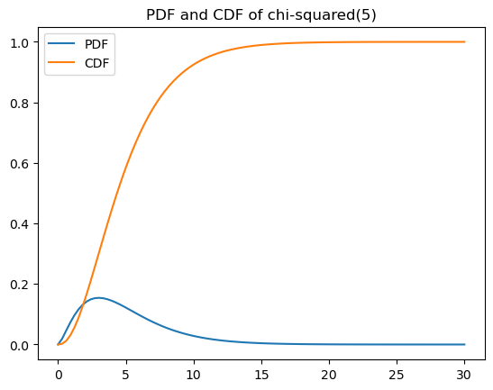

# 카이제곱 분포

!!! note "이 주제를 다루는 다른 곳"
    이 페이지는 등분산성 확인에 필요한 만큼만 카이제곱분포를 다룬다. 분산 검정의
    바탕으로서 이 분포를 본격적으로 쓰는 곳은 **15.2 분산에 대한 카이제곱 검정**이다.

## 개요

카이제곱 분포는 추론통계에서 가장 기본적인 분포 중 하나로, 분산에 대한 검정, 적합도 검정, 독립성 검정의 바탕이 된다. 표준정규 확률변수의 제곱합의 분포로 자연스럽게 나타난다. 이 페이지에서는 이 분포를 정의하고 핵심 성질을 유도하며, 확률밀도함수와 누적분포함수를 시각화하고, $\chi^2(d)$에서 직접 표집한 것과 $Z^2$의 합으로 구성한 것이 같은 분포임을 보인다.

## 정의

$Z_1, Z_2, \dots, Z_d$가 독립인 표준정규 확률변수 $Z_i \sim N(0,1)$이면 그 제곱합은 자유도 $d$인 카이제곱 분포를 따른다:

$$
Q = \sum_{i=1}^{d} Z_i^2 \sim \chi^2(d)
$$

$x > 0$에서 확률밀도함수는

$$
f(x;\, d) = \frac{1}{2^{d/2}\, \Gamma(d/2)}\, x^{d/2 - 1}\, e^{-x/2}
$$

이며 $\Gamma(\cdot)$는 감마함수이다.

## 핵심 성질

| 성질 | 값 |
|---|---|
| 평균 | $d$ |
| 분산 | $2d$ |
| 최빈값 | $\max(d - 2,\, 0)$ |
| 왜도 | $\sqrt{8/d}$ |
| 적률생성함수 | $t < 1/2$에서 $(1 - 2t)^{-d/2}$ |

$d \to \infty$이면 중심극한정리에 의해 카이제곱 분포가 정규분포에 가까워진다:

$$
\frac{Q - d}{\sqrt{2d}} \xrightarrow{d} N(0, 1)
$$

## 가법성

$Q_1 \sim \chi^2(d_1)$과 $Q_2 \sim \chi^2(d_2)$가 독립이면

$$
Q_1 + Q_2 \sim \chi^2(d_1 + d_2)
$$

이다. 정의에서 곧바로 따라온다. 독립인 표준정규 제곱 $d_1 + d_2$개의 합은 자유도 $d_1 + d_2$를 갖는다.

## 확률밀도함수와 누적분포함수의 시각화

다음 코드는 주어진 자유도에 대해 확률밀도함수와 누적분포함수를 그린다:

```python
import numpy as np
import scipy.stats as stats
import matplotlib.pyplot as plt

df = 5
x = np.linspace(0, 30, 100)
pdf = stats.chi2(df=df).pdf(x)
cdf = stats.chi2(df=df).cdf(x)

fig, ax = plt.subplots()
ax.plot(x, pdf, label="PDF")
ax.plot(x, cdf, label="CDF")
ax.legend()
ax.set_title(f"PDF and CDF of chi-squared({df})")
plt.show()
```



자유도 5에서 확률밀도함수의 최빈값이 $d - 2 = 3$에 있고 오른쪽으로 길게 늘어져 있다. 누적분포함수는 15 근처에서 이미 1에 가까워진다.

$d$가 작으면 확률밀도함수가 오른쪽으로 치우치고 최빈값이 0 근처에 있다. $d$가 커지면 분포가 더 대칭적이 되고 오른쪽으로 이동한다.

## 정규 제곱합으로부터의 구성

정의가 되는 성질은 두 방식을 비교하여 경험적으로 확인할 수 있다:

1. **직접 표집:** $\chi^2(d)$에서 10,000개를 뽑는다.
2. **구성:** $N(0,1)$ 값으로 $d \times 10{,}000$ 행렬을 만들고 각 성분을 제곱한 뒤 열 방향으로 합한다.

```python
df, seed = 5, 1
data_direct = stats.chi2(df=df).rvs(10_000, random_state=seed)
# 표준정규를 df개 제곱해서 더한다. 이것이 카이제곱분포의 정의다.
# axis=0으로 합해야 열마다(표본마다) 제곱합이 하나씩 나온다.
data_from_norm = np.sum(
    stats.norm().rvs(size=(df, 10_000), random_state=seed) ** 2,
    axis=0
)

for name, d in [("직접 표집", data_direct), ("제곱합 구성", data_from_norm)]:
    print(f"{name:<12} mean={d.mean():.4f}  var={d.var(ddof=1):.4f}")
print(f"{'이론값':<12} mean={df:.4f}  var={2*df:.4f}")
```

출력:

```
직접 표집        mean=4.9953  var=10.0317
제곱합 구성       mean=5.0068  var=9.9999
이론값          mean=5.0000  var=10.0000
```

두 방식 모두 이론값 $E[\chi^2_d] = d = 5$와 $\text{Var}(\chi^2_d) = 2d = 10$을 재현한다. 정의 $\sum Z_i^2 \sim \chi^2(d)$가 수치로 확인된 셈이다.

두 표본이 서로 정확히 같지는 않다는 점에 주의하라. `random_state`가 같아도 뽑는 난수의 **개수와 용도**가 다르기 때문이다. 직접 표집은 10,000개를 뽑고, 제곱합 구성은 50,000개를 뽑아 다섯 개씩 묶는다.

## 해석

- 자유도 $d$가 모양을 결정한다. $d$가 작으면 0 근처에 몰린 심하게 치우친 분포가 되고, $d$가 크면 $d$를 중심으로 하는 거의 대칭인 종 모양이 된다.
- 카이제곱 분포는 제곱합으로 정의되므로 양수 값만 가진다.
- 임계값 $\chi^2_{1-\alpha}(d)$는 가설검정에서 널리 쓰인다. 예를 들어 $\chi^2(5)$의 상위 5% 임계값은 약 11.07이다.

## 연습문제

<div class="drillbox" markdown>

**연습문제 1.**
위 성질 표를 써서 $Q \sim \chi^2(10)$의 $E[Q]$와 $\text{Var}(Q)$를 계산하고, $Z \sim N(0,1)$에 대한 $E[Z^2]$과 $\text{Var}(Z^2)$으로 확인하라.

</div>

??? success "풀이"
    표에서 $E[Q] = d = 10$, $\text{Var}(Q) = 2d = 20$이다.

    확인: $Z \sim N(0,1)$에서 $E[Z^2] = 1$이고 $\text{Var}(Z^2) = E[Z^4] - (E[Z^2])^2 = 3 - 1 = 2$이다. $Q = \sum_{i=1}^{10} Z_i^2$이고 항들이 독립이므로

    $$
    E[Q] = 10 \cdot 1 = 10, \qquad \text{Var}(Q) = 10 \cdot 2 = 20
    $$

    이다. 두 방식이 일치한다.

<div class="drillbox" markdown>

**연습문제 2.**
$Z \sim N(0,1)$에 대한 $Z^2$의 적률생성함수에서 시작하여 $\chi^2(d)$의 적률생성함수가 $t < 1/2$에서 $M_Q(t) = (1 - 2t)^{-d/2}$임을 보여라.

</div>

??? success "풀이"
    $Z \sim N(0,1)$에서 $Z^2$의 적률생성함수는

    $$
    M_{Z^2}(t) = E[e^{tZ^2}] = \int_{-\infty}^{\infty} e^{tz^2} \frac{1}{\sqrt{2\pi}} e^{-z^2/2}\, dz = \int_{-\infty}^{\infty} \frac{1}{\sqrt{2\pi}} e^{-z^2(1 - 2t)/2}\, dz
    $$

    이다. 이 적분은 $1 - 2t > 0$, 즉 $t < 1/2$일 때 수렴한다. Gauss 적분을 완성하면 $M_{Z^2}(t) = (1 - 2t)^{-1/2}$을 얻는다.

    $Q = \sum_{i=1}^{d} Z_i^2$이고 $Z_i$가 독립이므로 $Q$의 적률생성함수는 개별 적률생성함수의 곱이다:

    $$
    M_Q(t) = \prod_{i=1}^{d} (1 - 2t)^{-1/2} = (1 - 2t)^{-d/2}
    $$

    ($t < 1/2$). $\square$

<div class="drillbox" markdown>

**연습문제 3.**
$Q_1 \sim \chi^2(3)$과 $Q_2 \sim \chi^2(7)$이 독립일 때 $Q_1 + Q_2$의 분포를 구하고 $P(Q_1 + Q_2 > 18.31)$을 계산하라.

</div>

??? success "풀이"
    가법성에 의해 $Q_1 + Q_2 \sim \chi^2(3 + 7) = \chi^2(10)$이다.

    값 18.31은 $\chi^2(10)$의 상위 5% 임계값이므로

    $$
    P(Q_1 + Q_2 > 18.31) = 0.05
    $$

    이다.

<div class="drillbox" markdown>

**연습문제 4.**
자유도 $d = 2$인 카이제곱 분포가 지수분포인 이유를 설명하라. 비율 모수를 밝혀라.

</div>

??? success "풀이"
    확률밀도함수에 $d = 2$를 넣으면

    $$
    f(x;\, 2) = \frac{1}{2^1 \Gamma(1)} x^{0} e^{-x/2} = \frac{1}{2} e^{-x/2}, \qquad x > 0
    $$

    이다. 이는 정확히 $\text{Exponential}(\lambda = 1/2)$ 분포(동등하게 평균이 2인 지수분포)의 확률밀도함수이다. 놀랄 일은 아니다. $\chi^2(d)$는 $\text{Gamma}(d/2, 1/2)$의 특수한 경우이고 $\text{Gamma}(1, \lambda) = \text{Exponential}(\lambda)$이기 때문이다.

<div class="drillbox" markdown>

**연습문제 5.**
어떤 연구자가 정규근사 $(Q - d)/\sqrt{2d} \approx N(0,1)$을 써서 $\chi^2(50)$의 상위 5% 임계값을 구하려 한다. 근사 임계값을 계산하고 정확한 값 67.50과 비교하라.

</div>

??? success "풀이"
    $d = 50$과 $z_{0.95} = 1.645$로 근사하면

    $$
    Q \approx d + z_{0.95}\sqrt{2d} = 50 + 1.645\sqrt{100} = 50 + 16.45 = 66.45
    $$

    이다. 정확한 값은 67.50이므로 근사가 약 1.05만큼 과소추정한다(상대오차 약 1.6%). $d = 50$에서 근사가 그런대로 쓸 만하고 $d$가 커질수록 좋아진다. 더 정확하게 하려면 Wilson-Hilferty의 세제곱근 변환 $\bigl(\frac{Q}{d}\bigr)^{1/3} \approx N\!\bigl(1 - \frac{2}{9d},\, \frac{2}{9d}\bigr)$을 흔히 선호한다.

---

## 정리하며

카이제곱분포는 **제곱합의 분포**이며, 이 장의 여러 검정이 여기 기댄다.

$$
Q=\sum_{i=1}^d Z_i^2\sim\chi^2_d
$$

- **두 가지 구성이 같은 분포를 준다.** $\chi^2(d)$ 에서 직접 표집한 것과 표준정규 $d$ 개를 제곱해 더한 것이 일치하며, 모의실험으로 확인할 수 있다.
- **평균 $d$, 분산 $2d$** 이고 오른쪽으로 치우쳐 있다. 자유도가 커지면 정규에 가까워지지만 수렴이 느리다(4장).
- **어디에 나오는가.** 표본분산의 분포, 분산 검정, 적합도·독립성 검정, 그리고 $F$ 분포의 분자와 분모가 모두 카이제곱이다.
- **$F=\frac{\chi^2_{d_1}/d_1}{\chi^2_{d_2}/d_2}$ 라는 관계**가 분산분석의 $F$ 통계량이 왜 그 분포를 따르는지 설명해 준다. 0장의 코크런 정리가 제곱합을 독립인 카이제곱들로 쪼개 주는 것이 근거다.
- **정규성이 출발점이다.** 이 분포가 나오는 이유가 정규확률변수의 제곱이므로, 정규성이 깨지면 연쇄적으로 모든 것이 흔들린다.

다음 절 **등분산에 대한 F-검정**으로 넘어간다.
