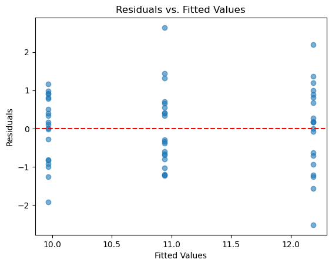

# 등분산성 확인

## 등분산성이 중요한 이유

등분산성(분산의 동질성이라고도 한다) 가정은 잔차의 분산이 모든 집단에서 대략 같아야 한다는 것이다. 분산분석의 틀에서 F-통계량은 집단 내 분산들을 합동하여 공통 분산 $\sigma^2$의 단일 추정값으로 만든다. 참 분산이 집단마다 다르면 이 합동 추정값은 어느 한 집단도 정확히 대표하지 못하는 가중평균이 되고, 그 결과:

- 분산과 표본크기의 불균형 패턴에 따라 F-통계량이 부풀거나 줄어든다.
- p-값이 부정확해지고 제1종 또는 제2종 오류의 위험이 커진다.
- 분산의 불균형이 표본크기의 불균형과 겹치면 왜곡이 특히 심해진다.

## 설정

```python
import numpy as np
import pandas as pd
from statsmodels.formula.api import ols

# 이 페이지의 모든 진단은 아래 모형 하나를 놓고 수행한다.
# 집단마다 표준편차를 1.0, 1.3, 1.6으로 다르게 주어 진단이 무엇을 잡아내는지
# (그리고 무엇을 못 잡아내는지) 볼 수 있게 했다.
rng = np.random.default_rng(42)
n = 20
data = pd.DataFrame({
    "group": np.repeat(["A", "B", "C"], n),
    "response": np.concatenate([
        rng.normal(10.0, 1.0, n),
        rng.normal(10.8, 1.3, n),
        rng.normal(12.0, 1.6, n),
    ]),
})
model = ols("response ~ C(group)", data=data).fit()

print(data.groupby("group").response.agg(["count", "mean", "std"]).round(3))
print(f"\nF = {model.fvalue:.4f}, p = {model.f_pvalue:.4f}")
```

출력:

```
       count    mean    std
group                      
A         20   9.967  0.870
B         20  10.942  1.034
C         20  12.191  1.145

F = 23.7708, p = 0.0000
```

표본표준편차가 0.87, 1.03, 1.15로 나왔다. 참값이 1.0, 1.3, 1.6이었는데도 추정값이 이만큼 눌린 것은 집단당 20개로는 표준편차를 정확히 추정하기 어렵기 때문이다. 이 점이 아래 등분산 검정의 결과를 읽을 때 중요하다.

## 확인 방법

### Levene 검정

Levene 검정은 모분산이 집단 사이에서 같다는 귀무가설을 평가한다. Bartlett 검정보다 정규성 이탈에 로버스트하여 실무에서 선호된다.

집단 중앙값(또는 평균)으로부터의 절대편차를 계산한 뒤 그 편차에 일원배치 분산분석을 수행하는 방식으로 작동한다.

```python
from scipy.stats import levene

group1 = data[data['group'] == 'A']['response']
group2 = data[data['group'] == 'B']['response']
group3 = data[data['group'] == 'C']['response']

# scipy의 기본값은 center='median'(Brown-Forsythe 변형)이다.
# 원래의 Levene(1960)은 평균을 쓰지만 이상점에 약해 기본값이 중앙값으로 바뀌었다.
stat, p_value = levene(group1, group2, group3)
print(f"Levene's Test: F = {stat:.4f}, p-value = {p_value:.4f}")
```

출력:

```
Levene's Test: F = 0.4091, p-value = 0.6662
```

$p = 0.67$로 등분산을 기각하지 못한다. 그런데 이 자료는 표준편차를 1.0, 1.3, 1.6으로 **실제로 다르게** 만든 것이다.

검정이 틀린 것이 아니라 검정력이 부족한 것이다. 집단당 20개로는 1.6배의 표준편차 차이도 잡아내지 못한다. 등분산 검정이 기각하지 않았다는 사실을 "분산이 같다"는 근거로 삼으면 안 되는 이유가 여기 있다.

결과가 유의하면($p < 0.05$) 등분산 가정이 어긋났음을 나타낸다. Levene 검정과 관련된 로버스트 분산 검정의 자세한 내용은 [로버스트 분산 검정](../../ch15/robust_tests/levene.md)을 보라.

### Bartlett 검정

Bartlett 검정은 분산의 동질성에 대한 또 다른 검정이다. 자료가 정말로 정규일 때 균일최강력 검정이지만 정규성 이탈에 매우 민감하여 실제 자료에서는 Levene 검정보다 덜 실용적이다.

```python
from scipy.stats import bartlett

stat, p_value = bartlett(group1, group2, group3)
print(f"Bartlett's Test: chi2 = {stat:.4f}, p-value = {p_value:.4f}")
```

출력:

```
Bartlett's Test: chi2 = 1.3880, p-value = 0.4996
```

Bartlett도 기각하지 못한다. 자료가 정규분포에서 나왔으므로 Bartlett이 Levene보다 유리한 상황인데도 그렇다. 표본크기가 문제다.

Bartlett 검정의 전체 논의는 [Bartlett 검정](../../ch15/bartlett_test/bartlett_test.md)을 보라.

### 두 집단의 등분산 F-검정

정확히 두 집단을 비교할 때 등분산에 대한 F-검정은 표본분산의 비를 쓴다:

$$
F_{d_1,d_2} = \frac{S_1^2}{S_2^2}
$$

여기서 $d_1 = n_1 - 1$, $d_2 = n_2 - 1$이 자유도이다. 귀무가설 $\sigma_1^2 = \sigma_2^2$ 아래에서 이 비는 $F$-분포를 따른다.

이 검정은 카이제곱 분포와 표본분산의 관계에서 유도된다:

$$
\chi^2_{n-1} = \frac{(n-1)S^2}{\sigma^2}
\quad\Rightarrow\quad
\frac{\chi^2_{n-1}}{n-1} = \frac{S^2}{\sigma^2}
$$

$$
F_{d_1,d_2} := \frac{\chi^2_{d_1}/d_1}{\chi^2_{d_2}/d_2} = \frac{S_1^2/\sigma_1^2}{S_2^2/\sigma_2^2} = \frac{S_1^2}{S_2^2} \quad \text{if } \sigma_1 = \sigma_2
$$

!!! warning "정규성에 대한 민감성"
    등분산 F-검정은 비정규성에 극도로 민감하다. 근사적인 정규성만으로는 검정이 타당해지지 않을 수 있다. 그래서 실무에서는 대체로 Levene 검정이나 Brown-Forsythe 검정이 선호된다.

자세한 내용은 [두 분산의 비교를 위한 F-검정](../../ch15/f_test/f_test_two_variances.md)을 보라.

### 잔차 대 적합값 그림

시각적 진단으로 잔차를 적합값(예측된 집단 평균)에 대해 그린다. 등분산성이 성립하면 모든 적합값에서 잔차의 흩어짐이 대체로 일정해야 한다.

```python
import matplotlib.pyplot as plt

# 일원배치 분산분석에서 적합값은 집단평균뿐이므로 세로줄이 집단 수만큼만 생긴다.
# 회귀분석의 잔차 그림처럼 연속적으로 퍼지지 않는다.
plt.scatter(model.fittedvalues, model.resid, alpha=0.6)
plt.axhline(y=0, color='r', linestyle='--')
plt.xlabel("Fitted Values")
plt.ylabel("Residuals")
plt.title("Residuals vs. Fitted Values")
plt.show()
```



세로줄 세 개가 각 집단이다. 오른쪽 줄(집단 C)이 왼쪽 줄(집단 A)보다 위아래로 넓게 퍼져 있다. 형식적 검정이 놓친 분산 차이가 그림에서는 보인다.

이것이 진단 그림을 검정과 함께 보아야 하는 이유다. 검정은 "이 크기의 표본으로 확신할 수 있는가"를 답하지만, 그림은 "실제로 어떤 모양인가"를 보여준다.

살펴볼 것:

- **깔때기 모양:** 넓어지거나 좁아지는 패턴은 이분산을 나타낸다.
- **일정한 띠:** 모든 적합값에서 잔차가 0을 중심으로 고르게 흩어져 있으면 등분산성을 확인해 준다.

## 등분산성이 어긋날 때

- **Welch 분산분석:** 등분산을 가정하지 않고 자유도를 그에 맞게 조정한다. 권장되는 첫 번째 대안이다([Welch 분산분석](../anova_welch/welch_one_way.md) 참조).
- **자료 변환:** 로그, 제곱근, Box-Cox 변환으로 집단 사이의 분산을 안정화할 수 있다.
- **비모수 검정:** Kruskal-Wallis 검정은 등분산을 가정하지 않는다.
- **로버스트 표준오차:** 분산분석의 회귀 표현에서 이분산 일치 표준오차(예: White 추정량)를 쓸 수 있다.

## 연습문제

**연습문제 1.**
분산분석 잔차: A $s^2 \approx 1.37$, B $s^2 \approx 13.46$, C $s^2 \approx 0.10$. (a) 분산이 대략 같은가? (b) Levene 검정의 결과는? (c) 대안 검정은? (d) 분산이 작은 집단의 $n$도 작을 때의 영향은?

??? success "풀이"
    (a) **아니다.** 비가 대략 130:14:1로 크게 다르다.

    (b) Levene 검정은 등분산 $H_0$을 압도적으로 기각할 것이다.

    (c) **Welch 분산분석.** 등분산을 가정하지 않고 집단별로 분산을 따로 추정하며 Welch-Satterthwaite 형태의 식으로 자유도를 조정한다.

    (d) 분산이 작은 집단의 $n$도 작다면, 뒤집어 말해 분산이 큰 집단의 $n$이 크다는 뜻이다. 이때 합동분산이 분산이 큰 집단 쪽으로 끌려가 F-검정이 **보수적**이 된다(제1종 오류가 명목보다 낮아지고 검정력을 잃는다). 반대로 분산이 큰 집단의 $n$이 작으면 F-검정이 **관대**해져 제1종 오류가 부풀려진다. 이쪽이 위험한 경우이다.

    "균형 설계"(모든 $n$이 같음)는 이 편향을 대칭으로 만들어 이분산으로부터 어느 정도 보호해 준다.

---

**연습문제 2.**
**등분산 검정들.** Bartlett, Levene, Brown-Forsythe를 비교하라.

??? success "풀이"
    **Bartlett:** 정규성 아래의 가능도비 검정. 정규 자료에서 검정력이 높지만 비정규성에 매우 민감하다.

    **Levene:** 집단 평균으로부터의 절대편차를 쓴다. 비정규성에 로버스트하다.

    **Brown-Forsythe:** 집단 **중앙값**으로부터의 절대편차를 쓴다. 가장 로버스트하다(두꺼운 꼬리나 치우친 자료에서도 작동한다).

    권고: 자료가 분명히 정규이면 Bartlett, 그렇지 않으면 Brown-Forsythe. Levene은 흔한 중간 지점이다.

---

**연습문제 3.**
**분산 안정화 변환.** 로그와 제곱근 변환을 논하라.

??? success "풀이"
    분산이 평균에 따라 커질 때 쓴다.

    **로그 변환:** $Y = \log X$. 표준편차가 평균에 비례할 때(Poisson 계열이나 로그정규 자료) 분산을 안정화한다.

    **제곱근 변환:** $Y = \sqrt X$. Poisson 도수(분산 = 평균)에서 안정화한다. $\sqrt{\cdot}$ 이후 분산이 대략 $1/4$이 된다.

    **아크사인 변환:** 비율에 대해 $Y = \arcsin(\sqrt p)$. 이항 분산을 안정화한다.

    분산분석 전에 변환을 적용하고 변환된 자료로 분석한다. 계수는 변환된 척도에서 해석한다.

---

**연습문제 4.**
**Welch 분산분석.** 간략히 설명하고 표준 분산분석과 대비하라.

??? success "풀이"
    **표준 분산분석:** 등분산을 가정한다. 모든 집단 내 분산을 합동한다.

    **Welch 분산분석:**

    - 각 집단의 평균에 $w_i = n_i/s_i^2$(분산의 역수에 비례하는 가중치)을 준다.
    - Welch-Satterthwaite 자유도(정수가 아님)를 쓴다.
    - 분산이 다를 때에도 올바른 제1종 오류를 유지한다.

    많은 통계 패키지에서 현대적 기본값이다. 분산이 실제로 같으면 검정력을 약간 잃지만, 다르면 큰 이득을 얻는다.

    Python에서는 `pingouin.welch_anova`로 쓸 수 있다(`scipy.stats.f_oneway`에는 Welch 형태의 옵션이 없다).

---

**연습문제 5.**
등분산성 진단으로서의 **잔차 그림**.

??? success "풀이"
    잔차를 적합값에 대해(회귀에서는 설명변수에 대해) 그린다.

    **등분산:** 잔차가 폭이 일정한 대략 수평인 띠를 이룬다.

    **이분산 패턴:**

    - **깔때기**(넓어짐): 평균과 함께 분산이 커진다(로그나 제곱근 변환이 필요하다).
    - **나비넥타이**: 가운데에서 분산이 가장 크고 양 끝에서 작다.
    - **집단별 흩어짐**: 집단마다 잔차가 다르게 흩어진다.

    시각적 진단은 빠르고 유익하다. 형식적 검정(Levene, 회귀에서는 Breusch-Pagan)이 이를 보완한다.

---

**연습문제 6.**
**표본크기 불균형**과 이분산. 균형 설계가 선호되는 이유는?

??? success "풀이"
    $n_i$가 다르고 $\sigma_i^2$도 다르면 F-통계량의 명목 분포가 틀릴 수 있다:

    - 큰 $n$이 큰 $\sigma$와 짝지어지면 **보수적**(제1종 오류가 명목보다 낮음)이 된다.
    - 작은 $n$이 큰 $\sigma$와 짝지어지면 **관대**(제1종 오류가 명목보다 높음)해진다. 이쪽이 위험한 경우이다.

    균형 설계($n_i$가 모두 같음)에서는 분산이 이질적이어도 검정이 근사적으로 타당하다(Box, 1954).

    **실용적 조언:** 균형 설계가 가능하면 그렇게 하라. 불균형이면서 분산도 다르면 Welch 분산분석을 쓰라.
