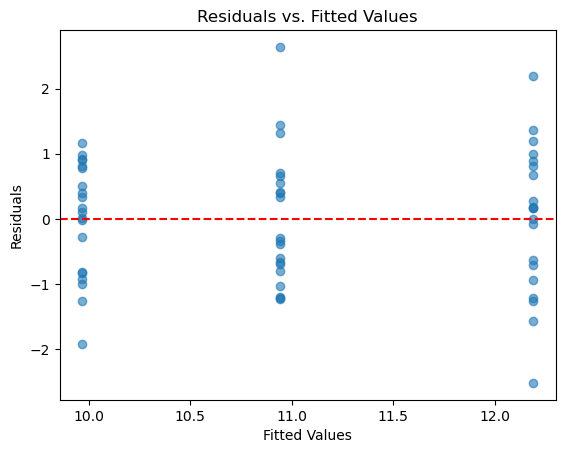

# 등분산성 확인

## 1. 등분산성이 중요한 이유

등분산성(분산의 동질성이라고도 한다) 가정은 잔차의 분산이 모든 집단에서 대략 같아야 한다는 것이다. 분산분석의 틀에서 F-통계량은 집단 내 분산들을 합동하여 공통 분산 $\sigma^2$의 단일 추정값으로 만든다. 참 분산이 집단마다 다르면 이 합동 추정값은 어느 한 집단도 정확히 대표하지 못하는 가중평균이 되고, 그 결과:

- 분산과 표본크기의 불균형 패턴에 따라 F-통계량이 부풀거나 줄어든다.
- p-값이 부정확해지고 제1종 또는 제2종 오류의 위험이 커진다.
- 분산의 불균형이 표본크기의 불균형과 겹치면 왜곡이 특히 심해진다.

---

## 2. 설정

<div class="exbox" markdown>

**보기 1.** <span class="diff easy" title="쉬움"></span> 진단에 쓸 모형 준비. 세 집단 각 $n = 20$에 모표준편차를 $1.0,\ 1.3,\ 1.6$으로 다르게 주고 `response ~ C(group)`을 적합한다.

**(1)** 최소제곱 잔차 $e = y - X\hat\beta$가 설계행렬 $X$의 열과 직교함을 보이고, 거기서 **잔차 전체의 합이 $0$**이며 나아가 **집단마다 잔차의 합이 각각 $0$**임을 끌어내시오. 코드로 재면 정확히 $0$이 나오겠는가.

**(2)** 균형 설계에서 합동분산 $s_p^2$을 집단별 잔차 분산 $s_g^2$으로 쓰고, 그것이 `model.mse_resid`와 같음을 확인하시오. 이 쪽의 등분산 검정은 모두 이 세 수에서 나온다.

</div>

??? success "풀이"

    **(1) 해석적으로.** 최소제곱은 $\lVert y - X\beta\rVert^2$을 최소화하므로 정규방정식 $X^\top X\hat\beta = X^\top y$를 만족한다. 옮겨 쓰면

    $$
    X^\top e = X^\top\bigl(y - X\hat\beta\bigr) = 0
    $$

    이다. **잔차는 설계행렬의 모든 열과 직교한다.** 아래는 전부 이 한 식에서 읽는 것이다.

    `response ~ C(group)`의 설계행렬은 절편 $\mathbf 1$과 더미 $\mathbf 1_B$, $\mathbf 1_C$ 세 열이다. $X^\top e = 0$의 첫 성분이 바로

    $$
    \mathbf 1^\top e = \sum_{i=1}^{N} e_i = 0
    $$

    이고, 둘째와 셋째 성분은 $\sum_{i \in B} e_i = 0$, $\sum_{i \in C} e_i = 0$이다. 그러면 집단 A의 합은 뺄셈으로 나온다.

    $$
    \sum_{i \in A} e_i = \sum_{i=1}^{N} e_i - \sum_{i \in B} e_i - \sum_{i \in C} e_i = 0
    $$

    **집단마다 잔차의 합이 각각 $0$이다.** 세 열이 지시벡터 셋과 같은 공간을 펼치기 때문이며($\mathbf 1 = \mathbf 1_A + \mathbf 1_B + \mathbf 1_C$), 직접 보아도 같다. 적합값이 집단평균 $\bar y_g$이므로 $\sum_{i \in g}(y_i - \bar y_g) = 0$이다.

    **코드로 재면 정확히 $0$이 나오지 않는다.** 위 등식은 실수에서 성립하는 것이고, 컴퓨터는 집단평균을 나눗셈으로 구한 뒤 $20$개를 더한다. 그 과정에서 반올림이 쌓이므로 **기계 정밀도 수준의 찌꺼기**가 남는다. 값의 크기가 $10$ 정도이고 배정밀도의 상대 오차가 $2^{-52} \approx 2.2 \times 10^{-16}$이니 $10^{-15}$에서 $10^{-13}$ 사이의 수를 기대해야 한다. 이것을 미리 적어 두는 것이 이 확인의 요점이다. **$0$이 아니라고 놀라서는 안 되고, $10^{-5}$ 같은 수가 나오면 그때 놀라야 한다.**

    **(2) 해석적으로.** 집단 내 제곱합은 집단별 잔차 분산으로 쓰면 $SSW = \sum_g (n_g - 1)s_g^2$이고 합동분산은 그것을 자유도로 나눈 것이다.

    $$
    s_p^2 = \frac{SSW}{N-k} = \frac{\sum_g (n_g-1)s_g^2}{N-k}
    $$

    균형 설계에서는 $n_g = n$이 모두 같아 가중값이 사라진다.

    $$
    s_p^2 = \frac{(n-1)\sum_g s_g^2}{k(n-1)} = \frac{1}{k}\sum_{g=1}^{k} s_g^2
    $$

    곧 **집단별 분산의 산술평균**이다. $F$-검정의 분모가 이것이고, 아래 Bartlett과 Levene도 이 세 수를 서로 다른 방식으로 비교하는 것이다.

    **수치적으로.**

    ```python
    import numpy as np
    import pandas as pd
    from statsmodels.formula.api import ols

    # 이 페이지의 모든 진단은 아래 모형 하나를 놓고 수행한다.
    # 집단마다 표준편차를 1.0, 1.3, 1.6으로 다르게 주어 진단이 무엇을 잡아내는지
    # (그리고 무엇을 못 잡아내는지) 볼 수 있게 했다.
    rng = np.random.default_rng(42)
    n = 20
    data = pd.DataFrame({
        "group": np.repeat(["A", "B", "C"], n),
        "response": np.concatenate([
            rng.normal(10.0, 1.0, n),
            rng.normal(10.8, 1.3, n),
            rng.normal(12.0, 1.6, n),
        ]),
    })
    model = ols("response ~ C(group)", data=data).fit()

    print(data.groupby("group").response.agg(["count", "mean", "std"]).round(3))
    print(f"\nF = {model.fvalue:.4f}, p = {model.f_pvalue:.4f}")

    e = model.resid
    print(f"\n잔차 전체의 합 = {e.sum():+.3e}")
    print("집단별 잔차 합")
    for g, v in e.groupby(data["group"]):
        print(f"  {g}: {v.sum():+.3e}")

    # 설계행렬의 세 열(절편, B 더미, C 더미)에 잔차를 직접 내적해 본다.
    X = model.model.exog
    print("\n설계행렬 열이름:", model.model.exog_names)
    print("X^T e        =", np.array2string(X.T @ e.values, precision=3))

    # 이 쪽에서 쓸 양: 집단별 잔차 분산과 그 합동값
    s2 = e.groupby(data["group"]).var(ddof=1)
    print("\n집단별 잔차 분산 s_g^2")
    print(s2.round(6).to_string())
    print(f"\n합동분산 (s_A^2+s_B^2+s_C^2)/3 = {s2.mean():.10f}")
    print(f"model.mse_resid               = {model.mse_resid:.10f}")
    print(f"분산의 최대/최소 = {s2.max() / s2.min():.4f},  "
          f"표준편차의 최대/최소 = {np.sqrt(s2.max() / s2.min()):.4f}")
    ```

    출력:

    ```
           count    mean    std
    group                      
    A         20   9.967  0.870
    B         20  10.942  1.034
    C         20  12.191  1.145

    F = 23.7708, p = 0.0000

    잔차 전체의 합 = -2.469e-13
    집단별 잔차 합
      A: -7.105e-14
      B: -5.329e-15
      C: -1.705e-13

    설계행렬 열이름: ['Intercept', 'C(group)[T.B]', 'C(group)[T.C]']
    X^T e        = [-2.469e-13 -5.329e-15 -1.705e-13]

    집단별 잔차 분산 s_g^2
    group
    A    0.757209
    B    1.068200
    C    1.311068

    합동분산 (s_A^2+s_B^2+s_C^2)/3 = 1.0454926260
    model.mse_resid               = 1.0454926260
    분산의 최대/최소 = 1.7314,  표준편차의 최대/최소 = 1.3158
    ```

    **(1)이 예측한 대로다.** 잔차 전체의 합이 $-2.469 \times 10^{-13}$, 집단별 합이 $-7.1\times 10^{-14}$, $-5.3\times 10^{-15}$, $-1.7\times 10^{-13}$이다. 모두 **기계 정밀도의 찌꺼기**이고 수학적으로는 $0$이다. $X^\top e$의 세 성분이 전체 합, B의 합, C의 합과 글자 그대로 같은 수인 것도 확인된다. 절편 열이 전체 합을, 더미 두 열이 각 집단의 합을 재고 있다는 유도가 그대로 보인다.

    **(2)도 맞는다.** 세 분산의 평균이 $1.0454926260$이고 `model.mse_resid`가 같은 수다. 균형 설계에서 합동분산이 단순평균이라는 유도가 소수 열째 자리까지 확인된다.

    남은 것은 이 세 수를 읽는 일이다. 표본표준편차가 $0.870,\ 1.034,\ 1.145$로 나왔다. 참값이 $1.0,\ 1.3,\ 1.6$이었으니 **참 비는 $1.6$인데 관측된 비는 $1.3158$로 눌렸다.** 집단당 $20$개로는 표준편차를 정확히 추정할 수 없기 때문이며(정규성 쪽 보기 1에서 $\operatorname{SD}(S)/\sigma = 16.1\%$로 재어 두었다), 아래의 Levene과 Bartlett이 이 자료의 분산 차이를 잡아내지 못하는 까닭이 바로 이 눌림이다. **검정 결과를 읽기 전에 세 수가 얼마나 흔들리는지를 먼저 알아야 한다.**

---

## 3. 확인 방법

### Levene 검정

Levene 검정은 모분산이 집단 사이에서 같다는 귀무가설을 평가한다. Bartlett 검정보다 정규성 이탈에 로버스트하여 실무에서 선호된다.

집단 중앙값(또는 평균)으로부터의 절대편차를 계산한 뒤 그 편차에 일원배치 분산분석을 수행하는 방식으로 작동한다.

<div class="exbox" markdown>

**보기 2.** <span class="diff easy" title="쉬움"></span> Levene 검정. 보기 1의 모형에 `scipy.stats.levene`을 돌린다.

**(1)** `levene`이 실제로 하는 계산은 무엇인가. 집단 중위수 $\tilde y_g$에 대한 절대편차 $z_{gi} = \lvert y_{gi} - \tilde y_g \rvert$에 **일원배치 $F$-검정을 돌리는 것**임을 `scipy.stats.f_oneway`로 확인하시오. 아울러 정규모형에서 $E\lvert Y - \mu\rvert$를 $\sigma$로 쓰고, 그래서 분산 비교가 평균 비교로 바뀌는 까닭을 밝히시오.

**(2)** 중심을 중위수로 잡는 것이 왜 중요한가. 등분산이 **참**인 자료를 대칭·치우침·심한 치우침 세 분포에서 만들어 `center='median'`과 `center='mean'`의 기각률을 재고 명목수준 $0.05$와 비교하시오.

</div>

??? success "풀이"

    **(1) 해석적으로.** Levene 검정은 새로운 분포를 쓰는 검정이 아니다. 자료를 한 번 바꾸고 **그 바뀐 자료에 보통의 분산분석을 돌리는 것**이 전부다. 집단 $g$의 중위수를 $\tilde y_g$라 하고

    $$
    z_{gi} = \lvert y_{gi} - \tilde y_g \rvert
    $$

    로 두면, Levene 통계량은 $z$ 를 자료로 한 일원배치 $F = MSB_z/MSW_z$와 **같은 수**다. 그러므로 자유도도 $(k-1,\ N-k)$로 그대로다.

    왜 이것이 분산 검정이 되는가. $Y \sim N(\mu, \sigma^2)$이면 반절정규분포의 평균으로

    $$
    E\lvert Y - \mu \rvert = \sigma\sqrt{\frac{2}{\pi}} \approx 0.7979\,\sigma
    $$

    이다. **절대편차의 기댓값이 $\sigma$에 정비례한다.** 따라서 "$\sigma_g$가 집단마다 같은가"라는 물음이 "$z$의 평균이 집단마다 같은가"로 바뀌고, 뒤쪽은 분산분석이 이미 답할 수 있는 물음이다. 중심을 중위수로 바꾸면 비례상수가 분포에 따라 조금 달라지지만, **같은 분포 모양에서는 세 집단에 같은 상수가 걸리므로** 귀무가설이 보존된다.

    **(2) 이론이 예측하는 값.** 등분산이 참인 자료에서 명목수준 $0.05$ 검정의 기각률은 $0.05$여야 한다. 그것뿐이다. $0.05$에서 얼마나 멀어지는지가 그 검정이 그 자료에서 쓸 만한지를 말해 준다.

    **수치적으로.** 먼저 (1)의 항등식을 확인한다.

    ```python
    import numpy as np
    from scipy.stats import f_oneway, levene

    group1 = data[data['group'] == 'A']['response']
    group2 = data[data['group'] == 'B']['response']
    group3 = data[data['group'] == 'C']['response']

    # scipy의 기본값은 center='median'(Brown-Forsythe 변형)이다.
    # 원래의 Levene(1960)은 평균을 쓰지만 이상점에 약해 기본값이 중앙값으로 바뀌었다.
    stat, p_value = levene(group1, group2, group3)
    print(f"Levene's Test: F = {stat:.4f}, p-value = {p_value:.4f}")

    # Levene 검정은 z = |y - 집단중위수| 에 돌린 일원배치 F-검정과 같은 것이다.
    zs = [np.abs(g - np.median(g)) for g in (group1, group2, group3)]
    F_hand, p_hand = f_oneway(*zs)
    print(f"|y - 중위수| 의 F-검정: F = {F_hand:.4f}, p-value = {p_hand:.4f}")
    print(f"두 F 의 차이: {abs(F_hand - stat):.3e}")

    print(f"\n{'z 평균':>8s} {'0.7979 s':>9s} {'s':>8s}  집단")
    for name, g, z in zip("ABC", (group1, group2, group3), zs):
        s = g.std(ddof=1)
        print(f"{z.mean():8.4f} {np.sqrt(2 / np.pi) * s:9.4f} {s:8.4f}  {name}")
    ```

    출력:

    ```
    Levene's Test: F = 0.4091, p-value = 0.6662
    |y - 중위수| 의 F-검정: F = 0.4091, p-value = 0.6662
    두 F 의 차이: 5.551e-17

        z 평균  0.7979 s        s  집단
      0.6952    0.6943   0.8702  A
      0.8180    0.8246   1.0335  B
      0.8773    0.9136   1.1450  C
    ```

    **항등식이 맞는다.** 두 $F$ 의 차이가 $5.55 \times 10^{-17}$, 곧 배정밀도의 마지막 비트다. `levene`은 `f_oneway`를 감싼 것이고 숨은 계산이 따로 없다.

    $E\lvert Y-\mu\rvert = 0.7979\sigma$도 확인된다. 집단 A에서 $z$의 평균이 $0.6952$인데 $0.7979 \times 0.8702 = 0.6943$이다. B는 $0.8180$ 대 $0.8246$, C는 $0.8773$ 대 $0.9136$으로 조금 벌어지는데, 식은 **평균**으로부터의 편차를 말하는데 코드는 **중위수**로부터 재기 때문이고 $n = 20$의 표집 변동도 섞여 있다. 비례 관계 자체는 그대로 보인다.

    이 자료에서는 $p = 0.6662$로 등분산을 기각하지 못한다. **그런데 이 자료는 표준편차를 $1.0,\ 1.3,\ 1.6$으로 실제로 다르게 만든 것이다.** 검정이 틀린 것이 아니라 검정력이 부족하다. 위 표의 $z$ 평균이 $0.6952,\ 0.8180,\ 0.8773$인데 $z$ 안의 흩어짐이 그만큼 크므로 $F = 0.41$밖에 되지 않는다. 보기 1에서 본 대로 $s$ 자체가 $\pm 16\%$로 흔들리니 당연한 결과다. **등분산 검정이 기각하지 않았다는 사실을 "분산이 같다"의 근거로 삼으면 안 되는 이유가 여기 있다.**

    이제 (2)의 모의실험이다.

    ```python
    import numpy as np
    from scipy import stats

    # 등분산이 **참**인 자료를 만들어 기각률을 잰다. 이론값은 명목수준 0.05 다.
    rng = np.random.default_rng(2026)
    k, n, B = 3, 30, 2000
    mc = np.sqrt(0.05 * 0.95 / B)      # 몬테카를로 오차

    cases = [
        ("정규 (대칭)", lambda: rng.normal(0, 1, n)),
        ("지수 (치우침)", lambda: rng.exponential(1.0, n)),
        ("로그정규 (심한 치우침)", lambda: rng.lognormal(0, 1, n)),
    ]

    print(f"집단 {k}개, 각 n = {n}, 반복 {B}회, 명목수준 0.05, "
          f"몬테카를로 오차 {mc:.4f}")
    print(f"\n{'median':>8s} {'mean':>8s} {'왜도':>6s}  자료 분포")
    for name, draw in cases:
        cm = ca = 0
        skew = []
        for _ in range(B):
            gs = [draw() for _ in range(k)]
            cm += stats.levene(*gs, center="median").pvalue < 0.05
            ca += stats.levene(*gs, center="mean").pvalue < 0.05
            skew.append(stats.skew(gs[0]))
        print(f"{cm / B:8.4f} {ca / B:8.4f} {np.mean(skew):6.2f}  {name}")
    ```

    출력:

    ```
    집단 3개, 각 n = 30, 반복 2000회, 명목수준 0.05, 몬테카를로 오차 0.0049

      median     mean     왜도  자료 분포
      0.0370   0.0460  -0.01  정규 (대칭)
      0.0465   0.1765   1.47  지수 (치우침)
      0.0340   0.2505   2.19  로그정규 (심한 치우침)
    ```

    **중위수 중심은 세 분포 모두에서 버틴다.** $0.0370$, $0.0465$, $0.0340$으로 명목 $0.05$ 둘레에 머물고, 약간 보수적인 쪽으로 기운다. 몬테카를로 오차가 $0.0049$이니 세 수 모두 $0.05$에서 두세 오차 안쪽이며, 어긋나는 방향이 **덜 기각하는 쪽**이다. 제1종 오류 쪽으로는 안전하다.

    **평균 중심은 치우침에서 무너진다.** 지수분포에서 $0.1765$, 로그정규에서 $0.2505$다. 분산이 모두 같은 자료인데 **네 번에 한 번 "분산이 다르다"고 선언한다.** 명목의 다섯 배이고 몬테카를로 오차의 사십 배가 넘는 어긋남이다.

    까닭은 간단하다. 치우친 분포에서 표본평균은 긴 꼬리 쪽으로 끌려가고, 그 끌림의 크기가 표본마다 다르다. $\lvert y_{gi} - \bar y_g\rvert$는 그 끌림까지 함께 재므로 **꼬리의 모양을 분산 차이로 오해한다.** 중위수는 꼬리에 끌려가지 않으므로 이 오해가 생기지 않는다.

    **대칭 분포에서는 두 중심이 거의 같다.** 정규에서 $0.0370$ 대 $0.0460$으로 둘 다 $0.05$ 근처다. 그러므로 **"중위수 중심이 언제나 평균 중심보다 견딘다"고 말하면 과장이다.** 중위수가 버는 것은 **치우침에 대한 견딤성**이고, 대칭 분포에서는 평균 중심도 쓸 수 있다. 다만 실제 자료가 대칭인지 미리 알 수 없으므로 기본값을 중위수로 두는 것이 옳다.

    결과가 유의하면($p < 0.05$) 등분산 가정이 어긋났음을 나타낸다. Levene 검정과 관련된 로버스트 분산 검정의 자세한 내용은 [로버스트 분산 검정](../../ch15/robust_tests/levene.md)을 보라.

### Bartlett 검정

Bartlett 검정은 분산의 동질성에 대한 또 다른 검정이다. 자료가 정말로 정규일 때 균일최강력 검정이지만 정규성 이탈에 매우 민감하여 실제 자료에서는 Levene 검정보다 덜 실용적이다.

<div class="exbox" markdown>

**보기 3.** <span class="diff easy" title="쉬움"></span> Bartlett 검정. Levene과 달리 이 검정은 **닫힌 꼴**이 있다.

**(1)** Bartlett 통계량은 합동분산 $s_p^2$과 보정계수 $C$로

$$
T = \frac{1}{C}\left[(N-k)\ln s_p^2 - \sum_{g=1}^{k}(n_g-1)\ln s_g^2\right],
\qquad
C = 1 + \frac{1}{3(k-1)}\left[\sum_{g=1}^{k}\frac{1}{n_g-1} - \frac{1}{N-k}\right]
$$

이고 $H_0$ 아래에서 근사적으로 $\chi^2_{k-1}$을 따른다. 이 식을 손으로 계산해 `scipy.stats.bartlett`이 주는 값과 맞추시오. 또 $T \ge 0$이고 $T = 0$이 되는 때가 언제인지 말하시오.

**(2)** Bartlett은 정규성을 깔고 있다. 분산이 **모두 같은** 자료를 정규분포와 $t_3$에서 각각 만들어 Bartlett과 Levene의 기각률을 재고, 명목수준 $0.05$와 비교하시오.

</div>

??? success "풀이"

    **(1) 해석적으로.** 식의 뼈대는 산술평균과 기하평균의 비교다. 균형 설계($n_g = n$)에서 $N - k = k(n-1)$이므로 괄호 안은

    $$
    (n-1)\left[k\ln s_p^2 - \sum_g \ln s_g^2\right]
    = k(n-1)\ln\frac{s_p^2}{\bigl(\prod_g s_g^2\bigr)^{1/k}}
    $$

    이 된다. 분자는 **집단분산의 산술평균**(보기 1에서 본 $s_p^2$)이고 분모는 **기하평균**이다. 산술평균-기하평균 부등식이 $s_p^2 \ge (\prod s_g^2)^{1/k}$를 보장하므로 로그가 $0$ 이상이고, 따라서 $T \ge 0$이다. 등호는 **$s_1^2 = \cdots = s_k^2$일 때에만** 성립한다. 곧 $T = 0$은 표본분산이 전부 똑같다는 뜻이고, 그 외에는 어느 방향으로 흩어지든 $T$가 커진다. **분산의 불일치를 산술평균과 기하평균의 간격으로 재는 것**이 Bartlett 통계량이다.

    보정계수 $C > 1$은 $T$의 분포를 $\chi^2_{k-1}$에 더 가깝게 맞추는 Bartlett 자신의 보정이다. $n_g$가 커지면 $C \to 1$이다.

    **(2) 이론이 예측하는 값.** 분산이 모두 같은 자료에서 명목 $0.05$ 검정의 기각률은 $0.05$다. $t_3$은 자유도 $3$이라 분산이 $3/(3-2) = 3$으로 유한하고 **대칭**이다. 세 집단에 같은 분포를 주었으니 등분산 귀무가설은 참이며, 정규와 다른 것은 **꼬리 두께뿐**이다.

    **수치적으로.** 먼저 닫힌 꼴을 맞춘다.

    ```python
    import numpy as np
    from scipy.stats import bartlett, chi2

    # Bartlett 검정은 Levene 보다 검정력이 높지만 정규성을 전제한다.
    # 자료가 정규에서 조금만 벗어나도 등분산을 지나치게 자주 기각한다.
    stat, p_value = bartlett(group1, group2, group3)
    print(f"Bartlett's Test: chi2 = {stat:.4f}, p-value = {p_value:.4f}")

    # 닫힌 꼴을 손으로 계산해 맞춰 본다.
    gs = [group1.values, group2.values, group3.values]
    ns = np.array([len(g) for g in gs])
    s2 = np.array([g.var(ddof=1) for g in gs])
    k, N = len(gs), ns.sum()
    sp2 = ((ns - 1) * s2).sum() / (N - k)
    num = (N - k) * np.log(sp2) - ((ns - 1) * np.log(s2)).sum()
    corr = 1 + (1 / (3 * (k - 1))) * ((1 / (ns - 1)).sum() - 1 / (N - k))
    T = num / corr
    print(f"\ns_g^2        = {np.array2string(s2, precision=6)}")
    print(f"s_p^2        = {sp2:.10f}   (model.mse_resid = {model.mse_resid:.10f})")
    print(f"분자 M       = {num:.10f}")
    print(f"보정계수 C   = {corr:.10f}")
    print(f"T = M / C    = {T:.10f}")
    print(f"p = P(chi2_2 > T) = {chi2.sf(T, k - 1):.10f}")
    print(f"scipy 와의 차이: {abs(T - stat):.3e}")
    ```

    출력:

    ```
    Bartlett's Test: chi2 = 1.3880, p-value = 0.4996

    s_g^2        = [0.757209 1.0682   1.311068]
    s_p^2        = 1.0454926260   (model.mse_resid = 1.0454926260)
    분자 M       = 1.4204884460
    보정계수 C   = 1.0233918129
    T = M / C    = 1.3880201386
    p = P(chi2_2 > T) = 0.4995687417
    scipy 와의 차이: 0.000e+00
    ```

    **손계산이 `scipy.stats.bartlett`와 한 비트까지 같다.** 차이가 $0$이다. 보정계수가 $C = 1.0234$로 $1$에 가까운 것은 $n_g - 1 = 19$가 충분히 크기 때문이고, 보정 전 $M = 1.4205$가 보정 후 $T = 1.3880$으로 $2.3\%$ 줄었다.

    $s_p^2 = 1.0454926260$이 보기 1의 `model.mse_resid`와 같은 수인 것도 확인된다. **Bartlett이 쓰는 재료는 보기 1에서 꺼내 둔 세 분산 하나뿐**이다.

    $p = 0.4996$으로 Bartlett도 기각하지 못한다. 자료가 정규분포에서 나왔으니 Bartlett이 Levene보다 유리한 상황인데도 그렇다. 표본크기가 문제다.

    이제 (2)의 모의실험이다.

    ```python
    import numpy as np
    from scipy import stats

    # 분산이 **모두 같은** 자료를 만들어 기각률을 잰다. 이론값은 0.05 다.
    rng = np.random.default_rng(2026)
    k, n, B = 3, 30, 2000
    mc = np.sqrt(0.05 * 0.95 / B)

    # t_3 는 분산이 3/(3-2) = 3 이다. 세 집단에 같은 분포를 주었으니
    # 등분산 귀무가설은 참이다. 다른 것은 꼬리 두께뿐이다.
    cases = [
        ("정규 — Bartlett 의 가정이 성립", lambda: rng.normal(0, 1, n)),
        ("t_3 — 대칭이지만 꼬리가 두껍다", lambda: rng.standard_t(3, n)),
    ]

    print(f"집단 {k}개, 각 n = {n}, 반복 {B}회, 명목수준 0.05, "
          f"몬테카를로 오차 {mc:.4f}")
    print(f"\n{'Bartlett':>9s} {'Levene':>8s} {'초과첨도':>8s}  자료 분포")
    for name, draw in cases:
        cb = cl = 0
        kurt = []
        for _ in range(B):
            gs = [draw() for _ in range(k)]
            cb += stats.bartlett(*gs).pvalue < 0.05
            cl += stats.levene(*gs).pvalue < 0.05
            kurt.append(stats.kurtosis(gs[0]))
        print(f"{cb / B:9.4f} {cl / B:8.4f} {np.mean(kurt):8.2f}  {name}")
    ```

    출력:

    ```
    집단 3개, 각 n = 30, 반복 2000회, 명목수준 0.05, 몬테카를로 오차 0.0049

     Bartlett   Levene     초과첨도  자료 분포
       0.0435   0.0370    -0.22  정규 — Bartlett 의 가정이 성립
       0.4720   0.0440     2.60  t_3 — 대칭이지만 꼬리가 두껍다
    ```

    **정규에서는 Bartlett이 제자리에 있다.** 기각률 $0.0435$로 명목 $0.05$와 몬테카를로 오차 $0.0049$ 안에서 맞는다. 유도한 $\chi^2_{k-1}$ 근사가 $n = 30$에서 이미 정확하다는 뜻이다.

    **$t_3$에서는 $0.4720$으로 간다.** 분산이 모두 같은 자료인데 **명목 $5\%$ 검정이 열 번에 네 번 넘게 기각한다.** 명목의 아홉 배다. 꼬리가 두꺼울 뿐 치우치지도 않았는데 이렇게 된다.

    까닭은 $T$의 유도가 $s_g^2$의 분포를 정규성에서 나온 $\chi^2$로 놓았다는 데 있다. 꼬리가 두꺼우면 $s_g^2$의 분산이 $\chi^2$ 근사보다 훨씬 커서(초과첨도 $2.60$이 바로 그 크기다) 세 분산이 실제보다 많이 흩어지고, 산술평균과 기하평균의 간격이 그만큼 벌어진다. **$T$는 그 벌어짐을 전부 "분산이 다르다"로 읽는다.**

    **Levene은 같은 자료에서 $0.0370$과 $0.0440$으로 버틴다.** 정규든 $t_3$든 거의 움직이지 않는다. 이것이 실무에서 Levene을 먼저 쓰는 이유다.

    정리하면 **Bartlett은 정규성이 확실할 때에만 쓰는 검정**이다. 그런데 정규성이 확실한지를 알려면 정규성 검정을 통과해야 하고, 그 검정도 $n$이 작으면 어지간한 벗어남을 못 잡는다(정규성 쪽 보기 3). **정규성을 확인한 뒤 Bartlett을 쓴다는 2단계 절차가 실제로는 믿을 만하지 않다**는 것이 이 표의 실용적 함의다.

    Bartlett 검정의 전체 논의는 [Bartlett 검정](../../ch15/bartlett_test/bartlett_test.md)을 보라.

### 두 집단의 등분산 F-검정

정확히 두 집단을 비교할 때 등분산에 대한 F-검정은 표본분산의 비를 쓴다:

$$
F_{d_1,d_2} = \frac{S_1^2}{S_2^2}
$$

여기서 $d_1 = n_1 - 1$, $d_2 = n_2 - 1$이 자유도이다. 귀무가설 $\sigma_1^2 = \sigma_2^2$ 아래에서 이 비는 $F$-분포를 따른다.

이 검정은 카이제곱 분포와 표본분산의 관계에서 유도된다:

$$
\chi^2_{n-1} = \frac{(n-1)S^2}{\sigma^2}
\quad\Rightarrow\quad
\frac{\chi^2_{n-1}}{n-1} = \frac{S^2}{\sigma^2}
$$

$$
F_{d_1,d_2} := \frac{\chi^2_{d_1}/d_1}{\chi^2_{d_2}/d_2} = \frac{S_1^2/\sigma_1^2}{S_2^2/\sigma_2^2} = \frac{S_1^2}{S_2^2} \quad \text{if } \sigma_1 = \sigma_2
$$

!!! warning "정규성에 대한 민감성"
    등분산 F-검정은 비정규성에 극도로 민감하다. 근사적인 정규성만으로는 검정이 타당해지지 않을 수 있다. 그래서 실무에서는 대체로 Levene 검정이나 Brown-Forsythe 검정이 선호된다.

자세한 내용은 [두 분산의 비교를 위한 F-검정](../../ch15/f_test/f_test_two_variances.md)을 보라.

### 잔차 대 적합값 그림

시각적 진단으로 잔차를 적합값(예측된 집단 평균)에 대해 그린다. 등분산성이 성립하면 모든 적합값에서 잔차의 흩어짐이 대체로 일정해야 한다.

<div class="exbox" markdown>

**보기 4.** <span class="diff easy" title="쉬움"></span> 잔차 대 적합값 그림. 보기 1의 모형으로 그린다.

**(1)** 그림을 그리고 무엇을 읽을 수 있는지 말하시오. "오른쪽이 더 넓게 퍼졌다"는 판단을 **수치로** 뒷받침하시오.

**(2)** 이 그림이 **가리는 것**은 무엇인가. 일원배치에서 이 그림으로 판정할 수 없는 것을 적으시오.

</div>

??? success "풀이"

    이 보기에는 유도할 식이 없다. 그림에서 무엇을 읽어야 하는지가 전부다. 그러므로 읽히는 것을 수로 적는 일에 집중한다.

    **(1) 그림이 말하는 것.**

    ```python
    import matplotlib.pyplot as plt
    import pandas as pd

    plt.rcParams["font.sans-serif"] = ["NanumGothic", "Apple SD Gothic Neo", "Malgun Gothic"]
    plt.rcParams["font.family"] = "sans-serif"
    plt.rcParams["axes.unicode_minus"] = False

    # 그림에서 읽으려는 것을 먼저 수로 적어 둔다.
    e, g = model.resid, data["group"]
    tab = pd.DataFrame({
        "적합값": model.fittedvalues.groupby(g).first().round(4),
        "잔차 s": e.groupby(g).std(ddof=1).round(4),
        "최소": e.groupby(g).min().round(4),
        "최대": e.groupby(g).max().round(4),
    })
    tab["범위"] = (tab["최대"] - tab["최소"]).round(4)
    print(tab.to_string())

    sd = e.groupby(g).std(ddof=1)
    print(f"\n서로 다른 적합값이 {model.fittedvalues.nunique()}개뿐이다 (세로 띠 세 줄)")
    print(f"잔차 s 의 최대/최소 = {sd.max() / sd.min():.4f}   (모표준편차의 참 비는 1.6)")
    print(f"범위의 최대/최소    = {tab['범위'].max() / tab['범위'].min():.4f}")

    # 일원배치 분산분석에서 적합값은 집단평균뿐이므로 세로줄이 집단 수만큼만 생긴다.
    # 회귀분석의 잔차 그림처럼 연속적으로 퍼지지 않는다.
    plt.scatter(model.fittedvalues, model.resid, alpha=0.6)
    plt.axhline(y=0, color='r', linestyle='--')
    plt.xlabel("Fitted Values")
    plt.ylabel("Residuals")
    plt.title("Residuals vs. Fitted Values")
    plt.show()
    ```

    출력:

    ```
               적합값    잔차 s      최소      최대      범위
    group                                         
    A       9.9671  0.8702 -1.9181  1.1602  3.0783
    B      10.9423  1.0335 -1.2345  2.6418  3.8763
    C      12.1909  1.1450 -2.5224  2.2010  4.7234

    서로 다른 적합값이 3개뿐이다 (세로 띠 세 줄)
    잔차 s 의 최대/최소 = 1.3158   (모표준편차의 참 비는 1.6)
    범위의 최대/최소    = 1.5344
    ```

    

    **세로줄 세 개가 각 집단이고, 가로 위치는 집단평균 $9.9671$, $10.9423$, $12.1909$다.** 적합값이 세 값뿐이므로 점들이 세 줄에 몰린다. 일원배치에서는 늘 이렇게 되고, 회귀의 잔차 그림처럼 가로로 퍼지지 않는다.

    **"오른쪽이 넓다"의 정량적 내용은 두 수다.** 잔차 표준편차가 $0.8702 \to 1.0335 \to 1.1450$으로 단조증가하며 **최대/최소 $= 1.3158$**이고, 눈에 더 직접 보이는 세로 길이, 곧 잔차의 범위는 $3.0783 \to 3.8763 \to 4.7234$로 **최대/최소 $= 1.5344$**다. 보기 2와 보기 3의 검정이 놓친 분산 차이가 그림에서는 보인다. 다만 보이는 비가 참 비 $1.6$보다 작다는 것도 함께 적어 두어야 한다.

    범위의 비가 표준편차의 비보다 큰 것은 **범위가 최댓값에 끌려가는 통계량**이기 때문이다. 집단 C의 최소 잔차 $-2.5224$ 하나가 범위를 끌어올렸다. 그림에서 세로 길이로 흩어짐을 비교하면 이렇게 과장된다.

    이것이 진단 그림을 검정과 함께 보아야 하는 이유다. 검정은 "이 크기의 표본으로 확신할 수 있는가"를 답하지만, 그림은 "실제로 어떤 모양인가"를 보여준다.

    살펴볼 것:

    - **깔때기 모양:** 넓어지거나 좁아지는 패턴은 이분산을 나타낸다.
    - **일정한 띠:** 모든 적합값에서 잔차가 0을 중심으로 고르게 흩어져 있으면 등분산성을 확인해 준다.

    **(2) 그림이 가리는 것.** 셋이다.

    **첫째, 집단이 적으면 깔때기를 판정할 수 없다.** 깔때기 모양은 "적합값이 커질수록 흩어짐이 커진다"는 **추세**인데, 이 그림에는 점이 세 줄뿐이므로 추세를 재려면 점 세 개에 직선을 맞추는 셈이다. 게다가 가로축의 순서는 **집단평균의 순서**이고 그것은 분산과 아무 관계가 없다. 이 자료에서 하필 평균과 표준편차가 같은 방향으로 커졌기 때문에 깔때기처럼 보이는 것이다. 집단 C의 평균을 $12.0$ 대신 $9.0$으로 주었다면 **잔차는 하나도 바뀌지 않는데 그림은 오른쪽이 좁아지는 모양**이 된다. 세 줄짜리 그림에서 읽은 "깔때기"는 그만큼 믿을 것이 아니고, 보기 1의 표에 적은 $s_g$ 세 수를 보는 것이 낫다.

    **둘째, 순서를 지운다.** 가로축이 적합값이므로 같은 집단의 $20$개는 한 줄에 겹쳐 쌓인다. 잔차가 수집 순서로 상관되어 있어도(독립성 위반) 이 그림에는 전혀 나타나지 않는다. 독립성 쪽의 순서 대 잔차 그림이 따로 필요한 까닭이다.

    **셋째, 분포 모양을 지운다.** 한 줄 안의 $20$개가 정규인지 두꺼운 꼬리인지, 이봉인지는 수직으로 겹친 점들에서 읽히지 않는다. 정규성 쪽의 Q-Q 그림이 따로 필요한 까닭이다.

    **세 그림은 같은 잔차를 보지만 각각 다른 축을 버린다.** 하나로 셋을 대신할 수 없다.

---

## 4. 등분산성이 어긋날 때

- **Welch 분산분석:** 등분산을 가정하지 않고 자유도를 그에 맞게 조정한다. 권장되는 첫 번째 대안이다([Welch 분산분석](../anova_welch/welch_one_way.md) 참조).
- **자료 변환:** 로그, 제곱근, Box-Cox 변환으로 집단 사이의 분산을 안정화할 수 있다.
- **비모수 검정:** Kruskal-Wallis 검정은 등분산을 가정하지 않는다.
- **로버스트 표준오차:** 분산분석의 회귀 표현에서 이분산 일치 표준오차(예: White 추정량)를 쓸 수 있다.

---

## 연습문제

<div class="drillbox" markdown>

**연습문제 1.** <span class="diff easy" title="쉬움"></span>
분산분석 잔차: A $s^2 \approx 1.37$, B $s^2 \approx 13.46$, C $s^2 \approx 0.10$. (a) 분산이 대략 같은가? (b) Levene 검정의 결과는? (c) 대안 검정은? (d) 분산이 작은 집단의 $n$도 작을 때의 영향은?

</div>

??? success "풀이"
    (a) **아니다.** 비가 대략 130:14:1로 크게 다르다.

    (b) Levene 검정은 등분산 $H_0$을 압도적으로 기각할 것이다.

    (c) **Welch 분산분석.** 등분산을 가정하지 않고 집단별로 분산을 따로 추정하며 Welch-Satterthwaite 형태의 식으로 자유도를 조정한다.

    (d) 분산이 작은 집단의 $n$도 작다면, 뒤집어 말해 분산이 큰 집단의 $n$이 크다는 뜻이다. 이때 합동분산이 분산이 큰 집단 쪽으로 끌려가 F-검정이 **보수적**이 된다(제1종 오류가 명목보다 낮아지고 검정력을 잃는다). 반대로 분산이 큰 집단의 $n$이 작으면 F-검정이 **관대**해져 제1종 오류가 부풀려진다. 이쪽이 위험한 경우이다.

    "균형 설계"(모든 $n$이 같음)는 이 편향을 대칭으로 만들어 이분산으로부터 어느 정도 보호해 준다.

---

<div class="drillbox" markdown>

**연습문제 2.** <span class="diff easy" title="쉬움"></span>
등분산성 진단과 처방의 **전체 절차**를 정리하라.

</div>

??? success "풀이"
    **진단 순서.**

    | 순서 | 도구 | 보는 것 |
    |---|---|---|
    | 1 | **집단별 $s_i$ 표** | 최대/최소 비 |
    | 2 | **잔차 대 적합값 그림** | 깔때기 모양 |
    | 3 | **스프레드-레벨 그림** | 기울기 $b$(연습문제 9) |
    | 4 | 브라운-포사이드 검정 | 참고용 $p$ |

    **1번이 먼저다.** $s_{\max}/s_{\min}$이 2 이하면 균형 설계에서는 대체로 문제가 없다. 4배를 넘으면 반드시 대응한다.

    **처방 선택.**

    ```text
    이분산이 확인되었다
        │
        ├─ 산포가 평균과 함께 커지는가? (스프레드-레벨 기울기 b)
        │     │
        │     ├─ 예, b ≈ 1  ──→ 로그 변환 (해석도 개선될 수 있음)
        │     ├─ 예, b ≈ 0.5 ──→ 제곱근 변환 (계수 자료)
        │     └─ 예, 그 외   ──→ x^(1-b) 또는 박스-콕스
        │
        └─ 아니오 (평균과 무관한 이분산)
              └─→ 웰치 분산분석  (+ 게임스-하웰 사후검정)
    ```

    **핵심 수치 넷.**

    | 사실 | 값 |
    |---|---|
    | 포아송에 $\sqrt x$를 쓰면 SD 비 | 3.96 → **1.09** |
    | 감마(CV 일정)에 $\log$를 쓰면 | 16.26 → **1.03** |
    | 스프레드-레벨 기울기의 추정 정확도 | 소수점 둘째 자리 |
    | 정페어링에서 웰치의 검정력 이득 | **$+22\%$** |

    **변환과 웰치 중 무엇을 고를까.**

    | | 변환 | 웰치 |
    |---|---|---|
    | 이분산 해결 | 조건부(평균과 연관될 때) | **언제나** |
    | 정규성 | **함께 개선되기도** | 그대로 |
    | 해석 | **바뀐다**(기하평균 등) | **그대로** |
    | 사후검정 | 표준 Tukey 가능 | 게임스-하웰 |
    | 실패 위험 | 틀린 변환은 무용 | 없음 |

    **웰치가 안전하고, 변환은 자료의 구조에 맞을 때 더 많은 것을 준다.**

    **하지 말아야 할 것 넷.**

    1. **등분산 검정으로 방법을 고르지 않는다**(사전검정의 역설).
    2. **바틀렛을 쓰지 않는다**(치우침에 붕괴).
    3. **변환을 자료에 맞을 때까지 바꿔 가며 찾지 않는다**($p$-해킹).
    4. **"$p>0.05$이므로 등분산"이라 쓰지 않는다**(검정력 부족).

    **보고 형식.**

    ```text
    집단별 표준편차: 1.17, 3.67, 0.32  (최대/최소 = 11.5)
    잔차 대 적합값 그림에서 뚜렷한 깔때기 모양
    스프레드-레벨 기울기 b = 0.98 → 로그 변환 권장

    → 로그 척도에서 분산분석을 수행 (기하평균 비교로 해석)
       또는 원 척도에서 웰치 분산분석 (산술평균 비교)
    ```

    **두 선택지를 모두 적고 무엇을 골랐는지 밝히는 것**이 투명한 보고다.

    **한 문장.** 등분산성은 **검정해서 통과시키는 관문이 아니라**, 산포가 어떤 구조를 갖는지 보고 **그 구조에 맞는 방법을 고르기 위한 진단**이다.

---

<div class="drillbox" markdown>

**연습문제 3.** <span class="diff med" title="중간"></span>
**등분산 검정들.** Bartlett, Levene, Brown-Forsythe를 비교하라.

</div>

??? success "풀이"
    **Bartlett:** 정규성 아래의 가능도비 검정. 정규 자료에서 검정력이 높지만 비정규성에 매우 민감하다.

    **Levene:** 집단 평균으로부터의 절대편차를 쓴다. 비정규성에 로버스트하다.

    **Brown-Forsythe:** 집단 **중앙값**으로부터의 절대편차를 쓴다. 가장 로버스트하다(두꺼운 꼬리나 치우친 자료에서도 작동한다).

    권고: 자료가 분명히 정규이면 Bartlett, 그렇지 않으면 Brown-Forsythe. Levene은 흔한 중간 지점이다.

---

<div class="drillbox" markdown>

**연습문제 4.** <span class="diff med" title="중간"></span>
**분산 안정화 변환.** 로그와 제곱근 변환을 논하라.

</div>

??? success "풀이"
    분산이 평균에 따라 커질 때 쓴다.

    **로그 변환:** $Y = \log X$. 표준편차가 평균에 비례할 때(포아송 계열이나 로그정규 자료) 분산을 안정화한다.

    **제곱근 변환:** $Y = \sqrt X$. 포아송 도수(분산 = 평균)에서 안정화한다. $\sqrt{\cdot}$ 이후 분산이 대략 $1/4$이 된다.

    **아크사인 변환:** 비율에 대해 $Y = \arcsin(\sqrt p)$. 이항 분산을 안정화한다.

    분산분석 전에 변환을 적용하고 변환된 자료로 분석한다. 계수는 변환된 척도에서 해석한다.

---

<div class="drillbox" markdown>

**연습문제 5.** <span class="diff med" title="중간"></span>
**Welch 분산분석.** 간략히 설명하고 표준 분산분석과 대비하라.

</div>

??? success "풀이"
    **표준 분산분석:** 등분산을 가정한다. 모든 집단 내 분산을 합동한다.

    **Welch 분산분석:**

    - 각 집단의 평균에 $w_i = n_i/s_i^2$(분산의 역수에 비례하는 가중치)을 준다.
    - Welch-Satterthwaite 자유도(정수가 아님)를 쓴다.
    - 분산이 다를 때에도 올바른 제1종 오류를 유지한다.

    많은 통계 패키지에서 현대적 기본값이다. 분산이 실제로 같으면 검정력을 약간 잃지만, 다르면 큰 이득을 얻는다.

    Python에서는 `pingouin.welch_anova`로 쓸 수 있다(`scipy.stats.f_oneway`에는 Welch 형태의 옵션이 없다).

---

<div class="drillbox" markdown>

**연습문제 6.** <span class="diff med" title="중간"></span>
등분산성 진단으로서의 **잔차 그림**.

</div>

??? success "풀이"
    잔차를 적합값에 대해(회귀에서는 설명변수에 대해) 그린다.

    **등분산:** 잔차가 폭이 일정한 대략 수평인 띠를 이룬다.

    **이분산 패턴:**

    - **깔때기**(넓어짐): 평균과 함께 분산이 커진다(로그나 제곱근 변환이 필요하다).
    - **나비넥타이**: 가운데에서 분산이 가장 크고 양 끝에서 작다.
    - **집단별 흩어짐**: 집단마다 잔차가 다르게 흩어진다.

    시각적 진단은 빠르고 유익하다. 형식적 검정(Levene, 회귀에서는 Breusch-Pagan)이 이를 보완한다.

---

<div class="drillbox" markdown>

**연습문제 7.** <span class="diff med" title="중간"></span>
**표본크기 불균형**과 이분산. 균형 설계가 선호되는 이유는?

</div>

??? success "풀이"
    $n_i$가 다르고 $\sigma_i^2$도 다르면 F-통계량의 명목 분포가 틀릴 수 있다:

    - 큰 $n$이 큰 $\sigma$와 짝지어지면 **보수적**(제1종 오류가 명목보다 낮음)이 된다.
    - 작은 $n$이 큰 $\sigma$와 짝지어지면 **관대**(제1종 오류가 명목보다 높음)해진다. 이쪽이 위험한 경우이다.

    균형 설계($n_i$가 모두 같음)에서는 분산이 이질적이어도 검정이 근사적으로 타당하다(Box, 1954).

    **실용적 조언:** 균형 설계가 가능하면 그렇게 하라. 불균형이면서 분산도 다르면 Welch 분산분석을 쓰라.

---

<div class="drillbox" markdown>

**연습문제 8.** <span class="diff hard" title="어려움"></span>
연습문제 4의 변환이 **왜 그 변환인지** 델타 방법으로 설명하고, 세 가지 평균-분산 관계에서 수치로 확인하라.

</div>

??? success "풀이"
    **델타 방법.** $\operatorname{Var}(X)=\sigma^2(\mu)$일 때

    $$
    \operatorname{Var}\bigl(g(X)\bigr)\approx\bigl[g'(\mu)\bigr]^2\sigma^2(\mu)
    $$

    이므로, 이것이 $\mu$에 무관하려면

    $$
    g'(\mu)\propto\frac{1}{\sigma(\mu)}
    \quad\Longrightarrow\quad
    g(\mu)=\int\frac{d\mu}{\sigma(\mu)}
    $$

    **분산 안정화 변환은 표준편차의 역수를 적분한 것**이다.

    | 평균-분산 관계 | $\sigma(\mu)$ | $g(\mu)=\int d\mu/\sigma$ | 이름 |
    |---|---|---|---|
    | $\sigma^2=\mu$ | $\sqrt\mu$ | $2\sqrt\mu$ | **제곱근** |
    | $\sigma\propto\mu$ | $c\mu$ | $\ln\mu/c$ | **로그** |
    | $\sigma^2=p(1-p)/n$ | $\sqrt{p(1-p)/n}$ | $2\arcsin\sqrt p$ | **각변환** |

    ```python
    import numpy as np

    rng = np.random.default_rng(808)

    def report(name, groups, tfs):
        print(f"[{name}]")
        print(f"{'변환':>12s} "
              + " ".join(f"{'g' + str(i + 1):>9s}" for i in range(len(groups)))
              + f" {'최대/최소':>9s}")
        for tn, tf in tfs:
            sds = [tf(g).std(ddof=1) for g in groups]
            print(f"{tn:>12s} " + " ".join(f"{s:9.4f}" for s in sds)
                  + f" {max(sds) / min(sds):9.2f}")
        print()

    mus = [5.0, 20.0, 80.0]

    gs = [rng.poisson(m, 4_000).astype(float) for m in mus]
    report("포아송  σ² = μ", gs,
           [("원 척도", lambda x: x), ("√x", np.sqrt),
            ("log(x+1)", lambda x: np.log(x + 1))])

    gs = [rng.gamma(4, m / 4, 4_000) for m in mus]
    report("감마  σ ∝ μ (CV 일정)", gs,
           [("원 척도", lambda x: x), ("√x", np.sqrt), ("log x", np.log)])

    ps = [0.05, 0.3, 0.5]
    gs = [rng.binomial(50, p, 4_000) / 50 for p in ps]
    report("이항 비율  σ² = p(1-p)/n", gs,
           [("원 척도", lambda x: x),
            ("arcsin √p", lambda x: np.arcsin(np.sqrt(x))),
            ("logit", lambda x: np.log((x + 0.01) / (1 - x + 0.01)))])
    ```

    ```text
    [포아송  σ² = μ]
              변환        g1        g2        g3     최대/최소
            원 척도    2.2708    4.5119    8.9901      3.96
              √x    0.5476    0.5080    0.5038      1.09
        log(x+1)    0.4257    0.2213    0.1120      3.80

    [감마  σ ∝ μ (CV 일정)]
              변환        g1        g2        g3     최대/최소
            원 척도    2.4679   10.4018   40.1318     16.26
              √x    0.5435    1.1302    2.1982      4.04
           log x    0.5253    0.5413    0.5304      1.03

    [이항 비율  σ² = p(1-p)/n]
              변환        g1        g2        g3     최대/최소
            원 척도    0.0309    0.0652    0.0713      2.30
       arcsin √p    0.0852    0.0722    0.0720      1.18
           logit    0.6669    0.3128    0.2851      2.34
    ```

    **이론이 예측한 변환이 정확히 작동한다.**

    | 자료 | 원 척도의 SD 비 | 맞는 변환 후 | 틀린 변환 후 |
    |---|---|---|---|
    | 포아송 | 3.96 | **$\sqrt x$: 1.09** | $\log$: 3.80 |
    | 감마 | 16.26 | **$\log x$: 1.03** | $\sqrt x$: 4.04 |
    | 이항 비율 | 2.30 | **$\arcsin\sqrt p$: 1.18** | logit: 2.34 |

    **틀린 변환은 도움이 안 되거나 오히려 해롭다.** 감마 자료에 제곱근을 쓰면 16.26이 4.04로 줄기는 하지만 **여전히 4배**다. 포아송에 로그를 쓰면 3.96이 3.80으로 **거의 그대로**다.

    **로그가 포아송에서 실패하는 이유.** 로그는 $\sigma\propto\mu$를 고치는 변환인데 포아송은 $\sigma\propto\sqrt\mu$다. **로그가 너무 세게 눌러** 작은 평균 쪽의 산포를 과도하게 부풀린다(0.4257 대 0.1120로 **역전**됐다).

    **logit이 이항에서 실패하는 것도 같은 이유**다. logit은 0과 1 근처를 극단적으로 늘리므로 $p=0.05$ 집단의 산포가 커진다.

    **박스-콕스가 이것을 자동화한다.** $g_\lambda(x)=(x^\lambda-1)/\lambda$에서 $\lambda$를 자료로 추정하면 $\lambda=0$(로그), $\lambda=0.5$(제곱근), $\lambda=1$(변환 없음)을 포괄한다.

    **주의 셋.**

    1. **변환 후에는 해석이 바뀐다.** 로그 척도의 평균 차이는 원 척도의 **비**다.
    2. **0이나 음수가 있으면** 로그·제곱근을 그대로 쓸 수 없다(오프셋 필요).
    3. **변환은 자료를 보기 전에 정한다.** 이론이 평균-분산 관계를 알려 주면(계수, 비율) 그것을 따른다.

---

<div class="drillbox" markdown>

**연습문제 9.** <span class="diff hard" title="어려움"></span>
연습문제 6의 잔차 그림을 **정량화**하라. 스프레드-레벨 그림의 기울기로 **필요한 변환 지수**를 추정하는 방법을 구현하라.

</div>

??? success "풀이"
    **터키의 규칙.** 집단별 산포가 $\text{IQR}_i\propto(\text{중앙값}_i)^b$이면, 로그-로그 그림의 기울기가 $b$다. 그러면

    $$
    \text{변환 지수}=1-b
    $$

    가 산포를 안정화한다. **$b=1$이면 지수 0, 곧 로그**다.

    **왜 그런가.** $\sigma\propto\mu^b$일 때 델타 방법으로 $g(x)=x^p$의 분산은

    $$
    \operatorname{Var}(X^p)\approx p^2\mu^{2(p-1)}\sigma^2\propto\mu^{2(p-1+b)}
    $$

    이고, 이것이 $\mu$에 무관하려면 $p=1-b$다.

    ```python
    import numpy as np

    rng = np.random.default_rng(808)
    print("자료를 σ ∝ μ^θ 로 만들고, log(IQR) 대 log(중앙값)의 기울기를 잰다")
    print(f"{'참 θ':>6s} {'기울기 b':>9s} {'추정 지수 1-b':>12s} {'권장 변환':>12s}")
    for theta in [0.0, 0.5, 1.0, 1.5]:
        mus = np.array([5.0, 10.0, 20.0, 40.0, 80.0])
        med, iqr = [], []
        for m in mus:
            x = rng.normal(m, 0.3 * m**theta, 3_000)
            med.append(np.median(x))
            iqr.append(np.subtract(*np.percentile(x, [75, 25])))
        b = np.polyfit(np.log(med), np.log(iqr), 1)[0]
        p = 1 - b
        rec = ("로그" if abs(p) < 0.25 else
               "제곱근" if abs(p - 0.5) < 0.25 else
               "없음" if abs(p - 1) < 0.25 else
               "역수" if abs(p + 1) < 0.3 else f"x^{p:.2f}")
        print(f"{theta:6.1f} {b:9.4f} {p:12.4f} {rec:>12s}")
    ```

    ```text
    자료를 σ ∝ μ^θ 로 만들고, log(IQR) 대 log(중앙값)의 기울기를 잰다
       참 θ     기울기 b    추정 지수 1-b        권장 변환
       0.0    0.0037       0.9963           없음
       0.5    0.5215       0.4785          제곱근
       1.0    1.0087      -0.0087           로그
       1.5    1.5161      -0.5161      x^-0.52
    ```

    **네 경우 모두 참값을 소수점 첫째 자리까지 정확히 맞힌다.**

    | 참 $\theta$ | 추정 기울기 | 권장 지수 | 변환 |
    |---|---|---|---|
    | 0.0 | 0.004 | 1.00 | **없음** |
    | 0.5 | 0.522 | 0.48 | **제곱근** |
    | 1.0 | 1.009 | $-0.01$ | **로그** |
    | 1.5 | 1.516 | $-0.52$ | $1/\sqrt x$ |

    **중앙값과 IQR을 쓰는 이유.** 평균과 표준편차보다 **이상값에 강하다.** 이분산 진단은 애초에 자료가 말썽일 때 하는 것이므로 로버스트한 요약이 적절하다.

    **실무 절차 넷.**

    1. 집단별 **중앙값과 IQR**을 계산한다.
    2. $\log(\text{IQR})$ 대 $\log(\text{중앙값})$을 **그린다**(점이 직선을 이루는가?).
    3. **기울기 $b$를 회귀**로 추정한다.
    4. **$1-b$에 가까운 "예쁜" 지수**를 고른다($1,\ 0.5,\ 0,\ -0.5,\ -1$).

    **두 번째 단계가 중요하다.** 점들이 직선을 이루지 않으면 **멱변환으로는 고칠 수 없는** 이분산이다. 그럴 때는 웰치나 로버스트 방법으로 간다.

    **한계 셋.**

    | 한계 | 내용 |
    |---|---|
    | 집단이 적으면 | 기울기 추정이 불안정(최소 4~5개 필요) |
    | 음수·0이 있으면 | 로그를 취할 수 없다 |
    | 평균과 산포가 무관하면 | 기울기가 0에 가깝고 변환이 무용 |

    **마지막이 핵심이다.** 이분산이 **평균과 관련된 것일 때만** 변환이 통한다. 집단마다 측정 정밀도가 달라서 생긴 이분산은 **변환으로 고칠 수 없고 웰치가 답**이다.

---

<div class="drillbox" markdown>

**연습문제 10.** <span class="diff hard" title="어려움"></span>
이분산의 세 가지 처방(**웰치·변환·순열**)을 같은 자료에서 비교하라. 오류율과 검정력을 함께 보라.

</div>

??? success "풀이"
    ```python
    import numpy as np
    from scipy import stats

    def welch_p(gs):
        n = np.array([len(g) for g in gs], float)
        m = np.array([g.mean() for g in gs])
        v = np.array([g.var(ddof=1) for g in gs])
        k = len(n)
        w = n / v
        W = w.sum()
        mt = (w * m).sum() / W
        lam = ((1 - w / W)**2 / (n - 1)).sum()
        F = ((w * (m - mt)**2).sum() / (k - 1)
             / (1 + 2 * (k - 2) / (k**2 - 1) * lam))
        return stats.f.sf(F, k - 1, (3 / (k**2 - 1) * lam)**-1)

    def perm_F_p(gs, rng, R=400):
        obs = stats.f_oneway(*gs).statistic
        z = np.concatenate(gs)
        ns = [len(g) for g in gs]
        cnt = 0
        for _ in range(R):
            p = rng.permutation(z)
            idx, parts = 0, []
            for n in ns:
                parts.append(p[idx:idx + n])
                idx += n
            cnt += stats.f_oneway(*parts).statistic >= obs
        return (cnt + 1) / (R + 1)

    rng = np.random.default_rng(909)
    NS = [10, 20, 40]
    B = 2_500

    def draw(mus, shape=4.0):
        return [rng.gamma(shape, m / shape, n) for m, n in zip(mus, NS)]

    print("감마 자료(CV 일정) — 평균이 커지면 분산도 커진다, n=(10,20,40)")
    print(f"{'상황':>22s} {'표준 F':>8s} {'웰치':>8s} {'로그변환 F':>10s} {'순열 F':>8s}")
    for lab, mus in [("귀무: μ=(20,20,20)", [20.0, 20.0, 20.0]),
                     ("대립: μ=(20,26,32)", [20.0, 26.0, 32.0])]:
        a = b = c = d = 0
        for _ in range(B):
            gs = draw(mus)
            a += stats.f_oneway(*gs).pvalue < 0.05
            b += welch_p(gs) < 0.05
            c += stats.f_oneway(*[np.log(g) for g in gs]).pvalue < 0.05
            d += perm_F_p(gs, rng) < 0.05
        print(f"{lab:>22s} {a / B:8.4f} {b / B:8.4f} {c / B:10.4f} {d / B:8.4f}")
    ```

    ```text
    감마 자료(CV 일정) — 평균이 커지면 분산도 커진다, n=(10,20,40)
                        상황     표준 F       웰치     로그변환 F     순열 F
          귀무: μ=(20,20,20)   0.0524   0.0604     0.0532   0.0532
          대립: μ=(20,26,32)   0.5868   0.7156     0.6068   0.5860
    ```

    **네 방법 모두 오류율은 지킨다**(0.052~0.060). **정페어링**이기 때문이다. 큰 집단($n=40$)에 큰 분산이 붙어 있어 표준 $F$가 폭주하지 않는다.

    **검정력은 크게 갈린다.**

    | 방법 | 크기 | 검정력 |
    |---|---|---|
    | 표준 $F$ | 0.052 | 0.587 |
    | **웰치** | 0.060 | **0.716** |
    | 로그변환 $F$ | 0.053 | 0.607 |
    | 순열 $F$ | 0.053 | 0.586 |

    **웰치가 검정력에서 22% 앞선다.** 분산이 작은 집단(평균 20)에 **더 큰 가중치**를 주어 정보를 효율적으로 쓰기 때문이다.

    **순열검정이 표준 $F$와 같은 것**이 시사적이다. 순열은 **통계량을 그대로 두고 기준분포만 바꾼다.** 표준 $F$ 통계량 자체가 이분산에서 비효율적이므로, 순열로 감싸도 **검정력은 개선되지 않는다.**

    **로그변환이 중간이다**(0.607). 분산은 안정화되지만 **검정하는 가설이 바뀐다** — 로그 척도의 평균, 곧 **기하평균**을 비교한다.

    **세 처방의 성격 비교.**

    | 처방 | 고치는 것 | 검정하는 모수 | 검정력 |
    |---|---|---|---|
    | **웰치** | 기준분포 + 가중 | **산술평균** | **최고** |
    | 변환 | 분산 구조 | 기하평균 등 | 중간 |
    | 순열 | 기준분포만 | 산술평균 | 표준과 같음 |

    **선택 지침 셋.**

    1. **산술평균을 비교하고 싶으면 웰치.** 가장 직접적이고 검정력도 높다.
    2. **비율로 생각하는 것이 자연스러운 자료**(농도, 소득, 반응시간)면 로그 변환이 **해석까지 개선**한다.
    3. **정규성도 함께 의심되면 순열**. 다만 이분산은 순열이 고쳐 주지 않으므로 **웰치 통계량을 순열**하는 것이 낫다.

    **주의 — 이 결과는 정페어링이라 온건하다.** 작은 집단에 큰 분산이 붙는 역페어링이면 표준 $F$와 순열 $F$의 **오류율이 무너진다**(가정 개요 페이지 연습문제 6). **그때는 웰치가 유일한 선택**이다.

---

## 정리하며

등분산성이 깨지면 **합동 MSE 가 어느 집단도 대표하지 못한다.**

- **왜곡의 방향이 표본크기에 달려 있다.** **작은 집단에 큰 분산**이면 $F$ 가 부풀어 제1종 오류가 늘고, **큰 집단에 큰 분산**이면 보수적이 되어 검정력을 잃는다.
- **불균형과 겹칠 때가 최악이다.** 균형 설계라면 완만한 이분산은 견딜 만하다.
- **그림이 먼저다.** 집단별 상자그림, 적합값 대 잔차 산점도에서 퍼짐이 체계적으로 달라지는지 본다.
- **형식적 검정은 보조 수단이다.** 바틀렛은 정규성에 민감하고, 레빈·브라운–포사이드가 더 강건하다. **다만 검정 결과로 방법을 고르는 2단계 절차는 권하지 않는다.**
- **가장 단순한 처방은 웰치를 쓰는 것이다.** 등분산이면 손해가 미미하고 아니면 이득이 크다.

다음 절 **선형성 확인**으로 넘어간다.
