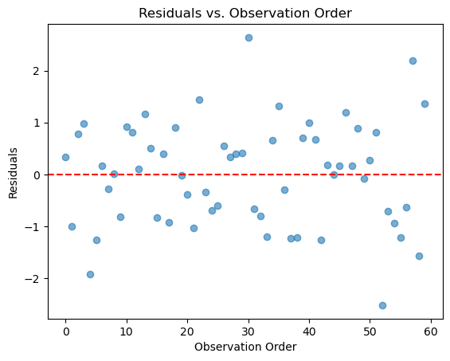

# 관측의 독립성 확인

## 독립성이 중요한 이유

독립성 가정은 각 관측값이 집단 안에서나 집단 사이에서나 다른 모든 관측값과 무관해야 한다는 것이다. 분산분석에서 아마도 가장 결정적인 가정인데, 독립성 위반은 변환이나 다른 검정통계량으로 바로잡을 수 없고 근본적으로 다른 모형화 접근(예: 혼합효과 모형, 반복측정 분산분석)을 요구하기 때문이다.

관측값이 상관되어 있으면 유효 표본크기가 명목 표본크기보다 작아지며, 그 결과:

- 표준오차가 과소추정된다.
- F-통계량이 부풀려진다.
- 제1종 오류율이 극적으로 커진다.

## 설정

<div class="codebox" markdown>

**예제 1.** 진단에 쓸 모형 준비

```python
import numpy as np
import pandas as pd
from statsmodels.formula.api import ols

# 이 페이지의 모든 진단은 아래 모형 하나를 놓고 수행한다.
# 집단마다 표준편차를 1.0, 1.3, 1.6으로 다르게 주어 진단이 무엇을 잡아내는지
# (그리고 무엇을 못 잡아내는지) 볼 수 있게 했다.
rng = np.random.default_rng(42)
n = 20
data = pd.DataFrame({
    "group": np.repeat(["A", "B", "C"], n),
    "response": np.concatenate([
        rng.normal(10.0, 1.0, n),
        rng.normal(10.8, 1.3, n),
        rng.normal(12.0, 1.6, n),
    ]),
})
model = ols("response ~ C(group)", data=data).fit()

print(data.groupby("group").response.agg(["count", "mean", "std"]).round(3))
print(f"\nF = {model.fvalue:.4f}, p = {model.f_pvalue:.4f}")
```

출력:

```
       count    mean    std
group                      
A         20   9.967  0.870
B         20  10.942  1.034
C         20  12.191  1.145

F = 23.7708, p = 0.0000
```

</div>

표본표준편차가 0.87, 1.03, 1.15로 나왔다. 참값이 1.0, 1.3, 1.6이었는데도 추정값이 이만큼 눌린 것은 집단당 20개로는 표준편차를 정확히 추정하기 어렵기 때문이다. 이 점이 아래 등분산 검정의 결과를 읽을 때 중요하다.

## 확인 방법

### 연구 설계 검토

독립성을 확보하는 가장 효과적인 방법은 올바른 실험 설계이다:

- 모집단으로부터의 **무작위 표집**은 한 관측값이 다른 관측값에 영향을 주지 않도록 한다.
- 처치군으로의 **무작위 배정**은 체계적인 의존을 막는다.
- 일원배치 분산분석 틀 안에서는 같은 대상에 대한 **반복측정이 없어야** 한다. 같은 대상을 여러 조건에서 측정한다면 반복측정 분산분석이나 혼합효과 모형이 필요하다.

독립성을 위반하는 흔한 상황:

- 교실 안에 내포된 학생(군집 자료).
- 같은 환자를 시간에 걸쳐 반복측정.
- 관측값의 공간적·시간적 인접성(예: 농업 실험에서 서로 붙어 있는 구획).

### Durbin-Watson 검정

Durbin-Watson 검정은 주로 회귀에서 잔차의 자기상관을 탐지하는 데 쓰이지만, 관측값에 자연스러운 순서가 있으면(예: 시계열 자료) 분산분석 잔차에도 적용할 수 있다.

$$
d = \frac{\sum_{i=2}^{n}(e_i - e_{i-1})^2}{\sum_{i=1}^{n}e_i^2}
$$

여기서 $e_i$는 시간이나 순서로 정렬된 잔차이다.

- $d \approx 2$: 자기상관 없음.
- $d < 2$: 양의 자기상관(인접한 잔차가 비슷한 경향).
- $d > 2$: 음의 자기상관(인접한 잔차의 부호가 번갈아 나타나는 경향).

<div class="codebox" markdown>

**예제 2.** Durbin-Watson 검정

```python
from statsmodels.stats.stattools import durbin_watson

# durbin_watson은 잔차를 **주어진 순서 그대로** 본다.
# 그래서 자료가 수집 순서대로 정렬되어 있어야 의미가 있다.
# 집단별로 정렬된 자료에 그냥 적용하면 집단 효과를 자기상관으로 오인할 수 있다.
dw_stat = durbin_watson(model.resid)
print(f"Durbin-Watson Statistic: {dw_stat:.4f}")
```

출력:

```
Durbin-Watson Statistic: 2.1101
```

</div>

$d = 2.11$로 2에 가까워 자기상관의 증거가 없다. 자료를 서로 독립으로 생성했으니 기대한 결과다.

### 순서에 대한 잔차 그림

자료에 자연스러운 순서(예: 수집 시각)가 있으면 그 순서에 대해 잔차를 그려 의존을 시사하는 패턴을 찾을 수 있다.

<div class="codebox" markdown>

**예제 3.** 순서에 대한 잔차 그림

```python
import matplotlib.pyplot as plt

# 잔차를 관측 순서대로 찍는다. 이웃한 점들이 같은 쪽으로 몰려 다니면
# 독립이 아니라는 신호다. 순서가 뜻을 갖는 자료(시간·공간)에서만 쓸 수 있다.
plt.scatter(range(len(model.resid)), model.resid, alpha=0.6)
plt.axhline(y=0, color='r', linestyle='--')
plt.xlabel("Observation Order")
plt.ylabel("Residuals")
plt.title("Residuals vs. Observation Order")
plt.show()
```



</div>

점들이 0을 중심으로 고르게 흩어져 있고 추세도 주기도 보이지 않는다.

다만 이 그림에는 한계가 있다. 가로축이 실제 수집 순서가 아니라 자료프레임의 행 번호(집단 A 20개, B 20개, C 20개 순)이기 때문이다. 실제 연구에서는 측정 시각이나 실험 순서를 따로 기록해 두어야 이 진단이 의미를 갖는다. **독립성은 자료를 들여다봐서 확인하는 것이 아니라 설계로 확보하는 것이다.**

살펴볼 것:

- **추세:** 체계적인 증가나 감소는 시간 효과를 시사한다.
- **주기:** 주기적인 패턴은 자기상관을 나타낸다.
- **군집:** 비슷한 잔차의 무리는 블록 효과를 시사한다.

## 독립성이 어긋날 때

- **혼합효과 모형:** 고정효과(처치)와 임의효과(군집)를 함께 모형화하여 계층적이거나 군집화된 자료 구조를 반영한다.
- **반복측정 분산분석:** 같은 대상이 여러 집단에 나타나면 대상 내 상관을 반영하는 설계를 쓴다.
- **일반화추정방정식(GEE):** 상관 구조를 반영하면서 모집단 평균 수준의 추정값을 제공한다.
- **시계열 방법:** 자기상관이 있는 시간에 걸친 자료라면 전용 시계열 분산분석 접근이 필요할 수 있다.

## 연습문제

<div class="drillbox" markdown>

**연습문제 1.** <span class="diff med" title="중간"></span>
어떤 연구자가 세 병원에서 각각 10명씩, 환자 30명의 혈압을 측정했다. 같은 병원의 환자는 같은 의사에게 진료받는다. 일원배치 분산분석의 독립성 가정이 왜 어긋날 수 있는지 설명하고 대안적인 모형화 접근을 제시하라.

</div>

??? success "풀이"
    같은 병원의 환자들은 같은 의사, 같은 진료 지침, 같은 병원 환경을 공유하므로 결과가 상관될 가능성이 높다. 이는 군집 안의 관측값이 군집 사이의 관측값보다 서로 더 비슷한 **군집 자료 구조**를 만들어 독립성 가정을 위반한다.

    적절한 대안은 병원을 임의효과로 포함하는 **혼합효과 모형**(계층 모형 또는 다수준 모형이라고도 한다)이다. 병원 내 상관을 반영하면서 처치군의 고정효과를 추정할 수 있다.

<div class="drillbox" markdown>

**연습문제 2.** <span class="diff med" title="중간"></span>
어떤 품질관리 기술자가 8시간 교대 동안 5분마다 생산 라인에서 측정하여, 세 가지 기계 설정으로 나뉜 관측값 96개를 기록했다. Durbin-Watson 통계량은 $d = 0.87$이다. 이 결과를 해석하고 분산분석의 결론에 어떤 영향을 주는지 설명하라.

</div>

??? success "풀이"
    Durbin-Watson 통계량 $d = 0.87$은 2보다 상당히 작아 잔차에 **양의 자기상관**이 있음을 나타낸다. 시간 순서로 수집한 생산 자료에서 예상되는 대로 인접한 측정값이 서로 비슷하다.

    이 자기상관은 유효 표본크기가 명목값 96보다 작다는 뜻이므로 표준오차가 과소추정되고 F-통계량이 부풀려진다. 분산분석이 거짓 양성을 낼 가능성이 크다. 기술자는 시계열 분산분석 접근을 쓰거나, 시간을 공변량으로 포함하거나, Newey-West(HAC) 표준오차를 써서 타당한 추론을 얻어야 한다.

<div class="drillbox" markdown>

**연습문제 3.** <span class="diff med" title="중간"></span>
일원배치 분산분석에서 독립성 가정이 충족되도록 돕는 연구 설계 요소 세 가지를 기술하라. 각각에 대해 그 요소가 없을 때 무엇이 잘못될 수 있는지 예를 들어라.

</div>

??? success "풀이"

    1. **모집단으로부터의 무작위 표집.** 무작위 표집이 없으면 관측값이 체계적으로 연관될 수 있다. 예를 들어 기존 참가자의 친구만 조사하면 관계망에 기반한 의존이 생긴다.

    2. **처치군으로의 무작위 배정.** 무작위화가 없으면 집단 구성원 사이의 사전 유사성이 교란을 일으킨다. 예를 들어 환자가 처치군을 스스로 고르면 중증인 환자가 한 집단에 몰릴 수 있다.

    3. **같은 대상에 대한 반복측정 없음.** 같은 대상이 여러 집단에 나타나면(예: 전후 측정을 독립인 것처럼 다루면) 대상 내 상관이 독립성을 위반한다. 반복측정 분산분석이나 대응 설계가 필요하다.

---

## 정리하며

독립성은 **검정으로 확인하는 것이 아니라 설계로 확보하는 것**이다.

- **위반의 결과가 가장 심각하다.** 관측이 상관되면 유효표본크기가 줄어 표준오차를 과소추정하고 $F$ 가 부풀어 오른다. **유의하지 않은 것이 유의해 보인다.**
- **7장의 유효표본크기가 그대로 적용된다.** 상관 $\phi$ 가 있으면 관측 $n$ 개가 독립 $n(1-\phi)/(1+\phi)$ 개 값어치밖에 없다.
- **흔한 위반 상황.** 같은 대상의 반복측정, 군집(학급·병원·가구), 시간적 자기상관, 공간적 근접성.
- **변환이나 로버스트 방법으로 고칠 수 없다.** 등분산은 웰치로, 정규성은 변환으로 대처할 수 있지만 **독립성은 모형을 바꿔야 한다** — 혼합효과 모형, 반복측정 분산분석, 군집 강건 표준오차.
- **사후 진단은 보조적이다.** 더빈–왓슨 통계량이나 잔차의 시계열 그림이 힌트를 주지만, 근본은 **자료가 어떻게 모였는지**를 아는 것이다.

다음 절 **등분산성 확인**으로 넘어간다.
