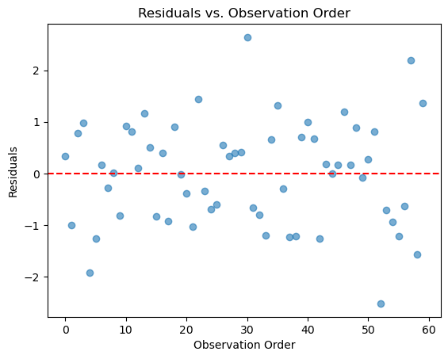

# 관측의 독립성 확인

## 독립성이 중요한 이유

독립성 가정은 각 관측값이 집단 안에서나 집단 사이에서나 다른 모든 관측값과 무관해야 한다는 것이다. 분산분석에서 아마도 가장 결정적인 가정인데, 독립성 위반은 변환이나 다른 검정통계량으로 바로잡을 수 없고 근본적으로 다른 모형화 접근(예: 혼합효과 모형, 반복측정 분산분석)을 요구하기 때문이다.

관측값이 상관되어 있으면 유효 표본크기가 명목 표본크기보다 작아지며, 그 결과:

- 표준오차가 과소추정된다.
- F-통계량이 부풀려진다.
- 제1종 오류율이 극적으로 커진다.

## 설정

<div class="exbox" markdown>

**보기 1.** <span class="diff easy" title="쉬움"></span> 진단에 쓸 모형 준비. 세 집단 각 $n = 20$에 **서로 독립인** 오차를 주고 `response ~ C(group)`을 적합한다.

**(1)** 최소제곱 잔차 $e = y - X\hat\beta$가 설계행렬의 열과 직교함을 보이고, 거기서 **집단마다 잔차의 합이 각각 $0$**임을 끌어내시오.

**(2)** 그 제약 때문에 **오차가 독립이어도 잔차는 독립이 아니다.** 일원배치 모형에서 같은 집단에 속한 두 잔차의 상관이 $-1/(n-1)$이고 다른 집단 사이에서는 $0$임을 보이고, $n = 20$에서 모의실험으로 확인하시오.

</div>

??? success "풀이"

    **(1) 해석적으로.** 최소제곱은 정규방정식 $X^\top X\hat\beta = X^\top y$를 만족하므로

    $$
    X^\top e = X^\top\bigl(y - X\hat\beta\bigr) = 0
    $$

    이다. `response ~ C(group)`의 설계행렬은 절편 $\mathbf 1$과 더미 $\mathbf 1_B$, $\mathbf 1_C$ 세 열이고, 이들이 지시벡터 $\mathbf 1_A, \mathbf 1_B, \mathbf 1_C$와 같은 공간을 펼친다($\mathbf 1 = \mathbf 1_A + \mathbf 1_B + \mathbf 1_C$). 그러므로

    $$
    \sum_{i \in A} e_i = \sum_{i \in B} e_i = \sum_{i \in C} e_i = 0
    $$

    이고 전체 합도 $0$이다. **집단마다 잔차의 합이 각각 $0$이다.** 적합값이 집단평균 $\bar y_g$인 것을 쓰면 $\sum_{i \in g}(y_i - \bar y_g) = 0$으로 바로 보인다. 컴퓨터로 재면 반올림이 쌓여 $10^{-13}$ 정도의 찌꺼기가 남는다.

    **(2) 해석적으로.** 이 제약에 값이 있다. **집단 안에서 $20$개 잔차 가운데 $19$개를 알면 남은 하나가 결정된다.** 그러니 오차 $\varepsilon_i$가 서로 독립이었더라도 잔차는 그럴 수 없다. 얼마나 아닌지를 재 보자.

    집단 $g$에 속한 관측의 잔차는 $e_i = y_i - \bar y_g = \varepsilon_i - \bar\varepsilon_g$다. $\varepsilon_i$가 평균 $0$, 분산 $\sigma^2$으로 독립이면 $\operatorname{Var}(\bar\varepsilon_g) = \sigma^2/n$이고 $\operatorname{Cov}(\varepsilon_i, \bar\varepsilon_g) = \sigma^2/n$이므로

    $$
    \operatorname{Var}(e_i) = \sigma^2 - 2\cdot\frac{\sigma^2}{n} + \frac{\sigma^2}{n}
    = \sigma^2\left(1 - \frac{1}{n}\right)
    $$

    이다. 같은 집단의 $i \ne j$에 대해서는

    $$
    \operatorname{Cov}(e_i, e_j)
    = \operatorname{Cov}(\varepsilon_i - \bar\varepsilon_g,\ \varepsilon_j - \bar\varepsilon_g)
    = 0 - \frac{\sigma^2}{n} - \frac{\sigma^2}{n} + \frac{\sigma^2}{n}
    = -\frac{\sigma^2}{n}
    $$

    이고, 따라서

    $$
    \operatorname{corr}(e_i, e_j)
    = \frac{-\sigma^2/n}{\sigma^2\bigl(1 - 1/n\bigr)}
    = -\frac{1}{n-1}
    $$

    이다. 집단이 다르면 $\bar\varepsilon_g$가 서로 다른 오차들로 만들어지므로 공분산이 $0$이고 상관도 $0$이다.

    $n = 20$에서 $-1/19 = -0.052632$다. **음수인 것이 요점이다.** 집단 안의 잔차는 "하나가 크면 나머지가 조금씩 작아져야" 하므로 약하게 서로 밀어낸다. 크기는 $5\%$ 남짓이라 실용적으로는 작지만, **"잔차가 독립인가"를 검정하면 $0$이 아닌 것을 재게 된다**는 사실 자체가 아래 Durbin-Watson을 읽을 때 쓰인다.

    **수치적으로.**

    ```python
    import numpy as np
    import pandas as pd
    from statsmodels.formula.api import ols

    # 이 페이지의 모든 진단은 아래 모형 하나를 놓고 수행한다.
    # 집단마다 표준편차를 1.0, 1.3, 1.6으로 다르게 주어 진단이 무엇을 잡아내는지
    # (그리고 무엇을 못 잡아내는지) 볼 수 있게 했다.
    rng = np.random.default_rng(42)
    n = 20
    data = pd.DataFrame({
        "group": np.repeat(["A", "B", "C"], n),
        "response": np.concatenate([
            rng.normal(10.0, 1.0, n),
            rng.normal(10.8, 1.3, n),
            rng.normal(12.0, 1.6, n),
        ]),
    })
    model = ols("response ~ C(group)", data=data).fit()

    print(data.groupby("group").response.agg(["count", "mean", "std"]).round(3))
    print(f"\nF = {model.fvalue:.4f}, p = {model.f_pvalue:.4f}")

    e = model.resid
    print(f"\n잔차 전체의 합 = {e.sum():+.3e}")
    print("집단별 잔차 합:", "  ".join(f"{g}: {v.sum():+.1e}"
                                    for g, v in e.groupby(data["group"])))

    # (2) 에서 유도한 잔차 사이의 상관을 모의로 확인한다.
    print(f"\n이론  같은 집단 corr(e_i, e_j) = -1/(n-1) = {-1 / (n - 1):+.6f}")
    print("      다른 집단 corr                        = +0.000000")

    rng_sim = np.random.default_rng(123)
    B = 2000
    w1, w2, b1, b2 = [], [], [], []
    for _ in range(B):
        eps = rng_sim.normal(0, 1, (3, n))          # 서로 독립인 오차
        r = eps - eps.mean(axis=1, keepdims=True)   # 집단평균만 뺀 잔차
        for g in range(3):
            w1.append(r[g, 0]); w2.append(r[g, 1])
        b1.append(r[0, 0]); b2.append(r[1, 0])
    print(f"모의  같은 집단 corr = {np.corrcoef(w1, w2)[0, 1]:+.6f}"
          f"   ({3 * B}쌍, 오차 {1 / np.sqrt(3 * B):.4f})")
    print(f"      다른 집단 corr = {np.corrcoef(b1, b2)[0, 1]:+.6f}"
          f"   ({B}쌍, 오차 {1 / np.sqrt(B):.4f})")

    # 이 쪽에서 쓸 양: 잔차가 놓인 순서. 자료프레임은 집단별로 묶여 있다.
    print("\n행 순서대로 본 집단 (처음 25행)")
    print("  " + "".join(data["group"].values[:25]))
    ```

    출력:

    ```
           count    mean    std
    group                      
    A         20   9.967  0.870
    B         20  10.942  1.034
    C         20  12.191  1.145

    F = 23.7708, p = 0.0000

    잔차 전체의 합 = -2.469e-13
    집단별 잔차 합: A: -7.1e-14  B: -5.3e-15  C: -1.7e-13

    이론  같은 집단 corr(e_i, e_j) = -1/(n-1) = -0.052632
          다른 집단 corr                        = +0.000000
    모의  같은 집단 corr = -0.058448   (6000쌍, 오차 0.0129)
          다른 집단 corr = -0.004901   (2000쌍, 오차 0.0224)

    행 순서대로 본 집단 (처음 25행)
      AAAAAAAAAAAAAAAAAAAABBBBB
    ```

    **(1)이 확인된다.** 집단별 잔차 합이 $-7.1\times 10^{-14}$, $-5.3\times 10^{-15}$, $-1.7\times 10^{-13}$으로 모두 기계 정밀도의 찌꺼기다.

    **(2)도 확인된다.** 같은 집단 안의 상관이 모의로 $-0.058448$인데 유도한 값은 $-0.052632$다. 쌍 $6000$개에서 상관의 오차가 $1/\sqrt{6000} = 0.0129$이니 두 수의 간격 $0.0058$은 $0.5$ 오차 안쪽이다. 다른 집단 사이는 $-0.004901$로 오차 $0.0224$ 안에서 $0$과 구별되지 않는다.

    마지막 줄이 이 쪽의 함정을 미리 보여 준다. **행 순서가 `AAAAAAAAAAAAAAAAAAAABBBBB…`, 곧 집단별로 묶여 있다.** 이 순서는 자료를 만든 코드가 정한 것일 뿐 **측정 순서가 아니다.** 아래 Durbin-Watson과 순서 대 잔차 그림은 둘 다 "잔차가 놓인 순서"를 입력으로 받으므로, 그 순서가 무엇인지 모르면 두 진단 모두 뜻을 잃는다.

    표본표준편차가 $0.870,\ 1.034,\ 1.145$로 나온 것도 적어 둔다. 참값이 $1.0,\ 1.3,\ 1.6$이었으니 $n = 20$에서 추정값이 이만큼 눌린다. 등분산성은 이 쪽의 주제가 아니지만, 아래 진단들이 모두 이 잔차를 입력으로 받는다는 점에서 함께 보아야 한다.

## 확인 방법

### 연구 설계 검토

독립성을 확보하는 가장 효과적인 방법은 올바른 실험 설계이다:

- 모집단으로부터의 **무작위 표집**은 한 관측값이 다른 관측값에 영향을 주지 않도록 한다.
- 처치군으로의 **무작위 배정**은 체계적인 의존을 막는다.
- 일원배치 분산분석 틀 안에서는 같은 대상에 대한 **반복측정이 없어야** 한다. 같은 대상을 여러 조건에서 측정한다면 반복측정 분산분석이나 혼합효과 모형이 필요하다.

독립성을 위반하는 흔한 상황:

- 교실 안에 내포된 학생(군집 자료).
- 같은 환자를 시간에 걸쳐 반복측정.
- 관측값의 공간적·시간적 인접성(예: 농업 실험에서 서로 붙어 있는 구획).

### Durbin-Watson 검정

Durbin-Watson 검정은 주로 회귀에서 잔차의 자기상관을 탐지하는 데 쓰이지만, 관측값에 자연스러운 순서가 있으면(예: 시계열 자료) 분산분석 잔차에도 적용할 수 있다.

$$
d = \frac{\sum_{i=2}^{n}(e_i - e_{i-1})^2}{\sum_{i=1}^{n}e_i^2}
$$

여기서 $e_i$는 시간이나 순서로 정렬된 잔차이다.

- $d \approx 2$: 자기상관 없음.
- $d < 2$: 양의 자기상관(인접한 잔차가 비슷한 경향).
- $d > 2$: 음의 자기상관(인접한 잔차의 부호가 번갈아 나타나는 경향).

<div class="exbox" markdown>

**보기 2.** <span class="diff easy" title="쉬움"></span> Durbin-Watson 검정. 보기 1의 잔차에 $d$를 계산한다.

**(1)** $0 \le d \le 4$임을 보이고, $\hat\rho = \sum_{i=2}^{n} e_i e_{i-1} / \sum_i e_i^2$에 대해 **정확한** 분해

$$
d = 2 - 2\hat\rho - \frac{e_1^2 + e_n^2}{\sum_i e_i^2}
$$

를 유도하시오. 여기서 흔히 쓰는 $d \approx 2(1-\hat\rho)$가 무엇을 버린 근사인지 밝히고, 두 값을 이 자료에서 비교하시오.

**(2)** 잔차가 **완전한 등차수열**일 때(가장 매끄럽게 흘러가는 극단적인 경우)

$$
d = \frac{12}{n(n+1)}
$$

임을 보이고 $n = 5, 10, 20, 50, 101$에서 확인하시오. 이것이 "$d$가 $0$에 가깝다"의 뜻이다.

**(3)** `durbin_watson`은 잔차를 **받은 순서 그대로** 쓴다. 집단별로 정렬된 일원배치 잔차에서 $d$의 중심이 $2$가 아니라 $2\bigl(1 + \tfrac{k-1}{N}\bigr)$임을 보이고, 자기상관이 실제로 있는 자료에 순서를 잘못 주면 어떻게 되는지 보이시오.

</div>

??? success "풀이"

    **(1) 해석적으로.** 분자를 그대로 펼친다.

    $$
    \sum_{i=2}^{n}(e_i - e_{i-1})^2
    = \sum_{i=2}^{n} e_i^2 + \sum_{i=2}^{n} e_{i-1}^2 - 2\sum_{i=2}^{n} e_i e_{i-1}
    $$

    첫 합은 $e_1^2$이 빠진 전체 제곱합이고 둘째 합은 $e_n^2$이 빠진 전체 제곱합이다. $S = \sum_{i=1}^{n} e_i^2$으로 쓰면

    $$
    \sum_{i=2}^{n}(e_i-e_{i-1})^2 = (S - e_1^2) + (S - e_n^2) - 2\hat\rho S
    = S\left(2 - 2\hat\rho - \frac{e_1^2+e_n^2}{S}\right)
    $$

    이고 $S$로 나누면 묻는 식이 나온다. **근사가 아니라 등식이다.** 흔히 쓰는 $d \approx 2(1-\hat\rho)$는 **끝점 두 개의 기여 $(e_1^2+e_n^2)/S$를 버린 것**이고, 그 크기는 대략 $2/n$이다($e_i^2$이 고르게 $S/n$씩 기여하므로).

    범위도 바로 나온다. 분자는 음이 아니므로 $d \ge 0$이다. 위 등식에서 코시-슈바르츠로 $\lvert\hat\rho\rvert \le 1$이고 끝점 항이 음이 아니므로

    $$
    d = 2 - 2\hat\rho - \frac{e_1^2+e_n^2}{S} \le 2 + 2 = 4
    $$

    이다. 곧 $d \in [0, 4]$다. $\hat\rho$가 $1$에 가까우면(인접한 잔차가 같이 움직이면) $d$가 $0$ 쪽으로, $-1$에 가까우면(부호가 번갈아 나오면) $4$ 쪽으로 간다. **독립이면 $\hat\rho \approx 0$이라 $d \approx 2$다.**

    **(2) 해석적으로.** 잔차가 등차수열이면 공차를 $1$로 잡아도 $d$는 바뀌지 않는다($d$는 $e$의 상수배에 불변이다). 평균을 빼 $e_i = i - \frac{n+1}{2}$로 두면 $\sum_i e_i = 0$이고 계산이 깔끔해진다.

    분자는 차가 모두 $1$이므로 항이 $n-1$개다.

    $$
    \sum_{i=2}^{n}(e_i - e_{i-1})^2 = (n-1)\cdot 1^2 = n-1
    $$

    분모는 $1, \ldots, n$의 편차제곱합, 곧 표본분산의 분자다.

    $$
    S = \sum_{i=1}^{n}\left(i - \frac{n+1}{2}\right)^2
    = \sum_{i=1}^n i^2 - n\left(\frac{n+1}{2}\right)^2
    = \frac{n(n+1)(2n+1)}{6} - \frac{n(n+1)^2}{4}
    = \frac{n(n^2-1)}{12}
    $$

    (마지막은 $\frac{n(n+1)}{12}\bigl[2(2n+1) - 3(n+1)\bigr] = \frac{n(n+1)(n-1)}{12}$로 묶은 것이다.) 그러므로

    $$
    d = \frac{n-1}{n(n^2-1)/12} = \frac{12(n-1)}{n(n-1)(n+1)} = \frac{12}{n(n+1)}
    $$

    이다. $n = 20$이면 $12/420 = 0.0285714$, $n = 100$이면 $0.0011881$이다. **$n$이 커질수록 $0$으로 간다.**

    이것이 "$d$가 작다"의 뜻을 정확히 말해 준다. 잔차가 한 방향으로 매끄럽게 흘러가면 인접한 차는 $n$에 무관하게 작은데 전체 제곱합은 $n^3$으로 커지므로, $d$가 $0$으로 짜부라진다. **$d \approx 0$은 "잔차가 추세를 타고 흘러간다"는 신호다.**

    **(3) 이론이 예측하는 값.** 보기 1에서 같은 집단 안의 잔차 상관이 $-1/(n-1)$임을 보았다. 그 때문에 $d$의 중심이 $2$에서 조금 밀려난다. 분자의 기댓값을 항별로 계산하면 **같은 집단에 속한 인접쌍**은

    $$
    E\bigl[(e_i-e_{i-1})^2\bigr]
    = 2\sigma^2\left(1-\frac{1}{n}\right) - 2\left(-\frac{\sigma^2}{n}\right) = 2\sigma^2
    $$

    로 음의 상관이 분산의 눌림을 **정확히 상쇄**한다. **집단 경계를 넘는 인접쌍**은 상관이 $0$이므로 $2\sigma^2(1-1/n)$이다. 균형 설계에서 전자는 $k(n-1)$개, 후자는 $k-1$개이니

    $$
    E[\text{분자}] = 2\sigma^2 k(n-1) + 2\sigma^2(k-1)\frac{n-1}{n},
    \qquad
    E[\text{분모}] = N\sigma^2\frac{n-1}{n}
    $$

    이고 ($N = kn$), 비를 정리하면

    $$
    \frac{E[\text{분자}]}{E[\text{분모}]}
    = \frac{2(kn + k - 1)}{kn}
    = 2\left(1 + \frac{k-1}{N}\right)
    $$

    이다. $k = 3$, $N = 60$이면 $2 \times \frac{31}{30} = 2.06667$이다. **독립이어도 $d$의 중심이 $2$보다 약간 크다.**

    **수치적으로.** 먼저 (1)과 (2)를 확인한다.

    ```python
    import numpy as np
    from statsmodels.stats.stattools import durbin_watson

    # durbin_watson은 잔차를 **주어진 순서 그대로** 본다.
    # 그래서 자료가 수집 순서대로 정렬되어 있어야 의미가 있다.
    # 집단별로 정렬된 자료에 그냥 적용하면 집단 효과를 자기상관으로 오인할 수 있다.
    dw_stat = durbin_watson(model.resid)
    print(f"Durbin-Watson Statistic: {dw_stat:.4f}")

    # (1) 의 정확한 분해 d = 2 - 2*rho - (e_1^2 + e_n^2)/S 을 확인한다.
    e = model.resid.values
    S = (e ** 2).sum()
    rho = (e[1:] * e[:-1]).sum() / S
    edge = (e[0] ** 2 + e[-1] ** 2) / S
    print(f"rho-hat                        = {rho:+.8f}")
    print(f"2(1 - rho-hat)                 = {2 * (1 - rho):.8f}   <- 흔히 쓰는 근사")
    print(f"끝점 보정 (e_1^2 + e_n^2)/S    = {edge:.8f}")
    print(f"2 - 2*rho - 끝점 보정          = {2 - 2 * rho - edge:.8f}")
    print(f"durbin_watson 과의 차이        = {abs(2 - 2 * rho - edge - dw_stat):.3e}")

    # (2) 완전한 등차수열 잔차에서는 d = 12 / (n(n+1)) 인가
    print(f"\n{'n':>5s} {'직접 계산':>13s} {'12/(n(n+1))':>13s} {'차이':>9s}")
    for m in [5, 10, 20, 50, 101]:
        a = np.arange(1, m + 1) - (m + 1) / 2     # 합이 0 인 등차수열
        d_direct, d_formula = durbin_watson(a), 12 / (m * (m + 1))
        print(f"{m:5d} {d_direct:13.10f} {d_formula:13.10f} {d_direct - d_formula:9.1e}")
    ```

    출력:

    ```
    Durbin-Watson Statistic: 2.1101
    rho-hat                        = -0.07149872
    2(1 - rho-hat)                 = 2.14299745   <- 흔히 쓰는 근사
    끝점 보정 (e_1^2 + e_n^2)/S    = 0.03287376
    2 - 2*rho - 끝점 보정          = 2.11012369
    durbin_watson 과의 차이        = 0.000e+00

        n         직접 계산   12/(n(n+1))        차이
        5  0.4000000000  0.4000000000   0.0e+00
       10  0.1090909091  0.1090909091   0.0e+00
       20  0.0285714286  0.0285714286   0.0e+00
       50  0.0047058824  0.0047058824   0.0e+00
      101  0.0011648224  0.0011648224   0.0e+00
    ```

    **(1)의 분해가 정확히 맞는다.** 차이가 $0$이다. 그리고 근사가 얼마나 어긋나는지도 보인다. $2(1-\hat\rho) = 2.1430$인데 참값은 $d = 2.1101$이고, 그 간격이 바로 끝점 보정 $0.0329$다. 예측한 크기 $2/n = 2/60 = 0.0333$과 거의 같다. **$n$이 작을 때 $d \approx 2(1-\hat\rho)$를 쓰면 이만큼 틀린다.**

    **(2)의 항등식도 맞는다.** 다섯 개 $n$ 전부에서 직접 계산과 공식이 **차이 $0$**으로 같다. $n = 101$에서 $d = 0.00116$이니 $d$가 아래로 얼마나 멀리 갈 수 있는지 알 수 있다.

    이제 (3)이다. 먼저 $d$의 중심을 모의로 잰다.

    ```python
    import numpy as np

    # 집단별로 묶인 순서에서 d 의 중심이 정말 2(1 + (k-1)/N) 인가.
    # 오차를 서로 독립으로 만들므로 귀무가설은 참이다.
    rng_sim = np.random.default_rng(2026)
    B = 20_000
    print(f"{'k':>3s} {'n':>4s} {'모의 E[분자]/E[분모]':>20s} {'2(1+(k-1)/N)':>14s} {'차이':>9s}")
    for k, m in [(2, 10), (3, 20), (5, 8), (4, 25)]:
        N = k * m
        num = np.empty(B)
        den = np.empty(B)
        for b in range(B):
            eps = rng_sim.normal(0, 1, (k, m))
            r = (eps - eps.mean(axis=1, keepdims=True)).ravel()   # 집단 순서로 늘어놓는다
            num[b] = (np.diff(r) ** 2).sum()
            den[b] = (r ** 2).sum()
        sim = num.mean() / den.mean()
        th = 2 * (1 + (k - 1) / N)
        print(f"{k:3d} {m:4d} {sim:20.5f} {th:14.5f} {sim - th:+9.5f}")
    ```

    출력:

    ```
      k    n       모의 E[분자]/E[분모]   2(1+(k-1)/N)        차이
      2   10              2.10028        2.10000  +0.00028
      3   20              2.06733        2.06667  +0.00066
      5    8              2.20555        2.20000  +0.00555
      4   25              2.05902        2.06000  -0.00098
    ```

    **네 설계 모두에서 공식이 맞는다.** 어긋남이 $0.001$ 안쪽이고, 가장 큰 $+0.00555$는 $N = 40$으로 표본이 가장 작은 설계에서 나왔다. 부호가 설계마다 바뀌므로 몬테카를로 오차이고 체계적인 치우침이 아니다.

    그래서 이 자료의 $d = 2.1101$을 어떻게 읽어야 하는가. **$2$와 비교하면 안 되고 $2.0667$과 비교해야 한다.** 간격이 $0.043$으로 줄어든다. 자료를 서로 독립으로 만들었으니 기대한 결과이며, **"$d$가 $2$보다 크니 음의 자기상관이 있다"고 읽으면 틀린다.** 집단평균을 적합한 것만으로 생기는 밀림이다.

    이제 (3)의 함정이다.

    ```python
    import numpy as np
    import pandas as pd
    from statsmodels.formula.api import ols
    from statsmodels.stats.stattools import durbin_watson

    # 자기상관이 **정말로 있는** 자료를 만든다. 측정은 수집 순서대로 AR(1) 오차를
    # 받지만, 자료프레임에는 집단별로 묶여 저장된다. 실제 자료가 흔히 이 꼴이다.
    rng_ar = np.random.default_rng(7)
    N, rho_true = 60, 0.8
    grp = np.repeat(["A", "B", "C"], 20)
    mu = {"A": 10.0, "B": 10.8, "C": 12.0}

    order = rng_ar.permutation(N)      # t 번째로 수집된 관측이 들어갈 행 번호
    eps, x = np.empty(N), 0.0
    for t in range(N):
        x = rho_true * x + rng_ar.normal(0, 1)
        eps[t] = x

    y = np.empty(N)
    for t in range(N):
        y[order[t]] = mu[grp[order[t]]] + eps[t]

    df = pd.DataFrame({"group": grp, "response": y})
    df["t"] = np.argsort(order)         # 각 행이 몇 번째로 수집되었는가
    m_ar = ols("response ~ C(group)", data=df).fit()
    r = m_ar.resid.values

    print(f"참 자기상관 rho = {rho_true}")
    print(f"집단순 잔차의 d = {durbin_watson(r):.4f}   <- 자료프레임 행 순서")
    print(f"수집순 잔차의 d = {durbin_watson(r[np.argsort(df['t'].values)]):.4f}"
          f"   <- 측정 순서")
    ```

    출력:

    ```
    참 자기상관 rho = 0.8
    집단순 잔차의 d = 1.8443   <- 자료프레임 행 순서
    수집순 잔차의 d = 0.7927   <- 측정 순서
    ```

    **같은 잔차 $60$개에서 $d$가 $1.8443$과 $0.7927$로 갈린다.** 다른 것은 **순서 하나뿐**이다.

    참 자기상관이 $\rho = 0.8$이니 $d \approx 2(1-0.8) = 0.4$ 근처를 기대하고, 측정 순서로 재면 $0.7927$로 분명히 작다. 자기상관이 잡힌다. 그런데 자료프레임 행 순서로 재면 $1.8443$이다. **$2$에 가까우므로 "자기상관 없음"으로 읽히고, 실제로 있는 심한 자기상관이 완전히 가려진다.**

    까닭은 간단하다. 집단별 정렬은 측정 순서를 뒤섞은 것이고, 뒤섞인 수열에서 인접한 두 잔차는 **측정 시각이 멀리 떨어진** 두 관측이다. AR(1)의 상관은 시차에 따라 기하적으로 줄어들므로 뒤섞으면 거의 $0$이 된다. $1.8443$이 $2.0667$보다 조금 작은 것은 남은 우연일 뿐이다.

    **그러므로 Durbin-Watson을 쓸 때는 먼저 "이 순서가 무슨 순서인가"를 답해야 한다.** 보기 1에서 본 대로 이 쪽의 자료프레임은 `AAAA…BBBB…CCCC` 로 묶여 있어 **측정 순서가 아니다.** 측정 시각이나 실험 순서를 따로 기록해 두지 않았다면 이 검정은 할 수 없다. 돌아가기는 하고 수도 하나 내놓지만, 그 수는 가정에 대해 아무것도 말해 주지 않는다.

### 순서에 대한 잔차 그림

자료에 자연스러운 순서(예: 수집 시각)가 있으면 그 순서에 대해 잔차를 그려 의존을 시사하는 패턴을 찾을 수 있다.

<div class="exbox" markdown>

**보기 3.** <span class="diff easy" title="쉬움"></span> 순서에 대한 잔차 그림. 보기 1의 잔차 $60$개를 행 번호에 대해 찍는다.

**(1)** 그림을 그리고 무엇을 읽을 수 있는지 말하시오. 살펴볼 것으로 꼽히는 **추세·주기·군집** 세 가지를 각각 **수치로** 재어 판단을 뒷받침하시오.

**(2)** 이 그림이 **가리는 것**은 무엇인가. 보기 2에서 만든 $\rho = 0.8$ 자기상관 자료를 같은 세 수치로 재어, 그림이 아무것도 못 보이는 경우를 보이시오.

</div>

??? success "풀이"

    이 보기에는 유도할 식이 없다. 그림에서 무엇을 읽어야 하는지가 전부다. 그러므로 눈으로 보는 세 가지를 각각 수로 바꾸는 일에 집중한다.

    - **추세**는 잔차를 순서에 회귀한 **기울기**로 잰다.
    - **주기와 자기상관**은 **시차 $1$ 상관 $\hat\rho$와 $d$**로 잰다.
    - **군집**은 부호의 **런(run) 개수**로 잰다. 부호가 바뀌는 횟수에 $1$을 더한 수이며, 독립이면 양수 $n_1$개, 음수 $n_2$개일 때 기댓값이 $2n_1n_2/N + 1$이다. 군집이 있으면 부호가 몰려 다니므로 런이 **적어진다.**

    **(1) 그림이 말하는 것.**

    ```python
    import matplotlib.pyplot as plt
    import numpy as np
    from scipy import stats
    from statsmodels.stats.stattools import durbin_watson

    # 그림에서 읽으려는 세 가지를 먼저 수로 적어 둔다.
    e = model.resid.values
    idx = np.arange(len(e))

    # 추세: 잔차를 행 번호에 회귀한 기울기
    sl = stats.linregress(idx, e)
    print(f"추세   기울기 {sl.slope:+.6f} (표준오차 {sl.stderr:.6f}), p = {sl.pvalue:.4f}")

    # 자기상관: 시차 1 상관과 d
    rho1 = (e[1:] * e[:-1]).sum() / (e ** 2).sum()
    print(f"자기상관  시차 1 rho-hat = {rho1:+.4f},  d = {durbin_watson(e):.4f}"
          f"  (집단순 중심 {2 * (1 + 2 / 60):.4f})")

    # 군집: 부호의 런 수. 기대값 2*n1*n2/N + 1
    sign = e > 0
    runs = 1 + (sign[1:] != sign[:-1]).sum()
    n1, n2 = sign.sum(), (~sign).sum()
    N = n1 + n2
    mu_r = 2 * n1 * n2 / N + 1
    sd_r = np.sqrt(2 * n1 * n2 * (2 * n1 * n2 - N) / (N ** 2 * (N - 1)))
    print(f"군집   양수 {n1}개, 음수 {n2}개,  런 {runs}개"
          f"  (기대 {mu_r:.2f}, 표준편차 {sd_r:.2f}, z = {(runs - mu_r) / sd_r:+.2f})")

    # 잔차를 관측 순서대로 찍는다. 이웃한 점들이 같은 쪽으로 몰려 다니면
    # 독립이 아니라는 신호다. 순서가 뜻을 갖는 자료(시간·공간)에서만 쓸 수 있다.
    plt.scatter(range(len(model.resid)), model.resid, alpha=0.6)
    plt.axhline(y=0, color='r', linestyle='--')
    plt.xlabel("Observation Order")
    plt.ylabel("Residuals")
    plt.title("Residuals vs. Observation Order")
    plt.show()
    ```

    출력:

    ```
    추세   기울기 -0.000381 (표준오차 0.007556), p = 0.9600
    자기상관  시차 1 rho-hat = -0.0715,  d = 2.1101  (집단순 중심 2.0667)
    군집   양수 32개, 음수 28개,  런 31개  (기대 30.87, 표준편차 3.82, z = +0.03)
    ```

    

    **점들이 $0$을 중심으로 고르게 흩어져 있고 추세도 주기도 군집도 보이지 않는다.** 그 세 판단의 정량적 내용이 위 세 줄이다.

    - **추세 없음**: 기울기 $-0.000381$에 표준오차 $0.007556$이니 $t = -0.05$, $p = 0.9600$이다. $60$개 전체에서 잔차가 올라가거나 내려간 양은 기울기 $\times 59 = -0.022$로, 잔차 표준편차 $1.005$의 $2\%$다. 사실상 평평하다.
    - **자기상관 없음**: $\hat\rho = -0.0715$이고 $d = 2.1101$이다. 보기 2에서 본 대로 비교 기준은 $2$가 아니라 $2.0667$이며, 간격이 $0.043$이다.
    - **군집 없음**: 런이 $31$개인데 독립일 때 기댓값이 $30.87$이다. $z = +0.03$으로 이보다 가까울 수가 없다.

    **(2) 그림이 가리는 것.** 이 그림의 치명적 한계는 가로축이 **실제 수집 순서가 아니라 자료프레임의 행 번호**(집단 A $20$개, B $20$개, C $20$개 순)라는 것이다. 보기 2에서 만든 자료로 그 결과를 직접 보자.

    ```python
    import numpy as np
    from scipy import stats
    from statsmodels.stats.stattools import durbin_watson

    # 보기 2 의 AR(1) 자료(참 rho = 0.8)를 두 순서로 같은 세 가지 수치로 재 본다.
    def read_three(v, label):
        i = np.arange(len(v))
        sl = stats.linregress(i, v)
        sign = v > 0
        runs = 1 + (sign[1:] != sign[:-1]).sum()
        n1, n2 = sign.sum(), (~sign).sum()
        N = n1 + n2
        mu_r = 2 * n1 * n2 / N + 1
        sd_r = np.sqrt(2 * n1 * n2 * (2 * n1 * n2 - N) / (N ** 2 * (N - 1)))
        print(f"{label}  기울기 p = {sl.pvalue:.4f},  d = {durbin_watson(v):.4f},  "
              f"런 {runs}개 (기대 {mu_r:.1f}, z = {(runs - mu_r) / sd_r:+.2f})")

    read_three(r, "집단순")
    read_three(r[np.argsort(df["t"].values)], "수집순")
    ```

    출력:

    ```
    집단순  기울기 p = 0.4481,  d = 1.8443,  런 24개 (기대 30.9, z = -1.80)
    수집순  기울기 p = 0.5023,  d = 0.7927,  런 14개 (기대 30.9, z = -4.41)
    ```

    **같은 잔차 $60$개인데 순서만 바꾸면 진단이 뒤집힌다.** 측정 순서로 재면 $d = 0.7927$, 런 $14$개로 $z = -4.41$이다. 어느 기준으로도 압도적으로 독립을 기각한다. 그런데 자료프레임 행 순서로 재면 $d = 1.8443$, 런 $24$개로 $z = -1.80$이고, $5\%$ 수준에서 기각하지 못한다. **참 자기상관이 $0.8$인 자료를 "문제 없음"으로 통과시킨다.**

    그림으로도 마찬가지다. 가로축을 행 번호로 두고 그리면 점들이 흩어져 보이고, 수집 순서로 두고 그려야 비로소 점들이 몰려 다니는 것이 보인다.

    기울기 $p$가 두 순서에서 모두 $0.45$ 안팎인 것도 짚어 둘 만하다. **추세 진단은 자기상관을 못 잡는다.** AR(1)은 평균이 일정하고 흔들림만 상관되어 있으므로 직선 기울기에는 흔적을 남기지 않는다. 세 수치가 서로 다른 것을 재고 있다는 뜻이고, 셋을 함께 보아야 한다.

    살펴볼 것:

    - **추세:** 체계적인 증가나 감소는 시간 효과를 시사한다.
    - **주기:** 주기적인 패턴은 자기상관을 나타낸다.
    - **군집:** 비슷한 잔차의 무리는 블록 효과를 시사한다.

    그러나 **셋 모두 가로축이 뜻을 가질 때에만 쓸 수 있다.** 실제 연구에서는 측정 시각이나 실험 순서를 따로 기록해 두어야 한다. 기록해 두지 않았다면 이 그림은 그릴 수 있어도 읽을 수 없다. **독립성은 자료를 들여다봐서 확인하는 것이 아니라 설계로 확보하는 것이다.**

## 독립성이 어긋날 때

- **혼합효과 모형:** 고정효과(처치)와 임의효과(군집)를 함께 모형화하여 계층적이거나 군집화된 자료 구조를 반영한다.
- **반복측정 분산분석:** 같은 대상이 여러 집단에 나타나면 대상 내 상관을 반영하는 설계를 쓴다.
- **일반화추정방정식(GEE):** 상관 구조를 반영하면서 모집단 평균 수준의 추정값을 제공한다.
- **시계열 방법:** 자기상관이 있는 시간에 걸친 자료라면 전용 시계열 분산분석 접근이 필요할 수 있다.

## 연습문제

<div class="drillbox" markdown>

**연습문제 1.** <span class="diff med" title="중간"></span>
어떤 연구자가 세 병원에서 각각 10명씩, 환자 30명의 혈압을 측정했다. 같은 병원의 환자는 같은 의사에게 진료받는다. 일원배치 분산분석의 독립성 가정이 왜 어긋날 수 있는지 설명하고 대안적인 모형화 접근을 제시하라.

</div>

??? success "풀이"
    같은 병원의 환자들은 같은 의사, 같은 진료 지침, 같은 병원 환경을 공유하므로 결과가 상관될 가능성이 높다. 이는 군집 안의 관측값이 군집 사이의 관측값보다 서로 더 비슷한 **군집 자료 구조**를 만들어 독립성 가정을 위반한다.

    적절한 대안은 병원을 임의효과로 포함하는 **혼합효과 모형**(계층 모형 또는 다수준 모형이라고도 한다)이다. 병원 내 상관을 반영하면서 처치군의 고정효과를 추정할 수 있다.

<div class="drillbox" markdown>

**연습문제 2.** <span class="diff med" title="중간"></span>
어떤 품질관리 기술자가 8시간 교대 동안 5분마다 생산 라인에서 측정하여, 세 가지 기계 설정으로 나뉜 관측값 96개를 기록했다. Durbin-Watson 통계량은 $d = 0.87$이다. 이 결과를 해석하고 분산분석의 결론에 어떤 영향을 주는지 설명하라.

</div>

??? success "풀이"
    Durbin-Watson 통계량 $d = 0.87$은 2보다 상당히 작아 잔차에 **양의 자기상관**이 있음을 나타낸다. 시간 순서로 수집한 생산 자료에서 예상되는 대로 인접한 측정값이 서로 비슷하다.

    이 자기상관은 유효 표본크기가 명목값 96보다 작다는 뜻이므로 표준오차가 과소추정되고 F-통계량이 부풀려진다. 분산분석이 거짓 양성을 낼 가능성이 크다. 기술자는 시계열 분산분석 접근을 쓰거나, 시간을 공변량으로 포함하거나, Newey-West(HAC) 표준오차를 써서 타당한 추론을 얻어야 한다.

<div class="drillbox" markdown>

**연습문제 3.** <span class="diff med" title="중간"></span>
일원배치 분산분석에서 독립성 가정이 충족되도록 돕는 연구 설계 요소 세 가지를 기술하라. 각각에 대해 그 요소가 없을 때 무엇이 잘못될 수 있는지 예를 들어라.

</div>

??? success "풀이"

    1. **모집단으로부터의 무작위 표집.** 무작위 표집이 없으면 관측값이 체계적으로 연관될 수 있다. 예를 들어 기존 참가자의 친구만 조사하면 관계망에 기반한 의존이 생긴다.

    2. **처치군으로의 무작위 배정.** 무작위화가 없으면 집단 구성원 사이의 사전 유사성이 교란을 일으킨다. 예를 들어 환자가 처치군을 스스로 고르면 중증인 환자가 한 집단에 몰릴 수 있다.

    3. **같은 대상에 대한 반복측정 없음.** 같은 대상이 여러 집단에 나타나면(예: 전후 측정을 독립인 것처럼 다루면) 대상 내 상관이 독립성을 위반한다. 반복측정 분산분석이나 대응 설계가 필요하다.

<div class="drillbox" markdown>

**연습문제 4.** <span class="diff hard" title="어려움"></span>
"유효 표본크기가 줄어든다"는 서술을 **수치로** 확인하라. AR(1) 자기상관의 크기별로 제1종 오류율을 재고 이론식과 맞춰 보라.

</div>

??? success "풀이"
    **이론.** 1차 자기상관 $\rho$가 있으면 표본평균의 분산이

    $$
    \operatorname{Var}(\bar X)\approx\frac{\sigma^2}{n}\cdot\frac{1+\rho}{1-\rho}
    $$

    이므로 **유효 표본크기**는

    $$
    n_{\text{유효}}=n\cdot\frac{1-\rho}{1+\rho}
    $$

    ```python
    import numpy as np
    from scipy import stats

    rng = np.random.default_rng(1111)

    def ar1(n, rho, rng):
        """주변분산이 1 인 AR(1) 계열."""
        e = rng.normal(0, np.sqrt(1 - rho**2), n)
        x = np.empty(n)
        x[0] = rng.normal()
        for t in range(1, n):
            x[t] = rho * x[t - 1] + e[t]
        return x

    B = 8_000
    print("k=3, 집단당 n=20, 모든 평균 0, 명목 0.05")
    print(f"{'ρ':>6s} {'F 오류율':>9s} {'유효 n = 20(1-ρ)/(1+ρ)':>22s} "
          f"{'분산 팽창 (1+ρ)/(1-ρ)':>22s}")
    for rho in [0.0, 0.2, 0.4, 0.6, 0.8]:
        a = sum(stats.f_oneway(*[ar1(20, rho, rng) for _ in range(3)]).pvalue < 0.05
                for _ in range(B))
        print(f"{rho:6.1f} {a / B:9.4f} {20 * (1 - rho) / (1 + rho):22.2f} "
              f"{(1 + rho) / (1 - rho):22.2f}")
    ```

    ```text
    k=3, 집단당 n=20, 모든 평균 0, 명목 0.05
         ρ     F 오류율   유효 n = 20(1-ρ)/(1+ρ)      분산 팽창 (1+ρ)/(1-ρ)
       0.0    0.0471                  20.00                   1.00
       0.2    0.1355                  13.33                   1.50
       0.4    0.2727                   8.57                   2.33
       0.6    0.4780                   5.00                   4.00
       0.8    0.7300                   2.22                   9.00
    ```

    **$\rho=0.2$만으로도 오류율이 0.136이다.** 명목의 **세 배**다.

    | $\rho$ | 오류율 | 유효 $n$ | 분산 팽창 |
    |---|---|---|---|
    | 0.0 | 0.047 | 20.0 | 1.00 |
    | 0.2 | **0.136** | 13.3 | 1.50 |
    | 0.4 | 0.273 | 8.6 | 2.33 |
    | 0.6 | 0.478 | 5.0 | 4.00 |
    | 0.8 | **0.730** | **2.2** | 9.00 |

    **$\rho=0.8$에서 관측 20개가 실질적으로 2.2개**다. 열 번에 일곱 번 잘못 기각한다.

    **$\rho=0.2$가 무섭다.** 산점도로는 **거의 보이지 않는 상관**인데 오류율이 세 배다. **"약한 상관이니 괜찮겠지"가 통하지 않는다.**

    **왜 이렇게 치명적인가.** $F$ 검정의 분모 MSE는 **집단 내 변동**을 잰다. 인접 관측이 비슷하면

    - 집단 내 변동이 **과소추정**되고
    - 집단 평균은 여전히 흔들리므로
    - $F$ 비가 **양쪽에서** 부풀려진다.

    **등분산 위반과 결정적으로 다르다.**

    | | 등분산 위반 | **독립성 위반** |
    |---|---|---|
    | 균형 설계로 완화 | **된다**(0.072) | **안 된다** |
    | 로버스트 방법으로 해결 | 웰치 | **없음** |
    | $n$을 늘리면 | 개선 | **그대로** |

    **$n$을 늘려도 나아지지 않는다.** 상관 구조가 그대로면 유효 표본크기의 **비율**이 그대로이기 때문이다.

    **처방은 모형을 바꾸는 것뿐이다** — 시계열 모형, 혼합효과 모형, HAC 표준오차(연습문제 9).

<div class="drillbox" markdown>

**연습문제 5.** <span class="diff hard" title="어려움"></span>
연습문제 1의 **병원 군집 상황**을 모의실험하라. 급내상관(ICC)이 오류율을 얼마나 부풀리는지 재고 설계효과 공식과 비교하라.

</div>

??? success "풀이"
    **설계효과.** 군집당 $m$명, 급내상관 $\rho_I$이면

    $$
    \text{DEFF}=1+(m-1)\rho_I,
    \qquad
    n_{\text{유효}}=\frac{n}{\text{DEFF}}
    $$

    ```python
    import numpy as np
    from scipy import stats

    rng = np.random.default_rng(1111)
    B = 8_000
    print("3집단 × 군집 5개 × 군집당 4명 (집단당 20명), 명목 0.05")
    print(f"{'ICC':>6s} {'F 오류율':>9s} {'설계효과 1+(m-1)ICC':>18s}")
    for icc in [0.0, 0.05, 0.1, 0.2, 0.4]:
        a = 0
        for _ in range(B):
            gs = []
            for g in range(3):
                vals = [rng.normal(0, np.sqrt(icc))
                        + rng.normal(0, np.sqrt(1 - icc), 4) for _ in range(5)]
                gs.append(np.concatenate(vals))
            a += stats.f_oneway(*gs).pvalue < 0.05
        print(f"{icc:6.2f} {a / B:9.4f} {1 + 3 * icc:18.2f}")
    ```

    ```text
    3집단 × 군집 5개 × 군집당 4명 (집단당 20명), 명목 0.05
       ICC     F 오류율    설계효과 1+(m-1)ICC
      0.00    0.0466               1.00
      0.05    0.0790               1.15
      0.10    0.1017               1.30
      0.20    0.1581               1.60
      0.40    0.2659               2.20
    ```

    **ICC가 0.05만 되어도 오류율이 0.079다.**

    | ICC | 오류율 | DEFF | 유효 $n$(집단당) |
    |---|---|---|---|
    | 0.00 | 0.047 | 1.00 | 20.0 |
    | **0.05** | **0.079** | 1.15 | 17.4 |
    | 0.10 | 0.102 | 1.30 | 15.4 |
    | 0.20 | 0.158 | 1.60 | 12.5 |
    | 0.40 | 0.266 | 2.20 | 9.1 |

    **ICC 0.05는 실무에서 매우 흔하다.** 교육 연구에서 학급 ICC가 0.1~0.2, 의료에서 병원 ICC가 0.01~0.05로 보고된다. **"작은 ICC"가 결코 무해하지 않다.**

    **군집당 인원 $m$이 결정적이다.** DEFF $=1+(m-1)\rho_I$이므로

    | ICC | $m=4$ | $m=20$ | $m=100$ |
    |---|---|---|---|
    | 0.01 | 1.03 | 1.19 | **1.99** |
    | 0.05 | 1.15 | **1.95** | **5.95** |

    **ICC가 0.01이어도 군집당 100명이면 유효 표본이 절반**이다. 큰 군집을 적게 쓰는 설계가 특히 위험하다.

    **설계에 주는 함의.** 총 표본을 정할 때

    $$
    n_{\text{필요}}=n_{\text{독립 기준}}\times\bigl(1+(m-1)\rho_I\bigr)
    $$

    **군집을 늘리는 것이 군집당 인원을 늘리는 것보다 훨씬 효율적**이다. $m\to\infty$에서 유효 표본은 $\rho_I^{-1}\times(\text{군집 수})$로 **포화**한다.

    **연습문제 1의 답을 정량화하면.** 병원 3곳에서 10명씩 뽑는 설계는 **군집이 3개뿐**이라 상황이 더 나쁘다. 병원 효과를 추정할 자유도가 거의 없다. **병원 수를 늘리는 것이 환자 수를 늘리는 것보다 우선**이다.

<div class="drillbox" markdown>

**연습문제 6.** <span class="diff hard" title="어려움"></span>
더빈-왓슨 검정이 **무엇을 잡고 무엇을 못 잡는지** 모의실험으로 보여라.

</div>

??? success "풀이"
    ```python
    import numpy as np
    from scipy import stats
    from statsmodels.stats.stattools import durbin_watson

    rng = np.random.default_rng(2222)
    B = 4_000
    N = 60          # 잔차 개수

    def ar1(n, rho, rng):
        e = rng.normal(0, np.sqrt(1 - rho**2), n)
        x = np.empty(n)
        x[0] = rng.normal()
        for t in range(1, n):
            x[t] = rho * x[t - 1] + e[t]
        return x

    print("(가) 시간적 자기상관을 잡는가  (기준: |d-2| > 2·1.96/√N)")
    print(f"{'ρ':>6s} {'평균 d':>8s} {'탐지율':>8s}")
    for rho in [0.0, 0.2, 0.4, 0.6, 0.8]:
        ds, hit = [], 0
        for _ in range(B):
            gs = [ar1(20, rho, rng) for _ in range(3)]
            r = np.concatenate([g - g.mean() for g in gs])
            d = durbin_watson(r)
            ds.append(d)
            hit += abs(d - 2) > 2 * 1.96 / np.sqrt(N)
        print(f"{rho:6.1f} {np.mean(ds):8.4f} {hit / B:8.4f}")

    print("\n(나) 군집 자료(ICC=0.3)는 잡는가 — 수집 순서가 군집 순서와 무관할 때")
    ds, hit = [], 0
    for _ in range(B):
        r = []
        for g in range(3):
            vals = [rng.normal(0, np.sqrt(0.3))
                    + rng.normal(0, np.sqrt(0.7), 4) for _ in range(5)]
            x = np.concatenate(vals)
            r.append(x - x.mean())
        res = np.concatenate(r)
        d = durbin_watson(res[rng.permutation(len(res))])
        ds.append(d)
        hit += abs(d - 2) > 2 * 1.96 / np.sqrt(N)
    print(f"  평균 d = {np.mean(ds):.4f}, 탐지율 = {hit / B:.4f}   (ICC=0.3 인데도)")
    ```

    ```text
    (가) 시간적 자기상관을 잡는가  (기준: |d-2| > 2·1.96/√N)
         ρ     평균 d      탐지율
       0.0   2.0581   0.0512
       0.2   1.7149   0.1998
       0.4   1.3814   0.6855
       0.6   1.0426   0.9617
       0.8   0.7271   0.9990

    (나) 군집 자료(ICC=0.3)는 잡는가 — 수집 순서가 군집 순서와 무관할 때
      평균 d = 2.0000, 탐지율 = 0.0473   (ICC=0.3 인데도)
    ```

    **더빈-왓슨은 시간적 자기상관을 잘 잡는다.** $\rho=0.4$에서 0.69, $\rho=0.6$에서 0.96이다.

    **그러나 $\rho=0.2$에서는 0.20뿐이다.** 연습문제 4에서 본 대로 $\rho=0.2$의 오류율이 이미 0.136인데, **더빈-왓슨은 다섯 번 중 한 번만 경고**한다.

    | $\rho$ | $F$의 오류율 | DW 탐지율 |
    |---|---|---|
    | 0.2 | **0.136** | 0.200 |
    | 0.4 | 0.273 | 0.686 |
    | 0.6 | 0.478 | 0.962 |

    **(나)가 결정적이다.** ICC가 0.3인 **심각한 군집 자료**에서 더빈-왓슨의 탐지율이 **0.047**이다. 명목 수준과 같다. **전혀 잡지 못한다.**

    **왜 그런가.** 더빈-왓슨은 **인접한 잔차**만 본다.

    $$
    d=\frac{\sum_{i=2}^n(e_i-e_{i-1})^2}{\sum_i e_i^2}
    $$

    수집 순서가 군집 순서와 무관하면 **이웃한 두 관측이 같은 군집일 확률이 낮아** 상관이 보이지 않는다.

    **더빈-왓슨이 잡는 것과 못 잡는 것.**

    | 의존 구조 | 잡는가 |
    |---|---|
    | 시간적 자기상관(순서대로 정렬) | **잡는다**($\rho\geq0.4$) |
    | 약한 자기상관($\rho\leq0.2$) | 자주 놓친다 |
    | **군집(순서와 무관)** | **전혀 못 잡는다** |
    | 공간적 인접성 | 못 잡는다 |
    | 반복측정 | 순서에 따라 다름 |

    **본문이 옳다.** "독립성은 자료를 들여다봐서 확인하는 것이 아니라 **설계로 확보하는 것**이다."

    **그래도 더빈-왓슨을 쓸 곳은 있다.** 관측이 **명확한 시간 순서**로 수집되었고 그 순서를 기록해 두었을 때, **경고등** 역할은 한다. 다만 **음성 결과를 독립성의 증거로 삼으면 안 된다.**

<div class="drillbox" markdown>

**연습문제 7.** <span class="diff hard" title="어려움"></span>
군집 자료의 처방 둘(**군집 평균 집계**, **혼합효과 모형**)이 오류율을 회복하는지 확인하라. 군집 수가 적으면 어떻게 되는가?

</div>

??? success "풀이"
    ```python
    import warnings
    warnings.filterwarnings("ignore")

    import numpy as np
    import pandas as pd
    from scipy import stats
    import statsmodels.formula.api as smf

    def run(ICC, C, M, B, seed):
        """C = 집단당 군집 수, M = 군집당 인원."""
        rng = np.random.default_rng(seed)
        a = b = c = 0
        for _ in range(B):
            rows, cid = [], 0
            for g in range(3):
                for _c in range(C):
                    u = rng.normal(0, np.sqrt(ICC))
                    rows.append(pd.DataFrame(
                        {"y": u + rng.normal(0, np.sqrt(1 - ICC), M),
                         "g": f"G{g}", "cl": cid}))
                    cid += 1
            df = pd.concat(rows, ignore_index=True)

            a += stats.f_oneway(*[v.y.values
                                  for _, v in df.groupby("g")]).pvalue < 0.05
            cm = df.groupby(["g", "cl"]).y.mean().reset_index()
            b += stats.f_oneway(*[v.y.values
                                  for _, v in cm.groupby("g")]).pvalue < 0.05
            m = smf.mixedlm("y ~ C(g)", df, groups=df["cl"]).fit(reml=True)
            idx = list(m.params.index)
            names = [x for x in idx if x.startswith("C(g)")]
            R = np.zeros((len(names), len(idx)))
            for r, nm in enumerate(names):
                R[r, idx.index(nm)] = 1
            c += float(m.f_test(R).pvalue) < 0.05
        return a / B, b / B, c / B

    print("ICC=0.3, 명목 0.05")
    print(f"{'설계':>26s} {'개별 분산분석':>12s} {'군집 평균':>10s} {'혼합효과':>10s}")
    for lab, C, M, B, seed in [("군집 5개/집단, 군집당 4", 5, 4, 800, 3333),
                               ("군집 15개/집단, 군집당 4", 15, 4, 600, 4444)]:
        a, b, c = run(0.3, C, M, B, seed)
        print(f"{lab:>26s} {a:12.4f} {b:10.4f} {c:10.4f}")
    ```

    ```text
    ICC=0.3, 명목 0.05
                            설계      개별 분산분석      군집 평균       혼합효과
               군집 5개/집단, 군집당 4       0.2188     0.0575     0.0862
              군집 15개/집단, 군집당 4       0.2183     0.0533     0.0583
    ```

    **개별 관측 분산분석은 두 설계 모두에서 0.22다.** 군집 수를 세 배로 늘려도 **전혀 나아지지 않는다.** 연습문제 4에서 본 대로 **표본을 늘려도 독립성 위반은 해소되지 않는다.**

    | 방법 | 군집 5개 | 군집 15개 |
    |---|---|---|
    | 개별 분산분석 | **0.219** | **0.218** |
    | **군집 평균** | **0.058** | **0.053** |
    | 혼합효과 | 0.086 | **0.058** |

    **군집 평균 집계가 두 경우 모두 잘 작동한다**(0.053~0.058). 가장 단순한 방법인데 가장 안정적이다.

    **혼합효과 모형은 군집이 적으면 부정확하다**(5개일 때 0.086). **분산성분을 추정해야 하는데 군집 5개로는 정보가 부족**하기 때문이다. 군집 15개면 0.058로 개선된다.

    **경험칙 — 군집이 최소 15~20개는 있어야** 혼합효과 모형의 추론이 믿을 만하다. 그 아래면

    | 대안 | 내용 |
    |---|---|
    | **군집 평균 집계** | 군집당 하나의 관측으로 축약 |
    | 케워드-로저 보정 | 자유도를 소표본에 맞게 조정 |
    | 부트스트랩 | 군집 단위 재표집 |

    **집계의 대가.** 군집 평균 분석은 **군집 내 정보를 버린다.** 군집 내 공변량을 쓸 수 없고, 군집 크기가 다르면 가중이 필요하다. **정확성은 얻지만 유연성을 잃는다.**

    **두 방법이 같아지는 경우.** 군집 크기가 모두 같고 군집 내 공변량이 없으면 **군집 평균 분석과 혼합효과 모형이 점근적으로 동등**하다. 위 결과에서 군집 15개일 때 0.053과 0.058이 가까운 이유다.

<div class="drillbox" markdown>

**연습문제 8.** <span class="diff med" title="중간"></span>
연습문제 3이 경고한 **"반복측정을 독립으로 다루는 실수"**의 대가를 재라. 오류율과 검정력 중 무엇이 문제인가?

</div>

??? success "풀이"
    ```python
    import numpy as np
    from scipy import stats

    rng = np.random.default_rng(5555)
    B = 20_000
    print("제1종 오류율 (참 평균차 0, n=15 쌍)")
    print(f"{'개체내 상관 φ':>12s} {'대응 t':>10s} {'독립 t':>10s}")
    for phi in [0.0, 0.3, 0.6, 0.9]:
        a = b = 0
        for _ in range(B):
            u = rng.normal(0, np.sqrt(phi), 15)
            x = u + rng.normal(0, np.sqrt(1 - phi), 15)
            y = u + rng.normal(0, np.sqrt(1 - phi), 15)
            a += stats.ttest_rel(x, y).pvalue < 0.05
            b += stats.ttest_ind(x, y).pvalue < 0.05
        print(f"{phi:12.1f} {a / B:10.4f} {b / B:10.4f}")

    rng = np.random.default_rng(5556)
    print("\n검정력 (참 평균차 0.5, n=15 쌍)")
    print(f"{'개체내 상관 φ':>12s} {'대응 t':>10s} {'독립 t':>10s}")
    for phi in [0.0, 0.3, 0.6, 0.9]:
        a = b = 0
        for _ in range(B):
            u = rng.normal(0, np.sqrt(phi), 15)
            x = u + rng.normal(0, np.sqrt(1 - phi), 15)
            y = u + rng.normal(0.5, np.sqrt(1 - phi), 15)
            a += stats.ttest_rel(x, y).pvalue < 0.05
            b += stats.ttest_ind(x, y).pvalue < 0.05
        print(f"{phi:12.1f} {a / B:10.4f} {b / B:10.4f}")
    ```

    ```text
    제1종 오류율 (참 평균차 0, n=15 쌍)
        개체내 상관 φ       대응 t       독립 t
             0.0     0.0522     0.0508
             0.3     0.0507     0.0217
             0.6     0.0500     0.0034
             0.9     0.0534     0.0000

    검정력 (참 평균차 0.5, n=15 쌍)
        개체내 상관 φ       대응 t       독립 t
             0.0     0.2455     0.2589
             0.3     0.3316     0.2275
             0.6     0.5255     0.1788
             0.9     0.9810     0.0888
    ```

    **뜻밖의 결과 — 오류율은 부풀지 않고 오히려 0으로 간다.**

    | $\phi$ | 오류율(독립 $t$) | 검정력(독립 $t$) | 검정력(대응 $t$) |
    |---|---|---|---|
    | 0.0 | 0.051 | 0.259 | 0.246 |
    | 0.3 | 0.022 | 0.228 | **0.332** |
    | 0.6 | 0.003 | 0.179 | **0.526** |
    | 0.9 | **0.000** | **0.089** | **0.981** |

    **$\phi=0.9$에서 검정력이 0.98 대 0.09다. 열한 배 차이**다.

    **왜 오류율이 아니라 검정력의 문제인가.** **양의** 개체내 상관은 차이 $X-Y$의 분산을 **줄인다**.

    $$
    \operatorname{Var}(X-Y)=2\sigma^2(1-\phi)
    $$

    독립 $t$ 검정은 분모에 $2\sigma^2$을 쓰므로 **분모를 과대평가**한다. 결과적으로 **보수적**이 되어 오류율이 0으로 가고 검정력을 잃는다.

    **그럼 언제 오류율이 부풀어 오르는가.** 방향이 반대일 때다.

    | 상황 | 결과 |
    |---|---|
    | **쌍 안의 양의 상관**(반복측정) | 보수적, **검정력 손실** |
    | **집단 안의 양의 상관**(군집·자기상관) | **오류율 폭증** |

    **연습문제 4·5와 여기가 다른 이유**가 여기 있다. 자기상관·군집은 **비교하는 집단 "안"**의 상관이라 오차를 과소평가하지만, 반복측정은 **비교하는 두 값 "사이"**의 상관이라 오차를 과대평가한다.

    **실무 함의 셋.**

    1. **반복측정 설계는 강력하다.** $\phi$가 클수록 대응 분석의 검정력이 커진다. **일부러 쌍을 짜는 이유**다.
    2. **그 이득을 분석에서 살려야** 한다. 대응 자료를 독립으로 분석하면 **설계의 이점을 버리는 것**이다.
    3. **$\phi<0$이면 반대**다. 음의 상관에서는 대응 분석이 오히려 불리하고 오류율 문제도 생긴다(드물다).

    **다집단으로 확장하면** 반복측정 분산분석이나 혼합효과 모형이 대응 $t$의 역할을 한다.

<div class="drillbox" markdown>

**연습문제 9.** <span class="diff hard" title="어려움"></span>
연습문제 2가 권한 **HAC(뉴이-웨스트) 표준오차**가 실제로 통하는지 확인하라. 표본이 작으면 어떻게 되는가?

</div>

??? success "풀이"
    ```python
    import warnings
    warnings.filterwarnings("ignore")

    import numpy as np
    from scipy import stats
    import statsmodels.api as sm

    def ar1(n, rho, rng):
        e = rng.normal(0, np.sqrt(1 - rho**2), n)
        x = np.empty(n)
        x[0] = rng.normal()
        for t in range(1, n):
            x[t] = rho * x[t - 1] + e[t]
        return x

    rng = np.random.default_rng(6667)
    B = 2_000
    R = np.array([[1.0, -1, 0], [0, 1, -1]])
    print("3집단, 시간순 관측, 명목 0.05")
    print(f"{'n':>5s} {'ρ':>5s} {'표준 F':>9s} {'HAC 왈드 F':>11s} {'maxlags':>8s}")
    for n in [20, 100, 400]:
        L = int(4 * (n * 3 / 100)**(2 / 9)) + 1      # 흔히 쓰는 경험 규칙
        for rho in [0.0, 0.6]:
            a = b = 0
            X = np.zeros((3 * n, 3))
            for i in range(3):
                X[i * n:(i + 1) * n, i] = 1
            for _ in range(B):
                gs = [ar1(n, rho, rng) for _ in range(3)]
                y = np.concatenate(gs)
                a += stats.f_oneway(*gs).pvalue < 0.05
                fit = sm.OLS(y, X).fit(cov_type="HAC",
                                       cov_kwds={"maxlags": L})
                b += float(fit.f_test(R).pvalue) < 0.05
            print(f"{n:5d} {rho:5.1f} {a / B:9.4f} {b / B:11.4f} {L:8d}")
    ```

    ```text
    3집단, 시간순 관측, 명목 0.05
        n     ρ      표준 F    HAC 왈드 F  maxlags
       20   0.0    0.0545      0.1535        4
       20   0.6    0.4925      0.3295        4
      100   0.0    0.0460      0.0720        6
      100   0.6    0.4475      0.1470        6
      400   0.0    0.0460      0.0535        7
      400   0.6    0.4860      0.1115        7
    ```

    **HAC가 도움이 되지만 만능이 아니다.**

    | $n$ | $\rho=0$ 오류율 | $\rho=0.6$ 오류율 |
    |---|---|---|
    | 20 | **0.154** | 0.330 |
    | 100 | 0.072 | 0.147 |
    | 400 | **0.054** | **0.112** |

    **$n=20$에서는 오히려 해롭다**(0.154). 상관이 **없는데도** 명목의 세 배다. HAC 추정량이 **소표본에서 심하게 편향**되기 때문이다.

    **$n=400$에서도 $\rho=0.6$의 오류율이 0.112**다. 표준 $F$의 0.486보다는 훨씬 낫지만 **여전히 명목의 두 배**다.

    | 방법 | $n=400$, $\rho=0.6$ |
    |---|---|
    | 표준 $F$ | 0.486 |
    | **HAC** | **0.112** |
    | 명목 | 0.050 |

    **왜 완전히 고쳐지지 않는가.** HAC는 **점근적**으로 타당하다. 유효 표본크기가 $n(1-\rho)/(1+\rho)=400/4=100$이고, 그 정도로는 커널 추정이 아직 수렴하지 않는다.

    **개선 방법 셋.**

    | 방법 | 내용 |
    |---|---|
    | **소표본 보정** | Kiefer-Vogelsang 고정-$b$ 임계값 |
    | **대역폭 조정** | maxlags를 늘리되 분산 증가와 절충 |
    | **모형화** | AR 구조를 명시적으로 적합(GLS) |

    **세 번째가 가장 정확하다.** 상관 구조를 안다면 **GLS나 ARMA 오차 모형**이 HAC보다 훨씬 효율적이다. HAC는 **구조를 모를 때의 보험**이다.

    **연습문제 2의 답을 수정하면.** $d=0.87$($\rho\approx0.57$)인 96개 관측에 HAC를 쓰면 오류율이 0.49에서 0.15 정도로 줄지만 **여전히 명목의 세 배**다. **시계열 구조를 명시적으로 모형화하거나 관측 간격을 늘려 상관을 줄이는 것**이 더 확실하다.

<div class="drillbox" markdown>

**연습문제 10.** <span class="diff easy" title="쉬움"></span>
독립성 위반의 **유형·진단·처방**을 정리하라.

</div>

??? success "풀이"
    **왜 가장 심각한가 — 한 표로.**

    | 가정 | 위반 시 오류율 | 사후 교정 |
    |---|---|---|
    | 정규성 | 0.037(보수적) | 변환·순열 |
    | 등분산(균형) | 0.072 | **웰치** |
    | 등분산(불균형) | 0.286 | **웰치** |
    | **독립성 ($\rho=0.6$)** | **0.478** | **모형을 바꿔야 함** |

    **유형별 진단과 처방.**

    | 유형 | 예 | 진단 | 처방 |
    |---|---|---|---|
    | **시간적 자기상관** | 생산 라인, 시계열 | 더빈-왓슨, 잔차의 시계열 그림 | 시계열 모형, **HAC**, GLS |
    | **군집** | 학급·병원·가구 | **설계 검토**(DW는 못 잡음) | **혼합효과**, 군집 평균 집계 |
    | **반복측정** | 전후 측정 | 설계 검토 | 대응 분석, 반복측정 분산분석 |
    | **공간적 근접** | 농업 구획 | 변량도, 모란 $I$ | 공간 모형, 블록 설계 |

    **핵심 수치 다섯.**

    | 사실 | 값 |
    |---|---|
    | $\rho=0.2$에서 $F$의 오류율 | **0.136** |
    | ICC $=0.05$, $m=4$에서 오류율 | 0.079 |
    | 군집 자료에 대한 더빈-왓슨의 탐지율 | **0.047**(무용) |
    | 군집 5개일 때 혼합효과의 오류율 | 0.086 |
    | $n=400$, $\rho=0.6$에서 HAC | 0.112 |

    **세 가지 원칙.**

    1. **설계로 확보한다.** 무작위 표집, 무작위 배정, 반복측정 배제.
    2. **구조를 기록한다.** 수집 시각, 군집 식별자, 개체 식별자를 **반드시 자료에 남긴다.**
    3. **의심되면 모형에 넣는다.** 군집 효과가 0에 가까워도 모형에 넣는 비용은 작다.

    **두 번째가 실무에서 가장 자주 빠진다.** 군집 식별자가 없으면 **혼합효과 모형을 적합할 수조차 없다.** 자료를 다 모은 뒤에는 되돌릴 수 없다.

    **의사결정 흐름.**

    ```text
    관측이 서로 독립인가?
        │
        ├─ 같은 개체를 여러 번 쟀는가 ──→ 반복측정/혼합효과
        ├─ 자연스러운 군집이 있는가  ──→ 혼합효과 또는 군집 평균
        ├─ 시간 순서가 있는가        ──→ 시계열 모형, HAC, GLS
        ├─ 공간적으로 가까운가       ──→ 공간 모형, 블록 설계
        └─ 모두 아니오               ──→ 표준 분산분석 가능
    ```

    **하지 말아야 할 것 넷.**

    | 실수 | 결과 |
    |---|---|
    | 더빈-왓슨이 유의하지 않으니 독립 | 군집은 못 잡는다 |
    | 표본을 늘려 해결하려 함 | **비율이 그대로** |
    | 웰치나 변환으로 대응 | **전혀 무관한 처방** |
    | 군집 3~5개로 혼합효과 모형 | 오류율 0.086 |

    **한 문장.** 독립성은 **분석 단계에서 확인하는 가정이 아니라 설계 단계에서 만드는 성질**이며, 깨졌다면 **다른 검정이 아니라 다른 모형**이 필요하다.

---

## 정리하며

독립성은 **검정으로 확인하는 것이 아니라 설계로 확보하는 것**이다.

- **위반의 결과가 가장 심각하다.** 관측이 상관되면 유효표본크기가 줄어 표준오차를 과소추정하고 $F$ 가 부풀어 오른다. **유의하지 않은 것이 유의해 보인다.**
- **7장의 유효표본크기가 그대로 적용된다.** 상관 $\phi$ 가 있으면 관측 $n$ 개가 독립 $n(1-\phi)/(1+\phi)$ 개 값어치밖에 없다.
- **흔한 위반 상황.** 같은 대상의 반복측정, 군집(학급·병원·가구), 시간적 자기상관, 공간적 근접성.
- **변환이나 로버스트 방법으로 고칠 수 없다.** 등분산은 웰치로, 정규성은 변환으로 대처할 수 있지만 **독립성은 모형을 바꿔야 한다** — 혼합효과 모형, 반복측정 분산분석, 군집 강건 표준오차.
- **사후 진단은 보조적이다.** 더빈–왓슨 통계량이나 잔차의 시계열 그림이 힌트를 주지만, 근본은 **자료가 어떻게 모였는지**를 아는 것이다.

다음 절 **등분산성 확인**으로 넘어간다.
