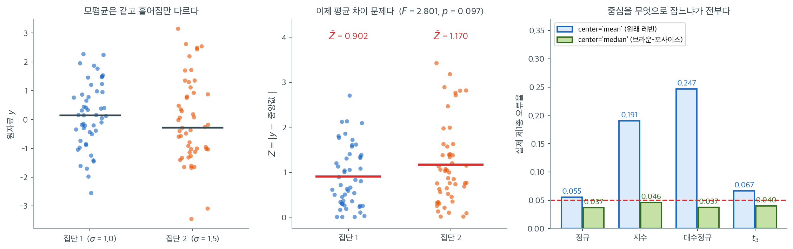

# Levene 검정

!!! note "이 주제를 다루는 다른 곳"
    여기서는 분산분석의 등분산성 가정을 확인하는 용도로 짧게 다룬다. Brown-Forsythe·
    Fligner-Killeen과의 비교를 포함한 논의는 **15.5 로버스트 검정**에 있다.

## 개요

Levene 검정은 둘 이상의 모집단이 같은 분산을 갖는다는 귀무가설을 평가한다. Bartlett 검정이나 등분산 F-검정과 달리 정규성 이탈에 로버스트하여, 실무에서 등분산성을 확인할 때 선호되는 선택이다. 이 페이지에서는 검정통계량을 제시하고, 중심 함수의 선택을 논하며, `scipy.stats.levene`으로 여러 분산비 시나리오에서 검정을 보인다.

## 가설과 검정통계량

표본크기가 $n_1, \dots, n_k$이고 전체 표본크기가 $N = \sum_{i=1}^{k} n_i$인 $k$개 집단을 생각하자. 가설은

$$
H_0: \sigma_1^2 = \sigma_2^2 = \cdots = \sigma_k^2, \qquad H_1: \text{분산이 모두 같지는 않다}
$$

이다. 변환된 변수를

$$
Z_{ij} = |y_{ij} - \tilde{y}_i|
$$

로 정의한다. 여기서 $\tilde{y}_i$는 집단 $i$의 중심 측도(보통 집단 중앙값)이다. Levene 검정통계량은

$$
W = \frac{(N - k)}{(k - 1)} \cdot \frac{\sum_{i=1}^{k} n_i (\bar{Z}_{i\cdot} - \bar{Z}_{\cdot\cdot})^2}{\sum_{i=1}^{k} \sum_{j=1}^{n_i} (Z_{ij} - \bar{Z}_{i\cdot})^2}
$$

이며 $\bar{Z}_{i\cdot}$는 집단 $i$ 안의 $Z_{ij}$ 평균, $\bar{Z}_{\cdot\cdot}$는 모든 $Z_{ij}$의 전체 평균이다. $H_0$ 아래에서 통계량 $W$는 근사적으로 $F(k-1,\, N-k)$ 분포를 따른다.

## 중심의 선택

중심 함수는 검정의 로버스트성과 검정력을 결정한다:

| 중심 | 표기 | 성질 |
|---|---|---|
| 평균 | $\bar{y}_i$ | 원래의 Levene(1960). 정규성 아래에서 가장 강력하지만 이상점에 민감 |
| 중앙값 | $\tilde{y}_i$ | Brown-Forsythe 변형. 치우침과 이상점에 로버스트 |
| 절사평균 | $\bar{y}_i^{(\text{trim})}$ | 검정력과 로버스트성의 절충 |

`scipy.stats.levene`에서는 `center` 인자로 이를 정한다. **기본값은 `'median'`이므로, 아무 인자도 주지 않고 부른 `levene(...)`은 원래의 Levene 검정이 아니라 Brown-Forsythe 변형이다.** 이 책에서 "Levene 검정"이라 적을 때도 실제로 돌아가는 것은 중앙값 기준임을 기억해 두라. 두 선택은 치우친 자료에서 꽤 다른 답을 준다.

<div class="exbox" markdown>

**보기 1.** <span class="diff easy" title="쉬움"></span> 중심을 무엇으로 잡을 것인가. 집단 $i$의 변환값 평균을 $\bar Z_i(c) = \dfrac{1}{n_i}\sum_j |y_{ij} - c|$라 쓰자.

**(1)** 중앙값이 $\sum_j |y_{ij} - c|$를 최소화함을 보이고, 따라서 **어떤 중심 $c$를 쓰더라도 $\bar Z_i(\tilde y_i) \le \bar Z_i(c)$**임을 결론하시오. 특히 중앙값 기준의 $\bar Z_i$는 평균 기준의 것보다 크지 않다.

**(2)** $\sigma = 1.0$과 $1.5$인 두 정규 집단에 세 중심(평균·중앙값·$10\%$ 절사평균)으로 검정을 돌려 (1)의 부등식을 확인하고, 모분산이 같은 **로그정규** 자료에서 두 중심이 얼마나 갈리는지 보시오.

</div>

??? success "풀이"

    **(1) 해석적으로.** 집단 하나만 보면 되므로 첨자를 떼고 자료를 $y_1, \ldots, y_n$이라 하자. 함수

    $$
    g(c) = \sum_{j=1}^{n} |y_j - c|
    $$

    는 절대값의 합이므로 **볼록**이고 조각마다 선형이다. 어떤 $y_j$와도 같지 않은 $c$에서 미분하면

    $$
    g'(c) = \#\{j : y_j < c\} - \#\{j : y_j > c\}
    $$

    이다. $c$를 왼쪽에서 오른쪽으로 옮기면 왼쪽 개수는 늘고 오른쪽 개수는 줄므로 $g'$는 **단조증가**하며, 부호가 음에서 양으로 바뀌는 자리가 바로 왼쪽과 오른쪽의 개수가 뒤집히는 자리, 곧 중앙값이다. 볼록함수의 미분이 음에서 양으로 바뀌는 곳이 최소점이므로

    $$
    \tilde y = \operatorname{median}(y) \in \arg\min_c g(c)
    $$

    이다. ($n$이 짝수면 가운데 두 관측값 사이의 모든 $c$가 같은 값을 주어 최소점이 구간이 되고, `numpy` 의 중앙값은 그 구간의 중점을 고른다. 어느 점을 골라도 $g$의 값은 같다.)

    양변을 $n_i$로 나누면 곧바로

    $$
    \bar Z_i(\tilde y_i) \le \bar Z_i(c) \qquad \text{모든 } c
    $$

    이고, $c = \bar y_i$로 두면 **중앙값 기준의 $\bar Z_i$가 평균 기준의 것보다 크지 않다**는 결론을 얻는다. 자료가 치우쳐 평균과 중앙값이 멀어질수록 두 값의 차이가 커진다.

    주의할 것이 하나 있다. 이 부등식은 **분자인 $\bar Z_i$에 대한 것일 뿐 통계량 $W$에 대한 것이 아니다.** $W$는 집단 간 변동을 집단 내 변동으로 나눈 비이므로, 중심을 바꾸면 분자와 분모가 함께 움직여 어느 쪽이 커질지 일반적으로 정해지지 않는다. 중앙값 기준이 더 좋은 이유는 $W$가 작아지는 데 있지 않고, **$Z$의 분포가 모집단 모양에 덜 흔들리는 데** 있다.

    **(2) 수치적으로.** 먼저 기본값이 정말 `'median'` 인지 함수 서명에서 확인한다.

    ```python
    import inspect

    import numpy as np
    import scipy.stats as stats
    from scipy.stats import levene

    # 기본값이 무엇인지 함수 서명에서 직접 확인한다.
    print("levene 의 center 기본값 =", inspect.signature(levene).parameters["center"].default)

    # 표준편차가 1.0과 1.5로 다른 두 집단
    group1 = stats.norm(0, 1.0).rvs(50, random_state=0)
    group2 = stats.norm(0, 1.5).rvs(50, random_state=1)

    stat, pval = levene(group1, group2, center='median')
    print(f"F = {stat:.4f}, p = {pval:.4f}")

    # 세 중심을 나란히 둔다. 'mean' 이 원래의 Levene(1960), 'median' 이 Brown-Forsythe.
    print(f"\n{'center':>10}{'W':>10}{'p':>9}{'Zbar_1':>9}{'Zbar_2':>9}")
    for center in ("mean", "median", "trimmed"):
        kw = {"proportiontocut": 0.1} if center == "trimmed" else {}
        W, p = levene(group1, group2, center=center, **kw)
        if center == "mean":
            locs = [g.mean() for g in (group1, group2)]
        elif center == "median":
            locs = [np.median(g) for g in (group1, group2)]
        else:
            locs = [stats.trim_mean(g, 0.1) for g in (group1, group2)]
        zbar = [np.abs(g - c).mean() for g, c in zip((group1, group2), locs)]
        print(f"{center:>10}{W:>10.4f}{p:>9.4f}{zbar[0]:>9.4f}{zbar[1]:>9.4f}")

    # (1) 의 부등식: 중앙값이 sum |y - c| 를 최소화하므로 Zbar 는 중앙값에서 가장 작다.
    print("\n중심을 바꿔 가며 group2 의 Zbar 를 재 본다 (중앙값에서 최소여야 한다)")
    med2 = np.median(group2)
    for label, c in [("mean", group2.mean()), ("median", med2),
                     ("median-0.3", med2 - 0.3), ("median+0.3", med2 + 0.3)]:
        print(f"  {label:>12}: c = {c:+.4f}   Zbar = {np.abs(group2 - c).mean():.6f}")

    # 치우친 자료에서는 두 중심이 크게 갈린다. 로그정규 세 집단, 모분산은 모두 같다.
    rng = np.random.default_rng(3)
    g = [np.exp(rng.normal(size=40)) for _ in range(3)]
    print("\n로그정규 세 집단 (모분산 동일)")
    for center in ("mean", "median"):
        W, p = levene(*g, center=center)
        print(f"  center={center:>6}:  W = {W:.4f}   p = {p:.4f}")
    ```

    출력:

    ```
    levene 의 center 기본값 = median
    F = 2.8007, p = 0.0974

        center         W        p   Zbar_1   Zbar_2
          mean    3.3525   0.0701   0.9017   1.1842
        median    2.8007   0.0974   0.9015   1.1695
       trimmed    3.7073   0.0578   0.9016   1.1800

    중심을 바꿔 가며 group2 의 Zbar 를 재 본다 (중앙값에서 최소여야 한다)
              mean: c = -0.0383   Zbar = 1.184206
            median: c = -0.2732   Zbar = 1.169549
        median-0.3: c = -0.5732   Zbar = 1.199370
        median+0.3: c = +0.0268   Zbar = 1.191244

    로그정규 세 집단 (모분산 동일)
      center=  mean:  W = 2.0636   p = 0.1316
      center=median:  W = 0.6888   p = 0.5042
    ```

    **기본값은 `median` 이다.** 그러므로 `levene(group1, group2)`라고만 쓰면 Brown-Forsythe 검정이 돌아간다.

    **(1)의 부등식이 맞는다.** 둘째 집단에서 $\bar Z_2$가 중앙값 기준 $1.169549$, 평균 기준 $1.184206$으로 중앙값 쪽이 작다. 중앙값을 좌우로 $0.3$씩 옮겨 보면 $1.199370$과 $1.191244$로 둘 다 커지므로, 최소점이 정말 중앙값에 있음이 양쪽에서 확인된다. 첫째 집단은 $0.9015$ 대 $0.9017$로 차이가 거의 없는데, 이 표본의 평균과 중앙값이 가까웠기 때문이다.

    **$W$는 부등식을 따르지 않는다.** $3.3525$(평균), $2.8007$(중앙값), $3.7073$(절사평균)으로 중앙값 기준이 가장 작지만 절사평균 기준이 가장 크다. (1)에서 경고한 대로 $W$는 비이므로 분자의 부등식이 그대로 넘어오지 않는다. p-값도 $0.0701$, $0.0974$, $0.0578$로 흩어져 **중심의 선택이 $\alpha = 0.05$ 근처에서는 결론을 바꿀 수 있는 크기**임을 보여 준다.

    로그정규 줄이 왜 기본값을 중앙값으로 두는지 말해 준다. 모분산이 **정확히 같은** 세 집단인데 평균 기준은 $W = 2.0636$, $p = 0.1316$을 주고 중앙값 기준은 $W = 0.6888$, $p = 0.5042$를 준다. 표본 하나로 수준을 논할 수는 없지만, 아래 그림의 모의실험에서 평균 기준의 실제 오류율이 로그정규에서 $0.247$까지 가고 중앙값 기준은 $0.037$–$0.046$에 머무는 것이 같은 현상이다. 치우친 분포에서는 평균이 긴 꼬리로 끌려가 몇몇 $|y - \bar y|$가 과장되고, 그 과장이 표본마다 요동친다.

    마지막으로 검정력에 대해. 표준편차가 $1.5$배 차이 나는데도 집단당 50개로는 $5\%$ 수준에서 기각하지 못했다($p = 0.0974$). **등분산 검정의 검정력은 대체로 낮다.**

이제 분산비를 조금씩 키워 가며 검정이 어떻게 반응하는지 본다. 씨앗을 고정하면 통계량이 닫힌 꼴로 적힌다.

<div class="exbox" markdown>

**보기 2.** <span class="diff easy" title="쉬움"></span> Levene 검정. $X \sim N(0,1)$과 $\sigma_Y \in \{1.00, 1.05, 1.10, 1.15, 1.20\}$인 $Y \sim N(1, \sigma_Y^2)$을 집단당 $n = 100$, 같은 씨앗으로 생성한다.

**(1)** 씨앗이 고정되어 있을 때 $Z$값이 $Z_{1j} = a_j$, $Z_{2j} = \sigma_Y a_j$ ($a_j = |z_j - \tilde z|$)로 적힘을 보이고, 이를 써서

$$
W(\sigma_Y) = C \cdot \frac{(\sigma_Y - 1)^2}{1 + \sigma_Y^2},
\qquad
C = \frac{(n-1)\, n\, \bar a^2}{\sum_j (a_j - \bar a)^2}
$$

임을 유도하시오. $\sigma_Y = 1$에서 $W = 0$이 되는 까닭도 밝히시오.

**(2)** 검정을 실행해 이 식이 맞는지 확인하고, $p = 0.05$가 되는 $\sigma_Y$를 구하시오.

</div>

??? success "풀이"

    **(1) 해석적으로.** 같은 씨앗에서 `norm(loc, scale).rvs` 는 같은 표준정규열 $z_1, \ldots, z_n$을 꺼내 쓰므로 $x_j = z_j$, $y_j = 1 + \sigma_Y z_j$다. 중앙값은 선형변환과 교환되므로 $\tilde y = 1 + \sigma_Y \tilde z$이고, $\sigma_Y > 0$이므로

    $$
    Z_{2j} = |y_j - \tilde y| = |\sigma_Y (z_j - \tilde z)| = \sigma_Y |z_j - \tilde z| = \sigma_Y a_j
    $$

    이다. 한편 $Z_{1j} = |x_j - \tilde x| = a_j$다. **두 집단의 $Z$가 같은 수열의 배율판**이라는 것이 모든 것을 결정한다.

    이제 $W$에 넣는다. $\bar Z_1 = \bar a$, $\bar Z_2 = \sigma_Y \bar a$이고 두 집단 크기가 같으므로 전체 평균은 $\bar Z_{\cdot\cdot} = \frac{1+\sigma_Y}{2}\bar a$다. 집단 간 제곱합은

    $$
    \sum_i n_i (\bar Z_i - \bar Z_{\cdot\cdot})^2
    = n\bar a^2\left[\left(\frac{1-\sigma_Y}{2}\right)^2 + \left(\frac{\sigma_Y-1}{2}\right)^2\right]
    = \frac{n\bar a^2 (\sigma_Y-1)^2}{2}
    $$

    이다. 집단 내 제곱합은 $S_a = \sum_j (a_j - \bar a)^2$라 두면

    $$
    \sum_{i}\sum_j (Z_{ij} - \bar Z_i)^2 = S_a + \sigma_Y^2 S_a = (1+\sigma_Y^2)\,S_a
    $$

    이다. $k = 2$, $N = 2n$이므로 앞의 계수는 $(N-k)/(k-1) = 2n-2$이고

    $$
    W = (2n-2) \cdot \frac{n\bar a^2 (\sigma_Y-1)^2 / 2}{(1+\sigma_Y^2) S_a}
    = \underbrace{\frac{(n-1)\,n\,\bar a^2}{S_a}}_{C} \cdot \frac{(\sigma_Y-1)^2}{1+\sigma_Y^2}
    $$

    을 얻는다. **$\bar a^2/S_a$만 자료에 의존하고 $\sigma_Y$의 역할은 $(\sigma_Y-1)^2/(1+\sigma_Y^2)$ 한 덩어리에 갇힌다.**

    $\sigma_Y = 1$에서 $W = 0$인 까닭이 이제 분명하다. 그때 두 집단의 $Z$가 **한 치도 다르지 않은 같은 수열**이므로 집단 간 제곱합이 정확히 $0$이다. 평균만 $1$만큼 다른 자료인데, Levene 검정은 중심으로부터의 절대편차만 보므로 그 차이를 아예 보지 못한다. $F(1, 198)$에서 $W = 0$의 양측 꼬리 확률은 $1$이므로 p-값이 정확히 $1.000$으로 찍힌다.

    **(2) 수치적으로.** 다섯 $\sigma_Y$에 검정을 돌리고 식과 맞춰 본다.

    ```python
    import numpy as np
    import scipy.stats as stats

    seed, size = 1, 100
    x = stats.norm(loc=0, scale=1).rvs(size, random_state=seed)

    for scale in [1.00, 1.05, 1.10, 1.15, 1.20]:
        y = stats.norm(loc=1, scale=scale).rvs(size, random_state=seed)
        stat, pval = stats.levene(x, y)
        print(f"sigma_y={scale:.2f}: F={stat:.2f}, p={pval:.3f}")
    ```

    출력:

    ```
    sigma_y=1.00: F=0.00, p=1.000
    sigma_y=1.05: F=0.20, p=0.652
    sigma_y=1.10: F=0.78, p=0.379
    sigma_y=1.15: F=1.67, p=0.198
    sigma_y=1.20: F=2.82, p=0.095
    ```

    식을 쓰려면 $C$를 자료에서 한 번 계산해 두면 된다.

    ```python
    import scipy.optimize as opt

    a = np.abs(x - np.median(x))
    C = (size - 1) * size * a.mean() ** 2 / ((a - a.mean()) ** 2).sum()
    print(f"C = {C:.5f}")

    print(f"\n{'sigma_y':>8}{'levene':>12}{'공식':>12}{'p':>9}")
    for scale in [1.00, 1.05, 1.10, 1.15, 1.20]:
        y = stats.norm(loc=1, scale=scale).rvs(size, random_state=seed)
        W, p = stats.levene(x, y)
        W_formula = C * (scale - 1) ** 2 / (1 + scale ** 2)
        print(f"{scale:>8.2f}{W:>12.6f}{W_formula:>12.6f}{p:>9.4f}")

    # p = 0.05 가 되는 sigma 를 공식을 거꾸로 풀어 찾는다. 격자 탐색이 아니다.
    crit = stats.f(1, 2 * size - 2).ppf(0.95)
    root = opt.brentq(lambda s: C * (s - 1) ** 2 / (1 + s ** 2) - crit, 1.0001, 5.0)
    print(f"\n임계값 F_0.95(1,198) = {crit:.4f}")
    print(f"W = 임계값이 되는 sigma_y = {root:.4f}")
    print(f"sigma_y -> inf 에서 W 의 상한 = C = {C:.4f}  (해가 존재할 조건)")
    ```

    출력:

    ```
    C = 171.94090

     sigma_y      levene          공식        p
        1.00    0.000000    0.000000   1.0000
        1.05    0.204448    0.204448   0.6516
        1.10    0.778013    0.778013   0.3788
        1.15    1.665735    1.665735   0.1983
        1.20    2.818703    2.818703   0.0947

    임계값 F_0.95(1,198) = 3.8889
    W = 임계값이 되는 sigma_y = 1.2395
    sigma_y -> inf 에서 W 의 상한 = C = 171.9409  (해가 존재할 조건)
    ```

    **유도한 식과 `scipy.stats.levene` 의 값이 소수점 여섯째 자리까지 같다.** 근사가 아니라 등식이다.

    $p = 0.05$ 경계는 $\sigma_Y = 1.2395$다. 격자의 마지막 값 $1.20$은 그에 못 미치므로 기각되지 않으며, 이것이 $p = 0.095$의 정체다. 경계를 구할 때 격자를 훑지 않고 식을 거꾸로 푼 것에 유의하라. 격자를 훑는다면 $\{1.00, \ldots, 1.20\}$ 안에 조건을 만족하는 칸이 **하나도 없으므로** 답이 없다고 해야 한다. $W(\sigma_Y)$가 $\sigma_Y \to \infty$에서 $C = 171.94$로 유계이므로 임계값 $3.8889$보다 커질 수 있고 해가 존재한다는 것도 함께 확인해 두었다.

    [등분산 F-검정](f_test_equality_of_variances.md)의 같은 경계가 $\sigma_Y^* = 1.2191$이었다. **정확한 정규성 아래에서는 Levene이 조금 덜 민감하다**는 말의 정량적 표현이며, 그 대가로 얻는 것이 비정규성 아래의 올바른 오류율이다.

표로 정리하면:

| $\sigma_Y$ | $W$ | p-값 |
|---|---|---|
| 1.00 | 0.00 | 1.000 |
| 1.05 | 0.20 | 0.652 |
| 1.10 | 0.78 | 0.379 |
| 1.15 | 1.67 | 0.198 |
| 1.20 | 2.82 | 0.095 |

## 해석

- $\sigma_Y = 1.00$이면 분산이 같고 검정은 작은 $W$와 큰 p-값을 주어 $H_0$을 올바르게 유지한다.
- $\sigma_Y$가 커질수록 $Y$ 집단의 절대편차가 $X$ 집단에 비해 커져 $W$가 커지고 p-값이 작아진다.
- 같은 자료에 대한 Bartlett 검정과 비교하면(같은 조건에서 Bartlett은 $\sigma_Y = 1.20$에서 $p = 0.071$, Levene은 $p = 0.095$) 정확한 정규성 아래에서 Levene이 조금 덜 강력하지만, 비정규성 아래에서 올바른 제1종 오류율을 유지한다.

Levene 검정이 하는 일은 그림 한 장으로 요약된다. **분산 문제를 평균 문제로 바꾸는 것**이다.



왼쪽은 보기 1의 원자료다. 두 집단의 모평균은 모두 $0$이고 $\sigma$만 $1.0$과 $1.5$로 다르다. 이 상태로는 "평균 차이"를 재는 어떤 도구도 쓸 수 없다. 가운데가 변환 뒤의 모습이다. 각 관측값을 자기 집단 중앙값으로부터의 거리 $Z_{ij} = |y_{ij} - \tilde{y}_i|$로 바꾸면, 흩어짐이 큰 집단의 $Z$가 체계적으로 커진다. 실제로 $\bar{Z}_1 = 0.902$, $\bar{Z}_2 = 1.170$이다. **이제 "분산이 같은가"라는 질문이 "$\bar{Z}$가 같은가"라는 평범한 평균 비교로 바뀌었다.**

그래서 $Z$에 그냥 일원배치 분산분석을 돌리면 된다. 실제로 돌려 보면 $F = 2.801$, $p = 0.097$로 위 `levene(...)`가 준 값과 **소수점 넷째 자리까지 같다.** 연습문제 1이 묻는 "$W$가 변환된 자료의 $F$-통계량인 이유"가 이것이다. 새로운 분포도, 새로운 표를 찾아볼 일도 없다. 이미 가진 도구를 다른 자료에 적용했을 뿐이다.

오른쪽은 중심을 무엇으로 잡느냐가 왜 결정적인지를 보여 준다. 모분산이 정확히 같은 세 집단($n = 20$)에서 6,000번씩 검정했다. **평균을 중심으로 쓰면** 정규에서는 $0.055$로 괜찮지만 지수분포에서 $0.191$, 대수정규에서 $0.247$로 무너진다. 치우친 분포에서는 평균이 긴 꼬리 쪽으로 끌려가 몇몇 관측값의 $|y - \bar{y}|$가 과장되고, 그 과장의 크기가 표본마다 요동치기 때문이다. **중앙값으로 바꾸면** 네 분포 모두에서 $0.037$–$0.046$로 안정된다. 중앙값은 꼬리에 끌려가지 않으므로 $Z$의 분포가 분포 모양에 덜 민감해진다.

이것이 `scipy.stats.levene`의 기본값이 `center='median'`인 이유이고, 그 변형을 원저자와 구별해 **브라운–포사이스**라 부르는 이유이기도 하다. 위 바틀렛 검정이 대수정규에서 $0.673$까지 갔던 것과 견주면, 중심 하나를 바꾸는 것만으로 얻는 안정성이 얼마나 큰지 알 수 있다.

Levene 검정은 고전적 분산분석을 수행하기 전의 표준적인 사전 확인이다. 기각되면 Welch 분산분석이나 다른 이분산 로버스트 절차로 옮겨야 한다.

## 연습문제

<div class="drillbox" markdown>

**연습문제 1.** <span class="diff med" title="중간"></span>
$n_1 = n_2 = 50$인 두 집단에서 Levene 검정통계량 $W$가 사실상 변환된 자료 $Z_{ij}$에 적용한 일원배치 분산분석 F-통계량인 이유를 직관적으로 설명하라.

</div>

??? success "풀이"
    Levene 검정은 각 관측값 $y_{ij}$를 집단 중심으로부터의 절대편차 $Z_{ij} = |y_{ij} - \tilde{y}_i|$로 바꾼다. 집단 분산이 같다면 이 절대편차들의 평균이 집단마다 비슷해야 한다. 한 집단의 분산이 크면 그 집단의 절대편차가 체계적으로 커져 집단 평균 $\bar{Z}_{i\cdot}$가 높아진다.

    검정통계량 $W$는 $Z_{ij}$ 값에서 집단 간 변동과 집단 내 변동의 비를 재는데, 이는 변환된 자료에 적용한 일원배치 분산분석 F-통계량과 정확히 같다. $W$가 크면 절대편차의 집단 평균이 우연으로 기대되는 것보다 많이 다르다는 뜻이며 등분산에 반하는 증거가 된다.

<div class="drillbox" markdown>

**연습문제 2.** <span class="diff med" title="중간"></span>
어떤 자료에 표본크기 $(15, 15, 15)$인 세 집단이 있고 자료가 근사적으로 정규이다. Levene 검정과 Bartlett 검정 중 무엇을 권하겠는가? 표본크기가 $(15, 15, 200)$이라면?

</div>

??? success "풀이"
    근사적 정규성을 갖는 균형 잡힌 경우에는 정확한 정규성 아래에서 균일최강력 검정인 Bartlett 검정이 조금 더 강력하다. 다만 Levene 검정도 잘 작동하며 더 안전한 기본 선택이다.

    불균형인 $(15, 15, 200)$의 경우에는 정규성이 성립해도 Levene 검정이 선호된다. 심하게 불균형한 설계에서는 합동분산 $S_p^2$이 큰 집단에 의해 지배되고, 어느 집단에서든 정규성에서 조금만 벗어나도 검정통계량이 부풀 수 있어 Bartlett 검정이 불안정하게 행동할 수 있다. 중앙값 기반의 Levene 접근이 불균형과 분포 문제 모두에 더 로버스트하다.

<div class="drillbox" markdown>

**연습문제 3.** <span class="diff med" title="중간"></span>
모든 집단의 모든 관측값이 같은 값을 가지면(즉 집단 내 분산이 0이면) $W = 0$임을 증명하라.

</div>

??? success "풀이"
    집단 $i$의 모든 관측값이 같은 값 $c_i$라면 집단 중앙값은 $\tilde{y}_i = c_i$이고 모든 $i, j$에 대해

    $$
    Z_{ij} = |y_{ij} - \tilde{y}_i| = |c_i - c_i| = 0
    $$

    이다. 따라서 모든 집단에서 $\bar{Z}_{i\cdot} = 0$이고 $\bar{Z}_{\cdot\cdot} = 0$이다. $W$의 분자는

    $$
    \sum_{i=1}^{k} n_i (0 - 0)^2 = 0
    $$

    이 되므로 분모와 무관하게 $W = 0$이다(분모도 0이지만, 변동이 전혀 없으면 $H_0$에 반하는 증거도 없다고 보는 것이 관례이다). $\square$

<div class="drillbox" markdown>

**연습문제 4.** <span class="diff med" title="중간"></span>
세 집단 비교에서 Levene 검정이 $p = 0.03$을 주었다. 연구자는 고전적 일원배치 분산분석을 진행하여 집단 평균에 대해 $p = 0.04$를 얻었다. 이 접근을 비평하고 대안을 제시하라.

</div>

??? success "풀이"
    연구자는 등분산 가정의 위반을 확인해 놓고(Levene의 $p = 0.03 < 0.05$) 바로 그 가정을 요구하는 절차를 썼다. 분산이 다를 때, 특히 설계가 불균형할 때 고전적 분산분석 F-검정은 믿을 수 없다. 실제 제1종 오류율이 명목 $\alpha$보다 상당히 높거나 낮을 수 있다.

    올바른 접근은 등분산을 가정하지 않는 Welch 분산분석(`pingouin.welch_anova`)을 쓰는 것이다. SciPy에는 이분산 상황을 위한 관련 검정으로 `scipy.stats.alexandergovern`이 있다. 사후비교에서는 Tukey HSD 대신 분산 차이를 반영하는 Games-Howell을 써야 한다.

<div class="drillbox" markdown>

**연습문제 5.** <span class="diff hard" title="어려움"></span>
$Z_{ij}$ 값에 적용한 일원배치 분산분석 F-통계량의 성질로부터 $H_0$ 아래 $W$의 근사 분포를 유도하라.

</div>

??? success "풀이"
    $H_0: \sigma_1^2 = \cdots = \sigma_k^2$ 아래에서 각 집단의 흩어짐이 같으므로 절대편차 $Z_{ij} = |y_{ij} - \tilde{y}_i|$의 기댓값이 모든 집단에서 같다. $Z_{ij}$ 값은 정확히 정규는 아니지만 표본크기가 어느 정도 되면 중심극한정리에 의해 집단 평균 $\bar{Z}_{i\cdot}$가 근사적으로 정규를 따른다.

    통계량 $W$는 $Z_{ij}$ 값에 대해 계산한 표준 일원배치 분산분석 F-통계량이다. 귀무가설(집단 사이 $Z_{ij}$의 평균이 같음) 아래에서 이 F-통계량은 근사적으로 $F(k-1, N-k)$를 따른다. 표본크기가 클수록 근사가 좋아진다. 핵심은 $Z_{ij}$가 (구성상 음이 아니어서) 정규가 아니더라도 집단 표본크기가 너무 작지만 않으면 평균제곱의 비가 F-분포로 수렴한다는 점이다.

<div class="drillbox" markdown>

**연습문제 6.** <span class="diff med" title="중간"></span>
연습문제 1의 직관을 **코드로 확인**하라. 레빈 통계량이 정말 $|Z_{ij}|$에 대한 분산분석 $F$인지 `scipy`와 대조하라.

</div>

??? success "풀이"
    ```python
    import numpy as np
    from scipy import stats

    def levene_manual(groups, center="median"):
        """레빈 검정 = |관측 - 중심| 에 대한 일원배치 분산분석."""
        c = np.median if center == "median" else np.mean
        Z = [np.abs(g - c(g)) for g in groups]
        return stats.f_oneway(*Z)

    rng = np.random.default_rng(1212)
    gs = [rng.normal(0, 1, 12), rng.normal(0, 1.8, 15), rng.normal(0, 2.5, 10)]
    for c in ["mean", "median"]:
        m = levene_manual(gs, c)
        s = stats.levene(*gs, center=c)
        print(f"  center={c:7s}  자작 F = {m.statistic:.8f}, p = {m.pvalue:.8f}")
        print(f"  {'':15s}  scipy F = {s.statistic:.8f}, p = {s.pvalue:.8f}")
    ```

    ```text
      center=mean     자작 F = 3.13477119, p = 0.05630381
                       scipy F = 3.13477119, p = 0.05630381
      center=median   자작 F = 3.05861559, p = 0.06005033
                       scipy F = 3.05861559, p = 0.06005033
    ```

    **소수점 여덟 자리까지 일치한다.** 레빈 검정은 **새로운 통계량이 아니라 자료를 바꾼 뒤의 분산분석**이다.

    **아이디어의 우아함.**

    | 원 자료 | 변환 후 |
    |---|---|
    | 관심사: **분산**의 차이 | 관심사: **평균**의 차이 |
    | 도구가 마땅치 않다 | **분산분석**을 그대로 쓴다 |

    $|y_{ij}-c_i|$는 **집단 $i$의 산포를 재는 관측 단위의 양**이다. 그 평균이 집단마다 다르면 산포가 다르다는 뜻이다.

    **이 발상의 다른 응용.**

    | 검정 | 변환 |
    |---|---|
    | 레빈 | $\lvert y-\bar y_i\rvert$ |
    | **브라운-포사이드** | $\lvert y-\text{med}_i\rvert$ |
    | 모드 검정 | $(y-\bar y_i)^2$ |
    | 앤사리-브래들리 | 순위 기반 산포 점수 |

    **제곱을 쓰지 않는 이유.** $(y-\bar y_i)^2$을 쓰면 **바틀렛과 비슷한 문제**가 생긴다. 제곱이 꼬리를 키워 4차 적률에 민감해진다. **절댓값이 훨씬 로버스트**하다.

    **한계 하나.** 변환된 $|Z_{ij}|$는 **정규가 아니다**(0에서 잘린 반정규에 가깝다). 그래서 $F$ 근사가 정확하지 않고, 그 결과 **명목 수준을 정확히 지키지 못한다**(연습문제 7에서 확인).

<div class="drillbox" markdown>

**연습문제 7.** <span class="diff hard" title="어려움"></span>
`scipy.stats.levene`의 `center` 선택지 셋(`mean`, `median`, `trimmed`)을 **오류율과 검정력으로** 비교하라.

</div>

??? success "풀이"
    ```python
    import numpy as np
    from scipy import stats

    rng = np.random.default_rng(1212)
    B = 8_000
    print("분산이 실제로 같음, k=3, n=20, 명목 0.05")
    print(f"{'분포':>20s} {'mean':>8s} {'median':>8s} {'trimmed(0.1)':>13s}")
    for lab, f in {"정규": lambda n: rng.normal(0, 1, n),
                   "t(5)": lambda n: rng.standard_t(5, n),
                   "지수": lambda n: rng.exponential(1, n),
                   "로그정규": lambda n: np.exp(rng.normal(0, 1, n)),
                   "균등": lambda n: rng.uniform(-1, 1, n)}.items():
        a = b = c = 0
        for _ in range(B):
            gs = [f(20) for _ in range(3)]
            a += stats.levene(*gs, center="mean").pvalue < 0.05
            b += stats.levene(*gs, center="median").pvalue < 0.05
            c += stats.levene(*gs, center="trimmed",
                              proportiontocut=0.1).pvalue < 0.05
        print(f"{lab:>20s} {a / B:8.4f} {b / B:8.4f} {c / B:13.4f}")

    a = b = c = 0
    for _ in range(B):
        gs = [rng.normal(0, 1, 20), rng.normal(0, 1, 20), rng.normal(0, 2, 20)]
        a += stats.levene(*gs, center="mean").pvalue < 0.05
        b += stats.levene(*gs, center="median").pvalue < 0.05
        c += stats.levene(*gs, center="trimmed", proportiontocut=0.1).pvalue < 0.05
    print(f"{'검정력 정규 σ=(1,1,2)':>20s} {a / B:8.4f} {b / B:8.4f} {c / B:13.4f}")
    ```

    ```text
    분산이 실제로 같음, k=3, n=20, 명목 0.05
                      분포     mean   median  trimmed(0.1)
                      정규   0.0517   0.0319        0.1424
                    t(5)   0.0566   0.0362        0.1646
                      지수   0.1850   0.0466        0.3031
                    로그정규   0.2409   0.0341        0.3713
                      균등   0.0553   0.0267        0.1356
        검정력 정규 σ=(1,1,2)   0.8125   0.7649        0.7814
    ```

    **`median`(브라운-포사이드)이 유일하게 안전하다**(0.027~0.047).

    | center | 정규 | 로그정규 | 검정력 |
    |---|---|---|---|
    | `mean` | 0.052 | **0.241** | 0.813 |
    | **`median`** | 0.032 | **0.034** | 0.765 |
    | `trimmed` | **0.142** | **0.371** | 0.781 |

    **`mean`은 치우친 분포에서 무너진다**(0.241). 평균이 꼬리에 끌려가 $|y-\bar y|$가 비대칭해지기 때문이다.

    **`trimmed`가 정규에서도 0.142로 가장 나쁘다.** 이유는 `scipy`의 구현에 있다.

    ```text
    center='trimmed' 일 때 scipy 는
      1. 표본 자체를 양끝에서 proportiontocut 만큼 잘라 내고
      2. 남은 자료의 평균을 중심으로 쓴다
    ```

    **꼬리를 잘라 버리면 산포 정보가 사라진다.** 남은 관측들의 $|Z|$가 인위적으로 작고 균일해져 집단 간 작은 차이도 크게 보인다. `proportiontocut`을 키우면 오류율이 단조롭게 커진다(0.05에서 0.10, 0.25에서 0.24).

    **`median`의 보수성이 유일한 대가다**(정규에서 0.032, 균등에서 0.027). 검정력도 0.765로 `mean`의 0.813보다 6% 낮다. **그러나 이것은 값싼 보험료**다.

    **권고 셋.**

    1. **`scipy.stats.levene`의 기본값을 그대로 쓴다**(`center="median"`).
    2. **`center="mean"`은 정규성을 확신할 때만.**
    3. **`center="trimmed"`는 쓰지 않는다.** 적어도 `scipy`의 현재 구현으로는 그렇다.

    **문헌의 권고와도 맞는다.** 브라운·포사이드(1974)는 치우친 분포에 중앙값, 두꺼운 꼬리에 절사평균을 권했지만, 그들의 절사는 **중심만 절사평균으로 쓰고 자료는 그대로 두는** 방식이었다. **구현의 차이가 결과를 뒤바꾼다.**

<div class="drillbox" markdown>

**연습문제 8.** <span class="diff med" title="중간"></span>
연습문제 2의 두 상황 $(15,15,15)$와 $(15,15,200)$에서 바틀렛과 브라운-포사이드를 **실제로 비교**하라.

</div>

??? success "풀이"
    ```python
    import numpy as np
    from scipy import stats

    rng = np.random.default_rng(3434)
    B = 6_000
    print("분산이 실제로 같음, 명목 0.05")
    for lab, ns in [("(15,15,15)", [15, 15, 15]),
                    ("(15,15,200)", [15, 15, 200])]:
        for dl, f in [("정규", lambda n: rng.normal(0, 1, n)),
                      ("t(5)", lambda n: rng.standard_t(5, n))]:
            a = b = 0
            for _ in range(B):
                gs = [f(n) for n in ns]
                a += stats.bartlett(*gs).pvalue < 0.05
                b += stats.levene(*gs, center="median").pvalue < 0.05
            print(f"  n={lab:12s} {dl:5s}  바틀렛 {a / B:.4f}   "
                  f"브라운-포사이드 {b / B:.4f}")
    ```

    ```text
    분산이 실제로 같음, 명목 0.05
      n=(15,15,15)   정규     바틀렛 0.0465   브라운-포사이드 0.0288
      n=(15,15,15)   t(5)   바틀렛 0.2018   브라운-포사이드 0.0333
      n=(15,15,200)  정규     바틀렛 0.0555   브라운-포사이드 0.0487
      n=(15,15,200)  t(5)   바틀렛 0.2075   브라운-포사이드 0.0430
    ```

    **불균형은 두 검정 모두에 큰 영향을 주지 않는다.**

    | 설계 | 분포 | 바틀렛 | 브라운-포사이드 |
    |---|---|---|---|
    | $(15,15,15)$ | 정규 | 0.047 | 0.029 |
    | $(15,15,15)$ | $t(5)$ | **0.202** | 0.033 |
    | $(15,15,200)$ | 정규 | 0.056 | 0.049 |
    | $(15,15,200)$ | $t(5)$ | **0.208** | 0.043 |

    **결정적인 변수는 불균형이 아니라 분포**다. $t(5)$에서 바틀렛은 두 설계 모두 0.20이다.

    **그런데 불균형이 브라운-포사이드에는 도움이 된다**(0.029 → 0.049). 균형 설계에서 보수적이던 것이 불균형에서 명목에 가까워진다. $n=200$ 집단이 $|Z|$의 분포를 안정시키기 때문이다.

    **연습문제 2의 답.** 두 경우 모두 **브라운-포사이드**를 권한다.

    | 상황 | 답 |
    |---|---|
    | $(15,15,15)$, 근사 정규 | **브라운-포사이드**(바틀렛도 무방하나 정규성 확신 필요) |
    | $(15,15,200)$ | **브라운-포사이드**(차이가 더 분명) |

    **"근사적으로 정규"라는 단서가 위험하다.** $t(5)$는 눈으로 보면 정규와 크게 다르지 않은데도 바틀렛의 오류율이 네 배다. **정규성을 눈으로 확인했다는 것이 바틀렛을 정당화하지 못한다.**

    **큰 집단 하나가 끼어 있을 때의 또 다른 문제.** $n=200$ 집단의 $s^2$은 매우 정밀하고 $n=15$ 집단들은 매우 부정확하다. 검정이 유의해도 **어느 집단이 다른지**는 알 수 없으므로, 반드시 **집단별 $s_i$ 표를 함께** 본다.

<div class="drillbox" markdown>

**연습문제 9.** <span class="diff med" title="중간"></span>
연습문제 4의 연구자가 **"레빈이 유의하지 않았으니 등분산"**이라고 결론지었다면 어땠을까? 브라운-포사이드의 검정력을 재어 판단하라.

</div>

??? success "풀이"
    ```python
    import numpy as np
    from scipy import stats

    rng = np.random.default_rng(5656)
    B = 6_000
    print("정규, k=3, σ=(1, 1, r), 브라운-포사이드의 검정력")
    print(f"{'r':>5s} " + " ".join(f"{'n=' + str(n):>8s}" for n in [10, 20, 50, 100]))
    for r in [1.5, 2.0, 3.0]:
        row = []
        for n in [10, 20, 50, 100]:
            a = sum(stats.levene(rng.normal(0, 1, n), rng.normal(0, 1, n),
                                 rng.normal(0, r, n)).pvalue < 0.05
                    for _ in range(B))
            row.append(a / B)
        print(f"{r:5.1f} " + " ".join(f"{x:8.4f}" for x in row))
    ```

    ```text
    정규, k=3, σ=(1, 1, r), 브라운-포사이드의 검정력
        r     n=10     n=20     n=50    n=100
      1.5   0.1290   0.3255   0.7697   0.9763
      2.0   0.3700   0.7703   0.9965   1.0000
      3.0   0.7462   0.9897   1.0000   1.0000
    ```

    **$n=20$에서 $\sigma$비 1.5(분산비 2.25)를 잡을 확률이 0.33**이다. **셋 중 둘은 놓친다.**

    | $\sigma$ 비 | 분산비 | $n=20$ | $n=50$ |
    |---|---|---|---|
    | 1.5 | 2.25 | **0.326** | 0.770 |
    | 2.0 | 4.0 | 0.770 | 0.997 |
    | 3.0 | 9.0 | 0.990 | 1.000 |

    **"유의하지 않음"은 "등분산"이 아니다.** $n=20$에서 $p>0.05$가 나왔다면

    - 분산비가 2.25인데 놓쳤을 확률 **67%**
    - 분산비가 4인데 놓쳤을 확률 **23%**

    이다. 그리고 **분산비 4는 $F$ 검정의 오류율을 0.29까지 올리는 수준**이다(가정 개요 연습문제 5).

    **그래서 연습문제 4의 상황은 두 방향 모두 문제다.**

    | 결과 | 잘못된 결론 | 올바른 대응 |
    |---|---|---|
    | 레빈 $p=0.03$ | "이분산이니 웰치" | 웰치는 맞지만 **이유가 틀렸다** |
    | 레빈 $p=0.30$ | **"등분산이니 표준 $F$"** | **검정력 부족일 수 있다** |

    **두 결과 모두에서 답이 같다 — 웰치를 쓴다.** 검정 결과와 무관하게 웰치를 쓰면 이 딜레마가 사라진다.

    **등분산을 "증명"하려면 동등성 검정이 필요하다.** "분산비가 $[1/1.5,\ 1.5]$ 안에 있다"를 보이려면 $n$이 수백 개 필요하다. **실무에서 거의 불가능**하다.

    **그럼 레빈 검정은 무엇에 쓰나.**

    | 목적 | 적합한가 |
    |---|---|
    | 방법 선택의 스위치 | **아니다**(사전검정의 역설) |
    | 등분산의 증명 | **아니다**(검정력 부족) |
    | **자료를 이해하는 단서** | **그렇다** |
    | 보고서의 서술적 근거 | 그렇다(집단별 $s_i$와 함께) |

    **보고 방식.** "브라운-포사이드 검정에서 $p=0.30$이었으나 $n=20$에서 이 검정의 검정력은 분산비 2.25에 대해 0.33에 불과하므로, 등분산을 가정하지 않는 웰치 분산분석을 사용했다."

<div class="drillbox" markdown>

**연습문제 10.** <span class="diff easy" title="쉬움"></span>
레빈 검정의 **사용 지침**을 정리하라.

</div>

??? success "풀이"
    **한 줄 정의.** **중심으로부터의 절대편차에 대한 일원배치 분산분석**이다.

    $$
    Z_{ij}=|y_{ij}-c_i|,
    \qquad
    W=\frac{\text{MSB}(Z)}{\text{MSW}(Z)}
    $$

    **중심 $c_i$의 선택이 곧 검정의 이름**이다.

    | $c_i$ | 이름 | 정규에서 | 비정규에서 |
    |---|---|---|---|
    | $\bar y_i$ | 레빈(원형) | 0.052 | **0.241** |
    | **$\text{med}_i$** | **브라운-포사이드** | 0.032 | **0.034** |
    | 절사평균 | — | **0.142**(scipy) | 0.371 |

    **핵심 수치 넷.**

    | 사실 | 값 |
    |---|---|
    | 로그정규에서 `center="mean"` | **0.241** |
    | 같은 상황 `center="median"` | 0.034 |
    | 정규에서 `center="trimmed"` | **0.142** |
    | $n=20$에서 분산비 2.25의 검정력 | **0.33** |

    **사용 지침 다섯.**

    1. **`scipy.stats.levene`의 기본값**(`center="median"`)을 쓴다.
    2. **집단별 $s_i$ 표를 항상 함께** 본다. $p$만으로는 크기를 알 수 없다.
    3. **검정 결과로 분산분석 방법을 고르지 않는다.** 처음부터 웰치를 쓴다.
    4. **"유의하지 않음"을 등분산의 근거로 삼지 않는다.**
    5. **정규성이 보장되고 검정력이 최우선이면** 바틀렛을 고려한다.

    **바틀렛과의 비교.**

    | | 바틀렛 | 브라운-포사이드 |
    |---|---|---|
    | 원리 | 로그 분산의 우도비 | 절대편차의 분산분석 |
    | 정규에서 | **최강력** | $-6\%$ |
    | $t(5)$에서 | 0.20 | **0.033** |
    | 로그정규에서 | 0.67 | **0.037** |
    | 권장 | 정규 보장 시만 | **기본값** |

    **자주 하는 실수 넷.**

    | 실수 | 결과 |
    |---|---|
    | `center="mean"`을 치우친 자료에 | 거짓 양성 0.24 |
    | `center="trimmed"` 사용 | 거짓 양성 0.14 |
    | 유의 → 웰치 분기 | 사전검정의 역설 |
    | 비유의 → "등분산" | 검정력이 0.33일 수 있다 |

    **보고 형식.**

    ```text
    집단별 표준편차: 1.17, 1.09, 2.31  (비 2.1배)
    브라운-포사이드 검정: W = 5.42, p = 0.007
    → 등분산을 가정하지 않고 웰치 분산분석 + 게임스-하웰 사후검정
    ```

    **한 문장.** 레빈 검정은 **분산분석의 도구를 산포에 재활용한 영리한 장치**이며, 중심을 **중앙값으로 잡을 때만** 그 영리함이 실제로 작동한다.

---

## 정리하며

레빈 검정이 **등분산 확인의 실무 표준**이다.

- **발상이 단순하다.** 각 관측을 집단 중심으로부터의 **절대편차**로 바꾼 뒤, 그 값들에 일원배치 분산분석을 돌린다. 분산의 문제를 평균의 문제로 옮기는 것이다.
- **중심을 무엇으로 잡느냐가 강건성을 정한다.** 평균을 쓰면 원래의 레빈, **중앙값을 쓰면 브라운–포사이드**이며 후자가 치우친 분포에서 훨씬 안정적이다. `scipy.stats.levene` 의 기본값이 중앙값(`center='median'`)이다.
- **정규성에 민감하지 않다.** 바틀렛과 결정적으로 다른 점이며, 그래서 실무에서 선호된다.
- **표본이 크면 사소한 차이도 기각한다.** 다른 모든 검정과 마찬가지이며, 분산비의 크기를 함께 보아야 한다.
- **다만 이 검정 결과로 분산분석 방법을 고르는 것은 여전히 권하지 않는다.** 웰치를 기본으로 쓰면 이 결정 자체가 필요 없다.

다음 절부터 **진단**으로 넘어간다. 개별 관측이 결과를 흔드는 경우를 본다.
