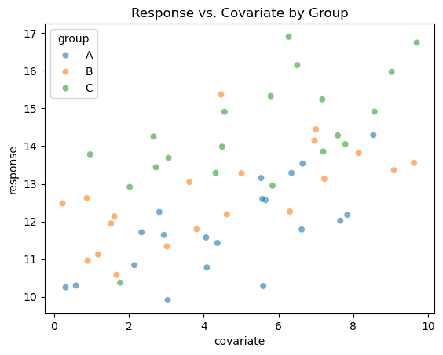
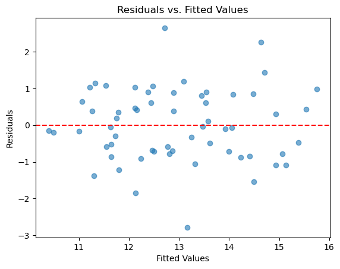

# 선형성 확인

## 분산분석에서 선형성이 관련되는 이유

선형성이 분산분석의 요구 조건으로 늘 명시되지는 않지만, 분산분석을 일반선형모형의 관점에서 보면 관련성이 드러난다. 일원배치 분산분석의 모형은

$$
Y_{ij} = \mu + \alpha_i + \varepsilon_{ij}
$$

이며 $\mu$는 전체 평균, $\alpha_i$는 집단 $i$의 효과, $\varepsilon_{ij}$는 무작위 오차이다. 이 모형은 본래 모수에 대해 선형이다. 선형성은 이원배치 분산분석, 공분산분석(ANCOVA), 그리고 분산분석에 연속형 공변량을 넣어 확장할 때 더 분명하게 중요해진다.

선형성 가정은 연속형 독립변수와 종속변수의 관계가 각 집단 안에서 선형이라는 것이다. 비선형 관계는 잔차에 체계적인 패턴을 남기고 모형 오설정으로 이어질 수 있다.

## 설정

<div class="codebox" markdown>

**예제 1.** 진단에 쓸 모형 준비

```python
import numpy as np
import pandas as pd
from statsmodels.formula.api import ols

# 이 페이지의 모든 진단은 아래 모형 하나를 놓고 수행한다.
# 집단마다 표준편차를 1.0, 1.3, 1.6으로 다르게 주어 진단이 무엇을 잡아내는지
# (그리고 무엇을 못 잡아내는지) 볼 수 있게 했다.
rng = np.random.default_rng(42)
n = 20
data = pd.DataFrame({
    "group": np.repeat(["A", "B", "C"], n),
    "response": np.concatenate([
        rng.normal(10.0, 1.0, n),
        rng.normal(10.8, 1.3, n),
        rng.normal(12.0, 1.6, n),
    ]),
})
# 선형성은 연속형 공변량이 있을 때 비로소 문제가 된다.
# 그래서 이 페이지에서는 공변량을 하나 넣은 공분산분석 모형을 쓴다.
data["covariate"] = rng.uniform(0, 10, 3 * n)
data["response"] = data["response"] + 0.4 * data["covariate"]

model = ols("response ~ C(group) + covariate", data=data).fit()

print(data.groupby("group").response.agg(["count", "mean", "std"]).round(3))
print(f"\nF = {model.fvalue:.4f}, p = {model.f_pvalue:.4f}")
print(f"covariate 계수 = {model.params['covariate']:.4f}")
```

출력:

```
       count    mean    std
group                      
A         20  11.820  1.205
B         20  12.679  1.243
C         20  14.351  1.513

F = 35.4445, p = 0.0000
covariate 계수 = 0.3275
```

공변량을 더한 만큼 집단평균이 위로 올라갔고 산포도 커졌다. 공변량의 계수 추정값 0.3275는 참값 0.4를 향하지만 관측값 60개로는 이 정도 오차가 남는다.

</div>

## 확인 방법

### 산점도

(공분산분석처럼) 연속형 공변량이 있으면 종속변수를 각 공변량에 대해 집단별 색으로 그린다.

<div class="codebox" markdown>

**예제 2.** 집단별 산점도

```python
import matplotlib.pyplot as plt
import seaborn as sns

# 집단마다 색을 달리해 흩뿌린다. 각 색의 점들이 직선을 이루는지,
# 그리고 그 직선들의 기울기가 서로 비슷한지를 본다. 기울기가 다르면
# 공변량과 집단 사이에 교호작용이 있는 것이라 공분산분석의 전제가 깨진다.
sns.scatterplot(data=data, x='covariate', y='response', hue='group', alpha=0.6)
plt.title("Response vs. Covariate by Group")
plt.show()
```



세 집단 모두 공변량이 커질수록 반응이 대체로 커진다. 자료를 만들 때 기울기 0.4의 선형 관계를 넣었으므로 기대한 모습이며, 휘어짐이 보이지 않는다.

집단별 기울기가 비슷해 보인다는 점도 중요하다. 공분산분석은 기울기가 집단마다 같다고 가정한다(평행성 가정). 기울기가 눈에 띄게 다르면 공변량과 집단의 교호작용 항을 넣어야 한다.

살펴볼 것:

- 각 집단 안의 **선형 추세**는 선형성 가정을 확인해 준다.
- **휘어진 패턴**은 다항 항이나 다른 모형이 필요할 수 있는 비선형 관계를 시사한다.

</div>

### 잔차 그림

잔차를 독립변수(또는 적합값)에 대해 그린 그림에는 체계적인 패턴이 없어야 한다. 0 주위의 무작위한 흩어짐이 선형성을 확인해 준다.

<div class="codebox" markdown>

**예제 3.** 잔차 대 적합값 그림

```python
import matplotlib.pyplot as plt

# 잔차 대 적합값 그림은 진단의 출발점이다. 점들이 0 선 둘레에 폭을 일정하게
# 유지하며 흩어져 있으면 좋다. 깔때기 모양이면 등분산이 깨진 것이고, 굽은
# 모양이면 모형이 놓친 구조가 남아 있다는 뜻이다.
plt.scatter(model.fittedvalues, model.resid, alpha=0.6)
plt.axhline(y=0, color='r', linestyle='--')
plt.xlabel("Fitted Values")
plt.ylabel("Residuals")
plt.title("Residuals vs. Fitted Values")
plt.show()
```



앞의 등분산성 페이지와 달리 적합값이 연속적으로 퍼져 있다. 모형에 연속형 공변량이 들어갔기 때문이다. 잔차가 0 주위에 무작위로 흩어져 있고 휘어진 패턴이 없으므로 선형성 가정이 무너진 흔적은 없다.

- **무작위한 흩어짐:** 선형성이 만족된다.
- **곡률:** 휘어진 패턴은 다항 항이나 비선형 모형이 필요함을 시사한다.
- **뚜렷한 군집:** 추가적인 집단 변수가 필요함을 나타낼 수 있다.

</div>

## 선형성이 어긋날 때

- **다항 항:** 이차 이상의 항을 모형에 추가한다.
- **비선형 변환:** 종속변수나 공변량을 변환한다(예: 로그, 제곱근).
- **일반화가법모형(GAM):** 선형 관계를 가정하는 대신 공변량의 매끄러운 함수를 쓴다.
- **비모수 방법:** 비선형성이 심하면 함수 형태에 대한 가정을 두지 않는 비모수 대안을 고려한다.

## 연습문제

<div class="drillbox" markdown>

**연습문제 1.** <span class="diff med" title="중간"></span>
순수하게 범주형인 요인만 있고 연속형 공변량이 없는 일원배치 분산분석에서 선형성 가정이 자동으로 만족되는 이유를 설명하라.

</div>

??? success "풀이"
    일원배치 분산분석 모형 $Y_{ij} = \mu + \alpha_i + \varepsilon_{ij}$는 집단 소속을 나타내는 지시변수를 쓴다. 이 지시변수는 정의상 모형에 선형으로 들어간다. 연속형 설명변수가 없으므로 비선형일 수 있는 함수 관계 자체가 없다. 선형성은 공분산분석이나 회귀 기반 표현처럼 연속형 공변량이 포함될 때에만 문제가 된다.

<div class="drillbox" markdown>

**연습문제 2.** <span class="diff med" title="중간"></span>
어떤 공분산분석 모형이 집단 지시변수와 함께 연속형 공변량(사전 점수)을 포함한다. 잔차 대 적합값 그림에 뚜렷한 U자 패턴이 보인다. 무엇을 뜻하는지 설명하고 두 가지 처방을 제시하라.

</div>

??? success "풀이"
    잔차 대 적합값 그림의 U자 패턴은 공변량과 반응 사이의 관계가 **비선형**임을 나타낸다. 선형모형이 양 극단에서는 체계적으로 과소예측하고 가운데에서는 과대예측하고 있다.

    두 가지 처방:

    1. **다항 항 추가.** 공변량의 $X^2$(필요하면 $X^3$)을 모형에 넣어 선형회귀 틀 안에서 곡률을 담는다.

    2. **비선형 변환 적용.** 공변량을 변환하여(예: $\log(X)$나 $\sqrt{X}$) 반응과의 관계가 근사적으로 선형이 되게 한다.

<div class="drillbox" markdown>

**연습문제 3.** <span class="diff med" title="중간"></span>
$Y$ 대 $X$의 산점도로 비선형성을 탐지하는 것과 잔차 그림으로 탐지하는 것의 차이를 설명하라. 한 방법은 성공하고 다른 방법은 실패하는 상황은 어떤 경우인가?

</div>

??? success "풀이"
    $Y$ 대 $X$의 **산점도**는 두 변수의 원래 관계를 보여주는데, 다중회귀나 분산분석 상황에서는 다른 설명변수의 영향 때문에 이 관계가 가려질 수 있다. **잔차 그림**은 다른 모든 설명변수의 효과를 제거한 뒤의 관계를 보여주므로 문제되는 변수의 기여만 떼어낸다.

    다중회귀나 공분산분석에서는 (다른 설명변수를 조정한 뒤의) 부분 관계가 비선형인데도 하나의 공변량에 대한 $Y$의 산점도가 선형으로 보일 수 있다. 잔차 그림은 이를 탐지한다. 반대로 단순회귀에서는 두 방법이 대체로 동등하다.

---

## 정리하며

분산분석을 **일반선형모형**으로 보면 선형성의 자리가 보인다.

$$
Y_{ij}=\mu+\alpha_i+\varepsilon_{ij}
$$

- **모수에 대해 선형이다.** 집단 효과 $\alpha_i$ 가 더해지는 구조이며, 이것이 13장 회귀의 특수한 경우다. **범주형 설명변수를 더미로 바꾼 회귀가 곧 분산분석이다.**
- **일원배치에서는 선형성이 거의 자동으로 성립한다.** 집단마다 자유로운 평균을 두므로 위반할 여지가 적다.
- **공변량이 들어오면 달라진다.** 공분산분석에서는 공변량과 반응의 관계가 실제로 선형인지 확인해야 하며, 그렇지 않으면 항을 추가하거나 변환한다.
- **이원배치에서는 가법성이 관련된다.** 교호작용 항을 넣지 않은 모형은 두 요인의 효과가 **더해진다**고 가정하는 것이며, 그 가정이 곧 검정 대상이다.
- **잔차 그림이 진단 도구다.** 적합값 대 잔차에 곡선 패턴이 보이면 모형이 구조를 놓치고 있다는 신호다.

다음 절부터 **등분산 검정**들을 구체적으로 다룬다.
