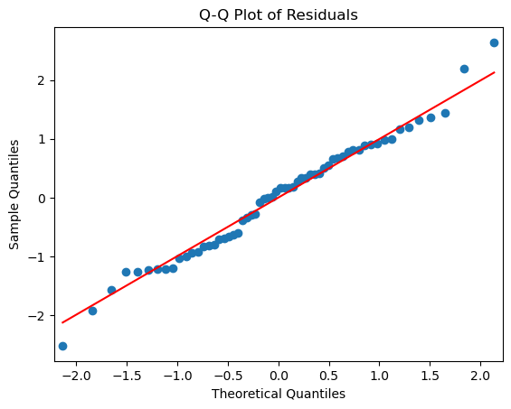
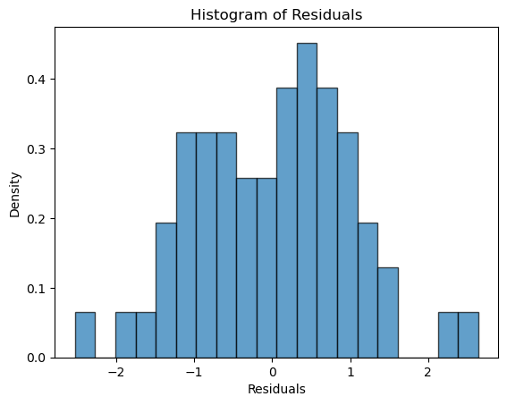

# 잔차의 정규성 확인

## 정규성이 중요한 이유

잔차(관측값과 예측값의 차이)는 각 집단에서 정규분포를 따라야 한다. 이 가정이 있어야 F-통계량이 귀무가설 아래에서 올바른 $F$-분포를 따른다. 잔차가 정규성에서 크게 벗어나면 분산분석이 주는 p-값이 부정확해져 잘못된 결론으로 이어질 수 있다.

정규성 가정은 표본이 작을 때 특히 중요하다. 표본이 크면(집단당 $n \geq 30$) 중심극한정리가 완만한 이탈에 대해 로버스트성을 제공한다. 바탕 분포가 무엇이든 집단 평균의 표본분포가 근사적으로 정규가 되기 때문이다.

## 설정

```python
import numpy as np
import pandas as pd
from statsmodels.formula.api import ols

# 이 페이지의 모든 진단은 아래 모형 하나를 놓고 수행한다.
# 집단마다 표준편차를 1.0, 1.3, 1.6으로 다르게 주어 진단이 무엇을 잡아내는지
# (그리고 무엇을 못 잡아내는지) 볼 수 있게 했다.
rng = np.random.default_rng(42)
n = 20
data = pd.DataFrame({
    "group": np.repeat(["A", "B", "C"], n),
    "response": np.concatenate([
        rng.normal(10.0, 1.0, n),
        rng.normal(10.8, 1.3, n),
        rng.normal(12.0, 1.6, n),
    ]),
})
model = ols("response ~ C(group)", data=data).fit()

print(data.groupby("group").response.agg(["count", "mean", "std"]).round(3))
print(f"\nF = {model.fvalue:.4f}, p = {model.f_pvalue:.4f}")
```

출력:

```
       count    mean    std
group                      
A         20   9.967  0.870
B         20  10.942  1.034
C         20  12.191  1.145

F = 23.7708, p = 0.0000
```

표본표준편차가 0.87, 1.03, 1.15로 나왔다. 참값이 1.0, 1.3, 1.6이었는데도 추정값이 이만큼 눌린 것은 집단당 20개로는 표준편차를 정확히 추정하기 어렵기 때문이다. 이 점이 아래 등분산 검정의 결과를 읽을 때 중요하다.

## 확인 방법

### Q-Q 그림 (분위수-분위수 그림)

Q-Q 그림은 관측된 잔차의 분위수를 정규분포의 이론적 분위수와 비교한다. 잔차가 정규분포를 따르면 점들이 45도 기준선을 따라 대략 놓인다.

- 점들이 **꼬리**에서 선을 벗어나면 꼬리가 두껍거나 얇은 분포를 시사한다.
- 체계적인 **S자** 곡선은 치우침을 시사한다.
- 양 극단의 몇몇 점이 벗어나는 것은 자연스러운 표집 변동을 반영한 것일 수 있다.

```python
import statsmodels.api as sm
import matplotlib.pyplot as plt

# line='s'는 표본의 평균과 표준편차로 정한 기준선이다.
# line='45'(y=x)는 잔차가 표준화되어 있을 때만 맞으므로 여기서는 쓰지 않는다.
sm.qqplot(model.resid, line='s')
plt.title("Q-Q Plot of Residuals")
plt.show()
```



점들이 기준선을 잘 따른다. 양쪽 꼬리에서 한두 점이 살짝 벗어나지만 $n = 60$에서 이 정도는 표집 변동으로 볼 만하다.

### Shapiro-Wilk 검정

Shapiro-Wilk 검정은 자료가 정규분포에서 추출되었다는 귀무가설을 평가한다. 결과가 유의하면($p < 0.05$) 정규성으로부터의 이탈을 시사한다.

$$
W = \frac{\left(\sum_{i=1}^n a_i x_{(i)}\right)^2}{\sum_{i=1}^n (x_i - \bar{x})^2}
$$

여기서 $x_{(i)}$는 정렬된 표본값이고, $a_i$는 정규분포에서 크기 $n$인 표본의 순서통계량의 평균, 분산, 공분산으로부터 만들어지는 상수이다.

```python
from scipy.stats import shapiro

# 잔차 전체를 한 번에 넣는다. 집단별로 따로 검정하면 다중검정 문제가 생기고,
# 분산분석이 요구하는 것도 "각 집단의 잔차"가 아니라 하나의 오차 분포다.
stat, p_value = shapiro(model.resid)
print(f"Shapiro-Wilk Test: W = {stat:.4f}, p-value = {p_value:.4f}")
```

출력:

```
Shapiro-Wilk Test: W = 0.9870, p-value = 0.7711
```

$p = 0.77$로 정규성에 반하는 증거가 없다. 자료를 실제로 정규분포에서 만들었으니 당연한 결과이며, 검정이 제대로 작동한다는 확인이기도 하다.

!!! warning "표본크기에 대한 민감성"
    Shapiro-Wilk 검정은 표본이 크면 지나치게 민감해져 사소한 이탈까지 통계적으로 유의하다고 표시할 수 있다. 반대로 표본이 작으면 의미 있는 이탈을 탐지할 검정력이 부족할 수 있다. 형식적 검정은 언제나 시각적 검토(Q-Q 그림, 히스토그램)와 함께 쓰라.

### 잔차의 히스토그램

잔차를 히스토그램으로 그리면 분포의 모양을 빠르게 시각적으로 평가할 수 있다.

```python
import matplotlib.pyplot as plt

plt.hist(model.resid, bins=20, density=True, alpha=0.7, edgecolor='black')
plt.xlabel("Residuals")
plt.ylabel("Density")
plt.title("Histogram of Residuals")
plt.show()
```



관측값 60개를 20개 구간에 나누어 담았으니 구간당 평균 3개다. 이 정도면 히스토그램이 울퉁불퉁해 보이는 것이 당연하며, 그 요철을 분포의 특징으로 읽으면 안 된다. 표본이 작을 때 정규성 판단에는 Q-Q 그림이 히스토그램보다 낫다.

살펴볼 것:

- **치우침:** 분포가 0을 중심으로 대칭이 아니다.
- **두꺼운 꼬리(첨도):** 정규성 아래에서 기대되는 것보다 극단값이 많다.
- **이봉성:** 봉우리가 둘이면 빠뜨린 집단 변수가 있음을 시사할 수 있다.

## 정규성이 어긋날 때

- **자료 변환:** 로그, 제곱근, Box-Cox 변환으로 치우침을 줄여 잔차를 더 정규에 가깝게 만들 수 있다([정규성을 얻기 위한 변환](../../ch14/non_normal_data/transformations.md) 참조).
- **비모수 대안:** Kruskal-Wallis 검정은 평균 대신 중앙값을 비교하며 정규성을 요구하지 않는다([Kruskal-Wallis 검정](../../ch16/multi_group_nonparametric/kruskal_wallis.md) 참조).
- **붓스트랩:** 재표본추출 방법은 분포 가정 없이 타당한 추론을 제공한다([붓스트랩 원리](../../ch17/bootstrap/principle.md) 참조).

## 연습문제

<div class="drillbox" markdown>

**연습문제 1.**
집단이 $k = 3$개, 집단당 $n = 8$인 일원배치 분산분석에서 잔차에 대한 Shapiro-Wilk 검정이 $p = 0.02$를 주었다. 연구자는 분산분석을 포기해야 하는가? 근거를 설명하라.

</div>

??? success "풀이"
    꼭 그럴 필요는 없다. 형식적 검정 결과를 시각적 진단(Q-Q 그림, 히스토그램)과 함께 보아야 한다. 집단당 $n = 8$뿐이므로 Shapiro-Wilk 검정이 F-검정에 심각한 영향을 주지 않는 완만한 이탈을 탐지했을 수 있다. 분산분석은 특히 집단 크기가 같을 때 약한 비정규성에 꽤 로버스트하다.

    그러나 Q-Q 그림에서 두꺼운 꼬리, 강한 치우침, 이상점이 드러나면 대안을 고려해야 한다. 분산 안정화 변환(로그, 제곱근)을 적용하거나, 더 로버스트한 Welch 분산분석을 쓰거나, Kruskal-Wallis 검정 같은 비모수 대안으로 옮길 수 있다.

<div class="drillbox" markdown>

**연습문제 2.**
분산분석 잔차의 Q-Q 그림에서 가운데는 기준선을 따르지만 양 꼬리에서 위로 휘는 점들이 보인다. 이 패턴은 잔차 분포에 대해 무엇을 뜻하며 분산분석의 추론에 어떤 영향을 줄 수 있는가?

</div>

??? success "풀이"
    양 꼬리에서 위로 휘는 점들은 **두꺼운 꼬리(급첨) 분포**를 나타낸다. 잔차에 정규분포가 예측하는 것보다 극단값이 많다는 뜻이며, 초과 첨도가 있다는 뜻이다.

    두꺼운 꼬리는 집단 내 분산 추정값(MSW)을 부풀려 F-통계량을 작게 만들고 검정을 보수적으로(검정력이 낮게) 만든다. 게다가 극단값이 집단 평균에 지나치게 큰 영향을 주는 영향점일 수도 있다. 연구자는 이상점을 확인하고, 로버스트 방법을 고려하거나, 이탈이 심하면 비모수 검정을 쓰는 편이 좋다.

<div class="drillbox" markdown>

**연습문제 3.**
표본이 클 때(예: 집단당 $n \geq 30$) 정규성 가정이 작은 표본에서보다 덜 결정적인 이유를 설명하라. 분산분석의 어떤 결과가 정규성 없이도 유효하고, 어떤 결과가 그렇지 않은가?

</div>

??? success "풀이"
    표본이 크면 **중심극한정리**에 의해 모집단 분포가 무엇이든 집단 평균의 표본분포가 근사적으로 정규가 된다. F-검정은 집단 평균을 비교하므로 그 기준분포가 근사적으로 옳다.

    **여전히 유효한 결과:** 집단 평균의 OLS 추정값은 정규성과 무관하게 불편이다. 표본이 크면 F-검정의 p-값도 근사적으로 타당하다.

    **유효하지 않을 수 있는 결과:** 개별 관측값에 대한 예측구간은 여전히 정규성을 요구한다. 표본이 작으면 F-통계량의 정확한 분포가 정규성에 의존하므로, 정규성이 어긋나면 p-값이 부정확할 수 있다.

---

## 정리하며

정규성은 **잔차**에 대한 가정이며, 표본이 작을 때만 중요하다.

- **무엇을 보는가.** 원자료가 아니라 잔차 $e_{ij}=Y_{ij}-\bar Y_{i\cdot}$ 다. 집단마다 평균이 다르므로 원자료를 합쳐 보면 당연히 정규가 아니다.
- **집단당 $n\ge30$ 이면 크게 걱정하지 않아도 된다.** 중심극한정리가 집단 평균을 정규로 만들어 주기 때문이며, $F$ 검정은 완만한 이탈에 강건하다.
- **Q-Q 그림이 형식적 검정보다 낫다.** 14장에서 보듯 정규성 검정은 표본이 크면 사소한 이탈에도 기각하고 작으면 큰 이탈도 놓친다. **검정 결과를 기계적으로 따르지 말 것.**
- **심한 치우침이나 이상치가 진짜 문제다.** 그때는 변환하거나 16장의 크루스칼–월리스 검정으로 간다.
- **정규성보다 등분산과 독립성이 더 중요하다.** 우선순위를 그렇게 두는 것이 실무적이다.

다음 절 **관측의 독립성 확인**으로 넘어간다.
