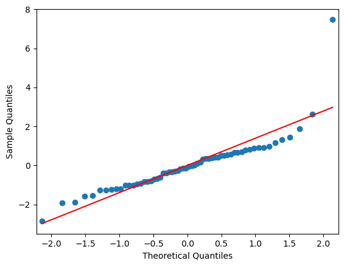
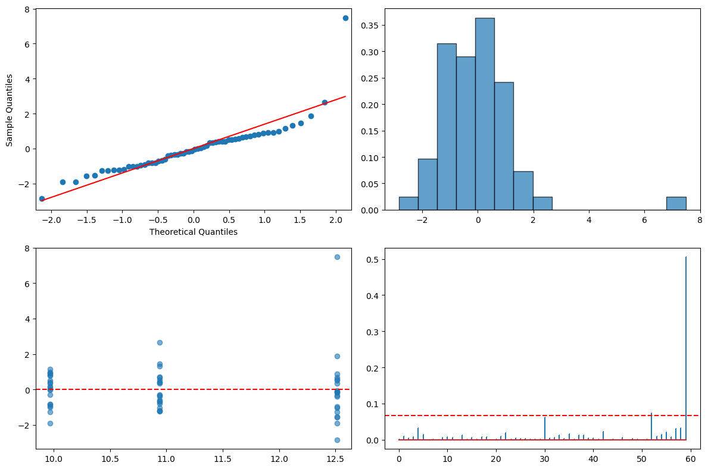

# 분산분석 진단

## 개요

분산분석의 결과를 믿기 전에 몇 가지 핵심 가정을 확인해야 한다: 잔차의 정규성, 등분산성(집단 사이의 분산이 같음), 관측의 독립성, 그리고 영향점의 부재. 이 페이지는 완전한 진단 흐름을 따라가며 각 확인을 형식적 검정과 진단 그림으로 보이고, 가정이 어긋났을 때의 처방을 논한다.

## 설정

```python
import numpy as np
import pandas as pd
from statsmodels.formula.api import ols

# 이 페이지의 진단은 모두 아래 모형 하나를 놓고 수행한다.
# 집단마다 표준편차를 1.0, 1.3, 1.6으로 다르게 주었고,
# 집단 C에 이상점을 하나 심어 두었다.
rng = np.random.default_rng(42)
n = 20
response = np.concatenate([
    rng.normal(10.0, 1.0, n),
    rng.normal(10.8, 1.3, n),
    rng.normal(12.0, 1.6, n),
])
response[-1] = 20.0                     # 마지막 관측값을 이상점으로 만든다
data = pd.DataFrame({
    "group": np.repeat(["A", "B", "C"], n),
    "response": response,
})
group1 = data.loc[data["group"] == "A", "response"]
group2 = data.loc[data["group"] == "B", "response"]
group3 = data.loc[data["group"] == "C", "response"]

model = ols("response ~ C(group)", data=data).fit()

print(data.groupby("group").response.agg(["count", "mean", "std"]).round(3))
print(f"\nF = {model.fvalue:.4f}, p = {model.f_pvalue:.4f}")
```

출력:

```
       count    mean    std
group                      
A         20   9.967  0.870
B         20  10.942  1.034
C         20  12.513  2.077

F = 16.1314, p = 0.0000
```

이상점 하나가 집단 C의 표준편차를 1.15에서 2.08로 키웠다. 아래 진단들이 이것을 잡아내는지 보라.

## 진단 작업 흐름

전형적인 분산분석 진단 파이프라인은 적합된 모형 $y_{ij} = \mu + \alpha_i + \varepsilon_{ij}$의 잔차에 적용되는 네 단계로 이루어진다.

| 단계 | 질문 | 주요 도구 | 형식적 검정 |
|---|---|---|---|
| 1 | 잔차가 정규인가? | Q-Q 그림, 히스토그램 | Shapiro-Wilk |
| 2 | 집단 분산이 같은가? | 집단별 흩어짐 비교 | Levene, Bartlett |
| 3 | 잔차가 독립인가? | 잔차 대 적합값 | Durbin-Watson |
| 4 | 지나치게 영향력 있는 점이 있는가? | Cook의 거리 그림 | Cook의 $D$ 문턱 |

## 1단계: 정규성 확인

Shapiro-Wilk 검정은

$$
H_0: \text{the residuals come from a normal distribution}
$$

을 그렇지 않다는 대립가설에 대해 평가한다. Q-Q 그림은 표본 분위수가 이론적 정규 분위수와 맞는지 보여주어 검정을 보완한다.

```python
from scipy.stats import shapiro
import statsmodels.api as sm

resid = model.resid
stat, p_value = shapiro(resid)
print(f"Shapiro-Wilk: W = {stat:.4f}, p = {p_value:.4f}")
sm.qqplot(resid, line='s')
```

출력:

```
Shapiro-Wilk: W = 0.8116, p = 0.0000
```



$p < 0.0001$로 정규성을 강하게 기각한다. Q-Q 그림의 오른쪽 끝에 크게 벗어난 점 하나가 보이는데, 설정에서 심어 둔 이상점이다.

**검정이 잡아낸 것은 "잔차가 정규가 아니다"이지만 실제 원인은 관측값 하나다.** 형식적 검정만 보면 분포 전체를 의심하게 되고, 그림을 함께 보아야 원인이 한 점이라는 것을 알 수 있다.

Shapiro-Wilk의 $p$-값이 작거나(예: $p < 0.05$) Q-Q 그림에 체계적인 곡률이 보이면 정규성이 의심스럽다. 처방으로는 자료 변환(로그, 제곱근)이나 Kruskal-Wallis 같은 비모수 검정으로의 전환이 있다.

## 2단계: 등분산성 확인

분산분석은 모든 집단이 공통 분산 $\sigma^2$을 공유한다고 가정한다. Levene 검정은 비정규성에 로버스트하고, Bartlett 검정은 자료가 정말 정규일 때 최적이지만 정규성 이탈에 민감하다.

집단이 $k$개일 때 Levene 검정통계량은

$$
W = \frac{(N - k)}{(k - 1)} \cdot \frac{\sum_{i=1}^{k} n_i (\bar{Z}_{i\cdot} - \bar{Z}_{\cdot\cdot})^2}{\sum_{i=1}^{k} \sum_{j=1}^{n_i} (Z_{ij} - \bar{Z}_{i\cdot})^2}
$$

이며 $Z_{ij} = |y_{ij} - \tilde{y}_{i}|$이고 $\tilde{y}_i$는 집단 중앙값이다.

```python
from scipy.stats import levene, bartlett

groups = [data[data['group'] == g]['response'].values for g in data['group'].unique()]
stat_lev, p_lev = levene(*groups)
stat_bart, p_bart = bartlett(*groups)
print(f"Levene:   W = {stat_lev:.4f}, p = {p_lev:.4f}")
print(f"Bartlett: chi2 = {stat_bart:.4f}, p = {p_bart:.4f}")
```

출력:

```
Levene:   W = 1.1666, p = 0.3188
Bartlett: chi2 = 16.6837, p = 0.0002
```

두 검정의 결론이 갈린다. Bartlett은 $p = 0.0002$로 등분산을 강하게 기각하고, Levene은 $p = 0.32$로 기각하지 못한다.

이것이 두 검정의 성격 차이를 보여주는 전형적인 예다. Bartlett은 정규성을 전제하므로 이상점 하나에 크게 흔들린다. Levene은 중앙값으로부터의 절대편차를 쓰므로 그 한 점에 덜 끌려간다. **자료에 이상점이 있을 때 Bartlett의 기각은 분산 차이의 증거가 아니라 이상점의 증거일 수 있다.**

등분산성이 기각되면 Welch 분산분석이나 이분산에 로버스트한 접근(HC3 공분산)을 써야 한다.

## 3단계: 독립성 확인

Durbin-Watson 통계량은 잔차의 1차 자기상관을 탐지한다:

$$
d = \frac{\sum_{t=2}^{n}(e_t - e_{t-1})^2}{\sum_{t=1}^{n} e_t^2}
$$

2에 가까운 값은 자기상관이 없음을, 0에 가까우면 양의 자기상관을, 4에 가까우면 음의 자기상관을 시사한다. 흔한 경험 법칙은 $d \in (1.5, 2.5)$이면 받아들일 만하다는 것이다.

```python
from statsmodels.stats.stattools import durbin_watson

dw = durbin_watson(model.resid)
print(f"Durbin-Watson: {dw:.4f}")
```

출력:

```
Durbin-Watson: 1.7586
```

1.76으로 경험칙의 범위 $(1.5, 2.5)$ 안에 있어 자기상관의 증거가 없다. 다만 여기서 "순서"는 자료프레임의 행 번호일 뿐이므로, 이 값이 의미를 가지려면 자료가 실제 수집 순서대로 정렬되어 있어야 한다.

잔차 대 적합값 산점도에는 알아볼 만한 패턴이 없어야 한다.

## 4단계: 영향점 찾기

Cook의 거리는 각 관측값이 적합 모형에 주는 영향을 잰다. 흔한 문턱은

$$
D_i > \frac{4}{n}
$$

이며 $n$은 전체 관측 수이다. 이 문턱을 넘는 관측값은 자료 입력 오류인지 아니면 정말로 특이한 조건인지 조사해야 한다.

```python
influence = model.get_influence()
cooks_d = influence.cooks_distance[0]
threshold = 4 / len(cooks_d)
flagged = np.where(cooks_d > threshold)[0]
print(f"threshold = {threshold:.4f}")
print(f"flagged observations = {flagged}")
print(f"max Cook's D = {cooks_d.max():.4f} (obs {cooks_d.argmax()})")
```

출력:

```
threshold = 0.0667
flagged observations = [52 59]
max Cook's D = 0.5058 (obs 59)
```

문턱을 넘는 관측값이 둘이고, 그중 압도적인 것이 마지막 관측값(59번)이다. Cook 거리 0.506은 문턱 0.067의 여덟 배에 가깝고 두 번째로 큰 값과도 크게 벌어져 있다. 설정에서 20.0으로 바꿔 심어 둔 바로 그 점이다.

Cook의 거리는 정규성 검정이나 등분산 검정과 달리 **어느 관측값이** 문제인지 짚어 준다. 진단의 순서를 이렇게 잡으면 좋다. 먼저 영향점을 찾고, 그것을 제거했을 때 결론이 바뀌는지 확인한 뒤, 남은 문제를 분포 가정의 문제로 다룬다.

## 전부 합치기

다음 함수는 어떤 일원배치 분산분석 설계에도 전체 파이프라인을 실행하고 2×2 진단 패널(Q-Q 그림, 잔차 히스토그램, 잔차 대 적합값, Cook의 거리)을 만든다.

```python
import matplotlib.pyplot as plt
import statsmodels.api as sm
from statsmodels.formula.api import ols

def run_full_diagnostics(data, response_col, group_col):
    formula = f'{response_col} ~ {group_col}'
    model = ols(formula, data=data).fit()
    anova_table = sm.stats.anova_lm(model, typ=2)
    print(anova_table)

    fig, axes = plt.subplots(2, 2, figsize=(12, 8))
    # Q-Q plot
    sm.qqplot(model.resid, line='s', ax=axes[0, 0])
    # Histogram
    axes[0, 1].hist(model.resid, bins=15, density=True, alpha=0.7, edgecolor='black')
    # Residuals vs Fitted
    axes[1, 0].scatter(model.fittedvalues, model.resid, alpha=0.6)
    axes[1, 0].axhline(y=0, color='r', linestyle='--')
    # Cook's distance
    cooks_d = model.get_influence().cooks_distance[0]
    axes[1, 1].stem(range(len(cooks_d)), cooks_d, markerfmt=",")
    axes[1, 1].axhline(y=4 / len(cooks_d), color='r', linestyle='--')
    plt.tight_layout()
    plt.show()

run_full_diagnostics(data, "response", "C(group)")
```

출력:

```
              sum_sq    df          F    PR(>F)
C(group)   66.024886   2.0  16.131362  0.000003
Residual  116.649122  57.0        NaN       NaN
```



네 그림을 한자리에 놓으면 이야기가 분명해진다. Q-Q 그림의 오른쪽 끝, 히스토그램의 오른쪽 꼬리, 잔차 그림의 위쪽 외딴 점, Cook 거리의 마지막 막대가 모두 **같은 관측값 하나**를 가리킨다.

## 해석

- **정규성:** Q-Q 그림이 기준선을 따르고 Shapiro-Wilk의 $p > 0.05$이면 정규성이 성립한다. 집단이 크고 균형 잡혀 있으면 중심극한정리 덕분에 약한 이탈은 덜 중요하다.
- **등분산성:** Levene의 $p > 0.05$이면 등분산 가정이 합당하다. 그렇지 않으면 Welch 분산분석을 쓴다.
- **독립성:** Durbin-Watson 값이 2 근처이고 잔차 그림에 패턴이 없으면 독립성을 뒷받침한다.
- **영향점:** Cook의 $D > 4/n$인 관측값은 살펴보아야 한다. 영향점 하나를 제거하고 분석을 다시 해 보면 결론이 그 관측값에 민감한지 알 수 있다.

## 연습문제

<div class="drillbox" markdown>

**연습문제 1.**
어떤 연구자가 집단 $k = 4$개, 전체 관측 $n = 50$개로 일원배치 분산분석을 적합했다. Durbin-Watson 통계량은 $d = 0.85$이다. 무엇을 뜻하며 연구자는 무엇을 해야 하는가?

</div>

??? success "풀이"
    Durbin-Watson 통계량 $d = 0.85$는 받아들일 만한 범위 $(1.5, 2.5)$의 하한보다 한참 낮아 잔차 사이에 강한 양의 자기상관이 있음을 나타낸다. 연속한 잔차의 부호가 같은 경향이 있다는 뜻이며 분산분석의 독립성 가정을 위반한다.

    연구자는 자료 수집 과정을 조사해야 한다. 자료를 시간에 걸쳐 수집했다면 시계열 모형이나 반복측정 분산분석이 더 적절할 수 있다. 순서에 의미가 없다면 관측 순서를 다시 무작위화하고 재확인하여 자기상관이 정렬 때문에 생긴 인공물인지 밝힐 수 있다.

<div class="drillbox" markdown>

**연습문제 2.**
Levene 검정이 집단 평균이 아니라 집단 중앙값으로부터의 절대편차를 쓰는 이유를 설명하라. 평균을 쓰면 어떤 상황에서 오도하는 결과가 나오는가?

</div>

??? success "풀이"
    집단 중앙값을 쓰면 Levene 검정이 치우친 분포와 이상점에 로버스트해진다. 중앙값은 극단값에 저항적이므로 변환된 변수 $Z_{ij} = |y_{ij} - \tilde{y}_i|$는 $|y_{ij} - \bar{y}_i|$보다 비정규성의 영향을 덜 받는다.

    바탕 분포가 심하게 치우쳐 있거나 이상점을 포함하면 집단 평균이 극단값 쪽으로 끌려가 해당 집단의 절대편차가 부풀려진다. 그러면 검정이 등분산성을 거짓으로 기각하거나(제1종 오류 부풀림) 반대로 진짜 분산 차이를 가릴 수 있다. 중앙값 기반 형태(Brown-Forsythe 변형)는 더 넓은 범위의 분포 모양에서 명목 제1종 오류율을 유지한다.

<div class="drillbox" markdown>

**연습문제 3.**
Cook의 거리 문턱 $4/n$의 근거를 유도하라. 구체적으로 $D_i$가 근사적으로 $\text{Beta}\!\bigl(\tfrac{p}{2},\, \tfrac{n-p}{2}\bigr)$를 따른다고 할 때 $E[D_i] \approx p/n$임을 보이고, $4/n$이 왜 실용적인 단순화인지 설명하라.

</div>

??? success "풀이"
    관측값 $i$에 대한 Cook의 거리는 Beta 분포와 연결할 수 있다. 근사 $D_i \sim \text{Beta}(p/2,\, (n-p)/2)$ 아래에서 $\text{Beta}(\alpha, \beta)$ 확률변수의 기댓값은

    $$
    E[D_i] = \frac{\alpha}{\alpha + \beta} = \frac{p/2}{p/2 + (n-p)/2} = \frac{p}{n}
    $$

    이다. 집단이 $k$개인 일원배치 분산분석에서는 (절편을 포함하여) $p = k$이므로 $E[D_i] = k/n$이다. 문턱 $4/n$은 Cook의 거리가 평균의 약 네 배인 관측값을 고르는 것에 대략 대응하며, 영향점을 표시하는 표준적인 경험 법칙이다. $k$가 $n$에 비해 작으면 $4/n$과 $4k/n$의 크기가 비슷하므로 $4/n$이 편리한 단순화가 된다. $\square$

<div class="drillbox" markdown>

**연습문제 4.**
어떤 자료에 분산분석 진단을 수행했더니 정규성은 성립하지만 Levene 검정이 $p = 0.003$으로 등분산을 기각했다. Bartlett 검정은 $p = 0.001$이다. 표본크기는 $n_1 = 50$, $n_2 = 12$, $n_3 = 45$이다. 적절한 다음 단계와 구체적인 대안 분석을 기술하라.

</div>

??? success "풀이"
    Levene 검정과 Bartlett 검정이 모두 등분산성을 기각하므로, 등분산을 가정하는 고전적 분산분석 F-검정을 믿을 수 없다. 불균형 설계($n_2 = 12$가 다른 집단보다 훨씬 작다)가 문제를 키운다. 작은 집단의 분산이 크면 F-검정이 관대해지고(제1종 오류 부풀림), 작은 집단의 분산이 작으면 보수적이 된다.

    적절한 대안은 등분산을 가정하지 않고 Satterthwaite 형태의 근사로 자유도를 조정하는 Welch 분산분석이다. 사후 쌍별 비교에는 분산과 표본크기의 불균형을 함께 반영하는 Games-Howell이 Welch 분산분석의 자연스러운 짝이다.

<div class="drillbox" markdown>

**연습문제 5.**
Durbin-Watson 통계량이 $0 \le d \le 4$를 만족하고 $d = 2$가 잔차의 1차 자기상관이 0인 경우에 대응함을 증명하라.

</div>

??? success "풀이"
    Durbin-Watson 통계량은

    $$
    d = \frac{\sum_{t=2}^{n}(e_t - e_{t-1})^2}{\sum_{t=1}^{n} e_t^2}
    $$

    이다.

    **하한:** 모든 $t$에 대해 $(e_t - e_{t-1})^2 \ge 0$이므로 분자가 음이 아니다. 분모는 제곱합이므로 (모든 잔차가 0이 아닌 한) 양수이다. 따라서 $d \ge 0$이다.

    **상한:** 분자를 전개하면

    $$
    \sum_{t=2}^{n}(e_t - e_{t-1})^2 = \sum_{t=2}^{n} e_t^2 - 2\sum_{t=2}^{n} e_t e_{t-1} + \sum_{t=2}^{n} e_{t-1}^2
    $$

    이다. 첫째와 셋째 합은 각각 많아야 $\sum_{t=1}^{n} e_t^2$이고, Cauchy-Schwarz 부등식에 의해 $|\sum e_t e_{t-1}| \le \sum e_t^2$이므로 분자는 많아야 $4 \sum e_t^2$이 되어 $d \le 4$이다.

    **자기상관이 0인 경우:** 1차 자기상관 $\hat{\rho}_1 = \sum_{t=2}^{n} e_t e_{t-1} / \sum_{t=1}^{n} e_t^2 \approx 0$이면 교차항이 사라지고 전개식에 남은 두 합이 각각 대략 $\sum e_t^2$이 되어 $d \approx 2(1 - \hat{\rho}_1) \approx 2$가 된다. $\square$

---

## 정리하며

진단을 **하나의 흐름**으로 묶었다.

- **네 가지를 차례로 본다.** 잔차의 정규성, 등분산성, 독립성, 영향점. 각각 형식적 검정과 그림을 함께 쓴다.
- **그림이 검정보다 정보가 많다.** 적합값 대 잔차 산점도 하나가 등분산성과 선형성을 동시에 보여 주고, Q-Q 그림이 정규성을, 순서 대 잔차 그림이 독립성의 실마리를 준다.
- **검정 결과를 판정 규칙으로 쓰지 말 것.** 표본이 크면 모든 가정 검정이 기각되고 작으면 아무것도 기각되지 않는다. **판단의 재료이지 판단 자체가 아니다.**
- **진단은 분석의 끝이 아니라 중간이다.** 문제를 찾으면 앞 절의 처방으로 돌아가고, 고친 뒤 다시 진단한다.
- **보고에 포함한다.** 어떤 가정을 어떻게 확인했고 무엇을 발견했는지 적는 것이 결과의 신뢰도를 뒷받침한다.

다음 절부터 **실무 응용**으로 넘어간다.
