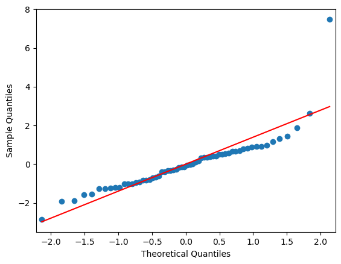
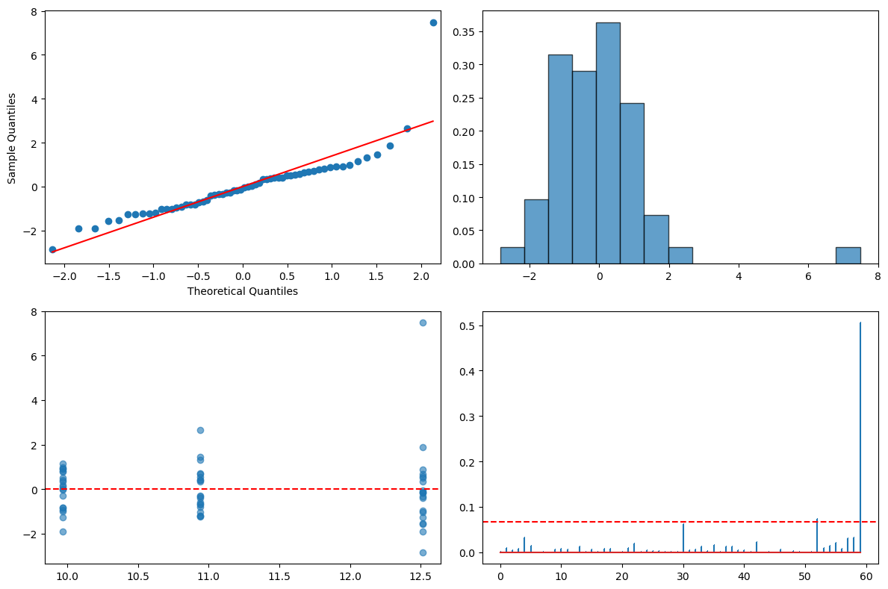

# 분산분석 진단

## 개요

분산분석의 결과를 믿기 전에 몇 가지 핵심 가정을 확인해야 한다: 잔차의 정규성, 등분산성(집단 사이의 분산이 같음), 관측의 독립성, 그리고 영향점의 부재. 이 페이지는 완전한 진단 흐름을 따라가며 각 확인을 형식적 검정과 진단 그림으로 보이고, 가정이 어긋났을 때의 처방을 논한다.

---

## 1. 설정

<div class="exbox" markdown>

**보기 1.** <span class="diff easy" title="쉬움"></span> 진단은 왜 자료가 아니라 잔차에 하는가.

**(1)** 제곱합 분해

$$
\underbrace{\sum_i\sum_j (y_{ij}-\bar y)^2}_{\text{SST}}
= \underbrace{\sum_i n_i(\bar y_{i\cdot}-\bar y)^2}_{\text{SSB}}
+ \underbrace{\sum_i\sum_j (y_{ij}-\bar y_{i\cdot})^2}_{\text{SSE}}
$$

을 교차항이 사라짐을 보여 증명하시오.

**(2)** 이 분해를 써서 **자료 전체에 정규성 검정을 돌리면 안 되는 까닭**을 설명하시오. 원자료의 흩어짐에는 무엇이 섞여 있는가.

**(3)** 이상점을 심기 전과 후의 자료에서 원자료와 잔차 각각에 Shapiro-Wilk 검정을 돌려 (2)를 확인하시오.

</div>

??? success "풀이"

    **(1) 해석적으로.** 각 항에 $\bar y_{i\cdot}$ 를 더하고 빼면

    $$
    y_{ij} - \bar y = (y_{ij} - \bar y_{i\cdot}) + (\bar y_{i\cdot} - \bar y)
    $$

    이고, 제곱해 더하면

    $$
    \text{SST} = \sum_i\sum_j (y_{ij}-\bar y_{i\cdot})^2
    + 2\sum_i\sum_j (y_{ij}-\bar y_{i\cdot})(\bar y_{i\cdot}-\bar y)
    + \sum_i\sum_j (\bar y_{i\cdot}-\bar y)^2
    $$

    이다. 가운데 항에서 $(\bar y_{i\cdot}-\bar y)$ 는 $j$ 에 무관하므로 밖으로 나오고

    $$
    2\sum_i (\bar y_{i\cdot}-\bar y)\underbrace{\sum_j (y_{ij}-\bar y_{i\cdot})}_{=\,0}= 0
    $$

    이다. 보기 2에서 보듯 집단 안의 잔차 합이 $0$ 이기 때문이다. 마지막 항은 $j$ 에 대한 합이 $n_i$ 배이므로 $\sum_i n_i(\bar y_{i\cdot}-\bar y)^2$ 이다. $\square$

    **(2) 해석적으로.** 분해의 왼쪽은 **원자료의 흩어짐 전체**이고, 오른쪽은 그것이 "집단평균이 서로 다른 몫"(SSB)과 "집단 안에서 흩어진 몫"(SSE)으로 갈림을 말한다. 분산분석이 정규성을 요구하는 대상은 오차항 $\varepsilon_{ij}$ 이지 $y_{ij}$ 가 아니다.

    원자료 $y_{ij}$ 는 모형이 참이어도 $k$ 개의 정규분포를 **섞은 혼합분포**를 따른다. 평균이 서로 떨어져 있으면 그 혼합은 봉우리가 여럿이거나 꼬리가 두꺼워 **정규가 아니다.** 그러므로 원자료에 정규성 검정을 돌리면

    - 집단 평균이 충분히 다를 때는 **모형이 완벽해도 기각**하고,
    - 반대로 평균차가 작으면 혼합이 정규처럼 보여 **실제 비정규성을 가릴** 수도 있다.

    잔차 $e_{ij} = y_{ij}-\bar y_{i\cdot}$ 는 각 집단의 평균차를 빼낸 것이므로 이 오염이 없다. **분해가 말하는 것이 정확히 그것이다. 정규성 검정은 SST 가 아니라 SSE 쪽을 보아야 한다.**

    **(3) 수치적으로.**

    ```python
    import numpy as np
    import pandas as pd
    from scipy.stats import shapiro
    from statsmodels.formula.api import ols

    rng = np.random.default_rng(42)
    n = 20
    clean = np.concatenate([
        rng.normal(10.0, 1.0, n), rng.normal(10.8, 1.3, n), rng.normal(12.0, 1.6, n)])
    dirty = clean.copy()
    dirty[-1] = 20.0                                  # 이 쪽이 쓰는 자료
    N, k = 3 * n, 3

    # 제곱합 분해
    grand = dirty.mean()
    mi = [dirty[i * n:(i + 1) * n].mean() for i in range(k)]
    SST = ((dirty - grand) ** 2).sum()
    SSB = n * sum((a - grand) ** 2 for a in mi)
    SSE = sum(((dirty[i * n:(i + 1) * n] - mi[i]) ** 2).sum() for i in range(k))
    print(f"SST = {SST:.6f}")
    print(f"SSB = {SSB:.6f}   (자유도 {k - 1})")
    print(f"SSE = {SSE:.6f}   (자유도 {N - k})")
    print(f"SSB + SSE = {SSB + SSE:.6f}   차 = {SST - SSB - SSE:.2e}")
    print(f"eta^2 = SSB/SST = {SSB / SST:.6f}")
    print(f"F = (SSB/{k - 1})/(SSE/{N - k}) = {(SSB / (k - 1)) / (SSE / (N - k)):.6f}")

    # 원자료에 검정하면 안 되는 까닭
    print(f"\n{'자료':>12}{'원자료 W':>11}{'원자료 p':>12}{'잔차 W':>10}{'잔차 p':>12}")
    for lab, arr in [("이상점 있음", dirty), ("이상점 없음", clean)]:
        dd = pd.DataFrame({"group": np.repeat(["A", "B", "C"], n), "response": arr})
        res = ols("response ~ C(group)", data=dd).fit().resid
        wr, pr = shapiro(arr)
        we, pe = shapiro(res)
        print(f"{lab:>12}{wr:>11.4f}{pr:>12.4g}{we:>10.4f}{pe:>12.4g}")
    ```

    출력:

    ```
    SST = 182.674007
    SSB = 66.024886   (자유도 2)
    SSE = 116.649122   (자유도 57)
    SSB + SSE = 182.674007   차 = -1.42e-14
    eta^2 = SSB/SST = 0.361436
    F = (SSB/2)/(SSE/57) = 16.131362

              자료      원자료 W       원자료 p      잔차 W        잔차 p
          이상점 있음     0.8449   2.165e-06    0.8116   2.658e-07
          이상점 없음     0.9834      0.5886    0.9870      0.7711
    ```

    **분해가 부동소수점 오차 $10^{-14}$ 안에서 정확히 맞는다.** 보기 6에서 `anova_lm` 이 찍을 `sum_sq` 열의 $66.024886$ 과 $116.649122$ 가 바로 이 SSB 와 SSE 이고, 거기서 $F = 16.131362$ 가 나온다. 효과크기 $\eta^2 = 0.3614$ 는 전체 흩어짐의 $36\%$ 가 집단차로 설명된다는 뜻이다.

    **아래 표가 (2)를 확인해 준다.** 이상점이 없는 자료에서 원자료의 $W = 0.9834$ ($p = 0.59$), 잔차의 $W = 0.9870$ ($p = 0.77$) 로 둘 다 정규성을 유지한다. 원자료 쪽의 $W$ 가 조금 더 작은 것이 세 평균의 차이가 섞여 든 몫이다. 다만 **이 자료에서는 그 몫이 작다.** 집단평균의 차이($9.97$, $10.94$, $12.19$)가 집단 안 표준편차($0.87$–$1.15$)의 한 배 남짓이라 혼합이 아직 단봉으로 보이기 때문이다.

    평균차가 더 컸다면 이야기가 달라진다. 예를 들어 평균이 $10$, $20$, $30$ 이고 표준편차가 $1$ 이면 원자료는 봉우리 셋이 뚜렷이 갈려 어떤 정규성 검정도 즉시 기각한다. 모형은 완벽한데도 그렇다. **"$W$ 가 작다"는 사실만으로는 모형의 흠인지 설계의 성공인지 구별할 수 없고, 잔차로 옮겨야 비로소 구별된다.**

    이상점이 있는 줄에서는 원자료 $p = 2.2\times10^{-6}$, 잔차 $p = 2.7\times10^{-7}$ 로 둘 다 강하게 기각한다. **한 점의 영향은 평균을 빼도 사라지지 않는다.** 1단계에서 보겠지만 그 기각의 원인은 분포의 모양이 아니라 관측 하나다.

    **마지막으로 모형을 적합해 둔다.** 아래 진단은 모두 이 `model` 하나를 놓고 수행한다.

    ```python
    import numpy as np
    import pandas as pd
    from statsmodels.formula.api import ols

    # 이 페이지의 진단은 모두 아래 모형 하나를 놓고 수행한다.
    # 집단마다 표준편차를 1.0, 1.3, 1.6으로 다르게 주었고,
    # 집단 C에 이상점을 하나 심어 두었다.
    rng = np.random.default_rng(42)
    n = 20
    response = np.concatenate([
        rng.normal(10.0, 1.0, n),
        rng.normal(10.8, 1.3, n),
        rng.normal(12.0, 1.6, n),
    ])
    response[-1] = 20.0                     # 마지막 관측값을 이상점으로 만든다
    data = pd.DataFrame({
        "group": np.repeat(["A", "B", "C"], n),
        "response": response,
    })
    group1 = data.loc[data["group"] == "A", "response"]
    group2 = data.loc[data["group"] == "B", "response"]
    group3 = data.loc[data["group"] == "C", "response"]

    model = ols("response ~ C(group)", data=data).fit()

    print(data.groupby("group").response.agg(["count", "mean", "std"]).round(3))
    print(f"\nF = {model.fvalue:.4f}, p = {model.f_pvalue:.4f}")
    ```

    출력:

    ```
           count    mean    std
    group                      
    A         20   9.967  0.870
    B         20  10.942  1.034
    C         20  12.513  2.077

    F = 16.1314, p = 0.0000
    ```

이상점 하나가 집단 C의 표준편차를 1.15에서 2.08로 키웠다. 아래 진단들이 이것을 잡아내는지 보라.

---

## 2. 진단 작업 흐름

전형적인 분산분석 진단 파이프라인은 적합된 모형 $y_{ij} = \mu + \alpha_i + \varepsilon_{ij}$의 잔차에 적용되는 네 단계로 이루어진다.

| 단계 | 질문 | 주요 도구 | 형식적 검정 |
|---|---|---|---|
| 1 | 잔차가 정규인가? | Q-Q 그림, 히스토그램 | Shapiro-Wilk |
| 2 | 집단 분산이 같은가? | 집단별 흩어짐 비교 | Levene, Bartlett |
| 3 | 잔차가 독립인가? | 잔차 대 적합값 | Durbin-Watson |
| 4 | 지나치게 영향력 있는 점이 있는가? | Cook의 거리 그림 | Cook의 $D$ 문턱 |

---

## 3. 1단계: 정규성 확인

Shapiro-Wilk 검정은

$$
H_0: \text{the residuals come from a normal distribution}
$$

을 그렇지 않다는 대립가설에 대해 평가한다. Q-Q 그림은 표본 분위수가 이론적 정규 분위수와 맞는지 보여주어 검정을 보완한다.

<div class="exbox" markdown>

**보기 2.** <span class="diff easy" title="쉬움"></span> 1단계 — 정규성. Q-Q 그림에서 **얼마나** 벗어났는지를 수로 말할 수 있다.

**(1)** `statsmodels` 의 `qqplot` 은 $i$ 번째로 작은 잔차를 가로축 $\Phi^{-1}\!\left(\dfrac{i}{N+1}\right)$ 에 놓는다. 가장 큰 잔차의 가로 좌표를 구하고, `line='s'` 가 그 자리에 기대하는 세로 높이가 $s\,\Phi^{-1}\!\left(\dfrac{N}{N+1}\right)$ 임을 쓰시오($s$ 는 잔차의 표본표준편차, 잔차 평균은 $0$).

**(2)** 그 기대 높이와 실제 높이를 견주어 **이상점이 몇 배나 멀리 있는지** 구하시오. 둘째로 큰 잔차는 어떠한가.

**(3)** 이상점 하나를 빼면 Shapiro-Wilk 의 $p$-값, 왜도, 첨도가 각각 어떻게 되는지 보이시오. "잔차가 정규가 아니다"라는 진단을 어떻게 고쳐 읽어야 하는가.

</div>

??? success "풀이"

    **(1) 해석적으로.** Q-Q 그림은 정렬된 표본 $e_{(1)} \le \cdots \le e_{(N)}$ 를 같은 순위의 이론 분위수에 대응시킨다. 순위 $i$ 에 붙이는 누적확률(작도위치)로 `statsmodels` 의 `ProbPlot` 은 기본값 `a=0` 에서

    $$
    p_i = \frac{i - a}{N + 1 - 2a} = \frac{i}{N+1}
    $$

    을 쓴다. $N = 60$ 이므로 가장 큰 점의 가로 좌표는

    $$
    \Phi^{-1}\!\left(\frac{60}{61}\right) = \Phi^{-1}(0.98361) = 2.1347
    $$

    이다. ($i/N$ 을 쓰면 가장 큰 점이 $\Phi^{-1}(1) = \infty$ 가 되어 버린다. 분모를 $N+1$ 로 두는 까닭이 그것이다.)

    `line='s'` 는 **표준화선**으로, 절편을 표본평균, 기울기를 표본표준편차로 잡은 직선 $y = \bar e + s\,x$ 다. 최소제곱으로 점들에 맞춘 선이 아니라 **"자료가 $N(\bar e, s^2)$ 이라면 점들이 놓여야 할 자리"**를 그린 것이다. 잔차는 $\bar e = 0$ 이므로 선이 $y = s\,x$ 이고, 가장 큰 점이 놓일 자리는 $s\,\Phi^{-1}\!\left(\frac{N}{N+1}\right)$ 이다. $\square$

    **(2)–(3) 수치적으로.** 먼저 쪽의 검정과 그림이다.

    ```python
    from scipy.stats import shapiro
    import statsmodels.api as sm

    # 정규성은 자료가 아니라 잔차에 요구되는 가정이다. 집단마다 평균이 다르므로
    # 자료 전체를 한 번에 검정하면 안 된다.
    resid = model.resid
    stat, p_value = shapiro(resid)
    print(f"Shapiro-Wilk: W = {stat:.4f}, p = {p_value:.4f}")
    sm.qqplot(resid, line='s')
    ```

    출력:

    ```
    Shapiro-Wilk: W = 0.8116, p = 0.0000
    ```

    

    이제 그림의 오른쪽 끝을 수로 잰다.

    ```python
    import numpy as np
    import pandas as pd
    import statsmodels.api as sm
    from scipy import stats
    from statsmodels.formula.api import ols

    rng = np.random.default_rng(42)
    n = 20
    clean = np.concatenate([
        rng.normal(10.0, 1.0, n), rng.normal(10.8, 1.3, n), rng.normal(12.0, 1.6, n)])
    response = clean.copy()
    response[-1] = 20.0
    data = pd.DataFrame({"group": np.repeat(["A", "B", "C"], n), "response": response})
    model = ols("response ~ C(group)", data=data).fit()
    e = model.resid.values
    N = len(e)

    pp = sm.ProbPlot(e)
    tq, sq = pp.theoretical_quantiles, pp.sample_quantiles
    s = e.std(ddof=1)
    print(f"가장 큰 점의 이론 분위수 Phi^-1(60/61) = {tq[-1]:.4f}")
    print(f"line='s' 가 그 자리에 기대하는 높이 = s * q = {s:.4f} * {tq[-1]:.4f} = {s * tq[-1]:.4f}")
    print(f"실제 높이 = {sq[-1]:.4f}   ->  {sq[-1] / (s * tq[-1]):.2f} 배")
    print(f"둘째로 큰 점: 기대 {s * tq[-2]:.4f}, 실제 {sq[-2]:.4f}  ({sq[-2] / (s * tq[-2]):.2f} 배)")

    print(f"\nShapiro W = {stats.shapiro(e).statistic:.6f}")
    print(f"정렬 잔차와 정규점수의 상관계수 제곱 = {np.corrcoef(sq, tq)[0, 1] ** 2:.6f}")

    print(f"\n{'자료':>16}{'W':>10}{'p':>12}")
    for lab, arr in [("전체 60 개", e), ("이상점 뺀 59 개", np.sort(e)[:-1])]:
        w, p = stats.shapiro(arr)
        print(f"{lab:>16}{w:>10.4f}{p:>12.4g}")
    print(f"\n왜도 = {stats.skew(e):.4f},  이상점을 빼면 {stats.skew(np.sort(e)[:-1]):.4f}")
    print(f"첨도(초과) = {stats.kurtosis(e):.4f},  이상점을 빼면 {stats.kurtosis(np.sort(e)[:-1]):.4f}")
    ```

    출력:

    ```
    가장 큰 점의 이론 분위수 Phi^-1(60/61) = 2.1347
    line='s' 가 그 자리에 기대하는 높이 = s * q = 1.4061 * 2.1347 = 3.0016
    실제 높이 = 7.4865   ->  2.49 배
    둘째로 큰 점: 기대 2.5891, 실제 2.6418  (1.02 배)

    Shapiro W = 0.811595
    정렬 잔차와 정규점수의 상관계수 제곱 = 0.778751

                  자료         W           p
             전체 60 개    0.8116   2.658e-07
          이상점 뺀 59 개    0.9906       0.931

    왜도 = 2.4350,  이상점을 빼면 -0.0123
    첨도(초과) = 11.7232,  이상점을 빼면 0.1740
    ```

    **(2) 벗어난 거리.** 가장 큰 잔차가 놓여야 할 자리는 $1.4061 \times 2.1347 = 3.0016$ 인데 실제는 $7.4865$ 다. **기대 높이의 $2.49$ 배**이고 세로축 단위로는 $4.48$ 만큼 위다. 그런데 **둘째로 큰 점은 기대 $2.5891$ 에 실제 $2.6418$ 로 $1.02$ 배**, 곧 거의 정확히 선 위에 있다. 이것이 "꼬리가 두꺼운 분포"와 "이상점 하나"를 가르는 결정적인 차이다. 꼬리가 두꺼우면 오른쪽 끝 **여러 점**이 차례로 선 위로 들뜨는데, 여기서는 **마지막 하나만** 들떠 있고 나머지 $59$ 개는 선에 붙어 있다.

    `Shapiro W = 0.8116` 과 정렬 잔차–정규점수 상관계수의 제곱 $0.7788$ 을 함께 적어 두었다. 둘은 가중치가 달라 같은 값이 아니지만(뒤의 것은 Shapiro–Francia 통계량이다), 둘 다 **$1$ 에서 크게 떨어져 있다**는 같은 신호를 준다. $W$ 가 $1$ 에 가까울수록 정규에 가깝다.

    **(3) 한 점을 빼면.** 가장 큰 잔차 하나를 빼면

    | | 전체 $60$ 개 | 이상점 뺀 $59$ 개 |
    |---|---|---|
    | Shapiro $W$ | $0.8116$ | $0.9906$ |
    | $p$-값 | $2.7\times10^{-7}$ | $\mathbf{0.931}$ |
    | 왜도 | $2.4350$ | $-0.0123$ |
    | 초과첨도 | $11.7232$ | $0.1740$ |

    로 **네 수가 모두 교과서적인 정규 자료의 값이 된다.** 왜도 $2.44 \to -0.01$, 초과첨도 $11.72 \to 0.17$ 은 특히 극적이다. $60$ 개 중 $59$ 개는 처음부터 흠잡을 데 없이 정규였던 것이다.

    **그러므로 1단계의 결론은 "잔차가 정규가 아니다"가 아니라 "관측 $59$ 번을 빼면 잔차가 정규다"로 적어야 한다.** 두 문장이 부르는 다음 행동이 전혀 다르다. 앞의 문장은 로그 변환이나 Kruskal-Wallis 로 가게 하고, 뒤의 문장은 **그 한 점이 무엇인지 확인하러** 가게 한다. 자료 입력 오류라면 고치면 그만이고, 실제 측정이라면 그것이 왜 나왔는지가 이 분석에서 가장 흥미로운 사실일 수 있다. 분포 전체를 바꾸는 처방은 그 조사가 끝난 뒤에 생각할 일이다.

    왜도와 초과첨도의 값에도 눈여겨볼 것이 있다. 정규분포의 초과첨도는 $0$ 인데 $11.72$ 는 $t_5$ 분포(초과첨도 $6$)보다도 훨씬 크다. **"꼬리가 두꺼운 분포"로는 설명되지 않는 크기**이며, 이런 값을 보면 분포를 의심하기 전에 개별 관측을 의심하는 것이 순서다.

$p < 0.0001$로 정규성을 강하게 기각한다. Q-Q 그림의 오른쪽 끝에 크게 벗어난 점 하나가 보이는데, 설정에서 심어 둔 이상점이다.

**검정이 잡아낸 것은 "잔차가 정규가 아니다"이지만 실제 원인은 관측값 하나다.** 형식적 검정만 보면 분포 전체를 의심하게 되고, 그림을 함께 보아야 원인이 한 점이라는 것을 알 수 있다.

Shapiro-Wilk의 $p$-값이 작거나(예: $p < 0.05$) Q-Q 그림에 체계적인 곡률이 보이면 정규성이 의심스럽다. 처방으로는 자료 변환(로그, 제곱근)이나 Kruskal-Wallis 같은 비모수 검정으로의 전환이 있다.

---

## 4. 2단계: 등분산성 확인

분산분석은 모든 집단이 공통 분산 $\sigma^2$을 공유한다고 가정한다. Levene 검정은 비정규성에 로버스트하고, Bartlett 검정은 자료가 정말 정규일 때 최적이지만 정규성 이탈에 민감하다.

집단이 $k$개일 때 Levene 검정통계량은

$$
W = \frac{(N - k)}{(k - 1)} \cdot \frac{\sum_{i=1}^{k} n_i (\bar{Z}_{i\cdot} - \bar{Z}_{\cdot\cdot})^2}{\sum_{i=1}^{k} \sum_{j=1}^{n_i} (Z_{ij} - \bar{Z}_{i\cdot})^2}
$$

이며 $Z_{ij} = |y_{ij} - \tilde{y}_{i}|$이고 $\tilde{y}_i$는 집단 중앙값이다.

<div class="exbox" markdown>

**보기 3.** <span class="diff easy" title="쉬움"></span> 2단계 — 등분산성. 두 검정이 갈리는 까닭은 식에 적혀 있다.

**(1)** Bartlett 통계량

$$
\chi^2 = \frac{(N-k)\ln s_p^2 - \sum_i (n_i-1)\ln s_i^2}{C},
\qquad
C = 1 + \frac{1}{3(k-1)}\left(\sum_i \frac{1}{n_i-1} - \frac{1}{N-k}\right)
$$

에서 **분자가 산술평균의 로그와 로그의 가중평균의 차**임을 보이고, 옌센 부등식으로 그것이 항상 $\ge 0$ 임을 밝히시오. 곧 Bartlett 은 $\ln$ 을 통해 **분산 자체**를 본다.

**(2)** Levene 통계량은 $Z_{ij} = \lvert y_{ij} - \tilde y_i\rvert$ 에 대한 일원배치 $F$ 와 같다. `scipy.stats.f_oneway` 로 그 사실을 확인하시오.

**(3)** 두 통계량을 공식으로 직접 계산해 `scipy` 와 맞추고, **이상점 하나를 빼면** 두 p-값이 각각 어떻게 되는지 보이시오.

</div>

??? success "풀이"

    **(1) 해석적으로.** 균형설계가 아니어도 되도록 $w_i = \frac{n_i-1}{N-k}$ 라 두면 $\sum_i w_i = 1$ 이고 합동분산이

    $$
    s_p^2 = \frac{\sum_i (n_i-1)s_i^2}{N-k} = \sum_i w_i s_i^2
    $$

    로 $s_i^2$ 들의 **가중 산술평균**이다. 분자를 $N-k$ 로 묶어 내면

    $$
    \frac{\text{분자}}{N-k} = \ln\left(\sum_i w_i s_i^2\right) - \sum_i w_i \ln s_i^2
    $$

    가 된다. $\ln$ 이 오목하므로 옌센 부등식에서

    $$
    \ln\left(\sum_i w_i s_i^2\right) \ \ge\ \sum_i w_i \ln s_i^2
    $$

    이고 **등호는 $s_i^2$ 이 모두 같을 때뿐**이다. 그러므로 Bartlett 통계량은 항상 음이 아니고, 분산들이 서로 벌어질수록 커진다. $\square$

    여기서 두 검정의 성격 차이가 드러난다. **Bartlett 은 $s_i^2$ 이라는 제곱을 재료로 쓴다.** 제곱은 꼬리를 키우므로 네 번째 적률에 민감해지고, 관측 하나가 $s_i^2$ 을 네 배로 만들면 $\ln s_i^2$ 이 $\ln 4 = 1.39$ 만큼 움직여 통계량이 그대로 부푼다. **Levene 은 중앙값으로부터의 절대편차를 쓰므로 제곱이 없고**, 게다가 중심이 중앙값이라 한 점이 중심을 끌고 가지도 못한다.

    보정계수 $C$ 는 $\chi^2_{k-1}$ 근사를 좋게 하려는 장치다. $n_i$ 가 커지면 괄호 안이 $0$ 으로 가 $C \to 1$ 이 된다. 이 자료는 $k = 3$, $n_i = 20$, $N-k = 57$ 이므로

    $$
    C = 1 + \frac{1}{6}\left(\frac{3}{19} - \frac{1}{57}\right) = 1 + \frac{1}{6}(0.157895 - 0.017544) = 1.023392
    $$

    다.

    **(2)–(3) 수치적으로.** 먼저 쪽의 두 검정이다.

    ```python
    from scipy.stats import levene, bartlett

    # 두 검정을 함께 돌려 결론이 갈리는지 본다. 갈린다면 정규성이 의심스럽다는
    # 뜻이므로, 정규성을 덜 타는 Levene 쪽을 믿는다.
    groups = [data[data['group'] == g]['response'].values for g in data['group'].unique()]
    stat_lev, p_lev = levene(*groups)
    stat_bart, p_bart = bartlett(*groups)
    print(f"Levene:   W = {stat_lev:.4f}, p = {p_lev:.4f}")
    print(f"Bartlett: chi2 = {stat_bart:.4f}, p = {p_bart:.4f}")
    ```

    출력:

    ```
    Levene:   W = 1.1666, p = 0.3188
    Bartlett: chi2 = 16.6837, p = 0.0002
    ```

    이제 두 통계량을 식에서 직접 만들고, 이상점을 빼 본다.

    ```python
    import numpy as np
    from scipy import stats

    rng = np.random.default_rng(42)
    n, k = 20, 3
    clean = np.concatenate([
        rng.normal(10.0, 1.0, n), rng.normal(10.8, 1.3, n), rng.normal(12.0, 1.6, n)])
    dirty = clean.copy()
    dirty[-1] = 20.0
    N = n * k
    gs = [dirty[i * n:(i + 1) * n] for i in range(k)]

    # Bartlett 를 공식으로
    s2 = np.array([g.var(ddof=1) for g in gs])
    sp2 = ((n - 1) * s2).sum() / (N - k)
    C_bart = 1 + (1 / (3 * (k - 1))) * (k / (n - 1) - 1 / (N - k))
    chi2 = ((N - k) * np.log(sp2) - ((n - 1) * np.log(s2)).sum()) / C_bart
    print(f"s_i^2 = {np.round(s2, 4)},  합동 s_p^2 = {sp2:.6f}")
    print(f"보정계수 C = {C_bart:.6f}")
    print(f"공식  chi2 = {chi2:.6f},  p = {stats.chi2.sf(chi2, k - 1):.6f}")
    print(f"scipy chi2 = {stats.bartlett(*gs).statistic:.6f},  p = {stats.bartlett(*gs).pvalue:.6f}")

    # Levene 는 |y - 중앙값| 에 대한 일원배치 F
    Z = [np.abs(g - np.median(g)) for g in gs]
    print(f"\nZbar = {[round(z.mean(), 4) for z in Z]}")
    print(f"공식  W = {stats.f_oneway(*Z).statistic:.6f},  p = {stats.f_oneway(*Z).pvalue:.6f}")
    print(f"scipy W = {stats.levene(*gs).statistic:.6f},  p = {stats.levene(*gs).pvalue:.6f}")

    # 이상점을 빼면
    print(f"\n{'자료':>12}{'s_A':>8}{'s_B':>8}{'s_C':>8}{'Bartlett p':>12}{'Levene p':>11}")
    for lab, arr in [("이상점 있음", dirty), ("이상점 없음", clean)]:
        g = [arr[i * n:(i + 1) * n] for i in range(k)]
        sd = [x.std(ddof=1) for x in g]
        print(f"{lab:>12}{sd[0]:>8.4f}{sd[1]:>8.4f}{sd[2]:>8.4f}"
              f"{stats.bartlett(*g).pvalue:>12.4f}{stats.levene(*g).pvalue:>11.4f}")
    ```

    출력:

    ```
    s_i^2 = [0.7572 1.0682 4.314 ],  합동 s_p^2 = 2.046476
    보정계수 C = 1.023392
    공식  chi2 = 16.683675,  p = 0.000238
    scipy chi2 = 16.683675,  p = 0.000238

    Zbar = [0.6952, 0.818, 1.1998]
    공식  W = 1.166587,  p = 0.318752
    scipy W = 1.166587,  p = 0.318752

              자료     s_A     s_B     s_C  Bartlett p   Levene p
          이상점 있음  0.8702  1.0335  2.0770      0.0002     0.3188
          이상점 없음  0.8702  1.0335  1.1450      0.4996     0.6662
    ```

    **두 통계량이 모두 소수점 여섯째 자리까지 `scipy` 와 같다.** Levene 이 $Z_{ij}$ 에 대한 평범한 일원배치 $F$ 와 **동일**하다는 것도 확인된다. 새 분포표가 필요 없는 검정이다.

    **갈림의 크기를 수로 보자.** Bartlett 의 분자는 $\ln$ 들의 차이에서 나온다. $s_i^2 = 0.7572,\ 1.0682,\ 4.3140$ 이고 합동값이 $2.0465$ 이므로

    $$
    \ln 2.0465 = 0.7161,
    \qquad
    \frac{1}{3}(\ln 0.7572 + \ln 1.0682 + \ln 4.3140) = \frac{-0.2781 + 0.0660 + 1.4619}{3} = 0.4166
    $$

    이고 차이 $0.2996$ 에 $N-k = 57$ 을 곱해 $C$ 로 나누면 $57 \times 0.2996/1.023392 = 16.68$ 이 된다. **$\ln 4.3140 = 1.4619$ 라는 한 항이 모든 것을 끌고 간다.**

    Levene 쪽은 $\bar Z_i = 0.6952,\ 0.8180,\ 1.1998$ 로 세 값이 완만하게 늘어난다. 이상점의 $Z$ 는 $\lvert 20 - \tilde y_C\rvert = 7.65$ 로 매우 크지만, **$\bar Z_C$ 안에서 $20$ 분의 $1$ 의 무게밖에 갖지 못하고 제곱되지도 않으므로** 집단 간 변동을 집단 내 변동으로 나눈 비가 $1.17$ 에 머문다. 참고로 집단 내 변동 쪽에도 그 점이 들어가 분모를 함께 키우므로, 비는 더욱 움직이기 어렵다.

    **마지막 표가 결론이다.** 이상점을 빼면 $s_C$ 가 $2.0770$ 에서 $1.1450$ 으로 줄고 Bartlett 의 p-값이 $0.0002$ 에서 $0.4996$ 으로 뛴다. **Bartlett 의 기각은 전적으로 그 한 점이 만든 것이었다.** 모집단 표준편차를 $1.0$, $1.3$, $1.6$ 으로 실제로 다르게 주었는데도 그렇다. 곧 **참으로 존재하는 이분산은 두 검정 모두 잡지 못했고**($n = 20$ 에서 그만한 차이를 잡을 검정력이 없다), Bartlett 이 잡은 것은 이분산이 아니라 비정규성이었다.

    그래서 이 쪽의 본문이 말하는 "Levene 쪽을 믿는다"는 지침이 옳지만, 그 뒤에 한 줄을 더 붙여야 한다. **Levene 이 기각하지 않았다고 등분산이 확인된 것은 아니다.** 여기서 $\sigma$ 가 실제로 $1.0$ 대 $1.6$ 으로 다른데 $p = 0.32$ 다. 두 검정 중 무엇을 믿느냐보다, 집단별 $s_i$ 표를 직접 보고 Welch 를 기본으로 쓰는 쪽이 안전하다.

두 검정의 결론이 갈린다. Bartlett은 $p = 0.0002$로 등분산을 강하게 기각하고, Levene은 $p = 0.32$로 기각하지 못한다.

이것이 두 검정의 성격 차이를 보여주는 전형적인 예다. Bartlett은 정규성을 전제하므로 이상점 하나에 크게 흔들린다. Levene은 중앙값으로부터의 절대편차를 쓰므로 그 한 점에 덜 끌려간다. **자료에 이상점이 있을 때 Bartlett의 기각은 분산 차이의 증거가 아니라 이상점의 증거일 수 있다.**

등분산성이 기각되면 Welch 분산분석이나 이분산에 로버스트한 접근(HC3 공분산)을 써야 한다.

---

## 5. 3단계: 독립성 확인

Durbin-Watson 통계량은 잔차의 1차 자기상관을 탐지한다:

$$
d = \frac{\sum_{t=2}^{n}(e_t - e_{t-1})^2}{\sum_{t=1}^{n} e_t^2}
$$

2에 가까운 값은 자기상관이 없음을, 0에 가까우면 양의 자기상관을, 4에 가까우면 음의 자기상관을 시사한다. 흔한 경험 법칙은 $d \in (1.5, 2.5)$이면 받아들일 만하다는 것이다.

<div class="exbox" markdown>

**보기 4.** <span class="diff easy" title="쉬움"></span> 3단계 — 독립성. Durbin-Watson 이 $1.76$ 이라는 말이 무슨 뜻인지 따져 본다.

**(1)** $S = \sum_t e_t^2$, $\hat\rho_1 = \dfrac{\sum_{t=2}^{N} e_t e_{t-1}}{S}$ 라 두고

$$
d = 2\left(1 - \hat\rho_1\right) - \frac{e_1^2 + e_N^2}{S}
$$

임을 **정확히** 보이시오(근사가 아니다). 흔히 쓰는 $d \approx 2(1-\hat\rho_1)$ 은 뒤 항을 버린 것이다.

**(2)** 이 자료에서 두 항을 각각 계산하시오. 끝점 보정이 $d$ 를 얼마나 끌어내리는가. 하필 **마지막 관측이 이상점**이라는 사실이 어떻게 작용하는가.

**(3)** 행 순서를 무작위로 뒤섞어 $d$ 를 다시 재면 어떤 분포가 되는가. 관측값 $1.7586$ 은 그 분포의 어디에 있으며, 경험칙 $(1.5, 2.5)$ 는 무엇에 해당하는가.

</div>

??? success "풀이"

    **(1) 해석적으로.** 분자를 펼치면

    $$
    \sum_{t=2}^{N}(e_t - e_{t-1})^2
    = \sum_{t=2}^{N} e_t^2 + \sum_{t=2}^{N} e_{t-1}^2 - 2\sum_{t=2}^{N} e_t e_{t-1}
    $$

    이다. 첫 합은 $t = 1$ 이 빠졌으므로 $S - e_1^2$ 이고, 둘째 합은 $t = N$ 이 빠졌으므로 $S - e_N^2$ 이다. 따라서

    $$
    \sum_{t=2}^{N}(e_t - e_{t-1})^2 = 2S - e_1^2 - e_N^2 - 2\sum_{t=2}^{N}e_te_{t-1}
    $$

    이고 양변을 $S$ 로 나누면

    $$
    d = 2 - \frac{e_1^2+e_N^2}{S} - 2\hat\rho_1
    = 2(1-\hat\rho_1) - \frac{e_1^2+e_N^2}{S}
    $$

    를 얻는다. $\square$ 근사 없이 등식이다. 끝점 보정은 $N$ 이 크고 어느 한 잔차가 유난히 크지 않으면 $O(1/N)$ 이라 무시할 만하다. **"유난히 크지 않으면"이 이 보기의 요점이다.**

    **(2)–(3) 수치적으로.** 먼저 쪽의 계산이다.

    ```python
    from statsmodels.stats.stattools import durbin_watson

    # 통계량은 0 에서 4 사이이고 2 가 무상관에 해당한다. 2 보다 뚜렷이 작으면
    # 양의 자기상관, 크면 음의 자기상관이다.
    dw = durbin_watson(model.resid)
    print(f"Durbin-Watson: {dw:.4f}")
    ```

    출력:

    ```
    Durbin-Watson: 1.7586
    ```

    이제 두 항으로 쪼개고, 행 순서를 뒤섞어 본다.

    ```python
    import numpy as np
    import pandas as pd
    from statsmodels.formula.api import ols
    from statsmodels.stats.stattools import durbin_watson

    rng = np.random.default_rng(42)
    n = 20
    response = np.concatenate([
        rng.normal(10.0, 1.0, n), rng.normal(10.8, 1.3, n), rng.normal(12.0, 1.6, n)])
    response[-1] = 20.0
    data = pd.DataFrame({"group": np.repeat(["A", "B", "C"], n), "response": response})
    e = ols("response ~ C(group)", data=data).fit().resid.values
    S = (e ** 2).sum()

    rho = (e[1:] * e[:-1]).sum() / S
    edge = (e[0] ** 2 + e[-1] ** 2) / S
    print(f"rho_1 = {rho:.6f}")
    print(f"2(1 - rho_1)                = {2 * (1 - rho):.6f}")
    print(f"끝점 보정 (e_1^2+e_N^2)/sum = {edge:.6f}")
    print(f"2(1-rho) - 끝점 보정        = {2 * (1 - rho) - edge:.6f}")
    print(f"durbin_watson               = {durbin_watson(e):.6f}")
    print(f"\n끝점 보정 중 마지막 관측 혼자의 몫: e_N^2/sum = {e[-1] ** 2 / S:.6f}")

    # 행 순서를 바꾸면 통계량이 어떻게 되는가
    rg = np.random.default_rng(7)
    dws = np.array([durbin_watson(rg.permutation(e)) for _ in range(20_000)])
    print(f"\n행을 무작위로 섞어 2만 번 다시 잰 DW")
    print(f"  평균 {dws.mean():.4f},  표준편차 {dws.std(ddof=1):.4f}")
    print(f"  2.5% ~ 97.5% 분위: [{np.quantile(dws, 0.025):.4f}, {np.quantile(dws, 0.975):.4f}]")
    print(f"  관측값 {durbin_watson(e):.4f} 의 백분위 = {np.mean(dws < durbin_watson(e)):.3f}")
    print(f"  경험칙 (1.5, 2.5) 안에 들어가는 비율 = {np.mean((dws > 1.5) & (dws < 2.5)):.3f}")
    ```

    출력:

    ```
    rho_1 = -0.120015
    2(1 - rho_1)                = 2.240031
    끝점 보정 (e_1^2+e_N^2)/sum = 0.481463
    2(1-rho) - 끝점 보정        = 1.758567
    durbin_watson               = 1.758567

    끝점 보정 중 마지막 관측 혼자의 몫: e_N^2/sum = 0.480486

    행을 무작위로 섞어 2만 번 다시 잰 DW
      평균 1.9959,  표준편차 0.2409
      2.5% ~ 97.5% 분위: [1.4866, 2.4449]
      관측값 1.7586 의 백분위 = 0.154
      경험칙 (1.5, 2.5) 안에 들어가는 비율 = 0.959
    ```

    **(1)의 분해가 소수점 여섯째 자리까지 맞는다.** 그런데 그 두 항의 크기가 뜻밖이다.

    | 항 | 값 |
    |---|---|
    | $2(1-\hat\rho_1)$ | $2.240031$ |
    | 끝점 보정 | $-0.481463$ |
    | $d$ | $\mathbf{1.758567}$ |

    **끝점 보정이 $0.48$ 이나 된다.** $N = 60$ 에서 잔차들이 고만고만할 때 기대할 $2/N \approx 0.033$ 의 **열네 배**다. 그 $0.481463$ 중 $0.480486$, 곧 거의 전부가 마지막 관측 혼자의 몫이다. 이상점의 잔차 $7.4865$ 를 제곱하면 $56.05$ 로 전체 제곱합 $116.65$ 의 절반에 가깝기 때문이다.

    **그래서 $1.76$ 이라는 "안전한" 값은 사실 두 가지가 겹쳐 만들어졌다.** 일차 자기상관은 $\hat\rho_1 = -0.1200$ 으로 **음수**여서 그것만 보면 $d = 2.24$ 가 나왔어야 한다. 거기서 끝점 보정이 $0.48$ 을 깎아 $1.76$ 으로 내려온 것이다. 자기상관 때문에 $2$ 아래로 간 것이 아니라 **마지막 행이 하필 이상점이어서** 그렇다. 같은 자료를 거꾸로 적어 이상점이 첫 행에 있었다면 보정의 크기는 같지만, 이상점이 가운데 어디쯤 있었다면 보정이 거의 $0$ 이 되어 $d$ 가 $2.2$ 대로 올라갔을 것이다.

    **(3) 행 순서를 뒤섞으면.** 같은 $60$ 개 잔차를 무작위로 재배열해 $2$ 만 번 $d$ 를 다시 재면 평균 $1.9959$, 표준편차 $0.2409$ 이고 $95\%$ 구간이 $[1.4866,\ 2.4449]$ 다. **이것이 "순서가 아무 뜻 없을 때"의 $d$ 의 분포다.** 그리고 경험칙 $(1.5, 2.5)$ 안에 $95.9\%$ 가 들어간다. 곧 **$(1.5, 2.5)$ 라는 어림 기준은 이 표본크기에서 대략 $95\%$ 구간**이며, 그 점에서 쓸 만한 기준이다.

    관측값 $1.7586$ 은 그 분포의 **$15.4$ 백분위**에 있다. 양측으로 보면 p-값이 $0.3$ 쯤이므로 "자기상관 없음"이라는 결론 자체는 바뀌지 않는다.

    **그러나 결론이 맞았다는 것과 검정이 뜻있었다는 것은 다르다.** 여기서 행 번호는 `np.concatenate` 가 집단 A·B·C 를 이어 붙인 순서일 뿐이고, 집단 안의 순서는 난수 생성기가 값을 꺼낸 순서다. 둘 다 자료를 수집한 시간이나 공간과 아무 관련이 없다. **DW 는 "순서"라는 정보가 자료 밖에서 주어질 때만 뜻을 갖는 통계량**이며, 그 정보가 없으면 위 재배열 분포에서 뽑은 난수 한 개를 본 것과 같다. 이 쪽의 본문이 "자료가 실제 수집 순서대로 정렬되어 있어야 한다"고 단서를 단 것이 그 뜻이다. 순서를 모른다면 **DW 를 아예 보고하지 않는 것**이 옳다.

1.76으로 경험칙의 범위 $(1.5, 2.5)$ 안에 있어 자기상관의 증거가 없다. 다만 여기서 "순서"는 자료프레임의 행 번호일 뿐이므로, 이 값이 의미를 가지려면 자료가 실제 수집 순서대로 정렬되어 있어야 한다.

잔차 대 적합값 산점도에는 알아볼 만한 패턴이 없어야 한다.

---

## 6. 4단계: 영향점 찾기

Cook의 거리는 각 관측값이 적합 모형에 주는 영향을 잰다. 흔한 문턱은

$$
D_i > \frac{4}{n}
$$

이며 $n$은 전체 관측 수이다. 이 문턱을 넘는 관측값은 자료 입력 오류인지 아니면 정말로 특이한 조건인지 조사해야 한다.

<div class="exbox" markdown>

**보기 5.** <span class="diff easy" title="쉬움"></span> 4단계 — 영향점. 균형 일원배치에서 Cook 의 거리는 표준화 잔차의 다른 이름이다.

**(1)** Cook 의 거리의 일반식

$$
D_i = \frac{r_i^2}{p}\cdot\frac{h_{ii}}{1-h_{ii}}
$$

에 균형 일원배치의 $p = k$, $h_{ii} = 1/n$ 을 넣어

$$
D_i = \frac{r_i^2}{N-k}
$$

임을 보이시오($N = kn$).

**(2)** 따라서 **$D$ 의 순위와 $\lvert r\rvert$ 의 순위가 완전히 같음**을 결론하시오. 균형설계에서 Cook 의 거리는 표준화 잔차가 주지 않는 정보를 주는가.

**(3)** 문턱 $D_i > 4/N$ 이 $\lvert r_i\rvert$ 의 어떤 문턱에 해당하는지 구하시오. 흔히 쓰는 $\lvert r\rvert > 2$ 와 견주면?

**(4)** 세 결과를 수치로 확인하시오.

</div>

??? success "풀이"

    **(1) 해석적으로.** 잔차 분석 쪽 보기 3에서 본 대로 균형 일원배치의 지렛값은 $h_{ii} = 1/n$ 으로 모든 관측에서 같고, 모수의 개수는 $p = k$ 다. 넣으면

    $$
    D_i = \frac{r_i^2}{k}\cdot\frac{1/n}{1 - 1/n}
    = \frac{r_i^2}{k}\cdot\frac{1}{n-1}
    = \frac{r_i^2}{k(n-1)}
    = \frac{r_i^2}{N-k}
    $$

    이다. $\square$ ($N - k = kn - k = k(n-1)$ 이다.) 이 자료는 $N - k = 57$ 이므로 $D_i = r_i^2/57$ 이다.

    **(2) 해석적으로.** $D_i$ 가 $\lvert r_i\rvert$ 의 **단조증가 함수**($t \mapsto t^2/(N-k)$, $t \ge 0$)이므로 두 양의 순위가 정확히 같다. 그러므로 **균형 일원배치에서 Cook 의 거리는 표준화 잔차가 주지 않는 정보를 하나도 더 주지 않는다.** 척도만 바꾼 같은 양이다.

    까닭이 분명하다. 영향력은 "얼마나 벗어났는가"($r_i$)와 "얼마나 지렛대를 쥐고 있는가"($h_{ii}$)의 **곱**인데, 균형 일원배치에서는 둘째 요인이 모든 관측에서 같다. 집단 안에서 어느 위치에 있든 그 관측이 집단평균에 미치는 몫이 $1/n$ 으로 같기 때문이다. 설명변수가 연속인 회귀와 결정적으로 다른 점이고, 거기서는 $x$ 가 멀리 있는 점이 큰 $h_{ii}$ 를 가져 **잔차가 작아도 영향이 클 수 있다.**

    그러므로 Cook 의 거리가 제 값을 하는 곳은 **불균형 설계**다. $n_i$ 가 다르면 $h_{ii} = 1/n_i$ 가 달라져 작은 집단의 관측이 더 큰 지렛값을 갖는다. 다음 절의 영향점 쪽이 그 경우를 다룬다.

    **(3) 해석적으로.** $D_i > 4/N$ 과 $r_i^2/(N-k) > 4/N$ 이 같은 조건이므로

    $$
    r_i^2 > \frac{4(N-k)}{N}
    \qquad\Longleftrightarrow\qquad
    \lvert r_i\rvert > 2\sqrt{1 - \frac{k}{N}}
    $$

    이다. $N = 60$, $k = 3$ 에서 $2\sqrt{1 - 0.05} = 2\sqrt{0.95} = 1.9494$ 다. **흔히 쓰는 $\lvert r\rvert > 2$ 와 사실상 같은 기준**이며, $k/N$ 이 작을수록 둘이 가까워진다. 서로 다른 출처에서 온 두 어림 규칙이 같은 곳을 가리키는 셈이다.

    **(4) 수치적으로.** 먼저 쪽의 계산이다.

    ```python
    # Cook 의 거리는 그 관측값 하나를 뺐을 때 적합값 전체가 얼마나 움직이는지를
    # 잰다. 크다는 것은 결론이 그 한 점에 기대고 있다는 뜻이다.
    influence = model.get_influence()
    cooks_d = influence.cooks_distance[0]

    # 4/n 은 널리 쓰이는 어림 기준일 뿐 검정이 아니다. 넘는 점은 지울 대상이
    # 아니라 들여다볼 대상이다.
    threshold = 4 / len(cooks_d)
    flagged = np.where(cooks_d > threshold)[0]
    print(f"threshold = {threshold:.4f}")
    print(f"flagged observations = {flagged}")
    print(f"max Cook's D = {cooks_d.max():.4f} (obs {cooks_d.argmax()})")
    ```

    출력:

    ```
    threshold = 0.0667
    flagged observations = [52 59]
    max Cook's D = 0.5058 (obs 59)
    ```

    이제 (1)–(3)을 확인한다.

    ```python
    import numpy as np
    import pandas as pd
    from statsmodels.formula.api import ols

    rng = np.random.default_rng(42)
    n, k = 20, 3
    response = np.concatenate([
        rng.normal(10.0, 1.0, n), rng.normal(10.8, 1.3, n), rng.normal(12.0, 1.6, n)])
    response[-1] = 20.0
    data = pd.DataFrame({"group": np.repeat(["A", "B", "C"], n), "response": response})
    model = ols("response ~ C(group)", data=data).fit()
    N = 3 * n

    inf = model.get_influence()
    D = inf.cooks_distance[0]
    r = inf.resid_studentized_internal
    h = inf.hat_matrix_diag

    coef = (1 / k) * h[0] / (1 - h[0])
    print(f"h_ii 는 모두 {h[0]:.4f},  (1/p)*h/(1-h) = {coef:.8f} = 1/{1 / coef:.4f}")
    print(f"D 와 r^2/(N-k) 의 최대 차이 = {np.abs(D - r ** 2 / (N - k)).max():.2e}")

    print(f"\n{'관측':>6}{'r':>10}{'r^2/57':>10}{'Cook D':>10}")
    for i in np.argsort(-D)[:4]:
        print(f"{i:>6}{r[i]:>10.4f}{r[i] ** 2 / (N - k):>10.6f}{D[i]:>10.6f}")

    thr = 4 / N
    print(f"\n문턱 4/N = {thr:.6f}")
    print(f"이에 대응하는 |r| 문턱 = sqrt(4(N-k)/N) = {np.sqrt(4 * (N - k) / N):.6f}")
    print(f"D > 4/N 인 관측 = {np.where(D > thr)[0]}")
    print(f"|r| > 2  인 관측 = {np.where(np.abs(r) > 2)[0]}")
    print(f"두 집합이 같은가: {set(np.where(D > thr)[0]) == set(np.where(np.abs(r) > 2)[0])}")

    # D 순위와 |r| 순위가 같은가
    print(f"D 의 순위와 |r| 의 순위가 완전히 같은가: "
          f"{np.array_equal(np.argsort(D), np.argsort(np.abs(r)))}")
    ```

    출력:

    ```
    h_ii 는 모두 0.0500,  (1/p)*h/(1-h) = 0.01754386 = 1/57.0000
    D 와 r^2/(N-k) 의 최대 차이 = 2.22e-16

        관측         r    r^2/57    Cook D
        59    5.3693  0.505775  0.505775
        52   -2.0403  0.073035  0.073035
        30    1.8947  0.062981  0.062981
         4   -1.3756  0.033200  0.033200

    문턱 4/N = 0.066667
    이에 대응하는 |r| 문턱 = sqrt(4(N-k)/N) = 1.949359
    D > 4/N 인 관측 = [52 59]
    |r| > 2  인 관측 = [52 59]
    두 집합이 같은가: True
    D 의 순위와 |r| 의 순위가 완전히 같은가: True
    ```

    **$D_i = r_i^2/57$ 이 $60$ 개 모두에서 $10^{-16}$ 안에 맞는다.** 계수 $\frac{1}{p}\frac{h}{1-h} = 0.01754386 = 1/57$ 도 (1)의 유도와 같다. **$D$ 의 순위와 $\lvert r\rvert$ 의 순위도 완전히 같다.** $60$ 개 전부에서 그렇다.

    문턱도 맞는다. $4/N = 0.0667$ 이 $\lvert r\rvert > 1.9494$ 에 해당하고, 실제로 $D > 4/N$ 으로 걸린 관측 $\{52, 59\}$ 가 $\lvert r\rvert > 2$ 로 걸린 집합과 **정확히 같다.** $r$ 의 값이 $-2.0403$ 과 $5.3693$ 이라 두 문턱 사이($1.9494$–$2$)에 걸친 관측이 없었기 때문이다.

    표의 넷째 줄도 눈여겨볼 만하다. 관측 $30$ 번은 $r = 1.8947$, $D = 0.0630$ 으로 문턱 $0.0667$ 에 아슬아슬하게 못 미친다. **$4/N$ 은 검정이 아니라 눈금일 뿐이고 그 근처의 점들은 걸리나 안 걸리나가 우연에 가깝다.** 실제로 쓸 만한 정보는 "걸렸다/안 걸렸다"가 아니라 **값들의 간격**이다. $0.5058$, $0.0730$, $0.0630$, $0.0332$ 를 보면 첫째가 둘째의 **$6.9$ 배**로 홀로 떨어져 있고 나머지 셋은 매끄럽게 이어진다. 영향점이 하나뿐이라는 결론은 문턱이 아니라 이 간격에서 나온다.

    **그러므로 이 쪽 본문의 "Cook의 거리는 어느 관측값이 문제인지 짚어 준다"는 말은 맞지만, 이 균형설계에서는 표준화 잔차도 똑같이 짚어 준다.** 네 단계의 진단 중 1단계(정규성)와 4단계(영향점)가 여기서는 **같은 한 점**을 서로 다른 척도로 가리키고 있을 뿐이다. 둘이 갈라지는 것은 불균형 설계에서, 곧 $h_{ii}$ 가 관측마다 다를 때다.

문턱을 넘는 관측값이 둘이고, 그중 압도적인 것이 마지막 관측값(59번)이다. Cook 거리 0.506은 문턱 0.067의 여덟 배에 가깝고 두 번째로 큰 값과도 크게 벌어져 있다. 설정에서 20.0으로 바꿔 심어 둔 바로 그 점이다.

Cook의 거리는 정규성 검정이나 등분산 검정과 달리 **어느 관측값이** 문제인지 짚어 준다. 진단의 순서를 이렇게 잡으면 좋다. 먼저 영향점을 찾고, 그것을 제거했을 때 결론이 바뀌는지 확인한 뒤, 남은 문제를 분포 가정의 문제로 다룬다.

---

## 7. 전부 합치기

다음 함수는 어떤 일원배치 분산분석 설계에도 전체 파이프라인을 실행하고 2×2 진단 패널(Q-Q 그림, 잔차 히스토그램, 잔차 대 적합값, Cook의 거리)을 만든다.

<div class="exbox" markdown>

**보기 6.** <span class="diff easy" title="쉬움"></span> 네 그림을 한자리에 놓고 **각 칸에서 무엇을 읽어야 하는지** 수치로 정리한다.

**(1)** 네 칸을 각각 **수치와 함께** 읽으시오. Q-Q 의 오른쪽 끝, 히스토그램의 마지막 막대, 잔차 그림 세 띠의 폭, Cook 막대의 최대값과 둘째값의 비.

**(2)** 네 칸이 **네 개의 독립된 확인인가**를 따지시오. 보기 5에서 본 사실을 쓰면 어느 두 칸이 같은 정보인가.

**(3)** 이 패널이 **다루지 못하는** 진단 단계를 지적하시오.

</div>

??? success "풀이"

    **(1)–(3) 수치적으로.** 먼저 패널을 그린다.

    ```python
    import matplotlib.pyplot as plt
    import statsmodels.api as sm
    from statsmodels.formula.api import ols

    def run_full_diagnostics(data, response_col, group_col):
        """앞의 진단 넷을 한 번에 돌려 2x2 격자로 보여 준다.

        실제 분석에서는 이 네 그림을 늘 함께 본다. 하나만 보고 판단하면
        다른 쪽에서 드러날 문제를 놓치기 쉽다.
        """
        formula = f'{response_col} ~ {group_col}'
        model = ols(formula, data=data).fit()
        anova_table = sm.stats.anova_lm(model, typ=2)
        print(anova_table)

        fig, axes = plt.subplots(2, 2, figsize=(12, 8))
        # 왼쪽 위: Q-Q 그림 — 정규성
        sm.qqplot(model.resid, line='s', ax=axes[0, 0])
        # 오른쪽 위: 잔차 히스토그램 — 치우침과 봉우리
        axes[0, 1].hist(model.resid, bins=15, density=True, alpha=0.7, edgecolor='black')
        # 왼쪽 아래: 잔차 대 적합값 — 등분산성과 남은 구조
        axes[1, 0].scatter(model.fittedvalues, model.resid, alpha=0.6)
        axes[1, 0].axhline(y=0, color='r', linestyle='--')
        # 오른쪽 아래: Cook 의 거리 — 영향점
        cooks_d = model.get_influence().cooks_distance[0]
        axes[1, 1].stem(range(len(cooks_d)), cooks_d, markerfmt=",")
        axes[1, 1].axhline(y=4 / len(cooks_d), color='r', linestyle='--')
        plt.tight_layout()
        plt.show()

    run_full_diagnostics(data, "response", "C(group)")
    ```

    출력:

    ```
                  sum_sq    df          F    PR(>F)
    C(group)   66.024886   2.0  16.131362  0.000003
    Residual  116.649122  57.0        NaN       NaN
    ```

    

    이제 네 칸을 하나씩 수로 잰다.

    ```python
    import numpy as np
    import pandas as pd
    import statsmodels.api as sm
    from statsmodels.formula.api import ols

    rng = np.random.default_rng(42)
    n, k = 20, 3
    response = np.concatenate([
        rng.normal(10.0, 1.0, n), rng.normal(10.8, 1.3, n), rng.normal(12.0, 1.6, n)])
    response[-1] = 20.0
    data = pd.DataFrame({"group": np.repeat(["A", "B", "C"], n), "response": response})
    model = ols("response ~ C(group)", data=data).fit()
    e = model.resid.values
    inf = model.get_influence()
    r = inf.resid_studentized_internal
    D = inf.cooks_distance[0]
    N = 3 * n

    # 왼쪽 위 Q-Q: 보기 2 에서 잰 값
    pp = sm.ProbPlot(e)
    s = e.std(ddof=1)
    print("[왼쪽 위] Q-Q")
    print(f"  가장 큰 점: 기대 {s * pp.theoretical_quantiles[-1]:.4f}, 실제 {pp.sample_quantiles[-1]:.4f}")
    print(f"  나머지 59 개의 선으로부터의 최대 거리 = "
          f"{np.abs(pp.sample_quantiles[:-1] - s * pp.theoretical_quantiles[:-1]).max():.4f}")

    # 오른쪽 위 히스토그램
    print("\n[오른쪽 위] 히스토그램 bins=15")
    cnt, edges = np.histogram(e, bins=15)
    w = edges[1] - edges[0]
    print(f"  구간 폭 = {w:.4f},  칸별 도수 = {cnt}")
    print(f"  마지막 칸의 도수 = {cnt[-1]},  그 앞의 연속된 빈 칸 수 = {int((cnt[:-1][::-1] != 0).argmax())}")
    print(f"  밀도 한 칸 높이 = 1/(N*w) = {1 / (N * w):.4f}")

    # 왼쪽 아래 잔차 대 적합값
    print("\n[왼쪽 아래] 잔차 대 적합값")
    for i, g in enumerate("ABC"):
        ei = e[i * n:(i + 1) * n]
        print(f"  띠 {g}: 위치 {model.fittedvalues.values[i * n]:.4f}, "
              f"범위 [{ei.min():.4f}, {ei.max():.4f}], 폭 {ei.max() - ei.min():.4f}")

    # 오른쪽 아래 Cook
    print("\n[오른쪽 아래] Cook")
    top = np.sort(D)[::-1][:3]
    print(f"  가장 큰 셋 = {np.round(top, 4)},  최대/둘째 = {top[0] / top[1]:.2f}")
    print(f"  문턱 4/N = {4 / N:.4f},  넘는 관측 = {np.where(D > 4 / N)[0]}")

    # 네 그림이 서로 얼마나 겹치는가
    print("\n네 그림의 재료가 서로 얼마나 같은가")
    print(f"  Cook D 와 |표준화 잔차| 의 순위상관 = "
          f"{np.corrcoef(np.argsort(np.argsort(D)), np.argsort(np.argsort(np.abs(r))))[0, 1]:.4f}")
    print(f"  Q-Q 와 히스토그램은 같은 60 개 잔차의 주변분포를 두 방식으로 그린 것")
    print(f"  잔차 그림의 세로축 x {1 / (np.sqrt(model.mse_resid) * np.sqrt(1 - 1 / n)):.4f} = 표준화 잔차")
    ```

    출력:

    ```
    [왼쪽 위] Q-Q
      가장 큰 점: 기대 3.0016, 실제 7.4865
      나머지 59 개의 선으로부터의 최대 거리 = 0.7161

    [오른쪽 위] 히스토그램 bins=15
      구간 폭 = 0.6888,  칸별 도수 = [ 1  4 13 12 15 10  3  1  0  0  0  0  0  0  1]
      마지막 칸의 도수 = 1,  그 앞의 연속된 빈 칸 수 = 6
      밀도 한 칸 높이 = 1/(N*w) = 0.0242

    [왼쪽 아래] 잔차 대 적합값
      띠 A: 위치 9.9671, 범위 [-1.9181, 1.1602], 폭 3.0783
      띠 B: 위치 10.9423, 범위 [-1.2345, 2.6418], 폭 3.8763
      띠 C: 위치 12.5135, 범위 [-2.8449, 7.4865], 폭 10.3314

    [오른쪽 아래] Cook
      가장 큰 셋 = [0.5058 0.073  0.063 ],  최대/둘째 = 6.93
      문턱 4/N = 0.0667,  넘는 관측 = [52 59]

    네 그림의 재료가 서로 얼마나 같은가
      Cook D 와 |표준화 잔차| 의 순위상관 = 1.0000
      Q-Q 와 히스토그램은 같은 60 개 잔차의 주변분포를 두 방식으로 그린 것
      잔차 그림의 세로축 x 0.7172 = 표준화 잔차
    ```

    **(1) 네 칸의 읽기.**

    | 칸 | 읽을 것 | 수치 |
    |---|---|---|
    | 왼쪽 위 Q-Q | 가장 큰 점이 선에서 얼마나 떴는가 | 기대 $3.00$, 실제 $7.49$ (**$2.49$ 배**). 나머지 $59$ 개는 선에서 최대 $0.72$ |
    | 오른쪽 위 히스토그램 | 오른쪽 꼬리가 이어져 있는가 | 마지막 막대 도수 $1$, 그 앞에 **빈 칸이 여섯 개** |
    | 왼쪽 아래 잔차 | 띠의 폭이 고른가 | $3.08$, $3.88$, $\mathbf{10.33}$ |
    | 오른쪽 아래 Cook | 최대값이 홀로 떨어졌는가 | $0.5058$ 대 $0.0730$ (**$6.93$ 배**), 문턱 $0.0667$ |

    네 칸 모두 **같은 한 점**을 가리키며, 모두 **그 점만** 가리킨다. 히스토그램의 "빈 칸 여섯 개"가 특히 또렷하다. 꼬리가 두꺼운 분포라면 막대들이 차차 낮아지며 이어지지 그 사이가 $4.1$ 만큼 통째로 비지 않는다.

    **(2) 네 칸은 네 개의 독립된 확인이 아니다.** 보기 5에서 균형 일원배치의 $D_i = r_i^2/(N-k)$ 임을 보았으므로 **오른쪽 아래 칸과 왼쪽 아래 칸은 같은 양이다.** 순위상관이 $1.0000$ 으로 정확히 같고, 잔차에 $0.7172$ 를 곱하면 표준화 잔차, 그것을 제곱해 $57$ 로 나누면 Cook 의 거리다. 왼쪽 위와 오른쪽 위도 같은 $60$ 개 잔차의 **주변분포를 두 방식으로 그린 것**이다.

    그러므로 실제로 서로 다른 정보는 둘뿐이다.

    | 묶음 | 칸 | 보는 것 |
    |---|---|---|
    | 잔차의 **주변분포** | 왼쪽 위 + 오른쪽 위 | 정규인가, 꼬리는 어떤가 |
    | 잔차의 **집단별 구조** | 왼쪽 아래 (+ 오른쪽 아래) | 띠마다 폭이 같은가, 어느 관측인가 |

    이것이 네 칸을 함께 보는 일이 쓸모없다는 뜻은 아니다. 같은 사실을 네 각도에서 보면 **"분포 전체의 문제"와 "관측 하나의 문제"를 가르기 쉬워진다.** 다만 "네 가지를 다 확인했다"고 생각하면 안 된다.

    **(3) 패널이 다루지 못하는 것.** 이 쪽의 진단 흐름은 네 단계인데 패널에는 **2단계(등분산 검정)와 3단계(독립성)가 없다.**

    - **등분산.** 왼쪽 아래 칸이 띠의 폭을 보여 주기는 하지만 그것은 눈대중이고, Levene/Bartlett 의 p-값이나 집단별 $s_i$ 표가 없다. 보기 3에서 보았듯 이 자료의 $s_i$ 는 $0.87$, $1.03$, $2.08$ 인데 그 숫자는 어느 칸에도 적혀 있지 않다.
    - **독립성.** Durbin-Watson 이 빠져 있다. 보기 4에서 보았듯 이 자료에서는 어차피 뜻이 없지만, 수집 순서가 알려진 자료라면 반드시 함께 보아야 한다.
    - **지렛값.** 균형설계라 모두 $0.05$ 로 같아 볼 것이 없지만, **불균형 설계라면** $h_{ii}$ 를 따로 그려야 한다. 오른쪽 아래 칸의 Cook 거리만으로는 큰 $D$ 가 큰 잔차 탓인지 큰 지렛값 탓인지 구별할 수 없다.
    - **히스토그램의 칸 수.** $60$ 개를 $15$ 칸에 나누면 칸당 평균 $4$ 개다. 실제 도수가 $[1, 4, 13, 12, 15, 10, 3, 1, 0, \ldots, 1]$ 로 가운데 다섯 칸에 $53$ 개가 몰려 있어 **모양을 판단할 해상도가 없다.** 이봉인지 치우쳤는지는 이 칸으로 알 수 없고, 그 일은 왼쪽 위 Q-Q 가 훨씬 잘한다.

    요약하면 이 패널은 **1단계와 4단계를 네 각도로 보여 주는 그림**이고, 2·3단계는 보기 3·4의 숫자로 따로 채워야 한다.

네 그림을 한자리에 놓으면 이야기가 분명해진다. Q-Q 그림의 오른쪽 끝, 히스토그램의 오른쪽 꼬리, 잔차 그림의 위쪽 외딴 점, Cook 거리의 마지막 막대가 모두 **같은 관측값 하나**를 가리킨다.

---

## 8. 해석

- **정규성:** Q-Q 그림이 기준선을 따르고 Shapiro-Wilk의 $p > 0.05$이면 정규성이 성립한다. 집단이 크고 균형 잡혀 있으면 중심극한정리 덕분에 약한 이탈은 덜 중요하다.
- **등분산성:** Levene의 $p > 0.05$이면 등분산 가정이 합당하다. 그렇지 않으면 Welch 분산분석을 쓴다.
- **독립성:** Durbin-Watson 값이 2 근처이고 잔차 그림에 패턴이 없으면 독립성을 뒷받침한다.
- **영향점:** Cook의 $D > 4/n$인 관측값은 살펴보아야 한다. 영향점 하나를 제거하고 분석을 다시 해 보면 결론이 그 관측값에 민감한지 알 수 있다.

---

## 연습문제

<div class="drillbox" markdown>

**연습문제 1.** <span class="diff easy" title="쉬움"></span>
분산분석 진단의 **전체 점검표**를 만들어라.

</div>

??? success "풀이"
    **진단은 네 가정에 대응한다.**

    | 가정 | 도구 | 위반 시 오류율 |
    |---|---|---|
    | **독립성** | 설계 검토, 더빈-왓슨 | **0.48**($\rho=0.6$) |
    | 등분산 | 잔차 대 적합값, 브라운-포사이드 | 0.29(불균형) |
    | 정규성 | **Q-Q 그림**, 치우침·첨도 | 0.04(보수적) |
    | (이상점) | 스튜던트화 잔차, 쿡 거리 | 경우에 따라 |

    **점검표.**

    ```text
    [설계]
      □ 관측이 독립인가 (반복측정·군집·시계열?)
      □ 집단별 n 이 균형에 가까운가

    [잔차]
      □ 잔차 대 적합값 그림 — 깔때기 모양?
      □ Q-Q 그림 — 꼬리, 치우침, 계단?
      □ 관측 순서에 대한 잔차 — 추세·주기?

    [이상점·영향점]
      □ 스튜던트화(삭제) 잔차의 최댓값 — 본페로니 보정 임계값과 비교
      □ 쿡 거리 — 크기순 정렬, 뚜렷하게 튀는 점?
      □ 표시된 점을 빼고 다시 적합 — 결론이 바뀌는가?

    [검정]
      □ 브라운-포사이드 (참고용)
      □ 정규성 검정 (n 이 크면 참고만)
    ```

    **핵심 수치 넷.**

    | 사실 | 값 |
    |---|---|
    | 깨끗한 자료에서 $D>4/N$이 표시하는 비율 | **5%** |
    | $N=150$에서 적어도 하나 표시될 확률 | **1.000** |
    | $N=100$에서 $\lvert t^*\rvert>2$가 표시될 확률 | **1.000** |
    | 분산분석의 지렛값 | $h_{ii}=1/n_i$ |

    **문턱을 쓰는 원칙.**

    | 지표 | 선별용 | 판단용 |
    |---|---|---|
    | 쿡 거리 | $4/N$ | **$D_i>1$** |
    | 스튜던트화 잔차 | $\lvert t\rvert>2$ | **본페로니 임계값** |
    | 지렛값 | $2p/N$ | 분산분석에서는 **무의미** |

    **마지막 줄을 잊지 말자.** 분산분석에서 $h_{ii}=1/n_i$이므로, **작은 집단의 모든 관측이 자동으로 "높은 지렛값"**이다. 회귀의 지렛값 진단을 그대로 옮기면 안 된다.

    **이상점을 발견했을 때의 순서.**

    ```text
    1. 기록 오류인가?  ──→ 고치거나 결측 처리
    2. 다른 모집단에서 왔는가?  ──→ 제외하고 그 사실을 보고
    3. 그냥 극단값인가?  ──→ 남긴다
         ↓
    4. 있을 때와 없을 때의 결과를 모두 계산
         ↓
    5. 결론이 바뀌면 둘 다 보고, 바뀌지 않으면 그 사실을 보고
    ```

    **"쿡 거리가 커서 제거했다"는 정당한 이유가 아니다.** 통계적 표시는 **조사를 시작하라는 신호**일 뿐이다.

    **처방 대응표.**

    | 위반 | 처방 |
    |---|---|
    | 독립성 | **혼합효과 모형, 시계열 모형**(검정을 바꿔서는 안 됨) |
    | 등분산 | **웰치**, 변환 |
    | 정규성 | **순열검정**, 변환, 크러스컬-월리스 |
    | 이상점 | 조사 → 로버스트 방법 → 민감도 분석 |

    **한 문장.** 진단의 목적은 **가정을 통과시키는 것이 아니라**, 어떤 방법이 이 자료에 맞는지 **판단할 정보를 모으는 것**이다.

---

<div class="drillbox" markdown>

**연습문제 2.** <span class="diff med" title="중간"></span>
어떤 연구자가 집단 $k = 4$개, 전체 관측 $n = 50$개로 일원배치 분산분석을 적합했다. Durbin-Watson 통계량은 $d = 0.85$이다. 무엇을 뜻하며 연구자는 무엇을 해야 하는가?

</div>

??? success "풀이"
    Durbin-Watson 통계량 $d = 0.85$는 받아들일 만한 범위 $(1.5, 2.5)$의 하한보다 한참 낮아 잔차 사이에 강한 양의 자기상관이 있음을 나타낸다. 연속한 잔차의 부호가 같은 경향이 있다는 뜻이며 분산분석의 독립성 가정을 위반한다.

    연구자는 자료 수집 과정을 조사해야 한다. 자료를 시간에 걸쳐 수집했다면 시계열 모형이나 반복측정 분산분석이 더 적절할 수 있다. 순서에 의미가 없다면 관측 순서를 다시 무작위화하고 재확인하여 자기상관이 정렬 때문에 생긴 인공물인지 밝힐 수 있다.

---

<div class="drillbox" markdown>

**연습문제 3.** <span class="diff med" title="중간"></span>
Levene 검정이 집단 평균이 아니라 집단 중앙값으로부터의 절대편차를 쓰는 이유를 설명하라. 평균을 쓰면 어떤 상황에서 오도하는 결과가 나오는가?

</div>

??? success "풀이"
    집단 중앙값을 쓰면 Levene 검정이 치우친 분포와 이상점에 로버스트해진다. 중앙값은 극단값에 저항적이므로 변환된 변수 $Z_{ij} = |y_{ij} - \tilde{y}_i|$는 $|y_{ij} - \bar{y}_i|$보다 비정규성의 영향을 덜 받는다.

    바탕 분포가 심하게 치우쳐 있거나 이상점을 포함하면 집단 평균이 극단값 쪽으로 끌려가 해당 집단의 절대편차가 부풀려진다. 그러면 검정이 등분산성을 거짓으로 기각하거나(제1종 오류 부풀림) 반대로 진짜 분산 차이를 가릴 수 있다. 중앙값 기반 형태(Brown-Forsythe 변형)는 더 넓은 범위의 분포 모양에서 명목 제1종 오류율을 유지한다.

---

<div class="drillbox" markdown>

**연습문제 4.** <span class="diff med" title="중간"></span>
어떤 자료에 분산분석 진단을 수행했더니 정규성은 성립하지만 Levene 검정이 $p = 0.003$으로 등분산을 기각했다. Bartlett 검정은 $p = 0.001$이다. 표본크기는 $n_1 = 50$, $n_2 = 12$, $n_3 = 45$이다. 적절한 다음 단계와 구체적인 대안 분석을 기술하라.

</div>

??? success "풀이"
    Levene 검정과 Bartlett 검정이 모두 등분산성을 기각하므로, 등분산을 가정하는 고전적 분산분석 F-검정을 믿을 수 없다. 불균형 설계($n_2 = 12$가 다른 집단보다 훨씬 작다)가 문제를 키운다. 작은 집단의 분산이 크면 F-검정이 관대해지고(제1종 오류 부풀림), 작은 집단의 분산이 작으면 보수적이 된다.

    적절한 대안은 등분산을 가정하지 않고 Satterthwaite 형태의 근사로 자유도를 조정하는 Welch 분산분석이다. 사후 쌍별 비교에는 분산과 표본크기의 불균형을 함께 반영하는 Games-Howell이 Welch 분산분석의 자연스러운 짝이다.

---

<div class="drillbox" markdown>

**연습문제 5.** <span class="diff med" title="중간"></span>
Durbin-Watson 통계량이 $0 \le d \le 4$를 만족하고 $d = 2$가 잔차의 1차 자기상관이 0인 경우에 대응함을 증명하라.

</div>

??? success "풀이"
    Durbin-Watson 통계량은

    $$
    d = \frac{\sum_{t=2}^{n}(e_t - e_{t-1})^2}{\sum_{t=1}^{n} e_t^2}
    $$

    이다.

    **하한:** 모든 $t$에 대해 $(e_t - e_{t-1})^2 \ge 0$이므로 분자가 음이 아니다. 분모는 제곱합이므로 (모든 잔차가 0이 아닌 한) 양수이다. 따라서 $d \ge 0$이다.

    **상한:** 분자를 전개하면

    $$
    \sum_{t=2}^{n}(e_t - e_{t-1})^2 = \sum_{t=2}^{n} e_t^2 - 2\sum_{t=2}^{n} e_t e_{t-1} + \sum_{t=2}^{n} e_{t-1}^2
    $$

    이다. 첫째와 셋째 합은 각각 많아야 $\sum_{t=1}^{n} e_t^2$이고, Cauchy-Schwarz 부등식에 의해 $|\sum e_t e_{t-1}| \le \sum e_t^2$이므로 분자는 많아야 $4 \sum e_t^2$이 되어 $d \le 4$이다.

    **자기상관이 0인 경우:** 1차 자기상관 $\hat{\rho}_1 = \sum_{t=2}^{n} e_t e_{t-1} / \sum_{t=1}^{n} e_t^2 \approx 0$이면 교차항이 사라지고 전개식에 남은 두 합이 각각 대략 $\sum e_t^2$이 되어 $d \approx 2(1 - \hat{\rho}_1) \approx 2$가 된다. $\square$

---

<div class="drillbox" markdown>

**연습문제 6.** <span class="diff med" title="중간"></span>
연습문제 4의 상황($n=50,12,45$, 레빈 $p=0.003$, 바틀렛 $p=0.001$)을 **수치로 분석**하고 구체적인 대안을 제시하라.

</div>

??? success "풀이"
    **먼저 어느 방향의 불균형인지 물어야 한다.** 문제는 표본 크기만 주고 분산은 주지 않았다. **두 시나리오가 정반대의 결과**를 낳는다.

    ```python
    import warnings
    warnings.filterwarnings("ignore")

    import numpy as np
    from scipy import stats

    def welch_p(gs):
        n = np.array([len(g) for g in gs], float)
        m = np.array([g.mean() for g in gs])
        v = np.array([g.var(ddof=1) for g in gs])
        k = len(n)
        w = n / v
        W = w.sum()
        mt = (w * m).sum() / W
        lam = ((1 - w / W)**2 / (n - 1)).sum()
        F = ((w * (m - mt)**2).sum() / (k - 1)
             / (1 + 2 * (k - 2) / (k**2 - 1) * lam))
        return stats.f.sf(F, k - 1, (3 / (k**2 - 1) * lam)**-1)

    rng = np.random.default_rng(8004)
    B = 10_000
    NS = [50, 12, 45]
    print("n = (50, 12, 45), 모든 평균이 같음, 명목 0.05")
    print(f"{'시나리오':>28s} {'표준 F':>8s} {'웰치':>8s}")
    for lab, sds in [("역페어링: 작은 집단에 큰 분산 σ=(1,3,1)", [1, 3, 1]),
                     ("정페어링: 작은 집단에 작은 분산 σ=(3,1,3)", [3, 1, 3]),
                     ("큰 집단끼리 다름 σ=(1,1,3)", [1, 1, 3])]:
        a = b = 0
        for _ in range(B):
            gs = [rng.normal(0, s, n) for n, s in zip(NS, sds)]
            a += stats.f_oneway(*gs).pvalue < 0.05
            b += welch_p(gs) < 0.05
        print(f"{lab:>28s} {a / B:8.4f} {b / B:8.4f}")
    ```

    ```text
    n = (50, 12, 45), 모든 평균이 같음, 명목 0.05
                            시나리오     표준 F       웰치
     역페어링: 작은 집단에 큰 분산 σ=(1,3,1)   0.2656   0.0541
    정페어링: 작은 집단에 작은 분산 σ=(3,1,3)   0.0259   0.0515
             큰 집단끼리 다름 σ=(1,1,3)   0.0363   0.0500
    ```

    **표준 $F$의 오류율이 시나리오에 따라 0.026에서 0.266까지 요동친다.** 웰치는 모두 0.050~0.054다.

    | 시나리오 | 표준 $F$ | 웰치 |
    |---|---|---|
    | **역페어링**(작은 집단에 큰 분산) | **0.266** | 0.054 |
    | 정페어링 | **0.026** | 0.052 |
    | 큰 집단끼리 다름 | 0.036 | 0.050 |

    **$n_2=12$가 문제의 핵심**이다. 이 집단의 분산이 크면 오류율이 **명목의 다섯 배**, 작으면 절반 이하로 떨어진다.

    **세 번째 줄도 보수적이다**(0.036). 분산이 큰 집단($\sigma=3$)이 $n=45$로 크기 때문이다. **작은 집단에 어떤 분산이 붙는가가 모든 것을 정한다.**

    **권장 절차 다섯.**

    1. **집단별 $n_i$와 $s_i$ 표를 먼저 본다.** 어느 방향인지 확인한다.
    2. **웰치 분산분석**을 수행한다(모든 시나리오에서 안전).
    3. 유의하면 **게임스-하웰** 사후검정.
    4. **바틀렛의 $p=0.001$은 무시**한다. 정규성이 확인되었다 해도 바틀렛은 과민하다.
    5. **$n_2=12$의 $s_2$는 매우 부정확**하다는 점을 보고서에 밝힌다.

    **네 번째에 관해.** 문제는 "정규성은 성립한다"고 했으므로 바틀렛을 신뢰할 수 있지만, **레빈과 바틀렛이 같은 방향을 가리키므로** 굳이 구분할 필요가 없다. 두 검정 모두 이분산을 말한다.

    **다섯 번째가 자주 잊힌다.** $n=12$에서 $s^2$의 95% 구간은 대략

    $$
    \left[\frac{11s^2}{21.92},\ \frac{11s^2}{3.82}\right]=[0.50s^2,\ 2.88s^2]
    $$

    로 **거의 여섯 배의 폭**이다. "집단 2의 분산이 크다"는 결론 자체가 불확실하다.

    **추가 고려 — 변환.** 분산이 평균과 함께 커진다면 로그 변환이 이분산과 정규성을 함께 개선할 수 있다. **집단 평균 대 표준편차를 그려** 확인한다.

---

<div class="drillbox" markdown>

**연습문제 7.** <span class="diff hard" title="어려움"></span>
Cook의 거리 문턱 $4/n$의 근거를 유도하라. 구체적으로 $D_i$가 근사적으로 $\text{Beta}\!\bigl(\tfrac{p}{2},\, \tfrac{n-p}{2}\bigr)$를 따른다고 할 때 $E[D_i] \approx p/n$임을 보이고, $4/n$이 왜 실용적인 단순화인지 설명하라.

</div>

??? success "풀이"
    관측값 $i$에 대한 Cook의 거리는 베타분포와 연결할 수 있다. 근사 $D_i \sim \text{Beta}(p/2,\, (n-p)/2)$ 아래에서 $\text{Beta}(\alpha, \beta)$ 확률변수의 기댓값은

    $$
    E[D_i] = \frac{\alpha}{\alpha + \beta} = \frac{p/2}{p/2 + (n-p)/2} = \frac{p}{n}
    $$

    이다. 집단이 $k$개인 일원배치 분산분석에서는 (절편을 포함하여) $p = k$이므로 $E[D_i] = k/n$이다. 문턱 $4/n$은 Cook의 거리가 평균의 약 네 배인 관측값을 고르는 것에 대략 대응하며, 영향점을 표시하는 표준적인 경험 법칙이다. $k$가 $n$에 비해 작으면 $4/n$과 $4k/n$의 크기가 비슷하므로 $4/n$이 편리한 단순화가 된다. $\square$

---

<div class="drillbox" markdown>

**연습문제 8.** <span class="diff hard" title="어려움"></span>
연습문제 7이 유도한 문턱 $4/N$을 **실제로 시험**하라. 이상점이 전혀 없는 자료에서 이 문턱은 얼마나 자주 경보를 울리는가?

</div>

??? success "풀이"
    ```python
    import warnings
    warnings.filterwarnings("ignore")

    import numpy as np
    import pandas as pd
    from statsmodels.formula.api import ols

    rng = np.random.default_rng(8001)
    B = 3_000
    print("모든 관측이 같은 정규분포 — 이상점이 하나도 없는 자료")
    print(f"{'k':>3s} {'집단당 n':>8s} {'N':>5s} {'4/N':>8s} "
          f"{'D>4/N 인 관측 비율':>16s} {'적어도 하나':>10s} {'D>1 비율':>9s}")
    for k, n in [(3, 10), (3, 20), (4, 15), (5, 30), (3, 50)]:
        N = k * n
        thr = 4 / N
        frac, any_, big = [], 0, 0
        for _ in range(B):
            rows = [pd.DataFrame({"y": rng.normal(0, 1, n), "g": f"G{g}"})
                    for g in range(k)]
            df = pd.concat(rows, ignore_index=True)
            D = ols("y ~ C(g)", data=df).fit().get_influence().cooks_distance[0]
            frac.append((D > thr).mean())
            any_ += (D > thr).any()
            big += (D > 1).any()
        print(f"{k:3d} {n:8d} {N:5d} {thr:8.4f} {np.mean(frac):16.4f} "
              f"{any_ / B:10.4f} {big / B:9.4f}")
    ```

    ```text
    모든 관측이 같은 정규분포 — 이상점이 하나도 없는 자료
      k    집단당 n     N      4/N    D>4/N 인 관측 비율     적어도 하나    D>1 비율
      3       10    30   0.1333           0.0560     0.9303    0.0000
      3       20    60   0.0667           0.0502     0.9933    0.0000
      4       15    60   0.0667           0.0526     0.9937    0.0000
      5       30   150   0.0267           0.0487     1.0000    0.0000
      3       50   150   0.0267           0.0473     1.0000    0.0000
    ```

    **$4/N$은 깨끗한 자료에서도 관측의 약 5%를 표시한다.**

    | $N$ | 표시되는 비율 | 적어도 하나 표시될 확률 |
    |---|---|---|
    | 30 | 0.056 | **0.930** |
    | 60 | 0.050 | **0.993** |
    | 150 | 0.047~0.049 | **1.000** |

    **$N=150$이면 이상점이 하나도 없어도 반드시 경보가 울린다.**

    **이것은 결함이 아니라 설계다.** $4/N$은

    $$
    E[D_i]\approx\frac{p}{N}
    $$

    의 **약 네 배**로 정한 값이다. "평균의 네 배"를 넘는 관측은 **어느 자료에나 5% 정도 있다.**

    **$D>1$은 전혀 나오지 않는다**(15,000번의 모의실험에서 0회). $D_i>1$은 **훨씬 엄격한 문턱**이며, 실제로 그것이 원래 쿡(1977)의 권고였다.

    | 문턱 | 근거 | 깨끗한 자료에서 |
    |---|---|---|
    | $D_i>4/N$ | 평균의 4배(경험칙) | **5% 표시** |
    | $D_i>1$ | 계수가 50% 신뢰영역만큼 이동 | **거의 0** |
    | $D_i>F_{0.5}(p,N-p)$ | 원래의 형식적 기준 | $D_i>1$과 비슷 |

    **그럼 $4/N$은 쓸모없는가.** 아니다. **용도가 다르다.**

    | 문턱 | 용도 |
    |---|---|
    | $4/N$ | **살펴볼 후보를 고르는 선별 도구** |
    | $D_i>1$ | **실제로 결론을 바꾸는 점을 찾는 도구** |

    **$4/N$이 표시한 점을 "이상점"이라 부르면 안 된다.** "상대적으로 영향이 큰 관측"일 뿐이다.

    **권장 절차 넷.**

    1. **$D_i$를 크기순으로 정렬**해 상위 몇 개를 본다(문턱보다 순위가 유용하다).
    2. **$D_i$ 그림**을 그려 **뚜렷하게 튀는 점**이 있는지 본다.
    3. 그런 점이 있으면 **빼고 다시 적합해** 결론이 바뀌는지 확인한다.
    4. **결론이 바뀌면 두 결과를 모두 보고**한다.

---

<div class="drillbox" markdown>

**연습문제 9.** <span class="diff hard" title="어려움"></span>
분산분석에서 쓰는 **네 종류의 잔차**를 한 자료에서 모두 계산하고, 영향 지표들 사이의 **대수적 관계**를 확인하라.

</div>

??? success "풀이"
    **네 종류.**

    | 이름 | 정의 |
    |---|---|
    | 원 잔차 | $e_i=y_i-\hat y_i$ |
    | **표준화(내적 스튜던트화)** | $r_i=\dfrac{e_i}{\hat\sigma\sqrt{1-h_{ii}}}$ |
    | **스튜던트화(외적, 삭제)** | $t_i=\dfrac{e_i}{\hat\sigma_{(i)}\sqrt{1-h_{ii}}}$ |
    | 예측 잔차 | $e_{(i)}=\dfrac{e_i}{1-h_{ii}}$ |

    ```python
    import warnings
    warnings.filterwarnings("ignore")

    import numpy as np
    import pandas as pd
    from statsmodels.formula.api import ols

    rng = np.random.default_rng(8002)
    rows = [pd.DataFrame({"y": rng.normal(mu, 1.2, n), "g": f"G{g}"})
            for g, (n, mu) in enumerate([(8, 10.0), (12, 12.0), (6, 11.0)])]
    df = pd.concat(rows, ignore_index=True)
    df.loc[len(df) - 1, "y"] = 18.0          # 작은 집단에 이상점 하나

    fit = ols("y ~ C(g)", data=df).fit()
    inf = fit.get_influence()
    t = pd.DataFrame({
        "g": df.g, "y": df.y.round(3),
        "잔차": fit.resid.round(3),
        "h": inf.hat_matrix_diag.round(4),
        "표준화": inf.resid_studentized_internal.round(3),
        "스튜던트화(삭제)": inf.resid_studentized_external.round(3),
        "CookD": inf.cooks_distance[0].round(4),
        "DFFITS": inf.dffits[0].round(3)})
    print(t.tail(8).to_string(index=False))

    N, p = len(df), 3
    print(f"\nN = {N}, p = {p}")
    print(f"  h 의 값: {sorted(set(np.round(inf.hat_matrix_diag, 4)))}")
    print(f"  집단 크기: {df.g.value_counts().sort_index().to_dict()}")
    print(f"  Σh = {inf.hat_matrix_diag.sum():.4f}  (이론 p = {p})")
    print(f"\n문턱: 4/N = {4 / N:.4f},  DFFITS 2√(p/N) = {2 * np.sqrt(p / N):.4f}, "
          f"h 의 2p/N = {2 * p / N:.4f}")

    i = len(df) - 1
    r = inf.resid_studentized_internal[i]
    h = inf.hat_matrix_diag[i]
    te = inf.resid_studentized_external[i]
    print(f"\n관계 확인 (마지막 관측):")
    print(f"  Cook D = r²/p · h/(1-h) = {r**2 / p * h / (1 - h):.6f}   "
          f"실제 {inf.cooks_distance[0][i]:.6f}")
    print(f"  DFFITS = t·√(h/(1-h))  = {te * np.sqrt(h / (1 - h)):.6f}   "
          f"실제 {inf.dffits[0][i]:.6f}")
    ```

    ```text
     g      y     잔차      h    표준화  스튜던트화(삭제)  CookD  DFFITS
    G1 12.268 -0.238 0.0833 -0.169     -0.165 0.0009  -0.050
    G1 12.343 -0.164 0.0833 -0.116     -0.113 0.0004  -0.034
    G2 11.720 -1.141 0.1667 -0.847     -0.841 0.0478  -0.376
    G2 10.570 -2.291 0.1667 -1.701     -1.779 0.1929  -0.796
    G2 12.256 -0.605 0.1667 -0.449     -0.441 0.0134  -0.197
    G2 13.587  0.726 0.1667  0.539      0.531 0.0194   0.237
    G2 11.031 -1.830 0.1667 -1.359     -1.385 0.1230  -0.620
    G2 18.000  5.140 0.1667  3.816      6.162 0.9709   2.756

    N = 26, p = 3
      h 의 값: [0.0833, 0.125, 0.1667]
      집단 크기: {'G0': 8, 'G1': 12, 'G2': 6}
      Σh = 3.0000  (이론 p = 3)

    문턱: 4/N = 0.1538,  DFFITS 2√(p/N) = 0.6794, h 의 2p/N = 0.2308

    관계 확인 (마지막 관측):
      Cook D = r²/p · h/(1-h) = 0.970882   실제 0.970882
      DFFITS = t·√(h/(1-h))  = 2.755922   실제 2.755922
    ```

    **분산분석의 지렛값은 집단 크기의 역수다.** $h=0.0833,\ 0.125,\ 0.1667$이고 집단 크기가 $12,\ 8,\ 6$이다. **$h_{ii}=1/n_i$**가 정확히 성립한다.

    $$
    \sum_i h_{ii}=\sum_g n_g\cdot\frac{1}{n_g}=k=p
    $$

    **표에서 $\Sigma h=3.0000=p$**로 확인된다.

    **따라서 분산분석에서 지렛값은 진단 정보가 아니다.** 회귀와 달리 **$x$가 없으므로** 지렛값이 오직 집단 크기만 반영한다. **작은 집단의 관측이 자동으로 지렛값이 크다.**

    **표준화와 스튜던트화(삭제)의 차이가 이상점에서 극적이다.**

    | | 이상점 관측 | 두 번째로 큰 잔차 |
    |---|---|---|
    | 표준화 $r$ | **3.816** | $-1.701$ |
    | 스튜던트화 $t$ | **6.162** | $-1.779$ |

    **삭제 잔차가 훨씬 크다.** $\hat\sigma$에 이상점 자신이 들어가 있으면 분모가 부풀어 **이상점을 스스로 감춘다.** 삭제 잔차는 그 관측을 빼고 $\hat\sigma_{(i)}$를 계산하므로 감춰지지 않는다.

    **$r$은 $\sqrt{N-p}$를 넘을 수 없다**는 수학적 상한이 있다. 여기서는 $\sqrt{23}=4.80$이므로 3.816이 이미 상한에 가깝다. **$t$에는 그런 상한이 없다.**

    **대수적 관계가 정확히 성립한다.**

    $$
    D_i=\frac{r_i^2}{p}\cdot\frac{h_{ii}}{1-h_{ii}},
    \qquad
    \text{DFFITS}_i=t_i\sqrt{\frac{h_{ii}}{1-h_{ii}}}
    $$

    **두 지표는 같은 정보를 다르게 담는다.** $D_i$는 **계수 전체의 이동**, DFFITS는 **그 관측의 적합값 이동**을 재고, 부호의 유무가 다르다.

    **실무 권고.**

    | 목적 | 지표 |
    |---|---|
    | **이상점 탐지** | 스튜던트화(삭제) 잔차 |
    | **영향 탐지** | 쿡 거리 |
    | 방향까지 보기 | DFFITS |
    | 특정 계수에의 영향 | DFBETAS |
    | 정규성 진단 | **표준화 잔차**(등분산으로 보정됨) |

---

<div class="drillbox" markdown>

**연습문제 10.** <span class="diff hard" title="어려움"></span>
이상점을 **$|t_i|>2$ 같은 고정 문턱**으로 찾을 때의 다중성 문제를 재고, 올바른 보정을 제시하라.

</div>

??? success "풀이"
    ```python
    import warnings
    warnings.filterwarnings("ignore")

    import numpy as np
    import pandas as pd
    from scipy import stats
    from statsmodels.formula.api import ols

    rng = np.random.default_rng(8003)
    B = 3_000
    print("자료에 이상점이 전혀 없을 때, 적어도 하나가 표시될 확률")
    print(f"{'N':>5s} {'|t*|>2':>9s} {'|t*|>3':>9s} {'본페로니 보정':>12s} {'보정 임계값':>11s}")
    for k, n in [(3, 10), (3, 20), (4, 25), (5, 40)]:
        N = k * n
        tb = stats.t.ppf(1 - 0.05 / (2 * N), N - k - 1)
        a = b = c = 0
        for _ in range(B):
            rows = [pd.DataFrame({"y": rng.normal(0, 1, n), "g": f"G{g}"})
                    for g in range(k)]
            df = pd.concat(rows, ignore_index=True)
            te = (ols("y ~ C(g)", data=df).fit()
                  .get_influence().resid_studentized_external)
            a += (np.abs(te) > 2).any()
            b += (np.abs(te) > 3).any()
            c += (np.abs(te) > tb).any()
        print(f"{N:5d} {a / B:9.4f} {b / B:9.4f} {c / B:12.4f} {tb:11.4f}")
    ```

    ```text
    자료에 이상점이 전혀 없을 때, 적어도 하나가 표시될 확률
        N    |t*|>2    |t*|>3      본페로니 보정      보정 임계값
       30    0.9340    0.1733       0.0533      3.5069
       60    0.9923    0.2417       0.0513      3.5322
      100    1.0000    0.3057       0.0453      3.6047
      200    1.0000    0.4857       0.0533      3.7314
    ```

    **$|t|>2$는 $N=100$ 이상이면 반드시 무언가를 표시한다.**

    | $N$ | $\lvert t\rvert>2$ | $\lvert t\rvert>3$ | **본페로니** |
    |---|---|---|---|
    | 30 | 0.934 | 0.173 | **0.053** |
    | 60 | 0.992 | 0.242 | **0.051** |
    | 100 | **1.000** | 0.306 | **0.045** |
    | 200 | **1.000** | 0.486 | **0.053** |

    **$|t|>3$도 $N=200$에서는 절반이 걸린다.**

    **본페로니 보정이 정확히 작동한다**(0.045~0.053). 임계값은

    $$
    t_{1-\alpha/(2N),\ N-p-1}
    $$

    이다. $N=30$에서 3.51, $N=200$에서 3.73으로 **$N$에 따라 커진다.**

    **왜 $N$이 커져도 임계값이 조금만 커지는가.** $t$ 분포의 꼬리가 지수적으로 얇아지므로, 분위수는 $\sqrt{2\ln N}$ 정도로 **아주 천천히** 자란다.

    **이것이 본페로니 이상점 검정**(외적 스튜던트화 잔차의 최댓값 검정)이며, 고전적 이름이 있다.

    | 이름 | 내용 |
    |---|---|
    | **본페로니 이상점 검정** | $\max_i\lvert t_i\rvert$를 보정 임계값과 비교 |
    | 그러브스 검정 | 같은 발상의 일표본 판 |
    | `car::outlierTest` (R) | 이 절차의 표준 구현 |

    **구현.**

    ```text
    p_i = 2 · P(t_{N-p-1} > |t_i|)          각 관측의 원 p-값
    p_i^adj = min(1, N · p_i)               본페로니 보정
    → 가장 작은 p_i^adj 만 보고
    ```

    **주의 — 이 검정은 "이상점이 하나"를 전제**한다. 여럿이면 **가림 현상(masking)**으로 놓칠 수 있다. 여러 이상점이 의심되면 **로버스트 회귀**(MM-추정 등)로 시작하는 것이 낫다.

    **실무 지침 셋.**

    1. **고정 문턱($|t|>2$, $|t|>3$)을 쓰지 않는다.**
    2. **본페로니 보정 임계값**을 쓰거나, 단순히 **가장 큰 것 하나만** 조사한다.
    3. 통계적 표시는 **조사의 시작점**이지 제거의 근거가 아니다.

---

## 정리하며

진단을 **하나의 흐름**으로 묶었다.

- **네 가지를 차례로 본다.** 잔차의 정규성, 등분산성, 독립성, 영향점. 각각 형식적 검정과 그림을 함께 쓴다.
- **그림이 검정보다 정보가 많다.** 적합값 대 잔차 산점도 하나가 등분산성과 선형성을 동시에 보여 주고, Q-Q 그림이 정규성을, 순서 대 잔차 그림이 독립성의 실마리를 준다.
- **검정 결과를 판정 규칙으로 쓰지 말 것.** 표본이 크면 모든 가정 검정이 기각되고 작으면 아무것도 기각되지 않는다. **판단의 재료이지 판단 자체가 아니다.**
- **진단은 분석의 끝이 아니라 중간이다.** 문제를 찾으면 앞 절의 처방으로 돌아가고, 고친 뒤 다시 진단한다.
- **보고에 포함한다.** 어떤 가정을 어떻게 확인했고 무엇을 발견했는지 적는 것이 결과의 신뢰도를 뒷받침한다.

다음 절부터 **실무 응용**으로 넘어간다.
