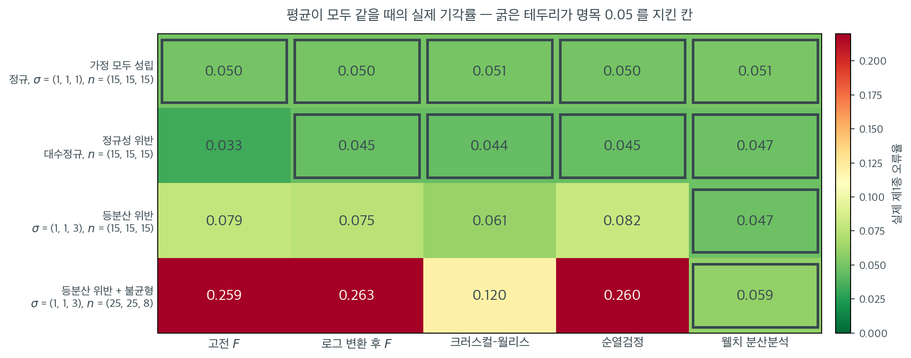

# 가정 위반의 처리

## 개요

진단 결과 분산분석의 가정이 하나 이상 어긋난 것으로 드러나면, 타당한 결론을 얻기 위해 시정 조치를 취해야 한다. 적절한 대응은 위반의 성격과 심각성에 따라 달라진다. 이 절은 위반 유형별로 대처하는 체계적인 지침을 제공한다.

## 설정

<div class="exbox" markdown>

**보기 1.** <span class="diff easy" title="쉬움"></span> 한 점이 표준편차를 얼마나 키우는가. 아래 자료는 집단 C의 마지막 관측값 하나를 $20.0$으로 바꿔 이상점을 심은 것이다.

**(1)** 관측값 $y_1, \ldots, y_n$ 의 평균을 $\bar y$, 편차제곱합을 $S = \sum_i (y_i - \bar y)^2$ 라 하자. 마지막 하나만 $y_n \to y_n + d$ 로 바꾼 자료의 평균 $\bar y'$ 와 제곱합 $S'$ 이

$$
\bar y' = \bar y + \frac{d}{n},
\qquad
S' = S + 2d\,(y_n - \bar y) + \frac{n-1}{n}\,d^2
$$

임을 보이시오. $S'$ 이 $d$ 의 **이차식**이라는 점에 주의하라.

**(2)** 이 식으로 집단 C의 표준편차가 교체 뒤 얼마가 되는지 예측하고, 실제로 교체한 값과 맞춰 보시오.

</div>

??? success "풀이"

    **(1) 해석적으로.** 편차를 $u_i = y_i - \bar y$ 라 두면 $\sum_i u_i = 0$ 이고 $S = \sum_i u_i^2$ 다. 새 자료를 $z_i$ 라 쓰면 $z_i = y_i$ ($i < n$), $z_n = y_n + d$ 이므로 합이 $d$ 만큼 늘어 평균은

    $$
    \bar z = \bar y + \frac{d}{n}
    $$

    이다. 새 편차는 $i < n$ 에서 $z_i - \bar z = u_i - d/n$ 이고, 마지막 하나는 $z_n - \bar z = u_n + d - d/n = u_n + \frac{n-1}{n}d$ 다. 제곱해 더하면

    $$
    S' = \sum_{i<n}\left(u_i - \frac{d}{n}\right)^2 + \left(u_n + \frac{n-1}{n}d\right)^2
    $$

    이다. 앞 합을 펼칠 때 교차항에 $\sum_{i<n} u_i = -u_n$ 을 쓰면

    $$
    \sum_{i<n}\left(u_i - \frac{d}{n}\right)^2
    = \left(S - u_n^2\right) + \frac{2d}{n}u_n + \frac{n-1}{n^2}d^2
    $$

    이고, 뒤 항은

    $$
    \left(u_n + \frac{n-1}{n}d\right)^2
    = u_n^2 + \frac{2(n-1)}{n}d\,u_n + \frac{(n-1)^2}{n^2}d^2
    $$

    이다. 둘을 더하면 $u_n^2$ 이 지워지고 $u_n$ 의 계수는 $\frac{2d}{n} + \frac{2(n-1)d}{n} = 2d$ 로, $d^2$ 의 계수는 $\frac{(n-1) + (n-1)^2}{n^2} = \frac{n-1}{n}$ 로 모인다. 곧

    $$
    S' = S + 2d\,u_n + \frac{n-1}{n}d^2
    = S + 2d\,(y_n - \bar y) + \frac{n-1}{n}d^2
    $$

    이다. $\square$

    여기서 읽을 것이 둘이다. 첫째, **평균은 $d$ 에 선형이고 제곱합은 $d$ 에 이차**다. 점 하나를 $d$ 만큼 끌면 평균은 $d/n$ 밖에 움직이지 않지만 흩어짐은 $d^2$ 으로 자란다. 둘째, $d$ 가 큰 쪽이 이미 평균보다 큰 쪽이면($d$ 와 $y_n - \bar y$ 가 같은 부호면) 일차항까지 더해져 더 빨리 자란다.

    **(2) 수치적으로.** 먼저 이 페이지가 쓸 자료를 만든다.

    ```python
    import numpy as np
    import pandas as pd
    from statsmodels.formula.api import ols

    # 이 페이지의 진단은 모두 아래 모형 하나를 놓고 수행한다.
    # 집단마다 표준편차를 1.0, 1.3, 1.6으로 다르게 주었고,
    # 집단 C에 이상점을 하나 심어 두었다.
    rng = np.random.default_rng(42)
    n = 20
    response = np.concatenate([
        rng.normal(10.0, 1.0, n),
        rng.normal(10.8, 1.3, n),
        rng.normal(12.0, 1.6, n),
    ])
    response[-1] = 20.0                     # 마지막 관측값을 이상점으로 만든다
    data = pd.DataFrame({
        "group": np.repeat(["A", "B", "C"], n),
        "response": response,
    })
    group1 = data.loc[data["group"] == "A", "response"]
    group2 = data.loc[data["group"] == "B", "response"]
    group3 = data.loc[data["group"] == "C", "response"]

    model = ols("response ~ C(group)", data=data).fit()

    print(data.groupby("group").response.agg(["count", "mean", "std"]).round(3))
    print(f"\nF = {model.fvalue:.4f}, p = {model.f_pvalue:.4f}")
    ```

    출력:

    ```
           count    mean    std
    group                      
    A         20   9.967  0.870
    B         20  10.942  1.034
    C         20  12.513  2.077

    F = 16.1314, p = 0.0000
    ```

    이제 (1)의 식을 집단 C에 적용한다. 같은 씨앗을 다시 꺼내 **교체 전** 상태를 되살리면 된다.

    ```python
    import numpy as np

    # 이 페이지의 자료를 교체 전 상태로 되돌려 집단 C만 꺼낸다.
    rng = np.random.default_rng(42)
    n = 20
    raw = np.concatenate([
        rng.normal(10.0, 1.0, n),
        rng.normal(10.8, 1.3, n),
        rng.normal(12.0, 1.6, n),
    ])
    yC = raw[2 * n:]

    ybar, S = yC.mean(), ((yC - yC.mean()) ** 2).sum()
    y_last, d = yC[-1], 20.0 - yC[-1]
    print(f"교체 전: ybar = {ybar:.6f}, S = {S:.6f}, s = {np.sqrt(S / (n - 1)):.6f}")
    print(f"        y_n = {y_last:.6f},  d = 20 - y_n = {d:.6f}")

    # 공식이 예측하는 값
    mean_f = ybar + d / n
    S_f = S + 2 * d * (y_last - ybar) + (n - 1) / n * d ** 2
    print(f"\n  2d(y_n - ybar) = {2 * d * (y_last - ybar):.6f}")
    print(f"  (n-1)d^2/n     = {(n - 1) / n * d ** 2:.6f}")
    print(f"공식: mean = {mean_f:.6f},  S = {S_f:.6f},  s = {np.sqrt(S_f / (n - 1)):.6f}")

    # 실제로 교체해 본 값
    yCn = yC.copy()
    yCn[-1] = 20.0
    print(f"실제: mean = {yCn.mean():.6f},  S = {((yCn - yCn.mean()) ** 2).sum():.6f},  s = {yCn.std(ddof=1):.6f}")

    s0, s1 = np.sqrt(S / (n - 1)), yCn.std(ddof=1)
    print(f"\ns 가 {s0:.4f} -> {s1:.4f} ({s1 / s0:.3f} 배)")
    ```

    출력:

    ```
    교체 전: ybar = 12.190922, S = 24.910300, s = 1.145019
            y_n = 13.549245,  d = 20 - y_n = 6.450755

      2d(y_n - ybar) = 17.524419
      (n-1)d^2/n     = 39.531624
    공식: mean = 12.513460,  S = 81.966342,  s = 2.077021
    실제: mean = 12.513460,  S = 81.966342,  s = 2.077021

    s 가 1.1450 -> 2.0770 (1.814 배)
    ```

    **공식과 실제가 소수점 여섯째 자리까지 같다.** 근사가 아니라 등식이므로 당연한 결과지만, 어느 항이 얼마를 보탰는지가 볼 만하다. 원래 제곱합이 $S = 24.9103$ 인데 **$d^2$ 항 하나가 $39.5316$ 을 보태** 전체의 절반 가까이를 차지한다. 일차항 $17.5244$ 까지 더해 $S' = 81.9663$ 이 되었고, 표준편차는 $1.1450$ 에서 $2.0770$ 으로 $1.814$ 배가 되었다.

    평균 쪽과 견주어 보라. 평균은 $d/n = 6.4508/20 = 0.3225$ 만 움직여 $12.1909$ 에서 $12.5135$ 가 되었다. **같은 한 점이 평균은 $2.6\%$, 표준편차는 $81\%$ 움직인다.** 이것이 이상점 하나가 분산분석의 가정을 흔드는 방식이다. 집단 평균은 거의 제자리에 있으므로 "평균이 다르다"는 결론은 멀쩡해 보이지만, $s_C$ 가 혼자 두 배가 되어 등분산 가정이 깨지고 합동분산이 부풀어 $F$ 가 흐려진다.

이상점 하나가 집단 C의 표준편차를 1.15에서 2.08로 키웠다. 아래 진단들이 이것을 잡아내는지 보라.

## 단계별 접근

1. **원인 파악:** 앞 절들에서 설명한 진단 도구로 어느 가정이 어느 정도로 어긋났는지 판정한다.
2. **심각성 평가:** 표본이 크고 균형 잡혀 있으면 가벼운 위반은 결과에 거의 영향을 주지 않을 수 있다. 심한 위반은 시정 조치가 필요하다.
3. **처방 선택:** 구체적인 위반에 따라 아래 선택지 중에서 고른다.
4. **개선 확인:** 보정을 적용한 뒤 진단을 다시 수행하여 가정이 이제 충족되는지 확인한다.

## 비모수 대안

### Kruskal-Wallis 검정

정규성 가정이 어긋날 때 Kruskal-Wallis 검정은 일원배치 분산분석의 비모수 대안이 된다. 집단 사이에서 평균 대신 중앙값(더 정확히는 평균 순위)을 비교하며 잔차의 정규성을 가정하지 않는다.

<div class="exbox" markdown>

**보기 2.** <span class="diff easy" title="쉬움"></span> Kruskal-Wallis 검정. 동점이 없을 때 통계량은 집단별 평균순위 $\bar R_i$ 만으로 적힌다.

**(1)** 전체 순위 $1, \ldots, N$ 의 표본분산이 $\dfrac{N(N+1)}{12}$ 임을 쓰고,

$$
H = \frac{\sum_i n_i\left(\bar R_i - \frac{N+1}{2}\right)^2}{N(N+1)/12}
= \frac{12}{N(N+1)}\sum_{i=1}^{k} n_i \bar R_i^2 - 3(N+1)
$$

임을 보이시오. 이 자료($k=3$, $n_i = 20$, $N = 60$)에서는 $H = \frac{4}{61}\sum_i \bar R_i^2 - 183$ 이 된다.

**(2)** 평균순위에서 $H$ 를 직접 계산해 `scipy.stats.kruskal` 과 맞추고, 이상점 $20.0$ 을 $200.0$ 으로 바꾸면 $H$ 와 $F$ 가 각각 어떻게 되는지 보시오.

</div>

??? success "풀이"

    **(1) 해석적으로.** 동점이 없으면 순위는 $1, \ldots, N$ 의 순열이므로 전체 평균순위가 $\bar R = \frac{N+1}{2}$ 이고

    $$
    \sum_{r=1}^{N}\left(r - \frac{N+1}{2}\right)^2 = \frac{N(N^2-1)}{12}
    $$

    이다. $N-1$ 로 나누면 표본분산이 $\dfrac{N(N+1)}{12}$ 다. **자료가 무엇이든 이 값은 고정**이라는 것이 순위 검정의 핵심이다. 그러므로 집단 간 제곱합을 이 고정된 분산으로 나눈 양

    $$
    H = \frac{12}{N(N+1)}\sum_i n_i\left(\bar R_i - \frac{N+1}{2}\right)^2
    $$

    이 곧바로 척도 없는 통계량이 된다. 괄호를 펼치면

    $$
    \sum_i n_i\left(\bar R_i - \tfrac{N+1}{2}\right)^2
    = \sum_i n_i \bar R_i^2 - (N+1)\sum_i n_i \bar R_i + \frac{(N+1)^2}{4}\sum_i n_i
    $$

    이고, $\sum_i n_i \bar R_i = \sum_r r = \frac{N(N+1)}{2}$, $\sum_i n_i = N$ 이므로 뒤 두 항이

    $$
    -\frac{N(N+1)^2}{2} + \frac{N(N+1)^2}{4} = -\frac{N(N+1)^2}{4}
    $$

    로 합쳐진다. $\frac{12}{N(N+1)}$ 을 곱하면 그 항은 $-3(N+1)$ 이 되어

    $$
    H = \frac{12}{N(N+1)}\sum_i n_i \bar R_i^2 - 3(N+1)
    $$

    을 얻는다. $\square$ 이 자료는 $N = 60$, $n_i = 20$ 이므로 $\frac{12 \cdot 20}{60 \cdot 61} = \frac{4}{61}$, $3(N+1) = 183$ 이다.

    **(2) 수치적으로.** 먼저 검정을 그대로 돌린다.

    ```python
    from scipy.stats import kruskal

    # 값 대신 순위로 계산하므로 정규성을 요구하지 않는다. 그 대신 정규자료에서는
    # 분산분석보다 검정력이 조금 낮고, 견주는 대상이 평균이 아니라 분포의 위치다.
    stat, p_value = kruskal(group1, group2, group3)
    print(f"Kruskal-Wallis: H = {stat:.4f}, p-value = {p_value:.4f}")
    ```

    출력:

    ```
    Kruskal-Wallis: H = 26.0698, p-value = 0.0000
    ```

    이제 평균순위에서 공식으로 다시 계산하고, 이상점의 **크기**를 바꿔 본다.

    ```python
    import numpy as np
    from scipy import stats

    rng = np.random.default_rng(42)
    n = 20
    response = np.concatenate([
        rng.normal(10.0, 1.0, n), rng.normal(10.8, 1.3, n), rng.normal(12.0, 1.6, n)])
    response[-1] = 20.0
    group1, group2, group3 = response[:n], response[n:2 * n], response[2 * n:]
    N = 3 * n

    # 전체 순위를 매기고 집단별 평균순위를 본다.
    R = stats.rankdata(response)
    Rbar = [R[:n].mean(), R[n:2 * n].mean(), R[2 * n:].mean()]
    print("동점 없음:", len(np.unique(response)) == N)
    print("평균순위:", [f"{r:.3f}" for r in Rbar], " 전체평균 (N+1)/2 =", (N + 1) / 2)

    H_formula = 12 / (N * (N + 1)) * sum(n * r ** 2 for r in Rbar) - 3 * (N + 1)
    H_scipy, p = stats.kruskal(group1, group2, group3)
    print(f"\n공식 H = {H_formula:.6f}")
    print(f"scipy H = {H_scipy:.6f},  p = {p:.4e}")
    print(f"chi2(2) 꼬리확률 = {stats.chi2.sf(H_formula, 2):.4e}")

    # 완전분리일 때의 최대값
    Rmax = [10.5, 30.5, 50.5]
    print(f"완전분리 H = {12 / (N * (N + 1)) * sum(n * r ** 2 for r in Rmax) - 3 * (N + 1):.4f}")

    # 이상점의 크기를 열 배로 키워 본다.
    big = response.copy()
    big[-1] = 200.0
    print(f"\n{'이상점':>8}{'H':>12}{'KW p':>12}{'F':>10}{'ANOVA p':>12}")
    for lab, arr in [("20.0", response), ("200.0", big)]:
        gs = (arr[:n], arr[n:2 * n], arr[2 * n:])
        H, ph = stats.kruskal(*gs)
        F, pf = stats.f_oneway(*gs)
        print(f"{lab:>8}{H:>12.6f}{ph:>12.2e}{F:>10.4f}{pf:>12.2e}")
    ```

    출력:

    ```
    동점 없음: True
    평균순위: ['16.900', '29.550', '45.050']  전체평균 (N+1)/2 = 30.5

    공식 H = 26.069836
    scipy H = 26.069836,  p = 2.1828e-06
    chi2(2) 꼬리확률 = 2.1828e-06
    완전분리 H = 52.4590

         이상점           H        KW p         F     ANOVA p
        20.0   26.069836    2.18e-06   16.1314    2.81e-06
       200.0   26.069836    2.18e-06    1.3915    2.57e-01
    ```

    **공식과 `scipy` 가 소수점 여섯째 자리까지 같다.** 손으로 따라가면 $\sum_i \bar R_i^2 = 16.900^2 + 29.550^2 + 45.050^2 = 3188.315$ 이고 $\frac{4}{61}\cdot 3188.315 - 183 = 209.0698 - 183 = 26.0698$ 이다. p-값도 $\chi^2_2$ 의 꼬리확률 $2.18 \times 10^{-6}$ 과 같아, `scipy` 가 카이제곱 근사를 쓰고 있음을 확인할 수 있다.

    $H$ 의 크기를 재는 자도 함께 두었다. 세 집단이 **완전히 분리**되어 순위가 $1$–$20$, $21$–$40$, $41$–$60$ 으로 갈린다면 $H = 52.459$ 다. 관측값 $26.07$ 은 그 절반쯤이므로 집단이 겹쳐 있긴 하지만 평균순위가 $16.9$, $29.6$, $45.1$ 로 또렷이 어긋나 있다.

    **마지막 표가 이 보기의 요점이다.** 이상점을 $20.0$ 에서 $200.0$ 으로 열 배 키워도 $H$ 는 **소수점 여섯째 자리까지 한 치도 바뀌지 않는다.** 순위가 그대로이기 때문이다. 그 점은 바꾸기 전에도 뒤에도 "집단 C의 가장 큰 값"일 뿐이고, $H$ 는 그 사실만 쓴다. 반면 고전적 $F$ 는 $16.13$ 에서 $1.39$ 로 주저앉아 $p = 0.257$ 이 된다. **한 점이 집단 C의 분산을 혼자 떠맡아 합동분산을 부풀렸고, 그 결과 분명히 다른 세 평균이 "차이 없음"으로 보고된다.** 비모수 대안의 값이 어디에 있는지 이보다 분명한 예는 드물다.

Kruskal-Wallis는 값 자체가 아니라 **순위**를 쓰므로, 20.0이라는 이상점이 "가장 큰 값"이라는 정보로만 쓰이고 그 크기는 결과에 영향을 주지 않는다.

Kruskal-Wallis 검정은 이상점이나 치우친 분포에 덜 민감하지만, 분포의 모양이 같고 위치만 다르다고 가정한다. 자세한 내용은 [Kruskal-Wallis 검정](../../ch16/multi_group_nonparametric/kruskal_wallis.md)을 보라.

## 자료 변환

변환은 자료의 척도를 바꾸어 정규성과 등분산성 위반을 한꺼번에 다룰 수 있다.

### 로그 변환

자료가 양의 방향으로 치우쳐 있거나 분산이 평균과 함께 커질 때 쓴다:

$$
Y' = \log(Y) \quad \text{or} \quad Y' = \log(Y + c) \text{ if } Y \text{ contains zeros}
$$

<div class="exbox" markdown>

**보기 3.** <span class="diff easy" title="쉬움"></span> 로그 변환이 무엇을 고치고 무엇을 바꾸는가.

**(1)** 델타법으로

$$
\operatorname{sd}(\log Y) \approx \frac{\sigma}{\mu} = \operatorname{CV}(Y)
$$

임을 보이고, 따라서 **로그 변환이 등분산을 회복시키는 조건은 집단마다 변동계수가 같은 것**임을 결론하시오.

**(2)** 로그척도의 평균을 되돌린 $\exp(\overline{\log Y})$ 는 산술평균이 아니라 **기하평균**이고, $\operatorname{CV}$ 가 작을 때

$$
\frac{\text{기하평균}}{\text{산술평균}} \approx 1 - \frac{1}{2}\operatorname{CV}^2
$$

임을 보이시오.

**(3)** 세 집단에서 $\operatorname{CV}$ 와 $\operatorname{sd}(\log Y)$, 그리고 두 평균의 비를 재어 (1)과 (2)를 확인하시오. 어느 집단에서 근사가 가장 나쁜가.

</div>

??? success "풀이"

    **(1) 해석적으로.** $g$ 가 $\mu$ 근처에서 매끄러우면 $g(Y) \approx g(\mu) + g'(\mu)(Y-\mu)$ 이므로

    $$
    \operatorname{Var}\big(g(Y)\big) \approx g'(\mu)^2 \sigma^2
    $$

    이다. $g = \log$ 에서 $g'(\mu) = 1/\mu$ 이므로

    $$
    \operatorname{sd}(\log Y) \approx \frac{\sigma}{\mu} = \operatorname{CV}(Y)
    $$

    를 얻는다. **로그를 취하면 표준편차가 변동계수로 바뀐다.** 그러므로 로그 변환 뒤 집단별 분산이 같아지는 것은 원래 자료에서 $\sigma_i/\mu_i$ 가 집단마다 같을 때, 곧 $\sigma_i \propto \mu_i$ 일 때다. 평균이 커지면서 퍼짐도 비례해 커지는 자료가 바로 그 경우다.

    거꾸로 **평균이 집단마다 같고 분산만 다르면 로그 변환은 아무것도 고치지 못한다.** $\mu_1 = \mu_2$ 이면 두 집단의 $g'(\mu_i)$ 가 같으므로 분산비 $\sigma_1^2/\sigma_2^2$ 이 변환 뒤에도 그대로 남는다. 이 쪽 끝의 그림에서 셋째·넷째 줄이 그 상황이며 로그 변환이 듣지 않는 까닭이 이것이다.

    **(2) 해석적으로.** 로그척도의 표본평균을 되돌리면

    $$
    \exp\left(\frac{1}{n}\sum_j \log y_j\right) = \left(\prod_j y_j\right)^{1/n}
    $$

    로 정의상 **기하평균**이다. 크기를 보려면 $Y = \mu(1+\varepsilon)$, $\varepsilon = (Y-\mu)/\mu$ 로 두자. $E[\varepsilon] = 0$, $E[\varepsilon^2] = \operatorname{CV}^2$ 이고

    $$
    \log(1+\varepsilon) = \varepsilon - \frac{\varepsilon^2}{2} + O(\varepsilon^3)
    $$

    이므로

    $$
    E[\log Y] = \log\mu + E[\log(1+\varepsilon)] \approx \log\mu - \frac{\operatorname{CV}^2}{2}
    $$

    이다. 지수를 취하면

    $$
    \exp\big(E[\log Y]\big) \approx \mu\, e^{-\operatorname{CV}^2/2} \approx \mu\left(1 - \frac{\operatorname{CV}^2}{2}\right)
    $$

    를 얻는다. 부등식 $\exp(E[\log Y]) \le E[Y]$ 는 $\log$ 가 오목하므로 옌센 부등식에서 **근사 없이** 성립하고, 위 식은 그 차이의 크기를 $\operatorname{CV}^2$ 으로 재어 준다.

    여기서 주의할 것이 이 쪽의 경고문이 말하는 바로 그것이다. **로그척도에서 분산분석을 돌리면 검정하는 가설은 기하평균의 동일성이고, 추정값을 되돌려도 산술평균이 나오지 않는다.** 치우침이 클수록 두 평균이 벌어진다.

    **(3) 수치적으로.** 먼저 로그척도의 요약을 본다.

    ```python
    import numpy as np

    # 로그 변환은 오른쪽으로 늘어진 자료를 펴 준다. 퍼짐이 평균에 비례해 커지는
    # 자료라면 변환 뒤 등분산과 정규성이 함께 좋아지는 일이 흔하다.
    # 다만 결과의 해석이 원래 단위가 아니게 된다는 대가가 따른다.
    data['log_response'] = np.log(data['response'])
    print(data.groupby('group').log_response.agg(['mean', 'std']).round(4))
    ```

    출력:

    ```
             mean     std
    group                
    A      2.2955  0.0900
    B      2.3886  0.0918
    C      2.5159  0.1460
    ```

    이제 (1)과 (2)의 두 근사를 집단마다 재어 본다.

    ```python
    import numpy as np
    import pandas as pd

    rng = np.random.default_rng(42)
    n = 20
    response = np.concatenate([
        rng.normal(10.0, 1.0, n), rng.normal(10.8, 1.3, n), rng.normal(12.0, 1.6, n)])
    response[-1] = 20.0
    data = pd.DataFrame({"group": np.repeat(["A", "B", "C"], n), "response": response})
    data["log_response"] = np.log(data["response"])

    print(f"{'집단':>4}{'mean':>9}{'sd':>8}{'CV':>9}{'sd(logY)':>10}{'오차':>8}")
    for g, sub in data.groupby("group"):
        m, s = sub.response.mean(), sub.response.std(ddof=1)
        cv, sl = s / m, sub.log_response.std(ddof=1)
        print(f"{g:>4}{m:>9.4f}{s:>8.4f}{cv:>9.4f}{sl:>10.4f}{sl / cv - 1:>7.1%}")

    print(f"\n{'집단':>4}{'산술평균':>10}{'기하평균':>10}{'GM/AM':>9}{'1-CV^2/2':>10}")
    for g, sub in data.groupby("group"):
        am, gm = sub.response.mean(), np.exp(sub.log_response.mean())
        cv = sub.response.std(ddof=1) / am
        print(f"{g:>4}{am:>10.4f}{gm:>10.4f}{gm / am:>9.4f}{1 - cv ** 2 / 2:>10.4f}")

    # 분산비가 얼마나 좁혀졌는가
    for lab, col in [("원척도", "response"), ("로그척도", "log_response")]:
        sd = data.groupby("group")[col].std(ddof=1)
        print(f"\n{lab}: sd = {sd.round(4).tolist()},  최대/최소 = {sd.max() / sd.min():.3f}")
    ```

    출력:

    ```
      집단     mean      sd       CV  sd(logY)      오차
       A   9.9671  0.8702   0.0873    0.0900   3.1%
       B  10.9423  1.0335   0.0945    0.0918  -2.8%
       C  12.5135  2.0770   0.1660    0.1460 -12.1%

      집단      산술평균      기하평균    GM/AM  1-CV^2/2
       A    9.9671    9.9296   0.9962    0.9962
       B   10.9423   10.8978   0.9959    0.9955
       C   12.5135   12.3771   0.9891    0.9862

    원척도: sd = [0.8702, 1.0335, 2.077],  최대/최소 = 2.387

    로그척도: sd = [0.09, 0.0918, 0.146],  최대/최소 = 1.622
    ```

    **델타법이 A와 B에서는 맞고 C에서는 틀린다.** 집단 A는 $\operatorname{CV} = 0.0873$ 에 $\operatorname{sd}(\log Y) = 0.0900$ 으로 $3.1\%$, B는 $0.0945$ 대 $0.0918$ 로 $-2.8\%$ 어긋난다. 그런데 **집단 C는 $0.1660$ 대 $0.1460$ 으로 $-12.1\%$** 다. 까닭이 분명하다. 델타법은 $Y$ 가 $\mu$ 근처에 모여 있다는 전제에서 $\log$ 를 일차로 펴는 것인데, 집단 C의 이상점 $20.0$ 은 평균에서 $3.6$ 표준편차 너머에 있어 그 전제를 깬다. 그 점에서 $\log$ 의 실제 기울기는 $1/\mu$ 보다 훨씬 작으므로($1/20 < 1/12.5$) 변환 뒤의 편차가 일차근사보다 **작아진다.** 그래서 오차의 부호가 음이다.

    **(2)의 근사도 같은 방향으로 어긋난다.** A에서 $\mathrm{GM}/\mathrm{AM} = 0.9962$ 와 $1 - \operatorname{CV}^2/2 = 0.9962$ 가 소수점 넷째 자리까지 같지만, C에서는 $0.9891$ 대 $0.9862$ 로 벌어진다. $\operatorname{CV}$ 가 커지면 $O(\varepsilon^3)$ 항이 살아나기 때문이다. 어느 경우에도 **기하평균이 산술평균보다 작다**는 옌센의 방향은 세 집단 모두에서 지켜진다.

    마지막 두 줄이 이 변환이 실제로 한 일이다. 표준편차의 최대/최소 비가 원척도에서 $2.387$ 이던 것이 로그척도에서 $1.622$ 로 줄었다. **고쳐지기는 했으나 다 고쳐지지는 않았다.** 집단 C의 흩어짐이 큰 것은 평균이 커서가 아니라 이상점 하나 때문이므로, 평균에 비례하는 부분만 로그가 흡수하고 나머지는 남는다. 이 쪽 끝의 처방 표를 "이분산에는 변환"으로 읽으면 안 되는 이유다.

로그를 취하니 집단별 표준편차가 0.090, 0.092, 0.146으로 좁혀졌다. 원래 척도에서는 0.87, 1.03, 2.08이었다. 분산이 평균과 함께 커지는 자료에서 로그 변환이 등분산성을 회복시키는 전형적인 모습이다.

### 제곱근 변환

포아송 계열 분포를 따르는 도수 자료에 유용하다:

$$
Y' = \sqrt{Y}
$$

<div class="exbox" markdown>

**보기 4.** <span class="diff easy" title="쉬움"></span> 어떤 거듭제곱이 분산을 안정시키는가. 집단별로 $\sigma_i = c\,\mu_i^{\alpha}$ 인 자료를 생각하자.

**(1)** 거듭제곱변환 $g(y) = y^{\lambda}$ ($\lambda \ne 0$)에 델타법을 써서 $\operatorname{sd}(Y^\lambda) \propto \mu^{\lambda - 1 + \alpha}$ 임을 보이고, 따라서 **분산을 안정시키는 지수가 $\lambda = 1 - \alpha$** 임을 결론하시오. 포아송 자료($\alpha = 1/2$)와 변동계수가 일정한 자료($\alpha = 1$)에서 이 규칙이 각각 무엇을 주는가.

**(2)** $\lambda = 1/2$ 일 때 $\operatorname{sd}(\sqrt{Y}) \approx \dfrac{\sigma}{2\sqrt{\mu}}$ 임을 확인하고, 세 집단에서 이 근사를 재어 보시오.

**(3)** 평균을 $\mu = 5, 20, 80, 320$ 으로 바꿔 가며 포아송 자료를 만들어 (1)의 규칙을 확인하시오. $\operatorname{sd}(\sqrt{Y})$ 가 어느 값으로 가야 하는가.

</div>

??? success "풀이"

    **(1) 해석적으로.** $g(y) = y^\lambda$ 이면 $g'(\mu) = \lambda\mu^{\lambda-1}$ 이므로 델타법으로

    $$
    \operatorname{sd}(Y^\lambda) \approx |\lambda|\,\mu^{\lambda-1}\sigma
    = |\lambda|\,c\,\mu^{\lambda - 1 + \alpha}
    $$

    이다. 이것이 $\mu$ 에 **의존하지 않으려면** 지수가 $0$ 이어야 하므로

    $$
    \lambda - 1 + \alpha = 0
    \qquad\Longleftrightarrow\qquad
    \boxed{\lambda = 1 - \alpha}
    $$

    이다. 두 경우를 넣어 보자.

    | 자료 | $\sigma$ 와 $\mu$ 의 관계 | $\alpha$ | $\lambda = 1-\alpha$ | 변환 |
    |---|---|---|---|---|
    | 포아송 도수 | $\sigma = \sqrt{\mu}$ | $1/2$ | $1/2$ | **제곱근** |
    | 변동계수 일정 | $\sigma = c\mu$ | $1$ | $0$ | **로그** |
    | 분산 일정 | $\sigma = c$ | $0$ | $1$ | 변환 불필요 |

    $\alpha = 1$ 에서 $\lambda = 0$ 이 되는데, 이때 $g(y) = y^0 = 1$ 은 쓸모가 없다. Box-Cox 족이 $\lambda \to 0$ 의 극한을 $\log y$ 로 메꾸는 이유가 여기에 있다. $\frac{y^\lambda - 1}{\lambda} \to \log y$ 이므로 **로그는 "$\lambda = 0$ 인 거듭제곱"으로 보는 것이 맞다.** 따라서 $\alpha$ 가 클수록($\sigma$ 가 $\mu$ 와 더 빠르게 함께 자랄수록) $\lambda$ 가 작아지고 변환이 세진다. 이것이 "로그가 제곱근보다 세다"는 말의 내용이며, 다음 보기의 Box-Cox 가 $\lambda$ 를 자료에서 고르는 일을 한다.

    **(2) 해석적으로.** $\lambda = 1/2$ 를 넣으면

    $$
    \operatorname{sd}(\sqrt{Y}) \approx \frac{1}{2}\mu^{-1/2}\sigma = \frac{\sigma}{2\sqrt{\mu}}
    $$

    다. 포아송에서 $\sigma = \sqrt\mu$ 를 넣으면 $\operatorname{sd}(\sqrt Y) \approx 1/2$ 로 **$\mu$ 와 무관한 상수**가 된다. 이것이 (3)에서 확인할 값이다.

    **(3) 수치적으로.** 먼저 이 쪽 자료의 제곱근척도 요약을 본다.

    ```python
    # 제곱근 변환은 로그보다 약하게 편다. 도수 자료처럼 분산이 평균에 비례하는
    # 경우에 알맞다.
    data['sqrt_response'] = np.sqrt(data['response'])
    print(data.groupby('group').sqrt_response.agg(['mean', 'std']).round(4))
    ```

    출력:

    ```
             mean     std
    group                
    A      3.1541  0.1398
    B      3.3045  0.1538
    C      3.5274  0.2735
    ```

    이제 (2)의 근사를 재고, 포아송 자료로 (1)의 규칙을 시험한다.

    ```python
    import numpy as np
    import pandas as pd

    rng = np.random.default_rng(42)
    n = 20
    response = np.concatenate([
        rng.normal(10.0, 1.0, n), rng.normal(10.8, 1.3, n), rng.normal(12.0, 1.6, n)])
    response[-1] = 20.0
    data = pd.DataFrame({"group": np.repeat(["A", "B", "C"], n), "response": response})
    data["sqrt_response"] = np.sqrt(data["response"])

    print(f"{'집단':>4}{'mean':>9}{'sd':>8}{'sd/(2*sqrt(mean))':>20}{'sd(sqrtY)':>11}{'오차':>8}")
    for g, sub in data.groupby("group"):
        m, s = sub.response.mean(), sub.response.std(ddof=1)
        pred, act = s / (2 * np.sqrt(m)), sub.sqrt_response.std(ddof=1)
        print(f"{g:>4}{m:>9.4f}{s:>8.4f}{pred:>20.4f}{act:>11.4f}{act / pred - 1:>7.1%}")

    # 세 척도에서 흩어짐의 불균형 정도
    data["log_response"] = np.log(data["response"])
    print()
    for lab, col in [("원척도", "response"), ("제곱근", "sqrt_response"), ("로그", "log_response")]:
        sd = data.groupby("group")[col].std(ddof=1)
        print(f"{lab:>6}: sd 최대/최소 = {sd.max() / sd.min():.3f}")

    # lambda = 1 - alpha 규칙: 포아송(alpha=1/2)에서는 제곱근이 맞는다
    print(f"\n포아송 자료, 평균을 바꿔 가며 sd(Y^lambda) 를 재 본다 (목표: lambda 열이 평평)")
    rg = np.random.default_rng(7)
    print(f"{'mu':>6}{'sd(Y)':>9}{'sd(sqrtY)':>11}{'sd(logY)':>10}")
    for mu in [5, 20, 80, 320]:
        y = rg.poisson(mu, 200_000).astype(float)
        y[y == 0] = 0.5                                  # 로그를 위해 0만 보정
        print(f"{mu:>6}{y.std(ddof=1):>9.3f}{np.sqrt(y).std(ddof=1):>11.4f}{np.log(y).std(ddof=1):>10.4f}")
    print("이론: sd(sqrt Y) -> 1/2 = 0.5000,  sd(log Y) ~ 1/sqrt(mu)")
    ```

    출력:

    ```
      집단     mean      sd   sd/(2*sqrt(mean))  sd(sqrtY)      오차
       A   9.9671  0.8702              0.1378     0.1398   1.4%
       B  10.9423  1.0335              0.1562     0.1538  -1.5%
       C  12.5135  2.0770              0.2936     0.2735  -6.8%

       원척도: sd 최대/최소 = 2.387
       제곱근: sd 최대/최소 = 1.956
        로그: sd 최대/최소 = 1.622

    포아송 자료, 평균을 바꿔 가며 sd(Y^lambda) 를 재 본다 (목표: lambda 열이 평평)
        mu    sd(Y)  sd(sqrtY)  sd(logY)
         5    2.227     0.5176    0.5340
        20    4.466     0.5047    0.2330
        80    8.957     0.5018    0.1130
       320   17.907     0.5009    0.0561
    이론: sd(sqrt Y) -> 1/2 = 0.5000,  sd(log Y) ~ 1/sqrt(mu)
    ```

    **(2)의 근사는 A와 B에서 $1.5\%$ 안쪽으로 맞고 C에서 $-6.8\%$ 어긋난다.** 보기 3의 로그에서 $-12.1\%$ 였던 것보다 작다. 제곱근이 로그보다 약한 변환이므로 이상점이 있는 자료에서 일차근사가 덜 깨지는 것이다.

    **포아송 표가 (1)의 규칙 자체를 확인해 준다.** 평균을 $5$ 에서 $320$ 으로 $64$ 배 키우는 동안 원척도의 $\operatorname{sd}(Y)$ 는 $2.227 \to 17.907$ 로 $\sqrt{64} = 8$ 배가 되는데(이것이 $\alpha = 1/2$ 이다), $\operatorname{sd}(\sqrt Y)$ 는 $0.5176,\ 0.5047,\ 0.5018,\ 0.5009$ 로 **이론값 $1/2$ 에 붙어 꼼짝하지 않는다.** $\mu$ 가 커질수록 더 정확해지는 것은 델타법이 점근적 결과이기 때문이다. 같은 자료에 로그를 취하면 $0.5340 \to 0.0561$ 로 열 배 가까이 줄어드는데, 이론이 예측하는 $1/\sqrt\mu$ 는 $\mu = 20,\ 80,\ 320$ 에서 $0.2236,\ 0.1118,\ 0.0559$ 이므로 셋 다 맞는다($\mu = 5$ 에서 어긋나는 것은 $0$ 을 $0.5$ 로 고친 보정 탓이다). **포아송 자료에 로그를 쓰면 과하게 변환해 평균이 큰 집단의 분산을 거꾸로 짓눌러 버린다.**

    가운데 세 줄은 이 쪽 자료의 처지를 보여 준다. 흩어짐의 불균형이 $2.387 \to 1.956 \to 1.622$ 로 변환이 세질수록 줄어든다. 그러나 **어느 변환도 $1$ 에 닿지 못한다.** 집단 C의 흩어짐이 큰 것이 "평균이 커서"가 아니라 "이상점 하나 때문"이므로 $\sigma_i = c\mu_i^\alpha$ 라는 (1)의 전제 자체가 이 자료에서 성립하지 않는다. 변환으로 고칠 수 있는 이분산과 그렇지 않은 이분산을 가르는 선이 바로 이 전제다.

제곱근 변환은 로그보다 약하게 작용한다. 표준편차가 0.140, 0.154, 0.274로 여전히 두 배 가까이 벌어져 있다. 변환의 세기는 로그 > 제곱근 순이며, 자료의 치우침 정도에 맞춰 골라야 한다.

### Box-Cox 변환

$\lambda$로 모수화된 거듭제곱 변환의 족으로, 정규성에 가장 가까워지도록 $\lambda$를 최적화할 수 있다:

$$
Y'(\lambda) = \begin{cases} \frac{Y^\lambda - 1}{\lambda} & \text{if } \lambda \neq 0 \\ \log(Y) & \text{if } \lambda = 0 \end{cases}
$$

<div class="exbox" markdown>

**보기 5.** <span class="diff easy" title="쉬움"></span> Box-Cox의 $\lambda$ 는 무엇을 최대화하는가. `scipy.stats.boxcox` 는 $Y^{(\lambda)} \sim N(\mu, \sigma^2)$ 를 가정한 최대가능도로 $\lambda$ 를 고른다.

**(1)** 변환의 야코비안이 $\dfrac{dy^{(\lambda)}}{dy} = y^{\lambda-1}$ 임을 쓰고, $\mu$ 와 $\sigma^2$ 을 프로파일로 제거하여

$$
\ell_p(\lambda) = -\frac{n}{2}\log \hat\sigma^2(\lambda) + (\lambda - 1)\sum_{i} \log y_i + \text{상수},
\qquad
\hat\sigma^2(\lambda) = \frac{1}{n}\sum_i \left(y_i^{(\lambda)} - \overline{y^{(\lambda)}}\right)^2
$$

임을 보이시오.

**(2)** 뒤 항(야코비안)을 빼면 $\lambda \to -\infty$ 에서 기준이 발산해 버린다. 왜 그런지 밝히시오.

**(3)** $\ell_p$ 를 직접 짜서 `scipy` 의 $\hat\lambda = -1.5414$ 를 재현하고, **이상점 하나를 빼면 $\hat\lambda$ 가 어디로 가는지** 보시오. 집단평균을 따로 두고 프로파일하면 달라지는가.

</div>

??? success "풀이"

    **(1) 해석적으로.** $\lambda \ne 0$ 에서 $y^{(\lambda)} = \frac{y^\lambda - 1}{\lambda}$ 이므로

    $$
    \frac{dy^{(\lambda)}}{dy} = \frac{\lambda y^{\lambda-1}}{\lambda} = y^{\lambda - 1}
    $$

    다. $Y^{(\lambda)} \sim N(\mu, \sigma^2)$ 라면 변수변환으로 $Y$ 자체의 밀도는

    $$
    f_Y(y) = \frac{1}{\sqrt{2\pi}\sigma}\exp\left\{-\frac{(y^{(\lambda)} - \mu)^2}{2\sigma^2}\right\} \cdot y^{\lambda-1}
    $$

    이고, 로그가능도는

    $$
    \ell(\lambda, \mu, \sigma^2)
    = -\frac{n}{2}\log(2\pi\sigma^2)
    - \frac{1}{2\sigma^2}\sum_i \left(y_i^{(\lambda)} - \mu\right)^2
    + (\lambda-1)\sum_i \log y_i
    $$

    이다. $\lambda$ 를 고정하면 뒤 항은 상수이므로 앞 두 항은 보통의 정규 가능도다. 따라서

    $$
    \hat\mu(\lambda) = \overline{y^{(\lambda)}},
    \qquad
    \hat\sigma^2(\lambda) = \frac{1}{n}\sum_i \left(y_i^{(\lambda)} - \overline{y^{(\lambda)}}\right)^2
    $$

    이고, 이를 넣으면 둘째 항이 $-n/2$ 라는 상수가 되어

    $$
    \ell_p(\lambda) = -\frac{n}{2}\log\hat\sigma^2(\lambda) + (\lambda-1)\sum_i \log y_i + \text{상수}
    $$

    를 얻는다. $\square$

    **(2) 해석적으로.** 야코비안 항이 없으면 기준은 $-\frac n2\log\hat\sigma^2(\lambda)$ 뿐이므로 **변환된 자료의 분산을 작게 만들수록 좋아진다.** 그런데 $\lambda < 0$ 에서 $|\lambda|$ 를 키우면 모든 $y_i^{\lambda} \to 0$ 이고 $y^{(\lambda)} = (y^\lambda-1)/\lambda \to 0$ 이므로 변환된 값들이 한 점으로 뭉쳐 $\hat\sigma^2(\lambda) \to 0$, 곧 $-\frac n2\log\hat\sigma^2 \to +\infty$ 가 된다. **단지 자료를 잘게 축소했을 뿐인데 "더 정규답다"고 셈하는 것이다.**

    야코비안이 하는 일이 정확히 그 축소를 되돌리는 것이다. 이 자료는 모든 $y_i > 1$ 이라 $\sum_i \log y_i > 0$ 이므로 $(\lambda-1)\sum_i \log y_i \to -\infty$ 가 되어 발산을 정확히 상쇄한다. **야코비안은 서로 다른 $\lambda$ 의 가능도를 같은 자에 올려 두는 장치**이며, 그것 없이는 $\lambda$ 를 비교하는 일 자체가 뜻을 잃는다.

    **(3) 수치적으로.** 먼저 `scipy` 를 그대로 부른다.

    ```python
    from scipy.stats import boxcox

    # boxcox는 양수 자료만 받는다. 0이나 음수가 있으면 상수를 더해야 한다.
    transformed_data, best_lambda = boxcox(data['response'])
    print(f"Optimal lambda = {best_lambda:.4f}")
    ```

    출력:

    ```
    Optimal lambda = -1.5414
    ```

    이제 $\ell_p$ 를 직접 짜서 맞춰 보고, 야코비안을 뺀 기준과 견주고, 이상점을 빼 본다.

    ```python
    import numpy as np
    from scipy import stats, optimize

    rng = np.random.default_rng(42)
    n = 20
    clean = np.concatenate([
        rng.normal(10.0, 1.0, n), rng.normal(10.8, 1.3, n), rng.normal(12.0, 1.6, n)])
    response = clean.copy()
    response[-1] = 20.0                       # 이상점
    grp = np.repeat([0, 1, 2], n)

    def bc(y, lam):
        return np.log(y) if lam == 0 else (y ** lam - 1) / lam

    def llf(lam, y, by_group=False):
        """프로파일 로그가능도. by_group=True 면 집단마다 평균을 따로 둔다."""
        z = bc(y, lam)
        mu = np.array([z[grp == g].mean() for g in grp]) if by_group else z.mean()
        r = z - mu
        return -len(y) / 2 * np.log((r ** 2).mean()) + (lam - 1) * np.log(y).sum()

    print(f"sum log y = {np.log(response).sum():.4f}")
    print(f"\n{'lambda':>9}{'내 식':>12}{'scipy':>12}{'야코비 없이':>14}")
    for lam in [-6.0, -3.0, -2.0, -1.5414, -1.0, 0.0, 1.0]:
        z = bc(response, lam)
        print(f"{lam:>9.4f}{llf(lam, response):>12.4f}{stats.boxcox_llf(lam, response):>12.4f}"
              f"{-len(response) / 2 * np.log(z.var()):>14.3f}")

    _, lam_scipy = stats.boxcox(response)
    mine = optimize.minimize_scalar(lambda L: -llf(L, response), bracket=(-5, 0, 5)).x
    lam_grp = optimize.minimize_scalar(
        lambda L: -llf(L, response, by_group=True), bracket=(-5, 0, 5)).x
    _, lam_clean = stats.boxcox(clean)
    print(f"\nscipy boxcox lambda      = {lam_scipy:.6f}")
    print(f"내 식의 argmax           = {mine:.6f}")
    print(f"집단평균을 따로 둔 lambda = {lam_grp:.6f}")
    print(f"이상점을 빼면 lambda     = {lam_clean:.6f}   (0 = 로그)")

    print(f"\n{'척도':>20}{'왜도':>8}{'Shapiro p':>11}{'sd 최대/최소':>12}{'이상점 z':>10}")
    for lab, lam in [("원자료 lam=1", 1.0), ("로그 lam=0", 0.0),
                     ("scipy lam=-1.5414", lam_scipy), ("집단별 lam=-1.5262", lam_grp)]:
        z = bc(response, lam)
        sds = [z[grp == g].std(ddof=1) for g in range(3)]
        r = z - np.array([z[grp == g].mean() for g in grp])
        zout = (z[-1] - z[grp == 2].mean()) / sds[2]
        print(f"{lab:>20}{stats.skew(r):>8.3f}{stats.shapiro(r).pvalue:>11.4f}"
              f"{max(sds) / min(sds):>12.3f}{zout:>10.2f}")
    ```

    출력:

    ```
    sum log y = 143.9986

       lambda         내 식       scipy        야코비 없이
      -6.0000    -41.9710    -41.9710       966.019
      -3.0000    -25.8487    -25.8487       550.146
      -2.0000    -23.7607    -23.7607       408.235
      -1.5414    -23.5122    -23.5122       342.446
      -1.0000    -23.8881    -23.8881       264.109
       0.0000    -26.8420    -26.8420       117.157
       1.0000    -33.4008    -33.4008       -33.401

    scipy boxcox lambda      = -1.541353
    내 식의 argmax           = -1.541353
    집단평균을 따로 둔 lambda = -1.526238
    이상점을 빼면 lambda     = -0.024428   (0 = 로그)

                      척도      왜도  Shapiro p    sd 최대/최소     이상점 z
               원자료 lam=1   2.435     0.0000       2.387      3.60
                로그 lam=0   1.154     0.0007       1.622      3.29
       scipy lam=-1.5414  -0.141     0.3817       1.237      2.71
         집단별 lam=-1.5262  -0.132     0.3791       1.235      2.71
    ```

    **내 식과 `scipy.stats.boxcox_llf` 가 소수점 넷째 자리까지, argmax 는 여섯째 자리까지 같다.** (1)의 유도가 `scipy` 의 구현과 같은 식임이 확인된다.

    **(2)의 발산도 눈에 보인다.** 오른쪽 열이 야코비안을 뺀 기준인데 $\lambda = 1$ 에서 $-33.4$, $0$ 에서 $117.2$, $-1$ 에서 $264.1$, $-6$ 에서 $966.0$ 으로 **$\lambda$ 를 낮출수록 단조롭게 커진다.** 최대점이 없다. 야코비안을 넣은 왼쪽 두 열은 $\lambda = -1.5414$ 에서 $-23.5122$ 로 꺾이고 $-6$ 에서 $-41.97$ 로 떨어진다. $\sum_i \log y_i = 143.9986 > 0$ 이 그 꺾임을 만든다.

    **그런데 아래 세 줄이 이 보기의 요점이다.** 이상점 하나를 뺀 자료에서 `boxcox` 는 $\hat\lambda = -0.0244$ 를 준다. **거의 정확히 $0$, 곧 로그 변환이다.** 한 점이 $\hat\lambda$ 를 $-0.02$ 에서 $-1.54$ 로 옮긴 것이다. 그리고 집단평균을 따로 두고 프로파일해도 $-1.5262$ 로 거의 그대로다. 곧 **집단 구조를 무시한 것이 문제가 아니라 이상점 하나가 문제**다. (집단평균을 따로 두는 쪽이 원칙적으로 옳다. 분산분석에 쓸 변환이라면 "자료 전체가 정규"가 아니라 "잔차가 정규"여야 하기 때문이다. 다만 이 자료에서는 세 평균의 차이가 이상점의 영향에 비해 작아 두 $\hat\lambda$ 가 거의 겹친다.)

    마지막 표는 $\lambda = -1.54$ 가 **자기 기준에서는 성공했다**는 것을 보여 준다. 잔차의 왜도가 $2.435 \to -0.141$ 로 잡히고 Shapiro p-값이 $0.0000 \to 0.3817$ 로 올라가며 집단별 표준편차의 불균형도 $2.387 \to 1.237$ 로 줄었다. 로그($\lambda = 0$)는 왜도 $1.154$, Shapiro $p = 0.0007$ 로 아직 모자라다. **그러니 통계적 기준만 보면 Box-Cox가 이겼다.**

    그럼에도 이 $\lambda$ 를 받아들이면 안 되는 까닭이 셋이다.

    첫째, **되돌린 평균이 무엇인지 말할 수 없다.** 변환척도의 평균 $\hat\mu = \overline{y^{(\lambda)}}$ 를 되돌리면

    $$
    (1 + \lambda\hat\mu)^{1/\lambda} = \left(\frac{1}{n}\sum_i y_i^{\lambda}\right)^{1/\lambda} = M_\lambda
    $$

    곧 **차수 $\lambda$ 의 거듭제곱평균**이다. $\lambda = 1$ 이면 산술평균, $\lambda \to 0$ 이면 기하평균(보기 3), $\lambda = -1$ 이면 조화평균이고, $M_\lambda$ 는 $\lambda$ 에 대해 증가한다. $\lambda = -1.54$ 가 주는 양은 **조화평균보다도 더 작은**, 이름이 없는 평균이다. 그 평균의 집단차를 보고하는 보고서를 읽을 사람은 없다.

    둘째, $\hat\lambda$ 가 **관측 하나에 매달려 있다.** 그 점을 지우면 $\hat\lambda$ 가 $-1.54$ 에서 $-0.02$ 로 날아간다. 셋째, 변환 뒤에도 이상점의 표준화 거리가 $3.60$ 에서 $2.71$ 로 줄기만 하고 **없어지지 않는다.** 척도를 비틀어 증상을 가린 것이지 원인을 다룬 것이 아니다.

$\lambda = -1.54$는 로그 변환($\lambda = 0$)보다도 훨씬 강한 변환을 뜻한다. 이상점 하나를 끌어내리기 위해 Box-Cox가 이렇게 극단적인 $\lambda$를 고른 것이다.

이 값을 그대로 받아들이기 전에 멈춰야 한다. $\lambda = -1.54$로 변환한 값은 $-1/Y^{1.54}$에 가까워 해석이 거의 불가능하다. **변환이 이상점 하나에 끌려가고 있다면, 그 이상점을 먼저 조사하는 것이 순서다.**

!!! note "변환 후의 해석"
    자료를 변환하면 분산분석은 원래 평균이 아니라 변환된 평균에 관한 가설을 검정한다. 결과를 해석하고 보고할 때 주의하라. 가능하면 추정값을 역변환하고, 어떤 척도에서 분석했는지 분명히 밝혀야 한다.

## 로버스트 분산분석 방법

### Welch 분산분석

Welch 분산분석은 집단 사이의 등분산을 가정하지 않는다. Welch-Satterthwaite 근사로 F-검정의 자유도를 조정한다:

<div class="exbox" markdown>

**보기 6.** <span class="diff easy" title="쉬움"></span> Welch 분산분석의 가중치와 자유도. $w_i = n_i/s_i^2$, $W = \sum_i w_i$, $\tilde y = \frac{1}{W}\sum_i w_i \bar y_i$ 로 두면 Welch 통계량은

$$
F_W = \frac{A}{B},
\quad
A = \frac{1}{k-1}\sum_i w_i(\bar y_i - \tilde y)^2,
\quad
B = 1 + \frac{2(k-2)}{k^2-1}\,S,
\quad
S = \sum_i \frac{(1 - w_i/W)^2}{n_i - 1}
$$

이고 분모 자유도는 $\nu_2 = \dfrac{k^2-1}{3S}$ 다.

**(1)** $\operatorname{Var}(\bar Y_i) = \sigma_i^2/n_i$ 에서 출발해, $\sum_i a_i = 1$ 인 선형결합 $\sum_i a_i \bar Y_i$ 의 분산을 최소화하는 가중치가 $a_i \propto n_i/\sigma_i^2$ 임을 보이시오. 곧 $\tilde y$ 는 **공통평균의 최소분산 추정값**이다.

**(2)** 균형설계($n_i = n$)에서 표본분산이 모두 같으면 $\nu_2 = \dfrac{k(k+1)(n-1)}{3(k-1)}$ 이고 이것이 $\nu_2$ 의 **상한**임을 보이시오. $k = 3$, $n = 20$ 에서 그 값은 얼마인가. 고전적 분산분석의 $N - k = 57$ 과 견주면?

**(3)** 세 식을 직접 계산해 `pingouin.welch_anova` 의 $F = 14.579033$ 과 $\nu_2 = 35.386613$ 을 재현하시오.

</div>

??? success "풀이"

    **(1) 해석적으로.** 집단들이 독립이므로

    $$
    \operatorname{Var}\left(\sum_i a_i \bar Y_i\right) = \sum_i a_i^2 \frac{\sigma_i^2}{n_i}
    $$

    이고, $\tau_i = n_i/\sigma_i^2$ (집단 $i$ 의 **정밀도**)라 쓰면 목적함수는 $\sum_i a_i^2/\tau_i$ 다. 제약 $\sum_i a_i = 1$ 아래 라그랑주 함수

    $$
    L = \sum_i \frac{a_i^2}{\tau_i} - 2\eta\left(\sum_i a_i - 1\right)
    $$

    를 $a_i$ 로 미분해 $0$ 으로 두면 $\frac{2a_i}{\tau_i} = 2\eta$, 곧 $a_i = \eta\tau_i$ 다. 제약에서 $\eta = 1/\sum_j \tau_j$ 이므로

    $$
    a_i = \frac{\tau_i}{\sum_j \tau_j} = \frac{n_i/\sigma_i^2}{\sum_j n_j/\sigma_j^2}
    $$

    이다. 목적함수가 $a$ 에 대해 볼록(헤세행렬이 대각성분 $2/\tau_i > 0$ 인 대각행렬)이므로 이 정류점이 최소다. $\sigma_i^2$ 을 $s_i^2$ 으로 갈아 넣으면 $a_i = w_i/W$ 이고 $\tilde y = \sum_i a_i \bar y_i$ 가 된다. $\square$

    여기서 $A$ 의 정체도 보인다. $\sigma_i^2$ 이 **알려져 있다면** $\bar Y_i - \tilde Y$ 들의 가중제곱합 $\sum_i w_i(\bar Y_i - \tilde Y)^2$ 은 귀무가설 아래 정확히 $\chi^2_{k-1}$ 이므로 그것을 $k-1$ 로 나눈 $A$ 의 기댓값이 $1$ 이다. $\sigma_i^2$ 을 $s_i^2$ 으로 **추정하는 대가**가 $B$ 와 $\nu_2$ 다. $B > 1$ 은 추정 오차가 $A$ 를 부풀리는 것을 깎아 내고, $\nu_2 < N-k$ 는 분모가 유한한 정보로 추정되었음을 반영한다.

    **(2) 해석적으로.** 균형설계에서 $s_i^2$ 이 모두 같으면 $w_i$ 가 모두 같아 $w_i/W = 1/k$ 다. 그러면

    $$
    S = \sum_{i=1}^{k} \frac{(1 - 1/k)^2}{n-1} = \frac{k(k-1)^2/k^2}{n-1} = \frac{(k-1)^2}{k(n-1)}
    $$

    이고

    $$
    \nu_2 = \frac{k^2-1}{3S} = \frac{(k-1)(k+1)\,k(n-1)}{3(k-1)^2} = \frac{k(k+1)(n-1)}{3(k-1)}
    $$

    이다. 이것이 **상한**인 까닭은 $p_i = w_i/W$ 가 $\sum_i p_i = 1$, $p_i > 0$ 을 만족할 때 $\sum_i (1-p_i)^2$ 이 $p_i = 1/k$ 에서 최소가 되기 때문이다. 실제로

    $$
    \sum_i (1-p_i)^2 = k - 2 + \sum_i p_i^2
    $$

    이고 $\sum_i p_i^2 \ge 1/k$ (코시–슈바르츠, 등호는 $p_i$ 가 모두 같을 때)이므로 $S$ 가 최소, 따라서 $\nu_2 = \frac{k^2-1}{3S}$ 가 최대다. $\square$

    $k = 3$, $n = 20$ 에서

    $$
    \nu_2^{\max} = \frac{3 \cdot 4 \cdot 19}{3 \cdot 2} = 38
    $$

    이다. **분산이 완벽하게 같아도 Welch 는 $38$ 을 쓰고 $57$ 을 쓰지 않는다.** 이것이 Welch 를 기본으로 쓸 때 치르는 값인데, 아래에서 보듯 그 값이 생각보다 싸다.

    **(3) 수치적으로.** 먼저 `pingouin` 을 그대로 부른다.

    ```python
    from scipy.stats import f_oneway
    # Welch 분산분석은 등분산을 가정하지 않는다. 자료를 바꾸지 않고 검정만
    # 바꾸는 방법이라 결과를 원래 단위로 읽을 수 있다.
    import pingouin as pg

    welch_result = pg.welch_anova(dv='response', between='group', data=data)
    print(welch_result)
    ```

    출력:

    ```
      Source  ddof1      ddof2          F     p_unc       np2
    0  group      2  35.386613  14.579033  0.000024  0.361436
    ```

    이제 세 식을 손으로 짜 본다.

    ```python
    import numpy as np
    import pandas as pd
    from scipy import stats

    rng = np.random.default_rng(42)
    n = 20
    response = np.concatenate([
        rng.normal(10.0, 1.0, n), rng.normal(10.8, 1.3, n), rng.normal(12.0, 1.6, n)])
    response[-1] = 20.0
    gs = [response[:n], response[n:2 * n], response[2 * n:]]

    ni = np.array([len(g) for g in gs], float)
    mi = np.array([g.mean() for g in gs])
    vi = np.array([g.var(ddof=1) for g in gs])
    k = len(gs)

    w = ni / vi                                  # 역분산 가중치
    W = w.sum()
    mt = (w * mi).sum() / W                      # 가중평균
    A = (w * (mi - mt) ** 2).sum() / (k - 1)
    S = (((1 - w / W) ** 2) / (ni - 1)).sum()
    B = 1 + 2 * (k - 2) / (k ** 2 - 1) * S
    F_w = A / B
    df2 = (k ** 2 - 1) / (3 * S)

    print(f"{'집단':>4}{'n':>4}{'mean':>9}{'s^2':>9}{'w_i':>10}{'w_i/W':>8}{'기여':>10}")
    for i in range(k):
        print(f"{'ABC'[i]:>4}{ni[i]:>4.0f}{mi[i]:>9.4f}{vi[i]:>9.4f}{w[i]:>10.4f}"
              f"{w[i] / W:>8.4f}{(1 - w[i] / W) ** 2 / (ni[i] - 1):>10.6f}")
    print(f"\nW = {W:.6f},  가중평균 = {mt:.6f},  단순평균 = {mi.mean():.6f}")
    print(f"A = {A:.6f},  S = {S:.6f},  B = {B:.6f}")
    print(f"\nWelch  F = {F_w:.6f},  df1 = {k - 1},  df2 = {df2:.6f},  p = {stats.f.sf(F_w, k - 1, df2):.6e}")
    F_c, p_c = stats.f_oneway(*gs)
    print(f"고전   F = {F_c:.6f},  df1 = {k - 1},  df2 = {int(ni.sum() - k)},  p = {p_c:.6e}")

    # 균형설계에서 df2 의 상한
    print(f"\n균형설계 k=3, n=20 에서 df2 의 상한 = k(k+1)(n-1)/(3(k-1)) "
          f"= {k * (k + 1) * (n - 1) / (3 * (k - 1)):.4f}")
    ```

    출력:

    ```
      집단   n     mean      s^2       w_i   w_i/W        기여
       A  20   9.9671   0.7572   26.4128  0.5307  0.011593
       B  20  10.9423   1.0682   18.7231  0.3762  0.020482
       C  20  12.5135   4.3140    4.6360  0.0931  0.043283

    W = 49.771906,  가중평균 = 10.571115,  단순평균 = 11.140943
    A = 14.853695,  S = 0.075358,  B = 1.018840

    Welch  F = 14.579033,  df1 = 2,  df2 = 35.386613,  p = 2.408061e-05
    고전   F = 16.131362,  df1 = 2,  df2 = 57,  p = 2.807595e-06

    균형설계 k=3, n=20 에서 df2 의 상한 = k(k+1)(n-1)/(3(k-1)) = 38.0000
    ```

    **$F = 14.579033$ 과 $\nu_2 = 35.386613$ 이 `pingouin` 의 출력과 소수점 여섯째 자리까지 같다.** 식이 맞는다.

    가중치 열이 Welch 가 하는 일을 그대로 보여 준다. 세 집단의 $n$ 이 모두 $20$ 인데도 가중치는 $0.5307$, $0.3762$, $0.0931$ 로 갈린다. **분산이 가장 큰 집단 C는 표본이 같은데도 발언권이 $9.3\%$ 밖에 없다.** 그래서 가중평균이 $10.571$ 로, 단순평균 $11.141$ 보다 $0.57$ 이나 낮은 쪽, 곧 분산이 작은 A·B 쪽으로 끌려 있다. 집단 C의 평균 $12.51$ 이 믿을 만하지 못하다는 판단이 수치로 들어간 것이다.

    오른쪽 기여 열은 $\nu_2$ 가 어디서 깎이는지 보여 준다. $S = 0.075358$ 중 집단 C가 혼자 $0.043283$, 곧 **$57\%$** 를 낸다. 가중치가 작은 집단이 $(1-w_i/W)^2$ 을 크게 만들기 때문이다. 그래서 $\nu_2$ 가 (2)의 상한 $38$ 에서 $35.39$ 로 내려앉았다. **분산이 두 배 이상 벌어진 자료인데도 자유도 손실이 상한에서 겨우 $2.6$ 밖에 안 된다**는 점에 주목하라. 고전 $F$ 의 $57$ 에서 $38$ 로 가는 손실이 설계가 정하는 구조적인 몫이고, $38$ 에서 $35.4$ 로 가는 손실이 실제 이분산의 몫이다.

    $B = 1.018840$ 도 작다. $A = 14.8537$ 을 $1.9\%$ 만 깎아 $F_W = 14.5790$ 을 준다. $k = 3$ 에서 $\frac{2(k-2)}{k^2-1} = \frac14$ 이라 보정이 약하고, 집단이 많아질수록 이 항이 커진다.

    **그래서 두 검정의 결론은 같다.** 고전 $F = 16.13$ ($p = 2.8\times10^{-6}$), Welch $F = 14.58$ ($p = 2.4\times10^{-5}$) 로 둘 다 압도적으로 기각한다. 이 자료에서 Welch 를 쓰는 비용은 p-값이 한 자리 커지는 것뿐이고, 얻는 것은 집단 C의 분산이 네 배인 상황에서도 **제1종 오류율이 명목값을 지킨다**는 보장이다. 이 쪽 끝의 그림에서 불균형 이분산 설계의 고전 $F$ 오류율이 $0.259$ 였던 것과 견주면, 치를 값이 아니라 거저 얻는 것에 가깝다.

표준 분산분석의 $F = 16.13$과 견주면 Welch는 14.58로 조금 작고, 분모 자유도도 57에서 35.4로 줄었다. 집단 C의 분산이 크다는 사실을 반영해 정보량을 보수적으로 잡은 결과다.

전체 논의는 [Welch의 일원배치 분산분석](../anova_welch/welch_one_way.md)을 보라.

### 로버스트 추정량

Huber나 M-추정량 같은 방법은 이상점에 덜 민감한 분산분석 유사 결과를 준다:

<div class="exbox" markdown>

**보기 7.** <span class="diff easy" title="쉬움"></span> Huber 추정값은 어떤 가중평균인가. Huber의 $\psi$ 함수는 $c = 1.345$ 에 대해

$$
\psi(u) = \max\big(-c,\ \min(c,\ u)\big)
$$

이고, M-추정값은 $\sum_{\text{모든 관측}} \psi\!\left(\dfrac{r}{\hat s}\right) x = 0$ 을 푼다.

**(1)** 일원배치 설계에서 설계행렬의 열공간이 집단지시함수들이 펼치는 공간과 같음을 쓰고, 추정방정식이 **집단마다 따로** 떨어져

$$
\sum_{j} \psi\!\left(\frac{y_{ij} - \hat\mu_i}{\hat s}\right) = 0
\qquad (i = 1, \ldots, k)
$$

이 됨을 보이시오.

**(2)** $w = \min\!\left(1,\ \dfrac{c}{|u|}\right)$ 로 두면 $\psi(u) = w\,u$ 임을 확인하고, 따라서

$$
\hat\mu_i = \frac{\sum_j w_{ij}\, y_{ij}}{\sum_j w_{ij}},
\qquad
w_{ij} = \min\left(1,\ \frac{c\,\hat s}{|y_{ij} - \hat\mu_i|}\right)
$$

임을 보이시오. 이상점 $y = 20$ 의 가중치를 예측하시오.

**(3)** 세 집단의 Huber 추정값이 정말 그 가중평균인지 확인하고, 집단 C의 값을 **이상점을 빼고 구한 평균** $12.190922$ 와 견주시오.

</div>

??? success "풀이"

    **(1) 해석적으로.** `response ~ group` 의 설계행렬은 절편 열 $\mathbf 1$ 과 더미 열 $\mathbf 1_B$, $\mathbf 1_C$ 로 이루어진다. 그런데

    $$
    \mathbf 1 = \mathbf 1_A + \mathbf 1_B + \mathbf 1_C
    $$

    이므로 $\{\mathbf 1, \mathbf 1_B, \mathbf 1_C\}$ 와 $\{\mathbf 1_A, \mathbf 1_B, \mathbf 1_C\}$ 는 같은 공간을 펼친다. 추정방정식은 "잔차의 $\psi$ 변환이 설계행렬의 모든 열에 직교한다"는 것이고, 직교성은 열공간 전체에 대한 성질이므로 기저를 집단지시함수로 바꿔 써도 된다. $\mathbf 1_i$ 에 대한 방정식이 곧

    $$
    \sum_{j=1}^{n_i} \psi\!\left(\frac{y_{ij} - \hat\mu_i}{\hat s}\right) = 0
    $$

    이다. **$\hat s$ 가 전체 잔차에서 한 번 추정되어 집단들을 잇고, 그 값을 주면 $k$ 개의 방정식이 서로 독립적으로 풀린다.** 포화된 설계이므로 적합값이 집단별 위치추정값 $\hat\mu_i$ 그대로이며, 결국 Huber 분산분석의 집단 추정값은 **집단마다 따로 구한 Huber 위치추정값**이다. $\square$

    **(2) 해석적으로.** $|u| \le c$ 면 $\psi(u) = u$ 이고 $w = 1$ 이므로 $\psi(u) = wu$ 다. $|u| > c$ 면 $\psi(u) = c\,\operatorname{sign}(u)$ 이고 $w = c/|u|$ 이므로

    $$
    w u = \frac{c}{|u|}u = c\,\operatorname{sign}(u) = \psi(u)
    $$

    로 역시 맞는다. 이것을 (1)의 방정식에 넣으면

    $$
    \sum_j w_{ij}\,\frac{y_{ij} - \hat\mu_i}{\hat s} = 0
    \qquad\Longrightarrow\qquad
    \sum_j w_{ij} y_{ij} = \hat\mu_i \sum_j w_{ij}
    $$

    이므로

    $$
    \hat\mu_i = \frac{\sum_j w_{ij} y_{ij}}{\sum_j w_{ij}}
    $$

    다. $\square$ 가중치가 $\hat\mu_i$ 에 또 의존하므로 이것은 닫힌 꼴이 아니라 **고정점**이며, 이 식을 반복해 푸는 것이 IRLS다.

    가중치의 꼴에서 읽을 것이 있다. $|y - \hat\mu_i| \le c\hat s$ 인 관측은 가중치 $1$ 을 그대로 받고, 그 밖의 관측은 $w = c\hat s/|y-\hat\mu_i|$ 로 **거리에 반비례**한다. 곧 $w\cdot|y-\hat\mu_i| = c\hat s$ 로 일정하므로 **아무리 멀리 있는 점도 영향력이 $c\hat s$ 로 묶인다.** 절단하지도 버리지도 않으면서 상한을 두는 것이 Huber의 발상이다. 뒤에서 보듯 $\hat s = 1.1304$ 이므로 $c\hat s = 1.345 \times 1.1304 = 1.520$ 이고, $\hat\mu_C \approx 12.22$ 라면 이상점의 가중치는

    $$
    w = \frac{1.520}{|20 - 12.22|} \approx \frac{1.520}{7.78} \approx 0.195
    $$

    쯤이 된다. 집단 C의 다른 관측 $19$ 개가 각자 $1$ 에 가까운 가중치를 받는 가운데 **그 점만 $20\%$ 의 발언권**을 갖는 셈이다.

    **(3) 수치적으로.** 먼저 적합 결과를 본다.

    ```python
    import statsmodels.api as sm

    rlm_model = sm.RLM.from_formula('response ~ group', data=data, M=sm.robust.norms.HuberT())
    result = rlm_model.fit()
    # summary()는 실행 날짜와 시각을 함께 찍으므로 계수 표만 뽑아 본다.
    print(result.params.round(4))
    print()
    print(result.bse.round(4))
    ```

    출력:

    ```
    Intercept     9.9880
    group[T.B]    0.8953
    group[T.C]    2.2366
    dtype: float64

    Intercept     0.2267
    group[T.B]    0.3206
    group[T.C]    0.3206
    dtype: float64
    ```

    이제 (2)의 가중평균 공식을 손으로 확인한다.

    ```python
    import numpy as np
    import pandas as pd
    import statsmodels.api as sm
    from statsmodels.formula.api import ols

    rng = np.random.default_rng(42)
    n = 20
    clean = np.concatenate([
        rng.normal(10.0, 1.0, n), rng.normal(10.8, 1.3, n), rng.normal(12.0, 1.6, n)])
    response = clean.copy()
    response[-1] = 20.0
    data = pd.DataFrame({"group": np.repeat(["A", "B", "C"], n), "response": response})

    rlm = sm.RLM.from_formula("response ~ group", data=data,
                              M=sm.robust.norms.HuberT()).fit()
    mu = [rlm.params.iloc[0], rlm.params.iloc[0] + rlm.params.iloc[1],
          rlm.params.iloc[0] + rlm.params.iloc[2]]
    s, c = rlm.scale, 1.345
    print(f"Huber 척도 s = {s:.6f}   (MAD 기준),  c = {c}")

    print(f"\n{'집단':>4}{'OLS 평균':>11}{'Huber':>11}{'가중평균':>11}{'최소 w':>9}{'w<1 개수':>10}{'이상점 뺀 평균':>14}")
    for i, g in enumerate("ABC"):
        y = response[i * n:(i + 1) * n]
        w = np.minimum(1.0, c / np.abs((y - mu[i]) / s))
        wm = (w * y).sum() / w.sum()
        ref = clean[i * n:(i + 1) * n].mean()
        print(f"{g:>4}{y.mean():>11.6f}{mu[i]:>11.6f}{wm:>11.6f}"
              f"{w.min():>9.4f}{(w < 1).sum():>10d}{ref:>14.6f}")

    u_out = (20.0 - mu[2]) / s
    print(f"\n이상점: u = (20 - {mu[2]:.4f})/{s:.4f} = {u_out:.4f},  w = c/|u| = {c / abs(u_out):.4f}")

    # 표준오차: 샌드위치 식과 statsmodels 의 보정계수
    ols_fit = ols("response ~ C(group)", data=data).fit()
    u = rlm.resid.values / s
    psi, psip = np.clip(u, -c, c), (np.abs(u) <= c).astype(float)
    N, p = len(u), 3
    sig_h1 = s * np.sqrt((psi ** 2).sum() / (N - p)) / psip.mean()
    k = 1 + p / N * psip.var() / psip.mean() ** 2
    print(f"\nOLS   잔차 표준편차 = {np.sqrt(ols_fit.mse_resid):.6f},  차의 s.e. = {ols_fit.bse.iloc[1]:.6f}")
    print(f"Huber 샌드위치 sigma = {sig_h1:.6f},  보정계수 k = {k:.6f}")
    print(f"      k*sigma*sqrt(2/n) = {k * sig_h1 * np.sqrt(2 / n):.6f}"
          f"   statsmodels = {rlm.bse.iloc[1]:.6f}")
    ```

    출력:

    ```
    Huber 척도 s = 1.130443   (MAD 기준),  c = 1.345

      집단     OLS 평균      Huber       가중평균     최소 w    w<1 개수      이상점 뺀 평균
       A   9.967068   9.987997   9.987997   0.7841         1      9.967068
       B  10.942301  10.883280  10.883280   0.5629         1     10.942301
       C  12.513460  12.224630  12.224630   0.1955         4     12.190922

    이상점: u = (20 - 12.2246)/1.1304 = 6.8782,  w = c/|u| = 0.1955

    OLS   잔차 표준편차 = 1.430551,  차의 s.e. = 0.452380
    Huber 샌드위치 sigma = 1.008230,  보정계수 k = 1.005556
          k*sigma*sqrt(2/n) = 0.320602   statsmodels = 0.320602
    ```

    **Huber 추정값과 가중평균이 세 집단 모두에서 소수점 여섯째 자리까지 같다.** (1)과 (2)의 유도가 맞는다. 이상점의 가중치도 예측한 $0.195$ 와 계산값 $0.1955$ 가 맞는다.

    **집단 C의 숫자가 이 보기의 요점이다.** OLS 평균은 $12.513460$, Huber 는 $12.224630$, 그리고 **이상점을 애초에 심지 않은 자료의 평균은 $12.190922$** 다. Huber 추정값이 이상점 없는 평균과 $0.034$ 밖에 차이 나지 않는다. 그 점을 버리지 않고 가중치만 $0.1955$ 로 낮춰 얻은 결과다. 보기 1에서 본 대로 한 점이 평균을 $0.3225$ 옮겼는데, Huber 는 그중 $0.2888$ 을 되돌려 놓았다.

    집단 A와 B에서는 Huber 가 거의 움직이지 않는다($9.9671 \to 9.9880$, $10.9423 \to 10.8833$). 각 집단에서 한 점만 가중치를 $0.78$, $0.56$ 으로 조금 깎였을 뿐이다. **고칠 것이 없는 집단에서는 거의 아무 일도 하지 않는다**는 것이 로버스트 방법을 기본으로 쓸 수 있는 근거다.

    **표준오차가 작아진 까닭.** OLS 의 차의 표준오차 $0.452380$ 은 잔차 표준편차 $1.430551$ 에 $\sqrt{2/20}$ 을 곱한 것이다. Huber 쪽의 유효 척도는 샌드위치 식

    $$
    \hat\sigma_{H} = \hat s\,\frac{\sqrt{\frac{1}{N-p}\sum \psi(u)^2}}{\overline{\psi'(u)}}
    $$

    으로 $1.008230$ 이다. 여기에 `statsmodels` 가 쓰는 유한표본 보정 $k = 1 + \frac{p}{N}\frac{\operatorname{Var}(\psi')}{(\overline{\psi'})^2} = 1.005556$ 을 곱해 $\sqrt{2/20}$ 을 걸면 $0.320602$ 로 출력과 소수점 여섯째 자리까지 같다. 분자의 $\psi(u)$ 가 $\pm c$ 로 묶여 있으므로 **이상점이 분산 추정에 보태는 몫에도 상한이 있다.** OLS 는 그 점의 기여를 $7.49^2 \approx 56$ 으로 셈하는데 Huber 는 $(c\hat s)^2 = 1.520^2 \approx 2.3$ 으로 셈한다. 그래서 유효 척도가 $1.431$ 에서 $1.008$ 로 줄고 표준오차가 $29\%$ 작아진다.

    다만 이 비교를 "로버스트 추정이 더 정밀하다"로 일반화하면 안 된다. 정규 자료에서 Huber($c = 1.345$)의 효율은 OLS의 약 $95\%$ 로 **조금 낮다.** 여기서 정밀해 보이는 것은 자료에 이상점이 있어서이며, 이상점이 없다면 OLS 가 근소하게 이긴다. $c = 1.345$ 라는 값 자체가 "정규 자료에서 효율 $95\%$ 를 지키는 선"으로 고른 것이다.

OLS로 적합하면 집단 C의 계수가 2.546인데 로버스트 추정은 2.237을 준다. Huber 손실이 이상점의 가중치를 낮춰 집단 C의 평균이 그 한 점에 덜 끌려간 것이다.

표준오차도 눈여겨보라. 로버스트 추정의 0.321은 OLS의 0.452보다 작다. 이상점을 통제하면 추정이 오히려 정밀해진다.

## 순열검정

순열검정은 분포에 대한 가정을 최소한으로만 둔다. 작동 방식은 다음과 같다:

1. 관측된 F-통계량을 계산한다.
2. 집단 표시를 여러 번 무작위로 섞는다.
3. 각 순열마다 F-통계량을 다시 계산한다.
4. 관측된 F-통계량을 순열분포와 비교한다.

<div class="exbox" markdown>

**보기 8.** <span class="diff easy" title="쉬움"></span> 순열검정의 $p = 0$ 을 어떻게 보고할 것인가. 아래 코드는 $B = 10{,}000$ 번 뒤섞어 초과 횟수 $0$ 을 얻는다.

**(1)** 집단 표시를 뒤섞는 방식의 수가 $\dfrac{60!}{(20!)^3}$ 임을 쓰고, 그 수가 $B$ 보다 압도적으로 크므로 $B$ 번의 무작위 추출은 **전수조사가 아니라 표본**임을 밝히시오.

**(2)** 참된 순열 p-값이 $p$ 라면 $B$ 번 중 한 번도 초과하지 않을 확률이 $(1-p)^B$ 임을 쓰고, 초과 $0$ 회를 관측했을 때의 $95\%$ 상한이

$$
p \le 1 - 0.05^{1/B}
$$

임을 유도하시오. $B = 10{,}000$ 에서 그 값은 얼마인가.

**(3)** 관측된 $F$ 자신도 하나의 올바른 배정이므로 $\hat p = \dfrac{(\text{초과 횟수}) + 1}{B + 1}$ 로 적는 것이 관례다. 이 추정값이 귀무가설 아래 **절대 반보수적이 되지 않는** 까닭을 밝히시오.

**(4)** 순열 귀무분포가 $F(2, 57)$ 과 같은지 평균·분산·$95\%$ 분위로 재어 보시오. 이상점을 심기 전 자료에서도 같은지 보시오.

</div>

??? success "풀이"

    **(1) 해석적으로.** $60$ 개 관측에 $A$, $B$, $C$ 표시를 각각 $20$ 개씩 붙이는 방식의 수는 다항계수

    $$
    \binom{60}{20,\,20,\,20} = \frac{60!}{(20!)^3} \approx 5.778 \times 10^{26}
    $$

    이다. $B = 10^4$ 는 그중 $10^{-23}$ 쯤을 본 것이다. 그러므로 코드가 하는 일은 순열분포를 **다 세는 것이 아니라 거기서 무작위로 $B$ 개를 뽑는 것**이며, 나오는 p-값은 참된 순열 p-값의 **몬테카를로 추정값**이다. 따라서 표본오차를 가진다.

    **(2) 해석적으로.** 뒤섞기를 복원추출로 보면 각 추출이 "관측값 이상의 $F$"를 낼 확률이 참된 순열 p-값 $p$ 이고 추출이 독립이므로, $B$ 번 모두 실패할 확률은

    $$
    \Pr(\text{초과 } 0\text{ 회}) = (1-p)^B
    $$

    이다. 이 확률이 $0.05$ 보다 큰 $p$ 들을 "$0$ 회 관측과 모순되지 않는 값"으로 받아들이면

    $$
    (1-p)^B \ge 0.05
    \iff
    1 - p \ge 0.05^{1/B}
    \iff
    p \le 1 - 0.05^{1/B}
    $$

    이다. $B = 10{,}000$ 에서

    $$
    1 - 0.05^{1/10000} = 1 - e^{\log 0.05 / 10000} \approx \frac{-\log 0.05}{10000} = \frac{2.9957}{10000} = 2.996\times10^{-4}
    $$

    이다. **곧 "$p < 0.0003$" 까지만 말할 수 있다.** $B$ 를 키우지 않고 더 작은 p-값을 주장할 길은 없다.

    **(3) 해석적으로.** 관측된 배정(항등 순열)도 다른 어떤 배정과 똑같이 올바른 하나의 배정이다. 귀무가설 아래 $B+1$ 개의 $F$ 값 — 관측값 하나와 뽑은 $B$ 개 — 은 **교환가능**하므로, 관측값의 순위가 위에서 $r$ 번째일 확률이 모든 $r$ 에 대해 $\frac{1}{B+1}$ 로 같다. 따라서

    $$
    \Pr\left(\hat p \le \alpha\right)
    = \Pr\left(\frac{(\text{초과 횟수})+1}{B+1} \le \alpha\right)
    = \frac{\lfloor \alpha(B+1)\rfloor}{B+1} \le \alpha
    $$

    로 **어떤 $\alpha$ 에서도 명목 수준을 넘지 않는다.** 반면 $\hat p = \frac{\text{초과 횟수}}{B}$ 는 초과가 $0$ 일 때 $0$ 을 주어 어떤 $\alpha$ 에서도 기각하게 되므로 타당한 p-값이 아니다. **$+1$ 은 보수성을 위한 임의의 장치가 아니라 교환가능성에서 나오는 셈이다.**

    **(4) 수치적으로.** 먼저 쪽의 코드를 그대로 돌린다.

    ```python
    import numpy as np
    from scipy.stats import f_oneway

    # 자료에서 실제로 관측된 F 값
    observed_f, _ = f_oneway(group1, group2, group3)

    # 귀무가설이 참이라면 집단 이름표는 아무 뜻이 없다. 그래서 이름표를 뒤섞어
    # 가며 F 를 다시 구하면, 어떤 분포도 가정하지 않고 귀무분포를 얻을 수 있다.
    all_data = np.concatenate([group1, group2, group3])
    group_sizes = [len(group1), len(group2), len(group3)]
    n_permutations = 10000
    perm_f_stats = []

    rng = np.random.default_rng(42)
    for _ in range(n_permutations):
        shuffled = rng.permutation(all_data)
        g1 = shuffled[:group_sizes[0]]
        g2 = shuffled[group_sizes[0]:group_sizes[0]+group_sizes[1]]
        g3 = shuffled[group_sizes[0]+group_sizes[1]:]
        f_stat, _ = f_oneway(g1, g2, g3)
        perm_f_stats.append(f_stat)

    # 뒤섞어 만든 F 중 관측값 이상인 비율이 곧 p-값이다.
    p_value = np.mean(np.array(perm_f_stats) >= observed_f)
    print(f"Permutation test p-value: {p_value:.4f}")
    ```

    출력:

    ```
    Permutation test p-value: 0.0000
    ```

    이제 (1)–(3)의 수를 계산하고, 순열분포가 $F(2,57)$ 과 같은지 본다.

    ```python
    import numpy as np
    from math import comb
    from scipy import stats

    rng0 = np.random.default_rng(42)
    n = 20
    clean = np.concatenate([
        rng0.normal(10.0, 1.0, n), rng0.normal(10.8, 1.3, n), rng0.normal(12.0, 1.6, n)])
    response = clean.copy()
    response[-1] = 20.0

    observed_f = stats.f_oneway(response[:n], response[n:2 * n], response[2 * n:])[0]
    B = 10_000
    print(f"관측 F = {observed_f:.6f}")
    print(f"서로 다른 집단배정의 수 60!/(20!)^3 = {comb(60, 20) * comb(40, 20):.3e}")

    def perm_F(arr, B, seed):
        rng = np.random.default_rng(seed)
        out = np.empty(B)
        for b in range(B):
            sh = rng.permutation(arr)
            out[b] = stats.f_oneway(sh[:n], sh[n:2 * n], sh[2 * n:])[0]
        return out

    fs = perm_F(response, B, 42)
    cnt = int((fs >= observed_f).sum())
    print(f"\n초과 횟수 = {cnt},  순열 F 의 최대값 = {fs.max():.4f}")
    print(f"소박한 p-값   = {cnt / B:.6f}")
    print(f"(c+1)/(B+1)  = {(cnt + 1) / (B + 1):.6f}")
    print(f"95% 상한 1-0.05^(1/B) = {1 - 0.05 ** (1 / B):.6f}")
    print(f"참고: F(2,57) 꼬리확률 = {stats.f.sf(observed_f, 2, 57):.3e}")

    # 순열 귀무분포가 F(2,57) 인가
    d = stats.f(2, 57)
    print(f"\n{'귀무분포':>18}{'평균':>9}{'분산':>9}{'95% 분위':>10}{'최대':>9}")
    for lab, arr in [("순열 (이상점 있음)", response), ("순열 (이상점 없음)", clean)]:
        g = perm_F(arr, 20_000, 42)
        print(f"{lab:>18}{g.mean():>9.4f}{g.var(ddof=1):>9.4f}{np.quantile(g, 0.95):>10.4f}{g.max():>9.3f}")
    print(f"{'F(2,57)':>18}{d.mean():>9.4f}{d.var():>9.4f}{d.ppf(0.95):>10.4f}{'inf':>9}")
    ```

    출력:

    ```
    관측 F = 16.131362
    서로 다른 집단배정의 수 60!/(20!)^3 = 5.778e+26

    초과 횟수 = 0,  순열 F 의 최대값 = 10.8218
    소박한 p-값   = 0.000000
    (c+1)/(B+1)  = 0.000100
    95% 상한 1-0.05^(1/B) = 0.000300
    참고: F(2,57) 꼬리확률 = 2.808e-06

                  귀무분포       평균       분산    95% 분위       최대
           순열 (이상점 있음)   1.0240   0.9230    2.9202   10.822
           순열 (이상점 없음)   1.0256   1.1375    3.1394   13.571
               F(2,57)   1.0364   1.1551    3.1588      inf
    ```

    **$B$ 번의 추출은 $5.778\times10^{26}$ 가지 가운데 $10^4$ 개를 본 것이다.** 뽑은 $F$ 의 최대값이 $10.8218$ 로 관측값 $16.1314$ 에 한참 못 미치므로 초과 횟수가 $0$ 이다.

    **보고할 수 있는 두 수가 서로 다르다.** 점추정으로는 $(0+1)/(10001) = 0.000100$ 이고, (2)의 $95\%$ 신뢰상한은 $0.000300$ 이다. 앞의 것은 "이 값으로 적으면 수준이 지켜진다"는 뜻의 **p-값 추정값**이고, 뒤의 것은 "참된 순열 p-값이 이보다 클 리 없다"는 뜻의 **상한**이다. 둘을 섞어 "$p < 0.0001$" 이라 쓰면 세 배 과장이 된다. 더 작은 p-값을 주장하려면 $B$ 를 키우는 수밖에 없고, $1 - 0.05^{1/B} \approx \frac{2.9957}{B}$ 이므로 상한은 $B$ 에 반비례해서만 줄어든다.

    **아래 표는 흔한 오해를 하나 깬다.** 순열 귀무분포를 $F(k-1, N-k)$ 로 믿고 "순열검정은 $F$ 분포를 쓰지 않을 뿐 같은 것"이라 말하는 경우가 있다. 이상점을 심기 전 자료에서는 그 말이 맞다. 평균 $1.0256$ 대 $1.0364$, 분산 $1.1375$ 대 $1.1551$, $95\%$ 분위 $3.1394$ 대 $3.1588$ 로 $F(2,57)$ 에 거의 겹친다. 그러나 **이상점을 심으면 분산이 $0.9230$, $95\%$ 분위가 $2.9202$ 로 눈에 띄게 가벼워진다.** 순열분포는 관측된 $60$ 개의 값을 **그대로 둔 채** 이름표만 바꾸는 조건부 분포이므로, 자료 안에 극단값이 하나 있으면 그 점이 어느 집단에 가도 집단 간 제곱합에 비슷한 몫을 보태 $F$ 의 변동이 오히려 줄어든다. 최대값이 $13.571$ 에서 $10.822$ 로 낮아지는 것이 같은 현상이다.

    여기에 이 방법의 한계도 함께 있다. 순열 귀무분포가 **자료에 맞춰 스스로 조정되므로** 정규성 위반은 저절로 처리되지만, 교환가능성이 깨지는 위반 — 집단마다 분산이 다른 경우 — 은 처리되지 않는다. 쪽 끝의 그림에서 순열검정이 불균형 이분산 설계에서 $0.260$ 을 내는 것이 그것이다.

10,000번의 순열 중 관측된 $F$ 이상이 나온 경우가 한 번도 없었다. 이때 p-값을 0으로 보고하면 안 된다. 순열검정으로 말할 수 있는 것은 $p < 1/10000$까지이며, 보수적으로는 $(0 + 1)/(10000 + 1) \approx 0.0001$로 보고하는 관례를 쓴다.

자세한 내용은 [순열검정](../../ch17/permutation/foundations.md)을 보라.

## 위반별 처방 요약

| 위반 | 권장 처방 |
|-----------|---------------------|
| 비정규성 | 변환, Kruskal-Wallis, 붓스트랩 |
| 이분산 | Welch 분산분석, 변환, 로버스트 표준오차 |
| 비독립성 | 혼합효과 모형, 반복측정 분산분석, GEE |
| 비선형성 | 다항 항, 변환, GAM |
| 이상점/영향점 | 로버스트 추정량, 민감도 분석, 변환 |

이 표를 "아무거나 골라 쓰면 된다"로 읽으면 안 된다. **처방은 위반의 종류에 맞아야 듣는다.** 평균이 모두 같은 자료를 네 가지 방식으로 만들고 다섯 방법을 각각 2,000번씩 돌려 실제 기각률을 재어 보았다. 제대로 작동한다면 어느 칸이든 $0.05$가 나와야 한다.



첫 줄은 대조군이다. 가정이 모두 성립하면 다섯 방법이 모두 $0.050$ 근처를 준다. **아무것도 잃지 않는다**는 뜻이기도 하다. 둘째 줄의 대수정규 자료에서는 고전 $F$가 $0.033$으로 보수적으로 어긋나는데, 로그 변환($0.045$), 크러스컬–월리스($0.044$), 순열검정($0.045$), 웰치($0.047$) 모두 제자리로 되돌린다. **비정규성은 처방이 넉넉한 문제다.**

셋째·넷째 줄이 이 그림의 요점이다. $\sigma = (1, 1, 3)$인 자료에서 고전 $F$는 균형 설계에서 $0.079$, 분산이 가장 큰 집단의 표본이 가장 작은 불균형 설계에서 **$0.259$**가 된다. 그런데 **로그 변환도 순열검정도 이 문제를 전혀 고치지 못한다.** 불균형 줄에서 $0.263$과 $0.260$으로 고전 $F$와 사실상 같다. 크러스컬–월리스도 $0.120$으로 절반쯤 줄일 뿐이다. 다섯 칸 중 웰치 하나만 $0.059$로 살아남는다.

**순열검정이 왜 듣지 않는지**가 특히 중요하다. 순열검정은 "집단 표시를 뒤섞어도 분포가 같다"는 교환가능성을 귀무가설로 삼는데, 분산이 다르면 평균이 같아도 분포가 같지 않으므로 **귀무가설 자체가 이미 거짓**이다. 분포에 대한 가정을 하지 않는다는 말이 어떤 위반에도 로버스트하다는 뜻은 아니다. 순열검정이 고치는 것은 정규성이지 등분산이 아니다.

**변환이 듣지 않는 이유**도 같은 맥락이다. 로그 변환은 *분산이 평균에 비례해 커질 때* 등분산을 회복시킨다. 위 보기 3에서 표준편차가 $0.87,\ 1.03,\ 2.08$에서 $0.090,\ 0.092,\ 0.146$으로 좁혀진 것이 그 경우다. 그러나 여기 셋째·넷째 줄은 세 집단의 평균이 모두 $20$으로 같고 분산만 다르다. 평균이 같으면 어떤 단조변환도 그 자리에서 거의 선형이므로 분산비가 그대로 남는다. **"분산이 다르다"를 보자마자 변환부터 떠올리는 습관은 위험하다.** 분산이 평균과 함께 움직이는지를 먼저 보아야 한다.

## 연습문제

<div class="drillbox" markdown>

**연습문제 1.** <span class="diff med" title="중간"></span>
집단이 넷인 일원배치 분산분석에서 F-검정이 유의하게 나왔지만($p = 0.008$), Levene 검정이 등분산 귀무가설을 기각하고($p = 0.003$) 잔차에 대한 Shapiro-Wilk 검정은 유의하지 않다($p = 0.34$). 타당한 추론을 얻기 위한 단계별 계획을 제시하라.

</div>

??? success "풀이"

    1. **정규성:** Shapiro-Wilk 검정이 유의하지 않으므로 정규성은 문제가 아니다. 조치가 필요 없다.

    2. **등분산성:** Levene 검정이 등분산을 강하게 기각한다. 표준 분산분석 F-검정 결과를 믿을 수 없다.

    3. **권장 조치:** 등분산을 가정하지 않는 **Welch의 일원배치 분산분석**으로 다시 분석한다. Welch 분산분석도 유의하면 Tukey의 HSD 대신 (분산이 다를 때를 위해 설계된) **Games-Howell 사후검정**으로 이어간다.

    4. **선택 사항:** 분산 안정화 변환(예: 로그)을 시도하여 이분산이 해소되는지 확인한다. 해소되면 변환된 자료에 표준 분산분석을 써도 된다.

<div class="drillbox" markdown>

**연습문제 2.** <span class="diff med" title="중간"></span>
크기가 $n = 12, 15, 10$인 세 집단의 자료에서 정규성과 등분산성이 모두 어긋났다. 분석 전략을 권하고 각 선택의 근거를 밝혀라.

</div>

??? success "풀이"
    두 가정이 모두 어긋났을 때 선호되는 순서대로 선택지는 다음과 같다:

    1. **Kruskal-Wallis 검정.** 일원배치 분산분석의 비모수 대안으로 정규성이나 등분산을 가정하지 않는다. 평균 대신 중앙값 순위를 비교하며 순서형이거나 치우친 자료에 적합하다.

    2. **붓스트랩 분산분석.** 재표본추출로 분포 가정 없이 F-통계량의 귀무분포를 얻는다. 평균 비교의 틀을 유지하면서 가정을 완화한다.

    3. **변환 + Welch 분산분석.** 변환(예: 로그나 Box-Cox)으로 자료를 근사적으로 정규화할 수 있다면, 남은 이분산은 Welch 분산분석이 처리한다.

    표본크기가 서로 다르면 표준 분산분석이 이분산에 특히 민감해지므로 Welch 분산분석이나 비모수 방법을 쓸 근거가 더 강해진다.

<div class="drillbox" markdown>

**연습문제 3.** <span class="diff med" title="중간"></span>
Cook의 거리로 탐지한 이상점을 그냥 제거하는 것이 분산분석 진단에서 언제나 최선의 전략은 아닌 이유를 설명하라. 연구자는 대신 무엇을 해야 하는가?

</div>

??? success "풀이"
    이상점을 제거하면 **선택 편향**이 생기고 표본크기가 줄어들며, 모집단의 진짜 변동을 나타내는 타당한 관측값을 없앨 수도 있다. 연구자는 대신 다음을 해야 한다:

    1. **이상점을 조사한다.** 자료 입력 오류인지, 측정 장비의 오작동인지, 아니면 정당하게 극단적인 관측인지 판정한다.

    2. **민감도 분석을 수행한다.** 이상점을 포함한 경우와 제외한 경우로 분산분석을 수행하여 결과를 비교한다. 결론이 같으면 그 이상점은 영향점이 아니다.

    3. **로버스트 방법을 쓴다.** 절사평균, 윈저화 분산분석, M-추정량은 극단 관측값을 버리지 않으면서 가중치를 낮춘다.

    4. **두 분석을 모두 보고한다.** 결론이 다르면 이상점을 포함한 결과와 제외한 결과를 함께 보고하고 그 차이를 논의한다.

<div class="drillbox" markdown>

**연습문제 4.** <span class="diff hard" title="어려움"></span>
연습문제 1의 상황(**등분산 위반, 정규성은 정상**)에서 네 가지 처방을 비교하라. 순열검정이 도움이 되는가?

</div>

??? success "풀이"
    ```python
    import warnings
    warnings.filterwarnings("ignore")

    import numpy as np
    from scipy import stats

    def welch_p(gs):
        n = np.array([len(g) for g in gs], float)
        m = np.array([g.mean() for g in gs])
        v = np.array([g.var(ddof=1) for g in gs])
        k = len(n)
        w = n / v
        W = w.sum()
        mt = (w * m).sum() / W
        lam = ((1 - w / W)**2 / (n - 1)).sum()
        F = ((w * (m - mt)**2).sum() / (k - 1)
             / (1 + 2 * (k - 2) / (k**2 - 1) * lam))
        return stats.f.sf(F, k - 1, (3 / (k**2 - 1) * lam)**-1)

    def perm_p(gs, rng, R=300):
        obs = stats.f_oneway(*gs).statistic
        z = np.concatenate(gs)
        ns = [len(g) for g in gs]
        c = 0
        for _ in range(R):
            p = rng.permutation(z)
            i, parts = 0, []
            for n in ns:
                parts.append(p[i:i + n])
                i += n
            c += stats.f_oneway(*parts).statistic >= obs
        return (c + 1) / (R + 1)

    def boot_p(gs, rng, R=300):
        """집단별 중심을 맞춘 뒤 각 집단 안에서 재표집."""
        obs = stats.f_oneway(*gs).statistic
        cen = [g - g.mean() for g in gs]
        c = 0
        for _ in range(R):
            bs = [x[rng.integers(0, len(x), len(x))] for x in cen]
            c += stats.f_oneway(*bs).statistic >= obs
        return (c + 1) / (R + 1)

    rng = np.random.default_rng(11002)
    B = 1_200
    print("정규 자료, σ=(3,1,1,1) — 한 집단만 분산이 큼. 명목 0.05")
    print(f"{'설계':>26s} {'표준 F':>8s} {'웰치':>8s} {'순열 F':>8s} {'부트스트랩':>10s}")
    for lab, ns, sds, mus in [
        ("귀무 · 역페어링 n=(8,20,20,20)", [8, 20, 20, 20], [3, 1, 1, 1], [0, 0, 0, 0]),
        ("귀무 · 정페어링 n=(20,20,20,8)", [20, 20, 20, 8], [3, 1, 1, 1], [0, 0, 0, 0]),
        ("대립 μ=(0,0,0,1) 역페어링", [8, 20, 20, 20], [3, 1, 1, 1], [0, 0, 0, 1]),
    ]:
        a = b = c = d = 0
        for _ in range(B):
            gs = [rng.normal(m, s, n) for n, s, m in zip(ns, sds, mus)]
            a += stats.f_oneway(*gs).pvalue < 0.05
            b += welch_p(gs) < 0.05
            c += perm_p(gs, rng) < 0.05
            d += boot_p(gs, rng) < 0.05
        print(f"{lab:>26s} {a / B:8.4f} {b / B:8.4f} {c / B:8.4f} {d / B:10.4f}")
    ```

    ```text
    정규 자료, σ=(3,1,1,1) — 한 집단만 분산이 큼. 명목 0.05
                            설계     표준 F       웰치     순열 F      부트스트랩
      귀무 · 역페어링 n=(8,20,20,20)   0.2092   0.0508   0.2133     0.0692
      귀무 · 정페어링 n=(20,20,20,8)   0.0683   0.0592   0.0692     0.0533
           대립 μ=(0,0,0,1) 역페어링   0.6825   0.8075   0.6767     0.2600
    ```

    **순열검정이 전혀 도움이 되지 않는다**(0.2133 대 표준 $F$의 0.2092).

    | 방법 | 역페어링 크기 | 검정력 |
    |---|---|---|
    | 표준 $F$ | **0.209** | 0.683 |
    | **웰치** | **0.051** | **0.808** |
    | 순열 $F$ | **0.213** | 0.677 |
    | 부트스트랩 | 0.069 | **0.260** |

    **왜 순열이 실패하는가.** 순열검정의 전제는 **교환가능성**이다. 귀무가설 아래에서 라벨을 섞어도 분포가 같아야 하는데, **분산이 다르면 라벨을 섞는 순간 분포가 달라진다.** 순열검정이 검정하는 귀무가설은

    $$
    H_0:\ \text{모든 집단의 분포가 동일}
    $$

    이고, 분산이 다르면 **이 가설이 이미 거짓**이다.

    **부트스트랩은 크기를 지키지만 검정력을 크게 잃는다**(0.260). 집단별 재표집은 교환가능성을 요구하지 않지만, $n=8$ 집단의 재표집 분포가 매우 불안정하다.

    **웰치가 모든 면에서 최선이다.** 크기 0.051, 검정력 0.808로 표준 $F$보다도 높다. **분산이 작은 집단에 더 큰 가중치**를 주기 때문이다.

    **연습문제 1의 답 — 단계별 계획.**

    ```text
    1. 집단별 n 과 s 표를 확인한다 (어느 집단에 큰 분산이 붙었는가)
         ↓
    2. 웰치 분산분석을 수행한다  (레빈의 p=0.003 은 참고로만)
         ↓
    3. 유의하면 게임스-하웰 사후검정
         ↓
    4. 효과크기와 신뢰구간을 보고
         ↓
    5. 표준 F 의 p=0.008 은 보고하지 않거나 "가정 위반으로 무효"라 밝힌다
    ```

    **5번이 중요하다.** 이미 계산한 $p=0.008$을 버리는 것이 아깝게 느껴질 수 있지만, **어느 방향의 불균형이냐에 따라 그 값이 0.209짜리 검정에서 나온 것일 수 있다.**

    **잘못된 계획 셋.**

    | 계획 | 왜 잘못인가 |
    |---|---|
    | 순열검정으로 바꾼다 | **이분산을 고치지 못한다** |
    | 로그 변환 | 정규성이 이미 정상인데 **깨뜨린다**(연습문제 6) |
    | 이상점을 찾아 제거 | 분산 차이는 이상점 문제가 아니다 |

<div class="drillbox" markdown>

**연습문제 5.** <span class="diff hard" title="어려움"></span>
연습문제 2의 상황(**정규성과 등분산이 모두 위반, $n=12,15,10$**)에서 처방들을 비교하라.

</div>

??? success "풀이"
    **설정.** 로그정규 자료를 쓴다. **로그 척도에서** 평균과 분산을 지정하므로 **로그 변환이 정확한 처방**이 되는 상황이다.

    ```python
    import warnings
    warnings.filterwarnings("ignore")

    import numpy as np
    from scipy import stats

    def welch_p(gs):
        n = np.array([len(g) for g in gs], float)
        m = np.array([g.mean() for g in gs])
        v = np.array([g.var(ddof=1) for g in gs])
        k = len(n)
        w = n / v
        W = w.sum()
        mt = (w * m).sum() / W
        lam = ((1 - w / W)**2 / (n - 1)).sum()
        F = ((w * (m - mt)**2).sum() / (k - 1)
             / (1 + 2 * (k - 2) / (k**2 - 1) * lam))
        return stats.f.sf(F, k - 1, (3 / (k**2 - 1) * lam)**-1)

    rng = np.random.default_rng(11004)
    B = 6_000
    NS = [12, 15, 10]
    print("자료: y = exp(Z),  Z ~ N(μ_g, σ_g²)  — 로그정규, 양수")
    print(f"{'상황 (로그 척도의 μ, σ)':>32s} {'표준 F':>8s} {'웰치':>8s} {'KW':>8s} "
          f"{'log 후 F':>9s} {'log 후 웰치':>11s}")
    for lab, mus, sds in [("귀무 μ=(0,0,0) σ=(1,1,1)", [0, 0, 0], [1, 1, 1]),
                          ("귀무 μ=(0,0,0) σ=(1.6,1,1)", [0, 0, 0], [1.6, 1, 1]),
                          ("대립 μ=(0,0,1) σ=(1,1,1)", [0, 0, 1], [1, 1, 1])]:
        a = b = c = d = e = 0
        for _ in range(B):
            gs = [np.exp(rng.normal(m, s, n)) for n, m, s in zip(NS, mus, sds)]
            lg = [np.log(g) for g in gs]
            a += stats.f_oneway(*gs).pvalue < 0.05
            b += welch_p(gs) < 0.05
            c += stats.kruskal(*gs).pvalue < 0.05
            d += stats.f_oneway(*lg).pvalue < 0.05
            e += welch_p(lg) < 0.05
        print(f"{lab:>32s} {a / B:8.4f} {b / B:8.4f} {c / B:8.4f} "
              f"{d / B:9.4f} {e / B:11.4f}")
    ```

    ```text
    자료: y = exp(Z),  Z ~ N(μ_g, σ_g²)  — 로그정규, 양수
                    상황 (로그 척도의 μ, σ)     표준 F       웰치       KW   log 후 F    log 후 웰치
              귀무 μ=(0,0,0) σ=(1,1,1)   0.0377   0.0472   0.0488    0.0490      0.0520
            귀무 μ=(0,0,0) σ=(1.6,1,1)   0.0662   0.0472   0.0542    0.0585      0.0545
              대립 μ=(0,0,1) σ=(1,1,1)   0.5332   0.2728   0.5948    0.6325      0.6097

    ```

    **로그 변환이 가장 낫다.** 크기 0.049~0.059, 검정력 0.633이다.

    | 방법 | 크기(등분산) | 크기(이분산) | 검정력 |
    |---|---|---|---|
    | 표준 $F$ | 0.038 | 0.066 | 0.533 |
    | 웰치 | 0.047 | **0.047** | **0.273** |
    | 크러스컬-월리스 | 0.049 | 0.054 | 0.595 |
    | **log 후 $F$** | 0.049 | 0.059 | **0.633** |
    | **log 후 웰치** | **0.052** | **0.055** | 0.610 |

    **웰치의 검정력이 0.273으로 가장 낮다.** 뜻밖이지만 이유가 분명하다. 로그정규에서 **평균이 큰 집단은 분산도 훨씬 크므로**($\operatorname{Var}=e^{2\mu+\sigma^2}(e^{\sigma^2}-1)$), 웰치가 그 집단에 **낮은 가중치**를 준다. **신호가 있는 집단의 목소리를 줄이는 셈**이다.

    **크러스컬-월리스가 원 척도에서 잘한다**(0.595). 순위는 단조변환에 불변이므로 **로그를 취한 것과 사실상 같은 검정**이다.

    **로그 후 웰치가 가장 균형 잡혀 있다.** 크기가 세 상황에서 0.052~0.055로 가장 안정적이고 검정력도 0.610이다.

    **연습문제 2의 답 — 권장 전략.**

    | 순서 | 내용 |
    |---|---|
    | 1 | **자료의 성격을 본다.** 양수·비율·시간이면 로그가 자연스럽다 |
    | 2 | **집단 평균 대 표준편차**를 그려 비례 관계를 확인 |
    | 3 | 비례하면 **로그 변환 + 웰치** |
    | 4 | 비례하지 않으면 **크러스컬-월리스**(위치 이동 모형이 타당할 때) |
    | 5 | 어느 쪽도 아니면 **부트스트랩**(검정력은 낮다) |

    **$n$이 작다는 것이 결정적 제약**이다. $n=10\sim15$에서는

    - 가정을 **검정할 검정력이 없고**
    - 부트스트랩·순열도 **불안정**하며
    - 어떤 방법도 **검정력이 0.6 수준**

    **애초에 표본을 늘리는 것이 최선의 처방**이라는 결론을 피할 수 없다.

<div class="drillbox" markdown>

**연습문제 6.** <span class="diff hard" title="어려움"></span>
**변환은 한 가정을 고치면서 다른 가정을 깰 수 있다.** 습관적인 로그 변환의 위험을 수치로 보여라.

</div>

??? success "풀이"
    ```python
    import warnings
    warnings.filterwarnings("ignore")

    import numpy as np
    from scipy import stats

    rng = np.random.default_rng(11005)
    B = 8_000
    print("자료: y = μ_g + ε,  ε ~ N(0, σ²) — 원 척도에서 이미 정규·등분산")
    print("여기에 습관적으로 로그를 씌우면?")
    print(f"{'설계':>26s} {'원 척도 F':>10s} {'log 후 F':>9s} {'원 SD비':>8s} {'log SD비':>9s}")
    for lab, mus, sd in [("μ=(10,10,10), σ=2", [10, 10, 10], 2.0),
                         ("μ=(3,3,3),  σ=2 (0 에 가까움)", [3, 3, 3], 2.0),
                         ("μ=(3,6,12), σ=2 · 대립", [3, 6, 12], 2.0)]:
        a = b = 0
        r1, r2 = [], []
        for _ in range(B):
            gs = [np.clip(rng.normal(m, sd, 15), 0.05, None) for m in mus]
            lg = [np.log(g) for g in gs]
            a += stats.f_oneway(*gs).pvalue < 0.05
            b += stats.f_oneway(*lg).pvalue < 0.05
            s1 = np.array([g.std(ddof=1) for g in gs])
            s2 = np.array([g.std(ddof=1) for g in lg])
            r1.append(s1.max() / s1.min())
            r2.append(s2.max() / s2.min())
        print(f"{lab:>26s} {a / B:10.4f} {b / B:9.4f} "
              f"{np.median(r1):8.2f} {np.median(r2):9.2f}")

    print("\n로그 변환 후 잔차의 치우침 (원 척도에서는 0)")
    for lab, mus, sd in [("μ=(10,10,10), σ=2", [10, 10, 10], 2.0),
                         ("μ=(3,3,3), σ=2", [3, 3, 3], 2.0)]:
        sk = []
        for _ in range(2_000):
            gs = [np.clip(rng.normal(m, sd, 15), 0.05, None) for m in mus]
            lg = np.concatenate([np.log(g) - np.log(g).mean() for g in gs])
            sk.append(stats.skew(lg))
        print(f"  {lab:>26s}: 평균 치우침 = {np.mean(sk):+.3f}")
    ```

    ```text
    자료: y = μ_g + ε,  ε ~ N(0, σ²) — 원 척도에서 이미 정규·등분산
    여기에 습관적으로 로그를 씌우면?
                            설계     원 척도 F   log 후 F    원 SD비   log SD비
             μ=(10,10,10), σ=2     0.0514    0.0516     1.36      1.43
     μ=(3,3,3),  σ=2 (0 에 가까움)     0.0508    0.0430     1.32      1.89
          μ=(3,6,12), σ=2 · 대립     1.0000    1.0000     1.35      7.25

    로그 변환 후 잔차의 치우침 (원 척도에서는 0)
               μ=(10,10,10), σ=2: 평균 치우침 = -0.539
                  μ=(3,3,3), σ=2: 평균 치우침 = -1.745
    ```

    **로그 변환이 없던 문제를 만든다.**

    | 설계 | 원 SD 비 | **log 후 SD 비** | log 후 치우침 |
    |---|---|---|---|
    | $\mu=10$ | 1.36 | 1.43 | $-0.54$ |
    | $\mu=3$ | 1.32 | 1.89 | **$-1.75$** |
    | $\mu=(3,6,12)$ | 1.35 | **7.25** | — |

    **평균이 0에 가까울수록 피해가 크다.** $\mu=3$, $\sigma=2$이면 값의 상당수가 1 이하이고, 로그가 그것들을 **극단적인 음수로 밀어낸다.**

    **집단 평균이 다르면 이분산이 생긴다**(SD 비 7.25). $\log(3\pm2)$는 넓게 퍼지고 $\log(12\pm2)$는 좁게 모인다. **원래 등분산이던 것이 심한 이분산**이 된다.

    **치우침 $-1.75$는 심각한 수준**이다. 로그는 **왼쪽 꼬리를 늘리는** 변환이므로, 이미 대칭인 자료에 쓰면 **왼쪽으로 치우치게** 만든다.

    **그런데 $F$ 검정의 오류율은 크게 나빠지지 않는다**(0.0430~0.0516). 균형 설계이기 때문이다(가정 개요 연습문제 8). **불균형이 더해지면 이야기가 달라진다.**

    **변환의 원칙 다섯.**

    1. **변환 전에 평균-분산 관계를 확인**한다. 비례하지 않으면 로그가 답이 아니다.
    2. **이론이 척도를 지정하면** 그것을 따른다(농도, 소득, 반응시간 → 로그).
    3. **변환 후 반드시 다시 진단**한다. 잔차 그림과 Q-Q를 새로 본다.
    4. **0이나 음수가 있으면** 로그를 쓰지 않는다(오프셋은 임의적이다).
    5. **변환은 자료를 보기 전에 정한다.** 결과를 보고 고르면 $p$-해킹이다.

    **세 번째가 이 연습문제의 요점**이다. "로그를 씌웠으니 이제 괜찮다"는 검증되지 않은 믿음이다.

    **변환의 진짜 비용 — 해석.** 로그 척도의 평균 차이는 **기하평균의 비**다.

    $$
    \bar{\log y_1}-\bar{\log y_2}=\log\frac{\text{GM}_1}{\text{GM}_2}
    $$

    "처리 A가 B보다 평균 5점 높다"가 **"1.6배 높다"**로 바뀐다. 이것이 더 자연스러운 진술인 분야도 있고, 아닌 분야도 있다.

<div class="drillbox" markdown>

**연습문제 7.** <span class="diff med" title="중간"></span>
가정 위반의 **처방 선택을 자동화**하는 함수를 만들어라. 그리고 자동화할 수 없는 부분을 밝혀라.

</div>

??? success "풀이"
    ```python
    import warnings
    warnings.filterwarnings("ignore")

    import numpy as np
    from scipy import stats

    def welch_p(gs):
        n = np.array([len(g) for g in gs], float)
        m = np.array([g.mean() for g in gs])
        v = np.array([g.var(ddof=1) for g in gs])
        k = len(n)
        w = n / v
        W = w.sum()
        mt = (w * m).sum() / W
        lam = ((1 - w / W)**2 / (n - 1)).sum()
        F = ((w * (m - mt)**2).sum() / (k - 1)
             / (1 + 2 * (k - 2) / (k**2 - 1) * lam))
        return stats.f.sf(F, k - 1, (3 / (k**2 - 1) * lam)**-1)

    def diagnose(gs, names=None):
        """진단 정보를 모아 보여 주고, 검정 결과를 나란히 제시한다."""
        k = len(gs)
        names = names or [f"G{i}" for i in range(k)]
        n = np.array([len(g) for g in gs])
        m = np.array([g.mean() for g in gs])
        s = np.array([g.std(ddof=1) for g in gs])
        res = np.concatenate([g - g.mean() for g in gs])

        print("[1] 집단 요약")
        for i in range(k):
            print(f"    {names[i]:>6s}  n={n[i]:4d}  평균={m[i]:9.3f}  s={s[i]:8.3f}")
        print(f"    SD 비 = {s.max() / s.min():.2f},  n 비 = {n.max() / n.min():.2f}")

        order = np.argsort(n)
        pairing = ("역페어링(위험)" if s[order][0] > s[order][-1] else "정페어링")
        print(f"    짝짓기: {pairing}")

        print(f"\n[2] 잔차의 모양")
        print(f"    치우침 = {stats.skew(res):+.3f},  "
              f"초과첨도 = {stats.kurtosis(res):+.3f}")
        lev = stats.levene(*gs, center='median')
        print(f"    브라운-포사이드 p = {lev.pvalue:.4f}  (참고용)")

        print(f"\n[3] 평균-분산 관계")
        if (m > 0).all():
            b = np.polyfit(np.log(m), np.log(s), 1)[0]
            print(f"    log(s) 대 log(평균) 기울기 = {b:.3f}  "
                  f"→ 권장 변환 지수 {1 - b:.2f}")
        else:
            print("    음수가 있어 로그 척도 진단 불가")

        print(f"\n[4] 검정 결과 (하나를 고르는 것은 사람의 몫)")
        print(f"    표준 F        p = {stats.f_oneway(*gs).pvalue:.4f}")
        print(f"    웰치          p = {welch_p(gs):.4f}")
        print(f"    크러스컬-월리스  p = {stats.kruskal(*gs).pvalue:.4f}")
        if (np.concatenate(gs) > 0).all():
            lg = [np.log(g) for g in gs]
            print(f"    log 후 웰치    p = {welch_p(lg):.4f}")

    rng = np.random.default_rng(11006)
    gs = [np.exp(rng.normal(m, s, n))
          for n, m, s in zip([12, 15, 10], [0, 0.4, 1.0], [1.0, 1.0, 1.2])]
    diagnose(gs, ["대조", "처리A", "처리B"])
    ```

    ```text
    [1] 집단 요약
            대조  n=  12  평균=    1.062  s=   0.734
           처리A  n=  15  평균=    2.291  s=   1.262
           처리B  n=  10  평균=    2.898  s=   2.102
        SD 비 = 2.86,  n 비 = 1.50
        짝짓기: 역페어링(위험)

    [2] 잔차의 모양
        치우침 = +0.511,  초과첨도 = -0.151
        브라운-포사이드 p = 0.0279  (참고용)

    [3] 평균-분산 관계
        log(s) 대 log(평균) 기울기 = 0.963  → 권장 변환 지수 0.04

    [4] 검정 결과 (하나를 고르는 것은 사람의 몫)
        표준 F        p = 0.0131
        웰치          p = 0.0054
        크러스컬-월리스  p = 0.0273
        log 후 웰치    p = 0.0331
    ```

    **함수가 하는 일과 하지 않는 일이 분명히 갈린다.**

    | 자동화 가능 | 자동화 불가 |
    |---|---|
    | 집단별 $n$, 평균, $s$ 계산 | **어느 방법을 고를 것인가** |
    | 짝짓기 방향 판정 | 변환이 **해석상 타당한가** |
    | 치우침·첨도 계산 | 이상점이 **오류인가 실재인가** |
    | 평균-분산 기울기 | **연구 질문이 무엇인가**(평균? 중앙값?) |
    | 여러 검정을 나란히 제시 | 독립성이 성립하는가 |

    **함수가 $p$를 하나만 내지 않는 것이 의도적**이다. 네 개를 모두 보여 주고 **사람이 고르게** 한다.

    **그런데 이것이 연습문제 8의 위험을 만든다.** 네 개를 보고 가장 작은 것을 고르면 오류율이 부풀어 오른다. **사전에 정한 기준으로 골라야** 한다.

    **이 예에서 올바른 선택.** 기울기가 0.963으로 1에 가까우므로 $\sigma\propto\mu$, 곧 **로그 변환이 적절**하다. 자료가 모두 양수이고 로그정규에 가까우므로

    $$
    \boxed{\text{log 후 웰치, }p=0.0331}
    $$

    이 **자료 구조에 가장 맞는 검정**이다. 그리고 이 선택은 **$p$를 보고 한 것이 아니라 [3]의 기울기를 보고** 한 것이다.

    **$p$를 보고 골랐다면 웰치($p=0.0054$)를 택했을 것이다.** 네 개 중 가장 작기 때문이다. 그러나 이 자료는 로그정규이므로 **원 척도의 웰치는 검정력을 잃는 방법**이다(연습문제 5). **작은 $p$가 좋은 방법의 표시는 아니다.**

    **함수를 쓰는 규칙 셋.**

    1. **[1]~[3]을 먼저 보고 방법을 정한다.**
    2. **그다음에 [4]를 본다.**
    3. 순서를 바꾸면 **방법 쇼핑**이 된다.

<div class="drillbox" markdown>

**연습문제 8.** <span class="diff hard" title="어려움"></span>
**"방법 쇼핑"**의 대가를 재라. 여러 검정을 돌려 가장 작은 $p$를 고르면 어떻게 되는가?

</div>

??? success "풀이"
    ```python
    import warnings
    warnings.filterwarnings("ignore")

    import numpy as np
    from scipy import stats

    def welch_p(gs):
        n = np.array([len(g) for g in gs], float)
        m = np.array([g.mean() for g in gs])
        v = np.array([g.var(ddof=1) for g in gs])
        k = len(n)
        w = n / v
        W = w.sum()
        mt = (w * m).sum() / W
        lam = ((1 - w / W)**2 / (n - 1)).sum()
        F = ((w * (m - mt)**2).sum() / (k - 1)
             / (1 + 2 * (k - 2) / (k**2 - 1) * lam))
        return stats.f.sf(F, k - 1, (3 / (k**2 - 1) * lam)**-1)

    def perm_p(gs, rng, R=400):
        obs = stats.f_oneway(*gs).statistic
        z = np.concatenate(gs)
        ns = [len(g) for g in gs]
        c = 0
        for _ in range(R):
            p = rng.permutation(z)
            i, parts = 0, []
            for n in ns:
                parts.append(p[i:i + n])
                i += n
            c += stats.f_oneway(*parts).statistic >= obs
        return (c + 1) / (R + 1)

    rng = np.random.default_rng(11001)
    B = 3_000
    print("모든 집단의 참 평균이 같음 (k=4, n=15, 등분산·정규). 명목 0.05")
    cnt = np.zeros(5)
    for _ in range(B):
        gs = [rng.normal(0, 1, 15) for _ in range(4)]
        ps = [stats.f_oneway(*gs).pvalue, welch_p(gs),
              stats.kruskal(*gs).pvalue, perm_p(gs, rng)]
        for j, p in enumerate(ps):
            cnt[j] += p < 0.05
        cnt[4] += min(ps) < 0.05
    for j, lab in enumerate(["표준 F", "웰치", "크러스컬-월리스",
                             "순열 F", "넷 중 최소 p"]):
        print(f"{lab:>28s} {cnt[j] / B:8.4f}")
    ```

    ```text
    모든 집단의 참 평균이 같음 (k=4, n=15, 등분산·정규). 명목 0.05
                            표준 F   0.0513
                              웰치   0.0533
                        크러스컬-월리스   0.0480
                            순열 F   0.0507
                        넷 중 최소 p   0.0710
    ```

    **네 검정을 모두 돌려 가장 작은 $p$를 고르면 오류율이 0.071이 된다.** 명목의 1.4배다.

    | 절차 | 오류율 |
    |---|---|
    | 어느 하나를 **사전에** 정함 | 0.048~0.053 |
    | **넷 중 최소 $p$** | **0.071** |

    **1.4배는 다중비교의 표준적인 팽창보다 작다.** 검정 넷이 **거의 같은 자료를 보므로 상관이 매우 높기** 때문이다. 완전히 독립이면 $1-0.95^4=0.185$가 되었을 것이다.

    **그러나 1.4배도 무시할 수 없다.** 그리고 이것은 **가장 온건한 시나리오**다.

    | 쇼핑의 범위 | 예상 오류율 |
    |---|---|
    | 검정 4개 | 0.071 |
    | + 변환 여러 개 | 더 커짐 |
    | + 이상점 제거 여부 | **연습문제 7(영향점 페이지)의 0.091과 결합** |
    | + 공변량 포함 여부 | 더 커짐 |

    **각 단계의 자유도가 곱해진다.** 이것이 **연구자의 자유도(researcher degrees of freedom)** 문제다.

    **막는 방법 넷.**

    | 방법 | 내용 |
    |---|---|
    | **사전 등록** | 분석 계획을 자료 수집 전에 공개 |
    | **자료 구조로 결정** | $p$가 아니라 **평균-분산 관계**로 방법을 고름(연습문제 7) |
    | **모든 결과를 보고** | "네 방법의 $p$는 0.03~0.09였다" |
    | 분할표본 | 절반으로 방법을 정하고 나머지 절반으로 검정 |

    **세 번째가 가장 실천하기 쉽다.** 하나만 고르지 말고 **모두 적으면** 독자가 판단할 수 있다. 결과가 방법에 민감하다는 것 자체가 중요한 정보다.

    **주의 — 반대 방향의 쇼핑도 있다.** "유의하지 않게 나오도록" 방법을 고르는 것도 같은 문제다. 예를 들어 **원하지 않는 결과가 나오면 "가정이 위반되었다"며 다른 검정으로 바꾸는 것**이다.

<div class="drillbox" markdown>

**연습문제 9.** <span class="diff med" title="중간"></span>
**부트스트랩이 만능인가?** 연습문제 4의 결과를 근거로 한계를 정리하라.

</div>

??? success "풀이"
    **연습문제 4의 결과를 다시 보자.**

    | 방법 | 역페어링 크기 | 검정력 |
    |---|---|---|
    | 표준 $F$ | 0.209 | 0.683 |
    | 웰치 | **0.051** | **0.808** |
    | 순열 $F$ | 0.213 | 0.677 |
    | **부트스트랩** | 0.069 | **0.260** |

    **부트스트랩은 크기를 대체로 지키지만 검정력이 0.260으로 처참하다.**

    **왜 그런가. 세 가지 이유.**

    | 이유 | 내용 |
    |---|---|
    | **작은 집단의 재표집** | $n=8$에서 부트스트랩 표본은 원 표본의 **8개 값만** 재사용 |
    | **분산 추정의 이중 불확실성** | $\hat\sigma$의 오차가 영분포에도 들어간다 |
    | **통계량이 여전히 $F$** | $F$ 자체가 이분산에서 비효율적 |

    **세 번째가 핵심이다.** 부트스트랩은 **기준분포를 고칠 뿐 통계량을 바꾸지 않는다.** 순열검정이 이분산을 못 고치는 것과 같은 구조다.

    $$
    \text{부트스트랩}(F)\ \neq\ \text{웰치}
    $$

    **부트스트랩을 제대로 쓰려면 웰치 통계량을 부트스트랩**해야 한다.

    **부트스트랩이 잘하는 것과 못하는 것.**

    | 잘하는 것 | 못하는 것 |
    |---|---|
    | 복잡한 통계량의 **표준오차** | **작은 표본**($n<15$) |
    | 비정규 자료의 **신뢰구간** | **비효율적 통계량**을 효율적으로 |
    | 해석적 분포를 모를 때 | **독립성 위반** |
    | 편향 추정·보정 | 극단 꼬리 확률 |

    **$n$이 작으면 부트스트랩이 특히 나쁘다.** 경험분포가 모집단 분포를 대표하지 못하기 때문이다. $n=8$이면 **최대 8가지 값**만 재사용한다.

    **어느 부트스트랩인가도 중요하다.**

    | 방식 | 내용 | 분산분석에서 |
    |---|---|---|
    | 백분위 | $\hat\theta^*$의 분위수 | 치우침에 취약 |
    | **BCa** | 편향·가속 보정 | **권장** |
    | $t$-부트스트랩 | 스튜던트화 | **가장 정확**(계산 무거움) |
    | 잔차 부트스트랩 | 잔차를 재표집 | **등분산을 가정**(주의) |

    **마지막 줄이 함정이다.** 잔차를 **집단 구분 없이** 재표집하면 등분산을 가정하는 셈이다. **집단별로 재표집**해야 이분산을 반영한다.

    **언제 부트스트랩을 쓰나.**

    | 상황 | 판단 |
    |---|---|
    | 이분산만 문제 | **웰치**가 낫다 |
    | 비정규만 문제 | **순열**이 낫다(크기 정확) |
    | 복잡한 통계량(중앙값 차이, 비율의 비) | **부트스트랩** |
    | 신뢰구간이 필요 | **부트스트랩**(검정보다 구간에 강하다) |
    | $n<15$ | **쓰지 않는다** |

    **부트스트랩의 진짜 강점은 검정이 아니라 구간**이다. "이 효과크기의 95% 구간"을 해석적으로 구할 수 없을 때 부트스트랩이 답한다.

    **한 줄 결론.** 부트스트랩은 **표집분포를 모를 때의 도구**이지, **가정 위반을 자동으로 고치는 도구가 아니다.**

<div class="drillbox" markdown>

**연습문제 10.** <span class="diff easy" title="쉬움"></span>
가정 위반 대처의 **전체 판단 틀**을 정리하라.

</div>

??? success "풀이"
    **위반별 처방 — 무엇이 통하고 무엇이 안 통하는가.**

    | 위반 | 통하는 것 | **통하지 않는 것** |
    |---|---|---|
    | **등분산** | 웰치, 변환 | **순열**(0.213), 부트스트랩(검정력 0.26) |
    | **정규성** | 순열, KW, 변환 | 웰치(정규성은 그대로) |
    | **독립성** | 혼합효과, 시계열 모형 | **그 외 전부** |
    | 이상점 | 로버스트, 민감도 분석 | 제거(오류율 2배) |

    **가장 중요한 표다.** 처방이 **위반의 종류에 정확히 대응**해야 한다. 엉뚱한 처방은 아무 도움이 안 된다.

    **핵심 수치 다섯.**

    | 사실 | 값 |
    |---|---|
    | 이분산에서 순열검정의 오류율 | **0.213**(표준 $F$와 같음) |
    | 같은 상황 웰치 | 0.051 |
    | 로그정규에서 log 후 웰치의 검정력 | **0.610** |
    | 등분산 자료에 로그를 씌운 뒤 치우침 | $-1.75$ |
    | 검정 넷 중 최소 $p$를 고를 때 오류율 | **0.071** |

    **판단 흐름.**

    ```text
    0. 독립성 — 설계로 확인. 깨졌으면 여기서 모형을 바꾼다
         ↓
    1. 집단별 n, 평균, s 를 본다
         ↓
    2. 평균-분산 관계를 본다 (log s 대 log 평균의 기울기)
         │
         ├─ 비례한다 (기울기 ≈ 1) ──→ 로그 변환 + 웰치
         ├─ √ 비례 (기울기 ≈ 0.5) ──→ 제곱근 변환
         └─ 무관 ──────────────────→ 웰치
         ↓
    3. 잔차의 치우침을 본다
         │
         ├─ 심하다 ──→ 순열검정 또는 크러스컬-월리스
         └─ 보통 ────→ 그대로
         ↓
    4. 이상점 — 민감도 분석
         ↓
    5. 결정한 방법 하나를 보고. 다른 방법의 결과도 함께 적으면 더 좋다
    ```

    **2번에서 방법이 정해지고 4번까지 와서 바꾸지 않는 것**이 핵심이다.

    **하지 말아야 할 것 다섯.**

    | 실수 | 대가 |
    |---|---|
    | 가정 검정으로 방법 선택 | 사전검정의 역설 |
    | 여러 방법 중 유의한 것 선택 | **오류율 0.071** |
    | 습관적 로그 변환 | 없던 치우침·이분산 생성 |
    | 이상점 제거 후 검정 | 오류율 두 배 |
    | 부트스트랩이면 다 된다는 믿음 | 검정력 0.26 |

    **보고 형식.**

    ```text
    진단
      집단별 n = (8, 20, 20, 20),  s = (3.1, 0.9, 1.0, 1.1)
      SD 비 4.1 배, 작은 집단에 큰 분산 (역페어링)
      잔차 치우침 +0.2, 초과첨도 +0.3 — 정규성에 큰 문제 없음
      log(s) 대 log(평균) 기울기 0.05 — 평균과 무관한 이분산

    분석
      역페어링이므로 표준 F 를 쓰지 않고 웰치 분산분석을 수행했다.
      Welch F(3, 21.4) = 5.82,  p = 0.0045
      사후검정: 게임스-하웰

    민감도
      쿡 거리 상위 3개를 제외해도 p < 0.01 로 결론이 유지된다.
    ```

    **"역페어링이므로"가 이 보고의 핵심**이다. 방법을 고른 **이유가 $p$가 아니라 자료 구조**임을 밝힌다.

    **한 문장.** 가정 위반의 처방은 **위반의 종류에 정확히 대응**해야 하며, **무엇을 고를지는 $p$-값이 아니라 자료의 구조가 정해야** 한다.

---

## 정리하며

위반의 **종류에 따라 처방이 다르다.**

| 위반 | 처방 |
|---|---|
| 정규성 | 변환, 또는 크루스칼–월리스(16장) |
| 등분산성 | **웰치 분산분석**, 게임스–하월 |
| 독립성 | **모형을 바꾼다** — 혼합효과·반복측정 |
| 이상점 | 원인 확인, 로버스트 방법, 민감도 분석 |

- **독립성만 근본적으로 다르다.** 나머지는 방법을 바꿔 대처할 수 있지만 독립성 위반은 **분산분석의 틀 자체가 맞지 않는다는 뜻**이다.
- **변환은 여러 문제를 동시에 건드린다.** 로그 변환이 치우침을 줄이면서 분산도 안정시키는 경우가 흔하지만, **해석의 척도가 바뀐다**는 대가가 있다.
- **비모수 검정이 만능은 아니다.** 크루스칼–월리스도 분포의 모양이 집단마다 같다는 가정을 하며, 검정력을 잃는다.
- **가장 좋은 처방은 설계다.** 균형 설계, 충분한 표본, 무작위 배정이 대부분의 문제를 예방한다.
- **민감도 분석을 습관으로.** 여러 방법의 결론이 일치하면 안심할 수 있고, 갈리면 그 사실 자체를 보고해야 한다.

다음 절 **분산분석 진단**에서 전체 확인 흐름을 한 번에 밟는다.
