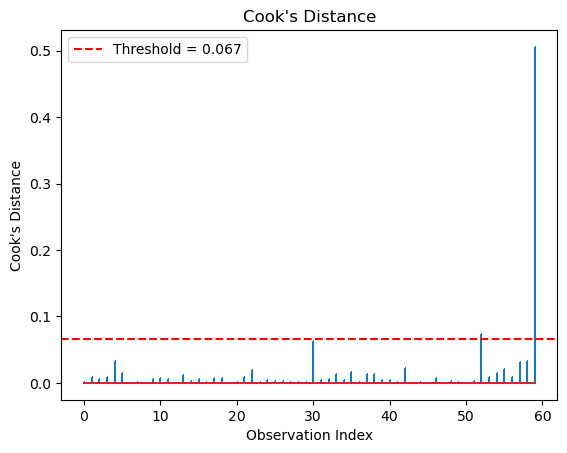
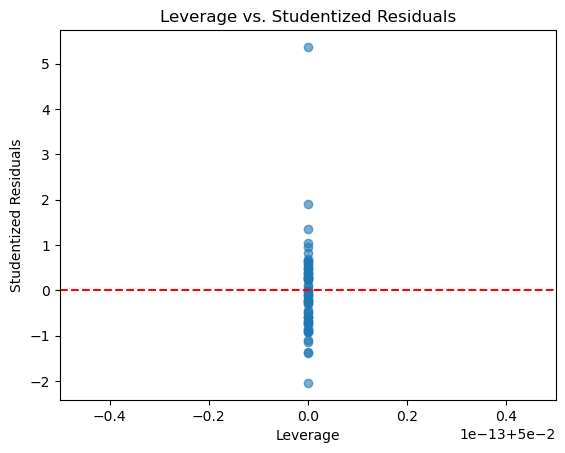

# 영향점

## 개요

분산분석에서 어떤 자료점은 결과에 지나치게 큰 영향을 주어 결론을 왜곡할 수 있다. 이런 영향점은 이상점(특이한 반응값)일 수도 있고 지렛점(특이한 설명변수값)일 수도 있으며, 추정된 집단 평균과 분산, 전체 F-통계량에 상당한 영향을 줄 수 있다. 이런 점들을 찾아 다루는 일은 분산분석 결과의 로버스트성을 확보하는 데 결정적이다.

## 설정

<div class="codebox" markdown>

**예제 1.** 진단에 쓸 모형 준비

```python
import numpy as np
import pandas as pd
from statsmodels.formula.api import ols

# 이 페이지의 진단은 모두 아래 모형 하나를 놓고 수행한다.
# 집단마다 표준편차를 1.0, 1.3, 1.6으로 다르게 주었고,
# 집단 C에 이상점을 하나 심어 두었다.
rng = np.random.default_rng(42)
n = 20
response = np.concatenate([
    rng.normal(10.0, 1.0, n),
    rng.normal(10.8, 1.3, n),
    rng.normal(12.0, 1.6, n),
])
response[-1] = 20.0                     # 마지막 관측값을 이상점으로 만든다
data = pd.DataFrame({
    "group": np.repeat(["A", "B", "C"], n),
    "response": response,
})
group1 = data.loc[data["group"] == "A", "response"]
group2 = data.loc[data["group"] == "B", "response"]
group3 = data.loc[data["group"] == "C", "response"]

model = ols("response ~ C(group)", data=data).fit()

print(data.groupby("group").response.agg(["count", "mean", "std"]).round(3))
print(f"\nF = {model.fvalue:.4f}, p = {model.f_pvalue:.4f}")
```

출력:

```
       count    mean    std
group                      
A         20   9.967  0.870
B         20  10.942  1.034
C         20  12.513  2.077

F = 16.1314, p = 0.0000
```

</div>

이상점 하나가 집단 C의 표준편차를 1.15에서 2.08로 키웠다. 아래 진단들이 이것을 잡아내는지 보라.

## Cook의 거리

Cook의 거리는 각 관측값의 잔차와 지렛값을 결합하여 적합된 모형에 대한 전체적인 영향을 평가한다. 관측값 $i$를 제거했을 때 적합값이 얼마나 변하는지를 잰다:

$$
D_i = \frac{r_i^2}{p} \cdot \frac{h_{ii}}{1 - h_{ii}}
$$

여기서 $r_i$는 표준화 잔차, $h_{ii}$는 지렛값, $p$는 모형의 모수 개수(일원배치 분산분석에서는 집단의 수)이다.

<div class="codebox" markdown>

**예제 2.** Cook의 거리

```python
import numpy as np
import matplotlib.pyplot as plt

# 관측값마다 Cook 의 거리를 막대로 세운다. 유독 솟은 막대가 있는지를 본다.
influence = model.get_influence()
cooks_d = influence.cooks_distance[0]

plt.stem(range(len(cooks_d)), cooks_d, markerfmt=",")
plt.xlabel("Observation Index")
plt.ylabel("Cook's Distance")
plt.title("Cook's Distance")
plt.axhline(y=4/len(cooks_d), color='r', linestyle='--', label=f'Threshold = {4/len(cooks_d):.3f}')
plt.legend()
plt.show()

print(f"threshold = {4/len(cooks_d):.4f}")
print(f"max Cook's D = {cooks_d.max():.4f} at obs {cooks_d.argmax()}")
print(f"flagged = {np.where(cooks_d > 4/len(cooks_d))[0]}")
```

출력:

```
threshold = 0.0667
max Cook's D = 0.5058 at obs 59
flagged = [52 59]
```



</div>

막대 하나가 압도적으로 높다. 마지막 관측값(59번)의 Cook 거리 0.506은 문턱 0.067의 여덟 배에 가깝다. 52번도 문턱을 넘지만 값이 훨씬 작다.

문턱 $4/n$은 넉넉하게 잡은 기준이라 이렇게 몇 개가 걸리는 것이 보통이다. 걸린 점을 모두 문제 삼는 것이 아니라, **다른 점들과 얼마나 벌어져 있는지**를 보는 것이 요령이다.

영향점을 찾는 데 흔히 쓰는 문턱:

- $D_i > 4/n$: 흔히 쓰이는 경험 법칙.
- $D_i > 1$: 더 보수적인 문턱.
- $D_i > F_{0.50}(p, n-p)$: $F$-분포의 중앙값에 근거한 문턱.

## 지렛값

지렛값은 관측값의 설명변수값이 설명변수 평균에서 얼마나 떨어져 있는지를 잰다. 일원배치 분산분석에서 지렛값은 집단 크기에 의존한다:

$$
h_{ii} = \frac{1}{n_i}
$$

여기서 $n_i$는 관측값 $i$가 속한 집단의 크기이다. 작은 집단에 속한 점일수록 지렛값이 크다.

지렛값이 큰 점이 반드시 영향점인 것은 아니다. 잔차가 클 때에만 영향점이 된다.

<div class="codebox" markdown>

**예제 3.** 지렛값

```python
# 지렛값은 설명변수 쪽에서 그 점이 얼마나 외따로 있는지를 잰다.
# 지렛값이 크고 잔차도 큰 점이 가장 위험하다. 그 둘을 곱해 놓은 것이
# 앞의 Cook 거리라고 보면 된다.
leverage = influence.hat_matrix_diag

plt.scatter(leverage, influence.resid_studentized_internal, alpha=0.6)
plt.xlabel("Leverage")
plt.ylabel("Studentized Residuals")
plt.title("Leverage vs. Studentized Residuals")
plt.axhline(y=0, color='r', linestyle='--')
plt.show()

print(f"leverage: min = {leverage.min():.4f}, max = {leverage.max():.4f}")
```

출력:

```
leverage: min = 0.0500, max = 0.0500
```



</div>

지렛값이 60개 모두 정확히 0.05다. 균형 설계라 모든 집단의 크기가 $n_i = 20$이고 $h_{ii} = 1/20 = 0.05$이기 때문이다.

그래서 그림의 점들이 하나의 세로선 위에 늘어선다. **균형 잡힌 일원배치 분산분석에서 지렛값은 영향점을 가려내는 데 아무 역할도 하지 못한다.** 영향의 차이는 오직 잔차에서 온다. 지렛값이 의미를 갖는 것은 집단 크기가 다르거나 연속형 설명변수가 있을 때다.

## DFFITS

DFFITS는 각 관측값이 자기 자신의 적합값에 주는 영향을 잰다:

$$
\text{DFFITS}_i = r_i^* \sqrt{\frac{h_{ii}}{1 - h_{ii}}}
$$

여기서 $r_i^*$는 외부 스튜던트화 잔차이다. 흔한 문턱은 $|\text{DFFITS}_i| > 2\sqrt{p/n}$이다.

## 영향점 다루기

영향점을 찾았을 때 고려할 수 있는 전략은 여럿이다:

**조사:**
어떤 조치를 취하기 전에 왜 그 점이 영향력이 큰지 조사한다. 자료 입력 오류인가? 측정 이상인가? 아니면 과학적으로 의미 있는 정말로 특이한 관측인가?

**민감도 분석:**
영향점을 포함한 경우와 제외한 경우로 분산분석을 각각 수행한다. 결론이 크게 달라지면 결과가 그 관측값에 로버스트하지 않다는 뜻이므로 이를 보고해야 한다.

**제거:**
실질적인 근거(예: 알려진 자료 오류)가 있을 때에만 영향점을 제거한다. 단지 불편하다는 이유로 점을 제거해서는 안 된다.

**변환:**
자료에 변환(예: 로그, 제곱근)을 적용하면 척도가 압축되어 극단값의 영향이 줄어들 수 있다.

**로버스트 분산분석 방법:**
절사평균, 윈저화 평균, M-추정량 같은 방법은 이상점의 영향을 낮추어 더 신뢰할 만한 결과를 준다. 붓스트랩 방법도 영향점에 대한 로버스트성을 제공한다.

<div class="codebox" markdown>

### 예제 4. 완전한 영향 진단 { .eg }

```python
import statsmodels.api as sm
from statsmodels.formula.api import ols

model = ols('response ~ group', data=data).fit()

influence = model.get_influence()
# summary_frame은 진단량을 한 표에 모아 준다.
summary = influence.summary_frame()
print(summary[['hat_diag', 'cooks_d', 'dffits', 'student_resid']].describe())
```

출력:

```
           hat_diag    cooks_d     dffits  student_resid
count  6.000000e+01  60.000000  60.000000      60.000000
mean   5.000000e-02   0.017544   0.008298       0.036170
std    5.411161e-17   0.065539   0.281456       1.226837
min    5.000000e-02   0.000002  -0.481894      -2.100527
25%    5.000000e-02   0.001276  -0.139287      -0.607140
50%    5.000000e-02   0.005002  -0.015728      -0.068558
75%    5.000000e-02   0.012359   0.097065       0.423097
max    5.000000e-02   0.505775   1.736734       7.570250
```

세 가지를 읽을 수 있다.

- `hat_diag`의 표준편차가 $5 \times 10^{-17}$이다. 사실상 0이며, 균형 설계에서 지렛값이 모두 같다는 것을 부동소수점 오차 수준까지 확인해 준다.
- `student_resid`의 최댓값이 7.57이다. 나머지가 $\pm 2.1$ 안에 있는데 이 하나만 7을 넘는다. 외부 스튜던트화 잔차는 해당 관측값을 빼고 적합한 모형에서 계산하므로, 이상점 자신이 자기 잔차를 줄이는 효과가 제거되어 이렇게 큰 값이 나온다.
- `cooks_d`의 4분위수는 모두 0.013 아래인데 최댓값만 0.506이다. 분포의 꼬리가 얼마나 극단적인지 보여준다.

</div>

## 연습문제

<div class="drillbox" markdown>

**연습문제 1.** <span class="diff easy" title="쉬움"></span>
집단이 셋이고 각각 $n = 10$인 일원배치 분산분석에서 어떤 관측값의 Cook의 거리가 $D_i = 1.2$이다. 흔히 쓰는 문턱은 $D_i > 4/N$이다. 이 점이 영향점인지 판정하고 Cook의 거리가 무엇을 재는지 설명하라.

</div>

??? success "풀이"
    문턱은 $4/N = 4/30 \approx 0.133$이다. $D_i = 1.2 \gg 0.133$이므로 이 관측값은 영향력이 매우 크다.

    Cook의 거리는 관측값 $i$가 모든 적합값에 동시에 주는 전체적인 영향을 잰다. 지렛값(설명변수값이 얼마나 특이한지)과 잔차의 크기(적합 모형에서 얼마나 떨어져 있는지)를 결합한다. Cook의 거리가 크다는 것은 그 관측값을 제거하면 추정된 집단 평균과 F-통계량이 상당히 달라진다는 뜻이다.

<div class="drillbox" markdown>

**연습문제 2.** <span class="diff med" title="중간"></span>
분산분석의 맥락에서 이상점, 지렛점, 영향점을 구별하라. 지렛값은 크지만 영향점이 아닌 예를 들어라.

</div>

??? success "풀이"

    - **이상점:** 잔차가 유별나게 큰(자기 집단 평균에서 멀리 떨어진) 관측값.
    - **지렛점:** 설명변수값이 특이한 관측값. 분산분석에서는 보통 관측값이 아주 적은 집단에 속해 집단 평균에 더 큰 영향을 주는 경우를 뜻한다.
    - **영향점:** 제거하면 결과가 상당히 달라지는 관측값. 대체로 지렛값도 크고 잔차도 크다.

    **지렛값은 크지만 영향점이 아닌 예:** 일원배치 분산분석에서 한 집단만 $n = 3$이고 다른 집단은 $n = 30$이라면 작은 집단의 각 관측값은 지렛값(햇값)이 크다. 그러나 그 관측값들이 자기 집단 평균에 가까우면 잔차가 작아 영향점이 아니다(Cook의 거리가 낮게 유지된다).

<div class="drillbox" markdown>

**연습문제 3.** <span class="diff med" title="중간"></span>
집단 B의 어떤 관측값에서 DFFITS 값이 $2\sqrt{p/n}$을 넘었다. DFFITS가 무엇을 재는지, Cook의 거리와 어떻게 다른지 설명하라.

</div>

??? success "풀이"
    DFFITS는 관측값 $i$를 삭제했을 때 그 관측값의 **적합값**이 얼마나 변하는지를 표준오차로 나누어 잰다. 형식적으로

    $$
    \text{DFFITS}_i = \frac{\hat{Y}_i - \hat{Y}_{i(i)}}{s_{(i)} \sqrt{h_{ii}}}
    $$

    이며 $\hat{Y}_{i(i)}$는 관측값 $i$를 제외했을 때의 적합값이다.

    Cook의 거리와의 핵심 차이는, DFFITS가 **하나의 적합값**(그 관측값 자신의 예측)에 대한 효과에 초점을 두는 반면 Cook의 거리는 **모든 적합값에 대한 효과를 동시에** 잰다는 점이다. 영향이 국소적이면 DFFITS는 크지만 Cook의 거리는 중간 정도일 수 있다.

---

## 정리하며

관측 몇 개가 **결론을 뒤집을 수 있다.**

- **두 가지를 구별한다.** 이상점은 반응값이 특이한 경우이고, 지렛점은 설명변수값이 특이한 경우다. 분산분석에서는 집단 배정이 설명변수이므로 주로 이상점이 문제가 된다.
- **영향은 집단 평균과 MSE 둘 다에 미친다.** 한 집단의 극단값 하나가 그 집단 평균을 끌고 가면서 동시에 합동 분산을 부풀려, **$F$ 를 키울 수도 줄일 수도 있다.**
- **쿡 거리와 표준화 잔차가 진단 도구다.** 13장의 회귀 진단과 같은 지표를 쓰며, 분산분석이 회귀의 특수한 경우이기 때문이다.
- **작은 집단에서 특히 위험하다.** 집단당 관측이 5 개인데 하나가 이상점이면 그 집단 평균의 $20\%$ 를 한 점이 결정한다.
- **찾았다고 지우는 것이 아니다.** 기록 오류인지, 드물지만 실재하는 값인지 확인해야 하며, 지운 경우에는 반드시 밝힌다. **결과가 그 결정에 좌우된다면 양쪽 결과를 모두 보고하는 것이 정직하다.**

다음 절 **가정 위반의 처리**로 넘어간다.
