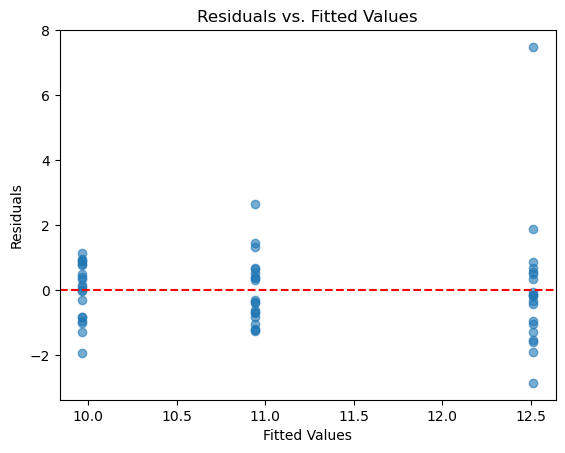
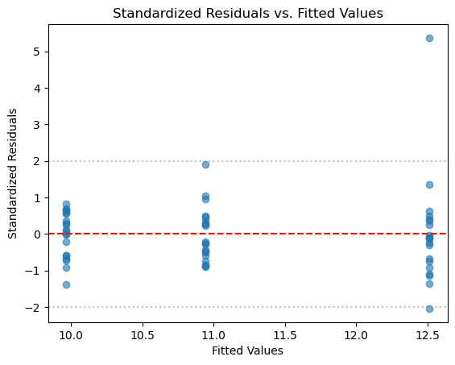
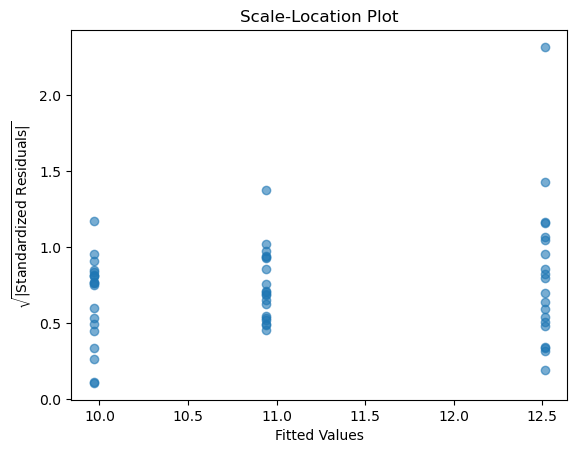

# 잔차 분석

## 개요

잔차 분석은 분산분석의 결정적인 진단 도구이다. 잔차는 관측된 자료점과 모형의 예측값의 차이이다:

$$
e_{ij} = Y_{ij} - \hat{Y}_{ij} = Y_{ij} - \bar{Y}_{i\cdot}
$$

여기서 $Y_{ij}$는 집단 $i$의 $j$번째 관측값이고 $\bar{Y}_{i\cdot}$는 집단 $i$의 평균이다. 모형이 올바르게 설정되었다면 잔차는 0 주위에 무작위로 분포하며 분산이 일정하고 체계적인 패턴이 없어야 한다.

## 설정

<div class="codebox" markdown>

### 예제 1. 진단에 쓸 모형 준비 { .eg }

```python
import numpy as np
import pandas as pd
from statsmodels.formula.api import ols

# 이 페이지의 진단은 모두 아래 모형 하나를 놓고 수행한다.
# 집단마다 표준편차를 1.0, 1.3, 1.6으로 다르게 주었고,
# 집단 C에 이상점을 하나 심어 두었다.
rng = np.random.default_rng(42)
n = 20
response = np.concatenate([
    rng.normal(10.0, 1.0, n),
    rng.normal(10.8, 1.3, n),
    rng.normal(12.0, 1.6, n),
])
response[-1] = 20.0                     # 마지막 관측값을 이상점으로 만든다
data = pd.DataFrame({
    "group": np.repeat(["A", "B", "C"], n),
    "response": response,
})
group1 = data.loc[data["group"] == "A", "response"]
group2 = data.loc[data["group"] == "B", "response"]
group3 = data.loc[data["group"] == "C", "response"]

model = ols("response ~ C(group)", data=data).fit()

print(data.groupby("group").response.agg(["count", "mean", "std"]).round(3))
print(f"\nF = {model.fvalue:.4f}, p = {model.f_pvalue:.4f}")
```

출력:

```
       count    mean    std
group                      
A         20   9.967  0.870
B         20  10.942  1.034
C         20  12.513  2.077

F = 16.1314, p = 0.0000
```

이상점 하나가 집단 C의 표준편차를 1.15에서 2.08로 키웠다. 아래 진단들이 이것을 잡아내는지 보라.

</div>

## 잔차 대 적합값 그림

가장 유익한 진단 그림은 잔차를 적합값에 대해 그린 것이다. 일원배치 분산분석에서 적합값은 곧 집단 평균이므로, 각 집단 평균 위치에 잔차가 수직 띠로 나타난다.

<div class="codebox" markdown>

### 예제 2. 잔차 대 적합값 그림 { .eg }

```python
import matplotlib.pyplot as plt

# 잔차 대 적합값 그림은 진단의 출발점이다. 점들이 0 선 둘레에 폭을 일정하게
# 유지하며 흩어져 있으면 좋다. 깔때기 모양이면 등분산이 깨진 것이고, 굽은
# 모양이면 모형이 놓친 구조가 남아 있다는 뜻이다.
plt.scatter(model.fittedvalues, model.resid, alpha=0.6)
plt.axhline(y=0, color='r', linestyle='--')
plt.xlabel("Fitted Values")
plt.ylabel("Residuals")
plt.title("Residuals vs. Fitted Values")
plt.show()
```



세로 띠가 셋 있고, 그것이 집단 셋이다. 회귀분석의 잔차 그림처럼 연속적으로 퍼지지 않는 것은 적합값이 집단평균 세 개뿐이기 때문이다.

오른쪽 띠(집단 C)가 다른 둘보다 위아래로 넓고, 그 위에 7 남짓 떨어진 점 하나가 홀로 있다. 심어 둔 이상점이다.

</div>

### 패턴 알아보기

잔차 그림의 다음 패턴들은 특정한 가정 위반을 알려준다:

**깔때기 모양(이분산):**
넓어지거나 좁아지는 패턴은 독립변수의 수준에 따라 잔차의 분산이 다름을 나타낸다. 등분산성 가정을 위반하며 F-검정을 왜곡할 수 있다.

**곡률(비선형성):**
휘어진 패턴은 독립변수와 종속변수의 관계가 선형이 아님을 시사한다. 다항 항, 비선형 모형, 또는 자료 변환이 필요할 수 있다.

**군집(비독립성):**
잔차가 무리를 이루면 군집 안의 관측값이 상관되어 있어 독립성 가정을 위반함을 나타낼 수 있다. 계층적이거나 내포된 자료 구조에서 자주 나타난다.

**이상점:**
0선에서 멀리 떨어진 개별 점은 분석에 지나치게 큰 영향을 주는 이상점일 수 있다.

## 표준화 잔차

표준화 잔차는 각 잔차를 그 표준편차의 추정값으로 나누어 모든 잔차를 공통 척도에 놓는다:

$$
r_i = \frac{e_i}{\hat{\sigma}\sqrt{1 - h_{ii}}}
$$

여기서 $\hat{\sigma}$는 추정된 표준편차이고 $h_{ii}$는 관측값 $i$의 지렛값이다. 모형 가정 아래에서 표준화 잔차는 근사적으로 표준정규분포를 따라야 한다.

<div class="codebox" markdown>

### 예제 3. 표준화 잔차 { .eg }

```python
import numpy as np

# 표준화 잔차는 잔차를 그 표준오차로 나눈 것이다. 단위가 사라지므로
# 어느 자료에서든 ±2 를 같은 뜻으로 읽을 수 있다.
influence = model.get_influence()
standardized_resid = influence.resid_studentized_internal

plt.scatter(model.fittedvalues, standardized_resid, alpha=0.6)
plt.axhline(y=0, color='r', linestyle='--')
plt.axhline(y=2, color='gray', linestyle=':', alpha=0.5)
plt.axhline(y=-2, color='gray', linestyle=':', alpha=0.5)
plt.xlabel("Fitted Values")
plt.ylabel("Standardized Residuals")
plt.title("Standardized Residuals vs. Fitted Values")
plt.show()
```



세로축이 표준편차 단위로 바뀌어 회색 기준선($\pm 2$)과 곧바로 비교할 수 있다. 이상점 하나가 4를 훌쩍 넘고, 나머지는 대부분 $\pm 2$ 안에 있다.

원래 잔차 그림과 모양이 거의 같아 보이지만 척도가 다르다. 표준화는 지렛값 $h_{ii}$도 함께 반영하므로, 설계가 불균형이면 두 그림의 모양이 눈에 띄게 달라진다.

$|r_i| > 2$인 관측값은 자세히 살펴볼 만하고, $|r_i| > 3$인 관측값은 이상점의 유력한 후보이다.

</div>

## 척도-위치 그림

척도-위치 그림은 $\sqrt{|r_i|}$를 적합값에 대해 그린 것으로 등분산성을 평가하는 데 유용하다. 추세선이 수평이고 점들이 고르게 퍼져 있으면 분산이 일정함을 나타낸다.

<div class="codebox" markdown>

### 예제 4. 척도-위치 그림 { .eg }

```python
# 척도-위치 그림은 부호를 없애고 크기만 본다. 제곱근을 씌우는 것은 큰 값이
# 그림을 독차지하지 않게 하려는 것이다. 추세선이 평평하면 등분산이다.
plt.scatter(model.fittedvalues, np.sqrt(np.abs(standardized_resid)), alpha=0.6)
plt.xlabel("Fitted Values")
plt.ylabel(r"$\sqrt{|\mathrm{Standardized\ Residuals}|}$")
plt.title("Scale-Location Plot")
plt.show()
```



세로축이 $\sqrt{|r_i|}$라 부호가 사라지고 **크기만** 남는다. 그래서 "어느 쪽으로 벗어났는가"가 아니라 "얼마나 퍼져 있는가"에 집중할 수 있다.

세 띠의 높이를 비교하면 오른쪽 띠가 조금 더 위로 퍼져 있고 이상점이 2를 넘는다. 등분산이라면 세 띠의 평균 높이가 비슷해야 한다.

</div>

## 연습문제

<div class="drillbox" markdown>

**연습문제 1.** <span class="diff med" title="중간"></span>
집단이 넷인 일원배치 분산분석에서 잔차 대 적합값 그림에 뚜렷한 깔때기 모양(적합값이 커질수록 잔차가 퍼짐)이 보인다. 어느 분산분석 가정이 위반되었는지 밝히고 문제를 다루는 두 가지 접근을 기술하라.

</div>

??? success "풀이"
    깔때기 모양은 **이분산**을 나타낸다. 적합값(집단 평균)이 커질수록 잔차의 분산이 커진다. 두 가지 접근:

    1. **Welch 분산분석:** 등분산을 가정하지 않고 집단마다 다른 분산을 반영하도록 자유도를 조정한다.

    2. **분산 안정화 변환:** 반응변수에 로그나 제곱근 변환을 적용한다. 분산이 평균에 비례하면(도수 자료나 양의 연속형 자료에서 흔하다) $\log(Y)$가 흔히 분산을 안정화한다.

<div class="drillbox" markdown>

**연습문제 2.** <span class="diff med" title="중간"></span>
학교 다섯 곳의 학생 시험 점수에 분산분석을 수행했다. 잔차 히스토그램에 하나의 종 모양 대신 두 개의 뚜렷한 봉우리가 보인다. 무엇을 뜻할 수 있으며 연구자는 어떻게 해야 하는가?

</div>

??? success "풀이"
    잔차 히스토그램의 **이봉** 형태는 모형에 포함되지 않은 **집단 변수나 중요한 공변량이 빠져 있음**을 시사한다. 예를 들어 각 학교 안에 점수가 체계적으로 다른 두 하위 집단(서로 다른 프로그램이나 학년의 학생)이 있을 수 있다.

    연구자는 추가 요인의 가능성을 조사하고, 그 변수를 포함하는 이원배치 분산분석이나 공분산분석을 적합하는 것을 고려해야 한다. 자연스러운 집단 구분을 찾아 모형에 넣으면 잔차분산이 줄고 모형이 개선된다.

<div class="drillbox" markdown>

**연습문제 3.** <span class="diff med" title="중간"></span>
분산분석에서 정규성을 평가할 때 원래 잔차보다 표준화 잔차가 선호되는 이유를 설명하라. 표준화 잔차는 어떻게 계산하는가?

</div>

??? success "풀이"
    원래 잔차 $e_i = Y_i - \hat{Y}_i$는 관측값의 지렛값에 따라 분산이 달라진다: $\text{Var}(e_i) = \sigma^2(1 - h_{ii})$이며 $h_{ii}$가 지렛값이다. 따라서 관측값들 사이에서 원래 잔차의 크기를 그대로 비교하면 오도할 수 있다.

    **표준화(내부 스튜던트화) 잔차**는 각 원래 잔차를 그 추정 표준편차로 나눈다:

    $$
    r_i = \frac{e_i}{\hat{\sigma}\sqrt{1 - h_{ii}}}
    $$

    모형 가정 아래에서 이 값들은 근사적으로 표준정규분포를 따르므로 관측값 사이에서 직접 비교할 수 있고, Q-Q 그림이나 $\pm 2$ 경험 법칙으로 평가하기 쉬워진다.

---

## 정리하며

잔차 분석은 분산분석을 위한 종합적인 시각 진단 틀을 제공한다. 잔차 그림을 살펴 정규성, 등분산성, 독립성, 선형성의 위반을 탐지하고, 분산분석 결과를 해석하기 전에 적절한 시정 조치를 취할 수 있다.
