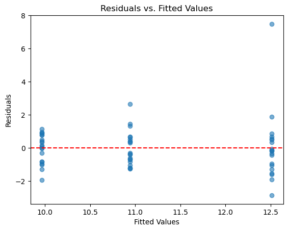
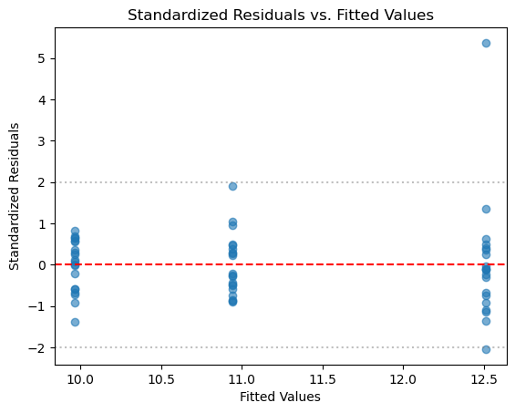
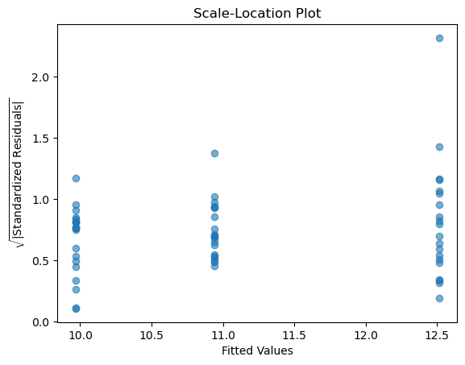

# 잔차 분석

## 개요

잔차 분석은 분산분석의 결정적인 진단 도구이다. 잔차는 관측된 자료점과 모형의 예측값의 차이이다:

$$
e_{ij} = Y_{ij} - \hat{Y}_{ij} = Y_{ij} - \bar{Y}_{i\cdot}
$$

여기서 $Y_{ij}$는 집단 $i$의 $j$번째 관측값이고 $\bar{Y}_{i\cdot}$는 집단 $i$의 평균이다. 모형이 올바르게 설정되었다면 잔차는 0 주위에 무작위로 분포하며 분산이 일정하고 체계적인 패턴이 없어야 한다.

## 설정

<div class="exbox" markdown>

**보기 1.** <span class="diff easy" title="쉬움"></span> 잔차를 재는 자는 어디서 오는가. 이 쪽의 모든 진단은 $\hat\sigma$ 로 잔차를 나누어 쓴다. 그 $\hat\sigma$ 가 무엇인지 먼저 밝혀 둔다.

**(1)** 일원배치에서 적합값이 $\hat y_{ij} = \bar y_{i\cdot}$ 이므로 $e_{ij} = y_{ij} - \bar y_{i\cdot}$ 임을 쓰고,

$$
\hat\sigma^2 = \text{MSE} = \frac{1}{N-k}\sum_{i}\sum_{j} e_{ij}^2
= \frac{1}{N-k}\sum_{i}(n_i - 1)s_i^2
$$

임을 보이시오. 균형설계($n_i = n$)에서는 이것이 집단분산의 **단순평균** $\frac1k\sum_i s_i^2$ 이 됨도 보이시오.

**(2)** 집단별 평균과 표준편차만 가지고 $F = \text{MSB}/\text{MSE}$ 를 계산해 적합 결과의 $F = 16.1314$ 를 재현하시오.

**(3)** 합동분산에서 집단 C가 차지하는 몫을 구하시오. 집단 C의 표준편차를 이상점을 심기 전 값 $s_C = 1.145019$ 로 되돌리면 $\hat\sigma$ 가 얼마가 되는가.

</div>

??? success "풀이"

    **(1) 해석적으로.** 일원배치 모형 $y_{ij} = \mu_i + \varepsilon_{ij}$ 에서 최소제곱 적합값은 각 집단의 제곱합 $\sum_j (y_{ij} - m)^2$ 을 $m$ 에 대해 최소화하는 값이고, 미분하면 $-2\sum_j(y_{ij}-m) = 0$ 에서 $m = \bar y_{i\cdot}$ 다. 따라서 $\hat y_{ij} = \bar y_{i\cdot}$ 이고 $e_{ij} = y_{ij} - \bar y_{i\cdot}$ 다.

    표본분산의 정의가 $s_i^2 = \frac{1}{n_i-1}\sum_j (y_{ij}-\bar y_{i\cdot})^2$ 이므로

    $$
    \sum_j e_{ij}^2 = (n_i-1)s_i^2
    $$

    이고, 집단에 걸쳐 더하면

    $$
    \text{SSE} = \sum_i (n_i-1)s_i^2,
    \qquad
    \hat\sigma^2 = \frac{\text{SSE}}{N-k} = \frac{\sum_i (n_i-1)s_i^2}{\sum_i (n_i-1)}
    $$

    다. **곧 MSE 는 집단분산들의 가중평균이고 가중치는 자유도 $n_i-1$ 이다.** 균형설계면 가중치가 모두 같으므로

    $$
    \hat\sigma^2 = \frac{(n-1)\sum_i s_i^2}{k(n-1)} = \frac{1}{k}\sum_i s_i^2
    $$

    로 단순평균이 된다. $\square$

    여기서 미리 새겨 둘 것이 있다. **MSE 는 집단분산의 평균이지 중앙값이나 최빈값이 아니다.** 한 집단의 분산이 혼자 크면 그 집단이 $\hat\sigma$ 를 끌어올리고, 그렇게 부풀린 $\hat\sigma$ 가 **다른 모든 집단의 잔차를 표준화하는 데** 쓰인다. (3)에서 그 크기를 잰다.

    **(2)–(3) 수치적으로.** 먼저 이 쪽이 쓸 모형을 적합한다.

    ```python
    import numpy as np
    import pandas as pd
    from statsmodels.formula.api import ols

    # 이 페이지의 진단은 모두 아래 모형 하나를 놓고 수행한다.
    # 집단마다 표준편차를 1.0, 1.3, 1.6으로 다르게 주었고,
    # 집단 C에 이상점을 하나 심어 두었다.
    rng = np.random.default_rng(42)
    n = 20
    response = np.concatenate([
        rng.normal(10.0, 1.0, n),
        rng.normal(10.8, 1.3, n),
        rng.normal(12.0, 1.6, n),
    ])
    response[-1] = 20.0                     # 마지막 관측값을 이상점으로 만든다
    data = pd.DataFrame({
        "group": np.repeat(["A", "B", "C"], n),
        "response": response,
    })
    group1 = data.loc[data["group"] == "A", "response"]
    group2 = data.loc[data["group"] == "B", "response"]
    group3 = data.loc[data["group"] == "C", "response"]

    model = ols("response ~ C(group)", data=data).fit()

    print(data.groupby("group").response.agg(["count", "mean", "std"]).round(3))
    print(f"\nF = {model.fvalue:.4f}, p = {model.f_pvalue:.4f}")
    ```

    출력:

    ```
           count    mean    std
    group                      
    A         20   9.967  0.870
    B         20  10.942  1.034
    C         20  12.513  2.077

    F = 16.1314, p = 0.0000
    ```

    이제 이 요약만으로 MSE 와 $F$ 를 다시 만든다.

    ```python
    import numpy as np

    # 집단별 요약만으로 MSE, MSB, F 를 모두 재구성한다.
    n, k = 20, 3
    means = np.array([9.967068, 10.942301, 12.513460])
    sds = np.array([0.870178, 1.033538, 2.077021])
    N = n * k

    MSE = (sds ** 2).sum() / k                       # 균형설계에서는 단순평균
    grand = means.mean()                             # 균형설계에서는 집단평균의 평균
    MSB = n * ((means - grand) ** 2).sum() / (k - 1)
    print(f"집단분산 s_i^2 = {np.round(sds ** 2, 4)}")
    print(f"MSE  = {MSE:.6f},   sigma_hat = {np.sqrt(MSE):.6f}")
    print(f"전체평균 = {grand:.6f}")
    print(f"MSB  = {MSB:.6f}")
    print(f"F    = MSB/MSE = {MSB / MSE:.4f}      (쪽의 적합 결과 16.1314)")

    print(f"\n합동분산에서 각 집단이 차지하는 몫")
    for g, v in zip("ABC", sds ** 2):
        print(f"  {g}: {v:>8.4f} / {(sds ** 2).sum():.4f} = {v / (sds ** 2).sum():>7.2%}")

    # 이상점을 빼면 합동분산이 어떻게 되는가
    sd_c_clean = 1.145019
    MSE_clean = (sds[0] ** 2 + sds[1] ** 2 + sd_c_clean ** 2) / k
    print(f"\n집단 C 의 s 를 이상점 없는 값 {sd_c_clean} 로 바꾸면")
    print(f"  MSE = {MSE_clean:.6f},  sigma_hat = {np.sqrt(MSE_clean):.6f}  "
          f"({np.sqrt(MSE) / np.sqrt(MSE_clean):.3f} 배 작다)")
    ```

    출력:

    ```
    집단분산 s_i^2 = [0.7572 1.0682 4.314 ]
    MSE  = 2.046476,   sigma_hat = 1.430551
    전체평균 = 11.140943
    MSB  = 33.012441
    F    = MSB/MSE = 16.1314      (쪽의 적합 결과 16.1314)

    합동분산에서 각 집단이 차지하는 몫
      A:   0.7572 / 6.1394 =  12.33%
      B:   1.0682 / 6.1394 =  17.40%
      C:   4.3140 / 6.1394 =  70.27%

    집단 C 의 s 를 이상점 없는 값 1.145019 로 바꾸면
      MSE = 1.045493,  sigma_hat = 1.022494  (1.399 배 작다)
    ```

    **집단별 요약 여섯 개만으로 $F = 16.1314$ 가 그대로 나온다.** 적합 결과와 소수점 넷째 자리까지 같다. 분산분석이 자료 전체가 아니라 **집단평균과 집단분산만** 쓴다는 사실의 실물 확인이다.

    **(3)의 수가 이 쪽 전체의 배경이다.** 합동분산 $6.1394/3$ 중 집단 C가 $70.27\%$ 를 낸다. 세 집단의 표본크기가 똑같은데도 그렇다. 그리고 그 $4.3140$ 은 보기의 자료에서 **이상점 하나가 $1.3110$ 을 $4.3140$ 으로 키운 결과**다. 집단 C의 흩어짐을 원래 값으로 되돌리면 $\hat\sigma$ 가 $1.430551$ 에서 $1.022494$ 로 $1.399$ 배 작아진다.

    그러므로 뒤에 나올 표준화 잔차는 **$40\%$ 부풀린 자로 잰 값**이다. 집단 A와 B의 관측값들은 아무 잘못이 없는데도 자기 잔차가 $1/1.4$ 로 줄어 보인다. 이상점 하나가 자기 자신을 덜 튀어 보이게 만들 뿐 아니라 **다른 모든 점을 더 얌전해 보이게** 만드는 것이다. 이 효과를 끊으려면 잔차를 그 관측값을 뺀 적합에서 추정한 $\hat\sigma_{(i)}$ 로 나누어야 하며, 그것이 보기 3에서 볼 외부 스튜던트화 잔차다.

이상점 하나가 집단 C의 표준편차를 1.15에서 2.08로 키웠다. 아래 진단들이 이것을 잡아내는지 보라.

## 잔차 대 적합값 그림

가장 유익한 진단 그림은 잔차를 적합값에 대해 그린 것이다. 일원배치 분산분석에서 적합값은 곧 집단 평균이므로, 각 집단 평균 위치에 잔차가 수직 띠로 나타난다.

<div class="exbox" markdown>

**보기 2.** <span class="diff easy" title="쉬움"></span> 잔차 대 적합값 그림에서 무엇을 읽어 낼 수 있는가.

**(1)** 각 집단에서 $\sum_j e_{ij} = 0$ 임을 보이고, 따라서 그림의 띠마다 잔차의 **평균이 정확히 $0$** 임을 밝히시오. 또 띠 $i$ 의 잔차 표준편차(분모 $n_i$)가 $s_i\sqrt{\dfrac{n_i-1}{n_i}}$ 임을 보이시오.

**(2)** 그림을 그려 **읽히는 것을 수치와 함께** 적으시오. 띠의 가로 위치, 각 띠의 폭, 이상점이 둘째로 큰 잔차의 몇 배인지를 밝히시오.

**(3)** 이 그림이 **보여 주지 못하는 것**을 하나 지적하시오. 일원배치에서 적합값이 몇 개인가.

</div>

??? success "풀이"

    **(1) 해석적으로.** 보기 1에서 $\hat y_{ij} = \bar y_{i\cdot}$ 였으므로

    $$
    \sum_{j=1}^{n_i} e_{ij} = \sum_j (y_{ij} - \bar y_{i\cdot}) = n_i \bar y_{i\cdot} - n_i \bar y_{i\cdot} = 0
    $$

    이다. **집단마다 따로 성립**한다는 것이 중요하다. 전체 잔차의 합이 $0$ 인 것은 절편이 있는 어떤 회귀에서나 참이지만, 일원배치에서는 띠마다 따로 $0$ 이다. 그래서 세 띠가 각각 빨간 $0$ 선에 균형을 맞춰 걸린다.

    표준편차는 보기 1의 $\sum_j e_{ij}^2 = (n_i-1)s_i^2$ 에서 바로 나온다. 잔차의 평균이 $0$ 이므로 분모를 $n_i$ 로 잡은 표준편차는

    $$
    \sqrt{\frac{1}{n_i}\sum_j e_{ij}^2} = \sqrt{\frac{(n_i-1)s_i^2}{n_i}} = s_i\sqrt{\frac{n_i-1}{n_i}}
    $$

    다. $\square$ $n_i = 20$ 이면 계수가 $\sqrt{19/20} = 0.9747$ 이므로 **띠의 폭은 사실상 그 집단의 표준편차**다.

    **(2)–(3) 수치적으로.** 먼저 그림을 그린다.

    ```python
    import matplotlib.pyplot as plt

    # 잔차 대 적합값 그림은 진단의 출발점이다. 점들이 0 선 둘레에 폭을 일정하게
    # 유지하며 흩어져 있으면 좋다. 깔때기 모양이면 등분산이 깨진 것이고, 굽은
    # 모양이면 모형이 놓친 구조가 남아 있다는 뜻이다.
    plt.scatter(model.fittedvalues, model.resid, alpha=0.6)
    plt.axhline(y=0, color='r', linestyle='--')
    plt.xlabel("Fitted Values")
    plt.ylabel("Residuals")
    plt.title("Residuals vs. Fitted Values")
    plt.show()
    ```

    

    이제 눈으로 보는 대신 재어 본다.

    ```python
    import numpy as np
    import pandas as pd
    from statsmodels.formula.api import ols

    rng = np.random.default_rng(42)
    n = 20
    response = np.concatenate([
        rng.normal(10.0, 1.0, n), rng.normal(10.8, 1.3, n), rng.normal(12.0, 1.6, n)])
    response[-1] = 20.0
    data = pd.DataFrame({"group": np.repeat(["A", "B", "C"], n), "response": response})
    model = ols("response ~ C(group)", data=data).fit()
    e = model.resid.values
    fit = model.fittedvalues.values

    print(f"서로 다른 적합값: {np.unique(np.round(fit, 6))}")
    print(f"\n{'띠':>3}{'가로 위치':>11}{'합':>12}{'최소':>9}{'최대':>9}"
          f"{'범위':>8}{'잔차 sd':>9}{'s_i*sqrt(19/20)':>17}")
    for i, g in enumerate("ABC"):
        ei = e[i * n:(i + 1) * n]
        si = response[i * n:(i + 1) * n].std(ddof=1)
        print(f"{g:>3}{fit[i * n]:>11.4f}{ei.sum():>12.2e}{ei.min():>9.4f}{ei.max():>9.4f}"
              f"{ei.max() - ei.min():>8.4f}{ei.std(ddof=0):>9.4f}{si * np.sqrt((n - 1) / n):>17.4f}")

    c = np.sort(e[2 * n:])[::-1]
    print(f"\n집단 C 의 큰 잔차 넷: {np.round(c[:4], 4)}")
    print(f"이상점은 둘째로 큰 잔차의 {c[0] / c[1]:.2f} 배")
    print(f"이상점을 뺀 집단 C 잔차의 범위: "
          f"[{e[2 * n:-1].min():.4f}, {e[2 * n:-1].max():.4f}]")
    ```

    출력:

    ```
    서로 다른 적합값: [ 9.967068 10.942301 12.51346 ]

      띠      가로 위치           합       최소       최대      범위    잔차 sd  s_i*sqrt(19/20)
      A     9.9671   -7.11e-14  -1.9181   1.1602  3.0783   0.8481           0.8481
      B    10.9423   -5.33e-15  -1.2345   2.6418  3.8763   1.0074           1.0074
      C    12.5135   -1.81e-13  -2.8449   7.4865 10.3314   2.0244           2.0244

    집단 C 의 큰 잔차 넷: [7.4865 1.8784 0.8808 0.6757]
    이상점은 둘째로 큰 잔차의 3.99 배
    이상점을 뺀 집단 C 잔차의 범위: [-2.8449, 1.8784]
    ```

    **(1)의 두 결론이 그대로 확인된다.** 띠마다 잔차의 합이 $10^{-13}$ 수준, 곧 부동소수점 오차 안에서 정확히 $0$ 이다. 띠의 표준편차도 $0.8481$, $1.0074$, $2.0244$ 로 $s_i\sqrt{19/20}$ 과 소수점 넷째 자리까지 같다.

    **그림에서 읽히는 것을 수치로 적으면 이렇다.**

    - 가로축에 점이 찍히는 자리는 $9.9671$, $10.9423$, $12.5135$ **딱 세 곳**이다. 적합값이 집단평균 셋뿐이기 때문이다.
    - 띠의 폭(최대$-$최소)이 $3.08$, $3.88$, $10.33$ 으로 오른쪽으로 갈수록 넓어진다. 교과서가 말하는 **깔때기 모양**이다.
    - 그러나 그 깔때기의 정체는 **집단 C의 점 하나**다. 그 점을 빼면 집단 C의 잔차 범위가 $[-2.8449,\ 1.8784]$, 폭 $4.72$ 로 줄어 집단 B의 $3.88$ 과 크게 다르지 않다.
    - 이상점의 잔차 $7.4865$ 는 같은 집단에서 둘째로 큰 잔차 $1.8784$ 의 **$3.99$ 배**다. 셋째·넷째는 $0.8808$, $0.6757$ 로 더 작다. 한 점만 홀로 떨어져 있다는 뜻이며, 꼬리가 두꺼운 분포라면 이런 모양이 아니라 큰 값이 여럿 나타난다.

    **(3) 이 그림이 보여 주지 못하는 것.** 적합값이 세 개뿐이므로 **가로축에 자유도가 둘밖에 없다.** 세 점은 언제나 하나의 포물선 위에 정확히 놓이므로, 아래 "패턴 알아보기"가 말하는 **곡률은 일원배치의 잔차 그림에서 원리상 판정할 수 없다.** 그 목록은 설명변수가 연속인 회귀 일반에 대한 것이고, 요인이 범주형인 여기서는 깔때기와 이상점만 읽을 수 있다. 같은 이유로 **군집(비독립성)도 이 그림으로는 보이지 않는다.** 가로축이 관측 순서나 군집 식별자가 아니라 집단평균이기 때문이며, 그것을 보려면 잔차를 관측 순서에 대해 따로 그려야 한다.

    하나 더. 이 그림은 **점이 겹쳐도 알려 주지 않는다.** 한 띠에 $20$ 개가 좁은 세로 구간에 몰리면 몇 개인지 셀 수 없으므로, 띠 안의 분포 모양(이봉인지, 한쪽으로 치우쳤는지)은 이 그림의 몫이 아니다. 그것은 집단별 상자그림이나 Q-Q 그림이 할 일이다.

세로 띠가 셋 있고, 그것이 집단 셋이다. 회귀분석의 잔차 그림처럼 연속적으로 퍼지지 않는 것은 적합값이 집단평균 세 개뿐이기 때문이다.

오른쪽 띠(집단 C)가 다른 둘보다 위아래로 넓고, 그 위에 7 남짓 떨어진 점 하나가 홀로 있다. 심어 둔 이상점이다.

### 패턴 알아보기

잔차 그림의 다음 패턴들은 특정한 가정 위반을 알려준다:

**깔때기 모양(이분산):**
넓어지거나 좁아지는 패턴은 독립변수의 수준에 따라 잔차의 분산이 다름을 나타낸다. 등분산성 가정을 위반하며 F-검정을 왜곡할 수 있다.

**곡률(비선형성):**
휘어진 패턴은 독립변수와 종속변수의 관계가 선형이 아님을 시사한다. 다항 항, 비선형 모형, 또는 자료 변환이 필요할 수 있다.

**군집(비독립성):**
잔차가 무리를 이루면 군집 안의 관측값이 상관되어 있어 독립성 가정을 위반함을 나타낼 수 있다. 계층적이거나 내포된 자료 구조에서 자주 나타난다.

**이상점:**
0선에서 멀리 떨어진 개별 점은 분석에 지나치게 큰 영향을 주는 이상점일 수 있다.

## 표준화 잔차

표준화 잔차는 각 잔차를 그 표준편차의 추정값으로 나누어 모든 잔차를 공통 척도에 놓는다:

$$
r_i = \frac{e_i}{\hat{\sigma}\sqrt{1 - h_{ii}}}
$$

여기서 $\hat{\sigma}$는 추정된 표준편차이고 $h_{ii}$는 관측값 $i$의 지렛값이다. 모형 가정 아래에서 표준화 잔차는 근사적으로 표준정규분포를 따라야 한다.

<div class="exbox" markdown>

**보기 3.** <span class="diff easy" title="쉬움"></span> 표준화가 이 그림에서 하는 일. 일원배치의 모자행렬은 블록마다 $\frac{1}{n_i}J_{n_i}$ 인 블록대각행렬이다.

**(1)** 그로부터 $h_{ii} = \dfrac{1}{n_i}$ 이고 $\sum_i h_{ii} = k$ 임을 보이시오. 균형설계에서는 $r_{ij}$ 가 $e_{ij}$ 를 **상수 하나로 나눈 것**임을 결론하고, 그 상수를 구하시오. 보기 2의 그림과 모양이 같은 까닭이 무엇인가.

**(2)** 균형 일원배치에서 표준화 잔차가 항상

$$
\sum_i\sum_j r_{ij}^2 = \frac{N-k}{1 - 1/n} = N
$$

을 만족함을 보이시오. 곧 $r$ 의 제곱평균은 **자료와 무관하게 정확히 $1$** 이다.

**(3)** 이상점의 $r$ 을 손으로 계산해 확인하고, 외부 스튜던트화 잔차

$$
t_i = r_i\sqrt{\frac{N-k-1}{N-k-r_i^2}}
$$

와 그 본페로니 보정 p-값을 구하시오.

</div>

??? success "풀이"

    **(1) 해석적으로.** 설계행렬의 열공간은 집단지시벡터 $\mathbf 1_1, \ldots, \mathbf 1_k$ 가 펼치는 공간이고 이들은 서로 직교하며 $\lVert\mathbf 1_i\rVert^2 = n_i$ 다. 직교기저에 대한 사영행렬은

    $$
    H = \sum_{i=1}^{k} \frac{\mathbf 1_i \mathbf 1_i^{\top}}{n_i}
    $$

    이므로 $H$ 는 블록대각이고 집단 $i$ 의 블록이 $\frac{1}{n_i}J_{n_i}$ ($J$ 는 모든 성분이 $1$ 인 행렬)다. 대각성분을 읽으면

    $$
    h_{ii} = \frac{1}{n_i}
    $$

    이고, 대각합은 집단 $i$ 가 $n_i \cdot \frac{1}{n_i} = 1$ 씩 내므로 $\operatorname{tr} H = k$ 다. (사영행렬의 대각합이 사영 공간의 차원과 같다는 일반 사실과 맞는다.)

    균형설계면 $h_{ii} = 1/n$ 이 **모든 관측에서 같으므로**

    $$
    r_{ij} = \frac{e_{ij}}{\hat\sigma\sqrt{1 - 1/n}}
    $$

    에서 분모가 자료 전체에 공통인 상수다. $\hat\sigma = 1.430551$, $\sqrt{1 - 1/20} = \sqrt{0.95} = 0.974679$ 이므로 그 상수는 $1.394329$ 다. **표준화는 세로축에 $1/1.394329$ 를 곱한 것일 뿐**이고, 그래서 보기 2의 그림과 점의 배치가 **완전히 같다.** 쪽의 본문이 "불균형이면 두 그림의 모양이 눈에 띄게 달라진다"고 한 것이 이 조건의 뒷면이다. $n_i$ 가 다르면 작은 집단의 $1 - 1/n_i$ 가 작아 그 띠만 늘어난다.

    **(2) 해석적으로.** $h_{ii} = 1/n$ 이 상수이므로

    $$
    \sum_i\sum_j r_{ij}^2
    = \frac{1}{\hat\sigma^2(1-1/n)}\sum_i\sum_j e_{ij}^2
    = \frac{\text{SSE}}{\hat\sigma^2 (1-1/n)}
    $$

    인데 $\text{SSE} = (N-k)\hat\sigma^2$ 이므로

    $$
    \sum_i\sum_j r_{ij}^2 = \frac{N-k}{1-1/n} = \frac{k(n-1)}{(n-1)/n} = kn = N
    $$

    이다. $\square$ 여기서 **경고 하나**를 읽어야 한다. 제곱평균이 늘 $1$ 이라는 것은 $r$ 들이 자료가 어떻든 평균적으로는 "표준정규처럼" 보이도록 **강제된다**는 뜻이다. 그러므로 $r$ 의 전체 흩어짐을 보고 "분산이 맞는다"고 말하는 것은 아무 내용이 없다. 쓸모 있는 것은 **$r$ 들이 서로 어떻게 나뉘어 있는가** — 한 점이 $5.37$ 을 가져가면 나머지가 그만큼 작아진다 — 이지 그 총합이 아니다.

    **(3) 해석적으로.** 외부 스튜던트화 잔차는 관측 $i$ 를 뺀 적합에서 추정한 $\hat\sigma_{(i)}$ 로 나눈 것이며, 알려진 항등식

    $$
    (N-k-1)\hat\sigma_{(i)}^2 = (N-k)\hat\sigma^2 - \frac{e_i^2}{1-h_{ii}}
    $$

    을 쓰면 $t_i = r_i\sqrt{\frac{N-k-1}{N-k-r_i^2}}$ 로 $r_i$ 만의 함수로 적힌다. 이 변환은 $|r_i| < \sqrt{N-k}$ 에서 **단조증가**이므로 순서를 바꾸지 않지만, $r_i$ 가 $\sqrt{N-k}$ 에 다가가면 $t_i$ 는 발산한다. 그리고 $t_i$ 는 — 그 관측이 모형을 따른다는 가정 아래 — 정확히 $t_{N-k-1}$ 분포를 따르므로 **p-값을 붙일 수 있다.** 다만 $N$ 개 가운데 가장 큰 것을 골라 보는 것이므로 본페로니 보정이 필요하다.

    **수치적으로.** 먼저 쪽의 그림을 그린다.

    ```python
    import numpy as np

    # 표준화 잔차는 잔차를 그 표준오차로 나눈 것이다. 단위가 사라지므로
    # 어느 자료에서든 ±2 를 같은 뜻으로 읽을 수 있다.
    influence = model.get_influence()
    standardized_resid = influence.resid_studentized_internal

    plt.scatter(model.fittedvalues, standardized_resid, alpha=0.6)
    plt.axhline(y=0, color='r', linestyle='--')
    plt.axhline(y=2, color='gray', linestyle=':', alpha=0.5)
    plt.axhline(y=-2, color='gray', linestyle=':', alpha=0.5)
    plt.xlabel("Fitted Values")
    plt.ylabel("Standardized Residuals")
    plt.title("Standardized Residuals vs. Fitted Values")
    plt.show()
    ```

    

    이제 (1)–(3)의 수를 모두 확인한다.

    ```python
    import numpy as np
    import pandas as pd
    from scipy import stats
    from statsmodels.formula.api import ols

    rng = np.random.default_rng(42)
    n, k = 20, 3
    response = np.concatenate([
        rng.normal(10.0, 1.0, n), rng.normal(10.8, 1.3, n), rng.normal(12.0, 1.6, n)])
    response[-1] = 20.0
    data = pd.DataFrame({"group": np.repeat(["A", "B", "C"], n), "response": response})
    model = ols("response ~ C(group)", data=data).fit()
    N = 3 * n

    inf = model.get_influence()
    h = inf.hat_matrix_diag
    r = inf.resid_studentized_internal
    e = model.resid.values
    sigma = np.sqrt(model.mse_resid)

    print(f"지렛값이 갖는 서로 다른 값: {np.unique(np.round(h, 12))}   (1/n = {1 / n})")
    print(f"지렛값의 합 = {h.sum():.6f}   (= 모수 개수 k = {k})")

    const = sigma * np.sqrt(1 - 1 / n)
    print(f"\nsigma_hat = {sigma:.6f},  sqrt(1-1/n) = {np.sqrt(1 - 1 / n):.6f}")
    print(f"나누는 상수 = {const:.6f}")
    print(f"\nsum r^2 = {(r ** 2).sum():.6f}   (이론 (N-k)/(1-1/n) = {(N - k) / (1 - 1 / n):.6f} = N)")

    print(f"\n이상점: e = {e[-1]:.6f}")
    print(f"  손계산 r = e/상수 = {e[-1] / const:.6f}")
    print(f"  statsmodels  r = {r[-1]:.6f}")

    t_ext = inf.resid_studentized_external
    t_hand = r[-1] * np.sqrt((N - k - 1) / (N - k - r[-1] ** 2))
    print(f"\n외부 스튜던트화 t = r*sqrt((N-k-1)/(N-k-r^2))")
    print(f"  손계산 = {t_hand:.6f},  statsmodels = {t_ext[-1]:.6f}")
    p_raw = 2 * stats.t.sf(abs(t_ext[-1]), N - k - 1)
    print(f"  t(56) 양측 p = {p_raw:.4e},  본페로니 보정 (x{N}) = {min(1, N * p_raw):.4e}")

    print(f"\n|r| > 2 인 관측: {np.where(np.abs(r) > 2)[0]} -> r = {np.round(r[np.abs(r) > 2], 4)}")
    print(f"|r| > 3 인 관측 수 = {(np.abs(r) > 3).sum()}")
    ```

    출력:

    ```
    지렛값이 갖는 서로 다른 값: [0.05]   (1/n = 0.05)
    지렛값의 합 = 3.000000   (= 모수 개수 k = 3)

    sigma_hat = 1.430551,  sqrt(1-1/n) = 0.974679
    나누는 상수 = 1.394329

    sum r^2 = 60.000000   (이론 (N-k)/(1-1/n) = 60.000000 = N)

    이상점: e = 7.486540
      손계산 r = e/상수 = 5.369280
      statsmodels  r = 5.369280

    외부 스튜던트화 t = r*sqrt((N-k-1)/(N-k-r^2))
      손계산 = 7.570250,  statsmodels = 7.570250
      t(56) 양측 p = 3.9517e-10,  본페로니 보정 (x60) = 2.3710e-08

    |r| > 2 인 관측: [52 59] -> r = [-2.0403  5.3693]
    |r| > 3 인 관측 수 = 1
    ```

    **$h_{ii}$ 가 $60$ 개 모두 정확히 $0.05 = 1/20$ 이고 합이 $3 = k$ 다.** (1)이 맞는다. 나누는 상수도 $1.394329$ 로 손계산과 같고, $\sum r^2 = 60.000000$ 으로 (2)의 등식이 **근사가 아니라 등식**임이 확인된다.

    **이상점의 수치가 말해 주는 것.** 잔차 $7.486540$ 을 $1.394329$ 로 나누면 $r = 5.369280$ 으로 `statsmodels` 와 소수점 여섯째 자리까지 같다. 쪽의 본문이 "4를 훌쩍 넘고"라 한 것의 정확한 값이다.

    외부 스튜던트화로 바꾸면 $t = 7.570250$ 으로 더 커진다. 그 점이 $\hat\sigma$ 에 보태던 몫을 빼고 재기 때문이며, 보기 1에서 본 "$40\%$ 부풀린 자"를 치우는 것이 바로 이 효과다. $t_{56}$ 의 양측 꼬리확률이 $3.95\times10^{-10}$ 이고 $60$ 번 본 것을 본페로니로 보정해도 $2.37\times10^{-8}$ 이다. **$60$ 개 중 가장 극단적인 것을 골라 보았다는 사실을 다 감안해도 우연으로 설명되지 않는다.**

    그 밖에 $|r| > 2$ 인 관측은 $52$ 번 하나뿐이고 $r = -2.0403$ 으로 경계에 걸쳐 있다. $60$ 개 표준정규 중 $|z| > 2$ 가 기대되는 개수가 $60 \times 0.0455 = 2.7$ 개이므로 **둘은 적은 편이지 많은 편이 아니다.** 이것도 (2)의 강제 때문이다. 이상점 하나가 $r^2$ 의 합 $60$ 중 $28.8$ 을 가져가 버려 나머지 $59$ 개가 나눠 가질 몫이 $31.2$, 곧 제곱평균 $0.53$ 밖에 남지 않는다. **이상점은 자기만 튀는 것이 아니라 다른 모든 점을 눌러 앉힌다.**

세로축이 표준편차 단위로 바뀌어 회색 기준선($\pm 2$)과 곧바로 비교할 수 있다. 이상점 하나가 4를 훌쩍 넘고, 나머지는 대부분 $\pm 2$ 안에 있다.

원래 잔차 그림과 모양이 거의 같아 보이지만 척도가 다르다. 표준화는 지렛값 $h_{ii}$도 함께 반영하므로, 설계가 불균형이면 두 그림의 모양이 눈에 띄게 달라진다.

$|r_i| > 2$인 관측값은 자세히 살펴볼 만하고, $|r_i| > 3$인 관측값은 이상점의 유력한 후보이다.

## 척도-위치 그림

척도-위치 그림은 $\sqrt{|r_i|}$를 적합값에 대해 그린 것으로 등분산성을 평가하는 데 유용하다. 추세선이 수평이고 점들이 고르게 퍼져 있으면 분산이 일정함을 나타낸다.

<div class="exbox" markdown>

**보기 4.** <span class="diff easy" title="쉬움"></span> 척도-위치 그림의 세로축에는 기준 높이가 있다.

**(1)** $Z \sim N(0,1)$ 에 대해

$$
E\lvert Z\rvert^{p} = \frac{2^{p/2}}{\sqrt{\pi}}\,\Gamma\!\left(\frac{p+1}{2}\right)
$$

임을 보이고, $p = 1/2$ 를 넣어 $E\sqrt{\lvert Z\rvert} = \dfrac{2^{1/4}\Gamma(3/4)}{\sqrt\pi}$ 를 구하시오. 가정이 모두 성립하면 세 띠의 높이가 모두 이 값 근처여야 한다.

**(2)** 집단 $i$ 의 잔차가 대략 $\sigma_i Z$ 라면 $E\sqrt{\lvert r_{ij}\rvert} \approx E\sqrt{\lvert Z\rvert}\cdot\sqrt{\sigma_i/\hat\sigma}$ 임을 쓰고, 세 집단에서 예측과 실제를 맞추시오.

**(3)** 이 그림이 이 자료의 이분산을 제대로 보이는가. 평균과 중앙값 중 무엇을 띠의 높이로 읽어야 하는가.

</div>

??? success "풀이"

    **(1) 해석적으로.** 대칭성에서

    $$
    E\lvert Z\rvert^p = 2\int_0^\infty z^p \frac{1}{\sqrt{2\pi}}e^{-z^2/2}\,dz
    $$

    이다. $u = z^2/2$ 로 두면 $z = \sqrt{2u}$, $dz = \frac{du}{\sqrt{2u}}$ 이므로

    $$
    E\lvert Z\rvert^p
    = \frac{2}{\sqrt{2\pi}}\int_0^\infty (2u)^{p/2} e^{-u}\frac{du}{\sqrt{2u}}
    = \frac{2}{\sqrt{2\pi}}\cdot\frac{2^{p/2}}{\sqrt2}\int_0^\infty u^{\frac{p-1}{2}}e^{-u}\,du
    $$

    이고, 앞 계수가 $\frac{2}{\sqrt{2\pi}\sqrt2} = \frac{1}{\sqrt\pi}$ 이며 적분이 $\Gamma\!\left(\frac{p+1}{2}\right)$ 이므로

    $$
    E\lvert Z\rvert^p = \frac{2^{p/2}}{\sqrt\pi}\,\Gamma\!\left(\frac{p+1}{2}\right)
    $$

    를 얻는다. $\square$ ($p = 1$ 을 넣으면 $\frac{\sqrt2}{\sqrt\pi}\Gamma(1) = \sqrt{2/\pi} = 0.7979$ 로 잘 알려진 반정규 평균이 나오고, $p = 2$ 를 넣으면 $\frac{2}{\sqrt\pi}\Gamma(3/2) = \frac{2}{\sqrt\pi}\cdot\frac{\sqrt\pi}{2} = 1$ 로 분산이 나와 식이 맞음을 확인할 수 있다.)

    $p = 1/2$ 에서

    $$
    E\sqrt{\lvert Z\rvert} = \frac{2^{1/4}\,\Gamma(3/4)}{\sqrt\pi} = 0.822179
    $$

    다. **이것이 세로축에 그어야 할 기준선이다.** 모든 가정이 성립하면 세 띠의 평균 높이가 모두 $0.82$ 근처여야 하고, 띠마다 다르면 이분산이다.

    **(2) 해석적으로.** 집단 $i$ 의 잔차를 $e_{ij} \approx \sigma_i Z$ 로 보면 보기 3에서 $r_{ij} = e_{ij}/(\hat\sigma\sqrt{1-1/n})$ 이므로, $\sqrt{1-1/n} \approx 1$ 로 두면 $r_{ij} \approx (\sigma_i/\hat\sigma) Z$ 다. 제곱근은 거듭제곱이므로 상수가 밖으로 나와

    $$
    E\sqrt{\lvert r_{ij}\rvert} \approx \sqrt{\frac{\sigma_i}{\hat\sigma}}\; E\sqrt{\lvert Z\rvert}
    = 0.8222\sqrt{\frac{\sigma_i}{\hat\sigma}}
    $$

    이다. **제곱근을 씌우는 대가가 여기에 있다.** 분산비가 $4$ 배여도 세로축에서는 $\sqrt[4]{4} = 1.41$ 배로만 보인다. 큰 값이 그림을 독차지하지 않게 하는 장치가 동시에 **차이를 네 제곱근만큼 눌러 버리는** 것이다.

    **(3) 수치적으로.** 먼저 그림을 그린다.

    ```python
    # 척도-위치 그림은 부호를 없애고 크기만 본다. 제곱근을 씌우는 것은 큰 값이
    # 그림을 독차지하지 않게 하려는 것이다. 추세선이 평평하면 등분산이다.
    plt.scatter(model.fittedvalues, np.sqrt(np.abs(standardized_resid)), alpha=0.6)
    plt.xlabel("Fitted Values")
    plt.ylabel(r"$\sqrt{|\mathrm{Standardized\ Residuals}|}$")
    plt.title("Scale-Location Plot")
    plt.show()
    ```

    

    이제 띠의 높이를 (1)의 기준값과 (2)의 예측에 견준다.

    ```python
    import numpy as np
    import pandas as pd
    from math import gamma, pi
    from statsmodels.formula.api import ols

    rng = np.random.default_rng(42)
    n = 20
    response = np.concatenate([
        rng.normal(10.0, 1.0, n), rng.normal(10.8, 1.3, n), rng.normal(12.0, 1.6, n)])
    response[-1] = 20.0
    data = pd.DataFrame({"group": np.repeat(["A", "B", "C"], n), "response": response})
    model = ols("response ~ C(group)", data=data).fit()
    r = model.get_influence().resid_studentized_internal
    sq = np.sqrt(np.abs(r))
    sigma = np.sqrt(model.mse_resid)

    ref = 2 ** 0.25 * gamma(0.75) / np.sqrt(pi)
    print(f"기준 높이 E sqrt|Z| = 2^(1/4) Gamma(3/4) / sqrt(pi) = {ref:.6f}")
    print(f"몬테카를로 확인: {np.sqrt(np.abs(np.random.default_rng(0).normal(size=2_000_000))).mean():.6f}")

    print(f"\n{'띠':>3}{'s_i':>9}{'s_i/sigma':>11}{'예측 평균':>11}{'실제 평균':>11}{'실제 중앙값':>12}")
    for i, g in enumerate("ABC"):
        si = response[i * n:(i + 1) * n].std(ddof=1)
        v = sq[i * n:(i + 1) * n]
        print(f"{g:>3}{si:>9.4f}{si / sigma:>11.4f}{ref * np.sqrt(si / sigma):>11.4f}"
              f"{v.mean():>11.4f}{np.median(v):>12.4f}")

    # 집단 C 에서 이상점을 빼면
    si_c = response[2 * n:-1].std(ddof=1)
    v = sq[2 * n:-1]
    print(f"\n집단 C 에서 이상점을 뺀 19 개:")
    print(f"  s = {si_c:.4f},  예측 평균 = {ref * np.sqrt(si_c / sigma):.4f},  실제 평균 = {v.mean():.4f}")
    print(f"\n이상점의 sqrt|r| = {sq[-1]:.4f}  (기준 높이의 {sq[-1] / ref:.2f} 배)")
    ```

    출력:

    ```
    기준 높이 E sqrt|Z| = 2^(1/4) Gamma(3/4) / sqrt(pi) = 0.822179
    몬테카를로 확인: 0.822008

      띠      s_i  s_i/sigma      예측 평균      실제 평균      실제 중앙값
      A   0.8702     0.6083     0.6412     0.6554      0.7647
      B   1.0335     0.7225     0.6988     0.7459      0.7008
      C   2.0770     1.4519     0.9907     0.8134      0.7455

    집단 C 에서 이상점을 뺀 19 개:
      s = 1.1296,  예측 평균 = 0.7306,  실제 평균 = 0.7342

    이상점의 sqrt|r| = 2.3172  (기준 높이의 2.82 배)
    ```

    **기준 높이는 $0.822179$ 이고 몬테카를로가 $0.822008$ 로 맞는다.** (1)의 유도가 맞는다.

    **(2)의 예측은 A와 B에서 맞고 C에서 크게 빗나간다.** A는 $0.6412$ 대 $0.6554$, B는 $0.6988$ 대 $0.7459$ 로 가까운데, C는 **예측 $0.9907$ 에 실제 $0.8134$** 다. 까닭은 $s_C = 2.0770$ 이 집단 C의 "보통 점"의 흩어짐이 아니기 때문이다. 이상점을 뺀 $19$ 개로 다시 재면 $s = 1.1296$, 예측 $0.7306$, 실제 $0.7342$ 로 **다시 맞는다.** 곧 (2)의 식은 옳고, 어긋난 것은 $s_C$ 를 집단 C의 척도로 쓴 쪽이다.

    **(3) 이 그림은 이 자료의 이분산을 거의 보여 주지 못한다.** 세 띠의 평균 높이가 $0.6554$, $0.7459$, $0.8134$ 로 조금 올라가기는 하지만, 그 상승의 대부분은 **이상점 한 점이 $2.3172$ 라는 높이로 평균을 끌어올린 것**이다. 이상점을 빼면 집단 C의 평균이 $0.7342$ 로 내려와 집단 B의 $0.7459$ 보다 오히려 낮아진다.

    **중앙값으로 읽으면 더 분명하다.** $0.7647$, $0.7008$, $0.7455$ 로 세 띠가 사실상 평평하고 **순서조차 단조롭지 않다.** 집단 A가 가장 높다. 모집단 표준편차를 $1.0$, $1.3$, $1.6$ 으로 다르게 주었는데도 그렇다. 집단당 $n = 20$ 으로는 $\sqrt{\sigma_i/\hat\sigma}$ 라는 네 제곱근 척도의 차이를 눈으로 가릴 만한 표본 변동이 남는다는 뜻이다. **척도-위치 그림은 이상점은 잘 보여 주지만 완만한 이분산에는 둔하다.**

    그러므로 띠의 높이는 **평균이 아니라 중앙값으로 읽어야 한다.** 평균은 그림이 잡아내려는 바로 그 이상점에 끌려가므로, "오른쪽 띠가 높다"가 "오른쪽 집단의 분산이 크다"인지 "오른쪽 집단에 극단값이 하나 있다"인지 구별하지 못한다. 그리고 이분산 여부에 대한 판단은 이 그림이 아니라 **집단별 $s_i$ 표와 Levene 검정**에 맡기는 것이 옳다. 이 자료의 $s_i$ 는 $0.87$, $1.03$, $2.08$ 로 눈에 띄게 다르지만, 그 사실은 이 그림이 아니라 보기 1의 표에서 읽은 것이다.

세로축이 $\sqrt{|r_i|}$라 부호가 사라지고 **크기만** 남는다. 그래서 "어느 쪽으로 벗어났는가"가 아니라 "얼마나 퍼져 있는가"에 집중할 수 있다.

세 띠의 높이를 비교하면 오른쪽 띠가 조금 더 위로 퍼져 있고 이상점이 2를 넘는다. 등분산이라면 세 띠의 평균 높이가 비슷해야 한다.

## 연습문제

<div class="drillbox" markdown>

**연습문제 1.** <span class="diff med" title="중간"></span>
집단이 넷인 일원배치 분산분석에서 잔차 대 적합값 그림에 뚜렷한 깔때기 모양(적합값이 커질수록 잔차가 퍼짐)이 보인다. 어느 분산분석 가정이 위반되었는지 밝히고 문제를 다루는 두 가지 접근을 기술하라.

</div>

??? success "풀이"
    깔때기 모양은 **이분산**을 나타낸다. 적합값(집단 평균)이 커질수록 잔차의 분산이 커진다. 두 가지 접근:

    1. **Welch 분산분석:** 등분산을 가정하지 않고 집단마다 다른 분산을 반영하도록 자유도를 조정한다.

    2. **분산 안정화 변환:** 반응변수에 로그나 제곱근 변환을 적용한다. 분산이 평균에 비례하면(도수 자료나 양의 연속형 자료에서 흔하다) $\log(Y)$가 흔히 분산을 안정화한다.

<div class="drillbox" markdown>

**연습문제 2.** <span class="diff med" title="중간"></span>
학교 다섯 곳의 학생 시험 점수에 분산분석을 수행했다. 잔차 히스토그램에 하나의 종 모양 대신 두 개의 뚜렷한 봉우리가 보인다. 무엇을 뜻할 수 있으며 연구자는 어떻게 해야 하는가?

</div>

??? success "풀이"
    잔차 히스토그램의 **이봉** 형태는 모형에 포함되지 않은 **집단 변수나 중요한 공변량이 빠져 있음**을 시사한다. 예를 들어 각 학교 안에 점수가 체계적으로 다른 두 하위 집단(서로 다른 프로그램이나 학년의 학생)이 있을 수 있다.

    연구자는 추가 요인의 가능성을 조사하고, 그 변수를 포함하는 이원배치 분산분석이나 공분산분석을 적합하는 것을 고려해야 한다. 자연스러운 집단 구분을 찾아 모형에 넣으면 잔차분산이 줄고 모형이 개선된다.

<div class="drillbox" markdown>

**연습문제 3.** <span class="diff med" title="중간"></span>
분산분석에서 정규성을 평가할 때 원래 잔차보다 표준화 잔차가 선호되는 이유를 설명하라. 표준화 잔차는 어떻게 계산하는가?

</div>

??? success "풀이"
    원래 잔차 $e_i = Y_i - \hat{Y}_i$는 관측값의 지렛값에 따라 분산이 달라진다: $\text{Var}(e_i) = \sigma^2(1 - h_{ii})$이며 $h_{ii}$가 지렛값이다. 따라서 관측값들 사이에서 원래 잔차의 크기를 그대로 비교하면 오도할 수 있다.

    **표준화(내부 스튜던트화) 잔차**는 각 원래 잔차를 그 추정 표준편차로 나눈다:

    $$
    r_i = \frac{e_i}{\hat{\sigma}\sqrt{1 - h_{ii}}}
    $$

    모형 가정 아래에서 이 값들은 근사적으로 표준정규분포를 따르므로 관측값 사이에서 직접 비교할 수 있고, Q-Q 그림이나 $\pm 2$ 경험 법칙으로 평가하기 쉬워진다.

<div class="drillbox" markdown>

**연습문제 4.** <span class="diff hard" title="어려움"></span>
연습문제 3이 말한 표준화가 **왜 필요한지** 수치로 보여라. 분산분석 잔차의 분산은 일정한가?

</div>

??? success "풀이"
    **이론.** 잔차 벡터는 $\mathbf e=(\mathbf I-\mathbf H)\mathbf y$이므로

    $$
    \operatorname{Var}(e_i)=\sigma^2(1-h_{ii})
    $$

    **일원배치에서는 $h_{ii}=1/n_i$**이므로

    $$
    \operatorname{Var}(e_{ij})=\sigma^2\left(1-\frac{1}{n_i}\right)
    $$

    **작은 집단의 잔차가 체계적으로 작다.**

    ```python
    import warnings
    warnings.filterwarnings("ignore")

    import numpy as np
    import pandas as pd
    from statsmodels.formula.api import ols

    rng = np.random.default_rng(9001)
    B = 30_000
    NS = [5, 15, 40]
    acc = {n: [] for n in NS}
    for _ in range(B):
        rows = [pd.DataFrame({"y": rng.normal(0, 1.0, n), "g": f"G{i}"})
                for i, n in enumerate(NS)]
        df = pd.concat(rows, ignore_index=True)
        r = ols("y ~ C(g)", data=df).fit().resid.values
        i = 0
        for n in NS:
            acc[n].append(r[i:i + n])
            i += n

    print("모든 집단의 참 σ = 1.0 (집단 크기만 다름)")
    print(f"{'집단 크기 n':>11s} {'잔차의 SD':>10s} {'이론 σ√(1-1/n)':>15s} {'h=1/n':>8s}")
    for n in NS:
        a = np.concatenate(acc[n])
        print(f"{n:11d} {a.std(ddof=0):10.4f} {np.sqrt(1 - 1 / n):15.4f} {1 / n:8.4f}")
    ```

    ```text
    모든 집단의 참 σ = 1.0 (집단 크기만 다름)
        집단 크기 n     잔차의 SD    이론 σ√(1-1/n)    h=1/n
              5     0.8960          0.8944   0.2000
             15     0.9658          0.9661   0.0667
             40     0.9880          0.9874   0.0250
    ```

    **이론값과 소수점 셋째 자리까지 일치한다.**

    | 집단 크기 | 잔차 SD | 참 $\sigma$ 대비 |
    |---|---|---|
    | 5 | 0.896 | $-10.4\%$ |
    | 15 | 0.966 | $-3.4\%$ |
    | 40 | 0.988 | $-1.2\%$ |

    **$n=5$ 집단의 잔차가 10% 작다.** 참 분산은 모두 같은데도 그렇다.

    **이것이 잔차 그림의 착시를 만든다.** 작은 집단이 **덜 퍼져 보여** "그 집단의 분산이 작다"고 오독하기 쉽다.

    **표준화 잔차가 이를 고친다.**

    $$
    r_{ij}=\frac{e_{ij}}{\hat\sigma\sqrt{1-1/n_i}}
    $$

    **그런데 왜 이 보정이 작은가.** $n\geq15$이면 3% 이하다. **표본이 아주 작은 집단이 있을 때만** 실질적으로 중요하다.

    **잔차 대신 집단별 표본표준편차 $s_i$를 직접 보는 것이 더 낫다.** $s_i$는 $\sigma_i$의 불편 추정에 가깝고 해석도 직접적이다.

    | 목적 | 볼 것 |
    |---|---|
    | 등분산 진단 | **집단별 $s_i$** |
    | 이상점 탐지 | **표준화 잔차**(연습문제 9) |
    | 정규성 진단 | 표준화 잔차의 Q-Q |
    | 그림의 인상 | 원 잔차도 무방($n$이 고르면) |

<div class="drillbox" markdown>

**연습문제 5.** <span class="diff hard" title="어려움"></span>
연습문제 2가 말한 **두 봉우리 잔차**의 원인을 네 가지 만들어 **구별할 수 있는 지표**를 찾아라.

</div>

??? success "풀이"
    ```python
    import warnings
    warnings.filterwarnings("ignore")

    import numpy as np
    import pandas as pd
    from scipy import stats
    from statsmodels.formula.api import ols

    rng = np.random.default_rng(9002)
    cases = {}

    rows = []                                   # (1) 숨은 이분 잠재변수
    for g in range(3):
        h = rng.binomial(1, 0.5, 60)
        rows.append(pd.DataFrame({"y": 10 + 2 * g + 4 * h + rng.normal(0, 1, 60),
                                  "g": f"G{g}"}))
    cases["숨은 하위집단 (이분 잠재변수)"] = pd.concat(rows, ignore_index=True)

    rows = [pd.DataFrame({"y": 10 + 2 * g + rng.normal(0, 1, 60), "g": f"G{g}"})
            for g in range(3)]                  # (2) 문제 없음
    cases["문제 없음 (비교용)"] = pd.concat(rows, ignore_index=True)

    rows = [pd.DataFrame({"y": np.clip(10 + 2 * g + rng.normal(0, 3, 60), 8, 16),
                          "g": f"G{g}"}) for g in range(3)]    # (3) 절단
    cases["천장·바닥 효과 (절단)"] = pd.concat(rows, ignore_index=True)

    rows = [pd.DataFrame({"y": rng.binomial(1, 0.3 + 0.15 * g, 60).astype(float),
                          "g": f"G{g}"}) for g in range(3)]    # (4) 이분 반응
    cases["사실은 이분 반응"] = pd.concat(rows, ignore_index=True)

    def center_mass(r):
        """표준화 잔차가 0 근처에 얼마나 몰려 있는가. 정규면 약 0.383."""
        z = (r - r.mean()) / r.std(ddof=1)
        return np.mean(np.abs(z) < 0.5)

    print(f"{'상황':>26s} {'치우침':>7s} {'초과첨도':>8s} {'중심밀도':>9s} {'샤피로 p':>9s}")
    for lab, df in cases.items():
        r = ols("y ~ C(g)", data=df).fit().resid.values
        print(f"{lab:>26s} {stats.skew(r):7.3f} {stats.kurtosis(r):8.3f} "
              f"{center_mass(r):9.3f} {stats.shapiro(r).pvalue:9.4f}")
    print(f"\n  (정규 잔차라면 |z|<0.5 의 비율이 약 {2 * stats.norm.cdf(0.5) - 1:.3f})")
    ```

    ```text
                            상황     치우침     초과첨도      중심밀도     샤피로 p
             숨은 하위집단 (이분 잠재변수)  -0.289   -1.116     0.228    0.0000
                   문제 없음 (비교용)  -0.199   -0.027     0.400    0.1374
                 천장·바닥 효과 (절단)  -0.126   -0.925     0.278    0.0008
                     사실은 이분 반응   0.172   -1.778     0.000    0.0000

      (정규 잔차라면 |z|<0.5 의 비율이 약 0.383)
    ```

    **두 봉우리의 공통 신호는 **음의 초과첨도**다.**

    | 상황 | 초과첨도 | 중심밀도 | 해석 |
    |---|---|---|---|
    | 문제 없음 | $-0.03$ | **0.400** | 정규에 부합 |
    | 숨은 하위집단 | $-1.12$ | 0.228 | 두 봉우리 |
    | 절단 | $-0.93$ | 0.278 | 양 끝에 쌓임 |
    | **이분 반응** | $\mathbf{-1.78}$ | **0.000** | 두 점만 존재 |

    **"중심밀도"가 진단에 유용하다.** 정규라면 $|z|<0.5$인 관측이 38.3%인데, 두 봉우리면 **가운데가 비어** 그 비율이 떨어진다.

    **초과첨도가 음수인 것이 핵심**이다. 두꺼운 꼬리는 **양의** 초과첨도를 주지만, **두 봉우리는 음의** 초과첨도를 준다. 흔히 "첨도가 낮다 = 평평하다"로만 배우는데, **두 봉우리도 낮은 첨도**를 만든다.

    **네 원인을 구별하는 법.**

    | 원인 | 결정적 단서 | 처방 |
    |---|---|---|
    | **숨은 하위집단** | **집단 안에서도** 두 봉우리 | 잠재 변수를 찾아 모형에 추가 |
    | **절단** | 값이 **경계에 쌓임** | 토빗 모형, 절단 회귀 |
    | **이분 반응** | 값의 종류가 **둘뿐** | **로지스틱 회귀** |
    | 집단 평균 차이 | **잔차가 아니라 원자료**만 두 봉우리 | 문제 없음(정규성 페이지 연습문제 5) |

    **마지막 줄을 먼저 확인**해야 한다. 원자료 히스토그램이 두 봉우리여도 **잔차가 단봉이면 아무 문제가 없다.**

    **연습문제 2의 답.** 학교 다섯 곳의 시험 점수에서 **잔차가** 두 봉우리라면

    1. **학교 안에 또 다른 구분**이 있는지 본다(학년, 계열, 성별).
    2. 그 변수를 자료에서 찾을 수 있으면 **모형에 추가**한다.
    3. 찾을 수 없으면 **혼합 모형**(latent class)이나 **중앙값 기반 방법**을 고려한다.
    4. 점수가 상한·하한에 몰려 있지 않은지 확인한다(**천장 효과**).

<div class="drillbox" markdown>

**연습문제 6.** <span class="diff hard" title="어려움"></span>
잔차 그림의 **깔때기 모양이 착시일 수 있다**는 것을 보여라. 등분산인데도 집단별 산포가 얼마나 달라 보이는가?

</div>

??? success "풀이"
    ```python
    import numpy as np

    rng = np.random.default_rng(9003)
    B = 20_000
    print("모든 집단의 참 σ 가 같을 때, 표본 SD 의 최대/최소 비")
    print(f"{'k':>3s} {'집단당 n':>8s} {'비의 중앙값':>11s} {'90 백분위':>10s} "
          f"{'비>2 확률':>10s} {'비>3 확률':>10s}")
    for k, n in [(3, 5), (3, 10), (3, 20), (3, 50), (5, 10), (8, 10)]:
        r = []
        for _ in range(B // 4):
            s = np.array([rng.normal(0, 1, n).std(ddof=1) for _ in range(k)])
            r.append(s.max() / s.min())
        r = np.array(r)
        print(f"{k:3d} {n:8d} {np.median(r):11.3f} {np.quantile(r, 0.9):10.3f} "
              f"{(r > 2).mean():10.4f} {(r > 3).mean():10.4f}")
    ```

    ```text
    모든 집단의 참 σ 가 같을 때, 표본 SD 의 최대/최소 비
      k    집단당 n      비의 중앙값     90 백분위     비>2 확률     비>3 확률
      3        5       1.831      3.245     0.4092     0.1294
      3       10       1.475      2.067     0.1184     0.0078
      3       20       1.305      1.629     0.0112     0.0000
      3       50       1.176      1.347     0.0000     0.0000
      5       10       1.743      2.392     0.2756     0.0212
      8       10       1.991      2.693     0.4888     0.0504
    ```

    **$k=3$, $n=5$에서 표본 SD 비의 중앙값이 1.83이다.** 참 분산이 모두 같은데도 **절반의 자료에서 산포가 두 배 가까이 달라 보인다.**

    | 설계 | 중앙값 | 비$>2$ 확률 |
    |---|---|---|
    | $k=3$, $n=5$ | 1.83 | **0.409** |
    | $k=3$, $n=10$ | 1.48 | 0.118 |
    | $k=3$, $n=50$ | 1.18 | **0.000** |
    | $k=8$, $n=10$ | 1.99 | **0.489** |

    **집단 수가 많아도 착시가 커진다.** $k=8$, $n=10$에서 절반의 자료가 비 2배를 넘는다. **최댓값과 최솟값을 비교하는 것 자체가 다중성**이기 때문이다.

    **경험칙 "SD 비가 2 이하면 괜찮다"를 재해석해야 한다.**

    | $n$ | 비 2배가 뜻하는 것 |
    |---|---|
    | 5 | **우연으로 흔한 일**(41%) |
    | 10 | 가끔 있는 일(12%) |
    | 20 | **드문 일**(1%) |
    | 50 | **거의 없는 일**(0%) |

    **$n$이 크면 SD 비 2배는 진짜 신호**이고, $n$이 작으면 **아무 정보도 아니다.**

    **그림을 읽을 때의 지침 넷.**

    1. **집단당 $n$을 그림에 표시**한다. $n$을 모르면 산포를 해석할 수 없다.
    2. **작은 집단의 산포는 믿지 않는다.** $n=5$면 $s$의 95% 구간이 $[0.6s,\ 2.9s]$다.
    3. **경향을 본다.** 적합값이 커질수록 **단조롭게** 퍼지면 신호다. 한 집단만 튀면 우연일 수 있다.
    4. **검정과 병행**한다. 브라운-포사이드가 그림의 인상을 확인해 준다.

    **세 번째가 실용적으로 가장 중요하다.** 깔때기 모양의 핵심은 **"한 집단이 다르다"가 아니라 "적합값과 함께 단조롭게 변한다"**는 것이다. 그것이 평균-분산 관계의 신호이고, 변환으로 고칠 수 있는 유형이다(등분산성 페이지 연습문제 7·8).

<div class="drillbox" markdown>

**연습문제 7.** <span class="diff med" title="중간"></span>
**분산분석의 잔차 대 적합값 그림**은 회귀의 그것과 무엇이 다른가? 무엇을 볼 수 있고 무엇을 볼 수 없는가?

</div>

??? success "풀이"
    **결정적 차이 — 적합값이 $k$개뿐이다.**

    $$
    \hat y_{ij}=\bar y_{i\cdot}
    $$

    이므로 그림의 가로축에 **$k$개의 세로줄**만 나타난다. 연속형 설명변수가 있는 회귀와 달리 **가로축이 연속이 아니다.**

    | | 회귀 | **일원배치 분산분석** |
    |---|---|---|
    | 적합값의 개수 | $N$개(거의 모두 다름) | **$k$개** |
    | 그림의 모양 | 산점도 | **$k$개의 세로줄** |
    | 사실상 같은 것 | — | **집단별 점 그림** |

    **따라서 분산분석의 잔차 대 적합값 그림은 "집단별 상자그림"과 같은 정보**를 담는다. 가로축의 위치가 집단 평균의 크기를 반영한다는 점만 다르다.

    **볼 수 있는 것.**

    | 관측 | 해석 |
    |---|---|
    | 세로줄의 길이가 다름 | **이분산** |
    | 길이가 적합값과 함께 증가 | **평균-분산 관계** → 변환 |
    | 한 줄에만 먼 점 | 그 집단의 **이상점** |
    | 줄 안에서 위/아래 쏠림 | **치우침** |

    **볼 수 없는 것.**

    | 무엇 | 왜 |
    |---|---|
    | **비선형성** | 적합값이 $k$개뿐이라 곡선이 정의되지 않음 |
    | 독립성 | 순서 정보가 없음 |
    | 정규성의 세부 | Q-Q 그림이 필요 |

    **첫 줄이 중요하다.** 회귀에서 잔차 대 적합값 그림의 주된 용도는 **함수형 오설정 탐지**인데, **순수 범주형 분산분석에는 그런 문제가 없다**(선형성 페이지 연습문제 1). 적합값이 곧 집단 평균이므로 **모형은 항상 완벽하게 적합**한다.

    $$
    \sum_j e_{ij}=0\quad\text{(각 집단마다)}
    $$

    **각 세로줄의 평균이 정확히 0**이다. 이것은 자료가 아니라 **최소제곱의 항등식**이다.

    **공분산분석이면 이야기가 달라진다.** 연속형 공변량이 들어오면 적합값이 연속이 되고, **회귀의 진단이 그대로 필요**해진다.

    **그림을 고르는 지침.**

    | 목적 | 그림 |
    |---|---|
    | 이분산 | **집단별 상자그림** 또는 잔차 대 적합값 |
    | 평균-분산 관계 | **스프레드-레벨 그림**(로그-로그) |
    | 정규성 | **잔차의 Q-Q** |
    | 이상점 | **표준화 잔차 대 관측 번호** |
    | 독립성 | **잔차 대 수집 순서** |
    | 공변량의 함수형 | **성분+잔차 그림** |

    **잔차 대 적합값 하나로 모든 것을 보려는 것이 흔한 실수**다. 분산분석에서는 특히 **집단별 상자그림이 같은 정보를 더 읽기 쉽게** 준다.

<div class="drillbox" markdown>

**연습문제 8.** <span class="diff hard" title="어려움"></span>
**잔차는 서로 독립이 아니다.** 그 상관 구조를 구하고 수치로 확인하라. 진단에 어떤 영향을 주는가?

</div>

??? success "풀이"
    **유도.** 집단 $i$ 안에서 $e_{ij}=y_{ij}-\bar y_{i\cdot}$이므로

    $$
    \operatorname{Cov}(e_{ij},e_{ij'})
    =\operatorname{Cov}\!\left(y_{ij}-\bar y_i,\ y_{ij'}-\bar y_i\right)
    =0-\frac{\sigma^2}{n_i}-\frac{\sigma^2}{n_i}+\frac{\sigma^2}{n_i}
    =-\frac{\sigma^2}{n_i}
    $$

    이고 $\operatorname{Var}(e_{ij})=\sigma^2(1-1/n_i)$이므로

    $$
    \operatorname{Corr}(e_{ij},e_{ij'})=\frac{-\sigma^2/n_i}{\sigma^2(1-1/n_i)}=-\frac{1}{n_i-1}
    $$

    ```python
    import warnings
    warnings.filterwarnings("ignore")

    import numpy as np
    import pandas as pd
    from statsmodels.formula.api import ols

    rng = np.random.default_rng(9001)
    B = 30_000
    NS = [5, 15, 40]
    acc = {n: [] for n in NS}
    for _ in range(B):
        rows = [pd.DataFrame({"y": rng.normal(0, 1.0, n), "g": f"G{i}"})
                for i, n in enumerate(NS)]
        df = pd.concat(rows, ignore_index=True)
        r = ols("y ~ C(g)", data=df).fit().resid.values
        i = 0
        for n in NS:
            acc[n].append(r[i:i + n])
            i += n

    a5 = np.array(acc[5])
    a40 = np.array(acc[40])
    print(f"집단 크기 5 의 e1, e2 상관  = {np.corrcoef(a5[:, 0], a5[:, 1])[0, 1]:.4f}"
          f"   (이론 -1/(n-1) = {-1 / 4:.4f})")
    print(f"집단 크기 40 의 e1, e2 상관 = "
          f"{np.corrcoef(a40[:, 0], a40[:, 1])[0, 1]:.4f}   (이론 {-1 / 39:.4f})")
    print(f"집단 크기 5 의 잔차합: 평균 {a5.sum(1).mean():.2e}, "
          f"SD {a5.sum(1).std():.2e}   (항등적으로 0)")
    ```

    ```text
    집단 크기 5 의 e1, e2 상관  = -0.2447   (이론 -1/(n-1) = -0.2500)
    집단 크기 40 의 e1, e2 상관 = -0.0230   (이론 -0.0256)
    집단 크기 5 의 잔차합: 평균 -1.53e-17, SD 7.67e-15   (항등적으로 0)
    ```

    **이론값과 일치한다.** 잔차합은 부동소수점 오차 수준($10^{-15}$)에서 정확히 0이다.

    | 집단 크기 | 잔차 사이 상관 |
    |---|---|
    | 5 | $-0.245$ |
    | 15 | $-0.071$ |
    | 40 | $-0.023$ |

    **상관이 음수인 이유.** 한 잔차가 크면 집단 평균이 그쪽으로 끌려가 **나머지 잔차가 반대편으로** 밀린다. 합이 0으로 고정되어 있기 때문이다.

    **진단에 주는 영향 셋.**

    | 영향 | 내용 |
    |---|---|
    | **정규성 검정** | 잔차가 독립이 아니므로 이론적으로 부정확 |
    | **이상점 검정** | 하나가 크면 나머지를 **밀어내 감춘다**(가림 현상) |
    | 더빈-왓슨 | 원래 음의 상관이 있어 $d$가 2보다 크게 나오는 경향 |

    **그런데 실무적으로는 대체로 무해하다.** 정규성 페이지 연습문제 9에서 확인했듯, 잔차에 대한 샤피로 검정의 기각률은 0.049~0.050으로 명목을 지킨다. **$n$이 작을 때만 약간 보수적**이다.

    **가림 현상이 진짜 문제다.** 작은 집단($n=5$)에 이상점이 둘 있으면

    - 집단 평균이 두 점 쪽으로 크게 끌려가고
    - 두 점의 잔차가 작아지며
    - **나머지 세 점이 "이상점"으로 표시**된다

    **처방 둘.**

    1. **집단별 중앙값과 MAD**로 이상점을 먼저 살핀다(최소제곱의 영향을 받지 않는다).
    2. **로버스트 추정**(절사평균, M-추정)으로 적합한 뒤 잔차를 본다.

    **더빈-왓슨의 편향.** 본문 보기에서 $d=2.11$이 나온 것도 이 음의 상관 때문일 수 있다. 자료를 독립으로 생성했는데도 $d>2$였다. **$k$개 집단, 집단당 $n$개면 $E[d]\approx2(1+\frac{1}{n-1})$** 수준의 상향 편향이 있다.

<div class="drillbox" markdown>

**연습문제 9.** <span class="diff hard" title="어려움"></span>
표준화가 **정규성 검정에는 거의 영향이 없다.** 그럼 왜 표준화 잔차를 쓰는가? 답을 수치로 보여라.

</div>

??? success "풀이"
    ```python
    import warnings
    warnings.filterwarnings("ignore")

    import numpy as np
    import pandas as pd
    from scipy import stats
    from statsmodels.formula.api import ols

    rng = np.random.default_rng(9004)
    B = 8_000
    print("(가) 정규성 검정에는 차이가 거의 없다 (모두 정규, 명목 0.05)")
    print(f"{'집단 크기':>18s} {'원 잔차':>9s} {'표준화 잔차':>11s}")
    for ns in [[20, 20, 20], [5, 20, 60], [3, 10, 100]]:
        a = b = 0
        for _ in range(B):
            rows = [pd.DataFrame({"y": rng.normal(0, 1, n), "g": f"G{i}"})
                    for i, n in enumerate(ns)]
            df = pd.concat(rows, ignore_index=True)
            f = ols("y ~ C(g)", data=df).fit()
            a += stats.shapiro(f.resid).pvalue < 0.05
            b += stats.shapiro(
                f.get_influence().resid_studentized_internal).pvalue < 0.05
        print(f"{str(ns):>18s} {a / B:9.4f} {b / B:11.4f}")

    rng = np.random.default_rng(9005)
    B = 20_000
    NS = [4, 12, 40]
    cnt_raw = np.zeros(3)
    cnt_std = np.zeros(3)
    for _ in range(B):
        rows = [pd.DataFrame({"y": rng.normal(0, 1, n), "g": f"G{i}"})
                for i, n in enumerate(NS)]
        df = pd.concat(rows, ignore_index=True)
        f = ols("y ~ C(g)", data=df).fit()
        gi = np.repeat([0, 1, 2], NS)
        cnt_raw[gi[np.argmax(np.abs(f.resid.values))]] += 1
        cnt_std[gi[np.argmax(np.abs(
            f.get_influence().resid_studentized_internal))]] += 1

    print("\n(나) 가장 큰 |잔차| 가 어느 집단에서 나오는가")
    print(f"{'집단':>8s} {'n':>4s} {'기대 비율':>9s} {'원 잔차 최대':>12s} {'표준화 최대':>11s}")
    for i, n in enumerate(NS):
        print(f"{'G' + str(i):>8s} {n:4d} {n / sum(NS):9.4f} "
              f"{cnt_raw[i] / B:12.4f} {cnt_std[i] / B:11.4f}")
    ```

    ```text
    (가) 정규성 검정에는 차이가 거의 없다 (모두 정규, 명목 0.05)
                 집단 크기      원 잔차      표준화 잔차
          [20, 20, 20]    0.0512      0.0512
           [5, 20, 60]    0.0534      0.0516
          [3, 10, 100]    0.0511      0.0500

    (나) 가장 큰 |잔차| 가 어느 집단에서 나오는가
          집단    n     기대 비율      원 잔차 최대      표준화 최대
          G0    4    0.0714       0.0329      0.0664
          G1   12    0.2143       0.1900      0.2114
          G2   40    0.7143       0.7772      0.7221
    ```

    **(가) 정규성 검정의 기각률은 사실상 같다**(0.050~0.053 대 0.050~0.052). 집단 크기가 $(3,10,100)$으로 극단적이어도 차이가 없다.

    **왜 그런가.** 샤피로-윌크는 **표준화 잔차의 순위와 모양**에 의존하는데, 집단별로 상수를 곱하는 것이 **분포의 모양을 크게 바꾸지 않기** 때문이다.

    **(나)가 진짜 이유다.**

    | 집단 | $n$ | 기대 비율 | 원 잔차 | **표준화** |
    |---|---|---|---|---|
    | $G_0$ | 4 | 0.071 | **0.033** | **0.066** |
    | $G_1$ | 12 | 0.214 | 0.190 | 0.211 |
    | $G_2$ | 40 | 0.714 | **0.777** | 0.722 |

    **원 잔차를 쓰면 작은 집단이 절반만큼만 표시된다**(0.033 대 기대 0.071). 표준화하면 0.066으로 기대에 맞는다.

    **작은 집단의 이상점을 놓친다는 뜻**이다. $n=4$ 집단에서 잔차의 SD가 $\sigma\sqrt{1-1/4}=0.866\sigma$로 작으므로, **같은 크기의 이탈이 덜 눈에 띈다.**

    **그런데 작은 집단이야말로 이상점 하나의 영향이 크다.** $n=4$에서 한 점이 평균을 25% 끌어당긴다. **놓치면 안 되는 곳에서 놓치는 셈**이다.

    **정리 — 표준화의 용도.**

    | 용도 | 필요한가 |
    |---|---|
    | 정규성 검정 | **거의 무관**(원 잔차로도 충분) |
    | Q-Q 그림 | 무관(순위만 쓰므로) |
    | **이상점 탐지** | **필수** |
    | **관측 간 크기 비교** | **필수** |
    | 등분산 진단 | 오히려 **원 잔차나 $s_i$**가 낫다 |

    **마지막 줄이 역설적이다.** 표준화는 $\sqrt{1-h_{ii}}$로 나누어 **분산을 인위적으로 같게 만든다.** 이분산을 보려는데 그것을 지워 버리면 안 된다. **등분산 진단에는 집단별 $s_i$를 본다.**

    **실무 권고.** `statsmodels`에서

    ```text
    fit.resid                                   원 잔차
    fit.get_influence().resid_studentized_internal    표준화
    fit.get_influence().resid_studentized_external    삭제(이상점 탐지에 최선)
    ```

<div class="drillbox" markdown>

**연습문제 10.** <span class="diff easy" title="쉬움"></span>
잔차 분석의 **전체 절차**를 정리하라.

</div>

??? success "풀이"
    **잔차의 성질 넷.** 일원배치에서

    | 성질 | 식 |
    |---|---|
    | 집단별 합이 0 | $\sum_j e_{ij}=0$ |
    | 분산이 일정하지 않음 | $\operatorname{Var}(e_{ij})=\sigma^2(1-1/n_i)$ |
    | 서로 독립이 아님 | $\operatorname{Corr}(e_{ij},e_{ij'})=-\dfrac{1}{n_i-1}$ |
    | 적합값이 $k$개뿐 | $\hat y_{ij}=\bar y_{i\cdot}$ |

    **네 성질이 모두 진단에 영향을 준다.**

    **그림별 용도.**

    | 그림 | 보는 것 | 주의 |
    |---|---|---|
    | **집단별 상자그림** | 이분산, 이상점, 치우침 | $n$을 함께 표시 |
    | 잔차 대 적합값 | 이분산의 **단조 경향** | 세로줄 $k$개뿐 |
    | **잔차의 Q-Q** | 정규성의 모양 | 표준화 잔차 사용 |
    | 스프레드-레벨 | **변환 지수** | 집단 4~5개 이상 필요 |
    | 잔차 대 수집 순서 | 독립성 | 순서를 기록해 두어야 |
    | 표준화 잔차 대 번호 | **이상점** | 본페로니 임계값 |

    **핵심 수치 넷.**

    | 사실 | 값 |
    |---|---|
    | $n=5$ 집단 잔차의 SD | $0.896\sigma$ |
    | $k=3$, $n=5$에서 SD 비 $>2$일 확률 | **0.409** |
    | 같은 집단 잔차의 상관 ($n=5$) | $-0.245$ |
    | 원 잔차가 작은 집단의 이상점을 놓치는 정도 | **절반** |

    **판독 절차.**

    ```text
    1. 집단별 n, 평균, s 를 표로 먼저 본다
         ↓
    2. 집단별 상자그림 — 산포·이상점·치우침
         ↓  (SD 비를 n 과 함께 해석 — 연습문제 6)
    3. 잔차의 Q-Q — 벗어남의 모양
         ↓
    4. 표준화 잔차의 최댓값 — 본페로니 임계값과 비교
         ↓
    5. 수집 순서가 있으면 순서에 대한 잔차
         ↓
    6. 이상한 것이 있으면 그 관측을 조사하고,
       빼고 다시 적합해 결론이 바뀌는지 확인
    ```

    **흔한 오독 다섯.**

    | 오독 | 바로잡기 |
    |---|---|
    | 작은 집단이 덜 퍼졌다 = 분산이 작다 | **잔차 분산이 원래 작다** |
    | SD 비 2배 = 이분산 | $n=5$면 **41%가 우연** |
    | 잔차가 두 봉우리 = 비정규 | **숨은 하위집단**일 수 있다 |
    | 원자료가 두 봉우리 = 문제 | **집단 평균 차이**면 정상 |
    | 잔차 그림 하나로 모든 진단 | 그림마다 **용도가 다르다** |

    **한 문장.** 잔차는 **오차의 추정값이지 오차 자체가 아니며**, 그 차이(분산이 일정하지 않고 서로 상관되어 있음)를 알아야 그림을 바르게 읽을 수 있다.

---

## 정리하며

잔차 분석은 분산분석을 위한 종합적인 시각 진단 틀을 제공한다. 잔차 그림을 살펴 정규성, 등분산성, 독립성, 선형성의 위반을 탐지하고, 분산분석 결과를 해석하기 전에 적절한 시정 조치를 취할 수 있다.
