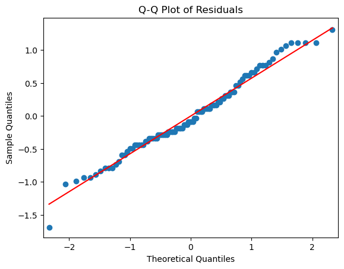
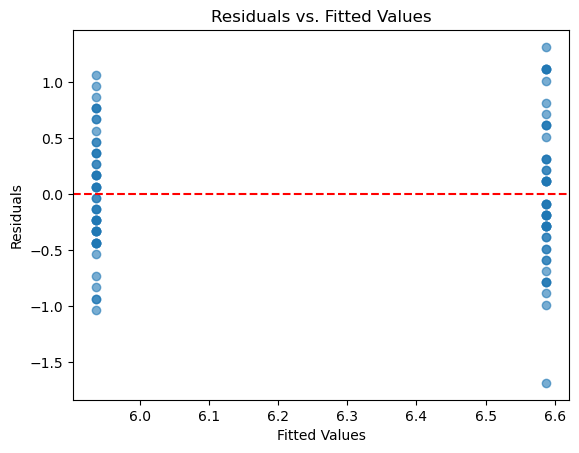
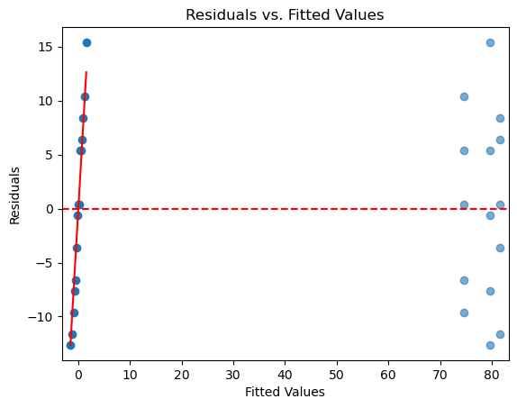
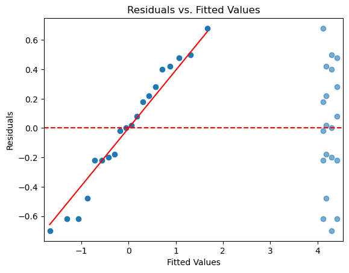

# 분산분석의 실무 응용

이 절에서는 Python으로 분산분석의 가정 검정과 진단을 보여주는 완결된 예제를 제시한다. 각 사례 연구는 전체 흐름을 따른다: 모형 적합, 가정 확인, 위반 사항 처리.

## 사례 연구 1: 붓꽃 종 (식물 형태)

### 배경

고전적인 붓꽃(Iris) 자료를 써서 두 종(versicolor와 virginica) 사이에 꽃받침 길이가 유의하게 다른지 검정한다. 이 예제는 분산분석의 전체 진단 흐름을 보여준다.

### 1단계: 자료 적재와 모형 적합

```python
import pandas as pd
import seaborn as sns
import statsmodels.api as sm
from statsmodels.formula.api import ols

data = sns.load_dataset("iris")
data = data[data["species"] != "setosa"]  # Two species for simplicity

model = ols('sepal_length ~ species', data=data).fit()
anova_table = sm.stats.anova_lm(model, typ=2)
print(anova_table)
```

출력:

```
           sum_sq    df          F        PR(>F)
species   10.6276   1.0  31.687502  1.724856e-07
Residual  32.8680  98.0        NaN           NaN
```

$F = 31.7$, $p = 1.7 \times 10^{-7}$로 두 종의 꽃받침 길이가 다르다는 결론이 압도적이다. 집단당 50개씩이라 검정력이 넉넉하다.

### 2단계: 정규성 확인

```python
import matplotlib.pyplot as plt
from scipy.stats import shapiro

# Q-Q Plot
sm.qqplot(model.resid, line='s')
plt.title("Q-Q Plot of Residuals")
plt.show()

# Shapiro-Wilk Test
stat, p_value = shapiro(model.resid)
print(f"Shapiro-Wilk Test: W = {stat:.4f}, p-value = {p_value:.4f}")
```

출력:

```
Shapiro-Wilk Test: W = 0.9831, p-value = 0.2285
```



$p = 0.23$으로 정규성에 반하는 증거가 없고, Q-Q 그림의 점들도 기준선을 잘 따른다.

### 3단계: 등분산성 확인

```python
from scipy.stats import levene

group1 = data[data['species'] == 'versicolor']['sepal_length']
group2 = data[data['species'] == 'virginica']['sepal_length']
stat, p_value = levene(group1, group2)
print(f"Levene's Test: F = {stat:.4f}, p-value = {p_value:.4f}")
```

출력:

```
Levene's Test: F = 1.0245, p-value = 0.3139
```

$p = 0.31$로 등분산도 기각되지 않는다. 두 가정이 모두 무난하므로 표준 분산분석 결과를 그대로 쓸 수 있다.

### 4단계: 독립성 확인 (잔차 그림)

```python
plt.scatter(model.fittedvalues, model.resid, alpha=0.6)
plt.axhline(y=0, color='r', linestyle='--')
plt.xlabel('Fitted Values')
plt.ylabel('Residuals')
plt.title('Residuals vs. Fitted Values')
plt.show()
```



세로 띠가 둘이고 각 띠의 높이가 비슷하다. 등분산 가정이 무난하다는 Levene 검정의 결론과 일치한다.

### 해석

정규성과 등분산성이 기각되지 않고(두 검정 모두 p > 0.05) 잔차 그림에 체계적인 패턴이 없으면 분산분석 결과를 자신 있게 해석할 수 있다. 그렇지 않으면 Welch 분산분석이나 Kruskal-Wallis 검정을 고려한다.

---

## 사례 연구 2: 근무 형태에 따른 직원 생산성

### 배경

어떤 회사가 세 가지 근무 형태(재택, 사무실, 혼합)에 따라 직원 생산성이 다른지 판정하려 한다. 이 예제는 작은 모의 자료를 쓴다.

### 1단계: 자료 적재와 모형 적합

```python
import pandas as pd
import statsmodels.api as sm
from statsmodels.formula.api import ols

data = pd.DataFrame({
    'productivity': [68, 75, 80, 65, 85, 78, 70, 82, 90, 88, 72, 95, 67, 85, 79],
    'environment': ['remote']*5 + ['office']*5 + ['hybrid']*5
})

model = ols('productivity ~ environment', data=data).fit()
anova_table = sm.stats.anova_lm(model, typ=2)
print(anova_table)
```

출력:

```
             sum_sq    df         F    PR(>F)
environment   130.0   2.0  0.768019  0.485443
Residual     1015.6  12.0       NaN       NaN
```

$F = 0.77$, $p = 0.49$로 기각하지 못한다. 세 형태의 생산성 평균이 다르다는 증거가 없다.

다만 집단당 5명뿐이라 검정력이 거의 없다시피 하다는 점을 함께 보아야 한다. 잔차 자유도가 12에 불과하므로 이 결과를 "차이가 없다"로 읽으면 안 된다.

### 2단계: 가정 확인

```python
import matplotlib.pyplot as plt
from scipy.stats import shapiro, levene

# Normality
sm.qqplot(model.resid, line='s')
plt.title("Q-Q Plot of Residuals")
plt.show()

stat, p_value = shapiro(model.resid)
print(f"Shapiro-Wilk Test: p-value = {p_value:.4f}")

# Homoscedasticity
group1 = data[data['environment'] == 'remote']['productivity']
group2 = data[data['environment'] == 'office']['productivity']
group3 = data[data['environment'] == 'hybrid']['productivity']
stat, p_value = levene(group1, group2, group3)
print(f"Levene's Test: p-value = {p_value:.4f}")

# Independence
plt.scatter(model.fittedvalues, model.resid, alpha=0.6)
plt.axhline(y=0, color='r', linestyle='--')
plt.xlabel('Fitted Values')
plt.ylabel('Residuals')
plt.title('Residuals vs. Fitted Values')
plt.show()
```

출력:

```
Shapiro-Wilk Test: p-value = 0.7449
Levene's Test: p-value = 0.7631
```



두 검정 모두 기각하지 못한다($p = 0.74$, $p = 0.76$). 그러나 $n = 15$에서 이 검정들의 검정력은 매우 낮아, "가정이 확인되었다"기보다 "확인할 수 없었다"에 가깝다.

### 작은 표본에 대한 주의

집단당 관측값이 5개뿐이면 Shapiro-Wilk 검정의 검정력이 낮고 Q-Q 그림도 그다지 유익하지 않을 수 있다. 이런 경우 분산분석은 모집단이 정규라는 가정에 크게 의존하므로 비모수 검정을 함께 수행하는 편이 신중하다.

---

## 사례 연구 3: 매장별 고객 만족도

### 배경

어떤 소매업체가 네 매장(A, B, C, D)의 고객 만족도 점수를 분석하여 유의한 차이가 있는지 판정한다.

### 1단계: 자료 적재와 모형 적합

```python
import pandas as pd
import statsmodels.api as sm
from statsmodels.formula.api import ols

data = pd.DataFrame({
    'satisfaction': [4.5, 3.8, 4.7, 4.2, 4.9, 4.1, 3.5, 4.3, 4.8, 3.9,
                     4.4, 4.0, 3.7, 4.2, 4.6, 4.8, 3.6, 4.3, 4.1, 4.7],
    'location': ['A']*5 + ['B']*5 + ['C']*5 + ['D']*5
})

model = ols('satisfaction ~ location', data=data).fit()
anova_table = sm.stats.anova_lm(model, typ=2)
print(anova_table)
```

출력:

```
          sum_sq    df         F    PR(>F)
location  0.2655   3.0  0.456186  0.716615
Residual  3.1040  16.0       NaN       NaN
```

$F = 0.46$, $p = 0.72$로 네 매장의 만족도에 차이가 없다. 집단 간 제곱합 0.27이 잔차 제곱합 3.10에 비해 아주 작다.

### 2단계: 가정 확인

```python
import matplotlib.pyplot as plt
from scipy.stats import shapiro, levene

# Normality
sm.qqplot(model.resid, line='s')
plt.title("Q-Q Plot of Residuals")
plt.show()

stat, p_value = shapiro(model.resid)
print(f"Shapiro-Wilk Test: p-value = {p_value:.4f}")

# Homoscedasticity
groups = [data[data['location'] == loc]['satisfaction'] for loc in ['A', 'B', 'C', 'D']]
stat, p_value = levene(*groups)
print(f"Levene's Test: p-value = {p_value:.4f}")

# Independence
plt.scatter(model.fittedvalues, model.resid, alpha=0.6)
plt.axhline(y=0, color='r', linestyle='--')
plt.xlabel('Fitted Values')
plt.ylabel('Residuals')
plt.title('Residuals vs. Fitted Values')
plt.show()
```

출력:

```
Shapiro-Wilk Test: p-value = 0.5488
Levene's Test: p-value = 0.9343
```



가정 위반의 증거가 없다.

### 3단계: 사후분석

분산분석이 유의한 차이를 드러내고 가정도 충족되면 사후 쌍별 비교를 수행한다:

```python
from statsmodels.stats.multicomp import pairwise_tukeyhsd

tukey = pairwise_tukeyhsd(data['satisfaction'], data['location'], alpha=0.05)
print(tukey)
```

출력:

```
Multiple Comparison of Means - Tukey HSD, FWER=0.05
=================================================
group1 group2 meandiff p-adj  lower  upper reject
-------------------------------------------------
     A      B     -0.3  0.708 -1.097 0.497  False
     A      C    -0.24 0.8243 -1.037 0.557  False
     A      D    -0.12 0.9723 -0.917 0.677  False
     B      C     0.06 0.9963 -0.737 0.857  False
     B      D     0.18 0.9154 -0.617 0.977  False
     C      D     0.12 0.9723 -0.677 0.917  False
-------------------------------------------------
```

여섯 비교 중 유의한 것이 하나도 없다. 전역 분산분석이 기각하지 못했으니 당연한 결과다.

실은 이 단계를 밟지 말았어야 한다. **전역 검정이 기각하지 못했으면 사후검정으로 넘어가지 않는 것이 원칙이다.** 그러지 않으면 다중비교 통제가 무너진다. 여기서는 절차를 보여주기 위해 실행했을 뿐이다.

Tukey의 HSD에 대한 자세한 내용은 [Tukey HSD](../post_hoc/tukey.md)를 보라.

---

## 요약

이 사례 연구들은 분산분석의 일관된 작업 흐름을 보여준다:

1. `statsmodels.formula.api.ols`로 **모형을 적합한다**.
2. Q-Q 그림과 Shapiro-Wilk 검정으로 **정규성을 확인한다**.
3. Levene 검정으로 **등분산성을 확인한다**.
4. 잔차 그림으로 **독립성을 확인한다**.
5. 위반이 발견되면 Welch 분산분석, 비모수 검정, 변환으로 **대처한다**.
6. 전체 분산분석이 유의하면 **사후검정을 수행한다**.

이 흐름을 따르면 분산분석 결과가 로버스트하고 결론이 자료로 잘 뒷받침되도록 할 수 있다.

## 연습문제

<div class="drillbox" markdown>

**연습문제 1.**
어떤 전자상거래 회사가 네 가지 결제 페이지 디자인(A, B, C, D)의 전환율을 시험한다. 각 디자인은 무작위로 뽑은 방문자 200명에게 보여준다. 이를 일원배치 분산분석 문제로 설정하는 방법을 기술하라. 집단, 반응변수, 귀무가설, 확인해야 할 핵심 가정을 정의하라.

</div>

??? success "풀이"

    - **집단:** 네 가지 결제 페이지 디자인(A, B, C, D), $k = 4$.
    - **반응변수:** 전환율(또는 구매까지 걸린 시간, 장바구니 금액 같은 적절한 연속형 지표). 전환/비전환의 이진 결과를 쓴다면 비율에 대한 분산분석은 큰 표본이 필요하거나 로지스틱 회귀 같은 대안이 필요하다.
    - **귀무가설:** $H_0: \mu_A = \mu_B = \mu_C = \mu_D$ (네 디자인의 모평균 반응이 같다).
    - **확인할 가정:**
        1. **독립성:** 무작위 배정으로 서로 다른 집단의 방문자가 독립임을 보장한다. 어떤 방문자도 여러 집단에 나타나지 않는지 확인한다.
        2. **정규성:** 집단당 $n = 200$이면 중심극한정리가 집단 평균의 근사적 정규성을 보장한다.
        3. **등분산성:** Levene 검정으로 확인한다. 어긋나면 Welch 분산분석을 쓴다.

<div class="drillbox" markdown>

**연습문제 2.**
금융 분산분석에서 어떤 포트폴리오 매니저가 세 섹터 ETF(기술, 헬스케어, 에너지)의 평균 월 수익률을 60개월에 걸쳐 비교한다. 표준적인 실험 설계에서는 대체로 생기지 않는, 이 상황 특유의 가정 문제는 무엇인가?

</div>

??? success "풀이"
    가장 큰 추가 문제는 **독립성**이다. 서로 다른 섹터 ETF의 월 수익률은 **같은 기간**에 측정되므로 공통의 시장 요인(예: 금리 변화, 거시 충격) 때문에 상관될 가능성이 높다. 이는 표준 일원배치 분산분석의 독립성 가정을 위반한다.

    또한 금융 수익률은 시간에 따라 순차적으로 측정되므로 각 집단 안에서 **자기상관**이 생길 수 있다. 유효 표본크기가 60보다 훨씬 작아져 F-통계량이 부풀려지고 거짓 양성이 나올 수 있다.

    적절한 처방으로는 (월을 블록 요인으로 다루는) **반복측정 분산분석**, **혼합효과 모형**, 또는 자기상관과 횡단면 의존을 함께 반영하는 **HAC(Newey-West) 표준오차**가 있다.

<div class="drillbox" markdown>

**연습문제 3.**
실무 사례 연구에서 자료 수집부터 최종 결론까지 분산분석의 전체 작업 흐름을 기술하라. 적어도 여섯 단계를 포함하라.

</div>

??? success "풀이"

    1. **연구 질문과 가설을 정의한다.** 집단, 반응변수, 귀무가설과 대립가설을 진술한다.

    2. **자료를 수집한다.** 무작위 표집과 처치군으로의 무작위 배정을 쓴다. 원하는 검정력에 필요한 표본크기를 확보한다.

    3. **탐색적 자료 분석.** 집단 평균, 표준편차, 표본크기를 계산한다. 상자그림으로 집단 분포를 시각화하고 잠재적 이상점을 찾는다.

    4. **분산분석 모형을 적합한다.** 소프트웨어(예: `scipy.stats.f_oneway`나 `statsmodels`)를 쓰고 F-통계량과 p-값을 기록한다.

    5. **가정을 확인한다:**
        - 정규성: 잔차의 Q-Q 그림과 Shapiro-Wilk 검정.
        - 등분산성: Levene 검정과 잔차 대 적합값 그림.
        - 독립성: 연구 설계 검토, 자료에 순서가 있으면 Durbin-Watson 검정.

    6. **위반이 발견되면 대처한다:** Welch 분산분석으로 옮기거나, 변환을 적용하거나, 비모수 대안을 쓴다.

    7. **전체 분산분석이 유의하면 사후검정을 수행한다**(맥락에 따라 Tukey HSD, Games-Howell, Dunnett).

    8. **결과를 보고한다.** 효과크기(에타제곱), 쌍별 차이의 신뢰구간, 맥락에 맞는 명확한 결론 진술을 포함한다.
