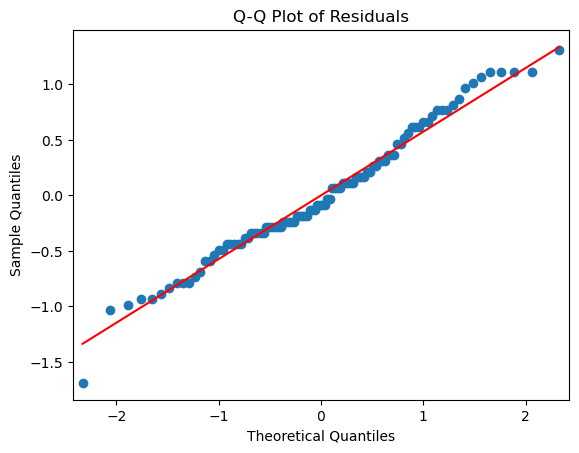
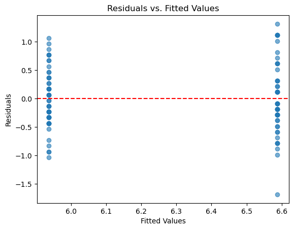
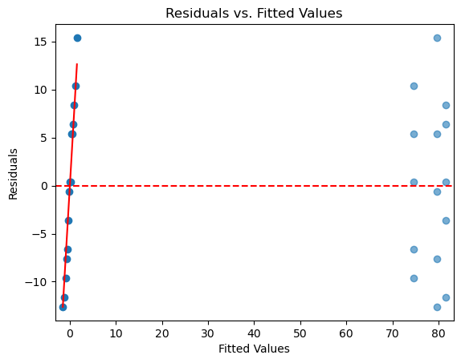
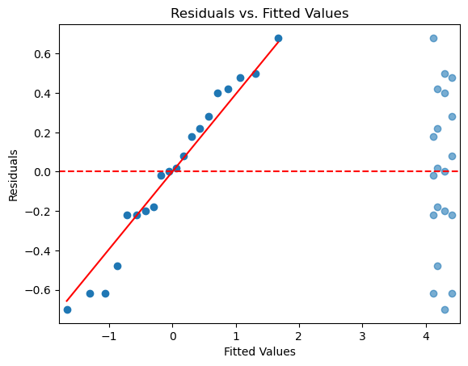

# 분산분석의 실무 응용

이 절에서는 Python으로 분산분석의 가정 검정과 진단을 보여주는 완결된 보기를 제시한다. 각 사례 연구는 전체 흐름을 따른다: 모형 적합, 가정 확인, 위반 사항 처리.

---

## 1. 사례 연구 1: 붓꽃 종 (식물 형태)

### 배경

고전적인 붓꽃(Iris) 자료를 써서 두 종(versicolor와 virginica) 사이에 꽃받침 길이가 유의하게 다른지 검정한다. 이 보기는 분산분석의 전체 진단 흐름을 보여준다.

### 1단계: 자료 적재와 모형 적합

<div class="exbox" markdown>

**보기 1.** <span class="diff easy" title="쉬움"></span> 사례 1 — 자료와 모형. 집단이 둘이면 분산분석은 이표본 $t$-검정의 다른 얼굴이다.

**(1)** 집단이 둘일 때

$$
\text{SSB} = \frac{n_1 n_2}{n_1+n_2}\left(\bar y_1 - \bar y_2\right)^2
$$

임을 보이고, 이로부터 $F = t^2$ 임을 유도하시오($t$ 는 합동분산을 쓴 이표본 $t$ 통계량).

**(2)** 두 종의 평균과 표준편차에서 $\text{SSB} = 10.6276$, $F = 31.6875$, $t = -5.6292$ 를 재현하고 $F = t^2$ 을 확인하시오.

**(3)** 효과크기 Cohen의 $d$ 를 구하시오. $p = 1.7\times10^{-7}$ 이라는 압도적인 p-값이 표본크기 덕인가 효과 덕인가.

</div>

??? success "풀이"

    **(1) 해석적으로.** $N = n_1+n_2$ 이고 전체평균이

    $$
    \bar y = \frac{n_1\bar y_1 + n_2\bar y_2}{N}
    $$

    이므로

    $$
    \bar y_1 - \bar y = \frac{n_2(\bar y_1 - \bar y_2)}{N},
    \qquad
    \bar y_2 - \bar y = \frac{n_1(\bar y_2 - \bar y_1)}{N}
    $$

    다. 넣으면 $\Delta = \bar y_1-\bar y_2$ 에 대해

    $$
    \text{SSB} = n_1\frac{n_2^2\Delta^2}{N^2} + n_2\frac{n_1^2\Delta^2}{N^2}
    = \frac{n_1n_2(n_2+n_1)}{N^2}\Delta^2
    = \frac{n_1n_2}{N}\Delta^2
    $$

    를 얻는다. $\square$

    한편 $k = 2$ 이면 $\text{MSB} = \text{SSB}/1 = \text{SSB}$ 이고 $\text{MSE} = s_p^2$ 이므로

    $$
    F = \frac{\text{SSB}}{s_p^2}
    = \frac{\Delta^2}{s_p^2\left(\frac{1}{n_1}+\frac{1}{n_2}\right)}
    = \left(\frac{\Delta}{s_p\sqrt{\frac{1}{n_1}+\frac{1}{n_2}}}\right)^2 = t^2
    $$

    다($\frac{n_1n_2}{N}$ 의 역수가 $\frac1{n_1}+\frac1{n_2}$ 임을 썼다). 두 검정이 **같은 검정**이다. 다만 $F$ 검정은 언제나 양측이므로, 단측 대립가설을 묻고 싶다면 $t$ 쪽을 써야 한다.

    **(2)–(3) 수치적으로.** 먼저 쪽의 분산분석표다.

    ```python
    import pandas as pd
    import seaborn as sns
    import statsmodels.api as sm
    from statsmodels.formula.api import ols

    # 붓꽃 자료에서 두 품종만 남긴다. 집단이 둘이면 분산분석과 이표본 t-검정이
    # 같은 결론을 주며, F = t^2 이라는 관계도 확인할 수 있다.
    data = sns.load_dataset("iris")
    data = data[data["species"] != "setosa"]

    model = ols('sepal_length ~ species', data=data).fit()
    anova_table = sm.stats.anova_lm(model, typ=2)
    print(anova_table)
    ```

    출력:

    ```
               sum_sq    df          F        PR(>F)
    species   10.6276   1.0  31.687502  1.724856e-07
    Residual  32.8680  98.0        NaN           NaN
    ```

    이제 (1)의 두 식을 집단 요약만으로 확인한다.

    ```python
    import numpy as np
    import seaborn as sns
    from scipy import stats
    from statsmodels.formula.api import ols

    data = sns.load_dataset("iris")
    data = data[data["species"] != "setosa"]
    g1 = data[data.species == 'versicolor'].sepal_length.values
    g2 = data[data.species == 'virginica'].sepal_length.values
    n1 = n2 = 50

    print(f"versicolor: 평균 {g1.mean():.4f}, 표준편차 {g1.std(ddof=1):.4f}")
    print(f"virginica : 평균 {g2.mean():.4f}, 표준편차 {g2.std(ddof=1):.4f}")
    delta = g1.mean() - g2.mean()
    SSB = n1 * n2 / (n1 + n2) * delta ** 2
    print(f"\n차이 = {delta:.4f}")
    print(f"공식 SSB = n1*n2/(n1+n2) * 차이^2 = {SSB:.6f}")

    model = ols('sepal_length ~ species', data=data).fit()
    MSE = model.mse_resid
    t = stats.ttest_ind(g1, g2).statistic
    print(f"MSE = s_p^2 = {MSE:.6f},  s_p = {np.sqrt(MSE):.6f}")
    print(f"공식 F = SSB/MSE = {SSB / MSE:.6f}")
    print(f"statsmodels F = {model.fvalue:.6f}")
    print(f"이표본 t = {t:.6f},  t^2 = {t ** 2:.6f}")

    print(f"\nCohen d = 차이 / s_p = {abs(delta) / np.sqrt(MSE):.4f}")
    print(f"참고: 집단당 n = 25 였다면 F = {25 / 50 * SSB / MSE:.2f}, "
          f"p = {stats.f.sf(25 / 50 * SSB / MSE, 1, 48):.2e}")
    ```

    출력:

    ```
    versicolor: 평균 5.9360, 표준편차 0.5162
    virginica : 평균 6.5880, 표준편차 0.6359

    차이 = -0.6520
    공식 SSB = n1*n2/(n1+n2) * 차이^2 = 10.627600
    MSE = s_p^2 = 0.335388,  s_p = 0.579127
    공식 F = SSB/MSE = 31.687502
    statsmodels F = 31.687502
    이표본 t = -5.629165,  t^2 = 31.687502

    Cohen d = 차이 / s_p = 1.1258
    참고: 집단당 n = 25 였다면 F = 15.84, p = 2.32e-04
    ```

    **$F = 31.687502$ 와 $t^2 = 31.687502$ 가 소수점 여섯째 자리까지 같다.** $\text{SSB}$ 도 $10.6276$ 으로 `anova_lm` 의 `sum_sq` 와 일치한다.

    **(3) 효과크기.** $d = 0.652/0.5791 = 1.1258$ 이다. 관례적인 눈금(작음 $0.2$, 중간 $0.5$, 큼 $0.8$)으로 **"큼"을 한참 넘는다.** 두 종의 평균이 **합동 표준편차의 $1.13$ 배**만큼 떨어져 있다는 뜻이다.

    그러므로 $p = 1.7\times10^{-7}$ 은 **표본크기 덕이 아니라 효과 덕이다.** 마지막 줄이 그 점을 보여 준다. 집단당 $25$ 개만 썼어도 $F = 15.84$, $p = 2.3\times10^{-4}$ 로 여전히 압도적이다. 집단당 $10$ 개쯤이면 겨우 $5\%$ 선에 걸칠 테지만, 이 자료는 그보다 훨씬 많다.

    **이 사례가 뒤의 두 사례와 대비되는 지점이 여기다.** 사례 2·3에서는 $n$ 이 작고 효과도 작아 "기각하지 못함"이 아무 정보를 주지 못하는데, 여기서는 효과가 커서 $n$ 이 넉넉하지 않았어도 같은 결론이 났을 것이다. **$p$-값 하나만으로는 그 둘을 구별할 수 없고, 효과크기를 함께 적어야 구별된다.**

$F = 31.7$, $p = 1.7 \times 10^{-7}$로 두 종의 꽃받침 길이가 다르다는 결론이 압도적이다. 집단당 50개씩이라 검정력이 넉넉하다.

### 2단계: 정규성 확인

<div class="exbox" markdown>

**보기 2.** <span class="diff easy" title="쉬움"></span> 사례 1 — 정규성 확인. $p = 0.23$ 으로 기각하지 못했다. 그런데 **기각했다면 무엇이 달라졌을까.**

**(1)** 집단당 $n = 50$ 인 두 집단에서 자료가 정규가 **아닐 때** 고전적 $F$ 검정의 실제 제1종 오류율을 모의실험으로 재시오. 분포는 정규·$t(3)$·지수·로그정규로 하고, 명목 수준은 $0.05$ 다.

**(2)** 같은 설정에서 Shapiro-Wilk 가 비정규성을 **적발하는 비율**을 재시오.

**(3)** 두 열을 나란히 놓고, 이 자료에서 정규성 검정이 어떤 결정에 쓸모가 있는지 밝히시오.

</div>

??? success "풀이"

    **(1)–(3) 수치적으로.** 먼저 쪽의 검정과 그림이다.

    ```python
    import matplotlib.pyplot as plt
    from scipy.stats import shapiro

    # 정규성은 자료가 아니라 잔차에 요구된다.
    sm.qqplot(model.resid, line='s')
    plt.title("Q-Q Plot of Residuals")
    plt.show()

    # 표본이 크면 사소한 이탈에도 유의하게 나오므로 그림과 함께 읽는다.
    stat, p_value = shapiro(model.resid)
    print(f"Shapiro-Wilk Test: W = {stat:.4f}, p-value = {p_value:.4f}")
    ```

    출력:

    ```
    Shapiro-Wilk Test: W = 0.9831, p-value = 0.2285
    ```

    

    이제 정규성이 깨졌을 때 무슨 일이 생기는지 모의실험으로 본다.

    ```python
    import numpy as np
    from scipy import stats

    rng = np.random.default_rng(2024)
    B = 20_000
    dists = {
        "정규": lambda n: rng.normal(0, 1, n),
        "t(3)": lambda n: rng.standard_t(3, n),
        "지수": lambda n: rng.exponential(1, n),
        "로그정규": lambda n: np.exp(rng.normal(0, 1, n)),
    }

    print("집단당 n = 50, 두 집단, 평균이 실제로 같을 때 (명목 0.05)")
    print(f"{'분포':>10}{'F 검정 오류율':>14}{'Shapiro 기각률':>16}")
    for lab, f in dists.items():
        bad_f = bad_s = 0
        for _ in range(B):
            a, b = f(50), f(50)
            bad_f += stats.f_oneway(a, b).pvalue < 0.05
            resid = np.concatenate([a - a.mean(), b - b.mean()])
            bad_s += stats.shapiro(resid).pvalue < 0.05
        print(f"{lab:>10}{bad_f / B:>14.4f}{bad_s / B:>16.4f}")
    ```

    출력:

    ```
    집단당 n = 50, 두 집단, 평균이 실제로 같을 때 (명목 0.05)
            분포      F 검정 오류율     Shapiro 기각률
            정규        0.0510          0.0478
          t(3)        0.0493          0.8699
            지수        0.0501          1.0000
          로그정규        0.0394          1.0000
    ```

    **두 열이 전혀 다른 이야기를 한다.**

    | 분포 | $F$ 검정 오류율 | Shapiro 기각률 |
    |---|---|---|
    | 정규 | $0.0510$ | $0.0478$ |
    | $t(3)$ | $0.0493$ | $\mathbf{0.8699}$ |
    | 지수 | $0.0501$ | $\mathbf{1.0000}$ |
    | 로그정규 | $\mathbf{0.0394}$ | $\mathbf{1.0000}$ |

    **왼쪽 열이 거의 움직이지 않는다.** 꼬리가 아주 두꺼운 $t(3)$ 에서도, 심하게 치우친 지수분포에서도 $F$ 검정의 실제 오류율이 $0.049$–$0.050$ 으로 명목값을 지킨다. 로그정규에서만 $0.039$ 로 **보수적인 쪽으로** 어긋나는데, 보수적인 어긋남은 거짓 양성을 늘리지 않으므로 덜 위험하다. 까닭은 중심극한정리다. $F$ 검정이 실제로 쓰는 것은 개별 관측값이 아니라 **집단평균**이고, $n = 50$ 이면 집단평균의 분포가 이미 충분히 정규에 가깝다.

    **오른쪽 열은 거의 $1$ 로 치솟는다.** Shapiro-Wilk 는 $n = 100$ 의 잔차에서 $t(3)$ 을 $87\%$, 지수와 로그정규를 $100\%$ 적발한다.

    **(3) 그래서 이 사례에서 정규성 검정은 어떤 결정에도 쓰이지 않는다.** $p = 0.2285$ 로 기각하지 못했지만, 기각했더라도 $F$ 검정을 버릴 이유가 되지 못했을 것이다. 왼쪽 열이 보여 주듯 **이 표본크기에서 $F$ 검정은 정규성을 사실상 요구하지 않기** 때문이다.

    그렇다면 Q-Q 그림을 왜 그리는가. 세 가지 때문이다.

    1. **이상점을 찾으려고.** 분포의 모양이 아니라 한두 점이 문제라면 $F$ 검정도 흔들린다(앞 절의 진단 쪽이 그 경우를 다룬다).
    2. **모형이 빠뜨린 구조를 보려고.** 잔차가 이봉이면 숨은 집단 변수가 있다는 신호다.
    3. **$n$ 이 작을 때를 대비해.** 사례 2·3 처럼 집단당 $5$ 개뿐이면 중심극한정리에 기댈 수 없다.

    **곧 그려서 보는 것은 쓸모가 있고, p-값으로 다음 단계를 분기시키는 것은 쓸모가 없다.** 보기 6·8에서 작은 표본일 때 이 이야기가 어떻게 달라지는지 본다.

$p = 0.23$으로 정규성에 반하는 증거가 없고, Q-Q 그림의 점들도 기준선을 잘 따른다.

### 3단계: 등분산성 확인

<div class="exbox" markdown>

**보기 3.** <span class="diff easy" title="쉬움"></span> 사례 1 — 등분산성 확인. $p = 0.31$ 이지만 **표본 분산비는 이미 $1.52$ 다.**

**(1)** 두 종의 표본표준편차와 그 비를 구하시오. Levene 이 그 크기의 차이를 적발할 확률은 얼마인가(집단당 $n = 50$, 모의실험).

**(2)** 같은 모의실험에서 **고전적 $F$ 검정의 실제 오류율**을 재시오. 집단 크기가 같을 때 이분산이 $F$ 를 얼마나 망가뜨리는가.

**(3)** 합동 $t$ 와 Welch $t$ 를 이 자료에 돌려 보고, 두 통계량이 같은 값을 주는 까닭을 밝히시오. 무엇이 다른가.

</div>

??? success "풀이"

    **(3) 해석적으로 먼저.** $n_1 = n_2 = n$ 이면 합동분산이 $s_p^2 = \frac{s_1^2+s_2^2}{2}$ 이므로

    $$
    \text{SE}_{\text{합동}} = \sqrt{s_p^2\left(\frac1n+\frac1n\right)} = \sqrt{\frac{s_1^2+s_2^2}{n}}
    = \sqrt{\frac{s_1^2}{n}+\frac{s_2^2}{n}} = \text{SE}_{\text{Welch}}
    $$

    로 **두 표준오차가 정확히 같다.** 따라서 $t$ 값도 같다. 다른 것은 **자유도뿐**이며, Welch–Satterthwaite 자유도는 $n_1+n_2-2 = 98$ 보다 작거나 같다. 등분산이 깨져도 **균형설계에서는 통계량이 바뀌지 않고 기준분포만 조금 보수적으로 바뀐다** — 이것이 아래 (2)의 모의실험 결과를 미리 설명해 준다.

    **(1)–(2) 수치적으로.** 먼저 쪽의 Levene 검정이다.

    ```python
    from scipy.stats import levene

    # Levene 검정으로 두 집단의 분산이 같다고 볼 수 있는지 확인한다.
    group1 = data[data['species'] == 'versicolor']['sepal_length']
    group2 = data[data['species'] == 'virginica']['sepal_length']
    stat, p_value = levene(group1, group2)
    print(f"Levene's Test: F = {stat:.4f}, p-value = {p_value:.4f}")
    ```

    출력:

    ```
    Levene's Test: F = 1.0245, p-value = 0.3139
    ```

    이제 분산비의 크기를 재고, 그 크기가 무엇을 망가뜨리는지 모의실험으로 본다.

    ```python
    import numpy as np
    import seaborn as sns
    from scipy import stats

    data = sns.load_dataset("iris")
    data = data[data["species"] != "setosa"]
    g1 = data[data.species == 'versicolor'].sepal_length.values
    g2 = data[data.species == 'virginica'].sepal_length.values
    s1, s2 = g1.std(ddof=1), g2.std(ddof=1)
    print(f"표준편차 {s1:.4f}, {s2:.4f}   비 {s2 / s1:.4f},  분산비 {(s2 / s1) ** 2:.4f}")
    print(f"Levene  p = {stats.levene(g1, g2).pvalue:.4f}")
    print(f"Bartlett p = {stats.bartlett(g1, g2).pvalue:.4f}")

    t_pool = stats.ttest_ind(g1, g2)
    t_welch = stats.ttest_ind(g1, g2, equal_var=False)
    print(f"\n합동 t = {t_pool.statistic:.6f},  df = 98,       p = {t_pool.pvalue:.3e}")
    print(f"Welch t = {t_welch.statistic:.6f},  df = {t_welch.df:.4f},  p = {t_welch.pvalue:.3e}")

    rng = np.random.default_rng(55)
    B = 10_000
    print(f"\n집단당 n = 50, 평균이 같을 때. sigma = (1, r)")
    print(f"{'r':>6}{'분산비':>8}{'Levene 적발':>12}{'고전 F 오류율':>14}{'Welch 오류율':>13}")
    for r in [1.0, 1.2319, 1.5, 2.0, 3.0]:
        lv = ff = wl = 0
        for _ in range(B):
            a, b = rng.normal(0, 1, 50), rng.normal(0, r, 50)
            lv += stats.levene(a, b).pvalue < 0.05
            ff += stats.f_oneway(a, b).pvalue < 0.05
            wl += stats.ttest_ind(a, b, equal_var=False).pvalue < 0.05
        print(f"{r:>6.4f}{r ** 2:>8.3f}{lv / B:>12.4f}{ff / B:>14.4f}{wl / B:>13.4f}")
    ```

    출력:

    ```
    표준편차 0.5162, 0.6359   비 1.2319,  분산비 1.5176
    Levene  p = 0.3139
    Bartlett p = 0.1478

    합동 t = -5.629165,  df = 98,       p = 1.725e-07
    Welch t = -5.629165,  df = 94.0255,  p = 1.866e-07

    집단당 n = 50, 평균이 같을 때. sigma = (1, r)
         r     분산비   Levene 적발      고전 F 오류율    Welch 오류율
    1.0000   1.000      0.0460        0.0476       0.0476
    1.2319   1.518      0.2552        0.0516       0.0516
    1.5000   2.250      0.7217        0.0507       0.0503
    2.0000   4.000      0.9924        0.0509       0.0502
    3.0000   9.000      1.0000        0.0488       0.0469
    ```

    **(3)의 예고가 맞는다.** 합동 $t$ 와 Welch $t$ 가 $-5.629165$ 로 소수점 여섯째 자리까지 같고, 자유도만 $98$ 대 $94.0255$ 로 다르다. p-값은 $1.725\times10^{-7}$ 대 $1.866\times10^{-7}$ 로 Welch 쪽이 $8\%$ 크다. **등분산을 포기하는 값이 이 자료에서는 자유도 $4$ 어치뿐이다.**

    **(1) Levene 의 검정력.** 표본 분산비가 이미 $1.52$ 인데 $p = 0.3139$ 다. 모의실험의 둘째 줄이 그 까닭을 말해 준다. **모분산비가 정확히 $1.52$ 일 때 Levene 이 그것을 적발할 확률은 $0.26$ 밖에 안 된다.** 넷 중 셋은 놓친다. 그러므로 $p = 0.31$ 은 "분산이 같다"가 아니라 **"이 정도 차이를 잡을 힘이 없다"**로 읽어야 한다. 참고로 Bartlett 은 $p = 0.1478$ 로 조금 더 민감하지만 역시 기각하지 못한다.

    **(2) 그런데 그래도 괜찮다.** 오른쪽 두 열을 보라. 모분산비를 $1$ 에서 $9$ 까지 키워도 **고전적 $F$ 검정의 실제 오류율이 $0.048$–$0.052$ 를 벗어나지 않는다.** Welch 와도 거의 같다. $\sigma$ 가 세 배 차이 나는데도 그렇다.

    까닭은 (3)에서 본 대로다. **균형설계에서는 이분산이 통계량을 바꾸지 못하고 자유도만 건드린다.** 그 자유도 차이가 $n = 50$ 에서는 거의 의미가 없다.

    **그러므로 이 사례에서도 등분산 검정은 어떤 결정에도 쓰이지 않는다.** 결정이 달라지는 것은 **설계가 불균형일 때**이고, 그때는 작은 집단의 분산이 크냐 작냐에 따라 $F$ 가 반대 방향으로 무너진다(진단 절의 처방 그림에서 불균형 이분산의 오류율이 $0.259$ 까지 갔던 것이 그 경우다). 집단 크기를 같게 맞추는 설계 단계의 선택이 사후의 어떤 검정보다 큰 보호 장치다.

$p = 0.31$로 등분산도 기각되지 않는다. 두 가정이 모두 무난하므로 표준 분산분석 결과를 그대로 쓸 수 있다.

### 4단계: 독립성 확인 (잔차 그림)

<div class="exbox" markdown>

**보기 4.** <span class="diff easy" title="쉬움"></span> 사례 1 — 잔차 그림. 그려 보고 **읽히는 것을 수치와 함께** 적는다.

**(1)** 두 띠의 가로 위치, 각 띠의 잔차 합·최소·최대·표준편차를 구하시오.

**(2)** "두 띠의 높이가 비슷하다"는 쪽의 서술을 수로 뒷받침하거나 수정하시오.

**(3)** 이 그림이 **가리는 것**을 둘 지적하시오. 특히 $100$ 개 관측값이 실제로 몇 개의 서로 다른 값을 갖는지 세어 보시오.

</div>

??? success "풀이"

    유도할 식이 없는 보기다. **그림에서 실제로 읽히는 것을 수로 적는 것**이 이 보기의 몫이다.

    **수치적으로.** 먼저 그림을 그린다.

    ```python
    # 일원배치에서 적합값은 집단평균뿐이므로 세로줄이 집단 수만큼만 생긴다.
    # 각 줄의 퍼짐이 비슷한지를 본다.
    plt.scatter(model.fittedvalues, model.resid, alpha=0.6)
    plt.axhline(y=0, color='r', linestyle='--')
    plt.xlabel('Fitted Values')
    plt.ylabel('Residuals')
    plt.title('Residuals vs. Fitted Values')
    plt.show()
    ```

    

    이제 눈대중 대신 재어 본다.

    ```python
    import numpy as np
    import seaborn as sns
    from statsmodels.formula.api import ols

    data = sns.load_dataset("iris")
    data = data[data["species"] != "setosa"]
    model = ols('sepal_length ~ species', data=data).fit()
    e = model.resid.values
    fit = model.fittedvalues.values
    sp = np.array(data.species)

    print(f"서로 다른 적합값 = {np.unique(np.round(fit, 6))}")
    print(f"\n{'띠':>12}{'합':>11}{'최소':>9}{'최대':>9}{'폭':>8}{'sd(ddof=0)':>12}")
    for s in ['versicolor', 'virginica']:
        ei = e[sp == s]
        print(f"{s:>12}{ei.sum():>11.1e}{ei.min():>9.3f}{ei.max():>9.3f}"
              f"{ei.max() - ei.min():>8.3f}{ei.std(ddof=0):>12.4f}")

    r = model.get_influence().resid_studentized_internal
    print(f"\n표준화 잔차: 최대 |r| = {np.abs(r).max():.4f},  |r|>2 인 개수 = {(np.abs(r) > 2).sum()}")
    print(f"관측값 100 개가 갖는 서로 다른 값의 수 = {len(set(data.sepal_length))}")
    print(f"  (0.1 눈금으로 기록되어 점이 겹친다)")
    print(f"두 종이 겹치는 구간 = [{data[data.species == 'virginica'].sepal_length.min():.1f}, "
          f"{data[data.species == 'versicolor'].sepal_length.max():.1f}]")
    ```

    출력:

    ```
    서로 다른 적합값 = [5.936 6.588]

               띠          합       최소       최대       폭  sd(ddof=0)
      versicolor    4.6e-14   -1.036    1.064   2.100      0.5110
       virginica    4.4e-14   -1.688    1.312   3.000      0.6295

    표준화 잔차: 최대 |r| = 2.9443,  |r|>2 인 개수 = 2
    관측값 100 개가 갖는 서로 다른 값의 수 = 28
      (0.1 눈금으로 기록되어 점이 겹친다)
    두 종이 겹치는 구간 = [4.9, 7.0]
    ```

    **(1) 읽히는 것.**

    - 점이 찍히는 가로 좌표는 $5.936$ 과 $6.588$ **두 곳뿐**이다. 적합값이 집단평균 둘이기 때문이다.
    - 두 띠 모두 잔차 합이 $10^{-14}$ 수준으로 정확히 $0$ 이다. 띠가 $0$ 선에 균형을 맞춰 걸린다.
    - 띠의 표준편차가 $0.5110$ 과 $0.6295$ 다.

    **(2) "높이가 비슷하다"를 수로 고쳐 적으면.** 표준편차로는 $0.5110$ 대 $0.6295$ 로 **$1.23$ 배**, 폭(최대$-$최소)으로는 $2.100$ 대 $3.000$ 으로 **$1.43$ 배**다. "비슷하다"보다는 **"오른쪽 띠가 눈에 띄게 길지만 결론을 바꿀 만큼은 아니다"**가 정확하다. 보기 3에서 본 대로 균형설계에서 이 정도 차이는 $F$ 검정에 거의 영향을 주지 않는다.

    폭의 비 $1.43$ 이 표준편차의 비 $1.23$ 보다 큰 것도 우연이 아니다. **범위는 양끝 두 점만 쓰므로 표준편차보다 훨씬 요동친다.** $n = 50$ 에서 범위를 보고 흩어짐을 비교하면 과장하기 쉽다. 눈은 띠의 길이를 보지만 검정은 표준편차를 쓴다.

    **(3) 이 그림이 가리는 것 둘.**

    첫째, **점이 겹친다.** $100$ 개 관측값이 실제로 갖는 서로 다른 값은 **$28$ 개뿐**이다. 꽃받침 길이가 $0.1$ 눈금으로 기록되었기 때문이다. 그러므로 그림에 보이는 점 하나가 관측 하나가 아니라 여럿일 수 있고, **띠 안에서 값이 어디에 몰려 있는지는 이 그림으로 알 수 없다.** `alpha=0.6` 이 그 사실을 조금 비춰 주지만 셀 수는 없다. 띠마다 상자그림이나 흔들림(jitter)을 얹어야 보인다.

    둘째, **이상점의 지위를 알려 주지 않는다.** 가장 큰 잔차가 $-1.688$ 인데 그것이 "많이 벗어난 것"인지 판단하려면 $\hat\sigma = 0.5791$ 로 나누어 보아야 한다. 표준화하면 $\lvert r\rvert$ 의 최대가 $2.9443$ 이고 $2$ 를 넘는 것이 $100$ 개 중 둘이다. **$100$ 개 표준정규에서 $\lvert z\rvert > 2$ 가 기대되는 개수가 $4.6$ 개이므로 오히려 적은 편**이며, 걱정할 점이 없다는 결론이 그제야 나온다.

    덧붙여 이 그림은 **독립성을 확인해 주지 못한다.** 쪽의 소제목이 "독립성 확인"이지만 가로축이 관측 순서가 아니라 집단평균이므로, 자료 수집 순서에 따른 상관이 있더라도 이 그림에는 나타나지 않는다. 여기서는 붓꽃 $100$ 포기가 서로 독립이라고 볼 설계상의 근거가 따로 있을 뿐이다.

세로 띠가 둘이고 각 띠의 높이가 비슷하다. 등분산 가정이 무난하다는 Levene 검정의 결론과 일치한다.

### 해석

정규성과 등분산성이 기각되지 않고(두 검정 모두 p > 0.05) 잔차 그림에 체계적인 패턴이 없으면 분산분석 결과를 자신 있게 해석할 수 있다. 그렇지 않으면 Welch 분산분석이나 Kruskal-Wallis 검정을 고려한다.

---

## 2. 사례 연구 2: 근무 형태에 따른 직원 생산성

### 배경

어떤 회사가 세 가지 근무 형태(재택, 사무실, 혼합)에 따라 직원 생산성이 다른지 판정하려 한다. 이 보기는 작은 모의 자료를 쓴다.

### 1단계: 자료 적재와 모형 적합

<div class="exbox" markdown>

**보기 5.** <span class="diff easy" title="쉬움"></span> 사례 2 — 자료와 모형. $p = 0.49$ 로 기각하지 못했다. **이 설계로는 무엇을 잡을 수 있었는가.**

**(1)** 대립가설 아래 $F$ 통계량이 비중심모수

$$
\lambda = \frac{n\sum_i(\mu_i-\bar\mu)^2}{\sigma^2} = N f^2,
\qquad
f = \frac{1}{\sigma}\sqrt{\frac{1}{k}\sum_i(\mu_i-\bar\mu)^2}
$$

인 비중심 $F$ 를 따름을 쓰고, 평균이 $(\mu - d/2,\ \mu,\ \mu + d/2)$ 꼴이면 $f = \dfrac{d}{\sigma\sqrt6}$ 임을 보이시오.

**(2)** $k = 3$, $n = 5$ 에서 검정력이 $0.80$ 이 되는 $f$ 와 그에 대응하는 **끝 두 집단의 평균 차 $d$** 를 구하시오. 합동 표준편차는 $\hat\sigma = 9.20$ 이다.

**(3)** 관측된 효과크기 $\hat f = \sqrt{\text{SSB}/\text{SSE}}$ 를 구하고, 그 크기를 $80\%$ 로 잡으려면 집단당 몇 명이 필요한지 보이시오. $\omega^2$ 도 함께 계산하시오.

</div>

??? success "풀이"

    **(1) 해석적으로.** 비중심모수는 $\lambda = \sum_i n_i(\mu_i-\bar\mu)^2/\sigma^2$ 이고 균형설계에서 $n_i = n$ 이므로

    $$
    \lambda = \frac{n\sum_i(\mu_i-\bar\mu)^2}{\sigma^2}
    = nk\cdot\frac{\frac1k\sum_i(\mu_i-\bar\mu)^2}{\sigma^2} = N f^2
    $$

    다. 평균이 $(\mu-d/2,\ \mu,\ \mu+d/2)$ 면 $\bar\mu = \mu$ 이고

    $$
    \sum_i(\mu_i-\bar\mu)^2 = \frac{d^2}{4} + 0 + \frac{d^2}{4} = \frac{d^2}{2}
    $$

    이므로 $f^2 = \frac{d^2}{2\cdot 3\sigma^2} = \frac{d^2}{6\sigma^2}$, 곧 $f = \dfrac{d}{\sigma\sqrt6}$ 다. $\square$

    **(2)–(3) 수치적으로.** 먼저 쪽의 분산분석표다.

    ```python
    import pandas as pd
    import statsmodels.api as sm
    from statsmodels.formula.api import ols

    # 근무 형태 세 가지에 따른 생산성. 집단마다 다섯 명씩이다.
    data = pd.DataFrame({
        'productivity': [68, 75, 80, 65, 85, 78, 70, 82, 90, 88, 72, 95, 67, 85, 79],
        'environment': ['remote']*5 + ['office']*5 + ['hybrid']*5
    })

    model = ols('productivity ~ environment', data=data).fit()
    anova_table = sm.stats.anova_lm(model, typ=2)
    print(anova_table)
    ```

    출력:

    ```
                 sum_sq    df         F    PR(>F)
    environment   130.0   2.0  0.768019  0.485443
    Residual     1015.6  12.0       NaN       NaN
    ```

    이제 검정력을 계산한다.

    ```python
    import warnings
    warnings.filterwarnings("ignore")

    import numpy as np
    import pandas as pd
    from scipy import optimize, stats

    data = pd.DataFrame({
        'productivity': [68, 75, 80, 65, 85, 78, 70, 82, 90, 88, 72, 95, 67, 85, 79],
        'environment': ['remote'] * 5 + ['office'] * 5 + ['hybrid'] * 5,
    })
    n, k = 5, 3
    N = n * k
    print(data.groupby('environment', sort=False).productivity.agg(['mean', 'std']).round(3))

    SSB, SSE = 130.0, 1015.6
    MSE = SSE / (N - k)
    sigma = np.sqrt(MSE)
    print(f"\nMSE = {MSE:.4f},  합동 표준편차 = {sigma:.4f}")
    print(f"관측된 평균의 최대-최소 = {81.6 - 74.6:.1f}")
    print(f"eta^2 = SSB/SST = {SSB / (SSB + SSE):.4f}")
    print(f"omega^2 = (SSB - (k-1)MSE)/(SST + MSE) = "
          f"{(SSB - (k - 1) * MSE) / (SSB + SSE + MSE):.4f}")

    crit = stats.f.ppf(0.95, k - 1, N - k)
    power = lambda f: stats.ncf.sf(crit, k - 1, N - k, N * f ** 2)
    print(f"\n임계값 F_0.95(2,12) = {crit:.4f}")
    print(f"평균이 (mu-d/2, mu, mu+d/2) 꼴이면 f = d/(sigma*sqrt(6))")
    print(f"{'Cohen f':>9}{'비중심모수':>12}{'검정력':>9}{'끝 두 집단의 차 d':>18}")
    for f in [0.25, 0.40, 0.60, 0.80, 1.00]:
        print(f"{f:>9.4f}{N * f ** 2:>12.3f}{power(f):>9.4f}{f * sigma * np.sqrt(6):>18.2f}")

    f80 = optimize.brentq(lambda f: power(f) - 0.80, 0.1, 1.5)
    print(f"\n검정력 0.80 이 되는 f = {f80:.4f},  그때 d = {f80 * sigma * np.sqrt(6):.2f}")
    f_obs = np.sqrt(SSB / SSE)
    print(f"관측된 f = sqrt(SSB/SSE) = {f_obs:.4f},  그 크기에서의 검정력 = {power(f_obs):.4f}")

    for nn in [5, 10, 20, 40, 80]:
        NN = nn * k
        c = stats.f.ppf(0.95, k - 1, NN - k)
        pw = stats.ncf.sf(c, k - 1, NN - k, NN * f_obs ** 2)
        print(f"  집단당 n = {nn:>3}: 관측 효과크기 f = {f_obs:.4f} 의 검정력 = {pw:.4f}")
    ```

    출력:

    ```
                 mean     std
    environment              
    remote       74.6   8.264
    office       81.6   8.050
    hybrid       79.6  10.991

    MSE = 84.6333,  합동 표준편차 = 9.1996
    관측된 평균의 최대-최소 = 7.0
    eta^2 = SSB/SST = 0.1135
    omega^2 = (SSB - (k-1)MSE)/(SST + MSE) = -0.0319

    임계값 F_0.95(2,12) = 3.8853
    평균이 (mu-d/2, mu, mu+d/2) 꼴이면 f = d/(sigma*sqrt(6))
      Cohen f       비중심모수      검정력       끝 두 집단의 차 d
       0.2500       0.938   0.1095              5.63
       0.4000       2.400   0.2137              9.01
       0.6000       5.400   0.4334             13.52
       0.8000       9.600   0.6827             18.03
       1.0000      15.000   0.8696             22.53

    검정력 0.80 이 되는 f = 0.9130,  그때 d = 20.57
    관측된 f = sqrt(SSB/SSE) = 0.3578,  그 크기에서의 검정력 = 0.1786
      집단당 n =   5: 관측 효과크기 f = 0.3578 의 검정력 = 0.1786
      집단당 n =  10: 관측 효과크기 f = 0.3578 의 검정력 = 0.3630
      집단당 n =  20: 관측 효과크기 f = 0.3578 의 검정력 = 0.6741
      집단당 n =  40: 관측 효과크기 f = 0.3578 의 검정력 = 0.9436
      집단당 n =  80: 관측 효과크기 f = 0.3578 의 검정력 = 0.9993
    ```

    **(2) 이 설계가 잡을 수 있는 것.** 검정력 $0.80$ 이 되는 효과크기는 $f = 0.9130$ 이고, 그것은 **끝 두 집단의 생산성이 $20.57$ 점 차이 나는** 경우다. 합동 표준편차가 $9.20$ 이므로 **$2.2$ 표준편차 차이**다.

    그런 차이는 거의 모든 실무 맥락에서 **눈으로도 보이는 크기**다. 통계가 필요 없을 만큼 큰 차이만 잡을 수 있는 설계라는 뜻이다. 실제로 관측된 차이는 $81.6 - 74.6 = 7.0$ 점이고, 표에서 $f = 0.25$–$0.40$ 구간의 검정력이 $0.11$–$0.21$ 에 불과하다.

    **(3) 관측된 효과크기와 필요한 표본.** $\hat f = \sqrt{130/1015.6} = 0.3578$ 로 관례적 눈금에서 "중간보다 조금 작음"에 해당한다. **그 크기가 참이라면 이 설계의 검정력은 $0.1786$** 이다. 다섯 번 중 네 번은 놓친다. 같은 효과를 $80\%$ 로 잡으려면 집단당 $20$ 명($0.674$)과 $40$ 명($0.944$) 사이, 곧 **대략 $25$–$30$ 명**이 필요하다. 현재의 $5$ 명의 다섯 배가 넘는다.

    **$\omega^2 = -0.0319$ 가 음수인 것도 함께 보라.** $\omega^2$ 은 모집단 효과크기를 편향을 줄여 추정한 양인데

    $$
    \hat\omega^2 = \frac{\text{SSB} - (k-1)\text{MSE}}{\text{SST} + \text{MSE}}
    $$

    에서 분자가 $130.0 - 2\times84.63 = -39.3$ 으로 음수다. **귀무가설이 참이어도 SSB 의 기댓값이 $(k-1)\sigma^2 = 169.3$ 이므로**, 관측된 $130.0$ 은 "우연만으로 기대되는 것보다도 작은" 집단 간 변동이다. 음수인 $\hat\omega^2$ 은 $0$ 으로 잘라 보고하는 것이 관례이며, **"효과가 있을 수도 있다"는 어떤 신호도 자료에 없다**는 뜻이다. $\eta^2 = 0.1135$ 만 보면 "$11\%$ 를 설명한다"고 오해하기 쉬운데, $\eta^2$ 은 $k-1$ 개의 자유도가 공짜로 가져가는 몫을 빼지 않은 양이다.

    **그러므로 이 사례의 올바른 보고는 이렇다.** "$F(2,12) = 0.77$, $p = 0.49$ 로 차이를 발견하지 못했다. 다만 이 설계는 집단 간 $2.2$ 표준편차($20.6$ 점) 이하의 차이를 $80\%$ 로 잡을 힘이 없으므로, 이 결과를 세 근무 형태의 생산성이 같다는 근거로 쓸 수 없다."

$F = 0.77$, $p = 0.49$로 기각하지 못한다. 세 형태의 생산성 평균이 다르다는 증거가 없다.

다만 집단당 5명뿐이라 검정력이 거의 없다시피 하다는 점을 함께 보아야 한다. 잔차 자유도가 12에 불과하므로 이 결과를 "차이가 없다"로 읽으면 안 된다.

### 2단계: 가정 확인

<div class="exbox" markdown>

**보기 6.** <span class="diff easy" title="쉬움"></span> 사례 2 — 가정 확인. 쪽의 본문이 "확인되었다기보다 확인할 수 없었다에 가깝다"고 했다. **얼마나 가까운지 재어 본다.**

**(1)** $k = 3$, 집단당 $n = 5$ 인 설계에서 Shapiro-Wilk 를 잔차 $15$ 개에 적용할 때, 자료가 $t(3)$·지수·로그정규일 때의 기각률을 모의실험으로 구하시오.

**(2)** 같은 설계에서 Levene(중앙값)이 $\sigma$ 비 $1.5$, $2$, $3$, $5$ 를 적발하는 비율을 구하시오. **귀무가설이 참일 때의 기각률**도 함께 보고 무엇이 이상한지 밝히시오.

**(3)** 이 자료의 $p = 0.7449$ 와 $p = 0.7631$ 을 어떻게 적어야 하는가.

</div>

??? success "풀이"

    **(1)–(2) 수치적으로.** 먼저 쪽의 두 검정이다.

    ```python
    import matplotlib.pyplot as plt
    from scipy.stats import shapiro, levene

    # 정규성 — 잔차의 Q-Q 그림과 Shapiro-Wilk 검정
    sm.qqplot(model.resid, line='s')
    plt.title("Q-Q Plot of Residuals")
    plt.show()

    stat, p_value = shapiro(model.resid)
    print(f"Shapiro-Wilk Test: p-value = {p_value:.4f}")

    # 등분산성 — Levene 검정
    group1 = data[data['environment'] == 'remote']['productivity']
    group2 = data[data['environment'] == 'office']['productivity']
    group3 = data[data['environment'] == 'hybrid']['productivity']
    stat, p_value = levene(group1, group2, group3)
    print(f"Levene's Test: p-value = {p_value:.4f}")

    # 독립성 — 잔차 대 적합값 그림
    plt.scatter(model.fittedvalues, model.resid, alpha=0.6)
    plt.axhline(y=0, color='r', linestyle='--')
    plt.xlabel('Fitted Values')
    plt.ylabel('Residuals')
    plt.title('Residuals vs. Fitted Values')
    plt.show()
    ```

    출력:

    ```
    Shapiro-Wilk Test: p-value = 0.7449
    Levene's Test: p-value = 0.7631
    ```

    

    이제 이 설계에서 두 검정이 무엇을 할 수 있는지 재어 본다.

    ```python
    import numpy as np
    from scipy import stats

    rng = np.random.default_rng(7)
    B = 20_000
    n, k = 5, 3

    print(f"집단당 n = {n}, k = {k} (N = {n * k}).  명목 0.05 에서 기각률")
    print(f"\nShapiro-Wilk 를 잔차 {n * k} 개에 적용")
    for lab, f in [("정규 (귀무가 참)", lambda m: rng.normal(0, 1, m)),
                   ("t(3)", lambda m: rng.standard_t(3, m)),
                   ("지수", lambda m: rng.exponential(1, m)),
                   ("로그정규", lambda m: np.exp(rng.normal(0, 1, m)))]:
        c = 0
        for _ in range(B):
            gs = [f(n) for _ in range(k)]
            r = np.concatenate([g - g.mean() for g in gs])
            c += stats.shapiro(r).pvalue < 0.05
        print(f"  {lab:>16}: {c / B:.4f}")

    print(f"\nLevene(중앙값) 을 정규자료에 적용, sigma = (1, 1, r)")
    for r in [1.0, 1.5, 2.0, 3.0, 5.0]:
        c = sum(stats.levene(rng.normal(0, 1, n), rng.normal(0, 1, n),
                             rng.normal(0, r, n)).pvalue < 0.05 for _ in range(B))
        print(f"  sigma 비 r = {r:>4}: {c / B:.4f}")
    ```

    출력:

    ```
    집단당 n = 5, k = 3 (N = 15).  명목 0.05 에서 기각률

    Shapiro-Wilk 를 잔차 15 개에 적용
            정규 (귀무가 참): 0.0410
                  t(3): 0.1759
                    지수: 0.3719
                  로그정규: 0.5527

    Levene(중앙값) 을 정규자료에 적용, sigma = (1, 1, r)
      sigma 비 r =  1.0: 0.0052
      sigma 비 r =  1.5: 0.0132
      sigma 비 r =  2.0: 0.0408
      sigma 비 r =  3.0: 0.1338
      sigma 비 r =  5.0: 0.3220
    ```

    **(1) Shapiro-Wilk 의 검정력.** 잔차가 $15$ 개뿐이면

    | 실제 분포 | 적발률 |
    |---|---|
    | $t(3)$ | $0.1759$ |
    | 지수 | $0.3719$ |
    | 로그정규 | $0.5527$ |

    다. 보기 2에서 $n = 100$ 일 때 각각 $0.87$, $1.00$, $1.00$ 이었던 것과 견주면 **같은 검정이 아니라고 해도 될 만큼 다르다.** 꼬리가 아주 두꺼운 $t(3)$ 조차 **여섯 번 중 다섯 번은 놓친다.**

    **(2) Levene 은 더 심하다.** 귀무가설이 참일 때 기각률이 $0.0052$ 다. **명목 $0.05$ 의 십분의 일**이다. $Z_{ij} = \lvert y_{ij} - \tilde y_i\rvert$ 를 만들 때 $n = 5$ 의 중앙값을 빼는데, 그 중앙값이 자료의 한 점과 정확히 같아 $Z$ 하나가 반드시 $0$ 이 되는 등 이산적인 성질이 강해져 검정이 극단적으로 보수적이 된다.

    그 보수성의 대가가 검정력이다. $\sigma$ 비가 **$2$ 배(분산비 $4$)여도 적발률이 $0.0408$**, 곧 귀무가설이 참일 때보다 겨우 조금 높다. $\sigma$ 비 $5$ (분산비 $25$)에서도 $0.32$ 다. **이 설계에서 Levene 검정은 사실상 작동하지 않는다.**

    **(3) 그러므로 이렇게 적어야 한다.** "$p = 0.74$ 와 $p = 0.76$ 으로 가정 위반의 증거를 찾지 못했다. 다만 집단당 $n = 5$ 에서 Shapiro-Wilk 는 지수분포조차 $37\%$ 밖에 적발하지 못하고 Levene 은 분산비 $4$ 를 $4\%$ 밖에 적발하지 못하므로, 이 두 p-값은 가정이 성립한다는 근거가 되지 못한다."

    **그래서 작은 표본에서는 검정을 돌리는 것보다 설계와 맥락에 기대는 편이 낫다.** 반응변수가 측정 오차의 합으로 생기는 양인지, 과거 비슷한 자료가 어떤 모양이었는지, 집단 크기를 같게 맞추었는지 — 그런 것들이 $n = 15$ 짜리 p-값 두 개보다 훨씬 많은 것을 말해 준다. 그리고 보기 5에서 보았듯 **이 자료의 진짜 문제는 가정이 아니라 검정력**이다.

두 검정 모두 기각하지 못한다($p = 0.74$, $p = 0.76$). 그러나 $n = 15$에서 이 검정들의 검정력은 매우 낮아, "가정이 확인되었다"기보다 "확인할 수 없었다"에 가깝다.

### 작은 표본에 대한 주의

집단당 관측값이 5개뿐이면 Shapiro-Wilk 검정의 검정력이 낮고 Q-Q 그림도 그다지 유익하지 않을 수 있다. 이런 경우 분산분석은 모집단이 정규라는 가정에 크게 의존하므로 비모수 검정을 함께 수행하는 편이 신중하다.

---

## 3. 사례 연구 3: 매장별 고객 만족도

### 배경

어떤 소매업체가 네 매장(A, B, C, D)의 고객 만족도 점수를 분석하여 유의한 차이가 있는지 판정한다.

### 1단계: 자료 적재와 모형 적합

<div class="exbox" markdown>

**보기 7.** <span class="diff easy" title="쉬움"></span> 사례 3 — 자료와 모형. $F = 0.46$ 은 **$1$ 보다 작다.** 그것이 무슨 뜻인지 따져 본다.

**(1)** 귀무가설이 참일 때 $E[\text{MSB}] = E[\text{MSE}] = \sigma^2$ 이므로 $F$ 가 $1$ 근처에서 흔들림을 쓰고, 이 자료의 SSB 가 귀무가설 아래 기댓값의 **몇 배**인지 구하시오.

**(2)** $F = 0.456$ 이하가 나올 확률 $\Pr(F_{3,16} \le 0.456)$ 을 구하시오. 작은 $F$ 는 "차이가 없다"의 증거인가, 아니면 흔한 일인가.

**(3)** $\eta^2$ 과 $\omega^2$ 을 계산하고 왜 부호가 다른지 밝히시오. 관측 효과크기에서 이 설계의 검정력은 얼마인가.

</div>

??? success "풀이"

    **(1) 해석적으로.** 귀무가설 $\mu_1 = \cdots = \mu_k$ 아래에서

    $$
    E[\text{SSB}] = (k-1)\sigma^2,
    \qquad
    E[\text{SSE}] = (N-k)\sigma^2
    $$

    이므로 두 평균제곱의 기댓값이 모두 $\sigma^2$ 이고 $F = \text{MSB}/\text{MSE}$ 는 $1$ 언저리에서 흔들린다(정확히는 $E[F] = \frac{N-k}{N-k-2}$ 로 $1$ 보다 조금 크다). 그러므로 **$F < 1$ 은 "집단 간 변동이 우연만으로 기대되는 것보다도 작았다"는 뜻**이지 그 이상이 아니다. $F$ 의 분포가 $0$ 부터 퍼져 있으므로 작은 값도 얼마든지 나온다.

    **(2)–(3) 수치적으로.** 먼저 쪽의 분산분석표다.

    ```python
    import pandas as pd
    import statsmodels.api as sm
    from statsmodels.formula.api import ols

    # 지점 네 곳의 고객만족도. 지점마다 다섯 건씩이다.
    data = pd.DataFrame({
        'satisfaction': [4.5, 3.8, 4.7, 4.2, 4.9, 4.1, 3.5, 4.3, 4.8, 3.9,
                         4.4, 4.0, 3.7, 4.2, 4.6, 4.8, 3.6, 4.3, 4.1, 4.7],
        'location': ['A']*5 + ['B']*5 + ['C']*5 + ['D']*5
    })

    model = ols('satisfaction ~ location', data=data).fit()
    anova_table = sm.stats.anova_lm(model, typ=2)
    print(anova_table)
    ```

    출력:

    ```
              sum_sq    df         F    PR(>F)
    location  0.2655   3.0  0.456186  0.716615
    Residual  3.1040  16.0       NaN       NaN
    ```

    이제 $F < 1$ 이 무슨 뜻인지 재어 본다.

    ```python
    import numpy as np
    import pandas as pd
    from scipy import stats

    data = pd.DataFrame({
        'satisfaction': [4.5, 3.8, 4.7, 4.2, 4.9, 4.1, 3.5, 4.3, 4.8, 3.9,
                         4.4, 4.0, 3.7, 4.2, 4.6, 4.8, 3.6, 4.3, 4.1, 4.7],
        'location': ['A'] * 5 + ['B'] * 5 + ['C'] * 5 + ['D'] * 5,
    })
    n, k = 5, 4
    N = n * k
    g = data.groupby('location').satisfaction
    print(g.agg(['mean', 'std']).round(4))

    SSB = n * ((g.mean().values - data.satisfaction.mean()) ** 2).sum()
    SSE = sum(((data[data.location == l].satisfaction
                - data[data.location == l].satisfaction.mean()) ** 2).sum()
              for l in 'ABCD')
    MSE = SSE / (N - k)
    F = (SSB / (k - 1)) / MSE
    print(f"\nSSB = {SSB:.4f},  SSE = {SSE:.4f},  MSE = {MSE:.6f},  F = {F:.6f}")
    print(f"귀무가설 아래 SSB 의 기댓값 = (k-1)*sigma^2 = {(k - 1) * MSE:.4f}")
    print(f"관측된 SSB 는 그 {SSB / ((k - 1) * MSE):.2f} 배")
    print(f"\neta^2  = SSB/SST                 = {SSB / (SSB + SSE):.4f}")
    print(f"omega^2 = (SSB-(k-1)MSE)/(SST+MSE) = {(SSB - (k - 1) * MSE) / (SSB + SSE + MSE):.4f}")
    print(f"\nP(F(3,16) <= {F:.4f}) = {stats.f.cdf(F, k - 1, N - k):.4f}")
    print(f"곧 귀무가설이 참이어도 이만큼 작은 F 가 나올 확률이 "
          f"{stats.f.cdf(F, k - 1, N - k):.1%} 다")
    print(f"평균의 최대-최소 = {g.mean().max() - g.mean().min():.2f},  합동 표준편차 = {np.sqrt(MSE):.4f}")
    print(f"관측 효과크기 f = sqrt(SSB/SSE) = {np.sqrt(SSB / SSE):.4f}")
    crit = stats.f.ppf(0.95, k - 1, N - k)
    print(f"검정력 (관측 f 가 참일 때) = {stats.ncf.sf(crit, k - 1, N - k, N * SSB / SSE):.4f}")
    ```

    출력:

    ```
              mean     std
    location              
    A         4.42  0.4324
    B         4.12  0.4817
    C         4.18  0.3493
    D         4.30  0.4848

    SSB = 0.2655,  SSE = 3.1040,  MSE = 0.194000,  F = 0.456186
    귀무가설 아래 SSB 의 기댓값 = (k-1)*sigma^2 = 0.5820
    관측된 SSB 는 그 0.46 배

    eta^2  = SSB/SST                 = 0.0788
    omega^2 = (SSB-(k-1)MSE)/(SST+MSE) = -0.0888

    P(F(3,16) <= 0.4562) = 0.2834
    곧 귀무가설이 참이어도 이만큼 작은 F 가 나올 확률이 28.3% 다
    평균의 최대-최소 = 0.30,  합동 표준편차 = 0.4405
    관측 효과크기 f = sqrt(SSB/SSE) = 0.2925
    검정력 (관측 f 가 참일 때) = 0.1419
    ```

    **(1) SSB 가 기댓값의 $0.46$ 배다.** 귀무가설 아래 SSB 의 기댓값이 $(k-1)\sigma^2 = 3\times0.194 = 0.582$ 인데 관측값은 $0.2655$ 다. **네 매장의 평균이 "우연만으로 흩어졌을 때보다도 덜 흩어져 있다."**

    **(2) 그런데 그것은 전혀 드문 일이 아니다.** $\Pr(F_{3,16} \le 0.456) = 0.2834$ 이므로 **귀무가설이 참이어도 네 번 중 한 번 넘게** 이만큼 작은 $F$ 가 나온다. 작은 $F$ 를 "차이가 없다는 강한 증거"로 읽고 싶은 유혹이 있지만, $F$ 분포의 왼쪽 꼬리는 두텁다. (분산성분이 음수로 추정되었다는 신호로 쓰는 경우는 있으나, 그것도 **$F$ 가 $1$ 보다 한참 작고 자유도가 클 때**의 이야기다. 여기서는 분모 자유도가 $16$ 뿐이다.)

    **(3) 두 효과크기의 부호가 다르다.**

    $$
    \eta^2 = \frac{0.2655}{3.3695} = 0.0788,
    \qquad
    \omega^2 = \frac{0.2655 - 0.582}{3.3695 + 0.194} = -0.0888
    $$

    $\eta^2$ 은 "집단이 전체 변동의 $7.9\%$ 를 설명한다"고 말하지만, **그 $7.9\%$ 는 자유도 셋이 공짜로 가져가는 몫보다도 작다.** $\omega^2$ 은 그 몫 $(k-1)\text{MSE} = 0.582$ 를 분자에서 빼므로 음수가 되고, 관례대로 $0$ 으로 잘라 보고한다. **$\eta^2$ 은 언제나 양수이므로 "작은 효과가 있다"고 오해하기 쉽다. 작은 설계에서는 $\omega^2$ 을 함께 적어야 한다.**

    **검정력은 $0.1419$ 다.** 관측된 $\hat f = 0.2925$ 가 참이라 해도 일곱 번 중 한 번만 잡는다. 평균의 최대–최소가 $0.30$ 점인데 합동 표준편차가 $0.4405$ 이므로, 네 매장의 차이는 **개인차의 $0.68$ 배**에 지나지 않는다.

    **그러므로 "네 매장의 만족도에 차이가 없다"는 보고는 과하다.** 이 자료가 말하는 것은 **"$0.3$ 점 정도의 차이라면 매장당 다섯 건으로는 보이지 않는다"**이다. 만족도 $0.3$ 점이 사업적으로 의미 있는 크기인지가 먼저 정해져야 하고, 그렇다면 표본을 늘려야 한다.

$F = 0.46$, $p = 0.72$로 네 매장의 만족도에 차이가 없다. 집단 간 제곱합 0.27이 잔차 제곱합 3.10에 비해 아주 작다.

### 2단계: 가정 확인

<div class="exbox" markdown>

**보기 8.** <span class="diff easy" title="쉬움"></span> 사례 3 — 가정 확인. 이번에는 **가정 확인이라는 절차 자체**를 평가한다. 두 검정이 적발하는 위반과 실제로 $F$ 를 망가뜨리는 위반이 같은가.

**(1)** $k = 4$, 집단당 $n = 5$ 에서 네 상황 — 가정이 모두 성립 / 비정규만 / 이분산만 / 둘 다 — 을 만들고, 각각에서 (가) Shapiro-Wilk 적발률, (나) Levene 적발률, (다) **고전적 $F$ 의 실제 제1종 오류율**, (라) 이분산에 로버스트한 검정(`scipy.stats.alexandergovern`)의 오류율을 재시오.

**(2)** "적발률" 열과 "오류율" 열을 맞추어 보고, **적발이 가장 필요한 위반을 가장 못 잡는다**는 것을 보이시오.

**(3)** 이 결과가 권하는 분석 절차를 적으시오.

</div>

??? success "풀이"

    **(1)–(2) 수치적으로.** 먼저 쪽의 두 검정이다.

    ```python
    import matplotlib.pyplot as plt
    from scipy.stats import shapiro, levene

    # 정규성 — 잔차의 Q-Q 그림과 Shapiro-Wilk 검정
    sm.qqplot(model.resid, line='s')
    plt.title("Q-Q Plot of Residuals")
    plt.show()

    stat, p_value = shapiro(model.resid)
    print(f"Shapiro-Wilk Test: p-value = {p_value:.4f}")

    # 등분산성 — Levene 검정
    groups = [data[data['location'] == loc]['satisfaction'] for loc in ['A', 'B', 'C', 'D']]
    stat, p_value = levene(*groups)
    print(f"Levene's Test: p-value = {p_value:.4f}")

    # 독립성 — 잔차 대 적합값 그림
    plt.scatter(model.fittedvalues, model.resid, alpha=0.6)
    plt.axhline(y=0, color='r', linestyle='--')
    plt.xlabel('Fitted Values')
    plt.ylabel('Residuals')
    plt.title('Residuals vs. Fitted Values')
    plt.show()
    ```

    출력:

    ```
    Shapiro-Wilk Test: p-value = 0.5488
    Levene's Test: p-value = 0.9343
    ```

    

    이제 이 절차가 실제로 무엇을 지켜 주는지 모의실험으로 본다.

    ```python
    import warnings
    warnings.filterwarnings("ignore")

    import numpy as np
    from scipy import stats

    rng = np.random.default_rng(99)
    B = 10_000
    n, k = 5, 4

    def nrm(s):
        return lambda: rng.normal(0, s, n)

    def lgn(s):
        return lambda: s * np.exp(rng.normal(0, 1, n))

    scen = {
        "가정 모두 성립": [nrm(1)] * 4,
        "비정규만 (로그정규)": [lgn(1)] * 4,
        "이분산만 (1,1,1,3)": [nrm(1), nrm(1), nrm(1), nrm(3)],
        "둘 다": [lgn(1)] * 3 + [lgn(3)],
    }

    print(f"집단당 n = {n}, k = {k}.  평균은 언제나 같다.  명목 0.05")
    print(f"{'상황':>20}{'Shapiro':>9}{'Levene':>8}{'둘 중 하나':>11}"
          f"{'고전 F':>8}{'Welch 류':>10}")
    for lab, fl in scen.items():
        a = b = c = d = e = 0
        for _ in range(B):
            gs = [f() for f in fl]
            r = np.concatenate([g - g.mean() for g in gs])
            s = stats.shapiro(r).pvalue < 0.05
            l = stats.levene(*gs).pvalue < 0.05
            a += s
            b += l
            c += (s or l)
            d += stats.f_oneway(*gs).pvalue < 0.05
            e += stats.alexandergovern(*gs).pvalue < 0.05
        print(f"{lab:>20}{a / B:>9.4f}{b / B:>8.4f}{c / B:>11.4f}{d / B:>8.4f}{e / B:>10.4f}")
    ```

    출력:

    ```
    집단당 n = 5, k = 4.  평균은 언제나 같다.  명목 0.05
                      상황  Shapiro  Levene     둘 중 하나    고전 F   Welch 류
                가정 모두 성립   0.0437  0.0036     0.0472  0.0474    0.0463
             비정규만 (로그정규)   0.6747  0.0205     0.6878  0.0320    0.0361
          이분산만 (1,1,1,3)   0.3043  0.1749     0.4092  0.0923    0.0468
                     둘 다   0.7061  0.0831     0.7352  0.2468    0.0953
    ```

    **(2) 두 묶음의 열이 서로 어긋난다.**

    | 상황 | 두 검정 중 하나라도 적발 | 고전 $F$ 의 오류율 | 적발이 필요한가 |
    |---|---|---|---|
    | 가정 모두 성립 | $0.0472$ | $0.0474$ | 필요 없음 — 잘 맞는다 |
    | 비정규만 | $\mathbf{0.6878}$ | $0.0320$ | **필요 없는데 자주 적발** |
    | 이분산만 | $0.4092$ | $\mathbf{0.0923}$ | **필요한데 절반 넘게 놓침** |
    | 둘 다 | $0.7352$ | $\mathbf{0.2468}$ | 필요, 적발은 함 |

    세 가지를 읽을 수 있다.

    첫째, **가정이 모두 성립할 때의 거짓 경보는 $0.047$ 로 낮다.** 두 검정을 함께 돌려도 그렇다. Levene 이 보기 6에서 본 대로 극도로 보수적($0.0036$)이라 둘을 합쳐도 거의 Shapiro 하나의 수준에 머문다.

    둘째, **비정규만 있을 때 $69\%$ 를 적발하는데, 정작 $F$ 는 멀쩡하다.** 오류율이 $0.032$ 로 오히려 보수적이다. 곧 이 적발의 대부분은 **행동으로 옮길 필요가 없는 경보**다. 여기서 "비모수로 바꾸자"고 결정하면 아무 문제도 없던 분석을 바꾸는 셈이다.

    셋째가 가장 중요하다. **고전 $F$ 를 실제로 망가뜨리는 것은 이분산인데($0.0923$, 명목의 거의 두 배), 바로 그것을 Levene 이 $17\%$ 밖에 못 잡는다.** $n = 5$ 라서 그렇다. **적발이 가장 필요한 위반을 가장 못 잡는 것이다.** 둘 다 깨진 마지막 줄에서는 $F$ 의 오류율이 $0.247$ 까지 가는데 — 유의하다고 보고한 넷 중 하나가 거짓인 셈이다 — Levene 은 $8\%$ 만 적발한다.

    **(3) 그래서 권할 절차는 "검정으로 분기하지 않는 것"이다.** 마지막 열을 보라. `alexandergovern`(이분산에 로버스트한 검정)의 오류율이 네 상황에서 $0.046$, $0.036$, $0.047$, $0.095$ 다. 셋째 줄에서 $F$ 의 $0.0923$ 을 $0.0468$ 로 되돌리고, 가정이 성립하는 첫째 줄에서도 $0.0463$ 으로 **아무것도 잃지 않는다.** 곧

    1. **등분산을 가정하지 않는 검정을 처음부터 쓴다.** 검정 결과에 따라 방법을 고르는 두 단계 절차는 선택 자체가 자료에 의존해 오류율을 흐린다.
    2. **그림은 그린다.** 다만 이상점이나 빠진 구조를 찾기 위해서이지 분기 결정을 위해서가 아니다.
    3. **p-값 대신 집단별 $s_i$ 와 상자그림을 보고한다.** 사례 3의 네 매장은 $s_i$ 가 $0.43$, $0.48$, $0.35$ , $0.48$ 로 고르다. 이 네 숫자가 Levene 의 $p = 0.9343$ 보다 많은 것을 말해 준다.

    마지막 줄($0.2468$)이 보여 주듯 이것은 사소한 차이가 아니다. **집단당 $5$ 개짜리 설계에서 가정 확인은 보호 장치가 아니라 의식(儀式)에 가깝다.**

가정 위반의 증거가 없다.

### 3단계: 사후분석

분산분석이 유의한 차이를 드러내고 가정도 충족되면 사후 쌍별 비교를 수행한다:

<div class="exbox" markdown>

**보기 9.** <span class="diff easy" title="쉬움"></span> 사례 3 — 사후분석. 전역 검정이 기각하지 못했는데 Tukey 를 돌렸다. **그 대가가 얼마인지 재어 본다.**

**(1)** $k = 4$, 집단당 $n = 5$, 평균이 모두 같을 때 다음 네 절차의 가족단위 오류율을 모의실험으로 구하시오.

| 절차 | 기각 규칙 |
|---|---|
| 투키 (전역검정 없이) | $\max_{i<j}\lvert t_{ij}\rvert > q_{0.05,4,16}/\sqrt2$ |
| 투키 (전역검정 통과 뒤에만) | 위 조건 **그리고** $F > F_{0.95,3,16}$ |
| LSD (전역검정 없이) | $\max_{i<j}\lvert t_{ij}\rvert > t_{0.975,16}$ |
| LSD (전역검정 통과 뒤에만) | 위 조건 **그리고** $F > F_{0.95,3,16}$ |

**(2)** 결과에서 **전역검정 관문이 꼭 필요한 절차와 그렇지 않은 절차**를 가르시오.

**(3)** 전역 $F$ 가 기각하지 못했는데 Tukey 가 어떤 쌍을 기각하는 일이 얼마나 자주 일어나는가. 그런 일이 **일어날 수 있다**는 것 자체는 무엇을 뜻하는가.

</div>

??? success "풀이"

    **(1)–(3) 수치적으로.** 먼저 쪽의 Tukey 출력이다.

    ```python
    from statsmodels.stats.multicomp import pairwise_tukeyhsd

    # 분산분석이 유의했으므로 어느 지점 쌍이 다른지 사후비교로 좁힌다.
    tukey = pairwise_tukeyhsd(data['satisfaction'], data['location'], alpha=0.05)
    print(tukey)
    ```

    출력:

    ```
    Multiple Comparison of Means - Tukey HSD, FWER=0.05
    =================================================
    group1 group2 meandiff p-adj  lower  upper reject
    -------------------------------------------------
         A      B     -0.3  0.708 -1.097 0.497  False
         A      C    -0.24 0.8243 -1.037 0.557  False
         A      D    -0.12 0.9723 -0.917 0.677  False
         B      C     0.06 0.9963 -0.737 0.857  False
         B      D     0.18 0.9154 -0.617 0.977  False
         C      D     0.12 0.9723 -0.677 0.917  False
    -------------------------------------------------
    ```

    이제 네 절차의 가족단위 오류율을 모의실험으로 잰다.

    ```python
    import numpy as np
    from scipy import stats

    rng = np.random.default_rng(314)
    B = 20_000
    n, k = 5, 4
    N, nu, m = n * k, n * k - k, k * (k - 1) // 2
    q_c = stats.studentized_range.ppf(0.95, k, nu)
    t_c = stats.t.ppf(0.975, nu)
    F_c = stats.f.ppf(0.95, k - 1, nu)
    print(f"k = {k}, 집단당 n = {n}, nu = {nu}, 쌍 수 m = {m}")
    print(f"임계값: q(0.95,4,16)/sqrt2 = {q_c / np.sqrt(2):.4f},  t(0.975,16) = {t_c:.4f},  "
          f"F(0.95,3,16) = {F_c:.4f}")

    cnt = dict(tukey=0, tukey_gated=0, lsd=0, lsd_gated=0, anova=0, tukey_only=0)
    for _ in range(B):
        gs = [rng.normal(0, 1, n) for _ in range(k)]
        mi = np.array([g.mean() for g in gs])
        MSE = np.mean([g.var(ddof=1) for g in gs])
        SE = np.sqrt(2 * MSE / n)
        tmax = max(abs(mi[i] - mi[j]) for i in range(k) for j in range(i + 1, k)) / SE
        Fv = (n * ((mi - mi.mean()) ** 2).sum() / (k - 1)) / MSE
        sig_F = Fv > F_c
        sig_T = tmax > q_c / np.sqrt(2)
        sig_L = tmax > t_c
        cnt['anova'] += sig_F
        cnt['tukey'] += sig_T
        cnt['tukey_gated'] += (sig_F and sig_T)
        cnt['lsd'] += sig_L
        cnt['lsd_gated'] += (sig_F and sig_L)
        cnt['tukey_only'] += (sig_T and not sig_F)

    print(f"\n평균이 모두 같을 때 (귀무가 참), 명목 0.05")
    for lab, key in [("전역 F 만", 'anova'), ("투키 (전역검정 없이)", 'tukey'),
                     ("투키 (전역검정 통과 뒤에만)", 'tukey_gated'),
                     ("LSD (전역검정 없이)", 'lsd'), ("LSD (전역검정 통과 뒤에만)", 'lsd_gated')]:
        print(f"  {lab:>26}: {cnt[key] / B:.4f}")
    print(f"\n전역 F 는 기각하지 못했는데 투키가 어떤 쌍을 기각한 비율 = {cnt['tukey_only'] / B:.4f}")
    ```

    출력:

    ```
    k = 4, 집단당 n = 5, nu = 16, 쌍 수 m = 6
    임계값: q(0.95,4,16)/sqrt2 = 2.8610,  t(0.975,16) = 2.1199,  F(0.95,3,16) = 3.2389

    평균이 모두 같을 때 (귀무가 참), 명목 0.05
                          전역 F 만: 0.0501
                    투키 (전역검정 없이): 0.0510
                투키 (전역검정 통과 뒤에만): 0.0437
                   LSD (전역검정 없이): 0.1916
               LSD (전역검정 통과 뒤에만): 0.0501

    전역 F 는 기각하지 못했는데 투키가 어떤 쌍을 기각한 비율 = 0.0073
    ```

    **(2) 관문이 꼭 필요한 절차와 그렇지 않은 절차가 갈린다.**

    | 절차 | 관문 없이 | 관문 통과 뒤에만 |
    |---|---|---|
    | 투키 | $0.0510$ | $0.0437$ |
    | LSD | $\mathbf{0.1916}$ | $0.0501$ |

    **LSD(보정 없는 쌍별 $t$-검정)에는 관문이 반드시 필요하다.** 그냥 돌리면 가족단위 오류율이 $0.19$ 로 명목의 네 배가 되고, 전역 $F$ 를 앞세우면 $0.0501$ 로 돌아온다. 이것이 Fisher 의 **보호된 LSD**이고, 쪽의 본문이 말하는 "그러지 않으면 다중비교 통제가 무너진다"가 정확히 들어맞는 절차다.

    **반면 투키는 관문 없이도 이미 $0.0510$ 이다.** 스튜던트화 범위분포가 **최댓값의 분포 자체**를 기준으로 삼으므로 전역 검정의 도움 없이 혼자 $\alpha$ 를 지킨다. 관문을 씌우면 $0.0437$ 로 내려가는데, 이는 보호가 아니라 **검정력을 조금 버리는 일**이다.

    그러므로 쪽의 본문은 **절차를 섞어 읽지 않도록 다듬어 읽어야 한다.** "전역 검정이 기각하지 못했으면 사후검정으로 넘어가지 않는다"는 지침 자체는 실무에서 널리 쓰이고 보고의 일관성을 지켜 주지만, **그 근거가 "통제가 무너지기 때문"인 것은 LSD 류에 한정된다.** 투키를 쓸 때 관문을 두는 이유는 오류율이 아니라 ─ 전역 검정과 사후검정이 서로 다른 말을 하는 보고서를 피하려는 ─ 해석상의 편의다.

    **(3) 두 결과가 어긋나는 일은 드물지만 일어난다.** 전역 $F$ 가 기각하지 못했는데 투키가 어떤 쌍을 기각하는 경우가 $0.0073$, 곧 **$137$ 번에 한 번** 꼴이다. 반대 방향(전역은 기각, 투키는 어느 쌍도 기각 못 함)은 훨씬 흔하다. $0.0501$ 중 $0.0437$ 만 투키도 기각하므로 약 $13\%$ 가 그 경우다.

    **어긋남이 가능한 까닭은 두 검정이 다른 것을 재기 때문이다.** 전역 $F$ 는 보기 1(Tukey 쪽)에서 본 대로 **모든 쌍의 제곱차를 합쳐** 재고, 투키는 **가장 큰 쌍 하나**를 본다. 평균 넷이 $(-a, -a, a, a)$ 처럼 둘씩 갈리면 $F$ 가 커지는데 가장 큰 쌍의 차이는 $2a$ 로 그대로다. 거꾸로 하나만 멀찍이 떨어지면 최댓값은 크지만 $F$ 는 덜 커진다. **두 검정이 같은 질문에 답한다고 생각하는 것이 어긋남의 원인**이며, 실제로는 하나가 다른 하나의 요약이 아니다.

    이 자료에서는 그런 미묘함이 없다. 여섯 쌍의 `p-adj` 가 $0.708$ 부터 $0.996$ 까지로 **어느 하나도 $0.1$ 근처에 가지 못한다.** 보기 7에서 본 대로 검정력이 $0.14$ 뿐인 설계이므로, 여섯 비교가 모두 유의하지 않은 것은 자료에 차이가 없어서라기보다 **차이를 볼 힘이 없어서**다.

여섯 비교 중 유의한 것이 하나도 없다. 전역 분산분석이 기각하지 못했으니 당연한 결과다.

실은 이 단계를 밟지 말았어야 한다. **전역 검정이 기각하지 못했으면 사후검정으로 넘어가지 않는 것이 관례다.** 다만 그 까닭은 절차마다 다르다 — 보정 없는 LSD 는 관문이 없으면 가족단위 오류율이 $0.19$ 로 무너지지만, **투키는 관문 없이도 $0.05$ 를 지킨다**(관문을 씌우면 오히려 $0.043$ 으로 보수적이 된다). 자세한 것은 보기 9 에 있다. 여기서는 절차를 보여주기 위해 실행했을 뿐이다.

Tukey의 HSD에 대한 자세한 내용은 [Tukey HSD](../post_hoc/tukey.md)를 보라.

---

## 연습문제

<div class="drillbox" markdown>

**연습문제 1.** <span class="diff easy" title="쉬움"></span>
어떤 전자상거래 회사가 네 가지 결제 페이지 디자인(A, B, C, D)의 전환율을 시험한다. 각 디자인은 무작위로 뽑은 방문자 200명에게 보여준다. 이를 일원배치 분산분석 문제로 설정하는 방법을 기술하라. 집단, 반응변수, 귀무가설, 확인해야 할 핵심 가정을 정의하라.

</div>

??? success "풀이"

    - **집단:** 네 가지 결제 페이지 디자인(A, B, C, D), $k = 4$.
    - **반응변수:** 전환율(또는 구매까지 걸린 시간, 장바구니 금액 같은 적절한 연속형 지표). 전환/비전환의 이진 결과를 쓴다면 비율에 대한 분산분석은 큰 표본이 필요하거나 로지스틱 회귀 같은 대안이 필요하다.
    - **귀무가설:** $H_0: \mu_A = \mu_B = \mu_C = \mu_D$ (네 디자인의 모평균 반응이 같다).
    - **확인할 가정:**
        1. **독립성:** 무작위 배정으로 서로 다른 집단의 방문자가 독립임을 보장한다. 어떤 방문자도 여러 집단에 나타나지 않는지 확인한다.
        2. **정규성:** 집단당 $n = 200$이면 중심극한정리가 집단 평균의 근사적 정규성을 보장한다.
        3. **등분산성:** Levene 검정으로 확인한다. 어긋나면 Welch 분산분석을 쓴다.

---

<div class="drillbox" markdown>

**연습문제 2.** <span class="diff easy" title="쉬움"></span>
11장 전체를 아우르는 **분산분석 실무 지침**을 정리하라.

</div>

??? success "풀이"
    **핵심 수치 여덟**(11장 전체에서).

    | 사실 | 값 | 출처 |
    |---|---|---|
    | 역페어링에서 표준 $F$의 오류율 | **0.29** | 가정 개요 |
    | 자기상관 $\rho=0.6$의 오류율 | **0.48** | 독립성 |
    | ICC $=0.10$, 군집당 30의 오류율 | **0.32** | 사례 연구 |
    | 무보정 쌍별 비교($k=10$) | **0.59** | 사후비교 |
    | 이분산에서 튜키의 FWER | **0.36** | 게임스-하웰 |
    | 로그정규에서 바틀렛 | **0.67** | 바틀렛 |
    | 잔차 최대 1개 제거의 오류율 | **0.09** | 영향점 |
    | 검정 넷 중 최소 $p$ | **0.07** | 가정 위반 처리 |

    **전체 작업 흐름.**

    ```text
    [0] 설계
        □ 무작위 배정인가 (인과 주장을 할 수 있는가)
        □ 관측이 독립인가 (군집·반복측정·시계열?)
        □ 배정 단위와 분석 단위가 같은가
        □ 검정력 계산 — 탐지 가능한 최소 효과는?

    [1] 자료 확인
        □ 집단별 n, 평균, s
        □ 분산비와 짝짓기 방향 (역페어링?)
        □ 결측과 이상점

    [2] 방법 결정  ← 자료 구조로 정한다. p 를 보고 정하지 않는다
        □ 독립 아님      → 혼합효과·반복측정·집계
        □ 이분산·불균형  → 웰치 + 게임스-하웰
        □ 평균-분산 비례 → 변환 고려
        □ 그 외          → 표준 F + 튜키

    [3] 진단
        □ 잔차 대 적합값, Q-Q
        □ 스튜던트화 잔차 (본페로니 임계값)
        □ 쿡 거리 — 민감도 분석

    [4] 분석
        □ 전체 검정 + 효과크기
        □ 사후비교 (절차를 사전에 정한 집합에 맞춰)
        □ 신뢰구간

    [5] 보고
        □ 설계·n·평균·s
        □ 방법 선택의 이유
        □ 효과크기와 구간
        □ 검정력의 한계
        □ 인과/연관의 구분
    ```

    **[2]가 이 장의 핵심**이다. **방법을 $p$-값이 아니라 자료 구조로 정한다.**

    **가장 흔한 실수 여덟.**

    | 실수 | 대가 |
    |---|---|
    | 군집 자료를 개체 단위로 | 오류율 0.32 |
    | 역페어링인데 표준 $F$ | 0.29 |
    | 이분산인데 튜키 | 0.36 |
    | 보정 없는 쌍별 비교 | 0.59 |
    | 가정 검정으로 방법 선택 | 사전검정의 역설 |
    | 이상점 제거 후 검정 | 0.09 |
    | 여러 방법 중 최선 선택 | 0.07 |
    | **"유의하지 않음"을 "같음"으로** | 잘못된 결론 |

    **마지막이 통계적으로는 가장 온건하지만 실무적으로는 가장 흔하다.**

    **세 가지 원칙.**

    1. **설계가 분석보다 중요하다.** 독립성과 무작위화는 사후에 고칠 수 없다.
    2. **방법은 자료 구조가 정한다.** $p$-값을 보고 고르면 그 $p$는 무효다.
    3. **$p$가 아니라 구간으로 판단한다.** 크기와 불확실성을 함께 본다.

    **한 문장.** 분산분석은 **"집단 사이에 차이가 있는가"를 묻는 도구**이지만, 그 답이 믿을 만한지는 **분산분석 바깥의 것들**(설계, 독립성, 무엇을 미리 정했는가)이 정한다.

---

<div class="drillbox" markdown>

**연습문제 3.** <span class="diff med" title="중간"></span>
금융 분산분석에서 어떤 포트폴리오 매니저가 세 섹터 ETF(기술, 헬스케어, 에너지)의 평균 월 수익률을 60개월에 걸쳐 비교한다. 표준적인 실험 설계에서는 대체로 생기지 않는, 이 상황 특유의 가정 문제는 무엇인가?

</div>

??? success "풀이"
    가장 큰 추가 문제는 **독립성**이다. 서로 다른 섹터 ETF의 월 수익률은 **같은 기간**에 측정되므로 공통의 시장 요인(예: 금리 변화, 거시 충격) 때문에 상관될 가능성이 높다. 이는 표준 일원배치 분산분석의 독립성 가정을 위반한다.

    또한 금융 수익률은 시간에 따라 순차적으로 측정되므로 각 집단 안에서 **자기상관**이 생길 수 있다. 유효 표본크기가 60보다 훨씬 작아져 F-통계량이 부풀려지고 거짓 양성이 나올 수 있다.

    적절한 처방으로는 (월을 블록 요인으로 다루는) **반복측정 분산분석**, **혼합효과 모형**, 또는 자기상관과 횡단면 의존을 함께 반영하는 **HAC(Newey-West) 표준오차**가 있다.

---

<div class="drillbox" markdown>

**연습문제 4.** <span class="diff med" title="중간"></span>
실무 사례 연구에서 자료 수집부터 최종 결론까지 분산분석의 전체 작업 흐름을 기술하라. 적어도 여섯 단계를 포함하라.

</div>

??? success "풀이"

    1. **연구 질문과 가설을 정의한다.** 집단, 반응변수, 귀무가설과 대립가설을 진술한다.

    2. **자료를 수집한다.** 무작위 표집과 처치군으로의 무작위 배정을 쓴다. 원하는 검정력에 필요한 표본크기를 확보한다.

    3. **탐색적 자료 분석.** 집단 평균, 표준편차, 표본크기를 계산한다. 상자그림으로 집단 분포를 시각화하고 잠재적 이상점을 찾는다.

    4. **분산분석 모형을 적합한다.** 소프트웨어(예: `scipy.stats.f_oneway`나 `statsmodels`)를 쓰고 F-통계량과 p-값을 기록한다.

    5. **가정을 확인한다:**
        - 정규성: 잔차의 Q-Q 그림과 Shapiro-Wilk 검정.
        - 등분산성: Levene 검정과 잔차 대 적합값 그림.
        - 독립성: 연구 설계 검토, 자료에 순서가 있으면 Durbin-Watson 검정.

    6. **위반이 발견되면 대처한다:** Welch 분산분석으로 옮기거나, 변환을 적용하거나, 비모수 대안을 쓴다.

    7. **전체 분산분석이 유의하면 사후검정을 수행한다**(맥락에 따라 Tukey HSD, Games-Howell, Dunnett).

    8. **결과를 보고한다.** 효과크기(에타제곱), 쌍별 차이의 신뢰구간, 맥락에 맞는 명확한 결론 진술을 포함한다.

---

<div class="drillbox" markdown>

**연습문제 5.** <span class="diff med" title="중간"></span>
연습문제 4의 **작업 흐름을 코드로 구현**하라. 하나의 함수로 사례 연구를 끝까지 수행하게 만들어라.

</div>

??? success "풀이"
    ```python
    import warnings
    warnings.filterwarnings("ignore")

    import numpy as np
    import pandas as pd
    from scipy import stats
    from statsmodels.stats.libqsturng import qsturng

    def anova_case_study(groups, names=None, alpha=0.05):
        """일원배치 분산분석의 전 과정을 수행하고 보고서를 출력한다."""
        k = len(groups)
        names = names or [f"G{i}" for i in range(k)]
        n = np.array([len(g) for g in groups], float)
        m = np.array([g.mean() for g in groups])
        v = np.array([g.var(ddof=1) for g in groups])
        res = np.concatenate([g - g.mean() for g in groups])

        print("[1] 기술통계")
        for i in range(k):
            print(f"    {names[i]:>12s}  n={int(n[i]):4d}  "
                  f"평균={m[i]:9.4f}  s={np.sqrt(v[i]):8.4f}")
        s = np.sqrt(v)
        print(f"    SD 비 = {s.max() / s.min():.2f},  "
              f"n 비 = {n.max() / n.min():.2f}")

        print("\n[2] 가정 점검")
        lev = stats.levene(*groups, center="median")
        sw = stats.shapiro(res)
        print(f"    브라운-포사이드  W = {lev.statistic:8.4f}  p = {lev.pvalue:.4f}")
        print(f"    샤피로(잔차)     W = {sw.statistic:8.4f}  p = {sw.pvalue:.4f}")
        print(f"    잔차 치우침 = {stats.skew(res):+.3f}, "
              f"초과첨도 = {stats.kurtosis(res):+.3f}")

        print("\n[3] 전체 검정")
        r = stats.f_oneway(*groups)
        N = int(n.sum())
        w = n / v
        W = w.sum()
        mt = (w * m).sum() / W
        lam = ((1 - w / W)**2 / (n - 1)).sum()
        Fw = ((w * (m - mt)**2).sum() / (k - 1)
              / (1 + 2 * (k - 2) / (k**2 - 1) * lam))
        df2 = (3 / (k**2 - 1) * lam)**-1
        print(f"    표준 F({k - 1}, {N - k}) = {r.statistic:.4f}, p = {r.pvalue:.3e}")
        print(f"    웰치  F({k - 1}, {df2:.1f}) = {Fw:.4f}, "
              f"p = {stats.f.sf(Fw, k - 1, df2):.3e}")

        print("\n[4] 효과크기")
        e2 = 2 * r.statistic / (2 * r.statistic + N - k) if k == 3 else \
            (k - 1) * r.statistic / ((k - 1) * r.statistic + N - k)
        w2 = ((k - 1) * (r.statistic - 1)
              / ((k - 1) * r.statistic + N - k + 1))
        print(f"    η² = {e2:.4f},  ω² = {w2:.4f},  "
              f"Cohen f = {np.sqrt(max(w2, 0) / max(1 - w2, 1e-9)):.4f}")

        print("\n[5] 사후비교 (게임스-하웰, 등분산 가정 없음)")
        for i in range(k):
            for j in range(i + 1, k):
                sij = v[i] / n[i] + v[j] / n[j]
                dfw = sij**2 / (v[i]**2 / (n[i]**2 * (n[i] - 1))
                                + v[j]**2 / (n[j]**2 * (n[j] - 1)))
                diff = m[j] - m[i]
                h = qsturng(1 - alpha, k, dfw) * np.sqrt(sij / 2)
                mark = "*" if abs(diff) > h else " "
                print(f"    {names[j]:>12s} - {names[i]:<12s} {diff:+8.4f}  "
                      f"95% [{diff - h:+8.4f},{diff + h:+8.4f}] {mark}")

    rng = np.random.default_rng(19003)
    gs = [rng.normal(mu, sd, n) for n, mu, sd in
          [(24, 72.0, 6.0), (30, 76.5, 8.5), (18, 74.0, 5.0)]]
    anova_case_study(gs, ["대조", "처치A", "처치B"])
    ```

    ```text
    [1] 기술통계
                  대조  n=  24  평균=  71.8993  s=  6.0327
                 처치A  n=  30  평균=  76.1086  s=  7.7558
                 처치B  n=  18  평균=  75.4059  s=  5.6139
        SD 비 = 1.38,  n 비 = 1.67

    [2] 가정 점검
        브라운-포사이드  W =   1.8328  p = 0.1677
        샤피로(잔차)     W =   0.9905  p = 0.8692
        잔차 치우침 = +0.024, 초과첨도 = -0.281

    [3] 전체 검정
        표준 F(2, 69) = 2.8184, p = 6.659e-02
        웰치  F(2, 44.1) = 3.0189, p = 5.905e-02

    [4] 효과크기
        η² = 0.0755,  ω² = 0.0481,  Cohen f = 0.2247

    [5] 사후비교 (게임스-하웰, 등분산 가정 없음)
                 처치A - 대조            +4.2093  95% [ -0.3181, +8.7366]  
                 처치B - 대조            +3.5066  95% [ -0.9010, +7.9141]  
                 처치B - 처치A           -0.7027  95% [ -5.4024, +3.9970]  
    ```

    **유의한 차이가 없다.** 세 구간이 모두 0을 포함한다.

    **함수가 다섯 단계를 모두 수행한다.**

    | 단계 | 산출 |
    |---|---|
    | 1 기술통계 | $n$, 평균, $s$, 비 |
    | 2 가정 | 등분산, 정규성, 치우침·첨도 |
    | 3 검정 | 표준 $F$와 웰치를 **둘 다** |
    | 4 효과크기 | $\eta^2$, $\omega^2$, 코헨 $f$ |
    | 5 사후비교 | 게임스-하웰 + **동시 신뢰구간** |

    **표준 $F$와 웰치를 둘 다 보여 주는 것**이 설계상의 선택이다. 등분산이 성립하면(여기서는 $p=0.31$) 결론이 같고, 다르면 **사람이 판단**해야 한다.

    **이 자료의 해석.** $p=0.12\sim0.15$로 유의하지 않지만

    - **$\omega^2=0.026$**으로 효과가 작고
    - 처치A 대 대조의 구간이 $[-1.9,\ 8.5]$로 **넓다**

    **"차이가 없다"가 아니라 "판단할 만한 정보가 없다"**가 정확하다. 8.5의 개선을 배제하지 못한다.

    **함수가 하지 않는 것 넷.**

    | 항목 | 왜 |
    |---|---|
    | 독립성 점검 | **설계를 봐야** 한다 |
    | 그림 | 코드로 자동화해도 **사람이 봐야** 한다 |
    | 이상점 판단 | 기록 확인이 필요 |
    | 방법의 최종 선택 | 자료 구조와 연구 질문에 달렸다 |

---

<div class="drillbox" markdown>

**연습문제 6.** <span class="diff med" title="중간"></span>
남의 **분산분석 보고서를 검토하는 점검표**를 만들어라. 무엇을 보고 무엇을 의심하는가?

</div>

??? success "풀이"
    **보고서에 반드시 있어야 할 것 여덟.**

    | 항목 | 없으면 의심할 것 |
    |---|---|
    | **집단별 $n$** | 불균형을 감췄는가 |
    | **집단별 평균과 $s$** | 이분산을 감췄는가 |
    | $F$, df, $p$ | df가 $n$과 맞는가 |
    | **효과크기** | $p$만 있으면 크기를 알 수 없다 |
    | **사후비교의 절차명** | 보정을 했는가 |
    | **신뢰구간** | 크기의 불확실성 |
    | 가정 점검 | 했는가, 어떻게 했는가 |
    | **설계**(무작위? 군집?) | 독립성이 성립하는가 |

    **자유도로 검산한다.**

    ```text
    보고: "F(3, 96) = 4.21"
      → k = 4,  N = 96 + 4 = 100
      → 집단별 n 이 25 씩이라면 맞다
      → 본문에 "각 군 30명" 이라 되어 있으면 N=120, df2=116 이어야 한다
         → 결측이 있었거나 보고가 잘못되었다
    ```

    **자유도 불일치는 가장 흔한 오류**이고, **다른 문제의 신호**이기도 하다.

    **의심 신호 여덟.**

    | 신호 | 무엇을 의심하나 |
    |---|---|
    | **$p=0.049$** | $p$-해킹, 선택적 보고 |
    | 효과크기 없음 | 효과가 작아서 감춤 |
    | 사후비교 절차 미기재 | 보정 안 함 |
    | **"유의하지 않으므로 차이가 없다"** | 검정력 무시 |
    | 여러 종속변수 중 하나만 보고 | 다중성 |
    | **"탐색적으로 발견했다"는 표현이 없는 사후 대비** | 자료 준설 |
    | 표본이 작은데 정규성 검정이 유의하지 않다고 안심 | 검정력 없음 |
    | 군집 자료를 개체 단위로 분석 | 오류율 폭증 |

    **네 번째가 가장 흔하다.** "$p=0.32$이므로 두 처치의 효과는 같다"는 문장을 보면

    - **효과크기와 구간**을 찾아본다
    - 없으면 $n$과 $s$로 **직접 계산**한다
    - 구간이 넓으면 **"판단 불가"**로 읽는다

    **검산할 수 있는 것 넷.**

    | 보고된 것 | 검산 |
    |---|---|
    | $F$와 df | $\eta^2=\dfrac{\text{df}_1F}{\text{df}_1F+\text{df}_2}$ |
    | 평균과 $s$, $n$ | $F$를 직접 재계산 |
    | $t$와 df | $p$를 다시 계산 |
    | 사후비교의 $p$ | 보정 방식이 맞는지 |

    **첫 줄이 특히 유용하다.** 효과크기를 보고하지 않았어도 **$F$와 df만 있으면 계산**할 수 있다.

    ```text
    예: F(3, 96) = 4.21
      η² = 3×4.21 / (3×4.21 + 96) = 12.63 / 108.63 = 0.116
      → 전체 변동의 12% 설명. 중간 크기.
    ```

    **재현 가능성 점검 셋.**

    1. **자료가 공개되어 있는가**
    2. **분석 코드가 있는가**
    3. **사전 등록되었는가**

    **세 번째가 있으면 자료 준설을 대부분 배제**할 수 있다.

    **검토 의견을 쓸 때의 순서.**

    ```text
    1. 설계 (독립성·무작위화·군집)      ← 고칠 수 없는 문제부터
    2. 분석 단위가 배정 단위와 맞는가
    3. 가정과 그 대응
    4. 다중성 처리
    5. 효과크기와 구간
    6. 해석의 언어 (인과인가 연관인가)
    ```

    **1번을 먼저 보는 이유.** 설계가 잘못되었으면 **아래의 모든 논의가 무의미**하다.

---

<div class="drillbox" markdown>

**연습문제 7.** <span class="diff hard" title="어려움"></span>
사례 연구 1(붓꽃)을 **끝까지** 수행하라. 진단에서 그친 본문을 이어받아 검정·사후비교·효과크기까지 보고하라.

</div>

??? success "풀이"
    ```python
    import warnings
    warnings.filterwarnings("ignore")

    import numpy as np
    import pandas as pd
    from scipy import stats
    from statsmodels.stats.libqsturng import qsturng
    from sklearn.datasets import load_iris

    d = load_iris()
    df = pd.DataFrame(d.data, columns=["sl", "sw", "pl", "pw"])
    df["sp"] = [d.target_names[i] for i in d.target]

    print("사례 1: 붓꽃 꽃받침 너비(sepal width)")
    g = df.groupby("sp").sw.agg(["size", "mean", "std"]).round(4)
    print(g.to_string())

    gs = [v.sw.values for _, v in df.groupby("sp")]
    lev = stats.levene(*gs, center="median")
    print(f"\n브라운-포사이드: W = {lev.statistic:.4f}, p = {lev.pvalue:.4f}")
    r = stats.f_oneway(*gs)
    print(f"표준 F: {r.statistic:.4f}, p = {r.pvalue:.3e}")

    def welch(gs):
        n = np.array([len(g) for g in gs], float)
        m = np.array([g.mean() for g in gs])
        v = np.array([g.var(ddof=1) for g in gs])
        k = len(n)
        w = n / v
        W = w.sum()
        mt = (w * m).sum() / W
        lam = ((1 - w / W)**2 / (n - 1)).sum()
        F = ((w * (m - mt)**2).sum() / (k - 1)
             / (1 + 2 * (k - 2) / (k**2 - 1) * lam))
        df2 = (3 / (k**2 - 1) * lam)**-1
        return F, df2, stats.f.sf(F, k - 1, df2)

    F, d2, p = welch(gs)
    print(f"웰치 F = {F:.4f}, df2 = {d2:.3f}, p = {p:.3e}")

    N, k = len(df), 3
    print(f"η² = {2 * r.statistic / (2 * r.statistic + N - k):.4f},  "
          f"ω² = {2 * (r.statistic - 1) / (2 * r.statistic + N - k + 1):.4f}")

    print("\n게임스-하웰")
    names = list(g.index)
    n = np.array([len(x) for x in gs], float)
    m = np.array([x.mean() for x in gs])
    v = np.array([x.var(ddof=1) for x in gs])
    for i in range(3):
        for j in range(i + 1, 3):
            s = v[i] / n[i] + v[j] / n[j]
            dfw = s**2 / (v[i]**2 / (n[i]**2 * (n[i] - 1))
                          + v[j]**2 / (n[j]**2 * (n[j] - 1)))
            diff = m[j] - m[i]
            h = qsturng(0.95, 3, dfw) * np.sqrt(s / 2)
            print(f"  {names[j]:>12s} - {names[i]:<12s} {diff:+7.4f}  "
                  f"95% [{diff - h:+7.4f},{diff + h:+7.4f}]  df={dfw:6.2f}")
    ```

    ```text
    사례 1: 붓꽃 꽃받침 너비(sepal width)
                size   mean     std
    sp                             
    setosa        50  3.428  0.3791
    versicolor    50  2.770  0.3138
    virginica     50  2.974  0.3225

    브라운-포사이드: W = 0.5902, p = 0.5555
    표준 F: 49.1600, p = 4.492e-17
    웰치 F = 45.0120, df2 = 97.402, p = 1.433e-14
    η² = 0.4008,  ω² = 0.3910

    게임스-하웰
        versicolor - setosa       -0.6580  95% [-0.8237,-0.4923]  df= 94.70
         virginica - setosa       -0.4540  95% [-0.6216,-0.2864]  df= 95.55
         virginica - versicolor   +0.2040  95% [+0.0525,+0.3555]  df= 97.93
    ```

    **세 종이 모두 서로 다르다.** 세 구간 중 어느 것도 0을 포함하지 않는다.

    | 비교 | 차이 | 95% 동시구간 |
    |---|---|---|
    | versicolor $-$ setosa | $-0.658$ | $[-0.824,\ -0.492]$ |
    | virginica $-$ setosa | $-0.454$ | $[-0.622,\ -0.286]$ |
    | **virginica $-$ versicolor** | $+0.204$ | $[+0.053,\ +0.356]$ |

    **세 번째가 아슬아슬하다.** 구간의 하한이 0.053으로 0에 가깝다. **가장 작은 차이**를 간신히 잡았다.

    **등분산이 성립한다**(브라운-포사이드 $p=0.556$). 그래서 표준 $F$(49.16)와 웰치(45.01)의 결론이 같다.

    **그럼에도 게임스-하웰을 쓴 이유.** 표준편차가 0.314~0.379로 약간 다르고, 게임스-하웰의 **손실이 3% 이내**다. **손해 볼 것이 없다.**

    **효과크기가 매우 크다.** $\omega^2=0.391$로 **꽃받침 너비 변동의 39%를 종이 설명**한다. 코헨 기준으로 $f=\sqrt{0.391/0.609}=0.80$이며 "매우 큼"이다.

    **보고문.**

    ```text
    붓꽃 세 종(각 n = 50)의 꽃받침 너비를 비교했다.

    기술통계
      setosa      3.428 ± 0.379
      versicolor  2.770 ± 0.314
      virginica   2.974 ± 0.323

    가정 점검
      브라운-포사이드 등분산 검정  W = 0.59, p = 0.56  (문제 없음)
      잔차 Q-Q 그림에서 뚜렷한 이탈 없음

    분석
      Welch F(2, 97.4) = 45.01,  p < 0.001,  ω² = 0.391
      사후검정: 게임스-하웰 (FWER = 0.05)

      versicolor − setosa     −0.658  [−0.824, −0.492]
      virginica  − setosa     −0.454  [−0.622, −0.286]
      virginica  − versicolor +0.204  [ 0.053,  0.356]

    결론
      세 종의 꽃받침 너비가 모두 서로 다르다. setosa 가 가장 넓고,
      versicolor 가 가장 좁다. 종이 변동의 39% 를 설명한다.
    ```

    **본문이 진단에서 멈춘 것이 아쉽다.** 가정 점검은 **분석의 시작**이지 결론이 아니다.

---

<div class="drillbox" markdown>

**연습문제 8.** <span class="diff hard" title="어려움"></span>
사례 연구 2(근무 형태와 생산성)에는 **설계상의 근본적 문제**가 있다. 무엇이며 어떻게 다루어야 하는가?

</div>

??? success "풀이"
    **문제 — 근무 형태는 무작위 배정되지 않는다.**

    ```text
    관찰된 것:  재택 근무자의 생산성이 사무실 근무자보다 높다

    가능한 설명 넷
      (가) 재택 근무가 생산성을 높인다            ← 우리가 원하는 해석
      (나) 생산성 높은 사람이 재택을 선택했다      ← 자기 선택
      (다) 생산성 높은 직무가 재택 가능하다        ← 직무 교란
      (라) 재택 근무자의 생산성 측정이 다르다      ← 측정 편향
    ```

    **이것이 관찰연구와 실험의 차이**다. 분산분석은 (가)~(라)를 **구분하지 못한다.**

    **교란의 크기를 모의실험으로 보자.**

    ```python
    import warnings
    warnings.filterwarnings("ignore")

    import numpy as np
    from scipy import stats

    rng = np.random.default_rng(19001)
    B = 3_000
    print("근무 형태의 참 효과는 0. 다만 '능력'이 선택과 생산성에 모두 영향")
    print(f"{'선택 강도 (능력→재택 확률)':>26s} {'관측 차이 평균':>13s} {'유의 비율':>9s}")
    for gamma in [0.0, 0.5, 1.0, 2.0]:
        diffs, hit = [], 0
        for _ in range(B):
            N = 150
            ability = rng.normal(0, 1, N)
            p = 1 / (1 + np.exp(-gamma * ability))       # 능력이 높을수록 재택
            home = rng.random(N) < p
            prod = 50 + 5 * ability + rng.normal(0, 3, N)  # 근무 형태의 효과는 0
            if home.sum() < 5 or (~home).sum() < 5:
                continue
            d = prod[home].mean() - prod[~home].mean()
            diffs.append(d)
            hit += stats.ttest_ind(prod[home], prod[~home],
                                   equal_var=False).pvalue < 0.05
        print(f"{gamma:26.1f} {np.mean(diffs):13.3f} {hit / len(diffs):9.4f}")
    ```

    ```text
    근무 형태의 참 효과는 0. 다만 '능력'이 선택과 생산성에 모두 영향
              선택 강도 (능력→재택 확률)      관측 차이 평균     유의 비율
                           0.0         0.023    0.0410
                           0.5         2.354    0.7060
                           1.0         4.124    0.9943
                           2.0         6.052    1.0000
    ```

    **선택 강도가 1.0이면 참 효과가 0인데도 차이가 4.12로 관측되고 99% 유의하다.**

    | 선택 강도 | 관측 차이 | 유의 비율 |
    |---|---|---|
    | 0(무작위) | 0.023 | **0.041** |
    | 0.5 | 2.354 | 0.706 |
    | **1.0** | **4.124** | **0.994** |
    | 2.0 | 6.052 | 1.000 |

    **무작위 배정이 되면 오류율이 0.041로 명목 근처**다. 교란이 통계의 문제가 아니라 **설계의 문제**임을 보여 준다.

    **대응 넷.**

    | 방법 | 내용 | 한계 |
    |---|---|---|
    | **무작위 배정** | 근무 형태를 무작위로 | 현실적으로 어려움 |
    | **공변량 조정** | 능력 대리변수(과거 성과)를 공분산분석에 | 관측되지 않은 교란은 못 잡음 |
    | **성향점수 매칭** | 비슷한 사람끼리 짝짓기 | 관측된 변수만 |
    | **개체 내 비교** | 같은 사람의 전후 비교 | 시간 효과와 교락 |

    **네 번째가 가장 강력하다.** 코로나로 강제 재택이 시행된 기간처럼 **자연 실험**이 있으면 선택 편향이 사라진다.

    **공분산분석의 함정.** 능력 대리변수를 넣으면

    | 대리변수 | 결과 |
    |---|---|
    | 완벽한 능력 측정 | 교란 제거 |
    | **불완전한 측정** | **교란이 부분적으로만 제거**(잔차 교란) |
    | **처치 후 측정** | **처치 효과의 일부를 제거**(과잉 조정) |

    **세 번째가 특히 위험하다.** "재택 시작 후의 만족도"를 공변량으로 넣으면, 그것이 **처치의 결과**이므로 효과를 지워 버린다.

    **보고할 때의 언어.**

    | 관찰연구 | 실험 |
    |---|---|
    | "재택 근무자의 생산성이 **더 높았다**" | "재택 근무가 생산성을 **높였다**" |
    | "연관되어 있다" | "인과적으로" |

    **동사의 선택이 주장의 강도를 정한다.**

---

<div class="drillbox" markdown>

**연습문제 9.** <span class="diff hard" title="어려움"></span>
**새 사례 — 용량-반응 연구.** 다섯 용량 수준에서 반응을 측정했다. 전체 $F$ 검정보다 **추세 대비**가 나은 이유를 보여라.

</div>

??? success "풀이"
    **직교 다항 대비.** 용량이 등간격이면

    | 대비 | 계수($k=5$) | 묻는 것 |
    |---|---|---|
    | **선형** | $(-2,-1,0,1,2)$ | 단조 증가/감소하는가 |
    | **이차** | $(2,-1,-2,-1,2)$ | 볼록/오목한가 |
    | 삼차 | $(-1,2,0,-2,1)$ | S자인가 |

    ```python
    import warnings
    warnings.filterwarnings("ignore")

    import numpy as np
    from scipy import stats

    rng = np.random.default_rng(18001)
    B = 6_000
    doses = np.array([0.0, 1.0, 2.0, 3.0, 4.0])
    k, n = len(doses), 10
    N, dfe = k * n, k * n - k

    lin = doses - doses.mean()
    lin /= np.sqrt((lin**2).sum())
    quad = (doses - doses.mean())**2
    quad -= quad.mean()
    quad /= np.sqrt((quad**2).sum())

    print("용량당 n=10, 오차 SD=1.0, 명목 0.05")
    print(f"{'참 반응 모양':>22s} {'전체 F':>8s} {'선형 대비':>9s} {'이차 대비':>9s}")
    for lab, mus in [("평평 (귀무)", np.zeros(k)),
                     ("선형 증가 0.3/단위", 0.3 * doses),
                     ("포화 (로그형)", 1.2 * np.log(doses + 1)),
                     ("역U자", -0.35 * (doses - 2)**2 + 1.4),
                     ("마지막만 점프", np.array([0, 0, 0, 0, 1.5]))]:
        a = b = c = 0
        for _ in range(B):
            gs = [rng.normal(mu, 1.0, n) for mu in mus]
            m = np.array([g.mean() for g in gs])
            MSE = np.array([g.var(ddof=1) for g in gs]).mean()
            a += stats.f_oneway(*gs).pvalue < 0.05
            for cvec, which in [(lin, "b"), (quad, "c")]:
                se = np.sqrt(MSE * (cvec**2).sum() / n)
                p = 2 * stats.t.sf(abs(cvec @ m / se), dfe)
                if which == "b":
                    b += p < 0.05
                else:
                    c += p < 0.05
        print(f"{lab:>22s} {a / B:8.4f} {b / B:9.4f} {c / B:9.4f}")
    ```

    ```text
    용량당 n=10, 오차 SD=1.0, 명목 0.05
                   참 반응 모양     전체 F     선형 대비     이차 대비
                   평평 (귀무)   0.0492    0.0498    0.0443
              선형 증가 0.3/단위   0.6067    0.8287    0.0503
                  포화 (로그형)   0.9717    0.9973    0.1843
                       역U자   0.8987    0.0498    0.9815
                   마지막만 점프   0.9188    0.8345    0.6983
    ```

    **참 관계가 선형이면 선형 대비가 전체 $F$보다 37% 강력하다**(0.829 대 0.607).

    | 참 모양 | 전체 $F$ | 선형 | 이차 |
    |---|---|---|---|
    | 평평(귀무) | 0.049 | **0.050** | 0.044 |
    | **선형 증가** | 0.607 | **0.829** | 0.050 |
    | 포화(로그) | 0.972 | **0.997** | 0.184 |
    | **역U자** | 0.899 | **0.050** | **0.982** |
    | 마지막만 점프 | 0.919 | 0.835 | 0.698 |

    **자유도가 이유다.** 전체 $F$는 자유도 4에 신호를 흩뿌리고, 대비는 **자유도 1에 집중**한다.

    **그러나 틀린 대비를 고르면 재앙이다.** 역U자에서 선형 대비의 검정력이 **0.050**이다. 명목 수준과 같다 — **아무것도 못 잡는다.**

    **왜 0인가.** 역U자는 대칭이므로

    $$
    \sum c_i^{\text{lin}}\mu_i=(-2)(1.4-1.4)+\dots=0
    $$

    **선형 성분이 정확히 0**이다. 눈에 보이는 강한 효과를 **검정이 완전히 놓친다.**

    **실무 절차 넷.**

    1. **용량-반응 그림을 먼저 그린다.**
    2. **이론이 예측하는 모양**에 맞는 대비를 사전에 정한다.
    3. **선형과 이차를 둘 다** 검정하고 보정한다($M=2$면 손실이 작다).
    4. 모양을 모르면 **전체 $F$**로 시작한다.

    **세 번째가 실용적 타협**이다. 선형+이차 두 대비에 홀름을 쓰면

    | 상황 | 검정력(홀름, $M=2$) |
    |---|---|
    | 선형 증가 | 약 0.79 |
    | 역U자 | 약 0.97 |

    **어느 모양이든 전체 $F$보다 낫거나 비슷하다.**

    **"마지막만 점프"에서는 전체 $F$가 가장 낫다**(0.919). 다항 대비로 표현되지 않는 모양이기 때문이다. 이럴 때는 **더넷(대조 대 각 용량)**이 적절하다.

---

<div class="drillbox" markdown>

**연습문제 10.** <span class="diff hard" title="어려움"></span>
**새 사례 — 교육 개입 연구.** 학교 20곳을 두 프로그램에 배정하고 학생 600명을 측정했다. 분석 단위를 잘못 잡으면 어떻게 되는가?

</div>

??? success "풀이"
    **설계.** 학교가 배정 단위이고 학생이 측정 단위다. **군집 무작위 배정**이다.

    ```text
    학교 20곳 → 프로그램 A(10곳) / 프로그램 B(10곳)
    각 학교에서 학생 30명 측정 → 총 600명
    ```

    **잘못된 분석 — 학생 600명을 독립으로 취급.**

    ```python
    import warnings
    warnings.filterwarnings("ignore")

    import numpy as np
    from scipy import stats

    rng = np.random.default_rng(19002)
    B = 3_000
    n_school, n_stud = 10, 30      # 프로그램당 학교 수, 학교당 학생 수

    print("프로그램의 참 효과는 0. 학교 효과(ICC)만 존재. 명목 0.05")
    print(f"{'ICC':>6s} {'학생 단위 t 검정':>14s} {'학교 평균 t 검정':>15s} "
          f"{'설계효과':>9s}")
    for icc in [0.0, 0.05, 0.10, 0.20]:
        a = b = 0
        for _ in range(B):
            sa, sb = [], []
            for _ in range(n_school):
                u = rng.normal(0, np.sqrt(icc))
                sa.append(u + rng.normal(0, np.sqrt(1 - icc), n_stud))
                u = rng.normal(0, np.sqrt(icc))
                sb.append(u + rng.normal(0, np.sqrt(1 - icc), n_stud))
            a += stats.ttest_ind(np.concatenate(sa),
                                 np.concatenate(sb)).pvalue < 0.05
            b += stats.ttest_ind([x.mean() for x in sa],
                                 [x.mean() for x in sb]).pvalue < 0.05
        print(f"{icc:6.2f} {a / B:14.4f} {b / B:15.4f} "
              f"{1 + (n_stud - 1) * icc:9.2f}")
    ```

    ```text
    프로그램의 참 효과는 0. 학교 효과(ICC)만 존재. 명목 0.05
       ICC     학생 단위 t 검정      학교 평균 t 검정      설계효과
      0.00         0.0500          0.0537      1.00
      0.05         0.2143          0.0523      2.45
      0.10         0.3173          0.0497      3.90
      0.20         0.4580          0.0477      6.80
    ```

    **ICC가 0.10이면 학생 단위 분석의 오류율이 0.32다.** 명목의 **여섯 배**다.

    | ICC | 학생 단위 | **학교 평균** | 설계효과 |
    |---|---|---|---|
    | 0.00 | 0.050 | 0.054 | 1.00 |
    | 0.05 | **0.214** | **0.052** | 2.45 |
    | 0.10 | **0.317** | **0.050** | 3.90 |
    | 0.20 | **0.458** | **0.048** | 6.80 |

    **학교 평균으로 집계하면 모든 ICC에서 0.048~0.054**를 유지한다.

    **교육 연구의 ICC는 대개 0.10~0.25**로 보고된다. 학생 단위 분석의 오류율이 **0.32~0.46**이라는 뜻이다.

    **설계효과가 곧 낭비되는 표본이다.**

    $$
    \text{DEFF}=1+(m-1)\rho_I=1+29\times0.10=3.90
    $$

    **학생 600명이 실질적으로 154명**($600/3.90$) 값어치다. 학교 20곳이라는 **배정 단위의 수**가 실제 정보량을 정한다.

    **설계에 주는 함의.**

    | 선택 | 효과 |
    |---|---|
    | **학교 수를 늘린다** | 정보가 비례해 늘어난다 |
    | 학교당 학생을 늘린다 | **포화**된다($m\to\infty$에서 유효 $n\to$ 학교 수$/\rho_I$) |

    **학교당 학생 30명을 60명으로 늘리면** DEFF가 3.90에서 6.90이 되어 유효 표본이 $600/3.90=154$에서 $1200/6.90=174$로 **13%만** 는다. **학교를 20곳에서 40곳으로 늘리면 두 배**가 된다.

    **올바른 분석 셋.**

    | 방법 | 장점 | 단점 |
    |---|---|---|
    | **학교 평균 집계** | 단순, 정확 | 학생 수준 공변량을 못 씀 |
    | **혼합효과 모형** | 유연, 공변량 가능 | 군집 수가 적으면 부정확 |
    | 군집 강건 표준오차 | 간단 | 군집 수 $\geq40$ 권장 |

    **군집이 20개면 학교 평균 집계가 가장 안전**하다(진단 페이지 연습문제 10).

    **보고 형식.**

    ```text
    설계: 군집 무작위 배정 (학교 20곳, 학생 600명)
    분석 단위: 학교 (배정 단위와 일치)

      프로그램 A  학교 10곳, 학교 평균 점수 72.4 ± 4.1
      프로그램 B  학교 10곳, 학교 평균 점수 76.8 ± 3.9

      t(18) = 2.46,  p = 0.024,  차이 +4.4 [0.6, 8.2]

    급내상관 ICC = 0.12 (설계효과 4.5). 학생 600명은 실질적으로
    독립 관측 133명에 해당한다.
    ```

---

## 정리하며

이 사례 연구들은 분산분석의 일관된 작업 흐름을 보여준다:

1. `statsmodels.formula.api.ols`로 **모형을 적합한다**.
2. Q-Q 그림과 Shapiro-Wilk 검정으로 **정규성을 확인한다**.
3. Levene 검정으로 **등분산성을 확인한다**.
4. 잔차 그림으로 **독립성을 확인한다**.
5. 위반이 발견되면 Welch 분산분석, 비모수 검정, 변환으로 **대처한다**.
6. 전체 분산분석이 유의하면 **사후검정을 수행한다**.

이 흐름을 따르면 분산분석 결과가 로버스트하고 결론이 자료로 잘 뒷받침되도록 할 수 있다.
