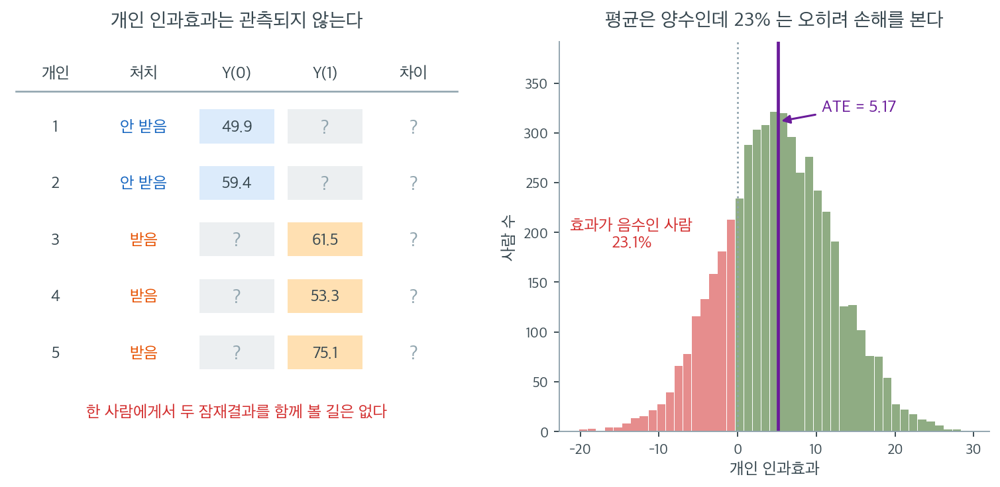

# 인과 추론의 기준

상관이 참된 인과관계를 반영하는지 확립하는 일은 과학과 통계학의 핵심 과제 중 하나이다. 상관만으로는 인과를 교란이나 우연과 구별할 수 없으므로, 연구자들은 함께 놓고 보면 인과 해석에 대한 증거가 되는 **기준**의 틀을 발전시켜 왔다. 영향력 있는 두 틀은 역학에서 나온 **Bradford Hill의 기준**과 통계학에서 나온 **반사실(잠재결과) 틀**이다.

---

## 1. Bradford Hill의 기준

1965년 역학자 Austin Bradford Hill 경은 관측된 연관이 인과인지 평가하는 아홉 가지 기준을 제안했다. 이 기준들은 형식적인 통계 검정이 아니라 판단을 위한 지침이다. 어느 하나도 필요조건이거나 충분조건은 아니지만, 충족되는 기준이 많을수록 인과에 대한 논거가 강해진다.

### 1. 연관의 강도

연관이 강할수록 인과일 가능성이 높다. 상대위험 10은 상대위험 1.2보다 교란으로 설명하기 어렵다. 다만 약한 연관도 인과일 수 있고(예: 간접흡연과 폐암) 강한 연관도 교란되어 있을 수 있다.

### 2. 일관성

여러 모집단, 상황, 연구 설계에서 반복적으로 같은 연관이 관측된다. 재현은 그 결과가 특정 연구의 편향이나 교란 구조 때문일 가능성을 줄인다.

### 3. 특이성

노출이 특정한 결과로 이어진다(그리고 그 결과가 주로 그 노출로 생긴다). 많은 인과관계가 특이적이지 않으므로 아홉 기준 중 가장 약하다. 흡연은 폐암만이 아니라 여러 질병을 일으킨다.

### 4. 시간성

원인이 결과보다 시간적으로 앞서야 한다. 인과에 **필요한** 유일한 기준이다. $X$가 $Y$보다 먼저 일어나지 않으면 $X$가 $Y$를 일으킬 수 없다.

!!! note "시간성은 필요조건이지 충분조건이 아니다"
    $X$가 $Y$보다 앞선다는 사실은 역인과를 배제하지만, $X$와 $Y$ 모두보다 앞서는 잠복변수에 의한 교란은 배제하지 못한다.

### 5. 생물학적 기울기 (용량–반응)

노출이 클수록 반응도 크다. 교란이 매끄러운 기울기를 만들어내기는 (불가능하지는 않아도) 어려우므로 용량–반응 관계는 인과 논거를 강화한다.

### 6. 개연성

$X$가 $Y$를 일으킬 수 있는 생물학적·기제적으로 그럴듯한 설명이 있다. 현재의 과학 지식에 의존하므로 가장 주관적인 기준이다.

### 7. 정합성

인과 해석이 질병의 알려진 자연 경과 및 생물학과 충돌하지 않는다. 개연성과 관련되지만 더 넓은 지식 체계와의 일관성에 초점을 둔다.

### 8. 실험

(무작위 대조 시험이나 자연실험 등) 실험적 증거가 인과 주장을 뒷받침한다. $X$를 실험적으로 조작했을 때 $Y$가 변하면 인과의 강한 증거가 된다.

### 9. 유추

비슷한 원인은 비슷한 결과를 낳는다. 어떤 화학물질이 암을 일으킨다면 구조가 비슷한 물질도 암을 일으킬 수 있다. 가장 약한 기준이며 주로 개연성을 뒷받침하는 데 쓰인다.

---

## 2. 반사실 틀

Jerzy Neyman과 Donald Rubin이 발전시킨 **반사실**(또는 **잠재결과**) 틀은 인과효과에 대한 형식적인 수학적 정의를 제공한다. 통계학과 계량경제학의 현대 인과추론의 토대이다.

### 잠재결과

각 개인 $i$에 대해 두 잠재결과를 정의한다:

- $Y_i(1)$: $i$가 처치를 받으면($X = 1$) 나타날 결과.
- $Y_i(0)$: $i$가 처치를 받지 않으면($X = 0$) 나타날 결과.

**개인 인과효과**는

$$
\tau_i = Y_i(1) - Y_i(0)
$$

이다. **인과추론의 근본 문제**는 같은 개인에 대해 $Y_i(1)$과 $Y_i(0)$을 동시에 관측할 수 없다는 점이다. 처치를 받으면 $Y_i(1)$을, 받지 않으면 $Y_i(0)$을 관측할 뿐 둘 다는 결코 볼 수 없다.

### 평균처치효과

개인 인과효과는 관측할 수 없으므로 인과추론은 모집단에 걸친 평균 효과에 초점을 둔다:

$$
\text{ATE} = \mathbb{E}[Y(1) - Y(0)] = \mathbb{E}[Y(1)] - \mathbb{E}[Y(0)]
$$

무작위 배정 아래에서는 처치군과 대조군의 잠재결과 분포가 같으므로

$$
\text{ATE} = \mathbb{E}[Y \mid X = 1] - \mathbb{E}[Y \mid X = 0]
$$

이다. 무작위화가 없으면 **선택 편향** 때문에 이 등식이 깨진다. 처치를 선택하거나 배정받은 개인이 그렇지 않은 개인과 체계적으로 다를 수 있기 때문이다.

왼쪽 표를 한 줄씩 읽어 보라. 1번은 처치를 받지 않았으므로 $Y_1(0) = 49.9$만 남고 $Y_1(1)$ 자리는 비어 있다. 3번은 처치를 받았으므로 $Y_3(1) = 61.5$만 있고 $Y_3(0)$을 알 길이 없다. 그래서 **"차이" 열은 다섯 줄 전부가 물음표다.** 자료를 아무리 많이 모아도 이 열은 채워지지 않는다. 표본이 100만 명이어도 각 줄에서 빈칸은 여전히 빈칸이다. 인과추론의 근본 문제란 표본크기의 문제가 아니라 **결측의 문제**라는 뜻이며, 그래서 인과추론을 "결측자료 문제"라고 부르기도 한다.

그러면 우리가 실제로 추정하는 것은 무엇인가. 오른쪽이 그 답이다. 이 모의 모집단에서 개인 인과효과 $\tau_i$는 평균 $5$, 표준편차 $7$인 분포를 따르도록 만들었고, 표본 5,000명에서 실제 평균은 $\text{ATE} = 5.17$로 나왔다. ATE는 이 히스토그램의 무게중심 하나일 뿐, 분포의 모양에 대해서는 아무 말도 하지 않는다. 그런데도 분포 전체는 관측되지 않으므로 우리가 손에 넣을 수 있는 것은 이 한 숫자뿐이다.

그 한 숫자만 보면 놓치는 것이 붉은 영역이다. **효과가 음수인 사람, 곧 처치 때문에 오히려 나빠지는 사람이 23.1%**다. "이 약은 평균 5만큼 좋아지게 한다"는 문장과 "이 약은 누구에게나 좋다"는 문장은 전혀 다르며, 관찰할 수 있는 것은 앞 문장뿐이다. 개인에게 무엇이 최선인지 묻는 질문에 ATE 하나로 답할 수 없다는 것, 이것이 잠재결과 틀이 처음부터 분명히 해 두는 한계다.

### 무시가능성 (비교란성)

관찰자료로부터 인과추론을 가능하게 하는 핵심 가정이 **무시가능성**(비교란성이라고도 한다)이다:

$$
Y(0), Y(1) \perp\!\!\!\perp X \mid Z
$$

관측된 공변량 $Z$를 조건으로 하면 처치 배정이 잠재결과와 독립이라는 뜻이다. 이 가정 아래에서 $Z$를 조정하면(회귀, 짝짓기, 성향점수로) 인과효과가 식별된다.

---

## 3. 두 틀의 비교

| 항목 | Bradford Hill | 반사실 |
|:---|:---|:---|
| 기원 | 역학(1965) | 통계학(Neyman 1923, Rubin 1974) |
| 성격 | 판단을 위한 지침 | 형식적 수학 틀 |
| 실험이 필요한가? | 아니오(다만 실험이 기준 중 하나) | 아니오(다만 관찰만으로 충분한 조건을 규정) |
| 강점 | 폭넓게 적용 가능하고 직관적 | 정확한 정의와 검토 가능한 가정 |
| 한계 | 주관적이고 형식적 판정 규칙이 없음 | 강한 가정(무시가능성)을 요구 |

두 틀은 상호보완적이다. Bradford Hill의 기준은 증거를 평가하는 정성적 점검표를 주고, 반사실 틀은 인과효과를 정의하고 추정하는 엄밀한 토대를 준다.

---

## 4. 실무 지침

관측된 상관이 인과인지 평가할 때:

1. **시간성에서 시작한다.** 원인이 결과보다 앞서지 않으면 인과는 배제된다.
2. **용량–반응 관계를 찾는다.** 기울기가 있으면 인과 논거가 강해진다.
3. **교란요인을 고려한다.** [교란변수](../confounding/confounding_variables.md)나 [잠복변수](../confounding/lurking_variables.md)가 그 연관을 설명할 수 있는가?
4. **실험적 증거를 찾는다.** 무작위 실험이 인과에 대한 가장 강한 증거를 준다. [실험과 인과](experiments_causation.md)를 보라.
5. **재현을 확인한다.** 여러 연구와 모집단에서 결과가 유지되는가?
6. **개연성을 평가한다.** 믿을 만한 기제가 있는가?
7. **반사실 검사를 적용한다.** 노출이 없었다면 무슨 일이 일어났을지 말할 수 있는가?

---

## 연습문제

**연습문제 1.** 
아홉 기준 가운데 필요한 것

**(a)** Bradford Hill 의 아홉 기준 중 인과에 **필요한** 것은 무엇이며 왜인가?

**(b)** 나머지 여덟 가운데 "충족되지 않아도 인과일 수 있는" 예를 둘 들어라.

**(c)** "기준을 많이 충족하면 인과" 라는 식으로 점수를 매겨 판정하는 것이 왜 위험한가?

??? success "풀이"

    **(a)** **시간성**뿐이다. 원인이 결과보다 앞서지 않으면 인과일 수 없다는 것은 정의상
    참이므로, 이것 하나만 논리적 필요조건이다.

    **(b)** 둘을 든다.

    - **특이성**: 흡연은 폐암만이 아니라 심혈관 질환·만성 폐쇄성 폐질환 등 여러 결과를
      일으킨다. 특이적이지 않지만 인과다.
    - **연관의 강도**: 간접흡연과 폐암의 상대위험은 $1.2$ 안팎으로 약하지만 인과로 받아들여
      진다. 강도는 교란을 배제하기 쉽게 해 줄 뿐 필요조건이 아니다.

    **(c)** 기준들이 **서로 독립이 아니기** 때문이다. 개연성·정합성·유추는 사실상 같은
    배경지식을 세 번 세는 것에 가깝고, 그런 항목을 각각 한 점씩 주면 한 가지 근거가 세 배로
    부풀려진다. 게다가 기준마다 교란을 배제하는 힘이 전혀 다르다. 실험 하나가 유추 다섯보다
    강하다. Hill 자신도 "이것은 점수표가 아니라 생각을 돕는 목록" 이라고 못 박았다.
    $\square$

---

**연습문제 2.** 
잠재결과 표의 빈칸

본문 그림의 왼쪽 표를 그대로 쓴다. 다섯 명 중 1번은 대조군이고 3번은 처치군이다.

**(a)** 1번과 3번에 대해 관측되는 값과 결측인 값을 각각 적어라.

**(b)** 표본을 $100$만 명으로 늘리면 "차이" 열을 채울 수 있는가?

**(c)** 인과추론을 "결측자료 문제" 라고 부르는 까닭을 한 문장으로 적어라.

??? success "풀이"

    **(a)** 1번은 $X_1 = 0$ 이므로 $Y_1(0) = 49.9$ 가 관측되고 $Y_1(1)$ 은 **결측**이다.
    3번은 $X_3 = 1$ 이므로 $Y_3(1) = 61.5$ 가 관측되고 $Y_3(0)$ 이 결측이다. 어느 줄에서도
    $\tau_i = Y_i(1) - Y_i(0)$ 을 계산할 수 없다.

    **(b)** 채울 수 없다. 표본을 늘리면 **줄이 늘어날 뿐** 각 줄의 빈칸은 그대로다. 결측의
    비율도 줄지 않는다. 언제나 각 사람에 대해 둘 중 하나만 관측된다.

    **(c)** 자료가 부족해서가 아니라 **원리상 관측될 수 없는 값이 표의 절반을 차지하기**
    때문이며, 인과추론의 모든 가정(무작위화, 무시가능성)은 결국 그 빈칸을 어떻게 채울지에
    대한 가정이다. $\square$

---

**연습문제 3.** 
다음 각 주장에 대해 인과의 다섯 기준(시간적 선행, 공변, 교란요인의 배제, 개연성, 실험적 증거) 중 무엇이 충족되는지 평가하라:

1. "흡연이 폐암을 일으킨다"
2. "안전벨트 착용이 교통사고 사망을 막는다"
3. "유기농 식품을 먹으면 건강이 좋아진다"
4. "소셜 미디어 사용이 청소년의 우울을 일으킨다"

??? success "풀이"

    1. **흡연이 폐암을 일으킨다**: 다섯 기준이 모두 강하게 충족된다. 시간적 선행(흡연이 암보다 수년 앞선다), 공변(용량–반응 관계), 교란요인의 배제(다른 위험요인을 통제한 방대한 연구), 개연성(연기 속 발암물질이 DNA를 손상시킨다), 실험적 증거(동물 실험. 사람에 대한 증거는 윤리적 제약 때문에 준실험이지만 전향적 코호트 연구가 강하게 뒷받침한다).

    2. **안전벨트 착용이 사망을 막는다**: 시간적 선행(착용이 사고보다 앞선다), 공변(안전벨트 사용과 생존 사이의 강한 통계적 연관), 개연성(힘 분산의 물리학), 실험적 증거(충돌시험 자료)가 충족된다. 교란요인의 배제는 부분적으로만 충족된다. 조심스러운 운전자가 안전벨트를 더 잘 맬 수 있지만 역학적 논거가 매우 강하다.

    3. **유기농 식품을 먹으면 건강이 좋아진다**: 공변이 있을 수 있지만 약하다. 시간적 선행은 자명하게 충족된다. 교란요인의 배제가 가장 약한 기준이다. 유기농 식품을 사는 사람은 대체로 부유하고 건강을 더 의식하며 운동도 더 한다. 개연성은 논쟁의 여지가 있다(농약 노출은 적지만 임상적 의미는 불분명하다). 실험적 증거는 매우 제한적이다. 인과 주장이 잘 뒷받침되지 않는다.

    4. **소셜 미디어 사용이 청소년의 우울을 일으킨다**: 많은 연구에서 공변이 존재한다. 시간적 선행은 확립하기 어렵다(소셜 미디어 사용이 우울보다 앞서는가, 아니면 우울한 청소년이 소셜 미디어를 더 쓰는가?). 교란요인의 배제도 어렵다(외로움, 가족 관계, 기존 정신건강 상태가 교란한다). 개연성은 있다(사회적 비교, 사이버 괴롭힘). 실험적 증거는 제한적이고 윤리적 제약이 있다. 인과 주장은 여전히 논쟁 중이다.

---

**연습문제 4.** 
수면 시간과 학업 성취 사이의 인과관계를 검정하는 연구를 설계하라. 다음을 명시하라:

1. 연구의 유형(관찰연구, 무작위 대조 시험, 종단 연구)
2. 교란요인을 어떻게 통제할지
3. 어떤 변수를 측정할지
4. 있을 수 있는 윤리적 제약
5. 결과를 어떻게 해석할지

??? success "풀이"

    1. **연구 유형**: 반복측정을 포함한 종단 관찰연구가 가장 현실적이다. (수면 시간을 무작위로 배정하는) 진짜 무작위 대조 시험이 이상적이지만 수면 박탈에 대한 윤리적 문제가 생긴다.

    2. **교란요인 통제**: 사회경제적 지위, 이전 학업 성취, 정신건강, 카페인 섭취, 화면 사용 시간, 과외 활동, 수강 과목의 난이도를 측정하고 조정한다. 회귀나 성향점수 짝짓기로 이 교란요인들을 통제한다.

    3. **측정할 변수**: 수면 시간과 질(활동기록계나 수면 일지), 평점이나 표준화 시험 점수, 인구통계, 건강 행동, 정신건강 척도, 각 추적 시점에서 측정한 시변 교란요인.

    4. **윤리적 제약**: 학생에게 특정 수면 시간을 강제할 수 없다. 자연적인 변동이나 온건한 개입(수면 위생 교육)에 의존해야 한다. 사전 동의와 연구윤리위원회 승인이 필요하다.

    5. **해석**: 교란요인을 통제한 뒤에도 수면과 학업 성취의 연관이 유지되고 시간 순서가 올바르면(성취 결과보다 수면을 먼저 측정했다면) 인과 해석을 뒷받침하는 증거가 된다. 다만 측정되지 않은 교란요인 가능성 때문에 인과를 결정적으로 증명하지는 못한다. p-값과 함께 효과크기와 신뢰구간을 보고해야 한다.

---

**연습문제 5.** 
무작위화가 하는 일

**(a)** 무작위 배정 아래에서 $\mathbb{E}[Y \mid X=1] = \mathbb{E}[Y(1)]$ 이 성립하는 까닭을
적어라.

**(b)** 관찰자료에서 이 등식이 깨지는 것을 **선택 편향**의 식으로 쓰라. 곧
$\mathbb{E}[Y\mid X=1] - \mathbb{E}[Y\mid X=0]$ 를 ATE 와 편향 항의 합으로 분해하라.

**(c)** 무작위화가 **보장하지 않는** 것을 하나 들어라.

??? success "풀이"

    **(a)** 무작위 배정은 $X$ 를 잠재결과와 **독립**으로 만든다. $(Y(0), Y(1)) \perp X$
    이므로

    $$
    \mathbb{E}[Y \mid X=1] = \mathbb{E}[Y(1) \mid X=1] = \mathbb{E}[Y(1)]
    $$

    이다. 첫 등호는 "처치받은 사람에게서 관측되는 것은 $Y(1)$" 이라는 일관성 가정이고,
    둘째 등호가 무작위화가 주는 것이다.

    **(b)** 관측되는 차이를 분해하면

    $$
    \underbrace{\mathbb{E}[Y\mid X{=}1] - \mathbb{E}[Y\mid X{=}0]}_{\text{관측되는 차이}}
    = \underbrace{\mathbb{E}[Y(1) - Y(0) \mid X{=}1]}_{\text{처치군의 평균효과 (ATT)}}
    + \underbrace{\mathbb{E}[Y(0)\mid X{=}1] - \mathbb{E}[Y(0)\mid X{=}0]}_{\text{선택 편향}}
    $$

    이다. 둘째 항은 **"처치를 받은 사람들이 처치를 안 받았더라면" 과 "실제로 안 받은
    사람들" 의 기저 차이**다. 무작위화는 이 항을 $0$ 으로 만든다.

    **(c)** **한 번의 무작위 배정에서 두 군이 실제로 균형을 이룬다는 보장은 없다.**
    무작위화가 보장하는 것은 기댓값에서의 균형(과 표본이 커질 때의 수렴)이지, 이번 실험에서
    두 군의 나이 분포가 같다는 것이 아니다. 그래서 작은 시험에서는 층화나 블록 배정으로
    균형을 **설계에서** 강제한다. $\square$

---

**연습문제 6.** 
평균이 숨기는 것

본문 그림의 오른쪽에서 $\text{ATE} = 5.17$ 인데 $\tau_i < 0$ 인 사람이 $23.1\%$ 였다.

**(a)** $\tau_i \sim N(5, 7^2)$ 이라 할 때 $P(\tau_i < 0)$ 을 계산해 $23.1\%$ 와 맞춰라.

**(b)** ATE 가 같아도 이 비율이 달라질 수 있음을 보이는 예를 만들어라.

**(c)** 자료만으로 이 비율을 추정할 수 있는가? 왜인가?

??? success "풀이"

    **(a)** $P(\tau < 0) = \Phi(-5/7) = \Phi(-0.714) = 0.2376$ 으로 모의값 $0.231$ 과
    맞는다.

    **(b)** 표준편차만 바꾸면 된다. $\tau_i \sim N(5, 2^2)$ 이면
    $P(\tau<0) = \Phi(-2.5) = 0.0062$ 로 **$0.6\%$** 에 지나지 않고,
    $\tau_i \sim N(5, 15^2)$ 이면 $\Phi(-0.333) = 0.370$ 으로 **$37\%$** 다. 셋 다 ATE 는
    $5$ 로 같다. **평균 하나로는 "누구에게 좋은가" 를 전혀 말할 수 없다.**

    **(c)** **추정할 수 없다.** $\tau_i$ 의 분포는 $Y_i(1)$ 과 $Y_i(0)$ 의 **결합분포**에
    달려 있는데, 우리는 각 사람에서 하나만 관측하므로 두 주변분포만 식별된다. 같은 주변분포를
    갖는 결합분포가 무수히 많고, 그에 따라 $P(\tau<0)$ 은 $0$ 에서 $1$ 가까이까지 달라질 수
    있다(프레셰 경계). 이 비율을 말하려면 **추가 가정**(예: 효과의 단조성)이 필요하다.
    $\square$

---

**연습문제 7.** 
무시가능성은 검정할 수 없다

무시가능성 $Y(0), Y(1) \perp X \mid Z$ 를 생각한다.

**(a)** 이 가정을 자료로 **검정할 수 없는** 까닭을 적어라.

**(b)** 그럼에도 실무에서 하는 **간접적인 점검** 두 가지를 들어라.

**(c)** "변수를 많이 넣을수록 무시가능성에 가까워진다" 는 생각이 왜 틀릴 수 있는가?

??? success "풀이"

    **(a)** 가정이 **관측되지 않는 양**에 대한 진술이기 때문이다. $X=1$ 인 사람의 $Y(0)$ 은
    영원히 결측이므로, $Y(0)$ 의 분포가 두 군에서 같은지 자료로 확인할 길이 없다. 어떤
    통계량도 이 가정을 반증하지 못한다.

    **(b)** 둘을 든다.

    1. **음성 대조(negative control).** 처치가 영향을 줄 수 없는 결과를 하나 골라 처치 효과를
       추정한다. $0$ 이 아니면 교란이 남아 있다는 신호다.
    2. **민감도 분석.** 측정되지 않은 교란변수가 얼마나 강해야 결론이 뒤집히는지 계산한다
       (E-value 등). "결론을 뒤집으려면 흡연보다 강한 교란이 필요하다" 처럼 말할 수 있으면
       주장이 훨씬 단단해진다.

    **(c)** 두 가지 위험이 있다. 첫째, **중간변수(mediator)를 넣으면 안 된다.** 처치의 효과가
    지나가는 경로를 막아 버려 효과를 깎는다. 둘째, **충돌변수(collider)를 넣으면 없던 연관을
    만든다.** 처치와 결과가 모두 영향을 주는 변수를 조건으로 걸면 둘 사이에 가짜 의존이
    생긴다. 조정은 변수의 **개수**가 아니라 인과구조에서의 **역할**로 결정해야 하며, 그래서
    인과 그래프를 먼저 그리라는 권고가 따라온다. $\square$

---

**연습문제 8.** 
용량–반응을 교란이 흉내 낼 수 있는가

Hill 의 기준 5 는 용량–반응 관계가 인과 논거를 강화한다고 본다.

**(a)** 교란변수 $Z$ 가 노출 $X$ 와 결과 $Y$ 모두와 **단조** 관계를 가질 때 가짜 용량–반응이
생길 수 있음을 설명하라.

**(b)** 그런데도 용량–반응이 왜 여전히 쓸모 있는 증거인가?

**(c)** 용량–반응이 **비단조**일 때(예: U 자) 인과 해석은 어떻게 달라지는가?

??? success "풀이"

    **(a)** $Z$ 가 커질수록 $X$ 도 커지고 $Y$ 도 커진다면, $X$ 의 수준별로 $Y$ 의 평균을
    그렸을 때 매끄럽게 올라가는 곡선이 나온다. 인과가 전혀 없어도 그렇다. 사회경제적 지위가
    유기농 식품 소비와 건강 지표 모두와 단조 관계인 상황이 본문 연습문제 3 의 3 번에
    해당한다.

    **(b)** **아무 교란이나 그럴 수 있는 것은 아니기** 때문이다. 가짜 용량–반응을 만들려면
    교란변수가 노출의 **거의 모든 수준에 걸쳐** 일관되게 단조여야 하는데, 그런 교란은 드물고
    존재한다면 대개 이름을 댈 수 있다. 또 용량–반응의 **모양**(선형인가, 문턱이 있는가,
    포화하는가)이 가설된 기제와 맞는지까지 보면 증거의 무게가 더 커진다.

    **(c)** U 자 관계는 **두 기제가 반대 방향으로 작동한다**는 신호일 수 있다(음주와 사망률의
    고전적 예). 또는 **역인과나 선택**의 흔적일 수 있다. 예컨대 이미 아픈 사람이 술을 끊어
    "비음주군" 에 들어가면 그 군의 사망률이 높아진다. 비단조 관계를 보면 곧바로 인과를
    주장하기보다 **집단을 쪼개 보고** 각 구간에서 다른 기제가 작동하는지 따져야 한다.
    $\square$

---

**연습문제 9.** 
ATE·ATT·ATU 를 가르기

세 가지 평균효과를 정의한다.

$$
\text{ATE} = \mathbb{E}[\tau], \quad
\text{ATT} = \mathbb{E}[\tau \mid X{=}1], \quad
\text{ATU} = \mathbb{E}[\tau \mid X{=}0]
$$

**(a)** 셋 사이의 관계식을 처치 비율 $\pi = P(X{=}1)$ 로 쓰라.

**(b)** 무작위 배정이면 셋이 모두 같음을 보여라.

**(c)** 셋 가운데 **정책적으로 알고 싶은 것**이 상황에 따라 달라지는 예를 둘 들어라.

??? success "풀이"

    **(a)** 전체 평균을 두 군으로 쪼개면

    $$
    \text{ATE} = \pi\,\text{ATT} + (1-\pi)\,\text{ATU}
    $$

    다. ATE 는 ATT 와 ATU 의 **처치 비율 가중평균**이다.

    **(b)** 무작위 배정이면 $X$ 가 $\tau$ 와 독립이므로 조건을 걸어도 분포가 바뀌지 않는다.
    따라서 $\text{ATT} = \text{ATU} = \text{ATE}$ 다. **관찰자료에서 셋이 갈리는 것은 처치를
    받은 사람들이 효과가 큰(또는 작은) 쪽으로 스스로 골라 들어갔기 때문**이고, 이를 효과
    이질성에 따른 선택이라 한다.

    **(c)** 둘을 든다.

    - **이미 시행 중인 프로그램을 폐지할지 결정할 때**는 **ATT** 가 맞다. 지금 받고 있는
      사람들에게서 무엇을 빼앗는지가 질문이기 때문이다.
    - **프로그램을 미수혜자에게 확대할지 결정할 때**는 **ATU** 가 맞다. 아직 안 받은 사람들
      에게 효과가 있을지가 질문이다. 자발적으로 참여한 사람들에게 효과가 컸다고 해서 참여하지
      않은 사람들에게도 그러리라는 보장은 없다.

    ATE 는 "전 국민에게 무작위로 시행한다면" 이라는 가상의 질문에 답하므로, 실제 정책 질문과
    어긋나는 경우가 많다. **어떤 평균을 추정하고 있는지 밝히는 것이 추정값 자체보다 중요할
    때가 있다.** $\square$

---

**연습문제 10.** 
두 틀을 한 사례에 함께 적용하기

"대기오염($\text{PM}_{2.5}$)이 심혈관 사망을 늘린다" 는 주장을 평가한다. 자료는 도시 단위
관측자료이고, 오염도와 사망률이 모두 측정되어 있다.

**(a)** Hill 의 기준 가운데 이 자료로 **평가할 수 있는 것**과 **없는 것**을 가르라.

**(b)** 반사실 틀로 이 질문을 적고, 무시가능성이 성립하려면 어떤 변수들이 $Z$ 에 들어가야
하는지 셋 이상 들어라.

**(c)** 도시 단위 자료로 개인 수준의 인과를 말할 때 생기는 문제를 적고, 이름을 붙여라.

**(d)** 설계로 교란을 줄이는 방법 하나를 제안하라.

??? success "풀이"

    **(a)** 평가할 수 있는 것: **연관의 강도**(효과 추정값), **일관성**(다른 도시·다른 기간
    에서 재현), **생물학적 기울기**(오염 수준별 사망률), **시간성**(시차를 둔 분석이
    가능하다면).

    평가할 수 없는 것: **실험**(오염을 무작위 배정할 수 없다), **개연성·정합성**(자료가
    아니라 생물학 문헌이 답한다), **특이성**(오염은 여러 결과를 일으키므로 애초에 약한 기준).

    **(b)** 각 도시 $i$ 에 대해 "오염이 높았을 때의 사망률 $Y_i(1)$" 과 "낮았을 때의
    $Y_i(0)$" 을 두고 $\mathbb{E}[Y(1) - Y(0)]$ 을 묻는다. 무시가능성이 성립하려면 $Z$ 에
    적어도 **소득·연령 구조·흡연율·의료 접근성·기후(기온)·산업 구성**이 들어가야 한다.
    공업도시는 오염도 높고 소득도 낮고 흡연율도 높은 식으로 **여러 경로가 겹쳐** 있다.

    **(c)** 집단 수준의 연관을 개인 수준으로 옮겨 읽는 **생태학적 오류**다. 도시 평균
    오염도와 도시 평균 사망률의 관계가 개인의 노출–사망 관계와 다를 수 있고, 심프슨의 역설
    처럼 방향이 뒤집힐 수도 있다. 12장의 생태학적 상관 절이 이 문제를 다룬다.

    **(d)** **고정효과를 쓴 패널 설계**가 좋다. 같은 도시를 여러 기간 관찰해 도시별 고정효과를
    넣으면, 도시 간의 시간 불변 교란(산업 구성, 지리)이 통째로 제거되고 **한 도시 안에서
    오염이 오르내릴 때 사망률이 따라 움직이는지**만 보게 된다. 더 나아가 바람 방향이나
    화력발전소 가동 중단처럼 **외생적인 충격**을 도구변수로 쓰면 남은 교란도 줄일 수 있다.
    $\square$

---

## 정리하며

관찰자료에서 인과를 확립하려면 상관을 넘어서는 증거가 필요하다. Bradford Hill의 아홉 기준은 인과 주장을 평가하는 정성적 틀을 제공하며, 그중 엄밀하게 필요한 것은 시간성뿐이다. 반사실 틀은 잠재결과를 통해 인과효과의 형식적 정의를 주고, 비실험 자료에서 인과효과를 추정하는 데 필요한 가정(특히 무시가능성)을 밝힌다. 두 틀은 함께 연구자를 관측된 연관에서 정당한 인과적 결론으로 이끈다.
