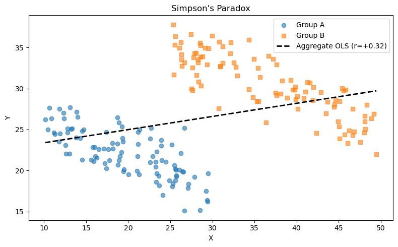
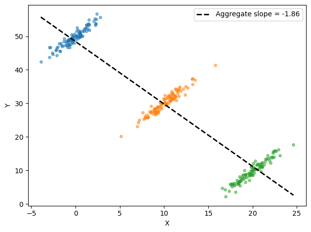

# 인과추론 모의실험

## 개요

이 페이지에서는 상관을 인과와 다르게 만드는 두 가지 고전적 함정, 즉 교란변수와 Simpson의 역설을 보인다. 모의실험을 통해 숨은 공통원인이 두 변수 사이에 오도하는 연관을 만드는 과정과, 하위집단을 합칠 때 상관의 방향이 뒤집히는 과정을 살펴본다.

---

## 교란변수

**교란변수** $Z$는 $X$와 $Y$ 모두에 영향을 주어, $X$가 $Y$에 직접 효과가 없어도 둘 사이에 허위 연관을 만든다. 이 상황의 방향성 비순환 그래프(DAG)는

$$
X \leftarrow Z \rightarrow Y
$$

이다.

### 모의실험

$Z$가 참 공통원인인 자료를 생성한다:

<div class="codebox" markdown>

**예제 1.** 교란변수가 만드는 가짜 상관

```python
import numpy as np
from scipy import stats

np.random.seed(21)
n = 300

# Z 가 X 와 Y 를 함께 움직인다. X 와 Y 사이에는 직접 연결이 전혀 없다.
# 그런데도 둘은 상관을 보인다 — 교란변수가 만드는 가짜 상관이다.
Z = np.random.randn(n)
X = 0.6 * Z + np.random.randn(n) * 0.5
Y = 0.8 * Z + np.random.randn(n) * 0.5
```

</div>

여기서 $Y$는 $X$가 아니라 $Z$에만 의존하지만, 둘 다 $Z$에 이끌리므로 $X$와 $Y$는 상관된 것처럼 보인다.

### 부분상관

교란 효과를 제거하기 위해 $Z$가 주어졌을 때 $X$와 $Y$의 **부분상관**을 계산한다:

$$
r_{XY \cdot Z} = \frac{r_{XY} - r_{XZ}\, r_{YZ}}{\sqrt{(1 - r_{XZ}^2)(1 - r_{YZ}^2)}}
$$

<div class="codebox" markdown>

**예제 2.** 부분상관으로 걷어 내기

```python
# 부분상관은 Z 로 설명되는 몫을 X 와 Y 에서 걷어 낸 뒤의 상관이다.
# 위 자료에서는 걷어 내고 나면 거의 0 만 남아야 한다.
r_xy, _ = stats.pearsonr(X, Y)
r_xz, _ = stats.pearsonr(X, Z)
r_yz, _ = stats.pearsonr(Y, Z)

r_partial = (r_xy - r_xz * r_yz) / np.sqrt((1 - r_xz**2) * (1 - r_yz**2))

print(f"Pearson r(X, Y)       = {r_xy:.3f}")
print(f"Partial r(X, Y | Z)   = {r_partial:.3f}")
```

출력:

```
Pearson r(X, Y)       = 0.651
Partial r(X, Y | Z)   = 0.052
```

</div>

$Z$를 통제하면 $r$이 0.651에서 0.052로 떨어진다. 관측된 상관이 거의 전부 교란에서 온 것이었다는 뜻이다.

$Z$를 통제하면 $X$와 $Y$의 연관이 거의 사라져, 관측된 상관이 전적으로 교란요인 때문이었음을 확인해 준다.

---

## Simpson의 역설

**Simpson의 역설**은 여러 하위집단에서 나타나는 경향이 하위집단을 합치면 뒤집히거나 사라질 때 일어난다. 수학적으로

$$
r_{\text{subgroup } A} < 0, \quad r_{\text{subgroup } B} < 0, \quad \text{but} \quad r_{\text{aggregate}} > 0
$$

이 가능하다.

### 모의실험

기준 수준이 다른 두 하위집단을 만든다:

<div class="codebox" markdown>

**예제 3.** 심슨의 역설 — 자료 만들기

```python
rng = np.random.default_rng(42)

# 두 집단 모두 안에서는 기울기가 -0.4 로 음이다. 그런데 B 집단이 x 도 크고
# y 의 기준선도 높아, 둘을 합쳐 놓으면 전체 기울기가 양으로 뒤집힌다.
n_a, n_b = 100, 100
x_a = rng.uniform(10, 30, n_a)
y_a = -0.4 * x_a + 30 + rng.normal(0, 2, n_a)

x_b = rng.uniform(25, 50, n_b)
y_b = -0.4 * x_b + 45 + rng.normal(0, 2, n_b)
```

</div>

각 하위집단 안에서는 $X$가 커질수록 $Y$가 작아진다(기울기 $= -0.4$). 그러나 집단 B는 절편도 크고 $X$ 값도 크므로 자료를 합치면 전체 추세가 양이 된다:

<div class="codebox" markdown>

**예제 4.** 합친 상관과 집단별 상관

```python
# 합친 상관과 집단별 상관의 부호가 갈리는 것을 확인한다. 이것이 심슨의 역설이다.
x_all = np.concatenate([x_a, x_b])
y_all = np.concatenate([y_a, y_b])

r_all, _ = stats.pearsonr(x_all, y_all)
r_a, _ = stats.pearsonr(x_a, y_a)
r_b, _ = stats.pearsonr(x_b, y_b)

print(f"Aggregate  r = {r_all:+.3f}")
print(f"Subgroup A r = {r_a:+.3f}")
print(f"Subgroup B r = {r_b:+.3f}")
```

출력:

```
Aggregate  r = +0.321
Subgroup A r = -0.737
Subgroup B r = -0.825
```

</div>

전체로 보면 $r = +0.32$인데 두 부분집단 안에서는 각각 $-0.74$와 $-0.83$이다. 부호가 뒤집히는 것이 Simpson 역설의 정의적 특징이다.

### 시각화

<div class="codebox" markdown>

**예제 5.** 역설을 그림으로

```python
import matplotlib.pyplot as plt

# 점을 집단별로 다른 표식으로 찍고, 그 위에 합친 자료의 회귀직선을 얹는다.
# 직선의 기울기가 각 무리의 기울기와 반대 방향인 것이 한눈에 보인다.
fig, ax = plt.subplots(figsize=(8, 5))
ax.scatter(x_a, y_a, label='Group A', alpha=0.6)
ax.scatter(x_b, y_b, label='Group B', alpha=0.6, marker='s')

slope, intercept = np.polyfit(x_all, y_all, 1)
xs = np.linspace(x_all.min(), x_all.max(), 100)
ax.plot(xs, slope * xs + intercept, 'k--', linewidth=2,
        label=f'Aggregate OLS (r={r_all:+.2f})')
ax.set_xlabel('X')
ax.set_ylabel('Y')
ax.set_title("Simpson's Paradox")
ax.legend()
plt.tight_layout()
plt.show()
```



</div>

부분집단마다 색을 달리해 그리면 전체 추세와 집단 내 추세가 어긋나는 것이 보인다.

---

## 해석

이 모의실험들은 통계 실무에 대한 두 가지 근본적인 교훈을 보여준다:

1. **교란.** 숨은 변수가 $X$와 $Y$를 모두 이끌면 주변상관 $r_{XY}$가 오도한다. 부분상관 $r_{XY \cdot Z}$는 이 교란을 제거하며, 우리 모의실험에서 0에 가깝게 떨어져 직접적인 $X \to Y$ 효과가 없음을 올바르게 반영한다.

2. **Simpson의 역설.** 이질적인 하위집단을 합치면 연관의 방향이 뒤집힐 수 있다. 양의 집계 상관은 집단마다 기준 수준이 다른 데서 생긴 인공물이지 집단 내 관계의 성질이 아니다. 그래서 관찰자료에서 인과적 결론을 내리기 전에 층화 분석과 교란요인에 대한 신중한 고려가 필수적이다.

---

## 연습문제

<div class="drillbox" markdown>

**연습문제 1.** <span class="diff med" title="중간"></span>
$Z \sim \mathcal{N}(0, 1)$, $X = 0.9Z + \varepsilon_X$, $Y = 0.3Z + \varepsilon_Y$이고 $\varepsilon_X, \varepsilon_Y \sim \mathcal{N}(0, 0.3^2)$인 교란 상황을 $n = 500$으로 모의실험하라. $r_{XY}$와 부분상관 $r_{XY \cdot Z}$를 모두 계산하라. 잡음 분산을 줄이면 둘의 차이가 어떻게 달라지는가?

</div>

??? success "풀이"

    ```python
    import numpy as np
    from scipy import stats

    np.random.seed(10)
    n = 500
    Z = np.random.randn(n)
    X = 0.9 * Z + np.random.normal(0, 0.3, n)
    Y = 0.3 * Z + np.random.normal(0, 0.3, n)

    r_xy, _ = stats.pearsonr(X, Y)
    r_xz, _ = stats.pearsonr(X, Z)
    r_yz, _ = stats.pearsonr(Y, Z)
    r_partial = (r_xy - r_xz * r_yz) / np.sqrt((1 - r_xz**2) * (1 - r_yz**2))

    print(f"r(X, Y)     = {r_xy:.4f}")
    print(f"r(X, Y | Z) = {r_partial:.4f}")
    ```

    출력:

    ```
    r(X, Y)     = 0.6715
    r(X, Y | Z) = -0.0115
    ```

    $r(X,Y) = 0.67$이 $Z$를 통제하자 $-0.01$로 사라진다. $X$와 $Y$가 공통 원인 $Z$를 공유할 때 나타나는 전형적인 모습이다.

    $X$와 $Y$가 공통원인 $Z$를 공유하므로 주변상관 $r_{XY}$는 중간 정도의 양수가 된다. 부분상관 $r_{XY \cdot Z}$는 0에 가깝다. 잡음 분산을 줄이면 $r_{XZ}$와 $r_{YZ}$가 이론값에 더 가까워져 교란 효과가 더 뚜렷해지고($r_{XY}$가 커지고) 부분상관은 여전히 0 근처에 남는다. $\square$

<div class="drillbox" markdown>

**연습문제 2.** <span class="diff med" title="중간"></span>
하위집단이 (둘이 아니라) 셋인 Simpson 역설 예제를 구성하라. 각 하위집단 안에서 $X$에 대한 $Y$의 기울기가 $+2$이지만 집계 기울기는 음수여야 한다. 결과를 그려라.

</div>

??? success "풀이"

    ```python
    import numpy as np
    import matplotlib.pyplot as plt

    np.random.seed(42)
    groups = [(100, 0, 50), (100, 10, 30), (100, 20, 10)]
    # (크기, x 중심, y 절편). 집단 안에서는 기울기가 양이다

    fig, ax = plt.subplots()
    all_x, all_y = [], []

    for n, xc, yb in groups:
        x = np.random.normal(xc, 1.5, n)
        y = yb + 2 * (x - xc) + np.random.normal(0, 1, n)
        ax.scatter(x, y, alpha=0.5, s=15)
        all_x.extend(x)
        all_y.extend(y)

    all_x, all_y = np.array(all_x), np.array(all_y)
    m, b = np.polyfit(all_x, all_y, 1)
    xs = np.linspace(all_x.min(), all_x.max(), 100)
    ax.plot(xs, m * xs + b, 'k--', lw=2, label=f'Aggregate slope = {m:.2f}')
    ax.legend()
    ax.set_xlabel('X')
    ax.set_ylabel('Y')
    plt.tight_layout()
    plt.show()
    ```

    

    집단별로 보면 기울기가 음인데 전체로 보면 양이다. 두 구름이 대각선으로 배치되어 있어 생기는 현상이다.

    각 집단의 집단 내 기울기는 $+2$로 양수이지만, 집단의 $X$ 평균이 커질수록 집단 절편이 작아진다. 자료를 합치면 집단 간 추세가 지배하여 집계 기울기가 음수가 된다. $\square$

<div class="drillbox" markdown>

**연습문제 3.** <span class="diff med" title="중간"></span>
$X$를 $Z$에, $Y$를 $Z$에 회귀한 잔차에서 출발하여 부분상관 $r_{XY \cdot Z}$의 공식을 유도하라.

</div>

??? success "풀이"

    $e_X = X - \hat{\beta}_{XZ} Z$를 $X$를 $Z$에 회귀한 잔차, $e_Y = Y - \hat{\beta}_{YZ} Z$를 그에 대응하는 잔차라 하자. 정의에 의해 부분상관은

    $$
    r_{XY \cdot Z} = r(e_X, e_Y)
    $$

    이다. OLS의 사영 성질에 의해 $e_X$는 $X$ 중 $Z$에 직교하는 성분이고 $e_Y$는 $Y$ 중 $Z$에 직교하는 성분이다. $\hat{\beta}_{XZ} = r_{XZ} \cdot s_X / s_Z$로 쓰고 잔차에 Pearson 공식을 전개해 정리하면

    $$
    r_{XY \cdot Z} = \frac{r_{XY} - r_{XZ}\, r_{YZ}}{\sqrt{(1 - r_{XZ}^2)(1 - r_{YZ}^2)}}
    $$

    를 얻는다. 이것이 표준 부분상관 공식이다. 분자는 각 변수와 $Z$의 선형 연관을 제거하고, 분모는 $[-1, 1]$ 범위를 유지하도록 다시 축척한다. $\square$

<div class="drillbox" markdown>

**연습문제 4.** <span class="diff med" title="중간"></span>
Simpson 역설 모의실험에서 두 하위집단의 절편을 같게 하고 기울기만 다르게(하나는 양, 하나는 음) 하면 집계 상관은 어떻게 되는가? 모의실험하고 설명하라.

</div>

??? success "풀이"

    ```python
    import numpy as np
    from scipy import stats

    np.random.seed(42)
    n = 200
    x_a = np.random.uniform(0, 20, n)
    y_a = 10 + 0.5 * x_a + np.random.normal(0, 2, n)

    x_b = np.random.uniform(0, 20, n)
    y_b = 10 - 0.5 * x_b + np.random.normal(0, 2, n)

    x_all = np.concatenate([x_a, x_b])
    y_all = np.concatenate([y_a, y_b])

    r_a, _ = stats.pearsonr(x_a, y_a)
    r_b, _ = stats.pearsonr(x_b, y_b)
    r_all, _ = stats.pearsonr(x_all, y_all)

    print(f"Group A r = {r_a:+.3f}")
    print(f"Group B r = {r_b:+.3f}")
    print(f"Aggregate r = {r_all:+.3f}")
    ```

    출력:

    ```
    Group A r = +0.832
    Group B r = -0.825
    Aggregate r = -0.023
    ```

    집단 A에서 $r = +0.83$, 집단 B에서 $-0.83$, 합치면 $-0.02$다. 두 집단의 상관이 부호까지 반대라 합칠 때 서로를 지워 버린다.

    앞의 예제(합치면 상관이 생기는 경우)와 방향이 반대라는 점이 중요하다. 집단을 합치는 것은 상관을 만들 수도, 없앨 수도, 뒤집을 수도 있다.

    두 하위집단의 절편과 $X$ 범위가 같고 기울기의 부호만 반대이면 집계 상관은 거의 0이 된다. 양의 관계와 음의 관계가 서로 상쇄되기 때문이다. 엄밀히 말하면 (부호가 뒤집히지 않으므로) Simpson의 역설은 아니지만, 이질적인 집단을 섞으면 실제 집단 내 효과가 완전히 가려질 수 있음을 보여준다. $\square$

<div class="drillbox" markdown>

**연습문제 5.** <span class="diff hard" title="어려움"></span>
$X \perp Y \mid Z$($Z$가 주어졌을 때의 조건부 독립)이고 세 변수가 결합적으로 정규분포를 따르면 부분상관 $r_{XY \cdot Z} = 0$임을 증명하라.

</div>

??? success "풀이"

    결합정규 확률변수에서 $(X, Y) \mid Z$의 조건부 분포도 이변량 정규이다. 조건부 공분산은

    $$
    \text{Cov}(X, Y \mid Z) = \sigma_{XY} - \frac{\sigma_{XZ}\, \sigma_{YZ}}{\sigma_{ZZ}}
    $$

    이다. $X \perp Y \mid Z$이면 $\text{Cov}(X, Y \mid Z) = 0$이므로

    $$
    \sigma_{XY} = \frac{\sigma_{XZ}\, \sigma_{YZ}}{\sigma_{ZZ}}
    $$

    이다. $\sigma_X \sigma_Y$로 나누어 상관으로 바꾸면

    $$
    \rho_{XY} = \rho_{XZ}\, \rho_{YZ}
    $$

    이다. 이를 부분상관 공식에 대입하면

    $$
    \rho_{XY \cdot Z} = \frac{\rho_{XY} - \rho_{XZ}\, \rho_{YZ}}{\sqrt{(1 - \rho_{XZ}^2)(1 - \rho_{YZ}^2)}} = \frac{\rho_{XZ}\rho_{YZ} - \rho_{XZ}\rho_{YZ}}{\sqrt{(1 - \rho_{XZ}^2)(1 - \rho_{YZ}^2)}} = 0
    $$

    이 된다. 결합정규 변수에서는 역도 성립한다. $\rho_{XY \cdot Z} = 0$이면 $X \perp Y \mid Z$이다. 이는 다변량 정규분포의 특별한 성질이다. $\square$

---

## 정리하며

두 함정을 **모의실험으로** 재현했다.

- **교란: $X\leftarrow Z\to Y$.** $X$ 가 $Y$ 에 직접 효과가 없어도 $Z$ 를 통해 연관이 생긴다. DAG 로 적어 보면 경로가 눈에 보인다.
- **심슨의 역설: 하위집단을 합치면 방향이 뒤집힌다.** 집단별로는 음의 관계인데 전체로는 양의 관계가 되는 자료를 쉽게 만들 수 있다.
- **두 현상의 뿌리가 같다.** 숨은 변수가 집단 배정과 결과 둘 다에 영향을 준다는 구조이며, 심슨의 역설은 그 극단적인 경우다.
- **그림이 설명한다.** 산점도에 집단을 색으로 구별해 그리면 왜 뒤집히는지가 한눈에 보인다. **합친 산점도만 보면 알 수 없다.**
- **처방은 인과 구조를 먼저 그리는 것이다.** 무엇을 통제하고 무엇을 통제하지 않을지는 DAG 가 정하며, 자료가 정하지 않는다.

다음 절 **상관과 인과**에서 진단 도구들을 다룬다.
