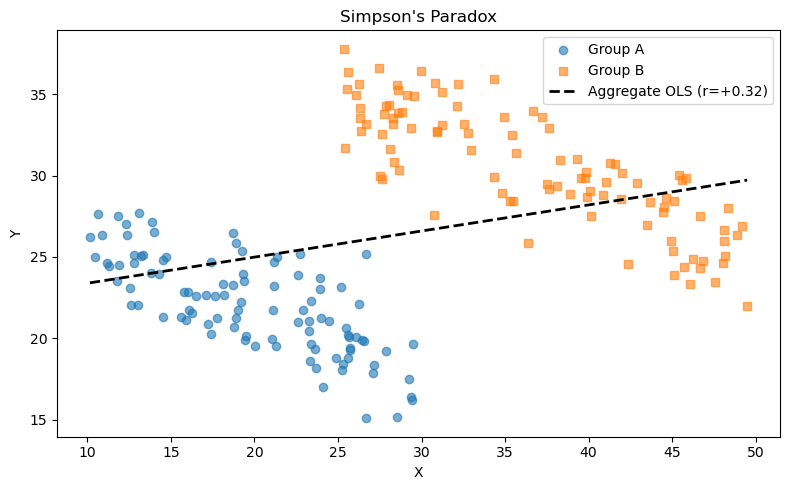
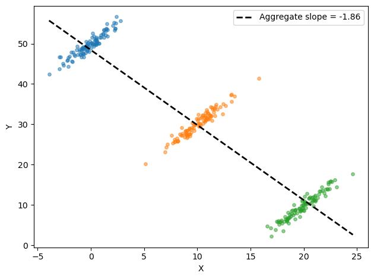

# 인과추론 모의실험

## 개요

이 페이지에서는 상관을 인과와 다르게 만드는 두 가지 고전적 함정, 즉 교란변수와 Simpson의 역설을 보인다. 모의실험을 통해 숨은 공통원인이 두 변수 사이에 오도하는 연관을 만드는 과정과, 하위집단을 합칠 때 상관의 방향이 뒤집히는 과정을 살펴본다.

---

## 교란변수

**교란변수** $Z$는 $X$와 $Y$ 모두에 영향을 주어, $X$가 $Y$에 직접 효과가 없어도 둘 사이에 허위 연관을 만든다. 이 상황의 방향성 비순환 그래프(DAG)는

$$
X \leftarrow Z \rightarrow Y
$$

이다.

### 모의실험

$Z$가 참 공통원인인 자료를 생성한다:

<div class="exbox" markdown>

**보기 1.** <span class="diff easy" title="쉬움"></span> 교란이 만들어 내는 상관의 크기를 미리 알 수 있는가. $Z \sim \mathcal N(0,1)$, $X = 0.6Z + 0.5\varepsilon_X$, $Y = 0.8Z + 0.5\varepsilon_Y$ 이고 두 잡음은 서로, 그리고 $Z$ 와 독립이다.

**(1)** 자료를 보기 전에 $\rho_{XY}$ 를 닫힌 꼴로 구하시오. 그 값이 $\rho_{XZ}\rho_{YZ}$ 와 같음을 보이시오.

**(2)** $(X, Y)$ 자료만 가지고 "$Z$ 가 둘을 함께 끈다"와 "$X$ 가 $Y$ 를 직접 일으킨다"를 구별할 수 있는가. 같은 $(X,Y)$ 분포를 내는 두 번째 모형을 **구체적으로** 적으시오.

</div>

??? success "풀이"

    **(1) 공분산이 $Z$ 를 거쳐서만 흐른다.** 잡음이 서로 독립이므로

    $$
    \operatorname{Cov}(X, Y) = \operatorname{Cov}(0.6Z,\; 0.8Z) = 0.6 \times 0.8 = 0.48
    $$

    이고

    $$
    \operatorname{Var}(X) = 0.6^2 + 0.5^2 = 0.61,
    \qquad
    \operatorname{Var}(Y) = 0.8^2 + 0.5^2 = 0.89
    $$

    이므로

    $$
    \rho_{XY} = \frac{0.48}{\sqrt{0.61 \times 0.89}} = 0.651450
    $$

    이다. 한편

    $$
    \rho_{XZ} = \frac{0.6}{\sqrt{0.61}} = 0.768221,
    \qquad
    \rho_{YZ} = \frac{0.8}{\sqrt{0.89}} = 0.847998
    $$

    이고 두 분모를 곱하면 $\sqrt{0.61 \times 0.89}$, 두 분자를 곱하면 $0.48$ 이므로

    $$
    \rho_{XZ}\,\rho_{YZ} = \frac{0.6 \times 0.8}{\sqrt{0.61 \times 0.89}} = \rho_{XY}
    $$

    이다. **곱이 정확히 같아지는 것이 "모든 연관이 $Z$ 를 거쳐서만 흐른다"의 상관 판**이고, 보기 2에서 편상관이 $0$ 이 되는 까닭이 바로 이것이다.

    **(2) 구별할 수 없다.** $(X, Y)$ 는 이변량 정규이고 그 분포는 두 분산과 공분산 세 수로 완전히 정해진다. 그러므로 $Z$ 를 아예 쓰지 않고도 같은 세 수를 내는 모형을 쓸 수 있다.

    $$
    X \sim \mathcal N(0,\; 0.61),
    \qquad
    Y = 0.786885\,X + \eta,
    \qquad
    \eta \sim \mathcal N(0,\; 0.512295)
    $$

    여기서 $0.786885 = \operatorname{Cov}/\operatorname{Var}(X) = 0.48/0.61$ 이고 $0.512295 = 0.89 - 0.786885 \times 0.48$ 이다. 이 모형에서도 $\operatorname{Var}(X) = 0.61$, $\operatorname{Var}(Y) = 0.89$, $\operatorname{Cov} = 0.48$ 이라 **$(X,Y)$ 의 결합분포가 완전히 같다.**

    곧 한쪽은 "$X$ 가 $Y$ 를 전혀 일으키지 않는" 모형이고 다른 쪽은 "$X$ 가 $Y$ 를 $0.787$ 의 세기로 직접 일으키는" 모형인데, **$X$ 와 $Y$ 만 재어서는 둘을 가를 방법이 원리적으로 없다.** 가르려면 $Z$ 를 재거나($\to$ 보기 2), 실험을 하거나, 자료 바깥의 지식을 끌어와야 한다.

    ```python
    import numpy as np
    from scipy import stats

    np.random.seed(21)
    n = 300

    # Z 가 X 와 Y 를 함께 움직인다. X 와 Y 사이에는 직접 연결이 전혀 없다.
    # 그런데도 둘은 상관을 보인다 — 교란변수가 만드는 가짜 상관이다.
    Z = np.random.randn(n)
    X = 0.6 * Z + np.random.randn(n) * 0.5
    Y = 0.8 * Z + np.random.randn(n) * 0.5

    # 모집단 값을 닫힌 꼴로 적는다.
    var_x, var_y, cov_xy = 0.6**2 + 0.5**2, 0.8**2 + 0.5**2, 0.6 * 0.8
    rho_xy = cov_xy / np.sqrt(var_x * var_y)
    rho_xz, rho_yz = 0.6 / np.sqrt(var_x), 0.8 / np.sqrt(var_y)
    print(f"Var(X) = {var_x:.4f},  Var(Y) = {var_y:.4f},  Cov(X,Y) = {cov_xy:.4f}")
    print(f"rho_XY = {rho_xy:.6f}")
    print(f"rho_XZ * rho_YZ = {rho_xz:.6f} * {rho_yz:.6f} = {rho_xz * rho_yz:.6f}")
    print(f"둘이 같은가: {abs(rho_xy - rho_xz * rho_yz) < 1e-15}")
    print(f"\n표본 r(X,Y) = {stats.pearsonr(X, Y)[0]:.4f}   "
          f"SE = {(1 - rho_xy**2) / np.sqrt(n):.4f}   "
          f"z = {(stats.pearsonr(X, Y)[0] - rho_xy) / ((1 - rho_xy**2) / np.sqrt(n)):+.3f}")

    # Z 가 없는 모형으로도 같은 (X, Y) 를 만들 수 있다.
    beta = cov_xy / var_x
    resid_var = var_y - beta * cov_xy
    print(f"\nZ 없이 X -> Y 직접효과만으로 같은 분포를 만드는 모형:")
    print(f"  X ~ N(0, {var_x:.4f}),  Y = {beta:.6f} X + N(0, {resid_var:.6f})")
    X2 = np.random.normal(0, np.sqrt(var_x), 200_000)
    Y2 = beta * X2 + np.random.normal(0, np.sqrt(resid_var), 200_000)
    print(f"  그 모형의 상관 = {np.corrcoef(X2, Y2)[0, 1]:.4f}   (교란 모형 {rho_xy:.4f})")
    ```

    출력:

    ```
    Var(X) = 0.6100,  Var(Y) = 0.8900,  Cov(X,Y) = 0.4800
    rho_XY = 0.651450
    rho_XZ * rho_YZ = 0.768221 * 0.847998 = 0.651450
    둘이 같은가: True

    표본 r(X,Y) = 0.6512   SE = 0.0332   z = -0.007

    Z 없이 X -> Y 직접효과만으로 같은 분포를 만드는 모형:
      X ~ N(0, 0.6100),  Y = 0.786885 X + N(0, 0.512295)
      그 모형의 상관 = 0.6516   (교란 모형 0.6515)
    ```

    닫힌 꼴 $0.651450$ 과 곱 $\rho_{XZ}\rho_{YZ}$ 가 기계 정밀도까지 같고, 표본 $0.6512$ 가 그 값에서 $0.007$ 표준오차 떨어져 있다. $Z$ 없는 모형이 내는 상관 $0.6516$ 도 같은 값이다.

    여기서 $Y$ 는 $X$ 가 아니라 $Z$ 에만 의존하지만, 둘 다 $Z$ 에 이끌리므로 $X$ 와 $Y$ 는 상관된 것처럼 보인다.

### 부분상관

교란 효과를 제거하기 위해 $Z$가 주어졌을 때 $X$와 $Y$의 **부분상관**을 계산한다:

$$
r_{XY \cdot Z} = \frac{r_{XY} - r_{XZ}\, r_{YZ}}{\sqrt{(1 - r_{XZ}^2)(1 - r_{YZ}^2)}}
$$

<div class="exbox" markdown>

**보기 2.** <span class="diff easy" title="쉬움"></span> 통제가 상관을 지울 때와 만들 때. 보기 1의 자료에서 $Z$ 를 통제하면 $r$ 이 $0.651$ 에서 $0.052$ 로 떨어진다.

**(1)** 모집단 편상관의 값은 얼마인가. 표본값 $0.052$ 가 그것과 맞는지 판정하시오.

**(2)** **통제가 늘 상관을 줄이는가.** $Z$ 가 교란변수가 아니라 **충돌부**, 곧 $Z = X + Y + \varepsilon$ 이라면 어떻게 되는가. 그때의 편상관을 닫힌 꼴로 구하시오.

</div>

??? success "풀이"

    **(1) 모집단 편상관은 정확히 $0$ 이다.** 보기 1에서 $\rho_{XY} = \rho_{XZ}\rho_{YZ}$ 임을 보았으므로 편상관 공식의 분자가

    $$
    \rho_{XY} - \rho_{XZ}\rho_{YZ} = 0
    $$

    이 되어 $\rho_{XY\cdot Z} = 0$ 이다. 이것은 "$Z$ 를 알고 나면 $X$ 가 $Y$ 에 대해 더 알려 줄 것이 없다", 곧 $X \perp Y \mid Z$ 를 그대로 옮긴 것이다.

    표본값은 $0.0518$ 이다. 편상관의 표준오차는 통제변수 하나를 썼으므로

    $$
    \operatorname{SE} \approx \frac{1}{\sqrt{n-3}} = \frac{1}{\sqrt{297}} = 0.0580
    $$

    이고 $z = 0.0518/0.0580 = +0.893$ 이다. **$0$ 과 어긋나지 않는다.** $0.052$ 를 "작지만 남아 있는 직접효과"로 읽으면 안 된다. 그 크기는 잡음과 구별되지 않는다.

    **(2) 충돌부에서는 반대로 없던 상관이 생긴다.** $X, Y, \varepsilon$ 이 모두 독립인 $\mathcal N(0,1)$ 이고 $Z = X + Y + \varepsilon$ 이라 하자. 그러면 $\operatorname{Var}(Z) = 3$ 이고

    $$
    \rho_{XZ} = \rho_{YZ} = \frac{1}{\sqrt3},
    \qquad
    \rho_{XY} = 0
    $$

    이다. 편상관 공식에 넣으면

    $$
    \rho_{XY\cdot Z} = \frac{0 - \tfrac13}{\sqrt{\left(1-\tfrac13\right)\left(1-\tfrac13\right)}}
    = \frac{-\tfrac13}{\tfrac23} = -\frac12
    $$

    **원래 $0$ 이던 상관이 $-0.5$ 가 된다.** 모의실험도 $-0.4996$ 을 준다. 까닭은 간단하다. $Z$ 를 한 값에 묶어 놓으면 그 층 안에서 $X$ 가 큰 관측값은 $Y$ 가 작을 수밖에 없기 때문이다.

    | 구조 | 통제 전 | 통제 후 |
    |---|---|---|
    | 교란 $X \leftarrow Z \rightarrow Y$ | $0.6515$ | $\mathbf{0}$ |
    | 충돌부 $X \rightarrow Z \leftarrow Y$ | $0$ | $\mathbf{-0.5}$ |

    **그러므로 "변수를 많이 넣을수록 안전하다"는 말은 틀렸다.** 어느 변수를 통제해야 하고 어느 변수를 그대로 두어야 하는지는 상관행렬이 아니라 **인과 구조**가 정하며, 그 판정 규칙은 [방향성 비순환 그래프](dags.md) 절에서 다룬다.

    ```python
    # 부분상관은 Z 로 설명되는 몫을 X 와 Y 에서 걷어 낸 뒤의 상관이다.
    # 위 자료에서는 걷어 내고 나면 거의 0 만 남아야 한다.
    r_xy, _ = stats.pearsonr(X, Y)
    r_xz, _ = stats.pearsonr(X, Z)
    r_yz, _ = stats.pearsonr(Y, Z)

    r_partial = (r_xy - r_xz * r_yz) / np.sqrt((1 - r_xz**2) * (1 - r_yz**2))

    print(f"Pearson r(X, Y)       = {r_xy:.3f}")
    print(f"Partial r(X, Y | Z)   = {r_partial:.3f}")

    # (1) 모집단 편상관은 정확히 0 이다.
    var_x, var_y = 0.6**2 + 0.5**2, 0.8**2 + 0.5**2
    rho_xy = (0.6 * 0.8) / np.sqrt(var_x * var_y)
    rho_xz, rho_yz = 0.6 / np.sqrt(var_x), 0.8 / np.sqrt(var_y)
    part_pop = (rho_xy - rho_xz * rho_yz) / np.sqrt((1 - rho_xz**2) * (1 - rho_yz**2))
    se = 1 / np.sqrt(len(X) - 3)
    print(f"\n모집단 편상관 = {part_pop:.2e}   (정확히 0)")
    print(f"표본 편상관   = {r_partial:.4f}   SE = 1/sqrt(n-3) = {se:.4f}   "
          f"z = {r_partial / se:+.3f}")

    # (2) 충돌부에서는 방향이 반대다. Z = X + Y + e 이면 X 와 Y 는 원래 독립인데
    #     Z 를 통제하는 순간 음의 상관이 생긴다.
    rho_xz_c = 1 / np.sqrt(3)          # Corr(X, X+Y+e)
    part_collider = (0 - rho_xz_c**2) / (1 - rho_xz_c**2)
    print(f"\n충돌부 Z = X + Y + e  (X, Y, e ~ N(0,1) 독립)")
    print(f"  rho_XZ = rho_YZ = 1/sqrt(3) = {rho_xz_c:.6f},  rho_XY = 0")
    print(f"  편상관 이론값 = (0 - 1/3)/(1 - 1/3) = {part_collider:.6f}")
    rng = np.random.default_rng(7)
    m = 400_000
    Xc = rng.standard_normal(m)
    Yc = rng.standard_normal(m)
    Zc = Xc + Yc + rng.standard_normal(m)
    a, b, c = (np.corrcoef(Xc, Yc)[0, 1], np.corrcoef(Xc, Zc)[0, 1],
               np.corrcoef(Yc, Zc)[0, 1])
    print(f"  모의: r_XY = {a:+.4f}  ->  편상관 = "
          f"{(a - b * c) / np.sqrt((1 - b**2) * (1 - c**2)):+.4f}")
    ```

    출력:

    ```
    Pearson r(X, Y)       = 0.651
    Partial r(X, Y | Z)   = 0.052

    모집단 편상관 = 0.00e+00   (정확히 0)
    표본 편상관   = 0.0518   SE = 1/sqrt(n-3) = 0.0580   z = +0.893

    충돌부 Z = X + Y + e  (X, Y, e ~ N(0,1) 독립)
      rho_XZ = rho_YZ = 1/sqrt(3) = 0.577350,  rho_XY = 0
      편상관 이론값 = (0 - 1/3)/(1 - 1/3) = -0.500000
      모의: r_XY = +0.0018  ->  편상관 = -0.4996
    ```

    충돌부의 닫힌 꼴 $-0.5$ 와 모의값 $-0.4996$ 이 맞는다.

    $Z$ 를 통제하면 $X$ 와 $Y$ 의 연관이 거의 사라져, 관측된 상관이 전적으로 교란요인 때문이었음을 확인해 준다. **다만 그렇게 되는 것은 $Z$ 가 교란변수일 때뿐**이라는 단서가 (2)의 몫이다.

---

## Simpson의 역설

**Simpson의 역설**은 여러 하위집단에서 나타나는 경향이 하위집단을 합치면 뒤집히거나 사라질 때 일어난다. 수학적으로

$$
r_{\text{subgroup } A} < 0, \quad r_{\text{subgroup } B} < 0, \quad \text{but} \quad r_{\text{aggregate}} > 0
$$

이 가능하다.

### 모의실험

기준 수준이 다른 두 하위집단을 만든다:

<div class="exbox" markdown>

**보기 3.** <span class="diff easy" title="쉬움"></span> 기울기가 같은데 상관이 다르다. 두 집단 모두 집단 안 기울기가 $-0.4$ 이고 잡음 표준편차가 $2$ 로 같다. 다만 $x$ 의 범위가 A 는 $[10, 30]$, B 는 $[25, 50]$ 이다.

**(1)** 두 집단의 **모집단 상관**을 닫힌 꼴로 각각 구하시오.

**(2)** 집단 안 기울기가 같은데 왜 상관이 다른가. 어느 쪽이 더 큰가.

</div>

??? success "풀이"

    **(1) 균등분포의 분산만 알면 된다.** $x \sim U(a, b)$ 이면 $\operatorname{Var}(x) = (b-a)^2/12$ 이고, $y = -0.4x + c + \varepsilon$ 에서 $\varepsilon \sim \mathcal N(0, 2^2)$ 이 독립이므로

    $$
    \operatorname{Cov}(x, y) = -0.4\operatorname{Var}(x),
    \qquad
    \operatorname{Var}(y) = 0.4^2\operatorname{Var}(x) + 4
    $$

    이다. 따라서

    $$
    \rho = \frac{-0.4\operatorname{Var}(x)}{\sqrt{\operatorname{Var}(x)}\sqrt{0.16\operatorname{Var}(x) + 4}}
    = \frac{-0.4\,\sigma_x}{\sqrt{0.16\,\sigma_x^2 + 4}}
    $$

    이다. 집단 A 는 $\operatorname{Var}(x) = 20^2/12 = 33.3333$, $\sigma_x = 5.7735$, $\sigma_y = \sqrt{9.3333} = 3.0551$ 이므로

    $$
    \rho_A = \frac{-0.4 \times 5.7735}{3.0551} = -0.755929
    $$

    집단 B 는 $\operatorname{Var}(x) = 25^2/12 = 52.0833$, $\sigma_x = 7.2169$, $\sigma_y = \sqrt{12.3333} = 3.5119$ 이므로

    $$
    \rho_B = \frac{-0.4 \times 7.2169}{3.5119} = -0.821995
    $$

    다. 표본값 $-0.7371$ 과 $-0.8246$ 이 이 둘레에 떨어진다.

    **(2) $x$ 를 넓게 재는 쪽이 상관이 크다.** 식의 마지막 꼴을 보면 $\rho$ 를 정하는 것은 **신호 $0.4\sigma_x$ 와 잡음 $2$ 의 비 하나뿐**이다.

    $$
    \lvert\rho\rvert = \frac{s}{\sqrt{s^2+1}},
    \qquad s = \frac{0.4\,\sigma_x}{2}
    $$

    A 는 $s = 1.1547$, B 는 $s = 1.4434$ 다. B 가 $x$ 를 $25$ 폭으로 재는 데 비해 A 는 $20$ 폭이라 $\sigma_x$ 가 $1.25$ 배 크고, 그만큼 신호가 커진다. **그래서 B 의 상관이 더 세다.**

    여기서 새길 것은 **기울기와 상관이 다른 양**이라는 점이다. 두 집단의 기울기는 $-0.4$ 로 똑같은데, 곧 $x$ 가 한 단위 늘 때 $y$ 가 꼭 같은 만큼 줄어드는데, 상관은 $-0.76$ 과 $-0.82$ 로 다르다. **상관은 관계의 세기가 아니라 "그 관계가 흩어짐 가운데 차지하는 몫"을 잰다.** 같은 모형이라도 $x$ 를 좁게 재면 상관이 작아진다(범위 제한).

    ```python
    rng = np.random.default_rng(42)

    # 두 집단 모두 안에서는 기울기가 -0.4 로 음이다. 그런데 B 집단이 x 도 크고
    # y 의 기준선도 높아, 둘을 합쳐 놓으면 전체 기울기가 양으로 뒤집힌다.
    n_a, n_b = 100, 100
    x_a = rng.uniform(10, 30, n_a)
    y_a = -0.4 * x_a + 30 + rng.normal(0, 2, n_a)

    x_b = rng.uniform(25, 50, n_b)
    y_b = -0.4 * x_b + 45 + rng.normal(0, 2, n_b)

    # 집단별 모집단 상관을 닫힌 꼴로 구한다.
    print(f"\n{'집단':>4s} {'x 범위':>12s} {'Var(x)':>9s} {'sd(x)':>8s} {'sd(y)':>8s} "
          f"{'모집단 rho':>11s} {'표본 r':>9s}")
    for lab, lo, hi, xs, ys in [("A", 10, 30, x_a, y_a), ("B", 25, 50, x_b, y_b)]:
        vx = (hi - lo) ** 2 / 12
        sy = np.sqrt(0.4**2 * vx + 2**2)
        rho = -0.4 * np.sqrt(vx) / sy
        print(f"{lab:>4s} {f'[{lo}, {hi}]':>12s} {vx:9.4f} {np.sqrt(vx):8.4f} {sy:8.4f} "
              f"{rho:+11.6f} {stats.pearsonr(xs, ys)[0]:+9.4f}")
    print(f"\n집단 안 기울기는 둘 다 -0.4 로 같은데 상관은 다르다.")
    print(f"  rho = -0.4 * sd(x) / sd(y) 이고 sd(x) 가 B 에서 더 크기 때문이다.")
    ```

    출력:

    ```
      집단         x 범위    Var(x)    sd(x)    sd(y)     모집단 rho      표본 r
       A     [10, 30]   33.3333   5.7735   3.0551   -0.755929   -0.7371
       B     [25, 50]   52.0833   7.2169   3.5119   -0.821995   -0.8246

    집단 안 기울기는 둘 다 -0.4 로 같은데 상관은 다르다.
      rho = -0.4 * sd(x) / sd(y) 이고 sd(x) 가 B 에서 더 크기 때문이다.
    ```

    닫힌 꼴 $-0.755929$, $-0.821995$ 가 표본값 $-0.7371$, $-0.8246$ 과 맞는다. $n = 100$ 에서 $\operatorname{SE} \approx (1-\rho^2)/\sqrt{n}$ 이 각각 $0.043$, $0.032$ 이므로 두 어긋남 $0.019$ 와 $0.003$ 은 모두 그 안이다.

    각 하위집단 안에서는 $X$ 가 커질수록 $Y$ 가 작아진다(기울기 $= -0.4$). 그러나 집단 B 는 절편도 크고 $X$ 값도 크므로 자료를 합치면 전체 추세가 양이 된다.

<div class="exbox" markdown>

**보기 4.** <span class="diff easy" title="쉬움"></span> 합친 상관 $+0.321$ 의 이론값. 두 집단을 각각 $100$ 개씩 합친다.

**(1)** 합친 자료의 $\operatorname{Var}(x)$, $\operatorname{Var}(y)$, $\operatorname{Cov}(x,y)$ 를 집단 안 몫과 집단 사이 몫으로 나누어 구하고, 합친 기울기와 합친 상관의 **이론값**을 적으시오.

**(2)** 그 식으로, 집단 사이 기울기가 얼마를 넘어야 부호가 뒤집히는지 **문턱**을 정확히 구하시오.

</div>

??? success "풀이"

    **(1) 세 양이 모두 두 몫의 합이다.** 집단별 $x$ 평균이 $20$, $37.5$ 이고 $y$ 평균이 $-0.4\times20+30 = 22$, $-0.4\times37.5+45 = 30$ 이다. 집단이 반반이므로

    $$
    \operatorname{Var}(x) = \underbrace{\frac{33.3333 + 52.0833}{2}}_{\text{집단 안} \;=\; 42.7083} + \underbrace{\operatorname{Var}(20,\, 37.5)}_{\text{집단 사이} \;=\; 76.5625} = 119.2708
    $$

    $$
    \operatorname{Var}(y) = \underbrace{\frac{9.3333 + 12.3333}{2}}_{10.8333} + \underbrace{\operatorname{Var}(22,\, 30)}_{16} = 26.8333
    $$

    공분산도 같다. 집단 안에서는 $\operatorname{Cov} = -0.4\operatorname{Var}(x\mid G)$ 이므로

    $$
    \operatorname{Cov}(x,y) = \underbrace{-0.4 \times 42.7083}_{-17.0833} + \underbrace{(-8.75)(-4)\cdot\tfrac12 + (8.75)(4)\cdot\tfrac12}_{+35} = +17.9167
    $$

    이다. **집단 안 몫은 음수인데 집단 사이 몫이 두 배 넘게 양수라 합이 양수가 된다.** 따라서

    $$
    \hat\beta = \frac{17.9167}{119.2708} = 0.150218,
    \qquad
    \rho = \frac{17.9167}{\sqrt{119.2708 \times 26.8333}} = 0.316703
    $$

    이고 표본 $r = +0.3208$ 과 맞는다.

    **(2) 문턱은 분산의 비가 정한다.** 집단 중심 두 점을 잇는 기울기는

    $$
    b = \frac{30 - 22}{37.5 - 20} = \frac{8}{17.5} = 0.457143
    $$

    이고, 합친 기울기는 이것과 집단 안 기울기 $-0.4$ 의 **분산가중 평균**이다.

    $$
    \hat\beta = \frac{V_{\text{사이}}\,b + V_{\text{안}}\,(-0.4)}{V_{\text{사이}} + V_{\text{안}}}
    = \frac{76.5625 \times 0.457143 - 42.7083 \times 0.4}{119.2708} = 0.150218
    $$

    로 (1)과 같은 값이 나온다. 부호가 뒤집히려면 분자가 양수여야 하므로

    $$
    b > 0.4 \times \frac{V_{\text{안}}}{V_{\text{사이}}} = 0.4 \times \frac{42.7083}{76.5625} = 0.223129
    $$

    이다. 여기서는 $b = 0.4571$ 로 문턱의 두 배가 조금 넘어 역설이 성립한다. **생각보다 아슬아슬하다.** 두 집단의 $y$ 기준선 차이를 $d$ 라 하면 $b = (d - 7)/17.5$ 이므로($-7$ 은 $-0.4 \times 17.5$ 다) 문턱은

    $$
    \frac{d-7}{17.5} > 0.223129
    \qquad\Longleftrightarrow\qquad
    d > 10.905
    $$

    다. 지금 $d = 15$ 인데 이것을 $10.9$ 아래로만 낮추면 역설이 사라진다.

    ```python
    # 합친 상관과 집단별 상관의 부호가 갈리는 것을 확인한다. 이것이 심슨의 역설이다.
    x_all = np.concatenate([x_a, x_b])
    y_all = np.concatenate([y_a, y_b])

    r_all, _ = stats.pearsonr(x_all, y_all)
    r_a, _ = stats.pearsonr(x_a, y_a)
    r_b, _ = stats.pearsonr(x_b, y_b)

    print(f"Aggregate  r = {r_all:+.3f}")
    print(f"Subgroup A r = {r_a:+.3f}")
    print(f"Subgroup B r = {r_b:+.3f}")

    # 합친 상관의 이론값: 집단 안 몫과 집단 사이 몫을 더한다.
    mx = np.array([20.0, 37.5])                     # 집단별 x 평균
    vx = np.array([(30 - 10) ** 2 / 12, (50 - 25) ** 2 / 12])
    my = -0.4 * mx + np.array([30.0, 45.0])         # 집단별 y 평균
    vy = 0.4**2 * vx + 2**2

    var_within, var_between = vx.mean(), mx.var()
    VX = var_within + var_between
    VY = vy.mean() + my.var()
    COV = -0.4 * var_within + np.mean((mx - mx.mean()) * (my - my.mean()))
    print(f"\nVar(x) = 집단 안 {var_within:.4f} + 집단 사이 {var_between:.4f} = {VX:.4f}")
    print(f"Var(y) = {VY:.4f}")
    print(f"Cov    = 집단 안 {-0.4 * var_within:+.4f} + 집단 사이 "
          f"{np.mean((mx - mx.mean()) * (my - my.mean())):+.4f} = {COV:+.4f}")
    print(f"합친 기울기 이론값 = {COV / VX:.6f}")
    print(f"합친 상관   이론값 = {COV / np.sqrt(VX * VY):.6f}   (표본 {r_all:+.4f})")

    b_between = (my[1] - my[0]) / (mx[1] - mx[0])
    print(f"\n집단 사이 기울기 = {b_between:.6f}")
    print(f"분산가중 평균    = {(var_between * b_between + var_within * (-0.4)) / VX:.6f}")
    print(f"부호가 뒤집히는 문턱: b > 0.4 * {var_within:.4f} / {var_between:.4f} = "
          f"{0.4 * var_within / var_between:.6f}")
    ```

    출력:

    ```
    Aggregate  r = +0.321
    Subgroup A r = -0.737
    Subgroup B r = -0.825

    Var(x) = 집단 안 42.7083 + 집단 사이 76.5625 = 119.2708
    Var(y) = 26.8333
    Cov    = 집단 안 -17.0833 + 집단 사이 +35.0000 = +17.9167
    합친 기울기 이론값 = 0.150218
    합친 상관   이론값 = 0.316703   (표본 +0.3208)

    집단 사이 기울기 = 0.457143
    분산가중 평균    = 0.150218
    부호가 뒤집히는 문턱: b > 0.4 * 42.7083 / 76.5625 = 0.223129
    ```

    두 경로로 구한 합친 기울기가 소수 여섯째 자리까지 $0.150218$ 로 같고, 이론 상관 $0.316703$ 이 표본 $+0.3208$ 과 맞는다.

    전체로 보면 $r = +0.32$ 인데 두 부분집단 안에서는 각각 $-0.74$ 와 $-0.83$ 이다. 부호가 뒤집히는 것이 Simpson 역설의 정의적 특징이다.

### 시각화

<div class="exbox" markdown>

**보기 5.** <span class="diff easy" title="쉬움"></span> 그림이 보여 주는 것과 가리는 것. 점을 집단별로 다른 표식으로 찍고 그 위에 합친 자료의 회귀직선을 얹는다.

**(1)** 그려 보고 무엇을 읽을 수 있는지 **수치와 함께** 말하시오. 두 집단이 겹치는 $x$ 구간이 특히 무엇을 보여 주는가.

**(2)** 이 그림이 **가리는 것**은 무엇인가.

</div>

??? success "풀이"

    **유도할 답이 없는 보기다.** 앞의 네 보기가 이미 모든 수를 구해 놓았으므로, 이 그림의 몫은 **그 수들이 눈에 어떻게 보이는가**를 짚는 것이다.

    **(1) 네 가지가 보인다.**

    - **두 덩어리가 위아래로 어긋나 있다.** 파란 동그라미(A)는 $x \in [10.1,\, 29.5]$ 에서 $y$ 가 $15$–$28$ 사이, 주황 네모(B)는 $x \in [25.3,\, 49.5]$ 에서 $y$ 가 $22$–$38$ 사이다. 집단 꼬리표가 자료를 두 층으로 가른다.
    - **각 덩어리 안에서는 내려간다.** 표본 기울기가 A $-0.3923$, B $-0.3977$ 로 참값 $-0.4$ 와 맞는다. 눈으로도 두 점구름이 각각 오른쪽 아래로 기운다.
    - **검은 파선은 올라간다.** 기울기 $+0.1606$, $r = +0.3208$ 이다. 파선은 두 점구름 **사이를** 지나가며 어느 덩어리의 기울기도 재고 있지 않다.
    - **겹치는 구간이 결정적이다.** $x \in [25.3,\, 29.5]$ 에 A 가 $20$ 개, B 가 $28$ 개 들어 있다. **$x$ 가 같은데 $y$ 평균이 $19.04$ 대 $33.68$ 로 $14.6$ 이나 벌어진다.** 곧 $y$ 를 정하는 것은 $x$ 가 아니라 집단 꼬리표다. 파선이 올라가는 까닭이 이 한 자리에 다 들어 있다.

    **(2) 가리는 것 셋.**

    - **집단 꼬리표를 지우면 아무것도 보이지 않는다.** 표식을 같게 그리면 $r = +0.3208$ 하나만 남고, $-0.7371$, $-0.8246$ 과 집단 사이 기울기 $+0.4571$ 을 갈라 볼 길이 없다. 이 그림이 역설을 보여 주는 것은 **$Z$ 를 이미 알고 있기 때문**이다.
    - **집단이 둘뿐이라는 것은 가정이다.** 숨은 층이 더 있으면 같은 일이 한 겹 더 일어날 수 있고, 그림은 그것을 알려 주지 않는다.
    - **표본크기.** 점 $200$ 개의 표식이 겹쳐 보이는 밀도는 $n$ 에 대해 아무 말도 하지 않는다. 같은 그림을 $n = 20$ 으로 그려도 비슷해 보이지만 그때의 $r$ 은 $\pm 0.4$ 쯤 흔들린다.

    ```python
    import matplotlib.pyplot as plt

    plt.rcParams["font.sans-serif"] = ["NanumGothic", "Apple SD Gothic Neo", "Malgun Gothic"]
    plt.rcParams["font.family"] = "sans-serif"
    plt.rcParams["axes.unicode_minus"] = False

    # 점을 집단별로 다른 표식으로 찍고, 그 위에 합친 자료의 회귀직선을 얹는다.
    # 직선의 기울기가 각 무리의 기울기와 반대 방향인 것이 한눈에 보인다.
    fig, ax = plt.subplots(figsize=(8, 5))
    ax.scatter(x_a, y_a, label='Group A', alpha=0.6)
    ax.scatter(x_b, y_b, label='Group B', alpha=0.6, marker='s')

    slope, intercept = np.polyfit(x_all, y_all, 1)
    xs = np.linspace(x_all.min(), x_all.max(), 100)
    ax.plot(xs, slope * xs + intercept, 'k--', linewidth=2,
            label=f'Aggregate OLS (r={r_all:+.2f})')
    ax.set_xlabel('X')
    ax.set_ylabel('Y')
    ax.set_title("Simpson's Paradox")
    ax.legend()
    plt.tight_layout()
    plt.show()

    # 그림에서 읽을 수치를 적어 둔다.
    print(f"\n합친 회귀직선: 기울기 {slope:+.4f}, 절편 {intercept:.4f}, r = {r_all:+.4f}")
    print(f"집단 안 기울기 (참값) = -0.4,  표본 A {np.polyfit(x_a, y_a, 1)[0]:+.4f}, "
          f"B {np.polyfit(x_b, y_b, 1)[0]:+.4f}")
    print(f"\nx 범위: A [{x_a.min():.1f}, {x_a.max():.1f}], "
          f"B [{x_b.min():.1f}, {x_b.max():.1f}]")
    ov_lo, ov_hi = max(x_a.min(), x_b.min()), min(x_a.max(), x_b.max())
    print(f"겹치는 구간 [{ov_lo:.1f}, {ov_hi:.1f}] 에 든 점 = "
          f"A {((x_a >= ov_lo) & (x_a <= ov_hi)).sum()} 개, "
          f"B {((x_b >= ov_lo) & (x_b <= ov_hi)).sum()} 개  (전체 200 개 중)")
    print(f"그 구간에서 y 평균: A {y_a[(x_a >= ov_lo) & (x_a <= ov_hi)].mean():.2f}, "
          f"B {y_b[(x_b >= ov_lo) & (x_b <= ov_hi)].mean():.2f}")
    print(f"\n집단 꼬리표를 지우면: 합친 r = {r_all:+.4f} 하나만 남는다")
    print(f"집단 꼬리표가 있으면: {r_a:+.4f}, {r_b:+.4f} 와 집단 사이 기울기 "
          f"{(30 - 22) / (37.5 - 20):+.4f} 를 갈라 볼 수 있다")
    ```

    출력:

    ```
    합친 회귀직선: 기울기 +0.1606, 절편 21.7781, r = +0.3208
    집단 안 기울기 (참값) = -0.4,  표본 A -0.3923, B -0.3977

    x 범위: A [10.1, 29.5], B [25.3, 49.5]
    겹치는 구간 [25.3, 29.5] 에 든 점 = A 20 개, B 28 개  (전체 200 개 중)
    그 구간에서 y 평균: A 19.04, B 33.68

    집단 꼬리표를 지우면: 합친 r = +0.3208 하나만 남는다
    집단 꼬리표가 있으면: -0.7371, -0.8246 와 집단 사이 기울기 +0.4571 를 갈라 볼 수 있다
    ```

    

    그림에서 읽은 것이 모두 수로 확인된다. 겹치는 구간에서 두 집단의 $x$ 평균은 $27.03$ 과 $27.45$ 로 사실상 같은데 $y$ 평균은 $19.04$ 와 $33.68$ 로 $14.6$ 이나 벌어진다. 모형이 예측하는 값 $15 - 0.4 \times (27.45 - 27.03) = 14.83$ 과 맞는다. **같은 $x$ 에서도 집단이 다르면 $y$ 가 크게 다르다**는 것이 이 자료의 전부다.

    표본 기울기 $+0.1606$ 이 보기 4의 이론값 $0.1502$ 와 조금 다른 것은 표집 변동이며, 표본 $r = +0.3208$ 도 이론값 $0.3167$ 과 맞는다.

---

## 해석

이 모의실험들은 통계 실무에 대한 두 가지 근본적인 교훈을 보여준다:

1. **교란.** 숨은 변수가 $X$와 $Y$를 모두 이끌면 주변상관 $r_{XY}$가 오도한다. 부분상관 $r_{XY \cdot Z}$는 이 교란을 제거하며, 우리 모의실험에서 0에 가깝게 떨어져 직접적인 $X \to Y$ 효과가 없음을 올바르게 반영한다.

2. **Simpson의 역설.** 이질적인 하위집단을 합치면 연관의 방향이 뒤집힐 수 있다. 양의 집계 상관은 집단마다 기준 수준이 다른 데서 생긴 인공물이지 집단 내 관계의 성질이 아니다. 그래서 관찰자료에서 인과적 결론을 내리기 전에 층화 분석과 교란요인에 대한 신중한 고려가 필수적이다.

---

## 연습문제

<div class="drillbox" markdown>

**연습문제 1.** <span class="diff med" title="중간"></span>
$Z \sim \mathcal{N}(0, 1)$, $X = 0.9Z + \varepsilon_X$, $Y = 0.3Z + \varepsilon_Y$이고 $\varepsilon_X, \varepsilon_Y \sim \mathcal{N}(0, 0.3^2)$인 교란 상황을 $n = 500$으로 모의실험하라. $r_{XY}$와 부분상관 $r_{XY \cdot Z}$를 모두 계산하라. 잡음 분산을 줄이면 둘의 차이가 어떻게 달라지는가?

</div>

??? success "풀이"

    ```python
    import numpy as np
    from scipy import stats

    np.random.seed(10)
    n = 500
    Z = np.random.randn(n)
    X = 0.9 * Z + np.random.normal(0, 0.3, n)
    Y = 0.3 * Z + np.random.normal(0, 0.3, n)

    r_xy, _ = stats.pearsonr(X, Y)
    r_xz, _ = stats.pearsonr(X, Z)
    r_yz, _ = stats.pearsonr(Y, Z)
    r_partial = (r_xy - r_xz * r_yz) / np.sqrt((1 - r_xz**2) * (1 - r_yz**2))

    print(f"r(X, Y)     = {r_xy:.4f}")
    print(f"r(X, Y | Z) = {r_partial:.4f}")
    ```

    출력:

    ```
    r(X, Y)     = 0.6715
    r(X, Y | Z) = -0.0115
    ```

    $r(X,Y) = 0.67$이 $Z$를 통제하자 $-0.01$로 사라진다. $X$와 $Y$가 공통 원인 $Z$를 공유할 때 나타나는 전형적인 모습이다.

    $X$와 $Y$가 공통원인 $Z$를 공유하므로 주변상관 $r_{XY}$는 중간 정도의 양수가 된다. 부분상관 $r_{XY \cdot Z}$는 0에 가깝다. 잡음 분산을 줄이면 $r_{XZ}$와 $r_{YZ}$가 이론값에 더 가까워져 교란 효과가 더 뚜렷해지고($r_{XY}$가 커지고) 부분상관은 여전히 0 근처에 남는다. $\square$

<div class="drillbox" markdown>

**연습문제 2.** <span class="diff med" title="중간"></span>
하위집단이 (둘이 아니라) 셋인 Simpson 역설 보기를 구성하라. 각 하위집단 안에서 $X$에 대한 $Y$의 기울기가 $+2$이지만 집계 기울기는 음수여야 한다. 결과를 그려라.

</div>

??? success "풀이"

    ```python
    import numpy as np
    import matplotlib.pyplot as plt

    np.random.seed(42)
    groups = [(100, 0, 50), (100, 10, 30), (100, 20, 10)]
    # (크기, x 중심, y 절편). 집단 안에서는 기울기가 양이다

    fig, ax = plt.subplots()
    all_x, all_y = [], []

    for n, xc, yb in groups:
        x = np.random.normal(xc, 1.5, n)
        y = yb + 2 * (x - xc) + np.random.normal(0, 1, n)
        ax.scatter(x, y, alpha=0.5, s=15)
        all_x.extend(x)
        all_y.extend(y)

    all_x, all_y = np.array(all_x), np.array(all_y)
    m, b = np.polyfit(all_x, all_y, 1)
    xs = np.linspace(all_x.min(), all_x.max(), 100)
    ax.plot(xs, m * xs + b, 'k--', lw=2, label=f'Aggregate slope = {m:.2f}')
    ax.legend()
    ax.set_xlabel('X')
    ax.set_ylabel('Y')
    plt.tight_layout()
    plt.show()
    ```

    

    집단별로 보면 기울기가 음인데 전체로 보면 양이다. 두 구름이 대각선으로 배치되어 있어 생기는 현상이다.

    각 집단의 집단 내 기울기는 $+2$로 양수이지만, 집단의 $X$ 평균이 커질수록 집단 절편이 작아진다. 자료를 합치면 집단 간 추세가 지배하여 집계 기울기가 음수가 된다. $\square$

<div class="drillbox" markdown>

**연습문제 3.** <span class="diff med" title="중간"></span>
$X$를 $Z$에, $Y$를 $Z$에 회귀한 잔차에서 출발하여 부분상관 $r_{XY \cdot Z}$의 공식을 유도하라.

</div>

??? success "풀이"

    $e_X = X - \hat{\beta}_{XZ} Z$를 $X$를 $Z$에 회귀한 잔차, $e_Y = Y - \hat{\beta}_{YZ} Z$를 그에 대응하는 잔차라 하자. 정의에 의해 부분상관은

    $$
    r_{XY \cdot Z} = r(e_X, e_Y)
    $$

    이다. OLS의 사영 성질에 의해 $e_X$는 $X$ 중 $Z$에 직교하는 성분이고 $e_Y$는 $Y$ 중 $Z$에 직교하는 성분이다. $\hat{\beta}_{XZ} = r_{XZ} \cdot s_X / s_Z$로 쓰고 잔차에 Pearson 공식을 전개해 정리하면

    $$
    r_{XY \cdot Z} = \frac{r_{XY} - r_{XZ}\, r_{YZ}}{\sqrt{(1 - r_{XZ}^2)(1 - r_{YZ}^2)}}
    $$

    를 얻는다. 이것이 표준 부분상관 공식이다. 분자는 각 변수와 $Z$의 선형 연관을 제거하고, 분모는 $[-1, 1]$ 범위를 유지하도록 다시 축척한다. $\square$

<div class="drillbox" markdown>

**연습문제 4.** <span class="diff med" title="중간"></span>
Simpson 역설 모의실험에서 두 하위집단의 절편을 같게 하고 기울기만 다르게(하나는 양, 하나는 음) 하면 집계 상관은 어떻게 되는가? 모의실험하고 설명하라.

</div>

??? success "풀이"

    ```python
    import numpy as np
    from scipy import stats

    np.random.seed(42)
    n = 200
    x_a = np.random.uniform(0, 20, n)
    y_a = 10 + 0.5 * x_a + np.random.normal(0, 2, n)

    x_b = np.random.uniform(0, 20, n)
    y_b = 10 - 0.5 * x_b + np.random.normal(0, 2, n)

    x_all = np.concatenate([x_a, x_b])
    y_all = np.concatenate([y_a, y_b])

    r_a, _ = stats.pearsonr(x_a, y_a)
    r_b, _ = stats.pearsonr(x_b, y_b)
    r_all, _ = stats.pearsonr(x_all, y_all)

    print(f"Group A r = {r_a:+.3f}")
    print(f"Group B r = {r_b:+.3f}")
    print(f"Aggregate r = {r_all:+.3f}")
    ```

    출력:

    ```
    Group A r = +0.832
    Group B r = -0.825
    Aggregate r = -0.023
    ```

    집단 A에서 $r = +0.83$, 집단 B에서 $-0.83$, 합치면 $-0.02$다. 두 집단의 상관이 부호까지 반대라 합칠 때 서로를 지워 버린다.

    앞의 보기(합치면 상관이 생기는 경우)와 방향이 반대라는 점이 중요하다. 집단을 합치는 것은 상관을 만들 수도, 없앨 수도, 뒤집을 수도 있다.

    두 하위집단의 절편과 $X$ 범위가 같고 기울기의 부호만 반대이면 집계 상관은 거의 0이 된다. 양의 관계와 음의 관계가 서로 상쇄되기 때문이다. 엄밀히 말하면 (부호가 뒤집히지 않으므로) Simpson의 역설은 아니지만, 이질적인 집단을 섞으면 실제 집단 내 효과가 완전히 가려질 수 있음을 보여준다. $\square$

<div class="drillbox" markdown>

**연습문제 5.** <span class="diff hard" title="어려움"></span>
$X \perp Y \mid Z$($Z$가 주어졌을 때의 조건부 독립)이고 세 변수가 결합적으로 정규분포를 따르면 부분상관 $r_{XY \cdot Z} = 0$임을 증명하라.

</div>

??? success "풀이"

    결합정규 확률변수에서 $(X, Y) \mid Z$의 조건부 분포도 이변량 정규이다. 조건부 공분산은

    $$
    \text{Cov}(X, Y \mid Z) = \sigma_{XY} - \frac{\sigma_{XZ}\, \sigma_{YZ}}{\sigma_{ZZ}}
    $$

    이다. $X \perp Y \mid Z$이면 $\text{Cov}(X, Y \mid Z) = 0$이므로

    $$
    \sigma_{XY} = \frac{\sigma_{XZ}\, \sigma_{YZ}}{\sigma_{ZZ}}
    $$

    이다. $\sigma_X \sigma_Y$로 나누어 상관으로 바꾸면

    $$
    \rho_{XY} = \rho_{XZ}\, \rho_{YZ}
    $$

    이다. 이를 부분상관 공식에 대입하면

    $$
    \rho_{XY \cdot Z} = \frac{\rho_{XY} - \rho_{XZ}\, \rho_{YZ}}{\sqrt{(1 - \rho_{XZ}^2)(1 - \rho_{YZ}^2)}} = \frac{\rho_{XZ}\rho_{YZ} - \rho_{XZ}\rho_{YZ}}{\sqrt{(1 - \rho_{XZ}^2)(1 - \rho_{YZ}^2)}} = 0
    $$

    이 된다. 결합정규 변수에서는 역도 성립한다. $\rho_{XY \cdot Z} = 0$이면 $X \perp Y \mid Z$이다. 이는 다변량 정규분포의 특별한 성질이다. $\square$

---

## 정리하며

두 함정을 **모의실험으로** 재현했다.

- **교란: $X\leftarrow Z\to Y$.** $X$ 가 $Y$ 에 직접 효과가 없어도 $Z$ 를 통해 연관이 생긴다. DAG 로 적어 보면 경로가 눈에 보인다.
- **심슨의 역설: 하위집단을 합치면 방향이 뒤집힌다.** 집단별로는 음의 관계인데 전체로는 양의 관계가 되는 자료를 쉽게 만들 수 있다.
- **두 현상의 뿌리가 같다.** 숨은 변수가 집단 배정과 결과 둘 다에 영향을 준다는 구조이며, 심슨의 역설은 그 극단적인 경우다.
- **그림이 설명한다.** 산점도에 집단을 색으로 구별해 그리면 왜 뒤집히는지가 한눈에 보인다. **합친 산점도만 보면 알 수 없다.**
- **처방은 인과 구조를 먼저 그리는 것이다.** 무엇을 통제하고 무엇을 통제하지 않을지는 DAG 가 정하며, 자료가 정하지 않는다.

다음 절 **상관과 인과**에서 진단 도구들을 다룬다.
