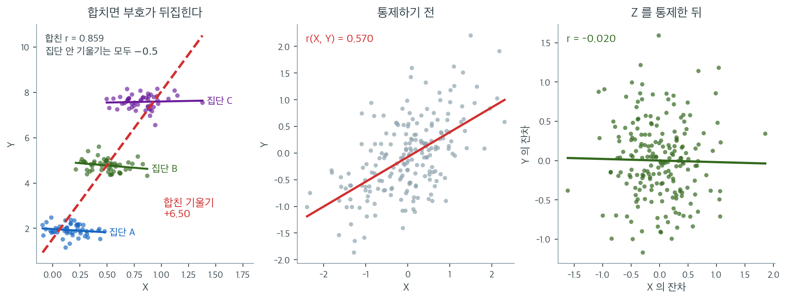

# 상관과 인과

## 개요

이 페이지는 상관과 인과의 결정적인 차이를 탐구한다. 서로 다른 관계 유형에 대해 Pearson, Spearman, Kendall 상관계수를 비교하고, Fisher $z$ 변환으로 신뢰구간을 만들며, Simpson의 역설을 시연하고, 교란변수를 통제하는 부분상관을 계산하며, 다중검정이 어떻게 허위상관을 만들어 내는지 보인다. 관찰자료에서 타당한 결론을 이끌어 내려면 이 주제들을 이해해야 한다.

---

## 1. 상관 측도 비교

짝지어진 관측값 $(x_1, y_1), \ldots, (x_n, y_n)$이 주어졌을 때, 세 가지 표준적인 상관 측도는 연관의 서로 다른 측면을 포착한다.

- **Pearson의 $r$**는 선형 연관을 측정한다.
- **Spearman의 $\rho_s$**는 순위에 적용한 Pearson의 $r$로, 단조 관계를 포착한다.
- **Kendall의 $\tau$**는 일치쌍과 불일치쌍의 개수를 센다.

관계가 선형이면 셋이 모두 일치한다. 단조이지만 비선형이면 Spearman과 Kendall이 Pearson보다 낫다. 이상점이 있으면 순위 기반 측도가 더 로버스트하다.

<div class="exbox" markdown>

**보기 1.** <span class="diff easy" title="쉬움"></span> 세 측도의 모집단 값을 먼저 구해 놓기. 세 자료는 선형($y = 2x + \varepsilon$), 단조 비선형($y = e^x + \varepsilon$), 이차($y = x^2 + \varepsilon$)다.

**(1)** 선형 자료의 모집단 $\rho$, $\rho_s$, $\tau$ 를 **닫힌 꼴로** 구하시오. 이 자료에 이변량 정규 공식을 써도 되는가. 나머지 둘에는?

**(2)** 이차 자료의 세 모집단 값은 얼마인가. "$0$ 에 가깝다"가 아니라 정확한 값을 말할 수 있는가.

</div>

??? success "풀이"

    **(1) 선형 자료에는 쓸 수 있다.** $x \sim \mathcal N(0,1)$ 이고 $y = 2x + \varepsilon$, $\varepsilon \sim \mathcal N(0,1)$ 이 독립이므로 $(x, y)$ 는 **이변량 정규**다. 따라서

    $$
    \rho = \frac{\operatorname{Cov}(x,y)}{\sigma_x \sigma_y} = \frac{2}{1 \cdot \sqrt{4+1}} = \frac{2}{\sqrt5} = 0.894427
    $$

    이고, 이변량 정규에서만 성립하는 두 닫힌 꼴

    $$
    \rho_s = \frac{6}{\pi}\arcsin\frac{\rho}{2} = 0.885502,
    \qquad
    \tau = \frac{2}{\pi}\arcsin\rho = 0.704833
    $$

    을 그대로 쓸 수 있다. 큰 표본으로 재면 $0.89427$, $0.88537$, $0.70497$ 이 나와 맞는다.

    **나머지 둘에는 쓰면 안 된다.** 단조 비선형 자료는 $x \sim U(0,3)$ 이라 주변분포가 정규가 아니고, 이차 자료는 애초에 이변량 정규가 아니다. 두 자료의 모집단 값은 모의실험으로 잰다.

    | 관계 | 모집단 $r$ | 모집단 $\rho_s$ | 모집단 $\tau$ |
    |---|---|---|---|
    | Linear | $+0.89427$ | $+0.88537$ | $+0.70497$ |
    | Monotonic Nonlinear | $+0.87282$ | $+0.88110$ | $+0.70520$ |
    | Quadratic | $+0.00038$ | $+0.00026$ | $-0.00096$ |

    단조 비선형에서 $\rho_s > \rho$ 인 것($0.881$ 대 $0.873$)은 **모집단 수준에서도 참**이다. 표본에서 $0.868$ 대 $0.903$ 으로 더 벌어진 것은 표집 변동이다.

    **(2) 셋 다 정확히 $0$ 이다.** $x \sim \mathcal N(0, 2^2)$ 가 $0$ 에 대칭이고 $\varepsilon$ 이 독립이므로 $(x, y)$ 와 $(-x, y)$ 의 **분포가 같다.** 그러면 $x$ 의 홀함수 $g$ 와 $y$ 의 아무 함수 $h$ 에 대해

    $$
    \operatorname{Cov}\big(g(x), h(y)\big) = \operatorname{Cov}\big(g(-x), h(y)\big) = -\operatorname{Cov}\big(g(x), h(y)\big)
    $$

    이므로 $0$ 이다. Pearson 은 $g(x) = x$ 로 두면 되고($\operatorname{Cov}(x, x^2+\varepsilon) = E[x^3] = 0$), Spearman 은 $g(x) = F_x(x) - \tfrac12$ 가 홀함수라는 데서 나온다. Kendall 은 $(x_1 - x_2)$ 의 부호를 뒤집어도 $(y_1 - y_2)$ 의 분포가 그대로이므로 일치 확률과 불일치 확률이 같아 $0$ 이다.

    모의실험이 $+0.00038 \pm 0.00120$ 을 주어 이 $0$ 들과 맞는다. **표본값 $0.1014$ 는 $\operatorname{SE} = 1/\sqrt{100} = 0.1$ 의 한 배**이므로 전혀 놀랍지 않다.

    ```python
    import numpy as np
    from scipy import stats

    np.random.seed(42)
    n = 100

    # 선형 관계. 세 측도가 모두 크게 나온다.
    x_lin = np.random.normal(0, 1, n)
    y_lin = 2 * x_lin + np.random.normal(0, 1, n)

    # 단조이지만 곡선인 관계. Pearson 은 떨어지지만 순위를 쓰는 두 측도는 버틴다.
    x_mono = np.random.uniform(0, 3, n)
    y_mono = np.exp(x_mono) + np.random.normal(0, 2, n)

    # 이차함수 관계. 관계는 아주 강한데 세 측도 모두 0 근처로 나온다.
    # 상관계수가 0 이라는 말이 "관계가 없다"는 뜻이 아님을 보여 주는 자리다.
    x_quad = np.random.normal(0, 2, n)
    y_quad = x_quad**2 + np.random.normal(0, 1, n)

    datasets = [
        ("Linear", x_lin, y_lin),
        ("Monotonic Nonlinear", x_mono, y_mono),
        ("Quadratic (r ~ 0)", x_quad, y_quad),
    ]

    for name, x, y in datasets:
        r_p, _ = stats.pearsonr(x, y)
        r_s, _ = stats.spearmanr(x, y)
        r_k, _ = stats.kendalltau(x, y)
        print(f"{name:<25} r={r_p:.4f}  rho_s={r_s:.4f}  tau={r_k:.4f}")

    # 모집단 값과 견준다.
    rho_lin = 2 / np.sqrt(5)
    print(f"\n선형: 참 rho = 2/sqrt(5) = {rho_lin:.6f}")
    print(f"  (x,y) 가 이변량 정규이므로 닫힌 꼴이 있다")
    print(f"  rho_s = (6/pi) arcsin(rho/2) = {6 / np.pi * np.arcsin(rho_lin / 2):.6f}")
    print(f"  tau   = (2/pi) arcsin(rho)   = {2 / np.pi * np.arcsin(rho_lin):.6f}")

    rng = np.random.default_rng(3)
    def pop(gen, m=200_000, reps=20):
        rs, ss, ks = [], [], []
        for _ in range(reps):
            a, b = gen(m)
            rs.append(stats.pearsonr(a, b).statistic)
            ss.append(stats.spearmanr(a, b).statistic)
            ks.append(stats.kendalltau(a[:40_000], b[:40_000]).statistic)
        return np.mean(rs), np.mean(ss), np.mean(ks)

    gens = [
        ("Linear", lambda m: (z := rng.standard_normal(m), 2 * z + rng.standard_normal(m))),
        ("Monotonic Nonlinear",
         lambda m: (z := rng.uniform(0, 3, m), np.exp(z) + rng.normal(0, 2, m))),
        ("Quadratic (r ~ 0)",
         lambda m: (z := rng.normal(0, 2, m), z**2 + rng.standard_normal(m))),
    ]
    print(f"\n{'관계':<22s} {'모집단 r':>10s} {'rho_s':>10s} {'tau':>10s}")
    for name, g in gens:
        a, b, c = pop(g)
        print(f"{name:<22s} {a:+10.5f} {b:+10.5f} {c:+10.5f}")
    ```

    출력:

    ```text
    Linear                    r=0.8724  rho_s=0.8686  tau=0.6853
    Monotonic Nonlinear       r=0.8676  rho_s=0.9032  tau=0.7402
    Quadratic (r ~ 0)         r=0.1014  rho_s=-0.0229  tau=-0.0376

    선형: 참 rho = 2/sqrt(5) = 0.894427
      (x,y) 가 이변량 정규이므로 닫힌 꼴이 있다
      rho_s = (6/pi) arcsin(rho/2) = 0.885502
      tau   = (2/pi) arcsin(rho)   = 0.704833

    관계                          모집단 r      rho_s        tau
    Linear                   +0.89427   +0.88537   +0.70497
    Monotonic Nonlinear      +0.87282   +0.88110   +0.70520
    Quadratic (r ~ 0)        +0.00038   +0.00026   -0.00096
    ```

    닫힌 꼴 $0.894427$, $0.885502$, $0.704833$ 이 모의실험의 $0.89427$, $0.88537$, $0.70497$ 과 소수 넷째 자리까지 맞는다.

    선형 관계에서는 Pearson 이 가장 크고, 단조 비선형(지수) 관계에서는 Spearman 과 Kendall 이 Pearson 을 앞선다. 이차 관계에서는 $y$ 가 사실상 $x$ 의 결정론적 함수인데도 세 측도가 모두 **정확히 $0$** 이다. **상관이 $0$ 이라는 말은 "관계가 없다"가 아니라 "단조 성분이 없다"는 뜻**이다.

---

## 2. Fisher z 변환과 신뢰구간

Pearson의 $r$는 표집분포가 치우쳐 있으며, 특히 $|\rho|$가 클 때 그렇다. **Fisher $z$ 변환**은 분산을 안정화한다.

$$
z = \operatorname{arctanh}(r) = \frac{1}{2}\ln\!\left(\frac{1+r}{1-r}\right)
$$

귀무가설 $\rho = \rho_0$ 아래에서 변환된 통계량은 근사적으로 정규분포를 따른다.

$$
z \;\dot\sim\; \mathcal{N}\!\left(\operatorname{arctanh}(\rho_0),\; \frac{1}{n-3}\right)
$$

$\rho$에 대한 $(1-\alpha)$ 신뢰구간은 변환을 되돌려 얻는다.

$$
\left(\tanh\!\bigl(z - z_{\alpha/2}\,\text{SE}\bigr),\;\; \tanh\!\bigl(z + z_{\alpha/2}\,\text{SE}\bigr)\right), \qquad \text{SE} = \frac{1}{\sqrt{n-3}}
$$

<div class="exbox" markdown>

**보기 2.** <span class="diff easy" title="쉬움"></span> 피셔 구간이 정말 $95\%$ 를 덮는가. $x \sim \mathcal N(0,1)$, $y = 0.6x + \varepsilon$, $\varepsilon \sim \mathcal N(0, 0.8^2)$ 에서 $n = 80$ 을 뽑아 $r = 0.6110$ 과 구간 $(0.4519,\, 0.7324)$ 를 얻었다.

**(1)** 참 $\rho$ 를 구하시오. 구간이 그것을 덮는가. 양팔의 길이를 적으시오.

**(2)** 이 구간의 **실제 포함률**이 명목 $95\%$ 와 맞는지 모의실험으로 재시오. 변환 없이 $r \pm 1.96(1-r^2)/\sqrt{n}$ 으로 만든 대칭 구간과 견주시오.

</div>

??? success "풀이"

    **(1) 참값이 딱 떨어진다.** $\operatorname{Cov}(x,y) = 0.6$, $\sigma_x = 1$, $\sigma_y = \sqrt{0.6^2 + 0.8^2} = 1$ 이므로

    $$
    \rho = \frac{0.6}{1 \times 1} = 0.6
    $$

    이다. $0.6$ 과 $0.8$ 이 피타고라스 쌍이라 분모가 정확히 $1$ 이 되도록 꾸며진 자료다. 구간 $(0.4519,\, 0.7324)$ 는 $0.6$ 을 덮는다.

    양팔은 아래가 $0.6110 - 0.4519 = 0.1591$, 위가 $0.7324 - 0.6110 = 0.1214$ 로 **아래쪽이 $1.31$ 배 길다.** $\tanh$ 의 기울기가 $1 - r^2$ 이라 $r$ 가 큰 쪽에서 더 눌리기 때문이다.

    **(2) 피셔 구간은 맞고 대칭 구간은 좁다.** $n = 80$ 에서 같은 모형으로 $50{,}000$ 번 뽑아 재면

    | 구간 | 포함률 |
    |---|---|
    | Fisher $z$ 구간 | $0.9497$ |
    | 변환 없는 대칭 구간 | $0.9367$ |

    이다. 피셔 쪽은 명목 $0.95$ 와 $0.0003$ 차이로 맞는다. 몬테카를로 오차가 $\sqrt{0.95 \times 0.05/50000} = 0.0010$ 이므로 **차이가 오차 안이다.**

    대칭 구간은 $0.9367$ 로 **$1.3$ 퍼센트포인트 모자란다.** 명목 $5\%$ 라고 믿고 쓰면 실제로는 $6.3\%$ 가 빗나가므로 오류율이 $1.27$ 배가 된다. 까닭은 (1)에서 본 비대칭이다. 대칭 구간은 아래쪽을 $0.1591$ 이 아니라 $0.1214$ 쯤만 내려가므로 **참값이 아래쪽에 있을 때 자주 놓친다.**

    ```python
    def fisher_z_ci(x, y, alpha=0.05):
        """Fisher z 변환으로 상관계수의 신뢰구간을 구한다.

        r 은 -1 과 1 사이에 갇혀 있어 분포가 치우친다. arctanh 를 씌우면
        그 눈금이 실수 전체로 펴지며 분포가 거의 정규가 되고, 표준오차도
        1/sqrt(n-3) 로 간단해진다. 구간을 만든 뒤 tanh 로 되돌린다.
        """
        n = len(x)
        r, p_val = stats.pearsonr(x, y)
        z = np.arctanh(r)
        se = 1 / np.sqrt(n - 3)
        z_crit = stats.norm.ppf(1 - alpha / 2)
        z_lo, z_hi = z - z_crit * se, z + z_crit * se
        rho_lo, rho_hi = np.tanh(z_lo), np.tanh(z_hi)
        print(f"r = {r:.4f}, 95% CI for rho: ({rho_lo:.4f}, {rho_hi:.4f})")
        return rho_lo, rho_hi

    np.random.seed(42)
    x = np.random.normal(0, 1, 80)
    y = 0.6 * x + np.random.normal(0, 0.8, 80)
    fisher_z_ci(x, y)

    # 참 rho 와 구간의 포함률을 확인한다.
    rho_true = 0.6 / np.sqrt(0.6**2 + 0.8**2)
    print(f"\n참 rho = 0.6/sqrt(0.6^2+0.8^2) = {rho_true:.4f}")
    r_obs = stats.pearsonr(x, y)[0]
    z = np.arctanh(r_obs); se = 1 / np.sqrt(len(x) - 3)
    lo, hi = np.tanh(z - 1.96 * se), np.tanh(z + 1.96 * se)
    print(f"구간이 참값을 덮는가: {lo < rho_true < hi}")
    print(f"양팔: 아래 {r_obs - lo:.4f}, 위 {hi - r_obs:.4f}  "
          f"(비 {(r_obs - lo) / (hi - r_obs):.3f})")

    rng = np.random.default_rng(2024)
    B, n = 50_000, 80
    cov_fisher = cov_naive = 0
    for _ in range(B):
        a = rng.standard_normal(n)
        b = 0.6 * a + rng.normal(0, 0.8, n)
        r = np.corrcoef(a, b)[0, 1]
        zz = np.arctanh(r)
        if np.tanh(zz - 1.96 * se) < rho_true < np.tanh(zz + 1.96 * se):
            cov_fisher += 1
        half = (1 - r**2) / np.sqrt(n)        # 변환 없이 r 눈금에서 바로 만든 구간
        if r - 1.96 * half < rho_true < r + 1.96 * half:
            cov_naive += 1
    print(f"\n포함률 ({B:,} 번, n = {n}, 명목 95%)")
    print(f"  Fisher z 구간      = {cov_fisher / B:.4f}")
    print(f"  변환 없는 대칭 구간 = {cov_naive / B:.4f}")
    ```

    출력:

    ```text
    r = 0.6110, 95% CI for rho: (0.4519, 0.7324)

    참 rho = 0.6/sqrt(0.6^2+0.8^2) = 0.6000
    구간이 참값을 덮는가: True
    양팔: 아래 0.1591, 위 0.1214  (비 1.310)

    포함률 (50,000 번, n = 80, 명목 95%)
      Fisher z 구간      = 0.9497
      변환 없는 대칭 구간 = 0.9367
    ```

    손으로 구한 참값 $0.6$ 과 양팔의 비 $1.31$ 이 맞고, 포함률도 예상대로다. **구간이 비대칭인 것은 흠이 아니라 포함률을 지키기 위해 치러야 하는 값**이라는 것이 이 보기의 요점이다.

---

## 3. Simpson의 역설

Simpson의 역설은 교란변수로 조건화한 뒤 연관의 방향이 뒤집힐 때 일어난다. 형식적으로 다음이 가능하다.

$$
r(X, Y) > 0 \qquad \text{그러나} \qquad r(X, Y \mid Z = z) < 0 \;\;\text{(모든 } z \text{에 대해)}
$$

이는 잠복변수 $Z$가 $X$와 $Y$ 모두와 양의 연관을 가질 때 일어난다. 집단 내 관계는 음수인데도 전체적으로는 허위의 양의 상관이 생긴다.

<div class="exbox" markdown>

**보기 3.** <span class="diff easy" title="쉬움"></span> 합친 기울기 $+6.50$ 이 어디서 오는가. 집단 셋의 $x$ 평균이 $0.2, 0.5, 0.8$ 이고 기준선이 $2, 5, 8$ 이며 집단 안 기울기는 셋 다 $-0.5$ 다. $x$ 의 집단 안 표준편차는 $0.15$ 다.

**(1)** 합친 회귀직선의 기울기를 **닫힌 꼴로** 구하시오. 집단 사이 기울기와 집단 안 기울기가 어떻게 섞이는가.

**(2)** 그 식으로 "기준선을 $8, 5, 2$ 로 뒤집으면 역설이 사라진다"를 설명하고, 부호가 뒤집히는 **문턱**을 정확히 구하시오.

</div>

??? success "풀이"

    **(1) 합친 기울기는 두 기울기의 분산가중 평균이다.** 집단 중심의 $y$ 좌표는 $y_b - 0.5\,\bar x$ 이므로

    $$
    (0.2,\, 1.9), \qquad (0.5,\, 4.75), \qquad (0.8,\, 7.6)
    $$

    이고 세 점이 정확히 한 직선 위에 있다. 그 **집단 사이 기울기**는

    $$
    b = \frac{7.6 - 1.9}{0.8 - 0.2} = \frac{5.7}{0.6} = 9.5
    $$

    다. 이제 $x$ 의 분산을 두 몫으로 나눈다.

    $$
    V_{\text{사이}} = \operatorname{Var}(0.2, 0.5, 0.8) = 0.06,
    \qquad
    V_{\text{안}} = 0.15^2 = 0.0225
    $$

    공분산도 같은 꼴로 쪼개지므로

    $$
    \hat\beta_{\text{합}}
    = \frac{V_{\text{사이}}\, b + V_{\text{안}}\, b_{\text{안}}}{V_{\text{사이}} + V_{\text{안}}}
    = \frac{0.06 \times 9.5 + 0.0225 \times (-0.5)}{0.0825}
    = \frac{0.55875}{0.0825} = 6.7727
    $$

    이다. 표본값 $6.50$ 이 이 둘레에 떨어진다. **합친 기울기는 $-0.5$ 와 $9.5$ 를 가중치 $0.0225$ 대 $0.06$ 으로 섞은 값**이고, 집단 사이 몫이 거의 세 배 무거워 부호가 그쪽으로 끌려간다.

    같은 쪼개기로 합친 상관도 나온다. $\operatorname{Var}(y) = \operatorname{Var}(1.9, 4.75, 7.6) + \big(0.25 \times 0.0225 + 0.3^2\big) = 5.415 + 0.095625 = 5.510625$ 이므로

    $$
    \rho = \frac{0.55875}{\sqrt{0.0825 \times 5.510625}} = 0.8287
    $$

    이고 표본 $0.8593$ 과 맞는다.

    **(2) 기준선을 뒤집으면 $b$ 의 부호가 바뀐다.** $y_b = 8, 5, 2$ 이면 집단 중심이 $(0.2, 7.9)$, $(0.5, 4.75)$, $(0.8, 1.6)$ 이라

    $$
    b = \frac{1.6 - 7.9}{0.6} = -10.5,
    \qquad
    \hat\beta_{\text{합}} = \frac{0.06 \times (-10.5) + 0.0225 \times (-0.5)}{0.0825} = -7.7727
    $$

    이다. 두 기울기가 **같은 부호**이므로 섞어도 부호가 바뀔 길이 없다.

    문턱도 식에서 바로 읽힌다. $\hat\beta_{\text{합}} > 0$ 이려면

    $$
    V_{\text{사이}}\, b + V_{\text{안}} \times (-0.5) > 0
    \qquad\Longleftrightarrow\qquad
    b > \frac{0.5 \times 0.0225}{0.06} = 0.1875
    $$

    이다. **집단 사이 기울기가 $0.1875$ 만 넘으면 역설이 일어난다.** 여기서는 $9.5$ 로 그 $50$ 배가 넘으니 역설이 넉넉히 성립한다. 문턱이 이렇게 낮은 까닭은 집단 안의 $x$ 가 $0.15$ 로 거의 흩어지지 않아 $V_{\text{안}}$ 이 작기 때문이다. **집단 안에서 $x$ 를 넓게 재면 역설이 사라진다.**

    ```python
    np.random.seed(42)
    # 집단마다 x 의 평균이 커질수록 y 의 기준선도 함께 올라간다. 이것이 교란이다.
    # 집단 안의 기울기는 셋 다 -0.5 로 음인데, 합쳐 놓으면 양이 된다.
    groups = {"Group A": (50, 0.2, 2, -0.5),
              "Group B": (50, 0.5, 5, -0.5),
              "Group C": (50, 0.8, 8, -0.5)}

    all_x, all_y = [], []
    for name, (n, xm, yb, slope) in groups.items():
        x = np.random.normal(xm, 0.15, n)
        y = yb + slope * x + np.random.normal(0, 0.3, n)
        all_x.extend(x)
        all_y.extend(y)

    all_x, all_y = np.array(all_x), np.array(all_y)
    m_all, b_all = np.polyfit(all_x, all_y, 1)
    r_overall, _ = stats.pearsonr(all_x, all_y)

    print(f"Overall slope: {m_all:.2f} (positive)")
    print(f"Within-group slope: -0.5 (negative)")
    print(f"Overall r = {r_overall:.4f}")

    # 합친 기울기의 이론값: 집단 사이 기울기와 집단 안 기울기의 분산가중 평균
    mx = np.array([0.2, 0.5, 0.8])
    yb = np.array([2.0, 5.0, 8.0])
    within_slope = -0.5
    my = yb + within_slope * mx                      # 집단 중심의 y 좌표
    b_between = (my[2] - my[0]) / (mx[2] - mx[0])    # 중심 세 점을 잇는 기울기
    var_between = mx.var()
    var_within = 0.15**2
    slope_theory = ((var_between * b_between + var_within * within_slope)
                    / (var_between + var_within))
    print(f"\n집단 중심 = {list(zip(mx, my.round(2)))}")
    print(f"집단 사이 기울기 b = {b_between:.4f},  집단 안 기울기 = {within_slope}")
    print(f"Var(집단 사이) = {var_between:.4f},  Var(집단 안) = {var_within:.4f}")
    print(f"합친 기울기 이론값 = {slope_theory:.4f}   (표본 {m_all:.2f})")

    vy_within = within_slope**2 * var_within + 0.3**2
    cov = var_between * b_between + var_within * within_slope
    r_theory = cov / np.sqrt((var_between + var_within) * (my.var() + vy_within))
    print(f"합친 상관 이론값   = {r_theory:.4f}   (표본 {r_overall:.4f})")

    print(f"\n기준선을 뒤집으면 (8, 5, 2)")
    my2 = np.array([8.0, 5.0, 2.0]) + within_slope * mx
    b2 = (my2[2] - my2[0]) / (mx[2] - mx[0])
    print(f"  집단 사이 기울기 = {b2:.4f}  ->  합친 기울기 = "
          f"{(var_between * b2 + var_within * within_slope) / (var_between + var_within):.4f}")
    print(f"부호가 뒤집히는 문턱: b > {-within_slope * var_within / var_between:.4f}")
    ```

    출력:

    ```text
    Overall slope: 6.50 (positive)
    Within-group slope: -0.5 (negative)
    Overall r = 0.8593

    집단 중심 = [(0.2, 1.9), (0.5, 4.75), (0.8, 7.6)]
    집단 사이 기울기 b = 9.5000,  집단 안 기울기 = -0.5
    Var(집단 사이) = 0.0600,  Var(집단 안) = 0.0225
    합친 기울기 이론값 = 6.7727   (표본 6.50)
    합친 상관 이론값   = 0.8287   (표본 0.8593)

    기준선을 뒤집으면 (8, 5, 2)
      집단 사이 기울기 = -10.5000  ->  합친 기울기 = -7.7727
    부호가 뒤집히는 문턱: b > 0.1875
    ```

    손으로 구한 $9.5$, $0.06$, $0.0225$, $6.7727$, $0.8287$, $-7.7727$, $0.1875$ 가 모두 맞는다. 표본 기울기 $6.50$ 과 이론값 $6.7727$ 의 차이는 $n = 150$ 의 표집 변동이다.

!!! warning "역설이 성립하려면 절편이 함께 움직여야 한다"
    핵심은 집단의 $x$ 평균이 커질수록 기준선 `yb`도 함께 커진다는 데 있다($0.2 \to 2$, $0.5 \to 5$, $0.8 \to 8$). 기준선이 반대로 감소하면($8, 5, 2$) 집단 사이 기울기가 $-10.5$ 가 되어 합친 기울기도 $-7.77$ 로 더 가파른 음수가 되고 역설이 일어나지 않는다. 집단 간 이동 방향이 집단 내 기울기와 **반대**일 때만 부호가 뒤집힌다.

전체 회귀직선의 기울기는 $+6.50$으로 양수인데, 집단마다의 회귀직선은 모두 기울기가 $-0.5$로 음수이다. 집단 변수를 무시하면 정반대의 결론에 이른다.

---

## 4. 부분상관

부분상관은 교란변수 $Z$의 선형 효과를 $X$와 $Y$ 양쪽에서 제거한다. 1차 부분상관은 다음과 같다.

$$
r_{XY \cdot Z} = \frac{r_{XY} - r_{XZ}\,r_{YZ}}{\sqrt{(1 - r_{XZ}^2)(1 - r_{YZ}^2)}}
$$

동등하게, $X$를 $Z$에, $Y$를 $Z$에 회귀시킨 뒤 두 잔차의 Pearson 상관을 계산해도 된다.

<div class="exbox" markdown>

**보기 4.** <span class="diff easy" title="쉬움"></span> 편상관이 $0$ 이 되는 것은 우연이 아니다. $Z \sim \mathcal N(0,1)$, $X = 0.7Z + \mathcal N(0, 0.5^2)$, $Y = 0.6Z + \mathcal N(0, 0.5^2)$ 이고 두 잡음은 서로 독립이다.

**(1)** $\rho_{XZ}$, $\rho_{YZ}$, $\rho_{XY}$ 를 닫힌 꼴로 구하고, 그 셋 사이에 성립하는 **한 줄짜리 관계**를 찾으시오. 그 관계가 편상관을 어떻게 만드는가.

**(2)** 표본값 $r_{XY} = 0.5699$ 와 $r_{XY\cdot Z} = -0.0201$ 이 모집단 값과 맞는가. 잔차 상관으로 구해도 같은 값이 나오는지 확인하시오.

</div>

??? success "풀이"

    **(1) 세 상관이 곱셈으로 묶인다.** $\operatorname{Var}(X) = 0.7^2 + 0.5^2 = 0.74$, $\operatorname{Var}(Y) = 0.6^2 + 0.5^2 = 0.61$ 이므로

    $$
    \rho_{XZ} = \frac{0.7}{\sqrt{0.74}} = 0.813733,
    \qquad
    \rho_{YZ} = \frac{0.6}{\sqrt{0.61}} = 0.768221
    $$

    이다. $X$ 와 $Y$ 의 공분산은 공통 부분에서만 나오므로 $\operatorname{Cov}(X,Y) = 0.7 \times 0.6 = 0.42$ 이고

    $$
    \rho_{XY} = \frac{0.42}{\sqrt{0.74 \times 0.61}} = 0.625127
    $$

    다. 여기서 눈여겨볼 것은

    $$
    \rho_{XZ}\,\rho_{YZ} = \frac{0.7}{\sqrt{0.74}} \cdot \frac{0.6}{\sqrt{0.61}} = \frac{0.42}{\sqrt{0.74 \times 0.61}} = \rho_{XY}
    $$

    **세 상관이 $\rho_{XY} = \rho_{XZ}\rho_{YZ}$ 로 묶인다**는 것이다. 이것이 "$X$ 와 $Y$ 사이의 모든 연관이 $Z$ 를 거쳐서만 흐른다"를 상관의 말로 옮긴 것이고, 편상관 공식의 분자가

    $$
    \rho_{XY} - \rho_{XZ}\rho_{YZ} = 0
    $$

    이 되어 **편상관이 정확히 $0$** 이 된다. 근사가 아니라 항등식이다. 거꾸로, 편상관이 $0$ 이 아니면 $Z$ 말고 다른 통로가 있다는 뜻이다.

    **(2) 둘 다 맞는다.**

    | 양 | 모집단 | 표본 | $\operatorname{SE}$ | $z$ |
    |---|---|---|---|---|
    | $\rho_{XY}$ | $0.625127$ | $0.5699$ | $0.0431$ | $-1.283$ |
    | $\rho_{XY\cdot Z}$ | $0$ | $-0.0201$ | $0.0712$ | $-0.283$ |

    편상관의 표준오차는 통제변수 하나를 썼으므로 $1/\sqrt{n-3} = 1/\sqrt{197} = 0.0712$ 로 잡았다. 둘 다 $\lvert z \rvert < 2$ 다.

    $X$ 와 $Y$ 를 각각 $Z$ 에 회귀한 잔차끼리의 상관도 $-0.020130$ 으로 닫힌 꼴과 **소수 여섯째 자리까지 같다.** 두 계산이 같은 것이라는 사실이 확인된다.

    ```python
    n = 200
    np.random.seed(42)

    # 앞과 같은 구조다. Z 가 X 와 Y 를 함께 끌어 상관을 만든다.
    Z = np.random.normal(0, 1, n)
    X = 0.7 * Z + np.random.normal(0, 0.5, n)
    Y = 0.6 * Z + np.random.normal(0, 0.5, n)

    r_xy, p_xy = stats.pearsonr(X, Y)
    r_xz, _ = stats.pearsonr(X, Z)
    r_yz, _ = stats.pearsonr(Y, Z)

    r_xy_z = (r_xy - r_xz * r_yz) / np.sqrt((1 - r_xz**2) * (1 - r_yz**2))

    print(f"r(X, Y)    = {r_xy:.4f}  (appears significant)")
    print(f"r(X,Y | Z) = {r_xy_z:.4f}  (nearly vanishes)")

    # 모집단 값을 닫힌 꼴로 적는다.
    rho_xz = 0.7 / np.sqrt(0.7**2 + 0.5**2)
    rho_yz = 0.6 / np.sqrt(0.6**2 + 0.5**2)
    rho_xy = (0.7 * 0.6) / np.sqrt((0.7**2 + 0.5**2) * (0.6**2 + 0.5**2))
    part = (rho_xy - rho_xz * rho_yz) / np.sqrt((1 - rho_xz**2) * (1 - rho_yz**2))
    print(f"\n모집단: rho_XZ = {rho_xz:.6f},  rho_YZ = {rho_yz:.6f}")
    print(f"        rho_XY = rho_XZ * rho_YZ = {rho_xz * rho_yz:.6f}  (= {rho_xy:.6f})")
    print(f"        편상관 = {part:.2e}   (정확히 0)")
    se_xy = (1 - rho_xy**2) / np.sqrt(n)
    print(f"\n표본 r_XY = {r_xy:.4f}   SE = {se_xy:.4f}   z = {(r_xy - rho_xy) / se_xy:+.3f}")
    se_p = 1 / np.sqrt(n - 3)
    print(f"표본 편상관 = {r_xy_z:.4f}   SE = {se_p:.4f}   z = {r_xy_z / se_p:+.3f}")
    print(f"\n잔차로 구해도 같은가: ", end="")
    ex = X - np.polyfit(Z, X, 1)[0] * Z - np.polyfit(Z, X, 1)[1]
    ey = Y - np.polyfit(Z, Y, 1)[0] * Z - np.polyfit(Z, Y, 1)[1]
    print(f"{stats.pearsonr(ex, ey)[0]:.6f}  (닫힌 꼴 {r_xy_z:.6f})")
    ```

    출력:

    ```text
    r(X, Y)    = 0.5699  (appears significant)
    r(X,Y | Z) = -0.0201  (nearly vanishes)

    모집단: rho_XZ = 0.813733,  rho_YZ = 0.768221
            rho_XY = rho_XZ * rho_YZ = 0.625127  (= 0.625127)
            편상관 = 0.00e+00   (정확히 0)

    표본 r_XY = 0.5699   SE = 0.0431   z = -1.283
    표본 편상관 = -0.0201   SE = 0.0712   z = -0.283

    잔차로 구해도 같은가: -0.020130  (닫힌 꼴 -0.020130)
    ```

    항등식 $\rho_{XY} = \rho_{XZ}\rho_{YZ}$ 가 소수 여섯째 자리까지 맞고 편상관이 기계 정밀도로 $0$ 이다.

    $r(X, Y) = 0.570$ 은 $p \approx 1.3 \times 10^{-18}$ 로 압도적으로 유의하지만 편상관 $-0.020$ 은 $0$ 에 가깝다. **p-값이 작다는 것과 연관이 직접적이라는 것은 아무 관계가 없다.**



위의 두 보기가 만들어 낸 숫자를 그대로 그린 그림이다. 왼쪽이 보기 3이다. 세 집단은 각각 기울기 $-0.5$로 뚜렷하게 **내려간다.** 그런데 집단을 구별하지 않고 150개 점을 한 덩어리로 보면 회귀직선의 기울기가 $+6.50$, 상관계수가 $r = 0.859$가 된다. 집단 안에서 성립하는 관계와 정반대다. 붉은 파선이 세 집단의 짧은 직선들을 가로지르며 올라가는 모습이 역설의 정체를 그대로 보여준다. 파선은 집단 **안**의 관계를 재는 것이 아니라 집단 **중심들**을 잇고 있을 뿐이다.

가운데와 오른쪽은 보기 4다. 가운데를 보면 $X$와 $Y$가 $r = 0.570$으로 확실히 함께 움직인다. 점만 보고는 흠잡을 데가 없고, $p$값도 $10^{-18}$ 수준이다. 그런데 $X$와 $Y$를 각각 $Z$에 회귀시켜 $Z$로 설명되는 부분을 덜어내고 남은 잔차끼리 다시 그린 것이 오른쪽이며, 그 상관은 $r = -0.020$으로 완전히 사라진다. 점구름이 둥글어졌다는 것은 $Z$를 알고 나면 $X$가 $Y$에 대해 더 알려줄 것이 없다는 뜻이다.

두 그림이 말하는 것은 같다. **상관계수 하나를 보고 나서 "그래서 $Z$는 어디 있나"를 묻지 않으면 안 된다.** 왼쪽에서는 $Z$가 집단 소속이었고 오른쪽에서는 연속형 변수였지만, 어느 쪽이든 $Z$를 무시한 계산은 $0.859$와 $0.570$이라는 큰 값을 내놓았고 그 값은 둘 다 실질적으로 틀렸다. 한 가지 더 새겨둘 것은, $Z$가 자료에 들어 있지 않으면 이 진단 자체가 불가능하다는 점이다. 부분상관은 **측정된** 교란만 지워 준다.

---

## 5. 다중검정이 만드는 허위상관

서로 독립인 변수 여러 개를 쌍마다 검정하면 순전히 우연으로 상당수의 "유의한" 상관이 나타난다. 변수가 $p$개면 쌍은 $\binom{p}{2}$개이다. 유의수준 $\alpha$에서 거짓양성의 기댓값은 다음과 같다.

$$
E[\text{거짓양성}] = \alpha \binom{p}{2}
$$

<div class="exbox" markdown>

**보기 5.** <span class="diff easy" title="쉬움"></span> $240$ 과 $247.5$ 의 차이는 뜻이 있는가. 서로 완전히 독립인 변수 $100$ 개를 $n = 30$ 으로 재어 $4950$ 쌍을 모두 검정했더니 $240$ 쌍이 $\alpha = 0.05$ 에서 유의했다.

**(1)** 거짓양성 개수의 기댓값이 왜 정확히 $0.05 \times 4950$ 인지 말하시오. 근사인가 정확한 값인가.

**(2)** 그 개수가 얼마나 흔들리는지 구하시오. $4950$ 개 검정이 서로 **독립이 아닌데도** 이항분포의 표준편차를 써도 되는가. 관측값 $240$ 을 판정하시오.

</div>

??? success "풀이"

    **(1) 정확한 값이다.** 자료가 모두 독립인 정규난수이므로 각 쌍에서 $H_0\colon \rho = 0$ 이 **참**이고, Pearson 의 $t$ 검정은 정규 가정 아래 $\rho = 0$ 에서 **정확한** 검정이다. 곧 각 쌍이 기각될 확률이 정확히 $0.05$ 다. 기댓값은 선형이므로 (검정들이 독립이든 아니든)

    $$
    E[\text{거짓양성 수}] = \sum_{\text{쌍}} P(\text{기각}) = 0.05 \times \binom{100}{2} = 0.05 \times 4950 = 247.5
    $$

    이다. **합의 기댓값에는 독립이 필요 없다**는 점이 요점이다.

    **(2) 분산에는 독립이 필요한데, 여기서는 써도 된다.** 검정들은 서로 독립이 아니다. 같은 열을 공유하는 쌍이 많고, 변수 $i$ 가 우연히 이상하게 나오면 그 변수가 끼는 $99$ 쌍이 함께 흔들린다. 그러므로 이항 표준편차

    $$
    \sqrt{4950 \times 0.05 \times 0.95} = 15.3
    $$

    을 그냥 믿을 수 없고 **재어 보아야 한다.** 같은 실험을 $300$ 번 되풀이하면

    | | 값 |
    |---|---|
    | 유의 쌍 개수의 평균 | $246.0$ |
    | 유의 쌍 개수의 표준편차 | $\mathbf{15.3}$ |
    | 이항 공식이 주는 표준편차 | $15.3$ |
    | $5$/$50$/$95$ 백분위 | $223$ / $245$ / $271$ |

    로 **실제 표준편차가 이항 공식과 사실상 같다.** 쌍들의 의존이 약해서 분산을 거의 부풀리지 않는다. 그러므로 관측값 $240$ 은

    $$
    z = \frac{240 - 247.5}{15.3} = -0.49
    $$

    로 **아무 뜻이 없다.** $240$ 과 $247.5$ 의 차이 $7.5$ 는 표준편차의 절반도 안 된다. 보통 이 정도 실험에서 유의 쌍은 $223$ 과 $271$ 사이에 떨어진다.

    ```python
    def spurious_correlations_demo(n_vars=100, n_obs=30):
        """서로 완전히 무관한 변수 100개에서 유의한 상관이 몇 쌍이나 나오는지 센다.

        쌍이 4950개이므로 유의수준 5%에서 247쌍쯤은 그냥 나온다. 자료를 훑다가
        찾아낸 상관 하나를 그대로 보고하면 안 되는 까닭이 여기 있다.
        """
        np.random.seed(42)
        data = np.random.normal(0, 1, (n_obs, n_vars))
        n_pairs = n_vars * (n_vars - 1) // 2
        p_values = []
        for i in range(n_vars):
            for j in range(i + 1, n_vars):
                _, p = stats.pearsonr(data[:, i], data[:, j])
                p_values.append(p)
        p_values = np.array(p_values)
        n_sig = np.sum(p_values < 0.05)
        print(f"Pairs tested: {n_pairs}")
        print(f"Significant at 0.05: {n_sig} ({100*n_sig/n_pairs:.1f}%)")
        print(f"Expected false positives: {0.05 * n_pairs:.0f}")

    spurious_correlations_demo()

    # 240 이라는 값이 247.5 에서 얼마나 벗어난 것인가
    rng = np.random.default_rng(11)
    n_vars, n_obs, B = 100, 30, 300
    iu = np.triu_indices(n_vars, 1)
    counts = []
    for _ in range(B):
        d = rng.standard_normal((n_obs, n_vars))
        R = np.corrcoef(d, rowvar=False)[iu]
        t = R * np.sqrt((n_obs - 2) / (1 - R**2))
        counts.append((2 * stats.t.sf(np.abs(t), n_obs - 2) < 0.05).sum())
    counts = np.array(counts)
    print(f"\n같은 실험을 {B} 번 되풀이")
    print(f"  유의 쌍 개수: 평균 {counts.mean():.1f}  표준편차 {counts.std(ddof=1):.1f}")
    print(f"  이론 기댓값 0.05 * 4950 = {0.05 * 4950:.1f}")
    print(f"  쌍이 서로 독립이라면 표준편차 = sqrt(4950*0.05*0.95) = "
          f"{np.sqrt(4950 * 0.05 * 0.95):.1f}")
    print(f"  관측값 240 의 z = {(240 - 247.5) / counts.std(ddof=1):+.2f}")
    print(f"  5/50/95 백분위 = {np.percentile(counts, [5, 50, 95]).round(0)}")
    ```

    출력:

    ```text
    Pairs tested: 4950
    Significant at 0.05: 240 (4.8%)
    Expected false positives: 248

    같은 실험을 300 번 되풀이
      유의 쌍 개수: 평균 246.0  표준편차 15.3
      이론 기댓값 0.05 * 4950 = 247.5
      쌍이 서로 독립이라면 표준편차 = sqrt(4950*0.05*0.95) = 15.3
      관측값 240 의 z = -0.49
      5/50/95 백분위 = [223. 245. 271.]
    ```

    모의 평균 $246.0$ 이 이론 기댓값 $247.5$ 와 맞고(몬테카를로 오차 $15.3/\sqrt{300} = 0.9$ 이므로 $1.6$ 표준오차), 모의 표준편차가 이항 공식과 소수 첫째 자리까지 같다.

    $100$ 개 변수가 모두 독립인데도 $240$ 쌍이 유의하게 나온다. 이것이 다중검정 문제이며 Bonferroni 나 Benjamini–Hochberg 같은 보정이 필요하다. **이 보기에서 더 새겨 둘 것은 "$240$ 이 $247.5$ 보다 작으니 검정이 보수적인가"라는 물음에 답하려면 흔들림의 폭을 먼저 알아야 한다**는 점이다. 수 하나를 기댓값과 견주는 일은 표준편차 없이는 할 수 없다.

---

## 6. 독립인 두 상관의 비교

두 모집단 상관이 같은지, 곧 $H_0\colon \rho_1 = \rho_2$를 검정하려면 각각에 Fisher $z$ 변환을 적용한다.

$$
z = \frac{\operatorname{arctanh}(r_1) - \operatorname{arctanh}(r_2)}{\sqrt{\dfrac{1}{n_1-3} + \dfrac{1}{n_2-3}}}
$$

$H_0$ 아래에서 $z$는 근사적으로 표준정규분포를 따른다.

<div class="exbox" markdown>

**보기 6.** <span class="diff easy" title="쉬움"></span> "유의하지 않다"가 "같다"는 아니다. $r_1 = 0.72\,(n_1 = 100)$, $r_2 = 0.65\,(n_2 = 120)$ 에서 $z = 0.9638$, $p = 0.3351$ 이 나왔다.

**(1)** $z$ 와 $p$ 를 손으로 다시 계산하시오.

**(2)** 이 자료가 "두 상관이 같다"를 뒷받침하는가. $\zeta_1 - \zeta_2$ 의 $95\%$ 신뢰구간을 만들고, $\rho_2 = 0.65$ 로 고정했을 때 $\rho_1$ 이 들어갈 수 있는 범위를 적으시오.

</div>

??? success "풀이"

    **(1) 피셔 눈금에서 빼면 된다.**

    $$
    \zeta_1 = \operatorname{arctanh}(0.72) = \tfrac12\ln\frac{1.72}{0.28} = 0.907645,
    \qquad
    \zeta_2 = \operatorname{arctanh}(0.65) = \tfrac12\ln\frac{1.65}{0.35} = 0.775299
    $$

    이고 차이가 $0.132346$ 이다. 표준오차는

    $$
    \operatorname{SE} = \sqrt{\frac{1}{100-3} + \frac{1}{120-3}} = \sqrt{0.010309 + 0.008547} = \sqrt{0.018856} = 0.137318
    $$

    이므로

    $$
    z = \frac{0.132346}{0.137318} = 0.9638,
    \qquad
    p = 2\,\Phi(-0.9638) = 0.3351
    $$

    이다. 코드의 값과 소수 넷째 자리까지 같다.

    **(2) 전혀 뒷받침하지 않는다.** 구간을 만들어 보면

    $$
    \zeta_1 - \zeta_2 \in 0.132346 \pm 1.96 \times 0.137318 = (-0.1368,\; +0.4015)
    $$

    로 $0$ 을 품으므로 검정 결과와 맞는다. 그런데 이 구간의 **폭이 $0.538$ 로 매우 넓다.** $\rho_2 = 0.65$ 로 고정하고 $\rho_1$ 로 되돌리면

    $$
    \rho_1 \in \big(\tanh(0.7753 - 0.1368),\; \tanh(0.7753 + 0.4015)\big) = (0.5639,\; 0.8264)
    $$

    이다. **$\rho_1$ 이 $0.56$ 일 수도 $0.83$ 일 수도 있다.** $\rho_1 = 0.56$ 이면 $\rho_2$ 보다 작고 $\rho_1 = 0.83$ 이면 꽤 크니, 이 자료는 두 상관의 **크기 순서조차 정하지 못한다.**

    그러므로 $p = 0.335$ 를 "두 상관이 같다"로 읽으면 안 된다. 올바른 읽기는 **"이 표본으로는 구별할 수 없다"** 이고, 구별하려면 표본을 훨씬 키워야 한다.

    ```python
    def compare_two_correlations(r1, n1, r2, n2, alpha=0.05):
        """서로 독립인 두 표본의 상관계수가 다른지 검정한다.

        각각을 z 로 옮기면 차이의 분포가 정규가 되므로 z 검정을 쓸 수 있다.
        두 표본이 겹치지 않을 때만 이 방법이 맞다.
        """
        z1, z2 = np.arctanh(r1), np.arctanh(r2)
        se = np.sqrt(1/(n1 - 3) + 1/(n2 - 3))
        z_stat = (z1 - z2) / se
        p_value = 2 * (1 - stats.norm.cdf(abs(z_stat)))
        print(f"r1={r1:.4f} (n={n1}), r2={r2:.4f} (n={n2})")
        print(f"z = {z_stat:.4f}, p = {p_value:.4f}")

    compare_two_correlations(r1=0.72, n1=100, r2=0.65, n2=120)

    # 차이에 대한 신뢰구간을 z 눈금에서 만든다.
    z1, z2 = np.arctanh(0.72), np.arctanh(0.65)
    se = np.sqrt(1 / (100 - 3) + 1 / (120 - 3))
    print(f"\nz1 = {z1:.6f},  z2 = {z2:.6f},  차이 = {z1 - z2:.6f}")
    print(f"SE = sqrt(1/97 + 1/117) = {se:.6f}")
    lo, hi = (z1 - z2) - 1.96 * se, (z1 - z2) + 1.96 * se
    print(f"zeta1 - zeta2 의 95% 구간 = ({lo:+.4f}, {hi:+.4f})   0 을 품는다")
    print(f"\nrho2 = 0.65 로 고정하면 rho1 이 들어갈 수 있는 범위")
    print(f"  ({np.tanh(z2 + lo):.4f},  {np.tanh(z2 + hi):.4f})")
    ```

    출력:

    ```text
    r1=0.7200 (n=100), r2=0.6500 (n=120)
    z = 0.9638, p = 0.3351

    z1 = 0.907645,  z2 = 0.775299,  차이 = 0.132346
    SE = sqrt(1/97 + 1/117) = 0.137318
    zeta1 - zeta2 의 95% 구간 = (-0.1368, +0.4015)   0 을 품는다

    rho2 = 0.65 로 고정하면 rho1 이 들어갈 수 있는 범위
      (0.5639,  0.8264)
    ```

    손계산한 $z_1 = 0.907645$, $z_2 = 0.775299$, $\operatorname{SE} = 0.137318$, $z = 0.9638$ 이 모두 맞는다.

    **구간을 함께 보고하라**는 것이 이 보기의 결론이다. $p = 0.335$ 라는 수 하나만 적으면 "차이가 없다"로 읽히지만, $\rho_1$ 이 $0.56$ 에서 $0.83$ 까지 열려 있다는 사실은 그 수에 들어 있지 않다.

---

## 7. 해석

이 페이지의 예들은 통계학의 핵심 원리 하나를 보여준다. **상관은 인과를 뜻하지 않는다.** 구체적으로,

- Pearson $r$가 크다는 것은 선형 연관만 포착한다. 비선형 관계나 이상점이 있으면 오도할 수 있다.
- Simpson의 역설은 집계된 자료가 모든 하위집단에서 성립하는 연관의 부호를 뒤집을 수 있음을 보여준다.
- 부분상관은 겉보기 연관이 전적으로 교란변수 때문일 수 있음을 드러낸다.
- 다중검정은 순수한 잡음에서 허위의 "유의한" 상관을 만들어 낸다.

인과를 확립하려면 무작위 실험이 있거나, 도구변수나 유향비순환그래프 같은 신중히 정당화된 인과모형이 필요하다.

---

## 연습문제

<div class="drillbox" markdown>

**연습문제 1.** <span class="diff med" title="중간"></span> $x \sim \text{Uniform}(-\pi, \pi)$, $\varepsilon \sim \mathcal{N}(0, 0.3^2)$인 모형 $y = \cos(x) + \varepsilon$에서 $n = 150$개의 관측값을 생성하라. Pearson의 $r$, Spearman의 $\rho_s$, Kendall의 $\tau$를 계산하라. $y$가 (잡음을 빼면) $x$의 결정론적 함수인데도 셋이 모두 0에 가까운 이유를 설명하라.

</div>

??? success "풀이"

    ```python
    import numpy as np
    from scipy import stats

    np.random.seed(42)
    n = 150
    x = np.random.uniform(-np.pi, np.pi, n)
    y = np.cos(x) + np.random.normal(0, 0.3, n)

    r_p, _ = stats.pearsonr(x, y)
    r_s, _ = stats.spearmanr(x, y)
    r_k, _ = stats.kendalltau(x, y)
    print(f"Pearson r  = {r_p:.4f}")   # 0.0580
    print(f"Spearman   = {r_s:.4f}")   # 0.1024
    print(f"Kendall    = {r_k:.4f}")   # 0.0851
    ```

    출력:

    ```
    Pearson r  = 0.0580
    Spearman   = 0.1024
    Kendall    = 0.0851
    ```

    세 계수 모두 0.06~0.10으로 0에 가깝다. 관계가 없어서가 아니라 그 관계가 **단조가 아니기** 때문이다. 세 계수 어느 것도 U자 관계를 잡아내도록 만들어지지 않았다.

    $\cos$ 함수는 $[-\pi, \pi]$에서 원점에 대해 **우함수**이다. $[-\pi, 0]$에서 증가하고 $[0, \pi]$에서 감소하므로, 두 구간의 단조 성분이 정확히 상쇄된다. 실제로 $x$가 이 구간에서 균등분포이면

    $$
    \text{Cov}(x, \cos x) = \frac{1}{2\pi}\int_{-\pi}^{\pi} x \cos x \, dx = 0
    $$

    이다(피적분함수가 기함수이다). 세 계수는 모두 선형 연관이나 단조 연관을 측정하므로, 강한 결정론적 관계가 있음에도 0에 가깝다. 상관이 탐지하지 못하는 비단조 종속의 예이다.

    !!! note "$\sin$이었다면 결과가 다르다"
        같은 구간에서 $y = \sin(x)$로 바꾸면 $\sin$은 기함수이고 $x$와 순증가하는 성분을 가지므로 $r \approx 0.74$가 나온다. 비선형이라고 해서 상관이 자동으로 0이 되는 것이 아니라, 대칭성 때문에 상쇄가 일어나야 0이 된다. $\square$

---

<div class="drillbox" markdown>

**연습문제 2.** <span class="diff med" title="중간"></span> 한 연구자가 $n = 50$에서 $r = 0.45$를 얻고 모집단 상관이 "대략 0.45"라고 주장한다. Fisher $z$ 변환으로 99% 신뢰구간을 만들고, 이 점추정값이 그런 주장을 뒷받침할 만큼 정밀한지 평가하라.

</div>

??? success "풀이"

    ```python
    import numpy as np
    from scipy import stats

    r = 0.45
    n = 50
    z = np.arctanh(r)
    se = 1 / np.sqrt(n - 3)
    z_crit = stats.norm.ppf(0.995)
    lo = np.tanh(z - z_crit * se)
    hi = np.tanh(z + z_crit * se)
    print(f"99% CI: ({lo:.4f}, {hi:.4f})")
    ```

    출력:

    ```
    99% CI: (0.1085, 0.6965)
    ```

    99% 구간이 $(0.109, 0.697)$로 대단히 넓다. 표본이 작으면 상관계수의 불확실성이 이만큼 크다는 것을 구간이 보여준다. 점추정값만 보고하면 이 폭이 숨는다.

    99% 신뢰구간은 약 $(0.109, 0.697)$이다. 폭이 $0.59$에 이를 만큼 매우 넓다. 참 $\rho$는 약한 양의 상관부터 강한 양의 상관까지 어디든 될 수 있다. 관측값이 $n = 50$뿐일 때 $0.45$라는 점추정값은 결코 정밀하지 않으며, 구간 없이 점추정값만 보고하는 것은 오도하는 일이다. $\square$

---

<div class="drillbox" markdown>

**연습문제 3.** <span class="diff med" title="중간"></span> 두 집단으로 Simpson의 역설 예를 구성하라. 집단 1은 $n = 60$이고 $x$ 평균이 1 근처, $y$ 절편이 2 근처이며, 집단 2는 $n = 60$이고 $x$ 평균이 4 근처, $y$ 절편이 10 근처라 하자. 두 집단 모두 집단 내 기울기는 $-1$로 둔다. 집단 내 기울기는 모두 음수인데 전체 기울기는 양수임을 확인하라.

</div>

??? success "풀이"

    ```python
    import numpy as np

    np.random.seed(0)
    # 1집단: 기준선도 낮고 x 도 작다
    x1 = np.random.normal(1, 0.3, 60)
    y1 = 2 - 1.0 * x1 + np.random.normal(0, 0.5, 60)

    # 2집단: 기준선도 높고 x 도 크다
    x2 = np.random.normal(4, 0.3, 60)
    y2 = 10 - 1.0 * x2 + np.random.normal(0, 0.5, 60)

    # 집단 안에서의 기울기
    m1, _ = np.polyfit(x1, y1, 1)
    m2, _ = np.polyfit(x2, y2, 1)

    # 합쳐 놓았을 때의 기울기 — 부호가 뒤집힌다
    x_all = np.concatenate([x1, x2])
    y_all = np.concatenate([y1, y2])
    m_all, _ = np.polyfit(x_all, y_all, 1)

    print(f"Group 1 slope: {m1:.3f}")
    print(f"Group 2 slope: {m2:.3f}")
    print(f"Overall slope: {m_all:.3f}")
    ```

    출력:

    ```text
    Group 1 slope: -1.130
    Group 2 slope: -1.119
    Overall slope: 1.531
    ```

    집단 내 기울기는 둘 다 $-1$ 근처(음수)인데 전체 기울기는 $+1.531$로 양수이다. $x$가 큰 집단(집단 2)이 절편 차이 덕분에 $y$도 크기 때문이다. 집단 중심은 $(1, 1)$과 $(4, 6)$이므로 두 중심을 잇는 직선의 기울기는 $(6-1)/(4-1) \approx 1.67$이고, 이 집단 간 이동이 집단 내 음의 기울기를 압도한다. 교란변수인 집단 소속이 역설을 만든다.

    절편을 반대로 주면(집단 1의 절편이 10, 집단 2의 절편이 2) 집단 간 이동 방향이 집단 내 기울기와 같은 방향이 되어 전체 기울기가 더 가파른 음수가 될 뿐, 역설은 일어나지 않는다. $\square$

---

<div class="drillbox" markdown>

**연습문제 4.** <span class="diff med" title="중간"></span> 모의실험을 수행하라. 각각 $n = 25$개의 관측값을 가진 독립인 표준정규 변수 200개를 생성하고 $\binom{200}{2} = 19{,}900$개의 쌍별 Pearson 상관을 모두 계산하라. (a) $\alpha = 0.05$에서 유의한 것은 몇 개인가? (b) Bonferroni 보정을 적용하면 몇 개가 유의하게 남는가? (c) 이 맥락에서 제1종 오류와 제2종 오류의 상충관계를 논하라.

</div>

??? success "풀이"

    ```python
    import numpy as np
    from scipy import stats

    np.random.seed(42)
    n_vars, n_obs = 200, 25
    data = np.random.normal(0, 1, (n_obs, n_vars))

    p_values = []
    for i in range(n_vars):
        for j in range(i + 1, n_vars):
            _, p = stats.pearsonr(data[:, i], data[:, j])
            p_values.append(p)

    p_values = np.array(p_values)
    n_pairs = len(p_values)
    n_sig = np.sum(p_values < 0.05)
    bonf_threshold = 0.05 / n_pairs
    n_sig_bonf = np.sum(p_values < bonf_threshold)

    print(f"Total pairs: {n_pairs}")
    print(f"Significant at 0.05: {n_sig}")
    print(f"Bonferroni threshold: {bonf_threshold:.2e}")
    print(f"Significant after Bonferroni: {n_sig_bonf}")
    ```

    출력:

    ```text
    Total pairs: 19900
    Significant at 0.05: 961
    Bonferroni threshold: 2.51e-06
    Significant after Bonferroni: 0
    ```

    (a) $961$개의 쌍이 우연히 유의하게 나타난다. 기댓값 $0.05 \times 19{,}900 = 995$와 잘 맞는다.

    (b) Bonferroni 보정 뒤(문턱값 $\approx 2.5 \times 10^{-6}$) 남는 것은 하나도 없다. 가장 작은 $p$값도 $7.1 \times 10^{-5}$로 문턱값보다 훨씬 크다. 모든 변수가 독립이므로 이것이 옳은 결과이다.

    (c) Bonferroni는 보수적이다. 집단별 오류율(FWER)을 통제하지만 검정력을 떨어뜨린다. 수천 번의 검정 가운데 진짜 상관이 몇 개 있다면 Bonferroni는 그것들을 놓칠 수 있다. 거짓발견율(FDR)을 통제하는 Benjamini--Hochberg 절차가 덜 보수적인 대안이다. $\square$

---

<div class="drillbox" markdown>

**연습문제 5.** <span class="diff hard" title="어려움"></span> 부분상관 공식

$$
r_{XY \cdot Z} = \frac{r_{XY} - r_{XZ}\,r_{YZ}}{\sqrt{(1 - r_{XZ}^2)(1 - r_{YZ}^2)}}
$$

이 주어졌을 때 $|r_{XY \cdot Z}| \le 1$임을 증명하라. 어떤 조건에서 $r_{XY \cdot Z} = 0$인가?

</div>

??? success "풀이"

    $X$와 $Y$를 각각 $Z$에 회귀시킨 뒤의 잔차 $e_X = X - \hat{X}_{Z}$와 $e_Y = Y - \hat{Y}_{Z}$를 생각하자. 다음이 알려져 있다.

    $$
    r_{XY \cdot Z} = r(e_X, e_Y)
    $$

    $r(e_X, e_Y)$는 Pearson 상관이므로 Cauchy--Schwarz 부등식에 의해 $|r(e_X, e_Y)| \le 1$이다. 따라서 $|r_{XY \cdot Z}| \le 1$이다.

    $r_{XY \cdot Z} = 0$인 것은 잔차 $e_X$와 $e_Y$가 무상관인 것과 동치이고, 이는 다음일 때 일어난다.

    $$
    r_{XY} = r_{XZ} \cdot r_{YZ}
    $$

    이는 $X$와 $Y$ 사이의 주변상관 전부가 두 변수가 $Z$에 공통으로 선형 의존하는 데서 설명된다는 뜻이다. $\square$

---

## 정리하며

상관을 다룰 때의 **실무 도구들**을 모았다.

- **세 계수를 함께 본다.** 피어슨·스피어만·켄달이 크게 갈리면 관계가 비선형이거나 이상치가 있다는 신호다.
- **피셔 $z$ 변환으로 신뢰구간을 만든다.** $r$ 의 표본분포가 비대칭이라 직접 구간을 만들 수 없고, $\text{arctanh}(r)$ 이 근사적으로 정규가 된다. **변환 후 구간을 만들고 되돌리는** 것이 표준 절차다.
- **부분상관이 교란을 통제한다.** $Z$ 의 효과를 뺀 뒤 $X$ 와 $Y$ 의 상관을 보며, **$Z$ 를 측정했을 때만 가능하다.**
- **심슨의 역설을 늘 의심한다.** 하위집단으로 나눠 보는 것이 기본 진단이다.
- **다중검정이 허위상관을 만든다.** 변수 $p$ 개의 상관행렬에는 $\binom p2$ 개의 상관이 있고, $p=20$ 이면 190 개다. 보정 없이 유의한 것만 골라 보고하면 **거의 확실히 잡음을 발견한다.** 9장의 문제가 상관 분석에서 나타난 형태다.

다음 절부터 **상관의 유의성 검정**으로 넘어간다.
