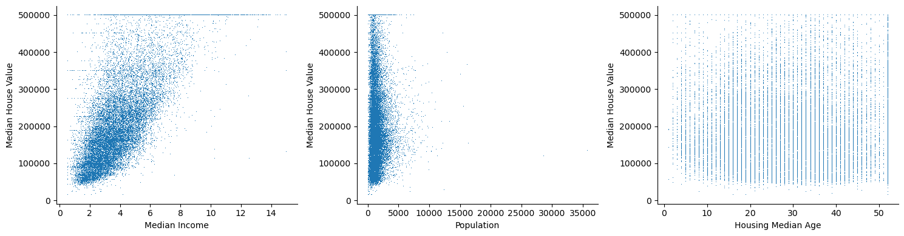
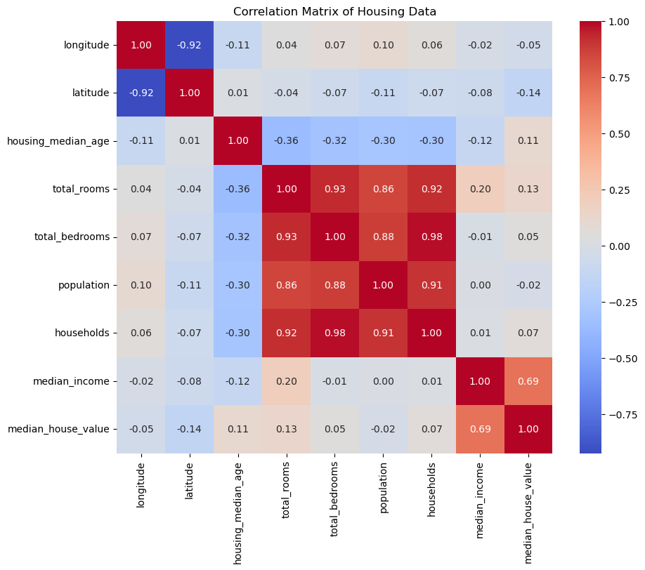
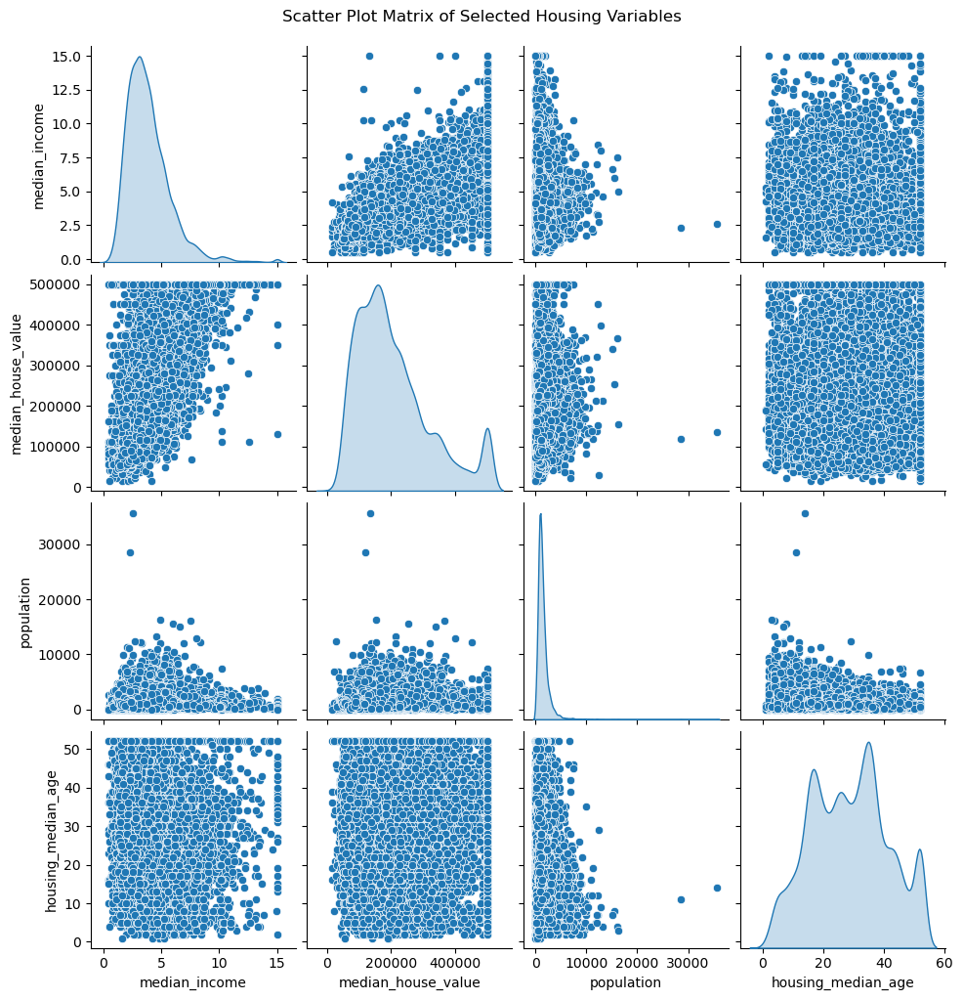
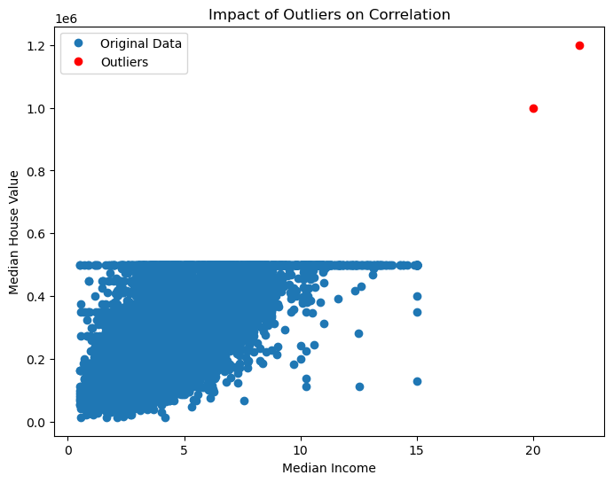

# 교란 개관: 상관, 인과, 교란

## 상관과 인과

**상관**은 두 변수 사이 선형관계의 강도와 방향을 재며 상관계수($-1$에서 $1$)로 수치화한다. **인과**는 한 변수의 변화가 다른 변수의 변화를 직접 일으킨다는 뜻이다.

**핵심 구별**: 상관만으로는 인과를 말할 수 없다. 두 변수가 상관되는 것은 직접적인 인과관계 때문일 수도, 역방향 인과 때문일 수도, 둘 모두에 영향을 주는 바탕의 제3 변수 때문일 수도 있다.

---

## 교란의 역할

**교란요인**은 독립변수와 종속변수 모두와 관련된 외부 변수이다. 둘 사이에 관계가 있다는 잘못된 인상을 만들어 인과에 대한 해석을 오도할 수 있다.

**고전적인 예 — 아이스크림과 익사**:
아이스크림 판매량과 익사 사고 사이에는 상관이 있다. 처음에는 아이스크림을 먹으면 익사한다고 보일 수 있다. 진짜 교란요인은 **기온**이다. 기온이 높으면 아이스크림 판매도 늘고 수영 활동도 늘어 익사 사고가 많아진다. 아이스크림 판매와 익사의 상관은 기온의 교란 효과가 만든 허위상관이다.

### 교란의 식별과 대처

1. **통제변수**: 통계 분석에서 다중회귀 같은 기법으로 교란변수를 통제하여 독립변수가 종속변수에 미치는 효과를 분리한다.

2. **실험 설계**: 무작위 대조 시험(RCT)은 대상을 무작위로 집단에 배정하여 교란요인의 효과를 균형 있게 만들어 교란을 완화한다.

3. **종단 연구**: 변수들을 시간에 걸쳐 추적하면 한 변수의 변화가 다른 변수에 어떤 영향을 주는지 관찰할 수 있어, 교란을 고려하면서 인과를 확립하는 데 도움이 된다.

---

<div class="exbox" markdown>

**보기 1.** 학력과 소득.

- **관측**: 어떤 연구에서 높은 학력과 높은 소득 사이에 강한 상관을 발견했다.
- **처음의 해석**: 높은 학력이 높은 소득을 일으킨다.
- **교란요인**: **사회경제적 배경** — 사회경제적 배경이 좋은 개인은 더 나은 교육을 받을 수 있고 소득도 높은 경향이 있다.
- **대처 방법**: 분석에서 사회경제적 지위를 통제한다. 가정 배경을 통제한 연구들은 학력이 소득에 양의 영향을 주지만 그 효과가 가정의 사회경제적 지위에 의해 조절됨을 보여준다.

</div>

<div class="exbox" markdown>

**보기 2.** 비타민 섭취와 암 위험.

- **관측**: 비타민 보충제를 먹는 사람의 암 위험이 낮다.
- **처음의 해석**: 비타민 보충제가 암 위험을 줄인다.
- **교란요인**: **건강을 의식하는 행동** — 비타민을 먹는 사람은 전반적으로 건강을 더 의식하여 다른 건강한 행동(운동, 균형 잡힌 식사, 금연)도 함께 한다.
- **대처 방법**: 다른 건강 행동을 통제하여 비타민 섭취가 암 위험에 미치는 효과를 분리한다. 전반적인 건강 행동을 반영한 연구들은 비타민만으로는 암 위험과의 관계가 처음 관측된 만큼 강하지 않다는 결과를 흔히 얻는다.

</div>

<div class="exbox" markdown>

**보기 3.** 커피 소비와 심장질환.

- **관측**: 커피를 많이 마시는 것이 심장질환 발생 증가와 상관된다.
- **처음의 해석**: 커피가 심장질환을 일으킨다.
- **교란요인**: **흡연** — 커피를 마시는 사람이 담배를 피울 가능성이 더 높고, 흡연은 알려진 심장질환 위험요인이다.
- **대처 방법**: 분석에서 흡연을 통제하여 커피 소비가 독립적으로 심장질환 위험에 영향을 주는지 판정한다.

</div>

<div class="exbox" markdown>

**보기 4.** 운동과 체중 감량.

- **관측**: 규칙적으로 운동하는 사람이 체중을 줄이는 경향이 있다.
- **처음의 해석**: 운동이 체중 감량을 일으킨다.
- **교란요인**: **식습관** — 규칙적으로 운동하는 사람이 더 건강한 식사를 할 수 있다.
- **대처 방법**: 식습관(열량 섭취와 식단의 질)을 통제한다. 통제하면 운동과 체중 감량의 관계가 더 뚜렷해지며 운동과 식습관이 모두 중요한 역할을 함이 드러난다.

</div>

<div class="exbox" markdown>

**보기 5.** 업무 성과와 급여.

- **관측**: 성과가 좋은 직원이 급여를 더 많이 받는다.
- **처음의 해석**: 좋은 업무 성과가 높은 급여로 이어진다.
- **교란요인**: **경력과 근속** — 경력이 많은 직원은 성과도 좋고 연공에 따라 급여도 높을 수 있다.
- **대처 방법**: 경력 연수와 근속 기간을 통제하여 성과가 급여에 미치는 직접 효과를 정확히 평가한다.

</div>

<div class="exbox" markdown>

**보기 6.** 아이스크림 판매와 익사 사고.

- **관측**: 아이스크림 판매가 많을수록 익사 사고가 늘어나는 상관이 있다.
- **처음의 해석**: 아이스크림을 먹으면 익사 위험이 높아질 수 있다.
- **교란요인**: **기온** — 더운 날씨에 두 변수가 모두 증가한다.
- **대처 방법**: 기온을 분석하고 통제하면 아이스크림 판매와 익사 사고의 겉보기 상관이 사라지고, 진짜 연결은 아이스크림이 아니라 기온과의 관계임이 드러난다.

</div>

<div class="codebox" markdown>

### 예제 1. 주택 자료 { .eg }

캘리포니아 주택 자료는 상관과 잠재적 교란 관계를 탐색하는 실습 예제를 제공한다.

```python
import os
import tarfile
import urllib.request
import pandas as pd
import matplotlib.pyplot as plt

DOWNLOAD_ROOT = "https://raw.githubusercontent.com/ageron/handson-ml2/master/"
HOUSING_PATH = os.path.join("datasets", "housing")
HOUSING_URL = DOWNLOAD_ROOT + "datasets/housing/housing.tgz"

def fetch_housing_data(housing_url=HOUSING_URL, housing_path=HOUSING_PATH):
    if not os.path.isdir(housing_path):
        os.makedirs(housing_path)
    tgz_path = os.path.join(housing_path, "housing.tgz")
    urllib.request.urlretrieve(housing_url, tgz_path)
    with tarfile.open(tgz_path) as housing_tgz:
        housing_tgz.extractall(path=housing_path)

def load_housing_data(housing_path=HOUSING_PATH):
    csv_path = os.path.join(housing_path, "housing.csv")
    return pd.read_csv(csv_path)

def plot_housing_data(df):
    fig, (ax0, ax1, ax2) = plt.subplots(1, 3, figsize=(15, 4))

    ax0.plot(df.median_income, df.median_house_value, ',')
    ax0.set_xlabel("Median Income")

    ax1.plot(df.population, df.median_house_value, ',')
    ax1.set_xlabel("Population")

    ax2.plot(df.housing_median_age, df.median_house_value, ',')
    ax2.set_xlabel("Housing Median Age")

    for ax in (ax0, ax1, ax2):
        ax.set_ylabel("Median House Value")
        ax.spines['top'].set_visible(False)
        ax.spines['right'].set_visible(False)

    plt.tight_layout()
    plt.show()

def main():
    fetch_housing_data()
    df = load_housing_data()
    plot_housing_data(df)

if __name__ == "__main__":
    main()
```



세 산점도 중 첫 번째(소득 대 집값)만 뚜렷한 양의 관계를 보인다. 오른쪽 위 모서리에 값이 잘린 자국이 보이는데, 집값이 500,001달러에서 절단된 자료이기 때문이다.

#### 실습 1: 상관계수 계산

**목표**: `median_house_value`와 다른 변수들 사이의 Pearson 상관계수를 계산한다.

```python
import pandas as pd

def calculate_correlations(df):
    income_corr = df['median_income'].corr(df['median_house_value'])
    population_corr = df['population'].corr(df['median_house_value'])
    age_corr = df['housing_median_age'].corr(df['median_house_value'])

    print(f"Correlation (Median Income vs House Value):      {income_corr:.4f}")
    print(f"Correlation (Population vs House Value):         {population_corr:.4f}")
    print(f"Correlation (Housing Median Age vs House Value): {age_corr:.4f}")

if __name__ == "__main__":
    df = load_housing_data()
    calculate_correlations(df)
```

출력:

```
Correlation (Median Income vs House Value):      0.6881
Correlation (Population vs House Value):         -0.0246
Correlation (Housing Median Age vs House Value): 0.1056
```

소득과 집값의 상관은 0.69로 뚜렷하지만 인구수나 주택 연령은 집값과 사실상 무상관이다. 상관행렬을 보면 어느 변수부터 들여다볼지 정할 수 있다.

#### 실습 2: 상관 열지도

**목표**: 모든 수치형 변수 사이의 상관을 시각화한다.

```python
import seaborn as sns
import matplotlib.pyplot as plt

def plot_correlation_heatmap(df):
    # numeric_only=True가 없으면 문자열 열(ocean_proximity) 때문에 예외가 난다.
    # pandas 2부터 비수치 열을 조용히 건너뛰지 않는다.
    corr_matrix = df.corr(numeric_only=True)
    plt.figure(figsize=(10, 8))
    sns.heatmap(corr_matrix, annot=True, cmap="coolwarm", fmt=".2f")
    plt.title("Correlation Matrix of Housing Data")
    plt.show()

if __name__ == "__main__":
    df = load_housing_data()
    plot_correlation_heatmap(df)
```



median_income과 median_house_value 사이의 0.69가 가장 두드러진다. 나머지 변수들은 집값과 거의 무상관이다.

#### 실습 3: 산점도 행렬

**목표**: 쌍별 관계를 시각화하는 쌍 그림을 만든다.

```python
import seaborn as sns
import matplotlib.pyplot as plt

def plot_scatter_matrix(df):
    selected = ['median_income', 'median_house_value', 'population', 'housing_median_age']
    sns.pairplot(df[selected], diag_kind="kde")
    plt.suptitle("Scatter Plot Matrix of Selected Housing Variables", y=1.02)
    plt.show()

if __name__ == "__main__":
    df = load_housing_data()
    plot_scatter_matrix(df)
```



변수 쌍마다 산점도를 그려 어떤 관계가 선형이고 어떤 것이 아닌지 확인한다.

#### 실습 4: 이상점이 상관에 미치는 영향

**목표**: 이상점이 상관에 어떤 영향을 주는지 살펴본다.

```python
import pandas as pd
import matplotlib.pyplot as plt

def add_outliers(df):
    outliers = pd.DataFrame({
        'median_income': [20, 22],
        'median_house_value': [1000000, 1200000]
    })
    df_with_outliers = pd.concat([df, outliers], ignore_index=True)

    original_corr = df['median_income'].corr(df['median_house_value'])
    new_corr = df_with_outliers['median_income'].corr(df_with_outliers['median_house_value'])

    print(f"Original Correlation: {original_corr:.4f}")
    print(f"New Correlation with Outliers: {new_corr:.4f}")

    plt.figure(figsize=(8, 6))
    plt.plot(df['median_income'], df['median_house_value'], 'o', label='Original Data')
    plt.plot(outliers['median_income'], outliers['median_house_value'], 'ro', label='Outliers')
    plt.xlabel('Median Income')
    plt.ylabel('Median House Value')
    plt.legend()
    plt.title("Impact of Outliers on Correlation")
    plt.show()

if __name__ == "__main__":
    df = load_housing_data()
    add_outliers(df)
```

출력:

```
Original Correlation: 0.6881
New Correlation with Outliers: 0.6901
```



이상점 몇 개를 더해도 상관이 0.6881에서 0.6901로 거의 변하지 않는다. $n = 20{,}640$이라 몇 점의 영향이 묽어지기 때문이다. 이상점의 위력은 표본크기에 반비례한다.

#### 실습 5: 상관과 인과에 대한 토론

**목표**: `median_income`과 `median_house_value` 사이의 높은 상관이 왜 반드시 인과를 뜻하지는 않는지 토론한다.

**논의할 점**:

- **교란변수**: 입지의 선호도, 일자리, 교육 시설이 소득과 주택 가격 모두에 영향을 줄 수 있다.
- **역인과**: 소득이 높아 주택 가격이 오르는가, 아니면 비싼 지역이 고소득 거주자를 끌어들이는가?
- **제3의 변수 문제**: 지역의 경제 발전, 지방 정책, 지리적 요인이 두 변수에 동시에 영향을 줄 수 있다.

</div>

## 요약

교란변수는 변수들 사이 관계의 참모습을 가려 인과에 대한 잘못된 결론으로 이어질 수 있다. 교란요인을 식별하고 통제해야 관심 변수의 참 효과를 분리해 이해할 수 있다.

---

## 추가 실습

### 실습: 교란요인 찾기

겉보기 상관이 있는 연구 결과(예: 화면 사용 시간과 수면의 질, 소셜 미디어 사용과 정신 건강)를 제시하고, 잠재적 교란변수를 찾아 어떻게 통제할 수 있을지 논하라.

### 실습: 실험 설계하기

독서와 학업 성취 사이의 상관이 주어졌을 때, 사회경제적 지위와 이전 학업 성취 같은 교란요인을 통제하면서 인과관계를 검정할 실험을 설계하라.

### 실습: 실제 자료 분석하기

운동, 식습관, 체중 감량, 스트레스 수준 같은 변수가 있는 자료로 상관 분석을 수행한 뒤 다중회귀로 잠재적 교란요인을 통제하라.

## 연습문제

<div class="drillbox" markdown>

**연습문제 1.**
어떤 연구에서 아이스크림 판매와 익사 사망이 양의 상관($r = 0.85$)을 보였다. 가장 그럴듯한 교란요인을 밝히고 그것이 허위 연관을 만드는 기제를 설명하라.

</div>

??? success "풀이"
    가장 그럴듯한 교란요인은 **기온(또는 계절)**이다. 여름철에는 기온이 높아 아이스크림 소비도 늘고 수영하는 사람도 많아져 익사 사망이 늘어난다. 아이스크림 판매와 익사의 상관은 **허위**이다. 하나가 다른 하나를 일으켜서가 아니라 두 변수가 같은 바탕 원인(기온)에 이끌리기 때문에 생긴다.

    형식적으로 $Z$ = 기온, $X$ = 아이스크림 판매, $Y$ = 익사 사망이라 하면 $Z \to X$이고 $Z \to Y$이지만 직접 경로 $X \to Y$는 없다.

<div class="drillbox" markdown>

**연습문제 2.**
다중회귀 모형에서 학력 통제변수를 추가하자 건강 결과에 대한 소득의 계수가 $\hat{\beta} = 0.45$에서 $\hat{\beta} = 0.12$로 줄었다. 이 변화를 교란의 관점에서 해석하라.

</div>

??? success "풀이"
    큰 감소(0.45에서 0.12로)는 소득과 건강의 관계에서 **학력이 교란요인**임을 나타낸다. 학력은 소득에도(학력이 높으면 소득이 높다) 건강에도(학력이 높으면 건강 행동과 결과가 좋다) 영향을 준다.

    조정하지 않은 계수(0.45)는 직접효과와 소득–학력 경로를 통한 간접효과를 함께 담고 있으므로 소득이 건강에 미치는 직접 효과를 과대추정한다. 학력을 통제한 뒤 남은 계수(0.12)는 학력이 아닌 경로로 작동하는 소득의 효과를 더 정확히 추정한 값이다.

<div class="drillbox" markdown>

**연습문제 3.**
교란변수와 매개변수의 차이를 설명하라. 회귀모형에 어떤 변수를 넣을지 결정할 때 둘을 구별하는 일이 왜 중요한가?

</div>

??? success "풀이"
    **교란요인**은 처치와 결과 모두를 일으켜 허위 연관을 만드는 변수이다. 교란요인을 통제하면 편향이 제거되고 참 인과효과가 드러난다.

    **매개자**는 처치와 결과 사이의 인과 경로 위에 있는 변수이다($X \to M \to Y$). 매개자를 통제하면 참 인과효과의 일부가 제거되어 총효과를 과소추정하게 된다.

    이 구별이 중요한 이유는 이렇다. 교란요인 통제는 타당한 인과추론에 **필수적**이지만, 총효과를 추정하는 것이 목표라면 매개자 통제는 **해롭다**. 예를 들어 운동이 대사 증가를 통해 부분적으로 체중 감량에 영향을 준다면($\text{운동} \to \text{대사} \to \text{체중 감량}$), 대사를 통제하면 실제 인과 경로가 제거되어 운동의 이득을 과소추정하게 된다.

<div class="drillbox" markdown>

**연습문제 4.**
Simpson의 역설은 집계 자료의 경향이 교란변수로 자료를 나누면 뒤집히는 현상이다. 처치가 둘, 하위집단이 둘일 때 치료 A의 전체 성공률이 더 높지만 모든 하위집단 안에서는 치료 B의 성공률이 더 높은 간단한 수치 예를 구성하라.

</div>

??? success "풀이"
    | | 하위집단 1(쉬운 사례) | 하위집단 2(어려운 사례) | 전체 |
    |---|---|---|---|
    | 치료 A | 87/100 (87%) | 4/10 (40%) | 91/110 (82.7%) |
    | 치료 B | 9/10 (90%) | 55/100 (55%) | 64/110 (58.2%) |

    하위집단 1에서는 B(90%) > A(87%)이고, 하위집단 2에서도 B(55%) > A(40%)이다. 그러나 전체로는 A(82.7%) > B(58.2%)이다.

    치료 A가 쉬운 사례에 불균형하게 많이 적용되어(110건 중 100건) 전체 성공률이 부풀려졌기 때문에 역설이 생긴다. 하위집단(사례의 난이도)이 교란요인이다.

---

## 정리하며

상관이 인과가 아닌 **세 가지 이유**가 있다.

- **직접 인과**($X\to Y$), **역인과**($Y\to X$), **공통원인**($X\leftarrow Z\to Y$). 관측된 상관 하나로는 이 셋을 구별할 수 없다.
- **교란요인은 둘 모두와 관련되면서 인과 경로 위에 있지 않다.** 아이스크림과 익사 사이의 기온이 그렇다. 연관 자체는 실재하지만 인과적 해석이 틀린 것이다.
- **1장의 구별이 그대로 적용된다.** 인과 경로 위의 변수는 매개변수라 통제하면 안 되고, 공통 결과인 충돌변수는 통제하면 **없던 연관을 만든다.**
- **자료를 더 모아도 해결되지 않는다.** $n$ 을 늘리면 허위 연관의 추정이 더 정밀해질 뿐이다.
- **생태학적 오류**는 집단 수준의 상관을 개인 수준으로 옮길 때 생긴다. 집단에서 성립한 관계가 개인에게는 성립하지 않거나 방향이 뒤집힐 수 있다.

다음 절 **교란과 인과 시연**에서 이를 모의실험으로 확인한다.
