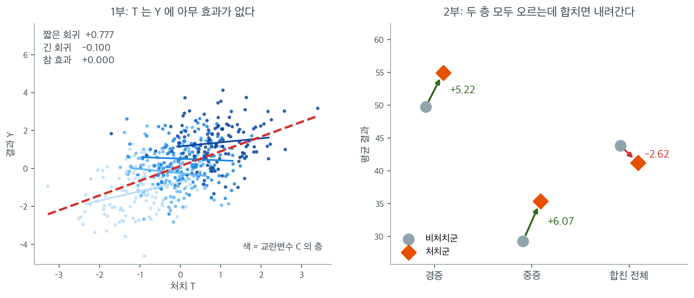
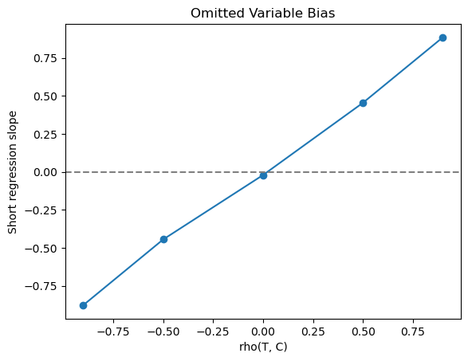

# 교란과 인과 시연

## 개요

이 페이지는 교란변수가 어떻게 허위상관을 만들어 내는지, 그리고 Simpson의 역설이 어떻게 처치효과의 겉보기 방향을 뒤집는지 보인다. 두 가지 상황을 모의로 만든다. 하나는 숨은 공통원인이 오도하는 연관을 만들어 내는 교란된 회귀이고, 다른 하나는 소박한 추정값의 부호가 아예 반대로 나오는 처치효과 분석이다.

---

## 1부: 교란된 회귀

### 자료생성과정

$C$가 교란변수, $T$가 처치, $Y$가 결과인 유향비순환그래프 $T \leftarrow C \rightarrow Y$를 생각하자. 처치 $T$는 $Y$에 **아무런 인과효과가 없으며**, 모든 연관은 $C$를 통해 흐른다.

다음에서 자료를 생성한다.

$$
\begin{pmatrix} T \\ C \end{pmatrix} \sim \mathcal{N}\!\left(\begin{pmatrix} 0 \\ 0 \end{pmatrix}, \begin{pmatrix} 1 & \rho_{TC} \\ \rho_{TC} & 1 \end{pmatrix}\right), \qquad Y = C + \varepsilon, \quad \varepsilon \sim \mathcal{N}(0, 1)
$$

$Y$는 오직 $C$에만 의존하므로 $T$가 $Y$에 미치는 참 인과효과는 0이다.

<div class="exbox" markdown>

**보기 1.** <span class="diff easy" title="쉬움"></span> 참 효과가 0인데 상관은 얼마나 커지는가. 위 자료생성과정에서 $\rho_{TC} = 0.8$, $\varepsilon \sim \mathcal{N}(0,1)$ 이다.

**(1)** $\operatorname{Corr}(T, Y)$ 의 **모집단 값**을 닫힌 꼴로 구하시오. 표본값 $0.5282$ 가 그 값과 맞는가.

**(2)** 교란만으로 겉보기 상관을 $1$ 에 얼마나 가깝게 만들 수 있는가. $\rho_{TC}$ 를 $1$ 까지 올려도 넘을 수 없는 상한이 있는가.

</div>

??? success "풀이"

    **(1) 공분산은 $C$ 를 타고만 흐른다.** $Y = C + \varepsilon$ 이고 $\varepsilon$ 이 $T$ 와 독립이므로

    $$
    \operatorname{Cov}(T, Y) = \operatorname{Cov}(T, C) + \operatorname{Cov}(T, \varepsilon) = \rho_{TC} + 0 = 0.8
    $$

    이다. 분산은 $\operatorname{Var}(T) = 1$ 이고

    $$
    \operatorname{Var}(Y) = \operatorname{Var}(C) + \operatorname{Var}(\varepsilon) = 1 + 1 = 2
    $$

    이므로

    $$
    \operatorname{Corr}(T, Y) = \frac{\rho_{TC}}{\sqrt{1 + \sigma_\varepsilon^2}} = \frac{0.8}{\sqrt2} = 0.565685
    $$

    이다. 표본값 $0.5282$ 와 견주면 $\operatorname{SE}(r) \approx (1-\rho^2)/\sqrt{n} = (1 - 0.32)/\sqrt{500} = 0.0304$ 이므로

    $$
    z = \frac{0.5282 - 0.5657}{0.0304} = -1.231
    $$

    로 맞는다. $\operatorname{corr}(T,C)$ 쪽도 $0.7908$ 대 $0.8$ 로 $z = -0.574$ 다.

    **(2) 상한은 $1/\sqrt{1+\sigma_\varepsilon^2}$ 이다.** 식을 보면 $\rho_{TC}$ 는 분자에만 들어가므로 $\rho_{TC} \to 1$ 에서 최대가 되고, 그 값이

    $$
    \max_{\rho_{TC}} \operatorname{Corr}(T, Y) = \frac{1}{\sqrt{1 + \sigma_\varepsilon^2}}
    $$

    이다. 여기서는 $\sigma_\varepsilon = 1$ 이라 $1/\sqrt2 = 0.7071$ 을 넘을 수 없다. 교란변수를 아무리 강하게 걸어도 $T$ 와 $Y$ 의 상관은 $0.71$ 에서 막힌다.

    | $\sigma_\varepsilon$ | 상한 |
    |---|---|
    | $0.5$ | $0.8944$ |
    | $1.0$ | $0.7071$ |
    | $2.0$ | $0.4472$ |
    | $3.0$ | $0.3162$ |

    **이 상한은 교란의 세기가 아니라 $Y$ 안의 잡음이 정한다.** $Y$ 가 $C$ 로 거의 다 설명되는 변수라면($\sigma_\varepsilon$ 이 작으면) 교란만으로도 $r \approx 1$ 을 만들 수 있다. 그러므로 **"상관이 $0.95$ 나 되는데 인과가 아닐 리 없다"는 추론은 성립하지 않는다.**

    ```python
    import numpy as np
    from scipy import stats

    np.random.seed(42)


    def simulate_confounded_data(n=500, rho_tc=0.8):
        mean = [0, 0]
        cov = [[1, rho_tc], [rho_tc, 1]]
        tc = np.random.multivariate_normal(mean, cov, n)
        t = tc[:, 0]
        c = tc[:, 1]
        # Y는 오직 C에만 의존한다. T가 Y에 미치는 참 효과는 정확히 0이다.
        y = c + np.random.normal(0, 1, n)
        return t, c, y


    t, c, y = simulate_confounded_data()
    print(f"corr(T, C) = {np.corrcoef(t, c)[0, 1]:.4f}")
    print(f"corr(T, Y) = {np.corrcoef(t, y)[0, 1]:.4f}   (참 인과효과는 0)")

    # 닫힌 꼴과 견준다.
    n, rho_tc, sigma = len(t), 0.8, 1.0
    for lab, pop, samp in [("corr(T,C)", rho_tc, np.corrcoef(t, c)[0, 1]),
                           ("corr(T,Y)", rho_tc / np.sqrt(1 + sigma**2),
                            np.corrcoef(t, y)[0, 1])]:
        se = (1 - pop**2) / np.sqrt(n)
        print(f"\n{lab}: 모집단 {pop:.6f}  표본 {samp:.4f}  "
              f"SE {se:.4f}  z {(samp - pop) / se:+.3f}")

    print(f"\n교란만으로 만들 수 있는 상관의 상한 = 1/sqrt(1+sigma^2)")
    for s in (0.5, 1.0, 2.0, 3.0):
        print(f"  sigma = {s:.1f}  ->  {1 / np.sqrt(1 + s**2):.4f}")
    ```

    출력:

    ```
    corr(T, C) = 0.7908
    corr(T, Y) = 0.5282   (참 인과효과는 0)

    corr(T,C): 모집단 0.800000  표본 0.7908  SE 0.0161  z -0.574

    corr(T,Y): 모집단 0.565685  표본 0.5282  SE 0.0304  z -1.231

    교란만으로 만들 수 있는 상관의 상한 = 1/sqrt(1+sigma^2)
      sigma = 0.5  ->  0.8944
      sigma = 1.0  ->  0.7071
      sigma = 2.0  ->  0.4472
      sigma = 3.0  ->  0.3162
    ```

    두 $z$ 값이 모두 $\lvert z \rvert < 2$ 이므로 닫힌 꼴과 표본이 맞는다. $T$ 와 $Y$ 의 상관이 $0.53$ 이나 되지만 **$T$ 는 $Y$ 에 아무 영향도 주지 않는다.** 오직 $C$ 를 공유할 뿐이다.

### 짧은 회귀와 긴 회귀

**짧은 회귀**($C$를 빠뜨린 회귀)는 $Y$를 $T$에만 회귀시킨다.

$$
Y = \alpha + \beta_T^{\text{short}} T + u
$$

**긴 회귀**($C$를 통제한 회귀)는 교란변수를 포함한다.

$$
Y = \alpha + \beta_T^{\text{long}} T + \beta_C C + u
$$

<div class="exbox" markdown>

**보기 2.** <span class="diff easy" title="쉬움"></span> 누락변수 편향을 항등식으로 쪼개기. 짧은 회귀는 $\beta_T^{\text{short}} = 0.7772$, 긴 회귀는 $\beta_T^{\text{long}} = -0.1000$, $\beta_C^{\text{long}} = 1.0915$ 를 준다.

**(1)** 두 기울기의 **모집단 값**을 각각 구하시오.

**(2)** 누락변수 편향 공식

$$
\beta_T^{\text{short}} = \beta_T^{\text{long}} + \delta \gamma
$$

에서 $\delta$ 와 $\gamma$ 가 무엇인지 적고, 표본에서 이 식이 **근사가 아니라 항등식**임을 확인하시오.

</div>

??? success "풀이"

    **(1) 둘 다 손으로 적을 수 있다.** 짧은 회귀의 기울기는 단순회귀 공식 그대로다.

    $$
    \beta_T^{\text{short}} = \frac{\operatorname{Cov}(T, Y)}{\operatorname{Var}(T)} = \frac{0.8}{1} = 0.8
    $$

    긴 회귀의 $T$ 계수는 $C$ 를 고정한 채 본 $T$ 의 효과인데, 자료생성과정에서 $Y = C + \varepsilon$ 이고 $\varepsilon \perp (T, C)$ 이므로 $C$ 를 고정하면 $T$ 는 $Y$ 에 **아무 정보도 주지 않는다.** 따라서

    $$
    \beta_T^{\text{long}} = 0,
    \qquad
    \beta_C^{\text{long}} = 1
    $$

    이다. 표본값 $0.7772$, $-0.0999$, $1.0915$ 가 각각 $0.8$, $0$, $1$ 의 추정이다.

    **(2) $\delta$ 는 긴 회귀의 $C$ 계수, $\gamma$ 는 빠뜨린 $C$ 를 $T$ 에 회귀한 기울기다.** 모집단에서는

    $$
    \gamma = \frac{\operatorname{Cov}(T,C)}{\operatorname{Var}(T)} = 0.8,
    \qquad
    \delta = 1
    \qquad\Longrightarrow\qquad
    \beta_T^{\text{short}} = 0 + 1 \times 0.8 = 0.8
    $$

    로 (1)과 맞는다. **편향 $\delta\gamma$ 의 두 요소가 각각 "$C$ 가 $Y$ 에 얼마나 세게 들어가는가"와 "$C$ 가 $T$ 와 얼마나 얽혀 있는가"다.** 둘 중 하나라도 $0$ 이면 편향이 사라진다. 이것이 교란의 정의 — $C \to T$, $C \to Y$ 두 화살표가 **모두** 있어야 한다 — 를 수로 적은 것이다.

    표본에서도 이 식은 **최소제곱의 대수적 항등식**이라 근사가 아니다. 실제로

    $$
    0.777199 = -0.099974 + 1.091524 \times 0.803622
    $$

    이고 두 변의 차이가 $0$ 이다(부동소수점 오차조차 없다).

    ```python
    def compute_regressions(t, c, y):
        """교란변수를 빼고 넣은 두 회귀를 나란히 돌린다.

        짧은 회귀는 T 만 넣고, 긴 회귀는 C 까지 넣는다. 참 효과가 0 인데도
        짧은 회귀의 계수가 크게 나오는 것이 누락변수 편향이다.
        """
        # 짧은 회귀: Y ~ T
        slope_short, _, r_short, p_short, _ = stats.linregress(t, y)

        # 긴 회귀: Y ~ T + C. 절편을 위해 1 로 된 열을 앞에 붙인다.
        X = np.column_stack([np.ones(len(t)), t, c])
        beta = np.linalg.lstsq(X, y, rcond=None)[0]

        return {
            "short_slope": slope_short,
            "short_p": p_short,
            "long_beta_T": beta[1],
            "long_beta_C": beta[2],
        }


    res = compute_regressions(t, c, y)
    print(f"short_slope  = {res['short_slope']:>8.4f}   (p = {res['short_p']:.1e})")
    print(f"long_beta_T  = {res['long_beta_T']:>8.4f}")
    print(f"long_beta_C  = {res['long_beta_C']:>8.4f}")

    # 누락변수 편향 항등식을 확인한다.
    gamma = stats.linregress(t, c).slope      # 빠뜨린 C 를 T 에 회귀한 기울기
    delta = res["long_beta_C"]                # 긴 회귀의 C 계수
    rhs = res["long_beta_T"] + delta * gamma
    print(f"\n모집단 값: short = 0.8,  long = 0,  delta = 1,  gamma = 0.8")
    print(f"표본  gamma = {gamma:.6f},  delta = {delta:.6f}")
    print(f"  long + delta*gamma = {res['long_beta_T']:.6f} + "
          f"{delta:.6f}*{gamma:.6f} = {rhs:.6f}")
    print(f"  short              = {res['short_slope']:.6f}")
    print(f"  두 변의 차         = {abs(res['short_slope'] - rhs):.2e}")
    ```

    출력:

    ```
    short_slope  =   0.7772   (p = 2.8e-37)
    long_beta_T  =  -0.1000
    long_beta_C  =   1.0915

    모집단 값: short = 0.8,  long = 0,  delta = 1,  gamma = 0.8
    표본  gamma = 0.803622,  delta = 1.091524
      long + delta*gamma = -0.099974 + 1.091524*0.803622 = 0.777199
      short              = 0.777199
      두 변의 차         = 0.00e+00
    ```

    **항등식의 두 변이 비트 단위로 같다.** 세 표본값 $0.7772$, $-0.0999$, $1.0915$ 가 각각 모집단 값 $0.8$, $0$, $1$ 의 추정이다. 참 효과가 정확히 $0$ 이므로 짧은 회귀가 보고하는 $0.7772$ 는 **전부 편향**이고, 그 거의 전부가 $\delta\gamma = 1.0915 \times 0.8036 = 0.8772$ 라는 한 곱에서 나온다.

    $T$ 에 아무런 인과효과가 없는데도 짧은 회귀는 $\beta_T^{\text{short}} = 0.777$ 이라는 압도적으로 유의한 기울기를 내놓는다($p = 2.8\times10^{-37}$). **p-값은 편향을 알아채지 못한다.** 표본을 키우면 $p$ 는 더 작아지고 추정값은 참값이 아니라 $0.8$ 로 수렴한다.

### 부분회귀(Frisch-Waugh-Lovell)

이와 동등한 방법으로, $T$와 $Y$를 각각 $C$에 회귀시켜 잔차를 얻은 뒤 그 잔차끼리 회귀시킬 수 있다.

$$
e_T = T - \hat{\gamma}_1 C, \qquad e_Y = Y - \hat{\gamma}_2 C
$$

$$
\beta_T^{\text{long}} = \frac{\text{Cov}(e_T, e_Y)}{\text{Var}(e_T)}
$$

<div class="exbox" markdown>

**보기 3.** <span class="diff easy" title="쉬움"></span> "통제한다"는 말이 실제로 하는 일. $T$ 와 $Y$ 를 각각 $C$ 에 회귀시켜 잔차 $e_T$, $e_Y$ 를 얻고 그 잔차끼리 회귀한다.

**(1)** 이 기울기가 왜 긴 회귀의 $\beta_T^{\text{long}}$ 과 **같을 수밖에 없는지** 잔차의 직교성으로 설명하시오.

**(2)** 같은 논리라면 $e_Y$ 대신 **원래의 $Y$** 를 $e_T$ 에 회귀시켜도 같은 값이 나와야 한다. 맞는가. 세 값을 소수 여섯째 자리까지 견주시오.

</div>

??? success "풀이"

    **(1) 핵심은 $e_T \perp C$ 라는 한 줄이다.** 최소제곱의 정의상 $T$ 를 $C$ 에 회귀한 잔차 $e_T$ 는 $C$ 와 표본상관이 $0$ 이다. 이제 $Y$ 를 $(C,\, e_T)$ 두 설명변수에 회귀한다고 하자. 두 설명변수가 **직교하므로** 다중회귀가 단순회귀 둘로 쪼개지고

    $$
    \hat\beta_{e_T} = \frac{\operatorname{Cov}(e_T,\, Y)}{\operatorname{Var}(e_T)}
    $$

    가 된다. 한편 $T = \hat\gamma_1 C + e_T$ 이므로 $(C, T)$ 가 펼치는 공간과 $(C, e_T)$ 가 펼치는 공간은 **같다.** 같은 공간에 사영한 결과는 하나뿐이고, 그 안에서 $T$ 의 계수와 $e_T$ 의 계수가 일치한다. 따라서

    $$
    \beta_T^{\text{long}} = \frac{\operatorname{Cov}(e_T,\, Y)}{\operatorname{Var}(e_T)}
    $$

    이다. 이것이 **Frisch–Waugh–Lovell 정리**다. 수치적 우연이 아니라 **사영의 항등식**이므로 자료가 무엇이든 성립한다.

    **(2) 맞는다. $e_Y$ 를 써도 되고 $Y$ 를 그대로 써도 된다.** $Y = e_Y + \hat\gamma_2 C$ 인데 $e_T \perp C$ 이므로

    $$
    \operatorname{Cov}(e_T,\, Y) = \operatorname{Cov}(e_T,\, e_Y) + \hat\gamma_2 \underbrace{\operatorname{Cov}(e_T,\, C)}_{=\,0}
    = \operatorname{Cov}(e_T,\, e_Y)
    $$

    이다. **$Y$ 에서 $C$ 몫을 빼든 안 빼든 $e_T$ 와의 공분산은 같다.** 그러므로 $Y$ 쪽을 굳이 씻어 낼 필요가 없다. 씻어 내는 쪽은 $T$ 하나로 충분하다.

    세 값이 소수 여섯째 자리까지 $-0.099974$ 로 같고, $\operatorname{corr}(e_T, C) = 1.24\times10^{-17}$ 로 직교성도 기계 정밀도까지 확인된다.

    ```python
    # Frisch-Waugh-Lovell 정리: T 와 Y 에서 각각 C 로 설명되는 몫을 걷어 낸 뒤
    # 남은 잔차끼리 회귀하면, 긴 회귀의 T 계수와 똑같은 값이 나온다.
    # "C 를 통제한다"는 말이 실제로 무엇을 하는 일인지 보여 주는 계산이다.
    t_resid = t - stats.linregress(c, t).slope * c
    y_resid = y - stats.linregress(c, y).slope * c
    slope_partial = stats.linregress(t_resid, y_resid).slope
    print(f"slope_partial = {slope_partial:.4f}")

    # (1) 직교성과 (2) Y 를 씻어 내지 않아도 되는지 확인한다.
    print(f"\ncorr(e_T, C) = {np.corrcoef(t_resid, c)[0, 1]:.2e}   (0 이어야 한다)")
    print(f"e_Y 를 e_T 에 회귀  = {stats.linregress(t_resid, y_resid).slope:.6f}")
    print(f"원래 Y 를 e_T 에 회귀 = {stats.linregress(t_resid, y).slope:.6f}")
    print(f"긴 회귀의 beta_T    = {res['long_beta_T']:.6f}")
    print(f"셋이 모두 같은가: "
          f"{np.allclose([stats.linregress(t_resid, y_resid).slope, stats.linregress(t_resid, y).slope], res['long_beta_T'])}")
    ```

    출력:

    ```
    slope_partial = -0.1000

    corr(e_T, C) = 1.24e-17   (0 이어야 한다)
    e_Y 를 e_T 에 회귀  = -0.099974
    원래 Y 를 e_T 에 회귀 = -0.099974
    긴 회귀의 beta_T    = -0.099974
    셋이 모두 같은가: True
    ```

    **세 값이 소수 여섯째 자리까지 같다.** "$C$ 를 통제한다"는 말이 비유가 아니라 **$C$ 방향 성분을 빼고 남은 것끼리만 견준다**는 구체적인 연산임을 보여 준다. 보기 2의 누락변수 편향도 같은 그림에서 읽힌다. $C$ 를 빼먹으면 $T$ 안에 남아 있는 $C$ 방향 성분이 $Y$ 의 $C$ 방향 성분과 짝지어져 기울기로 들어간다.

---

## 2부: Simpson의 역설과 평균처치효과

### 설정

환자에게 이진 중증도 지표가 있다(경증 = 0, 중증 = 1). 중증 환자가 처치를 받을 확률이 더 높다(적응증에 의한 교란).

$$
P(\text{처치} = 1 \mid \text{중증}) = 0.7, \qquad P(\text{처치} = 1 \mid \text{경증}) = 0.3
$$

결과는 중증도와 처치 모두에 의존한다.

$$
Y = 50 - 20 \cdot \text{중증도} + 5 \cdot \text{처치} + \varepsilon, \quad \varepsilon \sim \mathcal{N}(0, 5^2)
$$

참 처치효과는 $+5$이지만, 중증 환자는 전반적으로 결과가 나쁘다.

<div class="exbox" markdown>

**보기 4.** <span class="diff easy" title="쉬움"></span> 소박한 ATE 는 왜 하필 $-3$ 인가. 중증도가 $P(S=1) = 0.5$ 로 반반이고, 처치 확률이 $0.7$ 대 $0.3$ 이며, $Y = 50 - 20S + 5T + \varepsilon$ 이다.

**(1)** 소박한 ATE 와 조정된 ATE 의 **이론값**을 각각 구하시오. 베이즈 정리로 $P(S=1 \mid T=1)$ 과 $P(S=1 \mid T=0)$ 부터 구하면 된다.

**(2)** $n = 1000$ 짜리 모의실험 한 번이 주는 네 값이 이론값과 맞는가. 네 추정량의 표집 표준편차를 재어 판정하시오.

</div>

??? success "풀이"

    **(1) 베이즈 정리 두 줄이면 끝난다.** $P(T=1) = 0.5 \times 0.7 + 0.5 \times 0.3 = 0.5$ 이므로

    $$
    P(S=1 \mid T=1) = \frac{0.5 \times 0.7}{0.5} = 0.7,
    \qquad
    P(S=1 \mid T=0) = \frac{0.5 \times 0.3}{0.5} = 0.3
    $$

    이다. **처치군의 중증 비율이 비처치군의 두 배를 넘는다.** 이제 각 군의 평균 결과를 적으면

    $$
    E[Y \mid T=1] = 50 - 20 \times 0.7 + 5 = 41,
    \qquad
    E[Y \mid T=0] = 50 - 20 \times 0.3 + 0 = 44
    $$

    이므로

    $$
    \text{ATE}_{\text{naive}} = 41 - 44 = -3
    $$

    이다. 일반식으로 쓰면

    $$
    \text{ATE}_{\text{naive}} = \underbrace{5}_{\text{참 효과}} + \underbrace{(-20)\big[P(S{=}1\mid T{=}1) - P(S{=}1\mid T{=}0)\big]}_{\text{교란}}
    = 5 - 20 \times 0.4 = -3
    $$

    로, **참 효과 $+5$ 에 교란 $-8$ 이 얹혀 부호가 뒤집힌다.** 조정된 쪽은 층 안에서 중증도가 고정되므로 두 층 모두 효과가 정확히 $+5$ 이고, 가중평균도

    $$
    \text{ATE}_{\text{adj}} = 0.5 \times 5 + 0.5 \times 5 = 5
    $$

    다.

    **(2) 네 값 모두 맞는다.** 한 번의 모의실험은 $-2.62$, $5.22$, $6.07$, $5.64$ 를 준다. 같은 모의를 $5000$ 번 되풀이해 표집 표준편차를 재면

    | 추정량 | 이론 | 모의 평균 | 표준편차 | 위 한 번 | $z$ |
    |---|---|---|---|---|---|
    | ate_naive | $-3.0$ | $-3.0109$ | $0.6591$ | $-2.6184$ | $+0.579$ |
    | ate_mild | $+5.0$ | $+4.9957$ | $0.4848$ | $+5.2238$ | $+0.462$ |
    | **ate_severe** | $+5.0$ | $+4.9927$ | $0.4909$ | $+6.0716$ | $\mathbf{+2.183}$ |
    | ate_adjusted | $+5.0$ | $+4.9945$ | $0.3385$ | $+5.6400$ | $+1.891$ |

    이다. 모의 평균 넷이 모두 이론값과 소수 둘째 자리까지 맞으므로 **네 추정량이 모두 비편향**이고, 소박한 ATE 가 겨냥하는 값이 $+5$ 가 아니라 $-3$ 임이 확인된다.

    한 번의 값은 셋이 $\lvert z \rvert < 2$ 이고 `ate_severe` 하나가 $+2.18$ 로 조금 크다. 양측 $p \approx 0.03$ 이라 네 개를 보면 이 정도는 나올 만하다. **이 운 나쁜 한 칸이 `ate_adjusted` 를 $5.64$ 까지 밀어 올린 것**이고, $5.64$ 자체도 참값에서 $1.89$ 표준편차라 범위 안이다.

    표준편차를 견주면 층화의 값어치도 보인다. `ate_adjusted` 의 $0.3385$ 는 두 층의 $0.4848$, $0.4909$ 보다 **작다.** 두 층이 서로 다른 환자를 쓰므로 거의 독립이고, 가중평균이 $\sqrt{0.5^2(0.485^2 + 0.491^2)} = 0.345$ 로 줄어들기 때문이다. **층을 나누면 편향이 사라질 뿐 아니라 분산도 줄어든다.**

    ```python
    def simpson_paradox_demo(n=1000):
        """중증도가 치료 배정과 결과를 함께 좌우할 때 생기는 역설을 보인다.

        중증 환자가 치료를 더 많이 받고(0.7 대 0.3), 중증 자체가 결과를 크게
        낮춘다. 그래서 치료가 실제로는 결과를 5 만큼 올리는데도, 층을 나누지
        않고 보면 치료군의 결과가 더 나빠 보인다.
        """
        severity = np.random.binomial(1, 0.5, n)
        p_treat = np.where(severity == 1, 0.7, 0.3)
        treatment = np.random.binomial(1, p_treat)

        y = (50 - 20 * severity + 5 * treatment
             + np.random.normal(0, 5, n))

        # 층을 나누지 않은 순진한 평균처치효과
        ate_naive = y[treatment == 1].mean() - y[treatment == 0].mean()

        # 중증도로 층을 나눠 각 층에서 효과를 구한 뒤, 층의 크기로 가중해 합친다.
        ate_mild = (y[(treatment == 1) & (severity == 0)].mean()
                    - y[(treatment == 0) & (severity == 0)].mean())
        ate_severe = (y[(treatment == 1) & (severity == 1)].mean()
                      - y[(treatment == 0) & (severity == 1)].mean())
        p_severe = severity.mean()
        ate_adjusted = (1 - p_severe) * ate_mild + p_severe * ate_severe

        return ate_naive, ate_mild, ate_severe, ate_adjusted


    # 모의 한 번 돌린 결과
    ate_naive, ate_mild, ate_severe, ate_adjusted = simpson_paradox_demo(1000)
    print(f"ate_naive    = {ate_naive:>6.2f}   (이론 -3)")
    print(f"ate_mild     = {ate_mild:>6.2f}   (이론 +5)")
    print(f"ate_severe   = {ate_severe:>6.2f}   (이론 +5)")
    print(f"ate_adjusted = {ate_adjusted:>6.2f}   (이론 +5)")

    # n = 1000 에서 네 추정량이 얼마나 흔들리는지 재어, 위 한 번의 값을 판정한다.
    reps = np.array([simpson_paradox_demo(1000) for _ in range(5000)])
    theory = [-3.0, 5.0, 5.0, 5.0]
    names = ["ate_naive", "ate_mild", "ate_severe", "ate_adjusted"]
    print(f"\n5000 번 되풀이 (n = 1000)")
    print(f"{'추정량':>14s} {'이론':>6s} {'모의 평균':>10s} {'표준편차':>9s} "
          f"{'위 한 번':>9s} {'z':>7s}")
    once = [ate_naive, ate_mild, ate_severe, ate_adjusted]
    for j, nm in enumerate(names):
        sd = reps[:, j].std(ddof=1)
        print(f"{nm:>14s} {theory[j]:6.1f} {reps[:, j].mean():+10.4f} {sd:9.4f} "
              f"{once[j]:+9.4f} {(once[j] - theory[j]) / sd:+7.3f}")
    ```

    출력:

    ```
    ate_naive    =  -2.62   (이론 -3)
    ate_mild     =   5.22   (이론 +5)
    ate_severe   =   6.07   (이론 +5)
    ate_adjusted =   5.64   (이론 +5)

    5000 번 되풀이 (n = 1000)
               추정량     이론      모의 평균      표준편차     위 한 번       z
         ate_naive   -3.0    -3.0109    0.6591   -2.6184  +0.579
          ate_mild    5.0    +4.9957    0.4848   +5.2238  +0.462
        ate_severe    5.0    +4.9927    0.4909   +6.0716  +2.183
      ate_adjusted    5.0    +4.9945    0.3385   +5.6400  +1.891
    ```

    모의 평균 $-3.0109$, $4.9957$, $4.9927$, $4.9945$ 가 손으로 구한 $-3$, $5$, $5$, $5$ 와 모두 맞는다. 몬테카를로 오차가 $0.66/\sqrt{5000} = 0.009$ 쯤이므로 $-3.0109$ 의 $0.011$ 어긋남도 그 안이다.

### 역설

**소박한 평균처치효과(ATE)**는 중증도를 조정하지 않은 채 처치군과 비처치군을 비교한다. 결과가 나쁜 중증 환자가 처치군에 과다 대표되므로, 소박한 ATE는 **음수**가 될 수 있고, 그러면 처치가 해로운 것처럼 보인다.

**조정된 ATE**는 중증도로 층화한 뒤 가중평균을 계산한다.

$$
\text{ATE}_{\text{adj}} = P(\text{경증}) \cdot \text{ATE}_{\text{경증}} + P(\text{중증}) \cdot \text{ATE}_{\text{중증}}
$$

$n = 1000$일 때의 결과:

```text
ate_naive    = -2.62
ate_mild     =  5.22
ate_severe   =  6.07
ate_adjusted =  5.64
```

소박한 ATE는 $-2.62$로 부호가 반대이다(이론값은 $-3$이다: 처치군의 중증 비율은 $0.7$, 비처치군은 $0.3$이므로 $-20 \times 0.4 + 5 = -3$). 반면 두 하위집단의 ATE는 모두 참값 $+5$ 근처이고, 그 가중평균 $5.64$가 참값을 올바르게 복원한다.



두 시연이 만들어 낸 숫자를 그대로 그렸다. 왼쪽이 1부다. 점의 색은 교란변수 $C$의 사분위 층이고, 붉은 파선이 짧은 회귀($\beta_T^{\text{short}} = 0.777$), 층마다 그은 파란 직선들이 긴 회귀($\beta_T^{\text{long}} = -0.100$)에 해당한다. 파란 직선들은 넷 다 거의 평평한데 위아래로 층층이 쌓여 있고, 붉은 파선은 그 층계를 가로지르며 올라간다. **짧은 회귀가 잡아낸 기울기는 $T$와 $Y$의 관계가 아니라 층이 쌓인 모양이다.** 참 효과가 정확히 0임을 우리가 알고 있으므로, $0.777$이라는 값은 전부가 편향이다.

오른쪽이 2부다. 경증 환자에서 처치군의 평균 결과는 $54.97$, 비처치군은 $49.75$로 처치가 $+5.22$만큼 좋다. 중증 환자에서도 $35.34$ 대 $29.27$로 $+6.07$만큼 좋다. 두 층 모두에서 초록 화살표가 위를 가리킨다. 그런데 두 층을 합치면 처치군 평균 $41.25$, 비처치군 평균 $43.87$로 처치가 $-2.62$만큼 **나쁘다.** 오른쪽 끝의 붉은 화살표만 아래를 향한다.

숫자를 하나만 더 보면 이유가 분명해진다. 이 모의실험에서 처치군의 중증 환자 비율은 $0.699$, 비처치군은 $0.287$이다. 처치군에는 애초에 결과가 나쁜 환자가 두 배 넘게 몰려 있다. 합친 평균은 "처치를 받았을 때 얼마나 좋아지는가"가 아니라 "처치를 받은 사람들이 어떤 사람들인가"를 대부분 반영하게 된다. 왼쪽의 층계와 오른쪽의 뒤집힌 화살표는 같은 일의 두 얼굴이다. **연속형 교란변수에서는 누락변수 편향이라 부르고 범주형 교란변수에서는 Simpson의 역설이라 부를 뿐, 구조도 해법도 똑같다.**

---

## 해석

이 시연들은 인과추론의 두 가지 핵심 주제를 보여준다.

1. **누락변수 편향.** 교란변수를 통제하지 않으면 인과효과 추정값이 편향된다. 짧은 회귀는 실제로 $C$에 속하는 변동을 $T$의 탓으로 돌린다. 편향은 $\beta_T^{\text{short}} - \beta_T^{\text{long}} = \hat{\delta} \cdot \hat{\gamma}$와 같은데, 여기서 $\hat{\delta}$는 긴 회귀에서 $C$의 계수이고 $\hat{\gamma}$는 $C$를 $T$에 회귀시킨 계수이다.

2. **Simpson의 역설.** 이질적인 하위집단을 뭉뚱그리면 효과의 방향이 뒤집힐 수 있다. 소박한 ATE는 중증도에 의해 교란되어 있고, 층화한 ATE는 이 교란을 제거한다. 관찰연구에는 무작위화가 없으므로 교란변수에 대한 명시적 조정이 반드시 필요하다.

---

## 연습문제

<div class="drillbox" markdown>

**연습문제 1.** <span class="diff hard" title="어려움"></span>
교란된 회귀에서 누락변수 편향 공식을 유도하라. 다음을 보여라.

$$
\beta_T^{\text{short}} = \beta_T^{\text{long}} + \beta_C^{\text{long}} \cdot \hat{\gamma}
$$

여기서 $\hat{\gamma}$는 $C$를 $T$에 회귀시킨 계수이다.

</div>

??? success "풀이"

    짧은 회귀가 추정하는 것은

    $$
    \beta_T^{\text{short}} = \frac{\text{Cov}(T, Y)}{\text{Var}(T)}
    $$

    $Y = \alpha + \beta_T^{\text{long}} T + \beta_C^{\text{long}} C + u$이므로

    $$
    \text{Cov}(T, Y) = \beta_T^{\text{long}} \text{Var}(T) + \beta_C^{\text{long}} \text{Cov}(T, C)
    $$

    양변을 $\text{Var}(T)$로 나누면

    $$
    \beta_T^{\text{short}} = \beta_T^{\text{long}} + \beta_C^{\text{long}} \cdot \frac{\text{Cov}(T, C)}{\text{Var}(T)} = \beta_T^{\text{long}} + \beta_C^{\text{long}} \cdot \hat{\gamma}
    $$

    여기서 $\hat{\gamma} = \text{Cov}(T, C) / \text{Var}(T)$는 $C$를 $T$에 회귀시킨 회귀계수이다. 우리 모의실험에서는 $\beta_T^{\text{long}} \approx 0$, $\beta_C^{\text{long}} \approx 1$이고 $\text{Var}(T) = 1$이므로 $\beta_T^{\text{short}} \approx \hat{\gamma} = \rho_{TC}$이다. 실제로 표본에서 $\hat{\gamma} = 0.804$, $\beta_T^{\text{short}} = 0.777$이다. 짧은 회귀의 기울기는 **전부가 편향**이다. $\square$

<div class="drillbox" markdown>

**연습문제 2.** <span class="diff med" title="중간"></span>
$\rho_{TC} \in \{-0.9, -0.5, 0, 0.5, 0.9\}$, $n = 500$으로 교란된 회귀를 모의실험하라. 각 값에 대해 $\beta_T^{\text{short}}$와 $\beta_T^{\text{long}}$을 보고하라. $\beta_T^{\text{short}}$를 $\rho_{TC}$의 함수로 그려 대략 선형임을 확인하라.

</div>

??? success "풀이"

    ```python
    import numpy as np
    from scipy import stats

    rhos = [-0.9, -0.5, 0, 0.5, 0.9]
    short_slopes = []

    for rho in rhos:
        np.random.seed(42)
        n = 500
        tc = np.random.multivariate_normal([0, 0],
                                           [[1, rho], [rho, 1]], n)
        t, c = tc[:, 0], tc[:, 1]
        y = c + np.random.normal(0, 1, n)

        short_slope = stats.linregress(t, y).slope
        X = np.column_stack([np.ones(n), t, c])
        beta = np.linalg.lstsq(X, y, rcond=None)[0]

        short_slopes.append(short_slope)
        print(f"rho={rho:+.1f}: short={short_slope:.3f}, "
              f"long_T={beta[1]:.3f}")

    import matplotlib.pyplot as plt
    plt.plot(rhos, short_slopes, 'o-')
    plt.xlabel('rho(T, C)')
    plt.ylabel('Short regression slope')
    plt.axhline(0, color='gray', linestyle='--')
    plt.title('Omitted Variable Bias')
    plt.show()
    ```

    출력:

    ```
    rho=-0.9: short=-0.877, long_T=0.131
    rho=-0.5: short=-0.444, long_T=0.056
    rho=+0.0: short=-0.021, long_T=0.008
    rho=+0.5: short=0.454, long_T=-0.065
    rho=+0.9: short=0.885, long_T=-0.140
    ```

    

    $\rho_{TC}$가 $-0.9$에서 $+0.9$로 갈수록 짧은 회귀의 기울기가 $-0.88$에서 $+0.89$까지 움직인다. 참 효과는 언제나 0인데도 그렇다.

    교란의 **방향**은 $\rho_{TC}$의 부호가 정한다. 교란변수가 있다는 사실만으로는 편향이 어느 쪽인지 알 수 없고, 그 상관의 부호를 알아야 한다.

    그림은 대략 선형인 관계 $\beta_T^{\text{short}} \approx \rho_{TC}$를 보여주며, 이는 누락변수 편향 공식을 확인해 준다. 긴 회귀의 기울기는 $\rho_{TC}$와 무관하게 0 근처에 머문다. $\rho_{TC} = 0$일 때는 짧은 회귀도 편향되지 않는데, 교란변수가 처치와 상관이 없으면 애초에 교란이 아니기 때문이다. $\square$

<div class="drillbox" markdown>

**연습문제 3.** <span class="diff med" title="중간"></span>
Simpson의 역설 시연에서 처치 배정이 중증도와 독립이라면(즉 모두에게 $P(\text{처치}) = 0.5$) 어떻게 되는가? 이를 모의실험하고 소박한 ATE가 참 효과를 올바르게 추정함을 보여라.

</div>

??? success "풀이"

    ```python
    import numpy as np

    np.random.seed(42)
    n = 1000
    severity = np.random.binomial(1, 0.5, n)
    treatment = np.random.binomial(1, 0.5, n)  # independent of severity

    y = 50 - 20 * severity + 5 * treatment + np.random.normal(0, 5, n)

    ate_naive = y[treatment == 1].mean() - y[treatment == 0].mean()
    print(f"Naive ATE = {ate_naive:.2f} (true = 5)")   # 4.86
    ```

    출력:

    ```
    Naive ATE = 4.86 (true = 5)
    ```

    무작위 배정이면 교란이 없으므로 순진한 추정값도 참값 5에 가깝다.

    처치가 무작위화되면(교란변수와 독립이면) 소박한 ATE는 참 ATE의 불편추정량이 된다. 이 모의실험에서 $4.86$으로 참값 $5$에 가깝게 나온다. 처치군과 대조군의 중증도 분포가 같으므로 교란이 없다. 무작위대조시험이 인과추론의 표준으로 여겨지는 이유가 바로 이것이다. $\square$

<div class="drillbox" markdown>

**연습문제 4.** <span class="diff med" title="중간"></span>
Simpson의 역설 보기를 중증도 세 수준(경증, 중등증, 중증)으로 확장하고 처치확률을 각각 0.2, 0.5, 0.8로 두어라. 역설이 여전히 일어남을 보이고 층화한 ATE를 계산하라.

</div>

??? success "풀이"

    ```python
    import numpy as np

    np.random.seed(42)
    n = 1500
    severity = np.random.choice([0, 1, 2], size=n, p=[1/3, 1/3, 1/3])
    p_treat = np.where(severity == 0, 0.2,
                       np.where(severity == 1, 0.5, 0.8))
    treatment = np.random.binomial(1, p_treat)

    y = 50 - 15 * severity + 5 * treatment + np.random.normal(0, 5, n)

    ate_naive = y[treatment == 1].mean() - y[treatment == 0].mean()

    ates = []
    for s in [0, 1, 2]:
        mask_t = (treatment == 1) & (severity == s)
        mask_c = (treatment == 0) & (severity == s)
        ate_s = y[mask_t].mean() - y[mask_c].mean()
        ates.append(ate_s)
        print(f"ATE (severity={s}): {ate_s:.2f}")

    p_sev = [np.mean(severity == s) for s in [0, 1, 2]]
    ate_adjusted = sum(p * a for p, a in zip(p_sev, ates))

    print(f"Naive ATE:    {ate_naive:.2f}")
    print(f"Adjusted ATE: {ate_adjusted:.2f}")
    print(f"True effect:  5.00")
    ```

    출력:

    ```
    ATE (severity=0): 4.51
    ATE (severity=1): 4.17
    ATE (severity=2): 5.60
    Naive ATE:    -7.28
    Adjusted ATE: 4.76
    True effect:  5.00
    ```

    중증도를 통제하면 처치효과 추정값이 참값 5에 가까워진다. 통제하지 않은 순진한 추정값은 $-7.28$로 부호마저 반대다.

    소박한 ATE는 $-7.28$로 크게 음의 방향으로 편향된다. 결과가 가장 나쁜 최중증 환자가 처치를 압도적으로 많이 받기 때문이다(이론값도 $-7$이다: $\mathbb{E}[\text{중증도} \mid T=1] = 1.4$, $\mathbb{E}[\text{중증도} \mid T=0] = 0.6$이므로 $-15 \times 0.8 + 5 = -7$). 각 하위집단의 ATE는 모두 5 근처이고 그 가중평균 $4.76$이 참 효과를 올바르게 복원한다. 역설은 교란 층의 개수와 무관하게 일반화된다. $\square$

<div class="drillbox" markdown>

**연습문제 5.** <span class="diff med" title="중간"></span>
$T$가 무작위화되어 있다면(모든 교란변수와 독립이면), 잠재결과 틀에서 평균들의 소박한 차이 $\mathbb{E}[Y \mid T = 1] - \mathbb{E}[Y \mid T = 0]$이 평균처치효과 $\mathbb{E}[Y(1) - Y(0)]$와 같음을 증명하라.

</div>

??? success "풀이"

    $Y(1)$과 $Y(0)$을 각각 처치와 대조에서의 잠재결과라 하자. 관측되는 결과는 $Y = T \cdot Y(1) + (1 - T) \cdot Y(0)$이다.

    ATE는 다음으로 정의된다.

    $$
    \tau = \mathbb{E}[Y(1) - Y(0)]
    $$

    $T$가 $(Y(0), Y(1))$과 독립이면(무작위화),

    $$
    \mathbb{E}[Y \mid T = 1] = \mathbb{E}[Y(1) \mid T = 1] = \mathbb{E}[Y(1)]
    $$

    이며 마지막 등식에 독립성이 쓰였다. 마찬가지로

    $$
    \mathbb{E}[Y \mid T = 0] = \mathbb{E}[Y(0) \mid T = 0] = \mathbb{E}[Y(0)]
    $$

    따라서

    $$
    \mathbb{E}[Y \mid T = 1] - \mathbb{E}[Y \mid T = 0] = \mathbb{E}[Y(1)] - \mathbb{E}[Y(0)] = \tau
    $$

    무작위화는 처치군과 대조군이 기댓값의 의미에서 비교 가능하도록 보장하여 선택편향을 없앤다. 무작위화가 없으면 일반적으로 $\mathbb{E}[Y(1) \mid T = 1] \ne \mathbb{E}[Y(1)]$이고, 평균들의 소박한 차이는 편향된다. $\square$

---

## 정리하며

교란을 **자료생성과정에서 직접 만들어** 확인했다.

- **$T\leftarrow C\to Y$ 에서 $T$ 는 $Y$ 에 아무 효과가 없다.** 그런데도 회귀계수가 유의하게 나온다. **참값이 0 인 것을 알고 있는 상태에서 보므로 오해의 여지가 없다.**
- **$C$ 를 모형에 넣으면 계수가 0 으로 돌아온다.** 이것이 "통제"의 작동 원리이며, **$C$ 를 측정했을 때만 가능하다**는 것이 관찰연구의 근본적 한계다.
- **심슨의 역설은 더 극적이다.** 전체에서 본 효과의 **부호가 하위집단에서 뒤집힌다.** 각 집단에서는 처치가 해로운데 합치면 이로워 보이는 일이 가능하다.
- **어느 쪽이 옳은가는 자료가 답하지 않는다.** 층별로 볼지 합쳐서 볼지는 **인과 구조에 대한 가정**이 정하며, 그 가정은 자료 밖에서 온다.
- **모의실험의 가치가 여기 있다.** 참값을 아는 상태에서 방법이 무엇을 하는지 볼 수 있다.

다음 절 **인과 추론의 기준**으로 넘어간다.
