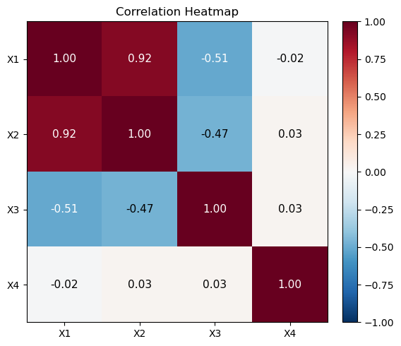
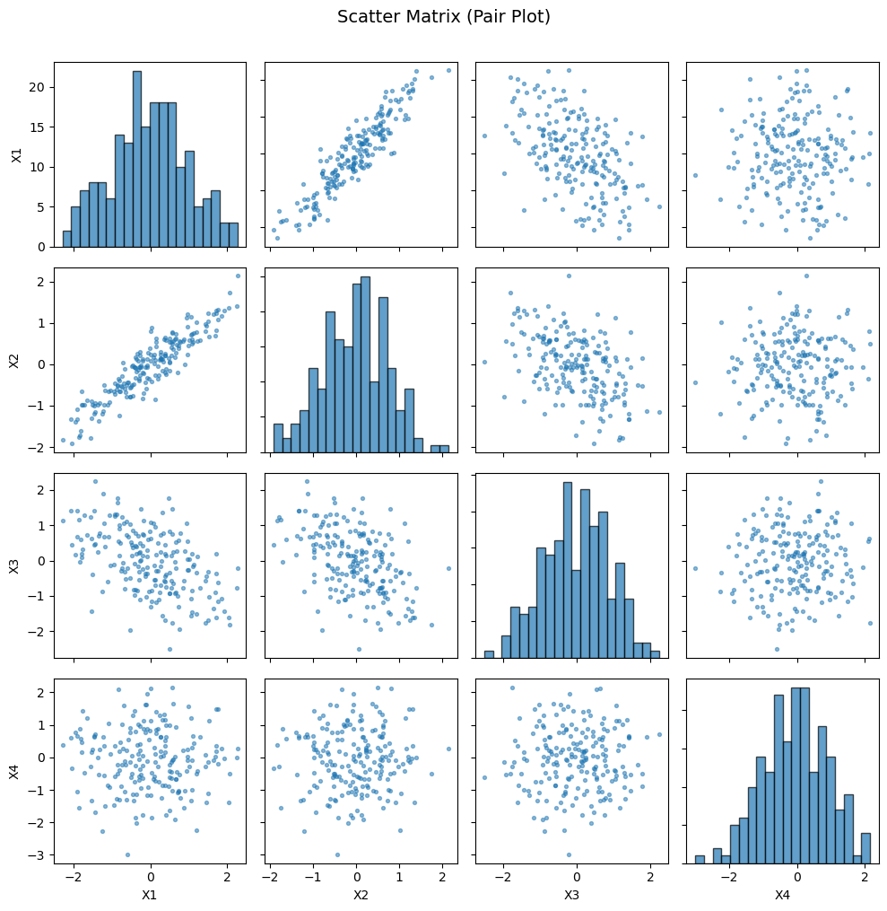
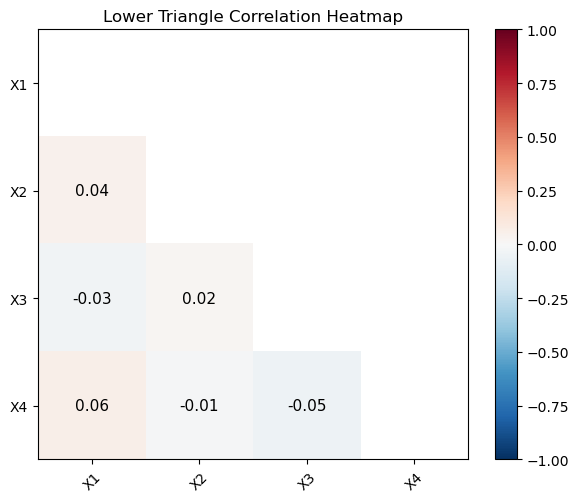
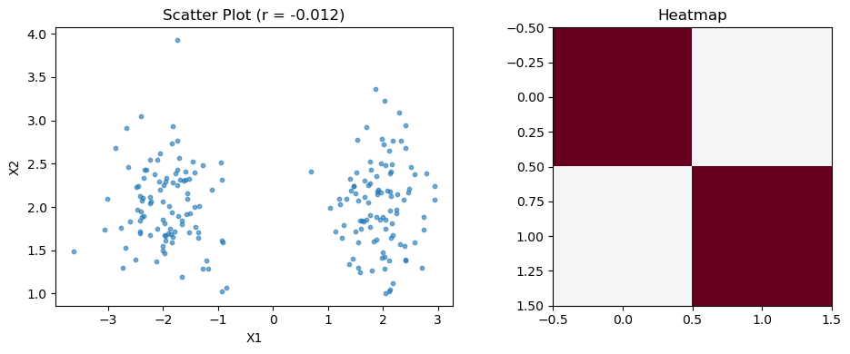

# 상관 시각화

## 개요

상관행렬의 시각화는 다변량 자료를 탐색하는 데 필수적이다. 이 페이지에서는 Matplotlib으로 두 가지 표준 기법, 즉 상관 열지도와 산점도 행렬(쌍 그림)을 보인다. 상관 구조가 알려진 네 변수를 모의생성하고 이 그림들이 선형 의존을 한눈에 어떻게 드러내는지 살펴본다.

---

## 상관된 변수 생성하기

독립인 두 표준정규 원천 $z_1$, $z_2$를 섞어 상관 구조가 통제된 네 변수를 만든다:

$$
x_1 = z_1, \quad x_2 = 0.7\, z_1 + 0.3\, z_2, \quad x_3 = -0.5\, z_1 + 0.8\, \varepsilon, \quad x_4 = \varepsilon'
$$

여기서 $\varepsilon$과 $\varepsilon'$은 독립인 표준정규이다. 구성상 $x_1$과 $x_2$는 강한 양의 상관을, $x_1$과 $x_3$은 약한 음의 상관을 가지며 $x_4$는 나머지와 독립이다.

<div class="codebox" markdown>

**예제 1.** 상관 구조를 가진 자료 만들기

```python
import numpy as np

np.random.seed(7)
n = 200

# 공통 요인 z1 을 섞는 정도를 달리해 상관 구조를 만든다.
# X2 는 X1 과 강한 양, X3 은 X1 과 중간 음, X4 는 어느 것과도 무관하다.
z1 = np.random.randn(n)
z2 = np.random.randn(n)

x1 = z1
x2 = 0.7 * z1 + 0.3 * z2
x3 = -0.5 * z1 + np.random.randn(n) * 0.8
x4 = np.random.randn(n)

data = np.column_stack([x1, x2, x3, x4])
labels = ['X1', 'X2', 'X3', 'X4']
```

</div>

---

## 상관행렬

표본상관행렬 $\mathbf{R}$은 $(i,j)$ 성분이 변수 $i$와 $j$ 사이의 Pearson 상관인 대칭 $k \times k$ 행렬이다:

$$
R_{ij} = \frac{\sum_{t=1}^{n}(x_{ti} - \bar{x}_i)(x_{tj} - \bar{x}_j)}{\sqrt{\sum_{t=1}^{n}(x_{ti} - \bar{x}_i)^2}\;\sqrt{\sum_{t=1}^{n}(x_{tj} - \bar{x}_j)^2}}
$$

대각 성분은 언제나 $R_{ii} = 1$이고 이 행렬은 양반정치이다.

<div class="codebox" markdown>

**예제 2.** 상관행렬

```python
# rowvar=False 는 "행이 관측, 열이 변수"라는 뜻이다. 기본값은 그 반대이므로
# 자료행렬을 그대로 넣으면 엉뚱한 행렬이 나온다.
corr_matrix = np.corrcoef(data, rowvar=False)
```

</div>

---

## 상관 열지도

열지도는 $\mathbf{R}$의 각 성분을 발산형 색 척도로 부호화한다. 보통 파랑이 음의 상관, 빨강이 양의 상관, 0 근처가 흰색이다.

<div class="codebox" markdown>

**예제 3.** 상관 열지도

```python
import matplotlib.pyplot as plt

# 발산형 색지도를 쓰고 vmin/vmax 를 -1 과 1 로 못박는다. 이래야 흰색이
# 정확히 0 에 놓여, 색만 보고도 부호와 세기를 읽을 수 있다.
k = data.shape[1]
fig, ax = plt.subplots(figsize=(6, 5))
im = ax.imshow(corr_matrix, cmap='RdBu_r', vmin=-1, vmax=1)
ax.set_xticks(range(k))
ax.set_yticks(range(k))
ax.set_xticklabels(labels)
ax.set_yticklabels(labels)

for i in range(k):
    for j in range(k):
        ax.text(j, i, f'{corr_matrix[i, j]:.2f}',
                ha='center', va='center', fontsize=11,
                color='white' if abs(corr_matrix[i, j]) > 0.5 else 'black')

fig.colorbar(im, ax=ax, fraction=0.046, pad=0.04)
ax.set_title('Correlation Heatmap')
plt.tight_layout()
plt.show()
```



열지도를 보면 $X_1$과 $X_2$가 강한 양의 상관(진한 빨강), $X_1$과 $X_3$이 약한 음의 상관(연한 파랑)을 가지며 $X_4$는 사실상 어느 변수와도 무상관임이 즉시 드러난다.

</div>

변수 쌍마다 산점도를 그려 놓으면 상관행렬의 숫자가 어떤 모양에서 나왔는지 확인할 수 있다.

---

## 산점도 행렬 (쌍 그림)

산점도 행렬은 모든 쌍별 산점도를 격자에 표시하고 대각선에는 일변량 히스토그램을 둔다. 주변분포와 이변량 관계를 완전하게 시각 요약해 준다.

<div class="codebox" markdown>

**예제 4.** 산점도 행렬

```python
# 열지도는 숫자 하나로 요약하지만 산점도 행렬은 관계의 모양을 보여 준다.
# 상관계수가 같아도 모양이 다를 수 있으므로 둘을 함께 본다.
# 대각선에는 그 변수 자신의 분포를 그린다.
fig, axes = plt.subplots(k, k, figsize=(10, 10))
for i in range(k):
    for j in range(k):
        ax = axes[i, j]
        if i == j:
            ax.hist(data[:, i], bins=20, edgecolor='k', alpha=0.7)
        else:
            ax.scatter(data[:, j], data[:, i], s=8, alpha=0.5)
        if j == 0:
            ax.set_ylabel(labels[i])
        if i == k - 1:
            ax.set_xlabel(labels[j])
        if j != 0:
            ax.set_yticklabels([])
        if i != k - 1:
            ax.set_xticklabels([])

fig.suptitle('Scatter Matrix (Pair Plot)', fontsize=14, y=1.01)
plt.tight_layout()
plt.show()
```



$|r|$이 커질수록 점구름이 좁은 타원으로 조여든다.

산점도 행렬은 열지도가 보여주지 못하는 것들, 즉 비선형 관계, 이상점, 군집, 주변분포의 모양을 드러낸다.

</div>

---

## 해석

열지도와 산점도 행렬은 상호보완적이다:

- **열지도**는 많은 쌍별 상관을 간결한 형태로 요약하는 데 뛰어나다. 모든 쌍별 산점도를 그리기 어려운 고차원 자료에 이상적이다.
- **산점도 행렬**은 더 풍부한 정보를 주지만 변수가 대략 8–10개를 넘으면 다루기 어려워진다.

변수가 $k$개인 자료에서 서로 다른 쌍별 상관은 $\binom{k}{2}$개이다. 상관행렬이 대칭이므로 열지도는 대각선을 기준으로 중복된다. 공간을 아끼려고 아래쪽 삼각형만 표시하는 사람도 있다.

핵심 주의사항: Pearson 상관 열지도는 *선형* 연관만 포착한다. 어떤 변수 쌍이 열지도에서 무상관으로 보여도 비선형 관계로 강하게 연결되어 있을 수 있다. 중요한 변수 쌍은 언제나 산점도로 확인하라.

---

## 연습문제

<div class="drillbox" markdown>

**연습문제 1.** <span class="diff med" title="중간"></span>
모의실험을 고쳐 잡음이 작은 다섯 번째 변수 $x_5 = x_1^2 + \varepsilon$을 만들어라. 상관행렬을 계산하고 $x_1$과 $x_5$의 Pearson 상관을 확인하라. 결정적 관계가 있는데도 이 값이 왜 뜻밖일 수 있는지 설명하라.

</div>

??? success "풀이"

    ```python
    import numpy as np

    np.random.seed(7)
    n = 200
    z1 = np.random.randn(n)
    x1 = z1
    x5 = x1 ** 2 + np.random.normal(0, 0.1, n)

    r = np.corrcoef(x1, x5)[0, 1]
    print(f"Pearson r(x1, x5) = {r:.4f}")
    ```

    출력:

    ```
    Pearson r(x1, x5) = -0.0493
    ```

    두 변수를 독립으로 만들었으므로 표본상관이 0 근처에 나온다. $n$이 유한하면 정확히 0이 되지는 않으며, 이 정도 흔들림은 $1/\sqrt{n}$ 규모의 표집 변동이다.

    관계가 대칭이고 비선형이므로 $x_1$과 $x_5 = x_1^2$의 Pearson 상관은 0에 가깝다. $x_1 \sim \mathcal{N}(0, 1)$이 0을 중심으로 대칭이어서 양의 편차와 음의 편차가 똑같이 기여하고 관계의 선형 성분이 상쇄된다. 산점도로는 뚜렷한 포물선 패턴이 보이지만 열지도는 이를 완전히 놓친다. $\square$

<div class="drillbox" markdown>

**연습문제 2.** <span class="diff med" title="중간"></span>
상관행렬을 받아 아래쪽 삼각형만 보여주는(위쪽 삼각형과 대각선을 가리는) 열지도를 그리는 함수를 작성하라. 중복 정보를 피할 수 있다.

</div>

??? success "풀이"

    ```python
    import numpy as np
    import matplotlib.pyplot as plt

    def lower_triangle_heatmap(corr, labels):
        k = corr.shape[0]
        mask = np.triu(np.ones_like(corr, dtype=bool))
        masked = np.ma.array(corr, mask=mask)

        fig, ax = plt.subplots(figsize=(6, 5))
        im = ax.imshow(masked, cmap='RdBu_r', vmin=-1, vmax=1)
        ax.set_xticks(range(k))
        ax.set_yticks(range(k))
        ax.set_xticklabels(labels, rotation=45)
        ax.set_yticklabels(labels)

        for i in range(k):
            for j in range(i):
                ax.text(j, i, f'{corr[i, j]:.2f}',
                        ha='center', va='center', fontsize=11)

        fig.colorbar(im, ax=ax)
        ax.set_title('Lower Triangle Correlation Heatmap')
        plt.tight_layout()
        plt.show()

    # 사용 예
    np.random.seed(7)
    data = np.random.randn(200, 4)
    corr = np.corrcoef(data, rowvar=False)
    lower_triangle_heatmap(corr, ['X1', 'X2', 'X3', 'X4'])
    ```

    

    대각선은 언제나 1이고 행렬은 대칭이다. 색으로 보면 어느 변수 쌍이 강하게 얽혀 있는지 한눈에 들어온다.

    `numpy.ma.array`로 위쪽 삼각형과 대각선을 가린다. 상관행렬이 대칭이고($R_{ij} = R_{ji}$) 대각선이 항상 1이므로, 이렇게 하면 중복 정보를 없애고 서로 다른 $\binom{k}{2}$개의 상관에 주의를 집중할 수 있다. $\square$

<div class="drillbox" markdown>

**연습문제 3.** <span class="diff med" title="중간"></span>
변수가 $k$개일 때 상관행렬의 서로 다른 비대각 성분은 몇 개인가? 상관행렬 $\mathbf{R}$이 언제나 양반정치임을 증명하라.

</div>

??? success "풀이"

    상관행렬 $\mathbf{R}$은 대각선이 1인 대칭 $k \times k$ 행렬이다. 서로 다른 비대각 성분의 수는

    $$
    \frac{k(k-1)}{2} = \binom{k}{2}
    $$

    이다.

    $\mathbf{R}$이 양반정치임을 보이기 위해 $\mathbf{Z}$를 표준화된 자료의 $n \times k$ 행렬(각 열의 평균이 0, 분산이 1)이라 하자. 그러면 표본상관행렬은

    $$
    \mathbf{R} = \frac{1}{n-1}\mathbf{Z}^\top \mathbf{Z}
    $$

    이다. 임의의 벡터 $\mathbf{v} \in \mathbb{R}^k$에 대해

    $$
    \mathbf{v}^\top \mathbf{R}\, \mathbf{v} = \frac{1}{n-1}\mathbf{v}^\top \mathbf{Z}^\top \mathbf{Z}\, \mathbf{v} = \frac{1}{n-1}\|\mathbf{Z}\mathbf{v}\|^2 \ge 0
    $$

    이다. 이차형식이 모든 $\mathbf{v}$에 대해 음이 아니므로 $\mathbf{R}$은 양반정치이다. $\square$

<div class="drillbox" markdown>

**연습문제 4.** <span class="diff med" title="중간"></span>
산점도 행렬에서는 두 군집이 뚜렷하게 보이지만 상관 열지도에서는 상관이 0에 가깝게 나오는 자료를 생성하라. 이 경우 열지도가 실패하는 이유를 설명하라.

</div>

??? success "풀이"

    ```python
    import numpy as np
    import matplotlib.pyplot as plt

    np.random.seed(42)
    n = 100
    # 1번 무리: (2, 2) 둘레
    c1 = np.random.normal(loc=[2, 2], scale=0.5, size=(n, 2))
    # 2번 무리: (-2, 2) 둘레
    c2 = np.random.normal(loc=[-2, 2], scale=0.5, size=(n, 2))
    data = np.vstack([c1, c2])

    r = np.corrcoef(data[:, 0], data[:, 1])[0, 1]
    print(f"Pearson r = {r:.4f}")   # about -0.01

    fig, (ax1, ax2) = plt.subplots(1, 2, figsize=(10, 4))
    ax1.scatter(data[:, 0], data[:, 1], s=10, alpha=0.6)
    ax1.set_title(f'Scatter Plot (r = {r:.3f})')
    ax1.set_xlabel('X1')
    ax1.set_ylabel('X2')

    corr = np.corrcoef(data, rowvar=False)
    ax2.imshow(corr, cmap='RdBu_r', vmin=-1, vmax=1)
    ax2.set_title('Heatmap')
    plt.tight_layout()
    plt.show()
    ```

    출력:

    ```
    Pearson r = -0.0117
    ```

    

    $r = -0.012$로 사실상 0이지만 그림에는 뚜렷한 곡선 관계가 있다. **상관이 0이라는 것은 선형 관계가 없다는 뜻이지 관계가 없다는 뜻이 아니다.**

    두 군집이 $X_1$ 방향으로만 떨어져 있고 $X_2$의 평균은 같으므로 전체 Pearson $r$이 약 $-0.01$로 0에 가깝다. 그러나 산점도에는 뚜렷하게 분리된 두 무리가 보인다. 열지도는 쌍마다 하나의 수치만 보여주므로 이런 이봉 구조를 나타낼 수 없다. (참고로 군집 중심을 $(2,2)$와 $(-2,-2)$로 두면 같은 군집 구조에서도 $r$이 강한 양수가 된다.) 상관 요약이 중요한 분포적 특징을 가릴 수 있음을 보여준다. $\square$

<div class="drillbox" markdown>

**연습문제 5.** <span class="diff med" title="중간"></span>
표준화된 변수(평균 0, 분산 1)에서 상관행렬이 공분산행렬과 같음을 증명하라. 이 동등성이 성립하는 조건을 진술하라.

</div>

??? success "풀이"

    $X_1, \ldots, X_k$를 확률변수라 하고 표준화된 변수를

    $$
    Z_i = \frac{X_i - \mu_i}{\sigma_i}
    $$

    로 정의하자. 표준화된 변수의 공분산은

    $$
    \text{Cov}(Z_i, Z_j) = \text{Cov}\!\left(\frac{X_i - \mu_i}{\sigma_i},\; \frac{X_j - \mu_j}{\sigma_j}\right) = \frac{\text{Cov}(X_i, X_j)}{\sigma_i \sigma_j} = \rho_{ij}
    $$

    이다. 모든 $i$에서 $\text{Var}(Z_i) = 1$이므로 표준화된 변수의 공분산행렬은

    $$
    \boldsymbol{\Sigma}_Z = \begin{pmatrix} 1 & \rho_{12} & \cdots & \rho_{1k} \\ \rho_{12} & 1 & \cdots & \rho_{2k} \\ \vdots & \vdots & \ddots & \vdots \\ \rho_{1k} & \rho_{2k} & \cdots & 1 \end{pmatrix} = \mathbf{R}
    $$

    이며, 이는 원래 변수의 상관행렬과 정확히 같다. 이 동등성은 각 변수의 분산이 1이면 성립한다. 공분산은 위치 이동에 불변이므로 공분산행렬이 상관행렬과 같아지는 데 평균이 0일 필요는 없고 분산이 1이기만 하면 된다. $\square$

---

## 정리하며

변수가 여럿이면 **상관 구조를 그림으로** 본다.

- **열지도는 전체 패턴을, 산점도 행렬은 개별 관계를 보여 준다.** 앞의 것은 변수가 많을 때 한눈에 훑기 좋고, 뒤의 것은 **비선형 관계와 이상치를 드러낸다.** 열지도만 보면 $r$ 이 놓치는 것을 함께 놓친다.
- **색 척도를 $[-1,1]$ 로 고정하고 발산형 색상표를 쓴다.** 0 을 가운데에 두어야 부호가 한눈에 읽히며, 자동 범위를 쓰면 약한 상관이 강해 보인다.
- **변수 순서를 바꾸면 구조가 드러난다.** 군집 순으로 재배열하면 블록이 보이며, 그냥 나열하면 놓친다.
- **상관행렬은 대칭이고 대각이 1 이다.** 위쪽 삼각만 그려도 정보 손실이 없다.
- **구성된 자료로 확인하는 것이 이 절의 방법이다.** 상관 구조를 알고 만든 자료에서 그림이 그것을 제대로 보여 주는지 확인하면, 실제 자료에서 그림을 읽는 눈이 생긴다.

다음 절 **상관 타원 그림**으로 넘어간다.
