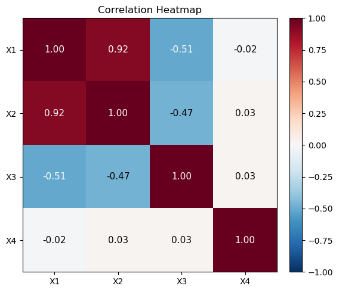
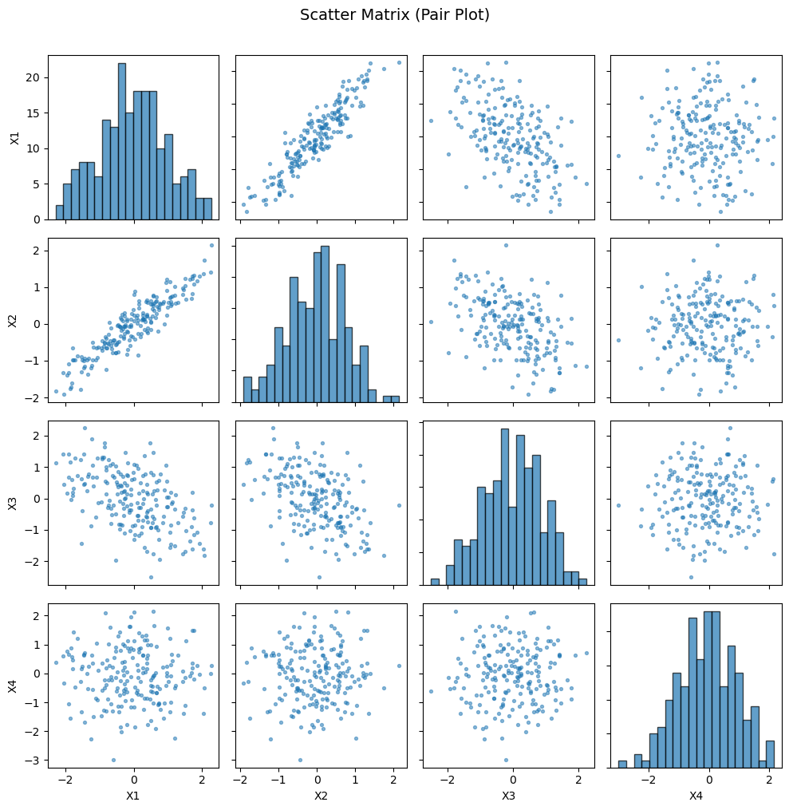
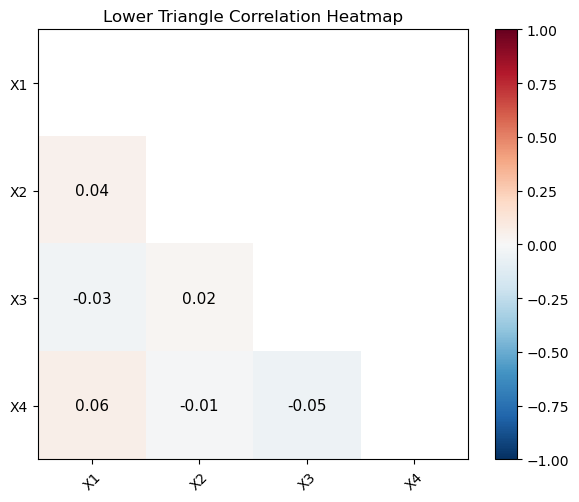
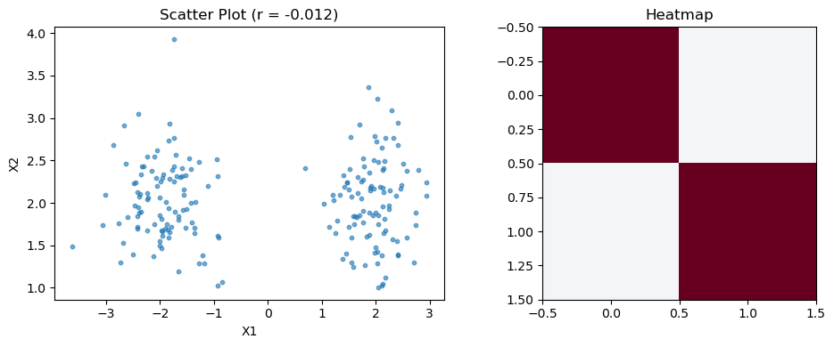

# 상관 시각화

## 개요

상관행렬의 시각화는 다변량 자료를 탐색하는 데 필수적이다. 이 페이지에서는 Matplotlib으로 두 가지 표준 기법, 즉 상관 열지도와 산점도 행렬(쌍 그림)을 보인다. 상관 구조가 알려진 네 변수를 모의생성하고 이 그림들이 선형 의존을 한눈에 어떻게 드러내는지 살펴본다.

---

## 1. 상관된 변수 생성하기

독립인 두 표준정규 원천 $z_1$, $z_2$를 섞어 상관 구조가 통제된 네 변수를 만든다:

$$
x_1 = z_1, \quad x_2 = 0.7\, z_1 + 0.3\, z_2, \quad x_3 = -0.5\, z_1 + 0.8\, \varepsilon, \quad x_4 = \varepsilon'
$$

여기서 $\varepsilon$과 $\varepsilon'$은 독립인 표준정규이다. 구성상 $x_1$과 $x_2$는 강한 양의 상관을, $x_1$과 $x_3$은 약한 음의 상관을 가지며 $x_4$는 나머지와 독립이다.

<div class="exbox" markdown>

**보기 1.** <span class="diff easy" title="쉬움"></span> 섞는 비율에서 상관으로. 위 구성식에서 $z_1, z_2, \varepsilon, \varepsilon'$은 모두 독립인 표준정규이다.

**(1)** 네 변수의 모집단 상관행렬을 손으로 구하시오. $\rho_{12}$가 섞는 비율 $0.7$과 같은가.

**(2)** $n = 200$짜리 표본을 만들어 (1)의 답과 맞는지 확인하시오.

</div>

??? success "풀이"

    **(1) 해석적으로.** 각 변수가 독립인 표준정규의 일차결합이므로 분산과 공분산이 계수만으로 결정된다. $\operatorname{Var}(z_1) = \operatorname{Var}(z_2) = \operatorname{Var}(\varepsilon) = 1$이고 서로 독립이므로

    $$
    \operatorname{Var}(x_1) = 1,
    \quad
    \operatorname{Var}(x_2) = 0.7^2 + 0.3^2 = 0.58,
    \quad
    \operatorname{Var}(x_3) = 0.5^2 + 0.8^2 = 0.89,
    \quad
    \operatorname{Var}(x_4) = 1
    $$

    이다. 공분산은 **공유하는 원천의 계수곱만** 남는다. $x_1$과 $x_2$는 $z_1$을 공유하므로

    $$
    \operatorname{Cov}(x_1, x_2) = 0.7,
    \qquad
    \operatorname{Cov}(x_1, x_3) = -0.5,
    \qquad
    \operatorname{Cov}(x_2, x_3) = 0.7 \times (-0.5) = -0.35
    $$

    이고, $x_4$는 아무 원천도 공유하지 않으므로 나머지 셋과의 공분산이 모두 0이다. 각각을 표준편차의 곱으로 나누면

    $$
    \rho_{12} = \frac{0.7}{\sqrt{0.58}} = 0.9191,
    \qquad
    \rho_{13} = \frac{-0.5}{\sqrt{0.89}} = -0.5300,
    \qquad
    \rho_{23} = \frac{-0.35}{\sqrt{0.58}\sqrt{0.89}} = -0.4871
    $$

    이다.

    **$\rho_{12}$는 $0.7$이 아니다.** 섞는 비율 $0.7$은 공분산이지 상관이 아니며, $x_2$의 표준편차 $\sqrt{0.58} = 0.7616$으로 나누는 순간 $0.9191$로 올라간다. $x_2$가 $z_1$에 실어 준 분산이 $0.49$로 전체 $0.58$의 $84\%$나 되기 때문이다. **계수를 상관으로 읽는 것이 이런 자료에서 가장 흔한 실수다.**

    **(2) 수치적으로.** 표본을 만들어 (1)의 행렬과 나란히 놓는다.

    ```python
    import numpy as np

    np.random.seed(7)
    n = 200

    # 공통 요인 z1 을 섞는 정도를 달리해 상관 구조를 만든다.
    # X2 는 X1 과 강한 양, X3 은 X1 과 중간 음, X4 는 어느 것과도 무관하다.
    z1 = np.random.randn(n)
    z2 = np.random.randn(n)

    x1 = z1
    x2 = 0.7 * z1 + 0.3 * z2
    x3 = -0.5 * z1 + np.random.randn(n) * 0.8
    x4 = np.random.randn(n)

    data = np.column_stack([x1, x2, x3, x4])
    labels = ['X1', 'X2', 'X3', 'X4']

    # (1) 에서 손으로 구한 모집단 상관행렬
    s2, s3 = np.sqrt(0.58), np.sqrt(0.89)
    theory = np.array([
        [1.0,        0.7 / s2,          -0.5 / s3,          0.0],
        [0.7 / s2,   1.0,               -0.35 / (s2 * s3),  0.0],
        [-0.5 / s3, -0.35 / (s2 * s3),   1.0,               0.0],
        [0.0,        0.0,                0.0,               1.0],
    ])

    sample = np.corrcoef(data, rowvar=False)

    print("쌍      이론      표본      SE      z")
    for i in range(4):
        for j in range(i + 1, 4):
            rho, r = theory[i, j], sample[i, j]
            se = (1 - rho ** 2) / np.sqrt(n)   # 표본상관의 표준오차
            print(f"{labels[i]}-{labels[j]}  {rho:+.4f}  {r:+.4f}  {se:.4f}  {(r - rho) / se:+.3f}")
    ```

    출력:

    ```
    쌍      이론      표본      SE      z
    X1-X2  +0.9191  +0.9192  0.0110  +0.001
    X1-X3  -0.5300  -0.5115  0.0508  +0.365
    X1-X4  +0.0000  -0.0156  0.0707  -0.220
    X2-X3  -0.4871  -0.4688  0.0539  +0.339
    X2-X4  +0.0000  +0.0272  0.0707  +0.384
    X3-X4  +0.0000  +0.0295  0.0707  +0.417
    ```

    여섯 쌍 모두 유도한 값과 맞는다. 가장 크게 어긋난 $X_3$–$X_4$조차 표준오차의 $0.42$배이고, $X_1$–$X_2$는 $+0.9191$ 대 $+0.9192$로 소수 넷째 자리에서 갈린다.

    표준오차 $\operatorname{SE}(r) \approx (1-\rho^2)/\sqrt{n}$이 $\rho$에 따라 크게 다르다는 점을 눈여겨볼 만하다. $\rho = 0.9191$에서는 $0.0110$인데 $\rho = 0$에서는 $0.0707$로 여섯 배가 넘는다. **강한 상관일수록 정밀하게 추정된다.** 그래서 "$-0.0156$은 0이 아니다"라고 말할 수 없는 것이다.

---

## 2. 상관행렬

표본상관행렬 $\mathbf{R}$은 $(i,j)$ 성분이 변수 $i$와 $j$ 사이의 Pearson 상관인 대칭 $k \times k$ 행렬이다:

$$
R_{ij} = \frac{\sum_{t=1}^{n}(x_{ti} - \bar{x}_i)(x_{tj} - \bar{x}_j)}{\sqrt{\sum_{t=1}^{n}(x_{ti} - \bar{x}_i)^2}\;\sqrt{\sum_{t=1}^{n}(x_{tj} - \bar{x}_j)^2}}
$$

대각 성분은 언제나 $R_{ii} = 1$이고 이 행렬은 양반정치이다.

<div class="exbox" markdown>

**보기 2.** <span class="diff easy" title="쉬움"></span> 상관행렬이 담은 것과 `rowvar` 함정. 보기 1의 `data`(모양 $200 \times 4$)를 이어받는다.

**(1)** $4 \times 4$ 상관행렬의 칸은 16개다. 그중 자유로운 수는 몇 개이며 대각합은 얼마인가.

**(2)** `np.corrcoef(data)`를 `rowvar` 없이 부르면 어떤 행렬이 나오는가. 왜 이 실수가 잘 드러나지 않는가.

</div>

??? success "풀이"

    **(1) 해석적으로.** 상관행렬은 대칭($R_{ij} = R_{ji}$)이고 대각이 모두 1이다. 그러므로 자유로운 수는 위쪽 삼각형의

    $$
    \binom{4}{2} = \frac{4 \times 3}{2} = 6
    $$

    개뿐이고 나머지 10칸은 되풀이다. 대각이 전부 1이므로 대각합도 곧바로 나온다.

    $$
    \operatorname{tr}(\mathbf{R}) = \sum_{i=1}^{4} R_{ii} = 4
    $$

    대각합은 고윳값의 합이기도 하다. 변수 수 $k$가 무엇이든 $\sum_i \lambda_i = k$로 고정되어 있으므로, **상관이 강해진다는 것은 고윳값이 몇 개로 쏠린다는 뜻**이지 총량이 늘어난다는 뜻이 아니다.

    **(2) `rowvar`의 기본값은 `True`**이고 그것은 "**행이 변수**, 열이 관측"이라는 뜻이다. $200 \times 4$ 자료를 그대로 넣으면 넘파이는 관측 200개를 변수로 읽어 $200 \times 200$ 행렬을 내놓는다. 각 성분은 변수 사이의 상관이 아니라 **관측끼리 네 좌표를 견준 상관**이다.

    이 실수가 드러나지 않는 까닭은 결과가 멀쩡해 보이기 때문이다. 대각은 1, 성분은 $[-1, 1]$ 안, 대칭까지 그대로여서 상관행렬의 겉모습을 모두 갖추고 있다.

    ```python
    # rowvar=False 는 "행이 관측, 열이 변수"라는 뜻이다. 기본값은 그 반대이므로
    # 자료행렬을 그대로 넣으면 엉뚱한 행렬이 나온다.
    corr_matrix = np.corrcoef(data, rowvar=False)

    print(f"rowvar=False : {corr_matrix.shape}")
    print(f"대각합       : {np.trace(corr_matrix):.1f}")
    print(f"고윳값       : {np.round(np.linalg.eigvalsh(corr_matrix)[::-1], 4)}")

    wrong = np.corrcoef(data)          # 기본값 rowvar=True
    print(f"\nrowvar 생략  : {wrong.shape}")
    print(f"대각 성분    : {wrong[0, 0]:.1f}, 성분 범위 [{wrong.min():.2f}, 1.00], 대칭 {np.allclose(wrong, wrong.T)}")
    print(f"계수(rank)   : {np.linalg.matrix_rank(wrong)}")
    ```

    출력:

    ```
    rowvar=False : (4, 4)
    대각합       : 4.0
    고윳값       : [2.2914 1.0035 0.6266 0.0786]

    rowvar 생략  : (200, 200)
    대각 성분    : 1.0, 성분 범위 [-1.00, 1.00], 대칭 True
    계수(rank)   : 3
    ```

    대각합이 $4.0$으로 (1)의 유도와 맞고, 고윳값 넷을 더해도 $2.2914 + 1.0035 + 0.6266 + 0.0786 = 4.0001$이다. 가장 큰 고윳값 $2.2914$가 전체의 $57\%$를 차지하는데, 이것이 $X_1, X_2, X_3$에 공통으로 실린 $z_1$ 한 축이다. 이론 상관행렬로 같은 계산을 하면 $2.3132$이니 표본값이 잘 맞는다.

    **잘못 부른 쪽을 알아보는 단서는 모양과 계수다.** $200 \times 200$인데 계수가 3밖에 되지 않는다. 좌표가 넷뿐인 벡터를 중심화해 견주었으니 자유도가 $4 - 1 = 3$으로 떨어진 것이다. 성분 값만 훑어서는 알 수 없고, `.shape`를 찍어 보아야 한다.

---

## 3. 상관 열지도

열지도는 $\mathbf{R}$의 각 성분을 발산형 색 척도로 부호화한다. 보통 파랑이 음의 상관, 빨강이 양의 상관, 0 근처가 흰색이다.

<div class="exbox" markdown>

**보기 3.** <span class="diff easy" title="쉬움"></span> 열지도를 그려 읽기. 보기 2의 `corr_matrix`를 열지도로 그린다.

**(1)** 그려 보고, 색만 보고 네 변수의 관계를 읽어 내시오.

**(2)** 16칸 가운데 **가장 진한 색**을 차지한 것은 무엇이며 거기에 정보가 있는가. 이 그림이 **가리는 것**은 무엇인가.

</div>

??? success "풀이"

    유도할 답이 있는 문제가 아니다. **그림에서 무엇이 읽히고 무엇이 읽히지 않는가**가 전부이므로, 눈으로 본 것을 수치로 바꿔 가며 읽는다.

    ```python
    import matplotlib.pyplot as plt

    plt.rcParams["font.sans-serif"] = ["NanumGothic", "Apple SD Gothic Neo", "Malgun Gothic"]
    plt.rcParams["font.family"] = "sans-serif"
    plt.rcParams["axes.unicode_minus"] = False

    # 발산형 색지도를 쓰고 vmin/vmax 를 -1 과 1 로 못박는다. 이래야 흰색이
    # 정확히 0 에 놓여, 색만 보고도 부호와 세기를 읽을 수 있다.
    k = data.shape[1]
    fig, ax = plt.subplots(figsize=(6, 5))
    im = ax.imshow(corr_matrix, cmap='RdBu_r', vmin=-1, vmax=1)
    ax.set_xticks(range(k))
    ax.set_yticks(range(k))
    ax.set_xticklabels(labels)
    ax.set_yticklabels(labels)

    for i in range(k):
        for j in range(k):
            ax.text(j, i, f'{corr_matrix[i, j]:.2f}',
                    ha='center', va='center', fontsize=11,
                    color='white' if abs(corr_matrix[i, j]) > 0.5 else 'black')

    fig.colorbar(im, ax=ax, fraction=0.046, pad=0.04)
    ax.set_title('Correlation Heatmap')
    plt.tight_layout()
    plt.show()

    # 그림에서 읽을 수치를 찍어 둔다.
    off = corr_matrix[np.triu_indices(k, 1)]
    print(f"비대각 6칸: {np.round(off, 4)}")
    print(f"|r| < 0.05 인 칸 {np.sum(np.abs(off) < 0.05)}개, 그 범위 "
          f"[{off[np.abs(off) < 0.05].min():+.4f}, {off[np.abs(off) < 0.05].max():+.4f}]")
    print(f"가장 진한 비대각 칸 |r| = {np.abs(off).max():.4f}, 대각 칸 = 1.0000")
    ```

    출력:

    ```
    비대각 6칸: [ 0.9192 -0.5115 -0.0156 -0.4688  0.0272  0.0295]
    |r| < 0.05 인 칸 3개, 그 범위 [-0.0156, +0.0295]
    가장 진한 비대각 칸 |r| = 0.9192, 대각 칸 = 1.0000
    ```

    

    **(1) 색이 말하는 것.** $X_1$–$X_2$ 칸이 거의 색막대 꼭대기의 진한 빨강이고 숫자가 $0.92$다. $X_1$–$X_3$과 $X_2$–$X_3$은 중간 세기의 파랑으로 $-0.51$, $-0.47$이니 $X_3$은 앞의 둘과 **반대로** 움직인다. $X_4$ 행과 열은 세 칸 모두 흰색에 가깝고 값이 $-0.02$, $0.03$, $0.03$이라 어느 변수와도 선형 관계가 없다. 보기 1에서 $X_4$를 아무 원천도 공유하지 않게 만들었으니 예상대로다.

    **(2) 가장 진한 네 칸은 대각선이고 거기에는 정보가 없다.** $R_{ii} = 1$은 어떤 자료에서나 그렇다. 16칸 중 넷이 색막대의 양끝 색을 차지하고 앉아 있으면서 아무것도 말하지 않고, 대칭이라 아래 삼각형 6칸도 위 삼각형의 되풀이다. **읽을 거리가 있는 칸은 6개뿐인데 그림은 16칸을 쓴다.** 연습문제 3가 아래쪽 삼각형만 남기는 이유가 이것이다.

    가리는 것은 둘이다. 첫째, **부호를 눈으로 가려낼 수 없는 구간이 있다.** $X_1$–$X_4$의 $-0.0156$과 $X_3$–$X_4$의 $+0.0295$는 부호가 반대인데 둘 다 흰색이다. 색의 세기가 $|r|$에 비례하므로 색 범위의 $1.6\%$와 $3.0\%$를 구별하라는 요구인 셈인데, 눈으로는 불가능하다. 다만 이 경우에는 숨겨도 좋다 — 셋 다 표준오차 $0.0707$ 안이라 참값이 0이기 때문이다.

    둘째, **모양을 통째로 가린다.** 한 칸에 수 하나만 담으므로 $r = 0$이 "관계가 없다"인지 "직선 관계만 없다"인지 구별하지 못한다. 연습문제 2이 $x_5 = x_1^2$으로, 연습문제 5가 두 군집으로 같은 함정을 만든다. 둘 다 열지도에서는 흰 칸 하나로 보인다. 그래서 다음 보기의 산점도 행렬이 필요하다.

---

## 4. 산점도 행렬 (쌍 그림)

산점도 행렬은 모든 쌍별 산점도를 격자에 표시하고 대각선에는 일변량 히스토그램을 둔다. 주변분포와 이변량 관계를 완전하게 시각 요약해 준다.

<div class="exbox" markdown>

**보기 4.** <span class="diff easy" title="쉬움"></span> 산점도 행렬로 모양 보기. 같은 자료를 쌍별 산점도 격자로 그린다.

**(1)** "$|r|$이 커질수록 점구름이 좁은 타원으로 조여든다"를 **수치로** 확인하시오. 자료를 표준화한 뒤 점구름의 긴 축과 짧은 축의 비는 얼마인가.

**(2)** 이 그림의 대각선 칸은 다른 칸들과 세로축의 뜻이 다르다. 무엇이 어긋나 있는가.

</div>

??? success "풀이"

    **(1) 축 비에는 닫힌 꼴이 있다.** 두 변수를 표준화하면 공분산행렬이 상관행렬 $\begin{pmatrix} 1 & r \\ r & 1 \end{pmatrix}$ 그 자체가 된다. 이 행렬의 고유벡터는 $(1,1)/\sqrt{2}$와 $(1,-1)/\sqrt{2}$이고 고윳값은

    $$
    \lambda_{\max} = 1 + |r|, \qquad \lambda_{\min} = 1 - |r|
    $$

    이다. 점구름의 축 길이는 표준편차에 비례하므로 고윳값의 제곱근에 비례하고, 따라서

    $$
    \frac{\text{긴 축}}{\text{짧은 축}} = \sqrt{\frac{1 + |r|}{1 - |r|}}
    $$

    이다. 이 비가 $|r|$에 대해 **매우 느리게** 움직인다는 점이 중요하다. $|r| = 0.03$이면 $1.03$, $|r| = 0.5$라야 $1.73$이다. 약한 상관은 눈에 거의 보이지 않는다.

    **(2) 수치적으로.** 그림을 그리고 쌍마다 축 비를 재어 공식과 맞춰 본다.

    ```python
    plt.rcParams["font.sans-serif"] = ["NanumGothic", "Apple SD Gothic Neo", "Malgun Gothic"]
    plt.rcParams["font.family"] = "sans-serif"
    plt.rcParams["axes.unicode_minus"] = False

    # 열지도는 숫자 하나로 요약하지만 산점도 행렬은 관계의 모양을 보여 준다.
    # 상관계수가 같아도 모양이 다를 수 있으므로 둘을 함께 본다.
    # 대각선에는 그 변수 자신의 분포를 그린다.
    fig, axes = plt.subplots(k, k, figsize=(10, 10))
    for i in range(k):
        for j in range(k):
            ax = axes[i, j]
            if i == j:
                ax.hist(data[:, i], bins=20, edgecolor='k', alpha=0.7)
            else:
                ax.scatter(data[:, j], data[:, i], s=8, alpha=0.5)
            if j == 0:
                ax.set_ylabel(labels[i])
            if i == k - 1:
                ax.set_xlabel(labels[j])
            if j != 0:
                ax.set_yticklabels([])
            if i != k - 1:
                ax.set_xticklabels([])

    fig.suptitle('Scatter Matrix (Pair Plot)', fontsize=14, y=1.01)
    plt.tight_layout()
    plt.show()

    # 표준화한 점구름의 축 비를 직접 재어 공식과 맞춘다.
    print("쌍      |r|      공식      주성분으로 잰 값")
    for i, j in [(0, 1), (0, 2), (1, 2), (2, 3)]:
        Z = np.column_stack([data[:, i], data[:, j]])
        Z = (Z - Z.mean(axis=0)) / Z.std(axis=0, ddof=1)
        lam = np.linalg.eigvalsh(np.cov(Z, rowvar=False))     # 오름차순
        r = abs(corr_matrix[i, j])
        print(f"{labels[i]}-{labels[j]}  {r:.4f}  {np.sqrt((1 + r) / (1 - r)):.4f}    "
              f"{np.sqrt(lam[1] / lam[0]):.4f}")
    ```

    출력:

    ```
    쌍      |r|      공식      주성분으로 잰 값
    X1-X2  0.9192  4.8724    4.8724
    X1-X3  0.5115  1.7589    1.7589
    X2-X3  0.4688  1.6629    1.6629
    X3-X4  0.0295  1.0300    1.0300
    ```

    

    네 쌍 모두 공식과 주성분이 소수 넷째 자리까지 같다. 그림에서 $X_1$–$X_2$ 칸만 가는 띠로 보이고($4.87$배) $X_1$–$X_3$은 겨우 알아볼 만한 기울기이며($1.76$배) $X_3$–$X_4$는 둥근 구름($1.03$배)이라는 인상이 수치와 맞는다.

    여기서 **열지도와 산점도 행렬이 서로 다른 눈금 위에 있다**는 것이 드러난다. 열지도의 색은 $r$에 **선형**이라 $-0.51$ 칸이 $0.92$ 칸의 절반쯤 되는 세기로 보인다. 그런데 모양으로 재면 $1.76$ 대 $4.87$이라 절반이 아니라 $36\%$다. 같은 자료를 두 그림이 다르게 과장한다. 어느 쪽도 틀리지 않았고, **$r$은 색으로 읽고 모양은 산점도로 읽어야 한다**는 뜻이다.

    **대각선 칸의 세로축은 도수다.** $(1,1)$ 칸은 $X_1$의 히스토그램이므로 세로축이 "몇 개인가"인데, 코드가 `j == 0`일 때 `set_ylabel(labels[i])`를 붙이므로 그 칸에도 `X1`이라는 세로축 이름이 달린다. 왼쪽 위 칸의 세로 눈금이 $0$에서 $22$까지 올라가는 것이 그 흔적이다. 같은 행의 나머지 세 칸은 세로축이 정말 $X_1$이고 범위가 $-2$에서 $2$이니 **한 행 안에서 세로축이 두 가지 뜻으로 쓰인다.** 산점도 행렬의 고질적인 결함이고, 대각선에 이름만 적거나 밀도곡선을 그리는 구현이 많은 이유다.

    이런 결함을 감안해도 산점도 행렬은 열지도가 못 보여 주는 셋을 보여 준다. **비선형 관계**(연습문제 2의 포물선), **군집**(연습문제 5의 두 덩어리), **주변분포의 모양**(대각선의 치우침과 이상점)이다.

---

## 5. 해석

열지도와 산점도 행렬은 상호보완적이다:

- **열지도**는 많은 쌍별 상관을 간결한 형태로 요약하는 데 뛰어나다. 모든 쌍별 산점도를 그리기 어려운 고차원 자료에 이상적이다.
- **산점도 행렬**은 더 풍부한 정보를 주지만 변수가 대략 8–10개를 넘으면 다루기 어려워진다.

변수가 $k$개인 자료에서 서로 다른 쌍별 상관은 $\binom{k}{2}$개이다. 상관행렬이 대칭이므로 열지도는 대각선을 기준으로 중복된다. 공간을 아끼려고 아래쪽 삼각형만 표시하는 사람도 있다.

핵심 주의사항: Pearson 상관 열지도는 *선형* 연관만 포착한다. 어떤 변수 쌍이 열지도에서 무상관으로 보여도 비선형 관계로 강하게 연결되어 있을 수 있다. 중요한 변수 쌍은 언제나 산점도로 확인하라.

---

## 연습문제

<div class="drillbox" markdown>

**연습문제 1.** <span class="diff easy" title="쉬움"></span>
상관 시각화의 **선택 지침**을 정리하라.

</div>

??? success "풀이"
    **그림의 선택.**

    | 변수 수 | 권장 그림 |
    |---|---|
    | 2개 | **산점도**(언제나) |
    | 3~8개 | **산점도 행렬** + 열지도 |
    | 9~30개 | **열지도**(군집 정렬) |
    | 30개 이상 | 열지도 + **네트워크 그림** |

    **산점도 행렬은 8개가 실질적 한계**다. $8\times8=64$개 패널이면 이미 각 패널이 작다.

    **열지도 제작 체크리스트 여덟.**

    ```text
    □ vmin=-1, vmax=1 로 고정
    □ 발산형 색상표 (RdBu_r, coolwarm)
    □ 색막대 표시
    □ 계층 군집으로 변수 재배열 (+ 순서를 그림 설명에 명시)
    □ 위쪽 삼각형과 대각선 가리기
    □ 변수가 20개 이하면 각 칸에 r 값 표기
    □ 별표는 FDR 보정 후에만
    □ 표본 크기 n 을 그림 설명에
    ```

    **핵심 수치 다섯.**

    | 사실 | 값 |
    |---|---|
    | 무작위 순서에서 블록 구조가 보이는가 | **안 보인다** |
    | 계층 군집 후 블록 전환 횟수 | **3**(완벽 복원) |
    | 사슬 구조의 $r_{15}$ | 주변 0.41 vs 부분 **0.000** |
    | 독립 자료 $p=15$, $n=40$의 별표 수 | **5.21개** |
    | FDR 보정 후 | 0.05개 |

    **흔한 실수 여섯.**

    | 실수 | 대가 |
    |---|---|
    | `vmin`/`vmax` 생략 | 약한 상관이 **강해 보임** |
    | 순차형 색상표 | **부호**를 못 읽음 |
    | 변수 순서를 그대로 | **구조가 안 보임** |
    | 별표를 보정 없이 | 가짜 5개 |
    | 열지도만 보고 산점도 생략 | **비선형·군집**을 놓침 |
    | 주변상관만 보고 "직접 연결"로 해석 | 간접 경로 |

    **다섯 번째가 가장 위험하다.** 열지도의 각 칸은 **피어슨 $r$ 하나**이므로, 앤스컴 4중주의 네 자료가 **모두 같은 색**으로 나온다.

    ```text
    열지도는 "어디를 볼지" 알려 주는 도구이지
    "무엇이 있는지" 알려 주는 도구가 아니다
      → 흥미로운 칸을 찾으면 반드시 그 쌍의 산점도를 그린다
    ```

    **그림 설명(캡션)의 예.**

    ```text
    그림 3. 12개 생리 지표의 상관 열지도 (n = 248)

    피어슨 상관. 변수는 평균 연결 계층 군집(거리 = 1-|r|)으로
    재배열했으며 왼쪽 덴드로그램에 군집 구조를 표시했다.
    색은 -1(파랑)에서 +1(빨강)으로 고정했다. 아래쪽 삼각형만
    표시했고, |r| < 0.2 인 칸은 비워 두었다.
    별표는 BH 절차로 FDR 5% 를 통제한 결과다.
    ```

    **"변수 순서를 어떻게 정했는지"와 "색 범위"를 밝히는 것**이 상관 열지도 캡션의 최소 요건이다.

    **한 문장.** 상관 열지도는 **수십 개의 $r$을 한 화면에 담는 요약 도구**이며, 순서·색 범위·유의성 표시라는 세 가지 선택이 독자가 보는 것을 결정한다.

---

<div class="drillbox" markdown>

**연습문제 2.** <span class="diff med" title="중간"></span>
모의실험을 고쳐 잡음이 작은 다섯 번째 변수 $x_5 = x_1^2 + \varepsilon$을 만들어라. 상관행렬을 계산하고 $x_1$과 $x_5$의 Pearson 상관을 확인하라. 결정적 관계가 있는데도 이 값이 왜 뜻밖일 수 있는지 설명하라.

</div>

??? success "풀이"

    ```python
    import numpy as np

    np.random.seed(7)
    n = 200
    z1 = np.random.randn(n)
    x1 = z1
    x5 = x1 ** 2 + np.random.normal(0, 0.1, n)

    r = np.corrcoef(x1, x5)[0, 1]
    print(f"Pearson r(x1, x5) = {r:.4f}")
    ```

    출력:

    ```
    Pearson r(x1, x5) = -0.0493
    ```

    두 변수를 독립으로 만들었으므로 표본상관이 0 근처에 나온다. $n$이 유한하면 정확히 0이 되지는 않으며, 이 정도 흔들림은 $1/\sqrt{n}$ 규모의 표집 변동이다.

    관계가 대칭이고 비선형이므로 $x_1$과 $x_5 = x_1^2$의 Pearson 상관은 0에 가깝다. $x_1 \sim \mathcal{N}(0, 1)$이 0을 중심으로 대칭이어서 양의 편차와 음의 편차가 똑같이 기여하고 관계의 선형 성분이 상쇄된다. 산점도로는 뚜렷한 포물선 패턴이 보이지만 열지도는 이를 완전히 놓친다. $\square$

---

<div class="drillbox" markdown>

**연습문제 3.** <span class="diff med" title="중간"></span>
상관행렬을 받아 아래쪽 삼각형만 보여주는(위쪽 삼각형과 대각선을 가리는) 열지도를 그리는 함수를 작성하라. 중복 정보를 피할 수 있다.

</div>

??? success "풀이"

    ```python
    import numpy as np
    import matplotlib.pyplot as plt

    def lower_triangle_heatmap(corr, labels):
        k = corr.shape[0]
        mask = np.triu(np.ones_like(corr, dtype=bool))
        masked = np.ma.array(corr, mask=mask)

        fig, ax = plt.subplots(figsize=(6, 5))
        im = ax.imshow(masked, cmap='RdBu_r', vmin=-1, vmax=1)
        ax.set_xticks(range(k))
        ax.set_yticks(range(k))
        ax.set_xticklabels(labels, rotation=45)
        ax.set_yticklabels(labels)

        for i in range(k):
            for j in range(i):
                ax.text(j, i, f'{corr[i, j]:.2f}',
                        ha='center', va='center', fontsize=11)

        fig.colorbar(im, ax=ax)
        ax.set_title('Lower Triangle Correlation Heatmap')
        plt.tight_layout()
        plt.show()

    # 사용 예
    np.random.seed(7)
    data = np.random.randn(200, 4)
    corr = np.corrcoef(data, rowvar=False)
    lower_triangle_heatmap(corr, ['X1', 'X2', 'X3', 'X4'])
    ```

    

    대각선은 언제나 1이고 행렬은 대칭이다. 색으로 보면 어느 변수 쌍이 강하게 얽혀 있는지 한눈에 들어온다.

    `numpy.ma.array`로 위쪽 삼각형과 대각선을 가린다. 상관행렬이 대칭이고($R_{ij} = R_{ji}$) 대각선이 항상 1이므로, 이렇게 하면 중복 정보를 없애고 서로 다른 $\binom{k}{2}$개의 상관에 주의를 집중할 수 있다. $\square$

---

<div class="drillbox" markdown>

**연습문제 4.** <span class="diff med" title="중간"></span>
변수가 $k$개일 때 상관행렬의 서로 다른 비대각 성분은 몇 개인가? 상관행렬 $\mathbf{R}$이 언제나 양반정치임을 증명하라.

</div>

??? success "풀이"

    상관행렬 $\mathbf{R}$은 대각선이 1인 대칭 $k \times k$ 행렬이다. 서로 다른 비대각 성분의 수는

    $$
    \frac{k(k-1)}{2} = \binom{k}{2}
    $$

    이다.

    $\mathbf{R}$이 양반정치임을 보이기 위해 $\mathbf{Z}$를 표준화된 자료의 $n \times k$ 행렬(각 열의 평균이 0, 분산이 1)이라 하자. 그러면 표본상관행렬은

    $$
    \mathbf{R} = \frac{1}{n-1}\mathbf{Z}^\top \mathbf{Z}
    $$

    이다. 임의의 벡터 $\mathbf{v} \in \mathbb{R}^k$에 대해

    $$
    \mathbf{v}^\top \mathbf{R}\, \mathbf{v} = \frac{1}{n-1}\mathbf{v}^\top \mathbf{Z}^\top \mathbf{Z}\, \mathbf{v} = \frac{1}{n-1}\|\mathbf{Z}\mathbf{v}\|^2 \ge 0
    $$

    이다. 이차형식이 모든 $\mathbf{v}$에 대해 음이 아니므로 $\mathbf{R}$은 양반정치이다. $\square$

---

<div class="drillbox" markdown>

**연습문제 5.** <span class="diff med" title="중간"></span>
산점도 행렬에서는 두 군집이 뚜렷하게 보이지만 상관 열지도에서는 상관이 0에 가깝게 나오는 자료를 생성하라. 이 경우 열지도가 실패하는 이유를 설명하라.

</div>

??? success "풀이"

    ```python
    import numpy as np
    import matplotlib.pyplot as plt

    np.random.seed(42)
    n = 100
    # 1번 무리: (2, 2) 둘레
    c1 = np.random.normal(loc=[2, 2], scale=0.5, size=(n, 2))
    # 2번 무리: (-2, 2) 둘레
    c2 = np.random.normal(loc=[-2, 2], scale=0.5, size=(n, 2))
    data = np.vstack([c1, c2])

    r = np.corrcoef(data[:, 0], data[:, 1])[0, 1]
    print(f"Pearson r = {r:.4f}")   # about -0.01

    fig, (ax1, ax2) = plt.subplots(1, 2, figsize=(10, 4))
    ax1.scatter(data[:, 0], data[:, 1], s=10, alpha=0.6)
    ax1.set_title(f'Scatter Plot (r = {r:.3f})')
    ax1.set_xlabel('X1')
    ax1.set_ylabel('X2')

    corr = np.corrcoef(data, rowvar=False)
    ax2.imshow(corr, cmap='RdBu_r', vmin=-1, vmax=1)
    ax2.set_title('Heatmap')
    plt.tight_layout()
    plt.show()
    ```

    출력:

    ```
    Pearson r = -0.0117
    ```

    

    $r = -0.012$로 사실상 0이지만 그림에는 뚜렷한 곡선 관계가 있다. **상관이 0이라는 것은 선형 관계가 없다는 뜻이지 관계가 없다는 뜻이 아니다.**

    두 군집이 $X_1$ 방향으로만 떨어져 있고 $X_2$의 평균은 같으므로 전체 Pearson $r$이 약 $-0.01$로 0에 가깝다. 그러나 산점도에는 뚜렷하게 분리된 두 무리가 보인다. 열지도는 쌍마다 하나의 수치만 보여주므로 이런 이봉 구조를 나타낼 수 없다. (참고로 군집 중심을 $(2,2)$와 $(-2,-2)$로 두면 같은 군집 구조에서도 $r$이 강한 양수가 된다.) 상관 요약이 중요한 분포적 특징을 가릴 수 있음을 보여준다. $\square$

---

<div class="drillbox" markdown>

**연습문제 6.** <span class="diff med" title="중간"></span>
표준화된 변수(평균 0, 분산 1)에서 상관행렬이 공분산행렬과 같음을 증명하라. 이 동등성이 성립하는 조건을 진술하라.

</div>

??? success "풀이"

    $X_1, \ldots, X_k$를 확률변수라 하고 표준화된 변수를

    $$
    Z_i = \frac{X_i - \mu_i}{\sigma_i}
    $$

    로 정의하자. 표준화된 변수의 공분산은

    $$
    \text{Cov}(Z_i, Z_j) = \text{Cov}\!\left(\frac{X_i - \mu_i}{\sigma_i},\; \frac{X_j - \mu_j}{\sigma_j}\right) = \frac{\text{Cov}(X_i, X_j)}{\sigma_i \sigma_j} = \rho_{ij}
    $$

    이다. 모든 $i$에서 $\text{Var}(Z_i) = 1$이므로 표준화된 변수의 공분산행렬은

    $$
    \boldsymbol{\Sigma}_Z = \begin{pmatrix} 1 & \rho_{12} & \cdots & \rho_{1k} \\ \rho_{12} & 1 & \cdots & \rho_{2k} \\ \vdots & \vdots & \ddots & \vdots \\ \rho_{1k} & \rho_{2k} & \cdots & 1 \end{pmatrix} = \mathbf{R}
    $$

    이며, 이는 원래 변수의 상관행렬과 정확히 같다. 이 동등성은 각 변수의 분산이 1이면 성립한다. 공분산은 위치 이동에 불변이므로 공분산행렬이 상관행렬과 같아지는 데 평균이 0일 필요는 없고 분산이 1이기만 하면 된다. $\square$

---

<div class="drillbox" markdown>

**연습문제 7.** <span class="diff med" title="중간"></span>
열지도의 **색 척도**를 잘못 고르면 어떤 오해를 낳는가?

</div>

??? success "풀이"
    **두 가지 흔한 실수.**

    | 실수 | 결과 |
    |---|---|
    | **범위를 자료에 맞춤**(`vmin`/`vmax` 생략) | 약한 상관이 **강해 보인다** |
    | **순차형 색상표** 사용(`viridis` 등) | **부호**를 읽을 수 없다 |

    ```python
    import numpy as np

    rng = np.random.default_rng(28001)
    R2 = np.eye(6)
    R2[np.triu_indices(6, 1)] = rng.uniform(0.02, 0.08, 15)
    R2 = R2 + R2.T - np.eye(6)
    off = R2[np.triu_indices(6, 1)]
    print("모든 상관이 0.02~0.08 인 자료 (사실상 무관)")
    print(f"  실제 범위: [{off.min():.4f}, {off.max():.4f}]")
    print(f"  vmin/vmax 자동  → 가장 진한 칸이 {off.max():.2f} 인데 최대 색으로 표시")
    print(f"  vmin=-1, vmax=1 → 모든 칸이 거의 흰색 (올바름)")
    ```

    ```text
    모든 상관이 0.02~0.08 인 자료 (사실상 무관)
      실제 범위: [0.0221, 0.0744]
      vmin/vmax 자동  → 가장 진한 칸이 0.07 인데 최대 색으로 표시
      vmin=-1, vmax=1 → 모든 칸이 거의 흰색 (올바름)
    ```

    **상관이 전부 0.075 이하인데 자동 척도를 쓰면 "진한 빨강"이 나온다.** 독자는 강한 관계로 읽는다.

    **올바른 설정 넷.**

    ```text
    plt.imshow(R, cmap="RdBu_r", vmin=-1, vmax=1)
                     └─ 발산형   └─ 고정 범위

    1. cmap 은 발산형 (RdBu_r, coolwarm, bwr)
    2. vmin=-1, vmax=1 고정
    3. 0 이 중앙(흰색)에 오도록
    4. 색막대(colorbar)를 반드시 붙인다
    ```

    **발산형이 필요한 이유.** 상관은 **0을 중심으로 부호가 있는 양**이다. `viridis` 같은 순차형은 $-0.8$과 $+0.2$의 구분을 색으로 전달하지 못한다.

    | 색상표 | 상관에 적합한가 |
    |---|---|
    | **RdBu_r, coolwarm, bwr** | **적합**(발산형, 0이 중앙) |
    | viridis, plasma | **부적합**(순차형) |
    | jet, rainbow | **부적합**(지각적으로 비균일) |

    **`jet`는 특히 나쁘다.** 밝기가 단조롭지 않아 **없는 경계선**을 만들어 낸다. 흑백 인쇄에서도 완전히 무너진다.

    **색각 이상 고려.**

    ```text
    전체 남성의 약 8% 가 적록색각 이상이다
      → RdBu (빨강-파랑) 는 비교적 안전
      → RdYlGn (빨강-노랑-초록) 은 위험

    대안: 타원 그림 (모양으로 부호화, 다음 절)
          숫자 주석 병기
    ```

    **자동 척도가 정당한 경우도 있다.** 모든 상관이 $[0.6,0.95]$ 구간에 있고 **그 안의 차이가 관심사**라면 범위를 좁혀도 된다. 단, **색막대에 범위를 명시**해야 한다.

    **점검 목록 다섯.**

    ```text
    □ vmin=-1, vmax=1 로 고정했는가 (또는 범위를 명시했는가)
    □ 발산형 색상표를 썼는가
    □ 색막대가 있는가
    □ 대각선(모두 1)을 가렸는가
    □ 위쪽 삼각형을 가려 중복을 없앴는가
    ```

---

<div class="drillbox" markdown>

**연습문제 8.** <span class="diff med" title="중간"></span>
열지도에 **유의성 별표**를 찍는 관행은 안전한가?

</div>

??? success "풀이"
    ```python
    import warnings
    warnings.filterwarnings("ignore")

    import numpy as np
    from scipy import stats
    from statsmodels.stats.multitest import multipletests

    rng = np.random.default_rng(28002)
    B, p, n = 3_000, 15, 40
    m = p * (p - 1) // 2
    raw = adj = 0
    for _ in range(B):
        X = rng.standard_normal((n, p))              # 모두 독립
        r = np.corrcoef(X, rowvar=False)[np.triu_indices(p, 1)]
        t = r * np.sqrt((n - 2) / (1 - r**2))
        pv = 2 * stats.t.sf(np.abs(t), n - 2)
        raw += (pv < 0.05).sum()
        adj += multipletests(pv, alpha=0.05, method="fdr_bh")[0].sum()
    print("독립 자료 p=15, n=40 에서 * 가 몇 개 찍히는가")
    print(f"  쌍의 수 = {m}")
    print(f"  보정 없이:        {raw / B:.2f} 개")
    print(f"  FDR(BH) 보정 후:  {adj / B:.2f} 개")
    ```

    ```text
    독립 자료 p=15, n=40 에서 * 가 몇 개 찍히는가
      쌍의 수 = 105
      보정 없이:        5.21 개
      FDR(BH) 보정 후:  0.05 개
    ```

    **모든 변수가 독립인데도 평균 5.21개의 별표가 찍힌다.** $0.05\times105=5.25$와 일치한다.

    **FDR 보정을 하면 0.05개**로, 100번에 5번만 하나 찍힌다.

    | 방식 | 평균 별표 수 | 해석 |
    |---|---|---|
    | **보정 없음** | **5.21** | 전부 가짜 |
    | FDR(BH) | 0.05 | 올바름 |

    **그림에 5개의 별표가 있으면 독자는 "5개의 실제 관계"로 읽는다.** 이것이 열지도 별표의 위험이다.

    **더 나쁜 점 — 별표는 효과크기를 감춘다.**

    ```text
    n = 1000 인 연구:  r = 0.07 도 p < 0.05  → **  찍힌다
    n = 20 인 연구:    r = 0.40 도 p = 0.08  → 안 찍힌다

    별표가 많은 그림 = 표본이 큰 연구
                     ≠ 관계가 강한 자료
    ```

    **권고 넷.**

    1. **별표 대신 값을 쓴다.** 각 칸에 $r$을 두 자리로 표기한다.
    2. **꼭 찍어야 하면 FDR 보정** 후에 찍는다.
    3. **그림 설명에 $n$과 보정 방법**을 명시한다.
    4. **약한 상관을 지운다.** $|r|<0.2$인 칸을 흰색으로 비우면 구조가 더 잘 보인다.

    **네 번째가 실용적이다.**

    ```text
    mask = np.abs(R) < 0.2
    R_show = np.where(mask, np.nan, R)
    plt.imshow(R_show, cmap="RdBu_r", vmin=-1, vmax=1)
      → NaN 칸은 배경색으로 비어 보인다
    ```

    **문턱값은 자료를 보기 전에 정한다.** 보고 나서 고르면 그것 자체가 다중검정이다.

    **대안 — 신뢰구간의 폭을 색 투명도로.** $r$은 색으로, **불확실성은 투명도**로 나타내면 두 정보를 함께 전달할 수 있다.

---

<div class="drillbox" markdown>

**연습문제 9.** <span class="diff hard" title="어려움"></span>
연습문제 5의 실패를 뒤집어, **변수의 순서**가 열지도의 가독성을 어떻게 바꾸는지 보여라.

</div>

??? success "풀이"
    **열지도는 순서에 전적으로 의존한다.** 같은 행렬이라도 행·열을 재배열하면 전혀 다르게 보인다.

    ```python
    import warnings
    warnings.filterwarnings("ignore")

    import numpy as np
    from scipy.cluster.hierarchy import linkage, leaves_list
    from scipy.spatial.distance import squareform

    rng = np.random.default_rng(28001)
    p = 12
    groups = np.repeat([0, 1, 2], 4)              # 3개 블록
    R = np.eye(p)
    for i in range(p):
        for j in range(p):
            if i != j:
                R[i, j] = 0.75 if groups[i] == groups[j] else 0.05
    X = rng.standard_normal((3_000, p)) @ np.linalg.cholesky(R).T
    Rh = np.corrcoef(X, rowvar=False)

    print(f"  참 구조: 변수 {p}개, 3개 블록 (블록 내 0.75, 블록 간 0.05)")
    print(f"  무작위 순서: {rng.permutation(p).tolist()}")

    Z = linkage(squareform(1 - np.abs(Rh), checks=False), method="average")
    order = leaves_list(Z)
    print(f"  계층 군집 순서: {order.tolist()}")
    print(f"  각 위치의 참 블록: {groups[order].tolist()}")
    runs = 1 + sum(groups[order][i] != groups[order][i - 1] for i in range(1, p))
    print(f"  블록이 바뀌는 횟수 = {runs}  (완벽히 정렬되면 3)")

    iu = np.triu_indices(p, 1)
    same = groups[iu[0]] == groups[iu[1]]
    print(f"\n  블록 내 평균 상관: {Rh[iu][same].mean():.4f} (참 0.75)")
    print(f"  블록 간 평균 상관: {Rh[iu][~same].mean():.4f} (참 0.05)")
    ```

    ```text
      참 구조: 변수 12개, 3개 블록 (블록 내 0.75, 블록 간 0.05)
      무작위 순서: [5, 4, 1, 0, 2, 8, 10, 11, 9, 7, 6, 3]
      계층 군집 순서: [9, 8, 10, 11, 3, 0, 1, 2, 4, 7, 5, 6]
      각 위치의 참 블록: [2, 2, 2, 2, 0, 0, 0, 0, 1, 1, 1, 1]
      블록이 바뀌는 횟수 = 3  (완벽히 정렬되면 3)

      블록 내 평균 상관: 0.7542 (참 0.75)
      블록 간 평균 상관: 0.0486 (참 0.05)
    ```

    **계층 군집이 세 블록을 완벽하게 복원했다.** 블록이 바뀌는 횟수가 정확히 3이다.

    | 순서 | 열지도에서 보이는 것 |
    |---|---|
    | **원래(0,1,2,…)** | 세 덩어리가 대각선에 나란히 |
    | **무작위** | **얼룩덜룩, 구조가 안 보임** |
    | **계층 군집** | 세 덩어리가 **다시 정렬** |

    **무작위 순서에서는 0.75짜리 상관 24쌍이 그림 전체에 흩어져** 아무 패턴도 보이지 않는다.

    **구현 요령.**

    ```text
    from scipy.cluster.hierarchy import linkage, leaves_list
    from scipy.spatial.distance import squareform

    d = 1 - np.abs(R)                       # 거리로 변환
    Z = linkage(squareform(d, checks=False), method="average")
    order = leaves_list(Z)
    R_sorted = R[np.ix_(order, order)]      # 행과 열을 함께 재배열
    ```

    **거리 정의의 선택.**

    | 정의 | 묶이는 것 |
    |---|---|
    | $1-\lvert r\rvert$ | **강한 관계**(부호 무관) |
    | $1-r$ | **양의 관계만** |
    | $\sqrt{2(1-r)}$ | 유클리드 거리와 호환 |

    **첫 번째가 기본**이다. 음의 상관도 "관계가 있다"로 보기 때문이다. **부호가 의미를 가지면** 두 번째를 쓴다.

    **주의 넷.**

    1. **`squareform`에 `checks=False`**를 준다. 부동소수 오차로 대칭성 검사에 걸린다.
    2. **행과 열을 같은 순서로** 재배열한다. `np.ix_`를 쓴다.
    3. **군집 순서를 그림에 명시**한다. 독자가 순서를 오해하면 안 된다.
    4. **군집 결과 자체를 결론으로 삼지 않는다.** 어떤 자료에도 덴드로그램은 그려진다.

    **네 번째가 중요하다.** 완전히 독립인 변수들도 계층 군집을 돌리면 "군집"이 나온다. **재표집으로 안정성을 확인**해야 한다.

---

<div class="drillbox" markdown>

**연습문제 10.** <span class="diff hard" title="어려움"></span>
**주변상관 열지도**와 **부분상관 열지도**는 같은 자료에서 얼마나 다른가?

</div>

??? success "풀이"
    **사슬 구조**를 만들어 보면 차이가 극명하다. $X_1\to X_2\to X_3\to X_4\to X_5$에서 **직접 연결은 이웃뿐**이다.

    ```python
    import warnings
    warnings.filterwarnings("ignore")

    import numpy as np

    rng = np.random.default_rng(28002)
    p, n = 5, 300_000
    X = np.empty((n, p))
    X[:, 0] = rng.standard_normal(n)
    for j in range(1, p):
        X[:, j] = 0.8 * X[:, j - 1] + np.sqrt(1 - 0.64) * rng.standard_normal(n)

    R = np.corrcoef(X, rowvar=False)
    P = np.linalg.inv(R)                     # 정밀도 행렬
    D = np.sqrt(np.diag(P))
    PC = -P / np.outer(D, D)                 # 부분상관 행렬
    np.fill_diagonal(PC, 1.0)

    print("주변 상관행렬:")
    print(np.round(R, 3))
    print("\n부분 상관행렬 (나머지 전부 통제):")
    print(np.round(PC, 3))
    print(f"\n  주변: 1-5 도 {R[0, 4]:.3f} 로 강해 보인다")
    print(f"  부분: 이웃만 남는다 (1-2={PC[0, 1]:.3f}), 1-5={PC[0, 4]:.3f}")
    ```

    ```text
    주변 상관행렬:
    [[1.    0.799 0.64  0.512 0.41 ]
     [0.799 1.    0.801 0.641 0.513]
     [0.64  0.801 1.    0.8   0.64 ]
     [0.512 0.641 0.8   1.    0.8  ]
     [0.41  0.513 0.64  0.8   1.   ]]

    부분 상관행렬 (나머지 전부 통제):
    [[ 1.     0.623 -0.002  0.     0.   ]
     [ 0.623  1.     0.491 -0.001 -0.   ]
     [-0.002  0.491  1.     0.488  0.   ]
     [ 0.    -0.001  0.488  1.     0.624]
     [ 0.    -0.     0.     0.624  1.   ]]

      주변: 1-5 도 0.410 로 강해 보인다
      부분: 이웃만 남는다 (1-2=0.623), 1-5=0.000
    ```

    **두 그림이 전혀 다른 이야기를 한다.**

    | 쌍 | 주변 $r$ | 부분 $r$ |
    |---|---|---|
    | 1–2(이웃) | 0.799 | **0.623** |
    | 1–3 | 0.640 | **$-0.002$** |
    | 1–4 | 0.512 | **0.000** |
    | **1–5** | **0.410** | **0.000** |

    **주변 열지도는 "모두가 모두와 연결"로 보인다.** 실제 구조는 **사슬**인데 그 정보가 없다.

    **부분상관 열지도는 정확히 이웃 쌍만 남긴다.** 비이웃 쌍이 전부 0.002 이내다.

    **$r_{15}=0.8^4=0.41$**이다. 네 단계를 건너뛴 간접 연결일 뿐이다.

    **부분상관 행렬은 정밀도 행렬에서 바로 나온다.**

    $$
    \rho_{ij\cdot\text{rest}}=-\frac{\Theta_{ij}}{\sqrt{\Theta_{ii}\Theta_{jj}}},
    \qquad \Theta=\Sigma^{-1}
    $$

    **$\Theta_{ij}=0$이 조건부 독립과 동치**(다변량 정규에서)다. 이것이 **가우스 그래프 모형**의 기초다.

    **어느 것을 그릴 것인가.**

    | 질문 | 열지도 |
    |---|---|
    | "어떤 변수들이 함께 움직이나" | **주변** |
    | "**직접** 연결은 무엇인가" | **부분** |
    | 군집 탐색, 차원 축소 | 주변 |
    | 인과 구조 탐색, 네트워크 | **부분** |

    **둘 다 그리는 것이 가장 정보가 많다.** 나란히 놓으면 **"간접 연결이 얼마나 많은가"**가 한눈에 보인다.

    **주의 셋.**

    1. **$p\geq n$이면 $\Sigma^{-1}$이 없다.** 그래프 라소나 축소 추정이 필요하다.
    2. **부분상관은 주변상관보다 작아지는 것이 보통**이지만, **억제 구조**에서는 커질 수 있다.
    3. **통제 변수 집합이 바뀌면** 부분상관도 바뀐다. "나머지 전부"가 옳은 선택인지 생각해야 한다.

---

## 정리하며

변수가 여럿이면 **상관 구조를 그림으로** 본다.

- **열지도는 전체 패턴을, 산점도 행렬은 개별 관계를 보여 준다.** 앞의 것은 변수가 많을 때 한눈에 훑기 좋고, 뒤의 것은 **비선형 관계와 이상치를 드러낸다.** 열지도만 보면 $r$ 이 놓치는 것을 함께 놓친다.
- **색 척도를 $[-1,1]$ 로 고정하고 발산형 색상표를 쓴다.** 0 을 가운데에 두어야 부호가 한눈에 읽히며, 자동 범위를 쓰면 약한 상관이 강해 보인다.
- **변수 순서를 바꾸면 구조가 드러난다.** 군집 순으로 재배열하면 블록이 보이며, 그냥 나열하면 놓친다.
- **상관행렬은 대칭이고 대각이 1 이다.** 위쪽 삼각만 그려도 정보 손실이 없다.
- **구성된 자료로 확인하는 것이 이 절의 방법이다.** 상관 구조를 알고 만든 자료에서 그림이 그것을 제대로 보여 주는지 확인하면, 실제 자료에서 그림을 읽는 눈이 생긴다.

다음 절 **상관 타원 그림**으로 넘어간다.
