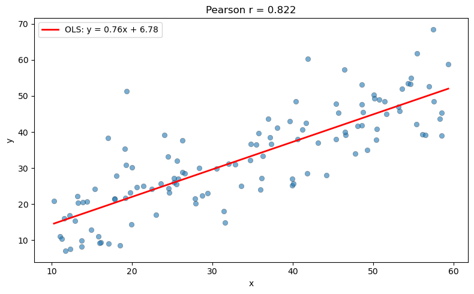

# 상관 분석 시연

## 개요

이 페이지에서는 선형관계가 알려진 이변량 자료에 대해 가장 흔한 세 상관계수인 Pearson, Spearman, Kendall을 계산하고 비교한다. Spearman 순위상관이 순위에 대해 계산한 Pearson 상관과 같음을 확인하고, 산점도와 보통최소제곱 회귀직선으로 자료를 시각화한다.

---

## Pearson, Spearman, Kendall 계수

짝지어진 관측값 $(x_1, y_1), \ldots, (x_n, y_n)$이 주어졌을 때 세 가지 표준 상관 측도는 다음과 같이 정의된다.

**Pearson의 $r$**은 *선형* 관계의 강도를 잰다:

$$
r = \frac{\sum_{i=1}^{n}(x_i - \bar{x})(y_i - \bar{y})}{\sqrt{\sum_{i=1}^{n}(x_i - \bar{x})^2}\;\sqrt{\sum_{i=1}^{n}(y_i - \bar{y})^2}}
$$

**Spearman의 $\rho_s$**는 $x$와 $y$의 순위에 Pearson의 $r$을 적용한 것이다:

$$
\rho_s = r(\text{rank}(x),\; \text{rank}(y))
$$

**Kendall의 $\tau$**는 일치쌍에서 불일치쌍을 뺀 비율을 센다:

$$
\tau = \frac{(\text{concordant pairs}) - (\text{discordant pairs})}{\binom{n}{2}}
$$

세 계수 모두 $[-1, 1]$ 안에 있지만 연관의 서로 다른 측면을 강조한다. Pearson은 선형관계를 포착하고, Spearman과 Kendall은 단조 관계를 포착하며 이상점에 더 로버스트하다.

---

## 이변량 자료 생성

Gauss 잡음을 가진 선형모형에서 $n = 120$개의 점을 생성한다:

$$
y_i = 0.8\, x_i + 5 + \varepsilon_i, \qquad \varepsilon_i \sim \mathcal{N}(0, 8^2)
$$

여기서 $x_i \sim \text{Uniform}(10, 60)$이다.

<div class="codebox" markdown>

**예제 1.** 이변량 자료 만들기

```python
import numpy as np
from scipy import stats

np.random.seed(42)

# 기울기 0.8 의 선형 관계에 표준편차 8 짜리 잡음을 얹는다.
n = 120
x = np.random.uniform(10, 60, n)
noise = np.random.normal(0, 8, n)
y = 0.8 * x + 5 + noise
```

</div>

---

## 상관계수 계산

SciPy는 각 측도에 대한 함수를 제공하며 계수와 함께 연관이 없다는 귀무가설 아래의 p-값을 돌려준다:

<div class="codebox" markdown>

**예제 2.** 세 상관계수 구하기

```python
# 세 측도를 함께 구한다. 관계가 선형이고 이상치가 없으면 셋이 비슷하게 나온다.
# 값이 크게 갈린다면 관계가 곡선이거나 이상치가 있다는 신호다.
r_pearson, p_pearson = stats.pearsonr(x, y)
r_spearman, p_spearman = stats.spearmanr(x, y)
r_kendall, p_kendall = stats.kendalltau(x, y)

print(f"Pearson  r = {r_pearson:.4f}  (p = {p_pearson:.2e})")
print(f"Spearman rho = {r_spearman:.4f}  (p = {p_spearman:.2e})")
print(f"Kendall  tau = {r_kendall:.4f}  (p = {p_kendall:.2e})")
```

출력:

```
Pearson  r = 0.8221  (p = 1.21e-30)
Spearman rho = 0.8363  (p = 1.38e-32)
Kendall  tau = 0.6420  (p = 2.54e-25)
```

</div>

세 계수가 0.82, 0.84, 0.64로 다르다. Kendall이 유독 작은 것은 척도가 달라서이며, 강도가 약하다는 뜻이 아니다.

---

## 순위 동등성 확인

유용한 항등식: Spearman의 $\rho_s$는 순위 변환된 자료로 계산한 Pearson $r$과 같다. 수치로 확인해 보자:

<div class="codebox" markdown>

**예제 3.** 순위에 대한 피어슨이 스피어만이다

```python
# Spearman 은 "순위에 대한 Pearson"이라는 정의를 그대로 확인한다.
r_rank = stats.pearsonr(stats.rankdata(x), stats.rankdata(y))[0]
print(f"Pearson r on ranks = {r_rank:.4f}")
print(f"Spearman rho       = {r_spearman:.4f}")
# 두 값이 같아야 한다.
```

출력:

```
Pearson r on ranks = 0.8363
Spearman rho       = 0.8363
```

</div>

순위로 바꾼 뒤 계산한 Pearson 상관이 Spearman과 정확히 같다. Spearman은 별개의 공식이 아니라 **순위에 적용한 Pearson**이라는 정의를 수치로 확인한 것이다.

---

## 회귀직선을 포함한 산점도

산점도에 보통최소제곱(OLS) 회귀직선을 겹쳐 그리면 선형모형이 적절한지 시각적으로 확인할 수 있다:

<div class="codebox" markdown>

**예제 4.** 회귀직선을 얹은 산점도

```python
import matplotlib.pyplot as plt

# 상관계수는 숫자 하나일 뿐이므로 반드시 그림과 함께 본다.
slope, intercept, _, _, _ = stats.linregress(x, y)

fig, ax = plt.subplots(figsize=(8, 5))
ax.scatter(x, y, alpha=0.6, edgecolors='k', linewidths=0.3)
x_line = np.array([x.min(), x.max()])
ax.plot(x_line, intercept + slope * x_line, 'r-', linewidth=2,
        label=f'OLS: y = {slope:.2f}x + {intercept:.2f}')
ax.set_xlabel('x')
ax.set_ylabel('y')
ax.set_title(f'Pearson r = {r_pearson:.3f}')
ax.legend()
plt.tight_layout()
plt.show()
```



</div>

산점도에 세 계수를 함께 적어 두면 어떤 모양에서 값이 갈리는지 볼 수 있다.

---

## 해석

잡음이 중간 정도인 선형모형에서 생성한 자료에서는 세 계수 모두 양수이고 매우 유의하다. $|r| \ge |\rho_s| \ge |\tau|$의 순서가 전형적이다. 참 관계가 선형일 때 Pearson의 $r$이 가장 강력하고 Kendall의 $\tau$가 가장 보수적이며 Spearman의 $\rho_s$가 그 사이에 있다.

관계가 비선형이지만 단조이면 Spearman과 Kendall이 Pearson보다 낫다. 자료에 이상점이 있으면 순위 기반 측도가 더 로버스트하다. 어떤 상관 수치 하나에 의존하기 전에 언제나 산점도를 살펴보라.

---

## 연습문제

<div class="drillbox" markdown>

**연습문제 1.** <span class="diff med" title="중간"></span>
$x \sim \text{Uniform}(0, 20)$이고 $\varepsilon \sim \mathcal{N}(0, 5^2)$인 모형 $y = 3x + 2 + \varepsilon$에서 $n = 200$개의 관측값을 생성하라. 세 상관계수와 그 p-값을 모두 계산하라. 절댓값이 가장 큰 계수는 무엇이며 그 이유는?

</div>

??? success "풀이"

    ```python
    import numpy as np
    from scipy import stats

    np.random.seed(0)
    n = 200
    x = np.random.uniform(0, 20, n)
    y = 3 * x + 2 + np.random.normal(0, 5, n)

    r_p, p_p = stats.pearsonr(x, y)
    r_s, p_s = stats.spearmanr(x, y)
    r_k, p_k = stats.kendalltau(x, y)

    print(f"Pearson  r = {r_p:.4f}, p = {p_p:.2e}")
    print(f"Spearman rho = {r_s:.4f}, p = {p_s:.2e}")
    print(f"Kendall  tau = {r_k:.4f}, p = {p_k:.2e}")
    ```

    출력:

    ```
    Pearson  r = 0.9601, p = 1.42e-111
    Spearman rho = 0.9593, p = 1.14e-110
    Kendall  tau = 0.8227, p = 4.63e-67
    ```

    $n$이 크면 p-값이 $10^{-100}$ 수준까지 내려간다. 이런 숫자는 "관계가 강하다"가 아니라 "우연으로 보기 어렵다"는 뜻일 뿐이며, 강도는 $r$ 자체로 읽어야 한다.

    참 관계가 선형이므로 Pearson의 $r$이 가장 효율적인 추정량이며 값도 가장 크다. Spearman의 $\rho_s$는 가깝지만 조금 낮고 Kendall의 $\tau$가 가장 작다. 잡음에 비해 선형 신호가 강하므로 셋 다 매우 유의하다. $\square$

<div class="drillbox" markdown>

**연습문제 2.** <span class="diff med" title="중간"></span>
Spearman의 $\rho_s > 0.9$이면서 Pearson의 $r < 0.5$인 $n = 100$개 자료를 구성하라. 이런 차이를 만드는 관계는 어떤 종류인지 설명하라.

</div>

??? success "풀이"

    단조이면서 강하게 비선형인 관계가 Spearman은 높고 Pearson은 낮은 결과를 만든다. 예를 들어:

    ```python
    import numpy as np
    from scipy import stats

    np.random.seed(42)
    x = np.random.uniform(0, 5, 100)
    y = np.exp(x) + np.random.normal(0, 1, 100)

    r_p, _ = stats.pearsonr(x, y)
    r_s, _ = stats.spearmanr(x, y)
    print(f"Pearson r = {r_p:.4f}")
    print(f"Spearman rho = {r_s:.4f}")
    ```

    출력:

    ```
    Pearson r = 0.8556
    Spearman rho = 0.9821
    ```

    Pearson 0.856과 Spearman 0.982의 차이가 이 예제의 요점이다. 관계가 단조이지만 곡선이면 순위 기반 계수가 더 큰 값을 준다.

    지수 관계는 강하게 단조이지만($\rho_s$가 높다) 선형에서 멀어 Pearson의 $r$이 상당히 낮다. Pearson은 선형 연관만 포착하고 Spearman은 어떤 단조 관계든 포착함을 보여준다. $\square$

<div class="drillbox" markdown>

**연습문제 3.** <span class="diff med" title="중간"></span>
Pearson의 $r$이 양의 아핀 변환에 불변임을 증명하라. 즉 상수 $a, c > 0$과 임의의 $b, d$에 대해

$$
r(aX + b,\; cY + d) = r(X, Y)
$$

임을 보여라.

</div>

??? success "풀이"

    $a, c > 0$일 때 $U = aX + b$, $V = cY + d$라 하자. 그러면 $\bar{U} = a\bar{X} + b$, $\bar{V} = c\bar{Y} + d$이므로 $U_i - \bar{U} = a(X_i - \bar{X})$, $V_i - \bar{V} = c(Y_i - \bar{Y})$이다.

    $r(U, V)$의 분자는

    $$
    \sum_{i=1}^n (U_i - \bar{U})(V_i - \bar{V}) = ac \sum_{i=1}^n (X_i - \bar{X})(Y_i - \bar{Y})
    $$

    이 되고, 분모는

    $$
    \sqrt{\sum(U_i - \bar{U})^2}\;\sqrt{\sum(V_i - \bar{V})^2} = a\sqrt{\sum(X_i - \bar{X})^2}\;\cdot\; c\sqrt{\sum(Y_i - \bar{Y})^2}
    $$

    이 된다. 따라서

    $$
    r(U, V) = \frac{ac \sum(X_i - \bar{X})(Y_i - \bar{Y})}{ac\sqrt{\sum(X_i - \bar{X})^2}\;\sqrt{\sum(Y_i - \bar{Y})^2}} = r(X, Y)
    $$

    이다. 양의 상수 $a$와 $c$가 비에서 상쇄된다. $\square$

<div class="drillbox" markdown>

**연습문제 4.** <span class="diff med" title="중간"></span>
두 배열을 받아 세 상관계수를 사전으로 돌려주는 Python 함수를 작성하라. (a) 강한 선형, (b) 약한 비선형, (c) 이상점이 있는 자료의 세 상황에서 시험하라. 이상점의 영향을 가장 크게 받는 계수를 논하라.

</div>

??? success "풀이"

    ```python
    import numpy as np
    from scipy import stats

    def all_correlations(x, y):
        r_p, _ = stats.pearsonr(x, y)
        r_s, _ = stats.spearmanr(x, y)
        r_k, _ = stats.kendalltau(x, y)
        return {"pearson": r_p, "spearman": r_s, "kendall": r_k}

    np.random.seed(42)
    n = 100

    # (가) 강한 선형 관계
    x_a = np.random.normal(0, 1, n)
    y_a = 2 * x_a + np.random.normal(0, 0.5, n)
    print("Linear:", all_correlations(x_a, y_a))

    # (나) 약한 비선형 관계
    x_b = np.random.uniform(-3, 3, n)
    y_b = x_b ** 2 + np.random.normal(0, 1, n)
    print("Quadratic:", all_correlations(x_b, y_b))

    # (다) 이상치가 섞인 경우
    x_c = np.random.normal(0, 1, n)
    y_c = 0.8 * x_c + np.random.normal(0, 0.3, n)
    x_c[:3] = [6, -6, 7]
    y_c[:3] = [-6, 6, -7]
    print("Outliers:", all_correlations(x_c, y_c))
    ```

    출력:

    ```
    Linear: {'pearson': 0.9654943669720492, 'spearman': 0.9640324032403239, 'kendall': 0.8408080808080809}
    Quadratic: {'pearson': -0.28540752875587533, 'spearman': -0.15697569756975696, 'kendall': -0.09292929292929294}
    Outliers: {'pearson': -0.1603686865830897, 'spearman': 0.7779657965796579, 'kendall': 0.6993939393939395}
    ```

    네 자료의 결과를 나란히 놓으면 세 계수의 성격이 갈린다. 선형 자료에서는 셋이 모두 0.84~0.97로 비슷하지만, 이차 관계에서는 Pearson이 $-0.29$, Kendall이 $-0.09$로 크게 벌어진다. 어느 쪽도 "관계가 없다"는 뜻이 아니라 **어느 계수도 U자 관계를 재도록 만들어지지 않았다**는 뜻이다.

    Pearson의 $r$이 이상점의 영향을 가장 크게 받는다. 극단값에 민감한 평균과 표준편차에 의존하기 때문이다. 순위 기반인 Spearman과 Kendall은 더 로버스트하다. 상황 (c)에서 이상점이 Pearson의 $r$을 0(또는 음수) 쪽으로 끌어내리는 반면 Spearman과 Kendall은 참된 양의 연관에 더 가깝게 남는다. $\square$

<div class="drillbox" markdown>

**연습문제 5.** <span class="diff med" title="중간"></span>
크기 $n$인 이변량 표본에서 Pearson의 $r = 1$이면 모든 점 $(x_i, y_i)$가 기울기가 양수인 한 직선 위에 있음을 보여라. 형식적인 증명을 제시하라.

</div>

??? success "풀이"

    Cauchy-Schwarz 부등식은 벡터 $\mathbf{a}, \mathbf{b} \in \mathbb{R}^n$에 대해

    $$
    \left(\sum_{i=1}^n a_i b_i\right)^2 \le \left(\sum_{i=1}^n a_i^2\right)\left(\sum_{i=1}^n b_i^2\right)
    $$

    이며, 등호는 어떤 스칼라 $\lambda$에 대해 $\mathbf{a} = \lambda \mathbf{b}$일 때에만 성립한다고 말한다.

    $a_i = x_i - \bar{x}$, $b_i = y_i - \bar{y}$라 두면 $r = 1$은

    $$
    \frac{\sum a_i b_i}{\sqrt{\sum a_i^2}\sqrt{\sum b_i^2}} = 1
    $$

    을 뜻한다. Cauchy-Schwarz의 등호 조건에 의해 모든 $i$에서 $y_i - \bar{y} = \lambda(x_i - \bar{x})$이고, $r > 0$이므로 $\lambda > 0$이다. 정리하면 $y_i = \lambda x_i + (\bar{y} - \lambda \bar{x})$이며, 이는 기울기가 $\lambda > 0$인 직선이다. $\square$

---

## 정리하며

상관계수 셋은 **재는 대상이 다르다.**

| | 무엇을 재는가 | 강건성 |
|---|---|---|
| 피어슨 $r$ | **선형** 관계 | 이상치에 약함 |
| 스피어만 $\rho$ | **단조** 관계 | 순위 기반이라 강건 |
| 켄달 $\tau$ | 순서쌍의 일치 비율 | 가장 강건, 소표본에 유리 |

- **스피어만은 순위에 대한 피어슨이다.** 자료를 순위로 바꾼 뒤 피어슨을 계산하면 정확히 같은 값이 나오며, 이 절에서 직접 확인했다.
- **$r=0$ 이 무관함을 뜻하지 않는다.** 3장에서 본 $Y=X^2$ 처럼 완벽한 관계인데도 $r=0$ 일 수 있다. **선형이 아닌 관계는 피어슨이 보지 못한다.**
- **그래서 산점도를 먼저 본다.** 앤스컴의 사중주가 보여 주듯 $r$ 이 같아도 자료의 모양은 전혀 다를 수 있다.
- **단조이되 비선형이면 스피어만이 더 크게 나온다.** 두 계수의 차이 자체가 관계의 모양에 대한 힌트다.
- **회귀직선과 함께 보는 습관.** $r$ 과 기울기는 다른 양이며, 다음 절들에서 그 관계를 다룬다.

다음 절 **상관 시각화**로 넘어간다.
