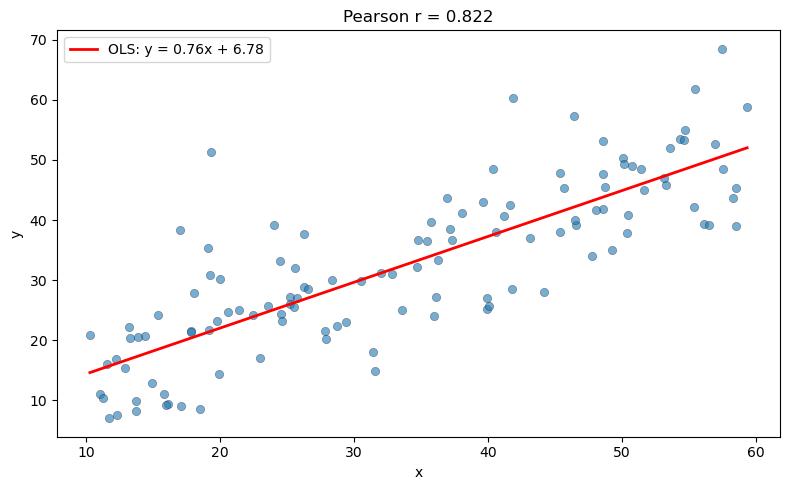

# 상관 분석 시연

## 개요

이 페이지에서는 선형관계가 알려진 이변량 자료에 대해 가장 흔한 세 상관계수인 Pearson, Spearman, Kendall을 계산하고 비교한다. Spearman 순위상관이 순위에 대해 계산한 Pearson 상관과 같음을 확인하고, 산점도와 보통최소제곱 회귀직선으로 자료를 시각화한다.

---

## 1. Pearson, Spearman, Kendall 계수

짝지어진 관측값 $(x_1, y_1), \ldots, (x_n, y_n)$이 주어졌을 때 세 가지 표준 상관 측도는 다음과 같이 정의된다.

**Pearson의 $r$**은 *선형* 관계의 강도를 잰다:

$$
r = \frac{\sum_{i=1}^{n}(x_i - \bar{x})(y_i - \bar{y})}{\sqrt{\sum_{i=1}^{n}(x_i - \bar{x})^2}\;\sqrt{\sum_{i=1}^{n}(y_i - \bar{y})^2}}
$$

**Spearman의 $\rho_s$**는 $x$와 $y$의 순위에 Pearson의 $r$을 적용한 것이다:

$$
\rho_s = r(\text{rank}(x),\; \text{rank}(y))
$$

**Kendall의 $\tau$**는 일치쌍에서 불일치쌍을 뺀 비율을 센다:

$$
\tau = \frac{(\text{concordant pairs}) - (\text{discordant pairs})}{\binom{n}{2}}
$$

세 계수 모두 $[-1, 1]$ 안에 있지만 연관의 서로 다른 측면을 강조한다. Pearson은 선형관계를 포착하고, Spearman과 Kendall은 단조 관계를 포착하며 이상점에 더 로버스트하다.

---

## 2. 이변량 자료 생성

Gauss 잡음을 가진 선형모형에서 $n = 120$개의 점을 생성한다:

$$
y_i = 0.8\, x_i + 5 + \varepsilon_i, \qquad \varepsilon_i \sim \mathcal{N}(0, 8^2)
$$

여기서 $x_i \sim \text{Uniform}(10, 60)$이다.

<div class="exbox" markdown>

**보기 1.** <span class="diff easy" title="쉬움"></span> 모형에서 상관을 미리 계산하기. 위 모형에서 $x$와 $\varepsilon$은 독립이다.

**(1)** 자료를 보기 전에 모집단 상관 $\rho_{XY}$를 손으로 구하시오.

**(2)** 잡음의 표준편차를 $8$에서 $16$으로 키우면 $\rho$는 얼마가 되는가. 절반으로 줄어드는가.

</div>

??? success "풀이"

    **(1) 해석적으로.** $X \sim \text{Uniform}(10, 60)$이므로 구간 길이가 $50$이고

    $$
    \operatorname{Var}(X) = \frac{50^2}{12} = \frac{2500}{12} = 208.3333,
    \qquad
    \sigma_X = 14.4338
    $$

    이다. $Y = 0.8X + 5 + \varepsilon$에서 상수 $5$는 분산에도 공분산에도 기여하지 않고, $\varepsilon$이 $X$와 독립이므로

    $$
    \operatorname{Cov}(X, Y) = \operatorname{Cov}(X,\, 0.8X) = 0.8 \operatorname{Var}(X) = 166.6667,
    $$

    $$
    \operatorname{Var}(Y) = 0.8^2 \operatorname{Var}(X) + \sigma^2 = 0.64 \times 208.3333 + 64 = 197.3333,
    \qquad
    \sigma_Y = 14.0475
    $$

    이다. 따라서

    $$
    \rho_{XY} = \frac{0.8\,\sigma_X^2}{\sigma_X \sqrt{0.64\,\sigma_X^2 + \sigma^2}}
    = \frac{0.8\,\sigma_X}{\sqrt{0.64\,\sigma_X^2 + \sigma^2}}
    = \frac{166.6667}{14.4338 \times 14.0475} = 0.8220
    $$

    이다. 마지막 꼴을 보면 **$\rho$를 정하는 것은 $0.8\sigma_X$와 $\sigma$의 비 하나뿐**임이 드러난다. 여기서는 $0.8 \times 14.4338 = 11.547$ 대 $8$이다.

    **(2)** 같은 식에 $\sigma = 16$을 넣으면

    $$
    \rho = \frac{11.547}{\sqrt{11.547^2 + 16^2}} = \frac{11.547}{19.729} = 0.5852
    $$

    이다. **절반이 아니다.** 신호 대 잡음비가 $11.547/8 = 1.443$에서 $0.722$로 절반이 되었는데 $\rho$는 $0.8220$에서 $0.5852$로 $71\%$만 남는다. $\rho = s/\sqrt{s^2+1}$ 꼴(여기서 $s$는 신호 대 잡음비)은 $s$가 작을 때만 $s$에 거의 비례하고, $s$가 1을 넘으면 1에 눌려 천천히 움직인다. 잡음을 더 키워 $\sigma = 100$으로 해도 $\rho = 0.1147$로 0에 다가가기만 할 뿐 음수가 되지는 않는다.

    **확인.** 뒤에서 쓸 자료를 만들고 위 수치를 찍어 둔다.

    ```python
    import numpy as np
    from scipy import stats

    np.random.seed(42)

    # 기울기 0.8 의 선형 관계에 표준편차 8 짜리 잡음을 얹는다.
    n = 120
    x = np.random.uniform(10, 60, n)
    noise = np.random.normal(0, 8, n)
    y = 0.8 * x + 5 + noise

    sigma_x = np.sqrt(50 ** 2 / 12)      # 균등분포의 표준편차
    signal = 0.8 * sigma_x               # 기울기가 만들어 내는 Y 의 변동 폭
    print(f"sigma_X = {sigma_x:.4f},  0.8 sigma_X = {signal:.4f}")
    for sigma in (8, 16, 100):
        print(f"  sigma = {sigma:3d}  ->  rho = {signal / np.sqrt(signal ** 2 + sigma ** 2):.4f}")
    ```

    출력:

    ```
    sigma_X = 14.4338,  0.8 sigma_X = 11.5470
      sigma =   8  ->  rho = 0.8220
      sigma =  16  ->  rho = 0.5852
      sigma = 100  ->  rho = 0.1147
    ```

    손으로 구한 세 값과 모두 맞는다.

---

## 3. 상관계수 계산

SciPy는 각 측도에 대한 함수를 제공하며 계수와 함께 연관이 없다는 귀무가설 아래의 p-값을 돌려준다:

<div class="exbox" markdown>

**보기 2.** <span class="diff easy" title="쉬움"></span> 세 계수를 무엇과 견줄 것인가. 보기 1의 `x`, `y`를 이어받아 세 계수를 구한다.

**(1)** 표본 Pearson $r$를 보기 1에서 유도한 $\rho$와 견주시오.

**(2)** 이변량 정규분포에서는 $\tau = \frac{2}{\pi}\arcsin\rho$, $\rho_s = \frac{6}{\pi}\arcsin\frac{\rho}{2}$라는 닫힌 꼴이 있다. 이 자료의 $\tau$와 $\rho_s$를 그 식으로 예측해도 되는가.

</div>

??? success "풀이"

    **(1)** 보기 1에서 $\rho = 0.8220$을 얻었고, 표본상관의 표준오차는

    $$
    \operatorname{SE}(r) \approx \frac{1 - \rho^2}{\sqrt{n}} = \frac{1 - 0.8220^2}{\sqrt{120}} = \frac{0.3243}{10.954} = 0.0296
    $$

    이다. 표본값이 이 폭 안에 들어오면 맞는 것이다.

    **(2) 쓰면 안 된다.** 두 닫힌 꼴은 $(X, Y)$가 **이변량 정규**일 때의 결과다. 여기서는 $X$가 균등분포이므로 $(X,Y)$가 이변량 정규가 아니고, 식의 전제가 깨진다. $\tau$와 $\rho_s$는 주변분포를 바꾸지 않는 단조변환에만 불변일 뿐 **주변분포 자체가 다르면 값이 달라진다.**

    닫힌 꼴이 없으므로 모집단 값을 모의실험으로 잰다. 같은 모형에서 아주 큰 표본을 거듭 뽑아 평균을 내면 그것이 참값이다.

    ```python
    # 세 측도를 함께 구한다. 관계가 선형이고 이상치가 없으면 셋이 비슷하게 나온다.
    # 값이 크게 갈린다면 관계가 곡선이거나 이상치가 있다는 신호다.
    r_pearson, p_pearson = stats.pearsonr(x, y)
    r_spearman, p_spearman = stats.spearmanr(x, y)
    r_kendall, p_kendall = stats.kendalltau(x, y)

    print(f"Pearson  r = {r_pearson:.4f}  (p = {p_pearson:.2e})")
    print(f"Spearman rho = {r_spearman:.4f}  (p = {p_spearman:.2e})")
    print(f"Kendall  tau = {r_kendall:.4f}  (p = {p_kendall:.2e})")

    # (1) 의 닫힌 꼴과 견준다.
    var_x = 50 ** 2 / 12
    rho = 0.8 * var_x / np.sqrt(var_x * (0.64 * var_x + 64))
    se = (1 - rho ** 2) / np.sqrt(n)
    print(f"\n이론 rho   = {rho:.4f}   SE = {se:.4f}   z = {(r_pearson - rho) / se:+.3f}")

    # tau 와 rho_s 에는 닫힌 꼴이 없다. 같은 모형에서 큰 표본을 거듭 뽑아 모집단 값을 잰다.
    rng = np.random.default_rng(1)
    taus, rhos = [], []
    for _ in range(40):
        bx = rng.uniform(10, 60, 50_000)
        by = 0.8 * bx + 5 + rng.normal(0, 8, 50_000)
        taus.append(stats.kendalltau(bx, by).statistic)
        rhos.append(stats.spearmanr(bx, by).statistic)
    print(f"모의 tau   = {np.mean(taus):.4f} +- {np.std(taus) / np.sqrt(40):.4f}   표본 {r_kendall:.4f}")
    print(f"모의 rho_s = {np.mean(rhos):.4f} +- {np.std(rhos) / np.sqrt(40):.4f}   표본 {r_spearman:.4f}")

    # 이변량 정규에서만 성립하는 닫힌 꼴. 여기서는 x 가 균등이므로 맞지 않는다.
    print(f"\n정규 가정 공식: tau = (2/pi)arcsin(rho)   = {2 / np.pi * np.arcsin(rho):.4f}")
    print(f"                rho_s = (6/pi)arcsin(rho/2) = {6 / np.pi * np.arcsin(rho / 2):.4f}")
    ```

    출력:

    ```
    Pearson  r = 0.8221  (p = 1.21e-30)
    Spearman rho = 0.8363  (p = 1.38e-32)
    Kendall  tau = 0.6420  (p = 2.54e-25)

    이론 rho   = 0.8220   SE = 0.0296   z = +0.003
    모의 tau   = 0.6292 +- 0.0002   표본 0.6420
    모의 rho_s = 0.8326 +- 0.0002   표본 0.8363

    정규 가정 공식: tau = (2/pi)arcsin(rho)   = 0.6143
                    rho_s = (6/pi)arcsin(rho/2) = 0.8089
    ```

    **(1)의 답.** 표본 $r = 0.8221$이 이론값 $0.8220$에서 표준오차의 $0.003$배 떨어져 있다. 우연히 잘 맞은 것이고 보통은 이보다 더 벌어진다. 바로 그 폭을 $\operatorname{SE} = 0.0296$이 말해 준다.

    **(2)의 답.** 모의실험이 준 모집단 값은 $\tau = 0.6292$, $\rho_s = 0.8326$이다. 정규 가정 공식은 $0.6143$과 $0.8089$를 주므로 각각 $0.015$와 $0.024$만큼 **치우쳐 있다.** 같은 모형에서 $n = 120$ 표본을 거듭 뽑아 재 보면 $\tau$의 표집 표준편차가 $0.031$, $\rho_s$의 것이 $0.029$이니, 이 치우침은 표본 하나의 흔들림과 맞먹는 크기다. 한 표본에서는 묻히지만 **표본을 아무리 키워도 사라지지 않는다.** 모의실험 값의 불확실도는 $\pm 0.0002$에 지나지 않는다.

    표본값 $\tau = 0.6420$과 $\rho_s = 0.8363$은 모의실험이 준 모집단 값에서 각각 $0.41$과 $0.13$ 표집 표준편차 안이다. **옳은 기준과는 맞고 잘못된 기준과는 어긋난다.**

    세 계수가 $0.82$, $0.84$, $0.64$로 갈리는 것도 이 눈금 차이 때문이다. Kendall이 유독 작은 것은 척도가 달라서이며 강도가 약하다는 뜻이 아니다.

---

## 4. 순위 동등성 확인

유용한 항등식: Spearman의 $\rho_s$는 순위 변환된 자료로 계산한 Pearson $r$과 같다. 수치로 확인해 보자:

<div class="exbox" markdown>

**보기 3.** <span class="diff easy" title="쉬움"></span> 순위에 대한 피어슨이 스피어만이다. 동점이 없는 $n$개 자료를 생각하자.

**(1)** 동점이 없으면 순위는 $1, 2, \ldots, n$의 치환이다. 이 사실만으로 Spearman의 간편 공식

$$
\rho_s = 1 - \frac{6\sum_i d_i^2}{n(n^2-1)},
\qquad d_i = R(x_i) - R(y_i)
$$

를 유도하시오.

**(2)** 세 가지 — `spearmanr`, 순위에 대한 `pearsonr`, 간편 공식 — 가 같은 값을 주는지 확인하시오.

</div>

??? success "풀이"

    **(1) 해석적으로.** $R(x_i)$와 $R(y_i)$는 각각 $1$부터 $n$까지를 한 번씩 쓰므로 **평균과 분산이 서로 같고 자료에 의존하지 않는다.**

    $$
    \bar{R} = \frac{1}{n}\sum_{k=1}^{n} k = \frac{n+1}{2},
    \qquad
    \sum_{i}(R(x_i) - \bar{R})^2 = \sum_{i}(R(y_i) - \bar{R})^2 = \frac{n(n^2-1)}{12}
    $$

    마지막 값은 $\sum_{k=1}^n k^2 - n\bar{R}^2 = \frac{n(n+1)(2n+1)}{6} - \frac{n(n+1)^2}{4} = \frac{n(n^2-1)}{12}$에서 나온다. 이 양을 $S$라 쓰자.

    이제 $a_i = R(x_i) - \bar R$, $b_i = R(y_i) - \bar R$로 두면 $d_i = a_i - b_i$이고

    $$
    \sum_i d_i^2 = \sum_i a_i^2 + \sum_i b_i^2 - 2\sum_i a_i b_i = 2S - 2\sum_i a_i b_i
    $$

    이므로 $\sum_i a_i b_i = S - \frac{1}{2}\sum_i d_i^2$이다. 순위에 대한 Pearson 상관은 분모가 $\sqrt{S}\sqrt{S} = S$이므로

    $$
    \rho_s = \frac{\sum_i a_i b_i}{S}
    = \frac{S - \frac{1}{2}\sum_i d_i^2}{S}
    = 1 - \frac{\sum_i d_i^2}{2S}
    = 1 - \frac{6\sum_i d_i^2}{n(n^2-1)}
    $$

    이다. **공식이 간단해지는 유일한 이유는 두 순위열의 제곱합이 똑같이 $S$로 고정된다는 것**이다. 동점이 생겨 중간순위를 쓰면 제곱합이 $S$보다 작아지므로 이 유도가 무너지고, 간편 공식도 더 이상 정확하지 않다.

    **(2) 수치적으로.** $n = 120$, 동점 없음이므로 셋이 모두 같아야 한다.

    ```python
    # Spearman 은 "순위에 대한 Pearson"이라는 정의를 그대로 확인한다.
    rx, ry = stats.rankdata(x), stats.rankdata(y)
    r_rank = stats.pearsonr(rx, ry)[0]
    print(f"Pearson r on ranks = {r_rank:.4f}")
    print(f"Spearman rho       = {r_spearman:.4f}")
    # 두 값이 같아야 한다.

    # 간편 공식도 같은 값을 주는지 본다.
    d2 = np.sum((rx - ry) ** 2)
    shortcut = 1 - 6 * d2 / (n * (n ** 2 - 1))
    print(f"\n동점 개수 = {n - len(np.unique(rx))} (x), {n - len(np.unique(ry))} (y)")
    print(f"sum d^2 = {d2:.0f},  S = n(n^2-1)/12 = {n * (n ** 2 - 1) / 12:.0f}")
    print(f"간편 공식 = {shortcut:.6f}   spearmanr = {r_spearman:.6f}")
    print(f"세 값이 같은가: {np.allclose([r_rank, shortcut], r_spearman)}")
    ```

    출력:

    ```
    Pearson r on ranks = 0.8363
    Spearman rho       = 0.8363

    동점 개수 = 0 (x), 0 (y)
    sum d^2 = 47138,  S = 143990
    간편 공식 = 0.836315   spearmanr = 0.836315
    세 값이 같은가: True
    ```

    셋이 소수 여섯째 자리까지 같다. 손으로 확인해 보면 $1 - 47138/(2 \times 143990) = 1 - 0.163685 = 0.836315$다.

    Spearman은 별개의 공식이 아니라 **순위에 적용한 Pearson**이며, 간편 공식은 그것을 동점 없는 경우에 한해 다시 쓴 것일 뿐이다.

---

## 5. 회귀직선을 포함한 산점도

산점도에 보통최소제곱(OLS) 회귀직선을 겹쳐 그리면 선형모형이 적절한지 시각적으로 확인할 수 있다:

<div class="exbox" markdown>

**보기 4.** <span class="diff easy" title="쉬움"></span> 회귀직선을 얹어 읽기. 같은 자료에 OLS 직선을 겹쳐 그린다.

**(1)** 그림의 직선은 $y = 0.76x + 6.78$이다. 자료를 만들 때 쓴 참 직선은 $y = 0.8x + 5$였다. 어긋남을 어떻게 설명해야 하는가.

**(2)** 상관 $r = 0.822$와 이 직선의 기울기 $0.76$은 서로 어떤 관계인가. 그림에서 둘을 각각 어디서 읽는가.

</div>

??? success "풀이"

    **(1) 표집 변동이다.** OLS 기울기의 표준오차는

    $$
    \operatorname{SE}(\hat\beta) = \frac{\sigma}{\sigma_X \sqrt{n}} = \frac{8}{14.4338 \times \sqrt{120}} = 0.0506
    $$

    이므로 $0.7622$는 참값 $0.8$에서 $0.75$ 표준오차 떨어져 있다. 절편의 표준오차는 더 크다. 절편은 $x = 0$에서의 값인데 자료가 $x \in [10, 60]$에만 있으므로 **외삽**이고, 기울기가 조금만 기울어도 절편이 크게 흔들린다. 여기서는 $6.78$ 대 $5$다.

    **(2) 둘은 한 식으로 묶여 있다.** OLS 기울기는

    $$
    \hat\beta = \frac{\sum_i (x_i-\bar x)(y_i-\bar y)}{\sum_i (x_i-\bar x)^2}
    = r \cdot \frac{s_y}{s_x}
    $$

    이다. **$r$는 단위가 없고 $\hat\beta$는 단위가 있다.** 그래서 $r$는 그림을 가로세로로 늘였다 줄여도 그대로이지만 기울기는 바뀐다. 그림에서 $r$를 읽는 자리는 **점들이 직선 둘레에 얼마나 몰려 있는가**이고, 기울기를 읽는 자리는 **직선이 얼마나 가파른가**다.

    ```python
    import matplotlib.pyplot as plt

    plt.rcParams["font.sans-serif"] = ["NanumGothic", "Apple SD Gothic Neo", "Malgun Gothic"]
    plt.rcParams["font.family"] = "sans-serif"
    plt.rcParams["axes.unicode_minus"] = False

    # 상관계수는 숫자 하나일 뿐이므로 반드시 그림과 함께 본다.
    slope, intercept, _, _, _ = stats.linregress(x, y)

    fig, ax = plt.subplots(figsize=(8, 5))
    ax.scatter(x, y, alpha=0.6, edgecolors='k', linewidths=0.3)
    x_line = np.array([x.min(), x.max()])
    ax.plot(x_line, intercept + slope * x_line, 'r-', linewidth=2,
            label=f'OLS: y = {slope:.2f}x + {intercept:.2f}')
    ax.set_xlabel('x')
    ax.set_ylabel('y')
    ax.set_title(f'Pearson r = {r_pearson:.3f}')
    ax.legend()
    plt.tight_layout()
    plt.show()

    # 그림에서 읽을 수치를 찍어 둔다.
    sx, sy = x.std(ddof=1), y.std(ddof=1)
    print(f"기울기 {slope:.4f}  =  r * s_y/s_x = {r_pearson:.4f} * {sy:.4f}/{sx:.4f} = {r_pearson * sy / sx:.4f}")
    print(f"절편 {intercept:.4f}   (참값: 기울기 0.8, 절편 5)")
    print(f"SE(beta) = sigma/(sigma_X sqrt(n)) = {8 / (np.sqrt(50 ** 2 / 12) * np.sqrt(n)):.4f}, "
          f"z = {(slope - 0.8) / (8 / (np.sqrt(50 ** 2 / 12) * np.sqrt(n))):+.3f}")
    print(f"r^2 = {r_pearson ** 2:.4f}   잔차 표준편차 = {np.std(y - (intercept + slope * x), ddof=2):.4f}  (참값 8)")
    ```

    출력:

    ```
    기울기 0.7622  =  r * s_y/s_x = 0.8221 * 13.8062/14.8914 = 0.7622
    절편 6.7816   (참값: 기울기 0.8, 절편 5)
    SE(beta) = sigma/(sigma_X sqrt(n)) = 0.0506, z = -0.748
    r^2 = 0.6758   잔차 표준편차 = 7.8939  (참값 8)
    ```

    

    $\hat\beta = r \cdot s_y/s_x$가 소수 넷째 자리까지 맞고, 기울기의 어긋남 $-0.748$ 표준오차도 표집 변동으로 설명된다. 잔차 표준편차 $7.89$가 참 잡음 $8$과 맞는 것도 함께 확인된다.

    그림에서 **$r^2 = 0.676$이 눈으로 읽히는 자리**를 짚어 두자. $y$의 흩어짐 $13.81$ 가운데 직선이 설명하는 몫이 $67.6\%$이고 남은 것이 $\sqrt{1-r^2} \times 13.81 = 7.86$이다. 그림에서 $x = 40$ 둘레의 점들이 세로로 $\pm 15.7$쯤 퍼져 있는 것이 그 $2\sigma$ 폭이다. **$r = 0.82$는 "거의 직선"이 아니다.** 직선 둘레의 띠가 눈에 보일 만큼 두껍다.

    그림의 제목이 Pearson $r$만 적고 있다는 점도 짚을 만하다. 보기 2에서 본 대로 같은 자료의 $\tau$는 $0.642$인데, 그 수를 모르는 독자가 이 산점도만 보고 $\tau$를 가늠할 길은 없다. **한 그림에 한 계수만 적으면 나머지 둘은 그림에서 사라진다.**

---

## 6. 해석

잡음이 중간 정도인 선형모형에서 생성한 자료에서는 세 계수 모두 양수이고 매우 유의하다. $|r| \ge |\rho_s| \ge |\tau|$의 순서가 전형적이다. 참 관계가 선형일 때 Pearson의 $r$이 가장 강력하고 Kendall의 $\tau$가 가장 보수적이며 Spearman의 $\rho_s$가 그 사이에 있다.

관계가 비선형이지만 단조이면 Spearman과 Kendall이 Pearson보다 낫다. 자료에 이상점이 있으면 순위 기반 측도가 더 로버스트하다. 어떤 상관 수치 하나에 의존하기 전에 언제나 산점도를 살펴보라.

---

## 연습문제

<div class="drillbox" markdown>

**연습문제 1.** <span class="diff easy" title="쉬움"></span>
상관 분석의 **전체 절차**를 정리하라.

</div>

??? success "풀이"
    **절차 일곱 단계.**

    ```text
    1. 자료를 본다        ─ 결측, 이상점, 자료형, 관측의 독립성
    2. 산점도를 그린다     ─ 모양, 군집, 이상점
    3. 계수를 고른다       ─ 피어슨 / 스피어만 / 켄들
    4. 계산한다            ─ 유효 표본수를 함께 기록
    5. 구간을 만든다       ─ 피셔 z 또는 부트스트랩
    6. 진단한다            ─ 잔차, 쿡 D, 두 계수의 차이
    7. 보고한다            ─ 인과를 주장하지 않는다
    ```

    **계수 선택표.**

    | 자료 | 계수 |
    |---|---|
    | 연속 · 선형 · 이상점 없음 | **피어슨** |
    | 단조 비선형 | 스피어만 |
    | **동점이 많은 서열** | **켄들 $\tau_b$** |
    | 한쪽이 이진 | 점이연(= 피어슨) |
    | 둘 다 이진 | 파이(= 피어슨) |
    | 비단조 | **상관계수 아님**(거리 상관 등) |

    **핵심 수치 여섯.**

    | 사실 | 값 |
    |---|---|
    | $p=10$ 변수에서 우연히 유의할 확률 | **0.906** |
    | $p=50$의 평균 가짜 유의 개수 | **61.24** |
    | AR(1) $\phi=0.9$의 1종 오류 | **0.507** |
    | 공통 추세가 있을 때 1종 오류 | **1.000** |
    | 차분 후 회복된 오류율 | 0.058 |
    | pairwise 상관행렬의 최소 고윳값 | **$-0.560$**(불가능한 행렬) |

    **점검 체크리스트 여덟.**

    ```text
    □ 산점도를 그렸는가
    □ 결측을 어떻게 처리했는가 (쌍마다 n 이 다른가)
    □ 관측이 서로 독립인가 (시계열·군집·반복측정)
    □ 이상점이 결과를 바꾸는가 (빼고 다시 계산)
    □ 피어슨과 스피어만이 크게 다른가
    □ 여러 쌍을 검정했다면 보정했는가
    □ 신뢰구간을 보고했는가
    □ 인과 해석을 피했는가
    ```

    **세 번째가 가장 자주 무시된다.** 상관의 표준오차는 **독립 관측 $n$개**를 전제한다.

    **보고 형식.**

    ```text
    광고비와 매출의 관계 (월별, 2019-2024, n = 72)

      수준 자료:   r = 0.91  ← 보고하지 않음 (둘 다 시간 추세를 가짐)
      1차 차분:    r = 0.34,  95% CI [0.11, 0.53],  p = 0.004
                   유효 표본수 71

      두 계열 모두 단위근 검정에서 비정상으로 판정되어 차분 후
      분석했다. 차분 자료의 자기상관은 유의하지 않았다.

      관찰자료이므로 "광고가 매출을 늘린다"고 결론지을 수 없다.
      경기·계절 등 공통 요인이 두 계열을 함께 움직였을 수 있다.
    ```

    **수준 자료의 $r=0.91$을 보고하지 않는 것**이 이 예의 요점이다. 그 값은 관계가 아니라 **추세**를 잰다.

    **흔한 실수 여섯.**

    | 실수 | 대가 |
    |---|---|
    | 산점도를 안 본다 | 앤스컴 4중주 |
    | **시계열 수준 자료의 상관** | 허구적 관계 |
    | 상관행렬을 다 보고 유의한 것만 고름 | **재현 안 됨** |
    | pairwise 결측 처리 후 요인분석 | 수렴 실패 |
    | 구간 없이 점추정만 | 불확실성 은폐 |
    | **인과 표현** | 가장 흔한 오독의 원인 |

    **한 문장.** 상관 분석은 **계수를 계산하는 일이 아니라, 그 계수가 무엇을 재는지 점검하는 일**이며, 점검 목록의 대부분은 계산 전에 끝난다.

---

<div class="drillbox" markdown>

**연습문제 2.** <span class="diff med" title="중간"></span>
$x \sim \text{Uniform}(0, 20)$이고 $\varepsilon \sim \mathcal{N}(0, 5^2)$인 모형 $y = 3x + 2 + \varepsilon$에서 $n = 200$개의 관측값을 생성하라. 세 상관계수와 그 p-값을 모두 계산하라. 절댓값이 가장 큰 계수는 무엇이며 그 이유는?

</div>

??? success "풀이"

    ```python
    import numpy as np
    from scipy import stats

    np.random.seed(0)
    n = 200
    x = np.random.uniform(0, 20, n)
    y = 3 * x + 2 + np.random.normal(0, 5, n)

    r_p, p_p = stats.pearsonr(x, y)
    r_s, p_s = stats.spearmanr(x, y)
    r_k, p_k = stats.kendalltau(x, y)

    print(f"Pearson  r = {r_p:.4f}, p = {p_p:.2e}")
    print(f"Spearman rho = {r_s:.4f}, p = {p_s:.2e}")
    print(f"Kendall  tau = {r_k:.4f}, p = {p_k:.2e}")
    ```

    출력:

    ```
    Pearson  r = 0.9601, p = 1.42e-111
    Spearman rho = 0.9593, p = 1.14e-110
    Kendall  tau = 0.8227, p = 4.63e-67
    ```

    $n$이 크면 p-값이 $10^{-100}$ 수준까지 내려간다. 이런 숫자는 "관계가 강하다"가 아니라 "우연으로 보기 어렵다"는 뜻일 뿐이며, 강도는 $r$ 자체로 읽어야 한다.

    참 관계가 선형이므로 Pearson의 $r$이 가장 효율적인 추정량이며 값도 가장 크다. Spearman의 $\rho_s$는 가깝지만 조금 낮고 Kendall의 $\tau$가 가장 작다. 잡음에 비해 선형 신호가 강하므로 셋 다 매우 유의하다. $\square$

---

<div class="drillbox" markdown>

**연습문제 3.** <span class="diff med" title="중간"></span>
Spearman의 $\rho_s > 0.9$이면서 Pearson의 $r < 0.5$인 $n = 100$개 자료를 구성하라. 이런 차이를 만드는 관계는 어떤 종류인지 설명하라.

</div>

??? success "풀이"

    단조이면서 강하게 비선형인 관계가 Spearman은 높고 Pearson은 낮은 결과를 만든다. 예를 들어:

    ```python
    import numpy as np
    from scipy import stats

    np.random.seed(42)
    x = np.random.uniform(0, 5, 100)
    y = np.exp(x) + np.random.normal(0, 1, 100)

    r_p, _ = stats.pearsonr(x, y)
    r_s, _ = stats.spearmanr(x, y)
    print(f"Pearson r = {r_p:.4f}")
    print(f"Spearman rho = {r_s:.4f}")
    ```

    출력:

    ```
    Pearson r = 0.8556
    Spearman rho = 0.9821
    ```

    Pearson 0.856과 Spearman 0.982의 차이가 이 보기의 요점이다. 관계가 단조이지만 곡선이면 순위 기반 계수가 더 큰 값을 준다.

    지수 관계는 강하게 단조이지만($\rho_s$가 높다) 선형에서 멀어 Pearson의 $r$이 상당히 낮다. Pearson은 선형 연관만 포착하고 Spearman은 어떤 단조 관계든 포착함을 보여준다. $\square$

---

<div class="drillbox" markdown>

**연습문제 4.** <span class="diff med" title="중간"></span>
Pearson의 $r$이 양의 아핀 변환에 불변임을 증명하라. 즉 상수 $a, c > 0$과 임의의 $b, d$에 대해

$$
r(aX + b,\; cY + d) = r(X, Y)
$$

임을 보여라.

</div>

??? success "풀이"

    $a, c > 0$일 때 $U = aX + b$, $V = cY + d$라 하자. 그러면 $\bar{U} = a\bar{X} + b$, $\bar{V} = c\bar{Y} + d$이므로 $U_i - \bar{U} = a(X_i - \bar{X})$, $V_i - \bar{V} = c(Y_i - \bar{Y})$이다.

    $r(U, V)$의 분자는

    $$
    \sum_{i=1}^n (U_i - \bar{U})(V_i - \bar{V}) = ac \sum_{i=1}^n (X_i - \bar{X})(Y_i - \bar{Y})
    $$

    이 되고, 분모는

    $$
    \sqrt{\sum(U_i - \bar{U})^2}\;\sqrt{\sum(V_i - \bar{V})^2} = a\sqrt{\sum(X_i - \bar{X})^2}\;\cdot\; c\sqrt{\sum(Y_i - \bar{Y})^2}
    $$

    이 된다. 따라서

    $$
    r(U, V) = \frac{ac \sum(X_i - \bar{X})(Y_i - \bar{Y})}{ac\sqrt{\sum(X_i - \bar{X})^2}\;\sqrt{\sum(Y_i - \bar{Y})^2}} = r(X, Y)
    $$

    이다. 양의 상수 $a$와 $c$가 비에서 상쇄된다. $\square$

---

<div class="drillbox" markdown>

**연습문제 5.** <span class="diff med" title="중간"></span>
두 배열을 받아 세 상관계수를 사전으로 돌려주는 Python 함수를 작성하라. (a) 강한 선형, (b) 약한 비선형, (c) 이상점이 있는 자료의 세 상황에서 시험하라. 이상점의 영향을 가장 크게 받는 계수를 논하라.

</div>

??? success "풀이"

    ```python
    import numpy as np
    from scipy import stats

    def all_correlations(x, y):
        r_p, _ = stats.pearsonr(x, y)
        r_s, _ = stats.spearmanr(x, y)
        r_k, _ = stats.kendalltau(x, y)
        return {"pearson": r_p, "spearman": r_s, "kendall": r_k}

    np.random.seed(42)
    n = 100

    # (가) 강한 선형 관계
    x_a = np.random.normal(0, 1, n)
    y_a = 2 * x_a + np.random.normal(0, 0.5, n)
    print("Linear:", all_correlations(x_a, y_a))

    # (나) 약한 비선형 관계
    x_b = np.random.uniform(-3, 3, n)
    y_b = x_b ** 2 + np.random.normal(0, 1, n)
    print("Quadratic:", all_correlations(x_b, y_b))

    # (다) 이상치가 섞인 경우
    x_c = np.random.normal(0, 1, n)
    y_c = 0.8 * x_c + np.random.normal(0, 0.3, n)
    x_c[:3] = [6, -6, 7]
    y_c[:3] = [-6, 6, -7]
    print("Outliers:", all_correlations(x_c, y_c))
    ```

    출력:

    ```
    Linear: {'pearson': 0.9654943669720492, 'spearman': 0.9640324032403239, 'kendall': 0.8408080808080809}
    Quadratic: {'pearson': -0.28540752875587533, 'spearman': -0.15697569756975696, 'kendall': -0.09292929292929294}
    Outliers: {'pearson': -0.1603686865830897, 'spearman': 0.7779657965796579, 'kendall': 0.6993939393939395}
    ```

    네 자료의 결과를 나란히 놓으면 세 계수의 성격이 갈린다. 선형 자료에서는 셋이 모두 0.84~0.97로 비슷하지만, 이차 관계에서는 Pearson이 $-0.29$, Kendall이 $-0.09$로 크게 벌어진다. 어느 쪽도 "관계가 없다"는 뜻이 아니라 **어느 계수도 U자 관계를 재도록 만들어지지 않았다**는 뜻이다.

    Pearson의 $r$이 이상점의 영향을 가장 크게 받는다. 극단값에 민감한 평균과 표준편차에 의존하기 때문이다. 순위 기반인 Spearman과 Kendall은 더 로버스트하다. 상황 (c)에서 이상점이 Pearson의 $r$을 0(또는 음수) 쪽으로 끌어내리는 반면 Spearman과 Kendall은 참된 양의 연관에 더 가깝게 남는다. $\square$

---

<div class="drillbox" markdown>

**연습문제 6.** <span class="diff med" title="중간"></span>
크기 $n$인 이변량 표본에서 Pearson의 $r = 1$이면 모든 점 $(x_i, y_i)$가 기울기가 양수인 한 직선 위에 있음을 보여라. 형식적인 증명을 제시하라.

</div>

??? success "풀이"

    Cauchy-Schwarz 부등식은 벡터 $\mathbf{a}, \mathbf{b} \in \mathbb{R}^n$에 대해

    $$
    \left(\sum_{i=1}^n a_i b_i\right)^2 \le \left(\sum_{i=1}^n a_i^2\right)\left(\sum_{i=1}^n b_i^2\right)
    $$

    이며, 등호는 어떤 스칼라 $\lambda$에 대해 $\mathbf{a} = \lambda \mathbf{b}$일 때에만 성립한다고 말한다.

    $a_i = x_i - \bar{x}$, $b_i = y_i - \bar{y}$라 두면 $r = 1$은

    $$
    \frac{\sum a_i b_i}{\sqrt{\sum a_i^2}\sqrt{\sum b_i^2}} = 1
    $$

    을 뜻한다. Cauchy-Schwarz의 등호 조건에 의해 모든 $i$에서 $y_i - \bar{y} = \lambda(x_i - \bar{x})$이고, $r > 0$이므로 $\lambda > 0$이다. 정리하면 $y_i = \lambda x_i + (\bar{y} - \lambda \bar{x})$이며, 이는 기울기가 $\lambda > 0$인 직선이다. $\square$

---

<div class="drillbox" markdown>

**연습문제 7.** <span class="diff med" title="중간"></span>
세 상관계수의 $p$값이 어떻게 계산되는지 비교하고, **순열검정**과 대조하라.

</div>

??? success "풀이"
    **`scipy`의 기본 방식.**

    | 계수 | $p$값 계산 |
    |---|---|
    | 피어슨 | $t=r\sqrt{(n-2)/(1-r^2)}\sim t(n-2)$(정규 가정) |
    | 스피어만 | $n>500$이면 정규 근사, 아니면 $t$ 근사 |
    | 켄들 | 동점이 없으면 **정확 분포**, 있으면 정규 근사 |

    ```python
    import warnings
    warnings.filterwarnings("ignore")

    import numpy as np
    from scipy import stats

    rng = np.random.default_rng(26004)

    def perm_p(x, y, stat, B=20_000, rng=None):
        """y 를 재배열해 귀무분포를 만든다."""
        obs = abs(stat(x, y))
        cnt = sum(abs(stat(x, rng.permutation(y))) >= obs for _ in range(B))
        return (cnt + 1) / (B + 1)

    n = 12
    x = rng.standard_normal(n)
    y = 0.6 * x + np.sqrt(1 - 0.36) * rng.standard_normal(n)
    print(f"정규 자료 (n={n})")
    for lab, f in [("피어슨", lambda a, b: stats.pearsonr(a, b)),
                   ("스피어만", lambda a, b: stats.spearmanr(a, b)),
                   ("켄들", lambda a, b: stats.kendalltau(a, b))]:
        r = f(x, y)
        pp = perm_p(x, y, lambda a, b: f(a, b).statistic, rng=rng)
        print(f"  {lab:>6s}: 통계량={r.statistic:+.4f}  "
              f"이론 p={r.pvalue:.4f}  순열 p={pp:.4f}")

    y2 = y.copy()
    y2[0] += 12                                  # 이상점 하나
    print(f"\n이상점을 하나 넣으면")
    for lab, f in [("피어슨", lambda a, b: stats.pearsonr(a, b)),
                   ("스피어만", lambda a, b: stats.spearmanr(a, b)),
                   ("켄들", lambda a, b: stats.kendalltau(a, b))]:
        r = f(x, y2)
        pp = perm_p(x, y2, lambda a, b: f(a, b).statistic, rng=rng)
        print(f"  {lab:>6s}: 통계량={r.statistic:+.4f}  "
              f"이론 p={r.pvalue:.4f}  순열 p={pp:.4f}")
    ```

    ```text
    정규 자료 (n=12)
         피어슨: 통계량=+0.6471  이론 p=0.0229  순열 p=0.0243
        스피어만: 통계량=+0.6713  이론 p=0.0168  순열 p=0.0208
          켄들: 통계량=+0.4545  이론 p=0.0447  순열 p=0.0457

    이상점을 하나 넣으면
         피어슨: 통계량=+0.4333  이론 p=0.1594  순열 p=0.1544
        스피어만: 통계량=+0.7343  이론 p=0.0065  순열 p=0.0082
          켄들: 통계량=+0.5152  이론 p=0.0210  순열 p=0.0219
    ```

    **정규 자료에서는 이론 $p$와 순열 $p$가 거의 같다.**

    | 계수 | 이론 | 순열 | 차이 |
    |---|---|---|---|
    | 피어슨 | 0.0229 | 0.0243 | 0.0014 |
    | 스피어만 | 0.0168 | 0.0208 | 0.0040 |
    | 켄들 | 0.0447 | 0.0457 | 0.0010 |

    **세 계수 모두 0.004 이내로 맞는다.** $n=12$의 작은 표본인데도 근사가 좋다.

    **이상점을 넣으면 결론이 갈린다.**

    | 계수 | 통계량 | $p$값 | 유의($\alpha=0.05$) |
    |---|---|---|---|
    | **피어슨** | $+0.433$ | **0.159** | **아니오** |
    | 스피어만 | $+0.734$ | **0.0065** | 예 |
    | 켄들 | $+0.515$ | 0.0210 | 예 |

    **피어슨만 무너진다.** 한 점 때문에 $r$이 0.647에서 0.433으로 떨어지고, **결론이 "유의함"에서 "유의하지 않음"으로 뒤집힌다.**

    **순위 기반 두 계수는 오히려 강해졌다.** 이상점이 $y$의 순위를 $x$의 순위와 더 맞게 밀어 올렸기 때문이다. 스피어만은 0.671에서 0.734로 올랐다.

    **이 대비가 요점이다.** 같은 자료·같은 유의수준에서 **어느 계수를 골랐느냐가 결론을 정한다.** 그러므로 계수는 **자료를 보기 전에** 고르거나, 셋을 모두 보고해야 한다.

    **순열검정의 장점 셋.**

    1. **분포 가정이 필요 없다.** 교환가능성만 가정한다.
    2. **어떤 통계량에도 쓸 수 있다.** 절사 상관, 거리 상관 등.
    3. **작은 표본에서 정확**하다.

    **한계 셋.**

    | 한계 | 내용 |
    |---|---|
    | 계산 비용 | $B$번 반복 |
    | **$p$값의 해상도** | $B=20000$이면 최소 $5\times10^{-5}$ |
    | **독립 가정은 여전히 필요** | 시계열에는 그대로 못 쓴다 |

    **세 번째가 중요하다.** 순열은 **관측이 교환가능**하다고 가정하므로, 자기상관이 있으면 **순열검정도 틀린다**(연습문제 10). 그때는 블록 순열을 써야 한다.

    **권고.** 표본이 작거나($n<20$) 분포가 의심스러우면 **순열검정을 기본으로 삼는다.** 계산이 1초도 걸리지 않는다.

---

<div class="drillbox" markdown>

**연습문제 8.** <span class="diff hard" title="어려움"></span>
연습문제 5의 함수를 **결측이 있는 자료**에 적용하면 무슨 일이 생기는가? `pairwise` 삭제의 위험을 보여라.

</div>

??? success "풀이"
    **두 가지 삭제 방식.**

    | 방식 | 내용 |
    |---|---|
    | **listwise**(완전 사례) | 한 변수라도 결측이면 **행 전체를 버린다** |
    | **pairwise** | 각 쌍마다 **그 둘이 모두 있는 행**으로 계산 |

    `pandas.DataFrame.corr()`의 기본값이 **pairwise**다.

    ```python
    import warnings
    warnings.filterwarnings("ignore")

    import numpy as np
    import pandas as pd

    rng = np.random.default_rng(26002)

    def blk(r, n):
        z = rng.standard_normal((n, 2))
        return z[:, 0], r * z[:, 0] + np.sqrt(1 - r**2) * z[:, 1]

    n = 100
    rows = []
    a, b = blk(0.9, n)
    rows += [dict(A=a[i], B=b[i], C=np.nan) for i in range(n)]
    a, c = blk(0.9, n)
    rows += [dict(A=a[i], B=np.nan, C=c[i]) for i in range(n)]
    b, c = blk(-0.5, n)
    rows += [dict(A=np.nan, B=b[i], C=c[i]) for i in range(n)]
    d = pd.DataFrame(rows)

    print(f"  결측 패턴: 행마다 한 변수씩 결측 (총 {len(d)} 행)")
    print(f"  listwise 삭제 후 남는 행: {d.dropna().shape[0]}")
    P = d.corr()
    print("\n  pairwise 상관행렬:")
    print(P.round(4).to_string())
    ev = np.linalg.eigvalsh(P.values)
    print(f"\n  고윳값 = {ev.round(4).tolist()}")
    print(f"  최소 고윳값 = {ev.min():+.4f}")
    lo = (P.loc['A', 'B'] * P.loc['A', 'C']
          - np.sqrt((1 - P.loc['A', 'B']**2) * (1 - P.loc['A', 'C']**2)))
    print(f"  r_AB={P.loc['A','B']:.3f}, r_AC={P.loc['A','C']:.3f} 이면 "
          f"r_BC ≥ {lo:.4f} 여야 하는데 관측값은 {P.loc['B','C']:.4f}")
    ```

    ```text
      결측 패턴: 행마다 한 변수씩 결측 (총 300 행)
      listwise 삭제 후 남는 행: 0

      pairwise 상관행렬:
            A       B       C
    A  1.0000  0.9412  0.9022
    B  0.9412  1.0000 -0.4710
    C  0.9022 -0.4710  1.0000

      고윳값 = [-0.5602, 1.4704, 2.0898]
      최소 고윳값 = -0.5602
      r_AB=0.941, r_AC=0.902 이면 r_BC ≥ 0.7033 여야 하는데 관측값은 -0.4710
    ```

    **두 가지 문제가 동시에 드러난다.**

    **(가) listwise 삭제 후 자료가 하나도 남지 않는다.** 행마다 한 변수씩만 결측인데도 **완전한 행이 0개**다.

    **(나) pairwise 상관행렬이 존재할 수 없는 행렬**이다. 고윳값 하나가 $-0.560$으로 음수다.

    | 쌍 | $r$ | 계산에 쓰인 행 |
    |---|---|---|
    | A–B | $+0.941$ | 앞 100행 |
    | A–C | $+0.902$ | 가운데 100행 |
    | **B–C** | $\mathbf{-0.471}$ | **뒤 100행** |

    **세 값이 서로 다른 표본에서 나왔다.** 각각은 그 표본에서 옳지만, **하나의 행렬로 모으면 모순**이다.

    **양정부호 조건이 요구하는 범위.**

    $$
    r_{BC}\geq r_{AB}r_{AC}-\sqrt{(1-r_{AB}^2)(1-r_{AC}^2)}=0.7033
    $$

    **관측값 $-0.471$은 이 범위를 한참 벗어난다.**

    **이 행렬이 들어가면 터지는 것들.**

    | 방법 | 증상 |
    |---|---|
    | **요인분석·주성분분석** | 음수 고윳값, "헤이우드 케이스" |
    | 구조방정식 모형 | 수렴 실패 |
    | **다변량 정규 생성** | 촐레스키 분해 실패 |
    | 마할라노비스 거리 | 음수 거리제곱 |

    **결측 처리 방법의 비교.**

    | 방법 | 장점 | 단점 |
    |---|---|---|
    | listwise | **일관된 행렬** | 표본을 크게 잃는다 |
    | **pairwise** | 정보를 더 쓴다 | **행렬이 깨질 수 있다** |
    | 평균 대치 | 간단 | **분산과 상관을 축소** |
    | **다중대치(MI)** | 통계적으로 타당 | 구현이 무겁다 |
    | 완전정보 최대가능도(FIML) | 타당, 한 번에 | 모형 의존 |

    **다중대치가 표준 권고**다. `sklearn.impute.IterativeImputer`나 `statsmodels`의 MICE를 쓴다.

    **최소한의 실무 지침 넷.**

    1. **결측률과 결측 패턴을 먼저 본다.** 쌍마다 유효 표본수가 얼마나 다른가.
    2. **pairwise 행렬의 최소 고윳값을 확인**한다. 음수면 쓰지 않는다.
    3. **유효 표본수를 함께 보고**한다. $r$마다 $n$이 다르다.
    4. 결측이 **무작위가 아니면**(MNAR) 어떤 방법도 편향을 완전히 없애지 못한다.

---

<div class="drillbox" markdown>

**연습문제 9.** <span class="diff hard" title="어려움"></span>
변수 $p$개의 **상관행렬 전체**를 계산하면 다중검정 문제가 얼마나 심각한가?

</div>

??? success "풀이"
    **쌍의 수가 $\binom p2$로 자란다.** 모두 독립이어도 **우연히 유의한 것이 반드시 나온다.**

    ```python
    import numpy as np
    from scipy import stats

    rng = np.random.default_rng(26002)
    B = 2_000
    print("모든 변수가 독립인 자료 (n=30, 명목 0.05)")
    print(f"{'p':>4s} {'쌍의 수':>8s} {'하나라도 유의':>13s} "
          f"{'이론 1-0.95^m':>15s} {'평균 유의 개수':>13s}")
    for p in [5, 10, 20, 50]:
        m = p * (p - 1) // 2
        any_sig = cnt = 0
        for _ in range(B):
            X = rng.standard_normal((30, p))
            r = np.corrcoef(X, rowvar=False)[np.triu_indices(p, 1)]
            t = r * np.sqrt(28 / (1 - r**2))
            s = (2 * stats.t.sf(np.abs(t), 28) < 0.05).sum()
            cnt += s
            any_sig += s > 0
        print(f"{p:4d} {m:8d} {any_sig / B:13.4f} {1 - 0.95**m:15.4f} "
              f"{cnt / B:13.2f}")
    ```

    ```text
    모든 변수가 독립인 자료 (n=30, 명목 0.05)
       p     쌍의 수       하나라도 유의     이론 1-0.95^m      평균 유의 개수
       5       10        0.4095          0.4013          0.50
      10       45        0.9065          0.9006          2.27
      20      190        1.0000          0.9999          9.41
      50     1225        1.0000          1.0000         61.24
    ```

    **$p=10$이면 90%의 확률로 "유의한 상관"이 나온다.** 전부 가짜다.

    | $p$ | 쌍 | 하나라도 유의 | 평균 유의 개수 |
    |---|---|---|---|
    | 5 | 10 | 0.41 | 0.50 |
    | **10** | 45 | **0.91** | 2.27 |
    | 20 | 190 | **1.00** | 9.41 |
    | **50** | 1225 | **1.00** | **61.24** |

    **평균 유의 개수가 정확히 $0.05m$**이다. $50\times49/2=1225$의 5%가 61.25이고 관측값이 61.24다.

    **관측값과 이론 $1-0.95^m$이 잘 맞는다**(0.410 대 0.401, 0.907 대 0.901). 검정들이 완전히 독립은 아니지만 근사가 좋다.

    **이것이 "탐색적 상관 분석"의 함정**이다.

    ```text
    설문 문항 30 개를 다 넣고 상관행렬을 본다
      → 435 쌍
      → 우연히 22 개가 p < 0.05
      → 그중 "말이 되는" 것을 골라 이야기를 만든다
      → 재현되지 않는다
    ```

    **보정 방법 셋.**

    | 방법 | 통제하는 것 | 보수성 |
    |---|---|---|
    | **본페로니** | 전체 1종 오류(FWER) | 가장 보수적 |
    | 홀름 | FWER | 본페로니보다 강력 |
    | **벤야미니-호흐베르크** | 거짓발견율(FDR) | **탐색에 적합** |

    **탐색적 분석에는 FDR이 맞다.** "유의하다고 한 것 중 몇 %가 가짜인가"를 통제한다.

    ```text
    from statsmodels.stats.multitest import multipletests
    rej, p_adj, _, _ = multipletests(pvals, alpha=0.05, method="fdr_bh")
    ```

    **더 근본적인 대안 넷.**

    1. **가설을 미리 정한다.** 사전등록이 가장 확실하다.
    2. **효과크기를 본다.** $p$값이 아니라 $r$의 크기와 구간을 본다.
    3. **자료를 나눈다.** 절반에서 찾고 나머지 절반에서 확인한다.
    4. **그림으로 본다.** 상관 히트맵의 **구조**(군집)를 보면 개별 쌍의 $p$값보다 낫다.

    **세 번째가 실용적이다.** 탐색용과 확인용을 분리하면 **다중검정 보정 없이도** 신뢰할 수 있다.

    **주의 — 보정이 항상 답은 아니다.** $p=50$에서 본페로니를 쓰면 유의수준이 $0.05/1225=4\times10^{-5}$이 되어 **진짜 효과도 거의 못 잡는다.** 목적이 탐색이면 FDR이, 확증이면 사전등록이 맞다.

---

<div class="drillbox" markdown>

**연습문제 10.** <span class="diff hard" title="어려움"></span>
**시계열 자료**에 상관 검정을 그대로 쓰면 어떻게 되는가?

</div>

??? success "풀이"
    **문제는 독립 가정**이다. 상관의 $t$ 검정은 **관측이 서로 독립**이라고 전제한다. 시계열은 그렇지 않다.

    ```python
    import warnings
    warnings.filterwarnings("ignore")

    import numpy as np
    from scipy import stats

    rng = np.random.default_rng(26003)
    B, n = 4_000, 100

    def ar1(phi, n, rng):
        """AR(1) 계열을 정상 상태에서 시작해 생성한다."""
        e = rng.standard_normal(n)
        x = np.empty(n)
        x[0] = e[0] / np.sqrt(1 - phi**2)
        for i in range(1, n):
            x[i] = phi * x[i - 1] + e[i]
        return x

    print("두 계열이 완전히 독립인데도 유의하게 나온다 (명목 0.05)")
    print(f"{'구조':>22s} {'1종 오류':>9s} {'|r| 의 평균':>11s}")
    gens = [
        ("독립 백색잡음", lambda: (rng.standard_normal(n), rng.standard_normal(n))),
        ("AR(1) φ=0.5", lambda: (ar1(0.5, n, rng), ar1(0.5, n, rng))),
        ("AR(1) φ=0.9", lambda: (ar1(0.9, n, rng), ar1(0.9, n, rng))),
        ("AR(1) φ=0.99", lambda: (ar1(0.99, n, rng), ar1(0.99, n, rng))),
        ("확률보행", lambda: (np.cumsum(rng.standard_normal(n)),
                           np.cumsum(rng.standard_normal(n)))),
        ("선형 추세 + 잡음", lambda: (np.arange(n) * 0.05 + rng.standard_normal(n),
                                np.arange(n) * 0.05 + rng.standard_normal(n))),
    ]
    for lab, gen in gens:
        a, rs = 0, []
        for _ in range(B):
            x, y = gen()
            res = stats.pearsonr(x, y)
            a += res.pvalue < 0.05
            rs.append(abs(res.statistic))
        print(f"{lab:>22s} {a / B:9.4f} {np.mean(rs):11.4f}")
    ```

    ```text
    두 계열이 완전히 독립인데도 유의하게 나온다 (명목 0.05)
                        구조     1종 오류    |r| 의 평균
                   독립 백색잡음    0.0505      0.0805
               AR(1) φ=0.5    0.1368      0.1043
               AR(1) φ=0.9    0.5065      0.2248
              AR(1) φ=0.99    0.7410      0.3871
                      확률보행    0.7542      0.4181
                선형 추세 + 잡음    1.0000      0.6791
    ```

    **오류율이 0.05에서 1.00까지 간다.**

    | 구조 | 1종 오류 |
    |---|---|
    | 독립 | 0.051 ✓ |
    | AR(1) $\phi=0.5$ | 0.137 |
    | **AR(1) $\phi=0.9$** | **0.507** |
    | **확률보행** | **0.754** |
    | **공통 추세** | **1.000** |

    **공통 추세가 있으면 100% 유의하다.** 두 계열이 완전히 독립인데도 그렇다. 이것이 **"허구적 회귀(spurious regression)"**다.

    **평균 $|r|$도 0.08에서 0.68까지 커진다.** 값 자체가 커지는 것이지 $p$값만 문제인 게 아니다.

    **교정 두 가지.**

    ```python
    def eff_n(x, y, n):
        """베틀렛 근사 유효 표본수."""
        r1 = np.corrcoef(x[:-1], x[1:])[0, 1]
        s1 = np.corrcoef(y[:-1], y[1:])[0, 1]
        return n * (1 - r1 * s1) / (1 + r1 * s1)

    a = b = c = 0
    for _ in range(B):
        x, y = ar1(0.9, n, rng), ar1(0.9, n, rng)
        a += stats.pearsonr(x, y).pvalue < 0.05
        b += stats.pearsonr(np.diff(x), np.diff(y)).pvalue < 0.05
        r = np.corrcoef(x, y)[0, 1]
        ne = max(eff_n(x, y, n), 4)
        t = r * np.sqrt((ne - 2) / (1 - r**2))
        c += 2 * stats.t.sf(abs(t), ne - 2) < 0.05
    print("\nAR(1) φ=0.9 인 두 독립 계열 (n=100)")
    print(f"  보정 없음:        {a / B:.4f}")
    print(f"  1차 차분 후:      {b / B:.4f}")
    print(f"  유효표본수 보정:  {c / B:.4f}")
    ```

    ```text

    AR(1) φ=0.9 인 두 독립 계열 (n=100)
      보정 없음:        0.5195
      1차 차분 후:      0.0575
      유효표본수 보정:  0.0375
    ```

    **둘 다 오류율을 되돌린다.**

    | 방법 | 오류율 |
    |---|---|
    | 보정 없음 | **0.520** |
    | 1차 차분 | **0.058** |
    | 유효표본수 | **0.038**(약간 보수적) |

    **유효 표본수 공식**(베틀렛·쿼넌).

    $$
    n_{\text{eff}}=n\cdot\frac{1-\rho_1^{(x)}\rho_1^{(y)}}{1+\rho_1^{(x)}\rho_1^{(y)}}
    $$

    $\phi=0.9$이면 $\rho_1^2=0.81$이므로 $n_{\text{eff}}\approx100\times0.19/1.81=10.5$다. **표본 100개가 사실상 10개 값어치**다.

    **방법의 선택.**

    | 상황 | 권장 |
    |---|---|
    | 단위근(확률보행) | **차분**하거나 공적분 검정 |
    | 정상 AR 과정 | **유효표본수 보정** 또는 블록 부트스트랩 |
    | 공통 추세 | **추세를 먼저 제거** |
    | 계절성 | 계절 조정 후 |

    **가장 흔한 실수는 수준(level) 자료의 상관을 보고하는 것**이다. "GDP와 어떤 지표의 상관이 0.95"라는 문장은 대개 **둘 다 시간에 따라 커진다**는 사실만 말한다.

---

## 정리하며

상관계수 셋은 **재는 대상이 다르다.**

| | 무엇을 재는가 | 강건성 |
|---|---|---|
| 피어슨 $r$ | **선형** 관계 | 이상치에 약함 |
| 스피어만 $\rho$ | **단조** 관계 | 순위 기반이라 강건 |
| 켄달 $\tau$ | 순서쌍의 일치 비율 | 가장 강건, 소표본에 유리 |

- **스피어만은 순위에 대한 피어슨이다.** 자료를 순위로 바꾼 뒤 피어슨을 계산하면 정확히 같은 값이 나오며, 이 절에서 직접 확인했다.
- **$r=0$ 이 무관함을 뜻하지 않는다.** 3장에서 본 $Y=X^2$ 처럼 완벽한 관계인데도 $r=0$ 일 수 있다. **선형이 아닌 관계는 피어슨이 보지 못한다.**
- **그래서 산점도를 먼저 본다.** 앤스컴의 사중주가 보여 주듯 $r$ 이 같아도 자료의 모양은 전혀 다를 수 있다.
- **단조이되 비선형이면 스피어만이 더 크게 나온다.** 두 계수의 차이 자체가 관계의 모양에 대한 힌트다.
- **회귀직선과 함께 보는 습관.** $r$ 과 기울기는 다른 양이며, 다음 절들에서 그 관계를 다룬다.

다음 절 **상관 시각화**로 넘어간다.
