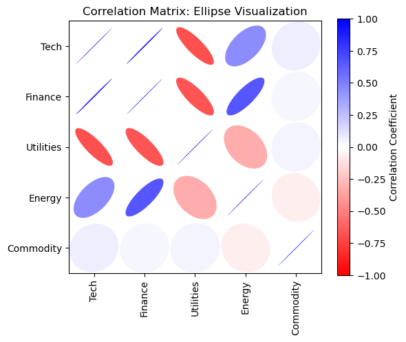
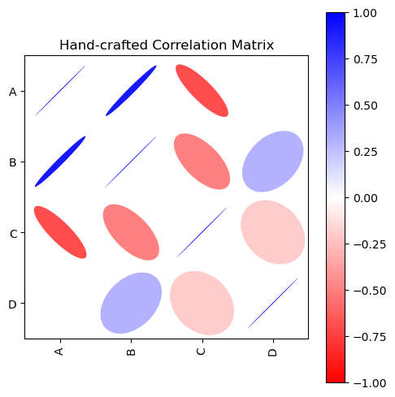
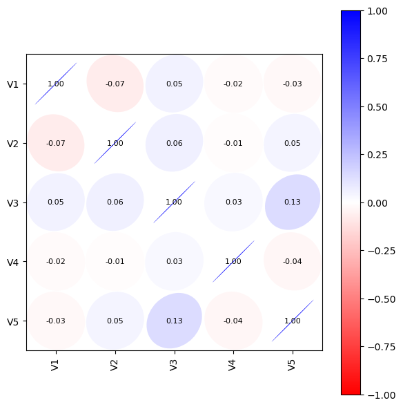

# 상관 타원 그림

## 개요

타원 그림은 상관행렬을 시각화할 때 색으로 부호화하는 열지도의 대안이 된다. 행렬의 각 칸을 타원으로 나타내고 그 모양, 방향, 크기가 상관의 부호와 크기를 부호화한다. 회색조 출판물에 특히 유용하고 색각 이상이 있는 독자도 읽을 수 있다.

---

## 타원 부호화

타원의 기하와 상관의 대응은 다음과 같다:

| 상관 | 타원 모양 | 회전 |
|:---:|:---|:---:|
| $r = +1$ | 가는 선(퇴화한 타원) | $+45°$ |
| $0 < r < 1$ | 좁은 타원 | $+45°$ |
| $r = 0$ | 원 | $0°$ |
| $-1 < r < 0$ | 좁은 타원 | $-45°$ |
| $r = -1$ | 가는 선(퇴화한 타원) | $-45°$ |

핵심 착상은 타원의 **이심률**이 $|r|$을, **방향**이 $r$의 부호를 부호화한다는 것이다. 완전한 원은 상관이 0임을 뜻하고, $|r| \to 1$이면 타원이 선으로 붕괴한다.

---

## 타원의 구성

상관값 $r_{ij}$에 대한 타원의 모수는 다음과 같다:

- **너비**: $w = 1 + \delta$ (거의 일정)
- **높이**: $h = 1 - |r_{ij}| - \delta$ ($|r_{ij}|$가 커질수록 줄어든다)
- **각도**: $\theta = 45° \cdot \text{sign}(r_{ij})$

여기서 $\delta$는 수치 안정성을 위한 작은 상수이다. 너비와 높이의 비가 이심률을 정하고, 회전각이 양의 상관과 음의 상관을 구별한다.

<div class="codebox" markdown>

**예제 1.** 타원으로 상관행렬 그리기

```python
import numpy as np
import pandas as pd
import matplotlib.pyplot as plt
from matplotlib.collections import EllipseCollection
from matplotlib.colors import Normalize


def plot_corr_ellipses(data, figsize=None, **kwargs):
    """상관행렬을 타원 격자로 그린다.

    칸마다 타원 하나를 놓는다. 타원이 납작할수록 상관이 강하고, 원에
    가까울수록 약하다. 기울기의 방향이 부호를 나타낸다. 색과 모양이
    같은 정보를 두 번 실어 주므로 흑백으로 인쇄해도 읽힌다.
    """
    M = np.array(data)
    fig, ax = plt.subplots(1, 1, figsize=figsize,
                           subplot_kw={'aspect': 'equal'})
    ax.set_xlim(-0.5, M.shape[1] - 0.5)
    ax.set_ylim(-0.5, M.shape[0] - 0.5)
    ax.invert_yaxis()

    # 칸의 중심 좌표. [::-1] 로 (행, 열)을 (x, y) 순서로 뒤집는다.
    xy = np.indices(M.shape)[::-1].reshape(2, -1).T

    # 너비는 고정하고 높이만 |r| 에 따라 줄인다. r=1 이면 선분처럼 납작해지고
    # r=0 이면 원이 된다. 기울기는 부호를 따라 ±45도로 놓는다.

    w = np.ones_like(M).ravel() + 0.01
    h = 1 - np.abs(M).ravel() - 0.01
    a = 45 * np.sign(M).ravel()

    ec = EllipseCollection(
        widths=w, heights=h, angles=a,
        units='x', offsets=xy,
        norm=Normalize(vmin=-1, vmax=1),
        offset_transform=ax.transData,
        array=M.ravel(),
        **kwargs
    )
    ax.add_collection(ec)

    if isinstance(data, pd.DataFrame):
        ax.set_xticks(np.arange(M.shape[1]))
        ax.set_xticklabels(data.columns, rotation=90)
        ax.set_yticks(np.arange(M.shape[0]))
        ax.set_yticklabels(data.index)

    return ec, ax
```

</div>

---

## 모의 자료 예제

상관된 변수 다섯 개를 만들어 타원 그림으로 상관 구조를 시각화한다:

<div class="codebox" markdown>

**예제 2.** 업종 수익률 자료로 그려 보기

```python
np.random.seed(42)
n = 200

# 업종별 수익률을 흉내 낸 자료다. 공통 요인 z1 을 섞는 비율로 상관을 만든다.
z1 = np.random.randn(n)
z2 = np.random.randn(n)

x1 = z1
x2 = 0.8 * z1 + 0.2 * z2
x3 = -0.6 * z1 + np.random.randn(n) * 0.7
x4 = 0.3 * z1 + 0.7 * z2
x5 = np.random.randn(n)

df = pd.DataFrame(
    np.column_stack([x1, x2, x3, x4, x5]),
    columns=['Tech', 'Finance', 'Utilities', 'Energy', 'Commodity']
)

corr_matrix = df.corr()

ec, ax = plot_corr_ellipses(corr_matrix, figsize=(6, 5), cmap='bwr_r')
plt.colorbar(ec, ax=ax, label='Correlation Coefficient')
ax.set_title('Correlation Matrix: Ellipse Visualization')
plt.tight_layout()
plt.show()
```

</div>



밀도의 등고선이 타원이라는 것이 이변량 정규분포의 정의적 성질이다.

---

## 타원 그림 읽기

출력을 살펴보면 다음을 알 수 있다:

- **Tech–Finance**: $+45°$로 기울어진 좁은 타원. 강한 양의 상관($r \approx 0.8$)을 나타낸다.
- **Tech–Utilities**: $-45°$로 기울어진 좁은 타원. 중간 정도의 음의 상관($r \approx -0.6$)을 나타낸다.
- **Commodity** 행/열: 거의 원에 가까운 타원. 다른 모든 변수와 상관이 0에 가깝다.
- **대각선**: $r = 1$에 해당하는 퇴화한 타원($+45°$의 선).

---

## 해석

타원 그림은 표준 열지도에 비해 몇 가지 장점이 있다:

1. **회색조 호환성.** 색이 없어도 타원의 모양과 방향이 상관에 대한 정보를 온전히 전달한다.
2. **접근성.** 색각 이상이 있는 독자도 정보 손실 없이 그림을 해석할 수 있다.
3. **이중 부호화.** 크기($|r|$을 이심률로)와 부호($\text{sign}(r)$을 회전으로)를 동시에 부호화한다.

주된 단점은 값이 표시된 열지도에 비해 정확한 수치를 읽기 어렵다는 점이다. 출판물에서는 타원 그림과 상관 수치표를 함께 제시하는 경우가 많다.

---

## 연습문제

<div class="drillbox" markdown>

**연습문제 1.** <span class="diff med" title="중간"></span>
$r_{12} = 0.9$, $r_{13} = -0.7$, $r_{14} = 0$, $r_{23} = -0.5$, $r_{24} = 0.3$, $r_{34} = -0.2$인 $4 \times 4$ 상관행렬을 손으로 만들어라. 타원 함수로 그리고 타원 모양이 예상과 맞는지 눈으로 확인하라.

</div>

??? success "풀이"

    ```python
    import numpy as np
    import pandas as pd

    corr = np.array([
        [1.0,  0.9, -0.7,  0.0],
        [0.9,  1.0, -0.5,  0.3],
        [-0.7, -0.5,  1.0, -0.2],
        [0.0,  0.3, -0.2,  1.0]
    ])
    df_corr = pd.DataFrame(corr, columns=['A', 'B', 'C', 'D'],
                           index=['A', 'B', 'C', 'D'])

    ec, ax = plot_corr_ellipses(df_corr, figsize=(5, 5), cmap='bwr_r')
    ax.set_title('Hand-crafted Correlation Matrix')
    import matplotlib.pyplot as plt
    plt.colorbar(ec, ax=ax)
    plt.tight_layout()
    plt.show()
    ```

    

    타원 안에 들어가는 점의 비율이 지정한 신뢰수준에 대응한다.

    $(A, B)$의 타원은 $+45°$로 매우 좁아야 한다(강한 양). $(A, C)$의 타원은 $-45°$로 어느 정도 좁아야 한다(강한 음). $(A, D)$의 타원은 거의 원이어야 한다(상관 0). $\square$

<div class="drillbox" markdown>

**연습문제 2.** <span class="diff med" title="중간"></span>
행렬 $\begin{pmatrix} 1 & 0.9 \\ 0.9 & 1 \end{pmatrix}$은 타당한 상관행렬이지만 $\begin{pmatrix} 1 & 1.2 \\ 1.2 & 1 \end{pmatrix}$은 그렇지 않은 이유를 설명하라. 어떤 행렬이 타당한 상관행렬이 되기 위한 필요충분조건을 진술하라.

</div>

??? success "풀이"

    행렬 $\mathbf{R}$이 타당한 상관행렬일 필요충분조건은:

    1. 대칭이다: $R_{ij} = R_{ji}$.
    2. 모든 대각 성분이 1이다: $R_{ii} = 1$.
    3. 모든 비대각 성분이 $|R_{ij}| \le 1$을 만족한다.
    4. 양반정치이다: 모든 $\mathbf{v}$에 대해 $\mathbf{v}^\top \mathbf{R}\, \mathbf{v} \ge 0$.

    첫 번째 행렬은 고윳값이 $1 + 0.9 = 1.9$와 $1 - 0.9 = 0.1$로 모두 음이 아니므로 타당하다.

    두 번째 행렬은 성분 $1.2$가 $|1.2| > 1$이어서 조건 3을 위반한다. 게다가 행렬식이 $1 \cdot 1 - 1.2 \cdot 1.2 = -0.44 < 0$이므로 음의 고윳값을 가져 조건 4도 만족하지 못한다. 상관계수는 Cauchy-Schwarz 부등식에 의해 $[-1, 1]$에 갇히므로 $r = 1.2$는 불가능하다. $\square$

<div class="drillbox" markdown>

**연습문제 3.** <span class="diff med" title="중간"></span>
각 타원 안에 상관 수치를 표시하도록 `plot_corr_ellipses` 함수를 고쳐라. $5 \times 5$ 행렬에서 시험하라.

</div>

??? success "풀이"

    ```python
    import numpy as np
    import pandas as pd
    import matplotlib.pyplot as plt
    from matplotlib.collections import EllipseCollection
    from matplotlib.colors import Normalize

    def plot_corr_ellipses_annotated(data, figsize=None, **kwargs):
        M = np.array(data)
        fig, ax = plt.subplots(1, 1, figsize=figsize,
                               subplot_kw={'aspect': 'equal'})
        ax.set_xlim(-0.5, M.shape[1] - 0.5)
        ax.set_ylim(-0.5, M.shape[0] - 0.5)
        ax.invert_yaxis()

        xy = np.indices(M.shape)[::-1].reshape(2, -1).T
        w = np.ones_like(M).ravel() + 0.01
        h = 1 - np.abs(M).ravel() - 0.01
        a = 45 * np.sign(M).ravel()

        ec = EllipseCollection(
            widths=w, heights=h, angles=a,
            units='x', offsets=xy,
            norm=Normalize(vmin=-1, vmax=1),
            offset_transform=ax.transData,
            array=M.ravel(), **kwargs
        )
        ax.add_collection(ec)

        # 칸마다 숫자를 적는다
        for i in range(M.shape[0]):
            for j in range(M.shape[1]):
                ax.text(j, i, f'{M[i, j]:.2f}',
                        ha='center', va='center', fontsize=8)

        if isinstance(data, pd.DataFrame):
            ax.set_xticks(np.arange(M.shape[1]))
            ax.set_xticklabels(data.columns, rotation=90)
            ax.set_yticks(np.arange(M.shape[0]))
            ax.set_yticklabels(data.index)

        return ec, ax

    # 확인
    np.random.seed(42)
    data = np.random.randn(200, 5)
    df = pd.DataFrame(data, columns=[f'V{i}' for i in range(1, 6)])
    ec, ax = plot_corr_ellipses_annotated(df.corr(), figsize=(6, 6),
                                          cmap='bwr_r')
    plt.colorbar(ec, ax=ax)
    plt.tight_layout()
    plt.show()
    ```

    

    $r$이 0이면 타원이 축에 정렬된 원에 가깝고, $|r|$이 커질수록 대각선 방향으로 길쭉해진다. 타원의 주축 방향과 길이가 곧 공분산행렬의 고유벡터와 고유값이다.

    주석 루프가 모든 $(i, j)$ 성분을 돌며 `ax.text`로 각 타원의 중심에 수치를 놓는다. 타원 시각화의 장점(모양 부호화)과 정확한 수치 가독성을 함께 얻는다. $\square$

<div class="drillbox" markdown>

**연습문제 4.** <span class="diff med" title="중간"></span>
$2 \times 2$ 상관행렬 $\mathbf{R} = \begin{pmatrix} 1 & r \\ r & 1 \end{pmatrix}$에 대해 $r$로 표현한 고윳값과 고유벡터를 유도하라. 이변량 정규분포 집중타원의 주축이 $\mathbf{R}$의 고유벡터와 일치함을 보여라.

</div>

??? success "풀이"

    특성방정식은

    $$
    \det(\mathbf{R} - \lambda \mathbf{I}) = (1 - \lambda)^2 - r^2 = 0
    $$

    이다. 풀면 $\lambda_1 = 1 + r$, $\lambda_2 = 1 - r$이다.

    $\lambda_1 = 1 + r$에 대해 $(\mathbf{R} - \lambda_1 \mathbf{I})\mathbf{v} = 0$은 $-r v_1 + r v_2 = 0$을 주므로 $\mathbf{v}_1 = \frac{1}{\sqrt{2}}(1, 1)^\top$이다.

    $\lambda_2 = 1 - r$에 대해서도 마찬가지로 $\mathbf{v}_2 = \frac{1}{\sqrt{2}}(1, -1)^\top$이다.

    상관이 $r$인 이변량 정규분포의 집중타원은 $\mathbf{z} = (x, y)^\top$일 때 어떤 상수 $c$에 대한 집합 $\{(x, y) : \mathbf{z}^\top \mathbf{R}^{-1} \mathbf{z} = c\}$이다. 이 타원의 주축은 $\mathbf{R}^{-1}$의 고유벡터(고유벡터를 공유하므로 $\mathbf{R}$의 고유벡터와 같다)이다. 축은 $\frac{1}{\sqrt{2}}(1, 1)^\top$과 $\frac{1}{\sqrt{2}}(1, -1)^\top$ 방향, 즉 $+45°$와 $-45°$ 방향을 가리킨다. 타원 그림이 $\pm 45°$ 회전을 쓰는 이유이다. $\square$

<div class="drillbox" markdown>

**연습문제 5.** <span class="diff med" title="중간"></span>
변수가 $k$개면 타원 그림에는 $k^2$개의 타원이 들어간다. 그중 몇 개가 중복인가(다른 타원으로부터 알 수 있는가)? 중복이 아닌 타원만 보이는 수정판을 제안하라.

</div>

??? success "풀이"

    상관행렬이 대칭이므로($R_{ij} = R_{ji}$) 위쪽 삼각형과 아래쪽 삼각형은 거울상이다. 대각선은 언제나 $r = 1$을 보여준다. 따라서:

    - 전체 타원: $k^2$
    - 대각선(자명하게 $r = 1$): $k$
    - 서로 다른 비대각: $\frac{k(k-1)}{2}$
    - 중복: $k + \frac{k(k-1)}{2} = \frac{k(k+1)}{2}$

    중복이 없는 형태는 아래쪽 삼각형의 $\frac{k(k-1)}{2}$개 타원만 보인다:

    ```python
    def plot_lower_triangle_ellipses(data, figsize=None, **kwargs):
        M = np.array(data)
        k = M.shape[0]
        fig, ax = plt.subplots(figsize=figsize,
                               subplot_kw={'aspect': 'equal'})
        ax.set_xlim(-0.5, k - 0.5)
        ax.set_ylim(-0.5, k - 0.5)
        ax.invert_yaxis()

        # 아래쪽 삼각형만 — 상관행렬은 대칭이라 위쪽은 되풀이다
        for i in range(k):
            for j in range(i):
                r = M[i, j]
                from matplotlib.patches import Ellipse
                e = Ellipse(xy=(j, i),
                            width=1.01,
                            height=1 - abs(r) - 0.01,
                            angle=45 * np.sign(r))
                e.set_facecolor(plt.cm.bwr_r((r + 1) / 2))
                ax.add_patch(e)

        if isinstance(data, pd.DataFrame):
            ax.set_xticks(range(k))
            ax.set_xticklabels(data.columns, rotation=90)
            ax.set_yticks(range(k))
            ax.set_yticklabels(data.index)
        plt.tight_layout()
        return ax
    ```

    시각적 혼잡이 줄고 서로 다른 $\binom{k}{2}$개의 상관값에 집중할 수 있다. $\square$

---

## 정리하며

타원 그림은 **색 대신 모양**으로 상관을 부호화한다.

- **이심률이 $|r|$, 기울기 방향이 부호다.** 원이면 $r=0$, 납작할수록 $|r|$ 이 크며, $|r|\to1$ 에서 선으로 붕괴한다.
- **4장의 이변량 정규 등고선과 같은 기하다.** 공분산행렬의 고유분해가 타원의 축을 정한다는 사실이 여기서 시각적으로 쓰인다.
- **회색조 인쇄와 색각 이상 독자에게 유리하다.** 색 하나에만 의존하지 않는 부호화이므로 접근성이 좋다.
- **모양은 크기보다 읽기 쉽다.** 사람은 색의 미세한 차이보다 형태의 차이를 잘 구별하며, 특히 약한 상관과 중간 상관을 가르는 데 낫다.
- **열지도와 병용하면 좋다.** 타원으로 모양을, 색으로 부호를 함께 주면 읽기가 더 쉬워진다.

다음 절 **공분산 밑바닥부터 만들기**로 넘어간다.
