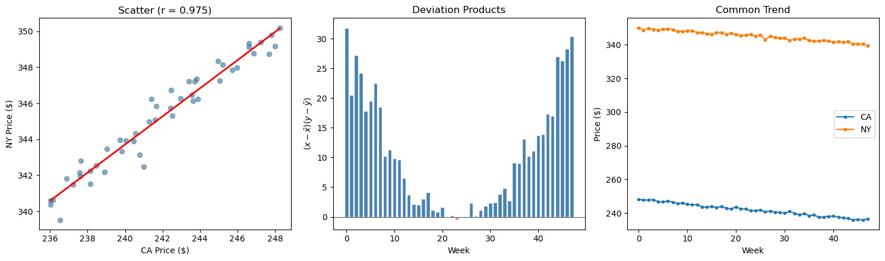

# 공분산 밑바닥부터 만들기

## 개요

이 페이지는 공분산과 Pearson 상관계수를 제1원리에서 출발해 단계별로 만들어 본다. 공통의 거시경제 추세를 공유하는 두 주(州)의 가격 자료를 모의로 생성한 뒤, 각 양을 손으로 계산하고 라이브러리 구현과 대조해 확인하며, 상관된 시계열이 왜 인과를 뜻하지 않는지 보인다.

---

## 표본공분산

짝지어진 관측값 $(x_1, y_1), \ldots, (x_n, y_n)$에 대해 **표본공분산**은 다음과 같이 정의된다.

$$
\text{Cov}(X, Y) = \frac{1}{n-1}\sum_{i=1}^{n}(x_i - \bar{x})(y_i - \bar{y})
$$

여기서 $\bar{x}$와 $\bar{y}$는 표본평균이다. 분모의 $n - 1$(Bessel 보정)은 모집단 공분산의 불편추정량을 준다.

각 항 $(x_i - \bar{x})(y_i - \bar{y})$를 **편차곱**이라 한다.

- $x_i$와 $y_i$가 각자의 평균에서 **같은 방향**으로 벗어나면 양수이다.
- **반대 방향**으로 벗어나면 음수이다.

양의 곱이 우세하면 공분산이 양수가 되고, 이는 두 변수가 함께 움직이는 경향이 있음을 뜻한다.

---

## 공분산에서 Pearson 상관계수로

Pearson 상관계수는 공분산을 두 표준편차의 곱으로 표준화한 것이다.

$$
r = \frac{\text{Cov}(X, Y)}{s_X \, s_Y}
$$

여기서 $s_X = \sqrt{\frac{1}{n-1}\sum_{i=1}^n (x_i - \bar{x})^2}$는 표본표준편차이다($s_Y$도 같다). 이 표준화 덕분에 $-1 \le r \le 1$이 보장된다.

---

## 단계별 구현

<div class="codebox" markdown>

**예제 1.** 공분산과 상관을 단계별로 구현

```python
import numpy as np

def covariance_step_by_step(x, y):
    """표본공분산을 구하고, 중간 계산인 편차까지 함께 돌려준다.

        편차를 돌려주는 까닭은 뒤에서 편차곱을 막대로 그려 보이기 위함이다.
        """
    n = len(x)
    x_mean = x.mean()
    y_mean = y.mean()
    x_dev = x - x_mean
    y_dev = y - y_mean
    # n이 아니라 n-1로 나눈다. 베셀 보정이며, 분산에서와 같은 이유다.
    # 편차를 참 평균이 아니라 표본평균에서 쟀기 때문에 자유도 하나를 잃는다.
    cov = np.sum(x_dev * y_dev) / (n - 1)
    return cov, x_dev, y_dev

def pearson_r_step_by_step(x, y):
    """피어슨 상관계수를 정의대로 구한다.

        공분산을 두 표준편차의 곱으로 나눈다. 이 나눗셈이 단위를 없애므로
        r 은 -1 과 1 사이에 갇힌 값이 된다.
        """
    cov, _, _ = covariance_step_by_step(x, y)
    # ddof=1로 맞춰야 한다. 공분산이 n-1로 나눈 값이므로
    # 표준편차도 같은 규약을 써야 두 n-1이 약분되어 r이 척도와 무관해진다.
    sx = x.std(ddof=1)
    sy = y.std(ddof=1)
    return cov / (sx * sy)
```

</div>

---

## 자료 생성

공통의 하락 추세를 공유하지만 잡음은 서로 독립인 두 주(CA와 NY)의 주간 가격을 모의로 만든다.

$$
\text{CA}_t = 248 + \text{trend}_t + \varepsilon_t^{(\text{CA})}, \qquad
\text{NY}_t = 350 + 0.8\,\text{trend}_t + \varepsilon_t^{(\text{NY})}
$$

여기서 $\text{trend}_t$는 48주에 걸쳐 0에서 $-12$까지 선형으로 감소하고, $\varepsilon_t^{(\text{CA})} \sim \mathcal{N}(0, 0.5^2)$, $\varepsilon_t^{(\text{NY})} \sim \mathcal{N}(0, 0.6^2)$이다.

<div class="codebox" markdown>

**예제 2.** 가격 자료 만들기

```python
np.random.seed(42)
WEEKS = 48

# 두 주의 가격에 공통으로 실릴 하락 추세. 공분산이 커지는 까닭이 바로 이것이다.
trend = np.linspace(0, -12, WEEKS)

CA = 248.0 + trend + np.random.normal(0, 0.5, WEEKS)
NY = 350.0 + trend * 0.8 + np.random.normal(0, 0.6, WEEKS)
```

</div>

---

## 계산과 검증

<div class="codebox" markdown>

**예제 3.** 라이브러리 결과와 맞춰 보기

```python
import pandas as pd

cov, x_dev, y_dev = covariance_step_by_step(CA, NY)
r = pearson_r_step_by_step(CA, NY)

print(f"CA mean     = {CA.mean():.4f}")
print(f"NY mean     = {NY.mean():.4f}")
print(f"Covariance  = {cov:.4f}")
print(f"Pearson r   = {r:.4f}")

# 직접 구한 값이 라이브러리와 맞는지 확인한다. pandas 의 cov 는 ddof=1 이므로
# 위 구현도 n-1 로 나눠야 값이 맞는다.
df = pd.DataFrame({"CA": CA, "NY": NY})
print(f"pandas cov  = {df['CA'].cov(df['NY']):.4f}")
print(f"pandas corr = {df['CA'].corr(df['NY']):.4f}")
print(f"numpy corr  = {np.corrcoef(CA, NY)[0, 1]:.4f}")
```

출력:

```text
CA mean     = 241.8974
NY mean     = 345.1893
Covariance  = 10.5691
Pearson r   = 0.9753
pandas cov  = 10.5691
pandas corr = 0.9753
numpy corr  = 0.9753
```

세 방법이 모두 같은 값을 내놓으므로 밑바닥부터 만든 구현이 옳음을 확인할 수 있다.

</div>

---

## 시각화

세 개의 패널이 이야기 전체를 들려준다.

<div class="codebox" markdown>

**예제 4.** 세 그림으로 이해하기

```python
import matplotlib.pyplot as plt

fig, axes = plt.subplots(1, 3, figsize=(15, 4.5))

# 왼쪽: 산점도와 회귀직선
axes[0].scatter(CA, NY, alpha=0.6, edgecolors="grey")
z = np.polyfit(CA, NY, 1)
axes[0].plot(np.sort(CA), np.polyval(z, np.sort(CA)),
             color="red", linewidth=2)
axes[0].set_xlabel("CA Price (\\$)")
axes[0].set_ylabel("NY Price (\\$)")
axes[0].set_title(f"Scatter (r = {r:.3f})")

# 가운데: 주마다의 편차곱. 공분산은 이 막대들의 평균이다.
# 파란 막대(양)가 빨간 막대(음)를 압도하면 공분산이 양이 된다.
products = x_dev * y_dev
colours = ["steelblue" if p > 0 else "salmon" for p in products]
axes[1].bar(range(WEEKS), products, color=colours, edgecolor="white")
axes[1].axhline(0, color="black", linewidth=0.5)
axes[1].set_xlabel("Week")
axes[1].set_ylabel("$(x - \\bar{x})(y - \\bar{y})$")
axes[1].set_title("Deviation Products")

# 오른쪽: 두 시계열. 함께 내려가는 모습이 위 편차곱의 부호를 설명한다.
weeks = np.arange(WEEKS)
axes[2].plot(weeks, CA, label="CA", marker="o", markersize=3)
axes[2].plot(weeks, NY, label="NY", marker="s", markersize=3)
axes[2].set_xlabel("Week")
axes[2].set_ylabel("Price (\\$)")
axes[2].set_title("Common Trend")
axes[2].legend()

plt.tight_layout()
plt.show()
```



세 번째 그림에서 두 계열이 나란히 내려가는 것이 보인다. 이 공통 추세가 곧 상관의 원천이다.

</div>

---

## 해석

CA와 NY 가격 사이의 강한 양의 상관($r = 0.975$)은 전적으로 공유된 하락 추세, 곧 교란변수에서 비롯된다. 어느 주의 가격도 다른 주의 가격을 *일으키지* 않는다. **상관은 인과를 뜻하지 않는다**는 원리의 교과서적 예시이다.

편차곱 막대그림을 보면 48개 중 46개가 양수(파랑)이며, 그래서 공분산이 — 따라서 $r$가 — 강하게 양수가 된다. 시계열 패널에서는 두 계열이 함께 하락하는데, 이는 둘 사이의 인과 연결이 아니라 공통 추세가 이끄는 움직임이다.

---

## 연습문제

<div class="drillbox" markdown>

**연습문제 1.** <span class="diff easy" title="쉬움"></span>
자료 $(1, 2), (2, 4), (3, 5), (4, 4), (5, 5)$에 대해 공분산과 Pearson $r$를 손으로 계산하라. 편차곱을 포함한 모든 중간 단계를 보여라.

</div>

??? success "풀이"

    표본평균은 $\bar{x} = 3$, $\bar{y} = 4$이다.

    | $i$ | $x_i$ | $y_i$ | $x_i - \bar{x}$ | $y_i - \bar{y}$ | $(x_i - \bar{x})(y_i - \bar{y})$ |
    |:---:|:---:|:---:|:---:|:---:|:---:|
    | 1 | 1 | 2 | $-2$ | $-2$ | 4 |
    | 2 | 2 | 4 | $-1$ | 0 | 0 |
    | 3 | 3 | 5 | 0 | 1 | 0 |
    | 4 | 4 | 4 | 1 | 0 | 0 |
    | 5 | 5 | 5 | 2 | 1 | 2 |

    $$
    \text{Cov}(X, Y) = \frac{4 + 0 + 0 + 0 + 2}{5 - 1} = \frac{6}{4} = 1.5
    $$

    $$
    s_X = \sqrt{\frac{4 + 1 + 0 + 1 + 4}{4}} = \sqrt{2.5} \approx 1.5811
    $$

    $$
    s_Y = \sqrt{\frac{4 + 0 + 1 + 0 + 1}{4}} = \sqrt{1.5} \approx 1.2247
    $$

    $$
    r = \frac{1.5}{1.5811 \times 1.2247} \approx \frac{1.5}{1.9365} \approx 0.7746
    $$

    $\square$

<div class="drillbox" markdown>

**연습문제 2.** <span class="diff med" title="중간"></span>
표본공분산 $\frac{1}{n-1}\sum(x_i - \bar{x})(y_i - \bar{y})$가 모집단 공분산 $\text{Cov}(X, Y) = \mathbb{E}[(X - \mu_X)(Y - \mu_Y)]$의 불편추정량임을 증명하라.

</div>

??? success "풀이"

    $(X_1, Y_1), \ldots, (X_n, Y_n)$이 독립이고 동일한 분포를 따르며 $\mathbb{E}[X] = \mu_X$, $\mathbb{E}[Y] = \mu_Y$, $\text{Cov}(X, Y) = \sigma_{XY}$라 하자.

    합을 전개하면

    $$
    \sum_{i=1}^n (X_i - \bar{X})(Y_i - \bar{Y}) = \sum_{i=1}^n X_i Y_i - n\bar{X}\bar{Y}
    $$

    기댓값을 취하면

    $$
    \mathbb{E}\!\left[\sum_{i=1}^n X_i Y_i\right] = n(\sigma_{XY} + \mu_X \mu_Y)
    $$

    $$
    \mathbb{E}[n\bar{X}\bar{Y}] = n\!\left(\frac{\sigma_{XY}}{n} + \mu_X \mu_Y\right) = \sigma_{XY} + n\mu_X \mu_Y
    $$

    따라서

    $$
    \mathbb{E}\!\left[\sum_{i=1}^n (X_i - \bar{X})(Y_i - \bar{Y})\right] = n\sigma_{XY} + n\mu_X\mu_Y - \sigma_{XY} - n\mu_X\mu_Y = (n-1)\sigma_{XY}
    $$

    $n - 1$로 나누면

    $$
    \mathbb{E}\!\left[\frac{1}{n-1}\sum_{i=1}^n (X_i - \bar{X})(Y_i - \bar{Y})\right] = \sigma_{XY}
    $$

    이로써 분모가 $n - 1$인 표본공분산이 불편임이 확인된다. $\square$

<div class="drillbox" markdown>

**연습문제 3.** <span class="diff med" title="중간"></span>
$\text{Cov}(X, Y) = \mathbb{E}[XY] - \mathbb{E}[X]\,\mathbb{E}[Y]$임을 보여라. 이 항등식을 써서 $X$와 $Y$가 독립이면 $\text{Cov}(X, Y) = 0$임을 증명하라.

</div>

??? success "풀이"

    정의에서 출발한다.

    $$
    \text{Cov}(X, Y) = \mathbb{E}[(X - \mu_X)(Y - \mu_Y)]
    $$

    전개하면

    $$
    = \mathbb{E}[XY - \mu_Y X - \mu_X Y + \mu_X \mu_Y]
    $$

    $$
    = \mathbb{E}[XY] - \mu_Y \mathbb{E}[X] - \mu_X \mathbb{E}[Y] + \mu_X \mu_Y
    $$

    $$
    = \mathbb{E}[XY] - \mu_X \mu_Y - \mu_X \mu_Y + \mu_X \mu_Y = \mathbb{E}[XY] - \mathbb{E}[X]\,\mathbb{E}[Y]
    $$

    $X \perp Y$이면 독립성에 의해 $\mathbb{E}[XY] = \mathbb{E}[X]\,\mathbb{E}[Y]$이므로

    $$
    \text{Cov}(X, Y) = \mathbb{E}[X]\,\mathbb{E}[Y] - \mathbb{E}[X]\,\mathbb{E}[Y] = 0
    $$

    주의: 역은 일반적으로 성립하지 않는다. 공분산이 0이어도 독립은 아니다(예: $X \sim \mathcal{N}(0,1)$이고 $Y = X^2$이면 $\text{Cov}(X, Y) = 0$이지만 분명히 종속이다). $\square$

<div class="drillbox" markdown>

**연습문제 4.** <span class="diff med" title="중간"></span>
CA와 NY 가격이 공통 성분을 갖지 않도록 모의실험을 고쳐라. 공분산과 $r$를 다시 계산하고, 공통 추세를 없앤 것이 결과를 어떻게 바꾸는지 설명하라.

</div>

??? success "풀이"

    먼저 흔한 오해를 짚고 넘어가자. 두 계열에 **기울기가 다른** 결정론적 선형 추세를 주는 것으로는 공통 성분이 사라지지 않는다.

    ```python
    import numpy as np

    np.random.seed(42)
    WEEKS = 48
    trend_CA = np.linspace(0, -12, WEEKS)
    trend_NY = np.linspace(0, -8, WEEKS)   # 기울기만 다른 추세

    CA = 248.0 + trend_CA + np.random.normal(0, 3, WEEKS)
    NY = 350.0 + trend_NY + np.random.normal(0, 3, WEEKS)

    print(f"Covariance = {np.cov(CA, NY)[0, 1]:.4f}")
    print(f"Pearson r  = {np.corrcoef(CA, NY)[0, 1]:.4f}")
    ```

    출력:

    ```
    Covariance = 10.5231
    Pearson r  = 0.5733
    ```

    잡음을 6배로 키웠는데도 $r = 0.573$으로 여전히 뚜렷하게 양수이다. 이유는 간단하다. 두 결정론적 직선 추세는 서로 상수배 관계이므로 **완전히 공선적**이다. 기울기가 다르다는 것은 독립이라는 뜻이 아니다. 상관이 낮아진 것은 공통 성분이 사라져서가 아니라 잡음이 커져 신호 대 잡음비가 낮아졌기 때문이다.

    공통 성분을 실제로 없애려면 한 계열에서 추세 자체를 빼야 한다.

    ```python
    np.random.seed(42)
    CA = 248.0 + np.linspace(0, -12, WEEKS) + np.random.normal(0, 0.5, WEEKS)
    NY = 350.0 + np.random.normal(0, 0.6, WEEKS)   # 추세 없음

    print(f"Covariance = {np.cov(CA, NY)[0, 1]:.4f}")
    print(f"Pearson r  = {np.corrcoef(CA, NY)[0, 1]:.4f}")
    ```

    출력:

    ```
    Covariance = 0.1348
    Pearson r  = 0.0659
    ```

    이제 $r = 0.066$으로 0에 가깝다(유한표본이므로 정확히 0은 아니다). 원래의 $r = 0.975$는 두 계열이 서로 영향을 주고받아서가 아니라 *공유된* 추세가 만들어 낸 것이었다. 이는 원래의 상관이 교란에 의한 인공물이었음을 다시 한번 확인해 준다. $\square$

<div class="drillbox" markdown>

**연습문제 5.** <span class="diff med" title="중간"></span>
공분산의 쌍선형성을 증명하라. 상수 $a, b, c, d$와 확률변수 $X, Y, W$에 대해

$$
\text{Cov}(aX + bY,\; cW + d) = ac\,\text{Cov}(X, W) + bc\,\text{Cov}(Y, W)
$$

</div>

??? success "풀이"

    항등식 $\text{Cov}(U, V) = \mathbb{E}[UV] - \mathbb{E}[U]\,\mathbb{E}[V]$를 쓴다.

    $$
    \text{Cov}(aX + bY,\; cW + d)
    = \mathbb{E}[(aX + bY)(cW + d)] - \mathbb{E}[aX + bY]\,\mathbb{E}[cW + d]
    $$

    첫째 항을 전개하면

    $$
    \mathbb{E}[(aX + bY)(cW + d)] = ac\,\mathbb{E}[XW] + ad\,\mathbb{E}[X] + bc\,\mathbb{E}[YW] + bd\,\mathbb{E}[Y]
    $$

    둘째 항을 전개하면

    $$
    -(a\,\mathbb{E}[X] + b\,\mathbb{E}[Y])(c\,\mathbb{E}[W] + d)
    = -ac\,\mathbb{E}[X]\mathbb{E}[W] - ad\,\mathbb{E}[X] - bc\,\mathbb{E}[Y]\mathbb{E}[W] - bd\,\mathbb{E}[Y]
    $$

    둘을 합치면

    $$
    = ac(\mathbb{E}[XW] - \mathbb{E}[X]\mathbb{E}[W]) + bc(\mathbb{E}[YW] - \mathbb{E}[Y]\mathbb{E}[W])
    $$

    $$
    = ac\,\text{Cov}(X, W) + bc\,\text{Cov}(Y, W)
    $$

    상수 $d$가 완전히 사라진다는 점에 주목하라. 확률변수에 상수를 더해도 다른 어떤 변수와의 공분산도 바뀌지 않는다는 사실을 반영한다. $\square$

---

## 정리하며

공분산과 상관을 **제1원리에서** 만들어 보았다.

$$
\mathrm{Cov}(X,Y)=\frac{1}{n-1}\sum_i (x_i-\bar x)(y_i-\bar y),
\qquad r=\frac{\mathrm{Cov}(X,Y)}{s_X s_Y}
$$

- **$n-1$ 은 여기서도 베셀 보정이다.** 두 평균을 자료에서 추정했으므로 자유도를 잃는다(7장).
- **공분산은 단위에 의존한다.** 척도를 바꾸면 값이 바뀌므로 크기를 해석할 수 없고, 표준편차로 나눈 $r$ 만이 $[-1,1]$ 로 비교 가능해진다.
- **라이브러리와 대조해 검산한다.** `np.cov` 의 `ddof` 기본값이 1 이고 `np.var` 는 0 이라는 점을 다시 확인하게 된다.
- **공통 추세가 상관을 만든다.** 두 주의 가격이 같은 거시 요인에 노출되어 있으면 **인과관계가 전혀 없어도** 높은 상관이 나온다. 1장의 교란이 시계열에서 나타난 모습이다.
- **시계열 상관은 특히 조심해야 한다.** 둘 다 추세를 가지면 무관한 계열끼리도 높은 상관을 보이며, 이것이 허위상관의 전형이다.

다음 절 **회귀와 상관 그림**으로 넘어간다.
