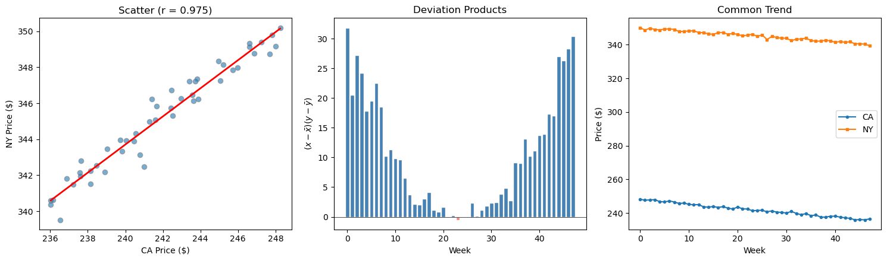

# 공분산 밑바닥부터 만들기

## 개요

이 페이지는 공분산과 Pearson 상관계수를 제1원리에서 출발해 단계별로 만들어 본다. 공통의 거시경제 추세를 공유하는 두 주(州)의 가격 자료를 모의로 생성한 뒤, 각 양을 손으로 계산하고 라이브러리 구현과 대조해 확인하며, 상관된 시계열이 왜 인과를 뜻하지 않는지 보인다.

---

## 표본공분산

짝지어진 관측값 $(x_1, y_1), \ldots, (x_n, y_n)$에 대해 **표본공분산**은 다음과 같이 정의된다.

$$
\text{Cov}(X, Y) = \frac{1}{n-1}\sum_{i=1}^{n}(x_i - \bar{x})(y_i - \bar{y})
$$

여기서 $\bar{x}$와 $\bar{y}$는 표본평균이다. 분모의 $n - 1$(Bessel 보정)은 모집단 공분산의 불편추정량을 준다.

각 항 $(x_i - \bar{x})(y_i - \bar{y})$를 **편차곱**이라 한다.

- $x_i$와 $y_i$가 각자의 평균에서 **같은 방향**으로 벗어나면 양수이다.
- **반대 방향**으로 벗어나면 음수이다.

양의 곱이 우세하면 공분산이 양수가 되고, 이는 두 변수가 함께 움직이는 경향이 있음을 뜻한다.

---

## 공분산에서 Pearson 상관계수로

Pearson 상관계수는 공분산을 두 표준편차의 곱으로 표준화한 것이다.

$$
r = \frac{\text{Cov}(X, Y)}{s_X \, s_Y}
$$

여기서 $s_X = \sqrt{\frac{1}{n-1}\sum_{i=1}^n (x_i - \bar{x})^2}$는 표본표준편차이다($s_Y$도 같다). 이 표준화 덕분에 $-1 \le r \le 1$이 보장된다.

---

## 단계별 구현

<div class="exbox" markdown>

**보기 1.** <span class="diff easy" title="쉬움"></span> $n$으로 나눌 것인가 $n-1$로 나눌 것인가. 아래 구현은 공분산을 $n-1$로, 표준편차도 `ddof=1`로 맞춘다.

**(1)** 공분산만 $n-1$로 나누고 표준편차는 $n$으로 나누면 무엇이 깨지는가. 한 직선 위에 완벽히 놓인 자료로 보이시오.

**(2)** 반대로 둘을 **일관되게** 쓰면 $n$이든 $n-1$이든 $r$가 같음을 보이시오.

</div>

??? success "풀이"

    **(1) $\lvert r \rvert \le 1$이 깨진다.** 분자의 공분산을 $n-1$로, 분모의 두 표준편차를 $n$으로 나누면

    $$
    \frac{\frac{1}{n-1}\sum_i (x_i-\bar x)(y_i-\bar y)}
         {\sqrt{\frac{1}{n}\sum_i (x_i-\bar x)^2}\;\sqrt{\frac{1}{n}\sum_i (y_i-\bar y)^2}}
    = \frac{n}{n-1} \cdot r
    $$

    이다. 자료가 한 직선 위에 완벽히 놓여 $r = 1$인 경우에 이 값은 $n/(n-1) > 1$이 된다. $n = 10$이면 $1.1111$이고, **상관계수가 1을 넘는 일은 있을 수 없으므로 식이 틀렸다는 증거가 된다.** $n$이 커지면 $n/(n-1) \to 1$이라 눈치채기 어려워지는데, 그래서 더 위험하다.

    **(2) 일관되게 쓰면 약분된다.** 나누는 수를 $m$($= n$ 또는 $n-1$)으로 두면

    $$
    r = \frac{\frac{1}{m}\sum_i (x_i-\bar x)(y_i-\bar y)}
             {\sqrt{\frac{1}{m}\sum_i (x_i-\bar x)^2}\;\sqrt{\frac{1}{m}\sum_i (y_i-\bar y)^2}}
      = \frac{\sum_i (x_i-\bar x)(y_i-\bar y)}
             {\sqrt{\sum_i (x_i-\bar x)^2}\;\sqrt{\sum_i (y_i-\bar y)^2}}
    $$

    로 $1/m$이 분자에 한 번, 분모에 $\sqrt{1/m} \times \sqrt{1/m} = 1/m$로 한 번 들어가 그대로 상쇄된다. **$r$에는 베셀 보정을 할 것인가 말 것인가라는 물음 자체가 없다.** 반면 공분산은 $m$에 따라 값이 달라지므로 규약을 밝혀야 한다.

    **확인.**

    ```python
    import numpy as np

    def covariance_step_by_step(x, y):
        """표본공분산을 구하고, 중간 계산인 편차까지 함께 돌려준다.

        편차를 돌려주는 까닭은 뒤에서 편차곱을 막대로 그려 보이기 위함이다.
        """
        n = len(x)
        x_mean = x.mean()
        y_mean = y.mean()
        x_dev = x - x_mean
        y_dev = y - y_mean
        # n이 아니라 n-1로 나눈다. 베셀 보정이며, 분산에서와 같은 이유다.
        # 편차를 참 평균이 아니라 표본평균에서 쟀기 때문에 자유도 하나를 잃는다.
        cov = np.sum(x_dev * y_dev) / (n - 1)
        return cov, x_dev, y_dev

    def pearson_r_step_by_step(x, y):
        """피어슨 상관계수를 정의대로 구한다.

        공분산을 두 표준편차의 곱으로 나눈다. 이 나눗셈이 단위를 없애므로
        r 은 -1 과 1 사이에 갇힌 값이 된다.
        """
        cov, _, _ = covariance_step_by_step(x, y)
        # ddof=1로 맞춰야 한다. 공분산이 n-1로 나눈 값이므로
        # 표준편차도 같은 규약을 써야 두 n-1이 약분되어 r이 척도와 무관해진다.
        sx = x.std(ddof=1)
        sy = y.std(ddof=1)
        return cov / (sx * sy)

    # 한 직선 위에 완벽히 놓인 자료. r 는 정확히 1 이어야 한다.
    a = np.arange(10.0)
    b = 2 * a + 1
    n = len(a)
    cov, _, _ = covariance_step_by_step(a, b)

    print(f"n = {n}")
    print(f"규약을 맞춘 r      = {pearson_r_step_by_step(a, b):.6f}")
    print(f"분모만 n 으로 나눈 r = {cov / (a.std(ddof=0) * b.std(ddof=0)):.6f}"
          f"   (= r * n/(n-1) = {n / (n - 1):.6f})")

    # 둘을 일관되게 쓰면 규약이 약분된다.
    cov_n = np.sum((a - a.mean()) * (b - b.mean())) / n
    print(f"\n둘 다 n 으로   r = {cov_n / (a.std(ddof=0) * b.std(ddof=0)):.6f}")
    print(f"둘 다 n-1 로  r = {cov / (a.std(ddof=1) * b.std(ddof=1)):.6f}")
    ```

    출력:

    ```
    n = 10
    규약을 맞춘 r      = 1.000000
    분모만 n 으로 나눈 r = 1.111111   (= r * n/(n-1) = 1.111111)

    둘 다 n 으로   r = 1.000000
    둘 다 n-1 로  r = 1.000000
    ```

    섞어 쓴 값 $1.111111$이 정확히 $n/(n-1) = 10/9$와 같아 (1)의 유도와 맞고, 일관되게 쓴 두 값은 규약과 무관하게 $1.000000$으로 같아 (2)와 맞는다.

---

## 자료 생성

공통의 하락 추세를 공유하지만 잡음은 서로 독립인 두 주(CA와 NY)의 주간 가격을 모의로 만든다.

$$
\text{CA}_t = 248 + \text{trend}_t + \varepsilon_t^{(\text{CA})}, \qquad
\text{NY}_t = 350 + 0.8\,\text{trend}_t + \varepsilon_t^{(\text{NY})}
$$

여기서 $\text{trend}_t$는 48주에 걸쳐 0에서 $-12$까지 선형으로 감소하고, $\varepsilon_t^{(\text{CA})} \sim \mathcal{N}(0, 0.5^2)$, $\varepsilon_t^{(\text{NY})} \sim \mathcal{N}(0, 0.6^2)$이다.

<div class="exbox" markdown>

**보기 2.** <span class="diff easy" title="쉬움"></span> 공분산을 자료보다 먼저 알기. $\text{trend}_t$는 48주에 걸쳐 0에서 $-12$까지 선형으로 내려가는 **고정된** 수열이고, 두 잡음은 서로 독립이다.

**(1)** 자료를 만들기 전에 $\operatorname{Cov}(\text{CA}, \text{NY})$의 기댓값을 손으로 구하시오.

**(2)** 같은 방법으로 두 분산의 기댓값도 구해 $r$를 예측하시오.

</div>

??? success "풀이"

    **(1) 해석적으로.** 추세가 고정되어 있으므로 표본공분산의 기댓값만 보면 된다. $\text{CA}_t = 248 + T_t + e_t$, $\text{NY}_t = 350 + 0.8T_t + f_t$에서 상수는 편차를 잡는 순간 사라지고, $e$와 $f$가 서로 독립이고 평균이 0이므로 교차항의 기댓값도 0이다. 남는 것은

    $$
    E\!\left[\frac{1}{n-1}\sum_t (\text{CA}_t - \overline{\text{CA}})(\text{NY}_t - \overline{\text{NY}})\right]
    = 0.8 \cdot \frac{1}{n-1}\sum_t (T_t - \bar T)^2
    = 0.8 \, s_T^2
    $$

    이다. $T_t = -12t/47$($t = 0, 1, \ldots, 47$)이고 $0, 1, \ldots, N-1$의 표본분산이 $N(N+1)/12$이므로

    $$
    s_T^2 = \left(\frac{12}{47}\right)^2 \cdot \frac{48 \times 49}{12}
          = 0.0651879 \times 196 = 12.7768
    $$

    이고, 따라서

    $$
    E[\operatorname{Cov}] = 0.8 \times 12.7768 = 10.2215
    $$

    이다.

    **(2)** 같은 논리로 잡음의 분산이 더해진다.

    $$
    E[s_{\text{CA}}^2] = s_T^2 + 0.5^2 = 13.0268,
    \qquad
    E[s_{\text{NY}}^2] = 0.64\, s_T^2 + 0.6^2 = 8.5372
    $$

    $r$는 세 양의 **비**이므로 기댓값을 그대로 넣는 것이 정확한 계산은 아니지만, 대입하면

    $$
    \rho \approx \frac{10.2215}{\sqrt{13.0268 \times 8.5372}} = \frac{10.2215}{10.5458} = 0.9692
    $$

    를 얻는다. 뒤에서 모의실험으로 이 어림이 얼마나 맞는지 본다.

    **확인.**

    ```python
    np.random.seed(42)
    WEEKS = 48

    # 두 주의 가격에 공통으로 실릴 하락 추세. 공분산이 커지는 까닭이 바로 이것이다.
    trend = np.linspace(0, -12, WEEKS)

    CA = 248.0 + trend + np.random.normal(0, 0.5, WEEKS)
    NY = 350.0 + trend * 0.8 + np.random.normal(0, 0.6, WEEKS)

    s_T2 = trend.var(ddof=1)
    print(f"s_T^2 = {s_T2:.6f}   (12/47)^2 * 196 = {(12 / 47) ** 2 * 196:.6f}")
    print(f"E[Cov]    = 0.8 s_T^2        = {0.8 * s_T2:.4f}")
    print(f"E[s_CA^2] = s_T^2 + 0.25     = {s_T2 + 0.25:.4f}")
    print(f"E[s_NY^2] = 0.64 s_T^2 + 0.36 = {0.64 * s_T2 + 0.36:.4f}")
    print(f"대입해 얻은 rho              = {0.8 * s_T2 / np.sqrt((s_T2 + 0.25) * (0.64 * s_T2 + 0.36)):.4f}")

    # 씨앗을 바꿔 가며 20만 번 되풀이해 기댓값을 직접 잰다.
    rng = np.random.default_rng(99)
    A = 248.0 + trend + rng.normal(0, 0.5, (200_000, WEEKS))
    B = 350.0 + 0.8 * trend + rng.normal(0, 0.6, (200_000, WEEKS))
    Ad = A - A.mean(1, keepdims=True)
    Bd = B - B.mean(1, keepdims=True)
    cv = (Ad * Bd).sum(1) / (WEEKS - 1)
    rr = cv / (Ad.std(1, ddof=1) * Bd.std(1, ddof=1))
    print(f"\n20만 회 평균 Cov = {cv.mean():.4f} (표준편차 {cv.std():.4f})")
    print(f"20만 회 평균 r   = {rr.mean():.5f} (표준편차 {rr.std():.5f})")
    ```

    출력:

    ```
    s_T^2 = 12.776822   (12/47)^2 * 196 = 12.776822
    E[Cov]    = 0.8 s_T^2        = 10.2215
    E[s_CA^2] = s_T^2 + 0.25     = 13.0268
    E[s_NY^2] = 0.64 s_T^2 + 0.36 = 8.5372
    대입해 얻은 rho              = 0.9692

    20만 회 평균 Cov = 10.2217 (표준편차 0.3788)
    20만 회 평균 r   = 0.96986 (표준편차 0.00631)
    ```

    **공분산의 기댓값은 정확히 맞는다.** 유도한 $10.2215$와 모의실험의 $10.2217$이 소수 셋째 자리까지 같고, 차이 $0.0002$는 몬테카를로 오차($0.3788/\sqrt{200000} = 0.00085$) 안이다.

    **$r$의 기댓값은 어림이었다.** 대입해 얻은 $0.9692$와 실제 $E[r] = 0.96986$이 $0.0007$ 어긋난다. 비의 기댓값이 기댓값의 비와 같지 않기 때문이고, 어긋남의 방향도 설명된다 — 공분산과 분산이 **같은 자료에서 함께 흔들리므로** 분자가 큰 표본에서는 분모도 커져 비가 안정된다. 어긋남의 크기 $0.0007$은 $r$ 자체의 표집 표준편차 $0.0063$의 $11\%$에 지나지 않으므로 실용적으로는 무시해도 좋다.

---

## 계산과 검증

<div class="exbox" markdown>

**보기 3.** <span class="diff easy" title="쉬움"></span> 라이브러리 결과와 맞춰 보기. 보기 2 의 씨앗 `42` 로 만든 **한 벌**의 자료에서 손으로 만든 구현과 `pandas`·`numpy` 를 맞춰 본다.

**(1)** 세 경로가 같은 값을 주어야 하는 까닭을 나누는 수의 규약으로 설명하시오. `np.cov` 의 기본 규약은 무엇인가. 그것을 바꾸면 이 자료에서 공분산이 얼마가 되는가.

**(2)** 얻은 $\operatorname{Cov} = 10.5691$ 과 $r = 0.9753$ 이 보기 2 의 이론값 $E[\operatorname{Cov}] = 10.2215$, $E[r] = 0.96986$ 과 어긋난다. 보기 2 가 모의로 잰 표집 표준편차 $0.3788$ 과 $0.00631$ 에 비추어 판정하시오.

**(3)** 코드로 확인하시오.

</div>

??? success "풀이"

    **(1) 나누는 수를 맞추면 세 길이 만난다.** 보기 1 (2)에서 본 대로 $r$ 에는 규약 문제가 없다. 분자와 분모에서 $1/m$ 이 그대로 약분되기 때문이다. 그래서 `pandas` 든 `numpy` 든 $r$ 은 언제나 같다.

    **문제가 되는 것은 공분산뿐이다.** 규약을 적어 두면

    | 함수 | 기본 규약 |
    |---|---|
    | `pandas` 의 `.cov()` | $n-1$ (`ddof=1`) |
    | `numpy` 의 `np.cov` | $n-1$ (`bias=False`) |
    | `numpy` 의 `np.var` | $n$ (`ddof=0`) |

    **`np.cov` 와 `np.var` 의 기본값이 서로 다르다는 것이 함정이다.** 공분산은 $n-1$ 로, 분산은 $n$ 으로 나누게 되어 보기 1 (1)에서 본 $\lvert r\rvert > 1$ 사고가 바로 일어난다.

    이 자료에서 `np.cov(CA, NY, bias=True)` 를 쓰면

    $$
    10.5691 \times \frac{47}{48} = 10.3489
    $$

    가 되어 $0.22$ 만큼 작아진다. $n = 48$ 이라 $2\%$ 차이지만, 작은 표본에서는 훨씬 커진다.

    **(2) 한 표본은 이론값 둘레에서 흔들린다.** 보기 2 는 같은 설정을 20만 번 되풀이해 $\operatorname{Cov}$ 의 평균 $10.2217$ 과 표준편차 $0.3788$, $r$ 의 평균 $0.96986$ 과 표준편차 $0.00631$ 을 얻었다. 그 자에 대어 본다.

    | | 이 표본 | 이론 평균 | 차 | 표집 SD | 차/SD |
    |---|---:|---:|---:|---:|---:|
    | $\operatorname{Cov}$ | $10.5691$ | $10.2215$ | $+0.3476$ | $0.3788$ | $+0.92$ |
    | $r$ | $0.97525$ | $0.96986$ | $+0.00539$ | $0.00631$ | $+0.85$ |

    **둘 다 1 표준편차 안쪽이다.** 어긋난 것이 아니라 흔들린 것이다. 씨앗 `42` 가 우연히 평균보다 조금 위쪽 자료를 준 것뿐이다.

    **표집 표준편차의 크기를 눈여겨볼 만하다.** $\operatorname{Cov}$ 는 $10.22 \pm 0.38$ 로 상대오차가 $3.7\%$ 인데 $r$ 은 $0.970 \pm 0.006$ 으로 $0.65\%$ 다. **$r$ 이 훨씬 안정적이다.** 보기 2 의 풀이가 말한 대로 분자와 분모가 같은 자료에서 함께 흔들려 비가 안정되기 때문이다.

    **그러므로 "손계산이 라이브러리와 맞는다" 와 "자료가 이론과 맞는다" 는 다른 확인이다.** 앞의 것은 소수 넷째 자리까지 **똑같아야** 하고, 뒤의 것은 표집 표준편차만큼 어긋나는 것이 **정상**이다.

    **(3) 수치적으로.**

    ```python
    import pandas as pd

    cov, x_dev, y_dev = covariance_step_by_step(CA, NY)
    r = pearson_r_step_by_step(CA, NY)

    print(f"CA mean     = {CA.mean():.4f}")
    print(f"NY mean     = {NY.mean():.4f}")
    print(f"Covariance  = {cov:.4f}")
    print(f"Pearson r   = {r:.4f}")

    # 직접 구한 값이 라이브러리와 맞는지 확인한다. pandas 의 cov 는 ddof=1 이므로
    # 위 구현도 n-1 로 나눠야 값이 맞는다.
    df = pd.DataFrame({"CA": CA, "NY": NY})
    print(f"pandas cov  = {df['CA'].cov(df['NY']):.4f}")
    print(f"pandas corr = {df['CA'].corr(df['NY']):.4f}")
    print(f"numpy corr  = {np.corrcoef(CA, NY)[0, 1]:.4f}")

    # (1) 나누는 수의 규약
    print(f"\nnp.cov 기본(n-1)      = {np.cov(CA, NY)[0, 1]:.4f}")
    print(f"np.cov bias=True(n)   = {np.cov(CA, NY, bias=True)[0, 1]:.4f}"
          f"   = 위 값 x 47/48 = {np.cov(CA, NY)[0, 1] * 47 / 48:.4f}")

    # (2) 보기 2 의 이론값·표집 표준편차에 대어 보기
    E_cov, sd_cov = 10.2215, 0.3788
    E_r, sd_r = 0.96986, 0.00631
    print(f"\nCov  이 표본 {cov:.4f}  이론 {E_cov:.4f}"
          f"  차 {cov - E_cov:+.4f}  SD {sd_cov}  -> {(cov - E_cov) / sd_cov:+.2f}")
    print(f"r    이 표본 {r:.5f}  이론 {E_r:.5f}"
          f"  차 {r - E_r:+.5f}  SD {sd_r}  -> {(r - E_r) / sd_r:+.2f}")
    print(f"상대적 흔들림  Cov {sd_cov / E_cov:.4f}   r {sd_r / E_r:.4f}")
    ```

    출력:

    ```text
    CA mean     = 241.8974
    NY mean     = 345.1893
    Covariance  = 10.5691
    Pearson r   = 0.9753
    pandas cov  = 10.5691
    pandas corr = 0.9753
    numpy corr  = 0.9753

    np.cov 기본(n-1)      = 10.5691
    np.cov bias=True(n)   = 10.3489   = 위 값 x 47/48 = 10.3489

    Cov  이 표본 10.5691  이론 10.2215  차 +0.3476  SD 0.3788  -> +0.92
    r    이 표본 0.97525  이론 0.96986  차 +0.00539  SD 0.00631  -> +0.85
    상대적 흔들림  Cov 0.0371   r 0.0065
    ```

    세 방법이 모두 같은 값을 내놓으므로 밑바닥부터 만든 구현이 옳음을 확인할 수 있다. 손계산 `10.5691`·`0.9753` 이 `pandas`·`numpy` 와 **표시된 자리까지 모두 같다.**

    (1)의 규약도 확인된다. `bias=True` 로 바꾸면 `10.3489` 로 떨어지고, 그것이 정확히 $47/48$ 배다.

    (2)가 요점이다. 이 표본의 $\operatorname{Cov}$ 는 이론 평균보다 $+0.92$ 표준편차, $r$ 은 $+0.85$ 표준편차 위에 있다. **둘 다 1 안쪽이니 어긋난 것이 아니다.** 마지막 줄의 상대적 흔들림을 보면 $\operatorname{Cov}$ 가 $3.7\%$, $r$ 이 $0.65\%$ 로 **$r$ 이 여섯 배 안정적**이다.

---

## 시각화

세 개의 패널이 이야기 전체를 들려준다.

<div class="exbox" markdown>

**보기 4.** <span class="diff easy" title="쉬움"></span> 세 그림으로 이해하기. 같은 자료를 세 가지로 그린다. 왼쪽은 산점도와 회귀직선, 가운데는 주마다의 편차곱 $(x_t-\bar x)(y_t-\bar y)$, 오른쪽은 두 시계열이다.

**(1)** 세 판을 그려 보고 각각에서 무엇이 읽히는지 **수치와 함께** 말하시오. 가운데 판의 막대들과 공분산 $10.5691$ 은 어떤 관계인가.

**(2)** 가운데 판은 **시간 순서로** 그려져 있다. 막대의 높이가 왜 양끝에서 크고 가운데에서 작은가.

**(3)** 세 판 가운데 **어느 것도 혼자서는 보여 주지 못하는 것**이 있다. $r = 0.975$ 가 공통 추세에서 온 것임을 보이려면 무엇을 더 해야 하는가. 그 수를 구하시오.

</div>

??? success "풀이"

    **(1) 세 판에서 읽히는 것.**

    **왼쪽 — 거의 직선이다.** 점 48개가 붉은 회귀직선 둘레에 좁게 붙어 있고 $r = 0.975$, $r^2 = 0.951$ 이다. 회귀직선의 기울기는

    $$
    \hat b = r\,\frac{s_{\text{NY}}}{s_{\text{CA}}} = 0.7816
    $$

    인데, 자료를 만들 때 NY 에 실은 추세 계수가 $0.8$ 이었다. **CA 가 $1$ 달러 떨어질 때 NY 가 $0.78$ 달러 떨어진다**는 것이 그림의 기울기다. 축의 범위를 보면 CA 가 $236.0$\~$248.2$, NY 가 $339.5$\~$350.2$ 로 **둘 다 폭이 $11$\~$12$ 쯤**이라는 것도 읽힌다.

    **가운데 — 거의 다 파랗다.** 48개 막대 가운데 **46개가 양수**이고 음수는 2개뿐이다. 공분산은 이 막대들의 평균을 $n-1$ 로 재조정한 것이다.

    $$
    \frac{1}{48}\sum_t (x_t-\bar x)(y_t-\bar y) = 10.3489,
    \qquad
    \frac{1}{47}\sum_t (\cdot) = 10.5691 = \operatorname{Cov}
    $$

    **막대그림의 평균 높이가 곧 공분산이다.** 가장 큰 막대가 $31.86$ 으로 평균의 세 배가 넘고, 가장 작은 것은 $-0.50$ 에 지나지 않는다. 음수 막대 둘은 눈에 띄지도 않을 만큼 작다.

    **오른쪽 — 함께 내려간다.** 두 계열이 48주에 걸쳐 나란히 하락한다. 직선을 맞춰 보면 CA 가 주당 $-0.2606$ 달러, NY 가 주당 $-0.2067$ 달러이고 비가 $0.2067/0.2606 = 0.793$ 이다. 왼쪽 판의 기울기 $0.7816$ 과 거의 같다. **두 판이 같은 사실을 다르게 보고 있다.**

    **(2) 평균에서 멀수록 크다.** 편차곱은 $(x_t-\bar x)(y_t-\bar y)$ 인데, 두 계열이 모두 시간에 대해 단조감소하므로 **$t$ 가 가운데일 때 두 편차가 모두 $0$ 에 가깝다.** 추세만 남겨 두고 보면

    $$
    (x_t - \bar x)(y_t-\bar y) \approx 0.8\,(T_t - \bar T)^2
    $$

    이고 $T_t$ 가 $t$ 에 대한 일차식이므로 **막대 높이가 $t$ 의 이차함수**, 곧 가운데가 바닥인 포물선이 된다. 실제로 그림은 양끝이 $30$ 쯤, 가운데가 $0$ 근처인 U 자다.

    **음수 막대 둘이 가운데에 몰려 있는 것도 같은 까닭이다.** 가운데에서는 추세가 주는 몫이 거의 $0$ 이라 잡음이 부호를 정한다. 양끝에서는 추세의 몫이 압도적이라 잡음이 부호를 뒤집을 수 없다.

    **그래서 가운데 판은 "자료의 어느 부분이 공분산을 만드는가" 를 보여 준다.** 가장 큰 다섯 막대가 전체 합의 $29\%$ 를 낸다. **처음과 끝의 몇 주가 결과를 끌고 간다.**

    **(3) 세 판 모두 "왜" 를 말하지 못한다.** 왼쪽과 가운데는 시간을 아예 모르고, 오른쪽은 시간을 보여 주지만 두 계열이 **함께 내려가는 것**과 **서로를 끌어내리는 것**을 구별하지 못한다. 그림을 아무리 들여다보아도

    - CA 가 NY 를 움직인다
    - NY 가 CA 를 움직인다
    - 제3의 공통 요인이 둘을 함께 움직인다

    를 가를 수 없다.

    **해야 할 일은 추세를 빼고 다시 재는 것이다.** 두 계열을 각각 시간에 회귀해 잔차를 구하고 그 상관을 보면 된다. 12.4절의 편상관과 같은 생각이고, 통제변수가 $t$ 일 뿐이다.

    $$
    r_{\text{CA},\text{NY}} = 0.9753
    \qquad\longrightarrow\qquad
    r_{\text{잔차}} = 0.0320 \quad (p = 0.83)
    $$

    **$0.975$ 가 $0.032$ 로 주저앉는다.** 자료를 만들 때 두 잡음을 서로 독립으로 두었으므로 참값은 $0$ 이고, 관측된 $0.032$ 는 $n = 48$ 에서의 흔들림($\operatorname{SE} \approx 1/\sqrt{45} = 0.149$)의 $0.2$ 배다. **추세를 걷어내면 아무 관계도 남지 않는다.**

    잔차의 표준편차도 확인해 두면 좋다. $0.455$ 와 $0.556$ 으로 자료를 만들 때 쓴 $0.5$ 와 $0.6$ 에 가깝다.

    **한 문장.** $r = 0.975$ 는 두 가격 사이의 관계가 아니라 **둘 다 달력과 맺은 관계**였다. 세 그림은 그 사실을 암시할 뿐 증명하지 못하고, 증명은 추세를 빼 보는 한 줄이 한다.

    **수치적으로.**

    ```python
    import matplotlib.pyplot as plt

    fig, axes = plt.subplots(1, 3, figsize=(15, 4.5))

    # 왼쪽: 산점도와 회귀직선
    axes[0].scatter(CA, NY, alpha=0.6, edgecolors="grey")
    z = np.polyfit(CA, NY, 1)
    axes[0].plot(np.sort(CA), np.polyval(z, np.sort(CA)),
                 color="red", linewidth=2)
    axes[0].set_xlabel("CA Price (\\$)")
    axes[0].set_ylabel("NY Price (\\$)")
    axes[0].set_title(f"Scatter (r = {r:.3f})")

    # 가운데: 주마다의 편차곱. 공분산은 이 막대들의 평균이다.
    # 파란 막대(양)가 빨간 막대(음)를 압도하면 공분산이 양이 된다.
    products = x_dev * y_dev
    colours = ["steelblue" if p > 0 else "salmon" for p in products]
    axes[1].bar(range(WEEKS), products, color=colours, edgecolor="white")
    axes[1].axhline(0, color="black", linewidth=0.5)
    axes[1].set_xlabel("Week")
    axes[1].set_ylabel("$(x - \\bar{x})(y - \\bar{y})$")
    axes[1].set_title("Deviation Products")

    # 오른쪽: 두 시계열. 함께 내려가는 모습이 위 편차곱의 부호를 설명한다.
    weeks = np.arange(WEEKS)
    axes[2].plot(weeks, CA, label="CA", marker="o", markersize=3)
    axes[2].plot(weeks, NY, label="NY", marker="s", markersize=3)
    axes[2].set_xlabel("Week")
    axes[2].set_ylabel("Price (\\$)")
    axes[2].set_title("Common Trend")
    axes[2].legend()

    plt.tight_layout()
    plt.show()
    ```

    

    세 번째 그림에서 두 계열이 나란히 내려가는 것이 보인다. 이 공통 추세가 곧 상관의 원천이다.

    (1)\~(3)의 수를 확인한다.

    ```python
    import numpy as np
    from scipy import stats

    # (1) 왼쪽 판
    print(f"r = {r:.4f}   r^2 = {r**2:.4f}   기울기 = {np.polyfit(CA, NY, 1)[0]:.4f}")
    print(f"CA {CA.min():.1f}~{CA.max():.1f}   NY {NY.min():.1f}~{NY.max():.1f}")

    # (1) 가운데 판
    prod = x_dev * y_dev
    print(f"\n편차곱: 양수 {(prod > 0).sum()}개  음수 {(prod < 0).sum()}개")
    print(f"  합/n = {prod.mean():.4f}   합/(n-1) = {prod.sum() / (WEEKS - 1):.4f} = Cov")
    print(f"  최대 {prod.max():.2f}   최소 {prod.min():.2f}"
          f"   상위 5개가 차지하는 몫 {np.sort(prod)[-5:].sum() / prod.sum():.4f}")

    # (1) 오른쪽 판 — 주당 기울기
    t = np.arange(WEEKS)
    bCA, bNY = np.polyfit(t, CA, 1)[0], np.polyfit(t, NY, 1)[0]
    print(f"\n주당 기울기  CA {bCA:.4f}   NY {bNY:.4f}   비 {bNY / bCA:.4f}")

    # (3) 추세를 빼고 다시 재기
    res_CA = CA - np.polyval(np.polyfit(t, CA, 1), t)
    res_NY = NY - np.polyval(np.polyfit(t, NY, 1), t)
    rr, pp = stats.pearsonr(res_CA, res_NY)
    print(f"\n추세 제거 전 r = {r:.4f}")
    print(f"추세 제거 후 r = {rr:.4f}   p = {pp:.4f}"
          f"   SE ~ 1/sqrt(n-3) = {1 / np.sqrt(WEEKS - 3):.4f}")
    print(f"잔차 표준편차 {res_CA.std(ddof=1):.4f} / {res_NY.std(ddof=1):.4f}"
          f"   (만들 때 쓴 값 0.5 / 0.6)")
    ```

    출력:

    ```text
    r = 0.9753   r^2 = 0.9511   기울기 = 0.7816
    CA 236.0~248.2   NY 339.5~350.2

    편차곱: 양수 46개  음수 2개
      합/n = 10.3489   합/(n-1) = 10.5691 = Cov
      최대 31.86   최소 -0.50   상위 5개가 차지하는 몫 0.2915

    주당 기울기  CA -0.2606   NY -0.2067   비 0.7932

    추세 제거 전 r = 0.9753
    추세 제거 후 r = 0.0320   p = 0.8292   SE ~ 1/sqrt(n-3) = 0.1491
    잔차 표준편차 0.4553 / 0.5557   (만들 때 쓴 값 0.5 / 0.6)
    ```

    (1)의 수가 모두 맞는다. 기울기 `0.7816` 이 자료를 만들 때 쓴 추세 계수 $0.8$ 에 가깝고, 편차곱은 **양수 46개 음수 2개**다. `합/(n-1) = 10.5691 = Cov` 가 "막대의 평균이 공분산" 이라는 말을 그대로 보인다. 상위 다섯 막대가 전체의 $29.15\%$ 를 낸다.

    주당 기울기의 비 `0.7932` 도 $0.8$ 근처다. **왼쪽 판의 기울기 $0.7816$ 과 오른쪽 판의 기울기 비 $0.7932$ 가 같은 수를 두 길로 잰 것**이다.

    (3)이 결정적이다. **`추세 제거 후 r = 0.0320`, `p = 0.8292`.** $0.975$ 가 $0.032$ 로 내려앉고 유의성도 사라진다. 참값은 $0$ 이고, $0.032$ 는 표준오차 $0.149$ 의 $0.2$ 배이니 $0$ 과 구별되지 않는다. 잔차 표준편차 $0.4553$ 과 $0.5557$ 도 만들 때 쓴 $0.5$·$0.6$ 에 가깝다.

    **세 그림이 암시한 것을 이 한 줄이 증명한다.** 두 가격 사이에는 아무 관계도 없고, 있었던 것은 달력과의 관계뿐이다.

---

## 해석

CA와 NY 가격 사이의 강한 양의 상관($r = 0.975$)은 전적으로 공유된 하락 추세, 곧 교란변수에서 비롯된다. 어느 주의 가격도 다른 주의 가격을 *일으키지* 않는다. **상관은 인과를 뜻하지 않는다**는 원리의 교과서적 예시이다.

편차곱 막대그림을 보면 48개 중 46개가 양수(파랑)이며, 그래서 공분산이 — 따라서 $r$가 — 강하게 양수가 된다. 시계열 패널에서는 두 계열이 함께 하락하는데, 이는 둘 사이의 인과 연결이 아니라 공통 추세가 이끄는 움직임이다.

---

## 연습문제

<div class="drillbox" markdown>

**연습문제 1.** <span class="diff easy" title="쉬움"></span>
자료 $(1, 2), (2, 4), (3, 5), (4, 4), (5, 5)$에 대해 공분산과 Pearson $r$를 손으로 계산하라. 편차곱을 포함한 모든 중간 단계를 보여라.

</div>

??? success "풀이"

    표본평균은 $\bar{x} = 3$, $\bar{y} = 4$이다.

    | $i$ | $x_i$ | $y_i$ | $x_i - \bar{x}$ | $y_i - \bar{y}$ | $(x_i - \bar{x})(y_i - \bar{y})$ |
    |:---:|:---:|:---:|:---:|:---:|:---:|
    | 1 | 1 | 2 | $-2$ | $-2$ | 4 |
    | 2 | 2 | 4 | $-1$ | 0 | 0 |
    | 3 | 3 | 5 | 0 | 1 | 0 |
    | 4 | 4 | 4 | 1 | 0 | 0 |
    | 5 | 5 | 5 | 2 | 1 | 2 |

    $$
    \text{Cov}(X, Y) = \frac{4 + 0 + 0 + 0 + 2}{5 - 1} = \frac{6}{4} = 1.5
    $$

    $$
    s_X = \sqrt{\frac{4 + 1 + 0 + 1 + 4}{4}} = \sqrt{2.5} \approx 1.5811
    $$

    $$
    s_Y = \sqrt{\frac{4 + 0 + 1 + 0 + 1}{4}} = \sqrt{1.5} \approx 1.2247
    $$

    $$
    r = \frac{1.5}{1.5811 \times 1.2247} \approx \frac{1.5}{1.9365} \approx 0.7746
    $$

    $\square$

<div class="drillbox" markdown>

**연습문제 2.** <span class="diff med" title="중간"></span>
표본공분산 $\frac{1}{n-1}\sum(x_i - \bar{x})(y_i - \bar{y})$가 모집단 공분산 $\text{Cov}(X, Y) = \mathbb{E}[(X - \mu_X)(Y - \mu_Y)]$의 불편추정량임을 증명하라.

</div>

??? success "풀이"

    $(X_1, Y_1), \ldots, (X_n, Y_n)$이 독립이고 동일한 분포를 따르며 $\mathbb{E}[X] = \mu_X$, $\mathbb{E}[Y] = \mu_Y$, $\text{Cov}(X, Y) = \sigma_{XY}$라 하자.

    합을 전개하면

    $$
    \sum_{i=1}^n (X_i - \bar{X})(Y_i - \bar{Y}) = \sum_{i=1}^n X_i Y_i - n\bar{X}\bar{Y}
    $$

    기댓값을 취하면

    $$
    \mathbb{E}\!\left[\sum_{i=1}^n X_i Y_i\right] = n(\sigma_{XY} + \mu_X \mu_Y)
    $$

    $$
    \mathbb{E}[n\bar{X}\bar{Y}] = n\!\left(\frac{\sigma_{XY}}{n} + \mu_X \mu_Y\right) = \sigma_{XY} + n\mu_X \mu_Y
    $$

    따라서

    $$
    \mathbb{E}\!\left[\sum_{i=1}^n (X_i - \bar{X})(Y_i - \bar{Y})\right] = n\sigma_{XY} + n\mu_X\mu_Y - \sigma_{XY} - n\mu_X\mu_Y = (n-1)\sigma_{XY}
    $$

    $n - 1$로 나누면

    $$
    \mathbb{E}\!\left[\frac{1}{n-1}\sum_{i=1}^n (X_i - \bar{X})(Y_i - \bar{Y})\right] = \sigma_{XY}
    $$

    이로써 분모가 $n - 1$인 표본공분산이 불편임이 확인된다. $\square$

<div class="drillbox" markdown>

**연습문제 3.** <span class="diff med" title="중간"></span>
$\text{Cov}(X, Y) = \mathbb{E}[XY] - \mathbb{E}[X]\,\mathbb{E}[Y]$임을 보여라. 이 항등식을 써서 $X$와 $Y$가 독립이면 $\text{Cov}(X, Y) = 0$임을 증명하라.

</div>

??? success "풀이"

    정의에서 출발한다.

    $$
    \text{Cov}(X, Y) = \mathbb{E}[(X - \mu_X)(Y - \mu_Y)]
    $$

    전개하면

    $$
    = \mathbb{E}[XY - \mu_Y X - \mu_X Y + \mu_X \mu_Y]
    $$

    $$
    = \mathbb{E}[XY] - \mu_Y \mathbb{E}[X] - \mu_X \mathbb{E}[Y] + \mu_X \mu_Y
    $$

    $$
    = \mathbb{E}[XY] - \mu_X \mu_Y - \mu_X \mu_Y + \mu_X \mu_Y = \mathbb{E}[XY] - \mathbb{E}[X]\,\mathbb{E}[Y]
    $$

    $X \perp Y$이면 독립성에 의해 $\mathbb{E}[XY] = \mathbb{E}[X]\,\mathbb{E}[Y]$이므로

    $$
    \text{Cov}(X, Y) = \mathbb{E}[X]\,\mathbb{E}[Y] - \mathbb{E}[X]\,\mathbb{E}[Y] = 0
    $$

    주의: 역은 일반적으로 성립하지 않는다. 공분산이 0이어도 독립은 아니다(예: $X \sim \mathcal{N}(0,1)$이고 $Y = X^2$이면 $\text{Cov}(X, Y) = 0$이지만 분명히 종속이다). $\square$

<div class="drillbox" markdown>

**연습문제 4.** <span class="diff med" title="중간"></span>
CA와 NY 가격이 공통 성분을 갖지 않도록 모의실험을 고쳐라. 공분산과 $r$를 다시 계산하고, 공통 추세를 없앤 것이 결과를 어떻게 바꾸는지 설명하라.

</div>

??? success "풀이"

    먼저 흔한 오해를 짚고 넘어가자. 두 계열에 **기울기가 다른** 결정론적 선형 추세를 주는 것으로는 공통 성분이 사라지지 않는다.

    ```python
    import numpy as np

    np.random.seed(42)
    WEEKS = 48
    trend_CA = np.linspace(0, -12, WEEKS)
    trend_NY = np.linspace(0, -8, WEEKS)   # 기울기만 다른 추세

    CA = 248.0 + trend_CA + np.random.normal(0, 3, WEEKS)
    NY = 350.0 + trend_NY + np.random.normal(0, 3, WEEKS)

    print(f"Covariance = {np.cov(CA, NY)[0, 1]:.4f}")
    print(f"Pearson r  = {np.corrcoef(CA, NY)[0, 1]:.4f}")
    ```

    출력:

    ```
    Covariance = 10.5231
    Pearson r  = 0.5733
    ```

    잡음을 6배로 키웠는데도 $r = 0.573$으로 여전히 뚜렷하게 양수이다. 이유는 간단하다. 두 결정론적 직선 추세는 서로 상수배 관계이므로 **완전히 공선적**이다. 기울기가 다르다는 것은 독립이라는 뜻이 아니다. 상관이 낮아진 것은 공통 성분이 사라져서가 아니라 잡음이 커져 신호 대 잡음비가 낮아졌기 때문이다.

    공통 성분을 실제로 없애려면 한 계열에서 추세 자체를 빼야 한다.

    ```python
    np.random.seed(42)
    CA = 248.0 + np.linspace(0, -12, WEEKS) + np.random.normal(0, 0.5, WEEKS)
    NY = 350.0 + np.random.normal(0, 0.6, WEEKS)   # 추세 없음

    print(f"Covariance = {np.cov(CA, NY)[0, 1]:.4f}")
    print(f"Pearson r  = {np.corrcoef(CA, NY)[0, 1]:.4f}")
    ```

    출력:

    ```
    Covariance = 0.1348
    Pearson r  = 0.0659
    ```

    이제 $r = 0.066$으로 0에 가깝다(유한표본이므로 정확히 0은 아니다). 원래의 $r = 0.975$는 두 계열이 서로 영향을 주고받아서가 아니라 *공유된* 추세가 만들어 낸 것이었다. 이는 원래의 상관이 교란에 의한 인공물이었음을 다시 한번 확인해 준다. $\square$

<div class="drillbox" markdown>

**연습문제 5.** <span class="diff med" title="중간"></span>
공분산의 쌍선형성을 증명하라. 상수 $a, b, c, d$와 확률변수 $X, Y, W$에 대해

$$
\text{Cov}(aX + bY,\; cW + d) = ac\,\text{Cov}(X, W) + bc\,\text{Cov}(Y, W)
$$

</div>

??? success "풀이"

    항등식 $\text{Cov}(U, V) = \mathbb{E}[UV] - \mathbb{E}[U]\,\mathbb{E}[V]$를 쓴다.

    $$
    \text{Cov}(aX + bY,\; cW + d)
    = \mathbb{E}[(aX + bY)(cW + d)] - \mathbb{E}[aX + bY]\,\mathbb{E}[cW + d]
    $$

    첫째 항을 전개하면

    $$
    \mathbb{E}[(aX + bY)(cW + d)] = ac\,\mathbb{E}[XW] + ad\,\mathbb{E}[X] + bc\,\mathbb{E}[YW] + bd\,\mathbb{E}[Y]
    $$

    둘째 항을 전개하면

    $$
    -(a\,\mathbb{E}[X] + b\,\mathbb{E}[Y])(c\,\mathbb{E}[W] + d)
    = -ac\,\mathbb{E}[X]\mathbb{E}[W] - ad\,\mathbb{E}[X] - bc\,\mathbb{E}[Y]\mathbb{E}[W] - bd\,\mathbb{E}[Y]
    $$

    둘을 합치면

    $$
    = ac(\mathbb{E}[XW] - \mathbb{E}[X]\mathbb{E}[W]) + bc(\mathbb{E}[YW] - \mathbb{E}[Y]\mathbb{E}[W])
    $$

    $$
    = ac\,\text{Cov}(X, W) + bc\,\text{Cov}(Y, W)
    $$

    상수 $d$가 완전히 사라진다는 점에 주목하라. 확률변수에 상수를 더해도 다른 어떤 변수와의 공분산도 바뀌지 않는다는 사실을 반영한다. $\square$

<div class="drillbox" markdown>

**연습문제 6.** <span class="diff hard" title="어려움"></span>
연습문제 3의 항등식 $\operatorname{Cov}=E[XY]-E[X]E[Y]$를 **그대로 코드로 옮기면 위험하다.** 왜 그런지 보여라.

</div>

??? success "풀이"
    **문제는 재난적 상쇄(catastrophic cancellation)**다. $E[XY]$와 $E[X]E[Y]$가 둘 다 크고 거의 같으면, 그 차이에서 **유효숫자가 거의 전부 사라진다.**

    ```python
    import numpy as np

    rng = np.random.default_rng(25001)
    print(f"{'평균 이동량':>12s} {'단순 공식':>16s} {'2단계 공식':>16s} {'상대오차':>12s}")
    for shift in [0, 1e3, 1e6, 1e8, 1e9]:
        x = rng.standard_normal(1000) + shift
        y = rng.standard_normal(1000) * 2 + 0.7 * (x - shift) + shift
        n = len(x)
        naive = ((x * y).mean() - x.mean() * y.mean()) * n / (n - 1)
        two = ((x - x.mean()) * (y - y.mean())).sum() / (n - 1)
        print(f"{shift:12.0e} {naive:16.8f} {two:16.8f} "
              f"{abs(naive - two) / abs(two):12.2e}")
    ```

    ```text
          평균 이동량            단순 공식           2단계 공식         상대오차
           0e+00       0.71369665       0.71369665     1.56e-16
           1e+03       0.76347205       0.76347205     6.90e-11
           1e+06       0.64957536       0.64952755     7.36e-05
           1e+08       0.00000000       0.63626123     1.00e+00
           1e+09       0.00000000       0.76178758     1.00e+00
    ```

    **$10^8$을 더하면 단순 공식이 정확히 0을 낸다.** 참값은 0.636이다.

    | 이동량 | 상대오차 |
    |---|---|
    | 0 | $1.6\times10^{-16}$(기계 정밀도) |
    | $10^6$ | $7.4\times10^{-5}$ |
    | **$10^8$** | **100%** |

    **왜 $10^8$인가.** 배정밀도의 유효숫자가 약 16자리다. $x\approx10^8$이면 $xy\approx10^{16}$이고, 여기서 **0.6 정도의 차이를 읽어야 한다.** $10^{16}$ 대비 $10^0$이므로 **유효숫자가 전부 소진**된다.

    **단정밀도(float32)에서는 훨씬 빨리 무너진다.**

    ```python
    print("\nfloat32 에서")
    for shift in [0, 1e3, 1e5, 1e6]:
        x = (rng.standard_normal(1000) + shift).astype(np.float32)
        y = (rng.standard_normal(1000) * 2 + shift).astype(np.float32)
        naive = float((x * y).mean()) - float(x.mean()) * float(y.mean())
        two = float(((x - x.mean()) * (y - y.mean())).sum() / (len(x) - 1))
        true = float(np.cov(x.astype(np.float64), y.astype(np.float64))[0, 1])
        print(f"  shift={shift:8.0e}: 단순 {naive:14.6f}  2단계 {two:12.6f}  "
              f"참값 {true:10.6f}")
    ```

    ```text

    float32 에서
      shift=   0e+00: 단순       0.032305  2단계     0.032337  참값   0.032337
      shift=   1e+03: 단순       0.010370  2단계    -0.033220  참값  -0.033220
      shift=   1e+05: 단순       0.000549  2단계    -0.024096  참값  -0.024100
      shift=   1e+06: 단순   61440.000000  2단계    -0.031164  참값  -0.031155
    ```

    **$10^6$에서 단순 공식이 61440을 낸다.** 참값이 $-0.031$인데 **부호도 크기도 전부 틀렸다.**

    **$10^3$만 되어도 부호가 뒤집힌다**(0.010 대 $-0.033$).

    **해결책 셋.**

    | 방법 | 특징 |
    |---|---|
    | **2단계**(평균을 먼저 구해 뺀다) | 안정적, 자료를 **두 번** 읽어야 함 |
    | 이동 상수 $K$를 빼고 단순 공식 | 한 번만 읽음, $K$ 선택이 중요 |
    | **웰퍼드 온라인 갱신** | 안정적, **한 번만** 읽음 |

    **웰퍼드 알고리즘**이 최선이다.

    ```python
    def online_cov(xs, ys):
        """한 번의 통과로 안정적으로 공분산을 구한다 (웰퍼드)."""
        n = 0
        mx = my = C = 0.0
        for x, y in zip(xs, ys):
            n += 1
            dx = x - mx
            mx += dx / n
            my += (y - my) / n
            C += dx * (y - my)          # 갱신된 my 를 쓰는 것이 요점
        return C / (n - 1)

    rng = np.random.default_rng(25001)
    x = rng.standard_normal(10_000) + 1e8
    y = rng.standard_normal(10_000) + 0.5 * (x - 1e8) + 1e8
    print(f"\n  단순 공식: {(x * y).mean() - x.mean() * y.mean():.6f}")
    print(f"  2단계:     {((x - x.mean()) * (y - y.mean())).sum() / (len(x) - 1):.6f}")
    print(f"  웰퍼드:    {online_cov(x, y):.6f}")
    print(f"  np.cov:    {np.cov(x, y)[0, 1]:.6f}")
    ```

    ```text

      단순 공식: 0.000000
      2단계:     0.509465
      웰퍼드:    0.509465
      np.cov:    0.509465
    ```

    **웰퍼드가 `np.cov`와 소수점 여섯 자리까지 같다.** 단순 공식은 **정확히 0**을 낸다. 참값 0.509가 통째로 사라졌다.

    **갱신식의 핵심 — $dx$는 옛 평균으로, $y$의 편차는 새 평균으로 계산한다.** 순서를 바꾸면 편향이 생긴다.

    $$
    C_n=C_{n-1}+(x_n-\bar x_{n-1})(y_n-\bar y_n)
    $$

    **언제 문제가 되나.**

    | 자료 | 위험 |
    |---|---|
    | 유닉스 타임스탬프($\approx1.7\times10^9$) | **매우 높음** |
    | 주가(수천~수만) | 중간 |
    | 표준화된 자료 | 낮음 |
    | **센서 원시값**(float32) | **매우 높음** |

    **실무 지침.** `np.cov`와 `pandas`는 이미 안정적인 알고리즘을 쓴다. **직접 구현할 때만 주의**하면 되고, 그럴 일이 있다면 웰퍼드를 쓴다.

<div class="drillbox" markdown>

**연습문제 7.** <span class="diff hard" title="어려움"></span>
표본 공분산행렬은 **언제 역행렬을 갖지 못하는가?** 조건을 찾고 확인하라.

</div>

??? success "풀이"
    **핵심 사실.** 변수가 $p$개, 표본이 $n$개일 때

    $$
    \operatorname{rank}(S)\leq\min(n-1,\ p)
    $$

    **$n\leq p$이면 반드시 특이행렬**이다. 평균을 빼면서 자유도 하나를 잃기 때문에 $n-1$이다.

    ```python
    import numpy as np

    rng = np.random.default_rng(25002)
    print(f"{'p (변수 수)':>11s} {'n (표본)':>9s} {'계수(rank)':>11s} "
          f"{'최소 고윳값':>13s} {'역행렬':>8s}")
    for p, n in [(5, 100), (5, 10), (10, 10), (20, 15), (50, 30), (50, 60)]:
        X = rng.standard_normal((n, p))
        S = np.cov(X, rowvar=False)
        ev = np.linalg.eigvalsh(S)
        print(f"{p:11d} {n:9d} {np.linalg.matrix_rank(S):11d} {ev.min():13.2e} "
              f"{'가능' if ev.min() > 1e-10 else '불가':>8s}")
    ```

    ```text
       p (변수 수)    n (표본)    계수(rank)        최소 고윳값      역행렬
              5       100           5      7.03e-01       가능
              5        10           5      2.28e-01       가능
             10        10           9     -2.11e-16       불가
             20        15          14     -3.68e-16       불가
             50        30          29     -1.91e-15       불가
             50        60          50      5.15e-03       가능
    ```

    **$n\leq p$인 세 줄에서 계수가 정확히 $n-1$이다.**

    | $p$ | $n$ | 계수 | 예측 $\min(n-1,p)$ |
    |---|---|---|---|
    | 10 | 10 | **9** | 9 |
    | 20 | 15 | **14** | 14 |
    | 50 | 30 | **29** | 29 |

    **최소 고윳값이 $-2\times10^{-16}$ 같은 음수**로 나온다. 이론적으로는 정확히 0이지만 **수치 오차** 때문이다. 공분산행렬은 **반양정부호**이므로 음수 고윳값은 있을 수 없다.

    **$n>p$여도 안심할 수 없다.** $p=50$, $n=60$에서 최소 고윳값이 $5\times10^{-3}$으로 **매우 작다.** 역행렬의 성분이 거대해진다.

    **이것이 문제가 되는 곳 넷.**

    | 방법 | $S^{-1}$이 필요한 이유 |
    |---|---|
    | **마할라노비스 거리** | $\sqrt{(x-\mu)^TS^{-1}(x-\mu)}$ |
    | 선형판별분석(LDA) | 공통 공분산의 역행렬 |
    | **평균-분산 포트폴리오** | 최적 비중 $\propto S^{-1}\mu$ |
    | 가우스 그래프 모형 | **정밀도 행렬** $S^{-1}$ 자체가 대상 |

    **유전체·금융·이미지 자료에서 $p\gg n$이 흔하다.** 유전자 2만 개, 표본 100명이면 계수가 99다.

    **해결책 넷.**

    | 방법 | 내용 |
    |---|---|
    | **축소 추정**(레도이트-울프) | $\hat S=(1-\lambda)S+\lambda\cdot\text{목표}$ |
    | 정칙화 | $S+\epsilon I$ |
    | **희소 추정**(그래프 라소) | $S^{-1}$에 $L_1$ 벌점 |
    | 차원 축소 | 주성분 몇 개만 |

    **레도이트-울프 축소가 표준 도구**다. $\lambda$를 자료에서 최적으로 정한다.

    ```text
    from sklearn.covariance import LedoitWolf
    lw = LedoitWolf().fit(X)
    lw.covariance_       → 축소된 공분산행렬 (항상 양정부호)
    lw.precision_        → 그 역행렬
    lw.shrinkage_        → 자동으로 고른 λ
    ```

    **한 줄 요약.** $p$가 $n$에 가까워지면 **표본 공분산행렬을 믿지 않는다.** 고윳값이 위쪽은 과대, 아래쪽은 과소 추정되며, 이것이 축소 추정의 근거다.

<div class="drillbox" markdown>

**연습문제 8.** <span class="diff hard" title="어려움"></span>
공분산이 **분산 감소의 한계**를 어떻게 정하는지 보여라.

</div>

??? success "풀이"
    **동일 비중 $n$자산.** 각 분산이 $\sigma^2$, 모든 쌍 상관이 $\rho$면

    $$
    \operatorname{Var}\!\left(\frac1n\sum X_i\right)
    =\frac{\sigma^2}{n}+\frac{n-1}{n}\rho\sigma^2
    =\sigma^2\cdot\frac{1+(n-1)\rho}{n}
    $$

    **$n\to\infty$이면 $\rho\sigma^2$로 수렴**한다. 0이 아니다.

    ```python
    import numpy as np

    print("개별 분산 σ²=1, 모든 쌍 상관 ρ, 동일 비중 n 자산")
    print(f"{'ρ':>6s} {'n=10':>9s} {'n=50':>9s} {'n=200':>9s} {'n→∞':>9s}")
    for rho in [0.0, 0.1, 0.3, 0.5]:
        row = [(1 + (n - 1) * rho) / n for n in [10, 50, 200]]
        print(f"{rho:6.2f} {row[0]:9.4f} {row[1]:9.4f} {row[2]:9.4f} {rho:9.4f}")

    rng = np.random.default_rng(25002)
    print("\n모의실험으로 확인 (ρ=0.3)")
    for n in [10, 50, 200]:
        S = np.full((n, n), 0.3)
        np.fill_diagonal(S, 1.0)
        L = np.linalg.cholesky(S)
        r = (rng.standard_normal((200_000, n)) @ L.T).mean(1)
        print(f"  n={n:3d}: 모의 분산 {r.var(ddof=1):.4f}, "
              f"이론 {(1 + (n - 1) * 0.3) / n:.4f}")
    ```

    ```text
    개별 분산 σ²=1, 모든 쌍 상관 ρ, 동일 비중 n 자산
         ρ      n=10      n=50     n=200       n→∞
      0.00    0.1000    0.0200    0.0050    0.0000
      0.10    0.1900    0.1180    0.1045    0.1000
      0.30    0.3700    0.3140    0.3035    0.3000
      0.50    0.5500    0.5100    0.5025    0.5000

    모의실험으로 확인 (ρ=0.3)
      n= 10: 모의 분산 0.3696, 이론 0.3700
      n= 50: 모의 분산 0.3136, 이론 0.3140
      n=200: 모의 분산 0.3032, 이론 0.3035
    ```

    **이론과 모의실험이 소수점 셋째 자리까지 맞는다.**

    **$\rho$가 분산의 바닥을 정한다.**

    | $\rho$ | $n=200$ | 바닥($n\to\infty$) | 도달률 |
    |---|---|---|---|
    | 0.0 | 0.0050 | 0.0000 | — |
    | 0.1 | 0.1045 | 0.1000 | **96%** |
    | 0.3 | 0.3035 | 0.3000 | **99%** |
    | 0.5 | 0.5025 | 0.5000 | **99.5%** |

    **$\rho=0.3$이면 자산을 200개로 늘려도 분산이 0.30 아래로 못 간다.** 개별 분산의 30%가 **제거 불가능**하다.

    **이것이 금융의 "체계적 위험" 대 "개별 위험"**이다.

    $$
    \underbrace{\sigma^2\cdot\frac{1+(n-1)\rho}{n}}_{\text{전체}}
    =\underbrace{\rho\sigma^2}_{\text{체계적}}
    +\underbrace{\frac{(1-\rho)\sigma^2}{n}}_{\text{분산 가능}}
    $$

    **$n=10$에서 이미 상당히 도달한다.**

    | $n$ | $\rho=0.3$일 때 분산 | 남은 개선 여지 |
    |---|---|---|
    | 1 | 1.000 | — |
    | **10** | **0.370** | 0.070 |
    | 20 | 0.335 | 0.035 |
    | 50 | 0.314 | 0.014 |
    | 200 | 0.304 | 0.004 |

    **10~20개면 분산 효과의 90% 이상을 얻는다.** 종목을 200개로 늘리는 것은 **거의 의미가 없다.**

    **같은 구조가 통계학 곳곳에 나온다.**

    | 맥락 | 같은 식 |
    |---|---|
    | 군집 표본의 설계효과 | $1+(m-1)\rho_I$ |
    | 반복측정의 유효 표본수 | $n/(1+(m-1)\rho)$ |
    | **앙상블 학습의 오차** | 개별 모형의 상관이 바닥을 정한다 |

    **세 번째가 흥미롭다.** 랜덤 포레스트에서 나무를 아무리 늘려도 **나무들끼리의 상관**이 성능의 한계를 정한다. 그래서 **변수 무작위 선택**으로 상관을 일부러 낮춘다.

    **$\rho<0$이면 어떻게 되나.** 식이 여전히 성립하지만 $\rho\geq-1/(n-1)$이라는 제약이 붙는다. 상관행렬이 양정부호여야 하기 때문이다. $n=10$이면 $\rho\geq-0.111$이다.

<div class="drillbox" markdown>

**연습문제 9.** <span class="diff med" title="중간"></span>
공분산행렬의 **고유분해**가 무엇을 뜻하는지 수치로 보여라.

</div>

??? success "풀이"
    **고유분해.** 공분산행렬 $S$는 대칭 반양정부호이므로

    $$
    S=V\Lambda V^\top,\qquad \Lambda=\operatorname{diag}(\lambda_1,\dots,\lambda_p)
    $$

    **$v_i$ 방향으로 자료를 투영하면 분산이 정확히 $\lambda_i$**가 된다.

    ```python
    import numpy as np

    rng = np.random.default_rng(25002)
    S = np.array([[4.0, 2.0], [2.0, 3.0]])
    ev, V = np.linalg.eigh(S)
    print(f"  공분산행렬 = {S.tolist()}")
    print(f"  고윳값 = {ev[::-1].round(4).tolist()}   (합 = {ev.sum():.1f} = 대각합)")
    print(f"  제1주성분 방향 = {V[:, -1].round(4).tolist()}")
    print(f"  제1주성분이 설명하는 비율 = {ev[-1] / ev.sum():.4f}")

    d = rng.multivariate_normal([0, 0], S, size=300_000)
    print(f"  그 방향으로 투영한 분산 = {(d @ V[:, -1]).var(ddof=1):.4f}  "
          f"(고윳값 {ev[-1]:.4f})")
    ```

    ```text
      공분산행렬 = [[4.0, 2.0], [2.0, 3.0]]
      고윳값 = [5.5616, 1.4384]   (합 = 7.0 = 대각합)
      제1주성분 방향 = [-0.7882, -0.6154]
      제1주성분이 설명하는 비율 = 0.7945
      그 방향으로 투영한 분산 = 5.5667  (고윳값 5.5616)
    ```

    **투영한 분산 5.5667이 고윳값 5.5616과 일치한다.**

    **세 가지 사실.**

    | 사실 | 확인 |
    |---|---|
    | **고윳값의 합 = 대각합** | $5.562+1.438=7.0=4+3$ |
    | **최대 고윳값 = 최대 분산 방향** | 5.562 |
    | 고유벡터는 **서로 직교** | $v_1\cdot v_2=0$ |

    **첫 번째가 "총분산"의 의미**다. 좌표를 회전해도 **전체 분산의 총량은 보존**된다.

    $$
    \sum_i\operatorname{Var}(X_i)=\sum_i\lambda_i
    $$

    **주성분분석은 이 회전을 찾는 일**이다. 분산이 큰 방향부터 정렬하면 **처음 몇 개로 대부분을 설명**할 수 있다.

    **여기서는 1개로 79.5%**를 설명한다.

    **부호에 주의.** 제1주성분 방향이 $(-0.788,-0.615)$로 나왔는데, $(+0.788,+0.615)$도 똑같이 옳다. **고유벡터의 부호는 임의**다.

    ```text
    라이브러리마다 부호가 다를 수 있다
      → 주성분 점수의 부호가 뒤집힌다
      → 해석할 때는 "어느 변수와 같은 방향인지"를 기준으로 삼는다
    ```

    **공분산 대 상관행렬.** 어느 것을 분해하느냐가 결과를 바꾼다.

    | 대상 | 언제 |
    |---|---|
    | **공분산행렬** | 변수들의 **단위가 같을 때** |
    | **상관행렬** | 단위가 다를 때(표준화한 것과 같다) |

    **단위가 다른데 공분산행렬을 쓰면** 척도가 큰 변수(예: 원 단위 소득)가 **제1주성분을 독점**한다. 이것이 주성분분석의 가장 흔한 실수다.

<div class="drillbox" markdown>

**연습문제 10.** <span class="diff easy" title="쉬움"></span>
공분산의 **성질과 구현 지침**을 정리하라.

</div>

??? success "풀이"
    **정의와 기본 성질.**

    $$
    \operatorname{Cov}(X,Y)=E[(X-\mu_X)(Y-\mu_Y)]=E[XY]-E[X]E[Y]
    $$

    | 성질 | 내용 |
    |---|---|
    | 대칭 | $\operatorname{Cov}(X,Y)=\operatorname{Cov}(Y,X)$ |
    | 자기 자신 | $\operatorname{Cov}(X,X)=\operatorname{Var}(X)$ |
    | **쌍선형** | $\operatorname{Cov}(aX+bY,Z)=a\operatorname{Cov}(X,Z)+b\operatorname{Cov}(Y,Z)$ |
    | 상수 | $\operatorname{Cov}(X,c)=0$ |
    | **독립** $\Rightarrow$ 공분산 0 | 역은 **성립하지 않는다** |
    | 코시-슈바르츠 | $\lvert\operatorname{Cov}(X,Y)\rvert\leq\sigma_X\sigma_Y$ |

    **합의 분산.**

    $$
    \operatorname{Var}\!\left(\sum_i a_iX_i\right)
    =\sum_i a_i^2\operatorname{Var}(X_i)+2\sum_{i<j}a_ia_j\operatorname{Cov}(X_i,X_j)
    $$

    **핵심 수치 다섯.**

    | 사실 | 값 |
    |---|---|
    | 단순 공식이 무너지는 이동량(float64) | $\approx10^8$ |
    | float32에서 무너지는 이동량 | $\approx10^3$ |
    | 표본 공분산행렬의 계수 | $\min(n-1,p)$ |
    | 동일 비중 $n$자산의 분산 바닥 | $\rho\sigma^2$ |
    | $\rho=0.3$, $n=10$일 때 분산 | 0.370(바닥 0.300) |

    **구현 지침 넷.**

    ```text
    1. E[XY] - E[X]E[Y] 를 그대로 쓰지 않는다
    2. 자료를 두 번 읽을 수 있으면  → 2단계 공식
    3. 한 번만 읽어야 하면          → 웰퍼드 온라인 갱신
    4. 그냥 np.cov / pandas.cov 를 쓴다  ← 대부분의 경우 정답
    ```

    **자유도 선택.**

    | 코드 | 나누는 수 | 언제 |
    |---|---|---|
    | `np.cov(x, y)` | $n-1$ | **표본**(기본값) |
    | `np.cov(x, y, bias=True)` | $n$ | 모집단 전체 |
    | `pandas.DataFrame.cov()` | $n-1$ | 표본 |

    **`np.cov`의 기본값이 $n-1$**이고 `np.var`의 기본값이 $n$이라는 **비대칭**이 혼동을 낳는다.

    ```text
    np.var(x)             → n 으로 나눔   (ddof=0)
    np.cov(x, y)          → n-1 로 나눔  (ddof=1)
    np.cov(x, y)[0,0]  ≠  np.var(x)      ← 주의
    ```

    **흔한 실수 다섯.**

    | 실수 | 대가 |
    |---|---|
    | **단순 공식을 큰 값에 적용** | 부호까지 틀린다 |
    | 공분산 0을 독립으로 해석 | **비선형 의존**을 놓친다 |
    | $p\geq n$에서 $S^{-1}$을 구함 | 특이행렬 |
    | 단위가 다른데 공분산으로 PCA | 큰 척도 변수가 독점 |
    | `np.var`와 `np.cov`의 `ddof` 혼동 | 미세한 불일치 |

    **한 문장.** 공분산은 **두 변수의 동조를 원 단위로 재는 양**이며, 정의는 단순하지만 **수치적으로는 조심해서 계산해야 하고** 행렬로 모으면 $p$와 $n$의 관계가 그 쓸모를 정한다.

---

## 정리하며

공분산과 상관을 **제1원리에서** 만들어 보았다.

$$
\mathrm{Cov}(X,Y)=\frac{1}{n-1}\sum_i (x_i-\bar x)(y_i-\bar y),
\qquad r=\frac{\mathrm{Cov}(X,Y)}{s_X s_Y}
$$

- **$n-1$ 은 여기서도 베셀 보정이다.** 두 평균을 자료에서 추정했으므로 자유도를 잃는다(7장).
- **공분산은 단위에 의존한다.** 척도를 바꾸면 값이 바뀌므로 크기를 해석할 수 없고, 표준편차로 나눈 $r$ 만이 $[-1,1]$ 로 비교 가능해진다.
- **라이브러리와 대조해 검산한다.** `np.cov` 의 `ddof` 기본값이 1 이고 `np.var` 는 0 이라는 점을 다시 확인하게 된다.
- **공통 추세가 상관을 만든다.** 두 주의 가격이 같은 거시 요인에 노출되어 있으면 **인과관계가 전혀 없어도** 높은 상관이 나온다. 1장의 교란이 시계열에서 나타난 모습이다.
- **시계열 상관은 특히 조심해야 한다.** 둘 다 추세를 가지면 무관한 계열끼리도 높은 상관을 보이며, 이것이 허위상관의 전형이다.

다음 절 **회귀와 상관 그림**으로 넘어간다.
