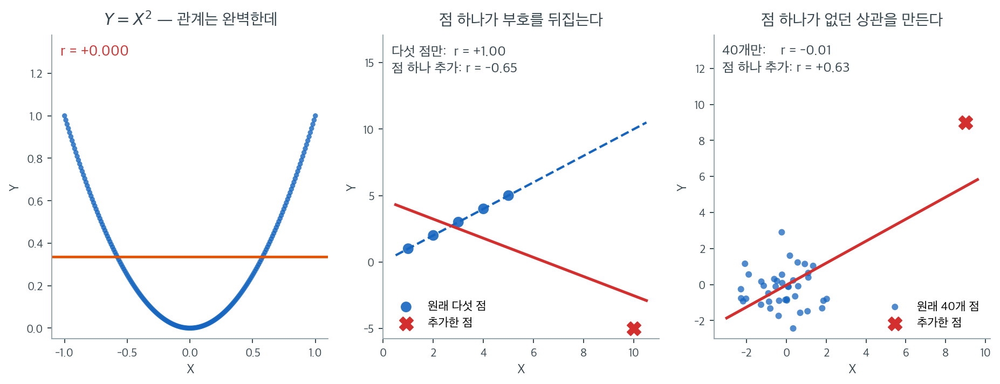

# Pearson 상관계수

두 양적 변수를 분석할 때 자연스럽게 떠오르는 첫 질문은 "둘이 함께 움직이는 경향이 있는가?"이다. **Pearson 상관계수**는 두 변수 사이 *선형* 관계의 강도와 방향을 단위 없이 정확하게 재는 측도이다. 통계학에서 가장 널리 쓰이는 상관 측도이다.

---

## 모상관

분산이 유한한 두 확률변수 $X$와 $Y$에 대해 **모집단 Pearson 상관계수**는 다음으로 정의된다:

$$
\rho_{XY} = \frac{\text{Cov}(X, Y)}{\sigma_X \, \sigma_Y} = \frac{\mathbb{E}[(X - \mu_X)(Y - \mu_Y)]}{\sqrt{\mathbb{E}[(X - \mu_X)^2]} \; \sqrt{\mathbb{E}[(Y - \mu_Y)^2]}}
$$

여기서 $\mu_X = \mathbb{E}[X]$, $\mu_Y = \mathbb{E}[Y]$, $\sigma_X = \sqrt{\text{Var}(X)}$, $\sigma_Y = \sqrt{\text{Var}(Y)}$이다.

핵심 성질은 $\rho_{XY}$가 언제나 구간 $[-1, 1]$ 안에 있다는 것이다.

---

## 표본상관계수

짝지어진 관측값 $(x_1, y_1), (x_2, y_2), \ldots, (x_n, y_n)$이 주어졌을 때 **표본 Pearson 상관계수**는

$$
r = \frac{\sum_{i=1}^{n}(x_i - \bar{x})(y_i - \bar{y})}{\sqrt{\sum_{i=1}^{n}(x_i - \bar{x})^2} \; \sqrt{\sum_{i=1}^{n}(y_i - \bar{y})^2}}
$$

이며 $\bar{x} = \frac{1}{n}\sum_{i=1}^n x_i$와 $\bar{y} = \frac{1}{n}\sum_{i=1}^n y_i$는 표본평균이다. 계산에 편한 동등한 공식은

$$
r = \frac{n \sum x_i y_i - (\sum x_i)(\sum y_i)}{\sqrt{[n \sum x_i^2 - (\sum x_i)^2][n \sum y_i^2 - (\sum y_i)^2]}}
$$

이다. 표본상관 $r$은 모상관 $\rho_{XY}$의 일치추정량이다.

---

## 성질

Pearson 상관계수는 몇 가지 중요한 성질을 만족한다.

1. **유계성.** 어떤 자료에서든 $-1 \le r \le 1$이고, 분산이 유한한 어떤 확률변수 쌍에서든 $-1 \le \rho \le 1$이다.

2. **대칭성.** $r_{XY} = r_{YX}$이며 $\rho$도 마찬가지이다.

3. **평행이동 불변성.** 임의의 상수 $a$, $b$에 대해

    $$
    r_{X+a, \, Y+b} = r_{X, Y}
    $$

    이다. 어느 변수를 평행이동해도 상관은 변하지 않는다.

4. **축척 불변성.** 양의 상수 $a > 0$, $b > 0$에 대해

    $$
    r_{aX, \, bY} = r_{X, Y}
    $$

    이다. 양수 배로 축척을 바꾸어도 상관은 보존된다. $a < 0$이거나 $b < 0$이면 $r$의 부호가 뒤집힌다.

5. **완전 상관.** $|r| = 1$일 필요충분조건은 모든 자료점이 정확히 한 직선 위에 있는 것이다. 구체적으로 어떤 $b > 0$에 대해 $y_i = a + bx_i$이면 $r = 1$이고, $b < 0$이면 $r = -1$이다.

---

## 해석

$r$의 값은 선형 연관의 강도와 방향을 기술한다.

| $r$의 범위 | 해석 |
|:---:|:---|
| $0.7 \le r \le 1.0$ | 강한 양의 선형관계 |
| $0.3 \le r < 0.7$ | 중간 정도의 양의 선형관계 |
| $0 < r < 0.3$ | 약한 양의 선형관계 |
| $r = 0$ | 선형관계 없음 |
| $-0.3 < r < 0$ | 약한 음의 선형관계 |
| $-0.7 < r \le -0.3$ | 중간 정도의 음의 선형관계 |
| $-1.0 \le r \le -0.7$ | 강한 음의 선형관계 |

이 문턱들은 관례적인 지침이지 엄격한 규칙이 아니다. 맥락이 중요하다. 어떤 분야(예: 물리학)에서는 $r = 0.7$이 약하다고 여겨지지만 사회과학에서는 강하다고 볼 수 있다.

---

## 결정계수

Pearson 상관의 제곱 $r^2$을 **결정계수**라 한다. $Y$의 분산 중 $X$로 선형적으로 설명되는 비율을 나타낸다:

$$
r^2 = 1 - \frac{\sum_{i=1}^n (y_i - \hat{y}_i)^2}{\sum_{i=1}^n (y_i - \bar{y})^2}
$$

여기서 $\hat{y}_i$는 $X$에 대한 $Y$의 단순선형회귀에서 나온 적합값이다.

예를 들어 $r = 0.80$이면 $r^2 = 0.64$이므로 $Y$ 변동의 64%가 $X$와의 선형관계로 설명된다.

---

## 선형성 가정

결정적인 한계는 Pearson의 $r$이 **선형** 연관만 잰다는 점이다. 두 변수가 강한 비선형 관계를 가지면서도 $r \approx 0$이 나올 수 있다.

!!! warning "Pearson의 r은 비선형 관계에서 오도할 수 있다"
    $X$가 $[-1, 1]$ 위에서 균등분포를 따르고 $Y = X^2$이라고 하자. 완벽한 결정적 관계가 있지만 관계가 대칭이고 비선형이므로 $r_{XY} = 0$이다. $r$을 해석하기 전에 반드시 산점도를 살펴보라.

Anscombe의 사중주가 유명한 예이다. $r$ 값은 거의 같지만 산점도 패턴이 아주 다른 자료 네 벌이다. 수치 요약과 함께 시각화가 왜 중요한지 잘 보여준다.

---

## 이상점에 대한 민감성

Pearson 상관은 평균과 표준편차에 기반하는데, 이들 자체가 극단값에 민감하므로 상관도 이상점에 민감하다. 이상점 하나가 $r$을 극적으로 키우거나 줄일 수 있다.

??? example "이상점이 상관에 미치는 영향"
    자료 $(1,1), (2,2), (3,3), (4,4), (5,5)$는 $r = 1.0$이다. 여기에 점 $(10, -5)$ 하나를 더하면 $r$이 약 $-0.65$로 바뀐다. 이상점 하나가 완전한 양의 상관을 중간 정도의 음의 상관으로 뒤집었다.

이상점이 있거나 자료가 정규가 아니면 [Spearman 상관](spearman.md)이나 [Kendall의 타우](kendall.md) 같은 순위 기반 대안을 고려하라.



앞의 두 경고를 한 줄에 놓고 본 것이다. 왼쪽은 $[-1, 1]$ 위의 200개 점에 대해 $Y = X^2$인 자료다. $Y$가 $X$로 완전히 결정되므로 관계의 세기로 치면 이보다 강할 수 없는데 $r = 0.000$이다. 주황 수평선이 이유를 말해 준다. **$X$가 커질 때 $Y$가 어느 쪽으로 가는지 한 방향으로 답할 수 없으면 Pearson의 $r$은 0이다.** $r$은 "관계가 있는가"가 아니라 "직선으로 얼마나 잘 맞는가"를 재는 숫자다.

가운데는 절의 앞에서 든 예다. 점 다섯 개 $(1,1), \ldots, (5,5)$는 완전한 직선 위에 있어 $r = +1.00$인데, $(10, -5)$ 하나를 더하면 $r = -0.65$가 된다. 파란 파선이 원래의 적합, 붉은 직선이 점을 더한 뒤의 적합이다. 표본이 여섯 개뿐이어서 극단적으로 보일 수 있지만, 본질은 표본크기가 아니라 **지레**다. 평균에서 멀리 떨어진 점일수록 제곱합에 기여하는 몫이 커지고, $r$의 분자와 분모가 모두 그 제곱합으로 이루어져 있다.

오른쪽은 반대 방향의 사고다. 서로 완전히 독립인 40개 점의 상관은 $r = -0.01$로 사실상 0인데, $(9, 9)$ 하나를 더하면 $r = +0.63$으로 뛴다. **없던 상관이 점 하나에서 만들어진다.** 이 쪽이 실무에서 더 위험하다. 앞의 경우는 부호가 이상해서 곧 눈치채지만, 이 경우는 "찾던 관계를 찾았다"는 형태로 나타나기 때문이다.

세 판이 말하는 결론은 하나다. **$r$을 계산했으면 반드시 산점도를 함께 본다.** Anscombe의 사중주가 유명해진 것도 같은 이유이고, 이상점이 있거나 관계가 휘어 있다고 판단되면 다음 절의 순위 기반 측도로 옮겨 가는 것이 안전하다.

---

<div class="exbox" markdown>

**보기 1.** <span class="diff easy" title="쉬움"></span> Pearson 상관계수 구하기. $x = 1, 2, \ldots, 10$ 에 대해

$$
y = (2.1,\ 3.9,\ 6.2,\ 7.8,\ 10.1,\ 12.3,\ 13.8,\ 16.1,\ 18.0,\ 20.2)
$$

를 관측했다. 상관계수의 정의와 성질은 3.4절에서 이미 다루었으므로 여기서는 **계산**에 집중한다.

**(1)** $r = S_{xy}/\sqrt{S_{xx}S_{yy}}$ 를 구하시오. $x$ 가 $1$ 부터 $10$ 까지의 정수이므로 $S_{xx}$ 에는 닫힌 꼴

$$
S_{xx} = \sum_{k=1}^n \left(k - \frac{n+1}{2}\right)^{\!2} = \frac{n(n^2-1)}{12}
$$

이 있다. 회귀직선의 기울기도 함께 구하시오.

**(2)** $r$ 은 **척도불변**이지만 공분산은 아니다. $y$ 를 $y' = 2.20462\,y + 37$ 로, $x$ 를 $x' = x + 100$ 으로 바꾸면 $r$ 과 공분산이 각각 어떻게 되는가.

**(3)** 점 $(10, -5)$ 하나를 더하면 $r$ 이 $0.9996$ 에서 $0.4180$ 으로 떨어진다. 그 한 점이 $S_{xy}$ 와 $S_{yy}$ 에 **얼마나** 기여하는지 수로 적으시오.

**(4)** 코드로 (1)\~(3)을 확인하시오.

</div>

??? success "풀이"

    **(1) 세 제곱합.** 먼저 $S_{xx}$ 를 닫힌 꼴로 얻는다. $\bar x = (n+1)/2 = 5.5$ 이고

    $$
    S_{xx} = \frac{n(n^2-1)}{12} = \frac{10 \times 99}{12} = \frac{990}{12} = 82.5
    $$

    다. 공식을 믿지 못하겠으면 직접 더해도 된다. 편차가 $\pm 0.5, \pm1.5, \pm2.5, \pm3.5, \pm4.5$ 이므로

    $$
    S_{xx} = 2(0.25 + 2.25 + 6.25 + 12.25 + 20.25) = 2 \times 41.25 = 82.5
    $$

    로 같다. 다음은 $\bar y$ 다. 열 수를 더하면 $110.5$ 이므로 $\bar y = 11.05$ 다. 나머지 두 제곱합은 더해 보면

    $$
    S_{yy} = \sum (y_i - 11.05)^2 = 332.865,
    \qquad
    S_{xy} = \sum (x_i - 5.5)(y_i - 11.05) = 165.65
    $$

    이다. 따라서

    $$
    r = \frac{165.65}{\sqrt{82.5 \times 332.865}} = \frac{165.65}{165.71469} = 0.9996096
    $$

    이고, 회귀직선의 기울기는

    $$
    \hat b = \frac{S_{xy}}{S_{xx}} = \frac{165.65}{82.5} = 2.007879
    $$

    다. **자료는 사실상 $y \approx 2x$ 다.** 설명된 변동의 몫은 $r^2 = 0.9992193$ 이고 남는 것이 $1 - r^2 = 0.00078$, 곧 $0.08\%$ 뿐이다.

    **(2) 척도불변.** 3.4절 정리 1 이 말한 대로다. $x' = \alpha x + \beta$, $y' = \gamma y + \delta$ ($\alpha, \gamma > 0$)이면

    $$
    S_{x'y'} = \alpha\gamma S_{xy}, \qquad S_{x'x'} = \alpha^2 S_{xx}, \qquad S_{y'y'} = \gamma^2 S_{yy}
    $$

    이므로

    $$
    r' = \frac{\alpha\gamma S_{xy}}{\sqrt{\alpha^2 S_{xx}\cdot\gamma^2 S_{yy}}} = \frac{\alpha\gamma}{\alpha\gamma}\, r = r
    $$

    로 **$r$ 은 꿈쩍도 하지 않는다.** 반면 표본공분산은 $\alpha\gamma$ 배가 된다. 여기서는 $\alpha = 1$, $\gamma = 2.20462$ 이므로

    $$
    \widehat{\operatorname{Cov}}(x,y) = \frac{S_{xy}}{n-1} = \frac{165.65}{9} = 18.405556
    \;\longrightarrow\;
    18.405556 \times 2.20462 = 40.577256
    $$

    다. **킬로그램을 파운드로 바꾸는 것만으로 공분산이 두 배 넘게 뛴다.** 평행이동 $\beta = 100$, $\delta = 37$ 은 둘 다 아무 영향이 없다. 편차를 취하면서 사라지기 때문이다.

    **단위가 사라진다는 것이 상관계수를 쓰는 유일한 이유다.** 공분산 $18.4$ 가 큰 수인지 작은 수인지 물어도 답할 수 없지만, $r = 0.9996$ 은 단위 없이 "거의 직선" 이라고 말해 준다.

    **(3) 한 점의 지레.** 점 $(10, -5)$ 를 더하면 $n = 11$ 이 되고 평균이 옮겨 간다.

    $$
    \bar x' = \frac{55 + 10}{11} = 5.909091,
    \qquad
    \bar y' = \frac{110.5 - 5}{11} = 9.590909
    $$

    새 점의 편차는 $x$ 쪽으로 $10 - 5.909091 = +4.090909$, $y$ 쪽으로 $-5 - 9.590909 = -14.590909$ 다. 그러므로 이 한 점이 $S_{xy}$ 에 보태는 양은

    $$
    (+4.090909)(-14.590909) = -59.690083
    $$

    이다. 새 $S_{xy}$ 가 $99.990909$ 이니 **한 점이 $-59.69$, 나머지 열 점이 합해서 $+159.68$ 을 낸 것**이다. 비율로 적으면 이 점 혼자 $S_{xy}$ 의 $-59.7\%$ 를 담당한다.

    분모도 함께 부푼다. $S_{yy}$ 에 보태는 양이

    $$
    (-14.590909)^2 = 212.894628
    $$

    로 새 $S_{yy} = 567.049091$ 의 **$37.5\%$** 다. $S_{xx}$ 에는 $16.735537$ 로 $16.6\%$ 를 보탠다.

    $$
    r' = \frac{99.990909}{\sqrt{100.909091 \times 567.049091}} = 0.418008
    $$

    **분자를 깎으면서 분모를 키우니 양쪽에서 당한다.** 이것이 "지레" 라는 말의 내용이다. 평균에서 멀리 떨어진 점일수록 모든 제곱합에 크게 들어가는데, $r$ 의 분자와 분모가 모두 그 제곱합으로 되어 있다. **관측값 11개 가운데 하나가 상관계수를 절반 넘게 깎아냈다.**

    **(4) 수치적으로.**

    ```python
    import numpy as np
    from scipy import stats

    # 예시 자료
    x = np.array([1, 2, 3, 4, 5, 6, 7, 8, 9, 10])
    y = np.array([2.1, 3.9, 6.2, 7.8, 10.1, 12.3, 13.8, 16.1, 18.0, 20.2])

    # 방법 1: NumPy 의 상관행렬
    corr_matrix = np.corrcoef(x, y)
    r_numpy = corr_matrix[0, 1]
    print(f"NumPy r = {r_numpy:.4f}")

    # 방법 2: SciPy (p-값도 함께 돌려준다)
    r_scipy, p_value = stats.pearsonr(x, y)
    print(f"SciPy r = {r_scipy:.4f}, p-value = {p_value:.6f}")

    # 이상점 하나를 더하면 어떻게 되는지 본다.
    x2 = np.append(x, 10)
    y2 = np.append(y, -5)
    print(f"이상점 추가 후 r = {np.corrcoef(x2, y2)[0, 1]:.4f}")

    # (1) 세 제곱합과 닫힌 꼴
    n = len(x)
    Sxx = ((x - x.mean())**2).sum()
    Syy = ((y - y.mean())**2).sum()
    Sxy = ((x - x.mean()) * (y - y.mean())).sum()
    print(f"\nSxx = {Sxx}   n(n^2-1)/12 = {n * (n**2 - 1) / 12}")
    print(f"Syy = {Syy}   Sxy = {Sxy}")
    print(f"r = {Sxy / np.sqrt(Sxx * Syy):.7f}   기울기 = {Sxy / Sxx:.6f}"
          f"   r^2 = {(Sxy / np.sqrt(Sxx * Syy))**2:.7f}")

    # (2) 척도불변. 공분산은 그렇지 않다.
    xs, ys = x + 100, 2.20462 * y + 37
    print(f"\n변환 전 r {np.corrcoef(x, y)[0, 1]:.16f}  공분산 {np.cov(x, y)[0, 1]:.6f}")
    print(f"변환 후 r {np.corrcoef(xs, ys)[0, 1]:.16f}  공분산 {np.cov(xs, ys)[0, 1]:.6f}")

    # (3) 이상점 한 점의 기여
    bx, by = x2.mean(), y2.mean()
    Sxy2 = ((x2 - bx) * (y2 - by)).sum()
    Syy2 = ((y2 - by)**2).sum()
    Sxx2 = ((x2 - bx)**2).sum()
    cxy = (x2[-1] - bx) * (y2[-1] - by)
    print(f"\n새 평균 ({bx:.6f}, {by:.6f})")
    print(f"그 점의 Sxy 기여 {cxy:.6f}  /  Sxy = {Sxy2:.6f}   ({cxy / Sxy2:+.1%})")
    print(f"그 점의 Syy 기여 {(y2[-1] - by)**2:.6f}  /  Syy = {Syy2:.6f}"
          f"   ({(y2[-1] - by)**2 / Syy2:.1%})")
    print(f"그 점의 Sxx 기여 {(x2[-1] - bx)**2:.6f}  /  Sxx = {Sxx2:.6f}"
          f"   ({(x2[-1] - bx)**2 / Sxx2:.1%})")
    print(f"r' = {Sxy2 / np.sqrt(Sxx2 * Syy2):.6f}")
    ```

    출력:

    ```
    NumPy r = 0.9996
    SciPy r = 0.9996, p-value = 0.000000
    이상점 추가 후 r = 0.4180

    Sxx = 82.5   n(n^2-1)/12 = 82.5
    Syy = 332.865   Sxy = 165.64999999999998
    r = 0.9996096   기울기 = 2.007879   r^2 = 0.9992193

    변환 전 r 0.9996095571302254  공분산 18.405556
    변환 후 r 0.9996095571302255  공분산 40.577256

    새 평균 (5.909091, 9.590909)
    그 점의 Sxy 기여 -59.690083  /  Sxy = 99.990909   (-59.7%)
    그 점의 Syy 기여 212.894628  /  Syy = 567.049091   (37.5%)
    그 점의 Sxx 기여 16.735537  /  Sxx = 100.909091   (16.6%)
    r' = 0.418008
    ```

    `np.corrcoef`와 `stats.pearsonr`가 같은 $r$을 준다. 앞의 것은 상관행렬을, 뒤의 것은 p-값을 함께 준다는 차이뿐이다.

    (1)의 세 수가 그대로 나온다. **`Sxx = 82.5` 와 닫힌 꼴 `n(n^2-1)/12 = 82.5` 가 같다.** $r = 0.9996096$, 기울기 $2.007879$ 도 손계산과 맞는다.

    (2)가 가장 깨끗하다. 변환 전후의 $r$ 이 `0.9996095571302254` 와 `0.9996095571302255` 로 **소수 열다섯째 자리까지 같다**(끝자리 차이는 부동소수점 반올림이다). 같은 줄의 공분산은 `18.405556` 에서 `40.577256` 으로 $2.20462$ 배가 되었다. **같은 자료, 같은 관계인데 공분산만 바뀐다.**

    (3)도 손계산 그대로다. 그 한 점이 $S_{xy}$ 의 $-59.7\%$ 를 내고 $S_{yy}$ 의 $37.5\%$ 를 보탠다. 분자는 깎이고 분모는 커지니 $r$ 이 $0.9996$ 에서 $0.418008$ 로 내려앉는다. **관측값 11개 중 하나가 상관계수를 절반 넘게 깎아냈다.**

    `scipy.stats.pearsonr` 함수는 표본상관과 함께 귀무가설 $H_0\!: \rho = 0$에 대한 양측 p-값을 돌려준다. 이 가설검정의 자세한 내용은 [Pearson의 r 검정](../correlation_test/test_pearson.md)을 보라.

---

## 연습문제

<div class="drillbox" markdown>

**연습문제 1.** <span class="diff med" title="중간"></span>
키–몸무게 자료를 써서 다음 각각에 대해 Pearson 상관계수를 계산하라:

1. 남성만
2. 여성만
3. 전체 자료

```python
import pandas as pd

# openintro의 bdims 자료: 성인 507명의 신체 치수.
# hgt(cm), wgt(kg), sex(1 = 남성, 0 = 여성) 열을 쓴다.
url = ("https://raw.githubusercontent.com/vincentarelbundock/Rdatasets/"
       "1dcc2bf5f955cc1224a3e1307256e1fe86b68dae/csv/openintro/bdims.csv")
data = pd.read_csv(url).rename(columns={"hgt": "Height", "wgt": "Weight"})
data["Gender"] = data["sex"].map({1: "Male", 0: "Female"})

for label, subset in [("Male", data[data.Gender == "Male"]),
                      ("Female", data[data.Gender == "Female"]),
                      ("All", data)]:
    r = subset["Height"].corr(subset["Weight"])
    print(f"{label:<7} n = {len(subset):>3}   r = {r:.4f}")
```

출력:

```
Male    n = 247   r = 0.5347
Female  n = 260   r = 0.4311
All     n = 507   r = 0.7173
```

전체 상관이 집단 내 상관과 다를 수 있는 이유를 논하라.

</div>

??? success "풀이"

    남성 0.535, 여성 0.431인데 둘을 합치면 0.717로 오히려 **커진다**. 전체 자료에는 집단 간 변동이 포함되기 때문이다. 남성이 여성보다 키도 크고 몸무게도 무거운 경향이 있다면, 두 집단을 합칠 때 (집단 차이라는) 양의 공변동 원천이 하나 더 생겨 전체 상관이 집단 내 상관보다 커질 수 있다. 이는 생태학적 상관 효과의 한 예이다.

<div class="drillbox" markdown>

**연습문제 2.** <span class="diff med" title="중간"></span>
$\rho \in \{-0.99, -0.8, -0.5, 0, 0.5, 0.8, 0.99\}$에 대해 이변량 정규 표본을 생성하여 한 행의 부분그림들에 표시하는 함수를 작성하라. 각 부분그림의 제목에 표본 Pearson $r$도 출력하라.

</div>

??? success "풀이"

    각 $\rho$에 대해 공분산행렬 $\Sigma = \begin{pmatrix} 1 & \rho \\ \rho & 1 \end{pmatrix}$로 `numpy.random.multivariate_normal`을 쓴다. 부분그림마다 $n = 200$개를 생성하고 `numpy.corrcoef`로 Pearson $r$을 계산한 뒤 `matplotlib.pyplot.subplots(1, 7)`로 표시한다. $|\rho|$가 커질수록 산점도가 점점 좁은 타원이 되고 $\pm 0.99$에서는 거의 직선으로 붕괴한다.

<div class="drillbox" markdown>

**연습문제 3.** <span class="diff med" title="중간"></span>
`scipy`를 쓰거나 직접 Anscombe의 사중주를 재현하라. 네 자료 각각에 대해 Pearson $r$을 계산하고, 산점도 패턴이 아주 다른데도 값이 거의 같음을 확인하라.

```python
import seaborn as sns

anscombe = sns.load_dataset("anscombe")
for name, grp in anscombe.groupby("dataset"):
    r = grp["x"].corr(grp["y"])
    print(f"{name}: n = {len(grp)}, mean(x) = {grp.x.mean():.2f}, "
          f"mean(y) = {grp.y.mean():.2f}, r = {r:.4f}")
```

출력:

```
I: n = 11, mean(x) = 9.00, mean(y) = 7.50, r = 0.8164
II: n = 11, mean(x) = 9.00, mean(y) = 7.50, r = 0.8162
III: n = 11, mean(x) = 9.00, mean(y) = 7.50, r = 0.8163
IV: n = 11, mean(x) = 9.00, mean(y) = 7.50, r = 0.8165
```

네 자료의 평균도, 상관도 소수점 셋째 자리까지 같다. 그런데 산점도를 그려 보면 완전히 다른 자료다.

</div>

??? success "풀이"

    Anscombe 사중주의 네 자료 모두 Pearson $r \approx 0.816$을 준다. 그러나 산점도는 아주 다른 관계를 드러낸다. 선형 추세, 휘어진 관계, 이상점 하나가 있는 완전한 선형 추세, 그리고 극단적인 점 하나가 상관을 만들어내는 자료이다. Pearson $r$만으로는 관계를 규정하기에 부족하며 시각적 검토가 언제나 필요함을 보여준다.

<div class="drillbox" markdown>

**연습문제 4.** <span class="diff hard" title="어려움"></span>
$r$의 **표집분포**를 모의실험으로 만들어라. $r$은 $\rho$의 불편추정량인가? 분포의 모양은 어떠한가?

</div>

??? success "풀이"
    ```python
    import warnings
    warnings.filterwarnings("ignore")

    import numpy as np
    from scipy import stats

    rng = np.random.default_rng(20001)
    print(f"{'ρ':>6s} {'n':>5s} {'E[r]':>9s} {'편향':>9s} {'SD':>8s} "
          f"{'치우침':>8s} {'이론 SD':>8s}")
    for rho in [0.0, 0.5, 0.8, 0.95]:
        for n in [10, 30]:
            rs = []
            for _ in range(10_000):
                z = rng.standard_normal((n, 2))
                x = z[:, 0]
                y = rho * z[:, 0] + np.sqrt(1 - rho**2) * z[:, 1]
                rs.append(np.corrcoef(x, y)[0, 1])
            rs = np.array(rs)
            print(f"{rho:6.2f} {n:5d} {rs.mean():9.4f} {rs.mean() - rho:9.4f} "
                  f"{rs.std(ddof=1):8.4f} {stats.skew(rs):8.4f} "
                  f"{(1 - rho**2) / np.sqrt(n - 1):8.4f}")
    ```

    ```text
         ρ     n      E[r]        편향       SD      치우침    이론 SD
      0.00    10    0.0047    0.0047   0.3365  -0.0398   0.3333
      0.00    30    0.0002    0.0002   0.1849  -0.0028   0.1857
      0.50    10    0.4752   -0.0248   0.2664  -0.8488   0.2500
      0.50    30    0.4954   -0.0046   0.1429  -0.5994   0.1393
      0.80    10    0.7835   -0.0165   0.1474  -1.9197   0.1200
      0.80    30    0.7951   -0.0049   0.0715  -0.9843   0.0669
      0.95    10    0.9436   -0.0064   0.0456  -3.7411   0.0325
      0.95    30    0.9482   -0.0018   0.0199  -1.3341   0.0181
    ```

    **$r$은 불편추정량이 아니다.** $\rho>0$이면 **아래쪽으로 치우친다.**

    | $\rho$ | $n$ | 편향 |
    |---|---|---|
    | 0.5 | 10 | $-0.025$ |
    | 0.8 | 10 | $-0.017$ |
    | 0.95 | 10 | $-0.006$ |
    | 0.5 | 30 | $-0.005$ |

    **근사적으로**

    $$
    E[r]\approx\rho-\frac{\rho(1-\rho^2)}{2n}
    $$

    $\rho=0.5$, $n=10$이면 $-0.5\times0.75/20=-0.019$로 관측된 $-0.025$와 비슷하다. **$n$에 반비례**하므로 $n=30$에서 $-0.005$로 줄어든다.

    **분포가 심하게 치우쳐 있다.** $\rho=0.95$, $n=10$에서 치우침이 $-3.74$다.

    | $\rho$ | $n=10$의 치우침 | $n=30$의 치우침 |
    |---|---|---|
    | 0.00 | $-0.04$ | $-0.00$ |
    | 0.50 | $-0.85$ | $-0.60$ |
    | 0.80 | $-1.92$ | $-0.98$ |
    | **0.95** | $\mathbf{-3.74}$ | $-1.33$ |

    **$\rho$가 1에 가까울수록 심해진다.** $r\leq1$이라는 **상한이 오른쪽 꼬리를 잘라내기** 때문이다. $\rho=0.95$면 $r$이 1을 넘을 수 없으니 위로는 0.05만 움직이고 아래로는 훨씬 멀리 갈 수 있다.

    **$\rho=0$에서는 대칭**이다(치우침 $-0.04$). 그래서 **$\rho=0$의 검정만 $t$ 분포로 정확**하다.

    $$
    t=\frac{r\sqrt{n-2}}{\sqrt{1-r^2}}\sim t(n-2)
    \qquad(\rho=0\text{일 때만})
    $$

    **이론 SD가 실제보다 작다.** $\rho=0.95$, $n=10$에서 0.0325 대 실제 0.0456이다. 근사식

    $$
    \operatorname{SD}(r)\approx\frac{1-\rho^2}{\sqrt{n-1}}
    $$

    은 **$\rho$가 크고 $n$이 작으면 부정확**하다.

    **세 가지 결론.**

    1. **$\rho\neq0$의 구간을 만들 때 $r\pm z\cdot\text{SE}$를 쓰면 안 된다.**
    2. **피셔 $z$ 변환**이 필요하다(연습문제 5).
    3. 작은 표본에서 보고된 큰 $r$은 **위로 편향된 것이 아니라** 아래로 편향된 추정값이 우연히 크게 나온 것이다. 그래도 **유의한 것만 보고하면 과대추정**된다(승자의 저주).

<div class="drillbox" markdown>

**연습문제 5.** <span class="diff hard" title="어려움"></span>
**피셔 $z$ 변환**으로 $\rho$의 신뢰구간을 만들고, 단순한 정규근사와 피복확률을 비교하라.

</div>

??? success "풀이"
    **피셔 $z$ 변환.**

    $$
    z=\operatorname{arctanh}(r)=\frac12\ln\frac{1+r}{1-r}
    \ \dot\sim\ N\!\left(\operatorname{arctanh}\rho,\ \frac{1}{n-3}\right)
    $$

    **분산이 $\rho$에 무관**해지고 분포가 대칭이 된다. 구간을 $z$ 척도에서 만든 뒤 $\tanh$로 되돌린다.

    ```python
    import warnings
    warnings.filterwarnings("ignore")

    import numpy as np
    from scipy import stats

    def fisher_ci(r, n, a=0.05):
        z = np.arctanh(r)
        se = 1 / np.sqrt(n - 3)
        q = stats.norm.ppf(1 - a / 2)
        return np.tanh(z - q * se), np.tanh(z + q * se)

    def naive_ci(r, n, a=0.05):
        se = (1 - r**2) / np.sqrt(n - 1)
        q = stats.norm.ppf(1 - a / 2)
        return r - q * se, r + q * se

    rng = np.random.default_rng(20002)
    B = 5_000
    print("참 ρ 를 덮는 비율 (명목 95%)")
    print(f"{'ρ':>6s} {'n':>5s} {'피셔 z':>9s} {'단순 근사':>10s}")
    for rho in [0.0, 0.5, 0.8, 0.95]:
        for n in [10, 30, 100]:
            a = b = 0
            for _ in range(B):
                z = rng.standard_normal((n, 2))
                x = z[:, 0]
                y = rho * z[:, 0] + np.sqrt(1 - rho**2) * z[:, 1]
                r = np.corrcoef(x, y)[0, 1]
                lo, hi = fisher_ci(r, n)
                a += lo <= rho <= hi
                lo, hi = naive_ci(r, n)
                b += lo <= rho <= hi
            print(f"{rho:6.2f} {n:5d} {a / B:9.4f} {b / B:10.4f}")
    ```

    ```text
    참 ρ 를 덮는 비율 (명목 95%)
         ρ     n      피셔 z      단순 근사
      0.00    10    0.9468     0.8530
      0.00    30    0.9486     0.9216
      0.00   100    0.9488     0.9388
      0.50    10    0.9550     0.8610
      0.50    30    0.9492     0.9188
      0.50   100    0.9464     0.9352
      0.80    10    0.9500     0.8518
      0.80    30    0.9458     0.9124
      0.80   100    0.9520     0.9416
      0.95    10    0.9588     0.8462
      0.95    30    0.9526     0.9114
      0.95   100    0.9510     0.9356
    ```

    **피셔 $z$는 열두 경우 모두에서 0.946~0.959**를 유지한다. **$n=10$에서도 정확**하다.

    **단순 근사는 $n=10$에서 0.85**다. 스무 번 중 세 번 빗나간다.

    | $n$ | 피셔 $z$ | 단순 근사 |
    |---|---|---|
    | 10 | **0.947~0.959** | **0.846~0.861** |
    | 30 | 0.946~0.953 | 0.911~0.922 |
    | 100 | 0.946~0.952 | 0.936~0.946 |

    **$n=100$에서도 단순 근사가 0.94 수준**으로 약간 모자란다.

    **왜 피셔 변환이 통하는가.** 세 가지를 동시에 고친다.

    | 문제 | 피셔 $z$의 효과 |
    |---|---|
    | **치우침** | $\operatorname{arctanh}$가 양 끝을 늘려 대칭화 |
    | **분산이 $\rho$에 의존** | $\operatorname{Var}(z)=1/(n-3)$으로 **고정** |
    | **$[-1,1]$ 경계** | $z$는 $(-\infty,\infty)$ |

    **세 번째가 실용적으로 중요하다.** 단순 근사는 $r=0.95$, $n=10$에서 구간의 상한이 **1을 넘는다.** 피셔 구간은 $\tanh$로 되돌리므로 **반드시 $[-1,1]$ 안**에 있다.

    **분산이 $1/(n-3)$인 것**도 기억할 만하다. $n-1$이 아니라 $n-3$이며, **$\rho$가 들어가지 않는다.**

    **구간의 비대칭.** $r=0.9$, $n=20$이면

    $$
    z=1.472,\quad \text{SE}=0.243
    \ \Rightarrow\ [1.000,\ 1.945]
    \ \xrightarrow{\ \tanh\ }\ [0.762,\ 0.960]
    $$

    **중심 0.9에서 아래로 0.138, 위로 0.060**이다. 원래 척도에서 **비대칭**이며, 그것이 옳다.

    **실무 지침 넷.**

    1. **$\rho=0$ 검정은 $t$ 통계량**으로(정확하다).
    2. **$\rho$의 구간은 언제나 피셔 $z$**로.
    3. **두 상관의 비교**도 $z$ 척도에서(연습문제 9).
    4. **여러 상관의 평균**도 $z$로 평균한 뒤 되돌린다(메타분석의 표준).

<div class="drillbox" markdown>

**연습문제 6.** <span class="diff hard" title="어려움"></span>
본문의 **"이상점에 대한 민감성"**을 극단까지 밀어붙여라. 점 하나로 $r$을 얼마나 바꿀 수 있는가?

</div>

??? success "풀이"
    ```python
    import numpy as np
    from scipy import stats

    rng = np.random.default_rng(20005)
    n = 20
    z = rng.standard_normal((n, 2))
    x, y = z[:, 0], z[:, 1]          # 참 상관 0
    print(f"원 자료 (n={n}):  피어슨 r = {np.corrcoef(x, y)[0, 1]:+.4f},  "
          f"스피어만 = {stats.spearmanr(x, y).statistic:+.4f}")

    print(f"\n{'추가한 점 (a, a)':>18s} {'피어슨 r':>10s} {'스피어만':>10s} {'켄들':>9s}")
    for a in [3, 5, 10, 20, 50, 100]:
        X, Y = np.append(x, a), np.append(y, a)
        print(f"{f'({a}, {a})':>18s} {np.corrcoef(X, Y)[0, 1]:+10.4f} "
              f"{stats.spearmanr(X, Y).statistic:+10.4f} "
              f"{stats.kendalltau(X, Y).statistic:+9.4f}")

    print("\n반대 방향의 점 하나")
    print(f"{'추가한 점 (a, -a)':>18s} {'피어슨 r':>10s} {'스피어만':>10s} {'켄들':>9s}")
    for a in [10, 50, 100]:
        X, Y = np.append(x, a), np.append(y, -a)
        print(f"{f'({a}, {-a})':>18s} {np.corrcoef(X, Y)[0, 1]:+10.4f} "
              f"{stats.spearmanr(X, Y).statistic:+10.4f} "
              f"{stats.kendalltau(X, Y).statistic:+9.4f}")
    ```

    ```text
    원 자료 (n=20):  피어슨 r = +0.3119,  스피어만 = +0.3188

          추가한 점 (a, a)      피어슨 r       스피어만        켄들
                (3, 3)    +0.5816    +0.4117   +0.2762
                (5, 5)    +0.7415    +0.4117   +0.2762
              (10, 10)    +0.9049    +0.4117   +0.2762
              (20, 20)    +0.9726    +0.4117   +0.2762
              (50, 50)    +0.9954    +0.4117   +0.2762
            (100, 100)    +0.9988    +0.4117   +0.2762

    반대 방향의 점 하나
         추가한 점 (a, -a)      피어슨 r       스피어만        켄들
             (10, -10)    -0.8123    +0.1390   +0.0857
             (50, -50)    -0.9915    +0.1390   +0.0857
           (100, -100)    -0.9979    +0.1390   +0.0857
    ```

    **점 하나로 $r$을 $+0.999$에서 $-0.998$까지 만들 수 있다.**

    | 추가한 점 | 피어슨 | 스피어만 |
    |---|---|---|
    | 없음 | $+0.312$ | $+0.319$ |
    | $(100,100)$ | $\mathbf{+0.999}$ | $+0.412$ |
    | $(100,-100)$ | $\mathbf{-0.998}$ | $+0.139$ |

    **순위 상관은 거의 움직이지 않는다.** $a$가 3이든 100이든 **스피어만은 $+0.4117$로 동일**하다. 순위에서는 **"가장 큰 값"일 뿐** 얼마나 큰지는 상관없기 때문이다.

    **이것이 로버스트성의 정확한 의미**다.

    | | 이상점이 미치는 영향 |
    |---|---|
    | **피어슨** | **크기에 비례**해 무한히 커짐 |
    | 스피어만·켄들 | **순위 한 칸**만큼만 |

    **왜 피어슨이 이렇게 취약한가.** $r$의 분자는

    $$
    \sum(x_i-\bar x)(y_i-\bar y)
    $$

    인데, 한 점이 $(a,a)$면 그 기여가 $\approx a^2$로 **제곱으로 자란다.** 분모의 $\sqrt{\sum(x-\bar x)^2}\sqrt{\sum(y-\bar y)^2}$도 $a^2$로 자라지만, **다른 점들의 기여가 상대적으로 0이 되어** $r\to1$이다.

    **극한값.** $a\to\infty$에서

    $$
    r\to\frac{a^2}{\sqrt{a^2}\sqrt{a^2}}=1
    $$

    **다른 자료가 무엇이든 $\pm1$로 간다.**

    **방어 방법 넷.**

    | 방법 | 내용 |
    |---|---|
    | **산점도를 반드시 본다** | 숫자만 보면 절대 알 수 없다 |
    | **순위 상관을 함께** | 피어슨과 크게 다르면 경고 |
    | **한 점씩 빼며 재계산** | 잭나이프 민감도 |
    | 로버스트 상관 | 최소부피타원체, 절사 상관 |

    **두 번째가 가장 값싼 점검**이다. 위 예에서

    $$
    r_{\text{피어슨}}=0.999,\quad r_{\text{스피어만}}=0.412
    $$

    **이 격차 자체가 이상점의 존재를 알려 준다.**

    **잭나이프 민감도.**

    ```text
    r 을 계산한다
    각 i 에 대해 i 를 뺀 r_(i) 를 계산한다
    max|r - r_(i)| 를 본다
      → 0.1 을 넘으면 그 점을 조사한다
    ```

    **앤스콤의 사중주(연습문제 3)도 같은 교훈**이지만, 여기서는 **한 점이 얼마나 멀리 갈 수 있는지**를 극한까지 보였다.

<div class="drillbox" markdown>

**연습문제 7.** <span class="diff hard" title="어려움"></span>
**범위 제한**이 $r$을 얼마나 떨어뜨리는지 재고, 보정 공식과 맞춰 보라.

</div>

??? success "풀이"
    **상황.** 모집단 상관이 0.60인데, **상위 집단만 관측**한다. 예를 들어

    | 상황 | 선발 |
    |---|---|
    | 대학 입시 성적과 학점 | **합격자만** |
    | 채용 시험과 직무 성과 | **채용된 사람만** |
    | 약효와 부작용 | 임상시험 통과자만 |

    ```python
    import warnings
    warnings.filterwarnings("ignore")

    import numpy as np
    from scipy import stats

    rng = np.random.default_rng(20006)
    B = 4_000
    rho = 0.6
    print("모집단 ρ=0.60. x 의 상위 p 분위만 뽑으면 r 이 얼마가 되는가")
    print(f"{'선발 비율':>10s} {'평균 r':>9s} {'이론 예측':>10s}")
    for frac in [1.0, 0.5, 0.3, 0.2, 0.1]:
        rs = []
        for _ in range(B):
            z = rng.standard_normal((2_000, 2))
            x = z[:, 0]
            y = rho * z[:, 0] + np.sqrt(1 - rho**2) * z[:, 1]
            m = x >= np.quantile(x, 1 - frac)
            if m.sum() > 5:
                rs.append(np.corrcoef(x[m], y[m])[0, 1])
        if frac < 1.0:
            z0 = stats.norm.ppf(1 - frac)
            lam = stats.norm.pdf(z0) / frac
            k = np.sqrt(1 - lam * (lam - z0))       # 절단정규의 SD 비
            pred = rho * k / np.sqrt(1 - rho**2 + rho**2 * k**2)
        else:
            pred = rho
        print(f"{frac:10.0%} {np.mean(rs):9.4f} {pred:10.4f}")
    ```

    ```text
    모집단 ρ=0.60. x 의 상위 p 분위만 뽑으면 r 이 얼마가 되는가
         선발 비율      평균 r      이론 예측
          100%    0.5999     0.6000
           50%    0.4124     0.4120
           30%    0.3589     0.3599
           20%    0.3306     0.3309
           10%    0.2931     0.2947

    ```

    **상위 10%만 보면 $r$이 0.60에서 0.293으로 절반 이하**가 된다. 이론값과 소수점 셋째 자리까지 일치한다.

    | 선발 비율 | 관측 $r$ | 원래 대비 |
    |---|---|---|
    | 100% | 0.600 | 기준 |
    | 50% | 0.412 | $-31\%$ |
    | 20% | 0.331 | $-45\%$ |
    | **10%** | **0.293** | $\mathbf{-51\%}$ |

    **손턴의 보정 공식**(직접 범위 제한).

    $$
    \rho=\frac{r\,/\,k}{\sqrt{1-r^2+r^2/k^2}},
    \qquad k=\frac{s_{\text{제한}}}{S_{\text{모집단}}}
    $$

    **$k$를 알아야 한다.** 모집단의 $x$ 표준편차를 알 수 있는 경우에만 보정할 수 있다.

    **실무의 예 — 대입 성적과 학점.**

    ```text
    관측: 합격생만 보면 수능 점수와 학점의 상관이 0.30
          → "수능은 대학 성적을 잘 예측하지 못한다"?

    합격률이 20% 이고 모집단 SD 대비 합격생 SD 가 0.62 이면
      → 보정된 상관은 약 0.55
      → "중간 정도로 예측한다"

    두 결론의 차이가 정책을 가른다.
    ```

    **범위 제한을 알아채는 신호 셋.**

    | 신호 | 의미 |
    |---|---|
    | **표본의 SD가 모집단보다 작다** | 직접 제한 |
    | 선발·자격 기준이 있다 | 설계상 제한 |
    | **$x$의 히스토그램이 한쪽에서 잘려 있다** | 절단 |

    **주의 넷.**

    1. **보정은 선형성과 등분산을 가정**한다. 관계가 비선형이면 부정확하다.
    2. **간접 제한**(제3의 변수로 선발)은 공식이 다르다.
    3. **보정값은 추정값**이므로 불확실성이 있다. 구간을 함께 보고한다.
    4. **범위가 넓어지는 경우**(극단만 뽑기)에는 $r$이 **과대추정**된다.

    **네 번째의 예.** 최상위와 최하위만 뽑아 비교하면 $r$이 부풀려진다. **"극단 집단 설계"**는 검정력을 얻는 대신 **상관의 크기를 왜곡**한다.

<div class="drillbox" markdown>

**연습문제 8.** <span class="diff hard" title="어려움"></span>
**측정오차**에 의한 감쇠를 확인하고, 감쇠 보정 공식의 위험을 지적하라.

</div>

??? success "풀이"
    **감쇠 공식.** 참 점수 상관이 $\rho$이고 신뢰도가 $r_{xx}$, $r_{yy}$이면

    $$
    \rho_{\text{관측}}=\rho\sqrt{r_{xx}\,r_{yy}}
    $$

    ```python
    import warnings
    warnings.filterwarnings("ignore")

    import numpy as np

    rng = np.random.default_rng(20007)
    rho = 0.6
    print("참 상관 ρ=0.60, 신뢰도 r_xx, r_yy 일 때 관측 상관")
    print(f"{'r_xx':>7s} {'r_yy':>7s} {'관측 r (이론)':>13s} {'모의':>8s}")
    for rxx, ryy in [(1.0, 1.0), (0.9, 0.9), (0.8, 0.8), (0.7, 0.7), (0.6, 0.5)]:
        pred = rho * np.sqrt(rxx * ryy)
        rs = []
        for _ in range(2_000):
            z = rng.standard_normal((500, 2))
            tx = z[:, 0]
            ty = rho * z[:, 0] + np.sqrt(1 - rho**2) * z[:, 1]
            ox = tx + rng.normal(0, np.sqrt(1 / rxx - 1), 500)
            oy = ty + rng.normal(0, np.sqrt(1 / ryy - 1), 500)
            rs.append(np.corrcoef(ox, oy)[0, 1])
        print(f"{rxx:7.2f} {ryy:7.2f} {pred:13.4f} {np.mean(rs):8.4f}")
    ```

    ```text
    참 상관 ρ=0.60, 신뢰도 r_xx, r_yy 일 때 관측 상관
       r_xx    r_yy     관측 r (이론)       모의
       1.00    1.00        0.6000   0.6000
       0.90    0.90        0.5400   0.5405
       0.80    0.80        0.4800   0.4782
       0.70    0.70        0.4200   0.4203
       0.60    0.50        0.3286   0.3281
    ```

    **공식이 정확히 맞는다.**

    | $r_{xx}=r_{yy}$ | 관측 $r$ | 손실 |
    |---|---|---|
    | 1.0(완벽) | 0.600 | — |
    | 0.9 | 0.540 | $-10\%$ |
    | 0.8 | 0.480 | $-20\%$ |
    | **0.7** | **0.420** | $\mathbf{-30\%}$ |

    **신뢰도가 0.7이면 상관의 30%를 잃는다.** 심리·교육 측정에서 신뢰도 0.7~0.8은 흔하다.

    **감쇠 보정.** 공식을 뒤집으면

    $$
    \hat\rho=\frac{r_{\text{관측}}}{\sqrt{r_{xx}r_{yy}}}
    $$

    **위험 넷.**

    | 위험 | 내용 |
    |---|---|
    | **$r_{xx}$ 자체가 추정값** | 오차가 증폭되어 들어간다 |
    | **1을 넘을 수 있다** | $r=0.5$, $r_{xx}r_{yy}=0.2$면 $\hat\rho=1.12$ |
    | 신뢰도의 정의가 여럿 | 크론바흐 $\alpha$? 재검사? 결과가 다르다 |
    | **"참 점수"가 무엇인가** | 측정 대상이 실제로 존재하는가 |

    **두 번째가 실무에서 자주 일어난다.** 보정된 상관이 1을 넘으면 **모형이 틀렸다는 신호**다.

    **신뢰도가 낮으면 검정력도 잃는다.**

    ```text
    참 ρ=0.60 을 α=0.05, 검정력 0.80 으로 잡으려면
      신뢰도 1.0:  n ≈ 19
      신뢰도 0.7:  관측 ρ=0.42 → n ≈ 42
      신뢰도 0.5:  관측 ρ=0.30 → n ≈ 85
    ```

    **신뢰도를 0.7에서 0.9로 올리면 표본을 절반으로 줄일 수 있다.** 측정을 개선하는 것이 표본을 늘리는 것보다 쌀 때가 많다.

    **측정오차가 다른 곳에서는 어떻게 작동하는가.**

    | 상황 | 효과 |
    |---|---|
    | $x$에만 오차 | 회귀계수가 **0 쪽으로 감쇠** |
    | $y$에만 오차 | 계수는 **불편**, 표준오차만 커짐 |
    | 양쪽에 오차 | 상관이 감쇠 |
    | **$x$의 오차가 $y$의 오차와 상관** | 감쇠가 아니라 **편향**(방향 불명) |

    **두 번째 줄이 중요하다.** 회귀에서 **종속변수의 측정오차는 계수를 편향시키지 않는다.** 상관과 회귀가 다르게 반응한다.

    **보고 방법.** 보정을 했다면

    ```text
    관측 상관 r = 0.42
    신뢰도 r_xx = 0.72 (크론바흐 α), r_yy = 0.68 (재검사)
    감쇠 보정 상관 = 0.42 / √(0.72×0.68) = 0.60

    주의: 보정값은 신뢰도 추정의 불확실성을 반영하지 않는다.
    ```

    **관측값과 보정값을 **둘 다** 적는다.** 보정값만 적으면 독자가 확인할 수 없다.

<div class="drillbox" markdown>

**연습문제 9.** <span class="diff hard" title="어려움"></span>
상관을 탐지하는 데 필요한 **표본 크기**를 계산하고, 흔히 보고되는 $r$의 **구간이 얼마나 넓은지** 보여라.

</div>

??? success "풀이"
    **표본 크기 공식**(피셔 $z$ 기반).

    $$
    n=\left(\frac{z_{1-\alpha/2}+z_{\text{power}}}{\operatorname{arctanh}\rho}\right)^2+3
    $$

    ```python
    import numpy as np
    from scipy import stats

    def n_corr(rho, power=0.8, alpha=0.05):
        z = np.arctanh(rho)
        return int(np.ceil(((stats.norm.ppf(1 - alpha / 2)
                             + stats.norm.ppf(power)) / z)**2 + 3))

    print("α=0.05 양측, 검정력 0.80")
    print(f"{'ρ':>6s} {'필요한 n':>9s} {'r²':>7s} {'해석':>10s}")
    for rho, lab in [(0.1, "매우 작음"), (0.2, "작음"), (0.3, "중간"),
                     (0.4, ""), (0.5, "큼"), (0.7, ""), (0.9, "")]:
        print(f"{rho:6.1f} {n_corr(rho):9,d} {rho**2:7.3f} {lab:>10s}")

    print("\nr = 0.3 을 관측했을 때 95% 피셔 구간")
    for n in [20, 50, 100, 300, 1000]:
        z = np.arctanh(0.3)
        se = 1 / np.sqrt(n - 3)
        q = stats.norm.ppf(0.975)
        lo, hi = np.tanh(z - q * se), np.tanh(z + q * se)
        print(f"  n={n:5d}:  [{lo:+.3f}, {hi:+.3f}]   폭 {hi - lo:.3f}")

    def n_diff(r1, r2, power=0.8, alpha=0.05):
        d = abs(np.arctanh(r1) - np.arctanh(r2))
        return int(np.ceil(2 * ((stats.norm.ppf(1 - alpha / 2)
                                 + stats.norm.ppf(power)) / d)**2 + 3))

    print("\n두 상관의 차이를 탐지하는 데 필요한 n (독립 표본, 각 군)")
    for r1, r2 in [(0.3, 0.5), (0.5, 0.7), (0.2, 0.4), (0.6, 0.7), (0.0, 0.3)]:
        print(f"  r1={r1}, r2={r2}:  군당 n = {n_diff(r1, r2):,d}")
    ```

    ```text
    α=0.05 양측, 검정력 0.80
         ρ     필요한 n      r²         해석
       0.1       783   0.010      매우 작음
       0.2       194   0.040         작음
       0.3        85   0.090         중간
       0.4        47   0.160           
       0.5        30   0.250          큼
       0.7        14   0.490           
       0.9         7   0.810           

    r = 0.3 을 관측했을 때 95% 피셔 구간
      n=   20:  [-0.164, +0.655]   폭 0.820
      n=   50:  [+0.024, +0.534]   폭 0.510
      n=  100:  [+0.110, +0.469]   폭 0.359
      n=  300:  [+0.193, +0.400]   폭 0.206
      n= 1000:  [+0.243, +0.355]   폭 0.113

    두 상관의 차이를 탐지하는 데 필요한 n (독립 표본, 각 군)
      r1=0.3, r2=0.5:  군당 n = 277
      r1=0.5, r2=0.7:  군당 n = 159
      r1=0.2, r2=0.4:  군당 n = 325
      r1=0.6, r2=0.7:  군당 n = 521
      r1=0.0, r2=0.3:  군당 n = 167
    ```

    **$\rho=0.3$("중간")을 잡으려면 85명**이 필요하다.

    | $\rho$ | 필요한 $n$ |
    |---|---|
    | 0.1 | **783** |
    | 0.2 | 194 |
    | 0.3 | 85 |
    | 0.5 | 30 |

    **구간의 폭이 충격적이다.** $n=20$에서 $r=0.3$을 관측하면 구간이 $[-0.164,\ +0.655]$다. **음의 상관도 배제하지 못한다.**

    | $n$ | $r=0.3$의 95% 구간 | 폭 |
    |---|---|---|
    | 20 | $[-0.16,\ 0.66]$ | **0.82** |
    | 50 | $[0.02,\ 0.53]$ | 0.51 |
    | 100 | $[0.11,\ 0.47]$ | 0.36 |
    | 1000 | $[0.24,\ 0.36]$ | **0.11** |

    **$n=100$이어도 폭이 0.36**이다. "$r=0.3$"이라는 보고는 실제로 **"0.11에서 0.47 사이 어딘가"**를 뜻한다.

    **두 상관의 비교는 훨씬 비싸다.**

    | 비교 | 군당 $n$ |
    |---|---|
    | $0.3$ 대 $0.5$ | **277** |
    | $0.6$ 대 $0.7$ | **521** |

    **$0.6$과 $0.7$을 구분하려면 군당 521명**이 필요하다. 큰 상관끼리의 비교가 더 어려운 이유는 $\operatorname{arctanh}$가 1 근처에서 가파르기 때문이 아니라 **$z$ 척도의 차이가 작기** 때문이다.

    $$
    \operatorname{arctanh}(0.7)-\operatorname{arctanh}(0.6)=0.867-0.693=0.174
    $$

    $$
    \operatorname{arctanh}(0.5)-\operatorname{arctanh}(0.3)=0.549-0.310=0.239
    $$

    **실무 함의 셋.**

    1. **$n<50$의 상관 보고는 구간 없이 읽지 않는다.**
    2. **"$r_1$이 $r_2$보다 크다"는 주장에는 수백 명이 필요하다.**
    3. **작은 상관($\rho<0.2$)을 다루려면 수백 명**이 기본이다.

    **심리학·사회과학의 재현성 위기와 직접 연결된다.** 전형적인 $n=50$ 연구는 $\rho=0.4$를 잡을 검정력이 0.6 수준이고, **유의하게 나온 $r$은 과대추정**되어 있다.

<div class="drillbox" markdown>

**연습문제 10.** <span class="diff easy" title="쉬움"></span>
피어슨 상관계수의 **사용 지침**을 정리하라.

</div>

??? success "풀이"
    **정의와 성질.**

    $$
    r=\frac{\sum(x_i-\bar x)(y_i-\bar y)}
    {\sqrt{\sum(x_i-\bar x)^2}\sqrt{\sum(y_i-\bar y)^2}}
    $$

    | 성질 | 내용 |
    |---|---|
    | 범위 | $-1\leq r\leq1$(코시-슈바르츠) |
    | **단위 무관** | 선형 변환에 불변(연습문제 4의 답) |
    | **선형 관계만** | 곡선 관계는 잡지 못함 |
    | 대칭 | $r_{xy}=r_{yx}$ |

    **핵심 수치 여섯.**

    | 사실 | 값 |
    |---|---|
    | $\rho=0.95$, $n=10$에서 $r$의 치우침 | $-3.74$ |
    | 단순 근사 구간의 피복확률($n=10$) | **0.85** |
    | 피셔 $z$ 구간 | **0.947~0.959** |
    | 점 하나로 만들 수 있는 $r$의 범위 | $[-0.998,\ +0.999]$ |
    | 상위 10% 선발 시 $r$(모집단 0.6) | **0.293** |
    | $\rho=0.3$ 탐지에 필요한 $n$ | 85 |

    **쓰기 전에 확인할 것 다섯.**

    ```text
    □ 산점도를 그렸는가        ← 가장 중요
    □ 관계가 선형인가          ← 곡선이면 r 이 오도한다
    □ 이상점이 있는가          ← 점 하나가 r 을 지배할 수 있다
    □ 범위가 제한되었는가      ← 선발·절단이 있는가
    □ 측정 신뢰도는 얼마인가   ← 감쇠
    ```

    **첫 줄이 나머지 넷을 대부분 잡아낸다.**

    **언제 다른 측도를 쓰나.**

    | 상황 | 대안 |
    |---|---|
    | **단조이지만 비선형** | 스피어만, 켄들 |
    | **이상점** | 스피어만, 켄들, 로버스트 상관 |
    | 서열 자료 | **스피어만, 켄들** |
    | 이진 × 연속 | 점이연(피어슨과 동일) |
    | 이진 × 이진 | 파이 계수 |
    | 비단조 관계 | 거리 상관, 상호정보 |

    **추론 방법.**

    | 목적 | 방법 |
    |---|---|
    | $H_0:\rho=0$ | $t=\dfrac{r\sqrt{n-2}}{\sqrt{1-r^2}}$, **정확** |
    | $\rho$의 구간 | **피셔 $z$** |
    | $H_0:\rho=\rho_0$($\rho_0\neq0$) | 피셔 $z$ |
    | 두 상관의 비교 | 피셔 $z$의 차이 |
    | 비정규·이상점 | **부트스트랩, 순열** |

    **흔한 오해 다섯.**

    | 오해 | 사실 |
    |---|---|
    | $r=0$이면 무관하다 | **선형 관계가 없을 뿐**(곡선일 수 있다) |
    | $r$이 크면 인과관계 | **아니다**(12장의 주제) |
    | $r=0.8$은 $r=0.4$의 두 배 | $r^2$로는 **네 배**(0.64 대 0.16) |
    | $r$은 불편추정량 | **아래로 편향**되어 있다 |
    | 유의하면 중요하다 | $n=1000$이면 $r=0.07$도 유의하다 |

    **세 번째를 정확히 하면.** $r=0.8$은 변동의 64%를, $r=0.4$는 16%를 설명한다. **"두 배 강한"이 아니라 "네 배 설명하는"**이다.

    **보고 형식.**

    ```text
    키와 몸무게의 상관: r = 0.68, 95% CI [0.58, 0.76], n = 120
      (피어슨, 피셔 z 구간)
    산점도에서 선형 관계가 확인되었고 뚜렷한 이상점은 없었다.
    스피어만 순위상관도 0.66 으로 유사하다.
    결정계수 r² = 0.46 — 몸무게 변동의 46% 를 키가 설명한다.
    ```

    **$r$, 구간, $n$, 방법, 산점도 확인, 순위상관 대조를 모두 적는다.**

    **한 문장.** 피어슨 상관은 **선형 관계의 강도를 재는 단 하나의 숫자**이며, 그 숫자가 의미를 가지려면 **산점도를 먼저 보아야** 한다.

---

## 정리하며

Pearson 상관계수 $r$은 두 변수 사이 선형관계의 강도와 방향을 수치화한다. $-1$(완전한 음의 관계)에서 $+1$(완전한 양의 관계)까지의 값을 가지며 $0$은 선형 연관이 없음을 뜻한다. 강력하고 널리 쓰이지만 $r$은 선형관계만 포착하고 이상점에 민감하다. $r$의 수치는 언제나 산점도와 함께 보아 선형모형이 적절한지 확인해야 한다.
