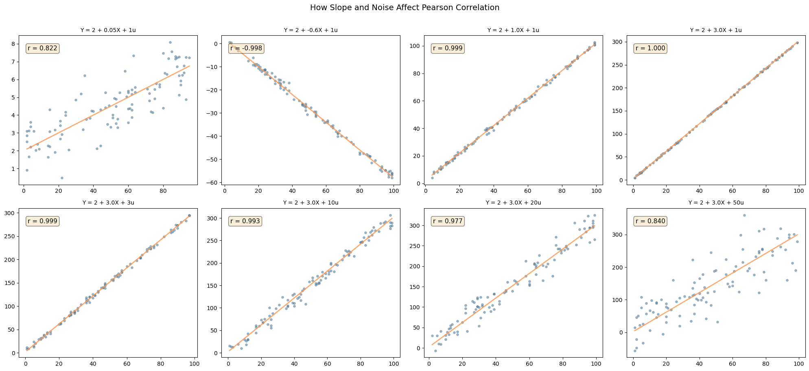
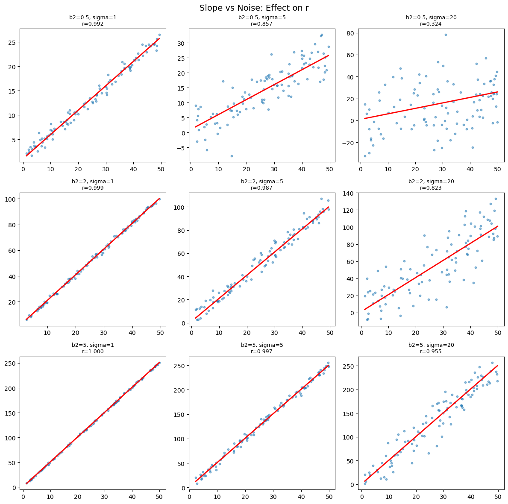

# 회귀와 상관 그림

## 개요

이 페이지는 단순선형회귀 모형에서 Pearson 상관계수 $r$가 두 요인 — 참 회귀직선의 기울기와 오차항의 척도 — 에 어떻게 의존하는지 살펴본다. 기울기와 잡음 수준을 달리한 여덟 가지 설정을 통해 $r$가 언제 크고 언제 작은지에 대한 직관을 쌓는다.

---

## 선형모형

단순선형회귀를 생각하자.

$$
Y = \beta_1 + \beta_2 X + \varepsilon, \qquad \varepsilon \sim \mathcal{N}(0, \sigma^2)
$$

$X$와 $Y$의 Pearson 상관은 기울기 $\beta_2$와 오차 척도 $\sigma$ 모두에 의존한다. 실제로 $X$의 분포를 고정하면 모집단 상관은 다음과 같다.

$$
\rho_{XY} = \frac{\beta_2 \, \sigma_X}{\sqrt{\beta_2^2 \, \sigma_X^2 + \sigma^2}}
$$

이 식은 두 가지 중요한 관계를 드러낸다.

1. **$|\beta_2|$가 커지면 $|\rho|$가 커진다**: 참 기울기가 가파를수록 잡음 대비 신호가 강하다.
2. **$\sigma$가 커지면 $|\rho|$가 작아진다**: 잡음이 커질수록 선형 신호가 묻힌다.

다만 이 두 문장은 **다른 하나를 고정했을 때**에만 성립한다. 뒤에서 보겠지만 결정적인 것은 $\beta_2$나 $\sigma$ 각각이 아니라 세 값 $\beta_2$, $\sigma_X$, $\sigma$가 결합해 만드는 신호 대 잡음비이다.

---

## 모의실험 설정

기울기와 오차 척도를 달리한 여덟 가지 설정에서 자료를 생성한다.

<div class="codebox" markdown>

### 예제 1. 기울기와 잡음을 바꿔 가며 { .eg }

```python
import numpy as np

np.random.seed(42)
DATA_SIZE = 100

# 앞 넷은 기울기를 바꾸고 잡음을 고정했다. 뒤 넷은 기울기를 3 으로 고정하고
# 잡음만 키웠다. 이렇게 나눠 놓으면 r 이 기울기가 아니라 "직선 둘레에
# 얼마나 몰려 있는가"를 재는 값임이 드러난다.
CONFIGS = [
    # (절편, 기울기, 잡음 크기)
    (2, 0.05, 1),    # 아주 완만한 기울기, 잡음 작음
    (2, -0.6, 1),    # 중간 크기 음의 기울기
    (2, 1.0,  1),    # 기울기 1
    (2, 3.0,  1),    # 가파른 기울기, 잡음 작음
    (2, 3.0,  3),    # 같은 기울기, 잡음 중간
    (2, 3.0, 10),    # 같은 기울기, 잡음 큼
    (2, 3.0, 20),    # 같은 기울기, 잡음 매우 큼
    (2, 3.0, 50),    # 같은 기울기, 잡음 극심
]


def generate(beta1, beta2, error_scale, n=DATA_SIZE):
    """주어진 기울기와 잡음으로 자료를 만들고 상관계수까지 돌려준다."""
    x = np.random.randint(1, n, n).astype(float)
    y = beta1 + beta2 * x + error_scale * np.random.randn(n)
    r = np.corrcoef(x, y)[0, 1]
    return x, y, r
```

앞의 네 설정은 $\sigma = 1$로 고정하고 기울기를 바꾸며, 뒤의 네 설정은 $\beta_2 = 3$으로 고정하고 잡음을 키운다.

</div>

!!! note "$X$의 산포에 주목하라"
    `np.random.randint(1, n, n)`은 $1$부터 $99$까지의 정수를 뽑으므로 $\sigma_X \approx 28.6$으로 **매우 크다**. 위 공식에서 $\sigma_X$는 기울기와 곱해져 신호의 크기를 결정하므로, 이 큰 산포가 아래 결과 전체를 좌우한다.

---

## 패널 그림 그리기

<div class="codebox" markdown>

### 예제 2. 여덟 칸을 한눈에 { .eg }

```python
import matplotlib.pyplot as plt

# 여덟 칸을 한 화면에 놓고 r 값을 각 칸에 적어 둔다. 윗줄에서는 기울기가
# 아무리 달라도 r 이 비슷하고, 아랫줄에서는 기울기가 같은데 r 이 줄어든다.
fig, axes = plt.subplots(2, 4, figsize=(20, 9))

for idx, (b1, b2, es) in enumerate(CONFIGS):
    row, col = divmod(idx, 4)
    ax = axes[row, col]
    x, y, r = generate(b1, b2, es)

    ax.scatter(x, y, alpha=0.5, s=15, edgecolors="grey")
    xs = np.sort(x)
    ax.plot(xs, b1 + b2 * xs, color="#FA954D", lw=2, alpha=0.8)
    ax.set_title(f"Y = {b1} + {b2}X + {es}u", fontsize=10)
    ax.annotate(f"r = {r:.3f}", xy=(0.05, 0.9),
                xycoords="axes fraction", fontsize=11,
                bbox=dict(boxstyle="round", fc="wheat", alpha=0.5))

fig.suptitle("How Slope and Noise Affect Pearson Correlation",
             fontsize=14, y=1.01)
plt.tight_layout()
plt.show()
```



직선은 조건부 평균을, 점들의 흩어짐은 그 주위의 산포를 나타낸다.

</div>

---

## 기울기를 바꿀 때(잡음 고정)

$\sigma = 1$로 고정하고 $\sigma_X \approx 28.6$일 때, 위 코드가 내놓는 표본 $r$와 공식이 주는 이론값 $\rho$는 다음과 같다.

| $\beta_2$ | 표본 $r$ | 이론 $\rho$ | 설명 |
|:---:|:---:|:---:|:---|
| 0.05 | 0.822 | 0.819 | 기울기 자체는 아주 작지만 $\beta_2 \sigma_X \approx 1.43$이 $\sigma = 1$보다 크므로 상관은 이미 높다 |
| $-0.6$ | $-0.998$ | $-0.998$ | 뚜렷한 하락 추세. 부호만 음수일 뿐 강도는 거의 완전하다 |
| 1.0 | 0.999 | 0.999 | 신호가 잡음을 압도한다 |
| 3.0 | 1.000 | 1.000 | 점들이 직선에 거의 붙어 있다 |

여기서 얻을 교훈이 중요하다. "$\beta_2 = 0.05$이니 기울기가 거의 평평하고 따라서 $r$도 0에 가까울 것"이라는 예상은 **틀린다**. 기울기가 작아도 $X$의 산포가 크면 $X$가 만들어 내는 $Y$의 변동 폭($\beta_2 \sigma_X$)은 잡음보다 클 수 있다. 그림에서 첫 패널의 세로축 눈금이 매우 좁다는 점을 확인하면 이해가 쉽다.

---

## 잡음을 바꿀 때(기울기 고정)

$\beta_2 = 3$으로 고정하면

| $\sigma$ | 표본 $r$ | 이론 $\rho$ | 설명 |
|:---:|:---:|:---:|:---|
| 1 | 1.000 | 1.000 | 잡음이 거의 없어 선형 패턴이 완벽하다 |
| 3 | 0.999 | 0.999 | 점이 조금 퍼지지만 추세는 그대로다 |
| 10 | 0.993 | 0.993 | 산점도의 띠가 눈에 띄게 두꺼워진다 |
| 20 | 0.977 | 0.974 | 흩어짐이 커지지만 추세는 여전히 명백하다 |
| 50 | 0.840 | 0.864 | 잡음이 극단적이지만 $\beta_2 \sigma_X \approx 85.7$이 $\sigma = 50$보다 여전히 크므로 상관은 강하게 남는다 |

$\sigma = 50$이라는 "극단적" 잡음조차 $r$를 0 근처로 끌어내리지 못한다. $r$를 0에 가깝게 만들려면 $\sigma$가 $\beta_2 \sigma_X \approx 85.7$보다 훨씬 커야 한다(예: $\sigma = 500$이면 $\rho \approx 0.169$).

---

## 해석

상관계수 $r$는 선형모형에서 **신호 대 잡음비**를 반영한다. 구체적으로 결정계수 $r^2$는 $X$가 설명하는 $Y$의 분산 비율이다.

$$
r^2 = \frac{\beta_2^2 \, \sigma_X^2}{\beta_2^2 \, \sigma_X^2 + \sigma^2}
$$

이는 신호 대 잡음비 $\text{SNR} = \beta_2^2 \sigma_X^2 / \sigma^2$로 다시 쓸 수 있다.

$$
r^2 = \frac{\text{SNR}}{1 + \text{SNR}}
$$

$\text{SNR} \to \infty$이면 $r^2 \to 1$이고, $\text{SNR} \to 0$이면 $r^2 \to 0$이다. 이 하나의 양이 기울기 효과와 잡음 효과를 통합한다. 앞의 두 표에서 본 "놀라운" 결과도 모두 이 식 하나로 설명된다. 기울기가 작아도 $\sigma_X$가 크면 SNR이 크고, 잡음이 커도 $\beta_2 \sigma_X$가 그보다 크면 SNR은 여전히 크다.

---

## 연습문제

<div class="drillbox" markdown>

**연습문제 1.** <span class="diff med" title="중간"></span>
모집단 상관 공식을 써서 $\beta_2 = 3$, $\sigma = 10$, $X \sim \text{Uniform}(1, 100)$일 때의 이론값 $\rho_{XY}$를 계산하라. 모의값과 비교하라. (힌트: $X \sim \text{Uniform}(a,b)$이면 $\text{Var}(X) = (b-a)^2/12$이다.)

</div>

??? success "풀이"

    $X \sim \text{Uniform}(1, 100)$이면 분산은

    $$
    \sigma_X^2 = \frac{(100 - 1)^2}{12} = \frac{9801}{12} = 816.75, \quad \sigma_X \approx 28.579
    $$

    이론 상관은

    $$
    \rho = \frac{\beta_2 \sigma_X}{\sqrt{\beta_2^2 \sigma_X^2 + \sigma^2}} = \frac{3 \times 28.579}{\sqrt{9 \times 816.75 + 100}} = \frac{85.737}{\sqrt{7350.75 + 100}} = \frac{85.737}{\sqrt{7450.75}} \approx \frac{85.737}{86.318} \approx 0.9933
    $$

    ```python
    import numpy as np
    np.random.seed(42)
    x = np.random.uniform(1, 100, 1000)
    y = 2 + 3 * x + 10 * np.random.randn(1000)
    print(f"Simulated r = {np.corrcoef(x, y)[0, 1]:.4f}")   # 0.9935
    print("Theoretical rho = 0.9933")
    ```

    출력:

    ```
    Simulated r = 0.9935
    Theoretical rho = 0.9933
    ```

    모의실험으로 얻은 표본상관이 이론값과 소수점 셋째 자리까지 맞는다.

    모의값 $0.9935$는 이론값 $0.9933$과 거의 일치한다. $\square$

<div class="drillbox" markdown>

**연습문제 2.** <span class="diff med" title="중간"></span>
$X \perp \varepsilon$인 $Y = \beta_1 + \beta_2 X + \varepsilon$에 대해, 공분산과 분산의 정의에서 출발하여 $\rho_{XY} = \frac{\beta_2 \sigma_X}{\sqrt{\beta_2^2 \sigma_X^2 + \sigma^2}}$를 유도하라.

</div>

??? success "풀이"

    $Y = \beta_1 + \beta_2 X + \varepsilon$이고 $X \perp \varepsilon$이므로

    $$
    \text{Cov}(X, Y) = \text{Cov}(X, \beta_1 + \beta_2 X + \varepsilon) = \beta_2 \text{Var}(X) = \beta_2 \sigma_X^2
    $$

    여기서 공분산의 쌍선형성과 독립성에 의한 $\text{Cov}(X, \varepsilon) = 0$을 썼다.

    $$
    \text{Var}(Y) = \text{Var}(\beta_2 X + \varepsilon) = \beta_2^2 \sigma_X^2 + \sigma^2
    $$

    따라서

    $$
    \rho_{XY} = \frac{\text{Cov}(X, Y)}{\sigma_X \sqrt{\text{Var}(Y)}} = \frac{\beta_2 \sigma_X^2}{\sigma_X \sqrt{\beta_2^2 \sigma_X^2 + \sigma^2}} = \frac{\beta_2 \sigma_X}{\sqrt{\beta_2^2 \sigma_X^2 + \sigma^2}}
    $$

    $\square$

<div class="drillbox" markdown>

**연습문제 3.** <span class="diff med" title="중간"></span>
$\sigma_X$와 $\sigma$가 고정되어 있을 때 $r^2 = 0.5$가 되는(즉 신호가 분산의 정확히 절반을 설명하는) $\beta_2$를 구하라. 답을 $\sigma_X$와 $\sigma$로 표현하라.

</div>

??? success "풀이"

    공식에 $r^2 = 0.5$를 대입하면

    $$
    \frac{\beta_2^2 \sigma_X^2}{\beta_2^2 \sigma_X^2 + \sigma^2} = 0.5
    $$

    양변에 분모를 곱하면

    $$
    2\beta_2^2 \sigma_X^2 = \beta_2^2 \sigma_X^2 + \sigma^2
    $$

    $$
    \beta_2^2 \sigma_X^2 = \sigma^2
    $$

    $$
    \beta_2 = \pm\frac{\sigma}{\sigma_X}
    $$

    기울기가 오차 표준편차와 설명변수 표준편차의 비와 같을 때 $Y$의 분산의 정확히 절반이 $X$로 설명된다. 신호와 잡음이 똑같이 기여하는 "손익분기점"이다. 앞 절의 설정에서는 $\sigma_X \approx 28.6$이므로 $\sigma = 1$일 때 손익분기 기울기는 $\beta_2 \approx 0.035$에 불과하다. $\beta_2 = 0.05$에서 이미 $r = 0.82$가 나온 이유가 여기 있다. $\square$

<div class="drillbox" markdown>

**연습문제 4.** <span class="diff med" title="중간"></span>
행은 서로 다른 기울기($\beta_2 \in \{0.5, 2, 5\}$), 열은 서로 다른 잡음 수준($\sigma \in \{1, 5, 20\}$)에 대응하는 $3 \times 3$ 패널 그림을 만들어라. 각 패널에 표본 $r$를 주석으로 달고 그 패턴을 논하라.

</div>

??? success "풀이"

    ```python
    import numpy as np
    import matplotlib.pyplot as plt

    np.random.seed(42)
    slopes = [0.5, 2, 5]
    noises = [1, 5, 20]

    fig, axes = plt.subplots(3, 3, figsize=(12, 12))
    for i, b2 in enumerate(slopes):
        for j, sigma in enumerate(noises):
            ax = axes[i, j]
            x = np.random.uniform(1, 50, 100)
            y = 1 + b2 * x + sigma * np.random.randn(100)
            r = np.corrcoef(x, y)[0, 1]

            ax.scatter(x, y, s=10, alpha=0.5)
            xs = np.sort(x)
            ax.plot(xs, 1 + b2 * xs, 'r-', lw=2)
            ax.set_title(f"b2={b2}, sigma={sigma}\nr={r:.3f}", fontsize=9)

    plt.suptitle("Slope vs Noise: Effect on r", fontsize=14)
    plt.tight_layout()
    plt.show()
    ```

    

    회귀직선의 기울기와 상관계수는 다른 양이다. 두 변수를 표준화하면 기울기가 곧 $r$이 된다.

    표본 $r$(괄호 안은 $\sigma_X = 49/\sqrt{12} \approx 14.15$로 계산한 이론값):

    | $\beta_2 \backslash \sigma$ | 1 | 5 | 20 |
    |:---:|:---:|:---:|:---:|
    | 0.5 | 0.992 (0.990) | 0.857 (0.817) | 0.324 (0.333) |
    | 2 | 0.999 (0.999) | 0.987 (0.985) | 0.823 (0.817) |
    | 5 | 1.000 (1.000) | 0.997 (0.998) | 0.955 (0.962) |

    패턴은 신호 대 잡음비를 따른다. 행을 내려갈수록(기울기가 커질수록) $|r|$가 커지고, 열을 오른쪽으로 갈수록(잡음이 커질수록) $|r|$가 작아진다. 왼쪽 아래 칸(큰 기울기, 작은 잡음)은 $r = 1.000$으로 사실상 완전한 상관이다. 반대편인 오른쪽 위 칸(작은 기울기, 큰 잡음)은 $r = 0.324$로 가장 작지만 그래도 0은 아니다. $\beta_2 = 0.5$, $\sigma = 20$에서 $\text{SNR} = 0.25 \times 200.1 / 400 = 0.125$이고, 따라서 $r^2 = 0.125/1.125 = 0.111$, $|r| \approx 0.33$이다. 표의 아홉 칸 전부가 공식 하나로 예측된다. $\square$

<div class="drillbox" markdown>

**연습문제 5.** <span class="diff med" title="중간"></span>
$\text{SNR} = \beta_2^2 \sigma_X^2 / \sigma^2$일 때 $r^2 = \frac{\text{SNR}}{1 + \text{SNR}}$임을 증명하라. 이어서 $\text{SNR} = \frac{r^2}{1 - r^2}$임을 보이고 이 역관계를 해석하라.

</div>

??? success "풀이"

    $\rho_{XY}$ 공식에서

    $$
    r^2 = \rho^2 = \frac{\beta_2^2 \sigma_X^2}{\beta_2^2 \sigma_X^2 + \sigma^2}
    $$

    분자와 분모를 $\sigma^2$로 나누면

    $$
    r^2 = \frac{\beta_2^2 \sigma_X^2 / \sigma^2}{\beta_2^2 \sigma_X^2 / \sigma^2 + 1} = \frac{\text{SNR}}{\text{SNR} + 1}
    $$

    이를 뒤집어 SNR에 대해 풀면

    $$
    r^2 (\text{SNR} + 1) = \text{SNR}
    $$

    $$
    r^2 = \text{SNR}(1 - r^2)
    $$

    $$
    \text{SNR} = \frac{r^2}{1 - r^2}
    $$

    해석: $r^2 / (1 - r^2)$는 설명된 분산 대 설명되지 않은 분산의 비이다. $r^2 = 0.5$이면 $\text{SNR} = 1$(신호와 잡음이 같다), $r^2 = 0.9$이면 $\text{SNR} = 9$(신호가 잡음보다 아홉 배 강하다)이다. 이 역공식은 관측된 상관을 신호 대 잡음비로 바꿀 때 유용하다. $\square$

<div class="drillbox" markdown>

**연습문제 6.** <span class="diff hard" title="어려움"></span>
$r$과 **기울기는 다른 것을 잰다.** 하나를 고정하고 다른 하나를 자유롭게 바꿀 수 있음을 보여라.

</div>

??? success "풀이"
    **연습문제 2의 공식**이 둘의 관계를 말해 준다.

    $$
    \rho=\frac{\beta_2\sigma_X}{\sqrt{\beta_2^2\sigma_X^2+\sigma^2}}
    $$

    **$\rho$는 $\beta_2$뿐 아니라 $\sigma_X$에도 의존**한다. 그래서 둘을 따로 움직일 수 있다.

    ```python
    import numpy as np

    rng = np.random.default_rng(27001)
    print("같은 기울기 β=2, x 의 범위만 바꾼다 (σ=5 고정)")
    print(f"{'x 범위':>10s} {'SD(x)':>8s} {'기울기 추정':>10s} {'r':>8s} {'r²':>8s}")
    for lo, hi in [(-0.5, 0.5), (-2, 2), (-5, 5), (-20, 20)]:
        x = rng.uniform(lo, hi, 20_000)
        y = 2 * x + rng.normal(0, 5, 20_000)
        print(f"{f'[{lo},{hi}]':>10s} {x.std():8.3f} {np.polyfit(x, y, 1)[0]:10.4f} "
              f"{np.corrcoef(x, y)[0, 1]:8.4f} {np.corrcoef(x, y)[0, 1]**2:8.4f}")
    ```

    ```text
    같은 기울기 β=2, x 의 범위만 바꾼다 (σ=5 고정)
          x 범위    SD(x)     기울기 추정        r       r²
    [-0.5,0.5]    0.289     1.9000   0.1090   0.0119
        [-2,2]    1.151     2.0032   0.4190   0.1755
        [-5,5]    2.888     1.9790   0.7503   0.5629
      [-20,20]   11.493     1.9970   0.9772   0.9549
    ```

    **기울기는 2.0으로 고정인데 $r$이 0.109에서 0.977까지 간다.**

    | $x$ 범위 | 기울기 | $r$ |
    |---|---|---|
    | $[-0.5,0.5]$ | 1.90 | **0.109** |
    | $[-20,20]$ | 2.00 | **0.977** |

    **$x$의 범위가 $r$을 정한다.** 관계 자체($\beta_2=2$)는 전혀 바뀌지 않았다.

    **반대로 $r$을 고정하고 기울기를 바꿀 수도 있다.**

    ```python
    print("\n같은 r≈0.6, 기울기만 바꾼다")
    print(f"{'목표 β':>8s} {'σ_x':>7s} {'σ_ε':>8s} {'기울기 추정':>10s} {'r':>8s}")
    for beta in [0.5, 2, 10, 50]:
        sx = 2.0
        se = np.sqrt(beta**2 * sx**2 * (1 / 0.36 - 1))   # r=0.6 이 되도록
        x = rng.normal(0, sx, 50_000)
        y = beta * x + rng.normal(0, se, 50_000)
        print(f"{beta:8.1f} {sx:7.1f} {se:8.2f} {np.polyfit(x, y, 1)[0]:10.4f} "
              f"{np.corrcoef(x, y)[0, 1]:8.4f}")
    ```

    ```text

    같은 r≈0.6, 기울기만 바꾼다
        목표 β     σ_x      σ_ε     기울기 추정        r
         0.5     2.0     1.33     0.5039   0.6043
         2.0     2.0     5.33     1.9985   0.6030
        10.0     2.0    26.67    10.0993   0.6050
        50.0     2.0   133.33    49.9082   0.5971
    ```

    **기울기가 0.5에서 50까지 100배 변하는데 $r$은 0.60으로 같다.**

    **두 양이 답하는 질문이 다르다.**

    | 양 | 질문 | 단위 |
    |---|---|---|
    | **기울기** $\beta_2$ | "$x$가 1 늘면 $y$가 얼마나?" | $y$단위/$x$단위 |
    | **$r$** | "관계가 잡음에 비해 얼마나 뚜렷한가?" | 무단위 |

    **실무적 함의 넷.**

    1. **다른 표본의 $r$을 비교할 때** $x$의 변동폭이 같은지 확인한다.
    2. **범위 제한**(연습문제, 피어슨 페이지)이 $r$만 줄이고 기울기는 그대로 둔다.
    3. **효과의 크기를 말할 때는 기울기**를, **예측력을 말할 때는 $r$**을 쓴다.
    4. **실험 설계에서는 $x$의 범위를 넓히면** 같은 $n$으로 $r$을 크게 만들 수 있다.

    **네 번째가 실험 설계의 원리**다. 용량-반응 실험에서 **극단 용량을 포함**시키는 이유다.

    ```text
    같은 n 으로 기울기를 더 정밀하게 추정하려면
      → x 를 양 극단에 몰아 배치한다 (D-최적 설계)
      → 단, 선형성을 확인할 수 없게 된다는 대가가 있다
    ```

<div class="drillbox" markdown>

**연습문제 7.** <span class="diff hard" title="어려움"></span>
$y$를 $x$에 회귀한 기울기와 $x$를 $y$에 회귀한 기울기는 어떤 관계인가?

</div>

??? success "풀이"
    **두 기울기.**

    $$
    b_{y\cdot x}=r\frac{s_y}{s_x},
    \qquad
    b_{x\cdot y}=r\frac{s_x}{s_y}
    $$

    **곱하면 $r^2$이 된다.**

    $$
    b_{y\cdot x}\cdot b_{x\cdot y}=r^2
    $$

    ```python
    import numpy as np

    rng = np.random.default_rng(27001)
    for rho in [0.3, 0.6, 0.9]:
        z = rng.standard_normal((100_000, 2))
        x = z[:, 0]
        y = rho * z[:, 0] + np.sqrt(1 - rho**2) * z[:, 1]
        b_yx = np.polyfit(x, y, 1)[0]
        b_xy = np.polyfit(y, x, 1)[0]
        print(f"  ρ={rho}: b(y~x)={b_yx:.4f}, b(x~y)={b_xy:.4f}, "
              f"곱={b_yx * b_xy:.4f}, r²={np.corrcoef(x, y)[0, 1]**2:.4f}")
    ```

    ```text
      ρ=0.3: b(y~x)=0.3001, b(x~y)=0.3025, 곱=0.0908, r²=0.0908
      ρ=0.6: b(y~x)=0.5993, b(x~y)=0.5994, 곱=0.3592, r²=0.3592
      ρ=0.9: b(y~x)=0.9006, b(x~y)=0.9018, 곱=0.8122, r²=0.8122
    ```

    **곱이 $r^2$과 소수점 넷째 자리까지 일치한다.**

    **이것이 뜻하는 바 — 회귀직선이 두 개다.**

    | 직선 | 최소화하는 것 |
    |---|---|
    | $y=b_{y\cdot x}x$ | **세로 방향** 잔차제곱합 |
    | $x=b_{x\cdot y}y$ | **가로 방향** 잔차제곱합 |

    **$|r|<1$이면 두 직선이 다르다.** $y$-$x$ 평면에서 그리면 **$x$축 방향 직선의 기울기가 더 가파르다.**

    $$
    \frac{1}{b_{x\cdot y}}=\frac{s_y}{r\,s_x}
    \quad>\quad
    b_{y\cdot x}=r\frac{s_y}{s_x}
    $$

    **$r$이 작을수록 두 직선이 크게 벌어진다.**

    | $r$ | $b_{y\cdot x}$ | $1/b_{x\cdot y}$ | 비 |
    |---|---|---|---|
    | 0.3 | 0.30 | **3.33** | 11.1 |
    | 0.6 | 0.60 | 1.67 | 2.8 |
    | 0.9 | 0.90 | 1.11 | 1.2 |

    **$r=0.3$이면 두 직선의 기울기가 11배 차이**난다.

    **"어느 직선이 옳은가"가 잘못된 질문**이다. 목적이 정한다.

    | 목적 | 직선 |
    |---|---|
    | **$x$로 $y$를 예측** | $y\sim x$ |
    | **$y$로 $x$를 예측** | $x\sim y$ |
    | 둘 사이의 **구조적 관계** | **어느 쪽도 아님** |

    **세 번째에는 직교회귀(총최소제곱)나 데밍 회귀**를 쓴다. 두 변수 모두에 오차가 있을 때 적절하다.

    ```text
    표준 회귀:    y 에만 오차가 있다고 가정
    데밍 회귀:    x, y 의 오차 분산비를 알고 있을 때
    직교회귀:     오차 분산이 같다고 가정 (총최소제곱)
    ```

    **평균으로의 회귀와의 연결.** 표준화 척도에서는 $b_{y\cdot x}=r$이므로

    $$
    z_y=rz_x
    $$

    **두 직선 모두 기울기가 $r$**이고, 각각 자기 쪽 변수를 예측할 때 **평균으로 당긴다.** 이것이 "회귀(regression)"라는 이름의 기원이다.

<div class="drillbox" markdown>

**연습문제 8.** <span class="diff hard" title="어려움"></span>
$r=0.9$면 예측이 정확한가? $r$과 **개별 예측의 정밀도**를 연결하라.

</div>

??? success "풀이"
    **잔차의 표준편차.**

    $$
    \sigma_{\varepsilon}=\sigma_Y\sqrt{1-r^2}
    $$

    **개별 예측구간의 폭은 $\sigma_\varepsilon$에 비례**하므로, $r$이 예측 폭을 얼마나 줄이는지가 관건이다.

    ```python
    import numpy as np

    print(f"{'r':>6s} {'r²':>7s} {'잔차 SD / y 의 SD':>17s} {'폭의 감소':>10s}")
    for r in [0.3, 0.5, 0.7, 0.9, 0.95, 0.99]:
        ratio = np.sqrt(1 - r**2)
        print(f"{r:6.2f} {r**2:7.3f} {ratio:17.4f} {1 - ratio:10.4f}")
    ```

    ```text
         r      r²    잔차 SD / y 의 SD      폭의 감소
      0.30   0.090            0.9539     0.0461
      0.50   0.250            0.8660     0.1340
      0.70   0.490            0.7141     0.2859
      0.90   0.810            0.4359     0.5641
      0.95   0.902            0.3122     0.6878
      0.99   0.980            0.1411     0.8589
    ```

    **$r=0.5$면 예측구간이 겨우 13% 좁아진다.** $r^2=0.25$로 "25%를 설명"하는데도 그렇다.

    | $r$ | $r^2$ | 예측구간 축소 |
    |---|---|---|
    | 0.3 | 0.09 | **4.6%** |
    | 0.5 | 0.25 | 13.4% |
    | 0.7 | 0.49 | 28.6% |
    | **0.9** | 0.81 | **56.4%** |
    | 0.99 | 0.98 | 85.9% |

    **$r^2$과 예측 개선이 전혀 비례하지 않는다.** $r^2$이 0.49여도 구간은 29%밖에 안 줄어든다.

    **이유는 제곱근**이다.

    $$
    \frac{\sigma_\varepsilon}{\sigma_Y}=\sqrt{1-r^2}
    $$

    **$r^2=0.5$여도 $\sqrt{0.5}=0.707$**이므로 29%만 줄어든다.

    **구체적인 예 — 키로 몸무게 예측.**

    ```text
    r = 0.7, 몸무게의 SD = 12 kg 이라 하자

      키를 모를 때:  예측구간 폭 ≈ 2 × 1.96 × 12   = 47.0 kg
      키를 알 때:    예측구간 폭 ≈ 2 × 1.96 × 8.57 = 33.6 kg

    "상관이 0.7 로 강하다"고 해도
    개별 예측은 ±17 kg 범위다
    ```

    **평균의 예측과 개별값의 예측을 구분해야 한다.**

    | 대상 | 구간 폭 |
    |---|---|
    | **조건부 평균** $E[Y\mid x]$ | $n$이 커지면 **0으로** |
    | **개별 관측** $Y\mid x$ | $\sigma_\varepsilon$에 붙어 **줄지 않는다** |

    **표본을 아무리 늘려도 개별 예측구간은 좁아지지 않는다.** 이것이 회귀 보고에서 가장 흔히 혼동되는 지점이다.

    **분야별 필요 수준.**

    | 목적 | 필요한 $r$ |
    |---|---|
    | 집단 수준의 경향 파악 | 0.3 이상이면 유용 |
    | 개인 수준의 선별 | **0.9 이상** |
    | 개인 수준의 진단·대체 | **0.95 이상** |

    **심리검사나 의학 검사의 "대체 가능성"을 판단할 때** $r=0.8$은 충분하지 않다. 잔차 SD가 원래의 60%나 남는다.

    **보고 권고.** $r$이나 $r^2$ 대신 **잔차 표준편차를 원 단위로 보고**한다. "예측 오차가 평균 $\pm8.6$ kg"이 "$r^2=0.49$"보다 훨씬 정직하다.

<div class="drillbox" markdown>

**연습문제 9.** <span class="diff hard" title="어려움"></span>
**측정오차**가 기울기와 $r$에 각각 어떤 영향을 주는가? $x$의 오차와 $y$의 오차를 구분하라.

</div>

??? success "풀이"
    **두 오차의 효과가 전혀 다르다.**

    | 오차 위치 | 기울기 | $r$ |
    |---|---|---|
    | **$y$에만** | **불편**(그대로) | 줄어든다 |
    | **$x$에만** | **감쇠**($\times\lambda$) | 줄어든다 |

    여기서 **신뢰도** $\lambda=\dfrac{\sigma_X^2}{\sigma_X^2+\sigma_U^2}$다.

    ```python
    import warnings
    warnings.filterwarnings("ignore")

    import numpy as np

    rng = np.random.default_rng(27002)
    n = 200_000
    sx, se = 1.0, 1.0
    xt = rng.normal(0, sx, n)                # 참 x
    yt = 2.0 * xt + rng.normal(0, se, n)     # 참 y
    b0 = np.polyfit(xt, yt, 1)[0]
    print(f"  오차 없음: 기울기 {b0:.4f}, r {np.corrcoef(xt, yt)[0, 1]:.4f}\n")
    print(f"{'오차 위치':>12s} {'오차 SD':>8s} {'기울기':>9s} {'r':>8s} "
          f"{'신뢰도 λ':>9s} {'이론 기울기':>11s}")
    for su in [0.5, 1.0, 2.0]:
        xo = xt + rng.normal(0, su, n)
        lam = sx**2 / (sx**2 + su**2)
        print(f"{'x 에만':>12s} {su:8.1f} {np.polyfit(xo, yt, 1)[0]:9.4f} "
              f"{np.corrcoef(xo, yt)[0, 1]:8.4f} {lam:9.4f} {b0 * lam:11.4f}")
    for sv in [0.5, 1.0, 2.0]:
        yo = yt + rng.normal(0, sv, n)
        print(f"{'y 에만':>12s} {sv:8.1f} {np.polyfit(xt, yo, 1)[0]:9.4f} "
              f"{np.corrcoef(xt, yo)[0, 1]:8.4f} {'—':>9s} {b0:11.4f}")
    ```

    ```text
      오차 없음: 기울기 2.0007, r 0.8944

           오차 위치    오차 SD       기울기        r     신뢰도 λ      이론 기울기
            x 에만      0.5    1.5971   0.7997    0.8000      1.6006
            x 에만      1.0    0.9980   0.6326    0.5000      1.0003
            x 에만      2.0    0.4005   0.4013    0.2000      0.4001
            y 에만      0.5    2.0003   0.8729         —      2.0007
            y 에만      1.0    2.0009   0.8154         —      2.0007
            y 에만      2.0    1.9963   0.6648         —      2.0007
    ```

    **$x$의 오차는 기울기를 정확히 $\lambda$배로 줄인다.**

    | $\sigma_U$ | $\lambda$ | 관측 기울기 | 이론 $2\lambda$ |
    |---|---|---|---|
    | 0.5 | 0.80 | 1.597 | 1.601 |
    | 1.0 | 0.50 | 0.998 | 1.000 |
    | **2.0** | **0.20** | **0.401** | 0.400 |

    **$\sigma_U=2$이면 기울기가 2.0에서 0.4로, 즉 5분의 1로 떨어진다.**

    **$y$의 오차는 기울기를 전혀 바꾸지 않는다.** 셋 다 2.000이다.

    **왜 다른가.** 최소제곱은 **$y$의 오차를 전제하고 만들어진 방법**이다. $y$에 잡음이 더 붙으면 그냥 잔차가 커질 뿐이다.

    ```text
    y 의 오차:  y = βx + ε + v   →  오차항이 ε+v 로 커질 뿐, β 는 그대로
    x 의 오차:  관측 x* = x + u  →  x* 와 오차항이 상관을 갖게 된다
                                    → 내생성 → 편향
    ```

    **$r$은 둘 다에서 줄어든다.** 이것이 "감쇠(attenuation)"이고, 신뢰도를 알면 보정할 수 있다.

    $$
    \rho_{\text{참}}=\frac{r_{\text{관측}}}{\sqrt{\lambda_X\lambda_Y}}
    $$

    **기울기의 보정.**

    $$
    \beta_{\text{참}}=\frac{b_{\text{관측}}}{\lambda_X}
    $$

    **$\lambda_Y$는 기울기와 무관**하다는 점이 요점이다.

    **실무적 함의 넷.**

    1. **설명변수의 측정 정밀도가 결정적**이다. 결과변수보다 중요하다.
    2. **신뢰도를 모르면 보정할 수 없다.** 재검사 신뢰도나 내적일관성을 미리 확보한다.
    3. **보정은 분산도 키운다.** 점추정만 고치고 구간을 그대로 두면 안 된다.
    4. 다변량에서는 **감쇠의 방향을 예측할 수 없다.** 다른 계수가 위로 편향될 수도 있다.

    **네 번째가 위험하다.** 단순회귀에서는 항상 0 쪽으로 줄지만, **여러 설명변수 중 하나에만 오차가 있으면** 다른 계수들이 임의의 방향으로 편향된다.

    **해결책 셋.**

    | 방법 | 필요 조건 |
    |---|---|
    | **감쇠 보정** | 신뢰도 $\lambda$를 알아야 |
    | 도구변수 | 유효한 도구가 있어야 |
    | **잠재변수 모형**(SEM) | 지표가 **둘 이상** |

    **세 번째가 심리·사회과학의 표준 해법**이다. 같은 구성개념을 여러 문항으로 재면 측정오차를 모형 안에서 분리할 수 있다.

<div class="drillbox" markdown>

**연습문제 10.** <span class="diff easy" title="쉬움"></span>
$r$과 회귀의 관계를 **정리**하라.

</div>

??? success "풀이"
    **핵심 공식 다섯.**

    $$
    \rho=\frac{\beta_2\sigma_X}{\sqrt{\beta_2^2\sigma_X^2+\sigma^2}},
    \qquad
    b_{y\cdot x}=r\frac{s_y}{s_x},
    \qquad
    b_{y\cdot x}b_{x\cdot y}=r^2
    $$

    $$
    r^2=\frac{\text{SNR}}{1+\text{SNR}},
    \qquad
    \sigma_\varepsilon=\sigma_Y\sqrt{1-r^2}
    $$

    **$r$을 움직이는 세 가지.**

    | 요인 | $r$에 대한 효과 | 기울기에 대한 효과 |
    |---|---|---|
    | **기울기 $\beta_2$** 증가 | $r$ 증가 | — |
    | **$\sigma_X$**(범위) 증가 | **$r$ 증가** | **변화 없음** |
    | **$\sigma$**(잡음) 증가 | $r$ 감소 | **변화 없음** |

    **가운데 줄이 핵심이다.** $x$의 범위만 바꿔도 $r$이 0.11에서 0.98까지 움직인다.

    **핵심 수치 여섯.**

    | 사실 | 값 |
    |---|---|
    | $\beta=2$ 고정, $x$ 범위 $[-0.5,0.5]\to[-20,20]$ | $r:0.109\to0.977$ |
    | $r=0.6$ 고정, 기울기 | 0.5~50 모두 가능 |
    | 두 회귀 기울기의 곱 | $r^2$ |
    | $r=0.7$일 때 예측구간 축소 | **28.6%** |
    | $x$ 오차 $\sigma_U=\sigma_X$일 때 기울기 | $\times0.5$ |
    | $y$ 오차의 기울기 효과 | **없음** |

    **어느 양을 보고할 것인가.**

    | 질문 | 보고할 양 |
    |---|---|
    | "$x$가 1 늘면 $y$가 얼마나?" | **기울기**(단위 포함) |
    | "관계가 얼마나 뚜렷한가?" | $r$ 또는 $r^2$ |
    | **"예측이 얼마나 정확한가?"** | **잔차 SD**(원 단위) |
    | "표본 간 비교" | $r$(단, $\sigma_X$가 비슷할 때) |

    **세 번째가 가장 적게 보고되고 가장 유용하다.**

    **흔한 실수 다섯.**

    | 실수 | 사실 |
    |---|---|
    | $r$이 크면 기울기도 크다 | **무관하다** |
    | 표본 간 $r$을 직접 비교 | $\sigma_X$가 다르면 무의미 |
    | $r^2=0.5$면 예측이 절반 정확 | **29%만 개선** |
    | $x$의 측정오차를 무시 | **기울기가 0 쪽으로 감쇠** |
    | 회귀직선이 하나라고 생각 | **두 개**이고 $r$이 작으면 크게 다르다 |

    **보고 형식.**

    ```text
    광고 노출 횟수(x)와 구매 확률 점수(y), n = 400

      기울기 b = 0.42 점/회,  95% CI [0.33, 0.51]
      r = 0.44,  r² = 0.19
      잔차 SD = 8.6 점  (y 의 SD 는 9.6 점)

      x 의 범위는 0~50 회였다. 범위가 다른 연구와 r 을 직접
      비교하지 않았고, 기울기로 비교했다.

      노출 횟수는 로그에 기록되어 측정오차가 작다고 보았다.
    ```

    **$x$의 범위를 밝히는 것**과 **잔차 SD를 원 단위로 쓰는 것**이 이 보고의 요점이다.

    **한 문장.** $r$은 **기울기와 잡음과 $x$의 퍼짐이 함께 만드는 무단위 요약**이므로, 관계의 크기를 말하려면 기울기를, 예측의 질을 말하려면 잔차 표준편차를 봐야 한다.

---

## 정리하며

$r$ 은 **기울기와 잡음 둘 다**에 달려 있다.

$$
Y=\beta_1+\beta_2X+\varepsilon \;\Longrightarrow\;
\rho=\frac{\beta_2\sigma_X}{\sqrt{\beta_2^2\sigma_X^2+\sigma^2}}
$$

- **기울기가 커지면 $|r|$ 이 커지고, 잡음이 커지면 작아진다.** 여덟 설정을 나란히 보면 이 두 효과가 분리되어 보인다.
- **$r$ 이 작다고 기울기가 작은 것이 아니다.** 잡음이 크면 기울기가 가팔라도 $r$ 이 작다. **거꾸로도 마찬가지다.**
- **그래서 둘은 다른 물음에 답한다.** 기울기는 "$X$ 가 1 늘면 $Y$ 가 얼마나 변하는가"(효과의 크기)이고, $r$ 은 "점들이 직선에 얼마나 붙어 있는가"(관계의 강도)다.
- **$X$ 의 퍼짐도 들어온다.** $\sigma_X$ 가 크면 같은 기울기·같은 잡음에서도 $r$ 이 커지므로, **표본의 범위를 좁히면 상관이 낮아 보인다**(범위 제한 문제).
- **$r^2$ 이 결정계수다.** 13장에서 다시 만나며, 설명된 분산의 비율로 해석된다.

다음 절부터 **교란과 인과**로 넘어간다.
