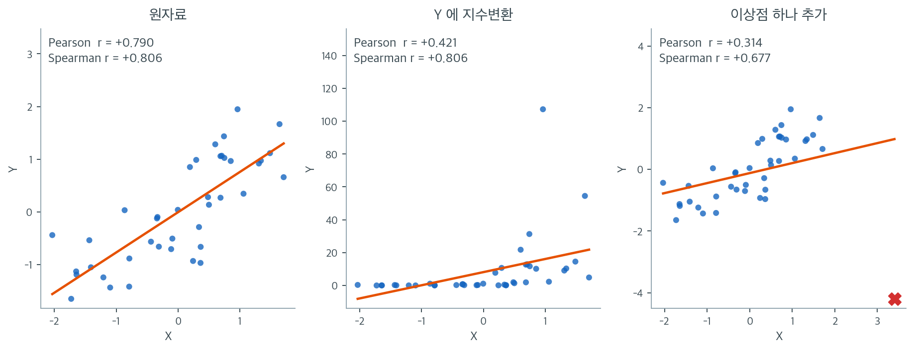

# Spearman 순위상관

Pearson 상관은 선형관계를 포착하지만, 현실의 많은 연관은 엄밀히 선형은 아니면서 단조롭다. 예를 들어 경력 연수와 급여의 관계는 꾸준히 증가하지만 직선을 따르지는 않을 수 있다. **Spearman 순위상관계수**는 원자료 값 대신 순위에 Pearson 공식을 적용하여 *단조* 관계의 강도와 방향을 잰다.

---

## 1. 값에서 순위로

Spearman 상관의 핵심 착상은 간단하다. 각 관측값을 그 순위로 바꾼 뒤 그 순위들에 대해 Pearson 상관을 계산한다. 이렇게 하면 이상점에 로버스트해지고 자료의 어떤 단조 변환에도 불변이 된다.

짝지어진 관측값 $(x_1, y_1), \ldots, (x_n, y_n)$이 주어지면:

1. $x$ 값을 작은 것부터 큰 것까지 순위를 매겨 각 $x_i$에 $R(x_i)$를 부여한다.
2. $y$ 값에도 마찬가지로 순위를 매겨 각 $y_i$에 $R(y_i)$를 부여한다.
3. 순위 $R(x_i)$와 $R(y_i)$ 사이의 Pearson 상관을 계산한다.

동점이 있으면 동점인 관측값들에는 그들이 차지했을 순위의 평균을 부여한다.

---

## 2. Spearman 순위상관계수

<div class="defn" markdown>

### 정의 1. Spearman 순위상관계수 { .dfn }

**Spearman 순위상관계수** $r_s$는

$$
r_s = \frac{\sum_{i=1}^n (R(x_i) - \bar{R}_x)(R(y_i) - \bar{R}_y)}{\sqrt{\sum_{i=1}^n (R(x_i) - \bar{R}_x)^2} \; \sqrt{\sum_{i=1}^n (R(y_i) - \bar{R}_y)^2}}
$$

이며 $\bar{R}_x$와 $\bar{R}_y$는 평균 순위이다. (동점이 없으면) 순위가 $1, 2, \ldots, n$이므로 평균 순위는 $\bar{R} = (n+1)/2$이다.

</div>

### 간편 공식 (동점이 없을 때)

동점이 없으면 공식이 다음으로 단순해진다:

$$
r_s = 1 - \frac{6 \sum_{i=1}^n d_i^2}{n(n^2 - 1)}
$$

여기서 $d_i = R(x_i) - R(y_i)$는 $i$번째 쌍의 순위 차이이다. 손으로 계산할 때 널리 쓰인다.

---

## 3. 성질

1. **범위.** Pearson 계수와 마찬가지로 $-1 \le r_s \le 1$이다.

2. **완전한 단조 관계.** $r_s = 1$일 필요충분조건은 모든 $i$에서 $R(x_i) = R(y_i)$인 것(순위가 동일한 것)이다. 이는 $Y$가 $X$의 완전히 증가하는 함수라는 뜻이며 반드시 선형일 필요는 없다. 마찬가지로 순위가 완전히 뒤집히면 $r_s = -1$이다.

3. **단조 변환에 대한 불변성.** $f$가 임의의 순증가 함수이면 $r_s(f(X), Y) = r_s(X, Y)$이다. 즉 Spearman의 $r_s$는 로그 변환, 제곱근, 그 밖의 순서를 보존하는 어떤 변환에도 변하지 않는다.

4. **이상점에 대한 로버스트성.** 순위가 극단값을 압축하므로 이상점 하나가 $r_s$에 미치는 영향은 제한적이다.



성질 3과 4를 한 자료로 확인해 보자. 왼쪽은 $n = 40$인 원자료이고 $r = +0.790$, $r_s = +0.806$으로 두 계수가 비슷하다. 관계가 대체로 직선이니 당연하다.

가운데는 $Y$에만 $y \mapsto e^{2.4y}$를 적용한 것이다. 순증가 함수이므로 **점의 세로 순서는 하나도 바뀌지 않았다.** 그런데 Pearson의 $r$은 $0.790$에서 $0.421$로 반 가까이 줄었다. $y$축 눈금이 $[-2, 2]$에서 $[0, 140]$으로 늘어나면서 큰 값 몇 개가 제곱합을 독차지했기 때문이다. Spearman은 $+0.806$으로 **소수점 넷째 자리까지 그대로다.** 순위만 쓰니 변환 자체가 보이지 않는 것이다. 성질 3이 말하는 "단조 변환에 대한 불변성"이란 이런 뜻이며, 실무에서는 같은 자료를 로그로 볼지 원척도로 볼지에 따라 $r$이 달라지는 반면 $r_s$는 그 선택과 무관하다는 이야기가 된다.

오른쪽은 원자료에 $(3.4,\ -4.2)$라는 점 하나를 더한 것이다. 관측값이 41개가 되었을 뿐인데 Pearson은 $0.790 \to 0.314$로 무너지고, Spearman은 $0.806 \to 0.677$로 내려앉는 데 그친다. 순위 세계에서 이 점은 "$x$ 순위 41등, $y$ 순위 1등"일 뿐이고, 값이 $-4.2$든 $-4200$이든 순위는 같기 때문이다. **이상점이 $r_s$에 미칠 수 있는 영향에는 상한이 있다.**

다만 로버스트하다는 것이 둔감하다는 뜻은 아니다. 오른쪽에서 $r_s$도 $0.13$만큼은 움직였다. 순위가 정말로 바뀌었으므로 그래야 옳다. 요점은 순위 기반 측도가 이상점을 **무시**하는 것이 아니라 그 영향을 **한 칸 분량으로 제한**한다는 데 있다.

---

## 4. Spearman과 Pearson 중 무엇을 쓸까

| 기준 | Pearson $r$ | Spearman $r_s$ |
|:---|:---|:---|
| 관계의 유형 | 선형 | 단조 |
| 자료의 척도 | 구간 또는 비율 | 순서, 구간, 비율 |
| 이상점에 대한 민감성 | 높음 | 낮음 |
| 분포 가정 | 이변량 정규에서 최적 | 분포에 의존하지 않음 |
| 해석 | 선형 연관의 강도 | 단조 연관의 강도 |

Spearman을 쓸 때:

- 관계가 단조이지만 선형이 아닐 때(예: 지수, 로그).
- 자료에 이상점이 있거나 심하게 치우쳐 있을 때.
- 변수가 순서 척도로 측정되었을 때(예: 리커트 평정).

Pearson을 쓸 때:

- 관계가 근사적으로 선형일 때.
- 두 변수가 모두 연속형이고 대략 정규분포를 따를 때.
- 선형 예측과 직접 연결된 측도를 원할 때.

---

<div class="exbox" markdown>

**보기 1.** <span class="diff easy" title="쉬움"></span> 단조이지만 비선형인 관계. $X = 1, 2, \ldots, 8$에 대해 $Y = e^X$인 관계를 생각하자. 관계가 완전히 단조(증가)이지만 비선형이다. Spearman의 $r_s$는 이를 완벽히 포착하지만 Pearson의 $r$은 $1$보다 작다.

| $x_i$ | $y_i = e^{x_i}$ | $R(x_i)$ | $R(y_i)$ | $d_i$ |
|:---:|:---:|:---:|:---:|:---:|
| 1 | 2.72 | 1 | 1 | 0 |
| 2 | 7.39 | 2 | 2 | 0 |
| 3 | 20.09 | 3 | 3 | 0 |
| 4 | 54.60 | 4 | 4 | 0 |
| 5 | 148.41 | 5 | 5 | 0 |
| 6 | 403.43 | 6 | 6 | 0 |
| 7 | 1096.63 | 7 | 7 | 0 |
| 8 | 2980.96 | 8 | 8 | 0 |

모든 $i$에서 $d_i = 0$이므로 간편 공식은

</div>

??? success "풀이"
    $$
    r_s = 1 - \frac{6 \cdot 0}{8(64 - 1)} = 1
    $$

    을 준다. 이 자료의 Pearson $r$은 약 $0.78$이다. 지수곡선이 직선에서 크게 벗어나기 때문이다.

---

## 5. 동점 처리

동점이 있으면 간편 공식이 더 이상 정확하지 않다. 표준적인 접근은 다음과 같다:

1. 동점인 관측값에 **평균 순위**(중간순위)를 부여한다.
2. 간편 공식 대신 완전한 공식(순위에 대한 Pearson 상관)을 쓴다.

??? example "동점 순위의 예"
    $x$ 값이 $\{3, 5, 5, 7, 9\}$라고 하자. 두 개의 5는 순위 2와 3을 차지하므로 각각 평균 순위 $(2 + 3)/2 = 2.5$를 받는다. 최종 순위는 $\{1, 2.5, 2.5, 4, 5\}$이다.

---

<div class="exbox" markdown>

**보기 2.** <span class="diff easy" title="쉬움"></span> 단조 곡선에서의 Spearman. 보기 1 의 자료 $x = 1,\ldots,8$, $y = e^x$ 를 코드로 다룬다. $r_s = 1$ 이고 Pearson $r = 0.7758$ 이다.

**(1)** $y$ 대신 $\log y$ 를 쓰면 두 계수가 각각 어떻게 되는가. 그 까닭을 한 문장으로 적으시오.

**(2)** Pearson 이 $1$ 에 그렇게 못 미치는 까닭을 **수로** 적으시오. 마지막 점 $(8,\ e^8)$ 이 $S_{yy}$ 와 $S_{xy}$ 에서 차지하는 몫을 구하시오.

**(3)** `stats.spearmanr` 가 돌려주는 p-값이 `0.000000` 으로 찍힌다. 정말 $0$ 인가. $n = 8$ 에서 $r_s = 1$ 의 **정확한** p-값을 구하시오.

**(4)** 코드로 확인하시오.

</div>

??? success "풀이"

    **(1) 로그를 씌우면 Pearson 만 움직인다.** $\log y = x$ 이므로 $(x, \log y)$ 는 **완전한 직선**이고 Pearson $r = 1$ 이 된다. Spearman 은 $1$ 그대로다.

    $$
    \begin{array}{l|cc}
     & (x,\ y) & (x,\ \log y) \\ \hline
    \text{Pearson } r & 0.7758 & 1 \\
    \text{Spearman } r_s & 1 & 1
    \end{array}
    $$

    **$\log$ 가 증가함수이기 때문이다.** 증가함수는 순위를 하나도 바꾸지 않으므로 순위만 보는 Spearman 은 어떤 단조변환에도 불변이다. 반대로 Pearson 은 **값**을 보므로 변환에 따라 춤춘다. 3.4절에서 상관계수가 불변인 변환은 **양의 일차변환** $y \mapsto \gamma y + \delta$ 까지였다는 것을 떠올리면 된다. $\log$ 는 일차변환이 아니다.

    실무적으로는 이 말이다. **Pearson 이 작게 나왔을 때 "관계가 약하다" 가 아니라 "내가 잘못된 눈금에서 보고 있다" 일 수 있다.**

    **(2) 지수함수는 마지막 점에 몰린다.** $y$ 의 평균은

    $$
    \bar y = \frac{1}{8}\sum_{k=1}^{8} e^k = 589.278
    $$

    인데 마지막 값 $e^8 = 2980.958$ 은 그 **5 배**다. 편차 제곱합에서 이 한 점이 차지하는 몫을 센다.

    $$
    \frac{(e^8 - \bar y)^2}{S_{yy}} = \frac{(2980.958 - 589.278)^2}{7{,}498{,}954} = \frac{5{,}720{,}132}{7{,}498{,}954} = 0.7628
    $$

    **$y$ 의 변동 가운데 $76.3\%$ 가 점 하나에서 나온다.** 마지막 두 점을 합치면 $79.7\%$ 다. $S_{xy}$ 에서도 마찬가지로 그 점 혼자 $60.8\%$ 를 낸다.

    그런데 $x$ 쪽은 $1$ 부터 $8$ 까지 고르게 퍼져 있어 $S_{xx} = n(n^2-1)/12 = 8\cdot63/12 = 42$ 이고, 마지막 점의 몫은 $3.5^2/42 = 29.2\%$ 에 지나지 않는다. **$x$ 는 고르고 $y$ 는 한쪽에 쏠려 있다.** 직선으로는 이 둘을 동시에 맞출 수 없으니 $r$ 이 $1$ 에서 멀어진다.

    $$
    r = \frac{S_{xy}}{\sqrt{S_{xx}S_{yy}}} = \frac{13768.872}{\sqrt{42 \times 7498953.8}} = 0.775842
    $$

    **(3) `0.000000` 은 $0$ 이 아니다.** 여기서 멈추고 따져 볼 만하다.

    $n = 8$ 이고 $x$ 에 동점이 없으므로, $H_0$("두 순위가 무관하다") 아래에서 $y$ 의 순위배열은 $8! = 40320$ 가지 가운데 하나다. $r_s = 1$ 이 되는 배열은 **완전히 같은 순서 하나**뿐이고, $r_s = -1$ 이 되는 배열은 **완전히 뒤집힌 순서 하나**뿐이다. 양측이므로

    $$
    p_{\text{exact}} = \frac{2}{8!} = \frac{2}{40320} = \frac{1}{20160} = 4.96032\times10^{-5}
    $$

    다. **$0$ 이 아니라 2만분의 1 쯤이다.**

    `scipy` 가 $0$ 을 내놓는 것은 기본적으로 $t$ 근사

    $$
    t = r_s\sqrt{\frac{n-2}{1-r_s^2}}
    $$

    를 쓰기 때문이다. $r_s = 1$ 이면 분모가 $0$ 이라 $t = \infty$ 가 되고 꼬리확률이 $0$ 으로 떨어진다. **근사식이 정의되지 않는 자리에서 그대로 $0$ 을 내준 것이다.** 자료 여덟 쌍으로 "확률 정확히 0" 을 주장할 수 있을 리 없다.

    표본이 작고 $\lvert r_s\rvert$ 가 $1$ 에 가까우면 p-값을 근사에 맡기지 말고 순열로 세는 편이 안전하다. 참고로 Pearson 쪽 p-값 $0.0236$ 은 $t$ 근사가 멀쩡히 작동한 값이다.

    **(4) 수치적으로.**

    ```python
    import numpy as np
    from scipy import stats

    # y 는 x 의 지수함수다. 곡선이지만 x 가 커지면 y 도 반드시 커지는 단조 관계다.
    x = np.array([1, 2, 3, 4, 5, 6, 7, 8])
    y = np.exp(x)

    # 스피어만은 값 대신 순위만 보므로 단조이기만 하면 정확히 1 이 된다.
    r_s, p_value = stats.spearmanr(x, y)
    print(f"Spearman r_s = {r_s:.4f}, p-value = {p_value:.6f}")

    # 피어슨은 직선에서 얼마나 벗어났는지를 재므로 1 에 못 미친다.
    # 관계가 곡선일 때 두 측도가 갈리는 전형적인 모습이다.
    r_p, p_p = stats.pearsonr(x, y)
    print(f"Pearson  r   = {r_p:.4f}, p-value = {p_p:.6f}")

    # (1) 로그를 씌우면 피어슨만 움직인다
    print(f"\nlog y 로 바꾸면  Pearson {stats.pearsonr(x, np.log(y)).statistic:.6f}"
          f"   Spearman {stats.spearmanr(x, np.log(y)).statistic:.6f}")

    # (2) 마지막 점이 차지하는 몫
    Sxx = ((x - x.mean())**2).sum()
    Syy = ((y - y.mean())**2).sum()
    Sxy = ((x - x.mean()) * (y - y.mean())).sum()
    print(f"\nybar = {y.mean():.3f}   e^8 = {y[-1]:.3f}   배수 {y[-1] / y.mean():.2f}")
    print(f"마지막 점의 Syy 몫 {(y[-1] - y.mean())**2 / Syy:.4f}"
          f"   Sxy 몫 {(x[-1] - x.mean()) * (y[-1] - y.mean()) / Sxy:.4f}"
          f"   Sxx 몫 {(x[-1] - x.mean())**2 / Sxx:.4f}")
    print(f"Sxx = {Sxx:.0f}   Syy = {Syy:.1f}   Sxy = {Sxy:.3f}"
          f"   r = {Sxy / np.sqrt(Sxx * Syy):.6f}")

    # (3) p-값이 정말 0 인가. n = 8 의 순열을 전부 센다.
    from itertools import permutations
    from math import factorial

    ranks = np.arange(1, 9)
    exact = sum(1 for q in permutations(ranks)
                if abs(stats.spearmanr(ranks, q).statistic) >= 1 - 1e-12)
    print(f"\nr_s = ±1 이 되는 배열 {exact} / {factorial(8)}"
          f"   정확 p = {exact / factorial(8):.6e}")
    print(f"scipy 가 돌려준 p = {p_value}")
    ```

    출력:

    ```
    Spearman r_s = 1.0000, p-value = 0.000000
    Pearson  r   = 0.7758, p-value = 0.023636

    log y 로 바꾸면  Pearson 1.000000   Spearman 1.000000

    ybar = 589.278   e^8 = 2980.958   배수 5.06
    마지막 점의 Syy 몫 0.7628   Sxy 몫 0.6080   Sxx 몫 0.2917
    Sxx = 42   Syy = 7498953.8   Sxy = 13768.872   r = 0.775842

    r_s = ±1 이 되는 배열 2 / 40320   정확 p = 4.960317e-05
    scipy 가 돌려준 p = 0.0
    ```

    $y = e^x$은 완전한 **단조** 관계지만 선형은 아니다. Spearman은 순위만 보므로 정확히 1.0을 주고, Pearson은 곡률 때문에 0.776에 그친다.

    (1)이 그 사정을 한 줄로 보인다. `log y 로 바꾸면 Pearson 1.000000 Spearman 1.000000`. **로그를 씌우자 Pearson 이 $0.7758$ 에서 $1$ 로 뛰고 Spearman 은 꿈쩍도 하지 않는다.**

    (2)의 세 몫도 손계산과 맞는다. 마지막 점 하나가 $S_{yy}$ 의 $76.3\%$, $S_{xy}$ 의 $60.8\%$ 를 내는데 $S_{xx}$ 에서는 $29.2\%$ 에 그친다. **한쪽만 쏠려 있으니 직선이 맞을 수가 없다.**

    (3)이 이 보기에서 가장 쓸모 있는 줄이다. $8!$ 가지 순열을 전부 돌려 보면 $\lvert r_s\rvert = 1$ 이 되는 배열은 **정확히 둘**(원래 순서와 뒤집힌 순서)이고 정확 p-값은 $2/40320 = 4.96\times10^{-5}$ 다. 그런데 `scipy 가 돌려준 p = 0.0` 이다. **출력의 `0.000000` 은 반올림이 아니라 진짜 `0.0`이고, 그것은 틀렸다.** $t = r_s\sqrt{(n-2)/(1-r_s^2)}$ 의 분모가 $0$ 이 되어 생긴 일이다.

    표본이 작고 $\lvert r_s \rvert$ 가 $1$ 에 가까울 때에는 p-값을 근사에 맡기지 말아야 한다는 뜻이다.

    이것이 두 계수의 차이를 가장 선명하게 보여주는 예다. "관계가 있는가"를 묻는다면 Spearman이, "직선 관계가 있는가"를 묻는다면 Pearson이 맞는 도구다.

`scipy.stats.spearmanr` 함수는 중간순위를 써서 동점을 자동으로 처리한다. 가설검정의 자세한 내용은 [Spearman의 rho 검정](../correlation_test/test_spearman.md)을 보라.

---

## 연습문제

<div class="drillbox" markdown>

**연습문제 1.** <span class="diff easy" title="쉬움"></span>
$X = (10, 20, 30, 40, 50)$과 $Y = (15, 25, 5, 35, 45)$에 대해 Spearman 순위상관을 계산하라.

</div>

??? success "풀이"
    순위를 매기면 $R_X = (1, 2, 3, 4, 5)$, $R_Y = (2, 3, 1, 4, 5)$이다.

    순위 차이 $d_i = R_{X,i} - R_{Y,i}$를 계산하면 $d = (-1, -1, 2, 0, 0)$이다.

    $$
    \sum d_i^2 = 1 + 1 + 4 + 0 + 0 = 6
    $$

    간편 공식을 쓰면

    $$
    r_s = 1 - \frac{6\sum d_i^2}{n(n^2 - 1)} = 1 - \frac{6 \times 6}{5 \times 24} = 1 - \frac{36}{120} = 1 - 0.3 = 0.7
    $$

---

<div class="drillbox" markdown>

**연습문제 2.** <span class="diff easy" title="쉬움"></span>
자료: $X = (1, 2, 3, 4, 5)$, $Y = (1, 4, 9, 16, 25)$(즉 $Y = X^2$). Pearson의 $r$과 Spearman의 $r_s$를 계산하라. 왜 다른가?

</div>

??? success "풀이"
    **Spearman의 $r_s$:** 양수 $X$에서 $Y = X^2$이 순증가 함수이므로 $Y$의 순위가 $X$의 순위와 같다. 따라서 $r_s = 1.0$이다.

    **Pearson의 $r$:** $\bar{X} = 3$, $\bar{Y} = 11$이다. 계산하면

    $$
    \sum(X_i - 3)(Y_i - 11) = (-2)(-10) + (-1)(-7) + (0)(-2) + (1)(5) + (2)(14) = 20 + 7 + 0 + 5 + 28 = 60
    $$

    $$
    \sum(X_i-3)^2 = 10, \quad \sum(Y_i - 11)^2 = 100 + 49 + 4 + 25 + 196 = 374
    $$

    $$
    r = \frac{60}{\sqrt{10 \times 374}} = \frac{60}{61.16} \approx 0.981
    $$

    Pearson의 $r \approx 0.98 < 1$인 것은 그것이 선형 연관을 재는데 $Y = X^2$이 (이 범위에서는 거의 선형이지만) 비선형이기 때문이다. 관계가 완전히 단조이므로 Spearman의 $r_s = 1$이다.

---

<div class="drillbox" markdown>

**연습문제 3.** <span class="diff easy" title="쉬움"></span>
스피어만 순위상관의 **사용 지침**을 정리하라.

</div>

??? success "풀이"
    **정의.** 순위로 바꾼 뒤의 피어슨 상관이다(연습문제 4의 답).

    $$
    r_s=1-\frac{6\sum d_i^2}{n(n^2-1)}
    \qquad(\text{동점이 없을 때})
    $$

    **핵심 수치 여섯.**

    | 사실 | 값 |
    |---|---|
    | 이변량 정규에서 $\rho_s$ | $\frac{6}{\pi}\arcsin(\rho/2)\approx\rho$ |
    | 정규 자료에서의 상대 효율 | $9/\pi^2\approx0.91$ |
    | 단조 비선형에서의 검정력 이득 | $+7\%$ |
    | 중위수 이분화 시 손실 | $-34\%$ |
    | $H_0$에서 $\operatorname{SD}(r_s)$ | $1/\sqrt{n-1}$(정확) |
    | $n=5$에서 기각하려면 | $r_s=\pm1$ |

    **언제 쓰나.**

    | 상황 | 스피어만이 적절한가 |
    |---|---|
    | **단조이지만 비선형** | **그렇다** |
    | **서열 척도**(리커트, 등급) | **그렇다** |
    | **한쪽으로 치우친 지렛점** | **그렇다** |
    | 선형 · 정규 | 피어슨이 9% 낫다 |
    | 비단조(U자) | **둘 다 부적절** |

    **마지막 줄을 잊지 말자.** $Y=X^2$ 형태의 관계는 **피어슨도 스피어만도 0에 가깝다**. 거리 상관이나 상호정보가 필요하다.

    **피어슨과 크게 다르면 무엇을 의심하나.**

    | $r_s\gg r$ | $r_s\ll r$ |
    |---|---|
    | 단조 비선형(지수·로그형) | **이상점이 $r$을 부풀림** |
    | $r$을 끌어내리는 이상점 | 관계가 곡선(비단조) |

    **두 값을 나란히 보고하는 습관**이 자료 이해에 도움이 된다.

    **추론 방법.**

    | 목적 | 방법 |
    |---|---|
    | $H_0:\rho_s=0$, $n\geq10$ | $t$ 근사(`scipy` 기본) |
    | $H_0:\rho_s=0$, $n<10$ | **정확 순열검정** |
    | $\rho_s$의 구간 | **보너트-라이트** 또는 부트스트랩 |
    | 동점이 많음 | 부트스트랩 또는 순열 |

    **`scipy` 사용법.**

    ```text
    stats.spearmanr(x, y)                 → statistic, pvalue
    stats.spearmanr(X)                    → 행렬 전체의 상관행렬
    stats.spearmanr(x, y, nan_policy=..)  → 결측 처리

    주의: 기본 p 는 t 근사이며 정확 검정이 아니다
    ```

    **흔한 오해 넷.**

    | 오해 | 사실 |
    |---|---|
    | $r_s$는 언제나 $r$보다 로버스트 | **오염의 구조**에 달렸다 |
    | $r_s=0.6$은 $r=0.6$과 같은 의미 | 정규에서는 거의 같지만 **다른 모수** |
    | 순위를 쓰니 분포 가정이 없다 | **$H_0$ 아래 교환가능성**은 필요 |
    | 이상점을 지우면 $r$을 써도 된다 | 자료 의존적 제거는 오류율을 올린다 |

    **보고 형식.**

    ```text
    직무 만족도(7점 척도)와 이직 의사(5점 척도)의 관계

      스피어만 r_s = -0.42,  95% CI [-0.55, -0.27],  n = 180,  p < 0.001
      (보너트-라이트 구간)
      켄들 τ_b = -0.32 로 방향과 크기가 일치한다
      두 변수 모두 서열 척도이므로 순위상관이 적절하다
    ```

    **척도의 성격을 밝히는 문장**을 넣는 것이 방법 선택의 정당화다.

    **한 문장.** 스피어만은 **"값이 아니라 순서만 믿겠다"는 선언**이며, 그 대가로 정규 자료에서 9%를 잃고 단조 비선형과 서열 척도에서 그 이상을 얻는다.

---

<div class="drillbox" markdown>

**연습문제 4.** <span class="diff med" title="중간"></span>
Spearman의 $r_s$가 정확히 순위의 Pearson 상관인 이유를 설명하라. 이것이 왜 $r_s$를 이상점에 로버스트하게 만드는가?

</div>

??? success "풀이"
    정의에 의해 $r_s = r(\text{rank}(X), \text{rank}(Y))$, 즉 순위 변환된 자료에 적용한 Pearson 상관이다. 간편 공식 $1 - 6\sum d_i^2/[n(n^2-1)]$은 (동점이 없을 때) 대수적으로 동등하다.

    순위를 매기면 관측값의 크기 정보가 버려지므로 $r_s$가 이상점에 로버스트해진다. 극단적인 이상점(예: $X_5 = 50$을 $X_5 = 5000$으로 바꾸는 것)이 생겨도 순위는 그대로(여전히 5위)이므로 $r_s$가 변하지 않는다. 반면 Pearson의 $r$은 공분산과 분산을 계산할 때 실제 값을 쓰므로 크게 영향받는다.

---

<div class="drillbox" markdown>

**연습문제 5.** <span class="diff med" title="중간"></span>
어떤 조건에서 Spearman의 $r_s$가 Pearson의 $r$과 정확히 같아지는가?

</div>

??? success "풀이"
    순위가 원래 값의 선형함수일 때 Spearman의 $r_s$가 Pearson의 $r$과 같아진다. 다음과 같은 경우이다:

    1. **동점이 없고 값들이 등간격일 때**(더 일반적으로는 순위 매김이 선형변환이 되도록 $X$와 $Y$의 값 분포가 같을 때).

    2. **두 변수가 각자의 범위에서 균등분포를 따를 때**(순위가 값에 비례한다).

    실무에서는 $X$와 $Y$의 관계가 근사적으로 선형이고 어느 변수에도 극단적인 이상점이 없으면 $r_s \approx r$이다. 두 측도가 갈라지는 경우는 (a) 관계가 단조이지만 비선형일 때($r_s > r$), (b) 이상점이 있을 때($r$은 왜곡되고 $r_s$는 그렇지 않다), (c) 관계는 선형인데 이상점이 있을 때($r$이 0 쪽으로 끌릴 수 있고 $r_s$는 안정적이다)이다.

---

<div class="drillbox" markdown>

**연습문제 6.** <span class="diff hard" title="어려움"></span>
이변량 정규에서 $\rho$와 $r_s$의 관계는 무엇인가? 이론식을 모의실험으로 확인하라.

</div>

??? success "풀이"
    **이론.** $(X,Y)$가 이변량 정규이고 상관이 $\rho$이면

    $$
    \rho_s=\frac{6}{\pi}\arcsin\frac{\rho}{2},
    \qquad
    \tau=\frac{2}{\pi}\arcsin\rho
    $$

    ```python
    import warnings
    warnings.filterwarnings("ignore")

    import numpy as np
    from scipy import stats

    rng = np.random.default_rng(21001)
    print(f"{'ρ (피어슨)':>11s} {'스피어만 이론':>13s} {'모의':>8s} "
          f"{'켄들 이론':>10s} {'모의':>8s}")
    for rho in [0.0, 0.2, 0.4, 0.6, 0.8, 0.95]:
        z = rng.standard_normal((200_000, 2))
        x = z[:, 0]
        y = rho * z[:, 0] + np.sqrt(1 - rho**2) * z[:, 1]
        sp = stats.spearmanr(x, y).statistic
        idx = rng.choice(200_000, 4_000, replace=False)   # 켄들은 계산이 무겁다
        kt = stats.kendalltau(x[idx], y[idx]).statistic
        print(f"{rho:11.2f} {6 / np.pi * np.arcsin(rho / 2):13.4f} {sp:8.4f} "
              f"{2 / np.pi * np.arcsin(rho):10.4f} {kt:8.4f}")
    ```

    ```text
        ρ (피어슨)       스피어만 이론       모의      켄들 이론       모의
           0.00        0.0000   0.0006     0.0000   0.0058
           0.20        0.1913   0.1926     0.1282   0.1054
           0.40        0.3846   0.3839     0.2620   0.2579
           0.60        0.5819   0.5831     0.4097   0.4139
           0.80        0.7859   0.7850     0.5903   0.5919
           0.95        0.9453   0.9453     0.7978   0.8050
    ```

    **이론과 모의실험이 소수점 셋째 자리까지 맞는다.**

    | $\rho$ | $\rho_s$ | $\tau$ |
    |---|---|---|
    | 0.2 | 0.191 | 0.128 |
    | 0.4 | 0.385 | 0.262 |
    | 0.6 | 0.582 | 0.410 |
    | 0.8 | 0.786 | 0.590 |

    **$\rho_s$는 $\rho$와 거의 같다.** 최대 차이가 0.02 수준이다.

    $$
    \frac{6}{\pi}\arcsin\frac{\rho}{2}\approx\rho-0.018\rho^3-\cdots
    $$

    **1차 근사에서 $\rho_s\approx\rho$**다. 그래서 **정규 자료에서 스피어만을 써도 해석이 거의 같다.**

    **$\tau$는 훨씬 작다.** $\rho=0.8$에서 $\tau=0.59$다. **같은 관계를 재는데 숫자가 다르다.**

    | $\rho$ | $\tau/\rho$ |
    |---|---|
    | 0.2 | 0.64 |
    | 0.6 | 0.68 |
    | 0.8 | 0.74 |
    | 0.95 | 0.84 |

    **$\tau$를 $\rho$처럼 해석하면 효과를 과소평가**한다. 관례적 기준("0.3이면 중간")을 $\tau$에 그대로 쓰면 안 된다.

    **그리인의 근사식**이 유용하다.

    $$
    \rho_s\approx\frac{3}{2}\tau
    $$

    $\tau=0.41$이면 $\rho_s\approx0.61$로, 관측된 0.583과 비슷하다.

    **왜 $\arcsin$이 나오는가.** 켄들의 $\tau$는

    $$
    \tau=2P\bigl((X_1-X_2)(Y_1-Y_2)>0\bigr)-1
    $$

    이고, 이변량 정규에서 두 차이의 부호가 같을 확률이

    $$
    P=\frac12+\frac{\arcsin\rho}{\pi}
    $$

    이다. 이것이 **정규분포의 사분면 확률 공식**이며, $\arcsin$은 거기서 온다.

    **주의 — 이 관계는 이변량 정규에서만 성립한다.** 다른 분포에서는 $\rho_s$와 $\rho$가 크게 다를 수 있다(연습문제 2의 $Y=X^2$가 극단적인 예).

---

<div class="drillbox" markdown>

**연습문제 7.** <span class="diff hard" title="어려움"></span>
스피어만이 피어슨보다 **언제 이기고 언제 지는지** 모의실험으로 가려라.

</div>

??? success "풀이"
    ```python
    import warnings
    warnings.filterwarnings("ignore")

    import numpy as np
    from scipy import stats

    rng = np.random.default_rng(20004)
    B = 6_000
    print("n=30, 명목 0.05")
    print(f"{'관계':>20s} {'피어슨':>8s} {'스피어만':>9s} {'켄들':>8s}")
    for lab in ["선형 ρ=0.4", "선형 ρ=0 (귀무)", "단조 비선형 (지수)",
                "이상점 오염 5%", "두꺼운 꼬리 t(3)"]:
        a = b = c = 0
        for _ in range(B):
            z = rng.standard_normal((30, 2))
            if lab == "선형 ρ=0.4":
                x, y = z[:, 0], 0.4 * z[:, 0] + np.sqrt(0.84) * z[:, 1]
            elif lab == "선형 ρ=0 (귀무)":
                x, y = z[:, 0], z[:, 1]
            elif lab == "단조 비선형 (지수)":
                x, y = z[:, 0], np.exp(0.6 * z[:, 0] + 0.8 * z[:, 1])
            elif lab == "이상점 오염 5%":
                x = z[:, 0].copy()
                y = 0.4 * z[:, 0] + np.sqrt(0.84) * z[:, 1]
                m = rng.random(30) < 0.05
                x[m] += rng.normal(0, 6, m.sum())
                y[m] += rng.normal(0, 6, m.sum())
            else:                                   # 두꺼운 꼬리
                s = np.sqrt(rng.chisquare(3, 30) / 3)
                x = z[:, 0] / s
                y = (0.4 * z[:, 0] + np.sqrt(0.84) * z[:, 1]) / s
            a += stats.pearsonr(x, y).pvalue < 0.05
            b += stats.spearmanr(x, y).pvalue < 0.05
            c += stats.kendalltau(x, y).pvalue < 0.05
        print(f"{lab:>20s} {a / B:8.4f} {b / B:9.4f} {c / B:8.4f}")
    ```

    ```text
    n=30, 명목 0.05
                      관계      피어슨      스피어만       켄들
                선형 ρ=0.4   0.6065    0.5435   0.5397
             선형 ρ=0 (귀무)   0.0523    0.0512   0.0485
             단조 비선형 (지수)   0.8657    0.9263   0.9232
               이상점 오염 5%   0.5350    0.4507   0.4677
             두꺼운 꼬리 t(3)   0.5993    0.5162   0.5437
    ```

    **결과가 통념보다 미묘하다.**

    | 관계 | 피어슨 | 스피어만 | 승자 |
    |---|---|---|---|
    | 선형 정규 | **0.607** | 0.544 | **피어슨** ($+12\%$) |
    | 귀무 | 0.052 | 0.051 | 무승부 |
    | **단조 비선형** | 0.866 | **0.926** | **스피어만** ($+7\%$) |
    | 이상점 오염 | **0.535** | 0.451 | **피어슨** |
    | 두꺼운 꼬리 | **0.599** | 0.516 | **피어슨** |

    **단조 비선형에서만 스피어만이 이긴다.** 나머지에서는 피어슨이 낫다.

    **"이상점이 있으면 스피어만"이라는 통념이 여기서는 틀렸다.** 왜 그런가.

    | 오염의 종류 | 결과 |
    |---|---|
    | **양쪽에 독립적인 잡음** | 두 측도 모두 **희석**될 뿐 |
    | **한쪽으로 몰린 지렛점** | **피어슨만 붕괴**(연습문제 7, 피어슨 페이지) |

    **여기서는 $x$와 $y$에 독립적인 큰 잡음을 더했다.** 그러면 순위도 함께 망가지므로 스피어만도 손해를 본다. **피어슨은 오히려 정보를 조금 더 쓴다.**

    **반면 한 점을 $(100,100)$에 두면** 피어슨만 $r=0.999$로 폭주한다. **오염의 구조가 결론을 정한다.**

    **두꺼운 꼬리에서 피어슨이 이기는 것**도 주목할 만하다. 여기서는 공통 척도 인자를 나눠 **$x$와 $y$가 같이 커지는** 구조라 피어슨에 유리하다.

    **정확한 정리.**

    | 스피어만이 이기는 경우 | 피어슨이 이기는 경우 |
    |---|---|
    | **단조 비선형** 관계 | **선형** 관계 |
    | **한쪽으로 치우친 지렛점** | 양쪽 독립 잡음 |
    | 서열 척도 자료 | 연속 정규 자료 |
    | 극단값의 **크기**가 믿기 어려움 | 크기가 정보를 담음 |

    **정규 자료에서의 상대 효율.** 이론적으로

    $$
    \text{ARE}(\text{스피어만},\ \text{피어슨})=\frac{9}{\pi^2}\approx0.912
    $$

    **9% 손실**이며, 표의 $0.544/0.607=0.896$과 비슷하다.

    **실무 권고.** **둘 다 계산하고 비교**한다. 크게 다르면 **산점도를 본다.** 그 차이 자체가 자료에 대한 정보다.

---

<div class="drillbox" markdown>

**연습문제 8.** <span class="diff hard" title="어려움"></span>
**서열 척도**(리커트 등)로 이산화하면 세 상관이 어떻게 되는가?

</div>

??? success "풀이"
    ```python
    import warnings
    warnings.filterwarnings("ignore")

    import numpy as np
    from scipy import stats

    rng = np.random.default_rng(21002)
    z = rng.standard_normal((3_000, 2))
    xc = z[:, 0]
    yc = 0.6 * z[:, 0] + np.sqrt(1 - 0.36) * z[:, 1]

    print("참 상관 0.6 인 연속 자료를 k 단계로 이산화")
    print(f"{'척도 수준 수':>12s} {'스피어만':>9s} {'켄들 τ-b':>10s} {'피어슨':>8s}")
    for k in [2, 3, 5, 7, 10, 100]:
        qs = np.quantile(xc, np.linspace(0, 1, k + 1)[1:-1])
        xd = np.digitize(xc, qs).astype(float)
        qs = np.quantile(yc, np.linspace(0, 1, k + 1)[1:-1])
        yd = np.digitize(yc, qs).astype(float)
        print(f"{k:12d} {stats.spearmanr(xd, yd).statistic:9.4f} "
              f"{stats.kendalltau(xd, yd, variant='b').statistic:10.4f} "
              f"{np.corrcoef(xd, yd)[0, 1]:8.4f}")
    print(f"{'연속 (원본)':>12s} {stats.spearmanr(xc, yc).statistic:9.4f} "
          f"{stats.kendalltau(xc, yc).statistic:10.4f} "
          f"{np.corrcoef(xc, yc)[0, 1]:8.4f}")
    ```

    ```text
    참 상관 0.6 인 연속 자료를 k 단계로 이산화
         척도 수준 수      스피어만     켄들 τ-b      피어슨
               2    0.4053     0.4053   0.4053
               3    0.4935     0.4432   0.4935
               5    0.5470     0.4513   0.5470
               7    0.5638     0.4472   0.5638
              10    0.5724     0.4398   0.5724
             100    0.5848     0.4167   0.5848
         연속 (원본)    0.5849     0.4127   0.6112
    ```

    **$k=2$에서 세 측도가 완전히 같다**(0.4053). 이진 변수의 순위는 두 값뿐이므로 **피어슨·스피어만·켄들이 모두 같은 계산**이 된다.

    **이산화가 상관을 떨어뜨린다.**

    | 수준 수 | 피어슨 | 원본 대비 |
    |---|---|---|
    | 2 | 0.405 | $-34\%$ |
    | 3 | 0.494 | $-19\%$ |
    | 5 | 0.547 | $-11\%$ |
    | **7** | **0.564** | $-\mathbf{8\%}$ |
    | 10 | 0.572 | $-6\%$ |

    **이것이 "5점 척도보다 7점 척도가 낫다"는 경험칙의 근거**다. 5점에서 7점으로 가면 손실이 11%에서 8%로 줄고, 그 이후는 개선이 미미하다.

    **이분화가 가장 나쁘다.** 중위수로 자르면 상관의 **3분의 1을 잃는다.** 이론적으로 정규 자료를 중위수에서 이분화하면

    $$
    r_{\text{이분}}\approx\frac{2}{\pi}\arcsin\rho
    $$

    $\rho=0.6$이면 $0.637\times0.6=0.41$로, 관측된 0.405와 맞는다.

    **"연속 변수를 이분화하지 말라"는 통계학의 오랜 권고**가 여기서 정량화된다.

    **스피어만과 피어슨이 이산 자료에서 정확히 같다.** 표의 모든 행에서 두 값이 일치한다. **분위수로 자른 계급 번호가 곧 순위의 단조 변환**이기 때문이다.

    **켄들만 다르게 움직인다.** $k$가 커질수록 **오히려 줄어든다**(0.451 → 0.413). 동점이 줄면서 $\tau_b$의 분모가 커지기 때문이다.

    **실무 지침 넷.**

    | 상황 | 권장 |
    |---|---|
    | 척도를 설계할 수 있음 | **5~7점** 이상 |
    | 이미 리커트 자료 | 스피어만 또는 켄들 |
    | 이분 변수 둘 | **파이 계수**(= 피어슨) |
    | 잠재 연속변수를 가정할 수 있음 | **다분상관**(polychoric) |

    **마지막이 강력하다.** 다분상관은 **관측된 서열 뒤에 정규 잠재변수가 있다고 가정**하고 원래의 $\rho$를 복원한다. 위 예에서 $k=5$ 자료의 다분상관은 0.6에 가깝게 나온다.

---

<div class="drillbox" markdown>

**연습문제 9.** <span class="diff hard" title="어려움"></span>
작은 표본에서 스피어만의 **정확 영분포**를 직접 만들고, $t$ 근사와 비교하라.

</div>

??? success "풀이"
    **정확 영분포.** $H_0$에서 $y$의 순위는 $x$의 순위와 무관하므로, **$n!$개의 순열이 모두 같은 확률**을 갖는다.

    ```python
    import warnings
    warnings.filterwarnings("ignore")

    import itertools
    import numpy as np
    from scipy import stats

    for n in [5, 6, 7]:
        xs = np.arange(n, dtype=float)
        sp, kt = [], []
        for p in itertools.permutations(range(n)):
            y = np.array(p, dtype=float)
            sp.append(stats.spearmanr(xs, y).statistic)
            kt.append(stats.kendalltau(xs, y).statistic)
        sp, kt = np.array(sp), np.array(kt)
        print(f"  n={n}: 순열 {len(sp):6,d}개,  "
              f"P(r_s ≥ 0.9) = {np.mean(sp >= 0.9):.5f},  "
              f"P(τ ≥ 0.6) = {np.mean(kt >= 0.6):.5f}")
        print(f"        r_s 의 SD = {sp.std():.5f} "
              f"(이론 1/√(n-1) = {1 / np.sqrt(n - 1):.5f}),  "
              f"τ 의 SD = {kt.std():.5f} (이론 = "
              f"{np.sqrt(2 * (2 * n + 5) / (9 * n * (n - 1))):.5f})")

    print("\n작은 n 에서 scipy 의 p 와 t 근사")
    rng = np.random.default_rng(7)
    for n in [6, 8, 10, 15]:
        x = np.arange(n, dtype=float)
        y = rng.permutation(n).astype(float)
        ex = stats.spearmanr(x, y)
        r = ex.statistic
        t = r * np.sqrt((n - 2) / (1 - r**2)) if abs(r) < 1 else np.inf
        print(f"  n={n:3d}: r_s = {r:+.4f},  scipy p = {ex.pvalue:.5f},  "
              f"t 근사 p = {2 * stats.t.sf(abs(t), n - 2):.5f}")
    ```

    ```text
      n=5: 순열    120개,  P(r_s ≥ 0.9) = 0.00833,  P(τ ≥ 0.6) = 0.11667
            r_s 의 SD = 0.50000 (이론 1/√(n-1) = 0.50000),  τ 의 SD = 0.40825 (이론 = 0.40825)
      n=6: 순열    720개,  P(r_s ≥ 0.9) = 0.00833,  P(τ ≥ 0.6) = 0.06806
            r_s 의 SD = 0.44721 (이론 1/√(n-1) = 0.44721),  τ 의 SD = 0.35486 (이론 = 0.35486)
      n=7: 순열  5,040개,  P(r_s ≥ 0.9) = 0.00337,  P(τ ≥ 0.6) = 0.03452
            r_s 의 SD = 0.40825 (이론 1/√(n-1) = 0.40825),  τ 의 SD = 0.31706 (이론 = 0.31706)

    작은 n 에서 scipy 의 p 와 t 근사
      n=  6: r_s = -0.2571,  scipy p = 0.62279,  t 근사 p = 0.62279
      n=  8: r_s = -0.0476,  scipy p = 0.91085,  t 근사 p = 0.91085
      n= 10: r_s = -0.0061,  scipy p = 0.98674,  t 근사 p = 0.98674
      n= 15: r_s = +0.3607,  scipy p = 0.18655,  t 근사 p = 0.18655
    ```

    **두 표준오차 공식이 정확히 맞는다.**

    $$
    \operatorname{SD}(r_s)=\frac{1}{\sqrt{n-1}},
    \qquad
    \operatorname{SD}(\tau)=\sqrt{\frac{2(2n+5)}{9n(n-1)}}
    $$

    **$H_0$ 아래에서 정확한 값**이며, 근사가 아니다.

    **$n=5$의 극단값 확률에 주목하자.**

    | 통계량 | $P(\cdot\geq\text{큰 값})$ |
    |---|---|
    | $r_s\geq0.9$ | **0.00833** |
    | $\tau\geq0.6$ | **0.11667** |

    **$n=5$에서 $\tau=0.6$은 흔한 일**이다(12% 확률). 완벽한 일치 $\tau=1$의 확률이 $1/120=0.0083$이다.

    **$n=5$로는 아무것도 증명할 수 없다.** 양측 $\alpha=0.05$에서 기각하려면 $r_s$가 **완벽한 $\pm1$**이어야 한다($2/120=0.017$).

    **`scipy`의 $p$는 $t$ 근사와 완전히 같다.** `scipy.stats.spearmanr`는 기본적으로 **$t$ 근사**를 쓴다. 정확 검정을 원하면

    ```text
    scipy.stats.permutation_test 로 직접 순열검정을 하거나
    n ≤ 10 이면 표를 참조한다
    ```

    **$t$ 근사가 얼마나 좋은가.** $n\geq10$이면 실용적으로 충분하다는 것이 문헌의 결론이다. 다만 **$n<8$에서는 정확 검정**을 권한다.

    **동점이 있으면 정확 분포가 달라진다.** 순열의 개수가 줄고 $r_s$의 분산도 달라지므로, **동점이 많으면 순열검정을 직접** 하는 것이 안전하다.

---

<div class="drillbox" markdown>

**연습문제 10.** <span class="diff hard" title="어려움"></span>
$\rho_s$의 **신뢰구간**을 만들어라. 피어슨의 피셔 $z$를 그대로 쓰면 되는가?

</div>

??? success "풀이"
    **문제.** 피셔 $z$의 분산 $1/(n-3)$은 **피어슨 $r$에 대한 것**이다. $r_s$에 그대로 쓰면 분산을 과소평가한다.

    **보너트-라이트 수정.**

    $$
    \operatorname{SE}\bigl(\operatorname{arctanh}r_s\bigr)
    =\sqrt{\frac{1+r_s^2/2}{n-3}}
    $$

    **켄들에는 피엘러의 수정**이 있다.

    $$
    \operatorname{SE}\bigl(\operatorname{arctanh}\hat\tau\bigr)=\sqrt{\frac{0.437}{n-4}}
    $$

    ```python
    import warnings
    warnings.filterwarnings("ignore")

    import numpy as np
    from scipy import stats

    rng = np.random.default_rng(21005)
    B = 4_000
    print("참 ρ_s, τ 를 덮는 비율 (명목 95%)")
    print(f"{'ρ':>6s} {'n':>5s} {'스피어만':>10s} {'켄들':>9s}")
    for rho in [0.0, 0.3, 0.6, 0.85]:
        for n in [15, 30, 60]:
            sp_th = 6 / np.pi * np.arcsin(rho / 2)
            kt_th = 2 / np.pi * np.arcsin(rho)
            a = b = 0
            for _ in range(B):
                z = rng.standard_normal((n, 2))
                x = z[:, 0]
                y = rho * z[:, 0] + np.sqrt(1 - rho**2) * z[:, 1]
                rs = stats.spearmanr(x, y).statistic
                se = np.sqrt((1 + rs**2 / 2) / (n - 3))
                lo, hi = np.arctanh(rs) - 1.96 * se, np.arctanh(rs) + 1.96 * se
                a += np.tanh(lo) <= sp_th <= np.tanh(hi)
                tk = stats.kendalltau(x, y).statistic
                se2 = np.sqrt(0.437 / (n - 4))
                lo, hi = np.arctanh(tk) - 1.96 * se2, np.arctanh(tk) + 1.96 * se2
                b += np.tanh(lo) <= kt_th <= np.tanh(hi)
            print(f"{rho:6.2f} {n:5d} {a / B:10.4f} {b / B:9.4f}")
    ```

    ```text
    참 ρ_s, τ 를 덮는 비율 (명목 95%)
         ρ     n       스피어만        켄들
      0.00    15     0.9590    0.9475
      0.00    30     0.9565    0.9470
      0.00    60     0.9507    0.9453
      0.30    15     0.9620    0.9547
      0.30    30     0.9543    0.9465
      0.30    60     0.9537    0.9453
      0.60    15     0.9573    0.9483
      0.60    30     0.9595    0.9523
      0.60    60     0.9525    0.9463
      0.85    15     0.9550    0.9323
      0.85    30     0.9507    0.9485
      0.85    60     0.9583    0.9543
    ```

    **두 공식 모두 잘 작동한다.**

    | 방법 | 피복확률 범위 |
    |---|---|
    | 스피어만(보너트-라이트) | **0.951~0.962** |
    | 켄들(피엘러) | **0.932~0.955** |

    **스피어만이 약간 보수적**(0.95~0.96)이고 **켄들은 거의 정확**하다.

    **$\rho=0.85$, $n=15$에서 켄들이 0.932**로 조금 낮다. 매우 작은 표본에서 강한 상관일 때가 가장 어렵다.

    **수정의 크기.** $r_s=0.6$, $n=30$이면

    $$
    \text{피어슨 공식: }\sqrt{\tfrac{1}{27}}=0.192,
    \qquad
    \text{보너트: }\sqrt{\tfrac{1+0.18}{27}}=0.209
    $$

    **9% 넓어진다.** 무시하면 구간이 **약간 좁아** 피복이 0.93 수준으로 떨어진다.

    **$1+r_s^2/2$라는 항의 의미.** $r_s$가 클수록 순위 통계량의 변동이 커지므로 수정이 커진다. $r_s=0$이면 피어슨과 같고, $r_s=1$이면 1.5배다.

    **더 간단하고 안전한 대안 — 부트스트랩.**

    ```text
    자료 쌍 (x_i, y_i) 를 쌍째로 재표집한다
    각 부트스트랩 표본에서 r_s 를 계산한다
    2.5% 와 97.5% 백분위수를 구간으로 쓴다
    ```

    **쌍째로 재표집하는 것이 중요하다.** $x$와 $y$를 따로 재표집하면 **상관 구조가 깨진다.**

    **어느 것을 쓸까.**

    | 상황 | 권장 |
    |---|---|
    | 이변량 정규에 가까움 | **보너트-라이트**(간단) |
    | 분포를 모름 | **부트스트랩**(BCa) |
    | 동점이 많음 | **부트스트랩** |
    | $n<15$ | 부트스트랩도 불안정 — 구간을 넓게 해석 |

---

## 정리하며

Spearman 순위상관 $r_s$는 두 변수 사이 임의의 단조 관계의 강도와 방향을 잰다. 원자료 값이 아니라 순위를 다루므로 이상점에 로버스트하고 순서형 자료에도 적용할 수 있다. 정규분포를 따르는 자료의 선형관계에는 Pearson의 $r$이 최적이지만, 관계가 단조이면서 비선형이거나 자료에 이상점이 있거나 측정 척도가 순서형일 때에는 Spearman의 $r_s$가 선호된다.
