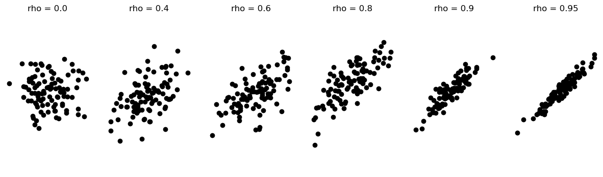
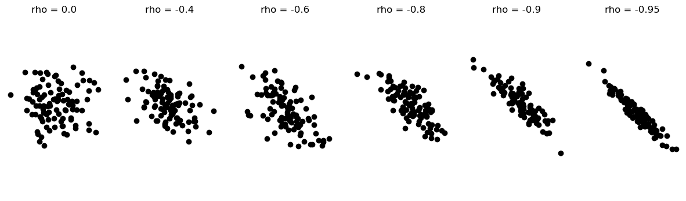
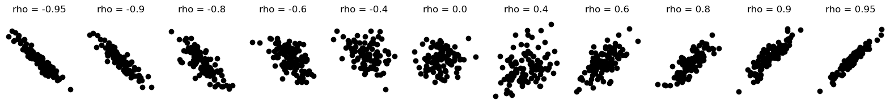
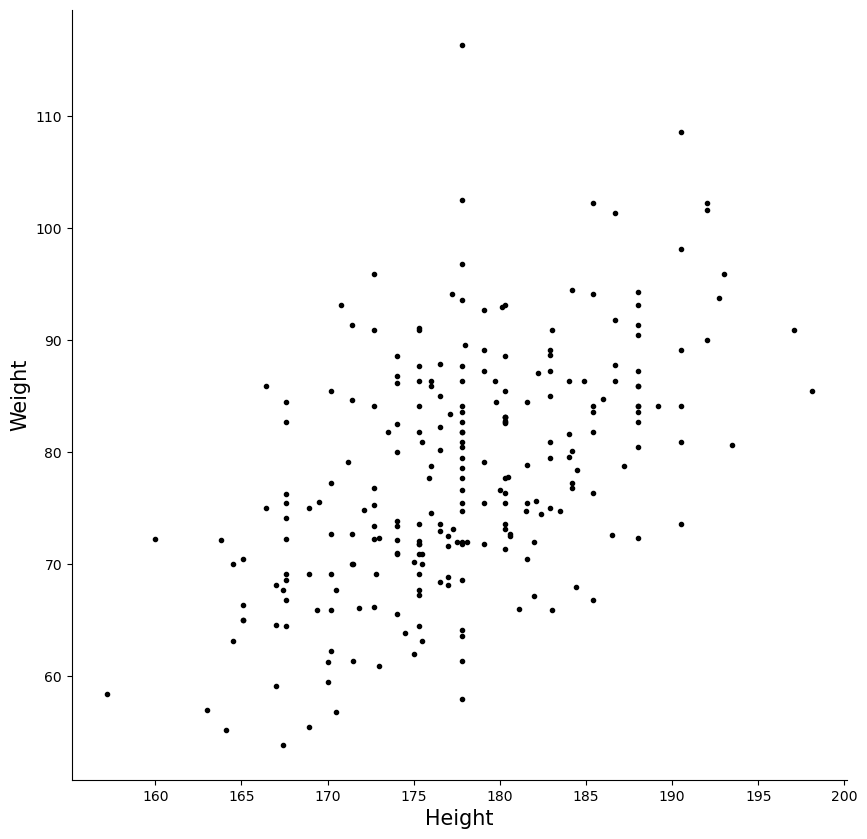
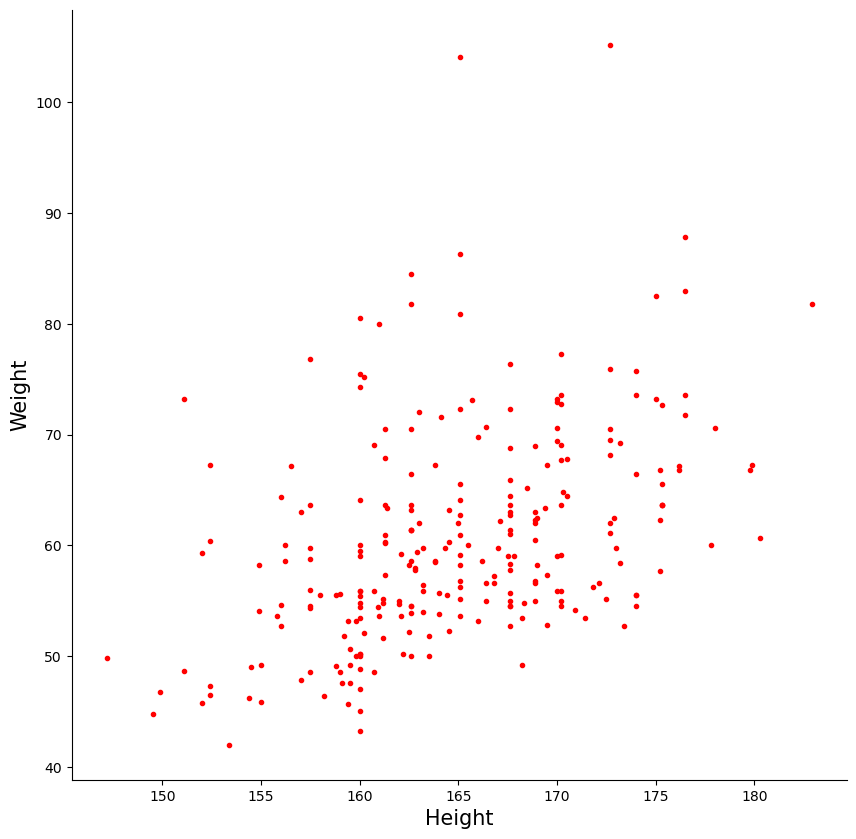
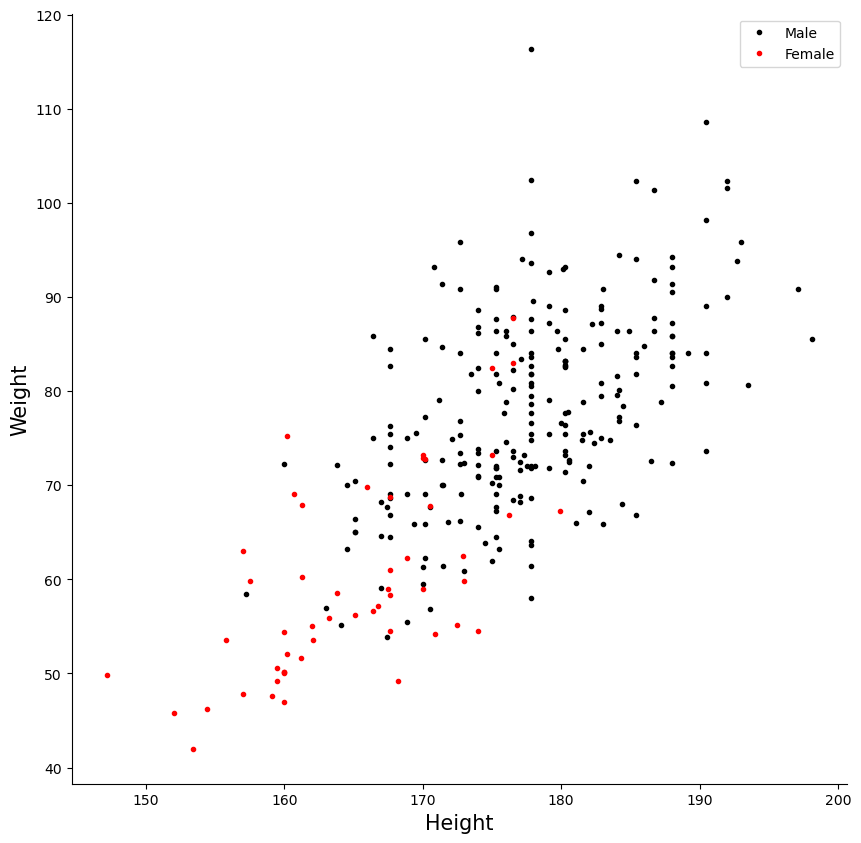
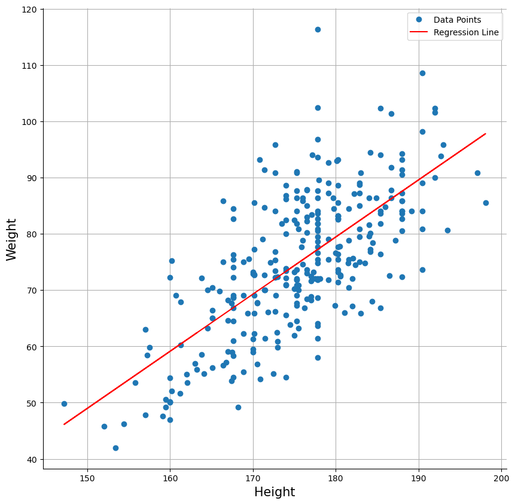

# 상관의 이해

## 변수 사이의 관계 이해하기

상관은 두 변수 사이 관계의 강도와 방향을 기술하는 통계학의 기본 개념이다. 자료 분석의 핵심 도구이며 한 변수의 변화가 다른 변수의 변화와 어떻게 연관되는지 이해하도록 돕는다.

---

## 상관이란 무엇인가

상관은 두 변수가 서로에 대해 얼마나 함께 움직이는지를 수치화한다. 두 변수가 상관되어 있다는 것은 한 변수의 변화가 다른 변수의 변화와 연관되는 경향이 있다는 뜻이다. 상관계수는 $-1$에서 $1$까지의 수치로 이 관계를 잰다.

- **양의 상관**: 두 변수가 함께 커지거나 함께 작아지면 양의 상관을 보인다. 예를 들어 학력과 소득 사이에는 양의 상관이 있다. 학력이 높아질수록 소득도 대체로 늘어난다.

- **음의 상관**: 한 변수가 커질 때 다른 변수가 작아지면 음의 상관이 있다. TV 시청 시간과 학업 성취의 관계가 그 예이다. 대체로 TV 시청 시간이 많을수록 학업 성취가 낮다.

- **무상관**: 변수들 사이에 알아볼 만한 관계가 없으면 상관이 0이다. 예를 들어 신발 크기와 지능의 관계는 대체로 0이다. 신발 크기의 변화가 지능의 변화를 예측하지 못한다.

---

## 양의 상관 시각화

다음 코드는 양의 상관계수를 점점 키우며 이변량 정규 표본의 산점도를 그려, $\rho$가 커질수록 점구름이 직선 주위로 좁아지는 모습을 보인다.

```python
import matplotlib.pyplot as plt
import numpy as np
from scipy import stats

np.random.seed(0)

def generate_samples(mu_1, mu_2, sigma_1, sigma_2, rho, n):
    """
    Generates samples from a bivariate normal distribution.

    Parameters:
        mu_1, mu_2: Means of the two variables.
        sigma_1, sigma_2: Standard deviations.
        rho: Correlation coefficient.
        n: Number of samples.

    Returns:
        np.ndarray of shape (n, 2).
    """
    covariance_matrix = [
        [sigma_1**2, rho * sigma_1 * sigma_2],
        [rho * sigma_1 * sigma_2, sigma_2**2]
    ]
    return stats.multivariate_normal([mu_1, mu_2], covariance_matrix).rvs(size=n)

def plot_correlations():
    fig, axes = plt.subplots(1, 6, figsize=(15, 4))
    correlation_coefficients = (0.00, 0.40, 0.60, 0.80, 0.90, 0.95)

    for ax, rho in zip(axes, correlation_coefficients):
        xy = generate_samples(0, 0, 1, 1, rho, 100)
        ax.plot(xy[:, 0], xy[:, 1], 'ok')
        ax.set_title(f'rho = {rho}')
        ax.axis('off')
        ax.axis('equal')
        for loc in ('left', 'right', 'top', 'bottom'):
            ax.spines[loc].set_visible(False)
    plt.show()

if __name__ == "__main__":
    plot_correlations()
```



두 변수가 함께 커진다. 점들이 왼쪽 아래에서 오른쪽 위로 향하는 띠를 이룬다.

---

## 음의 상관 시각화

마찬가지로 음의 상관계수는 아래로 기우는 점구름을 만든다.

```python
import matplotlib.pyplot as plt
import numpy as np
from scipy import stats

np.random.seed(0)

def generate_samples(mu_1, mu_2, sigma_1, sigma_2, rho, n):
    covariance_matrix = [
        [sigma_1**2, rho * sigma_1 * sigma_2],
        [rho * sigma_1 * sigma_2, sigma_2**2]
    ]
    return stats.multivariate_normal([mu_1, mu_2], covariance_matrix).rvs(size=n)

def plot_negative_correlations():
    fig, axes = plt.subplots(1, 6, figsize=(15, 4))
    correlation_coefficients = (0.00, -0.40, -0.60, -0.80, -0.90, -0.95)

    for ax, rho in zip(axes, correlation_coefficients):
        xy = generate_samples(0, 0, 1, 1, rho, 100)
        ax.plot(xy[:, 0], xy[:, 1], 'ok')
        ax.set_title(f'rho = {rho}')
        ax.axis('off')
        ax.axis('equal')
        for loc in ('left', 'right', 'top', 'bottom'):
            ax.spines[loc].set_visible(False)
    plt.show()

if __name__ == "__main__":
    plot_negative_correlations()
```



한 변수가 커지면 다른 변수가 작아진다. 띠의 방향만 반대일 뿐 구조는 같다.

---

## 전체 스펙트럼: 강한 음에서 강한 양까지

모든 상관값을 한 행에 놓으면 전체 연속체가 드러난다.

```python
import matplotlib.pyplot as plt
import numpy as np
from scipy import stats

np.random.seed(0)

def generate_samples(mu_1, mu_2, sigma_1, sigma_2, rho, n):
    covariance_matrix = [
        [sigma_1**2, rho * sigma_1 * sigma_2],
        [rho * sigma_1 * sigma_2, sigma_2**2]
    ]
    return stats.multivariate_normal([mu_1, mu_2], covariance_matrix).rvs(size=n)

def plot_all_correlations():
    fig, axes = plt.subplots(1, 11, figsize=(20, 2))
    rhos = (-0.95, -0.90, -0.80, -0.60, -0.40,
             0.00,  0.40,  0.60,  0.80,  0.90, 0.95)

    for ax, rho in zip(axes, rhos):
        xy = generate_samples(0, 0, 1, 1, rho, 100)
        ax.plot(xy[:, 0], xy[:, 1], 'ok')
        ax.set_title(f'rho = {rho}')
        ax.axis('off')
        ax.axis('equal')
        for loc in ('left', 'right', 'top', 'bottom'):
            ax.spines[loc].set_visible(False)
    plt.show()

if __name__ == "__main__":
    plot_all_correlations()
```



$r$이 $-1$에서 $+1$로 갈수록 구름이 좁은 타원으로 조여든다. $r = 0$ 근처에서는 방향을 알아볼 수 없는 둥근 구름이고, $|r|$이 커질수록 직선에 가까워진다.

$r$의 부호는 기울기의 방향을, 크기는 흩어짐의 정도를 나타낸다는 것이 이 그림 하나에 담겨 있다.

---

## 정의: Pearson 상관계수

두 변수 $X$와 $Y$ 사이 선형관계의 강도와 방향은 **Pearson 상관계수**로 포착된다:

$$
\rho = \rho_{X,Y} = \frac{\text{Cov}(X, Y)}{\sqrt{\text{Var}(X)}\;\sqrt{\text{Var}(Y)}}
$$

여기서

$$
\begin{aligned}
\mathbb{E}[X] &\approx \bar{x} = \frac{\sum_{i=1}^n x_i}{n} \\[6pt]
\mathbb{E}[Y] &\approx \bar{y} = \frac{\sum_{i=1}^n y_i}{n} \\[6pt]
\text{Var}(X) &= \mathbb{E}\!\left[(X - \mathbb{E}[X])^2\right] \approx S_x^2 = \frac{\sum_{i=1}^n (x_i - \bar{x})^2}{n-1} \\[6pt]
\text{Var}(Y) &= \mathbb{E}\!\left[(Y - \mathbb{E}[Y])^2\right] \approx S_y^2 = \frac{\sum_{i=1}^n (y_i - \bar{y})^2}{n-1} \\[6pt]
\text{Cov}(X,Y) &= \mathbb{E}\!\left[(X - \mathbb{E}[X])(Y - \mathbb{E}[Y])\right] \approx S_{xy} = \frac{\sum_{i=1}^n (x_i - \bar{x})(y_i - \bar{y})}{n-1}
\end{aligned}
$$

이다. 표본상관계수는 다음과 같이 쓸 수도 있다:

$$
r = \frac{n\left(\sum_{i=1}^n x_i y_i\right) - \left(\sum_{i=1}^n x_i\right)\left(\sum_{i=1}^n y_i\right)}{\sqrt{\left[n\sum_{i=1}^n x_i^2 - \left(\sum_{i=1}^n x_i\right)^2\right]\left[n\sum_{i=1}^n y_i^2 - \left(\sum_{i=1}^n y_i\right)^2\right]}}
$$

### Pearson rho의 해석

| 범위 | 해석 |
|-------|---------------|
| $\rho > 0.7$ | 강한 양의 상관 |
| $0.3 < \rho < 0.7$ | 중간 정도의 양의 상관 |
| $0 < \rho < 0.3$ | 약한 양의 상관 |
| $\rho = 0$ | 상관 없음 |
| $-0.3 < \rho < 0$ | 약한 음의 상관 |
| $-0.7 < \rho < -0.3$ | 중간 정도의 음의 상관 |
| $\rho < -0.7$ | 강한 음의 상관 |

특별한 값:

- $\rho = 1$: 완전한 양의 상관. 두 변수가 같은 방향으로 완벽하게 함께 움직인다.
- $\rho = -1$: 완전한 음의 상관. 두 변수가 반대 방향으로 완벽하게 함께 움직인다.
- $\rho = 0$: 선형 상관이 없다.

---

## 상관의 성질

$$
\begin{aligned}
(1) &\quad \rho_{Y,X} = \rho_{X,Y} & \text{(symmetry)} \\[4pt]
(2) &\quad \rho_{X+a,\,Y} = \rho_{X,Y} & \text{(translation invariance)} \\
    &\quad \rho_{X,\,Y+a} = \rho_{X,Y} \\[4pt]
(3) &\quad \rho_{aX,\,Y} = \rho_{X,Y} \quad \text{for } a > 0 & \text{(scale invariance)} \\
    &\quad \rho_{X,\,aY} = \rho_{X,Y} \quad \text{for } a > 0
\end{aligned}
$$

이 성질들은 상관이 관계의 위치나 축척이 아니라 *모양*을 잰다는 것을 말해 준다.

---

## 예제: 키와 몸무게

실제 자료에서 볼 수 있는 고전적인 양의 상관이다.

```python
import matplotlib.pyplot as plt
import pandas as pd

def plot_height_weight_scatter():
    # openintro의 bdims 자료: 성인 507명의 신체 치수.
    # hgt(cm), wgt(kg), sex(1 = 남성, 0 = 여성) 열을 쓴다.
    url = ("https://raw.githubusercontent.com/vincentarelbundock/Rdatasets/"
           "master/csv/openintro/bdims.csv")
    data = pd.read_csv(url).rename(columns={"hgt": "Height", "wgt": "Weight"})
    data["Gender"] = data["sex"].map({1: "Male", 0: "Female"})
    filtered = data[data.Gender == "Male"][:300]

    fig, ax = plt.subplots(figsize=(10, 10))
    ax.plot(filtered.Height, filtered.Weight, '.k')
    ax.set_xlabel('Height', fontsize=15)
    ax.set_ylabel('Weight', fontsize=15)
    ax.spines['top'].set_visible(False)
    ax.spines['right'].set_visible(False)
    plt.show()

if __name__ == "__main__":
    plot_height_weight_scatter()
```



남성 300명의 키와 몸무게다. 오른쪽 위로 향하는 관계가 보이지만 점들이 꽤 넓게 흩어져 있다. 뒤에서 계산하면 $r = 0.53$이다.

### 실습 1: 여성에 대한 산점도

**목표**: 코드를 고쳐 여성만 걸러 키 대 몸무게를 그린다.

```python
import matplotlib.pyplot as plt
import pandas as pd

def plot_height_weight_scatter_for_women():
    # openintro의 bdims 자료: 성인 507명의 신체 치수.
    # hgt(cm), wgt(kg), sex(1 = 남성, 0 = 여성) 열을 쓴다.
    url = ("https://raw.githubusercontent.com/vincentarelbundock/Rdatasets/"
           "master/csv/openintro/bdims.csv")
    data = pd.read_csv(url).rename(columns={"hgt": "Height", "wgt": "Weight"})
    data["Gender"] = data["sex"].map({1: "Male", 0: "Female"})
    filtered = data[data.Gender == "Female"][:300]

    fig, ax = plt.subplots(figsize=(10, 10))
    ax.plot(filtered.Height, filtered.Weight, '.r')
    ax.set_xlabel('Height', fontsize=15)
    ax.set_ylabel('Weight', fontsize=15)
    ax.spines['top'].set_visible(False)
    ax.spines['right'].set_visible(False)
    plt.show()

if __name__ == "__main__":
    plot_height_weight_scatter_for_women()
```



여성만 보면 모양이 비슷하되 위치가 왼쪽 아래로 옮겨간다. 키도 몸무게도 남성보다 작기 때문이다.

### 실습 2: 전체에 대한 산점도

**목표**: 남성과 여성을 다른 색으로 구분한 산점도를 만든다.

```python
import matplotlib.pyplot as plt
import pandas as pd

def plot_height_weight_scatter_for_all():
    # openintro의 bdims 자료: 성인 507명의 신체 치수.
    # hgt(cm), wgt(kg), sex(1 = 남성, 0 = 여성) 열을 쓴다.
    url = ("https://raw.githubusercontent.com/vincentarelbundock/Rdatasets/"
           "master/csv/openintro/bdims.csv")
    data = pd.read_csv(url).rename(columns={"hgt": "Height", "wgt": "Weight"})
    data["Gender"] = data["sex"].map({1: "Male", 0: "Female"})
    subset = data[:300]
    males = subset[subset.Gender == "Male"]
    females = subset[subset.Gender == "Female"]

    fig, ax = plt.subplots(figsize=(10, 10))
    ax.plot(males.Height, males.Weight, '.k', label='Male')
    ax.plot(females.Height, females.Weight, '.r', label='Female')
    ax.set_xlabel('Height', fontsize=15)
    ax.set_ylabel('Weight', fontsize=15)
    ax.legend()
    ax.spines['top'].set_visible(False)
    ax.spines['right'].set_visible(False)
    plt.show()

if __name__ == "__main__":
    plot_height_weight_scatter_for_all()
```



두 집단을 합치면 점들이 하나의 더 긴 띠를 이룬다. 각 집단 안의 흩어짐은 그대로인데 두 구름이 대각선 방향으로 나란히 놓여 전체 띠가 더 길고 좁아 보인다.

이것이 다음 실습에서 확인할 현상의 그림이다.

### 실습 3: 성별을 섞은 자료 분석

**목표**: 남성과 여성 자료를 합치면 관측되는 선형관계가 왜 약해질 수 있는지 살펴본다.

```python
import pandas as pd

# openintro의 bdims 자료: 성인 507명의 신체 치수.
# hgt(cm), wgt(kg), sex(1 = 남성, 0 = 여성) 열을 쓴다.
url = ("https://raw.githubusercontent.com/vincentarelbundock/Rdatasets/"
       "master/csv/openintro/bdims.csv")
data = pd.read_csv(url).rename(columns={"hgt": "Height", "wgt": "Weight"})
data["Gender"] = data["sex"].map({1: "Male", 0: "Female"})

males = data[data.Gender == "Male"]
females = data[data.Gender == "Female"]

male_corr = males[['Height', 'Weight']].corr().iloc[0, 1]
female_corr = females[['Height', 'Weight']].corr().iloc[0, 1]
combined_corr = data[['Height', 'Weight']].corr().iloc[0, 1]

print(f"Correlation for Males:         {male_corr:.4f}")
print(f"Correlation for Females:       {female_corr:.4f}")
print(f"Correlation for Combined Data: {combined_corr:.4f}")
```

출력:

```
Correlation for Males:         0.5347
Correlation for Females:       0.4311
Correlation for Combined Data: 0.7173
```

집단 안에서는 0.53과 0.43인데 둘을 합치면 0.72로 **커진다**.

앞의 산점도 세 장이 이유를 보여준다. 남성 구름과 여성 구름이 각각은 넓게 퍼져 있지만, 두 구름의 중심이 대각선 방향으로 떨어져 있어 합치면 그 배치 자체가 새로운 양의 공변동을 만든다. 상관이 집단 **안**의 관계가 아니라 집단 **간** 차이를 재고 있는 셈이다.

이것이 생태학적 상관의 전형적인 모습이며, 12.5절에서 다시 다룬다. 이 절의 제목이 "관계가 왜 **약해질** 수 있는지"인데 여기서는 오히려 강해졌다는 점도 짚어 둘 만하다. 합칠 때 상관이 커질지 작아질지는 두 구름의 중심이 어느 방향으로 떨어져 있느냐에 달려 있다.

**논의할 점**: 남성과 여성이 서로 구별되는 군집을 이루므로 집단 내 상관이 전체 상관과 다를 수 있다. 전체 상관은 집단 내 관계와 집단 간 분리를 함께 반영하며, 그 결과 전체 연관이 강해질 수도 약해질 수도 있다.

### 실습 4: 회귀직선을 포함한 산점도

**목표**: 산점도에 회귀직선을 추가한다.

```python
import matplotlib.pyplot as plt
import pandas as pd
from sklearn.linear_model import LinearRegression

def plot_scatter_with_regression():
    # openintro의 bdims 자료: 성인 507명의 신체 치수.
    # hgt(cm), wgt(kg), sex(1 = 남성, 0 = 여성) 열을 쓴다.
    url = ("https://raw.githubusercontent.com/vincentarelbundock/Rdatasets/"
           "master/csv/openintro/bdims.csv")
    data = pd.read_csv(url).rename(columns={"hgt": "Height", "wgt": "Weight"})
    data["Gender"] = data["sex"].map({1: "Male", 0: "Female"})
    subset = data[:300]

    X = subset[['Height']].values
    y = subset['Weight'].values

    model = LinearRegression()
    model.fit(X, y)
    predictions = model.predict(X)

    fig, ax = plt.subplots(figsize=(10, 10))
    ax.plot(subset.Height, subset.Weight, 'o', label='Data Points')
    ax.plot(subset.Height, predictions, 'r-', label='Regression Line')
    ax.set_xlabel('Height', fontsize=15)
    ax.set_ylabel('Weight', fontsize=15)
    ax.grid(True)
    ax.legend()
    ax.spines['top'].set_visible(False)
    ax.spines['right'].set_visible(False)
    plt.show()

if __name__ == "__main__":
    plot_scatter_with_regression()
```



회귀직선을 얹으면 상관의 방향과 강도를 눈으로 가늠하기 쉬워진다. 다만 직선의 **기울기**는 상관계수가 아니다. 기울기는 두 변수의 단위와 산포에 의존하고, 상관계수는 그것을 표준화해 없앤 값이다.

---

## 상관의 중요성

상관 분석은 여러 분야에서 대단히 유용하다:

- **경영**: 시장 추세, 고객 행동, 마케팅 효과의 이해.
- **보건의료**: 흡연과 폐암처럼 생활습관 요인과 건강 결과 사이의 관계 조사.
- **교육**: 교수법이 학생 성취에 미치는 영향, 학습 습관과 학업 성공의 연결 분석.
- **사회과학**: 소득과 학력의 관계처럼 사회적 요인과 행동 사이의 관계 탐색.

---

## 상관의 한계

상관은 강력한 도구이지만 중요한 한계가 있다:

1. **상관은 인과를 함의하지 않는다**: 두 변수의 상관이 하나가 다른 하나를 일으킨다는 뜻은 아니다. 아이스크림 판매량과 익사 사고의 상관은 아이스크림 소비가 익사를 일으킨다는 뜻이 아니다. 둘 다 더운 날씨에 이끌린다.

2. **교란변수**: 상관은 두 변수 모두에 영향을 주는 제3의 요인에 좌우될 수 있다. 수면 시간과 학업 성취의 상관은 스트레스 수준이나 학습 습관으로 교란되었을 수 있다.

3. **비선형 관계**: Pearson 상관계수는 *선형* 관계만 잰다. 강한 관계가 있어도 비선형 연관은 Pearson $\rho$를 0 근처로 만들 수 있다.

### 상관은 일반적인 연관이 아니라 선형 연관을 잰다

Anscombe의 사중주는 아주 다른 자료 패턴이 거의 같은 상관계수를 낳을 수 있음을 유명하게 보여준다. 네 자료는 평균, 분산, 상관, 회귀직선이 같지만 산점도는 근본적으로 다른 구조를 드러낸다. 비선형 관계와 이상점의 영향이 그 안에 있다.

참고: [Anscombe's Quartet (Wikipedia)](https://en.wikipedia.org/wiki/Anscombe%27s_quartet)

### 상관은 인과가 아니다

이 원리는 매우 중요해서 별도의 절을 둘 만하다. 자세한 논의는 [12.3절: 상관, 인과, 교란](../confounding/confounding.md)을 보라.

---

## 요약

상관은 변수 사이의 선형관계에 대한 통찰을 주는 통계학의 기초 개념이다. 상관을 재고 해석하는 법을 알면 여러 분야에서 패턴을 찾고 의사결정에 활용할 수 있다. 다만 그 한계, 특히 상관이 인과를 함의하지 않는다는 점을 인식하고, 자료를 종합적으로 이해하기 위해 다른 통계 방법으로 상관 분석을 보완하는 일이 중요하다.

## 연습문제

**연습문제 1.**
도시 50곳의 자료에서 평균 기온과 1인당 아이스크림 소비 사이의 Pearson 상관이 $r = 0.72$이다. 결정계수를 계산하고 맥락 안에서 해석하라.

??? success "풀이"
    결정계수는

    $$
    R^2 = r^2 = 0.72^2 = 0.5184
    $$

    이다. 즉 도시별 1인당 아이스크림 소비 변동의 약 **51.8%**를 평균 기온과의 선형관계로 설명할 수 있다. 나머지 48.2%는 다른 요인(예: 소득 수준, 문화적 선호, 아이스크림 가게의 수)에 기인한다.

---

**연습문제 2.**
두 변수의 Pearson 상관이 $r = 0.05$인데 Spearman 순위상관은 $r_s = 0.91$이다. 어떻게 이런 일이 가능한지, 이 자료에는 어느 측도가 더 적절한지 설명하라.

??? success "풀이"
    두 변수의 관계가 **강하게 단조이지만 심하게 비선형**일 때 이런 일이 생긴다. 예를 들어 양수 $X$에 대해 $Y = e^X$이면 관계가 완전히 단조($X$가 커지면 $Y$도 언제나 커진다)이지만 선형이 아니라 지수적이다.

    Pearson의 $r$은 **선형** 연관만 재므로 휘어진 관계에서는 0에 가깝다. Spearman의 $r_s$는 순위에 기반한 **단조** 연관을 재므로 함수 형태와 무관하게 강한 증가 추세를 포착한다.

    여기서는 Pearson이 놓치는 강한 단조 관계를 올바르게 짚어내는 Spearman 상관이 더 적절하다.

---

**연습문제 3.**
어떤 자료에서든 Pearson 상관계수가 $-1 \leq r \leq 1$임을 증명하라. (힌트: Cauchy-Schwarz 부등식을 쓰라.)

??? success "풀이"
    Pearson 상관은

    $$
    r = \frac{\sum_{i=1}^n (x_i - \bar{x})(y_i - \bar{y})}{\sqrt{\sum_{i=1}^n (x_i - \bar{x})^2} \sqrt{\sum_{i=1}^n (y_i - \bar{y})^2}}
    $$

    로 정의된다. $a_i = x_i - \bar{x}$, $b_i = y_i - \bar{y}$라 두면 $r = \frac{\sum a_i b_i}{\|\mathbf{a}\| \|\mathbf{b}\|}$이다.

    **Cauchy-Schwarz 부등식**에 의해

    $$
    \left|\sum_{i=1}^n a_i b_i\right| \leq \sqrt{\sum a_i^2} \sqrt{\sum b_i^2}
    $$

    이다. 양변을 $\|\mathbf{a}\| \|\mathbf{b}\|$로 나누면

    $$
    |r| \leq 1
    $$

    이므로 $-1 \leq r \leq 1$이다. 등호는 $\mathbf{a}$와 $\mathbf{b}$가 비례할 때, 즉 어떤 상수 $a$, $b$에 대해 $y_i = a + bx_i$일 때 성립한다. $\square$

---

**연습문제 4.**
어떤 연구자가 성인 표본에서 키(cm)와 몸무게(kg)의 Pearson 상관을 계산하여 $r = 0.68$을 얻었다. 키를 인치로, 몸무게를 파운드로 바꾸면 상관이 달라지는가? 수학적으로 근거를 밝혀라.

??? success "풀이"
    아니다, Pearson 상관은 변하지 않는다. $X' = aX + b$, $Y' = cY + d$ 형태의 (단, $a, c > 0$인) 선형변환은 상관에 영향을 주지 않는다:

    $$
    r_{X',Y'} = \frac{\text{Cov}(aX+b, cY+d)}{\sqrt{\text{Var}(aX+b)} \sqrt{\text{Var}(cY+d)}} = \frac{ac \cdot \text{Cov}(X,Y)}{|a| \cdot \sigma_X \cdot |c| \cdot \sigma_Y} = \frac{\text{Cov}(X,Y)}{\sigma_X \sigma_Y} = r_{X,Y}
    $$

    cm를 인치로($X' = X/2.54$), kg을 파운드로($Y' = 2.205Y$) 바꾸는 것은 양수 배의 선형변환이므로 상관은 $r = 0.68$ 그대로이다.
