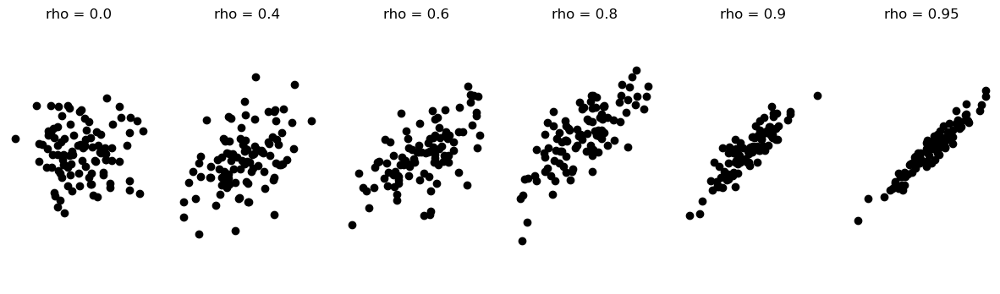
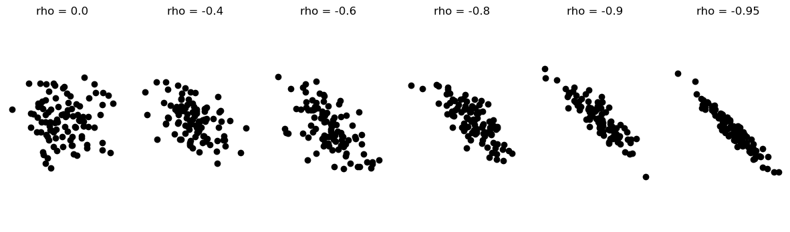
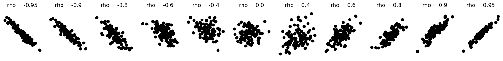
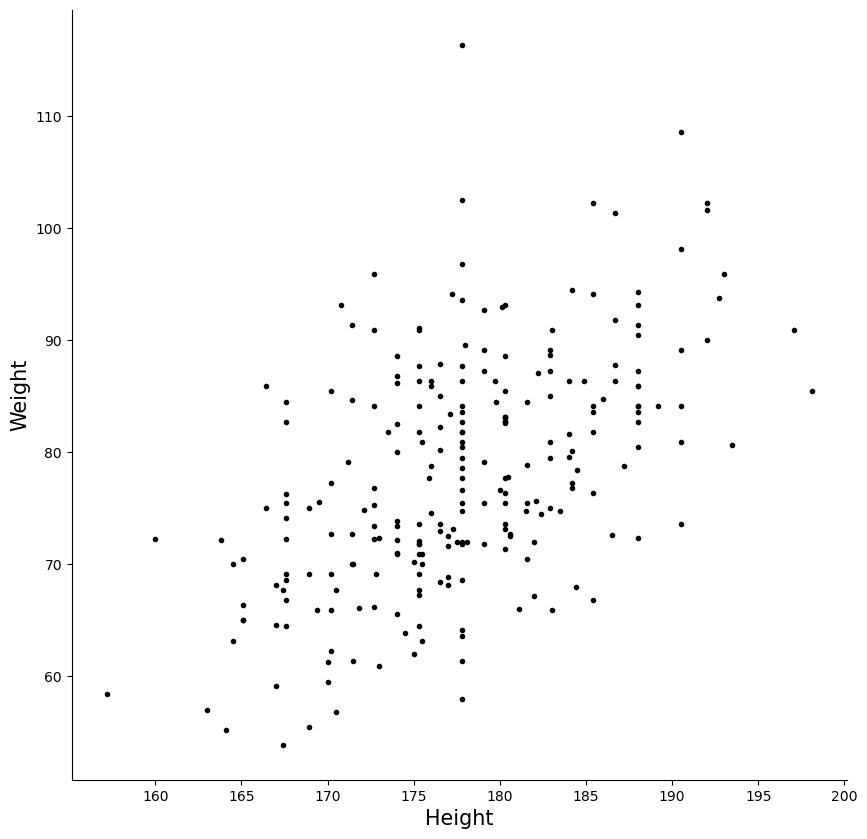
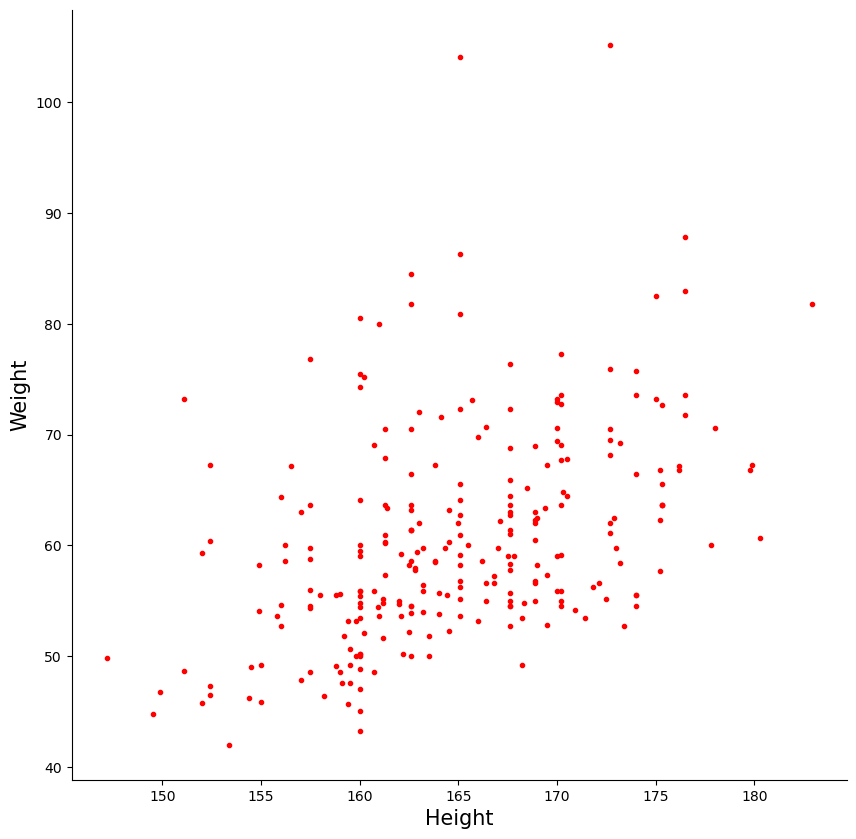
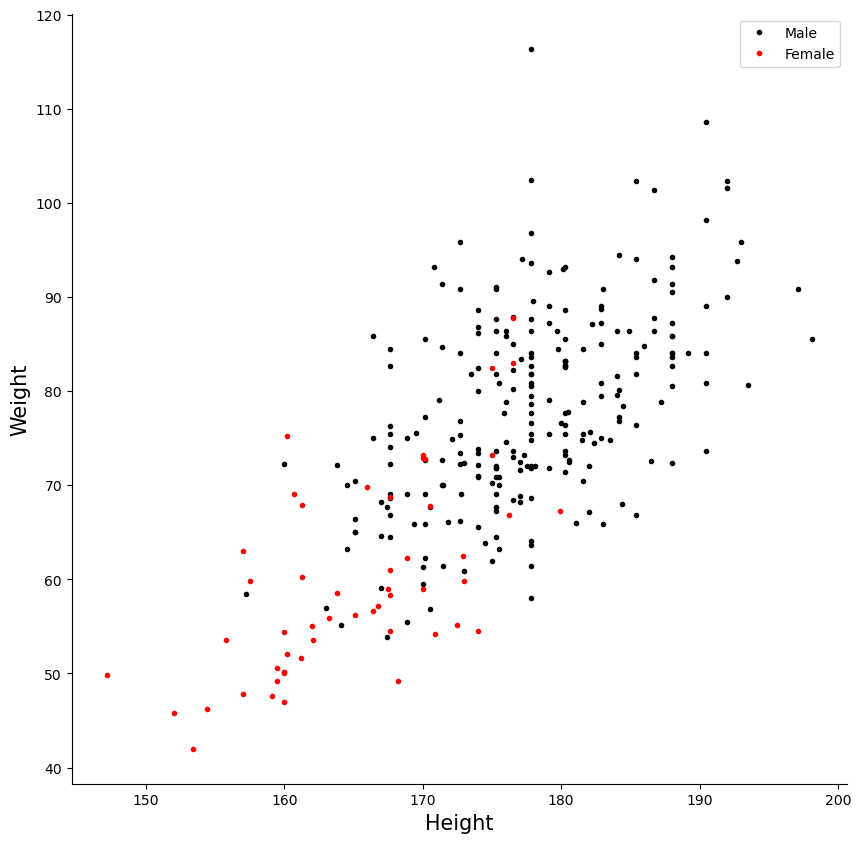
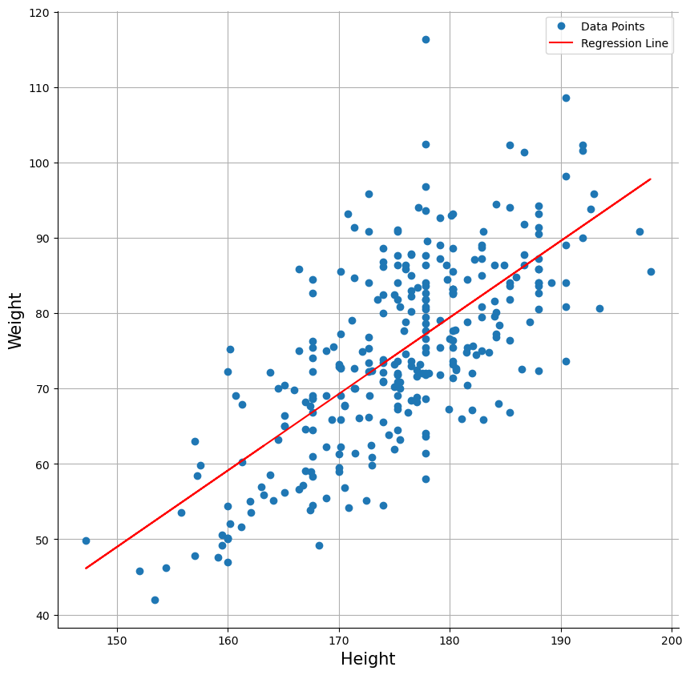

# 상관의 이해

## 1. 변수 사이의 관계 이해하기

상관은 두 변수 사이 관계의 강도와 방향을 기술하는 통계학의 기본 개념이다. 자료 분석의 핵심 도구이며 한 변수의 변화가 다른 변수의 변화와 어떻게 연관되는지 이해하도록 돕는다.

---

## 2. 상관이란 무엇인가

상관은 두 변수가 서로에 대해 얼마나 함께 움직이는지를 수치화한다. 두 변수가 상관되어 있다는 것은 한 변수의 변화가 다른 변수의 변화와 연관되는 경향이 있다는 뜻이다. 상관계수는 $-1$에서 $1$까지의 수치로 이 관계를 잰다.

- **양의 상관**: 두 변수가 함께 커지거나 함께 작아지면 양의 상관을 보인다. 예를 들어 학력과 소득 사이에는 양의 상관이 있다. 학력이 높아질수록 소득도 대체로 늘어난다.

- **음의 상관**: 한 변수가 커질 때 다른 변수가 작아지면 음의 상관이 있다. TV 시청 시간과 학업 성취의 관계가 그 예이다. 대체로 TV 시청 시간이 많을수록 학업 성취가 낮다.

- **무상관**: 변수들 사이에 알아볼 만한 관계가 없으면 상관이 0이다. 예를 들어 신발 크기와 지능의 관계는 대체로 0이다. 신발 크기의 변화가 지능의 변화를 예측하지 못한다.

---

## 3. 양의 상관 시각화

다음 코드는 양의 상관계수를 점점 키우며 이변량 정규 표본의 산점도를 그려, $\rho$가 커질수록 점구름이 직선 주위로 좁아지는 모습을 보인다.

<div class="exbox" markdown>

**보기 1.** <span class="diff easy" title="쉬움"></span> 양의 상관 시각화. 평균 $0$, 분산 $1$, 상관 $\rho$ 인 이변량 정규분포에서 100 개씩 뽑아 $\rho = 0,\ 0.4,\ 0.6,\ 0.8,\ 0.9,\ 0.95$ 의 산점도를 나란히 그린다.

**(1)** 공분산행렬 $\Sigma = \begin{pmatrix}1 & \rho \\ \rho & 1\end{pmatrix}$ 의 고윳값과 고유벡터를 구하시오. 등밀도 **타원의 장축 대 단축 비**가

$$
\sqrt{\frac{1+\lvert\rho\rvert}{1-\lvert\rho\rvert}}
$$

임을 보이고 여섯 $\rho$ 에 대해 값을 적으시오.

**(2)** (1)의 수로 "$\rho = 0.4$ 와 $0.6$ 의 그림이 생각보다 비슷하다" 는 인상을 설명하시오. 같은 $0.05$ 를 더해도 $\rho$ 가 어디쯤인지에 따라 그림이 얼마나 달라지는가.

**(3)** $n = 100$ 이므로 표본상관이 $\rho$ 에서 조금 어긋난다. 표준오차 $(1-\rho^2)/\sqrt n$ 을 쓰고, 여섯 판의 표본 $r$ 과 표본 축비가 이론값과 맞는지 확인하시오.

</div>

??? success "풀이"

    **(1) 타원의 모양은 고윳값이 정한다.** $\Sigma$ 는 대칭이므로 고유벡터가 직교한다. 곧바로 확인된다.

    $$
    \Sigma\begin{pmatrix}1\\1\end{pmatrix} = (1+\rho)\begin{pmatrix}1\\1\end{pmatrix},
    \qquad
    \Sigma\begin{pmatrix}1\\-1\end{pmatrix} = (1-\rho)\begin{pmatrix}1\\-1\end{pmatrix}
    $$

    고윳값은 $1+\rho$ 와 $1-\rho$ 이고 고유벡터는 $\pm45^\circ$ 방향이다. **$\rho$ 가 무엇이든 축의 방향은 늘 $\pm45^\circ$ 다.** 분산이 둘 다 1 이라서 그렇다.

    등밀도 곡선 $\mathbf z^\top \Sigma^{-1}\mathbf z = c$ 는 타원이고 그 반축의 길이는 $\sqrt{c\lambda_i}$ 에 비례하므로, 장축 대 단축의 비는

    $$
    \sqrt{\frac{\lambda_{\max}}{\lambda_{\min}}} = \sqrt{\frac{1+\lvert\rho\rvert}{1-\lvert\rho\rvert}}
    $$

    이다($\rho > 0$ 이면 $45^\circ$ 방향이 길고 $\rho < 0$ 이면 $-45^\circ$ 방향이 길다). $\square$

    $$
    \begin{array}{c|cccccc}
    \rho & 0 & 0.40 & 0.60 & 0.80 & 0.90 & 0.95 \\ \hline
    \text{축비} & 1.000 & 1.528 & 2.000 & 3.000 & 4.359 & 6.245
    \end{array}
    $$

    **(2) 눈금이 고르지 않다.** $\rho$ 를 $0.05$ 씩 더해도 그림이 달라지는 정도가 전혀 같지 않다.

    | 구간 | 축비의 변화 | 폭 |
    |---|---|---:|
    | $\rho: 0 \to 0.05$ | $1.000 \to 1.051$ | $+0.051$ |
    | $\rho: 0.40 \to 0.45$ | $1.528 \to 1.624$ | $+0.096$ |
    | $\rho: 0.90 \to 0.95$ | $4.359 \to 6.245$ | $+1.886$ |

    **같은 $0.05$ 가 $\rho = 0$ 근처에서는 축비를 $0.05$ 올리고 $\rho = 0.9$ 근처에서는 $1.9$ 올린다. 37 배 차이다.** 축비가 $\rho \to 1$ 에서 발산하기 때문이다.

    그래서 $0.40$ 과 $0.60$ 의 두 판은 축비가 $1.53$ 대 $2.00$, 곧 $31\%$ 차이밖에 나지 않아 한눈에 구별되지 않는다. 반면 $0.90$ 과 $0.95$ 는 $4.36$ 대 $6.25$ 로 $43\%$ 차이이면서 절대적인 가늘기 자체가 달라 뚜렷이 갈린다.

    설명된 변동으로 읽어도 같다. $\rho = 0.4$ 는 $\rho^2 = 0.16$, 곧 **$y$ 변동의 $16\%$ 만** 설명한다. "중간 정도의 상관" 이라는 말이 주는 인상보다 훨씬 약하다. **상관계수를 선형 눈금으로 읽으면 안 된다.**

    **(3) 표본은 조금씩 어긋난다.** $\operatorname{SE}(r) \approx (1-\rho^2)/\sqrt n = (1-\rho^2)/10$ 이다. $\rho$ 가 클수록 표준오차가 작아진다는 것에 주의하라. $\rho = 0.95$ 에서는 $0.0098$ 에 지나지 않는다.

    | $\rho$ | 표본 $r$ | 차 | SE | 차/SE | 표본 축비 | 이론 축비 |
    |---:|---:|---:|---:|---:|---:|---:|
    | $0.00$ | $-0.0240$ | $-0.0240$ | $0.1000$ | $-0.24$ | $1.025$ | $1.000$ |
    | $0.40$ | $+0.4377$ | $+0.0377$ | $0.0840$ | $+0.45$ | $1.611$ | $1.528$ |
    | $0.60$ | $+0.6116$ | $+0.0116$ | $0.0640$ | $+0.18$ | $2.045$ | $2.000$ |
    | $0.80$ | $+0.7572$ | $-0.0428$ | $0.0360$ | $-1.19$ | $2.690$ | $3.000$ |
    | $0.90$ | $+0.8858$ | $-0.0142$ | $0.0190$ | $-0.75$ | $4.067$ | $4.359$ |
    | $0.95$ | $+0.9591$ | $+0.0091$ | $0.0098$ | $+0.93$ | $6.923$ | $6.245$ |

    **여섯 어긋남이 모두 $1.2$ 표준오차 안쪽이다.** 표본 축비는 이론값 주위에서 더 크게 흔들리는데(표본 100 개로 고윳값 둘을 재는 것이라 그렇다) 추세는 그대로 따라간다.

    그림에서 눈으로 세는 것과 표의 수가 맞는지 확인해 보면 좋다. $\rho = 0.95$ 판의 점구름이 다른 판보다 뚜렷이 가늘고, $\rho = 0$ 판은 방향을 읽을 수 없는 둥근 구름이다.

    **수치적으로.**

    ```python
    import matplotlib.pyplot as plt
    import numpy as np
    from scipy import stats

    plt.rcParams["font.sans-serif"] = ["NanumGothic", "Apple SD Gothic Neo", "Malgun Gothic"]
    plt.rcParams["font.family"] = "sans-serif"
    plt.rcParams["axes.unicode_minus"] = False

    np.random.seed(0)

    def generate_samples(mu_1, mu_2, sigma_1, sigma_2, rho, n):
        """이변량 정규분포에서 표본을 뽑는다.

        상관계수 rho 는 공분산행렬의 비대각 원소로 들어간다.
        공분산 = rho * sigma_1 * sigma_2 이므로, 표준편차를 1 로 두면
        공분산이 곧 상관계수가 된다.

        돌려주는 것은 모양 (n, 2) 인 배열이다.
        """
        covariance_matrix = [
            [sigma_1**2, rho * sigma_1 * sigma_2],
            [rho * sigma_1 * sigma_2, sigma_2**2]
        ]
        return stats.multivariate_normal([mu_1, mu_2], covariance_matrix).rvs(size=n)

    def plot_correlations():
        """rho 를 0 에서 0.95 까지 키우며 점구름이 어떻게 좁아지는지 본다.

        0.4 와 0.6 의 그림 차이가 생각보다 작다는 점을 눈여겨볼 만하다.
        상관계수는 눈에 보이는 것보다 느리게 움직인다.
        """
        fig, axes = plt.subplots(1, 6, figsize=(15, 4))
        correlation_coefficients = (0.00, 0.40, 0.60, 0.80, 0.90, 0.95)

        for ax, rho in zip(axes, correlation_coefficients):
            xy = generate_samples(0, 0, 1, 1, rho, 100)
            ax.plot(xy[:, 0], xy[:, 1], 'ok')
            ax.set_title(f'rho = {rho}')
            ax.axis('off')
            ax.axis('equal')
            for loc in ('left', 'right', 'top', 'bottom'):
                ax.spines[loc].set_visible(False)
        plt.show()

    if __name__ == "__main__":
        plot_correlations()
    ```

    

    두 변수가 함께 커진다. 점들이 왼쪽 아래에서 오른쪽 위로 향하는 띠를 이룬다.

    이제 (1)\~(3)의 수를 확인한다.

    ```python
    import numpy as np
    from scipy import stats

    def generate_samples(rho, n=100):
        return stats.multivariate_normal([0, 0], [[1, rho], [rho, 1]]).rvs(size=n)

    rhos = (0.00, 0.40, 0.60, 0.80, 0.90, 0.95)

    # (1)(2) 축비는 고윳값의 비의 제곱근이다
    print("rho    축비   (이론)")
    for rho in rhos:
        print(f"{rho:5.2f}  {np.sqrt((1 + abs(rho)) / (1 - abs(rho))):6.3f}")
    for a, b in [(0.00, 0.05), (0.40, 0.45), (0.90, 0.95)]:
        f = lambda r: np.sqrt((1 + r) / (1 - r))
        print(f"  {a:.2f} -> {b:.2f}:  {f(a):.3f} -> {f(b):.3f}"
              f"   폭 {f(b) - f(a):+.3f}")

    # (3) 표본 r 과 표본 축비
    np.random.seed(0)
    print("\n rho    표본 r      차      SE   차/SE   표본축비  이론축비")
    for rho in rhos:
        xy = generate_samples(rho)
        r = np.corrcoef(xy.T)[0, 1]
        ev = np.linalg.eigvalsh(np.cov(xy.T))
        se = (1 - rho**2) / np.sqrt(len(xy))
        print(f"{rho:5.2f}  {r:+.4f}  {r - rho:+.4f}  {se:.4f}  {(r - rho) / se:+6.2f}"
              f"    {np.sqrt(ev[1] / ev[0]):6.3f}   {np.sqrt((1 + abs(rho)) / (1 - abs(rho))):6.3f}")
    ```

    출력:

    ```
    rho    축비   (이론)
     0.00   1.000
     0.40   1.528
     0.60   2.000
     0.80   3.000
     0.90   4.359
     0.95   6.245
      0.00 -> 0.05:  1.000 -> 1.051   폭 +0.051
      0.40 -> 0.45:  1.528 -> 1.624   폭 +0.096
      0.90 -> 0.95:  4.359 -> 6.245   폭 +1.886

     rho    표본 r      차      SE   차/SE   표본축비  이론축비
     0.00  -0.0240  -0.0240  0.1000   -0.24     1.025    1.000
     0.40  +0.4377  +0.0377  0.0840   +0.45     1.611    1.528
     0.60  +0.6116  +0.0116  0.0640   +0.18     2.045    2.000
     0.80  +0.7572  -0.0428  0.0360   -1.19     2.690    3.000
     0.90  +0.8858  -0.0142  0.0190   -0.75     4.067    4.359
     0.95  +0.9591  +0.0091  0.0098   +0.93     6.923    6.245
    ```

    (1)의 축비 여섯 수가 그대로 나온다. $\rho = 0.6$ 에서 정확히 $2.000$ 인 것은 $\sqrt{1.6/0.4} = \sqrt4 = 2$ 이기 때문이고, $\rho = 0.8$ 의 $3.000$ 도 $\sqrt{1.8/0.2} = \sqrt9$ 로 정수다.

    (2)의 세 줄이 요점이다. **같은 $0.05$ 가 축비를 $+0.051$ 올리기도 하고 $+1.886$ 올리기도 한다.** 37 배 차이다.

    (3)의 어긋남은 모두 $\lvert$차/SE$\rvert \le 1.19$ 로 우연의 범위다. 표본 축비는 이론값 주위에서 더 크게 흔들리지만($2.690$ 대 $3.000$, $6.923$ 대 $6.245$) 추세를 그대로 따른다. 100 개 표본으로 고윳값 둘을 각각 재는 일이라 $r$ 보다 불안정하다.

---

## 4. 음의 상관 시각화

마찬가지로 음의 상관계수는 아래로 기우는 점구름을 만든다.

<div class="exbox" markdown>

**보기 2.** <span class="diff easy" title="쉬움"></span> 음의 상관 시각화. 보기 1 과 똑같은 코드에서 $\rho$ 의 부호만 뒤집어 $\rho = 0,\ -0.4,\ -0.6,\ -0.8,\ -0.9,\ -0.95$ 를 그린다.

**(1)** $(X, Y)$ 의 상관이 $\rho$ 일 때 $(X, -Y)$ 의 상관이 $-\rho$ 임을 보이시오. 그러면 음의 상관 그림은 양의 상관 그림과 **모양이 다른가.**

**(2)** 보기 1 의 축비 공식에 $\lvert\rho\rvert$ 가 들어간 것이 (1)과 어떻게 이어지는가.

**(3)** 두 보기의 코드는 `np.random.seed(0)` 을 똑같이 쓴다. 그러면 여섯 판의 표본 $r$ 사이에 어떤 관계가 있겠는가. 실제로 확인하고, 두 점구름이 **정확히 어떤 변환**으로 이어지는지 찾으시오.

</div>

??? success "풀이"

    **(1) 부호만 뒤집힌다.** 공분산은 두 번째 인수에 대해 선형이므로

    $$
    \operatorname{Cov}(X, -Y) = -\operatorname{Cov}(X, Y),
    \qquad
    \operatorname{Var}(-Y) = \operatorname{Var}(Y)
    $$

    다. 분모는 그대로이고 분자만 부호가 바뀌므로

    $$
    \rho_{X,-Y} = \frac{-\operatorname{Cov}(X,Y)}{\sigma_X \sigma_Y} = -\rho_{X,Y}
    $$

    이다. $\square$ 더구나 $(X,Y)$ 가 이변량 정규이면 $(X,-Y)$ 도 이변량 정규다. 선형변환이기 때문이다. **그러므로 상관이 $-\rho$ 인 그림은 상관이 $+\rho$ 인 그림을 가로축에 대해 뒤집은 것일 뿐이고, 새로 배울 모양이 없다.**

    이것이 상관의 성질 (3)이 $a > 0$ 을 달고 있는 까닭이기도 하다. $a < 0$ 이면 $\rho_{aX,Y} = -\rho_{X,Y}$ 로 부호가 뒤집힌다.

    **(2) 모양은 $\lvert\rho\rvert$ 만 안다.** 보기 1 (1)에서 공분산행렬의 고윳값은 $1+\rho$ 와 $1-\rho$ 였다. $\rho$ 의 부호가 바뀌면 두 고윳값이 **자리를 바꿀 뿐** 집합으로는 $\{1+\lvert\rho\rvert,\ 1-\lvert\rho\rvert\}$ 로 같다. 바뀌는 것은 **어느 방향이 긴가**다.

    $$
    \rho > 0 \;\Rightarrow\; 45^\circ \text{ 방향이 길다},
    \qquad
    \rho < 0 \;\Rightarrow\; -45^\circ \text{ 방향이 길다}
    $$

    그래서 축비는

    $$
    \sqrt{\frac{\lambda_{\max}}{\lambda_{\min}}} = \sqrt{\frac{1+\lvert\rho\rvert}{1-\lvert\rho\rvert}}
    $$

    로 $\lvert\rho\rvert$ 에만 달려 있다. **$\rho$ 의 부호는 기울기의 방향을, 크기는 가늘기를 정한다.**

    **(3) 씨앗이 같으니 수도 짝을 이룬다.** 두 코드가 같은 난수에서 출발하므로 여섯 판의 표본상관이 정확히 부호만 다를 것이라 짐작할 수 있고, 실제로 그렇다.

    $$
    \begin{array}{c|rrrrrr}
    \lvert\rho\rvert & 0 & 0.40 & 0.60 & 0.80 & 0.90 & 0.95 \\ \hline
    \text{양수 판 } r & -0.0240 & +0.4377 & +0.6116 & +0.7572 & +0.8858 & +0.9591 \\
    \text{음수 판 } r & -0.0240 & -0.4377 & -0.6116 & -0.7572 & -0.8858 & -0.9591
    \end{array}
    $$

    소수 열여섯째 자리까지 정확히 부호만 다르다. 표본 축비도 자리마다 똑같다.

    **변환의 정체는 $90^\circ$ 회전이다.** 점을 하나씩 맞춰 보면

    $$
    (x_i,\ y_i) \;\longmapsto\; (y_i,\ -x_i)
    $$

    가 성립한다(아래 코드가 `True` 를 돌려준다). 가로축 뒤집기 $(x,-y)$ 가 아니라 회전이다. 두 변수의 분산이 모두 1 이라서 회전이 분산을 보존하고, 그러면서

    $$
    \operatorname{Cov}(Y, -X) = -\operatorname{Cov}(X,Y)
    $$

    로 상관의 부호만 뒤집는다. **분산이 같지 않았다면 이 회전은 상관의 부호를 뒤집으면서 분산도 섞어 버렸을 것이다.**

    까닭은 `scipy` 의 표본 추출 방식에 있다. $\Sigma$ 를 고유분해해 $\sqrt{\lambda}$ 를 곱하는데, 고윳값을 **오름차순**으로 정렬하므로 $\rho$ 의 부호가 바뀌면 $45^\circ$ 와 $-45^\circ$ 두 방향에 곱해지는 수가 서로 자리를 바꾼다. 그 결과가 꼭 $90^\circ$ 회전이다.

    $\rho = 0$ 판만 예외로 **두 그림이 완전히 같다.** $\Sigma$ 가 단위행렬이라 부호를 뒤집을 것이 없기 때문이고, 그래서 표본 $r$ 도 양쪽 다 $-0.0240$ 으로 부호가 같다.

    **수치적으로.**

    ```python
    import matplotlib.pyplot as plt
    import numpy as np
    from scipy import stats

    plt.rcParams["font.sans-serif"] = ["NanumGothic", "Apple SD Gothic Neo", "Malgun Gothic"]
    plt.rcParams["font.family"] = "sans-serif"
    plt.rcParams["axes.unicode_minus"] = False

    np.random.seed(0)

    def generate_samples(mu_1, mu_2, sigma_1, sigma_2, rho, n):
        covariance_matrix = [
            [sigma_1**2, rho * sigma_1 * sigma_2],
            [rho * sigma_1 * sigma_2, sigma_2**2]
        ]
        return stats.multivariate_normal([mu_1, mu_2], covariance_matrix).rvs(size=n)

    def plot_negative_correlations():
        """같은 일을 음의 상관에서 되풀이한다. 모양은 같고 기울기만 뒤집힌다."""
        fig, axes = plt.subplots(1, 6, figsize=(15, 4))
        correlation_coefficients = (0.00, -0.40, -0.60, -0.80, -0.90, -0.95)

        for ax, rho in zip(axes, correlation_coefficients):
            xy = generate_samples(0, 0, 1, 1, rho, 100)
            ax.plot(xy[:, 0], xy[:, 1], 'ok')
            ax.set_title(f'rho = {rho}')
            ax.axis('off')
            ax.axis('equal')
            for loc in ('left', 'right', 'top', 'bottom'):
                ax.spines[loc].set_visible(False)
        plt.show()

    if __name__ == "__main__":
        plot_negative_correlations()
    ```

    

    한 변수가 커지면 다른 변수가 작아진다. 띠의 방향만 반대일 뿐 구조는 같다.

    (3)을 확인한다.

    ```python
    import numpy as np
    from scipy import stats

    def generate_samples(rho, n=100):
        return stats.multivariate_normal([0, 0], [[1, rho], [rho, 1]]).rvs(size=n)

    pos = (0.00, 0.40, 0.60, 0.80, 0.90, 0.95)
    neg = tuple(-r for r in pos)

    np.random.seed(0)
    A = [generate_samples(r) for r in pos]
    np.random.seed(0)
    B = [generate_samples(r) for r in neg]

    print("|rho|    양수 판 r             음수 판 r             합        90도 회전인가")
    for rho, a, b in zip(pos, A, B):
        ra, rb = np.corrcoef(a.T)[0, 1], np.corrcoef(b.T)[0, 1]
        rot = np.allclose(b[:, 0], a[:, 1]) and np.allclose(b[:, 1], -a[:, 0])
        print(f"{rho:5.2f}  {ra:+.16f}  {rb:+.16f}  {ra + rb:+.1e}   {rot}")
    ```

    출력:

    ```
    |rho|    양수 판 r             음수 판 r             합        90도 회전인가
     0.00  -0.0240052014940784  -0.0240052014940784  -4.8e-02   False
     0.40  +0.4376998281800900  -0.4376998281800900  +0.0e+00   True
     0.60  +0.6116463353944882  -0.6116463353944882  +0.0e+00   True
     0.80  +0.7571693721126749  -0.7571693721126749  +0.0e+00   True
     0.90  +0.8858200908150257  -0.8858200908150257  +0.0e+00   True
     0.95  +0.9590898844142728  -0.9590898844142730  -2.2e-16   True
    ```

    **두 판의 표본상관이 합쳐서 정확히 $0$ 이다.** $\rho = 0.95$ 줄의 $-2.2\times10^{-16}$ 은 부동소수점 반올림이고, 나머지는 자릿수까지 완전히 상쇄된다.

    마지막 열이 변환의 정체다. $\rho \ne 0$ 인 다섯 판에서 `True`, 곧 음수 판의 점이 양수 판의 점을 $(x,y) \mapsto (y,-x)$ 로 옮긴 것이다. **가로축 뒤집기가 아니라 $90^\circ$ 회전이다.**

    $\rho = 0$ 줄만 `False` 이고 두 $r$ 의 합이 $-0.048$ 로 $0$ 이 아니다. 이 판에서는 두 그림이 **아예 같은 그림**이라 그렇다. $\Sigma$ 가 단위행렬이면 뒤집을 부호가 없다.

---

## 5. 전체 스펙트럼: 강한 음에서 강한 양까지

모든 상관값을 한 행에 놓으면 전체 연속체가 드러난다.

<div class="exbox" markdown>

**보기 3.** <span class="diff easy" title="쉬움"></span> 강한 음에서 강한 양까지. $\rho = -0.95$ 부터 $+0.95$ 까지 열한 판을 한 줄에 늘어놓는다. 판마다 **새로** 100 개를 뽑는다.

**(1)** 그려 보고 무엇이 읽히는지 **수치와 함께** 말하시오.

**(2)** 이 그림이 **잘못 읽히기 쉬운 점** 셋을 짚으시오. 눈금, 표본의 흔들림, 그리고 이 그림이 아예 다루지 않는 자료를 보시오.

</div>

??? success "풀이"

    **(1) 읽히는 것.**

    **가운데가 둥글고 양끝이 가늘다.** $\rho = 0$ 판은 방향을 읽을 수 없는 둥근 구름이고, 양끝 $\pm0.95$ 판은 거의 선분이다. 보기 1 (1)의 축비로 적으면 $1.00 \to 6.25$ 다.

    **부호는 기울기, 크기는 가늘기.** 왼쪽 절반은 왼쪽 위에서 오른쪽 아래로, 오른쪽 절반은 그 반대로 기운다. 가운데를 거울로 놓으면 좌우가 포개진다. 보기 2 (2)에서 본 대로 모양은 $\lvert\rho\rvert$ 만 알기 때문이다.

    **눈금이 일부러 고르지 않다.** 가로로 늘어놓은 값은 $0,\ \pm0.4,\ \pm0.6,\ \pm0.8,\ \pm0.9,\ \pm0.95$ 로 **$1$ 에 가까울수록 촘촘하다.** 보기 1 (2)에서 본 대로 $\rho$ 가 $1$ 에 가까울수록 같은 간격이 그림을 더 크게 바꾸므로, 고르게 $0.2$ 씩 늘어놓았다면 끝의 두세 판이 서로 전혀 달라 보였을 것이다.

    **(2) 잘못 읽히기 쉬운 점 셋.**

    **첫째, 판의 제목은 $\rho$ 이지 $r$ 이 아니다.** 각 판은 모상관 $\rho$ 에서 뽑은 **표본 100 개**이고 표본상관은 그것과 다르다. 실제로 재어 보면

    $$
    \begin{array}{c|rrrrr|r|rrrrr}
    \rho & -0.95 & -0.90 & -0.80 & -0.60 & -0.40 & 0 & 0.40 & 0.60 & 0.80 & 0.90 & 0.95 \\ \hline
    r & -0.951 & -0.909 & -0.807 & \mathbf{-0.526} & -0.338 & \mathbf{+0.107} & +0.340 & +0.653 & +0.805 & +0.879 & +0.956
    \end{array}
    $$

    다. **$\rho = -0.60$ 판에 실제로 그려진 것은 $r = -0.526$ 이고, $\rho = 0$ 판은 $r = +0.107$ 이다.** 제목을 믿고 "이것이 $-0.6$ 의 모습" 이라고 외우면 안 된다. 표준오차가 $\rho = 0$ 에서 $0.10$, $\rho = 0.6$ 에서 $0.064$ 이니 이 정도 어긋남은 늘 일어난다.

    같은 이유로 **좌우가 정확한 거울이 아니다.** $\rho = +0.60$ 판은 $r = +0.653$ 인데 $\rho = -0.60$ 판은 $r = -0.526$ 이다. 보기 1 과 2 에서는 씨앗이 같아 정확히 짝지어졌지만, 여기서는 열한 판을 **차례로** 뽑으므로 판마다 다른 난수를 쓴다.

    **둘째, 이웃한 두 판의 순서가 뒤집힐 수 있다.** $n = 100$ 에서 $\rho = 0.4$ 인 표본의 $r$ 이 $\rho = 0.6$ 인 표본의 $r$ 보다 클 확률을 피셔 $z$ 로 재면

    $$
    P(r_{0.4} > r_{0.6}) = 0.0303
    $$

    다. **서른 번에 한 번은 두 판의 가늘기가 뒤바뀐다.** 이 그림은 열한 판 가운데 하나를 보여 줄 뿐이고, 다시 뽑으면 다르게 나온다.

    **셋째, 이 그림은 "$\rho$ 가 재는 것" 을 과장한다.** 열한 판이 모두 **이변량 정규**다. 곧 관계가 직선이고 이상점이 없으며 꼬리가 두텁지 않다. 그 세계 안에서는 $\rho$ 하나가 관계를 완전히 요약하므로 그림이 아름답게 정렬된다. 그러나

    - $Y = X^2$ 처럼 휘어 있으면 $\rho = 0$ 인데도 $Y$ 가 $X$ 로 **완전히 결정**된다.
    - 이상점 하나가 $r$ 을 $+1$ 에서 $-0.65$ 로 뒤집을 수 있다.
    - 두 집단을 섞으면 각 집단 안의 부호와 전체의 부호가 반대일 수 있다.

    이런 자료는 이 열한 판 어디에도 없다. **"$r = 0.4$ 짜리 자료는 이렇게 생겼다" 가 아니라 "이변량 정규라면 이렇게 생겼다" 로 읽어야 한다.**

    덧붙여 $\rho$ 를 선형 눈금으로 읽는 버릇도 조심해야 한다. 설명된 변동으로 적으면

    $$
    \begin{array}{c|ccccc}
    \lvert\rho\rvert & 0.40 & 0.60 & 0.80 & 0.90 & 0.95 \\ \hline
    \rho^2 & 0.16 & 0.36 & 0.64 & 0.81 & 0.90
    \end{array}
    $$

    이다. **$\rho = 0.4$ 가 설명하는 것은 $16\%$ 뿐**인데 그림의 네 번째 판은 꽤 또렷한 띠로 보인다.

    **수치적으로.**

    ```python
    import matplotlib.pyplot as plt
    import numpy as np
    from scipy import stats

    plt.rcParams["font.sans-serif"] = ["NanumGothic", "Apple SD Gothic Neo", "Malgun Gothic"]
    plt.rcParams["font.family"] = "sans-serif"
    plt.rcParams["axes.unicode_minus"] = False

    np.random.seed(0)

    def generate_samples(mu_1, mu_2, sigma_1, sigma_2, rho, n):
        covariance_matrix = [
            [sigma_1**2, rho * sigma_1 * sigma_2],
            [rho * sigma_1 * sigma_2, sigma_2**2]
        ]
        return stats.multivariate_normal([mu_1, mu_2], covariance_matrix).rvs(size=n)

    def plot_all_correlations():
        """-0.95 부터 0.95 까지 열한 칸에 늘어놓아 한눈에 견준다."""
        fig, axes = plt.subplots(1, 11, figsize=(20, 2))
        rhos = (-0.95, -0.90, -0.80, -0.60, -0.40,
                 0.00,  0.40,  0.60,  0.80,  0.90, 0.95)

        for ax, rho in zip(axes, rhos):
            xy = generate_samples(0, 0, 1, 1, rho, 100)
            ax.plot(xy[:, 0], xy[:, 1], 'ok')
            ax.set_title(f'rho = {rho}')
            ax.axis('off')
            ax.axis('equal')
            for loc in ('left', 'right', 'top', 'bottom'):
                ax.spines[loc].set_visible(False)
        plt.show()

    if __name__ == "__main__":
        plot_all_correlations()
    ```

    

    $r$이 $-1$에서 $+1$로 갈수록 구름이 좁은 타원으로 조여든다. $r = 0$ 근처에서는 방향을 알아볼 수 없는 둥근 구름이고, $|r|$이 커질수록 직선에 가까워진다.

    $r$의 부호는 기울기의 방향을, 크기는 흩어짐의 정도를 나타낸다는 것이 이 그림 하나에 담겨 있다.

    (2)에서 말한 두 가지를 수로 확인한다.

    ```python
    import numpy as np
    from scipy import stats

    rhos = (-0.95, -0.90, -0.80, -0.60, -0.40,
             0.00,  0.40,  0.60,  0.80,  0.90, 0.95)

    np.random.seed(0)
    print("  rho     표본 r    rho^2")
    for rho in rhos:
        xy = stats.multivariate_normal([0, 0], [[1, rho], [rho, 1]]).rvs(size=100)
        print(f"{rho:+6.2f}   {np.corrcoef(xy.T)[0, 1]:+.3f}   {rho**2:.2f}")

    # 이웃한 두 판의 순서가 뒤집힐 확률 (피셔 z)
    se = 1 / np.sqrt(100 - 3)
    print("\n이웃 판의 순서가 뒤집힐 확률")
    for a, b in [(0.00, 0.40), (0.40, 0.60), (0.60, 0.80), (0.80, 0.90), (0.90, 0.95)]:
        d = (np.arctanh(b) - np.arctanh(a)) / (se * np.sqrt(2))
        print(f"  P(r_{a:.2f} > r_{b:.2f}) = {stats.norm.sf(d):.4f}")
    ```

    출력:

    ```
      rho     표본 r    rho^2
     -0.95   -0.951   0.90
     -0.90   -0.909   0.81
     -0.80   -0.807   0.64
     -0.60   -0.526   0.36
     -0.40   -0.338   0.16
     +0.00   +0.107   0.00
     +0.40   +0.340   0.16
     +0.60   +0.653   0.36
     +0.80   +0.805   0.64
     +0.90   +0.879   0.81
     +0.95   +0.956   0.90

    이웃 판의 순서가 뒤집힐 확률
      P(r_0.00 > r_0.40) = 0.0016
      P(r_0.40 > r_0.60) = 0.0303
      P(r_0.60 > r_0.80) = 0.0024
      P(r_0.80 > r_0.90) = 0.0046
      P(r_0.90 > r_0.95) = 0.0061
    ```

    표의 가운데 줄들이 (2)의 첫째 요점이다. **$\rho = -0.60$ 판에 실제로 그려진 것은 $-0.526$ 이고, $\rho = 0$ 판은 $+0.107$ 이다.** $\rho = +0.60$ 판의 $+0.653$ 과 견주면 좌우가 정확한 거울이 아니라는 것도 보인다.

    아래쪽이 둘째 요점이다. $\rho = 0.4$ 와 $0.6$ 사이가 가장 위태로워 **$3\%$ 확률로 두 판의 가늘기가 뒤바뀐다.** 두 $\rho$ 의 간격이 $0.2$ 로 가장 넓은데도 그렇다. 피셔 $z$ 눈금에서는 $0.4 \to 0.6$ 의 간격($0.270$)이 $0.9 \to 0.95$ 의 간격($0.360$)보다 **좁기** 때문이다.

---

## 6. 정의: Pearson 상관계수

두 변수 $X$와 $Y$ 사이 선형관계의 강도와 방향은 **Pearson 상관계수**로 포착된다:

$$
\rho = \rho_{X,Y} = \frac{\text{Cov}(X, Y)}{\sqrt{\text{Var}(X)}\;\sqrt{\text{Var}(Y)}}
$$

여기서

$$
\begin{aligned}
\mathbb{E}[X] &\approx \bar{x} = \frac{\sum_{i=1}^n x_i}{n} \\[6pt]
\mathbb{E}[Y] &\approx \bar{y} = \frac{\sum_{i=1}^n y_i}{n} \\[6pt]
\text{Var}(X) &= \mathbb{E}\!\left[(X - \mathbb{E}[X])^2\right] \approx S_x^2 = \frac{\sum_{i=1}^n (x_i - \bar{x})^2}{n-1} \\[6pt]
\text{Var}(Y) &= \mathbb{E}\!\left[(Y - \mathbb{E}[Y])^2\right] \approx S_y^2 = \frac{\sum_{i=1}^n (y_i - \bar{y})^2}{n-1} \\[6pt]
\text{Cov}(X,Y) &= \mathbb{E}\!\left[(X - \mathbb{E}[X])(Y - \mathbb{E}[Y])\right] \approx S_{xy} = \frac{\sum_{i=1}^n (x_i - \bar{x})(y_i - \bar{y})}{n-1}
\end{aligned}
$$

이다. 표본상관계수는 다음과 같이 쓸 수도 있다:

$$
r = \frac{n\left(\sum_{i=1}^n x_i y_i\right) - \left(\sum_{i=1}^n x_i\right)\left(\sum_{i=1}^n y_i\right)}{\sqrt{\left[n\sum_{i=1}^n x_i^2 - \left(\sum_{i=1}^n x_i\right)^2\right]\left[n\sum_{i=1}^n y_i^2 - \left(\sum_{i=1}^n y_i\right)^2\right]}}
$$

### Pearson rho의 해석

| 범위 | 해석 |
|-------|---------------|
| $\rho > 0.7$ | 강한 양의 상관 |
| $0.3 < \rho < 0.7$ | 중간 정도의 양의 상관 |
| $0 < \rho < 0.3$ | 약한 양의 상관 |
| $\rho = 0$ | 상관 없음 |
| $-0.3 < \rho < 0$ | 약한 음의 상관 |
| $-0.7 < \rho < -0.3$ | 중간 정도의 음의 상관 |
| $\rho < -0.7$ | 강한 음의 상관 |

특별한 값:

- $\rho = 1$: 완전한 양의 상관. 두 변수가 같은 방향으로 완벽하게 함께 움직인다.
- $\rho = -1$: 완전한 음의 상관. 두 변수가 반대 방향으로 완벽하게 함께 움직인다.
- $\rho = 0$: 선형 상관이 없다.

---

## 7. 상관의 성질

$$
\begin{aligned}
(1) &\quad \rho_{Y,X} = \rho_{X,Y} & \text{(symmetry)} \\[4pt]
(2) &\quad \rho_{X+a,\,Y} = \rho_{X,Y} & \text{(translation invariance)} \\
    &\quad \rho_{X,\,Y+a} = \rho_{X,Y} \\[4pt]
(3) &\quad \rho_{aX,\,Y} = \rho_{X,Y} \quad \text{for } a > 0 & \text{(scale invariance)} \\
    &\quad \rho_{X,\,aY} = \rho_{X,Y} \quad \text{for } a > 0
\end{aligned}
$$

이 성질들은 상관이 관계의 위치나 축척이 아니라 *모양*을 잰다는 것을 말해 준다.

---

<div class="exbox" markdown>

**보기 4.** <span class="diff easy" title="쉬움"></span> 키와 몸무게. `openintro` 의 `bdims` 자료(성인 507명의 신체 치수)에서 남성만 걸러 키 대 몸무게를 그린다.

**(1)** 그려 보고 무엇이 읽히는지 **수치와 함께** 말하시오. 상관계수, 설명된 변동, 회귀직선의 기울기를 적으시오.

**(2)** 코드의 `[:300]` 은 실제로 몇 개를 남기는가. 그림 아래 본문이 "남성 300명" 이라 적은 것이 맞는가.

**(3)** 남성만, 여성만, 전체의 상관계수를 각각 구하시오. **전체가 가장 큰** 까닭을 설명하고, 성별을 통제한 편상관이 어디에 놓이는지 확인하시오.

</div>

??? success "풀이"

    **(1) 그림에서 읽히는 것.**

    **오른쪽 위로 향하지만 꽤 넓게 흩어져 있다.** 상관계수를 재면

    $$
    r = 0.5347,
    \qquad
    r^2 = 0.2859
    $$

    다. **키가 설명하는 것은 몸무게 변동의 $29\%$ 뿐**이고 나머지 $71\%$ 는 키와 무관한 흩어짐이다. 그림의 점구름이 띠라기보다 둥근 덩어리에 가까운 것이 그 $71\%$ 다. 보기 1 (1)의 축비로 적으면 $\sqrt{1.535/0.465} = 1.82$ 로, 열한 판짜리 그림의 $\rho = 0.6$ 판보다도 통통하다.

    회귀직선의 기울기는

    $$
    \hat b = r\,\frac{s_{\text{몸무게}}}{s_{\text{키}}} = 0.5347 \times \frac{10.51}{7.18} = 0.783\ \text{kg/cm}
    $$

    다. **키가 $1$ cm 클 때 몸무게가 평균 $0.78$ kg 무겁다**는 말이고, $10$ cm 차이가 $7.8$ kg 에 해당한다. 자료의 키는 $157.2$\~$198.1$ cm, 몸무게는 $53.9$\~$116.4$ kg 에 퍼져 있다.

    **(2) `[:300]` 은 아무것도 자르지 않는다.** `bdims` 의 507명 가운데 남성은 **247명**뿐이다. 앞 300개를 잘라내라고 했지만 애초에 300개가 없으므로 247명이 그대로 남는다. **그림에 찍힌 점은 300개가 아니라 247개다.**

    그러니 그림 아래의 "남성 300명" 은 **틀린 문장**이다. 코드에 `[:300]` 이 적혀 있는 것을 보고 그대로 옮겨 적은 것으로 보인다. 자료를 열어 세어 보지 않으면 잡히지 않는 종류의 오류이고, **코드에 적힌 수와 실제로 쓰인 수가 다를 수 있다**는 흔한 함정이다. 다행히 $r = 0.5347$ 이라는 값 자체는 영향을 받지 않는다. 자르기가 일어나지 않았으므로 "남성 전원" 의 상관이 맞다.

    **(3) 섞으면 커진다.** 세 상관을 나란히 적는다.

    $$
    \begin{array}{l|c|c|c}
     & n & r & r^2 \\ \hline
    \text{남성만} & 247 & 0.5347 & 0.286 \\
    \text{여성만} & 260 & 0.4311 & 0.186 \\
    \textbf{전체} & 507 & \mathbf{0.7173} & 0.515
    \end{array}
    $$

    **전체가 두 집단 각각보다 훨씬 크다.** 평균을 각각 적어 보면 까닭이 보인다.

    $$
    \begin{array}{l|cc}
     & \text{키 평균} & \text{몸무게 평균} \\ \hline
    \text{남성} & 177.75\ \text{cm} & 78.14\ \text{kg} \\
    \text{여성} & 164.87\ \text{cm} & 60.60\ \text{kg} \\ \hline
    \text{차} & 12.87\ \text{cm} & 17.54\ \text{kg}
    \end{array}
    $$

    **남성이 여성보다 키도 크고 몸무게도 무겁다.** 두 집단을 한 그릇에 부으면 집단 평균 두 점이 오른쪽 위로 나란히 놓이고, 그 자체가 강한 양의 추세를 만든다. 전체 상관은 **집단 안의 관계와 집단 사이의 관계를 섞은 것**이다.

    실제로 성별 평균을 각 집단에서 빼고 남은 잔차의 상관을 재면

    $$
    r_{\text{잔차}} = 0.4863
    $$

    이고, 이것은 성별을 통제한 **편상관** $r_{\text{키,몸무게}\cdot\text{성별}} = 0.4863$ 과 같은 값이다(12.4절). **$0.4863$ 이 남성의 $0.5347$ 과 여성의 $0.4311$ 사이에 있다.** 두 집단 안의 상관을 묶은 값이니 당연한 자리다.

    $$
    0.4311 \;<\; 0.4863 \;<\; 0.5347 \;\ll\; 0.7173
    $$

    **$0.717$ 과 $0.486$ 의 간격이 성별이 만든 가짜 몫이다.** 3.4절에서 집단을 섞으면 부호까지 뒤집힐 수 있다고 했는데, 여기서는 부호는 그대로이고 크기만 부풀었다. 어느 쪽이든 교훈은 같다. **상관을 재기 전에 자료가 하나의 집단인지 먼저 물어야 한다.**

    **수치적으로.**

    ```python
    import matplotlib.pyplot as plt
    import pandas as pd

    def plot_height_weight_scatter():
        # openintro의 bdims 자료: 성인 507명의 신체 치수.
        # hgt(cm), wgt(kg), sex(1 = 남성, 0 = 여성) 열을 쓴다.
        url = ("https://raw.githubusercontent.com/vincentarelbundock/Rdatasets/"
               "1dcc2bf5f955cc1224a3e1307256e1fe86b68dae/csv/openintro/bdims.csv")
        data = pd.read_csv(url).rename(columns={"hgt": "Height", "wgt": "Weight"})
        data["Gender"] = data["sex"].map({1: "Male", 0: "Female"})
        filtered = data[data.Gender == "Male"][:300]

        fig, ax = plt.subplots(figsize=(10, 10))
        ax.plot(filtered.Height, filtered.Weight, '.k')
        ax.set_xlabel('Height', fontsize=15)
        ax.set_ylabel('Weight', fontsize=15)
        ax.spines['top'].set_visible(False)
        ax.spines['right'].set_visible(False)
        plt.show()

    if __name__ == "__main__":
        plot_height_weight_scatter()
    ```

    

    오른쪽 위로 향하는 관계가 보이지만 점들이 꽤 넓게 흩어져 있다. 그림의 설명문은 "남성 300명" 이라 적었으나 (2)에서 본 대로 실제로 찍힌 점은 **247개**다.

    이제 (1)\~(3)의 수를 확인한다.

    ```python
    import numpy as np
    import pandas as pd

    url = ("https://raw.githubusercontent.com/vincentarelbundock/Rdatasets/"
           "1dcc2bf5f955cc1224a3e1307256e1fe86b68dae/csv/openintro/bdims.csv")
    data = pd.read_csv(url).rename(columns={"hgt": "Height", "wgt": "Weight"})
    data["Gender"] = data["sex"].map({1: "Male", 0: "Female"})

    # (2) [:300] 은 몇 개를 남기는가
    male = data[data.Gender == "Male"]
    print(f"남성 전체 {len(male)}명   [:300] 뒤 {len(male[:300])}명"
          f"   잘린 수 {len(male) - len(male[:300])}")

    # (1) 남성의 상관, 설명된 변동, 기울기
    r = male.Height.corr(male.Weight)
    b = r * male.Weight.std() / male.Height.std()
    print(f"\nr = {r:.4f}   r^2 = {r**2:.4f}   기울기 = {b:.4f} kg/cm")
    print(f"키 {male.Height.min()}~{male.Height.max()} cm   "
          f"몸무게 {male.Weight.min()}~{male.Weight.max()} kg")
    print(f"sd  키 {male.Height.std():.2f}   몸무게 {male.Weight.std():.2f}")

    # (3) 집단별과 전체
    print()
    for label, sub in [("남성", male),
                       ("여성", data[data.Gender == "Female"]),
                       ("전체", data)]:
        rr = sub.Height.corr(sub.Weight)
        print(f"{label}: n = {len(sub):3d}   r = {rr:.4f}   r^2 = {rr**2:.4f}"
              f"   키평균 {sub.Height.mean():6.2f}   몸무게평균 {sub.Weight.mean():5.2f}")

    # 성별 평균을 뺀 잔차의 상관 = 성별을 통제한 편상관
    res_h = data.Height - data.groupby("Gender").Height.transform("mean")
    res_w = data.Weight - data.groupby("Gender").Weight.transform("mean")
    c = data[["Height", "Weight"]].assign(S=data.sex).corr()
    rxy, rxs, rws = c.loc["Height", "Weight"], c.loc["Height", "S"], c.loc["Weight", "S"]
    print(f"\n잔차의 상관   {res_h.corr(res_w):.4f}")
    print(f"편상관 공식   "
          f"{(rxy - rxs * rws) / np.sqrt((1 - rxs**2) * (1 - rws**2)):.4f}")
    ```

    출력:

    ```
    남성 전체 247명   [:300] 뒤 247명   잘린 수 0

    r = 0.5347   r^2 = 0.2859   기울기 = 0.7826 kg/cm
    키 157.2~198.1 cm   몸무게 53.9~116.4 kg
    sd  키 7.18   몸무게 10.51

    남성: n = 247   r = 0.5347   r^2 = 0.2859   키평균 177.75   몸무게평균 78.14
    여성: n = 260   r = 0.4311   r^2 = 0.1858   키평균 164.87   몸무게평균 60.60
    전체: n = 507   r = 0.7173   r^2 = 0.5145   키평균 171.14   몸무게평균 69.15

    잔차의 상관   0.4863
    편상관 공식   0.4863
    ```

    첫 줄이 (2)다. **`[:300]` 이 잘라낸 수가 0 이다.** 남성이 247명뿐이라 자르기가 일어나지 않았고, 그래서 그림의 점도 247개다.

    (1)의 세 수 `r = 0.5347`, `r^2 = 0.2859`, 기울기 `0.7826 kg/cm` 가 손계산과 맞는다.

    (3)이 요점이다. 집단 안에서는 $0.5347$ 과 $0.4311$ 인데 둘을 합치면 $0.7173$ 으로 **뛴다.** 같은 줄의 평균을 보면 까닭이 바로 보인다. 남성이 키도 $12.9$ cm 크고 몸무게도 $17.5$ kg 무겁다.

    마지막 두 줄은 **잔차의 상관과 편상관 공식이 네 자리까지 같다**는 확인이다. $0.4863$ 은 남성의 $0.5347$ 과 여성의 $0.4311$ **사이**에 있고, 전체의 $0.7173$ 과는 한참 떨어져 있다. 그 간격이 성별이 만든 몫이다.

#### 실습 1: 여성에 대한 산점도

**목표**: 코드를 고쳐 여성만 걸러 키 대 몸무게를 그린다.

```python
import matplotlib.pyplot as plt
import pandas as pd

def plot_height_weight_scatter_for_women():
    # openintro의 bdims 자료: 성인 507명의 신체 치수.
    # hgt(cm), wgt(kg), sex(1 = 남성, 0 = 여성) 열을 쓴다.
    url = ("https://raw.githubusercontent.com/vincentarelbundock/Rdatasets/"
           "1dcc2bf5f955cc1224a3e1307256e1fe86b68dae/csv/openintro/bdims.csv")
    data = pd.read_csv(url).rename(columns={"hgt": "Height", "wgt": "Weight"})
    data["Gender"] = data["sex"].map({1: "Male", 0: "Female"})
    filtered = data[data.Gender == "Female"][:300]

    fig, ax = plt.subplots(figsize=(10, 10))
    ax.plot(filtered.Height, filtered.Weight, '.r')
    ax.set_xlabel('Height', fontsize=15)
    ax.set_ylabel('Weight', fontsize=15)
    ax.spines['top'].set_visible(False)
    ax.spines['right'].set_visible(False)
    plt.show()

if __name__ == "__main__":
    plot_height_weight_scatter_for_women()
```



여성만 보면 모양이 비슷하되 위치가 왼쪽 아래로 옮겨간다. 키도 몸무게도 남성보다 작기 때문이다.

#### 실습 2: 전체에 대한 산점도

**목표**: 남성과 여성을 다른 색으로 구분한 산점도를 만든다.

```python
import matplotlib.pyplot as plt
import pandas as pd

def plot_height_weight_scatter_for_all():
    # openintro의 bdims 자료: 성인 507명의 신체 치수.
    # hgt(cm), wgt(kg), sex(1 = 남성, 0 = 여성) 열을 쓴다.
    url = ("https://raw.githubusercontent.com/vincentarelbundock/Rdatasets/"
           "1dcc2bf5f955cc1224a3e1307256e1fe86b68dae/csv/openintro/bdims.csv")
    data = pd.read_csv(url).rename(columns={"hgt": "Height", "wgt": "Weight"})
    data["Gender"] = data["sex"].map({1: "Male", 0: "Female"})
    subset = data[:300]
    males = subset[subset.Gender == "Male"]
    females = subset[subset.Gender == "Female"]

    fig, ax = plt.subplots(figsize=(10, 10))
    ax.plot(males.Height, males.Weight, '.k', label='Male')
    ax.plot(females.Height, females.Weight, '.r', label='Female')
    ax.set_xlabel('Height', fontsize=15)
    ax.set_ylabel('Weight', fontsize=15)
    ax.legend()
    ax.spines['top'].set_visible(False)
    ax.spines['right'].set_visible(False)
    plt.show()

if __name__ == "__main__":
    plot_height_weight_scatter_for_all()
```



두 집단을 합치면 점들이 하나의 더 긴 띠를 이룬다. 각 집단 안의 흩어짐은 그대로인데 두 구름이 대각선 방향으로 나란히 놓여 전체 띠가 더 길고 좁아 보인다.

이것이 다음 실습에서 확인할 현상의 그림이다.

#### 실습 3: 성별을 섞은 자료 분석

**목표**: 남성과 여성 자료를 합치면 관측되는 선형관계가 왜 약해질 수 있는지 살펴본다.

```python
import pandas as pd

# openintro의 bdims 자료: 성인 507명의 신체 치수.
# hgt(cm), wgt(kg), sex(1 = 남성, 0 = 여성) 열을 쓴다.
url = ("https://raw.githubusercontent.com/vincentarelbundock/Rdatasets/"
       "1dcc2bf5f955cc1224a3e1307256e1fe86b68dae/csv/openintro/bdims.csv")
data = pd.read_csv(url).rename(columns={"hgt": "Height", "wgt": "Weight"})
data["Gender"] = data["sex"].map({1: "Male", 0: "Female"})

males = data[data.Gender == "Male"]
females = data[data.Gender == "Female"]

male_corr = males[['Height', 'Weight']].corr().iloc[0, 1]
female_corr = females[['Height', 'Weight']].corr().iloc[0, 1]
combined_corr = data[['Height', 'Weight']].corr().iloc[0, 1]

print(f"Correlation for Males:         {male_corr:.4f}")
print(f"Correlation for Females:       {female_corr:.4f}")
print(f"Correlation for Combined Data: {combined_corr:.4f}")
```

출력:

```
Correlation for Males:         0.5347
Correlation for Females:       0.4311
Correlation for Combined Data: 0.7173
```

집단 안에서는 0.53과 0.43인데 둘을 합치면 0.72로 **커진다**.

앞의 산점도 세 장이 이유를 보여준다. 남성 구름과 여성 구름이 각각은 넓게 퍼져 있지만, 두 구름의 중심이 대각선 방향으로 떨어져 있어 합치면 그 배치 자체가 새로운 양의 공변동을 만든다. 상관이 집단 **안**의 관계가 아니라 집단 **간** 차이를 재고 있는 셈이다.

이것이 생태학적 상관의 전형적인 모습이며, 12.5절에서 다시 다룬다. 이 절의 제목이 "관계가 왜 **약해질** 수 있는지"인데 여기서는 오히려 강해졌다는 점도 짚어 둘 만하다. 합칠 때 상관이 커질지 작아질지는 두 구름의 중심이 어느 방향으로 떨어져 있느냐에 달려 있다.

**논의할 점**: 남성과 여성이 서로 구별되는 군집을 이루므로 집단 내 상관이 전체 상관과 다를 수 있다. 전체 상관은 집단 내 관계와 집단 간 분리를 함께 반영하며, 그 결과 전체 연관이 강해질 수도 약해질 수도 있다.

#### 실습 4: 회귀직선을 포함한 산점도

**목표**: 산점도에 회귀직선을 추가한다.

```python
import matplotlib.pyplot as plt
import pandas as pd
from sklearn.linear_model import LinearRegression

def plot_scatter_with_regression():
    # openintro의 bdims 자료: 성인 507명의 신체 치수.
    # hgt(cm), wgt(kg), sex(1 = 남성, 0 = 여성) 열을 쓴다.
    url = ("https://raw.githubusercontent.com/vincentarelbundock/Rdatasets/"
           "1dcc2bf5f955cc1224a3e1307256e1fe86b68dae/csv/openintro/bdims.csv")
    data = pd.read_csv(url).rename(columns={"hgt": "Height", "wgt": "Weight"})
    data["Gender"] = data["sex"].map({1: "Male", 0: "Female"})
    subset = data[:300]

    X = subset[['Height']].values
    y = subset['Weight'].values

    model = LinearRegression()
    model.fit(X, y)
    predictions = model.predict(X)

    fig, ax = plt.subplots(figsize=(10, 10))
    ax.plot(subset.Height, subset.Weight, 'o', label='Data Points')
    ax.plot(subset.Height, predictions, 'r-', label='Regression Line')
    ax.set_xlabel('Height', fontsize=15)
    ax.set_ylabel('Weight', fontsize=15)
    ax.grid(True)
    ax.legend()
    ax.spines['top'].set_visible(False)
    ax.spines['right'].set_visible(False)
    plt.show()

if __name__ == "__main__":
    plot_scatter_with_regression()
```



회귀직선을 얹으면 상관의 방향과 강도를 눈으로 가늠하기 쉬워진다. 다만 직선의 **기울기**는 상관계수가 아니다. 기울기는 두 변수의 단위와 산포에 의존하고, 상관계수는 그것을 표준화해 없앤 값이다.

---

## 8. 상관의 중요성

상관 분석은 여러 분야에서 대단히 유용하다:

- **경영**: 시장 추세, 고객 행동, 마케팅 효과의 이해.
- **보건의료**: 흡연과 폐암처럼 생활습관 요인과 건강 결과 사이의 관계 조사.
- **교육**: 교수법이 학생 성취에 미치는 영향, 학습 습관과 학업 성공의 연결 분석.
- **사회과학**: 소득과 학력의 관계처럼 사회적 요인과 행동 사이의 관계 탐색.

---

## 9. 상관의 한계

상관은 강력한 도구이지만 중요한 한계가 있다:

1. **상관은 인과를 함의하지 않는다**: 두 변수의 상관이 하나가 다른 하나를 일으킨다는 뜻은 아니다. 아이스크림 판매량과 익사 사고의 상관은 아이스크림 소비가 익사를 일으킨다는 뜻이 아니다. 둘 다 더운 날씨에 이끌린다.

2. **교란변수**: 상관은 두 변수 모두에 영향을 주는 제3의 요인에 좌우될 수 있다. 수면 시간과 학업 성취의 상관은 스트레스 수준이나 학습 습관으로 교란되었을 수 있다.

3. **비선형 관계**: Pearson 상관계수는 *선형* 관계만 잰다. 강한 관계가 있어도 비선형 연관은 Pearson $\rho$를 0 근처로 만들 수 있다.

### 상관은 일반적인 연관이 아니라 선형 연관을 잰다

Anscombe의 사중주는 아주 다른 자료 패턴이 거의 같은 상관계수를 낳을 수 있음을 유명하게 보여준다. 네 자료는 평균, 분산, 상관, 회귀직선이 같지만 산점도는 근본적으로 다른 구조를 드러낸다. 비선형 관계와 이상점의 영향이 그 안에 있다.

참고: [Anscombe's Quartet (Wikipedia)](https://en.wikipedia.org/wiki/Anscombe%27s_quartet)

### 상관은 인과가 아니다

이 원리는 매우 중요해서 별도의 절을 둘 만하다. 자세한 논의는 [12.3절: 상관, 인과, 교란](../confounding/confounding.md)을 보라.

---

## 연습문제

<div class="drillbox" markdown>

**연습문제 1.** <span class="diff easy" title="쉬움"></span>
도시 50곳의 자료에서 평균 기온과 1인당 아이스크림 소비 사이의 Pearson 상관이 $r = 0.72$이다. 결정계수를 계산하고 맥락 안에서 해석하라.

</div>

??? success "풀이"
    결정계수는

    $$
    R^2 = r^2 = 0.72^2 = 0.5184
    $$

    이다. 즉 도시별 1인당 아이스크림 소비 변동의 약 **51.8%**를 평균 기온과의 선형관계로 설명할 수 있다. 나머지 48.2%는 다른 요인(예: 소득 수준, 문화적 선호, 아이스크림 가게의 수)에 기인한다.

<div class="drillbox" markdown>

**연습문제 2.** <span class="diff med" title="중간"></span>
두 변수의 Pearson 상관이 $r = 0.05$인데 Spearman 순위상관은 $r_s = 0.91$이다. 어떻게 이런 일이 가능한지, 이 자료에는 어느 측도가 더 적절한지 설명하라.

</div>

??? success "풀이"
    두 변수의 관계가 **강하게 단조이지만 심하게 비선형**일 때 이런 일이 생긴다. 예를 들어 양수 $X$에 대해 $Y = e^X$이면 관계가 완전히 단조($X$가 커지면 $Y$도 언제나 커진다)이지만 선형이 아니라 지수적이다.

    Pearson의 $r$은 **선형** 연관만 재므로 휘어진 관계에서는 0에 가깝다. Spearman의 $r_s$는 순위에 기반한 **단조** 연관을 재므로 함수 형태와 무관하게 강한 증가 추세를 포착한다.

    여기서는 Pearson이 놓치는 강한 단조 관계를 올바르게 짚어내는 Spearman 상관이 더 적절하다.

<div class="drillbox" markdown>

**연습문제 3.** <span class="diff med" title="중간"></span>
어떤 자료에서든 Pearson 상관계수가 $-1 \leq r \leq 1$임을 증명하라. (힌트: Cauchy-Schwarz 부등식을 쓰라.)

</div>

??? success "풀이"
    Pearson 상관은

    $$
    r = \frac{\sum_{i=1}^n (x_i - \bar{x})(y_i - \bar{y})}{\sqrt{\sum_{i=1}^n (x_i - \bar{x})^2} \sqrt{\sum_{i=1}^n (y_i - \bar{y})^2}}
    $$

    로 정의된다. $a_i = x_i - \bar{x}$, $b_i = y_i - \bar{y}$라 두면 $r = \frac{\sum a_i b_i}{\|\mathbf{a}\| \|\mathbf{b}\|}$이다.

    **Cauchy-Schwarz 부등식**에 의해

    $$
    \left|\sum_{i=1}^n a_i b_i\right| \leq \sqrt{\sum a_i^2} \sqrt{\sum b_i^2}
    $$

    이다. 양변을 $\|\mathbf{a}\| \|\mathbf{b}\|$로 나누면

    $$
    |r| \leq 1
    $$

    이므로 $-1 \leq r \leq 1$이다. 등호는 $\mathbf{a}$와 $\mathbf{b}$가 비례할 때, 즉 어떤 상수 $a$, $b$에 대해 $y_i = a + bx_i$일 때 성립한다. $\square$

<div class="drillbox" markdown>

**연습문제 4.** <span class="diff med" title="중간"></span>
어떤 연구자가 성인 표본에서 키(cm)와 몸무게(kg)의 Pearson 상관을 계산하여 $r = 0.68$을 얻었다. 키를 인치로, 몸무게를 파운드로 바꾸면 상관이 달라지는가? 수학적으로 근거를 밝혀라.

</div>

??? success "풀이"
    아니다, Pearson 상관은 변하지 않는다. $X' = aX + b$, $Y' = cY + d$ 형태의 (단, $a, c > 0$인) 선형변환은 상관에 영향을 주지 않는다:

    $$
    r_{X',Y'} = \frac{\text{Cov}(aX+b, cY+d)}{\sqrt{\text{Var}(aX+b)} \sqrt{\text{Var}(cY+d)}} = \frac{ac \cdot \text{Cov}(X,Y)}{|a| \cdot \sigma_X \cdot |c| \cdot \sigma_Y} = \frac{\text{Cov}(X,Y)}{\sigma_X \sigma_Y} = r_{X,Y}
    $$

    cm를 인치로($X' = X/2.54$), kg을 파운드로($Y' = 2.205Y$) 바꾸는 것은 양수 배의 선형변환이므로 상관은 $r = 0.68$ 그대로이다.

<div class="drillbox" markdown>

**연습문제 5.** <span class="diff med" title="중간"></span>
**앤스컴 4중주**를 계산하라. 상관계수만 보고 판단하면 왜 위험한가?

</div>

??? success "풀이"
    **앤스컴(1973)이 만든 네 자료집합**은 평균, 분산, 상관, 회귀직선이 **모두 같은데** 모양은 전혀 다르다.

    ```python
    import numpy as np
    from scipy import stats

    x1 = np.array([10, 8, 13, 9, 11, 14, 6, 4, 12, 7, 5], float)
    y1 = np.array([8.04, 6.95, 7.58, 8.81, 8.33, 9.96, 7.24, 4.26, 10.84, 4.82, 5.68])
    y2 = np.array([9.14, 8.14, 8.74, 8.77, 9.26, 8.10, 6.13, 3.10, 9.13, 7.26, 4.74])
    y3 = np.array([7.46, 6.77, 12.74, 7.11, 7.81, 8.84, 6.08, 5.39, 8.15, 6.42, 5.73])
    x4 = np.array([8, 8, 8, 8, 8, 8, 8, 19, 8, 8, 8], float)
    y4 = np.array([6.58, 5.76, 7.71, 8.84, 8.47, 7.04, 5.25, 12.50, 5.56, 7.91, 6.89])

    for i, (x, y) in enumerate([(x1, y1), (x1, y2), (x1, y3), (x4, y4)], 1):
        b = np.polyfit(x, y, 1)
        print(f"  {i}: 평균 x={x.mean():.2f}, 평균 y={y.mean():.2f}, "
              f"r={np.corrcoef(x, y)[0, 1]:.4f}, 기울기={b[0]:.3f}, "
              f"절편={b[1]:.3f}, 스피어만={stats.spearmanr(x, y).statistic:+.4f}")
    ```

    ```text
      1: 평균 x=9.00, 평균 y=7.50, r=0.8164, 기울기=0.500, 절편=3.000, 스피어만=+0.8182
      2: 평균 x=9.00, 평균 y=7.50, r=0.8162, 기울기=0.500, 절편=3.001, 스피어만=+0.6909
      3: 평균 x=9.00, 평균 y=7.50, r=0.8163, 기울기=0.500, 절편=3.002, 스피어만=+0.9909
      4: 평균 x=9.00, 평균 y=7.50, r=0.8165, 기울기=0.500, 절편=3.002, 스피어만=+0.5000
    ```

    **넷 다 $r=0.816$, 기울기 0.500, 절편 3.00**이다.

    **그런데 자료의 구조는 완전히 다르다.**

    | 자료 | 실제 모양 |
    |---|---|
    | 1 | **정상적인 선형 관계** + 잡음 |
    | 2 | **완전한 포물선**(잡음 없음) |
    | 3 | **완벽한 직선 + 이상점 하나** |
    | 4 | **$x$가 한 점 빼고 모두 8**(지렛점이 기울기를 혼자 정함) |

    **스피어만이 단서를 준다.**

    | 자료 | 피어슨 | 스피어만 | 차이 |
    |---|---|---|---|
    | 1 | 0.816 | 0.818 | $+0.002$ |
    | **2** | 0.816 | **0.691** | $-0.126$ |
    | **3** | 0.816 | **0.991** | $+0.174$ |
    | **4** | 0.816 | **0.500** | $-0.316$ |

    **자료 1만 두 값이 같고 나머지 셋은 크게 벌어진다.**

    **자료 3은 스피어만이 0.991**로 **"순위로는 거의 완벽"**이라고 알려 준다. 실제로 이상점 하나만 빼면 $r=1$이다.

    **자료 4는 스피어만이 0.500으로 가장 크게 떨어진다.** $x$의 값이 10개나 동점이므로 순위 정보가 거의 없다.

    | 진단 도구 | 자료 2 | 자료 3 | 자료 4 |
    |---|---|---|---|
    | **피어슨 vs 스피어만** | ✓ | ✓ | ✓ |
    | 잔차 그림 | ✓ | ✓ | ✓ |
    | **산점도** | ✓ | ✓ | ✓ |
    | 지렛값(레버리지) | — | ✓ | ✓ |

    **두 상관계수를 나란히 보는 것만으로 셋을 모두 잡아낸다.** 비용이 거의 들지 않는 점검이다.

    **더 극단적인 예 — 데이터사우루스(Datasaurus Dozen).** 평균·분산·상관이 소수점 둘째 자리까지 같은 **13개 자료**를 만들 수 있으며, 하나는 **공룡 그림**이다.

    **교훈 넷.**

    1. **요약통계는 자료를 대신하지 못한다.**
    2. **반드시 그림을 본다.** 그리는 데 1초다.
    3. **피어슨과 스피어만을 함께 본다.** 넷 중 셋을 이것만으로 잡는다.
    4. **지렛값과 쿡의 거리**로 영향점을 점검한다.

    **자료 4가 실무에서 가장 흔하고 가장 위험하다.** $x$의 값이 사실상 두 개뿐인데 회귀분석을 한 셈이며, **기울기는 오직 한 점이 정한다.** 그 한 점을 지우면 기울기가 정의되지 않는다.

<div class="drillbox" markdown>

**연습문제 6.** <span class="diff hard" title="어려움"></span>
상관은 **이행적인가?** $r_{XY}=0.7$, $r_{YZ}=0.7$이면 $r_{XZ}$는 반드시 양수인가?

</div>

??? success "풀이"
    **상관행렬이 양정부호여야 한다는 조건**이 $r_{XZ}$의 범위를 정한다.

    $$
    r_{XY}r_{YZ}-\sqrt{(1-r_{XY}^2)(1-r_{YZ}^2)}
    \leq r_{XZ}\leq
    r_{XY}r_{YZ}+\sqrt{(1-r_{XY}^2)(1-r_{YZ}^2)}
    $$

    ```python
    import numpy as np

    print("r_xy=a, r_yz=b 일 때 r_xz 의 가능 범위")
    print(f"{'r_xy':>6s} {'r_yz':>6s} {'하한':>8s} {'상한':>8s} {'음수 가능?':>10s}")
    for a, b in [(0.5, 0.5), (0.7, 0.7), (0.8, 0.8), (0.9, 0.9),
                 (0.71, 0.71), (0.6, 0.9)]:
        s = np.sqrt((1 - a**2) * (1 - b**2))
        lo, hi = a * b - s, min(a * b + s, 1.0)
        print(f"{a:6.2f} {b:6.2f} {lo:8.4f} {hi:8.4f} "
              f"{'예' if lo < 0 else '아니오':>10s}")
    ```

    ```text
    r_xy=a, r_yz=b 일 때 r_xz 의 가능 범위
      r_xy   r_yz       하한       상한     음수 가능?
      0.50   0.50  -0.5000   1.0000          예
      0.70   0.70  -0.0200   1.0000          예
      0.80   0.80   0.2800   1.0000        아니오
      0.90   0.90   0.6200   1.0000        아니오
      0.71   0.71   0.0082   1.0000        아니오
      0.60   0.90   0.1913   0.8887        아니오
    ```

    **상관은 이행적이지 않다.**

    | $r_{XY}=r_{YZ}$ | $r_{XZ}$ 하한 |
    |---|---|
    | 0.5 | $\mathbf{-0.50}$ |
    | **0.70** | $\mathbf{-0.02}$ |
    | **0.71** | $+0.01$ |
    | 0.8 | $+0.28$ |
    | 0.9 | $+0.62$ |

    **문턱값이 정확히 $1/\sqrt2=0.7071$**이다. $a=b>1/\sqrt2$이면 $a^2>1-a^2$이므로 하한이 양수가 된다.

    $$
    a^2-\sqrt{(1-a^2)^2}=a^2-(1-a^2)=2a^2-1>0
    \iff a>\frac{1}{\sqrt2}
    $$

    **$r=0.7$은 문턱 바로 아래**다. 하한이 $-0.02$로 **아슬아슬하게 음수**가 가능하다.

    **실제로 만들어 확인하면.**

    ```python
    rng = np.random.default_rng(24001)
    print("\nr_xy=0.7, r_yz=0.7 을 고정하고 r_xz 를 바꿔 본다")
    for target in [-0.2, 0.0, 0.5, 0.95]:
        R = np.array([[1, 0.7, target], [0.7, 1, 0.7], [target, 0.7, 1]])
        ev = np.linalg.eigvalsh(R)
        if ev.min() > 0:
            d = rng.multivariate_normal([0, 0, 0], R, size=200_000)
            print(f"  목표 r_xz={target:+.2f}: 가능. 실현값 "
                  f"r_xy={np.corrcoef(d[:, 0], d[:, 1])[0, 1]:+.4f} "
                  f"r_yz={np.corrcoef(d[:, 1], d[:, 2])[0, 1]:+.4f} "
                  f"r_xz={np.corrcoef(d[:, 0], d[:, 2])[0, 1]:+.4f}")
        else:
            print(f"  목표 r_xz={target:+.2f}: 불가능 "
                  f"(최소 고윳값 {ev.min():.4f} < 0)")
    ```

    ```text

    r_xy=0.7, r_yz=0.7 을 고정하고 r_xz 를 바꿔 본다
      목표 r_xz=-0.20: 불가능 (최소 고윳값 -0.0950 < 0)
      목표 r_xz=+0.00: 가능. 실현값 r_xy=+0.6996 r_yz=+0.6995 r_xz=-0.0013
      목표 r_xz=+0.50: 가능. 실현값 r_xy=+0.7013 r_yz=+0.7008 r_xz=+0.4999
      목표 r_xz=+0.95: 가능. 실현값 r_xy=+0.7001 r_yz=+0.7001 r_xz=+0.9505
    ```

    **$r_{XZ}=0$인 자료가 실제로 존재한다.** $X$와 $Y$가 0.7, $Y$와 $Z$가 0.7인데 **$X$와 $Z$는 무상관**이다.

    **$r_{XZ}=-0.2$는 불가능**하다. 하한 $-0.02$를 넘었으므로 상관행렬이 양정부호가 아니다.

    **왜 직관에 어긋나는가.** "$X$가 $Y$의 49%를 설명하고 $Y$가 $Z$의 49%를 설명하면 $X$가 $Z$를 설명해야 한다"는 생각 때문이다. **설명하는 부분이 서로 다를 수 있다.**

    ```text
    Y = X 성분 + 잔여 성분
    Z 는 Y 의 "잔여 성분"과만 연결될 수 있다
      → X 와 Z 는 무관해진다
    ```

    **실무적 함의 셋.**

    1. **대리변수(proxy)를 쓸 때 조심한다.** "$Y$가 $X$와 상관이 높으니 $Y$로 대신한다"가 위험하다.
    2. **측정 타당도.** 새 척도가 기존 척도와 $r=0.7$이어도 **같은 것을 잰다고 말할 수 없다.**
    3. **상관행렬을 손으로 채우면 안 된다.** 양정부호 조건을 어기기 쉽다.

    **세 번째는 모의실험 설계에서 자주 겪는다.** 임의로 만든 상관행렬은 **고윳값이 음수**가 되어 다변량 정규를 생성할 수 없다. 최근접 양정부호 행렬로 투영해야 한다.

<div class="drillbox" markdown>

**연습문제 7.** <span class="diff hard" title="어려움"></span>
$r<1$이면 **평균으로의 회귀**가 반드시 일어난다. 수치로 보이고, 이것이 왜 착시를 만드는지 설명하라.

</div>

??? success "풀이"
    **표준화 척도에서의 예측.**

    $$
    E[Z_Y\mid Z_X=z]=rz
    $$

    **$|r|<1$이면 $|rz|<|z|$**이므로, **극단값 뒤에는 덜 극단적인 값**이 온다.

    ```python
    import warnings
    warnings.filterwarnings("ignore")

    import numpy as np

    rng = np.random.default_rng(24002)
    n = 200_000
    for r in [0.3, 0.6, 0.9]:
        z = rng.standard_normal((n, 2))
        x = z[:, 0]
        y = r * z[:, 0] + np.sqrt(1 - r**2) * z[:, 1]
        print(f"\n  r = {r}")
        for lo, hi, lab in [(2, 99, "상위 2.3% (z>2)"), (1, 2, "z ∈ (1,2)"),
                            (-99, -2, "하위 2.3% (z<-2)")]:
            m = (x > lo) & (x < hi)
            print(f"    {lab:>18s}: 평균 x={x[m].mean():+.3f} → "
                  f"평균 y={y[m].mean():+.3f} (예측 r·x̄={r * x[m].mean():+.3f})")
    ```

    ```text

      r = 0.3
             상위 2.3% (z>2): 평균 x=+2.376 → 평균 y=+0.720 (예측 r·x̄=+0.713)
                 z ∈ (1,2): 평균 x=+1.382 → 평균 y=+0.416 (예측 r·x̄=+0.414)
            하위 2.3% (z<-2): 평균 x=-2.376 → 평균 y=-0.719 (예측 r·x̄=-0.713)

      r = 0.6
             상위 2.3% (z>2): 평균 x=+2.369 → 평균 y=+1.438 (예측 r·x̄=+1.422)
                 z ∈ (1,2): 평균 x=+1.385 → 평균 y=+0.830 (예측 r·x̄=+0.831)
            하위 2.3% (z<-2): 평균 x=-2.378 → 평균 y=-1.454 (예측 r·x̄=-1.427)

      r = 0.9
             상위 2.3% (z>2): 평균 x=+2.381 → 평균 y=+2.143 (예측 r·x̄=+2.143)
                 z ∈ (1,2): 평균 x=+1.385 → 평균 y=+1.246 (예측 r·x̄=+1.246)
            하위 2.3% (z<-2): 평균 x=-2.367 → 평균 y=-2.132 (예측 r·x̄=-2.130)
    ```

    **$r\bar{x}$ 공식이 정확히 맞는다.**

    | $r$ | 상위 극단 $\bar x=2.38$ | $\bar y$ | 되돌아간 양 |
    |---|---|---|---|
    | 0.3 | 2.38 | **0.72** | $-70\%$ |
    | 0.6 | 2.37 | 1.44 | $-39\%$ |
    | 0.9 | 2.38 | **2.14** | $-10\%$ |

    **$r$이 작을수록 되돌아감이 크다.** $r=0$이면 완전히 평균으로 간다.

    **이것이 만드는 착시 — 사전·사후 설계.**

    ```python
    from scipy import stats

    rng = np.random.default_rng(24002)
    n, r = 100_000, 0.7
    z = rng.standard_normal((n, 2))
    pre = z[:, 0] * 10 + 100
    post = (r * z[:, 0] + np.sqrt(1 - r**2) * z[:, 1]) * 10 + 100

    print("아무 처치도 하지 않았다 (사전·사후 상관 0.7, 평균 100, SD 10)")
    for lab, m in [("하위 20% 선발", pre < np.quantile(pre, 0.2)),
                   ("상위 20% 선발", pre > np.quantile(pre, 0.8)),
                   ("전체", np.ones(n, bool))]:
        t = stats.ttest_rel(post[m], pre[m])
        print(f"  {lab:>14s}: 사전 {pre[m].mean():6.2f} → 사후 {post[m].mean():6.2f}"
              f"  변화 {post[m].mean() - pre[m].mean():+6.2f}  p={t.pvalue:.2e}")
    ```

    ```text
    아무 처치도 하지 않았다 (사전·사후 상관 0.7, 평균 100, SD 10)
           하위 20% 선발: 사전  86.06 → 사후  90.16  변화  +4.10  p=0.00e+00
           상위 20% 선발: 사전 114.11 → 사후 109.90  변화  -4.22  p=0.00e+00
                  전체: 사전 100.07 → 사후 100.02  변화  -0.06  p=1.93e-02
    ```

    **처치가 전혀 없었는데 하위 집단이 4.10점 "개선"되었고 $p$값이 0**이다.

    **전체로 보면 변화가 $-0.06$으로 사실상 0**이다. **선발이 착시를 만들었다.**

    | 집단 | 변화 |
    |---|---|
    | **하위 20%** | $\mathbf{+4.10}$ |
    | **상위 20%** | $\mathbf{-4.22}$ |
    | 전체 | $-0.06$ |

    **두 극단의 변화가 부호만 반대이고 크기가 같다.** 처치의 흔적이 아니라 **선발의 산물**이라는 증거다.

    **현실의 사례 넷.**

    | 상황 | 착시 |
    |---|---|
    | **성적 하위권 보충수업** | 하지 않아도 오른다 |
    | 혈압이 높은 사람에게 개입 | 재면 내려가 있다 |
    | **스포츠 일러스트레이티드의 저주** | 표지 모델의 다음 시즌 부진 |
    | 야단친 뒤 성적 향상, 칭찬 뒤 하락 | 처벌이 효과적이라는 오해 |

    **네 번째가 카너먼의 일화**다. 이스라엘 공군 교관들이 "칭찬은 해롭고 질책은 효과적"이라고 믿었는데, **평균으로의 회귀를 인과로 오해**한 것이다.

    **방어책 셋.**

    1. **무작위 배정된 대조군**을 둔다. 회귀는 양쪽에 똑같이 일어나므로 상쇄된다.
    2. **선발에 쓴 측정과 다른 시점의 측정**으로 기저선을 잡는다.
    3. **변화량($y-x$)을 $x$에 회귀**하지 않는다. 구조적으로 음의 상관이 생긴다.

    **첫 번째가 유일하게 확실한 해법**이다. "사전·사후만으로 효과를 주장"하는 연구는 이 함정에 빠져 있을 가능성이 높다.

<div class="drillbox" markdown>

**연습문제 8.** <span class="diff med" title="중간"></span>
$r=0.1$은 **"작은" 효과인가?** $r^2$ 해석의 한계를 보여라.

</div>

??? success "풀이"
    **$r^2$ 해석의 문제.** $r=0.1$이면 $r^2=0.01$로 **"1%만 설명한다"**고 읽힌다. 이 읽기는 오해를 부른다.

    **BESD(이항 효과크기 표시).** $r$을 **"성공률의 차이"**로 번역한다.

    ```python
    print("r 을 두 집단의 성공률 차이로 읽으면")
    print(f"{'r':>6s} {'r²':>8s} {'처치군':>8s} {'대조군':>8s} {'차이':>7s}")
    for r in [0.05, 0.1, 0.2, 0.3, 0.5]:
        print(f"{r:6.2f} {r**2:8.4f} {0.5 + r / 2:8.2f} {0.5 - r / 2:8.2f} {r:7.2f}")
    ```

    ```text
    r 을 두 집단의 성공률 차이로 읽으면
         r       r²      처치군      대조군      차이
      0.05   0.0025     0.53     0.47    0.05
      0.10   0.0100     0.55     0.45    0.10
      0.20   0.0400     0.60     0.40    0.20
      0.30   0.0900     0.65     0.35    0.30
      0.50   0.2500     0.75     0.25    0.50
    ```

    **$r$이 곧 성공률의 차이**다. $r=0.1$이면 **45% 대 55%**, 즉 **10%포인트 차이**다.

    | 읽는 방식 | $r=0.1$ |
    |---|---|
    | $r^2$ | **1% 설명** ← 하찮아 보인다 |
    | **BESD** | **성공률 45% → 55%** ← 크다 |

    **같은 숫자인데 인상이 정반대**다.

    **실제 사례로 보면 더 분명하다.**

    ```python
    print("\n실제 연구의 효과크기")
    for lab, r in [("아스피린과 심근경색 예방", 0.034), ("흡연과 폐암", 0.29),
                   ("수면제와 단기 수면 개선", 0.30), ("심리치료 효과", 0.32)]:
        print(f"  {lab:>22s}: r={r:.3f}, r²={r**2 * 100:5.2f}%, "
              f"BESD {0.5 - r / 2:.3f} → {0.5 + r / 2:.3f}")
    ```

    ```text

    실제 연구의 효과크기
               아스피린과 심근경색 예방: r=0.034, r²= 0.12%, BESD 0.483 → 0.517
                      흡연과 폐암: r=0.290, r²= 8.41%, BESD 0.355 → 0.645
               수면제와 단기 수면 개선: r=0.300, r²= 9.00%, BESD 0.350 → 0.650
                     심리치료 효과: r=0.320, r²=10.24%, BESD 0.340 → 0.660
    ```

    **아스피린의 $r=0.034$는 $r^2=0.12\%$**다. "무시할 만하다"고 읽히지만, **수만 명의 심근경색을 막는다.**

    **효과의 실질적 중요성은 네 가지에 달려 있다.**

    | 요인 | 예 |
    |---|---|
    | **결과의 중대성** | 사망 vs 설문 응답 |
    | **개입 비용** | 아스피린 한 알 vs 장기 입원 |
    | **적용 규모** | 전 인구 vs 소수 |
    | **대안의 유무** | 다른 치료가 있는가 |

    **아스피린은 네 조건이 모두 유리하다.** 값싸고, 부작용이 적고, 수억 명에게 적용되며, 결과가 생사다.

    **코언의 관례적 기준**(작음 0.1, 중간 0.3, 큼 0.5)에 대해.

    | 코언 자신의 경고 | 실제 사용 |
    |---|---|
    | "**분야 안의 맥락이 없을 때만** 쓰라" | 무비판적으로 인용 |
    | 임시방편이라고 명시 | 절대 기준처럼 취급 |

    **분야마다 전형적인 크기가 다르다.**

    | 분야 | 흔한 $r$ |
    |---|---|
    | 물리 측정 | 0.9 이상 |
    | 심리학 개인차 | 0.2~0.4 |
    | **사회심리 개입** | **0.1~0.2** |
    | 유전자 하나와 복합 형질 | 0.01 이하 |

    **권고 넷.**

    1. **$r^2$만 보고하지 않는다.** 작아 보이게 만든다.
    2. **원 척도의 효과**를 함께 쓴다("혈압 5 mmHg 감소").
    3. **BESD나 NNT**(치료 필요 수)로 번역한다.
    4. **같은 분야의 선행 연구와 비교**한다.

    **두 번째가 가장 정직하다.** 표준화 효과크기는 비교를 위한 도구이지 **해석의 종착점이 아니다.**

<div class="drillbox" markdown>

**연습문제 9.** <span class="diff hard" title="어려움"></span>
$r$이 **자료의 무엇을 버리는지** 명확히 하라. 같은 $r$을 주는 서로 다른 자료를 만들어라.

</div>

??? success "풀이"
    **$r$은 5개 요약량의 함수**다.

    $$
    r=\frac{\overline{xy}-\bar x\bar y}{s_xs_y}
    $$

    $(\bar x,\bar y,s_x,s_y,\overline{xy})$만 있으면 $r$이 정해진다. **나머지는 전부 버린다.**

    ```python
    import warnings
    warnings.filterwarnings("ignore")

    import numpy as np
    from scipy import stats

    rng = np.random.default_rng(24003)
    n = 300
    target = 0.60
    print(f"목표 r = {target} 를 갖는 서로 다른 자료 다섯 가지")
    print(f"{'구조':>22s} {'r':>8s} {'스피어만':>9s} {'최대 쿡 D':>10s} {'y 왜도':>8s}")

    def rep(lab, x, y):
        b = np.polyfit(x, y, 1)
        e = y - np.polyval(b, x)
        h = 1 / len(x) + (x - x.mean())**2 / ((x - x.mean())**2).sum()
        s2 = (e**2).sum() / (len(x) - 2)
        cook = e**2 * h / (2 * s2 * (1 - h)**2)
        print(f"{lab:>22s} {np.corrcoef(x, y)[0, 1]:8.4f} "
              f"{stats.spearmanr(x, y).statistic:9.4f} {cook.max():10.4f} "
              f"{stats.skew(y):8.3f}")

    z = rng.standard_normal((n, 2))                      # (1) 이변량 정규
    x = z[:, 0]
    y = target * z[:, 0] + np.sqrt(1 - target**2) * z[:, 1]
    rep("이변량 정규", x, y)

    x2 = rng.standard_normal(n)                          # (2) 분산이 커지는 구조
    y2 = 0.78 * x2 + rng.standard_normal(n) * (0.4 + 0.5 * np.abs(x2))
    y2 = (y2 - y2.mean()) / y2.std()
    rep("이분산 (부채꼴)", x2, y2)

    x3 = rng.standard_normal(n)                          # (3) 두 덩어리
    g = rng.random(n) < 0.5
    y3 = np.where(g, x3 + 1.2, x3 - 1.2) * 0.90 + rng.standard_normal(n) * 0.55
    rep("두 군집", x3, y3)

    x4 = rng.standard_normal(n - 1)                      # (4) 이상점 하나가 주도
    y4 = rng.standard_normal(n - 1) * 1.0 + 0.44 * x4
    x4 = np.append(x4, 12.0)
    y4 = np.append(y4, 12.0)
    rep("이상점 하나", x4, y4)

    x5 = rng.uniform(-2, 2, n)                           # (5) 곡선 + 잡음
    y5 = 0.47 * x5 + 0.30 * x5**2 + rng.standard_normal(n) * 0.7
    rep("곡선 (2차항 포함)", x5, y5)
    ```

    ```text
    목표 r = 0.6 를 갖는 서로 다른 자료 다섯 가지
                        구조        r      스피어만     최대 쿡 D     y 왜도
                    이변량 정규   0.6338    0.6291     0.0413   -0.083
                 이분산 (부채꼴)   0.6082    0.6462     0.2856   -0.275
                      두 군집   0.6071    0.5871     0.0332   -0.106
                    이상점 하나   0.6139    0.4235     6.2910    2.611
               곡선 (2차항 포함)   0.6144    0.6174     0.0306    0.134
    ```

    **다섯 자료의 $r$이 0.607~0.634로 사실상 같다.** 구조는 전혀 다르다.

    | 구조 | 진단 신호 |
    |---|---|
    | 이변량 정규 | 없음(정상) |
    | 이분산 | **쿡 D = 0.286**, 잔차 그림의 부채꼴 |
    | 두 군집 | **산점도의 두 덩어리** |
    | **이상점 하나** | **쿡 D = 6.29**, 왜도 2.61 |
    | 곡선 | **잔차 대 $x$의 곡률** |

    **이상점 자료가 가장 잘 잡힌다.** 쿡의 거리가 다른 자료의 20배 이상이고, **피어슨과 스피어만이 0.614 대 0.424**로 벌어진다.

    **반대로 "두 군집"과 "곡선"은 쿡 D가 0.03 수준**이다. 영향점 진단만으로는 잡히지 않고 **산점도와 잔차 그림이 필요하다.**

    **$r$이 버리는 것 다섯.**

    | 버리는 것 | 왜 중요한가 |
    |---|---|
    | **관계의 모양** | 선형인지 곡선인지 |
    | **잔차의 분산 구조** | 등분산인지 |
    | **군집 구조** | 심슨의 역설의 씨앗 |
    | **개별 점의 영향력** | 결론을 한 점이 정할 수 있다 |
    | 분포의 모양 | 추론의 타당성 |

    **최소한의 점검 절차 넷.**

    ```text
    1. 산점도               ─ 모양, 군집, 이상점
    2. 잔차 대 적합값 그림   ─ 곡률, 이분산
    3. 피어슨 vs 스피어만    ─ 이상점, 단조 비선형
    4. 쿡 D / 지렛값         ─ 영향점
    ```

    **네 가지에 30초면 충분하다.** $r$ 하나만 보고 결론을 쓰는 것보다 훨씬 낫다.

<div class="drillbox" markdown>

**연습문제 10.** <span class="diff easy" title="쉬움"></span>
상관을 **읽고 보고하는 지침**을 정리하라.

</div>

??? success "풀이"
    **$r$이 답하는 질문과 답하지 않는 질문.**

    | 답한다 | 답하지 않는다 |
    |---|---|
    | **선형** 관계의 강도와 방향 | 관계의 **모양** |
    | 단위에 무관한 요약 | **인과**의 방향 |
    | $r^2$: 선형 설명 비율 | 실질적 **중요성** |
    | — | **왜** 연관되는가 |

    **핵심 수치 여섯.**

    | 사실 | 값 |
    |---|---|
    | 앤스컴 4중주의 공통 $r$ | 0.816(모양은 전부 다름) |
    | 상관 이행성의 문턱 | $1/\sqrt2=0.707$ |
    | $r_{XY}=r_{YZ}=0.7$일 때 $r_{XZ}$ 하한 | $-0.02$ |
    | $r=0.6$, 상위 2.3% 선발 후 되돌아감 | $2.37\to1.44$ |
    | 아스피린의 효과크기 | $r=0.034$($r^2=0.12\%$) |
    | BESD 번역 | $r=0.1\Rightarrow$ 45% vs 55% |

    **흔한 오해 여섯.**

    | 오해 | 사실 |
    |---|---|
    | $r=0$이면 무관 | **비단조 관계**를 놓친다 |
    | $r$이 크면 인과 | 교란·역인과·우연 |
    | $r^2=1\%$면 하찮다 | **맥락이 정한다** |
    | 상관은 이행적 | **$1/\sqrt2$ 아래에서는 아니다** |
    | 극단값 뒤의 개선은 효과 | **평균으로의 회귀** |
    | $r$만 보면 충분 | **모양·군집·영향점**을 못 본다 |

    **보고 체크리스트 일곱.**

    ```text
    □ 산점도를 그렸는가
    □ 표본 크기 n 을 밝혔는가
    □ 신뢰구간을 함께 썼는가 (피셔 z)
    □ 어느 상관계수인지 명시했는가 (피어슨/스피어만/켄들)
    □ 결측 처리 방식을 밝혔는가
    □ 이상점 유무와 그 영향을 점검했는가
    □ 인과를 암시하는 표현을 피했는가
    ```

    **세 번째가 가장 자주 빠진다.** $n=20$에서 $r=0.5$의 95% 구간은 $[0.06,\,0.77]$로 **거의 아무것도 배제하지 못한다.**

    **표현의 요령.**

    | 피할 표현 | 대신 |
    |---|---|
    | "$X$가 $Y$에 **영향을 준다**" | "$X$와 $Y$가 **연관되어 있다**" |
    | "$X$는 $Y$의 32%를 **설명한다**" | "선형 모형에서 32%의 분산을 차지한다" |
    | "유의한 상관이 있다" | "$r=0.32$, 95% CI [0.11, 0.50]" |
    | "상관이 없다" | "$r=0.04$, CI [$-0.18$, 0.25] — **결론 유보**" |

    **마지막 줄이 중요하다.** 넓은 구간을 "관계 없음"으로 보고하는 것은 **무증거를 부재의 증거로 바꾸는** 오류다.

    **보고 형식.**

    ```text
    학습 시간과 시험 점수 (n = 120)

      피어슨 r = 0.48,  95% CI [0.33, 0.61],  p < 0.001
      스피어만 r_s = 0.46 (두 값이 가까워 이상점의 영향은 작다)

      산점도에서 선형 관계가 확인되었고 잔차의 등분산도 만족했다.
      쿡의 거리가 0.1 을 넘는 관측은 없었다.

      r² = 0.23 이지만, 관찰연구이므로 "학습 시간이 점수를
      높인다"고 해석할 수 없다. 능력·동기 등 공통 원인이 있을 수 있다.
    ```

    **마지막 문단이 상관 보고의 핵심**이다. 숫자보다 **무엇을 결론지을 수 없는지**를 밝히는 것이 정직한 보고다.

    **한 문장.** 상관계수는 **두 변수의 선형 동조를 한 숫자로 압축한 요약**이며, 그 압축에서 버려진 것(모양·군집·영향점·인과)이 **대개 더 중요하다.**

---

## 정리하며

상관은 변수 사이의 선형관계에 대한 통찰을 주는 통계학의 기초 개념이다. 상관을 재고 해석하는 법을 알면 여러 분야에서 패턴을 찾고 의사결정에 활용할 수 있다. 다만 그 한계, 특히 상관이 인과를 함의하지 않는다는 점을 인식하고, 자료를 종합적으로 이해하기 위해 다른 통계 방법으로 상관 분석을 보완하는 일이 중요하다.
