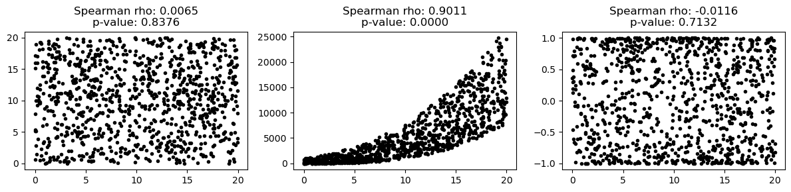
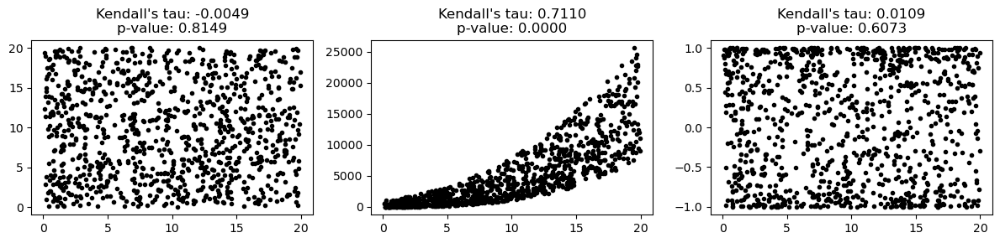
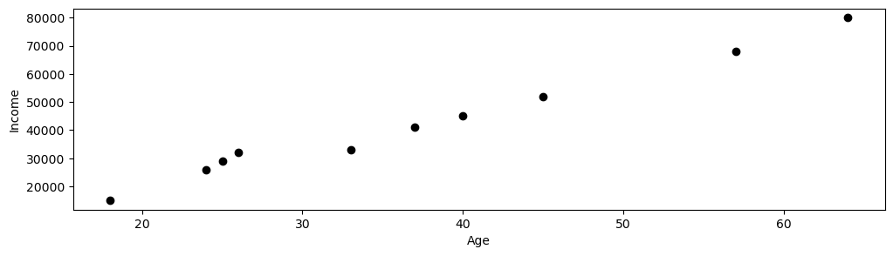

# 상관 검정 개관

이 절에서는 두 변수 사이 관계의 유의성을 평가하는 데 널리 쓰이는 세 가지 통계 검정을 다룬다: Pearson 상관, Spearman 순위상관, Kendall의 타우.

---

## 준비: 공통 자료 생성

다음 모듈들은 서로 다른 상관 상황을 보이기 위해 세 가지 유형의 자료를 생성한다.

### `global_name_space.py`

```python
import argparse
import numpy as np

parser = argparse.ArgumentParser(description='Correlation Test Examples')
parser.add_argument('--seed', type=int, default=1, metavar='S',
                    help='random seed (default: 1)')
# parse_args()가 아니라 parse_known_args()를 쓴다.
# 노트북이나 REPL에서는 sys.argv에 다른 인자가 들어 있어 parse_args()가
# SystemExit을 던지며 커널을 멈춰 세운다.
ARGS, _ = parser.parse_known_args()

np.random.seed(ARGS.seed)
ARGS.size = 1000
```

### `load_data.py`

```python
import numpy as np

# 위의 global_name_space.py를 파일로 저장했다면 다음 한 줄로 대신할 수 있다.
#   from global_name_space import ARGS

def load_data(data_type=0):
    data_dict = {}

    x = np.random.rand(ARGS.size) * 20
    eps = np.random.rand(ARGS.size) * 10

    # Dataset 0: No relationship (random scatter)
    y = np.random.rand(ARGS.size) * 20
    data_dict[0] = (x, y)

    # Dataset 1: Monotonic nonlinear relationship (cubic)
    y = (x + eps) ** 3
    data_dict[1] = (x, y)

    # Dataset 2: Non-monotonic relationship (sine)
    y = np.sin(x + eps)
    data_dict[2] = (x, y)

    return data_dict
```

세 자료가 나타내는 것:

- **자료 0**: 관계 없음 — 무작위 산포. Pearson과 순위 기반 상관 모두 0에 가까워야 한다.
- **자료 1**: 단조 비선형 — Pearson은 선형성을 재므로 관계를 과소평가할 수 있지만 (단조성을 재는) Spearman과 Kendall은 이를 탐지해야 한다.
- **자료 2**: 비단조(사인) — 관계가 주기적이고 단조도 선형도 아니므로 모든 상관 측도가 약해야 한다.

---

## Pearson 상관 검정

[문서: `scipy.stats.pearsonr`](https://docs.scipy.org/doc/scipy/reference/generated/scipy.stats.pearsonr.html)

Pearson의 $r$은 두 변수 사이의 **선형** 관계를 잰다. 귀무가설 $H_0: \rho = 0$ 아래에서 검정통계량은 자유도 $n-2$인 $t$-분포를 따른다.

```python
import matplotlib.pyplot as plt
import scipy.stats as stats

# 위의 load_data.py를 파일로 저장했다면 다음 한 줄로 대신할 수 있다.
#   from load_data import load_data

def main():
    data_dict = load_data()
    _, axes = plt.subplots(1, len(data_dict), figsize=(12, 3))

    for ax, (x, y) in zip(axes, data_dict.values()):
        ax.plot(x, y, ".k")
        coef, p_val = stats.pearsonr(x, y)
        ax.set_title(f"Pearson's r: {coef:.4f}\np-value: {p_val:.4f}")
    plt.tight_layout()
    plt.show()

if __name__ == "__main__":
    main()
```


왼쪽부터 무관계, 단조 관계, 사인 관계다. Pearson은 가운데에서만 큰 값을 준다. 오른쪽 사인 자료는 눈으로는 뚜렷한 구조가 있지만 $r$이 0 근처다.

**언제 쓰는가**: 두 변수가 모두 연속형이고 **선형** 관계를 예상할 때. Pearson의 $r$은 이상점에 민감하며 p-값이 정확하려면 이변량 정규성을 가정한다.

---

## Spearman 순위상관 검정

[영상: Spearman's Rank Correlation](https://www.youtube.com/watch?v=YpG2MlulP_o) |
[문서: `scipy.stats.spearmanr`](https://docs.scipy.org/doc/scipy/reference/generated/scipy.stats.spearmanr.html)

Spearman의 $\rho_s$는 두 변수 사이의 **단조** 관계를 잰다. 원자료 값이 아니라 순위에 Pearson의 $r$을 적용하여 계산한다. 그래서 이상점에 로버스트하고 비선형이지만 단조인 관계에도 적용할 수 있다.

```python
import matplotlib.pyplot as plt
import scipy.stats as stats

# 위의 load_data.py를 파일로 저장했다면 다음 한 줄로 대신할 수 있다.
#   from load_data import load_data

def main():
    data_dict = load_data()
    _, axes = plt.subplots(1, len(data_dict), figsize=(12, 3))

    for ax, (x, y) in zip(axes, data_dict.values()):
        ax.plot(x, y, ".k")
        coef, p_val = stats.spearmanr(x, y)
        ax.set_title(f"Spearman rho: {coef:.4f}\np-value: {p_val:.4f}")
    plt.tight_layout()
    plt.show()

if __name__ == "__main__":
    main()
```



단조 자료에서 Spearman이 Pearson보다 높은 값을 준다. 사인 자료에서는 둘 다 0 근처인데, 관계가 단조가 아니어서 순위로 바꾸는 것도 도움이 되지 않기 때문이다.

**언제 쓰는가**: 관계가 단조일 수 있으나 반드시 선형은 아닐 때, 또는 자료에 이상점이 있거나 순서형일 때.

---

## Kendall의 타우

[영상 1: Kendall's Tau Explained](https://www.youtube.com/watch?v=oXVxaSoY94k) |
[영상 2: Kendall's Tau Calculation](https://www.youtube.com/watch?v=V4MgE43SrgM) |
[문서: `scipy.stats.kendalltau`](https://docs.scipy.org/doc/scipy/reference/generated/scipy.stats.kendalltau.html)

Kendall의 $\tau$도 **단조** 관계의 강도를 재지만 순위가 아니라 일치쌍과 불일치쌍의 수에 기반한다. 표본이 작을 때 더 로버스트한 편이고 가설검정에 좋은 통계적 성질을 갖는다.

$$
\tau = \frac{(\text{number of concordant pairs}) - (\text{number of discordant pairs})}{\binom{n}{2}}
$$

```python
import matplotlib.pyplot as plt
import scipy.stats as stats

# 위의 load_data.py를 파일로 저장했다면 다음 한 줄로 대신할 수 있다.
#   from load_data import load_data

def main():
    data_dict = load_data()
    _, axes = plt.subplots(1, len(data_dict), figsize=(12, 3))

    for ax, (x, y) in zip(axes, data_dict.values()):
        ax.plot(x, y, ".k")
        coef, p_val = stats.kendalltau(x, y)
        ax.set_title(f"Kendall's tau: {coef:.4f}\np-value: {p_val:.4f}")
    plt.tight_layout()
    plt.show()

if __name__ == "__main__":
    main()
```



Kendall의 $\tau$는 세 자료 모두에서 Spearman과 같은 방향을 가리키되 절댓값이 작다. 척도가 다르기 때문이며, 두 계수를 직접 비교하면 안 된다.

**언제 쓰는가**: Spearman의 $\rho_s$와 비슷한 상황이지만, 표본이 작거나 쌍별 일치에 기반한 더 해석하기 쉬운 측도를 원할 때 선호된다.

---

## 세 검정의 비교

| 항목 | Pearson의 $r$ | Spearman의 $\rho_s$ | Kendall의 $\tau$ |
|---------|--------------|-------------------|----------------|
| 재는 것 | 선형 연관 | 단조 연관 | 단조 연관 |
| 자료 유형 | 연속형 | 연속형 또는 순서형 | 연속형 또는 순서형 |
| 이상점에 대한 민감성 | 높음 | 낮음 | 낮음 |
| 가정 | 이변량 정규성(정확한 p-값을 위해) | 없음(순위 기반) | 없음(순위 기반) |
| 범위 | $[-1, 1]$ | $[-1, 1]$ | $[-1, 1]$ |
| 작은 표본 | 덜 믿을 만함 | 보통 | 더 믿을 만함 |

---

## 예제: 나이와 소득

**문제**: $\alpha = 0.05$에서 나이와 소득이 관련되어 있는지 검정하라.

```
age    = [18, 25, 57, 45, 26, 64, 37, 40, 24, 33]
income = [15000, 29000, 68000, 52000, 32000, 80000, 41000, 45000, 26000, 33000]
```

### 풀이

세 검정 모두 $p \approx 0.0000$을 주어 나이와 소득 사이에 강하고 통계적으로 유의한 관계가 있음을 나타낸다.

```python
import matplotlib.pyplot as plt
import scipy.stats as stats

def main():
    x = [18, 25, 57, 45, 26, 64, 37, 40, 24, 33]
    y = [15_000, 29_000, 68_000, 52_000, 32_000, 80_000, 41_000, 45_000, 26_000, 33_000]

    coef, p_val = stats.pearsonr(x, y)
    print(f"Pearson's r:   coef = {coef:.4f},  p-value = {p_val:.4f}")

    coef, p_val = stats.spearmanr(x, y)
    print(f"Spearman rho:  coef = {coef:.4f},  p-value = {p_val:.4f}")

    coef, p_val = stats.kendalltau(x, y)
    print(f"Kendall's tau: coef = {coef:.4f},  p-value = {p_val:.4f}")

    fig, ax = plt.subplots(figsize=(12, 3))
    ax.plot(x, y, "ok")
    ax.set_xlabel("Age")
    ax.set_ylabel("Income")
    plt.show()

if __name__ == "__main__":
    main()
```

출력:

```
Pearson's r:   coef = 0.9923,  p-value = 0.0000
Spearman rho:  coef = 1.0000,  p-value = 0.0000
Kendall's tau: coef = 1.0000,  p-value = 0.0000
```



지수 관계라 단조이지만 선형은 아니다. 순위만 보는 Spearman과 Kendall이 정확히 1.0을 주는 반면 Pearson은 0.9923에 그친다.

**해석**: 모든 p-값이 $\alpha = 0.05$보다 훨씬 작으므로 $H_0: \rho = 0$을 기각하고 이 표본에서 나이와 소득 사이에 통계적으로 유의한 양의 관계가 있다고 결론짓는다. 다만 이것이 인과관계를 확립하지는 않는다. 경력, 학력, 업종 같은 교란요인이 두 변수 모두에 영향을 줄 수 있다.

## 연습문제

<div class="drillbox" markdown>

**연습문제 1.**
$n = 25$인 표본에서 Pearson 상관이 $r = 0.42$이다. 상관에 대한 $t$-검정으로 $\alpha = 0.05$에서 귀무가설 $H_0: \rho = 0$을 검정하라.

</div>

??? success "풀이"
    검정통계량은

    $$
    t = \frac{r\sqrt{n-2}}{\sqrt{1-r^2}} = \frac{0.42\sqrt{23}}{\sqrt{1-0.1764}} = \frac{0.42 \times 4.796}{\sqrt{0.8236}} = \frac{2.014}{0.9075} = 2.219
    $$

    이다. $df = n - 2 = 23$에서 $\alpha = 0.05$ 양측검정의 임계값은 $t_{0.025, 23} \approx 2.069$이다.

    $|t| = 2.219 > 2.069$이므로 $H_0$을 기각하고 5% 수준에서 두 변수 사이에 통계적으로 유의한 선형관계가 있다고 결론짓는다.

<div class="drillbox" markdown>

**연습문제 2.**
$H_0: \rho = 0$을 검정하는 것과 $\rho_0 \neq 0$인 $H_0: \rho = \rho_0$을 검정하는 것의 차이를 설명하라. 두 번째 검정에 왜 Fisher의 $z$ 변환이 필요한가?

</div>

??? success "풀이"
    $\rho = 0$이면 $r$의 표본분포가 대칭이고 $t$-통계량 $r\sqrt{(n-2)/(1-r^2)}$이 자유도 $n-2$인 $t$-분포를 정확히 따른다.

    $\rho \neq 0$이면 $r$의 표본분포가 (특히 $|\rho|$가 1에 가까울 때) **치우쳐** 있으므로 $t$-검정이 더 이상 타당하지 않다. Fisher의 $z$ 변환

    $$
    z = \frac{1}{2}\ln\frac{1+r}{1-r} = \text{arctanh}(r)
    $$

    은 $r$을 평균이 $\text{arctanh}(\rho)$이고 표준오차가 $1/\sqrt{n-3}$인 근사적 정규분포로 바꾸어, 임의의 $\rho_0$에 대한 타당한 가설검정과 신뢰구간을 가능하게 한다.

<div class="drillbox" markdown>

**연습문제 3.**
크기가 $n_1 = 40$, $n_2 = 35$인 두 독립 표본에서 Pearson 상관 $r_1 = 0.55$, $r_2 = 0.30$을 얻었다. $\alpha = 0.05$에서 두 모상관이 같은지 검정하라.

</div>

??? success "풀이"
    각각에 Fisher의 $z$ 변환을 적용한다:

    $$
    z_1 = \text{arctanh}(0.55) = 0.6184, \quad z_2 = \text{arctanh}(0.30) = 0.3095
    $$

    독립인 두 상관을 비교하는 검정통계량은

    $$
    Z = \frac{z_1 - z_2}{\sqrt{\frac{1}{n_1-3} + \frac{1}{n_2-3}}} = \frac{0.6184 - 0.3095}{\sqrt{\frac{1}{37} + \frac{1}{32}}} = \frac{0.3089}{\sqrt{0.02703 + 0.03125}} = \frac{0.3089}{\sqrt{0.05828}} = \frac{0.3089}{0.2414} = 1.28
    $$

    이다. $\alpha = 0.05$ 양측검정의 임계값은 $z_{0.025} = 1.96$이다. $|Z| = 1.28 < 1.96$이므로 $H_0$을 기각하지 못한다. 두 모상관이 다르다고 결론지을 증거가 충분하지 않다.
