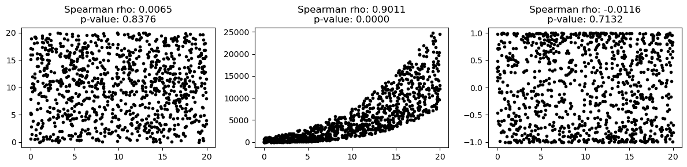
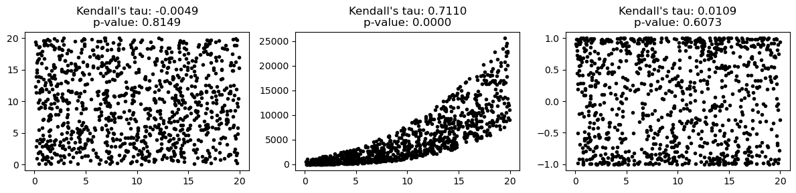
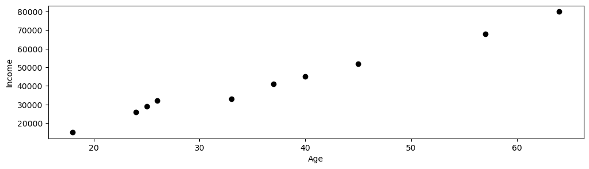

# 상관 검정 개관

이 절에서는 두 변수 사이 관계의 유의성을 평가하는 데 널리 쓰이는 세 가지 통계 검정을 다룬다: Pearson 상관, Spearman 순위상관, Kendall의 타우.

---

## 준비: 공통 자료 생성

다음 모듈들은 서로 다른 상관 상황을 보이기 위해 세 가지 유형의 자료를 생성한다.

### `global_name_space.py`

<div class="exbox" markdown>

**보기 1.** <span class="diff easy" title="쉬움"></span> 재현을 위한 설정 모듈. 뒤의 모든 보기가 이 모듈이 정한 씨앗과 표본크기를 쓴다.

**(1)** 주석은 노트북에서 `parse_args()` 가 커널을 멈춰 세운다고 한다. 노트북이 남기는 찌꺼기 인자를 흉내 내어 두 방식의 차이를 실제로 재현하시오.

**(2)** `np.random.seed(1)` 이 고정하는 것과 고정하지 않는 것을 각각 말하시오. 뒤의 보기들이 `np.random.rand` 를 쓰는데, 중간에 `np.random.default_rng()` 를 섞어 쓰면 재현이 되는가.

</div>

??? success "풀이"

    **유도할 답이 없는 보기다.** 통계가 아니라 **재현성을 위한 장치**이므로, 풀이의 몫은 그 장치가 실제로 무엇을 막아 주는지 돌려서 확인하는 것이다.

    **(1) 노트북의 `sys.argv` 에는 커널 설정 파일이 들어 있다.** `jupyter` 가 띄우는 프로세스의 인자는 대개

    ```
    ['ipykernel_launcher.py', '-f', '/tmp/kernel-abc.json']
    ```

    꼴이다. `parse_args()` 는 자기가 모르는 인자를 보면 **오류를 찍고 `SystemExit(2)` 를 던진다.** 노트북에서는 이것이 커널을 죽인 것처럼 보인다. `parse_known_args()` 는 모르는 인자를 둘째 반환값으로 **따로 담아 돌려주고** 아는 것만 파싱하므로 그냥 지나간다. 아래 출력에서 전자는 `error: unrecognized arguments: -f /tmp/kernel-abc.json` 를, 후자는 `seed = 1` 과 버린 인자 목록을 준다.

    **(2) `np.random.seed` 는 넘파이의 전역 `RandomState` 하나만 고정한다.** 정확히는

    - **고정하는 것**: `np.random.rand`, `np.random.randn`, `np.random.normal` 처럼 `np.random.` 으로 바로 부르는 옛 API. 이 보기들의 `load_data` 가 쓰는 것이 이쪽이다.
    - **고정하지 않는 것**: `np.random.default_rng()` 로 **새로 만드는** 생성기. 씨앗 없이 부르면 운영체제의 엔트로피에서 씨앗을 가져오므로, `np.random.seed(1)` 을 아무리 걸어도 **매번 다른 수열**이 나온다. `random` 모듈이나 `torch` 같은 다른 라이브러리의 생성기도 마찬가지다.

    그러므로 **옛 API 와 `default_rng()` 를 섞어 쓰면 재현이 깨진다.** 섞어 쓰려면 `default_rng(seed)` 처럼 씨앗을 명시해야 하고, 그러면 이번에는 `np.random.seed` 와 **무관하게** 재현된다. 두 체계는 서로 이야기하지 않는다.

    ```python
    import argparse
    import numpy as np

    parser = argparse.ArgumentParser(description='Correlation Test Examples')
    parser.add_argument('--seed', type=int, default=1, metavar='S',
                        help='random seed (default: 1)')
    # parse_args()가 아니라 parse_known_args()를 쓴다.
    # 노트북이나 REPL에서는 sys.argv에 다른 인자가 들어 있어 parse_args()가
    # SystemExit을 던지며 커널을 멈춰 세운다.
    ARGS, _ = parser.parse_known_args()

    np.random.seed(ARGS.seed)
    ARGS.size = 1000

    # (1) 노트북이 남기는 찌꺼기 인자를 흉내 내어 두 방식을 견준다.
    import sys
    import contextlib
    import io

    saved = sys.argv
    sys.argv = ['ipykernel_launcher.py', '-f', '/tmp/kernel-abc.json']
    try:
        a, unknown = parser.parse_known_args()
        print(f"parse_known_args: 성공, seed = {a.seed}, 버린 인자 = {unknown}")
        with contextlib.redirect_stderr(io.StringIO()) as err:
            try:
                parser.parse_args()
                print("parse_args: 성공")
            except SystemExit as ex:
                msg = err.getvalue().strip().splitlines()[-1]
                print(f"parse_args: SystemExit(code={ex.code}) — "
                      f"error: {msg.split('error: ', 1)[-1]}")
    finally:
        sys.argv = saved

    # (2) seed 가 고정하는 것과 고정하지 않는 것
    np.random.seed(1)
    a1 = np.random.rand(3)
    np.random.seed(1)
    a2 = np.random.rand(3)
    print(f"\nnp.random.rand  1회차 {a1.round(6)}")
    print(f"np.random.rand  2회차 {a2.round(6)}   같은가: {np.array_equal(a1, a2)}")

    np.random.seed(1)
    b1 = np.random.default_rng().random(3)
    np.random.seed(1)
    b2 = np.random.default_rng().random(3)
    print(f"default_rng()   두 번 뽑아 같은가: {np.array_equal(b1, b2)}   "
          f"(돌릴 때마다 값이 달라지므로 값은 적지 않는다)")

    np.random.seed(1)
    c1 = np.random.default_rng(1).random(3)
    c2 = np.random.default_rng(1).random(3)
    print(f"default_rng(1)  두 번  {c1.round(6)}   같은가: {np.array_equal(c1, c2)}")
    print(f"  (np.random.seed(1) 을 걸어도 default_rng(1) 의 값은 그것과 무관하다)")
    ```

    출력:

    ```
    parse_known_args: 성공, seed = 1, 버린 인자 = ['-f', '/tmp/kernel-abc.json']
    parse_args: SystemExit(code=2) — error: unrecognized arguments: -f /tmp/kernel-abc.json

    np.random.rand  1회차 [4.17022e-01 7.20324e-01 1.14000e-04]
    np.random.rand  2회차 [4.17022e-01 7.20324e-01 1.14000e-04]   같은가: True
    default_rng()   두 번 뽑아 같은가: False   (돌릴 때마다 값이 달라지므로 값은 적지 않는다)
    default_rng(1)  두 번  [0.511822 0.950464 0.14416 ]   같은가: True
      (np.random.seed(1) 을 걸어도 default_rng(1) 의 값은 그것과 무관하다)
    ```

    씨앗 $1$ 의 첫 세 수 $0.417022$, $0.720324$, $0.000114$ 는 돌릴 때마다 같다. 이 세 수가 다르게 나오면 뒤 보기들의 상관값도 달라지므로, **이 줄이 뒷 보기 전체의 검산 기준**이다.

### `load_data.py`

<div class="exbox" markdown>

**보기 2.** <span class="diff easy" title="쉬움"></span> 세 자료가 무엇을 재게 하려고 만들어졌는가. $x \sim U(0,20)$, $\varepsilon \sim U(0,10)$ 이 독립이고 세 자료가 아래와 같다.

| 자료 | $y$ | 노린 것 |
|---|---|---|
| 0 | 새 $U(0,20)$ | 관계 없음 |
| 1 | $(x+\varepsilon)^3$ | 단조 비선형 |
| 2 | $\sin(x+\varepsilon)$ | 비단조 |

**(1)** 자료 1 의 $y$ 는 **$x$ 의 단조함수인가.** 아니라면 "단조 비선형"이라는 설명은 무엇을 뜻하는가. 세제곱이 순위 측도에 어떤 영향을 주는지도 함께 답하시오.

**(2)** 자료 2 에서 $\sin$ 의 안쪽 $x + \varepsilon$ 이 훑는 범위는 얼마이고 사인이 몇 주기를 도는가. 그래서 모든 측도가 $0$ 근처가 되는 까닭을 말하시오.

</div>

??? success "풀이"

    **(1) 단조함수가 아니다.** $y$ 는 $x + \varepsilon$ 의 단조증가 함수이지 $x$ 의 함수가 아니다. $\varepsilon$ 이 $0$ 부터 $10$ 까지 흔들리므로 **$x$ 가 커져도 $x+\varepsilon$ 이 줄 수 있다.** 자료를 $x$ 로 정렬해 이웃한 $y$ 를 견주면 $999$ 곳 가운데 **$503$ 곳에서 $y$ 가 줄어든다.** 거의 절반이다. 예를 들어 $x = 0.0023 \to 0.0080$ 으로 커지는데 $y$ 는 $425.2 \to 21.1$ 로 떨어진다.

    그러므로 "자료 1 은 단조다"라는 말은 **$y$ 가 $x$ 의 단조함수라는 뜻이 아니라, 잡음을 걷어 낸 바탕 관계가 단조라는 뜻**으로 읽어야 한다. $r_s = 1$ 이 되지 않는 것도 그 때문이다.

    **세제곱은 순위 측도에 보이지 않는다.** $t \mapsto t^3$ 은 실수 전체에서 강한 증가함수이므로 **순위를 바꾸지 않는다.** 따라서

    $$
    \rho_s\big(x,\,(x+\varepsilon)^3\big) = \rho_s\big(x,\, x+\varepsilon\big),
    \qquad
    \tau\big(x,\,(x+\varepsilon)^3\big) = \tau\big(x,\, x+\varepsilon\big)
    $$

    이다. 실제로 둘 다 $0.900004$ 로 소수 여섯째 자리까지 같다. 반면 Pearson 은 $0.815408$ 과 $0.894142$ 로 **다르다.** 곧 **이 자료에서 "비선형"이라는 말이 뜻하는 것은 오로지 Pearson 에게만 보이는 성질**이고, 순위 측도가 보는 자료는 $(x,\, x+\varepsilon)$ 이라는 평범한 신호 더하기 잡음이다.

    **(2) $x+\varepsilon$ 은 $(0, 30)$ 을 훑는다.** 표본에서는 $[0.5744,\; 29.6839]$ 이고, 사인의 주기가 $2\pi$ 이므로

    $$
    \frac{29.6839 - 0.5744}{2\pi} = 4.633
    $$

    곧 **$4.6$ 주기를 돈다.** $x$ 가 조금만 커져도 $\sin(x+\varepsilon)$ 이 올랐다 내렸다 하므로, $x$ 가 큰 쪽에서 $y$ 가 더 크다고 말할 만한 전역적 경향이 없다. Pearson 은 직선 하나를, Spearman 과 Kendall 은 단조 추세 하나를 찾는데 **셋 다 그런 것이 없다.** 그래서 세 측도가 모두 $0$ 근처에 머문다.

    다만 **정확히 $0$ 은 아니다.** 주기가 정수가 아니어서 반 토막이 남기 때문이다. 자료 2 의 모집단 Pearson 상관은 보기 3에서 적분으로 $0.0280$ 임을 보인다.

    **세 자료가 $x$ 를 공유한다는 점**도 짚어 둔다. `load_data` 는 $x$ 와 $\varepsilon$ 을 한 번만 뽑아 세 자료에 모두 쓴다(자료 0 의 $y$ 만 새로 뽑는다). 그래서 세 그림의 가로축 점 배치가 같고, 셋을 나란히 놓고 견주는 것이 공정해진다.

    ```python
    import numpy as np
    from scipy import stats

    # 위의 global_name_space.py를 파일로 저장했다면 다음 한 줄로 대신할 수 있다.
    #   from global_name_space import ARGS

    def load_data(data_type=0):
        data_dict = {}

        x = np.random.rand(ARGS.size) * 20
        eps = np.random.rand(ARGS.size) * 10

        # 자료 0: 관계 없음
        y = np.random.rand(ARGS.size) * 20
        data_dict[0] = (x, y)

        # 자료 1: 단조이지만 곡선인 관계(삼차)
        y = (x + eps) ** 3
        data_dict[1] = (x, y)

        # 자료 2: 단조가 아닌 관계(사인)
        y = np.sin(x + eps)
        data_dict[2] = (x, y)

        return data_dict

    np.random.seed(1)
    class ARGS: size = 1000
    d = load_data()

    # (1) 세 자료가 x 를 공유하는가
    print(f"자료 0 과 1 의 x 가 같은 배열인가: {np.array_equal(d[0][0], d[1][0])}")
    print(f"자료 1 과 2 의 x 가 같은 배열인가: {np.array_equal(d[1][0], d[2][0])}")

    # (2) 자료 1 의 y 가 x 의 단조함수인가 — 반례를 찾는다
    x, y = d[1]
    o = np.argsort(x)
    xs, ys = x[o], y[o]
    bad = np.flatnonzero(np.diff(ys) < 0)
    print(f"\n자료 1: x 를 오름차순으로 놓았을 때 y 가 줄어드는 자리 = "
          f"{len(bad)} 곳 / {len(x)-1}")
    i = bad[0]
    print(f"  예: x = {xs[i]:.4f} -> {xs[i+1]:.4f} 인데 y = {ys[i]:.1f} -> {ys[i+1]:.1f}")
    print(f"  (x 가 커져도 eps 가 더 작으면 x+eps 가 줄 수 있다)")

    # 세제곱은 순위를 바꾸지 않는다. y = (x+eps)^3 이므로 cbrt(y) = x+eps 다.
    print(f"\n세제곱은 순위를 바꾸지 않는다:")
    print(f"  spearman(x, (x+eps)^3) = {stats.spearmanr(x, y).statistic:.6f}")
    print(f"  spearman(x,  x+eps   ) = {stats.spearmanr(x, np.cbrt(y)).statistic:.6f}")
    print(f"  pearson (x, (x+eps)^3) = {stats.pearsonr(x, y).statistic:.6f}")
    print(f"  pearson (x,  x+eps   ) = {stats.pearsonr(x, np.cbrt(y)).statistic:.6f}")

    # (3) 자료 2 가 도는 주기 수
    u2 = np.cbrt(d[1][1])          # = x + eps
    print(f"\n자료 2: x+eps 의 범위 = [{u2.min():.4f}, {u2.max():.4f}],  "
          f"sin 이 도는 주기 = {(u2.max() - u2.min()) / (2 * np.pi):.3f}")
    ```

    출력:

    ```
    자료 0 과 1 의 x 가 같은 배열인가: True
    자료 1 과 2 의 x 가 같은 배열인가: True

    자료 1: x 를 오름차순으로 놓았을 때 y 가 줄어드는 자리 = 503 곳 / 999
      예: x = 0.0023 -> 0.0080 인데 y = 425.2 -> 21.1
      (x 가 커져도 eps 가 더 작으면 x+eps 가 줄 수 있다)

    세제곱은 순위를 바꾸지 않는다:
      spearman(x, (x+eps)^3) = 0.900004
      spearman(x,  x+eps   ) = 0.900004
      pearson (x, (x+eps)^3) = 0.815408
      pearson (x,  x+eps   ) = 0.894142

    자료 2: x+eps 의 범위 = [0.5744, 29.6839],  sin 이 도는 주기 = 4.633
    ```

    세 자료가 나타내는 것을 다시 적으면 이렇다.

    - **자료 0**: 관계 없음 — 무작위 산포. 세 측도 모두 $0$ 에 가까워야 한다.
    - **자료 1**: 바탕 관계가 단조인 비선형 — Pearson 은 세제곱의 굽음에 값을 깎이지만 순위 측도는 그 굽음을 보지 못한다.
    - **자료 2**: 비단조(사인) — $4.6$ 주기를 돌므로 선형도 단조도 아니고, 세 측도가 모두 약하다.

---

## Pearson 상관 검정

[문서: `scipy.stats.pearsonr`](https://docs.scipy.org/doc/scipy/reference/generated/scipy.stats.pearsonr.html)

Pearson의 $r$은 두 변수 사이의 **선형** 관계를 잰다. 귀무가설 $H_0: \rho = 0$ 아래에서 검정통계량은 자유도 $n-2$인 $t$-분포를 따른다.

<div class="exbox" markdown>

**보기 3.** <span class="diff easy" title="쉬움"></span> 세 자료의 Pearson $r$ 를 참값과 견주기. 그림은 $r = 0.0348,\; 0.8154,\; -0.0183$ 을 준다.

**(1)** 자료 1 의 **모집단** Pearson 상관을 적률로 유도하시오. $X \sim U(0,20)$, $\varepsilon \sim U(0,10)$ 이 독립이고 $U = X + \varepsilon$, $Y = U^3$ 이다.

**(2)** 자료 0 과 자료 2 의 모집단 상관은 각각 얼마인가. 둘 다 $0$ 인가. 세 표본값이 참값에서 몇 표준오차 떨어져 있는지 적으시오.

</div>

??? success "풀이"

    **(1) 균등분포의 적률만 있으면 된다.** $E[X^k] = 20^k/(k+1)$, $E[\varepsilon^k] = 10^k/(k+1)$ 이고 둘이 독립이다. 분자부터 적는다.

    $$
    E[XU^3] = E\!\left[X(X+\varepsilon)^3\right]
    = E[X^4] + 3E[X^3]E[\varepsilon] + 3E[X^2]E[\varepsilon^2] + E[X]E[\varepsilon^3]
    $$

    $$
    = 32000 + 3(2000)(5) + 3\!\left(\tfrac{400}{3}\right)\!\left(\tfrac{100}{3}\right) + 10(250)
    = \frac{233500}{3}
    $$

    $$
    E[U^3] = E[X^3] + 3E[X^2]E[\varepsilon] + 3E[X]E[\varepsilon^2] + E[\varepsilon^3]
    = 2000 + 2000 + 1000 + 250 = 5250
    $$

    $$
    \operatorname{Cov}(X, U^3) = \frac{233500}{3} - 10 \times 5250 = \frac{76000}{3}
    $$

    분모는 두 분산이다. $\operatorname{Var}(X) = \frac{400}{3} - 100 = \frac{100}{3}$ 이고, $U^3$ 의 분산에는 $U$ 의 여섯째 적률이 든다.

    $$
    E[U^6] = \sum_{k=0}^{6}\binom{6}{k} E[X^{6-k}]\,E[\varepsilon^{k}] = \frac{394000000}{7},
    \qquad
    \operatorname{Var}(U^3) = \frac{394000000}{7} - 5250^2 = \frac{201062500}{7}
    $$

    따라서

    $$
    \rho = \frac{76000/3}{\sqrt{\dfrac{100}{3} \cdot \dfrac{201062500}{7}}}
    = \frac{152\sqrt{67557}}{48255}
    = 0.818722
    $$

    이다.

    **(2) 자료 0 은 정확히 $0$ 이지만 자료 2 는 아니다.** 자료 0 의 $y$ 는 $x$ 와 **독립으로 새로 뽑은** 균등난수이므로 공분산이 $0$ 이다. 자료 2 는 다르다. $\operatorname{Cov}(X, \sin U)$ 를 같은 영역에서 적분하면

    $$
    \rho = 0.027999
    $$

    로 작지만 $0$ 이 아니다. 사인이 $4.633$ 주기를 도는데 **정수 주기가 아니어서** 잘린 반 토막이 아주 약한 추세를 남기기 때문이다. $\rho$ 가 정확히 $0$ 이 되려면 $x+\varepsilon$ 의 범위가 $2\pi$ 의 정수배여야 한다.

    세 표본값을 참값과 견주면 이렇다. $\rho$ 근처에서 $\operatorname{SE}(r) \approx (1-\rho^2)/\sqrt{n}$ 이다.

    | 자료 | 표본 $r$ | 모집단 $\rho$ | $\operatorname{SE}$ | $z$ |
    |---|---|---|---|---|
    | 0 | $+0.034844$ | $0$ | $0.031623$ | $+1.102$ |
    | 1 | $+0.815408$ | $+0.818722$ | $0.010426$ | $-0.318$ |
    | 2 | $-0.018298$ | $+0.027999$ | $0.031598$ | $-1.465$ |

    **셋 다 $\lvert z \rvert < 2$ 로 맞는다.** 특히 자료 2 의 표본값이 **음수**인데 참값은 **양수**라는 점을 눈여겨볼 만하다. $0.028$ 짜리 상관을 $n = 1000$ 으로는 잴 수 없다. 부호조차 못 맞춘다.

    ```python
    import numpy as np
    import matplotlib.pyplot as plt
    import scipy.stats as stats

    plt.rcParams["font.sans-serif"] = ["NanumGothic", "Apple SD Gothic Neo", "Malgun Gothic"]
    plt.rcParams["font.family"] = "sans-serif"
    plt.rcParams["axes.unicode_minus"] = False

    # 위의 load_data.py를 파일로 저장했다면 다음 한 줄로 대신할 수 있다.
    #   from load_data import load_data

    def main():
        data_dict = load_data()
        _, axes = plt.subplots(1, len(data_dict), figsize=(12, 3))

        for ax, (x, y) in zip(axes, data_dict.values()):
            ax.plot(x, y, ".k")
            coef, p_val = stats.pearsonr(x, y)
            ax.set_title(f"Pearson's r: {coef:.4f}\np-value: {p_val:.4f}")
        plt.tight_layout()
        plt.show()

    np.random.seed(1)          # 보기 1 의 설정 모듈이 하는 일 (별도 실행이면 자동으로 된다)

    if __name__ == "__main__":
        main()

    # 모집단 값을 적률로 정확히 구한다.
    from fractions import Fraction as F
    from math import comb

    # E[X^k] = 20^k/(k+1),  E[eps^k] = 10^k/(k+1)
    EX = [F(20**k, k + 1) for k in range(7)]
    EE = [F(10**k, k + 1) for k in range(7)]
    EU = lambda m: sum(comb(m, k) * EX[m - k] * EE[k] for k in range(m + 1))

    EXU3 = EX[4] + 3 * EX[3] * EE[1] + 3 * EX[2] * EE[2] + EX[1] * EE[3]
    cov = EXU3 - EX[1] * EU(3)
    varX = EX[2] - EX[1] ** 2
    varU3 = EU(6) - EU(3) ** 2
    rho1 = float(cov) / np.sqrt(float(varX) * float(varU3))
    print("자료 1 의 모집단 Pearson 상관")
    print(f"  E[X U^3] = {EXU3} = {float(EXU3):.4f}")
    print(f"  E[U^3]   = {EU(3)} = {float(EU(3)):.4f}")
    print(f"  Cov      = {cov} = {float(cov):.4f}")
    print(f"  Var(X)   = {varX} = {float(varX):.4f}")
    print(f"  E[U^6]   = {EU(6)} = {float(EU(6)):.4f}")
    print(f"  Var(U^3) = {varU3} = {float(varU3):.4f}")
    print(f"  rho      = {rho1:.6f}")

    # 자료 2 는 사인이 들어가 적률로 떨어지지 않으므로 수치적분으로 구한다.
    from scipy import integrate
    Es = integrate.dblquad(lambda e, x: np.sin(x + e) / 200, 0, 20, 0, 10)[0]
    Exs = integrate.dblquad(lambda e, x: x * np.sin(x + e) / 200, 0, 20, 0, 10)[0]
    Es2 = integrate.dblquad(lambda e, x: np.sin(x + e) ** 2 / 200, 0, 20, 0, 10)[0]
    rho2 = (Exs - 10 * Es) / np.sqrt(float(varX) * (Es2 - Es ** 2))
    print(f"\n자료 2 의 모집단 Pearson 상관 = {rho2:.6f}   (정확히 0 이 아니다)")

    np.random.seed(1)          # 그림이 쓴 것과 같은 자료를 다시 얻는다
    d = load_data()
    print(f"\n{'자료':>4s} {'표본 r':>10s} {'모집단 rho':>11s} {'SE':>8s} {'z':>7s} {'p':>8s}")
    pop = [0.0, rho1, rho2]
    for k, (x, y) in d.items():
        r, p = stats.pearsonr(x, y)
        se = (1 - pop[k] ** 2) / np.sqrt(ARGS.size)
        print(f"{k:4d} {r:+10.6f} {pop[k]:+11.6f} {se:8.6f} {(r - pop[k]) / se:+7.3f} {p:8.4f}")
    ```

    출력:

    ```
    자료 1 의 모집단 Pearson 상관
      E[X U^3] = 233500/3 = 77833.3333
      E[U^3]   = 5250 = 5250.0000
      Cov      = 76000/3 = 25333.3333
      Var(X)   = 100/3 = 33.3333
      E[U^6]   = 394000000/7 = 56285714.2857
      Var(U^3) = 201062500/7 = 28723214.2857
      rho      = 0.818722

    자료 2 의 모집단 Pearson 상관 = 0.027999   (정확히 0 이 아니다)

      자료       표본 r     모집단 rho       SE       z        p
       0  +0.034844   +0.000000 0.031623  +1.102   0.2710
       1  +0.815408   +0.818722 0.010426  -0.318   0.0000
       2  -0.018298   +0.027999 0.031598  -1.465   0.5633
    ```

    

    손으로 적은 분수 $233500/3$, $76000/3$, $100/3$, $394000000/7$, $201062500/7$ 이 모두 맞고 $\rho = 0.818722$ 도 맞는다. 그림의 세 제목 $0.0348$, $0.8154$, $-0.0183$ 도 표의 표본값과 같다.

    **언제 쓰는가**: 두 변수가 모두 연속형이고 **선형** 관계를 예상할 때. Pearson 의 $r$ 은 이상점에 민감하며 p-값이 정확하려면 이변량 정규성을 가정한다. 여기서는 $x$ 가 균등이고 $y$ 가 세제곱이라 그 가정이 깨져 있지만, $n = 1000$ 이라 p-값은 쓸 만하다.

---

## Spearman 순위상관 검정

[영상: Spearman's Rank Correlation](https://www.youtube.com/watch?v=YpG2MlulP_o) |
[문서: `scipy.stats.spearmanr`](https://docs.scipy.org/doc/scipy/reference/generated/scipy.stats.spearmanr.html)

Spearman의 $\rho_s$는 두 변수 사이의 **단조** 관계를 잰다. 원자료 값이 아니라 순위에 Pearson의 $r$을 적용하여 계산한다. 그래서 이상점에 로버스트하고 비선형이지만 단조인 관계에도 적용할 수 있다.

<div class="exbox" markdown>

**보기 4.** <span class="diff easy" title="쉬움"></span> 자료 1 의 모집단 $\rho_s$ 가 딱 떨어진다. 그림은 $\rho_s = 0.0365,\; 0.9000,\; -0.0176$ 을 준다.

**(1)** 보기 2에서 세제곱이 순위를 바꾸지 않음을 보았다. 이 사실과 복사 항등식 $\rho_s = 12\,E[F_X(X)F_Y(Y)] - 3$ 을 써서 자료 1 의 모집단 $\rho_s$ 를 구하시오.

**(2)** 보기 3의 $\rho = 0.818722$ 와 견주면 $\rho_s$ 가 더 크다. 자료 2 의 모집단 $\rho_s$ 도 구해 세 표본값을 참값과 맞추시오.

</div>

??? success "풀이"

    **(1) 먼저 세제곱을 벗긴다.** $t \mapsto t^3$ 이 강한 증가함수이므로 $Y = U^3$ 의 순위는 $U = X+\varepsilon$ 의 순위와 **같다.** 따라서

    $$
    \rho_s\big(X,\, U^3\big) = \rho_s\big(X,\, U\big)
    $$

    이고, 세제곱은 계산에서 아예 사라진다. **자료 1 의 순위 상관을 정하는 것은 곡선이 아니라 잡음 $\varepsilon$ 뿐이다.**

    이제 연속 주변분포에 대해 성립하는 복사 항등식

    $$
    \rho_s = 12\,E\!\left[F_X(X)\,F_U(U)\right] - 3
    $$

    을 쓴다. $F_X(x) = x/20$ 이고 $F_U$ 는 $U(0,20)$ 과 $U(0,10)$ 의 합성곱이라 **사다리꼴**이다.

    $$
    F_U(u) =
    \begin{cases}
    \dfrac{u^2}{400}, & 0 \le u \le 10,\\[6pt]
    \dfrac14 + \dfrac{u-10}{20}, & 10 \le u \le 20,\\[6pt]
    1 - \dfrac{(30-u)^2}{400}, & 20 \le u \le 30.
    \end{cases}
    $$

    결합밀도가 $1/200$ 이므로

    $$
    E\!\left[F_X(X)F_U(U)\right]
    = \frac{1}{200}\int_0^{20}\!\!\int_0^{10} \frac{x}{20}\,F_U(x+e)\,de\,dx
    = \frac{13}{40}
    $$

    이고 따라서

    $$
    \rho_s = 12 \times \frac{13}{40} - 3 = \frac{39}{10} - 3 = \frac{9}{10} = 0.9
    $$

    이다. **정확히 $0.9$ 다.**

    **(2) $\rho_s > \rho$ 인 까닭은 세제곱뿐이다.** 보기 3의 $\rho = 0.818722$ 는 세제곱의 굽음에 값을 깎인 것이고, $\rho_s = 0.9$ 는 그 굽음을 보지 못한다. 실제로 보기 2에서 세제곱을 벗긴 $(x,\, x+\varepsilon)$ 의 표본 Pearson 이 $0.894142$ 로 $0.9$ 에 다가간다. **차이 $0.0846$ 은 전부 "세제곱" 한 단어에서 온다.**

    자료 2 는 닫힌 꼴이 없으므로 아주 큰 표본으로 잰다. $\rho_s = 0.027899 \pm 0.000549$ 로 보기 3의 Pearson 참값 $0.027999$ 와 사실상 같다. 세 표본값을 참값과 맞추면

    | 자료 | 표본 $r_s$ | 모집단 $\rho_s$ | $\operatorname{SE}$(어림) | $z$ |
    |---|---|---|---|---|
    | 0 | $+0.036465$ | $0$ | $0.031623$ | $+1.153$ |
    | 1 | $+0.900004$ | $+0.900000$ | $0.006008$ | $+0.001$ |
    | 2 | $-0.017612$ | $+0.027899$ | $0.031598$ | $-1.440$ |

    이다. 자료 1 의 $z = +0.001$ 은 **운이 좋았을 뿐**이다. 표준오차가 $0.006$ 이니 보통은 $0.894$ 와 $0.906$ 사이 어디에 떨어진다. 소수 다섯째 자리까지 맞은 것을 공식이 그만큼 정확하다는 뜻으로 읽으면 안 된다.

    ```python
    import numpy as np
    import matplotlib.pyplot as plt
    import scipy.stats as stats

    plt.rcParams["font.sans-serif"] = ["NanumGothic", "Apple SD Gothic Neo", "Malgun Gothic"]
    plt.rcParams["font.family"] = "sans-serif"
    plt.rcParams["axes.unicode_minus"] = False

    # 위의 load_data.py를 파일로 저장했다면 다음 한 줄로 대신할 수 있다.
    #   from load_data import load_data

    def main():
        data_dict = load_data()
        _, axes = plt.subplots(1, len(data_dict), figsize=(12, 3))

        for ax, (x, y) in zip(axes, data_dict.values()):
            ax.plot(x, y, ".k")
            coef, p_val = stats.spearmanr(x, y)
            ax.set_title(f"Spearman rho: {coef:.4f}\np-value: {p_val:.4f}")
        plt.tight_layout()
        plt.show()

    np.random.seed(1)          # 보기 1 의 설정 모듈이 하는 일 (별도 실행이면 자동으로 된다)

    if __name__ == "__main__":
        main()

    # 복사 항등식을 기호적분으로 확인한다.
    import sympy as sp

    x_, e_ = sp.symbols('x e', real=True)
    # U = X + eps 의 분포함수 (U(0,20) 과 U(0,10) 의 합성곱, 사다리꼴)
    u_ = x_ + e_
    F_U = sp.Piecewise((u_**2 / 400, u_ <= 10),
                       (sp.Rational(1, 4) + (u_ - 10) / 20, u_ <= 20),
                       (1 - (30 - u_)**2 / 400, True))
    # E[F_X(X) F_U(U)],  F_X(x) = x/20,  결합밀도 1/200
    EFF = sp.integrate(sp.integrate((x_ / 20) * F_U / 200, (e_, 0, 10)), (x_, 0, 20))
    EFF = sp.nsimplify(sp.simplify(EFF))
    rho_s = sp.simplify(12 * EFF - 3)
    print(f"E[F_X(X) F_U(U)] = {EFF} = {float(EFF):.6f}")
    print(f"rho_s = 12 E[...] - 3 = {rho_s} = {float(rho_s):.6f}")

    # 아주 큰 표본으로 확인
    rng = np.random.default_rng(99)
    vals = [stats.spearmanr(a := rng.random(200_000) * 20,
                            (a + rng.random(200_000) * 10) ** 3).statistic
            for _ in range(20)]
    print(f"모의 rho_s = {np.mean(vals):.6f} +- {np.std(vals) / np.sqrt(20):.6f}")

    # 자료 2 의 모집단 rho_s 는 닫힌 꼴이 없으므로 모의로 잰다
    vals2 = [stats.spearmanr(a := rng.random(200_000) * 20,
                             np.sin(a + rng.random(200_000) * 10)).statistic
             for _ in range(20)]
    rho_s2 = np.mean(vals2)
    print(f"자료 2 모의 rho_s = {rho_s2:.6f} +- {np.std(vals2) / np.sqrt(20):.6f}")

    np.random.seed(1)          # 그림이 쓴 것과 같은 자료를 다시 얻는다
    d = load_data()
    pop = [0.0, float(rho_s), rho_s2]
    print(f"\n{'자료':>4s} {'표본 r_s':>10s} {'모집단':>10s} {'SE':>8s} {'z':>7s}")
    for k, (x, y) in d.items():
        rs = stats.spearmanr(x, y).statistic
        se = (1 - pop[k] ** 2) / np.sqrt(ARGS.size)
        print(f"{k:4d} {rs:+10.6f} {pop[k]:+10.6f} {se:8.6f} {(rs - pop[k]) / se:+7.3f}")
    ```

    출력:

    ```
    E[F_X(X) F_U(U)] = 13/40 = 0.325000
    rho_s = 12 E[...] - 3 = 9/10 = 0.900000
    모의 rho_s = 0.900015 +- 0.000088
    자료 2 모의 rho_s = 0.027899 +- 0.000549

      자료     표본 r_s        모집단       SE       z
       0  +0.036465  +0.000000 0.031623  +1.153
       1  +0.900004  +0.900000 0.006008  +0.001
       2  -0.017612  +0.027899 0.031598  -1.440
    ```

    

    기호적분이 $13/40$ 과 $9/10$ 을 정확히 주고, $200{,}000$ 짜리 표본 스무 번의 평균 $0.900015 \pm 0.000088$ 이 그것과 맞는다. 그림의 세 제목도 표의 표본값과 같다.

    **언제 쓰는가**: 관계가 단조일 수 있으나 반드시 선형은 아닐 때, 또는 자료에 이상점이 있거나 순서형일 때. 자료 2 를 보면 **단조가 아닌 관계에는 순위도 도움이 되지 않는다.** $\rho_s$ 와 $\rho$ 가 $0.0279$ 와 $0.0280$ 으로 사실상 같다.

---

## Kendall의 타우

[영상 1: Kendall's Tau Explained](https://www.youtube.com/watch?v=oXVxaSoY94k) |
[영상 2: Kendall's Tau Calculation](https://www.youtube.com/watch?v=V4MgE43SrgM) |
[문서: `scipy.stats.kendalltau`](https://docs.scipy.org/doc/scipy/reference/generated/scipy.stats.kendalltau.html)

Kendall의 $\tau$도 **단조** 관계의 강도를 재지만 순위가 아니라 일치쌍과 불일치쌍의 수에 기반한다. 표본이 작을 때 더 로버스트한 편이고 가설검정에 좋은 통계적 성질을 갖는다.

$$
\tau = \frac{(\text{number of concordant pairs}) - (\text{number of discordant pairs})}{\binom{n}{2}}
$$

<div class="exbox" markdown>

**보기 5.** <span class="diff easy" title="쉬움"></span> 자료 1 의 모집단 $\tau$ 를 기하확률로 구하기. 그림은 $\tau = 0.0238,\; 0.7094,\; -0.0123$ 을 준다.

**(1)** 자료 1 의 모집단 $\tau$ 를 **닫힌 꼴로** 구하시오. 두 관측 $(X_1, U_1)$, $(X_2, U_2)$ 를 뽑았을 때 $D = X_1 - X_2$ 와 $G = \varepsilon_1 - \varepsilon_2$ 의 분포를 쓰면 된다.

**(2)** 같은 자료에서 $\tau = 0.708$, $\rho_s = 0.900$, $\rho = 0.819$ 로 셋이 모두 다르다. $\tau$ 가 가장 작은 것이 관계가 약하다는 뜻인가.

</div>

??? success "풀이"

    **(1) 부호만 보면 되므로 세제곱이 또 사라진다.** $\tau$ 는 두 쌍의 일치 확률에서 불일치 확률을 뺀 것이고, 세제곱은 $U_1 - U_2$ 의 **부호를 바꾸지 않으므로**

    $$
    \tau\big(X,\, U^3\big) = \tau\big(X,\, U\big)
    $$

    이다. $D = X_1 - X_2$, $G = \varepsilon_1 - \varepsilon_2$ 로 두면 $U_1 - U_2 = D + G$ 이고 $D$ 와 $G$ 는 독립이다. 그러면

    $$
    \tau = P\big(D(D+G) > 0\big) - P\big(D(D+G) < 0\big) = 1 - 2\,P\big(D(D+G) < 0\big)
    $$

    이다. **곧 $\tau$ 를 정하는 것은 "잡음이 순서를 뒤집을 확률" 하나뿐이다.**

    두 차이는 균등분포의 차이이므로 **삼각분포**다.

    $$
    f_D(d) = \frac{20 - \lvert d \rvert}{400}\ \ (\lvert d \rvert < 20),
    \qquad
    f_G(g) = \frac{10 - \lvert g \rvert}{100}\ \ (\lvert g \rvert < 10)
    $$

    둘 다 $0$ 에 대칭이므로 $P(D(D+G) < 0) = 2\,P(D > 0,\; D + G < 0)$ 이다. $G > -10$ 이므로 $d < 10$ 인 자리만 기여하고, $0 < d < 10$ 에서

    $$
    P(G < -d) = \int_{-10}^{-d}\frac{10+g}{100}\,dg = \frac{(10-d)^2}{200}
    $$

    이다. 따라서

    $$
    P(D>0,\, D+G<0) = \int_0^{10}\frac{20-d}{400}\cdot\frac{(10-d)^2}{200}\,dd
    = \frac{1}{80000}\int_0^{10}(20-d)(10-d)^2\,dd
    $$

    이고, $u = 10-d$ 로 바꾸면

    $$
    \int_0^{10}(10+u)u^2\,du = \left[\frac{10u^3}{3} + \frac{u^4}{4}\right]_0^{10}
    = \frac{10000}{3} + 2500 = \frac{17500}{3}
    $$

    이므로 $P(D>0,\, D+G<0) = \dfrac{17500}{240000} = \dfrac{7}{96}$ 이다. 그러면

    $$
    P\big(D(D+G)<0\big) = \frac{7}{48},
    \qquad
    \tau = 1 - 2\cdot\frac{7}{48} = \frac{17}{24} = 0.708333
    $$

    이다. 곧 **무작위로 고른 두 점 가운데 $14.58\%$ 에서 잡음이 순서를 뒤집는다.**

    **(2) 아니다. 눈금이 다를 뿐이다.** 세 값은 같은 관계를 서로 다른 자로 잰 것이다.

    | 측도 | 모집단 값 | 재는 것 |
    |---|---|---|
    | Pearson $\rho$ | $0.818722$ | 직선에서 벗어난 정도까지 벌한다 |
    | Spearman $\rho_s$ | $0.900000$ | 순위의 선형 상관 |
    | **Kendall $\tau$** | $17/24 = 0.708333$ | **순서가 맞는 쌍의 비율에서 틀린 쌍의 비율을 뺀 것** |

    $\tau$ 의 눈금은 아주 구체적이다. $\tau = 0.708$ 은 **일치쌍이 $85.4\%$, 불일치쌍이 $14.6\%$** 라는 뜻이다. $\rho_s = 0.9$ 에는 그런 직접적인 셈이 없다. 그러므로 $\tau$ 가 작은 것은 약하다는 신호가 아니라 **쌍을 세는 자가 더 촘촘하다는 뜻**이고, 두 계수를 숫자 그대로 견주면 안 된다.

    ```python
    import numpy as np
    import matplotlib.pyplot as plt
    import scipy.stats as stats
    from fractions import Fraction as F

    plt.rcParams["font.sans-serif"] = ["NanumGothic", "Apple SD Gothic Neo", "Malgun Gothic"]
    plt.rcParams["font.family"] = "sans-serif"
    plt.rcParams["axes.unicode_minus"] = False

    # 위의 load_data.py를 파일로 저장했다면 다음 한 줄로 대신할 수 있다.
    #   from load_data import load_data

    def main():
        data_dict = load_data()
        _, axes = plt.subplots(1, len(data_dict), figsize=(12, 3))

        for ax, (x, y) in zip(axes, data_dict.values()):
            ax.plot(x, y, ".k")
            coef, p_val = stats.kendalltau(x, y)
            ax.set_title(f"Kendall's tau: {coef:.4f}\np-value: {p_val:.4f}")
        plt.tight_layout()
        plt.show()

    np.random.seed(1)          # 보기 1 의 설정 모듈이 하는 일 (별도 실행이면 자동으로 된다)

    if __name__ == "__main__":
        main()

    tau_exact = F(17, 24)
    print(f"자료 1 의 모집단 tau = {tau_exact} = {float(tau_exact):.6f}")

    # 유도의 중간값들을 수치적분으로 확인한다.
    from scipy import integrate
    fD = lambda d: (20 - abs(d)) / 400          # D = X1 - X2 의 밀도 (삼각)
    fG = lambda g: (10 - abs(g)) / 100          # G = e1 - e2 의 밀도 (삼각)
    PG = lambda d: integrate.quad(fG, -10, -d)[0]
    half = integrate.quad(lambda d: fD(d) * PG(d), 0, 10)[0]
    print(f"  P(D>0, D+G<0) = {half:.8f}   손계산 7/96 = {float(F(7,96)):.8f}")
    print(f"  P(부호 뒤집힘) = {2*half:.8f}   손계산 7/48 = {float(F(7,48)):.8f}")
    print(f"  tau = 1 - 2*{2*half:.6f} = {1 - 4*half:.6f}")

    rng = np.random.default_rng(99)
    vals = [stats.kendalltau(a := rng.random(100_000) * 20,
                             (a + rng.random(100_000) * 10) ** 3).statistic
            for _ in range(20)]
    print(f"  모의 tau = {np.mean(vals):.6f} +- {np.std(vals) / np.sqrt(20):.6f}")

    vals2 = [stats.kendalltau(a := rng.random(100_000) * 20,
                              np.sin(a + rng.random(100_000) * 10)).statistic
             for _ in range(20)]
    tau2 = np.mean(vals2)
    print(f"\n자료 2 모의 tau = {tau2:.6f} +- {np.std(vals2) / np.sqrt(20):.6f}")

    n = ARGS.size
    se0 = np.sqrt(2 * (2 * n + 5) / (9 * n * (n - 1)))   # H0 아래 tau 의 표준편차
    print(f"\nH0 아래 sd(tau) = sqrt(2(2n+5)/(9n(n-1))) = {se0:.6f}")

    np.random.seed(1)          # 그림이 쓴 것과 같은 자료를 다시 얻는다
    d = load_data()
    pop = [0.0, float(tau_exact), tau2]
    print(f"\n{'자료':>4s} {'표본 tau':>10s} {'모집단':>10s} {'비교용 rho_s':>12s}")
    for k, (x, y) in d.items():
        t = stats.kendalltau(x, y).statistic
        rs = stats.spearmanr(x, y).statistic
        print(f"{k:4d} {t:+10.6f} {pop[k]:+10.6f} {rs:+12.6f}")
    ```

    출력:

    ```
    자료 1 의 모집단 tau = 17/24 = 0.708333
      P(D>0, D+G<0) = 0.07291667   손계산 7/96 = 0.07291667
      P(부호 뒤집힘) = 0.14583333   손계산 7/48 = 0.14583333
      tau = 1 - 2*0.145833 = 0.708333
      모의 tau = 0.708444 +- 0.000187

    자료 2 모의 tau = 0.018885 +- 0.000400

    H0 아래 sd(tau) = sqrt(2(2n+5)/(9n(n-1))) = 0.021119

      자료     표본 tau        모집단    비교용 rho_s
       0  +0.023764  +0.000000    +0.036465
       1  +0.709373  +0.708333    +0.900004
       2  -0.012344  +0.018885    -0.017612
    ```

    

    손으로 구한 $7/96$ 과 $7/48$ 이 수치적분과 소수 여덟째 자리까지 맞고, $\tau = 17/24 = 0.708333$ 도 $100{,}000$ 짜리 모의실험의 $0.708444 \pm 0.000187$ 과 맞는다. 표본값 $0.709373$ 은 참값에서 $0.001$ 떨어져 있다.

    자료 0 의 $\tau = 0.0238$ 은 귀무분포의 표준편차 $0.0211$ 의 $1.13$ 배라 유의하지 않다. 자료 2 는 참값이 $0.0189$ 인데 표본이 $-0.0123$ 으로 **부호가 반대**이고, 이는 보기 3·4 에서 Pearson 과 Spearman 이 겪은 것과 같은 일이다. $n = 1000$ 으로는 $0.02$ 짜리 연관을 잡을 수 없다.

    **언제 쓰는가**: Spearman 의 $\rho_s$ 와 비슷한 상황이지만, 표본이 작거나 쌍별 일치에 기반한 더 해석하기 쉬운 측도를 원할 때 선호된다.

---

## 세 검정의 비교

| 항목 | Pearson의 $r$ | Spearman의 $\rho_s$ | Kendall의 $\tau$ |
|---------|--------------|-------------------|----------------|
| 재는 것 | 선형 연관 | 단조 연관 | 단조 연관 |
| 자료 유형 | 연속형 | 연속형 또는 순서형 | 연속형 또는 순서형 |
| 이상점에 대한 민감성 | 높음 | 낮음 | 낮음 |
| 가정 | 이변량 정규성(정확한 p-값을 위해) | 없음(순위 기반) | 없음(순위 기반) |
| 범위 | $[-1, 1]$ | $[-1, 1]$ | $[-1, 1]$ |
| 작은 표본 | 덜 믿을 만함 | 보통 | 더 믿을 만함 |

---

<div class="exbox" markdown>

**보기 6.** <span class="diff easy" title="쉬움"></span> 순위 상관이 $1$ 일 때 p-값은 믿을 수 있는가. $\alpha = 0.05$ 에서 나이와 소득이 관련되어 있는지 검정한다.

```
age    = [18, 25, 57, 45, 26, 64, 37, 40, 24, 33]
income = [15000, 29000, 68000, 52000, 32000, 80000, 41000, 45000, 26000, 33000]
```

세 계수는 $0.9923$, $1.0000$, $1.0000$ 이고 p-값은 셋 다 `0.0000` 으로 찍힌다.

**(1)** 순위 측도 둘이 정확히 $1$ 인 것은 자료에 대해 무엇을 말하는가. 관계가 **지수**인지 직선인지는 어떻게 가리는가.

**(2)** 세 p-값을 자릿수까지 열어 견주시오. 그 가운데 하나는 숫자가 아니라 **반올림 오차의 산물**이다. 어느 것이며, 순위 측도의 정확한 p-값은 얼마인가.

</div>

??? success "풀이"

    **(1) $\rho_s = \tau = 1$ 은 "순서가 완벽히 맞는다"는 뜻뿐이다.** 나이 오름차순으로 늘어놓으면 소득도 빠짐없이 오름차순이다.

    ```
    나이 : 18  24  25  26  33  37  40  45  57  64
    소득 : 15  26  29  32  33  41  45  52  68  80   (천 달러)
    ```

    순위 측도는 **순서만 보고 간격은 보지 않으므로** 여기서 천장에 닿는다. 반면 Pearson 은 점들이 **한 직선 위에** 있어야 $1$ 이 되고, 여기서는 $0.9923$ 에 그친다. 곧 $0.0077$ 의 차이는 "순서는 완벽한데 간격이 꼭 비례하지는 않는다"는 뜻이다.

    **"지수 관계"는 아니다.** 어느 눈금에서 가장 직선에 가까운지 Pearson 으로 재면

    | 눈금 | $r$ |
    |---|---|
    | **$y$ 대 $x$ (직선)** | $\mathbf{0.992285}$ |
    | $\log y$ 대 $x$ (지수) | $0.957012$ |
    | $\log y$ 대 $\log x$ (거듭제곱) | $0.982551$ |

    이다. **원래 눈금의 $0.992$ 가 가장 크다.** 지수 모형으로 바꾸면 오히려 나빠지므로 이 자료는 지수가 아니라 **직선에 가장 가깝다.** $\rho_s = 1$ 인데 $r < 1$ 인 것은 곡선이기 때문이 아니라 단지 점들이 직선에서 조금씩 벗어나 있기 때문이다.

    **(2) Spearman 의 p-값이 가짜다.**

    | 검정 | p-값 |
    |---|---|
    | Pearson | $1.535456 \times 10^{-8}$ |
    | **Spearman** | $6.646897 \times 10^{-64}$ |
    | Kendall | $5.511464 \times 10^{-7}$ |

    Spearman 의 값은 $t = r_s\sqrt{(n-2)/(1-r_s^2)}$ 의 **분모가 $0$ 으로 가면서 생긴 것**이다. 부동소수점에서 $r_s$ 는 $1$ 이 아니라 $0.9999999999999999$ 로 저장되고, 그래서 $1 - r_s^2 = 2.22 \times 10^{-16}$ 이라는 **반올림 찌꺼기**가 남는다. 이것을 분모에 넣으면

    $$
    t = \frac{1 \times \sqrt{8}}{\sqrt{2.22\times10^{-16}}} = 1.898 \times 10^{8}
    $$

    이 되고, 자유도 $8$ 인 $t$ 의 꼬리가 $10^{-64}$ 로 떨어진다. **이 수에는 자료의 정보가 조금도 들어 있지 않다.** 찌꺼기의 크기가 조금만 달라져도 지수가 통째로 바뀐다.

    **정확한 값은 순열에서 나온다.** $H_0$ 아래 $n = 10$ 의 순위 배열은 $10! = 3{,}628{,}800$ 가지이고 모두 똑같이 그럴듯하다. $\lvert \rho_s \rvert = 1$ 이 되는 것은 **항등 배열과 거꾸로 배열 둘뿐**이고, $\lvert \tau \rvert = 1$ 도 같은 둘뿐이다. 따라서 두 검정의 정확 양측 p-값은

    $$
    p = \frac{2}{10!} = \frac{2}{3628800} = 5.511464 \times 10^{-7}
    $$

    이다. **`kendalltau` 가 돌려준 값과 자릿수 끝까지 같다.** 작은 표본에서 동점이 없으면 `scipy` 가 정확분포를 쓰기 때문이다. `spearmanr` 은 그러지 않고 $t$ 근사를 쓰므로, 참값보다 $10^{57}$ 배 작은 수를 돌려준다.

    ```python
    import numpy as np
    import matplotlib.pyplot as plt
    import scipy.stats as stats
    from math import factorial

    plt.rcParams["font.sans-serif"] = ["NanumGothic", "Apple SD Gothic Neo", "Malgun Gothic"]
    plt.rcParams["font.family"] = "sans-serif"
    plt.rcParams["axes.unicode_minus"] = False

    def main():
        x = [18, 25, 57, 45, 26, 64, 37, 40, 24, 33]
        y = [15_000, 29_000, 68_000, 52_000, 32_000, 80_000, 41_000, 45_000, 26_000, 33_000]

        coef, p_val = stats.pearsonr(x, y)
        print(f"Pearson's r:   coef = {coef:.4f},  p-value = {p_val:.4f}")

        coef, p_val = stats.spearmanr(x, y)
        print(f"Spearman rho:  coef = {coef:.4f},  p-value = {p_val:.4f}")

        coef, p_val = stats.kendalltau(x, y)
        print(f"Kendall's tau: coef = {coef:.4f},  p-value = {p_val:.4f}")

        fig, ax = plt.subplots(figsize=(12, 3))
        ax.plot(x, y, "ok")
        ax.set_xlabel("Age")
        ax.set_ylabel("Income")
        plt.show()

    if __name__ == "__main__":
        main()

    x = np.array([18, 25, 57, 45, 26, 64, 37, 40, 24, 33])
    y = np.array([15_000, 29_000, 68_000, 52_000, 32_000, 80_000,
                  41_000, 45_000, 26_000, 33_000])
    n = len(x)

    # (1) 순위가 완전히 맞아떨어지는가
    o = np.argsort(x)
    print(f"\n나이 오름차순 : {x[o].tolist()}")
    print(f"그때의 소득    : {y[o].tolist()}")
    print(f"소득도 오름차순인가: {bool(np.all(np.diff(y[o]) > 0))}")

    # 지수 관계인가 — 세 가지 눈금에서 Pearson 을 재 본다
    print(f"\nr(x, y)         = {stats.pearsonr(x, y).statistic:.6f}   (직선)")
    print(f"r(x, log y)     = {stats.pearsonr(x, np.log(y)).statistic:.6f}   (지수)")
    print(f"r(log x, log y) = {stats.pearsonr(np.log(x), np.log(y)).statistic:.6f}   (거듭제곱)")

    # (2) 세 p-값
    print(f"\nPearson  p = {stats.pearsonr(x, y).pvalue:.6e}")
    rs = stats.spearmanr(x, y)
    print(f"Spearman p = {rs.pvalue:.6e}   <- 이 값은 무엇인가")
    print(f"  r_s = {rs.statistic!r}")
    print(f"  1 - r_s^2 = {1 - rs.statistic**2:.6e}  (0 이어야 하는데 반올림 오차가 남는다)")
    print(f"  t = r_s sqrt((n-2)/(1-r_s^2)) = "
          f"{rs.statistic * np.sqrt((n-2)/(1-rs.statistic**2)):.6e}")
    kt = stats.kendalltau(x, y)
    print(f"Kendall  p = {kt.pvalue:.6e}")
    exact = 2 / factorial(n)
    print(f"\n순위가 완전히 맞을 확률 (정확 순열): 2/{n}! = {exact:.6e}")
    print(f"  Kendall 의 p 와 같은가: {kt.pvalue == exact}")
    print(f"  Spearman 의 p 와의 비: {rs.pvalue / exact:.3e}")
    ```

    출력:

    ```
    Pearson's r:   coef = 0.9923,  p-value = 0.0000
    Spearman rho:  coef = 1.0000,  p-value = 0.0000
    Kendall's tau: coef = 1.0000,  p-value = 0.0000

    나이 오름차순 : [18, 24, 25, 26, 33, 37, 40, 45, 57, 64]
    그때의 소득    : [15000, 26000, 29000, 32000, 33000, 41000, 45000, 52000, 68000, 80000]
    소득도 오름차순인가: True

    r(x, y)         = 0.992285   (직선)
    r(x, log y)     = 0.957012   (지수)
    r(log x, log y) = 0.982551   (거듭제곱)

    Pearson  p = 1.535456e-08
    Spearman p = 6.646897e-64   <- 이 값은 무엇인가
      r_s = 0.9999999999999999
      1 - r_s^2 = 2.220446e-16  (0 이어야 하는데 반올림 오차가 남는다)
      t = r_s sqrt((n-2)/(1-r_s^2)) = 1.898125e+08
    Kendall  p = 5.511464e-07

    순위가 완전히 맞을 확률 (정확 순열): 2/10! = 5.511464e-07
      Kendall 의 p 와 같은가: True
      Spearman 의 p 와의 비: 1.206e-57
    ```

    

    손으로 적은 $2/10! = 5.511464\times10^{-7}$ 이 `kendalltau` 의 p-값과 정확히 같다. 세 눈금의 $r$ 값 $0.992285 > 0.982551 > 0.957012$ 도 맞는다.

    **해석**: 세 검정 모두 $\alpha = 0.05$ 에서 $H_0$ 을 기각하므로 결론은 같다. 나이와 소득 사이에 통계적으로 유의한 양의 관계가 있다. 다만 이것이 인과관계를 확립하지는 않는다. 경력, 학력, 업종 같은 교란요인이 두 변수 모두에 영향을 줄 수 있다.

    **그리고 p-값의 자릿수를 근거로 쓰지 말라.** $10^{-64}$ 가 $10^{-7}$ 보다 "더 강한 증거"가 아니다. $n = 10$ 짜리 자료가 줄 수 있는 가장 강한 증거는 **$2/10!$ 이 전부**이고, 그보다 작은 수가 찍혔다면 그것은 자료가 아니라 산술에서 나온 것이다.

## 연습문제

<div class="drillbox" markdown>

**연습문제 1.** <span class="diff easy" title="쉬움"></span>
$n = 25$인 표본에서 Pearson 상관이 $r = 0.42$이다. 상관에 대한 $t$-검정으로 $\alpha = 0.05$에서 귀무가설 $H_0: \rho = 0$을 검정하라.

</div>

??? success "풀이"
    검정통계량은

    $$
    t = \frac{r\sqrt{n-2}}{\sqrt{1-r^2}} = \frac{0.42\sqrt{23}}{\sqrt{1-0.1764}} = \frac{0.42 \times 4.796}{\sqrt{0.8236}} = \frac{2.014}{0.9075} = 2.219
    $$

    이다. $df = n - 2 = 23$에서 $\alpha = 0.05$ 양측검정의 임계값은 $t_{0.025, 23} \approx 2.069$이다.

    $|t| = 2.219 > 2.069$이므로 $H_0$을 기각하고 5% 수준에서 두 변수 사이에 통계적으로 유의한 선형관계가 있다고 결론짓는다.

<div class="drillbox" markdown>

**연습문제 2.** <span class="diff med" title="중간"></span>
$H_0: \rho = 0$을 검정하는 것과 $\rho_0 \neq 0$인 $H_0: \rho = \rho_0$을 검정하는 것의 차이를 설명하라. 두 번째 검정에 왜 Fisher의 $z$ 변환이 필요한가?

</div>

??? success "풀이"
    $\rho = 0$이면 $r$의 표본분포가 대칭이고 $t$-통계량 $r\sqrt{(n-2)/(1-r^2)}$이 자유도 $n-2$인 $t$-분포를 정확히 따른다.

    $\rho \neq 0$이면 $r$의 표본분포가 (특히 $|\rho|$가 1에 가까울 때) **치우쳐** 있으므로 $t$-검정이 더 이상 타당하지 않다. Fisher의 $z$ 변환

    $$
    z = \frac{1}{2}\ln\frac{1+r}{1-r} = \text{arctanh}(r)
    $$

    은 $r$을 평균이 $\text{arctanh}(\rho)$이고 표준오차가 $1/\sqrt{n-3}$인 근사적 정규분포로 바꾸어, 임의의 $\rho_0$에 대한 타당한 가설검정과 신뢰구간을 가능하게 한다.

<div class="drillbox" markdown>

**연습문제 3.** <span class="diff easy" title="쉬움"></span>
크기가 $n_1 = 40$, $n_2 = 35$인 두 독립 표본에서 Pearson 상관 $r_1 = 0.55$, $r_2 = 0.30$을 얻었다. $\alpha = 0.05$에서 두 모상관이 같은지 검정하라.

</div>

??? success "풀이"
    각각에 Fisher의 $z$ 변환을 적용한다:

    $$
    z_1 = \text{arctanh}(0.55) = 0.6184, \quad z_2 = \text{arctanh}(0.30) = 0.3095
    $$

    독립인 두 상관을 비교하는 검정통계량은

    $$
    Z = \frac{z_1 - z_2}{\sqrt{\frac{1}{n_1-3} + \frac{1}{n_2-3}}} = \frac{0.6184 - 0.3095}{\sqrt{\frac{1}{37} + \frac{1}{32}}} = \frac{0.3089}{\sqrt{0.02703 + 0.03125}} = \frac{0.3089}{\sqrt{0.05828}} = \frac{0.3089}{0.2414} = 1.28
    $$

    이다. $\alpha = 0.05$ 양측검정의 임계값은 $z_{0.025} = 1.96$이다. $|Z| = 1.28 < 1.96$이므로 $H_0$을 기각하지 못한다. 두 모상관이 다르다고 결론지을 증거가 충분하지 않다.

<div class="drillbox" markdown>

**연습문제 4.** <span class="diff hard" title="어려움"></span>
$H_0:\rho=0$의 $t$ 검정은 **정규성을 요구하는가?** 여러 분포에서 1종 오류를 확인하라.

</div>

??? success "풀이"
    ```python
    import warnings
    warnings.filterwarnings("ignore")

    import numpy as np
    from scipy import stats

    rng = np.random.default_rng(30001)
    B = 20_000
    gens = {
        "정규": lambda n: rng.standard_normal(n),
        "균등": lambda n: rng.uniform(-1, 1, n),
        "지수 (왜도 2)": lambda n: rng.exponential(1, n),
        "로그정규 (왜도 6)": lambda n: np.exp(rng.standard_normal(n)),
        "t(3) 두꺼운 꼬리": lambda n: rng.standard_t(3, n),
        "코시": lambda n: rng.standard_cauchy(n),
    }
    print("두 변수가 독립일 때의 1종 오류 (명목 0.05)")
    print(f"{'분포':>22s} {'n=10':>8s} {'n=30':>8s} {'n=100':>8s}")
    for lab, g in gens.items():
        row = []
        for n in [10, 30, 100]:
            a = sum(stats.pearsonr(g(n), g(n)).pvalue < 0.05 for _ in range(B))
            row.append(a / B)
        print(f"{lab:>22s} {row[0]:8.4f} {row[1]:8.4f} {row[2]:8.4f}")
    ```

    ```text
    두 변수가 독립일 때의 1종 오류 (명목 0.05)
                        분포     n=10     n=30    n=100
                        정규   0.0498   0.0483   0.0500
                        균등   0.0498   0.0500   0.0534
                 지수 (왜도 2)   0.0483   0.0530   0.0522
               로그정규 (왜도 6)   0.0578   0.0530   0.0451
               t(3) 두꺼운 꼬리   0.0474   0.0525   0.0505
                        코시   0.0771   0.0641   0.0470
    ```

    **놀랍도록 견고하다.** 왜도 6의 로그정규, 분산이 무한한 코시에서도 오류율이 거의 0.05다.

    | 분포 | $n=10$ | $n=100$ |
    |---|---|---|
    | 정규 | 0.050 | 0.050 |
    | 로그정규(왜도 6) | 0.058 | **0.045** |
    | **코시**(평균도 없음) | **0.077** | **0.047** |

    **코시의 $n=10$에서 0.077**이 유일하게 눈에 띄는 이탈이고, $n=100$이면 0.047로 회복된다.

    **왜 견고한가.** $H_0:\rho=0$ **그리고 두 변수가 독립**이면, $Y$를 어떻게 뒤섞어도 분포가 같다. 즉 **교환가능성**이 성립한다.

    ```text
    독립 + H0 → (x_i, y_σ(i)) 의 분포가 모든 순열 σ 에서 동일
             → r 의 귀무분포가 주변분포에 (거의) 의존하지 않는다
             → t 근사가 잘 맞는다
    ```

    **중요한 단서 — "독립"과 "$\rho=0$"은 다르다.**

    | 귀무가설 | $t$ 검정이 타당한가 |
    |---|---|
    | $X\perp Y$(완전 독립) | **그렇다**(분포 무관) |
    | $\rho=0$**이지만 종속** | **아니다** |

    **두 번째의 예.** $Y$의 **분산**이 $X$에 의존하면(이분산) $\rho=0$이어도 $r$의 분산이 공식과 다르다.

    **그러면 "정규성 가정"은 무엇에 필요한가.**

    | 목적 | 정규성 필요 |
    |---|---|
    | $H_0:\rho=0$ 검정 | **거의 불필요** |
    | $H_0:\rho=\rho_0$($\rho_0\neq0$) | **필요** |
    | **신뢰구간** | **필요**(다음 문제) |
    | $r$의 해석 | 필요(선형성 가정) |

    **이 구분이 실무에서 자주 흐려진다.** "자료가 정규가 아니니 스피어만을 쓰자"는 결정은, **$H_0:\rho=0$만 검정한다면 근거가 약하다.** 스피어만을 쓸 이유는 **이상점과 비선형**이지 비정규성 자체가 아니다.

<div class="drillbox" markdown>

**연습문제 5.** <span class="diff hard" title="어려움"></span>
그렇다면 **신뢰구간**도 견고한가? $\rho=0.6$에서 확인하라.

</div>

??? success "풀이"
    ```python
    import warnings
    warnings.filterwarnings("ignore")

    import numpy as np
    from scipy import stats

    rng = np.random.default_rng(30002)

    def gen(kind, n, rho=0.6):
        """가우스 코퓰러로 주변분포만 바꾼다."""
        z = rng.standard_normal((n, 2))
        x = z[:, 0]
        y = rho * z[:, 0] + np.sqrt(1 - rho**2) * z[:, 1]
        if kind == "정규":
            return x, y
        if kind == "로그정규":
            return np.exp(x), np.exp(y)
        df = 5 if kind.startswith("t(5)") else 3
        return (stats.t.ppf(stats.norm.cdf(x), df),
                stats.t.ppf(stats.norm.cdf(y), df))

    B = 10_000
    print("참 ρ=0.6 의 피셔 z 구간, 명목 95%")
    print(f"{'분포':>16s} {'n=30':>9s} {'n=100':>9s} {'n=500':>9s} {'참 r':>9s}")
    for kind in ["정규", "로그정규", "t(5) 주변화", "t(3) 주변화"]:
        bx, by = gen(kind, 400_000)
        true = np.corrcoef(bx, by)[0, 1]
        row = []
        for n in [30, 100, 500]:
            a = 0
            for _ in range(B):
                x, y = gen(kind, n)
                r = np.corrcoef(x, y)[0, 1]
                q = 1.96 / np.sqrt(n - 3)
                a += (np.tanh(np.arctanh(r) - q) <= true
                      <= np.tanh(np.arctanh(r) + q))
            row.append(a / B)
        print(f"{kind:>16s} {row[0]:9.4f} {row[1]:9.4f} {row[2]:9.4f} {true:9.4f}")
    ```

    ```text
    참 ρ=0.6 의 피셔 z 구간, 명목 95%
                  분포      n=30     n=100     n=500       참 r
                  정규    0.9469    0.9486    0.9510    0.5988
                로그정규    0.7965    0.7332    0.6482    0.4765
            t(5) 주변화    0.9394    0.9380    0.9295    0.5862
            t(3) 주변화    0.9097    0.8697    0.7772    0.5372
    ```

    **구간은 전혀 견고하지 않다.** 검정과 정반대다.

    | 분포 | $n=30$ | $n=500$ |
    |---|---|---|
    | 정규 | 0.947 | 0.951 ✓ |
    | **로그정규** | 0.797 | **0.648** |
    | t(5) | 0.939 | 0.930 |
    | **t(3)** | 0.910 | **0.777** |

    **표본이 커질수록 나빠진다.** 로그정규에서 $0.797\to0.648$이다.

    **이것이 요점이다.** 표본이 커지면 $r$의 분산이 줄어드는데, **피셔 $z$의 $\operatorname{SE}=1/\sqrt{n-3}$이 실제 분산을 계속 과소평가**하므로 구간이 참값을 점점 덜 덮는다.

    **왜 검정은 괜찮고 구간은 아닌가.**

    | | $H_0:\rho=0$ | 구간($\rho\neq0$) |
    |---|---|---|
    | 귀무분포 | **주변분포와 무관** | 4차 적률에 의존 |
    | 필요 가정 | 독립(교환가능성) | **이변량 정규성** |

    **정확한 점근 분산**(비정규 포함)은

    $$
    \operatorname{Var}(r)\approx\frac{1}{n}\left[(1-\rho^2)^2+\rho^2\cdot(\text{초과첨도 항})\right]
    $$

    로, **꼬리가 두꺼우면 훨씬 커진다.**

    **부트스트랩이 고치는가.**

    ```python
    rng = np.random.default_rng(30003)

    def lognorm_pair(n, rho=0.6):
        z = rng.standard_normal((n, 2))
        return (np.exp(z[:, 0]),
                np.exp(rho * z[:, 0] + np.sqrt(1 - rho**2) * z[:, 1]))

    bx, by = lognorm_pair(400_000)
    true = np.corrcoef(bx, by)[0, 1]
    print(f"\n로그정규, 참 상관 = {true:.4f}")
    B, R = 2_000, 999
    for n in [30, 100]:
        a = b = 0
        for _ in range(B):
            x, y = lognorm_pair(n)
            r = np.corrcoef(x, y)[0, 1]
            q = 1.96 / np.sqrt(n - 3)
            a += (np.tanh(np.arctanh(r) - q) <= true
                  <= np.tanh(np.arctanh(r) + q))
            idx = rng.integers(0, n, (R, n))
            bs = np.array([np.corrcoef(x[i], y[i])[0, 1] for i in idx])
            lo, hi = np.quantile(bs, [0.025, 0.975])
            b += lo <= true <= hi
        print(f"  n={n:3d}: 피셔 z {a / B:.4f},  부트스트랩 백분위 {b / B:.4f}")
    ```

    ```text

    로그정규, 참 상관 = 0.4764
      n= 30: 피셔 z 0.7870,  부트스트랩 백분위 0.9110
      n=100: 피셔 z 0.7290,  부트스트랩 백분위 0.9135
    ```

    **부트스트랩이 0.73에서 0.91로 크게 개선**한다. 완벽하지는 않지만 실용적이다.

    **BCa 부트스트랩**을 쓰면 더 나아진다. 편향과 왜도를 보정하기 때문이다.

    **권고 셋.**

    1. **$\rho=0$ 검정만 한다면** 피셔 $z$나 $t$ 검정으로 충분하다.
    2. **구간을 보고한다면** 이변량 정규성을 확인하거나 **부트스트랩**을 쓴다.
    3. **꼬리가 두꺼우면 순위상관**을 함께 보고한다. 변환에 불변이라 이 문제가 없다.

<div class="drillbox" markdown>

**연습문제 6.** <span class="diff hard" title="어려움"></span>
**"상관이 없다"**를 주장하려면 어떻게 하는가? 등가성 검정을 설계하라.

</div>

??? success "풀이"
    **$p>0.05$는 "상관이 없다"의 근거가 아니다.** 무증거일 뿐이다.

    **등가성 검정(TOST).** 등가 한계 $\pm\delta$를 정하고 **두 개의 단측 검정**을 한다.

    $$
    H_{01}:\rho\leq-\delta
    \quad\text{와}\quad
    H_{02}:\rho\geq+\delta
    $$

    **둘 다 기각되면** $\lvert\rho\rvert<\delta$라고 주장할 수 있다.

    ```python
    import warnings
    warnings.filterwarnings("ignore")

    import numpy as np
    from scipy import stats

    def tost(r, n, delta=0.2):
        """상관의 두 단측 검정. 반환값이 작으면 등가."""
        z, se = np.arctanh(r), 1 / np.sqrt(n - 3)
        p1 = stats.norm.sf((z - np.arctanh(-delta)) / se)
        p2 = stats.norm.cdf((z - np.arctanh(delta)) / se)
        return max(p1, p2)

    rng = np.random.default_rng(30003)
    B = 10_000
    print("등가 한계 ±0.2, 명목 0.05. 표는 '등가'라고 결론 내릴 확률")
    print(f"{'참 ρ':>7s} {'n=50':>9s} {'n=200':>9s} {'n=500':>9s} {'n=1000':>9s}")
    for rho in [0.0, 0.1, 0.2, 0.3]:
        row = []
        for n in [50, 200, 500, 1000]:
            a = 0
            for _ in range(B):
                z = rng.standard_normal((n, 2))
                r = np.corrcoef(z[:, 0], rho * z[:, 0]
                                + np.sqrt(1 - rho**2) * z[:, 1])[0, 1]
                a += tost(r, n) < 0.05
            row.append(a / B)
        print(f"{rho:7.1f} {row[0]:9.4f} {row[1]:9.4f} {row[2]:9.4f} {row[3]:9.4f}")
    ```

    ```text
    등가 한계 ±0.2, 명목 0.05. 표는 '등가'라고 결론 내릴 확률
        참 ρ      n=50     n=200     n=500    n=1000
        0.0    0.0000    0.7707    0.9966    1.0000
        0.1    0.0000    0.4097    0.7422    0.9411
        0.2    0.0000    0.0454    0.0507    0.0470
        0.3    0.0000    0.0007    0.0000    0.0000
    ```

    **$n=50$에서는 무슨 수를 써도 등가를 주장할 수 없다.** 참 $\rho$가 정확히 0이어도 확률이 0.000이다.

    | $n$ | $\rho=0$에서 등가 결론 확률 |
    |---|---|
    | 50 | **0.000** |
    | 200 | 0.771 |
    | 500 | 0.997 |
    | 1000 | 1.000 |

    **$\rho=0.2$(경계)에서 0.045~0.051**이다. 1종 오류가 올바르게 통제된다.

    **$n=50$이 왜 불가능한가.** 구간의 폭이

    $$
    \pm\frac{1.645}{\sqrt{47}}=\pm0.24
    $$

    ($z$ 척도)로, **등가 한계 $\operatorname{arctanh}(0.2)=0.203$보다 넓다.** 구간이 $[-\delta,\delta]$ 안에 들어갈 수 없다.

    **필요 표본의 대략적 조건.**

    $$
    \frac{z_\alpha}{\sqrt{n-3}}<\operatorname{arctanh}\delta
    \quad\Longrightarrow\quad
    n>3+\left(\frac{z_\alpha}{\operatorname{arctanh}\delta}\right)^2
    $$

    | $\delta$ | 최소 $n$ | 검정력 0.8에 필요한 $n$($\rho=0$) |
    |---|---|---|
    | 0.1 | 269 | 약 780 |
    | **0.2** | **69** | **약 210** |
    | 0.3 | 32 | 약 95 |

    **최소 $n$과 실용적 $n$이 3배 차이**난다. 최소치는 "$\hat r=0$이 나왔을 때만" 가능한 값이다.

    **동등한 방법 — 신뢰구간 포함 관계.**

    ```text
    90% 신뢰구간이 [-δ, +δ] 안에 완전히 들어가면 등가
      (양측 90% = 단측 5% 두 개)

    이것이 TOST 와 정확히 같은 결정을 준다
    ```

    **실무 지침 넷.**

    1. **$\delta$를 자료를 보기 전에** 정한다. 분야의 관례나 실질적 무시 가능 수준으로.
    2. **"유의하지 않음"과 "등가"를 구분**해 보고한다.
    3. **셋 중 하나의 결론**이 나온다: 유의한 상관 / 등가 / **결론 유보**.
    4. **결론 유보가 가장 흔하다.** 표본이 작으면 언제나 그렇다.

    **보고 형식.**

    ```text
    r = 0.04,  95% CI [-0.10, 0.18],  n = 200
    등가 검정 (δ = 0.2): p = 0.021  → 등가

    "무시 가능한 수준(|ρ| < 0.2) 이라고 결론지을 수 있다"

    ── 반면 n = 50 이었다면 ──
    r = 0.04,  95% CI [-0.24, 0.31]
    등가 검정: p = 0.14  → 결론 유보
    "상관이 없다고 말할 근거가 없다"
    ```

<div class="drillbox" markdown>

**연습문제 7.** <span class="diff med" title="중간"></span>
상관 검정의 **검정력과 표본 크기**를 정리하라.

</div>

??? success "풀이"
    **필요 표본 크기**($H_0:\rho=0$, 양측 $\alpha$, 검정력 $1-\beta$).

    $$
    n=\left(\frac{z_{\alpha/2}+z_\beta}{\operatorname{arctanh}\rho}\right)^2+3
    $$

    ```python
    import numpy as np
    from scipy import stats

    za = stats.norm.ppf(0.975)
    print("H0: ρ=0, 양측 0.05")
    print(f"{'ρ':>6s} {'검정력 0.80':>11s} {'0.90':>8s} {'0.95':>8s} {'0.99':>8s}")
    for rho in [0.1, 0.2, 0.3, 0.5, 0.7, 0.9]:
        row = []
        for pw in [0.80, 0.90, 0.95, 0.99]:
            zb = stats.norm.ppf(pw)
            row.append(int(np.ceil(((za + zb) / np.arctanh(rho))**2 + 3)))
        print(f"{rho:6.1f} {row[0]:11d} {row[1]:8d} {row[2]:8d} {row[3]:8d}")

    print("\n주어진 n 에서 검출 가능한 최소 상관 (검정력 0.80)")
    zb = stats.norm.ppf(0.80)
    print(f"{'n':>6s} {'최소 ρ':>9s}")
    for n in [20, 30, 50, 100, 200, 500, 1000]:
        print(f"{n:6d} {np.tanh((za + zb) / np.sqrt(n - 3)):9.4f}")
    ```

    ```text
    H0: ρ=0, 양측 0.05
         ρ    검정력 0.80     0.90     0.95     0.99
       0.1         783     1047     1294     1828
       0.2         194      259      320      451
       0.3          85      113      139      195
       0.5          30       38       47       64
       0.7          14       17       21       28
       0.9           7        8        9       12

    주어진 n 에서 검출 가능한 최소 상관 (검정력 0.80)
         n      최소 ρ
        20    0.5912
        30    0.4924
        50    0.3873
       100    0.2770
       200    0.1970
       500    0.1250
      1000    0.0885
    ```


    **$n=20$이면 $\rho=0.59$ 이상만 안정적으로 검출**된다.

    | $n$ | 검출 가능한 최소 $\rho$ |
    |---|---|
    | 20 | **0.59** |
    | 50 | 0.39 |
    | **100** | **0.28** |
    | 500 | 0.13 |

    **심리·사회과학의 전형적 효과($\rho\approx0.2$)를 잡으려면 194명**이 필요하다.

    **실제 연구의 표본이 이보다 훨씬 작은 경우가 많다.** 그 결과가 **재현성 위기**의 통계적 측면이다.

    **승자의 저주를 수치로 확인한다.**

    ```python
    rng = np.random.default_rng(31001)
    B = 20_000
    print("유의한 연구만 보면 r 이 얼마나 부풀려지나")
    print(f"{'참 ρ':>6s} {'n':>5s} {'유의 확률':>9s} "
          f"{'유의한 경우 평균 |r|':>19s} {'부풀림 배율':>11s}")
    for rho, n in [(0.2, 40), (0.2, 100), (0.2, 200), (0.1, 40), (0.5, 20)]:
        rs, sig = [], 0
        for _ in range(B):
            z = rng.standard_normal((n, 2))
            r = np.corrcoef(z[:, 0], rho * z[:, 0]
                            + np.sqrt(1 - rho**2) * z[:, 1])[0, 1]
            t = r * np.sqrt((n - 2) / (1 - r**2))
            if 2 * stats.t.sf(abs(t), n - 2) < 0.05:
                sig += 1
                rs.append(abs(r))
        print(f"{rho:6.1f} {n:5d} {sig / B:9.4f} {np.mean(rs):19.4f} "
              f"{np.mean(rs) / rho:11.2f}")
    ```

    ```text
    유의한 연구만 보면 r 이 얼마나 부풀려지나
       참 ρ     n     유의 확률       유의한 경우 평균 |r|      부풀림 배율
       0.2    40    0.2351              0.3964        1.98
       0.2   100    0.5155              0.2736        1.37
       0.2   200    0.8139              0.2222        1.11
       0.1    40    0.0927              0.3783        3.78
       0.5    20    0.6382              0.5982        1.20
    ```

    **참 $\rho=0.2$, $n=40$인 연구가 유의했다면 평균 $r=0.396$**으로 **참값의 2배**다.

    | 참 $\rho$ | $n$ | 유의 확률 | 유의할 때 평균 $\lvert r\rvert$ | 부풀림 |
    |---|---|---|---|---|
    | 0.2 | **40** | 0.235 | **0.396** | **2.0배** |
    | 0.2 | 100 | 0.516 | 0.274 | 1.4배 |
    | 0.2 | 200 | 0.814 | 0.222 | 1.1배 |
    | **0.1** | **40** | 0.093 | **0.378** | **3.8배** |

    **참 상관이 작을수록 부풀림이 심하다.** $\rho=0.1$, $n=40$이면 **3.8배**다.

    **검정력이 높으면 부풀림이 사라진다.** $n=200$에서 1.1배다. **검정력 확보가 편향 제거와 같은 일**이라는 뜻이다.

    **설계 지침 넷.**

    1. **선행 연구의 효과크기를 그대로 쓰지 않는다.** 출판된 값은 부풀려져 있다.
    2. **가장 작은 관심 효과**(SESOI)로 설계한다.
    3. **검정력 0.80은 최소선**이다. 확증 연구는 0.90~0.95를 목표로.
    4. **검출 가능한 최소 $\rho$를 논문에 명시**한다. 독자가 판단할 수 있다.

<div class="drillbox" markdown>

**연습문제 8.** <span class="diff hard" title="어려움"></span>
자료가 **군집화**되어 있으면(학급·병원·가구) 상관 검정이 어떻게 되는가?

</div>

??? success "풀이"
    ```python
    import warnings
    warnings.filterwarnings("ignore")

    import numpy as np
    from scipy import stats

    rng = np.random.default_rng(30004)
    B = 5_000
    print("두 변수가 독립인데 군집 효과가 있는 자료 (전체 n=200)")
    print(f"{'군집 수':>7s} {'군집 크기':>9s} {'ICC':>6s} {'1종 오류':>9s} "
          f"{'설계효과':>9s} {'유효 n':>8s}")
    for k, m in [(200, 1), (50, 4), (20, 10), (10, 20), (5, 40)]:
        for icc in ([0.0] if m == 1 else [0.3]):
            a = 0
            for _ in range(B):
                gx = rng.standard_normal(k) * np.sqrt(icc)
                gy = rng.standard_normal(k) * np.sqrt(icc)
                x = np.repeat(gx, m) + rng.standard_normal(k * m) * np.sqrt(1 - icc)
                y = np.repeat(gy, m) + rng.standard_normal(k * m) * np.sqrt(1 - icc)
                a += stats.pearsonr(x, y).pvalue < 0.05
            deff = 1 + (m - 1) * icc
            print(f"{k:7d} {m:9d} {icc:6.1f} {a / B:9.4f} {deff:9.2f} "
                  f"{200 / deff:8.1f}")
    ```

    ```text
    두 변수가 독립인데 군집 효과가 있는 자료 (전체 n=200)
       군집 수     군집 크기    ICC     1종 오류      설계효과     유효 n
        200         1    0.0    0.0478      1.00    200.0
         50         4    0.3    0.0820      1.90    105.3
         20        10    0.3    0.1510      3.70     54.1
         10        20    0.3    0.2262      6.70     29.9
          5        40    0.3    0.3024     12.70     15.7
    ```

    **오류율이 0.05에서 0.30까지 간다.**

    | 군집 크기 | 설계효과 | 1종 오류 |
    |---|---|---|
    | 1(군집 없음) | 1.0 | 0.048 ✓ |
    | 4 | 1.9 | 0.082 |
    | 10 | 3.7 | **0.151** |
    | **40** | **12.7** | **0.302** |

    **설계효과 $1+(m-1)\rho_I$가 그대로 문제의 크기**다. 군집 40명, ICC 0.3이면 **표본 200명이 사실상 16명 값어치**다.

    **왜 이렇게 심한가.** $X$와 $Y$ 모두 군집 수준의 성분을 가지면, **군집 평균끼리 우연히 상관**되었을 때 개체 수준에서 강한 상관으로 나타난다.

    ```text
    학급 20개, 학급당 10명

      학급 평균 키 와 학급 평균 성적이 우연히 상관되면
      → 학생 200명 수준에서 "유의한 상관" 이 나온다
      → 실제로는 학급 20개의 우연일 뿐
    ```

    **이것이 생태학적 상관·다수준 문제와 같은 뿌리**다.

    **해결책 넷.**

    | 방법 | 내용 |
    |---|---|
    | **군집 평균으로 집계** | $n=k$(군집 수)로 분석 |
    | **다수준 모형** | 군집 무선효과 포함 |
    | **군집 부트스트랩** | 군집 단위로 재표집 |
    | 군집 강건 표준오차 | 샌드위치 추정량 |

    **집계는 정보를 버리지만 항상 타당**하다. 다수준 모형이 표준이다.

    **군집내상관(ICC)을 먼저 추정**한다.

    $$
    \rho_I=\frac{\sigma^2_{\text{군집간}}}{\sigma^2_{\text{군집간}}+\sigma^2_{\text{군집내}}}
    $$

    **ICC가 0.01만 되어도** 군집이 100명이면 설계효과가 $1+99\times0.01=1.99$로 2배다. **작은 ICC를 무시하면 안 된다.**

    **군집의 예 일곱.**

    ```text
    학급 · 학교 · 병원 · 의사 · 가구 · 마을 · 회사
    반복측정(같은 사람의 여러 관측)
    실험의 배치(batch) · 조사원 · 실험일
    ```

    **마지막 줄이 자주 잊힌다.** 같은 날 측정한 관측들이 서로 닮았다면 그것도 군집이다.

<div class="drillbox" markdown>

**연습문제 9.** <span class="diff med" title="중간"></span>
$H_0:\rho=\rho_0$($\rho_0\neq0$) 검정과 $H_0:\rho=0$ 검정이 왜 다른 통계량을 쓰는지 수치로 보여라.

</div>

??? success "풀이"
    **두 검정.**

    | 가설 | 통계량 | 분포 |
    |---|---|---|
    | $\rho=0$ | $t=\dfrac{r\sqrt{n-2}}{\sqrt{1-r^2}}$ | $t(n-2)$ **정확** |
    | $\rho=\rho_0$ | $z=\dfrac{\operatorname{arctanh}r-\operatorname{arctanh}\rho_0}{1/\sqrt{n-3}}$ | $N(0,1)$ **근사** |

    ```python
    import warnings
    warnings.filterwarnings("ignore")

    import numpy as np
    from scipy import stats

    rng = np.random.default_rng(30005)
    B = 20_000
    print("1종 오류 (명목 0.05, 이변량 정규)")
    print(f"{'참 ρ0':>7s} {'n':>5s} {'피셔 z':>9s} {'t 공식을 오용':>13s}")
    for rho0 in [0.0, 0.5, 0.9]:
        for n in [20, 100]:
            a = b = 0
            for _ in range(B):
                z = rng.standard_normal((n, 2))
                r = np.corrcoef(z[:, 0], rho0 * z[:, 0]
                                + np.sqrt(1 - rho0**2) * z[:, 1])[0, 1]
                zz = (np.arctanh(r) - np.arctanh(rho0)) * np.sqrt(n - 3)
                a += 2 * stats.norm.sf(abs(zz)) < 0.05
                t = (r - rho0) * np.sqrt(n - 2) / np.sqrt(1 - r**2)
                b += 2 * stats.t.sf(abs(t), n - 2) < 0.05
            print(f"{rho0:7.1f} {n:5d} {a / B:9.4f} {b / B:13.4f}")
    ```

    ```text
    1종 오류 (명목 0.05, 이변량 정규)
       참 ρ0     n      피셔 z      t 공식을 오용
        0.0    20    0.0485        0.0477
        0.0   100    0.0515        0.0513
        0.5    20    0.0502        0.0260
        0.5   100    0.0526        0.0244
        0.9    20    0.0517        0.0001
        0.9   100    0.0498        0.0000
    ```

    **$\rho_0=0$에서는 둘이 정확히 같다.** 그럴 수밖에 없다.

    **$\rho_0\neq0$이면 $t$ 공식이 무너진다.**

    | $\rho_0$ | $n$ | 피셔 $z$ | $t$ 오용 |
    |---|---|---|---|
    | 0.0 | 20 | 0.049 | 0.048 |
    | 0.5 | 20 | 0.050 | **0.026** |
    | **0.9** | **20** | 0.052 | **0.0001** |
    | 0.9 | 100 | 0.050 | **0.0000** |

    **$\rho_0=0.9$에서 오류율이 사실상 0**이다. 검정이 **무엇도 기각하지 못한다.**

    **방향에 주의한다.** $t$ 공식의 오용은 오류율을 **부풀리는 것이 아니라 지워 버린다.** 겉으로는 "보수적이니 안전하다"로 보이지만, **검정력도 함께 사라지므로** 실제로는 쓸모없는 검정이 된다.

    **왜 그런가.** 오용된 통계량

    $$
    t=\frac{(r-\rho_0)\sqrt{n-2}}{\sqrt{1-r^2}}
    $$

    에서 분모 $\sqrt{1-r^2}$는 $\rho_0$가 1에 가까우면 매우 작아진다. 그런데 **$r$의 실제 표준오차 $(1-\rho^2)/\sqrt{n}$는 그보다 훨씬 더 빨리 작아진다.** 결과적으로 분모가 상대적으로 과대해져 $t$가 0 쪽으로 눌린다.

    **정확한 표준오차와의 비교**($\rho_0=0.9$, $n=20$).

    | 양 | 값 |
    |---|---|
    | 실제 $\operatorname{SD}(r)$ | 약 $(1-0.81)/\sqrt{20}=0.042$ |
    | $t$ 공식이 쓰는 분모 | $\sqrt{1-0.81}/\sqrt{18}=0.103$ |

    **2.4배 과대**하므로 $t$가 그만큼 작아진다.

    **또 하나의 이유는 $r$의 분포가 비대칭**이라는 것이다. $\rho=0$일 때만 대칭이다.

    ```text
    ρ = 0   : r 의 분포가 0 을 중심으로 대칭  →  t 근사가 정확
    ρ = 0.9 : r 의 분포가 왼쪽으로 크게 치우침 →  대칭 근사가 실패
              (r 이 1 을 넘을 수 없으므로 위쪽이 눌린다)
    ```

    **피셔 $z$ 변환이 하는 일이 정확히 이 비대칭의 제거**다.

    $$
    \operatorname{arctanh}r\approx N\!\left(\operatorname{arctanh}\rho+\frac{\rho}{2(n-1)},\ \frac{1}{n-3}\right)
    $$

    **분산이 $\rho$에 의존하지 않는다**는 것이 핵심이다.

    **피셔 $z$는 $\rho_0$와 $n$에 관계없이 0.049~0.053**으로 정확하다. 작은 표본에서 더 정밀하게 하려면 편향 항 $\rho/(2(n-1))$까지 보정한다.

    **언제 $\rho_0\neq0$을 검정하나.**

    | 상황 | $\rho_0$ |
    |---|---|
    | **신뢰도 검증** | 0.7(허용 가능 최소) |
    | 측정 도구의 동등성 | 0.9 |
    | **선행 연구와의 비교** | 보고된 값 |
    | 등가성 검정 | $\pm\delta$ |

    **신뢰도 검증이 가장 흔하다.** "재검사 신뢰도가 0.7을 넘는가"를 물으면 $H_0:\rho\leq0.7$의 단측 검정이다.

<div class="drillbox" markdown>

**연습문제 10.** <span class="diff easy" title="쉬움"></span>
상관 검정의 **선택과 보고 지침**을 정리하라.

</div>

??? success "풀이"
    **검정의 선택.**

    | 목적 | 방법 |
    |---|---|
    | $H_0:\rho=0$ | $t=r\sqrt{(n-2)/(1-r^2)}$, df $=n-2$ |
    | $H_0:\rho=\rho_0$ | **피셔 $z$** |
    | 신뢰구간 | 피셔 $z$(정규) 또는 **부트스트랩**(비정규) |
    | **"상관 없음" 주장** | **TOST 등가성 검정** |
    | $n<15$ · 이상점 | **순열검정** |
    | 군집 자료 | **다수준 모형**이나 군집 부트스트랩 |

    **핵심 수치 일곱.**

    | 사실 | 값 |
    |---|---|
    | $H_0:\rho=0$의 오류율(코시, $n=100$) | **0.047**(견고) |
    | 피셔 $z$ 구간의 피복(로그정규, $n=500$) | **0.648** |
    | 부트스트랩으로 개선 | 0.729 → **0.914** |
    | $\rho=0.2$ 검출에 필요한 $n$(검정력 0.8) | **194** |
    | $n=100$에서 검출 가능한 최소 $\rho$ | 0.277 |
    | 군집 40명·ICC 0.3의 1종 오류 | **0.302** |
    | $t$ 공식을 $\rho_0=0.9$에 오용 | 오류율 **0.0001** |

    **가장 중요한 구분.**

    ```text
    H0: ρ = 0 의 검정       →  분포 가정에 매우 견고
    구간 · ρ0 ≠ 0 의 검정   →  이변량 정규성이 필요

    "비정규라서 검정을 못 한다"는 대개 과장이고
    "비정규라서 구간을 믿을 수 없다"는 대개 맞다
    ```

    **흔한 실수 여섯.**

    | 실수 | 대가 |
    |---|---|
    | $p>0.05$를 "상관 없음"으로 | **등가성 검정**이 필요 |
    | $t$ 공식을 $\rho_0\neq0$에 사용 | 검정력이 사라진다 |
    | 군집 구조 무시 | 오류율 0.30 |
    | 비정규 자료에 피셔 $z$ **구간** | 피복 0.65 |
    | 검정력 고려 없이 소표본 | 승자의 저주 |
    | 여러 쌍 검정 후 보정 없음 | 다중검정 |

    **보고 체크리스트 일곱.**

    ```text
    □ 어느 상관계수인가 (피어슨/스피어만/켄들)
    □ n (결측 처리 후)
    □ 신뢰구간 (방법 명시: 피셔 z / 부트스트랩)
    □ 관측의 독립성 (군집·시계열 여부)
    □ 검정력 또는 검출 가능한 최소 ρ
    □ 여러 검정을 했다면 보정
    □ 산점도
    ```

    **보고 형식.**

    ```text
    운동 빈도와 우울 점수 (n = 312)

      피어슨 r = -0.28,  95% CI [-0.38, -0.17],  t(310) = -5.14, p < 0.001
      스피어만 r_s = -0.26  (두 값이 가까워 이상점 영향은 작다)

      구간은 피셔 z 변환으로 구했다. 이변량 정규성은 QQ 그림으로
      점검했으며 뚜렷한 이탈은 없었다.

      이 표본 크기는 |ρ| ≥ 0.16 을 검정력 0.80 으로 검출한다.

      참가자는 12개 지역센터에서 모집되었으나 센터 수준의
      군집내상관은 0.01 미만이었다 (설계효과 1.2).
    ```

    **마지막 두 문단이 좋은 보고를 만든다.** 검출 가능한 최소 효과와 군집 구조를 밝히면, 독자가 **결과를 스스로 평가**할 수 있다.

    **한 문장.** 상관 검정은 **귀무가설이 $\rho=0$일 때만 가정에 관대**하며, 구간·$\rho_0\neq0$·군집 자료로 넘어가는 순간 각각 다른 도구가 필요하다.

---

## 정리하며

상관의 유의성을 검정하는 **세 가지 방법**을 정리했다.

- **피어슨 $r$ 의 검정은 $t$ 통계량을 쓴다.** $t=r\sqrt{n-2}/\sqrt{1-r^2}$ 이 자유도 $n-2$ 의 $t$ 분포를 따르며, **이변량 정규성을 가정한다.**
- **스피어만과 켄달은 순위 기반이라 분포 가정이 약하다.** 이상치가 있거나 관계가 비선형이면 이쪽이 안전하다.
- **$H_0$ 은 대개 $\rho=0$ 이다.** $\rho=\rho_0\ne0$ 을 검정하려면 피셔 $z$ 변환이 필요하다.
- **$n$ 이 크면 작은 $r$ 도 유의해진다.** $n=1000$ 이면 $r=0.07$ 도 유의하지만 실질적으로는 무의미하다. **$r$ 값 자체와 신뢰구간을 함께 보고해야 한다.**
- **유의성은 인과를 말하지 않는다.** 이 장 전체의 결론이며, 검정이 기각했다는 사실은 연관이 우연이 아니라는 것까지만 말한다.

**이것으로 12장이 끝난다.** 상관의 세 측도와 그 시각화에서 시작해, 교란과 심슨의 역설로 상관이 인과가 아닌 이유를 보았고, 부분상관과 유의성 검정까지 다뤘다.

다음 장 **선형회귀**로 넘어간다. 두 변수의 관계를 하나의 수로 요약하는 대신 **함수로 모형화**하며, 설명변수가 여럿인 경우로 확장한다.
