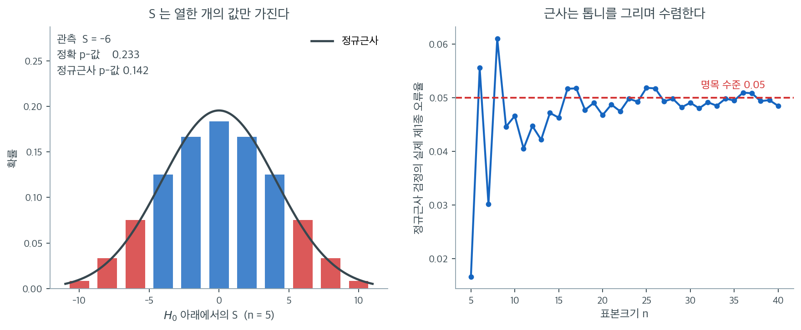

# Kendall의 타우 검정

Kendall의 타우는 일치쌍과 불일치쌍을 비교하여 단조 연관을 잰다. 관측된 $\tau$ 값이 통계적으로 유의한지 판정하려면 두 변수가 독립이라는 귀무가설을 검정한다. 이 절에서는 가설검정, 작은 표본과 큰 표본에서의 귀무분포, 그리고 그 구현을 다룬다.

---

## 1. 가설

표준 검정은

$$
H_0\!: \tau = 0 \quad \text{vs} \quad H_1\!: \tau \neq 0
$$

이며 $\tau$는 모집단 Kendall 타우 계수이다. $H_0$ 아래에서 두 변수는 독립이고, 한 변수에 대한 다른 변수의 모든 순서가 똑같이 그럴듯하다.

단조 추세의 방향을 미리 지정한 경우에는 단측 대립가설($H_1\!: \tau > 0$ 또는 $H_1\!: \tau < 0$)을 쓴다.

---

## 2. 검정통계량 S

검정은 Kendall의 $S$ 통계량에 기반한다:

$$
S = C - D
$$

여기서 $C$는 일치쌍의 수, $D$는 불일치쌍의 수이다. 타우-a와의 관계는

$$
\tau_a = \frac{S}{\binom{n}{2}}
$$

이다.

---

## 3. 작은 표본의 정확분포

$H_0$ 아래에서 $Y$ 순위의 $n!$개 순열이 모두 똑같이 그럴듯하다. $S$의 정확분포는 모든 순열을 열거하거나 재귀 알고리즘으로 계산할 수 있다.

작은 표본(보통 $n \le 10$)에서는 관측값만큼 큰 $|S|$를 주는 순열의 비율로 정확 p-값을 계산한다:

$$
p = P(|S| \ge |s_{\text{obs}}| \mid H_0)
$$

작은 $n$에 대한 $S$의 정확 임계값은 통계표로 제공된다.

---

## 4. 큰 표본의 정규근사

표본이 커지면 $H_0$ 아래에서 $S$가 근사적으로 정규를 따른다. $S$의 기댓값과 분산은

$$
\mathbb{E}[S] = 0
$$

$$
\text{Var}(S) = \frac{n(n-1)(2n+5)}{18}
$$

이다. 동점이 없으면 표준화된 검정통계량은

$$
Z = \frac{S}{\sqrt{\frac{n(n-1)(2n+5)}{18}}}
$$

이다. $H_0$ 아래에서 $n$이 크면(보통 $n \ge 10$이면 충분하다) $Z$는 근사적으로 표준정규분포를 따른다.

### 동점 보정

동점이 있으면 분산을 조정한다:

$$
\text{Var}(S) = \frac{n(n-1)(2n+5) - \sum_t t_x(t_x-1)(2t_x+5) - \sum_u t_y(t_y-1)(2t_y+5)}{18}
+ \frac{\sum_t t_x(t_x-1)(t_x-2) \cdot \sum_u t_y(t_y-1)(t_y-2)}{9n(n-1)(n-2)}
+ \frac{\sum_t t_x(t_x-1) \cdot \sum_u t_y(t_y-1)}{2n(n-1)}
$$

여기서 $t_x$는 $X$의 각 동점 묶음의 크기, $t_y$는 $Y$의 각 동점 묶음의 크기이다. 대부분의 소프트웨어가 자동으로 처리한다.

---

## 5. 판정 규칙

유의수준 $\alpha$의 양측검정에서:

- **작은 표본**: 정확 p-값이 $\alpha$보다 작으면 $H_0$을 기각한다.
- **큰 표본**: $|Z| > z_{\alpha/2}$이면 $H_0$을 기각한다.

---

<div class="exbox" markdown>

**보기 1.** <span class="diff easy" title="쉬움"></span> Kendall 타우의 검정. [Kendall의 타우](../correlation/kendall.md) 절에서 $n = 5$일 때 $S = C - D = 2 - 8 = -6$을 계산했던 다섯 관측값을 생각하자.

정규근사를 쓰면

</div>

??? success "풀이"
    $$
    \text{Var}(S) = \frac{5 \times 4 \times 15}{18} = \frac{300}{18} = 16.67
    $$

    $$
    Z = \frac{-6}{\sqrt{16.67}} = \frac{-6}{4.083} = -1.470
    $$

    이다. 양측 p-값은 $2 \times P(Z < -1.470) = 2 \times 0.071 = 0.142$이다. $\alpha = 0.05$에서 $H_0$을 기각하지 못한다. 단조 연관의 증거가 충분하지 않다.

    $n = 5$에서는 정확검정이 더 적절하다. (순열 열거로 얻은) 정확 양측 p-값은 약 $0.233$으로 같은 결론을 확인해 준다.



왼쪽은 보기 1의 상황을 그림으로 옮긴 것이다. $n = 5$이면 $5! = 120$개 순열이 만들어 내는 $S$ 값은 $-10, -8, \ldots, 8, 10$ 열한 개뿐이고, 검은 곡선이 이를 대신하려는 정규근사 $\mathcal{N}(0,\ 16.67)$이다. 관측값 $S = -6$만큼 극단적인 값, 곧 $|S| \ge 6$인 막대를 붉게 칠했다. 그 확률을 다 더하면 $0.233$이고, 같은 영역을 매끄러운 정규곡선으로 재면 $0.142$가 나온다. **차이가 $0.09$나 되는 이유는 근사가 나빠서가 아니라 잴 것이 애초에 막대인데 곡선으로 쟀기 때문이다.** 경계에 놓인 $S = \pm 6$ 막대 하나만 해도 확률 $0.075$씩을 차지한다. 아래 보기 2에서 `scipy`가 돌려주는 $p = 0.2333$과 손으로 계산한 정규근사의 $p = 0.1416$이 갈리는 것이 바로 이 차이다.

오른쪽은 이 어긋남이 표본크기에 따라 어떻게 줄어드는지 보여준다. 각 $n$에 대해 순열의 역위 수 분포로 $S$의 정확분포를 구한 뒤, $|Z| > 1.96$으로 기각하는 정규근사 검정이 $H_0$ 아래에서 실제로 몇 번 기각하는지 계산했다. $n = 5$에서는 $0.017$로 지나치게 보수적이고, $n = 6$에서 $0.056$, $n = 8$에서 $0.061$로 이번에는 명목 수준을 넘어선다. $n = 10$을 지나면 $0.047$ 근처로 내려오고 $n = 20$에서 $0.047$, $n = 30$에서 $0.049$로 자리를 잡는다.

곡선이 매끄럽게 수렴하지 않고 톱니를 그리는 것이 핵심이다. $n$이 하나 늘 때마다 기각역의 경계에 걸리는 막대가 들어왔다 나갔다 하기 때문이며, 이는 이산 검정통계량을 쓰는 모든 비모수 검정에 공통된 현상이다. 실무 지침도 여기서 나온다. **$n \le 10$이면 정확 p-값을 쓰고**, 그보다 크면 정규근사를 믿어도 좋다. `scipy.stats.kendalltau`는 동점이 없고 표본이 작으면 자동으로 정확분포를 쓴다.

---

## 6. Spearman 검정과의 검정력 비교

Kendall 검정과 Spearman 검정은 모두 단조 연관에 대한 비모수 검정이다. 상대적 검정력은 대립가설에 따라 달라진다:

- **이변량 정규** 자료에서 두 검정 모두 Pearson 검정에 대한 **점근상대효율**(ARE)이 약 $0.912$이고, 서로에 대한 ARE는 사실상 $1$이다. 즉 두 검정의 검정력이 거의 같다.

- **작은 표본**에서는 $\tau$의 분포가 $r_s$보다 규칙적이어서 Kendall 검정이 조금 더 잘 작동하는 경우가 있다.

- 실무에서는 가설검정의 결론에 관한 한 두 검정의 선택이 큰 차이를 만들지 않는다. Kendall의 타우는 확률적 해석($P(\text{일치}) - P(\text{불일치})$)이 더 명료해서 선호되기도 한다.

---

<div class="exbox" markdown>

**보기 2.** <span class="diff easy" title="쉬움"></span> $n = 5$ 에서 정확값과 근사가 갈린다. $x = (1,2,3,4,5)$, $y = (3,5,4,2,1)$ 이다. `scipy` 는 $p = 0.2333$ 을 주는데 정규근사로 손계산하면 $0.1416$ 이 나온다.

**(1)** $5! = 120$ 개 순열을 모두 세어 $H_0$ 아래 $S$ 의 정확분포를 적고, $P(\lvert S \rvert \ge 6)$ 을 **분수로** 구하시오. `scipy` 의 값과 맞는가.

**(2)** 어긋남의 $0.09$ 가운데 얼마가 **이산성** 때문인가. $S$ 가 띄엄띄엄한 격자 위에 있다는 사실을 연속성 보정으로 반영하면 근사가 얼마나 좋아지는가.

</div>

??? success "풀이"

    **(1) 정확분포는 손으로 셀 수 있다.** $x$ 가 이미 오름차순이므로 $S$ 는 $y$ 의 순열이 가진 **역위 수**(discordant pair 수) $D$ 만으로 정해진다. 쌍이 $\binom52 = 10$ 개이므로

    $$
    S = C - D = (10 - D) - D = 10 - 2D
    $$

    이고, $D$ 가 $0$ 부터 $10$ 까지 가므로 $S$ 는 $10, 8, \ldots, -10$ 의 **열한 값**만 갖는다. 각 $D$ 에 해당하는 순열의 수는 잘 알려진 마호니안 수열

    $$
    1,\; 4,\; 9,\; 15,\; 20,\; 22,\; 20,\; 15,\; 9,\; 4,\; 1
    \qquad (D = 0, 1, \ldots, 10)
    $$

    이고 합이 $120$ 이다. 관측값은 $S = -6$ 이므로 $\lvert S \rvert \ge 6$ 은 $D \le 2$ 또는 $D \ge 8$ 을 뜻한다. 양끝 세 개씩 더하면

    $$
    P(\lvert S \rvert \ge 6) = \frac{(1 + 4 + 9) + (9 + 4 + 1)}{120} = \frac{28}{120} = \frac{7}{30} = 0.2333\overline{3}
    $$

    이다. **`scipy` 의 $0.233333$ 과 자릿수 끝까지 같다.** 작은 표본에서 `kendalltau` 가 쓰는 것이 바로 이 열거이기 때문이다.

    **(2) 거의 전부가 이산성 탓이다.** $S$ 의 가능한 값이 $2$ 칸씩 떨어져 있으므로 연속분포로 바꿔 재려면 경계를 **반 칸, 곧 $1$ 만큼** 안쪽으로 당겨야 한다. $\operatorname{Var}(S) = \frac{5 \times 4 \times 15}{18} = \frac{300}{18} = 16.6667$, $\operatorname{sd}(S) = 4.0825$ 이므로

    $$
    Z_{\text{보정}} = \frac{\lvert S \rvert - 1}{\operatorname{sd}(S)} = \frac{5}{4.0825} = 1.2247,
    \qquad
    p = 2\,\Phi(-1.2247) = 0.2207
    $$

    이다.

    | 방법 | $Z$ | $p$ | 정확값과의 차 |
    |---|---|---|---|
    | 보정 없는 정규근사 | $1.4697$ | $0.1416$ | $0.0917$ |
    | **연속성 보정** | $1.2247$ | $\mathbf{0.2207}$ | $\mathbf{0.0127}$ |
    | 정확 열거 | — | $0.2333$ | $0$ |

    **오차가 $0.0917$ 에서 $0.0127$ 로, 일곱 배 넘게 줄어든다.** 곧 어긋남의 $86\%$ 가 "막대를 곡선으로 쟀다"는 한 가지 이유에서 왔다. 남은 $0.0127$ 이 $n = 5$ 에서 $S$ 의 분포가 정규와 다른 몫이다.

    경계 막대 하나의 무게를 보면 더 분명하다. $S = \pm 6$ 인 순열이 각각 $9$ 개, 곧 확률 $0.075$ 씩이다. 두 개를 합치면 $0.15$ 로 **p-값 $0.233$ 의 절반을 넘는다.** 이렇게 굵은 막대를 매끄러운 곡선이 제대로 잡을 수 없다.

    ```python
    import numpy as np
    from scipy import stats
    from itertools import permutations
    from collections import Counter
    from fractions import Fraction

    x = np.array([1, 2, 3, 4, 5])
    y = np.array([3, 5, 4, 2, 1])

    # 귀무가설은 "두 변수가 독립"이다. 표본이 작으면 scipy 가 정확분포를 쓴다.
    tau, p_value = stats.kendalltau(x, y)
    print(f"Kendall tau = {tau:.4f}")
    print(f"p-value     = {p_value:.4f}")

    # 정의대로 손으로 구해 확인한다. 모든 쌍을 돌며 같은 방향이면 +1,
    # 반대 방향이면 -1 을 더한다. 그 합이 S 다.
    n = len(x)
    S = 0
    for i in range(n):
        for j in range(i + 1, n):
            S += np.sign(x[j] - x[i]) * np.sign(y[j] - y[i])

    # 귀무가설 아래에서 S 의 분산은 이 공식으로 주어진다. 표본이 크면
    # S 가 정규에 가까워지므로 z 검정을 쓸 수 있다.
    var_S = n * (n - 1) * (2 * n + 5) / 18
    Z = S / np.sqrt(var_S)
    p_manual = 2 * (1 - stats.norm.cdf(abs(Z)))
    print(f"S = {S}, Z = {Z:.4f}, Manual p = {p_manual:.4f}")

    # (1) 5! = 120 개 순열을 모두 세어 S 의 정확 귀무분포를 만든다.
    def s_of(perm):
        m = len(perm)
        return sum(np.sign(j - i) * np.sign(perm[j] - perm[i])
                   for i in range(m) for j in range(i + 1, m))

    dist = Counter(s_of(p) for p in permutations(range(1, n + 1)))
    print(f"\n{n}! = {sum(dist.values())} 개 순열이 주는 S 의 분포")
    print(f"{'S':>5s} {'개수':>5s} {'확률':>9s}")
    for s in sorted(dist):
        print(f"{s:5d} {dist[s]:5d} {dist[s] / 120:9.5f}")
    hit = sum(c for s, c in dist.items() if abs(s) >= abs(S))
    print(f"\n|S| >= {abs(S)} 인 순열 = {hit} / 120 = {Fraction(hit, 120)} = {hit / 120:.6f}")
    print(f"scipy 의 p-값              = {p_value:.6f}")
    print(f"둘이 같은가: {abs(hit / 120 - p_value) < 1e-12}")

    # (2) 연속성 보정. S 가 2 칸씩 띄엄띄엄하므로 보정폭은 그 절반인 1 이다.
    Zc = (abs(S) - 1) / np.sqrt(var_S)
    print(f"\nVar(S) = {n}*{n-1}*{2*n+5}/18 = {var_S:.4f},  sd = {np.sqrt(var_S):.4f}")
    print(f"보정 없음 : Z = {abs(Z):.4f}  p = {2 * stats.norm.sf(abs(Z)):.4f}  "
          f"(정확값과 차 {abs(2 * stats.norm.sf(abs(Z)) - hit / 120):.4f})")
    print(f"연속성 보정: Z = {Zc:.4f}  p = {2 * stats.norm.sf(Zc):.4f}  "
          f"(정확값과 차 {abs(2 * stats.norm.sf(Zc) - hit / 120):.4f})")
    print(f"정확값     : p = {hit / 120:.4f}")
    ```

    출력:

    ```
    Kendall tau = -0.6000
    p-value     = 0.2333
    S = -6, Z = -1.4697, Manual p = 0.1416

    5! = 120 개 순열이 주는 S 의 분포
        S    개수        확률
      -10     1   0.00833
       -8     4   0.03333
       -6     9   0.07500
       -4    15   0.12500
       -2    20   0.16667
        0    22   0.18333
        2    20   0.16667
        4    15   0.12500
        6     9   0.07500
        8     4   0.03333
       10     1   0.00833

    |S| >= 6 인 순열 = 28 / 120 = 7/30 = 0.233333
    scipy 의 p-값              = 0.233333
    둘이 같은가: True

    Var(S) = 5*4*15/18 = 16.6667,  sd = 4.0825
    보정 없음 : Z = 1.4697  p = 0.1416  (정확값과 차 0.0917)
    연속성 보정: Z = 1.2247  p = 0.2207  (정확값과 차 0.0127)
    정확값     : p = 0.2333
    ```

    열거한 개수 $1, 4, 9, 15, 20, 22, 20, 15, 9, 4, 1$ 이 손으로 적은 마호니안 수열과 같고, $28/120 = 7/30$ 이 `scipy` 의 p-값과 같다. 연속성 보정값 $0.2207$ 도 맞는다.

    **읽는 법.** $p = 0.233$ 이든 $0.142$ 든 $\alpha = 0.05$ 에서는 기각하지 못하므로 이 자료의 결론은 바뀌지 않는다. 그러나 **보정 없는 정규근사가 p-값을 절반 가까이 깎아 내린다**는 사실 자체가 경고다. $n$ 이 작을 때 그 방향은 늘 같아서, 보정하지 않으면 **없는 연관을 있다고 말하기 쉬워진다.** `scipy.stats.kendalltau` 는 동점이 없고 표본이 작으면 알아서 정확분포를 쓰므로 이 함정을 피해 준다. 직접 $Z$ 를 계산할 때만 조심하면 된다.

---

## 연습문제

<div class="drillbox" markdown>

**연습문제 1.** <span class="diff easy" title="쉬움"></span>
$n = 8$인 관측값에서 Kendall의 $\tau = 0.43$일 때 정규근사로 $\alpha = 0.05$에서 $H_0: \tau = 0$을 검정하라.

</div>

??? success "풀이"
    $H_0$ 아래에서 표준오차는

    $$
    \text{SE}(\tau) = \sqrt{\frac{2(2n+5)}{9n(n-1)}} = \sqrt{\frac{2(21)}{9 \times 8 \times 7}} = \sqrt{\frac{42}{504}} = \sqrt{0.08333} = 0.2887
    $$

    이다. 검정통계량은

    $$
    Z = \frac{\tau}{\text{SE}(\tau)} = \frac{0.43}{0.2887} = 1.489
    $$

    이다. $\alpha = 0.05$ 양측검정의 임계값은 1.96이다. $|Z| = 1.49 < 1.96$이므로 $H_0$을 기각하지 못한다. 단조 연관의 증거가 충분하지 않다.

    참고: $n = 8$에서는 정규근사가 거칠 수 있다. 정확 순열검정이 더 믿을 만하다.

---

<div class="drillbox" markdown>

**연습문제 2.** <span class="diff med" title="중간"></span>
$H_0$ 아래에서 Kendall $\tau$의 정확분포가 왜 분포에 의존하지 않는지 설명하고 어떻게 계산할 수 있는지 기술하라.

</div>

??? success "풀이"
    $H_0: \tau = 0$($X$와 $Y$의 독립) 아래에서 $Y$ 순위는 $X$나 $Y$의 분포와 무관하게 $(1, 2, \dots, n)$의 어떤 순열이든 똑같이 그럴듯하다. 따라서 일치쌍의 수 $C$(따라서 $\tau$)의 분포는 바탕 분포가 아니라 $n$에만 의존한다.

    정확분포는 $Y$ 순위의 $n!$개 순열을 모두 열거하여 각각의 $\tau$를 계산해 얻는다. $n$이 작으면 실행 가능하며 통계 소프트웨어에 구현되어 있다. $n$이 크면 $H_0$ 아래 분산 공식이 $n$만 포함하는 정규근사 $Z = \tau/\text{SE}(\tau)$를 쓴다.

---

<div class="drillbox" markdown>

**연습문제 3.** <span class="diff med" title="중간"></span>
단조 연관 탐지에서 Kendall $\tau$ 검정과 Spearman $\rho$ 검정의 검정력을 비교하라. 대체로 어느 쪽이 더 강력한가?

</div>

??? success "풀이"
    두 검정의 검정력은 대체로 거의 같다. 이변량 정규 자료에서 서로에 대한 점근상대효율이 사실상 1이므로 어느 한쪽이 체계적으로 더 강력하다고 말하기 어렵다. 표본이 작거나 특정한 대립가설에서는 차이가 조금 생길 수 있다.

    다만 Kendall의 $\tau$는 다른 면에서 이점이 있다. 분산 공식이 단순하고, 확률적 해석이 명료하며, 동점을 다룰 때 성능이 더 낫다.

    둘 중 무엇을 고를지는 검정력보다 분야의 관행이나 원하는 성질에 따라 정해지는 경우가 많다.

---

<div class="drillbox" markdown>

**연습문제 4.** <span class="diff med" title="중간"></span>
어떤 연구자가 $n = 200$에서 Kendall의 $\tau = -0.12$와 $p = 0.03$을 얻었다. 통계적 유의성과 실질적 유의성의 관점에서 이 결과를 해석하라.

</div>

??? success "풀이"
    **통계적 유의성:** $p = 0.03 < 0.05$이므로 $H_0: \tau = 0$을 기각한다. 음의 단조 연관에 대한 통계적으로 유의한 증거가 있다.

    **실질적 유의성:** $\tau = -0.12$는 약한 연관이다. 확률적 해석으로 보면, 무작위로 고른 관측값 쌍에서 불일치 확률이 일치 확률보다 $0.12$만큼 높을 뿐이다(즉 $P(\text{일치}) - P(\text{불일치}) = -0.12$). $n = 200$이 높은 검정력을 주기 때문에 탐지된 것이다.

    Pearson의 $r$과 마찬가지로 표본이 크면 사소한 연관도 탐지된다. 연구자는 p-값과 함께 효과크기($\tau = -0.12$)를 보고하고 그 크기가 응용 맥락에서 의미가 있는지 논해야 한다.

---

<div class="drillbox" markdown>

**연습문제 5.** <span class="diff med" title="중간"></span>
**동점이 있으면 $\tau$의 정의가 갈린다.** $\tau_a$와 $\tau_b$의 차이를 설명하고, 동점이 있는 자료에서 두 값을 직접 계산해 비교하라.

</div>

??? success "풀이"
    **$\tau_a$는 전체 쌍의 수로 나눈다.**

    $$
    \tau_a = \frac{C-D}{\binom n2}
    $$

    동점 쌍은 $C$에도 $D$에도 들어가지 않으면서 분모에는 남으므로, 동점이 많으면 $|\tau_a|$가 구조적으로 작아진다. **$\pm1$에 도달할 수 없다.**

    **$\tau_b$는 동점을 분모에서 제외한다.**

    $$
    \tau_b = \frac{C-D}{\sqrt{(n_0-n_x)(n_0-n_y)}},
    \qquad n_0 = \binom n2
    $$

    여기서 $n_x$, $n_y$는 각 변수에서 동점인 쌍의 수다.

    ```python
    import numpy as np
    from scipy import stats

    x = np.array([1, 2, 2, 3, 4, 4, 4, 5])
    y = np.array([2, 1, 3, 3, 5, 4, 6, 5])
    n = len(x)
    conc = disc = 0
    for i in range(n):
        for j in range(i+1, n):
            s = np.sign(x[i]-x[j]) * np.sign(y[i]-y[j])
            if s > 0: conc += 1
            elif s < 0: disc += 1
    print(f"  일치쌍 {conc}, 불일치쌍 {disc}, 전체쌍 {n*(n-1)//2}")
    print(f"  tau-a = {(conc-disc)/(n*(n-1)/2):.4f}")
    print(f"  tau-b = {stats.kendalltau(x, y).statistic:.4f}")
    ```

    출력:

    ```
      일치쌍 20, 불일치쌍 2, 전체쌍 28
      tau-a = 0.6429
      tau-b = 0.7206
    ```

    **$\tau_a$가 $\tau_b$보다 작다.** 동점 쌍 $6$개가 $\tau_a$의 분모에는 남아 있지만 $\tau_b$에서는 빠지기 때문이다.

    **`scipy.stats.kendalltau`의 기본값은 $\tau_b$다.** 동점이 있는 자료에 $\tau_a$를 쓰면 연관이 과소평가되므로 대부분의 소프트웨어가 $\tau_b$를 쓴다.

    **언제 문제가 되는가.**

    | 자료 | 동점 | 권장 |
    |---|---|---|
    | 연속형 측정값 | 거의 없음 | 아무거나(값이 같다) |
    | 리커트 척도(1~5) | **매우 많음** | $\tau_b$ |
    | 순서형 범주 | 많음 | $\tau_b$ 또는 $\tau_c$ |

    **$\tau_c$도 있다.** 행과 열의 범주 수가 다른 분할표용이며, $\tau_b$조차 $\pm1$에 도달할 수 없는 경우를 보정한다. 순서형 범주형 자료를 다룰 때 마주치게 된다.

    **검정에도 영향이 있다.** 동점이 있으면 $\tau$의 귀무분포가 달라지므로 `scipy`는 동점이 있을 때 자동으로 보정된 분산을 쓴다. 동점이 매우 많으면 정규근사 자체가 부정확해지므로 순열검정이 안전하다.

---

<div class="drillbox" markdown>

**연습문제 6.** <span class="diff med" title="중간"></span>
켄달 $\tau$는 **일치확률**로 직접 읽을 수 있다. $\tau = 2P(\text{일치}) - 1$임을 보이고, $\tau = 0.43$이 실무적으로 무엇을 뜻하는지 말하라. 이것이 $\tau$의 해석적 장점인 이유는?

</div>

??? success "풀이"
    **동점이 없으면 모든 쌍이 일치 아니면 불일치다.** 따라서 $P(\text{일치}) + P(\text{불일치}) = 1$이고

    $$
    \tau = P(\text{일치}) - P(\text{불일치}) = 2P(\text{일치}) - 1
    $$

    이다. 뒤집으면

    $$
    P(\text{일치}) = \frac{1+\tau}{2}
    $$

    이다. $\square$

    | $\tau$ | $P(\text{일치})$ |
    |---:|---:|
    | $0.20$ | $0.600$ |
    | $0.43$ | $0.715$ |
    | $0.60$ | $0.800$ |

    **$\tau = 0.43$은 "무작위로 고른 두 관측에서 순서가 일치할 확률이 $71.5\%$"라는 뜻이다.** 동전 던지기($50\%$)보다 $21.5$%포인트 높다.

    **이것이 피어슨 $r$에 없는 장점이다.** $r = 0.43$은 "설명된 분산이 $r^2 = 18\%$"라고는 말할 수 있지만 그마저 선형모형을 전제한다. $\tau$는 **모형 없이** 확률로 직접 읽힌다.

    **그래서 $\tau$가 $r$보다 작게 나오는 것이 자연스럽다.** 같은 자료에서 보통 $|\tau| < |r_s| < |r|$인데, 이것은 $\tau$가 "덜 민감해서"가 아니라 **다른 척도이기 때문**이다. $\tau = 0.43$을 보고 "약한 상관"이라 하면 오독이다.

    **의학·심리 문헌에서 $\tau$가 선호되는 이유**가 이 해석 가능성이다. "두 환자를 비교했을 때 예측 순서가 맞을 확률"이 곧 $\tau$이며, 21장 생존분석의 C-통계량(일치도 지수)이 정확히 같은 발상이다.

---

<div class="drillbox" markdown>

**연습문제 7.** <span class="diff med" title="중간"></span>
$\tau$에 대한 **신뢰구간**은 어떻게 만드는가? 정규근사의 분산이 $H_0$ 아래에서만 타당한 이유를 설명하고, 일반적인 경우의 대안을 제시하라.

</div>

??? success "풀이"
    **$H_0: \tau = 0$ 아래의 분산은 특수하다.**

    $$
    \operatorname{Var}_0(\hat\tau) = \frac{2(2n+5)}{9n(n-1)}
    $$

    이 식은 **모든 순열이 동등하다**는 가정에서 나온 것이라, $\tau \ne 0$이면 맞지 않는다. 검정에는 쓸 수 있지만 **구간에는 쓸 수 없다.**

    **일반적인 분산은 자료에 의존한다.** $\hat\tau$는 U-통계량이므로

    $$
    \operatorname{Var}(\hat\tau) \approx \frac{4}{n}\left(\zeta_1 - \tau^2\right)\cdot\frac{(n-1)}{n}\cdots
    $$

    형태이고 $\zeta_1$을 자료에서 추정해야 한다. 손으로 다루기 번거롭다.

    **실무적 대안 셋.**

    | 방법 | 내용 |
    |---|---|
    | **부트스트랩** | 관측 쌍 $(x_i,y_i)$를 재표본해 $\hat\tau$의 분포를 만든다 |
    | **자크나이프** | U-통계량이라 자크나이프 분산 추정이 잘 듣는다 |
    | 정규근사 + 추정분산 | $\zeta_1$을 추정해 넣는다(소프트웨어가 제공) |

    **부트스트랩이 가장 간단하다.**

    ```python
    import numpy as np
    from scipy import stats

    rng = np.random.default_rng(1)
    n = 60
    X = rng.multivariate_normal([0,0], [[1,0.5],[0.5,1]], n)
    t_hat = stats.kendalltau(X[:,0], X[:,1]).statistic

    bs = []
    for _ in range(4000):
        idx = rng.integers(0, n, n)
        bs.append(stats.kendalltau(X[idx,0], X[idx,1]).statistic)
    lo, hi = np.percentile(bs, [2.5, 97.5])
    print(f"  tau_hat = {t_hat:.4f}")
    print(f"  부트스트랩 95% CI = [{lo:.4f}, {hi:.4f}]")
    print(f"  참 tau = (2/pi)asin(0.5) = {2/np.pi*np.arcsin(0.5):.4f}")
    ```

    **관측 쌍을 통째로 재표본한다는 점이 중요하다.** $x$와 $y$를 따로 재표본하면 의존구조가 깨져 $\tau = 0$인 분포를 만들게 된다. **쌍을 유지해야 관심 있는 모수의 분포가 나온다.**

    **검정과 구간이 다른 도구를 쓴다는 점을 기억하라.** $H_0$ 검정에는 순열 또는 위의 간단한 분산식을, 구간에는 부트스트랩을 쓴다. 5.6절 윌슨 구간에서 본 "검정은 $p_0$에서, 구간은 뒤집어서"라는 구도와 같은 이야기다.

---

<div class="drillbox" markdown>

**연습문제 8.** <span class="diff med" title="중간"></span>
$\tau$, $\rho_s$, $r$ 가운데 **무엇을 언제 쓸지** 정리하라. 보고할 때 함께 적어야 할 것도 밝혀라.

</div>

??? success "풀이"
    **선택 기준표.**

    | 상황 | 권장 | 이유 |
    |---|---|---|
    | 이변량 정규에 가깝고 관계가 선형 | **피어슨 $r$** | 가장 효율적 |
    | 단조이지만 비선형 | $\rho_s$ 또는 $\tau$ | 순위만 쓴다 |
    | 이상치가 있다 | $\rho_s$ 또는 $\tau$ | 부호까지 뒤집히는 사고 방지 |
    | 순서형 범주(동점 많음) | **$\tau_b$** | 동점 보정 |
    | 표본이 아주 작다($n<10$) | $\tau$ + 정확검정 | 정확분포 계산이 쉽다 |
    | 해석을 확률로 하고 싶다 | **$\tau$** | $P(\text{일치})=(1+\tau)/2$ |
    | 코퓰라·강건 상관행렬 | **$\tau$** | 주변분포 불변 |

    **$\rho_s$와 $\tau$ 중에서는.**

    - **$\rho_s$**가 값이 크게 나와 "익숙한" 크기로 읽힌다. 피어슨과 직접 견주기 쉽다.
    - **$\tau$**는 해석이 명확하고 작은 표본에서 정확분포를 다루기 쉬우며, 이상치에 조금 더 강건하다.

    실무에서는 $\rho_s$가 더 널리 쓰이지만, **둘의 결론이 갈리는 일은 거의 없다.** 검정력도 앞에서 본 대로 비슷하다.

    **보고 지침.**

    ```text
    - 어떤 측도를 썼는지 이름을 명시한다 (Spearman? Kendall tau-b?)
    - n 과 함께 보고한다
    - p값만이 아니라 구간 또는 효과크기를 함께
    - 산점도를 함께 싣는다 (또는 최소한 보았다고 밝힌다)
    - 피어슨과 순위 측도가 크게 다르면 그 사실을 보고한다
    ```

    **마지막 줄이 가장 중요하다.** 피어슨 $-0.67$과 스피어만 $+0.21$처럼 부호가 다르면(스피어만 문서 연습문제 5) 어느 하나를 고르는 것이 아니라 **왜 다른지를 조사해야 한다.** 대개 이상치나 비선형성이 원인이고, 그것 자체가 자료에 대한 중요한 발견이다. $\square$

---

<div class="drillbox" markdown>

**연습문제 9.** <span class="diff hard" title="어려움"></span>
연습문제 2는 $\tau$의 정확분포가 분포에 의존하지 않는다고 했다. 작은 $n$에서 **정확 $p$값과 정규근사**가 얼마나 다른지 직접 계산해 비교하라.

</div>

??? success "풀이"
    **정확분포는 모든 순열을 훑어 구한다.** $H_0$ 아래에서 $y$의 순위가 $x$의 순위와 무관하므로, $n!$개 순열 각각의 $\tau$를 세면 정확한 귀무분포가 나온다.

    ```python
    import numpy as np
    from itertools import permutations
    from scipy import stats

    t0 = 0.5
    print(f"{'n':>4}{'정확 p':>12}{'정규근사 p':>14}")
    for n in (5, 8):
        base = np.arange(n)
        cnt = tot = 0
        for perm in permutations(base):
            tt = stats.kendalltau(base, perm).statistic
            tot += 1
            cnt += abs(tt) >= t0 - 1e-12
        var = 2*(2*n + 5) / (9*n*(n - 1))
        approx = 2 * stats.norm.sf(abs(t0) / np.sqrt(var))
        print(f"{n:>4}{cnt/tot:>12.4f}{approx:>14.4f}")
    for n in (12, 20):
        var = 2*(2*n + 5) / (9*n*(n - 1))
        approx = 2 * stats.norm.sf(abs(t0) / np.sqrt(var))
        print(f"{n:>4}{'--':>12}{approx:>14.4f}")
    ```

    출력:

    ```
       n        정확 p        정규근사 p
       5      0.2333        0.2207
       8      0.1087        0.0833
      12          --        0.0236
      20          --        0.0021
    ```

    **정규근사가 $p$값을 작게 준다.** $n=8$에서 정확 $0.1087$인데 근사는 $0.0833$이다. $\alpha=0.10$ 기준으로 판정이 갈린다.

    **방향이 위험한 쪽이다.** 근사가 $p$값을 과소평가하므로 **제1종 오류가 부풀어 오른다.** 작은 표본에서 근사를 믿으면 없는 연관을 있다고 주장하게 된다.

    **이유는 이산성과 꼬리 모양이다.** $\tau$가 취할 수 있는 값이 $n=8$에서 $29$개뿐이라 분포가 성기고, 정규분포보다 꼬리가 얇다. 정규근사는 그 꼬리를 실제보다 두껍게 잡는다.

    **어느 $n$부터 근사를 믿을 수 있는가.** 관례적으로 $n \ge 10$이면 쓸 만하고 $n \ge 20$이면 충분하다고 본다. 그러나 **동점이 많으면 이 기준이 올라간다.**

    **실무 권고.** `scipy.stats.kendalltau`는 동점이 없고 $n \le 다소 작은$ 경우 자동으로 정확 계산을 시도한다(`method='auto'`). 작은 표본에서는 `method='exact'`를 명시하거나 순열검정을 쓰는 것이 안전하다. 계산 비용이 문제라면 $n!$을 다 훑는 대신 몬테카를로 순열로 근사한다.

---

<div class="drillbox" markdown>

**연습문제 10.** <span class="diff hard" title="어려움"></span>
두 변수가 **이변량 정규**를 따르면 $\tau$와 $\rho$ 사이에 정확한 관계가 있다.

$$
\tau = \frac{2}{\pi}\arcsin\rho,
\qquad
\rho_s = \frac{6}{\pi}\arcsin\frac{\rho}{2}
$$

수치로 확인하고, 이 관계가 무엇에 쓰이는지 말하라.

</div>

??? success "풀이"
    ```python
    import numpy as np
    from scipy import stats

    rng = np.random.default_rng(0)
    print(f"{'rho':>6}{'tau 모의':>11}{'(2/pi)asin(rho)':>17}"
          f"{'r_s 모의':>11}{'(6/pi)asin(rho/2)':>19}")
    for rho in (0.2, 0.5, 0.8, 0.95):
        X = rng.multivariate_normal([0,0], [[1,rho],[rho,1]], size=(300, 200))
        tt = np.mean([stats.kendalltau(X[i,:,0], X[i,:,1]).statistic
                      for i in range(300)])
        ss = np.mean([stats.spearmanr(X[i,:,0], X[i,:,1]).statistic
                      for i in range(300)])
        print(f"{rho:>6.2f}{tt:>11.4f}{2/np.pi*np.arcsin(rho):>17.4f}"
              f"{ss:>11.4f}{6/np.pi*np.arcsin(rho/2):>19.4f}")
    ```

    출력:

    ```
       rho    tau 모의  (2/pi)asin(rho)    r_s 모의  (6/pi)asin(rho/2)
      0.20     0.1287           0.1282     0.1908             0.1913
      0.50     0.3355           0.3333     0.4829             0.4826
      0.80     0.5897           0.5903     0.7823             0.7859
      0.95     0.7976           0.7978     0.9431             0.9453
    ```

    **소수 셋째 자리까지 맞는다.**

    **$\tau$가 $\rho$보다 작고 $\rho_s$가 그 사이에 있다.** $\rho = 0.5$에서 $\tau = 0.333$, $\rho_s = 0.483$이다. 세 측도가 **같은 자료를 다른 눈금으로 재는** 것임이 분명해진다.

    **어디에 쓰이는가.**

    - **측도 사이의 환산.** 어떤 논문이 $\tau$를 보고하고 다른 논문이 $r$을 보고할 때, 정규성을 가정하면 서로 옮길 수 있다. 메타분석에서 필요하다.
    - **코퓰라 모형화.** $\tau$는 **주변분포에 영향받지 않고 의존구조(코퓰라)에만 의존한다.** 그래서 코퓰라의 모수를 $\tau$로부터 역산하는 것이 표준 절차다. 가우스 코퓰라라면 위 식을 뒤집어 $\rho = \sin(\pi\tau/2)$를 얻는다.
    - **강건한 상관행렬 추정.** $\tau$를 계산한 뒤 $\sin(\pi\tau/2)$로 변환하면 이상치에 강건한 $\rho$ 추정값이 된다. 고차원 금융자료에서 쓰이는 기법이다.

    **주의: 이 관계는 정규(또는 타원형) 분포에서만 성립한다.** 분포가 다르면 $\tau$와 $\rho$의 관계도 달라진다. 그래서 환산은 **가정을 하나 더 들여오는 일**임을 기억해야 한다.

---

## 정리하며

Kendall의 $\tau$에 대한 가설검정은 관측된 일치쌍 수에서 불일치쌍 수를 뺀 값이 0과 유의하게 다른지 판정한다. 작은 표본에서는 정확 순열분포를 쓰고, 표본이 크면 $\text{Var}(S) = n(n-1)(2n+5)/18$에 기반한 정규근사를 쓴다. 분포에 의존하지 않으며 Spearman 검정과 검정력이 비슷하다. 표본이 작거나 $\tau$의 확률적 해석이 중요할 때 Kendall 검정이 선호된다.
