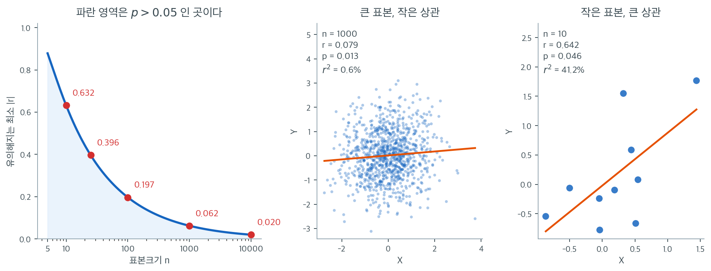

# Pearson의 r 검정 (상관에 대한 t-검정)

표본상관 $r$을 계산하면 관측된 선형 연관의 강도를 알 수 있지만, 그 값이 통계적으로 유의한지도 판정해야 한다. 즉 모상관이 0이라는 귀무가설에 반하는 증거를 주는지 확인해야 한다. Pearson 상관에 대한 표준 검정은 t-통계량을 쓰며 응용통계에서 가장 자주 수행되는 가설검정 중 하나이다.

---

## 가설

가장 흔한 검정은

$$
H_0\!: \rho = 0 \quad \text{vs} \quad H_1\!: \rho \neq 0
$$

이며 $\rho$는 모집단 Pearson 상관계수이다. 연관의 방향을 미리 예측한 경우에는 단측 대립가설 $H_1\!: \rho > 0$이나 $H_1\!: \rho < 0$도 쓴다.

---

## 검정통계량

$H_0\!: \rho = 0$이고 $(X, Y)$가 이변량 정규분포를 따른다는 가정 아래에서, 통계량

$$
t = \frac{r\sqrt{n-2}}{\sqrt{1 - r^2}}
$$

은 자유도 $n - 2$인 **스튜던트 t-분포**를 따른다. 여기서 $r$은 표본 Pearson 상관, $n$은 표본크기이다.

### 유도 개요

표본상관 $r$은 $Y$를 $X$에 표준화하여 회귀했을 때의 기울기로 쓸 수 있다. $H_0$ 아래에서 참 기울기가 0이므로 통상적인 회귀 t-검정이 적용된다. 모수 두 개(절편과 기울기)를 추정하므로 자유도가 $n - 2$이다.

---

## 판정 규칙

유의수준 $\alpha$의 양측검정에서:

- $|t| > t_{\alpha/2, \, n-2}$이면 $H_0$을 기각한다
- 동등하게 p-값이 $\alpha$보다 작으면 기각한다

p-값은

$$
p = 2 \cdot P(T_{n-2} > |t|)
$$

이며 $T_{n-2}$는 자유도 $n-2$인 $t$-분포 확률변수이다.

단측검정에서는:

- $H_1\!: \rho > 0$: $t > t_{\alpha, \, n-2}$이면 기각
- $H_1\!: \rho < 0$: $t < -t_{\alpha, \, n-2}$이면 기각

---

<div class="exbox" markdown>

**보기 1.** <span class="diff easy" title="쉬움"></span> 공부 시간과 시험 점수. 어떤 연구자가 학생 $n = 25$명의 자료를 모아 공부 시간과 시험 점수 사이에 표본상관 $r = 0.45$를 얻었다.

</div>

??? success "풀이"
    $$
    t = \frac{0.45\sqrt{25 - 2}}{\sqrt{1 - 0.45^2}} = \frac{0.45 \times 4.796}{\sqrt{0.7975}} = \frac{2.158}{0.8931} = 2.417
    $$

    자유도 $n - 2 = 23$에서 $\alpha = 0.05$ 양측검정의 임계값은 $t_{0.025, 23} = 2.069$이다. $|t| = 2.417 > 2.069$이므로 $H_0$을 기각하고 공부 시간과 시험 점수 사이에 통계적으로 유의한 양의 선형 상관이 있다고 결론짓는다.

## 모상관에 대한 신뢰구간

$\rho$에 대한 신뢰구간을 만들 때에는 (특히 $\rho$가 0에서 멀 때) $r$의 표본분포가 치우쳐 있으므로 **Fisher의 z 변환**을 쓴다:

1. 변환: $z = \text{arctanh}(r) = \frac{1}{2}\ln\!\left(\frac{1+r}{1-r}\right)$

2. $z$의 근사 표준오차는 $\text{SE}_z = \frac{1}{\sqrt{n-3}}$

3. 변환된 모수에 대한 신뢰구간을 만든다:

    $$
    z \pm z_{\alpha/2} \cdot \frac{1}{\sqrt{n-3}}
    $$

4. 각 끝점을 $\tanh$로 역변환하여 $\rho$에 대한 신뢰구간을 얻는다.

### 보기 (계속)

$r = 0.45$, $n = 25$일 때:

$$
z = \text{arctanh}(0.45) = 0.4847
$$

$$
\text{SE}_z = \frac{1}{\sqrt{22}} = 0.2132
$$

$\zeta = \text{arctanh}(\rho)$에 대한 95% 신뢰구간:

$$
0.4847 \pm 1.96 \times 0.2132 = (0.0668, \; 0.9026)
$$

역변환하면 $(\tanh(0.0668), \; \tanh(0.9026)) = (0.067, \; 0.717)$이다.

$\rho$에 대한 95% 신뢰구간은 약 $(0.07, 0.72)$이다.

---

## 0이 아닌 값에 대한 검정

$\rho_0 \neq 0$인 $H_0\!: \rho = \rho_0$을 검정할 때에는 위 t-검정을 쓸 수 없다(그 귀무분포가 $\rho = 0$에 의존한다). 대신 Fisher z 변환을 쓴다:

$$
Z = \frac{\text{arctanh}(r) - \text{arctanh}(\rho_0)}{1/\sqrt{n-3}}
$$

$H_0$ 아래에서 $Z$는 근사적으로 표준정규분포를 따른다.

---

## 가정

상관에 대한 t-검정은 다음을 요구한다:

1. **이변량 정규성**: $X$와 $Y$가 모두 정규분포를 따른다(적어도 $Y \mid X$의 조건부 분포가 분산이 일정한 정규여야 한다).
2. **무작위 표집**: 관측값들이 독립이다.
3. **선형성**: $X$와 $Y$의 관계가 선형이다.

!!! warning "표본이 크다고 비선형성이 해결되지는 않는다"
    $n$이 크면 아주 작은 $r$도 통계적으로 유의해진다. 유의한 p-값은 $\rho \neq 0$임을 알려줄 뿐 그 상관의 실질적 중요성에 대해서는 아무 말도 하지 않는다. p-값과 함께 항상 $r$을 보고하고 해석하라.

정규성이 어긋나면 순열검정이나 붓스트랩 방법이 비모수적 대안이 된다.



왼쪽 곡선은 $|t| > t_{0.025,\,n-2}$를 $r$에 대해 풀어 얻은 것이다. $t = r\sqrt{n-2}/\sqrt{1-r^2}$를 뒤집으면

$$
|r| > \frac{t_{0.025,\,n-2}}{\sqrt{t_{0.025,\,n-2}^2 + n - 2}}
$$

이며, 이 값이 표본크기가 커질수록 빠르게 0으로 내려간다. $n = 10$이면 $|r| > 0.632$라야 유의하지만, $n = 25$에서는 $0.396$, $n = 100$에서는 $0.197$, $n = 1000$에서는 $0.062$, $n = 10000$에서는 $0.020$이면 충분하다. 파란 영역 안에 떨어진 상관은 기각되지 않는다.

가운데와 오른쪽이 이 곡선의 두 끝에서 실제 자료가 어떻게 생겼는지 보여준다. 가운데는 $n = 1000$에 $r = 0.079$, $p = 0.013$이다. 통상적인 기준으로 "유의한" 결과이고 논문에 별표가 붙는다. 그런데 $r^2 = 0.6\%$로 $Y$의 변동 중 $X$가 설명하는 몫은 200분의 1을 겨우 넘는다. 점구름은 아무리 보아도 둥글고 회귀직선은 거의 평평하다. 오른쪽은 $n = 10$에 $r = 0.642$, $p = 0.046$이다. 똑같이 "유의"하지만 $r^2 = 41.2\%$로 설명력이 70배 가까이 크다.

**두 결과가 보고서에 나란히 "$p < 0.05$"로 적히면 구별되지 않는다.** $p$-값은 "$\rho$가 0이 아니다"라는 방향의 진술일 뿐, 그 크기에 대해서는 한 마디도 하지 않기 때문이다. 크기를 말하는 숫자는 $r$과 $r^2$, 그리고 위에서 만든 $\rho$의 신뢰구간이다. 표본이 큰 연구를 읽을 때 $p$-값만 보고 넘어가면 실질적으로 아무 의미 없는 연관을 발견으로 오해하기 쉽다.

반대 방향의 함정도 있다. 왼쪽 곡선의 왼쪽 끝이 그토록 높다는 것은, **$n$이 작으면 꽤 강한 실제 상관도 유의해지지 못한다**는 뜻이다. $n = 10$에서 참 $\rho$가 $0.5$여도 기각에 필요한 $0.632$를 넘기려면 운이 따라야 한다. 이때의 "유의하지 않음"은 관계가 없다는 증거가 아니라 자료가 부족하다는 증거다.

---

<div class="exbox" markdown>

**보기 2.** <span class="diff easy" title="쉬움"></span> 검정과 구간을 손으로 다시 만들기. $y = 0.5x + \varepsilon$ 에서 $n = 25$ 를 뽑아 $r = 0.8074$ 를 얻었다.

**(1)** `pearsonr` 의 p-값과 $t = r\sqrt{(n-2)/(1-r^2)}$ 로 손계산한 p-값이 둘 다 `0.0000` 으로 찍힌다. 소수 넷째 자리에서 끊어서는 두 값이 같은지 알 수 없다. 자릿수를 열어 견주시오. 또 손계산에 쓴 `1 - stats.t.cdf(...)` 는 언제 무너지는가.

**(2)** 신뢰구간 $(0.605, 0.912)$ 는 $r = 0.807$ 에 대해 **대칭이 아니다.** 피셔 $z$ 눈금에서는 대칭임을 보이고, $\tanh$ 로 되돌릴 때 왜 한쪽 팔이 더 짧아지는지 미분으로 설명하시오. 비대칭을 무시하고 델타법으로 만든 구간과 견주시오.

</div>

??? success "풀이"

    **(1) 두 값은 같다.** 둘 다 $1.069634 \times 10^{-6}$ 이고 상대차가 $3.45 \times 10^{-11}$ 이다. 이것은 우연이 아니라 **정의가 같기 때문**이다. `pearsonr` 이 내부에서 쓰는 영귀무분포가 바로 $T_{n-2}$ 이고, 그 꼬리를 양쪽으로 두 배 한 것이 p-값이다. 손계산이 그 과정을 그대로 되밟는다.

    $t = 6.5638$, 자유도 $23$ 이므로 임계값 $t_{0.025,\,23} = 2.069$ 를 한참 넘는다. $\rho = 0$ 은 가볍게 기각된다.

    `1 - stats.t.cdf(t, df)` 는 **$t$ 가 커지면 무너진다.** `cdf` 가 $1$ 에 다가가면 배정밀도 부동소수점에서 $1 - \text{cdf}$ 가 $1$ 에 가까운 두 수의 뺄셈이 되어 유효숫자를 잃는다. 자유도 $23$ 에서 재어 보면

    | $t$ | $2(1-\text{cdf})$ | $2\,\text{sf}$ |
    |---|---|---|
    | $6.56$ | $1.0695\times10^{-6}$ | $1.0695\times10^{-6}$ |
    | $10$ | $7.6446\times10^{-10}$ | $7.6446\times10^{-10}$ |
    | $20$ | $4.4409\times10^{-16}$ | $4.8357\times10^{-16}$ |
    | $\mathbf{30}$ | $\mathbf{0}$ | $6.0457\times10^{-20}$ |

    이다. $t = 20$ 에서 이미 유효숫자가 한 자리 남짓이고 $t = 30$ 에서는 **정확히 $0$** 을 돌려준다. 이 보기의 $t = 6.56$ 은 안전한 쪽이지만, 습관으로 **`stats.t.sf(abs(t), df)` 를 쓰는 편이 옳다.**

    **(2) $z$ 눈금에서는 정확히 대칭이다.** 구간을 만든 자리는

    $$
    z = \operatorname{arctanh}(r) = 1.119617,
    \qquad
    \operatorname{SE}_z = \frac{1}{\sqrt{n-3}} = \frac{1}{\sqrt{22}} = 0.213201
    $$

    이고 $z \pm 1.96 \operatorname{SE}_z = (0.701744,\; 1.537490)$ 이다. **양팔이 둘 다 $0.417873$ 으로 같다.** 피셔 변환을 쓰는 까닭이 이것이다. $z$ 의 분산 $1/(n-3)$ 은 $\rho$ 에 **무관**하므로 그 눈금에서는 평범한 정규 구간을 그대로 쓸 수 있다.

    되돌릴 때 비대칭이 생기는 것은 $\tanh$ 의 기울기 때문이다.

    $$
    \frac{d}{dz}\tanh z = 1 - \tanh^2 z = 1 - r^2
    $$

    이므로 **$r$ 가 $\pm 1$ 에 가까울수록 $z$ 한 칸이 $r$ 의 더 작은 폭으로 눌린다.** 위쪽 끝 $z = 1.5375$ 에서는 $r = 0.9117$ 이라 기울기가 $1 - 0.9117^2 = 0.169$ 이고, 아래쪽 끝 $z = 0.7017$ 에서는 $r = 0.6055$ 라 기울기가 $1 - 0.6055^2 = 0.633$ 이다. **아래쪽이 약 $3.7$ 배 더 늘어난다.** 그 결과 $r$ 눈금의 양팔은

    $$
    \text{아래 } 0.2020, \qquad \text{위 } 0.1043, \qquad \text{비 } 1.937
    $$

    가 된다. 이것은 결함이 아니라 **$\lvert r \rvert \le 1$ 이라는 벽을 구간이 제대로 존중하고 있다는 증거**다.

    비대칭을 무시하면 어떻게 되는지도 재어 둔다. 델타법으로 $r$ 눈금에서 바로 만들면 반폭이 $(1-r^2)\times 1.96 \operatorname{SE}_z = 0.1454$ 라 $(0.6620,\; 0.9529)$ 다. 피셔 구간 $(0.6055,\; 0.9117)$ 과 견주면 **아래쪽을 $0.057$ 만큼 덜 내려가고 위쪽을 $0.041$ 만큼 더 올라간다.** $r$ 가 더 컸다면 델타법 구간이 $1$ 을 넘어가 아예 말이 안 되는 구간이 된다.

    ```python
    import numpy as np
    from scipy import stats

    np.random.seed(42)
    n = 25
    x = np.random.normal(5, 2, n)
    y = 0.5 * x + np.random.normal(0, 1, n)

    # 귀무가설은 rho = 0 이다. 유의하다는 말은 "상관이 0 은 아니다"까지일 뿐,
    # 상관이 크다는 뜻도 인과가 있다는 뜻도 아니다.
    r, p_value = stats.pearsonr(x, y)
    print(f"r = {r:.4f}")
    print(f"p-value = {p_value:.4f}")

    # 정의대로 손으로 구해 본다. 이 통계량은 자유도 n-2 인 t 를 따른다.
    # 회귀에서 기울기를 검정할 때 쓰는 t 값과 정확히 같은 값이다.
    t_stat = r * np.sqrt(n - 2) / np.sqrt(1 - r**2)
    p_manual = 2 * (1 - stats.t.cdf(abs(t_stat), df=n - 2))
    print(f"t-statistic = {t_stat:.4f}")
    print(f"Manual p-value = {p_manual:.4f}")

    # 검정은 rho = 0 만 다루지만 신뢰구간은 rho 가 놓일 범위를 말해 준다.
    # 그래서 검정보다 구간 쪽이 대개 더 쓸모 있다.
    z = np.arctanh(r)
    se_z = 1 / np.sqrt(n - 3)
    ci_z = (z - 1.96 * se_z, z + 1.96 * se_z)
    ci_r = (np.tanh(ci_z[0]), np.tanh(ci_z[1]))
    print(f"95% CI for rho: ({ci_r[0]:.3f}, {ci_r[1]:.3f})")

    # (1) 0.0000 뒤에 무엇이 있는지 자릿수를 열어 본다.
    print(f"\nscipy p = {p_value:.6e}")
    print(f"손계산 p = {p_manual:.6e}")
    print(f"두 값의 상대차 = {abs(p_value - p_manual) / p_value:.2e}")
    print("1 - cdf 는 t 가 커지면 무너진다 (df = 23):")
    for t in (6.5638, 10, 20, 30):
        print(f"  t = {t:6.2f}   2*(1-cdf) = {2 * (1 - stats.t.cdf(t, 23)):.6e}   "
              f"2*sf = {2 * stats.t.sf(t, 23):.6e}")

    # (2) 피셔 z 눈금에서는 대칭이고 되돌리면 비대칭이다.
    print(f"\nz = arctanh(r) = {z:.6f},  SE = 1/sqrt(n-3) = {se_z:.6f}")
    print(f"z 눈금 구간 = ({ci_z[0]:.6f}, {ci_z[1]:.6f})   "
          f"양팔 {z - ci_z[0]:.6f} / {ci_z[1] - z:.6f}  (대칭)")
    print(f"r 눈금 구간 = ({ci_r[0]:.6f}, {ci_r[1]:.6f})   "
          f"양팔 {r - ci_r[0]:.4f} / {ci_r[1] - r:.4f}  "
          f"(비 {(r - ci_r[0]) / (ci_r[1] - r):.3f})")
    half = (1 - r**2) * 1.96 * se_z
    print(f"델타법 (1-r^2)*1.96*SE = {half:.4f}  ->  ({r - half:.4f}, {r + half:.4f})")
    ```

    출력:

    ```
    r = 0.8074
    p-value = 0.0000
    t-statistic = 6.5638
    Manual p-value = 0.0000
    95% CI for rho: (0.605, 0.912)

    scipy p = 1.069634e-06
    손계산 p = 1.069634e-06
    두 값의 상대차 = 3.45e-11
    1 - cdf 는 t 가 커지면 무너진다 (df = 23):
      t =   6.56   2*(1-cdf) = 1.069527e-06   2*sf = 1.069527e-06
      t =  10.00   2*(1-cdf) = 7.644623e-10   2*sf = 7.644623e-10
      t =  20.00   2*(1-cdf) = 4.440892e-16   2*sf = 4.835701e-16
      t =  30.00   2*(1-cdf) = 0.000000e+00   2*sf = 6.045668e-20

    z = arctanh(r) = 1.119617,  SE = 1/sqrt(n-3) = 0.213201
    z 눈금 구간 = (0.701744, 1.537490)   양팔 0.417873 / 0.417873  (대칭)
    r 눈금 구간 = (0.605473, 0.911698)   양팔 0.2020 / 0.1043  (비 1.937)
    델타법 (1-r^2)*1.96*SE = 0.1454  ->  (0.6620, 0.9529)
    ```

    손으로 적은 $z = 1.119617$, $\operatorname{SE} = 0.213201$, 양팔 $0.2020$ 과 $0.1043$, 비 $1.937$ 이 모두 맞는다. 표의 네 줄도 그대로다.

    **한 줄로 줄이면.** 검정은 $t$ 눈금에서, 구간은 $z$ 눈금에서 한다. 두 눈금이 다른 까닭은 $t$ 검정이 $\rho = 0$ 이라는 **한 점**만 다루는 데 비해 구간은 $\rho$ 가 어디에 있든 성립해야 하고, 그때 분산이 $\rho$ 에 무관해지는 눈금이 피셔 $z$ 뿐이기 때문이다.

---

## 연습문제

<div class="drillbox" markdown>

**연습문제 1.** <span class="diff med" title="중간"></span>
단조이지만 비선형인 관계의 자료를 생성하라:

$$
y = e^{0.1x} + \epsilon, \quad x \sim U(0, 30), \quad \epsilon \sim N(0, 1)
$$

1. Pearson의 $r$, Spearman의 $\rho_s$, Kendall의 $\tau$를 계산하라
2. Spearman과 Kendall이 Pearson보다 이 관계를 더 잘 탐지하는 이유를 설명하라

</div>

??? success "풀이"

    $y = e^{0.1x}$는 단조증가하지만 선형이 아니라 지수적이다. Pearson의 $r$은 선형 연관을 재므로 이 휘어진 관계의 강도를 과소평가한다. Spearman의 $\rho_s$와 Kendall의 $\tau$는 순위를 써서 단조 연관을 재므로 함수 형태와 무관하게 관계를 포착한다. 선형 적합은 좋지 않아도 단조 구조가 순위에는 완벽히 보존되므로 두 순위 기반 측도 모두 Pearson의 $r$보다 1에 가까울 것이다.

<div class="drillbox" markdown>

**연습문제 2.** <span class="diff med" title="중간"></span>
나이–소득 자료를 쓴다:

```python
import numpy as np
from scipy import stats

age    = [18, 25, 57, 45, 26, 64, 37, 40, 24, 33]
income = [15000, 29000, 68000, 52000, 32000, 80000, 41000, 45000, 26000, 33000]

for name, fn in [("Pearson", stats.pearsonr),
                 ("Spearman", stats.spearmanr),
                 ("Kendall", stats.kendalltau)]:
    coef, p = fn(age, income)
    print(f"{name:<9} coef = {coef:.4f}  p = {p:.3e}")

# 이상점 추가: 젊은데 소득이 아주 높은 사람
age2 = age + [20]
income2 = income + [200000]
print()
for name, fn in [("Pearson", stats.pearsonr),
                 ("Spearman", stats.spearmanr),
                 ("Kendall", stats.kendalltau)]:
    coef, p = fn(age2, income2)
    print(f"{name:<9} coef = {coef:.4f}  p = {p:.3e}   (이상점 추가 후)")
```

출력:

```
Pearson   coef = 0.9923  p = 1.535e-08
Spearman  coef = 1.0000  p = 6.647e-64
Kendall   coef = 1.0000  p = 5.511e-07

Pearson   coef = 0.0301  p = 9.301e-01   (이상점 추가 후)
Spearman  coef = 0.5909  p = 5.558e-02   (이상점 추가 후)
Kendall   coef = 0.6727  p = 3.106e-03   (이상점 추가 후)
```

1. 세 상관계수와 그 p-값을 모두 계산하라
2. $\alpha = 0.01$에서 $H_0: \rho = 0$을 기각할 수 있는가?
3. 이상점(나이=20, 소득=200000)을 추가하고 다시 계산하라. 어느 검정이 가장 큰 영향을 받는가?

</div>

??? success "풀이"

    1. 세 상관계수 모두 나이와 소득 사이에 강한 양의 연관을 보인다. 실제로 Pearson $r = 0.9923$, Spearman $\rho_s = 1.000$, Kendall $\tau = 1.000$이다. 순위 기반 두 계수가 정확히 1인 것은 나이 순서와 소득 순서가 완벽히 일치하기 때문이다.

    2. $n = 10$에서 Pearson 검정의 p-값이 $1.5 \times 10^{-8}$이므로 1% 수준에서 $H_0$을 기각할 수 있다. 순위 기반 검정들도 유의하다.

    3. 이상점(나이=20, 소득=200000)을 추가하면 Pearson의 $r$이 $0.9923$에서 $0.0301$로 무너진다. 극단값에 민감하기 때문이다. 젊은 사람의 매우 높은 소득이 전체 추세와 모순되어 상관을 거의 0으로 끌어내린다. Spearman은 $0.5909$, Kendall은 $0.6727$로 훨씬 덜 영향받는다. 순위를 쓰므로 이상점이 소득에서는 극단적인 순위를 받지만 나이에서는 그렇지 않아 영향이 제한된다.

<div class="drillbox" markdown>

**연습문제 3.** <span class="diff med" title="중간"></span>
참 $\rho = 0.3$일 때:

1. $n \in \{10, 30, 100, 500, 1000\}$인 이변량 정규 표본을 생성하라
2. 각 $n$에서 Pearson의 $r$과 그 p-값을 계산하라
3. p-값 대 표본크기를 그리고 표본크기와 통계적 유의성의 관계를 논하라

```python
import numpy as np
from scipy import stats

np.random.seed(0)
rho = 0.3
sample_sizes = [10, 30, 100, 500, 1000]

cov = [[1, rho], [rho, 1]]
for n in sample_sizes:
    xy = np.random.multivariate_normal([0, 0], cov, size=n)
    r, p = stats.pearsonr(xy[:, 0], xy[:, 1])
    print(f"n = {n:>4}:  r = {r:+.4f}   p = {p:.4g}")
```

출력:

```
n =   10:  r = -0.0515   p = 0.8875
n =   30:  r = +0.4186   p = 0.02134
n =  100:  r = +0.2805   p = 0.00471
n =  500:  r = +0.2979   p = 1.049e-11
n = 1000:  r = +0.3143   p = 2.295e-24
```

</div>

??? success "풀이"

    참 $\rho = 0.3$을 고정하면 $n$이 커질수록 p-값이 대체로 작아진다. 위 출력에서 $n = 10$일 때는 표본상관이 $-0.05$로 부호마저 반대로 나왔고($p = 0.89$), $n = 1000$에서는 $r = 0.314$로 참값에 가까워지며 $p = 2 \times 10^{-24}$가 된다. $n = 10$에서는 p-값이 0.05를 훨씬 넘을 수 있다(실재하는 상관을 탐지하지 못한다). $n = 100$쯤이면 대체로 0.05 아래로 내려가고 $n = 1000$에서는 극도로 작아진다. 통계적 유의성이 효과크기와 표본크기 둘 다에 달려 있음을 보여준다. 중간 정도의 상관($\rho = 0.3$)도 표본이 작으면 유의하지 않고 표본이 크면 매우 유의해진다. p-값과 함께 효과크기를 보고해야 하는 이유이다.


<div class="drillbox" markdown>

**연습문제 4.** <span class="diff med" title="중간"></span>
피어슨 상관의 표본분포는 $\rho \ne 0$일 때 **비대칭**이다. $\rho = 0$과 $\rho = 0.8$에서 $r$의 분포를 모의실험으로 그려 비교하고, 이것이 신뢰구간에 어떤 문제를 일으키는지 말하라.

</div>

??? success "풀이"
    ```python
    import numpy as np
    from scipy import stats

    rng = np.random.default_rng(0)
    n = 20
    print(f"{'rho':>6}{'평균 r':>10}{'왜도':>10}{'2.5%':>9}{'97.5%':>9}")
    for rho in (0.0, 0.5, 0.8, 0.95):
        X = rng.multivariate_normal([0, 0], [[1, rho], [rho, 1]], size=(200_000, n))
        xa, ya = X[:, :, 0], X[:, :, 1]
        xa = xa - xa.mean(1, keepdims=True); ya = ya - ya.mean(1, keepdims=True)
        r = (xa*ya).sum(1) / np.sqrt((xa**2).sum(1) * (ya**2).sum(1))
        q = np.percentile(r, [2.5, 97.5])
        print(f"{rho:>6.2f}{r.mean():>10.4f}{stats.skew(r):>10.4f}"
              f"{q[0]:>9.4f}{q[1]:>9.4f}")
    ```

    출력:

    ```
       rho    평균 r      왜도     2.5%    97.5%
      0.00    0.0001    0.0051  -0.4419   0.4437
      0.50    0.4894   -0.6462   0.0867   0.7774
      0.80    0.7920   -1.1909   0.5711   0.9212
      0.95    0.9474   -1.5739   0.8830   0.9813
    ```

    **$\rho$가 커질수록 왜도가 커진다.** $\rho=0$에서 $+0.005$로 대칭인데 $\rho=0.95$에서 $-1.57$로 심하게 왼쪽으로 치우친다.

    **원인은 $r$이 $[-1,1]$에 갇혀 있다는 것이다.** $\rho$가 $1$에 가까우면 위로는 갈 곳이 거의 없고 아래로만 퍼질 수 있다. **경계가 분포를 찌그러뜨린다.**

    **구간이 비대칭이어야 한다.** $\rho=0.8$에서 $95\%$ 범위가 $[0.571,\ 0.921]$인데, 중심 $0.79$에서 아래로 $0.22$, 위로 $0.13$이다. $r \pm z\cdot\text{SE}$ 같은 대칭 구간은 이 모양을 담지 못하고, 게다가 $1$을 넘어갈 수도 있다.

    **그래서 피셔 $z$ 변환을 쓴다.**

    $$
    z = \operatorname{arctanh}(r) = \tfrac12\ln\frac{1+r}{1-r},
    \qquad
    z \overset{\text{근사}}{\sim} N\!\left(\operatorname{arctanh}(\rho),\ \frac{1}{n-3}\right)
    $$

    $\operatorname{arctanh}$가 $[-1,1]$을 실수 전체로 펴므로 경계 문제가 사라지고, **분산이 $\rho$에 의존하지 않는다**는 이점까지 있다. 5.2절 아크사인 변환과 같은 종류의 분산안정화다.

    **$z$ 척도에서 대칭 구간을 만든 뒤 $\tanh$로 되돌리면** 자동으로 비대칭 구간이 되고 $[-1,1]$을 벗어나지 않는다.

<div class="drillbox" markdown>

**연습문제 5.** <span class="diff med" title="중간"></span>
표본상관 $r$은 $\rho$의 **불편추정량이 아니다.** 편향의 방향과 크기를 확인하고, 근사 보정 $r\left(1+\frac{1-r^2}{2n}\right)$이 듣는지 확인하라.

</div>

??? success "풀이"
    ```python
    import numpy as np

    rng = np.random.default_rng(1)
    print(f"{'n':>5}{'rho':>7}{'E[r]':>10}{'편향':>10}{'보정 후':>10}")
    for n in (10, 20, 50):
        for rho in (0.3, 0.8):
            X = rng.multivariate_normal([0, 0], [[1, rho], [rho, 1]],
                                        size=(200_000, n))
            xa, ya = X[:, :, 0], X[:, :, 1]
            xa = xa - xa.mean(1, keepdims=True); ya = ya - ya.mean(1, keepdims=True)
            r = (xa*ya).sum(1) / np.sqrt((xa**2).sum(1) * (ya**2).sum(1))
            adj = r * (1 + (1 - r**2) / (2*n))
            print(f"{n:>5}{rho:>7.1f}{r.mean():>10.4f}"
                  f"{r.mean()-rho:>+10.4f}{adj.mean():>10.4f}")
    ```

    출력:

    ```
        n    rho      E[r]      편향     보정 후
       10    0.3    0.2851   -0.0149    0.2948
       10    0.8    0.7820   -0.0180    0.7950
       20    0.3    0.2925   -0.0075    0.2983
       20    0.8    0.7921   -0.0079    0.7991
       50    0.3    0.2970   -0.0030    0.2996
       50    0.8    0.7969   -0.0031    0.7997
    ```

    **$r$이 $\rho$를 아래로 편향추정한다.** $n=10$, $\rho=0.8$에서 $E[r]=0.782$로 $-0.018$ 편향이다. 보정 후 $0.795$로 거의 사라진다.

    **편향의 크기는 $O(1/n)$이다.** $n$이 $10 \to 50$으로 다섯 배가 되면 편향이 $-0.0180 \to -0.0031$로 약 여섯 배 줄어든다. 공식 $-\rho(1-\rho^2)/(2n)$이 예측하는 대로다.

    **실무에서는 대개 무시한다.** $n \ge 30$이면 편향이 $0.01$ 미만이라 다른 불확실성에 묻힌다. **다만 메타분석에서는 다르다.** 여러 연구의 $r$을 합칠 때 작은 연구들이 체계적으로 낮은 $r$을 보고하면 통합값이 아래로 치우친다. 그래서 메타분석에서는 보정된 $r$이나 피셔 $z$를 쓴다.

    **방향이 코헨의 $d$와 반대라는 점이 흥미롭다.** 5.7절에서 $d$는 **위로** 편향되어 있었다. 둘 다 "비선형 변환 + 추정된 분모"에서 오지만, $r$은 경계에 눌려 아래로, $d$는 분모의 과소추정 때문에 위로 간다.

<div class="drillbox" markdown>

**연습문제 6.** <span class="diff hard" title="어려움"></span>
피어슨 상관은 **선형** 관계만 잰다. 그렇다면 비선형 의존을 잡는 측도로 무엇이 있는가? **거리상관**을 소개하고, $r=0$이지만 의존이 있는 자료에서 확인하라.

</div>

??? success "풀이"
    **거리상관**은 두 변수가 독립일 때만 $0$이 되는 측도다. 피어슨이 "선형 관계 없음"만 말하는 데 비해, 거리상관 $=0$은 **완전한 독립**을 뜻한다.

    ```python
    import numpy as np
    from scipy import stats
    from scipy.spatial.distance import pdist, squareform

    def dcor(x, y):
        x, y = np.asarray(x, float), np.asarray(y, float)
        A = squareform(pdist(x[:, None])); B = squareform(pdist(y[:, None]))
        A = A - A.mean(0) - A.mean(1)[:, None] + A.mean()
        B = B - B.mean(0) - B.mean(1)[:, None] + B.mean()
        dcov2 = (A*B).mean(); dvx = (A*A).mean(); dvy = (B*B).mean()
        return np.sqrt(dcov2 / np.sqrt(dvx*dvy)) if dvx*dvy > 0 else 0.0

    rng = np.random.default_rng(2)
    n = 300
    cases = {
        "독립":        (rng.normal(0,1,n), rng.normal(0,1,n)),
        "선형":        None,
        "이차(U자)":   None,
        "원":          None,
    }
    x = rng.normal(0, 1, n)
    cases["선형"]      = (x, 0.7*x + rng.normal(0, 0.5, n))
    cases["이차(U자)"] = (x, x**2 + rng.normal(0, 0.3, n))
    th = rng.uniform(0, 2*np.pi, n)
    cases["원"]        = (np.cos(th), np.sin(th))

    print(f"{'관계':>12}{'Pearson r':>12}{'Spearman':>11}{'거리상관':>11}")
    for k, (a, b) in cases.items():
        print(f"{k:>12}{stats.pearsonr(a,b).statistic:>12.4f}"
              f"{stats.spearmanr(a,b).statistic:>11.4f}{dcor(a,b):>11.4f}")
    ```

    출력:

    ```
            관계   Pearson r   Spearman     거리상관
            독립     -0.0670    -0.0557     0.1261
            선형      0.7950     0.7784     0.7481
       이차(U자)     -0.0210    -0.0703     0.5048
             원      0.0489     0.0434     0.2068
    ```

    **이차관계에서 피어슨과 스피어만이 모두 $0$ 근처인데 거리상관은 $0.50$이다.** $y = x^2$는 완전한 결정론적 관계인데도 선형 측도와 순위 측도가 둘 다 놓친다. 대칭적인 U자 모양이라 증가 구간과 감소 구간이 상쇄되기 때문이다.

    **원에서도 마찬가지다.** $(\cos\theta, \sin\theta)$는 $x^2+y^2=1$로 완벽히 묶여 있는데 피어슨은 $0.049$다. 거리상관은 $0.207$로 의존을 잡아낸다.

    **독립일 때 거리상관이 정확히 $0$은 아니다**($0.126$). 표본 거리상관은 항상 $\ge 0$이라 잡음이 위로만 쌓이기 때문이다. 검정하려면 순열로 귀무분포를 만든다.

    | 측도 | $0$이면 |
    |---|---|
    | 피어슨 | 선형 관계 없음 |
    | 스피어만 | 단조 관계 없음 |
    | **거리상관** | **독립**(모집단에서) |

    **대가는 해석과 비용이다.** 거리상관은 부호가 없어 "양의 관계"를 말할 수 없고, 계산이 $O(n^2)$이라 큰 자료에서 무겁다. **탐색 단계에서 "뭔가 관계가 있는지" 훑는 도구**로 쓰고, 구조가 보이면 그에 맞는 모형으로 옮기는 것이 실용적이다.

    2장 안스콤의 사중주가 보인 교훈 — **요약통계가 같아도 그림은 전혀 다를 수 있다** — 의 반대편이다. 여기서는 **그림이 분명한 구조를 보이는데 요약통계가 $0$**이다. 어느 쪽이든 결론은 같다. **그림을 먼저 보라.**

---

## 정리하며

Pearson의 $r$에 대한 t-검정은 관측된 표본상관이 $H_0\!: \rho = 0$에 반하는 통계적으로 유의한 증거를 주는지 판정한다. 이변량 정규성 아래에서 검정통계량 $t = r\sqrt{n-2}/\sqrt{1-r^2}$은 자유도 $n-2$인 $t$-분포를 따른다. $\rho$에 대한 신뢰구간은 $r$의 치우친 표본분포를 다루기 위해 Fisher의 z 변환을 쓴다. 이 검정은 이변량 정규성, 독립성, 선형관계를 요구한다. 이 가정들이 어긋나면 [Spearman 검정](test_spearman.md)이나 [Kendall 검정](test_kendall.md) 같은 순위 기반 검정이 선호된다.

<div class="drillbox" markdown>

**연습문제 7.** <span class="diff med" title="중간"></span>
$H_0:\rho=0$의 $t$ 검정은 $t = r\sqrt{(n-2)/(1-r^2)}$를 쓴다. 이 통계량이 **단순회귀 기울기의 $t$ 검정**과 같음을 보여라.

</div>

??? success "풀이"
    **단순회귀에서 기울기의 추정값과 표준오차는**

    $$
    \hat\beta_1 = r\frac{s_y}{s_x},
    \qquad
    \operatorname{SE}(\hat\beta_1) = \frac{s_{y|x}}{s_x\sqrt{n-1}},
    \qquad
    s_{y|x}^2 = \frac{(n-1)s_y^2(1-r^2)}{n-2}
    $$

    이다. 따라서

    $$
    t = \frac{\hat\beta_1}{\operatorname{SE}(\hat\beta_1)}
    = \frac{r\,s_y/s_x}{\dfrac{s_y\sqrt{(n-1)(1-r^2)/(n-2)}}{s_x\sqrt{n-1}}}
    = r\sqrt{\frac{n-2}{1-r^2}}
    $$

    로 정확히 같다. $\square$

    ```python
    import numpy as np
    from scipy import stats
    import statsmodels.api as sm

    rng = np.random.default_rng(4)
    x = rng.normal(0, 1, 25); y = 0.5*x + rng.normal(0, 1, 25)
    r, p = stats.pearsonr(x, y)
    fit = sm.OLS(y, sm.add_constant(x)).fit()
    print(f"  상관 t = {r*np.sqrt((len(x)-2)/(1-r**2)):.6f}   p = {p:.6f}")
    print(f"  회귀 t = {fit.tvalues[1]:.6f}   p = {fit.pvalues[1]:.6f}")
    ```

    **왜 같은가 — 같은 가설이기 때문이다.** $\rho = 0$과 $\beta_1 = 0$은 이변량 정규에서 동치다. $\beta_1 = \rho\,\sigma_y/\sigma_x$이므로 $\sigma_x, \sigma_y > 0$인 한 한쪽이 $0$이면 다른 쪽도 $0$이다.

    **그런데 해석은 다르다.**

    | | 상관 | 회귀 |
    |---|---|---|
    | 대칭인가 | **그렇다**($r_{xy}=r_{yx}$) | 아니다($y\sim x$와 $x\sim y$가 다르다) |
    | 단위 | 없음 | $y$의 단위 / $x$의 단위 |
    | 무엇을 말하나 | 관계의 **강도** | 관계의 **기울기** |

    **강도와 기울기는 다른 것이다.** $x$의 산포가 크면 $r$이 커지지만 $\beta_1$은 그대로다. 그래서 **집단마다 $x$의 범위가 다르면 $r$을 비교하면 안 되고 $\beta_1$을 비교해야 한다**(비교 문서 연습문제 9의 논점).

    **검정이 같다고 보고가 같지는 않다.** $p$값이 같아도 "상관 $0.5$"와 "기울기 $0.8$ 단위/단위"는 독자에게 다른 정보를 준다. **물음에 맞는 양을 보고하라.**

<div class="drillbox" markdown>

**연습문제 8.** <span class="diff hard" title="어려움"></span>
$r$은 **범위 제한**에 민감하다. $x$의 범위를 좁히면 $r$이 어떻게 변하는지 모의실험하고, 이것이 실무에서 어떤 오해를 낳는지 말하라.

</div>

??? success "풀이"
    ```python
    import numpy as np
    from scipy import stats

    rng = np.random.default_rng(6)
    n, rho = 200_000, 0.6
    X = rng.multivariate_normal([0,0], [[1,rho],[rho,1]], n)
    x, y = X[:,0], X[:,1]

    print(f"  전체 r = {np.corrcoef(x,y)[0,1]:.4f}  (참 rho={rho})")
    print(f"{'x 범위 제한':>16}{'남은 비율':>11}{'r':>9}{'기울기':>9}")
    for lim in (3.0, 1.5, 1.0, 0.5):
        m = np.abs(x) < lim
        r = np.corrcoef(x[m], y[m])[0,1]
        b = np.polyfit(x[m], y[m], 1)[0]
        print(f"{f'|x| < {lim}':>16}{m.mean():>11.3f}{r:>9.4f}{b:>9.4f}")
    ```

    출력:

    ```
      전체 r = 0.5978  (참 rho=0.6)
             x 범위 제한      남은 비율        r      기울기
           |x| < 3.0      0.997   0.5927   0.5985
           |x| < 1.5      0.866   0.4845   0.5994
           |x| < 1.0      0.683   0.3741   0.6012
           |x| < 0.5      0.384   0.2085   0.6031
    ```

    **$r$이 $0.60$에서 $0.21$로 3분의 1 토막이 난다.** 그런데 **기울기는 $0.60$ 근처에서 전혀 변하지 않는다.**

    **이것이 상관과 회귀의 결정적 차이다.** $r = \beta_1 s_x/s_y$인데, 범위를 좁히면 $s_x$가 작아지고 $s_y$는 (오차 성분이 남아) 덜 줄어든다. 그래서 $r$만 작아진다. **관계 자체는 그대로인데 상관계수만 눌린다.**

    **실무에서 낳는 오해 셋.**

    - **입시·채용 자료.** 합격자만 보면 시험점수와 이후 성과의 상관이 낮게 나온다. "시험은 쓸모없다"는 결론이 흔히 나오지만, **선발 때문에 범위가 잘린 것**이다. 탈락자를 포함하면 상관이 훨씬 높다.
    - **임상 자료.** 특정 조건을 만족하는 환자만 모집하면 그 변수의 상관이 낮게 보인다.
    - **소득·연령.** 특정 연령대만 분석하면 연령 효과가 사라진 것처럼 보인다.

    **보정 공식이 있다.** 모집단의 $s_x$를 알면

    $$
    r_{\text{보정}} = \frac{r\,(S_x/s_x)}{\sqrt{1 - r^2 + r^2 S_x^2/s_x^2}}
    $$

    로 되돌릴 수 있다(손스턴 사례 II). 다만 모집단 산포를 알아야 하고 선형성과 등분산을 가정한다.

    **가장 안전한 대처는 기울기를 보고하는 것이다.** 위 표가 보이듯 기울기는 범위 제한에 영향받지 않는다. **선발이 개입된 자료에서는 상관 대신 회귀계수를 쓰라.**

<div class="drillbox" markdown>

**연습문제 9.** <span class="diff med" title="중간"></span>
$r^2$을 "설명된 분산의 비율"로 읽는 관행이 있다. 이 해석이 언제 타당하고 언제 오해를 부르는지 밝혀라. $r = 0.3$이면 실무적으로 어느 정도인가?

</div>

??? success "풀이"
    **타당한 경우.** 단순선형회귀에서

    $$
    r^2 = \frac{\text{SSR}}{\text{SST}} = 1 - \frac{\text{SSE}}{\text{SST}}
    $$

    이 성립하므로, **선형모형을 적합했다는 전제 아래** $r^2$은 총변동 중 모형이 설명한 몫이다.

    **오해를 부르는 경우.**

    | 상황 | 문제 |
    |---|---|
    | 관계가 비선형 | 선형으로 설명된 몫만 센다 — 진짜 의존을 놓친다 |
    | 인과가 아님 | "설명"이 인과적 설명으로 읽힌다 |
    | 범위가 제한됨 | $r^2$이 눌린다(연습문제 8) |
    | 예측이 목적 | $r^2$이 커도 예측오차가 클 수 있다 |

    **$r = 0.3$은 $r^2 = 0.09$다.** "$9\%$밖에 설명 못 한다"로 읽으면 작아 보이지만, 맥락에 따라 매우 큰 효과일 수 있다.

    ```python
    import numpy as np
    from scipy import stats

    for r in (0.1, 0.2, 0.3, 0.5, 0.7):
        # 이변량 정규에서 x 상위 절반과 하위 절반의 y 평균 차 (sigma_y 단위)
        d = 2 * r * stats.norm.pdf(0) / 0.5      # E[x | x>0] = 2*phi(0)
        print(f"  r={r:.1f}: r^2={r**2:.3f}   "
              f"상위 절반과 하위 절반의 y 평균 차 = {d:.3f} sigma")
    ```

    출력:

    ```
      r=0.1: r^2=0.010   상위 절반과 하위 절반의 y 평균 차 = 0.160 sigma
      r=0.2: r^2=0.040   상위 절반과 하위 절반의 y 평균 차 = 0.319 sigma
      r=0.3: r^2=0.090   상위 절반과 하위 절반의 y 평균 차 = 0.479 sigma
      r=0.5: r^2=0.250   상위 절반과 하위 절반의 y 평균 차 = 0.798 sigma
      r=0.7: r^2=0.490   상위 절반과 하위 절반의 y 평균 차 = 1.117 sigma
    ```

    **$r = 0.3$이면 상위 절반과 하위 절반의 $y$ 평균이 $0.48\sigma$ 차이 난다.** 코헨의 기준으로 "중간에서 큰" 효과다. $r^2 = 0.09$라는 수치가 주는 인상보다 훨씬 크다.

    **왜 인상이 다른가.** $r^2$은 **제곱**이라 작은 $r$을 더 작아 보이게 만든다. 반면 실무 의사결정은 대개 "두 집단을 비교했을 때 얼마나 다른가"에 달려 있고, 그것은 $r$에 비례한다.

    **그래서 권고는 이렇다.**

    - **$r^2$만 보고하지 말고 $r$도 함께 적는다.**
    - **가능하면 원래 단위로 환산한다.** "$x$가 $1$ 표준편차 늘면 $y$가 $0.3$ 표준편차 는다"가 $r^2=0.09$보다 유용하다.
    - **비교 기준을 명시한다.** 같은 분야의 전형적인 효과크기와 견주어야 크기를 판단할 수 있다.

<div class="drillbox" markdown>

**연습문제 10.** <span class="diff hard" title="어려움"></span>
피어슨 상관을 쓰기 전에 확인할 것을 **점검표**로 정리하라. 각 항목이 어긋나면 어떤 대안이 있는지도 적어라.

</div>

??? success "풀이"
    **점검표.**

    ```text
    1. 산점도를 그렸는가?                      -> 모든 것의 출발점
    2. 관계가 선형인가?                        -> 아니면 스피어만/거리상관/변환
    3. 이상치가 있는가?                        -> 있으면 순위 측도 병기
    4. 범위가 선발로 잘렸는가?                 -> 잘렸으면 기울기를 보고
    5. 관측이 독립인가?                        -> 군집/시계열이면 보정 필요
    6. 두 변수가 같은 것의 두 측정은 아닌가?   -> 비율/부분 상관 함정
    7. 집계 자료인가?                          -> 생태학적 오류 주의
    ```

    **항목별 대안.**

    | 어긋난 항목 | 대안 |
    |---|---|
    | 비선형 | 스피어만, 거리상관, 변환 후 피어슨, 비모수 평활 |
    | 이상치 | 스피어만·켄달, 강건 상관, 원인 조사 |
    | 범위 제한 | 회귀계수 보고, 손스턴 보정 |
    | 종속 관측 | 혼합모형, 군집 보정 표준오차 |
    | 집계 자료 | 개인 수준 자료 확보, 다수준 모형 |

    **특히 자주 놓치는 것 둘.**

    **(가) 비율 자료의 가짜 상관.** $x/z$와 $y/z$처럼 **같은 분모**를 쓰면 $x$와 $y$가 독립이어도 상관이 생긴다. 피어슨이 1897년에 지적한 문제이며, 비율·백분율·지수를 다룰 때 흔히 걸려든다.

    **(나) 시계열의 허위 상관.** 두 계열이 모두 추세를 가지면 무관해도 상관이 높게 나온다(2장 가격자료 연습문제 7). 차분하거나 추세를 제거한 뒤 봐야 한다.

    **마지막으로, 상관은 시작이지 끝이 아니다.** 관계가 있다는 것을 알았으면 **그다음 질문**으로 넘어가야 한다. 얼마나 강한가(효과크기), 어떤 모양인가(회귀·평활), 왜 그런가(교란·인과). 이 장의 나머지가 그 질문들을 다룬다. $\square$

---
