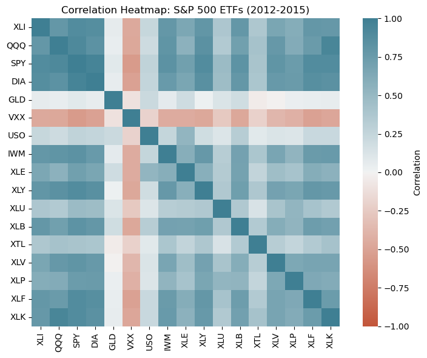
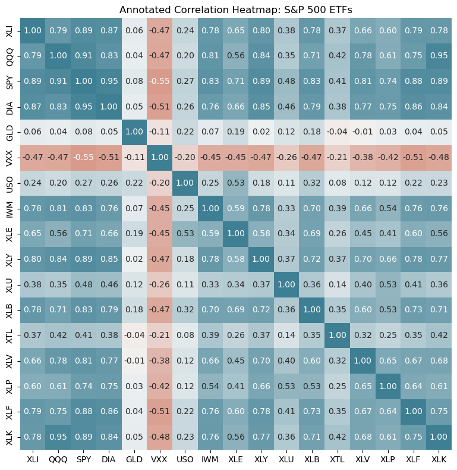
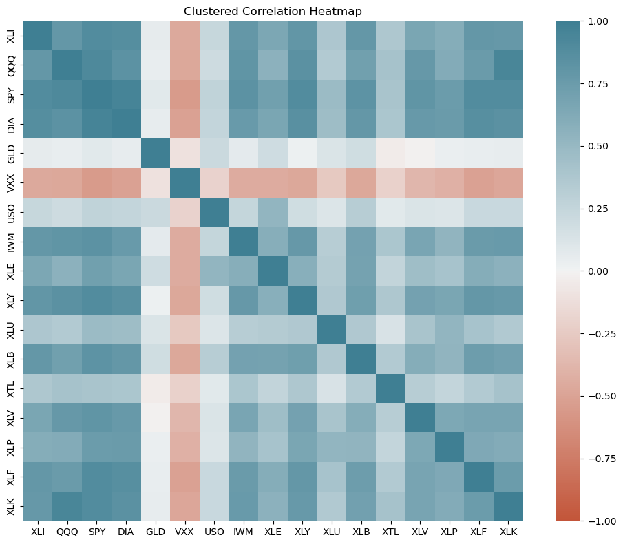
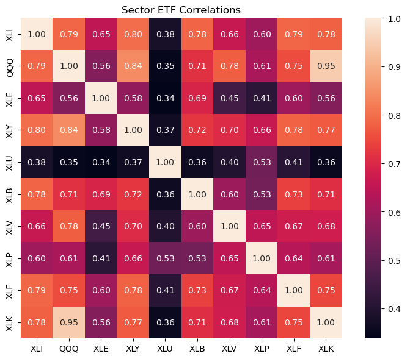
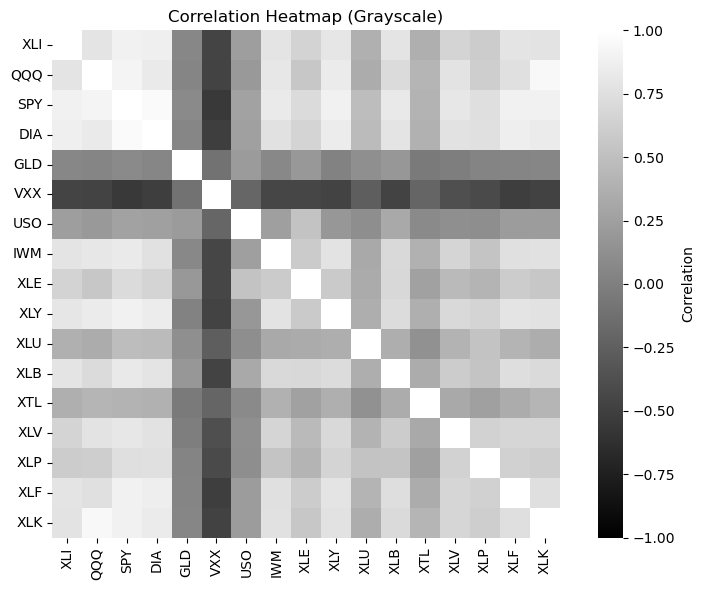

# 상관행렬의 열지도

## 개요

**열지도**는 행렬의 수치를 색의 강도로 나타내는 2차원 시각화이다. 상관행렬에서 열지도는 여러 변수에 걸친 연관 패턴을 한꺼번에 드러내므로 다변량 자료의 탐색적 분석에 없어서는 안 될 도구이다. 색(보통 음의 상관은 파랑, 0은 흰색, 양의 상관은 빨강)이 관계의 강도와 방향을 한눈에 부호화한다.

---

## 상관행렬의 기본 열지도

### 금융 예제: S&P 500 상장지수펀드(ETF)

상장지수펀드(ETF)는 넓은 시장 구간을 추종한다. 섹터 ETF 사이의 상관을 살펴보면 보유 자산이 독립적으로 움직이는지 함께 움직이는지, 즉 분산투자 정도를 평가할 수 있다.

<div class="codebox" markdown>

**예제 1.** S&P 500 ETF 상관 열지도

```python
import pandas as pd
import numpy as np
import seaborn as sns
import matplotlib.pyplot as plt

# 자료는 "Practical Statistics for Data Scientists" 저장소에서 바로 읽는다.
SP500 = ("https://raw.githubusercontent.com/gedeck/"
         "practical-statistics-for-data-scientists/master/data/")
sp500_sym = pd.read_csv(SP500 + 'sp500_sectors.csv')
sp500_px = pd.read_csv(SP500 + 'sp500_data.csv.gz', index_col=0)

# ETF 만 골라 2012년 7월 이후 구간을 쓴다.
etfs = sp500_px.loc[sp500_px.index > '2012-07-01',
                    sp500_sym[sp500_sym['sector'] == 'etf']['symbol']]

# 열이 종목, 행이 날짜이므로 corr() 이 종목 사이의 상관행렬을 준다.
corr_matrix = etfs.corr()

# vmin/vmax 를 -1 과 1 로 못박아야 색의 뜻이 그림마다 달라지지 않는다.
# 발산형 색지도라 0 이 가운데 색에 놓인다.
fig, ax = plt.subplots(figsize=(8, 6))
sns.heatmap(corr_matrix,
            vmin=-1, vmax=1,
            cmap=sns.diverging_palette(20, 220, as_cmap=True),
            ax=ax,
            square=True,
            cbar_kws={'label': 'Correlation'})
ax.set_title('Correlation Heatmap: S&P 500 ETFs (2012-2015)')
plt.tight_layout()
plt.show()
```

</div>



대각선이 가장 진한 빨강(1.0)이고 행렬이 대각선에 대해 대칭이다.

대부분의 칸이 붉은 계열이라는 점이 포트폴리오 관점에서 중요하다. 섹터 ETF들이 서로 양의 상관을 갖고 함께 움직이므로 분산 효과가 생각만큼 크지 않다.

### 열지도 해석하기

열지도는 다음을 드러낸다:

- **양의 상관(빨강):** 함께 오르내리는 섹터 ETF들(예: 성장 국면에서 기술과 통신 서비스가 자주 함께 움직인다)
- **음의 상관(파랑):** 서로 갈라지는 경향이 있는 섹터들(예: 유틸리티 같은 방어 섹터 대 경기소비재 같은 경기민감 섹터)
- **0에 가까운 상관(흰색):** 독립적인 움직임. 포트폴리오 분산에 유리하다
- **대각선(모두 1.0, 진한 빨강):** 각 ETF는 자기 자신과 완전히 상관된다

### 포트폴리오 관점의 함의

양의 상관이 높으면 분산 효과가 제한된다. 상관이 0.8인 두 ETF를 보유하면 거의 같이 움직이므로 무상관인 두 ETF보다 위험 감소 효과가 작다. 잘 분산된 포트폴리오는 낮거나 음인 상관을 목표로 한다.

---

## 값을 표시한 열지도

열지도 칸에 수치를 넣으면 해석에 도움이 된다:

<div class="codebox" markdown>

**예제 2.** 값을 표시한 열지도

```python
import pandas as pd
import seaborn as sns
import matplotlib.pyplot as plt

# 앞과 같은 자료다.
# 자료는 "Practical Statistics for Data Scientists" 저장소에서 바로 읽는다.
SP500 = ("https://raw.githubusercontent.com/gedeck/"
         "practical-statistics-for-data-scientists/master/data/")
sp500_sym = pd.read_csv(SP500 + 'sp500_sectors.csv')
sp500_px = pd.read_csv(SP500 + 'sp500_data.csv.gz', index_col=0)
etfs = sp500_px.loc[sp500_px.index > '2012-07-01',
                    sp500_sym[sp500_sym['sector'] == 'etf']['symbol']]

corr_matrix = etfs.corr()

fig, ax = plt.subplots(figsize=(10, 8))
sns.heatmap(corr_matrix,
            vmin=-1, vmax=1,
            cmap=sns.diverging_palette(20, 220, as_cmap=True),
            annot=True,  # 칸마다 숫자를 적는다
            fmt='.2f',   # 소수점 두 자리
            ax=ax,
            square=True,
            cbar_kws={'label': 'Correlation'},
            cbar=False)  # 숫자를 적었으므로 색막대는 없어도 된다
ax.set_title('Annotated Correlation Heatmap: S&P 500 ETFs')
plt.tight_layout()
plt.show()
```

</div>



칸마다 숫자를 적으면 정확한 값을 읽을 수 있다. 변수가 10개를 넘으면 글씨가 겹치기 시작하므로 그때는 색만 쓰는 편이 낫다.

값을 표시하면 특정 상관 쌍을 쉽게 확인할 수 있다:

- SPY(S&P 500 전체 시장)는 예상대로 QQQ(기술 비중이 큰 나스닥), DIA(대형주)와 높은 상관을 보인다
- GLD(금)는 주식형 ETF와 상관이 낮거나 음인 경우가 많아 헤지 수단이 된다

---

## 큰 상관행렬 다루기

변수가 많아 열지도가 빽빽하고 읽기 어려울 때에는 다음을 고려한다:

### 1. 군집화(재정렬)

계층적 군집화로 비슷한 변수를 묶는다:

<div class="codebox" markdown>

**예제 3.** 군집화로 순서 다시 매기기

```python
import pandas as pd
import seaborn as sns
import matplotlib.pyplot as plt
from scipy.cluster.hierarchy import dendrogram, linkage

# 상관이 비슷한 종목끼리 이웃하도록 순서를 다시 매긴다. 1 - r 을 거리로
# 삼으면 상관이 높을수록 가까운 것이 되어 군집화에 바로 쓸 수 있다.
corr_matrix = etfs.corr()
linkage_matrix = linkage(1 - corr_matrix, method='ward')

fig, ax = plt.subplots(figsize=(10, 8))
sns.heatmap(corr_matrix,
            cmap=sns.diverging_palette(20, 220, as_cmap=True),
            vmin=-1, vmax=1,
            ax=ax,
            square=True)
ax.set_title('Clustered Correlation Heatmap')
plt.tight_layout()
plt.show()
```

</div>



행과 열을 상관 구조에 따라 재정렬하면 함께 움직이는 변수들이 대각선 근처에 블록으로 모인다. 같은 자료인데도 구조가 훨씬 잘 보인다.

군집화는 강하게 상관된 변수들이 붙어 있도록 행과 열을 재정렬하여 상관행렬의 블록 구조를 드러낸다.

### 2. 부분집합 선택

관심 있는 변수의 부분집합만 고른다:

<div class="codebox" markdown>

**예제 4.** 부분집합만 보기

```python
# 종목이 많으면 열지도가 읽히지 않는다. 업종 펀드만 열 개로 좁힌다.
sector_etfs = ['XLI', 'QQQ', 'XLE', 'XLY', 'XLU', 'XLB', 'XLV', 'XLP', 'XLF', 'XLK']
subset_corr = corr_matrix.loc[sector_etfs, sector_etfs]

fig, ax = plt.subplots(figsize=(8, 6))
sns.heatmap(subset_corr, annot=True, fmt='.2f', ax=ax, square=True)
ax.set_title('Sector ETF Correlations')
plt.tight_layout()
plt.show()
```

</div>



변수를 추려 내면 각 칸이 커져 값을 읽기 쉬워진다. 변수가 20개를 넘으면 전체 행렬보다 이런 부분집합이 실용적이다.

---

## 회색조 열지도 (인쇄용)

흑백으로 출판하거나 인쇄 제약이 있을 때에는 회색조 색상표를 쓰고 시각적 단서를 더한다:

<div class="codebox" markdown>

**예제 5.** 회색조 열지도

```python
import pandas as pd
import seaborn as sns
import matplotlib.pyplot as plt

corr_matrix = etfs.corr()

fig, ax = plt.subplots(figsize=(8, 6))
sns.heatmap(corr_matrix,
            cmap='gray',  # 인쇄를 염두에 둔 회색조. 다만 부호를 읽기 어려워진다.
            vmin=-1, vmax=1,
            ax=ax,
            square=True,
            cbar_kws={'label': 'Correlation'})
ax.set_title('Correlation Heatmap (Grayscale)')
plt.tight_layout()
plt.show()
```

</div>



색맹 독자나 흑백 인쇄를 고려하면 명도만으로 구분되는 회색조가 안전하다. 다만 부호를 구분하기 어려워지므로 값을 함께 적어 주는 편이 좋다.

---

## 실제 응용: 위험 관리

포트폴리오 매니저는 상관 열지도로 다음을 평가한다:

1. **시스템 위험:** 보유 자산이 모두 함께 오르내리는가? 상관이 높으면 시장 전체의 충격에 취약하다.
2. **헤지의 효과:** 일부 자산이 다른 자산과 반대로 움직이는가? 음의 상관은 자연스러운 헤지를 제공한다.
3. **섹터 집중:** 포지션이 중복되어 있는가(높은 상관), 분산되어 있는가?

상관이 0.8 근처인 포트폴리오는 분산 효과가 나쁘다. 양·0 근처·음의 상관이 섞인 포트폴리오가 실질적인 위험 완화를 준다.

---

## 한계와 유의점

- **상관은 인과가 아니다:** 두 변수의 상관이 높다고 하나가 다른 하나를 일으키는 것은 아니다.
- **시간에 따라 변하는 상관:** 상관은 시장 국면에 따라 달라진다. 열지도는 정적인 한 장면일 뿐이다.
- **비선형 관계:** 열지도는 (선형인) Pearson 상관을 보여준다. 비선형 의존은 놓칠 수 있다.
- **이상점:** 극단적 사건이 상관 추정을 왜곡할 수 있다. 오염된 자료에는 로버스트한 대안을 고려하라.

---

## 연습문제

<div class="drillbox" markdown>

**연습문제 1.** <span class="diff med" title="중간"></span>
변수 10개인 금융 자료의 상관 열지도에서 한쪽 모서리에 2×2 크기의 진한 빨강 블록이, 다른 곳에 3×3 크기의 진한 파랑 블록이 보인다. 이 패턴들이 변수 관계에 대해 무엇을 시사하며 포트폴리오 분산에 어떤 함의가 있는지 해석하라.

</div>

??? success "풀이"
    **진한 빨강 블록**은 강한 양의 상관($+1$에 가까움)을 갖는 변수 두 개의 군집을 나타낸다. 이 변수들은 함께 움직인다. 예를 들어 같은 섹터의 두 종목이 그렇다.

    **진한 파랑 블록**은 강한 음의 상관($-1$에 가까움)을 갖는 변수 세 개의 군집을 나타낸다. 이 변수들은 반대 방향으로 움직인다.

    **포트폴리오 분산**의 관점에서 음의 상관을 갖는 군집은 가치가 있다. 한쪽의 손실이 다른 쪽의 이익으로 상쇄되는 경향이 있어 이들을 결합하면 포트폴리오 위험이 줄어든다. 반면 양의 상관을 갖는 쌍은 함께 보유해도 분산 효과가 없다. 둘을 모두 갖는 것은 사실상 같은 위험 요인에 두 배로 베팅하는 셈이다.

<div class="drillbox" markdown>

**연습문제 2.** <span class="diff med" title="중간"></span>
계층적 군집화로 상관 열지도의 행과 열을 재정렬하면 기본(알파벳순) 정렬이 놓치는 구조가 드러나는 이유를 설명하라.

</div>

??? success "풀이"
    알파벳순으로 정렬하면 상관된 변수들이 행렬 곳곳에 흩어져 패턴을 알아보기 어렵다. **계층적 군집화**는 상관 프로필이 비슷한 변수를 서로 이웃하게 배치하여 대각선을 따라 눈에 보이는 **블록**을 만든다.

    재정렬 알고리즘은 모든 변수 쌍에 대해 거리 측도(예: $1 - |r|$)를 계산하고 덴드로그램을 만든다. 강하게 상관된 변수들이 나란히 놓이므로 양의 상관 군집은 연속된 빨강 블록으로, 음의 상관 군집은 대각선 밖의 파랑 블록으로 나타난다. 잠재 요인 구조, 중복 변수, 분산투자 기회가 즉시 드러난다.

<div class="drillbox" markdown>

**연습문제 3.** <span class="diff med" title="중간"></span>
대칭인 상관행렬의 열지도를 만들 때 보통 아래쪽(또는 위쪽) 삼각형만 표시한다. 그 이유를 설명하고, 전체 행렬을 보이는 편이 나은 상황을 하나 기술하라.

</div>

??? success "풀이"
    상관행렬은 대칭이므로($r_{ij} = r_{ji}$) 위쪽 삼각형과 아래쪽 삼각형이 같은 정보를 담는다. 한쪽 삼각형만 표시하면:

    - 시각적 중복이 사라진다.
    - 정보가 없는 대각선(항상 1.0)을 없앤다.
    - 그림이 더 깔끔하고 읽기 쉬워진다.

    삼각형마다 다른 정보를 표시할 때에는 **전체 행렬**이 나을 수 있다. 예를 들어 아래쪽 삼각형에 Pearson 상관을, 위쪽 삼각형에 Spearman 상관을 표시하면 두 측도를 직접 비교할 수 있다.

---

## 정리하며

열지도는 상관행렬을 패턴이 즉시 드러나는 시각적 형태로 바꾼다. 투자자에게는 분산 가능성을, 데이터 과학자에게는 다중공선성을 보여준다. 군집화나 부분집합 선택 기법과 결합하면 열지도는 다변량 탐색적 분석에서 가장 실용적인 도구 중 하나로 남는다.
