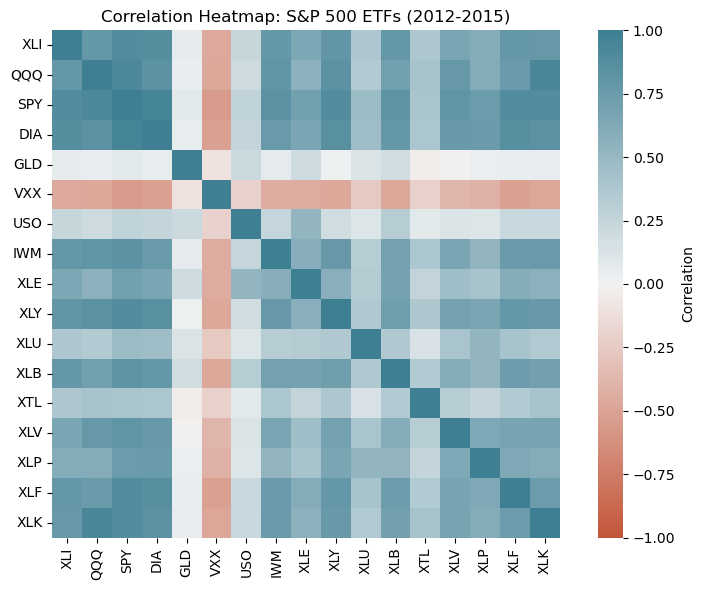
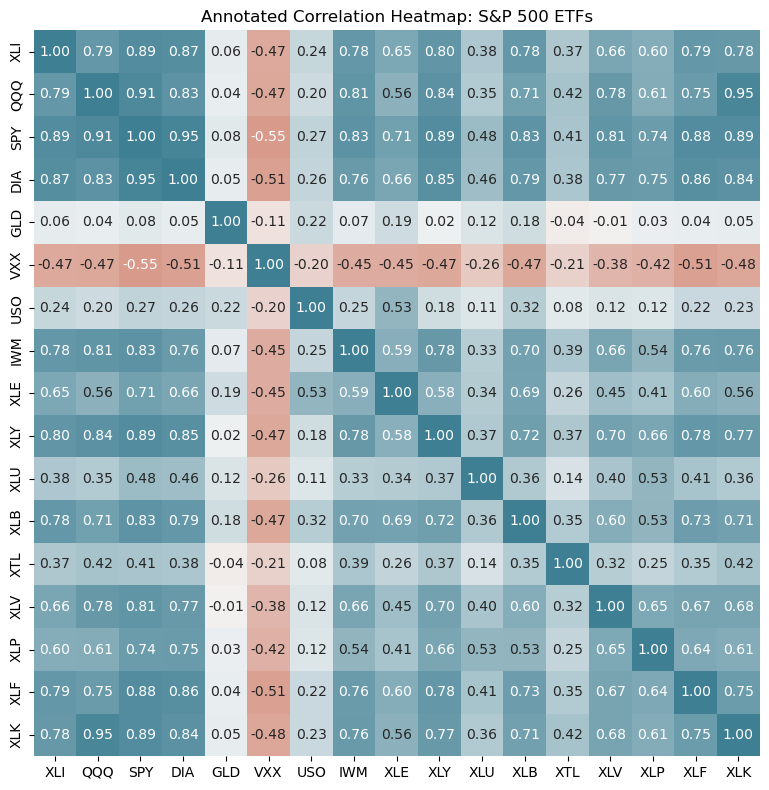
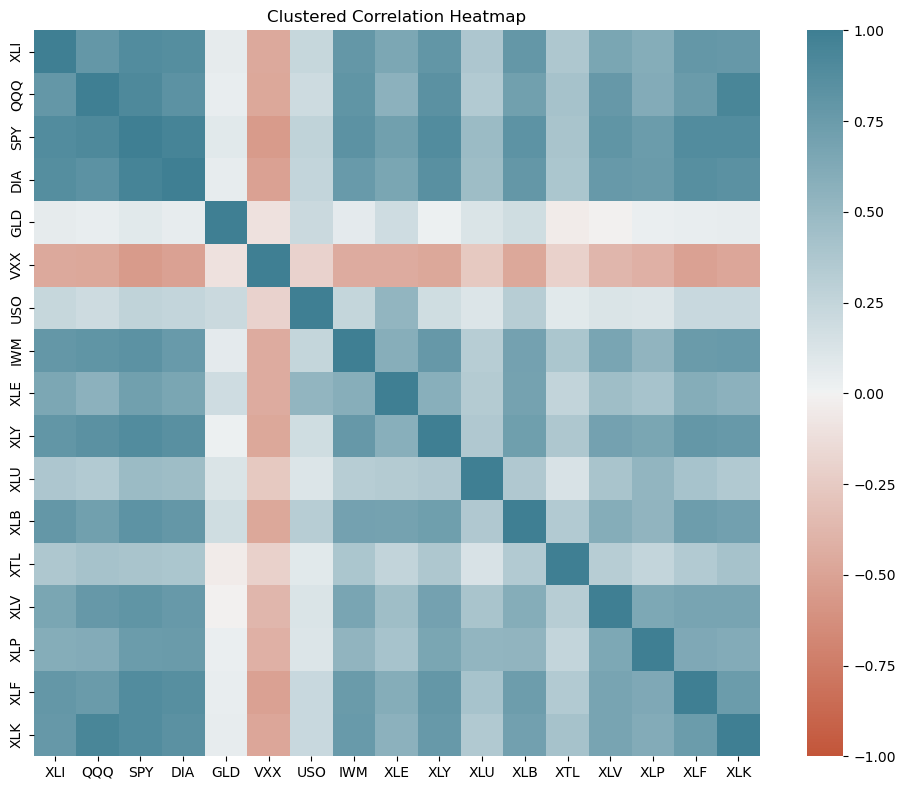
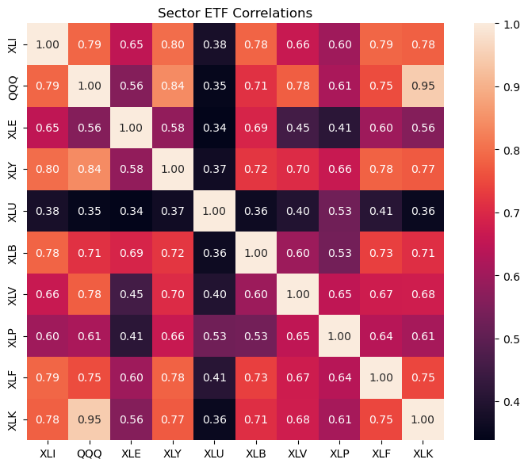
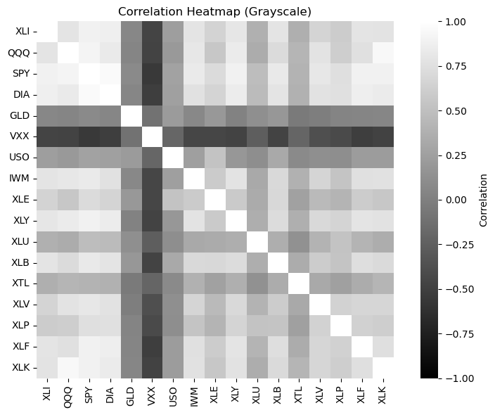

# 상관행렬의 열지도

## 개요

**열지도**는 행렬의 수치를 색의 강도로 나타내는 2차원 시각화이다. 상관행렬에서 열지도는 여러 변수에 걸친 연관 패턴을 한꺼번에 드러내므로 다변량 자료의 탐색적 분석에 없어서는 안 될 도구이다. 색이 관계의 강도와 방향을 한눈에 부호화한다. 다만 **어느 색이 어느 부호인지는 색지도가 정한다** — 이 쪽의 그림은 `diverging_palette(20, 220)` 이라 낮은 쪽(음)이 주황, 높은 쪽(양)이 청록으로, 흔히 쓰는 "음은 파랑, 양은 빨강"과 반대다(보기 1).

---

## 상관행렬의 기본 열지도

### 금융 보기: S&P 500 상장지수펀드(ETF)

상장지수펀드(ETF)는 넓은 시장 구간을 추종한다. 섹터 ETF 사이의 상관을 살펴보면 보유 자산이 독립적으로 움직이는지 함께 움직이는지, 즉 분산투자 정도를 평가할 수 있다.

<div class="exbox" markdown>

**보기 1.** <span class="diff easy" title="쉬움"></span> 열지도 한 장에서 분산 효과를 읽기. ETF 일별 수익률의 상관행렬을 $[-1, 1]$ 에 못박은 발산형 색으로 그린다.

**(1)** 서로 다른 짝은 몇 개이고 그 가운데 음수는 몇 개인가. 음수 칸이 어디에 몰려 있는지 종목 이름으로 말하시오.

**(2)** "섹터 ETF 들이 함께 움직이므로 분산 효과가 작다"는 말을 수치로 바꾸시오. 수익률을 표준화해 분산을 모두 $1$ 로 맞춘 뒤 $p$ 종목을 등가중으로 담았을 때의 분산을 **닫힌 꼴로** 구하고, 자료로 확인하시오.

</div>

??? success "풀이"

    **(1) 세는 일은 그림이 아니라 행렬에서 한다.** $p = 17$ 이므로 서로 다른 짝은 $\binom{17}{2} = 136$ 개다. 그중 음수는 $18$ 개이고, **$16$ 개가 VXX 한 종목에 걸려 있다.** VXX 는 변동성 선물을 담는 ETF 라 주가가 떨어질 때 오른다. 나머지 둘은 GLD–XTL $(-0.042)$ 과 GLD–XLV $(-0.010)$ 로 사실상 $0$ 이다.

    그러므로 **"방어 섹터와 경기민감 섹터가 서로 반대로 움직인다"는 통념은 이 자료에서 맞지 않는다.** 유틸리티 XLU 와 경기소비재 XLY 의 상관은 $+0.3668$ 로 멀쩡한 양수다. 음의 칸을 만드는 것은 섹터의 성격이 아니라 **변동성 자체를 사는 상품**이다.

    **(2) 닫힌 꼴이 있다.** 표준화한 수익률 $Z_1, \ldots, Z_p$ 는 $\operatorname{Var}(Z_i) = 1$ 이고 $\operatorname{Cov}(Z_i, Z_j) = r_{ij}$ 다. 등가중 포트폴리오 $P = \frac1p \sum_i Z_i$ 의 분산은

    $$
    \operatorname{Var}(P)
    = \frac{1}{p^2}\left(\sum_{i} \operatorname{Var}(Z_i) + \sum_{i \ne j} \operatorname{Cov}(Z_i, Z_j)\right)
    = \frac{1}{p^2}\Big(p + p(p-1)\bar r\Big)
    = \frac{1}{p} + \left(1 - \frac{1}{p}\right)\bar r
    $$

    이다. 여기서 $\bar r$ 는 $\binom p2$ 개 짝의 평균 상관이다. **분모가 아니라 분자에 $\bar r$ 가 남는다는 것이 요점**이다. $p \to \infty$ 로 보내도

    $$
    \operatorname{Var}(P) \;\longrightarrow\; \bar r
    $$

    이므로 **종목을 아무리 늘려도 분산은 $\bar r$ 아래로 내려가지 않는다.** $\bar r = 0.4063$ 을 넣으면

    $$
    \operatorname{Var}(P) = \frac{1}{17} + \frac{16}{17}\times 0.4063 = 0.0588 + 0.3824 = 0.4413
    $$

    이고 표준편차 비는 $\sqrt{0.4413} = 0.6643$ 이다. 만약 $17$ 종목이 서로 독립이었다면 $1/17 = 0.0588$, 곧 $\sqrt{0.0588} = 0.2425$ 였을 것이다. 같은 분산을 독립 자산 몇 개로 낼 수 있는지 뒤집어 보면

    $$
    N_{\text{eff}} = \frac{1}{\operatorname{Var}(P)} = \frac{1}{0.4413} = 2.27
    $$

    이다. **$17$ 종목을 들고 있어도 독립 자산 $2.3$ 개 값어치다.** 이것이 "대부분의 칸에 색이 들어 있다"는 그림의 인상을 수로 바꾼 것이다.

    ```python
    import pandas as pd
    import numpy as np
    import seaborn as sns
    import matplotlib.pyplot as plt

    plt.rcParams["font.family"] = "Apple SD Gothic Neo"
    plt.rcParams["axes.unicode_minus"] = False

    # 자료는 "Practical Statistics for Data Scientists" 저장소에서 바로 읽는다.
    SP500 = ("https://raw.githubusercontent.com/gedeck/"
             "practical-statistics-for-data-scientists/8a6d3bb6468e979c861d4b37215e1413702dfdfa/data/")
    sp500_sym = pd.read_csv(SP500 + 'sp500_sectors.csv')
    sp500_px = pd.read_csv(SP500 + 'sp500_data.csv.gz', index_col=0)

    # ETF 만 골라 2012년 7월 이후 구간을 쓴다.
    etfs = sp500_px.loc[sp500_px.index > '2012-07-01',
                        sp500_sym[sp500_sym['sector'] == 'etf']['symbol']]

    # 열이 종목, 행이 날짜이므로 corr() 이 종목 사이의 상관행렬을 준다.
    corr_matrix = etfs.corr()

    # vmin/vmax 를 -1 과 1 로 못박아야 색의 뜻이 그림마다 달라지지 않는다.
    # 발산형 색지도라 0 이 가운데 색에 놓인다.
    fig, ax = plt.subplots(figsize=(8, 6))
    sns.heatmap(corr_matrix,
                vmin=-1, vmax=1,
                cmap=sns.diverging_palette(20, 220, as_cmap=True),
                ax=ax,
                square=True,
                cbar_kws={'label': 'Correlation'})
    ax.set_title('Correlation Heatmap: S&P 500 ETFs (2012-2015)')
    plt.tight_layout()
    plt.show()

    # 색만 보고 넘어가지 않도록 수치를 찍는다.
    p = corr_matrix.shape[0]
    off = corr_matrix.values[np.triu_indices(p, 1)]
    print(f"ETF {p} 종목, 거래일 {len(etfs)} 일 "
          f"({etfs.index.min()} ~ {etfs.index.max()}), 서로 다른 짝 {len(off)} 개")
    print(f"상관 최소 {off.min():+.4f}  최대 {off.max():+.4f}  평균 {off.mean():+.4f}")
    print(f"음수인 짝 = {(off < 0).sum()} 개")
    from collections import Counter
    cnt = Counter()
    for i in range(p):
        for j in range(i + 1, p):
            if corr_matrix.values[i, j] < 0:
                cnt[corr_matrix.index[i]] += 1
                cnt[corr_matrix.columns[j]] += 1
    print(f"음수 짝에 낀 횟수 = {dict(cnt.most_common())}")
    print(f"유틸리티(XLU) 대 경기소비재(XLY) = {corr_matrix.loc['XLU', 'XLY']:+.4f}  "
          f"(방어 대 경기민감)")

    rbar = off.mean()
    print(f"\n등가중 포트폴리오 (수익률을 표준화해 분산을 1 로 맞춘 뒤)")
    print(f"  공식 1/p + (1-1/p) rbar = {1/p + (1 - 1/p) * rbar:.6f}")
    z = (etfs - etfs.mean()) / etfs.std()
    print(f"  실제로 만들어 재면       = {z.mean(axis=1).var(ddof=1):.6f}")
    print(f"  서로 독립이었다면 1/p    = {1/p:.6f}")
    print(f"  표준편차 비: 실제 {np.sqrt(1/p + (1 - 1/p) * rbar):.4f}  "
          f"독립이었다면 {np.sqrt(1/p):.4f}")
    print(f"  유효 독립 자산수 = {1 / (1/p + (1 - 1/p) * rbar):.2f} 개")
    ```

    출력:

    ```
    ETF 17 종목, 거래일 754 일 (2012-07-02 ~ 2015-07-01), 서로 다른 짝 136 개
    상관 최소 -0.5471  최대 +0.9537  평균 +0.4063
    음수인 짝 = 18 개
    음수 짝에 낀 횟수 = {'VXX': 16, 'GLD': 3, 'XTL': 2, 'XLV': 2, 'XLI': 1, 'QQQ': 1, 'SPY': 1, 'DIA': 1, 'USO': 1, 'IWM': 1, 'XLE': 1, 'XLY': 1, 'XLU': 1, 'XLB': 1, 'XLP': 1, 'XLF': 1, 'XLK': 1}
    유틸리티(XLU) 대 경기소비재(XLY) = +0.3668  (방어 대 경기민감)

    등가중 포트폴리오 (수익률을 표준화해 분산을 1 로 맞춘 뒤)
      공식 1/p + (1-1/p) rbar = 0.441257
      실제로 만들어 재면       = 0.441257
      서로 독립이었다면 1/p    = 0.058824
      표준편차 비: 실제 0.6643  독립이었다면 0.2425
      유효 독립 자산수 = 2.27 개
    ```

    

    **닫힌 꼴 $0.441257$ 과 실제로 포트폴리오를 만들어 잰 $0.441257$ 이 소수 여섯째 자리까지 같다.** 유도가 항등식이므로 당연하고, 어긋났다면 $\bar r$ 를 잘못 센 것이다.

    **색이 말해 주지 않는 것 셋.**

    - **색의 방향.** 이 그림의 색지도는 `diverging_palette(20, 220)` 이라 **낮은 쪽이 주황, 높은 쪽이 청록**이다. 상관 열지도에서 흔히 쓰는 "음은 파랑, 양은 빨강"과 **반대**다. 색막대를 읽지 않고 색만 보면 부호를 거꾸로 읽는다.
    - **표본크기.** 모든 칸이 $n = 754$ 로 같다는 보장은 그림 어디에도 없다. 결측이 있었다면 칸마다 $n$ 이 달랐을 것이고, 색은 그대로였을 것이다.
    - **비선형성과 이상치.** $r$ 는 직선 관계만 잰다. 수익률 자료는 꼬리가 두꺼워 며칠의 폭락이 칸 하나의 색을 바꿀 수 있는데, 그림은 그것을 보이지 않는다.

### 열지도 해석하기

열지도는 다음을 드러낸다:

- **양의 상관(이 그림에서는 청록):** 함께 오르내리는 섹터 ETF들(예: 성장 국면에서 기술과 통신 서비스가 자주 함께 움직인다)
- **음의 상관(이 그림에서는 주황):** 서로 갈라지는 경향이 있는 짝. 다만 이 자료에서 음수 칸 $18$ 개 가운데 $16$ 개가 **VXX 한 종목**에 걸려 있다. 방어 섹터 대 경기민감 섹터라는 흔한 설명은 여기서는 맞지 않는다 — XLU–XLY 가 $+0.3668$ 로 오히려 양이다(보기 1).
- **0에 가까운 상관(흰색):** 독립적인 움직임. 포트폴리오 분산에 유리하다
- **대각선(모두 1.0, 진한 빨강):** 각 ETF는 자기 자신과 완전히 상관된다

### 포트폴리오 관점의 함의

양의 상관이 높으면 분산 효과가 제한된다. 상관이 0.8인 두 ETF를 보유하면 거의 같이 움직이므로 무상관인 두 ETF보다 위험 감소 효과가 작다. 잘 분산된 포트폴리오는 낮거나 음인 상관을 목표로 한다.

---

## 값을 표시한 열지도

열지도 칸에 수치를 넣으면 해석에 도움이 된다:

<div class="exbox" markdown>

**보기 2.** <span class="diff easy" title="쉬움"></span> 숫자를 적으면 헤지와 분산을 가를 수 있다. 같은 행렬에 `annot=True` 로 값을 적어 넣는다.

**(1)** 표준화한 두 자산을 등가중으로 담았을 때 표준편차가 얼마로 줄어드는지 **닫힌 꼴로** 구하시오. 그 식으로 SPY–DIA, QQQ–XLK, SPY–GLD, SPY–VXX 를 견주시오.

**(2)** "GLD 는 주식과 상관이 낮으므로 헤지 수단이다"라는 흔한 말을 (1)의 식으로 따지시오. 상관 $0$ 과 상관 $-0.55$ 는 같은 일을 하는가.

</div>

??? success "풀이"

    **(1) 보기 1의 식에 $p = 2$ 를 넣으면 된다.** 표준화한 두 자산 $Z_1, Z_2$ 를 반씩 담으면

    $$
    \operatorname{Var}\!\left(\frac{Z_1 + Z_2}{2}\right)
    = \frac{1 + 1 + 2r}{4}
    = \frac{1 + r}{2},
    \qquad
    \frac{\operatorname{sd}(P)}{\operatorname{sd}(Z_i)} = \sqrt{\frac{1 + r}{2}}
    $$

    이다. $r = 1$ 이면 비가 $1$ 이라 아무것도 줄지 않고, $r = 0$ 이면 $1/\sqrt2 = 0.707$, $r = -1$ 이면 $0$ 이다. **$r$ 가 아니라 $\sqrt{(1+r)/2}$ 가 눈금이라는 점**이 중요하다. 이 함수는 $r$ 가 $1$ 근처일 때 아주 평평하다.

    | 짝 | $r$ | $\sqrt{(1+r)/2}$ | 표준편차 감소 |
    |---|---|---|---|
    | SPY–DIA | $+0.9537$ | $0.9884$ | $1.2\%$ |
    | QQQ–XLK | $+0.9451$ | $0.9862$ | $1.4\%$ |
    | SPY–QQQ | $+0.9090$ | $0.9770$ | $2.3\%$ |
    | **SPY–GLD** | $+0.0787$ | $0.7344$ | $\mathbf{26.6\%}$ |
    | **SPY–VXX** | $-0.5471$ | $0.4759$ | $\mathbf{52.4\%}$ |

    SPY 와 DIA 를 반씩 담는 것은 **위험을 $1.2\%$ 줄인다.** 두 종목을 들고 있다는 느낌만 줄 뿐 실질은 한 종목이다.

    **(2) 상관 $0$ 은 헤지가 아니라 분산이다.** GLD 는 주식형 $14$ 종목과 평균 $+0.0635$, 범위 $[-0.0422, +0.1886]$ 로 **거의 $0$ 이지 음수가 아니다.** 음수인 것은 둘뿐이고 그 값도 $-0.04$, $-0.01$ 이라 $0$ 과 구별되지 않는다. 반면 VXX 는 $14$ 종목 **모두**와 음수이고 평균이 $-0.4354$ 다.

    둘의 차이는 식에서 바로 읽힌다. $r = 0$ 은 $\sqrt{1/2} = 0.707$, 곧 **흔들림을 $29\%$ 깎아 줄 뿐 방향을 되돌리지는 않는다.** 주식이 떨어지는 날 GLD 는 평균적으로 가만히 있다. $r < 0$ 이라야 주식이 떨어질 때 올라 손실을 **상쇄**한다. **헤지는 음의 상관을 요구하고, 상관이 $0$ 인 자산은 분산 자산일 뿐이다.** 그림의 GLD 열이 거의 흰색인 것은 "헤지"가 아니라 "무관"이라고 읽어야 한다.

    ```python
    import pandas as pd
    import numpy as np
    import seaborn as sns
    import matplotlib.pyplot as plt

    plt.rcParams["font.family"] = "Apple SD Gothic Neo"
    plt.rcParams["axes.unicode_minus"] = False

    # 앞과 같은 자료다.
    # 자료는 "Practical Statistics for Data Scientists" 저장소에서 바로 읽는다.
    SP500 = ("https://raw.githubusercontent.com/gedeck/"
             "practical-statistics-for-data-scientists/8a6d3bb6468e979c861d4b37215e1413702dfdfa/data/")
    sp500_sym = pd.read_csv(SP500 + 'sp500_sectors.csv')
    sp500_px = pd.read_csv(SP500 + 'sp500_data.csv.gz', index_col=0)
    etfs = sp500_px.loc[sp500_px.index > '2012-07-01',
                        sp500_sym[sp500_sym['sector'] == 'etf']['symbol']]

    corr_matrix = etfs.corr()

    fig, ax = plt.subplots(figsize=(10, 8))
    sns.heatmap(corr_matrix,
                vmin=-1, vmax=1,
                cmap=sns.diverging_palette(20, 220, as_cmap=True),
                annot=True,  # 칸마다 숫자를 적는다
                fmt='.2f',   # 소수점 두 자리
                ax=ax,
                square=True,
                cbar_kws={'label': 'Correlation'},
                cbar=False)  # 숫자를 적었으므로 색막대는 없어도 된다
    ax.set_title('Annotated Correlation Heatmap: S&P 500 ETFs')
    plt.tight_layout()
    plt.show()

    print(f"{'짝':>10s} {'r':>8s} {'sqrt((1+r)/2)':>15s} {'표준편차 감소':>13s}")
    for a, b in [('SPY', 'DIA'), ('QQQ', 'XLK'), ('SPY', 'QQQ'),
                 ('SPY', 'GLD'), ('SPY', 'VXX')]:
        r = corr_matrix.loc[a, b]
        ratio = np.sqrt((1 + r) / 2)
        print(f"{a + '-' + b:>10s} {r:+8.4f} {ratio:15.4f} {1 - ratio:12.1%}")

    gld = [c for c in corr_matrix.columns if c not in ('GLD', 'VXX', 'USO')]
    g = corr_matrix.loc['GLD', gld]
    print(f"\nGLD 대 주식형 {len(gld)} 종목: 최소 {g.min():+.4f}  최대 {g.max():+.4f}  "
          f"평균 {g.mean():+.4f}  음수 {int((g < 0).sum())} 개")
    v = corr_matrix.loc['VXX', gld]
    print(f"VXX 대 주식형 {len(gld)} 종목: 최소 {v.min():+.4f}  최대 {v.max():+.4f}  "
          f"평균 {v.mean():+.4f}  음수 {int((v < 0).sum())} 개")
    print(f"\n칸 수 {corr_matrix.shape[0]}x{corr_matrix.shape[1]} = {corr_matrix.size} 개")
    ```

    출력:

    ```
             짝        r   sqrt((1+r)/2)       표준편차 감소
       SPY-DIA  +0.9537          0.9884         1.2%
       QQQ-XLK  +0.9451          0.9862         1.4%
       SPY-QQQ  +0.9090          0.9770         2.3%
       SPY-GLD  +0.0787          0.7344        26.6%
       SPY-VXX  -0.5471          0.4759        52.4%

    GLD 대 주식형 14 종목: 최소 -0.0422  최대 +0.1886  평균 +0.0635  음수 2 개
    VXX 대 주식형 14 종목: 최소 -0.5471  최대 -0.2057  평균 -0.4354  음수 14 개

    칸 수 17x17 = 289 개
    ```

    

    표의 다섯 줄이 모두 닫힌 꼴 $\sqrt{(1+r)/2}$ 로 계산한 값이고, 그림에 적힌 소수 두 자리 값과 맞는다.

    **숫자를 적는 일의 대가.** 이 그림에는 $289$ 개의 수가 적혀 있다. 대각선 $17$ 개와 대칭으로 중복된 $136$ 개를 빼면 **쓸모 있는 수는 $136$ 개뿐이고 나머지 $153$ 개는 잉여**다. 종목이 $25$ 개만 되어도 $625$ 칸이라 글씨가 겹친다. 그때는 숫자를 지우고 색만 쓰거나, 보기 4처럼 볼 것을 추려야 한다.

---

## 큰 상관행렬 다루기

변수가 많아 열지도가 빽빽하고 읽기 어려울 때에는 다음을 고려한다:

### 1. 군집화(재정렬)

계층적 군집화로 비슷한 변수를 묶는다:

<div class="exbox" markdown>

**보기 3.** <span class="diff easy" title="쉬움"></span> 제목이 "Clustered" 라고 해서 군집화된 것은 아니다. 아래 코드는 `linkage` 를 부르고 열지도를 그린다.

**(1)** 이 코드가 정말로 행과 열을 재정렬하는가. `linkage_matrix` 가 어디에 쓰이는지 따라가 보고, 그려진 축의 순서를 `corr_matrix` 의 열 순서와 맞대어 보시오.

**(2)** 블록 구조가 드러났는지를 그림 인상이 아니라 수치로 재려면 무엇을 보아야 하는가. 잣대를 하나 정하고 원래 순서와 제대로 군집화한 순서를 견주시오.

</div>

??? success "풀이"

    **(1) 재정렬하지 않는다.** `linkage_matrix` 는 둘째 줄에서 계산되고 **그 뒤로 한 번도 쓰이지 않는다.** `sns.heatmap` 에 넘어가는 것은 손대지 않은 `corr_matrix` 이므로 축 순서는 `etfs` 의 열 순서, 곧 자료 파일에 적힌 순서 그대로다. 아래 출력에서 그려진 축 순서와 `corr_matrix.columns` 가 **문자 하나까지 같다.** 그림 제목이 `Clustered Correlation Heatmap` 인 것과는 무관하다.

    그러므로 **이 그림은 보기 1의 그림과 칸 배치가 완전히 같다.** 두 그림을 겹쳐 보면 알 수 있고, 보기 1에서 VXX 가 여섯째 행이었던 것이 여기서도 여섯째 행이다.

    덤으로 `linkage(1 - corr_matrix, method='ward')` 는 `ClusterWarning` 을 낸다. `linkage` 의 첫 인자는 **관측 행렬이거나 압축된 거리벡터**여야 하는데 $17 \times 17$ 정사각 행렬을 주었기 때문이다. SciPy 는 이것을 "관측 $17$ 개, 변수 $17$ 개"로 받아 **$1-r$ 행렬의 행들 사이의 유클리드 거리**로 묶는다. 의도한 "$1-r$ 를 거리로 삼는다"와 다른 일이다. 올바로 하려면 `squareform` 으로 압축 거리벡터를 만들어 넘겨야 한다.

    **(2) 잣대 — 축에서 이웃한 두 종목의 평균 상관.** 블록이 대각선 둘레로 모였다는 말은 **축에서 가까운 종목끼리 상관이 높다**는 뜻이다. 그러므로

    $$
    \text{이웃 평균 } r = \frac{1}{p-1}\sum_{k=1}^{p-1} r_{\,o_k,\, o_{k+1}}
    $$

    를 재면 된다. 여기서 $o$ 는 축에 놓인 순서다. 순서가 무작위이면 이 값은 모든 짝의 평균 $\bar r = 0.4063$ 둘레에 머물고, 잘 묶였으면 그보다 뚜렷이 커야 한다.

    | 순서 | 이웃 평균 $r$ |
    |---|---|
    | 원래 (그림에 실제로 쓰인 것) | $0.4527$ |
    | `linkage(1-corr)` 의 잎 순서 | $0.5013$ |
    | 압축 거리 + `average` | $\mathbf{0.5555}$ |
    | 참고: 모든 짝의 평균 $\bar r$ | $0.4063$ |

    원래 순서의 $0.4527$ 이 $\bar r = 0.4063$ 보다 조금 큰 것은 자료 파일이 이미 SPY·DIA·QQQ 처럼 비슷한 것을 나란히 적어 두었기 때문이고, **군집화 덕분이 아니다.** 제대로 묶으면 $0.5555$ 까지 올라간다. 그 순서는

    ```
    VXX | GLD USO XTL XLU | XLE XLP XLV XLB IWM XLF QQQ XLK XLY XLI SPY DIA
    ```

    로, 변동성(VXX)이 혼자 떨어지고 금·원유·통신·유틸리티가 한 덩어리, 나머지 주식형이 큰 덩어리를 이룬다.

    ```python
    import pandas as pd
    import numpy as np
    import seaborn as sns
    import matplotlib.pyplot as plt
    from scipy.cluster.hierarchy import dendrogram, linkage
    from scipy.spatial.distance import squareform

    plt.rcParams["font.family"] = "Apple SD Gothic Neo"
    plt.rcParams["axes.unicode_minus"] = False

    # 상관이 비슷한 종목끼리 이웃하도록 순서를 다시 매긴다. 1 - r 을 거리로
    # 삼으면 상관이 높을수록 가까운 것이 되어 군집화에 바로 쓸 수 있다.
    corr_matrix = etfs.corr()
    linkage_matrix = linkage(1 - corr_matrix, method='ward')

    fig, ax = plt.subplots(figsize=(10, 8))
    sns.heatmap(corr_matrix,
                cmap=sns.diverging_palette(20, 220, as_cmap=True),
                vmin=-1, vmax=1,
                ax=ax,
                square=True)
    ax.set_title('Clustered Correlation Heatmap')
    plt.tight_layout()
    plt.show()

    # 그려진 축의 순서를 자료의 순서와 맞대어 본다.
    drawn = [t.get_text() for t in ax.get_xticklabels()]
    print("그려진 축 순서 =", drawn)
    print("corr_matrix 열 =", list(corr_matrix.columns))
    print("둘이 같은가 :", drawn == list(corr_matrix.columns))
    print("linkage_matrix 를 쓴 곳이 있는가 : 없음 — 계산만 하고 버렸다")

    # 블록 구조를 재는 잣대: 축에서 이웃한 두 종목의 평균 상관
    nb = lambda o: np.mean([corr_matrix.values[o[i], o[i + 1]] for i in range(len(o) - 1)])
    p = len(corr_matrix)
    base = list(range(p))
    leaves_bad = dendrogram(linkage_matrix, no_plot=True)['leaves']

    # 올바른 방법: 1-r 을 압축 거리벡터로 넘긴다
    D = 1 - corr_matrix.values
    np.fill_diagonal(D, 0.0)
    leaves_ok = dendrogram(linkage(squareform(D, checks=False), method='average'),
                           no_plot=True)['leaves']

    print(f"\n{'순서':>26s} {'이웃 평균 r':>11s}")
    for lab, o in [("원래 (그림에 쓰인 것)", base),
                   ("linkage(1-corr) 의 잎", leaves_bad),
                   ("압축 거리 + average", leaves_ok)]:
        print(f"{lab:>26s} {nb(o):11.4f}")
    print(f"{'참고: 모든 짝의 평균 r':>26s} "
          f"{corr_matrix.values[np.triu_indices(p, 1)].mean():11.4f}")
    print("\n압축 거리 + average 순서:")
    print(" ", [corr_matrix.columns[i] for i in leaves_ok])
    ```

    출력:

    ```
    그려진 축 순서 = ['XLI', 'QQQ', 'SPY', 'DIA', 'GLD', 'VXX', 'USO', 'IWM', 'XLE', 'XLY', 'XLU', 'XLB', 'XTL', 'XLV', 'XLP', 'XLF', 'XLK']
    corr_matrix 열 = ['XLI', 'QQQ', 'SPY', 'DIA', 'GLD', 'VXX', 'USO', 'IWM', 'XLE', 'XLY', 'XLU', 'XLB', 'XTL', 'XLV', 'XLP', 'XLF', 'XLK']
    둘이 같은가 : True
    linkage_matrix 를 쓴 곳이 있는가 : 없음 — 계산만 하고 버렸다

                            순서     이웃 평균 r
                 원래 (그림에 쓰인 것)      0.4527
           linkage(1-corr) 의 잎      0.5013
               압축 거리 + average      0.5555
                참고: 모든 짝의 평균 r      0.4063

    압축 거리 + average 순서:
      ['VXX', 'GLD', 'USO', 'XTL', 'XLU', 'XLE', 'XLP', 'XLV', 'XLB', 'IWM', 'XLF', 'QQQ', 'XLK', 'XLY', 'XLI', 'SPY', 'DIA']
    ```

    

    그림의 축 이름을 왼쪽부터 읽으면 XLI, QQQ, SPY, DIA, GLD, VXX … 로 출력의 첫 줄과 그대로 맞는다. **제목이 말하는 일은 일어나지 않았다.**

    군집화 자체는 쓸모가 있다. 강하게 상관된 변수를 이웃하게 놓으면 대각선 둘레에 블록이 생기고, 잠재 요인·중복 변수·분산 기회가 눈에 들어온다. 다만 **그 일이 실제로 일어났는지는 그림 인상이 아니라 축 순서로 확인해야 한다.** 이 보기가 그 확인 절차다.

### 2. 부분집합 선택

관심 있는 변수의 부분집합만 고른다:

<div class="exbox" markdown>

**보기 4.** <span class="diff easy" title="쉬움"></span> 추리면서 색 눈금까지 바뀌었다. 업종 펀드 $10$ 개만 남겨 다시 그린다. 이번에는 `vmin`/`vmax` 를 주지 않았다.

**(1)** 색막대의 범위가 얼마가 되는가. 같은 $r = 0.38$ 이 보기 1과 이 그림에서 색막대의 어느 자리에 놓이는지 견주시오.

**(2)** $17$ 종목에서 $10$ 종목으로 줄이면 짝이 몇 개 사라지는가. 사라진 짝 가운데 음수는 몇 개인가. 이 그림으로 분산 효과를 판단해도 되는가.

</div>

??? success "풀이"

    **(1) 색막대가 자료에 맞춰 늘어난다.** `vmin`/`vmax` 를 주지 않으면 `heatmap` 이 자료의 최솟값과 최댓값을 양 끝에 놓는다. 이 부분집합의 최소는 XLE–XLU 의 $0.3379$ 이므로 색막대는 $[-1, 1]$ 이 아니라 $[0.3379,\, 1.0000]$ 이다. 같은 수가 두 그림에서 어디에 놓이는지 비로 적으면

    | $r$ | 보기 1 에서 (범위 $[-1,1]$) | 보기 4 에서 (범위 $[0.338,1]$) |
    |---|---|---|
    | $0.34$ | $0.670$ | $0.003$ |
    | $\mathbf{0.38}$ | $\mathbf{0.690}$ | $\mathbf{0.064}$ |
    | $0.53$ | $0.765$ | $0.290$ |
    | $0.95$ | $0.975$ | $0.924$ |

    **$r = 0.38$ 이 한쪽에서는 색막대의 위쪽 $69\%$, 다른 쪽에서는 아래쪽 $6\%$ 다.** 그래서 보기 1에서 중간쯤 짙은 칸이던 XLU 행이 여기서는 **가장 어두운 행**으로 보인다. 숫자는 그대로인데 색만 뒤바뀐 것이다. 게다가 색지도도 기본값 `rocket` 이라 **발산형이 아니라 순차형**이므로 $0$ 이 가운데에 놓인다는 보장도 없다.

    두 그림을 나란히 놓고 색으로 견주는 일은 **할 수 없다.** 색을 그림 사이에서 견주려면 `vmin`/`vmax` 를 못박아야 한다.

    **(2) 사라진 짝은 $91$ 개이고 그 안에 음수 $18$ 개가 모두 들어 있다.** $\binom{17}{2} = 136$ 에서 $\binom{10}{2} = 45$ 로 줄었고, 빠진 종목은 SPY, DIA, GLD, VXX, USO, IWM, XTL 이다. **VXX 와 GLD 가 빠지면서 음의 상관이 하나도 남지 않는다.** 남은 $45$ 짝의 최소가 $+0.3379$ 다.

    그러므로 **이 그림으로 분산 효과를 판단해서는 안 된다.** 보기 1의 식을 $q = 10$ 과 $\bar r = 0.6230$ 에 쓰면

    $$
    \operatorname{Var}(P) = \frac{1}{10} + \frac{9}{10}\times 0.6230 = 0.6607,
    \qquad N_{\text{eff}} = 1.51
    $$

    로 $17$ 종목일 때의 $2.27$ 보다도 나빠진다. 이것은 세상이 나빠져서가 아니라 **분산에 도움이 되는 종목만 골라 뺐기 때문**이다. 추려서 그린 열지도는 읽기 쉬워진 대신 **무엇을 뺐는지 전혀 보이지 않는다.** 뺀 목록을 그림 밖에 적어 두는 수밖에 없다.

    ```python
    plt.rcParams["font.family"] = "Apple SD Gothic Neo"
    plt.rcParams["axes.unicode_minus"] = False

    # 종목이 많으면 열지도가 읽히지 않는다. 업종 펀드만 열 개로 좁힌다.
    sector_etfs = ['XLI', 'QQQ', 'XLE', 'XLY', 'XLU', 'XLB', 'XLV', 'XLP', 'XLF', 'XLK']
    subset_corr = corr_matrix.loc[sector_etfs, sector_etfs]

    fig, ax = plt.subplots(figsize=(8, 6))
    sns.heatmap(subset_corr, annot=True, fmt='.2f', ax=ax, square=True)
    ax.set_title('Sector ETF Correlations')
    plt.tight_layout()
    plt.show()

    # 색막대가 어디에서 어디까지인지 그림에서 직접 꺼내 본다.
    qm = ax.collections[0]
    lo, hi = qm.get_clim()
    print(f"색막대 범위: vmin = {lo:.4f},  vmax = {hi:.4f}   (못박지 않아 자료에 맞춰졌다)")
    print(f"색지도 = {qm.cmap.name}  (발산형이 아니라 순차형이라 0 이 가운데가 아니다)")
    print(f"\n{'r':>6s} {'보기 1 에서의 색 위치':>20s} {'보기 4 에서의 색 위치':>20s}")
    for r in (0.34, 0.38, 0.53, 0.95):
        print(f"{r:6.2f} {(r + 1) / 2:20.3f} {(r - lo) / (hi - lo):20.3f}")

    p = len(corr_matrix)
    full = corr_matrix.values[np.triu_indices(p, 1)]
    sub = subset_corr.values[np.triu_indices(len(sector_etfs), 1)]
    print(f"\n짝 {len(full)} -> {len(sub)},  사라진 짝 {len(full) - len(sub)} 개")
    print(f"빠진 종목 = {[c for c in corr_matrix.columns if c not in sector_etfs]}")
    print(f"음수 짝: 전체 {int((full < 0).sum())} 개  ->  부분집합 {int((sub < 0).sum())} 개")
    print(f"부분집합 상관 최소 {sub.min():+.4f}  최대 {sub.max():+.4f}  평균 {sub.mean():+.4f}")
    rb = sub.mean()
    q = len(sector_etfs)
    print(f"부분집합 등가중 분산 = 1/q + (1-1/q) rbar = {1/q + (1 - 1/q) * rb:.4f}  "
          f"(유효 독립 자산수 {1 / (1/q + (1 - 1/q) * rb):.2f} 개)")
    ```

    출력:

    ```
    색막대 범위: vmin = 0.3379,  vmax = 1.0000   (못박지 않아 자료에 맞춰졌다)
    색지도 = rocket  (발산형이 아니라 순차형이라 0 이 가운데가 아니다)

         r        보기 1 에서의 색 위치        보기 4 에서의 색 위치
      0.34                0.670                0.003
      0.38                0.690                0.064
      0.53                0.765                0.290
      0.95                0.975                0.924

    짝 136 -> 45,  사라진 짝 91 개
    빠진 종목 = ['SPY', 'DIA', 'GLD', 'VXX', 'USO', 'IWM', 'XTL']
    음수 짝: 전체 18 개  ->  부분집합 0 개
    부분집합 상관 최소 +0.3379  최대 +0.9451  평균 +0.6230
    부분집합 등가중 분산 = 1/q + (1-1/q) rbar = 0.6607  (유효 독립 자산수 1.51 개)
    ```

    

    그림의 색막대가 실제로 $0.34$ 쯤에서 시작해 $1.0$ 에서 끝나는 것을 눈으로 확인할 수 있고, 코드가 꺼낸 $0.3379$ 와 맞는다.

    **칸이 커져 읽기 쉬워진 것은 사실이다.** $289$ 칸이 $100$ 칸이 되었으니 글씨가 넉넉하다. 그 대가가 색 눈금의 이동과 음의 상관의 실종이고, 둘 다 그림 안에서는 보이지 않는다.

---

## 회색조 열지도 (인쇄용)

흑백으로 출판하거나 인쇄 제약이 있을 때에는 회색조 색상표를 쓰고 시각적 단서를 더한다:

<div class="exbox" markdown>

**보기 5.** <span class="diff easy" title="쉬움"></span> 회색조가 잃는 것은 정확히 무엇인가. 같은 행렬을 `cmap='gray'` 로, 범위는 $[-1, 1]$ 에 못박아 그린다.

**(1)** $r$ 와 명도의 대응을 식으로 적고, $136$ 개 짝의 명도가 어떻게 흩어지는지 구하시오. 특히 $r \ge 0.60$ 인 짝들이 명도의 몇 할을 쓰는가.

**(2)** 발산형 색지도는 할 수 있는데 회색조는 못 하는 일이 하나 있다. 무엇이며 몇 개의 칸에서 문제가 되는가.

</div>

??? success "풀이"

    **(1) 대응은 선형이다.** `vmin = -1`, `vmax = 1` 이고 `gray` 는 명도가 선형으로 가는 색지도이므로

    $$
    g(r) = \frac{r - (-1)}{1 - (-1)} = \frac{r + 1}{2}
    $$

    이다. $r = -1 \to$ 검정 $(0)$, $r = 0 \to$ 중간회색 $(0.5)$, $r = +1 \to$ 흰색 $(1)$.

    $136$ 개 짝의 $r$ 가 $[-0.547, +0.954]$ 이므로 명도는 $[0.226, 0.977]$ 에 놓인다. 그런데 **고르게 퍼지지 않는다.** 사분위가 $r = +0.184,\, +0.459,\, +0.747$ 이므로 명도로는 $0.592,\, 0.729,\, 0.874$ 다.

    가장 아픈 곳은 윗쪽이다. $r \ge 0.60$ 인 짝이 $56$ 개인데, 이들의 명도는 $0.800$ 부터 $0.977$ 까지 **폭 $0.177$ 안에 몰려 있다.** 쓸 수 있는 명도 폭 $1$ 가운데 $18\%$ 다. 곧 **짝의 $41\%$ 가 명도의 $18\%$ 를 나누어 쓴다.** 그림에서 오른쪽 아래 주식형 덩어리가 모두 비슷한 밝은 회색으로 보이는 까닭이 이것이다.

    **(2) 부호를 읽을 수 없다.** 발산형 색지도는 **색상**으로 부호를, **채도**로 크기를 나누므로 두 정보가 섞이지 않는다. 회색조는 눈금이 명도 하나뿐이라 부호가 크기 안에 녹아 들어간다. $r = 0$ 이 $0.5$ 라는 사실은 **색막대를 읽어야만** 알 수 있고, 그림 안에는 "여기가 $0$ 이다"라는 표시가 없다.

    실제로 문제가 되는 칸은 $0$ 둘레다. $\lvert r \rvert < 0.1$ 인 짝이 $12$ 개이고 명도가 $0.479$ 부터 $0.539$ 까지로 **폭이 $0.06$** 이다. 이 열두 칸은 눈으로 부호를 가릴 수 없다. GLD 행이 그 대부분이다.

    처방은 둘이다. **값을 함께 적거나**(보기 2처럼 `annot=True`), **$\lvert r \rvert$ 를 명도로 그리고 부호는 따로 표시**한다. 뒤의 방법을 쓰면 명도 전체를 $\lvert r \rvert \in [0,1]$ 에 쓸 수 있어 해상도도 두 배가 된다.

    ```python
    import pandas as pd
    import numpy as np
    import seaborn as sns
    import matplotlib.pyplot as plt

    plt.rcParams["font.family"] = "Apple SD Gothic Neo"
    plt.rcParams["axes.unicode_minus"] = False

    corr_matrix = etfs.corr()

    fig, ax = plt.subplots(figsize=(8, 6))
    sns.heatmap(corr_matrix,
                cmap='gray',  # 인쇄를 염두에 둔 회색조. 다만 부호를 읽기 어려워진다.
                vmin=-1, vmax=1,
                ax=ax,
                square=True,
                cbar_kws={'label': 'Correlation'})
    ax.set_title('Correlation Heatmap (Grayscale)')
    plt.tight_layout()
    plt.show()

    p = len(corr_matrix)
    off = corr_matrix.values[np.triu_indices(p, 1)]

    # 회색조 명도는 vmin=-1, vmax=1 이므로 g = (r+1)/2 로 선형이다.
    g = (off + 1) / 2
    print(f"r = -1 -> 명도 0.000 (검정),  r = 0 -> 명도 0.500 (중간회색),  "
          f"r = +1 -> 명도 1.000 (흰색)")
    print(f"실제 짝 {len(off)} 개의 명도: 최소 {g.min():.3f}  최대 {g.max():.3f}")
    qs = np.percentile(off, [25, 50, 75])
    print(f"r 의 사분위 {qs[0]:+.3f} {qs[1]:+.3f} {qs[2]:+.3f}  ->  "
          f"명도 {(qs[0]+1)/2:.3f} {(qs[1]+1)/2:.3f} {(qs[2]+1)/2:.3f}")
    print(f"명도 0.80 이상 (r >= 0.60) 인 짝 = {(g >= 0.80).sum()} / {len(off)}")
    print(f"그 짝들의 명도 폭 = {g[g >= 0.80].max() - g[g >= 0.80].min():.3f}  "
          f"(쓸 수 있는 폭 1.000 가운데)")
    print(f"\n부호가 헷갈리는 구간: |r| < 0.1 인 짝 = {(np.abs(off) < 0.1).sum()} 개, "
          f"명도 {(g[np.abs(off) < 0.1]).min():.3f} ~ {(g[np.abs(off) < 0.1]).max():.3f}")
    ```

    출력:

    ```
    r = -1 -> 명도 0.000 (검정),  r = 0 -> 명도 0.500 (중간회색),  r = +1 -> 명도 1.000 (흰색)
    실제 짝 136 개의 명도: 최소 0.226  최대 0.977
    r 의 사분위 +0.184 +0.459 +0.747  ->  명도 0.592 0.729 0.874
    명도 0.80 이상 (r >= 0.60) 인 짝 = 56 / 136
    그 짝들의 명도 폭 = 0.177  (쓸 수 있는 폭 1.000 가운데)

    부호가 헷갈리는 구간: |r| < 0.1 인 짝 = 12 개, 명도 0.479 ~ 0.539
    ```

    

    그림을 보면 VXX 행만 뚜렷이 검고 나머지는 모두 비슷한 밝은 회색이다. 계산한 $56/136$ 과 폭 $0.177$ 이 그 인상을 수로 적은 것이다.

    **회색조를 고르는 까닭은 따로 있다.** 색각 이상이 있는 독자나 흑백 인쇄를 생각하면 명도 하나로 읽히는 그림이 안전하다. 다만 그 대가가 위의 둘이므로, 회색조를 쓸 때는 **값을 적는 것이 선택이 아니라 필수**다.

---

## 실제 응용: 위험 관리

포트폴리오 매니저는 상관 열지도로 다음을 평가한다:

1. **시스템 위험:** 보유 자산이 모두 함께 오르내리는가? 상관이 높으면 시장 전체의 충격에 취약하다.
2. **헤지의 효과:** 일부 자산이 다른 자산과 반대로 움직이는가? 음의 상관은 자연스러운 헤지를 제공한다.
3. **섹터 집중:** 포지션이 중복되어 있는가(높은 상관), 분산되어 있는가?

상관이 0.8 근처인 포트폴리오는 분산 효과가 나쁘다. 양·0 근처·음의 상관이 섞인 포트폴리오가 실질적인 위험 완화를 준다.

---

## 한계와 유의점

- **상관은 인과가 아니다:** 두 변수의 상관이 높다고 하나가 다른 하나를 일으키는 것은 아니다.
- **시간에 따라 변하는 상관:** 상관은 시장 국면에 따라 달라진다. 열지도는 정적인 한 장면일 뿐이다.
- **비선형 관계:** 열지도는 (선형인) Pearson 상관을 보여준다. 비선형 의존은 놓칠 수 있다.
- **이상점:** 극단적 사건이 상관 추정을 왜곡할 수 있다. 오염된 자료에는 로버스트한 대안을 고려하라.

---

## 연습문제

<div class="drillbox" markdown>

**연습문제 1.** <span class="diff med" title="중간"></span>
변수 10개인 금융 자료의 상관 열지도에서 한쪽 모서리에 2×2 크기의 진한 빨강 블록이, 다른 곳에 3×3 크기의 진한 파랑 블록이 보인다. 이 패턴들이 변수 관계에 대해 무엇을 시사하며 포트폴리오 분산에 어떤 함의가 있는지 해석하라.

</div>

??? success "풀이"
    **진한 빨강 블록**은 강한 양의 상관($+1$에 가까움)을 갖는 변수 두 개의 군집을 나타낸다. 이 변수들은 함께 움직인다. 예를 들어 같은 섹터의 두 종목이 그렇다.

    **진한 파랑 블록**은 강한 음의 상관($-1$에 가까움)을 갖는 변수 세 개의 군집을 나타낸다. 이 변수들은 반대 방향으로 움직인다.

    **포트폴리오 분산**의 관점에서 음의 상관을 갖는 군집은 가치가 있다. 한쪽의 손실이 다른 쪽의 이익으로 상쇄되는 경향이 있어 이들을 결합하면 포트폴리오 위험이 줄어든다. 반면 양의 상관을 갖는 쌍은 함께 보유해도 분산 효과가 없다. 둘을 모두 갖는 것은 사실상 같은 위험 요인에 두 배로 베팅하는 셈이다.

<div class="drillbox" markdown>

**연습문제 2.** <span class="diff med" title="중간"></span>
계층적 군집화로 상관 열지도의 행과 열을 재정렬하면 기본(알파벳순) 정렬이 놓치는 구조가 드러나는 이유를 설명하라.

</div>

??? success "풀이"
    알파벳순으로 정렬하면 상관된 변수들이 행렬 곳곳에 흩어져 패턴을 알아보기 어렵다. **계층적 군집화**는 상관 프로필이 비슷한 변수를 서로 이웃하게 배치하여 대각선을 따라 눈에 보이는 **블록**을 만든다.

    재정렬 알고리즘은 모든 변수 쌍에 대해 거리 측도(예: $1 - |r|$)를 계산하고 덴드로그램을 만든다. 강하게 상관된 변수들이 나란히 놓이므로 양의 상관 군집은 연속된 빨강 블록으로, 음의 상관 군집은 대각선 밖의 파랑 블록으로 나타난다. 잠재 요인 구조, 중복 변수, 분산투자 기회가 즉시 드러난다.

<div class="drillbox" markdown>

**연습문제 3.** <span class="diff med" title="중간"></span>
대칭인 상관행렬의 열지도를 만들 때 보통 아래쪽(또는 위쪽) 삼각형만 표시한다. 그 이유를 설명하고, 전체 행렬을 보이는 편이 나은 상황을 하나 기술하라.

</div>

??? success "풀이"
    상관행렬은 대칭이므로($r_{ij} = r_{ji}$) 위쪽 삼각형과 아래쪽 삼각형이 같은 정보를 담는다. 한쪽 삼각형만 표시하면:

    - 시각적 중복이 사라진다.
    - 정보가 없는 대각선(항상 1.0)을 없앤다.
    - 그림이 더 깔끔하고 읽기 쉬워진다.

    삼각형마다 다른 정보를 표시할 때에는 **전체 행렬**이 나을 수 있다. 예를 들어 아래쪽 삼각형에 Pearson 상관을, 위쪽 삼각형에 Spearman 상관을 표시하면 두 측도를 직접 비교할 수 있다.

---

## 정리하며

열지도는 상관행렬을 패턴이 즉시 드러나는 시각적 형태로 바꾼다. 투자자에게는 분산 가능성을, 데이터 과학자에게는 다중공선성을 보여준다. 군집화나 부분집합 선택 기법과 결합하면 열지도는 다변량 탐색적 분석에서 가장 실용적인 도구 중 하나로 남는다.
