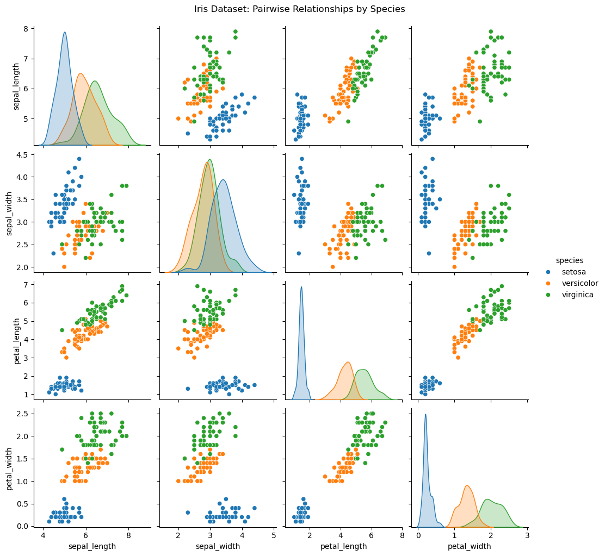
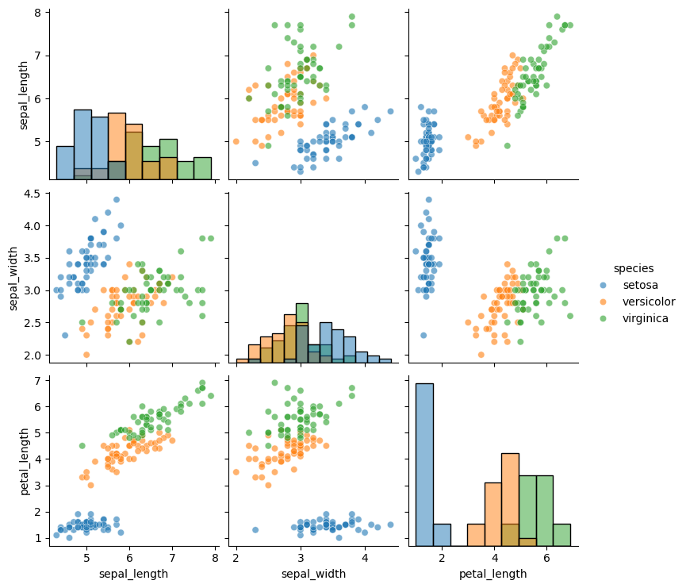
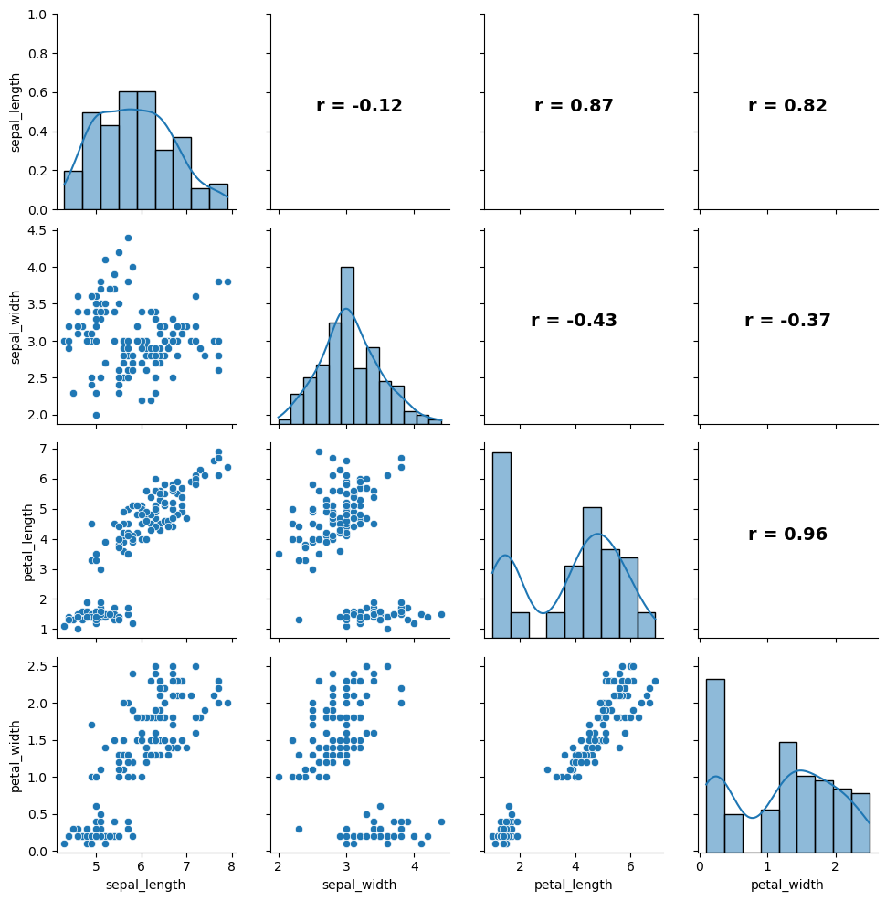
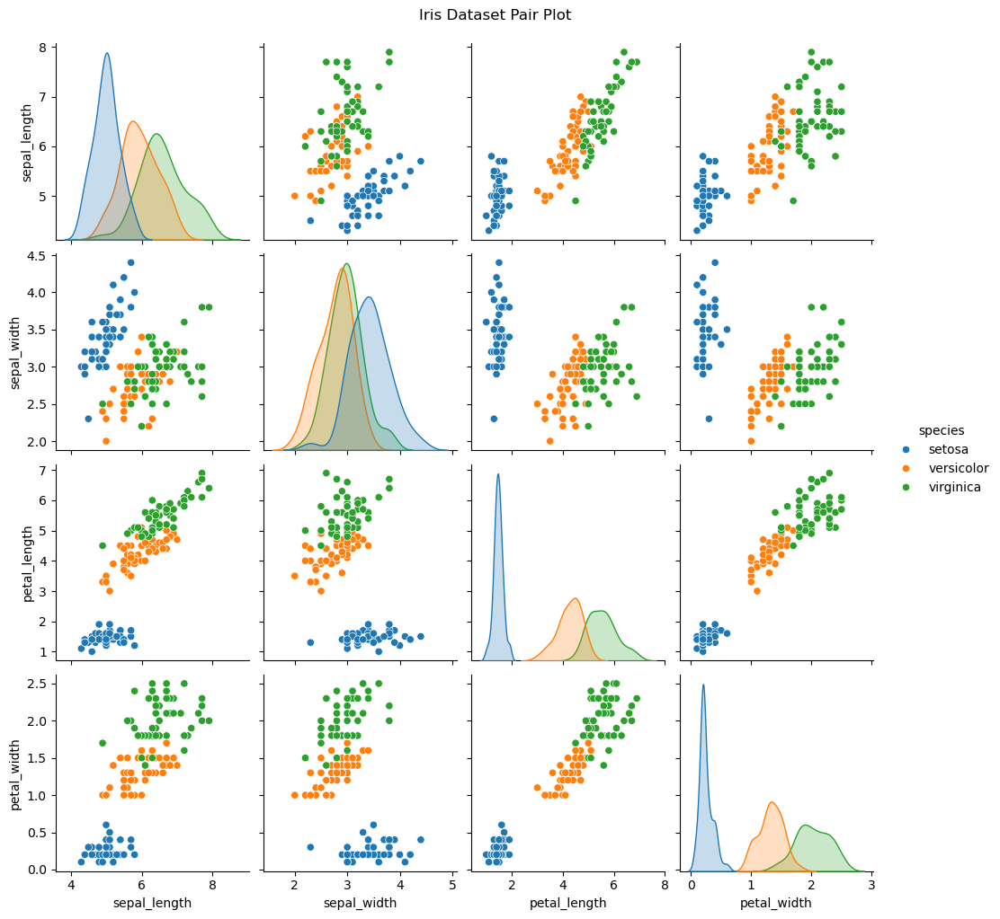

# 쌍 그림과 산점도 행렬

여러 양적 변수를 가진 자료를 탐색할 때 변수 쌍마다 개별적으로 살펴보는 일은 관계를 이해하는 데 필수적이다. **쌍 그림**(**산점도 행렬**이라고도 한다)은 모든 쌍별 산점도를 하나의 격자에 표시하여 자료의 이변량 관계를 종합적으로 보여준다. 다변량 자료의 탐색적 분석에서 가장 중요한 도구 중 하나이다.

---

## 1. 쌍 그림이란

변수가 $p$개일 때 쌍 그림은 $p \times p$ 격자의 패널을 만든다:

- **비대각 패널**: 각 변수 쌍 $(X_i, X_j)$의 산점도.
- **대각 패널**: 각 변수의 일변량 그림(히스토그램, 커널밀도추정, 상자그림).

변수가 $p$개면 서로 다른 쌍은 $\binom{p}{2} = p(p-1)/2$개이다. 격자는 각 쌍을 (축을 바꾸어 위쪽 삼각형과 아래쪽 삼각형에) 두 번 표시하므로, 어떤 구현은 위·아래 삼각형에 서로 다른 종류의 그림을 넣는다.

---

## 2. 쌍 그림 읽기

쌍 그림을 살필 때 다음을 본다:

1. **연관의 방향**: 점들이 오른쪽 위로 기우는가(양), 오른쪽 아래로 기우는가(음)?
2. **연관의 강도**: 점들이 추세 주위에 얼마나 촘촘히 모여 있는가? 촘촘할수록 상관이 강하다.
3. **선형성**: 추세가 대략 선형인가, 곡률이 있는가?
4. **이상점**: 주된 무리에서 멀리 떨어진 점이 있는가?
5. **군집**: 점들이 뚜렷한 무리를 이루어 하위 모집단을 시사하는가?
6. **이분산성**: $X$의 범위에 걸쳐 $Y$의 흩어짐이 달라지는가?

대각 패널은 주변분포를 드러낸다. 그 모양(대칭, 치우침, 이봉)이 상관 측도와 통계 검정의 선택에 정보를 준다.

---

## 3. Seaborn으로 그리는 기본 쌍 그림

`seaborn` 라이브러리의 `pairplot` 함수는 최소한의 코드로 출판 수준의 쌍 그림을 만들어 준다.

<div class="exbox" markdown>

**보기 1.** <span class="diff easy" title="쉬움"></span> 쌍그림에서 품종 구별력을 읽기. 붓꽃 $150$송이의 네 측정값을 품종으로 색을 입혀 $4 \times 4$ 쌍그림으로 그린다.

**(1)** 어느 변수 짝에서 세 품종이 가장 잘 갈리고 어느 짝에서 가장 덜 갈리는가. 눈대중이 아니라 수치로 뒷받침하시오.

**(2)** 대각선의 네 밀도 가운데 봉우리가 둘로 갈라진 것이 있다. 어느 변수이며 그 갈라짐은 어디서 오는가.

</div>

??? success "풀이"

    **유도할 답이 없는 보기다.** 쌍그림은 보여 주는 것이 전부이므로 풀이의 몫은 **무엇을 어떤 수치로 읽어야 하는가**를 정하는 데 있다. 여기서는 잣대를 둘 쓴다.

    - **완전 분리**: 한 품종의 최대가 나머지의 최소보다 작으면 그 변수 하나로 겹침 없이 갈린다.
    - **겹치는 두 품종의 분리**: versicolor 와 virginica 에 대해 표준화된 평균차 $d = (\bar y_2 - \bar y_1)/s_{\text{pooled}}$ 와, 변수 하나에 칼을 한 번 대어 둘을 나눌 때의 최소 오분류 개수.

    **(1)** 꽃잎 두 변수가 이긴다.

    | 변수 | setosa 최대 | 나머지 최소 | versicolor–virginica $d$ | 한칼 오류 |
    |---|---|---|---|---|
    | sepal_length | $5.8$ | $4.9$ | $1.13$ | $27/100$ |
    | sepal_width | $4.4$ | $2.0$ | $0.64$ | $37/100$ |
    | **petal_length** | $1.9$ | $3.0$ | $2.52$ | $7/100$ |
    | **petal_width** | $0.6$ | $1.0$ | $2.93$ | $6/100$ |

    꽃잎 두 변수에서는 setosa 의 최대가 나머지의 최소보다 **작다**($1.9 < 3.0$, $0.6 < 1.0$). 그래서 petal_length–petal_width 칸에서 setosa 가 왼쪽 아래 구석에 **빈 띠를 두고 따로 떨어진 덩어리**로 보인다. 꽃받침 두 변수에서는 범위가 겹치므로($5.8 > 4.9$, $4.4 > 2.0$) setosa 조차 완전히 갈리지 않는다.

    가장 덜 갈리는 것은 **sepal_width** 다. $d = 0.64$ 이고 한칼 오류가 $37/100$ 이다. 동전을 던지면 $50$ 이 나오므로 $37$ 은 거의 쓸모가 없다는 뜻이다. sepal_length–sepal_width 칸을 보면 세 색이 뒤엉켜 있다.

    **(2) petal_length 와 petal_width** 다. 두 변수의 품종별 범위를 보면 setosa 는 $[1.0, 1.9]$, 나머지는 $[3.0, 6.9]$ 라 **$1.9$ 와 $3.0$ 사이가 완전히 빈다.** 품종을 섞어 놓은 주변분포는 이 빈 구간에서 밀도가 0 이 되므로 봉우리가 둘로 갈라진다. 곧 **이봉성은 petal_length 라는 변수의 성질이 아니라 자료가 세 품종의 섞임이라는 사실의 흔적**이다. 꽃받침 두 변수는 범위가 겹치므로 봉우리가 하나다.

    ```python
    import seaborn as sns
    import matplotlib.pyplot as plt

    plt.rcParams["font.sans-serif"] = ["NanumGothic", "Apple SD Gothic Neo", "Malgun Gothic"]
    plt.rcParams["font.family"] = "sans-serif"
    plt.rcParams["axes.unicode_minus"] = False

    df = sns.load_dataset("iris")

    # 쌍그림은 수치형 열을 모두 짝지어 격자로 그린다. hue 로 품종을 나누면
    # 어느 변수 짝에서 품종이 갈리는지 한눈에 보인다.
    sns.pairplot(df, hue="species", diag_kind="kde")
    plt.suptitle("Iris Dataset: Pairwise Relationships by Species", y=1.02)
    plt.show()

    # 그림에서 읽은 것을 수치로 뒷받침한다.
    import numpy as np

    cols = ["sepal_length", "sepal_width", "petal_length", "petal_width"]
    a = df[df.species == "versicolor"]
    b = df[df.species == "virginica"]
    sub = df[df.species != "setosa"]

    print("변수별 품종 구별력")
    print(f"{'변수':>14s} {'setosa 최대':>11s} {'나머지 최소':>11s} "
          f"{'versi-virgi d':>14s} {'최적 한칼 오류':>14s}")
    for c in cols:
        smax = df[df.species == "setosa"][c].max()
        omin = sub[c].min()
        d = (b[c].mean() - a[c].mean()) / np.sqrt((a[c].var(ddof=1) + b[c].var(ddof=1)) / 2)
        grid = np.arange(sub[c].min(), sub[c].max(), 0.05)
        err = min(((sub[c] <= t) & (sub.species == "virginica")).sum()
                  + ((sub[c] > t) & (sub.species == "versicolor")).sum() for t in grid)
        print(f"{c:>14s} {smax:11.1f} {omin:11.1f} {d:14.3f} {err:11d}/100")
    ```

    출력:

    ```
    변수별 품종 구별력
                변수   setosa 최대      나머지 최소  versi-virgi d       최적 한칼 오류
      sepal_length         5.8         4.9          1.126          27/100
       sepal_width         4.4         2.0          0.641          37/100
      petal_length         1.9         3.0          2.521           7/100
       petal_width         0.6         1.0          2.925           6/100
    ```

    

    표의 네 줄이 그림에서 읽은 순서와 그대로 맞는다.

    **이 그림이 가리는 것.** 쌍그림의 칸은 모두 **두 변수만 본 주변 관계**다. 세 변수가 함께 얽힌 구조는 어느 칸에도 나타나지 않는다. 더 날카로운 예가 바로 sepal_length–sepal_width 칸이다. 색을 지우고 $150$개를 한 덩어리로 보면 그 상관이 음수인데 색마다 따로 재면 셋 다 양수다. `hue` 를 켰기 때문에 겨우 눈치챌 수 있는 것이고, 끄면 그림에서 사라진다. 보기 3에서 이 뒤집힘을 수로 쪼갠다.

---

## 4. 쌍 그림 꾸미기

### 변수 선택

열이 많은 자료에서 모든 쌍을 그리면 격자가 지나치게 복잡해진다. 변수의 부분집합을 고른다:

<div class="exbox" markdown>

**보기 2.** <span class="diff easy" title="쉬움"></span> 변수를 추리면 무엇을 잃는가. 네 변수 가운데 `petal_width` 를 빼고 세 개만 남겨 다시 그린다.

**(1)** 칸과 서로 다른 짝의 개수는 각각 몇에서 몇으로 줄어드는가. 사라진 짝을 모두 적고 그 가운데 $\lvert r \rvert$ 가 가장 큰 것을 말하시오.

**(2)** 하필 전체에서 가장 강한 짝이 사라진다. 그런데도 손실이 작다고 말할 수 있는가. 보기 1의 한칼 오류로 재어 보시오.

</div>

??? success "풀이"

    **(1) 세기만 하면 된다.** 변수 $p$개의 쌍그림은 칸이 $p^2$개이고 서로 다른 짝이 $\binom{p}{2}$개다. $p = 4 \to 3$ 이므로

    $$
    p^2:\; 16 \to 9, \qquad \binom{p}{2}:\; 6 \to 3
    $$

    이다. 사라지는 짝은 `petal_width` 가 끼는 셋뿐이다.

    | 사라진 짝 | $r$ |
    |---|---|
    | sepal_length – petal_width | $+0.8179$ |
    | sepal_width – petal_width | $-0.3661$ |
    | **petal_length – petal_width** | $\mathbf{+0.9629}$ |

    가장 큰 것은 $r = +0.9629$ 인 **petal_length–petal_width** 이고, 이것은 네 변수 전체에서도 가장 강한 짝이다. 남은 세 짝의 최대는 $0.8718$ 이다.

    **(2) 그렇다. 그리고 손실이 작은 까닭이 바로 $r = 0.963$ 이다.** 두 변수의 상관이 $0.963$ 이라는 말은 둘이 거의 같은 것을 재고 있다는 뜻이므로, 하나를 지워도 남은 하나가 그 몫을 거의 다 한다. 보기 1의 잣대로 재면 versicolor–virginica 를 가르는 한칼 오류가

    $$
    \text{petal\_width}:\; 6/100 \qquad \to \qquad \text{petal\_length}:\; 7/100
    $$

    으로 **한 송이만 늘어난다.** 지운 짝의 $r$ 가 가장 컸다는 사실과 잃은 정보가 가장 적다는 사실은 모순이 아니라 같은 말이다.

    ```python
    import seaborn as sns
    import matplotlib.pyplot as plt

    df = sns.load_dataset("iris")

    # 변수가 많으면 격자가 커져 읽기 어렵다. vars 로 볼 것만 고른다.
    sns.pairplot(
        df,
        vars=["sepal_length", "sepal_width", "petal_length"],
        hue="species",
        diag_kind="hist",
        plot_kws={"alpha": 0.6},
    )
    plt.show()

    # 무엇을 잃었는지 센다.
    import itertools
    import numpy as np

    allv = ["sepal_length", "sepal_width", "petal_length", "petal_width"]
    kept = ["sepal_length", "sepal_width", "petal_length"]
    R = df[allv].corr()

    print(f"칸 수 {len(allv)**2} -> {len(kept)**2},  "
          f"서로 다른 짝 {len(allv)*(len(allv)-1)//2} -> {len(kept)*(len(kept)-1)//2}")
    print("\n사라진 짝")
    for u, v in itertools.combinations(allv, 2):
        if u in kept and v in kept:
            continue
        print(f"  {u:>13s} - {v:<13s} r = {R.loc[u, v]:+.4f}")
    print(f"\n남은 짝의 최대 |r| = "
          f"{max(abs(R.loc[u, v]) for u, v in itertools.combinations(kept, 2)):.4f}")

    # petal_width 가 빠진 대가: versicolor/virginica 를 가르는 한칼의 오류
    sub = df[df.species != "setosa"]
    for c in ["petal_width", "petal_length"]:
        grid = np.arange(sub[c].min(), sub[c].max(), 0.05)
        err = min(((sub[c] <= t) & (sub.species == "virginica")).sum()
                  + ((sub[c] > t) & (sub.species == "versicolor")).sum() for t in grid)
        print(f"{c:>13s} 한칼 오류 = {err}/100")
    ```

    출력:

    ```
    칸 수 16 -> 9,  서로 다른 짝 6 -> 3

    사라진 짝
       sepal_length - petal_width   r = +0.8179
        sepal_width - petal_width   r = -0.3661
       petal_length - petal_width   r = +0.9629

    남은 짝의 최대 |r| = 0.8718
      petal_width 한칼 오류 = 6/100
     petal_length 한칼 오류 = 7/100
    ```

    

    **추릴 때 무엇을 보아야 하는가.** 이 보기가 잘 끝난 것은 지운 변수가 남은 변수와 $0.963$ 으로 겹쳐 있었기 때문이다. **상관이 낮은 변수를 지우면 반대가 된다.** sepal_width 는 남은 짝들과 상관이 $-0.118$ 과 $-0.428$ 뿐이라 다른 어느 변수도 그 몫을 대신하지 못한다. 그러므로 변수를 고를 때 보아야 할 것은 "그 변수가 중요한가"가 아니라 **"남는 변수들이 그것을 대신할 수 있는가"** 다.

    **이 그림이 가리는 것.** 추린 쌍그림은 **빠진 변수가 남은 관계를 교란하는지 전혀 보이지 않는다.** 격자만 보면 petal_width 가 애초에 없는 자료와 구별되지 않는다.

### 그림에 상관계수 표시하기

각 패널에 상관 수치를 넣으면 산점도가 시각적으로 보여주는 것을 수치로 확인할 수 있다:

<div class="exbox" markdown>

**보기 3.** <span class="diff easy" title="쉬움"></span> 칸에 적은 수가 말하지 않는 것. 위쪽 삼각형에 Pearson $r$ 를 적는다. 이때 `hue` 를 주지 않았으므로 적히는 수는 $150$송이를 **한 덩어리로** 잰 값이다.

**(1)** sepal_length–sepal_width 칸에는 $r = -0.12$ 가 적힌다. 품종별로 따로 재면 $+0.74$, $+0.53$, $+0.46$ 으로 셋 다 양수다. 3.4절의 전체 공분산 법칙을 써서 이 부호 뒤집힘이 어느 항에서 오는지 가리시오.

**(2)** 품종 평균 세 점만으로 상관을 재면 얼마인가. 그 값이 (1)의 어느 항에 해당하는가.

</div>

??? success "풀이"

    **(1) 공분산이 두 조각으로 정확히 쪼개진다.** 품종을 $Z$ 라 하면

    $$
    \operatorname{Cov}(X, Y)
    = \underbrace{E\!\left[\operatorname{Cov}(X, Y \mid Z)\right]}_{\text{품종 안}}
    + \underbrace{\operatorname{Cov}\!\left(E[X \mid Z],\, E[Y \mid Z]\right)}_{\text{품종 사이}}
    $$

    이다. 세 품종이 각각 $50$송이로 같으므로 $Z$ 는 균등하고 두 항 모두 세 품종에 대한 단순평균이 된다. **칸에 적히는 $r$ 는 이 두 항의 합을 두 표준편차로 나눈 값**이므로, 품종 안의 몫이 양수여도 품종 사이의 몫이 더 크게 음수이면 부호가 뒤집힌다. 이 자료가 바로 그 경우다.

    $$
    \underbrace{+0.090867}_{\text{품종 안}} \;+\; \underbrace{(-0.133018)}_{\text{품종 사이}} \;=\; -0.042151
    $$

    법칙 자체의 유도와 이 자료에 대한 자세한 셈은 [상관계수](../../ch03/rv/correlation.md) 절에서 이미 했으므로 여기서는 쓰기만 하고, 이 보기의 몫인 **"위쪽 삼각형의 수가 어느 항을 보여 주는가"** 에 집중한다. 답은 **합만 보여 주고 두 항은 보여 주지 않는다** 이다.

    **(2) 품종 평균 세 점의 상관은 $-0.7451$ 이다.** 이것이 품종 사이의 몫을 **그 항만의 표준편차로 정규화한** 값이다. 품종 안의 몫만 남긴 상관은 $+0.5302$ 다. 그러므로 같은 자료에서 세 수가 나온다.

    | 무엇을 재는가 | 상관 |
    |---|---|
    | 품종을 무시하고 $150$송이 | $-0.1176$ (칸에 적히는 값) |
    | 품종 안만 ($150$송이, 평균을 맞춘 뒤) | $+0.5302$ |
    | 품종 평균 세 점만 | $-0.7451$ |

    **셋 가운데 어느 것도 다른 둘을 대신하지 못한다.** 그런데 그림은 맨 윗줄 하나만 적는다.

    ```python
    import seaborn as sns
    import matplotlib.pyplot as plt
    import numpy as np

    plt.rcParams["font.sans-serif"] = ["NanumGothic", "Apple SD Gothic Neo", "Malgun Gothic"]
    plt.rcParams["font.family"] = "sans-serif"
    plt.rcParams["axes.unicode_minus"] = False

    df = sns.load_dataset("iris")
    numeric_cols = ["sepal_length", "sepal_width", "petal_length", "petal_width"]

    # PairGrid 는 칸마다 무엇을 그릴지 직접 고를 수 있다. 아래쪽 삼각형에는
    # 산점도, 대각선에는 분포, 위쪽 삼각형에는 상관계수를 적는다.
    g = sns.PairGrid(df[numeric_cols])
    g.map_lower(sns.scatterplot)
    g.map_diag(sns.histplot, kde=True)

    def annotate_corr(x, y, **kwargs):
        """칸 가운데에 상관계수를 적는다. map_upper 가 칸마다 불러 준다."""
        r = np.corrcoef(x, y)[0, 1]
        ax = plt.gca()
        ax.annotate(f"r = {r:.2f}", xy=(0.5, 0.5),
                    xycoords="axes fraction", ha="center",
                    fontsize=14, fontweight="bold")

    g.map_upper(annotate_corr)
    plt.show()

    # 적혀 있는 r 를 전체 공분산 법칙으로 쪼갠다.
    x = df.sepal_length.values
    y = df.sepal_width.values
    sp = df.species.values
    names = ["setosa", "versicolor", "virginica"]

    cov0 = lambda a, b: np.mean((a - a.mean()) * (b - b.mean()))
    print(f"적혀 있는 r = {np.corrcoef(x, y)[0, 1]:+.4f}   (품종을 무시한 값)")
    print(f"\n{'품종':>11s} {'가중 w':>7s} {'평균 x':>7s} {'평균 y':>7s} "
          f"{'군내 Cov':>9s} {'군내 r':>7s}")
    within = between = 0.0
    for nm in names:
        m = sp == nm
        w = m.sum() / len(x)
        c = cov0(x[m], y[m])
        within += w * c
        between += w * (x[m].mean() - x.mean()) * (y[m].mean() - y.mean())
        print(f"{nm:>11s} {w:7.4f} {x[m].mean():7.3f} {y[m].mean():7.3f} "
              f"{c:+9.6f} {c / (x[m].std() * y[m].std()):+7.4f}")

    total = cov0(x, y)
    print(f"\nE[Cov(X,Y|Z)]        = {within:+.6f}   (군내 — 모두 양수)")
    print(f"Cov(E[X|Z],E[Y|Z])   = {between:+.6f}   (군간 — 음수)")
    print(f"합                   = {within + between:+.6f}")
    print(f"Cov(X,Y) 직접 계산   = {total:+.6f}")
    print(f"\nsd(X) = {x.std():.4f},  sd(Y) = {y.std():.4f}  ->  "
          f"r = {total / (x.std() * y.std()):+.4f}")

    # 군간 항을 없앤 자료, 곧 품종별 평균을 맞춘 자료의 상관
    sx = np.sqrt(sum(m.sum() / len(x) * x[m].var() for m in (sp == nm for nm in names)))
    sy = np.sqrt(sum(m.sum() / len(y) * y[m].var() for m in (sp == nm for nm in names)))
    print(f"군내만 남긴 상관     = {within / (sx * sy):+.4f}")
    print(f"품종 평균 셋의 상관  = "
          f"{np.corrcoef([5.006, 5.936, 6.588], [3.428, 2.770, 2.974])[0, 1]:+.4f}")
    ```

    출력:

    ```
    적혀 있는 r = -0.1176   (품종을 무시한 값)

             품종    가중 w    평균 x    평균 y    군내 Cov    군내 r
         setosa  0.3333   5.006   3.428 +0.097232 +0.7425
     versicolor  0.3333   5.936   2.770 +0.083480 +0.5259
      virginica  0.3333   6.588   2.974 +0.091888 +0.4572

    E[Cov(X,Y|Z)]        = +0.090867   (군내 — 모두 양수)
    Cov(E[X|Z],E[Y|Z])   = -0.133018   (군간 — 음수)
    합                   = -0.042151
    Cov(X,Y) 직접 계산   = -0.042151

    sd(X) = 0.8253,  sd(Y) = 0.4344  ->  r = -0.1176
    군내만 남긴 상관     = +0.5302
    품종 평균 셋의 상관  = -0.7451
    ```

    

    **쪼갠 두 항의 합이 직접 계산한 공분산과 소수 여섯째 자리까지 같다.** 근사가 아니라 항등식이므로 당연히 그래야 하고, 어긋나면 코드가 틀린 것이다.

    품종 사이의 몫이 음수인 까닭도 표에서 읽힌다. 세 품종의 평균이 $(5.006, 3.428) \to (5.936, 2.770) \to (6.588, 2.974)$ 로 가면서 꽃받침 길이는 줄곧 늘지만 폭은 setosa 에서 뚝 떨어진다. 세 점을 이으면 **오른쪽 아래로 기울어** $r = -0.745$ 다.

    **이 꾸밈이 가리는 것.** `annotate` 가 적는 수에는 어떤 경고도 붙지 않는다. 적어도 이 셋은 함께 보아야 한다.

    - **표본크기.** $n$ 이 작으면 같은 $r$ 가 전혀 다른 뜻이다. 여기서 $r = -0.12$ 는 $n = 150$ 에서 $p = 0.152$ 로 **유의하지도 않다.**
    - **비선형성.** $r$ 는 직선 관계만 잰다. petal 두 변수처럼 품종 덩어리가 떨어져 있으면 직선이 애초에 맞는 틀이 아니다.
    - **섞임.** 위에서 본 대로다. `hue` 를 주어 칸마다 품종별 $r$ 를 적는 것이 이 자료에서는 더 정직하다.

---

## 5. 쌍 그림을 언제 쓰는가

쌍 그림은 다음일 때 가장 유용하다:

- 변수의 수가 적당할 때($p \le 10$). $p$가 아주 크면 격자를 다루기 어려워진다.
- 분석의 탐색 단계에서 모든 쌍별 관계를 빠르게 훑고 싶을 때.
- 하위집단마다 관계가 다를 것 같을 때(`hue` 인자를 쓴다).
- 모형을 적합하기 전에 회귀 가정(선형성, 등분산성)을 확인하고 싶을 때.

고차원 자료($p > 10$)에서는 다음을 고려한다:

- 분야 지식에 근거해 가장 중요한 변수를 고른다.
- **상관 열지도**([열지도](heatmaps.md) 참조)로 가장 강한 관계를 찾은 뒤 그 쌍들만 자세히 살핀다.
- 개관을 위해 차원 축소 기법(PCA, t-SNE)을 쓴다.

---

## 6. 쌍 그림과 상관행렬

| 항목 | 쌍 그림 | 상관행렬/열지도 |
|:---|:---|:---|
| 비선형 패턴을 보여주는가 | 예 | 아니오 |
| 이상점을 보여주는가 | 예 | 아니오 |
| 군집을 보여주는가 | 예 | 아니오 |
| 변수가 많을 때의 확장성 | 나쁨($p > 10$) | 좋음($p > 50$) |
| 수치를 제공하는가 | 아니오(주석을 달지 않는 한) | 예(쌍마다 $r$) |

쌍 그림과 상관 열지도는 상호보완적인 도구이다. 열지도는 많은 관계를 간결하게 요약하고, 쌍 그림은 하나의 수치가 담을 수 없는 세부를 드러낸다.

---

## 7. 해석의 함정

!!! warning "작은 표본의 패턴을 과잉 해석하지 말 것"
    자료점이 적으면 순전히 우연으로 생긴 패턴이 산점도에 보일 수 있다. 쌍 그림을 해석할 때 표본크기를 항상 고려하라.

!!! warning "쌍 그림은 주변 관계만 보여준다"
    각 패널은 다른 변수들을 무시한 채 두 변수 사이의 이변량 관계만 보여준다. 강한 주변상관이 다른 변수로 조건화하면 약해지거나 뒤집힐 수 있다([Simpson의 역설](../ecological_correlation/simpsons_paradox.md)과 [부분상관](../correlation/partial.md) 참조).

---

## 연습문제

<div class="drillbox" markdown>

**연습문제 1.** <span class="diff easy" title="쉬움"></span>
seaborn으로 붓꽃 자료의 쌍 그림을 종에 따라 색을 입혀 그리는 Python 코드를 작성하라.

</div>

??? success "풀이"
    ```python
    import seaborn as sns
    import matplotlib.pyplot as plt

    iris = sns.load_dataset("iris")
    g = sns.pairplot(iris, hue="species", diag_kind="kde")
    g.fig.suptitle("Iris Dataset Pair Plot", y=1.02)
    plt.show()
    ```

    

    대각선에는 각 변수의 분포를, 비대각선에는 쌍별 산점도를 그린다. 회귀선을 얹으면 관계의 방향을 읽기 쉽다.

    `hue="species"` 인자가 종에 따라 점에 색을 입혀 집단마다 쌍별 관계가 다른지 드러낸다. 대각선의 KDE는 각 측정값에 대한 종별 분포를 보여준다. 산점도 패널에서 색이 잘 분리될수록 그 변수 쌍이 종을 잘 구별한다는 뜻이다.

---

<div class="drillbox" markdown>

**연습문제 2.** <span class="diff med" title="중간"></span>
쌍 그림(산점도 행렬)이 무엇을 보여주는지 기술하고, 변수가 4개일 때 무엇을 살펴야 하는지 설명하라.

</div>

??? success "풀이"
    쌍 그림은 변수의 모든 쌍별 조합을 보여주는 산점도 격자이다. 변수가 $p = 4$개면 $4 \times 4$ 격자가 되고 서로 다른 산점도는 $\binom{4}{2} = 6$개이다(행렬이 대칭이다). 대각 패널은 보통 각 변수의 일변량 분포(히스토그램이나 KDE)를 보여준다.

    변수 4개인 쌍 그림을 해석할 때 살필 것:

    1. **선형 대 비선형 관계:** 산점도가 대략 선형인가, 곡률을 보이는가?
    2. **연관의 강도와 방향:** 점구름이 촘촘하면 강한 상관, 퍼져 있으면 약한 상관이다.
    3. **이상점:** 어떤 패널에서든 주된 구름에서 멀리 떨어진 점.
    4. **군집:** 하위 모집단을 시사할 수 있는 점들의 무리.
    5. **이분산성:** 부채꼴 산포(한 변수의 수준에 따라 분산이 변함).
    6. **주변분포:** 대각 패널에서 보이는 치우침, 다봉성, 두꺼운 꼬리.

---

<div class="drillbox" markdown>

**연습문제 3.** <span class="diff med" title="중간"></span>
변수의 수 $p$가 클 때(예: $p > 10$) 쌍 그림이 왜 오도할 수 있는지 설명하고 대안을 제시하라.

</div>

??? success "풀이"
    $p > 10$이면 쌍 그림의 패널이 $p^2 > 100$개가 되어:

    1. **시각적으로 압도적이다:** 개별적으로 살피기에 패널이 너무 많다. 중요한 패턴이 격자 속에 묻힌다.
    2. **계산 비용이 크다:** 수천 개의 점을 가진 산점도 수백 개를 그리는 것은 느리다.
    3. **통계적으로 제한적이다:** 쌍별 산점도는 고차원 구조를 놓친다(예: 세 변수가 결합적으로 상관되어 있어도 어떤 쌍에서도 보이지 않을 수 있다).

    **고차원 자료의 대안:**

    - **상관 열지도:** 모든 쌍별 상관을 하나의 색 행렬로 요약한다.
    - **PCA나 t-SNE:** 2–3차원으로 줄여 축소된 표현을 시각화한다.
    - **초점을 좁힌 쌍 그림:** (분야 지식이나 상관 선별에 근거해) 가장 중요한 변수 5–6개를 골라 쌍 그림을 그린다.

---

<div class="drillbox" markdown>

**연습문제 4.** <span class="diff med" title="중간"></span>
회귀 맥락에서 쌍 그림으로 다중공선성을 어떻게 시각적으로 탐지할 수 있는가?

</div>

??? success "풀이"
    다중공선성은 쌍 그림에서 설명변수들 사이의 강한 선형관계로 나타난다:

    1. **촘촘하게 모인 산점도:** 두 설명변수가 거의 완벽한 선형 추세(점들이 직선을 따라 놓임)를 보이면 강하게 공선적이다. 둘을 모두 회귀모형에 넣으면 표준오차가 부풀려진다.

    2. **동일한 패턴:** 설명변수 $X_2$가 모든 패널에서 $X_1$을 평행이동·축척한 것처럼 보이면(반응변수와도, 다른 설명변수와도 비슷한 산포를 보이면) 중복된 정보를 담고 있는 것이다.

    3. **상관값:** 각 패널에 Pearson의 $r$을 겹쳐 표시하거나 위쪽 삼각형에 상관계수를 넣은 쌍 그림을 쓰면 $|r| > 0.8$이나 $0.9$인 쌍이 즉시 눈에 띈다.

    탐지된 다중공선성에 대처하려면 상관된 설명변수 중 하나를 빼거나, 둘을 결합하거나(예: 평균이나 PCA), 정칙화(릿지/LASSO)를 쓴다.

---

## 정리하며

쌍 그림은 다변량 자료의 모든 쌍별 관계를 종합적으로 시각 요약해 준다. 연관의 방향, 강도, 모양은 물론 이상점과 군집도 드러낸다. `seaborn.pairplot` 함수로 쉽게 만들 수 있으며 집단별 색 입히기, 대각 그림 바꾸기, 상관계수 주석 달기 같은 선택지를 제공한다. 쌍 그림은 변수 수가 적당한 자료에서 가장 효과적이며, 완결된 분석을 위해서는 상관 열지도와 형식적인 통계 검정을 함께 써야 한다.
