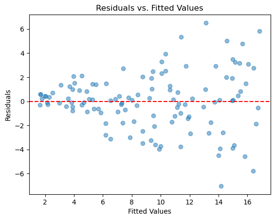
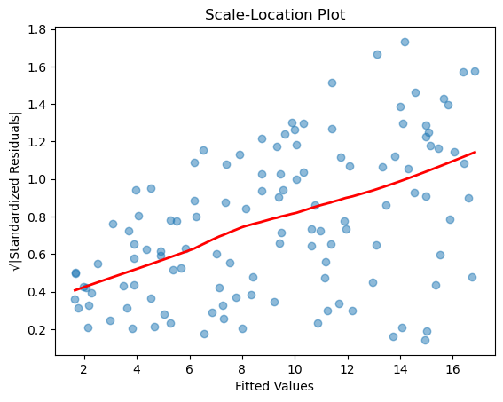

# 선형회귀의 등분산성 확인

선형회귀의 핵심 가정 가운데 하나인 등분산성은 잔차(오차)의 분산이 독립변수의 모든 수준에서 일정하다는 조건을 말한다. 이 가정이 위배되어 잔차의 분산이 일정하지 않으면(이분산) 추정이 비효율적이 되고 표준오차가 편향되며 가설검정을 믿을 수 없게 된다. 이 절은 선형회귀에서 등분산성을 확인하는 방법을 시각적 점검과 통계검정으로 나누어 살펴본다.

## 1. 등분산성의 이해

**정의:**
등분산성은 잔차의 흩어짐(분산)이 독립변수의 모든 수준에서 같다는 뜻이다. 다시 말해 독립변수의 값이 무엇이든 오차의 분포가 대체로 같아야 한다.

형식적으로

$$
\text{Var}(\epsilon_i \mid X_i) = \sigma^2 \quad \text{(모든 } i \text{에 대해)}
$$

**왜 중요한가:**
등분산성이 위배되면

- **표준오차:** 계수의 표준오차가 편향되어 신뢰구간과 가설검정이 틀리게 된다.
- **모형의 효율성:** 최소제곱(OLS) 추정량은 여전히 불편이지만 더 이상 효율적이지 않으므로 더 정밀한 추정량이 존재할 수 있다. 구체적으로 Gauss-Markov 정리의 의미에서 OLS는 더 이상 최소분산 선형불편추정량(BLUE)이 아니다.

## 설정

이 페이지의 진단은 모두 아래 자료와 모형 하나를 놓고 수행한다.

```python
import numpy as np
import pandas as pd
import statsmodels.api as sm

rng = np.random.default_rng(7)
n = 120

# X는 균등, Y는 X에 선형으로 의존하되 오차의 분산이 X와 함께 커진다.
# 이렇게 두면 선형성은 성립하고 등분산성만 깨져, 각 진단이 무엇을
# 잡아내고 무엇을 놓치는지 구분해 볼 수 있다.
X = rng.uniform(0, 10, n)
Y = 2.0 + 1.5 * X + rng.normal(0, 0.5 + 0.35 * X, n)

df = pd.DataFrame({"X": X, "Y": Y})
model = sm.OLS(Y, sm.add_constant(X)).fit()
residuals = model.resid
fitted = model.fittedvalues

print(f"beta_hat = {model.params.round(4)}")
print(f"R^2 = {model.rsquared:.4f}")
```

출력:

```
beta_hat = [1.5933 1.5317]
R^2 = 0.7813
```

기울기 추정값 1.53이 참값 1.5에 가깝다. 이분산이 있어도 OLS 추정값 자체는 불편이며, 흔들리는 것은 표준오차다.

## 2. 잔차-적합값 그림

**잔차-적합값 그림**은 등분산성을 시각적으로 확인하는 가장 흔하고 효과적인 방법이다. 이 그림으로 잔차의 흩어짐에 체계적인 패턴이 있는지 볼 수 있다.

**절차:**

1. **선형회귀 모형 적합:** 모형을 적합하여 잔차와 적합값을 얻는다.
2. **그림 그리기:** $y$축에 잔차, $x$축에 적합값을 두고 그린다.
3. **그림 평가:** 잔차의 흩어짐에 패턴이 있는지 살핀다.

**예시:**

```python
import matplotlib.pyplot as plt

# Assuming 'model' is your fitted OLS model
residuals = model.resid
fitted = model.fittedvalues

plt.scatter(fitted, residuals, alpha=0.5)
plt.axhline(y=0, color='red', linestyle='--')
plt.xlabel('Fitted Values')
plt.ylabel('Residuals')
plt.title('Residuals vs. Fitted Values')
plt.show()
```



깔때기 모양이 뚜렷하다. 적합값이 커질수록 잔차의 퍼짐이 커지는 전형적인 이분산 패턴이다.

**해석:**

- **등분산성:** 잔차가 수평선(0) 주위에 일정한 폭으로 무작위로 흩어져 있으면 등분산성이 성립할 가능성이 높다.
- **이분산:** 잔차의 흩어짐이 적합값에 따라 커지거나 작아지면(예: 깔때기 모양) 이분산을 나타낸다.

## 3. Breusch-Pagan 검정

**Breusch-Pagan 검정**은 이분산을 탐지하는 형식적 통계검정이다. 잔차의 분산이 독립변수에 의존하는지를 평가한다.

**가설:**

- $H_0$: 등분산 — $\text{Var}(\epsilon_i) = \sigma^2$ (상수)
- $H_1$: 이분산 — $\text{Var}(\epsilon_i)$가 하나 이상의 독립변수에 의존한다

**절차:**

이 검정은 제곱잔차 $e_i^2$을 독립변수에 회귀시킨다.

$$
e_i^2 = \gamma_0 + \gamma_1 X_{1i} + \gamma_2 X_{2i} + \cdots + \gamma_p X_{pi} + u_i
$$

검정통계량은 이 보조회귀의 $nR^2$이며, $H_0$ 아래에서 $\chi^2(p)$ 분포를 따른다.

**단계:**

1. **선형회귀 모형 적합:** 적합된 모형에서 잔차를 얻는다.
2. **Breusch-Pagan 검정 수행:** 잔차에 기초해 통계량을 계산한다.
3. **결과 해석:** p값이 유의하면(보통 < 0.05) 이분산을 시사한다.

**예시:**

```python
from statsmodels.stats.diagnostic import het_breuschpagan

# Assuming 'model' is your fitted OLS model and 'X' is the independent variable(s)
bp_test = het_breuschpagan(model.resid, model.model.exog)
labels = ['LM Statistic', 'LM p-value', 'F-Statistic', 'F p-value']
for label, value in zip(labels, bp_test):
    print(f'{label}: {value:.4f}')
```

출력:

```
LM Statistic: 25.4256
LM p-value: 0.0000
F-Statistic: 31.7235
F p-value: 0.0000
```

Breusch-Pagan 검정이 $p < 0.0001$로 등분산을 강하게 기각한다. 오차의 표준편차를 $0.5 + 0.35X$로 만들었으니 옳은 판정이다.

**해석:**

- **p값 > 0.05:** 이분산의 유의한 증거가 없다.
- **p값 < 0.05:** 이분산의 유의한 증거가 있으며 등분산성 가정의 위배를 나타낸다.

## 4. White 검정

**White 검정**은 이분산뿐 아니라 비선형성을 포함한 더 일반적인 형태의 모형 오설정까지 확인하는 통계검정이다.

**Breusch-Pagan과의 핵심 차이:**

White 검정은 보조회귀에 원래의 독립변수뿐 아니라 그 **제곱항**과 **교차곱항**도 포함한다.

$$
e_i^2 = \gamma_0 + \gamma_1 X_{1i} + \gamma_2 X_{2i} + \gamma_3 X_{1i}^2 + \gamma_4 X_{2i}^2 + \gamma_5 X_{1i} X_{2i} + u_i
$$

이 때문에 더 일반적이지만 자유도를 더 많이 쓴다.

**단계:**

1. **선형회귀 모형 적합:** 적합된 모형에서 잔차를 얻는다.
2. **White 검정 수행:** 제곱잔차를 독립변수와 그 제곱항, 교차곱항에 회귀시킨다.
3. **결과 해석:** p값이 유의하면 이분산이나 다른 형태의 오설정을 나타낸다.

**예시:**

```python
from statsmodels.stats.diagnostic import het_white

# Assuming 'model' is your fitted OLS model
white_test = het_white(model.resid, model.model.exog)
labels = ['LM Statistic', 'LM p-value', 'F-Statistic', 'F p-value']
for label, value in zip(labels, white_test):
    print(f'{label}: {value:.4f}')
```

출력:

```
LM Statistic: 26.2253
LM p-value: 0.0000
F-Statistic: 16.3603
F p-value: 0.0000
```

White 검정도 $p < 0.0001$로 등분산을 기각한다. Breusch-Pagan이 이분산의 형태를 선형으로 가정하는 반면 White는 그런 가정 없이 검정하므로, 두 검정이 모두 기각하면 결론이 더 단단하다.

**해석:**

- **p값 > 0.05:** 이분산이나 다른 오설정의 유의한 증거가 없다.
- **p값 < 0.05:** 이분산이나 다른 모형 문제의 유의한 증거가 있다.

## 5. 척도-위치 그림

**척도-위치 그림**(산포-위치 그림)은 이분산을 탐지하는 또 하나의 유용한 시각화이다. 표준화 잔차의 절댓값의 제곱근을 적합값에 대해 그린다.

**왜 제곱근인가?** 표준화 잔차의 절댓값에 제곱근을 취하면 분포의 치우침이 줄어들어 분산의 추세를 눈으로 잡아내기 쉬워진다. 표준화는 평균의 효과를 제거하여 분산 패턴만 분리해 준다.

**절차:**

1. **선형회귀 모형 적합:** 표준화 잔차와 적합값을 얻는다.
2. **그림 그리기:** $y$축에 표준화 잔차 절댓값의 제곱근, $x$축에 적합값을 두고 그린다.
3. **그림 평가:** 잔차의 흩어짐에 패턴이 있는지 살핀다.

**예시:**

```python
import numpy as np
import matplotlib.pyplot as plt

# Assuming 'model' is your fitted OLS model
residuals = model.resid
fitted = model.fittedvalues
standardized_residuals = (residuals - np.mean(residuals)) / np.std(residuals)

plt.scatter(fitted, np.sqrt(np.abs(standardized_residuals)), alpha=0.5)
plt.xlabel('Fitted Values')
plt.ylabel('√|Standardized Residuals|')
plt.title('Scale-Location Plot')

# Add a lowess smoothing line for trend detection
from statsmodels.nonparametric.smoothers_lowess import lowess
smooth = lowess(np.sqrt(np.abs(standardized_residuals)), fitted, frac=0.6)
plt.plot(smooth[:, 0], smooth[:, 1], color='red', linewidth=2)
plt.show()
```



$\sqrt{|표준화 잔차|}$를 적합값에 대해 그린 것이다. 오른쪽으로 갈수록 점들이 위로 올라가는 추세가 뚜렷해 이분산을 확인해 준다.

!!! note "내부 스튜던트화 잔차"
    위 코드는 잔차를 그 표본표준편차로 나누는 간단한 표준화를 쓴다. 엄밀한 표준화는 지렛대를 반영한 $e_i / (s\sqrt{1 - h_{ii}})$이며 `model.get_influence().resid_studentized_internal`로 얻을 수 있다. 지렛대가 큰 관측값이 있으면 두 방식의 차이가 커진다.

**해석:**

- **등분산성:** 점들이 수평선 주위에 뚜렷한 패턴 없이 무작위로 흩어져야 한다. 평활선이 대체로 평평해야 한다.
- **이분산:** 상승 추세나 깔때기 모양 같은 패턴은 분산이 일정하지 않음을, 곧 이분산을 시사한다.

## 등분산성 검정의 비교

| 검정 | 유형 | 탐지 대상 | 장점 | 단점 |
|------|------|----------------|------|------|
| 잔차-적합값 | 시각적 | 모든 분산 패턴 | 직관적, 유연함 | 주관적 |
| 척도-위치 | 시각적 | 분산의 추세 | 추세가 뚜렷이 보임 | 주관적 |
| Breusch-Pagan | 형식적 | 선형 이분산 | 간단하고 검정력이 좋음 | 선형 형태를 가정 |
| White | 형식적 | 일반적 이분산 + 비선형성 | 매우 일반적 | 자유도를 많이 씀 |

선형회귀 분석에서 등분산성을 확인하는 일은 모형 추정의 타당성과 효율성을 확보하는 데 필수적이다. 이분산이 탐지되면 종속변수를 변환하거나, 가중최소제곱을 쓰거나, 로버스트 표준오차(HC0, HC1, HC2, HC3 추정량 등)를 써서 대처할 수 있다.

## 연습문제

<div class="drillbox" markdown>

**연습문제 1.**
잔차-적합값 그림에서 잔차가 오른쪽으로 갈수록 넓어지는 뚜렷한 깔때기 모양을 이룬다. 이 시각적 진단을 확인할 형식적 통계검정의 이름과 그 귀무가설을 말하라.

</div>

??? success "풀이"
    **Breusch-Pagan 검정**이 적절하다. 귀무가설은 $H_0$: 오차의 분산이 일정하다(등분산성)이다. 이 검정은 제곱잔차를 원래의 설명변수에 회귀시키고 그 $R^2$이 0과 유의하게 다른지 검정한다. 유의한 결과는 이분산을 확인해 준다.

    대안으로 **White 검정**을 쓸 수도 있다. 이 검정도 이분산을 검정하지만 제곱항과 교차곱항을 포함하여 비선형성까지 함께 확인한다.

<div class="drillbox" markdown>

**연습문제 2.**
이분산을 탐지한 뒤 한 연구자가 반응변수에 로그 변환을 적용했더니 깔때기 패턴이 사라졌다. 표준편차가 평균에 비례하는 자료에서 이 방법이 왜 통하는지 설명하라. 분산이 평균에 비례하는 경우에는 어떤 변환이 적절한가?

</div>

??? success "풀이"
    표준편차가 평균에 비례하면, 곧 $\text{SD}(Y|X) \propto E[Y|X] = \mu$이고 따라서 $\text{Var}(Y|X) \propto \mu^2$이면, 적합값이 클수록 잔차의 흩어짐이 커져 깔때기 모양이 생긴다. 로그 변환은 큰 값을 작은 값보다 더 많이 압축한다.

    델타 방법에 따르면

    $$
    \text{Var}(\log Y) \approx \frac{\text{Var}(Y)}{\mu^2}
    $$

    이므로 $\text{Var}(Y) \propto \mu^2$일 때 $\text{Var}(\log Y)$가 상수가 된다. 이것이 분산을 안정화하여 잔차를 근사적으로 등분산으로 만든다. 변동계수가 일정한 자료(예: 소득, 매출)에서 흔히 나타나는 상황이다.

    반면 **분산이 평균에 비례**하는 경우($\text{Var}(Y) \propto \mu$, 예: Poisson 계수 자료)에는 로그가 아니라 **제곱근 변환**이 적절하다. 델타 방법에서 $\text{Var}(\sqrt{Y}) \approx \text{Var}(Y)/(4\mu)$이므로 $\text{Var}(Y) \propto \mu$일 때 상수가 된다.

<div class="drillbox" markdown>

**연습문제 3.**
이분산에 대한 세 가지 대책 (1) 가중최소제곱, (2) 로버스트 표준오차, (3) 변수변환을 비교·대조하라. 각각은 어떤 상황에서 선호되는가?

</div>

??? success "풀이"

    1. **가중최소제곱(WLS):** 오차분산에 반비례하는 가중치를 준다. 이분산의 형태를 아는 경우(예: 분산이 알려진 변수에 비례)에 선호된다. 효율적인 추정을 낳는다.

    2. **로버스트(HC) 표준오차:** OLS 계수 추정값은 그대로 두고 표준오차만 교정한다. 모형을 바꾸거나 분산 구조에 가정을 두지 않고 타당한 추론만 얻는 것이 목적일 때 선호된다.

    3. **변수변환:** $Y$를 (로그, 제곱근 등으로) 변환하여 분산을 안정화한다. 변환이 선형성이나 정규성까지 개선하여 여러 가정 위배를 동시에 해결할 때 선호된다. 다만 계수의 해석이 달라진다.
