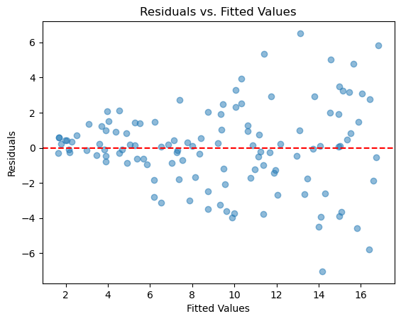
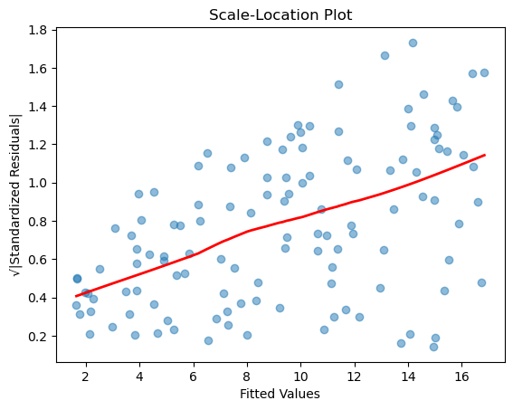

# 선형회귀의 등분산성 확인

선형회귀의 핵심 가정 가운데 하나인 등분산성은 잔차(오차)의 분산이 독립변수의 모든 수준에서 일정하다는 조건을 말한다. 이 가정이 위배되어 잔차의 분산이 일정하지 않으면(이분산) 추정이 비효율적이 되고 표준오차가 편향되며 가설검정을 믿을 수 없게 된다. 이 절은 선형회귀에서 등분산성을 확인하는 방법을 시각적 점검과 통계검정으로 나누어 살펴본다.

---

## 1. 등분산성의 이해

<div class="defn" markdown>

### 정의 1. 등분산성 { .dfn }
등분산성은 잔차의 흩어짐(분산)이 독립변수의 모든 수준에서 같다는 뜻이다. 다시 말해 독립변수의 값이 무엇이든 오차의 분포가 대체로 같아야 한다.

형식적으로

$$
\text{Var}(\epsilon_i \mid X_i) = \sigma^2 \quad \text{(모든 } i \text{에 대해)}
$$

**왜 중요한가:**
등분산성이 위배되면

- **표준오차:** 계수의 표준오차가 편향되어 신뢰구간과 가설검정이 틀리게 된다.
- **모형의 효율성:** 최소제곱(OLS) 추정량은 여전히 불편이지만 더 이상 효율적이지 않으므로 더 정밀한 추정량이 존재할 수 있다. 구체적으로 Gauss-Markov 정리의 의미에서 OLS는 더 이상 최소분산 선형불편추정량(BLUE)이 아니다.

</div>

---

## 2. 설정

이 페이지의 진단은 모두 아래 자료와 모형 하나를 놓고 수행한다.

<div class="exbox" markdown>

**보기 1.** <span class="diff easy" title="쉬움"></span> 진단에 쓸 모형 준비. 자료는 $x_i \sim U(0,10)$, $y_i = 2 + 1.5x_i + \varepsilon_i$, $\varepsilon_i \sim N(0, \sigma_i^2)$이며 $\sigma_i = 0.5 + 0.35x_i$다. 곧 **이분산이 설계로 들어 있는** 자료다. 잔차 벡터는 모자행렬 $H = X(X^\top X)^{-1}X^\top$로 $\mathbf e = (I - H)\boldsymbol\varepsilon$이다.

**(1)** 오차분산이 관측마다 $\sigma_i^2$일 때

$$
E[s^2] = \frac{1}{n-p}\sum_{i=1}^n (1 - h_{ii})\,\sigma_i^2
$$

임을 보이시오($h_{ii}$는 $H$의 대각 성분). 등분산이면 익숙한 $E[s^2] = \sigma^2$으로 돌아감을 확인하시오.

**(2)** (1)을 모의실험으로 확인하고, OLS와 가중최소제곱의 기울기 분산을 견주어 **OLS가 얼마를 잃는지** 재시오.

</div>

??? success "풀이"

    **(1) 해석적으로.** $\mathbf e = (I-H)\boldsymbol\varepsilon$에서 출발한다. $I - H$는 **대칭이고 멱등**이므로

    $$
    \mathbf e^\top \mathbf e = \boldsymbol\varepsilon^\top (I-H)^\top (I-H) \boldsymbol\varepsilon = \boldsymbol\varepsilon^\top (I-H) \boldsymbol\varepsilon
    $$

    이다. 이차형식의 기댓값은 $E[\boldsymbol\varepsilon^\top A \boldsymbol\varepsilon] = \operatorname{tr}(A\,\Sigma)$이며, 여기서 $\Sigma = \operatorname{Var}(\boldsymbol\varepsilon) = \operatorname{diag}(\sigma_1^2, \ldots, \sigma_n^2)$이다. 대각행렬과의 곱이므로 대각합은 대각 성분만 모으면 된다.

    $$
    E[\mathbf e^\top \mathbf e] = \operatorname{tr}\big((I-H)\Sigma\big) = \sum_{i=1}^n (1 - h_{ii})\,\sigma_i^2
    $$

    양변을 $n - p$로 나누면 구하는 식이다.

    등분산이면 모든 $\sigma_i^2 = \sigma^2$이므로 $\sigma^2$을 밖으로 빼면 $\sum_i (1-h_{ii}) = n - \operatorname{tr}(H)$가 남는다. **$H$가 멱등이라 대각합이 계수와 같아 $\operatorname{tr}(H) = p$이므로** ([0.3절 멱등행렬](../../ch00/linalg_regression/square_matrices/idempotent.md))

    $$
    E[s^2] = \frac{\sigma^2 (n-p)}{n-p} = \sigma^2
    $$

    이다. $n - p$로 나누는 이유가 여기서 나온다.

    **이분산이면 식이 달라진다는 것이 요점이다.** $E[s^2]$은 $\sigma_i^2$의 단순평균이 아니라 $1 - h_{ii}$로 가중한 평균이다. 그리고 OLS가 보고하는 $\widehat{\operatorname{Var}}(\hat\beta_1) = s^2/S_{xx}$는 이 하나의 수로 모든 $\sigma_i^2$을 대신하는데, 참 분산은 $\sum_i c_i^2 \sigma_i^2$($c_i = (x_i - \bar x)/S_{xx}$)이라 **둘이 같을 이유가 없다.**

    **(2) 수치적으로.** 먼저 모형을 적합한다.

    ```python
    import numpy as np
    import pandas as pd
    import statsmodels.api as sm

    rng = np.random.default_rng(7)
    n = 120

    # X는 균등, Y는 X에 선형으로 의존하되 오차의 분산이 X와 함께 커진다.
    # 이렇게 두면 선형성은 성립하고 등분산성만 깨져, 각 진단이 무엇을
    # 잡아내고 무엇을 놓치는지 구분해 볼 수 있다.
    X = rng.uniform(0, 10, n)
    Y = 2.0 + 1.5 * X + rng.normal(0, 0.5 + 0.35 * X, n)

    df = pd.DataFrame({"X": X, "Y": Y})
    model = sm.OLS(Y, sm.add_constant(X)).fit()
    residuals = model.resid
    fitted = model.fittedvalues

    print(f"beta_hat = {model.params.round(4)}")
    print(f"R^2 = {model.rsquared:.4f}")
    ```

    출력:

    ```
    beta_hat = [1.5933 1.5317]
    R^2 = 0.7813
    ```

    기울기 추정값 $1.5317$이 참값 $1.5$에 가깝다. 이분산이 있어도 OLS 추정값 자체는 불편이다. 이제 (1)의 식을 확인한다.

    ```python
    import numpy as np

    # 모자행렬의 대각 h_ii. 멱등성 때문에 합이 계수의 개수 p = 2 다.
    Xd = sm.add_constant(X)
    H = Xd @ np.linalg.inv(Xd.T @ Xd) @ Xd.T
    h = np.diag(H)
    print(f"sum h_ii = {h.sum():.6f}   (p = 2 여야 한다)")
    print(f"h_ii 범위 = [{h.min():.4f}, {h.max():.4f}],  평균 {h.mean():.4f} = p/n")

    # (1) 의 식. 이 자료는 sigma_i 를 우리가 안다.
    sigma = 0.5 + 0.35 * X
    Es2 = ((1 - h) * sigma ** 2).sum() / (n - 2)
    print(f"\nE[s^2] = sum (1-h_ii) sigma_i^2 / (n-2) = {Es2:.4f}")
    print(f"참고: sigma_i^2 의 단순평균            = {(sigma ** 2).mean():.4f}")
    print(f"이번 표본에서 실제로 나온 s^2         = {model.mse_resid:.4f}")

    # 같은 X 를 고정한 채 오차만 20000번 다시 뽑아 E[s^2] 을 직접 재 본다.
    sim = np.random.default_rng(99)
    E = sim.normal(0, 1, (20000, n)) * sigma
    R = E - E @ H.T
    print(f"모의실험이 준 E[s^2]                  = {(R ** 2).sum(axis=1).mean() / (n - 2):.4f}")

    # OLS 와 WLS 의 기울기 분산
    Sxx = ((X - X.mean()) ** 2).sum()
    c = (X - X.mean()) / Sxx
    w = 1 / sigma ** 2
    xbar_w = (w * X).sum() / w.sum()
    var_ols = (c ** 2 * sigma ** 2).sum()
    var_wls = 1 / (w * (X - xbar_w) ** 2).sum()
    print(f"\nSE(b1) OLS = {np.sqrt(var_ols):.6f}")
    print(f"SE(b1) WLS = {np.sqrt(var_wls):.6f}")
    print(f"OLS 의 분산이 WLS 의 {var_ols / var_wls:.3f} 배  (효율 {var_wls / var_ols:.1%})")
    ```

    출력:

    ```
    sum h_ii = 2.000000   (p = 2 여야 한다)
    h_ii 범위 = [0.0083, 0.0329],  평균 0.0167 = p/n

    E[s^2] = sum (1-h_ii) sigma_i^2 / (n-2) = 6.0853
    참고: sigma_i^2 의 단순평균            = 6.0916
    이번 표본에서 실제로 나온 s^2         = 5.5889
    모의실험이 준 E[s^2]                  = 6.0743

    SE(b1) OLS = 0.082525
    SE(b1) WLS = 0.056809
    OLS 의 분산이 WLS 의 2.110 배  (효율 47.4%)
    ```

    **유도한 식이 맞는다.** 공식이 준 $E[s^2] = 6.0853$을 모의실험이 $6.0743$으로 재현한다. 차이 $0.011$은 $20{,}000$회의 몬테카를로 오차 범위다. 대각합도 $\operatorname{tr}(H) = 2.000000$으로 정확히 $p$다.

    $h_{ii}$가 $0.0083$에서 $0.0329$ 사이, 평균이 $p/n = 0.0167$이라 $1 - h_{ii}$가 거의 1이다. 그래서 가중평균 $6.0853$이 단순평균 $6.0916$과 $0.1\%$밖에 차이 나지 않는다. **$n$이 크고 지렛대가 고르면 $1-h_{ii}$ 가중은 거의 무해하다.** 지렛대가 큰 점이 섞이면 사정이 달라지고, 그 이야기가 [13.6절 영향점](../diagnostics/influence.md)이다.

    **OLS가 잃는 것은 효율이다.** 가중치를 $w_i = 1/\sigma_i^2$로 올바로 준 WLS의 기울기 표준오차가 $0.0568$인데 OLS는 $0.0825$다. 분산으로는 $2.11$배이고, 효율로는 $47.4\%$다. **표본의 절반 이상을 버린 것과 같다.** 이것이 "OLS는 더 이상 BLUE가 아니다"라는 말의 크기이며, 이 페이지의 진단들은 모두 이 손실이 일어나고 있는지를 묻는 장치다. 다만 $\sigma_i$를 실제로 아는 일은 드물고, 잘못 추측한 가중치는 오히려 해롭다는 것이 [13.5절 가중회귀](weighted_regression.md)의 주제다.

---

## 3. 잔차-적합값 그림

**잔차-적합값 그림**은 등분산성을 시각적으로 확인하는 가장 흔하고 효과적인 방법이다. 이 그림으로 잔차의 흩어짐에 체계적인 패턴이 있는지 볼 수 있다.

**절차:**

1. **선형회귀 모형 적합:** 모형을 적합하여 잔차와 적합값을 얻는다.
2. **그림 그리기:** $y$축에 잔차, $x$축에 적합값을 두고 그린다.
3. **그림 평가:** 잔차의 흩어짐에 패턴이 있는지 살핀다.

**예시:**

<div class="exbox" markdown>

**보기 2.** <span class="diff easy" title="쉬움"></span> 잔차 대 적합값 그림을 그리시오.

**(1)** 이 그림의 가로축 0 선과 "기울기 없음"이 **왜 자료의 성질이 아닌지** 밝히시오.

**(2)** 눈으로 본 깔때기를 수치로 바꾸어 적으시오.

</div>

??? success "풀이"

    **(1) 해석적으로.** 상수항이 있는 OLS의 정규방정식은 $X^\top \mathbf e = \mathbf 0$이다. 설계행렬의 두 열이 $\mathbf 1$과 $\mathbf x$이므로 이것은 두 등식

    $$
    \sum_i e_i = 0,
    \qquad
    \sum_i x_i e_i = 0
    $$

    을 뜻한다. 적합값 $\hat y_i = \hat\beta_0 + \hat\beta_1 x_i$는 이 두 열의 선형결합이므로 $\sum_i \hat y_i e_i = 0$도 따라오고, 첫째 등식과 합치면

    $$
    \operatorname{cov}(\mathbf e, \hat{\mathbf y}) = 0
    $$

    이다. **곧 잔차는 평균이 정확히 0이고 적합값과 상관이 정확히 0이다.** 그림에 그은 빨간 수평선 주위에 점이 모이는 것도, 전체적인 기울기가 없는 것도 자료가 좋아서가 아니라 **적합이 강제한 결과**다. 이 그림에서 읽을 것은 중심선도 기울기도 아니고 오직 **세로 폭이 가로축을 따라 어떻게 변하는가**뿐이다.

    **(2) 수치적으로.**

    ```python
    import matplotlib.pyplot as plt
    import numpy as np

    plt.rcParams["font.sans-serif"] = ["NanumGothic", "Apple SD Gothic Neo", "Malgun Gothic"]
    plt.rcParams["font.family"] = "sans-serif"
    plt.rcParams["axes.unicode_minus"] = False

    # 앞에서 적합한 model 을 그대로 쓴다.
    residuals = model.resid
    fitted = model.fittedvalues

    # 등분산성 진단의 기본 그림이다. 점들의 세로 폭이 왼쪽부터 오른쪽까지
    # 일정해야 한다. 깔때기처럼 벌어지면 분산이 적합값에 따라 커진다는 뜻이다.
    plt.scatter(fitted, residuals, alpha=0.5)
    plt.axhline(y=0, color='red', linestyle='--')
    plt.xlabel('Fitted Values')
    plt.ylabel('Residuals')
    plt.title('Residuals vs. Fitted Values')
    plt.show()

    # 눈으로 본 깔때기를 수치로 바꾼다. 적합값의 사분위로 잘라 잔차의 폭을 잰다.
    q = np.quantile(fitted, [0, 0.25, 0.5, 0.75, 1.0])
    print(f"{'구간':>6}{'n':>5}{'sd(e)':>9}{'평균 sigma_i':>14}")
    for k in range(4):
        sel = (fitted >= q[k]) & (fitted <= q[k + 1])
        print(f"{'Q' + str(k + 1):>6}{sel.sum():>5}{residuals[sel].std(ddof=1):>9.4f}"
              f"{(0.5 + 0.35 * X[sel]).mean():>14.4f}")

    # 세로축의 0 선은 자료가 아니라 적합이 만든 것이다.
    print(f"\n잔차의 합          = {residuals.sum():+.2e}")
    print(f"잔차와 적합값의 상관 = {np.corrcoef(residuals, fitted)[0, 1]:+.2e}")
    ```

    출력:

    ```
        구간    n    sd(e)    평균 sigma_i
        Q1   30   0.7828        0.9259
        Q2   30   1.6717        1.8428
        Q3   30   2.6705        2.6569
        Q4   30   3.4243        3.5777

    잔차의 합          = +4.23e-13
    잔차와 적합값의 상관 = +7.97e-16
    ```

    

    **(1)이 확인된다.** 잔차의 합이 $4 \times 10^{-13}$, 적합값과의 상관이 $8 \times 10^{-16}$으로 둘 다 부동소수점 찌꺼기만 남았다.

    **깔때기를 수로 적으면 이렇다.** 적합값의 사분위로 자르면 잔차의 표준편차가 $0.78 \to 1.67 \to 2.67 \to 3.42$로 단조증가하며, 가장 넓은 구간이 가장 좁은 구간의 **$4.4$배**다. 옆에 적은 참 $\sigma_i$의 구간별 평균 $0.93, 1.84, 2.66, 3.58$과 거의 나란하다. 보통은 $\sigma_i$를 알 수 없고 왼쪽 열만 손에 쥐게 되는데, **그 열만으로도 "폭이 네 배 넘게 벌어진다"는 진단은 충분히 선다.**

    그림이 **가리는 것**도 있다. 첫째, 세로 폭이 변한다는 사실만 보일 뿐 그것이 $x$의 함수인지 $y$의 함수인지는 구별되지 않는다. 단순회귀에서는 $\hat y$가 $x$의 증가함수($\hat\beta_1 = 1.53 > 0$)라 가로축을 $x$로 바꿔도 같은 그림이지만, 다중회귀에서는 둘이 전혀 다른 그림이 된다. 둘째, 폭의 변화가 **어느 쪽 꼬리에서 오는지**는 점이 겹쳐 읽기 어렵다. 그 둘을 각각 손보는 것이 보기 3의 Breusch-Pagan과 보기 5의 척도-위치 그림이다.

**해석:**

- **등분산성:** 잔차가 수평선(0) 주위에 일정한 폭으로 무작위로 흩어져 있으면 등분산성이 성립할 가능성이 높다.
- **이분산:** 잔차의 흩어짐이 적합값에 따라 커지거나 작아지면(예: 깔때기 모양) 이분산을 나타낸다.

---

## 4. Breusch-Pagan 검정

**Breusch-Pagan 검정**은 이분산을 탐지하는 형식적 통계검정이다. 잔차의 분산이 독립변수에 의존하는지를 평가한다.

**가설:**

- $H_0$: 등분산 — $\text{Var}(\epsilon_i) = \sigma^2$ (상수)
- $H_1$: 이분산 — $\text{Var}(\epsilon_i)$가 하나 이상의 독립변수에 의존한다

**절차:**

이 검정은 제곱잔차 $e_i^2$을 독립변수에 회귀시킨다.

$$
e_i^2 = \gamma_0 + \gamma_1 X_{1i} + \gamma_2 X_{2i} + \cdots + \gamma_p X_{pi} + u_i
$$

검정통계량은 이 보조회귀의 $nR^2$이며, $H_0$ 아래에서 $\chi^2(p)$ 분포를 따른다.

**단계:**

1. **선형회귀 모형 적합:** 적합된 모형에서 잔차를 얻는다.
2. **Breusch-Pagan 검정 수행:** 잔차에 기초해 통계량을 계산한다.
3. **결과 해석:** p값이 유의하면(보통 < 0.05) 이분산을 시사한다.

**예시:**

<div class="exbox" markdown>

**보기 3.** <span class="diff easy" title="쉬움"></span> Breusch-Pagan 검정

**(1)** 설명변수가 하나뿐일 때 검정통계량이

$$
\mathrm{LM} = n\,\widehat{\operatorname{corr}}\big(e_i^2,\, x_i\big)^2
$$

으로 적힘을 보이시오.

**(2)** 검정을 돌리고 (1)의 식으로 재현한 뒤, $\chi^2(1)$에서 p-값을 직접 계산해 보고값과 맞추시오.

</div>

??? success "풀이"

    **(1) 해석적으로.** Breusch-Pagan의 보조회귀는 제곱잔차를 설명변수에 회귀시키는 것이다.

    $$
    e_i^2 = \gamma_0 + \gamma_1 x_i + u_i
    $$

    검정통계량은 이 보조회귀의 $\mathrm{LM} = n R_{\text{aux}}^2$이다. 그런데 **상수항이 있는 단순회귀에서 $R^2$은 두 변수의 표본상관의 제곱**이다. 반응이 $e_i^2$, 설명변수가 $x_i$이므로

    $$
    R_{\text{aux}}^2 = \widehat{\operatorname{corr}}\big(e_i^2,\, x_i\big)^2
    $$

    이고 따라서 $\mathrm{LM} = n\,\widehat{\operatorname{corr}}(e_i^2, x_i)^2$이다. **검정이 묻는 것은 결국 "잔차의 크기가 $x$와 함께 움직이는가" 하나뿐**이며, 그 움직임을 상관계수 하나로 요약한 것이다.

    여기서 검정의 한계도 보인다. 상관은 **직선 관계**만 잡는다. $\sigma_i^2$이 $x$에 대해 U자로 움직이면 — 가운데서 작고 양끝에서 크면 — $e_i^2$과 $x$의 상관이 0에 가까워 Breusch-Pagan이 아무것도 보지 못한다. 보기 4의 White 검정이 $x^2$을 넣는 이유가 이것이다.

    자유도는 보조회귀의 설명변수 개수, 곧 $p_{\text{aux}} = 1$이므로 $\mathrm{LM} \sim \chi^2(1)$이다.

    **(2) 수치적으로.**

    ```python
    from statsmodels.stats.diagnostic import het_breuschpagan

    # Breusch-Pagan 검정: 잔차의 제곱을 설명변수에 회귀해, 설명되는 몫이
    # 있는지를 본다. p-값이 작으면 등분산을 기각한다.
    # 분산이 설명변수의 선형함수로 커지는 경우를 잘 잡아낸다.
    bp_test = het_breuschpagan(model.resid, model.model.exog)
    labels = ['LM Statistic', 'LM p-value', 'F-Statistic', 'F p-value']
    for label, value in zip(labels, bp_test):
        print(f'{label}: {value:.4f}')
    ```

    출력:

    ```
    LM Statistic: 25.4256
    LM p-value: 0.0000
    F-Statistic: 31.7235
    F p-value: 0.0000
    ```

    `:.4f` 로 찍으면 p-값이 그냥 $0.0000$이 된다. 보조회귀를 직접 만들어 (1)의 식과 맞추고 p-값도 제대로 적어 본다.

    ```python
    import numpy as np
    import statsmodels.api as sm
    from scipy.stats import chi2

    e = model.resid
    Xd = model.model.exog

    # 보조회귀: e^2 을 상수와 X 에 회귀시킨다.
    aux = sm.OLS(e ** 2, Xd).fit()
    print(f"보조회귀 R^2      = {aux.rsquared:.10f}")
    print(f"단순회귀이므로 corr(e^2, X)^2 = {np.corrcoef(e ** 2, Xd[:, 1])[0, 1] ** 2:.10f}")
    print(f"LM = n R^2        = {len(e) * aux.rsquared:.10f}")
    print(f"statsmodels 의 LM = {het_breuschpagan(e, Xd)[0]:.10f}")
    print(f"\np = chi2(1).sf(LM) = {chi2.sf(len(e) * aux.rsquared, 1):.4e}")
    print(f"보조회귀의 F       = {aux.fvalue:.4f},  p = {aux.f_pvalue:.4e}")
    ```

    출력:

    ```
    보조회귀 R^2      = 0.2118803813
    단순회귀이므로 corr(e^2, X)^2 = 0.2118803813
    LM = n R^2        = 25.4256457519
    statsmodels 의 LM = 25.4256457519

    p = chi2(1).sf(LM) = 4.5977e-07
    보조회귀의 F       = 31.7235,  p = 1.2258e-07
    ```

    **(1)의 식이 소수점 열째 자리까지 맞는다.** 보조회귀의 $R^2$과 $\widehat{\operatorname{corr}}(e^2, x)^2$이 같은 $0.2118803813$이고, $120 \times 0.21188 = 25.4256$이 `statsmodels`의 LM과 일치한다.

    **p-값은 $4.6 \times 10^{-7}$이다.** $0.0000$이라고 적는 것보다 이렇게 적는 쪽이 낫다. 오차의 표준편차를 $0.5 + 0.35x$로 만들어 넣었으니 기각이 옳은 판정이며, $\mathrm{LM} = 25.43$은 $\chi^2(1)$의 기준으로 매우 큰 값이다.

    LM과 F 가운데 어느 것을 쓸까. 둘은 같은 보조회귀의 두 요약이며, $\mathrm{LM}$은 점근 $\chi^2$에 기대고 F는 $u_i$의 정규성을 빌려 유한표본 분포를 쓴다. 제곱잔차 $e_i^2$은 정규와 거리가 멀므로 F의 근거도 정확하지는 않다. 여기서는 $p = 1.2 \times 10^{-7}$과 $4.6 \times 10^{-7}$으로 둘 다 압도적이라 선택이 결론을 바꾸지 않는다. **경계 근처에서 둘이 갈리면 그것 자체가 "표본이 작아 어느 쪽도 믿기 어렵다"는 신호로 읽어야 한다.**

**해석:**

- **p값 > 0.05:** 이분산의 유의한 증거가 없다.
- **p값 < 0.05:** 이분산의 유의한 증거가 있으며 등분산성 가정의 위배를 나타낸다.

---

## 5. White 검정

**White 검정**은 이분산뿐 아니라 비선형성을 포함한 더 일반적인 형태의 모형 오설정까지 확인하는 통계검정이다.

**Breusch-Pagan과의 핵심 차이:**

White 검정은 보조회귀에 원래의 독립변수뿐 아니라 그 **제곱항**과 **교차곱항**도 포함한다.

$$
e_i^2 = \gamma_0 + \gamma_1 X_{1i} + \gamma_2 X_{2i} + \gamma_3 X_{1i}^2 + \gamma_4 X_{2i}^2 + \gamma_5 X_{1i} X_{2i} + u_i
$$

이 때문에 더 일반적이지만 자유도를 더 많이 쓴다.

**단계:**

1. **선형회귀 모형 적합:** 적합된 모형에서 잔차를 얻는다.
2. **White 검정 수행:** 제곱잔차를 독립변수와 그 제곱항, 교차곱항에 회귀시킨다.
3. **결과 해석:** p값이 유의하면 이분산이나 다른 형태의 오설정을 나타낸다.

**예시:**

<div class="exbox" markdown>

**보기 4.** <span class="diff easy" title="쉬움"></span> White 검정. 설명변수가 $x$ 하나뿐이므로 White의 보조회귀는 상수와 $x$에 $x^2$만 더한 것이 된다(교차항을 만들 상대가 없다).

**(1)** White의 보조회귀는 Breusch-Pagan의 보조회귀를 **포함**한다. 그러므로 $R^2_{\text{White}} \ge R^2_{\text{BP}}$이고 $\mathrm{LM}_{\text{White}} \ge \mathrm{LM}_{\text{BP}}$임을 설명하시오. 그런데도 White의 p-값이 더 클 수 있는 까닭은 무엇인가.

**(2)** 두 검정을 나란히 돌려 (1)을 수치로 확인하시오.

</div>

??? success "풀이"

    **(1) 해석적으로.** Breusch-Pagan의 보조회귀는 $e_i^2$을 $\{1, x_i\}$에 회귀시키고, White의 것은 $\{1, x_i, x_i^2\}$에 회귀시킨다. 뒤의 열공간이 앞의 것을 **포함**하므로, 최소제곱이 더 넓은 공간에서 더 가까운 점을 찾는다. 잔차제곱합은 줄 수밖에 없고 총제곱합은 그대로이므로

    $$
    R^2_{\text{White}} \ge R^2_{\text{BP}}
    \quad\Longrightarrow\quad
    \mathrm{LM}_{\text{White}} = nR^2_{\text{White}} \ \ge\ nR^2_{\text{BP}} = \mathrm{LM}_{\text{BP}}
    $$

    이다. **통계량은 항상 커진다.** 변수를 넣어서 $R^2$이 줄어드는 일은 없기 때문이다.

    그런데 **기준도 함께 커진다.** 자유도가 $1$에서 $2$로 늘어 $\chi^2(2)$로 재게 되고, $\chi^2(2)$는 $\chi^2(1)$보다 오른쪽으로 밀린 분포다. 그러므로 통계량이 늘어난 양이 자유도 한 칸의 값어치에 못 미치면 **p-값이 오히려 커진다.** 이것이 "항이 많아지는 만큼 검정력이 흩어진다"는 말의 정확한 내용이다.

    참 분산이 $x$의 **단조**함수인 자료에서는 $x^2$ 항이 보탤 것이 거의 없으므로 이 손해만 남는다. 반대로 $\sigma_i^2$이 U자꼴이면 $x^2$이 결정적이 되어 White만 잡아낸다. **어느 검정이 좋은가는 이분산의 모양에 달려 있고, 그것을 모르는 것이 애초의 문제다.**

    **(2) 수치적으로.**

    ```python
    from statsmodels.stats.diagnostic import het_white

    # White 검정: 설명변수의 제곱과 교차항까지 넣어 회귀한다. 그래서 선형이
    # 아닌 형태의 이분산도 잡지만, 항이 많아지는 만큼 검정력이 흩어진다.
    white_test = het_white(model.resid, model.model.exog)
    labels = ['LM Statistic', 'LM p-value', 'F-Statistic', 'F p-value']
    for label, value in zip(labels, white_test):
        print(f'{label}: {value:.4f}')
    ```

    출력:

    ```
    LM Statistic: 26.2253
    LM p-value: 0.0000
    F-Statistic: 16.3603
    F p-value: 0.0000
    ```

    보조회귀를 직접 만들어 확인하고 두 검정을 나란히 둔다.

    ```python
    import numpy as np
    import statsmodels.api as sm
    from scipy.stats import chi2
    from statsmodels.stats.diagnostic import het_breuschpagan

    e = model.resid
    Xd = model.model.exog

    # White 의 보조회귀는 상수, X, X^2 이다. 설명변수가 하나뿐이라 교차항은 없다.
    Z = np.column_stack([np.ones(len(e)), Xd[:, 1], Xd[:, 1] ** 2])
    auxw = sm.OLS(e ** 2, Z).fit()
    print(f"White 보조회귀 R^2 = {auxw.rsquared:.10f}")
    print(f"LM = n R^2         = {len(e) * auxw.rsquared:.10f}")
    print(f"statsmodels 의 LM  = {het_white(e, Xd)[0]:.10f}")

    bp = het_breuschpagan(e, Xd)[0]
    wh = het_white(e, Xd)[0]
    print(f"\n{'검정':>14}{'LM':>10}{'df':>5}{'p':>13}")
    print(f"{'Breusch-Pagan':>14}{bp:>10.4f}{1:>5}{chi2.sf(bp, 1):>13.3e}")
    print(f"{'White':>14}{wh:>10.4f}{2:>5}{chi2.sf(wh, 2):>13.3e}")
    print(f"\nLM 은 {wh - bp:.4f} 커졌지만 p-값은 {chi2.sf(wh, 2) / chi2.sf(bp, 1):.1f} 배 커졌다")
    ```

    출력:

    ```
    White 보조회귀 R^2 = 0.2185443843
    LM = n R^2         = 26.2253261126
    statsmodels 의 LM  = 26.2253261126

                검정        LM   df            p
     Breusch-Pagan   25.4256    1    4.598e-07
             White   26.2253    2    2.019e-06

    LM 은 0.7997 커졌지만 p-값은 4.4 배 커졌다
    ```

    **(1)의 두 주장이 모두 확인된다.** $R^2$이 $0.21188 \to 0.21854$로 커져 $\mathrm{LM}$이 $25.4256 \to 26.2253$으로 올라갔지만, 자유도가 한 칸 늘어 p-값은 $4.6 \times 10^{-7} \to 2.0 \times 10^{-6}$으로 **$4.4$배 커졌다.** $x^2$ 항이 설명한 추가분이 $R^2$으로 $0.0067$, $\mathrm{LM}$으로 $0.80$인데, $\chi^2$에서 자유도 한 칸은 평균 $1$만큼의 값어치가 있으므로 수지가 맞지 않는다.

    이 자료는 $\sigma_i = 0.5 + 0.35x_i$로 **$x$의 1차함수**라 Breusch-Pagan이 정확히 겨냥한 모양이다. 그러니 White가 손해를 보는 것이 당연하고, 두 검정의 비교로 읽을 일이 아니다. **읽을 것은 둘 다 압도적으로 기각한다는 사실뿐이며**, 이분산의 형태를 모르는 실제 상황에서는 두 검정을 함께 돌려 보는 편이 안전하다.

**해석:**

- **p값 > 0.05:** 이분산이나 다른 오설정의 유의한 증거가 없다.
- **p값 < 0.05:** 이분산이나 다른 모형 문제의 유의한 증거가 있다.

---

## 6. 척도-위치 그림

**척도-위치 그림**(산포-위치 그림)은 이분산을 탐지하는 또 하나의 유용한 시각화이다. 표준화 잔차의 절댓값의 제곱근을 적합값에 대해 그린다.

**왜 제곱근인가?** 표준화 잔차의 절댓값에 제곱근을 취하면 분포의 치우침이 줄어들어 분산의 추세를 눈으로 잡아내기 쉬워진다. 표준화는 평균의 효과를 제거하여 분산 패턴만 분리해 준다.

**절차:**

1. **선형회귀 모형 적합:** 표준화 잔차와 적합값을 얻는다.
2. **그림 그리기:** $y$축에 표준화 잔차 절댓값의 제곱근, $x$축에 적합값을 두고 그린다.
3. **그림 평가:** 잔차의 흩어짐에 패턴이 있는지 살핀다.

**예시:**

<div class="exbox" markdown>

**보기 5.** <span class="diff easy" title="쉬움"></span> 척도-위치 그림

**(1)** 세로축이 $|r_i|$도 $r_i^2$도 아니고 $\sqrt{|r_i|}$인 까닭을 말하고, 표준정규 $Z$에 대해 세 변환의 왜도를 재어 확인하시오.

**(2)** 그림을 그리고, 평활선이 올라간 **크기**를 $\sigma$의 비로 번역해 참값과 맞추시오.

</div>

??? success "풀이"

    **(1) 왜 제곱근인가.** 등분산 아래에서 $r_i$는 대략 표준정규이므로 $|r_i|$는 **반정규**가 되는데, 이 분포는 0에서 잘려 오른쪽으로 치우쳐 있다. 치우친 세로축에 평활선을 얹으면 몇몇 큰 값이 선을 끌어올려 추세를 왜곡한다. $r_i^2$은 사정이 더 나쁘다. $\chi^2(1)$이라 치우침이 훨씬 심하다.

    $\sqrt{|r_i|}$를 쓰는 것은 그 치우침을 거의 없애기 위한 변환이며, 추세를 읽기 좋은 쪽으로 바꾸는 것 말고 다른 뜻은 없다. 세로축이 무슨 양을 재는지는 간단하다. $e_i$의 표준편차가 $\sigma_i$면

    $$
    E\big[\sqrt{|r_i|}\big] = E\big[\sqrt{|Z|}\big] \cdot \sqrt{\sigma_i / s}
    $$

    이므로 **세로축은 $\sqrt{\sigma_i}$에 비례한다.** 평활선의 두 값의 비를 제곱하면 그 자리의 $\sigma$의 비가 된다는 뜻이고, (2)에서 그것을 쓴다.

    **(2) 수치적으로.**

    ```python
    import numpy as np
    import matplotlib.pyplot as plt

    plt.rcParams["font.sans-serif"] = ["NanumGothic", "Apple SD Gothic Neo", "Malgun Gothic"]
    plt.rcParams["font.family"] = "sans-serif"
    plt.rcParams["axes.unicode_minus"] = False

    residuals = model.resid
    fitted = model.fittedvalues

    # 척도-위치 그림은 부호를 없애고 크기만 본다. 제곱근을 씌워 큰 값이
    # 그림을 독차지하지 않게 한다.
    standardized_residuals = (residuals - np.mean(residuals)) / np.std(residuals)

    plt.scatter(fitted, np.sqrt(np.abs(standardized_residuals)), alpha=0.5)
    plt.xlabel('Fitted Values')
    plt.ylabel('√|Standardized Residuals|')
    plt.title('Scale-Location Plot')

    # 눈으로만 판단하기 어려우므로 평활선을 얹는다. 이 선이 평평하면
    # 등분산이고, 올라가거나 내려가면 분산이 적합값에 따라 달라진다는 뜻이다.
    from statsmodels.nonparametric.smoothers_lowess import lowess
    smooth = lowess(np.sqrt(np.abs(standardized_residuals)), fitted, frac=0.6)
    plt.plot(smooth[:, 0], smooth[:, 1], color='red', linewidth=2)
    plt.show()

    # (1) 제곱근이 왜 필요한가. 표준정규 Z 로 세 변환의 왜도를 잰다.
    z = np.random.default_rng(0).normal(size=2_000_000)
    from scipy.stats import skew
    print(f"왜도:  |Z| = {skew(np.abs(z)):.4f},  "
          f"sqrt|Z| = {skew(np.sqrt(np.abs(z))):.4f},  Z^2 = {skew(z ** 2):.4f}")

    # (2) 평활선이 얼마나 올라갔는가. 세로축이 sqrt 척도이므로 제곱하면 sd 비가 된다.
    y0, y1 = smooth[0, 1], smooth[-1, 1]
    print(f"\n평활선 왼쪽 끝 {y0:.4f}  →  오른쪽 끝 {y1:.4f}")
    print(f"비 {y1 / y0:.4f},  제곱하면 {(y1 / y0) ** 2:.4f}  (sd 의 비로 읽는다)")

    b0, b1 = model.params
    x0, x1 = (smooth[0, 0] - b0) / b1, (smooth[-1, 0] - b0) / b1
    print(f"같은 자리의 참 sigma = {0.5 + 0.35 * x0:.4f}, {0.5 + 0.35 * x1:.4f}  "
          f"→ 비 {(0.5 + 0.35 * x1) / (0.5 + 0.35 * x0):.4f}")

    # 간단 표준화와 내부 스튜던트화 잔차의 차이
    ri = model.get_influence().resid_studentized_internal
    print(f"\n두 표준화의 최대 차이 = {np.abs(standardized_residuals - ri).max():.4f}")
    ```

    출력:

    ```
    왜도:  |Z| = 0.9971,  sqrt|Z| = 0.0852,  Z^2 = 2.8321

    평활선 왼쪽 끝 0.4066  →  오른쪽 끝 1.1431
    비 2.8111,  제곱하면 7.9021  (sd 의 비로 읽는다)
    같은 자리의 참 sigma = 0.5131, 3.9843  → 비 7.7655

    두 표준화의 최대 차이 = 0.0206
    ```

    

    **제곱근의 효과가 수로 보인다.** 왜도가 $|Z|$에서 $0.997$, $Z^2$에서 $2.832$인데 $\sqrt{|Z|}$에서는 $0.085$로 **거의 대칭**이 된다. 세 변환 가운데 제곱근만이 평활선을 믿을 만하게 만든다.

    **평활선이 $0.4066$에서 $1.1431$로 올라간다.** 비는 $2.81$이고, (1)에서 본 대로 세로축이 $\sqrt{\sigma}$ 척도이므로 제곱한 $7.90$이 $\sigma$의 비다. 같은 자리의 참값이 $0.513$과 $3.984$로 비가 $7.77$이니 **$1.7\%$ 안에서 맞는다.** 남은 차이는 lowess가 끝점에서 가지는 편향과 $n = 120$의 표집 변동이다.

    보기 2의 사분위 표가 $\sigma$의 비를 $4.4$로, 여기서는 $7.9$로 읽은 것이 어긋나 보이지만 둘은 다른 양을 잰 것이다. 사분위 표는 **구간 안의 평균 $\sigma$**를 비교하고(가장 왼쪽 구간의 평균이 이미 $0.93$이다), 평활선은 **양 끝점**을 비교한다. 참값으로 같은 두 양을 재면 $3.578/0.926 = 3.9$와 $7.77$이므로 각각 제 짝에 가깝다. **"몇 배"를 말할 때 어느 지점끼리의 비인지 밝히지 않으면 두 배 가까이 달라진다.**

    마지막으로 표준화 방식. 간단한 $e_i/\hat{\operatorname{sd}}(e)$와 엄밀한 $e_i/(s\sqrt{1-h_{ii}})$의 차이가 이 자료에서 최대 $0.0206$뿐이다. 보기 1에서 본 대로 $h_{ii}$가 $0.0083$–$0.0329$로 작아 $\sqrt{1-h_{ii}}$가 1에 붙어 있기 때문이다. **지렛대가 큰 점이 있으면 이 차이가 커지며**, 그때는 아래 상자의 권고를 따라야 한다.

!!! note "내부 스튜던트화 잔차"
    위 코드는 잔차를 그 표본표준편차로 나누는 간단한 표준화를 쓴다. 엄밀한 표준화는 지렛대를 반영한 $e_i / (s\sqrt{1 - h_{ii}})$이며 `model.get_influence().resid_studentized_internal`로 얻을 수 있다. 지렛대가 큰 관측값이 있으면 두 방식의 차이가 커진다.

**해석:**

- **등분산성:** 점들이 수평선 주위에 뚜렷한 패턴 없이 무작위로 흩어져야 한다. 평활선이 대체로 평평해야 한다.
- **이분산:** 상승 추세나 깔때기 모양 같은 패턴은 분산이 일정하지 않음을, 곧 이분산을 시사한다.

---

## 7. 등분산성 검정의 비교

| 검정 | 유형 | 탐지 대상 | 장점 | 단점 |
|------|------|----------------|------|------|
| 잔차-적합값 | 시각적 | 모든 분산 패턴 | 직관적, 유연함 | 주관적 |
| 척도-위치 | 시각적 | 분산의 추세 | 추세가 뚜렷이 보임 | 주관적 |
| Breusch-Pagan | 형식적 | 선형 이분산 | 간단하고 검정력이 좋음 | 선형 형태를 가정 |
| White | 형식적 | 일반적 이분산 + 비선형성 | 매우 일반적 | 자유도를 많이 씀 |

선형회귀 분석에서 등분산성을 확인하는 일은 모형 추정의 타당성과 효율성을 확보하는 데 필수적이다. 이분산이 탐지되면 종속변수를 변환하거나, 가중최소제곱을 쓰거나, 로버스트 표준오차(HC0, HC1, HC2, HC3 추정량 등)를 써서 대처할 수 있다.

---

## 연습문제

<div class="drillbox" markdown>

**연습문제 1.** <span class="diff med" title="중간"></span>
잔차-적합값 그림에서 잔차가 오른쪽으로 갈수록 넓어지는 뚜렷한 깔때기 모양을 이룬다. 이 시각적 진단을 확인할 형식적 통계검정의 이름과 그 귀무가설을 말하라.

</div>

??? success "풀이"
    **Breusch-Pagan 검정**이 적절하다. 귀무가설은 $H_0$: 오차의 분산이 일정하다(등분산성)이다. 이 검정은 제곱잔차를 원래의 설명변수에 회귀시키고 그 $R^2$이 0과 유의하게 다른지 검정한다. 유의한 결과는 이분산을 확인해 준다.

    대안으로 **White 검정**을 쓸 수도 있다. 이 검정도 이분산을 검정하지만 제곱항과 교차곱항을 포함하여 비선형성까지 함께 확인한다.

<div class="drillbox" markdown>

**연습문제 2.** <span class="diff med" title="중간"></span>
이분산을 탐지한 뒤 한 연구자가 반응변수에 로그 변환을 적용했더니 깔때기 패턴이 사라졌다. 표준편차가 평균에 비례하는 자료에서 이 방법이 왜 통하는지 설명하라. 분산이 평균에 비례하는 경우에는 어떤 변환이 적절한가?

</div>

??? success "풀이"
    표준편차가 평균에 비례하면, 곧 $\text{SD}(Y|X) \propto E[Y|X] = \mu$이고 따라서 $\text{Var}(Y|X) \propto \mu^2$이면, 적합값이 클수록 잔차의 흩어짐이 커져 깔때기 모양이 생긴다. 로그 변환은 큰 값을 작은 값보다 더 많이 압축한다.

    델타 방법에 따르면

    $$
    \text{Var}(\log Y) \approx \frac{\text{Var}(Y)}{\mu^2}
    $$

    이므로 $\text{Var}(Y) \propto \mu^2$일 때 $\text{Var}(\log Y)$가 상수가 된다. 이것이 분산을 안정화하여 잔차를 근사적으로 등분산으로 만든다. 변동계수가 일정한 자료(예: 소득, 매출)에서 흔히 나타나는 상황이다.

    반면 **분산이 평균에 비례**하는 경우($\text{Var}(Y) \propto \mu$, 예: 포아송 계수 자료)에는 로그가 아니라 **제곱근 변환**이 적절하다. 델타 방법에서 $\text{Var}(\sqrt{Y}) \approx \text{Var}(Y)/(4\mu)$이므로 $\text{Var}(Y) \propto \mu$일 때 상수가 된다.

<div class="drillbox" markdown>

**연습문제 3.** <span class="diff med" title="중간"></span>
이분산에 대한 세 가지 대책 (1) 가중최소제곱, (2) 로버스트 표준오차, (3) 변수변환을 비교·대조하라. 각각은 어떤 상황에서 선호되는가?

</div>

??? success "풀이"

    1. **가중최소제곱(WLS):** 오차분산에 반비례하는 가중치를 준다. 이분산의 형태를 아는 경우(예: 분산이 알려진 변수에 비례)에 선호된다. 효율적인 추정을 낳는다.

    2. **로버스트(HC) 표준오차:** OLS 계수 추정값은 그대로 두고 표준오차만 교정한다. 모형을 바꾸거나 분산 구조에 가정을 두지 않고 타당한 추론만 얻는 것이 목적일 때 선호된다.

    3. **변수변환:** $Y$를 (로그, 제곱근 등으로) 변환하여 분산을 안정화한다. 변환이 선형성이나 정규성까지 개선하여 여러 가정 위배를 동시에 해결할 때 선호된다. 다만 계수의 해석이 달라진다.

---

## 정리하며

이분산 확인은 **그림과 검정을 함께** 쓴다.

- **적합값 대 잔차 그림의 부채꼴이 전형적 신호다.** 척도–위치 그림($\sqrt{|\text{표준화 잔차}|}$ 대 적합값)은 추세선을 그리기 좋아 더 읽기 쉽다.
- **브로이시–페이건 검정**은 잔차제곱을 설명변수에 회귀해 관계가 있는지 본다. **화이트 검정**은 더 일반적이되 검정력이 분산된다.
- **표본이 크면 사소한 이분산도 기각된다.** 다른 모든 가정 검정과 같은 문제이며, 그림에서 보이는 정도를 함께 판단해야 한다.
- **처방 셋.** 로그 변환, 로버스트(HC3) 표준오차, 가중최소제곱. **가장 간편하고 안전한 것은 로버스트 표준오차**이며, 계수 해석이 바뀌지 않는다.
- **이분산은 계수를 편향시키지 않는다.** 고쳐야 할 것은 표준오차와 그에 기반한 추론이다.

다음 절 **정규성 확인**으로 넘어간다.
